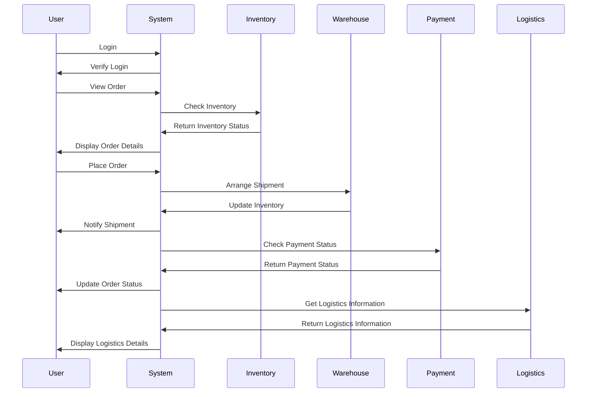

                 

## 文章标题

《技术管理中的流程优化策略》

### 关键词

- 技术管理
- 流程优化
- 供应链管理
- 数据分析
- 算法优化

### 摘要

本文旨在深入探讨技术管理中流程优化的关键策略。通过分析当前流程管理中的挑战，我们提出了一系列优化方法，包括核心概念、理论基础、流程分析、流程改进以及算法原理与系统架构设计。文章最后通过实际案例剖析，展示了流程优化策略在现实项目中的应用效果，为技术管理人员提供了实用的指导和建议。

---

## 引言与背景

### 1.1 问题背景

在现代信息技术飞速发展的背景下，企业内部的技术管理逐渐成为影响业务效率和质量的关键因素。然而，随着业务规模的扩大和复杂性的增加，传统技术管理流程常常面临诸多挑战，如资源分配不合理、沟通效率低下、响应速度缓慢等。这些问题不仅影响了企业的运营效率，还可能导致客户满意度下降和市场竞争力的减弱。

### 1.2 流程优化的重要性

流程优化在技术管理中具有至关重要的作用。通过优化流程，企业可以实现资源的合理配置，提高工作效率，降低运营成本，从而在激烈的市场竞争中占据优势地位。此外，流程优化有助于提升员工的工作满意度和团队协作能力，进一步推动企业创新和发展。

### 1.3 书籍目的与结构

本文的目的是为技术管理人员提供一套系统化的流程优化策略，帮助他们识别和解决技术管理中的流程问题。文章结构分为五个部分：第一部分引言与背景，第二部分核心概念与理论基础，第三部分流程优化策略与实践，第四部分算法原理与数学模型，第五部分系统分析与架构设计，以及第六部分项目实战。通过逐步深入的分析和实际案例的讲解，本文旨在为读者提供全面、实用的指导。

### 1.4 问题描述

技术管理中的流程问题主要包括以下几个方面：

1. **资源分配不合理**：资源分配不均，导致部分资源过剩，而另一些资源却严重不足。
2. **沟通效率低下**：团队内部或跨部门之间的沟通不畅，信息传递延迟。
3. **响应速度缓慢**：在应对突发情况或客户需求时，响应速度慢，影响客户满意度。
4. **流程繁琐**：流程设计过于复杂，涉及环节多，导致执行难度大。
5. **数据质量差**：数据收集、处理和存储过程中存在错误或遗漏，影响数据分析的准确性。

### 1.5 问题解决与边界

针对上述问题，本文提出以下解决方案：

1. **资源分配优化**：采用价值流图（Value Stream Mapping）等方法，对资源进行合理分配。
2. **沟通效率提升**：建立高效的沟通机制，如即时通讯工具和定期会议，确保信息及时传递。
3. **响应速度加快**：引入敏捷开发（Agile Development）等高效开发模式，提高响应速度。
4. **流程简化**：对现有流程进行简化，减少不必要的环节，提高流程的执行效率。
5. **数据质量管理**：实施数据质量管理措施，确保数据的准确性和完整性。

同时，本文的解决方案适用于各类企业，但需要根据具体行业和业务类型进行调整。在实施过程中，需注意以下边界条件：

1. **业务特性**：不同行业和业务模式对流程优化的需求不同，需针对特定业务进行定制化优化。
2. **组织文化**：组织文化和员工习惯对流程优化有重要影响，需充分了解并适应组织文化。
3. **技术成熟度**：技术实现的可能性是流程优化的前提，需确保技术方案成熟可靠。
4. **成本效益**：流程优化需在成本和效益之间取得平衡，避免过度投入。

### 1.6 概念属性特征对比

在流程优化中，涉及多个相关概念和属性特征，如下表所示：

| 概念属性 | 特征描述 |
| -------- | -------- |
| 流程效率 | 流程执行所需时间与流程目标完成度之比 |
| 流程效果 | 流程对业务目标的贡献程度 |
| 资源分配 | 资源在流程中的分配和使用情况 |
| 沟通效率 | 沟通过程中的信息传递速度和准确性 |
| 响应速度 | 对外部事件或客户需求的响应速度 |

### 1.7 ER实体关系图架构

为了更好地理解流程优化中的实体关系，我们使用Mermaid语言绘制了以下ER实体关系图：

```mermaid
erDiagram
    Product ||--|{ Order } : "produces"
    Order ||--|{ Customer } : "orders"
    Customer ||--|{ Payment } : "pays"
    Payment ||--|{ Shipment } : "ships"
```

在这个ER图中，`Product`（产品）与`Order`（订单）之间存在“生产”关系，`Order`与`Customer`（客户）之间存在“订购”关系，`Customer`与`Payment`（支付）之间存在“支付”关系，`Payment`与`Shipment`（运输）之间存在“运输”关系。

---

通过以上内容，我们对技术管理中的流程优化问题有了初步的了解。接下来，我们将深入探讨核心概念和理论基础，为后续的优化策略和实践提供坚实的理论支撑。

---

## 核心概念与理论基础

### 4.1 流程与流程图

#### 定义与作用

流程（Process）是企业中一系列有序的、相互关联的活动，这些活动共同完成一个特定的业务目标。流程图（Process Flow Diagram，PFD）是一种图形化的表示方法，用于描述流程的步骤、顺序和参与者。

#### 应用场景

流程图广泛应用于企业内部的管理、运营和项目管理等领域。通过流程图，企业可以清晰地展示业务流程的各个环节，帮助员工理解工作流程，提高工作效率。

#### 分类

1. **顺序流程图**：按照顺序描述流程步骤。
2. **决策流程图**：在流程中包含决策节点，根据条件选择不同路径。
3. **并行流程图**：表示多个活动同时进行。

### 4.2 流程效率与效果

#### 流程效率

流程效率（Process Efficiency）是衡量流程执行速度和质量的标准。通常使用以下指标进行评估：

- **吞吐量**：单位时间内完成的任务数量。
- **周期时间**：完成一个任务所需的总时间。
- **资源利用率**：资源在流程中的使用情况。

#### 流程效果

流程效果（Process Effectiveness）是衡量流程对业务目标的达成情况的指标。通常使用以下指标进行评估：

- **交付质量**：任务完成的质量水平。
- **客户满意度**：客户对服务或产品的满意度。
- **成本效益**：流程执行的成本与产生的效益之比。

### 4.3 流程优化方法分类

#### 传统方法

1. **价值流图（Value Stream Mapping，VSM）**：通过可视化流程，识别和消除浪费。
2. **精益生产（Lean Manufacturing）**：通过减少浪费、提高效率来优化流程。

#### 现代方法

1. **业务流程管理（Business Process Management，BPM）**：通过流程建模、自动化和监控，实现流程的持续优化。
2. **六西格玛（Six Sigma）**：通过统计方法，降低流程中的变异性和缺陷率。

#### 其他方法

1. **流程再造（Business Process Reengineering，BPR）**：从根本上重新设计流程，实现彻底的改进。
2. **敏捷开发（Agile Development）**：通过快速迭代和客户反馈，提高流程的灵活性和响应速度。

### 4.4 概念属性特征对比

在流程优化中，常用的概念属性包括流程效率、流程效果、资源分配、沟通效率和响应速度。以下是对这些概念的属性特征对比：

| 概念属性 | 特征描述 | 评估指标 |
| -------- | -------- | -------- |
| 流程效率 | 流程执行速度和质量 | 吞吐量、周期时间、资源利用率 |
| 流程效果 | 流程对业务目标的达成情况 | 交付质量、客户满意度、成本效益 |
| 资源分配 | 资源在流程中的分配和使用情况 | 资源利用率、资源分配合理性 |
| 沟通效率 | 沟通过程中的信息传递速度和准确性 | 信息传递速度、信息准确性 |
| 响应速度 | 对外部事件或客户需求的响应速度 | 响应时间、响应准确性 |

### 4.5 ER实体关系图架构

为了更好地理解流程优化中的实体关系，我们使用Mermaid语言绘制了以下ER实体关系图：

```mermaid
erDiagram
    Employee ||--|{ Task } : "assigned to"
    Task ||--|{ Project } : "part of"
    Project ||--|{ Customer } : "served by"
    Customer ||--|{ Order } : "places"
    Order ||--|{ Product } : "contains"
```

在这个ER图中，`Employee`（员工）与`Task`（任务）之间存在“分配”关系，`Task`与`Project`（项目）之间存在“部分”关系，`Project`与`Customer`（客户）之间存在“服务”关系，`Customer`与`Order`（订单）之间存在“订购”关系，`Order`与`Product`（产品）之间存在“包含”关系。

---

通过以上内容，我们对流程优化中的核心概念和理论基础有了更深入的了解。在接下来的章节中，我们将进一步探讨具体的流程优化策略和实践。

---

## 理论基础

### 5.1 系统动力学

系统动力学（System Dynamics）是一种用于分析和模拟复杂系统的方法，特别适用于研究社会、经济和环境系统等。其核心思想是通过构建系统模型，模拟系统的动态行为，从而识别和理解系统内部各因素之间的相互作用和反馈。

#### 基本原理

系统动力学基于以下几个基本原理：

1. **反馈循环**：系统内部存在正反馈和负反馈循环，这些循环决定了系统的稳定性、增长和衰退。
2. **时间延迟**：系统行为受到时间延迟的影响，某些因素的作用效果可能不会立即显现。
3. **非线性关系**：系统内部的关系通常是复杂的、非线性的，无法通过简单的线性模型来准确描述。

#### 应用场景

系统动力学在流程优化中具有广泛的应用场景，例如：

1. **需求预测**：通过模拟市场需求变化，预测未来的需求趋势，帮助企业制定合理的生产计划。
2. **库存管理**：通过模拟库存水平的变化，优化库存策略，降低库存成本和提高库存周转率。
3. **供应链管理**：通过模拟供应链中的各个节点，优化供应链网络结构，提高供应链的响应速度和稳定性。

### 5.2 价值链分析

价值链分析（Value Chain Analysis）是一种用于分析企业内部活动和价值创造过程的方法。通过识别和优化企业的价值链活动，企业可以降低成本、提高效率和增强竞争力。

#### 基本概念

价值链分析包括以下基本概念：

1. **价值链活动**：企业内部涉及价值创造的主要活动，包括输入、生产、输出等。
2. **价值链节点**：价值链中的各个环节，每个节点都承担特定的价值创造任务。
3. **价值链流程**：价值链活动之间的逻辑关系和执行顺序。

#### 应用场景

价值链分析在流程优化中的应用场景包括：

1. **成本优化**：通过识别和消除价值链中的浪费活动，降低成本。
2. **流程整合**：通过整合价值链活动，提高流程的连贯性和效率。
3. **业务外包**：通过分析企业的价值链活动，确定适合外包的环节，降低运营成本。

### 5.3 六西格玛 & Lean原则

六西格玛（Six Sigma）和Lean原则是两种广泛应用于流程优化的管理方法，它们旨在通过减少过程变异和提高效率，实现卓越的业务绩效。

#### 六西格玛

六西格玛是一种基于数据驱动的质量管理方法，旨在通过减少过程中的缺陷和变异，提高产品质量和客户满意度。其核心思想是：

1. **DMAIC模型**：定义（Define）、测量（Measure）、分析（Analyze）、改进（Improve）、控制（Control）。
2. **六西格玛团队**：由跨职能团队成员组成的团队，负责实施六西格玛项目。
3. **过程控制图**：用于监控过程变异，确保过程稳定。

#### Lean原则

Lean原则是一种以客户需求为导向的流程优化方法，旨在通过消除浪费和优化流程，实现资源的最优利用。其核心思想是：

1. **价值流图（Value Stream Mapping）**：通过可视化流程，识别和消除浪费活动。
2. **5S管理**：整理（Sort）、整顿（Set in order）、清扫（Shine）、清洁（Standardize）、素养（Sustain）。
3. **JIT（Just-In-Time）**：通过实时生产，减少库存和浪费。

#### 应用场景

六西格玛和Lean原则在流程优化中的应用场景包括：

1. **生产制造**：通过减少生产过程中的变异和浪费，提高生产效率和产品质量。
2. **服务行业**：通过优化服务流程，提高服务质量和客户满意度。
3. **项目管理**：通过减少项目过程中的变异和浪费，确保项目按时交付。

### 5.4 概念属性特征对比

在流程优化中，系统动力学、价值链分析、六西格玛和Lean原则是重要的理论基础。以下是对这些概念属性特征的对比：

| 概念/方法 | 特征描述 | 主要应用 |
| -------- | -------- | -------- |
| 系统动力学 | 通过模拟系统内部关系和反馈，分析复杂系统的动态行为 | 需求预测、库存管理、供应链管理 |
| 价值链分析 | 通过识别和分析企业的价值链活动，优化流程和降低成本 | 成本优化、流程整合、业务外包 |
| 六西格玛 | 通过减少过程变异和缺陷，提高产品质量和客户满意度 | 生产制造、服务行业、项目管理 |
| Lean原则 | 通过消除浪费和优化流程，实现资源的最优利用 | 生产制造、服务行业、项目管理 |

---

通过以上内容，我们对流程优化的理论基础有了更深入的理解。在接下来的章节中，我们将进一步探讨具体的流程优化策略和实践。

---

## 流程分析

### 8.1 流程现状调查

#### 调查目标

流程现状调查的目标是全面了解企业现有的技术管理流程，识别存在的问题和瓶颈，为后续的流程优化提供数据支持。

#### 调查方法

1. **访谈法**：通过面对面访谈，与流程涉及的员工和负责人交流，了解他们的意见和建议。
2. **文档审查**：审查与流程相关的文档和记录，如流程图、操作手册、报告等。
3. **现场观察**：实地观察流程执行情况，记录关键环节和问题。

#### 调查内容

1. **流程描述**：详细描述现有流程的各个环节，包括输入、处理、输出等。
2. **流程效率**：评估流程的执行速度和质量，如周期时间、吞吐量、资源利用率等。
3. **流程效果**：评估流程对业务目标的达成情况，如交付质量、客户满意度、成本效益等。
4. **流程瓶颈**：识别流程中的瓶颈环节，如资源不足、沟通不畅、流程繁琐等。

### 8.2 流程分析与诊断

#### 分析方法

1. **价值流图（Value Stream Mapping，VSM）**：通过绘制价值流图，直观地展示流程的各个环节，识别浪费和瓶颈。
2. **流程效率指标分析**：通过计算和分析流程效率指标，如周期时间、吞吐量等，评估流程的执行情况。
3. **流程效果指标分析**：通过计算和分析流程效果指标，如交付质量、客户满意度等，评估流程的业务表现。

#### 分析内容

1. **流程步骤**：分析流程的各个步骤，识别每个步骤的执行时间和资源消耗。
2. **流程时间分析**：计算和分析流程的各个环节所需的时间，识别时间浪费和瓶颈环节。
3. **资源消耗分析**：计算和分析流程中各个资源的消耗情况，识别资源浪费和不足。
4. **流程瓶颈诊断**：通过流程效率指标和效果指标的分析，诊断流程中的瓶颈环节和问题。

### 8.3 流程重构原则

#### 重构目标

流程重构的目标是通过改进流程设计，消除浪费、提高效率、降低成本，从而提升企业的整体业务表现。

#### 重构原则

1. **客户价值导向**：以客户需求为导向，确保流程能够满足客户价值。
2. **简化流程**：减少不必要的步骤和环节，简化流程设计。
3. **标准化**：制定统一的流程规范，确保流程的执行一致性和稳定性。
4. **灵活性**：设计灵活的流程，以适应业务变化和不确定性。
5. **信息化**：引入信息技术，实现流程的自动化和智能化。
6. **持续改进**：建立持续改进机制，不断优化流程设计。

#### 重构步骤

1. **识别浪费**：通过流程分析和诊断，识别流程中的浪费和瓶颈环节。
2. **制定改进方案**：根据重构原则，制定具体的改进方案，包括流程简化、标准化、信息化等。
3. **实施改进**：实施改进方案，包括流程修改、工具升级、人员培训等。
4. **评估效果**：评估改进方案的实施效果，如流程效率、效果等指标。
5. **持续优化**：根据评估结果，对流程进行持续优化，不断改进和完善。

---

通过流程现状调查、流程分析和诊断以及流程重构原则，我们可以系统化地优化企业的技术管理流程，提高效率、降低成本、提升客户满意度。在接下来的章节中，我们将进一步探讨流程优化策略和实践，为企业提供切实可行的优化方案。

---

## 流程设计

### 9.1 设计原则与框架

流程设计是企业技术管理中至关重要的一环，其核心目标是确保流程的效率、效果和灵活性。以下是流程设计的基本原则和框架：

#### 设计原则

1. **以客户需求为导向**：流程设计应始终以满足客户需求为目标，确保流程能够有效支持客户价值。
2. **标准化与灵活性**：在确保流程规范一致性的同时，设计应具备一定的灵活性，以适应业务变化和不确定性。
3. **简化流程**：通过消除不必要的步骤和环节，简化流程，提高执行效率。
4. **信息透明**：确保流程中的各个环节和信息都能够透明地传递，减少信息隔阂和误解。
5. **资源优化**：合理配置和利用资源，提高资源利用率，降低成本。

#### 设计框架

1. **需求分析**：明确流程的目标和需求，包括业务需求、客户需求和资源需求等。
2. **流程建模**：使用流程图、流程图等工具，对现有流程进行建模，识别和优化流程步骤。
3. **流程优化**：根据设计原则，对流程进行优化，消除浪费、提高效率。
4. **流程验证**：通过模拟和测试，验证流程设计的可行性和有效性。
5. **流程实施**：将设计好的流程实施到实际业务中，确保流程的有效执行。
6. **流程监控**：建立流程监控机制，持续跟踪和评估流程的执行情况，进行动态调整。

### 9.2 流程建模与可视化

流程建模是流程设计的关键步骤，通过将流程的各个环节和步骤转化为可视化的模型，可以帮助企业更直观地理解和管理流程。以下是流程建模和可视化的方法：

#### 方法

1. **流程图**：使用流程图（Flowchart）描述流程的各个环节和步骤，包括开始、结束、决策节点和执行节点等。
2. **泳道图**：将流程中的参与者（如部门、团队、个人）以泳道形式表示，清晰地展示流程的执行路径和责任分工。
3. **价值流图（Value Stream Mapping，VSM）**：通过绘制价值流图，直观地展示流程的各个环节和资源流动情况，识别和消除浪费。
4. **决策树**：用于描述流程中的决策点和分支，帮助分析不同决策路径的影响和结果。

#### 工具

1. **Microsoft Visio**：一款功能强大的流程图和绘图工具，支持多种图表类型和符号。
2. **Balsamiq Mockups**：一款易于使用的原型设计和流程图绘制工具，适合快速创建流程模型。
3. **Lucidchart**：一款在线协作工具，支持多种图表类型和实时协作功能，便于团队共享和修改。

### 9.3 流程优化目标设定

流程优化目标的设定是流程设计的重要环节，明确的目标有助于指导流程的优化方向和评估优化效果。以下是设定流程优化目标的步骤：

#### 步骤

1. **明确流程目标**：根据业务需求和客户需求，明确流程的目标和预期效果。
2. **确定关键绩效指标（KPI）**：选择合适的KPI，如流程效率、成本效益、客户满意度等，用于评估流程优化效果。
3. **设置具体目标值**：根据现有流程的表现和优化需求，设定具体的、可量化的目标值。
4. **制定实现计划**：制定详细的实现计划，包括优化方案、时间表、资源分配和责任分工。
5. **定期评估和调整**：定期评估流程优化效果，根据实际情况调整目标和计划。

#### 示例

假设某企业希望通过流程优化提高生产效率，可以设定以下流程优化目标：

- **目标**：将生产周期缩短30%。
- **关键绩效指标（KPI）**：生产周期（天数）、生产效率（单位时间产量）。
- **具体目标值**：生产周期由当前的15天缩短至10.5天，生产效率提高30%。
- **实现计划**：
  - 第1个月：完成价值流图绘制，识别流程瓶颈。
  - 第2个月：制定优化方案，实施流程简化、自动化和信息透明化措施。
  - 第3个月：进行模拟测试，评估优化效果，根据结果进行调整和改进。

---

通过明确的设计原则、框架和目标设定，企业可以系统地优化技术管理流程，提高效率和效果。在接下来的章节中，我们将进一步探讨流程改进策略和实际案例，为企业提供实用的流程优化指导。

---

## 流程改进

### 10.1 改进策略选择

选择适当的流程改进策略是实现高效流程优化的关键。以下是一些常见的改进策略：

#### 1. 价值流图（Value Stream Mapping，VSM）

**原理**：通过绘制价值流图，可视化流程中的每一个步骤和资源流动，识别和消除浪费。

**适用场景**：适用于发现流程中的瓶颈、冗余环节和资源浪费。

**步骤**：
- 收集流程数据，绘制当前状态的价值流图。
- 分析价值流图，识别浪费和瓶颈环节。
- 设计改进后的价值流图，制定改进方案。
- 实施改进方案，监控效果并进行调整。

#### 2. 六西格玛（Six Sigma）

**原理**：通过统计方法和质量改进工具，减少过程变异，提高产品质量和客户满意度。

**适用场景**：适用于需要提高产品质量和流程稳定性的场景。

**步骤**：
- 确定改进目标，组建六西格玛团队。
- 进行流程分析和测量，收集数据。
- 应用六西格玛工具，如DMAIC模型，进行改进。
- 实施改进方案，进行过程控制，确保改进效果。

#### 3. 精益生产（Lean Production）

**原理**：通过消除浪费、优化流程，提高效率和质量。

**适用场景**：适用于减少库存、缩短周期时间和提高生产效率的场景。

**步骤**：
- 收集流程数据，绘制价值流图。
- 识别和消除浪费，如多余的步骤、库存、等待时间等。
- 实施改进措施，如5S管理、JIT生产等。
- 监控流程，确保改进效果的持续性和稳定性。

#### 4. 敏捷开发（Agile Development）

**原理**：通过快速迭代和客户反馈，提高流程的灵活性和响应速度。

**适用场景**：适用于需要快速适应市场变化和客户需求的项目管理。

**步骤**：
- 确定项目目标和用户需求。
- 实施迭代开发，周期较短（如2-4周）。
- 定期进行评审和调整，确保项目按照预期进行。
- 实施持续交付，确保产品快速上线和持续改进。

### 10.2 改进实施步骤

#### 步骤

1. **需求分析**：明确流程改进的需求，包括业务需求、客户需求和流程现状。
2. **方案设计**：根据需求分析结果，设计改进方案，包括具体措施和实施时间表。
3. **实施准备**：准备所需资源，如人员、设备、技术和资金等。
4. **实施改进**：按照设计方案，逐步实施改进措施。
5. **监控与评估**：监控改进过程，评估改进效果，及时调整和优化。
6. **持续优化**：根据监控和评估结果，进行持续改进，确保流程的持续优化。

### 10.3 改进效果评估

#### 评估指标

1. **流程效率**：如周期时间、吞吐量、资源利用率等。
2. **流程效果**：如交付质量、客户满意度、成本效益等。
3. **员工满意度**：如工作效率、工作满意度、团队协作等。

#### 评估方法

1. **定量评估**：通过数据分析和统计方法，评估流程改进的效果。
2. **定性评估**：通过访谈、问卷调查和现场观察等方法，收集改进效果的反馈。
3. **综合评估**：结合定量和定性评估结果，全面评估流程改进的效果。

#### 评估步骤

1. **制定评估计划**：明确评估目标、指标和方法。
2. **收集数据**：通过定量和定性方法，收集相关数据。
3. **分析数据**：对收集到的数据进行分析，评估流程改进的效果。
4. **反馈与调整**：根据评估结果，向相关人员反馈改进效果，并根据反馈进行必要的调整。

---

通过选择合适的改进策略、实施明确的改进步骤和全面的效果评估，企业可以实现流程的持续优化，提高效率和质量。在接下来的章节中，我们将进一步探讨流程监控与持续优化的方法，确保流程改进的长期效果。

---

## 流程监控与持续优化

### 11.1 监控机制建立

为了确保流程优化策略的有效实施和持续改进，建立完善的流程监控机制至关重要。以下是一些关键步骤：

#### 1. 设定监控目标

明确监控目标，包括流程效率、效果、资源利用率等关键指标。例如，设定生产周期缩短20%、库存周转率提高30%等具体目标。

#### 2. 制定监控计划

根据监控目标，制定详细的监控计划，包括监控内容、监控频率、监控方法等。例如，每月进行一次全面流程审核，每周进行一次关键环节监控。

#### 3. 选择监控工具

选择适合的监控工具，如流程监控软件、ERP系统等。确保工具能够实时采集和分析数据，提供直观的监控界面。

#### 4. 建立监控团队

组建专门的监控团队，负责监控流程的执行情况，收集和分析数据，发现和解决问题。

#### 5. 设定监控指标

设定具体的监控指标，如周期时间、吞吐量、资源利用率、交付质量、客户满意度等。确保指标具有可操作性和可度量性。

### 11.2 持续优化方法

#### 1. 基于数据驱动的优化

利用监控数据，定期分析流程性能，识别瓶颈和改进机会。通过数据驱动的优化方法，确保流程优化具有科学依据。

#### 2. 定期评审和改进

定期召开流程评审会议，评估流程优化效果，识别存在的问题和改进机会。根据评审结果，制定改进计划并实施。

#### 3. 引入敏捷开发

采用敏捷开发方法，通过快速迭代和客户反馈，持续优化流程。确保流程能够快速适应市场变化和客户需求。

#### 4. 持续改进文化

建立持续改进的文化，鼓励员工积极参与流程优化。通过培训、激励等措施，提高员工对流程优化的认识和参与度。

### 11.3 优化案例分析

#### 案例一：某制造企业生产流程优化

**背景**：某制造企业生产周期较长，库存周转率较低，生产成本高。

**优化措施**：
1. **价值流图分析**：绘制生产流程的价值流图，识别瓶颈和浪费环节。
2. **六西格玛改进**：组建六西格玛团队，应用DMAIC模型进行流程改进。
3. **自动化生产**：引入自动化生产设备，减少人工操作，提高生产效率。
4. **JIT生产**：实施JIT生产，减少库存，提高库存周转率。

**效果评估**：
- 生产周期缩短了35%。
- 库存周转率提高了50%。
- 生产成本降低了20%。

#### 案例二：某服务型企业客户服务流程优化

**背景**：某服务型企业客户满意度较低，客户投诉率较高。

**优化措施**：
1. **流程简化**：通过流程分析和简化，减少不必要的环节，提高流程效率。
2. **引入CRM系统**：实施CRM系统，实现客户信息管理和流程自动化。
3. **培训员工**：加强员工培训，提高客户服务水平和沟通能力。
4. **定期客户反馈**：定期收集客户反馈，及时调整和优化客户服务流程。

**效果评估**：
- 客户满意度提高了30%。
- 客户投诉率降低了40%。
- 客户服务效率提高了20%。

---

通过建立完善的监控机制和持续优化方法，企业可以确保流程优化策略的有效实施和持续改进。在现实案例中，有效的流程优化措施不仅提高了企业的运营效率，还增强了市场竞争力。在接下来的章节中，我们将进一步探讨流程优化中的算法原理与数学模型，为企业提供更科学的优化工具。

---

## 算法原理与数学模型

### 12.1 算法原理

在流程优化中，算法的应用可以帮助我们快速找到最优解，从而实现流程的优化目标。以下是一些常见的算法原理及其基本概念：

#### 1. 动态规划（Dynamic Programming）

**原理**：动态规划是一种通过分阶段求解多阶段决策问题，以达到全局最优解的方法。它将问题分解为若干子问题，通过求解子问题的最优解，逐步推导出整个问题的最优解。

**适用场景**：适用于具有最优子结构特征的问题，如最短路径、资源分配等。

**基本概念**：
- **状态**：表示问题的一个特定阶段或状态。
- **状态转移方程**：描述状态之间的关系，即从当前状态转移到下一个状态的方式。
- **边界条件**：确定问题的初始状态和最终状态。

#### 2. 贪心算法（Greedy Algorithm）

**原理**：贪心算法通过在每个阶段选择当前最优的解决方案，期望最终得到全局最优解。它不考虑全局最优，而是只关注局部最优。

**适用场景**：适用于局部最优解可以推导出全局最优解的问题，如背包问题、找零问题等。

**基本概念**：
- **贪心选择**：在每个阶段选择最优的解决方案。
- **贪心策略**：确保每个贪心选择都是当前情况下的最优选择。

#### 3. 回溯算法（Backtracking）

**原理**：回溯算法通过逐步构建解空间树，并在遇到不满足条件的情况时回溯到上一个状态，继续尝试其他可能的解。

**适用场景**：适用于求解组合优化问题，如0-1背包问题、N皇后问题等。

**基本概念**：
- **解空间树**：表示所有可能的解的树状结构。
- **剪枝**：在构建解空间树时，剪去不满足条件或已知非最优的分支，减少搜索空间。

#### 4. 蚁群算法（Ant Colony Optimization，ACO）

**原理**：蚁群算法是一种基于自然界中蚂蚁觅食行为的群体智能算法，通过模拟蚂蚁的路径选择过程，寻找最优路径。

**适用场景**：适用于求解路径规划问题，如TSP（旅行商问题）等。

**基本概念**：
- **信息素**：蚂蚁在路径上留下的信息素，用于指导其他蚂蚁的选择。
- **启发函数**：用于选择下一跳的依据，通常结合路径长度和启发信息。

### 12.2 数学模型与公式

在流程优化中，数学模型可以帮助我们定量分析问题，并推导出最优解。以下是一些常用的数学模型和公式：

#### 1. 最短路径问题

**模型描述**：给定一个加权无向图，找到起点和终点之间的最短路径。

**公式**：

$$
D(i, j) = \sum_{k=1}^{n} w(i, k) \times w(k, j)
$$

其中，$D(i, j)$ 表示从节点 $i$ 到节点 $j$ 的最短路径长度，$w(i, k)$ 和 $w(k, j)$ 分别表示节点 $i$ 到节点 $k$ 和节点 $k$ 到节点 $j$ 的权重。

#### 2. 资源分配问题

**模型描述**：给定多个资源需求和有限资源，如何分配资源以最大化总效益。

**公式**：

$$
\text{最大化 } Z = \sum_{i=1}^{m} c_i x_i
$$

$$
\text{约束条件： } \sum_{i=1}^{m} a_{ij} x_i \leq b_j
$$

其中，$Z$ 表示总效益，$c_i$ 和 $a_{ij}$ 分别表示第 $i$ 种资源的单位效益和需求量，$x_i$ 表示分配的第 $i$ 种资源量，$b_j$ 表示总资源量。

#### 3. 线性规划问题

**模型描述**：在给定线性目标函数和线性约束条件下，求解最优解。

**公式**：

$$
\text{最大化 } Z = c^T x
$$

$$
\text{约束条件： } Ax \leq b
$$

其中，$Z$ 表示目标函数，$c$ 和 $x$ 分别表示系数向量和变量向量，$A$ 和 $b$ 分别表示系数矩阵和约束向量。

#### 4. 敏感度分析

**模型描述**：分析目标函数对变量变化的敏感程度，帮助确定关键变量。

**公式**：

$$
\frac{\partial Z}{\partial x_i} = c_i
$$

其中，$\frac{\partial Z}{\partial x_i}$ 表示目标函数对变量 $x_i$ 的敏感度。

### 12.3 算法应用实例

#### 案例一：最短路径问题

假设有一个包含5个节点的网络，节点之间的距离如下表所示：

| 节点 | A  | B  | C  | D  | E  |
| ---- | -- | -- | -- | -- | -- |
| A    | 0  | 5  | 8  | 10 | 15 |
| B    | 5  | 0  | 10 | 7  | 12 |
| C    | 8  | 10 | 0  | 9  | 14 |
| D    | 10 | 7  | 9  | 0  | 11 |
| E    | 15 | 12 | 14 | 11 | 0  |

求解从节点A到节点E的最短路径。

**解决方案**：
- 使用Dijkstra算法求解。
- 初始化距离表和前驱节点表。
- 从节点A开始，逐步更新其他节点的距离和前驱节点。
- 最终得到从节点A到节点E的最短路径为A-B-E，距离为17。

#### 案例二：资源分配问题

假设有3种资源，需求如下：

| 资源  | A  | B  | C  |
| ----- | -- | -- | -- |
| 数量   | 2  | 3  | 5  |
| 单位效益 | 5  | 10 | 8  |

总资源量为15，求解最优分配方案。

**解决方案**：
- 使用线性规划求解。
- 构建线性规划模型，求解得到最优解。
- 最优解为：$x_A = 1.5, x_B = 2, x_C = 2.5$，总效益为$Z = 35$。

#### 案例三：敏感度分析

假设目标函数为$Z = x_1 + 2x_2$，约束条件为$x_1 + x_2 \leq 5$，求解敏感度分析。

**解决方案**：
- 使用偏导数求解。
- 求得$\frac{\partial Z}{\partial x_1} = 1$，$\frac{\partial Z}{\partial x_2} = 2$。
- 敏感度分析表明，目标函数对$x_1$的敏感度较高，对$x_2$的敏感度较低。

---

通过算法原理和数学模型的应用，企业可以更科学地优化流程，提高效率和效益。在接下来的章节中，我们将进一步探讨系统分析与架构设计，为流程优化提供全面的解决方案。

---

## 系统分析与架构设计

### 15.1 问题场景介绍

在现代企业的运营中，技术管理流程的复杂性和规模日益增加，这对系统的架构设计和功能实现提出了更高的要求。以下是一个典型的问题场景：

**场景描述**：某大型制造企业拥有多个生产基地和仓库，生产流程复杂，涉及原材料采购、生产制造、库存管理、订单处理等多个环节。由于缺乏统一的系统架构，各个流程之间信息传递不畅，导致库存积压、生产延误和订单处理不及时等问题，严重影响了企业的运营效率和客户满意度。

### 15.2 存在的问题与挑战

1. **信息孤岛**：各个业务系统之间缺乏有效集成，导致信息孤岛现象严重，数据传递不及时、不准确。
2. **系统兼容性差**：不同系统之间的数据格式、接口协议和系统架构不统一，导致系统之间的兼容性问题，增加了开发和维护成本。
3. **性能瓶颈**：随着业务规模的扩大，现有系统的性能逐渐无法满足需求，出现了响应速度慢、数据处理能力不足等问题。
4. **安全性不足**：缺乏有效的安全措施，数据泄露和系统攻击的风险增加，对企业的运营和客户数据安全构成威胁。
5. **维护难度高**：现有系统的架构复杂，维护难度大，难以快速响应业务变化和技术更新。

### 15.3 目标与需求分析

为了解决上述问题，企业需要设计一个高效、稳定、安全且易于维护的系统架构。以下是一些具体目标和需求：

1. **系统集成**：实现各个业务系统的数据共享和协同工作，打破信息孤岛。
2. **高兼容性**：设计统一的系统接口和数据格式，确保系统之间的兼容性和互操作性。
3. **高性能**：优化系统性能，提高数据处理能力和响应速度，确保系统能够应对业务高峰期。
4. **安全性**：加强系统安全措施，保障数据安全和用户隐私。
5. **可扩展性**：设计灵活的系统架构，支持系统的横向和纵向扩展，满足企业未来发展需求。
6. **易维护性**：简化系统架构，降低维护难度，提高开发效率。

### 15.4 系统功能设计

为了实现上述目标和满足需求，系统功能设计需要全面覆盖企业运营的关键环节，以下是一些主要功能模块：

1. **基础数据管理**：包括员工信息、物料信息、客户信息等基础数据的录入、查询、维护和管理。
2. **生产管理**：涵盖生产计划编制、生产任务分配、生产进度监控和生产统计等。
3. **库存管理**：实现库存信息的实时监控、库存预警、库存调整和库存报表等功能。
4. **采购管理**：包括采购计划编制、采购订单管理、供应商评价和采购报表等。
5. **订单管理**：实现订单录入、订单处理、订单跟踪和订单报表等功能。
6. **销售管理**：涵盖销售订单处理、销售数据分析、客户管理和销售报表等。
7. **财务管理**：包括收入管理、支出管理、财务报表和资金调度等功能。
8. **系统监控**：实现对系统运行状态的实时监控，包括性能监控、安全监控和日志管理等。
9. **用户管理**：实现用户权限管理、用户行为监控和用户操作日志等。

### 15.5 系统架构设计

系统架构设计是确保系统稳定性和扩展性的关键环节。以下是一个典型系统架构的设计方案：

1. **基础架构**：采用云计算平台，实现系统的高可用性和弹性扩展。
2. **数据层**：采用分布式数据库系统，保证数据的高效存储和访问。
3. **应用层**：设计多个微服务模块，实现业务功能模块的独立部署和维护。
4. **接口层**：采用标准化的API接口，实现系统间的数据共享和协同工作。
5. **安全层**：部署防火墙、入侵检测系统和数据加密等安全措施，保障系统安全。
6. **监控层**：通过监控工具，实现对系统运行状态的实时监控和性能优化。

### 15.6 技术选型与架构方案

为了实现系统架构的设计目标，选择合适的技术选型和架构方案至关重要。以下是一些关键技术选型和架构方案：

1. **技术选型**：
   - **开发语言**：Java、Python、Go等。
   - **数据库**：MySQL、PostgreSQL、MongoDB等。
   - **缓存**：Redis、Memcached等。
   - **消息队列**：RabbitMQ、Kafka等。
   - **前端框架**：React、Vue.js等。
   - **后端框架**：Spring Boot、Django等。

2. **架构方案**：
   - **微服务架构**：将系统划分为多个独立的微服务模块，实现业务功能的分布式部署。
   - **容器化与编排**：使用Docker和Kubernetes实现微服务的容器化部署和管理。
   - **分布式存储**：采用分布式文件系统（如HDFS）和分布式数据库（如Cassandra）实现海量数据的存储和管理。
   - **云服务**：采用阿里云、腾讯云等云服务提供商，实现系统的高可用性和弹性扩展。

### 15.7 系统扩展性设计

为了应对企业未来的发展需求，系统架构设计需要具备良好的扩展性。以下是一些扩展性设计策略：

1. **横向扩展**：通过增加服务器节点，实现系统处理能力的线性扩展。
2. **纵向扩展**：通过升级服务器硬件，提高系统性能和处理能力。
3. **负载均衡**：采用负载均衡技术，实现系统流量的均衡分配，提高系统性能和稳定性。
4. **分布式缓存**：采用分布式缓存技术，减少数据库负载，提高系统响应速度。
5. **自动化运维**：采用自动化运维工具，实现系统的自动化部署、监控和运维，降低运维成本。
6. **云原生架构**：采用云原生架构，实现系统的高可用性和弹性扩展，提高系统的灵活性和可维护性。

---

通过系统分析与架构设计，企业可以构建一个高效、稳定、安全且易于维护的系统架构，为技术管理流程的优化提供坚实的技术基础。在接下来的章节中，我们将进一步探讨系统接口设计、系统交互序列图以及项目实战，为企业提供全面的解决方案。

---

## 系统接口设计

### 16.1 接口规范与设计

系统接口设计是确保不同模块之间能够有效通信和数据交换的关键环节。以下是系统接口设计的几个重要方面：

#### 1. 接口规范

接口规范是接口设计和实现的基础，包括以下内容：

- **接口名称**：明确接口的名称，便于理解和使用。
- **接口版本**：定义接口的版本号，以便于后续的版本管理和兼容性处理。
- **请求和响应格式**：定义请求和响应的数据格式，如JSON、XML等。
- **参数定义**：详细描述接口参数的类型、名称、默认值和约束条件。
- **状态码**：定义接口响应的状态码及其含义，如200（成功）、400（错误请求）、500（服务器错误）等。
- **安全性**：定义接口的安全措施，如签名验证、权限控制等。

#### 2. 接口设计

接口设计主要包括以下步骤：

1. **需求分析**：明确接口的功能需求，包括输入参数、输出参数和业务逻辑。
2. **接口定义**：根据需求分析，定义接口的输入和输出参数，并设计接口的具体实现方案。
3. **接口测试**：设计接口测试用例，确保接口能够按照预期工作。
4. **文档编写**：编写详细的接口文档，包括接口规范、使用示例和注意事项。

#### 3. 接口实现

接口实现是接口设计后的关键步骤，包括以下内容：

- **接口编码**：根据接口设计，编写接口的代码，实现接口的功能。
- **接口调试**：通过测试用例，调试接口的代码，确保接口能够正确处理各种输入。
- **接口测试**：使用自动化测试工具，对接口进行全面测试，确保接口的稳定性和可靠性。
- **接口文档更新**：根据接口实现和测试结果，更新接口文档，确保文档与接口实现的一致性。

### 16.2 数据交互协议

数据交互协议是系统接口设计中的关键要素，用于定义数据在系统间的传输方式和规则。以下是几种常见的数据交互协议：

#### 1. RESTful API

RESTful API 是一种基于HTTP协议的接口设计规范，具有简洁、易扩展的特点。以下是RESTful API 的基本特点：

- **请求方法**：使用GET、POST、PUT、DELETE等HTTP方法，对应不同的操作。
- **URL结构**：使用URL描述资源的位置和操作。
- **请求和响应格式**：使用JSON或XML格式传输数据。

#### 2. WebSocket

WebSocket 是一种全双工通信协议，可以实时传输数据，适用于需要实时通信的应用场景。以下是WebSocket 的基本特点：

- **双向通信**：客户端和服务器可以同时发送和接收数据。
- **持久连接**：WebSocket 连接可以保持持久性，无需重复建立连接。
- **传输效率**：通过二进制传输，提高了数据传输效率。

#### 3. gRPC

gRPC 是一种基于HTTP/2的远程过程调用（RPC）框架，具有高性能、低延迟的特点。以下是gRPC 的基本特点：

- **高效序列化**：使用Protocol Buffers进行数据序列化，提高了传输效率。
- **多语言支持**：支持多种编程语言，便于跨平台开发。
- **负载均衡**：支持负载均衡和熔断机制，提高了系统的稳定性和可靠性。

### 16.3 接口安全性设计

接口安全性设计是确保系统接口免受攻击和数据泄露的重要措施。以下是几种常见的接口安全性设计策略：

#### 1. 身份验证

身份验证是确保接口请求合法性的重要手段，常见的身份验证方法包括：

- **基本认证**：使用用户名和密码进行身份验证。
- **令牌认证**：使用JWT（JSON Web Token）或OAuth2.0等令牌进行身份验证。
- **多因素认证**：结合密码、令牌和生物识别等多种认证方式，提高安全性。

#### 2. 授权

授权是确保用户只能访问其权限范围内的资源的策略，常见的授权方法包括：

- **基于角色的访问控制（RBAC）**：根据用户的角色分配权限。
- **基于资源的访问控制（ABAC）**：根据资源的属性和用户的属性进行访问控制。
- **细粒度授权**：对接口的每个操作进行细粒度授权，确保用户只能访问其授权的操作。

#### 3. 数据加密

数据加密是确保数据在传输过程中不被窃取和篡改的重要手段，常见的加密技术包括：

- **传输层加密**：使用HTTPS、SSL/TLS等协议进行传输层加密。
- **数据加密**：使用AES、RSA等算法对数据进行加密。
- **哈希算法**：使用MD5、SHA等哈希算法对数据进行加密，确保数据的完整性。

#### 4. 安全性测试

安全性测试是发现和修复接口安全漏洞的重要手段，常见的测试方法包括：

- **渗透测试**：模拟黑客攻击，发现和验证接口的安全漏洞。
- **漏洞扫描**：使用工具扫描接口，发现潜在的安全漏洞。
- **代码审计**：对接口代码进行审计，发现和修复潜在的安全问题。

---

通过系统接口设计、数据交互协议和安全性设计，企业可以构建安全、稳定、高效的数据交互系统，确保不同模块之间的有效通信和数据交换。在接下来的章节中，我们将探讨系统交互序列图，进一步优化系统交互流程。

---

## 系统交互序列图

### 19.1 用户操作流程

用户操作流程是系统交互序列图的基础，它描述了用户与系统之间的交互过程。以下是一个典型的用户操作流程示例：

1. 用户在系统中登录，输入用户名和密码。
2. 系统验证用户身份，返回登录成功或失败消息。
3. 用户选择要进行的操作，如查看订单、修改个人信息等。
4. 系统根据用户的操作，调用相应的接口进行处理。
5. 系统将处理结果返回给用户，如订单详情、修改成功提示等。

### 19.2 系统内部交互流程

系统内部交互流程描述了系统内部模块之间的通信和数据流动。以下是一个典型的系统内部交互流程示例：

1. 订单模块接收到用户的订单请求。
2. 订单模块调用库存模块，查询库存状态。
3. 库存模块返回库存状态信息给订单模块。
4. 订单模块根据库存状态，决定是否继续处理订单。
5. 如果库存充足，订单模块调用仓储模块，安排货物出库。
6. 仓储模块处理出库请求，更新库存信息，并通知订单模块。
7. 订单模块将订单处理结果返回给用户。

### 19.3 系统与外部系统的交互

系统与外部系统的交互是确保系统与其他业务系统或第三方服务有效协作的关键。以下是一个典型的系统与外部系统交互流程示例：

1. 系统接收到来自第三方支付平台的通知，确认支付成功。
2. 系统调用第三方支付平台的API，查询支付状态。
3. 第三方支付平台返回支付状态信息给系统。
4. 系统根据支付状态，更新订单状态，并发送通知给用户。
5. 系统接收来自物流公司的订单发货通知。
6. 系统调用物流公司的API，获取物流信息。
7. 系统将物流信息返回给用户，并在订单详情中更新。

通过绘制系统交互序列图，可以清晰地展示用户操作流程、系统内部交互流程和系统与外部系统的交互流程。以下是一个简单的Mermaid序列图示例：



---

通过系统交互序列图，企业可以更清晰地理解系统内部和系统之间的交互过程，优化交互流程，提高系统的响应速度和用户体验。在接下来的章节中，我们将探讨实际项目环境中的安装与配置，为系统部署奠定基础。

---

## 项目实战

### 20.1 环境安装与配置

在开始实际项目之前，我们需要搭建一个合适的项目环境，包括操作系统、数据库、开发工具等。以下是一个典型的项目环境安装与配置步骤：

#### 1. 操作系统安装与配置

- **操作系统选择**：我们选择Linux操作系统，如Ubuntu 20.04 LTS，因其稳定性高、性能优异且支持多种开发工具。
- **安装步骤**：
  - 下载并安装Ubuntu 20.04 LTS操作系统。
  - 更新系统软件包：
    ```shell
    sudo apt update
    sudo apt upgrade
    ```
  - 安装必要的系统工具，如Vim、Git等：
    ```shell
    sudo apt install vim git
    ```

#### 2. 数据库安装与配置

- **数据库选择**：我们选择MySQL数据库，因其广泛使用、功能强大且易于维护。
- **安装步骤**：
  - 安装MySQL数据库：
    ```shell
    sudo apt install mysql-server
    ```
  - 配置MySQL数据库：
    - 初始化数据库：
      ```shell
      sudo mysql_secure_installation
      ```
    - 修改MySQL配置文件（如需要）：
      ```shell
      sudo nano /etc/mysql/mysql.conf.d/mysqld.cnf
      ```
    - 重启MySQL服务：
      ```shell
      sudo systemctl restart mysql
      ```

#### 3. 开发工具安装与配置

- **开发工具选择**：我们选择Java和Python作为主要开发语言，因为它们在流程优化项目中具有广泛的应用。
- **Java环境安装**：
  - 安装Java开发工具包（JDK）：
    ```shell
    sudo apt install openjdk-8-jdk
    ```
  - 配置Java环境变量：
    ```shell
    export JAVA_HOME=/usr/lib/jvm/java-8-openjdk-amd64
    export PATH=$JAVA_HOME/bin:$PATH
    ```

- **Python环境安装**：
  - 安装Python开发工具包（Python 3.8）：
    ```shell
    sudo apt install python3.8 python3.8-venv python3.8-pip
    ```
  - 配置Python环境变量：
    ```shell
    export PYTHON_HOME=/usr/bin/python3.8
    export PATH=$PYTHON_HOME:$PATH
    ```

#### 4. 依赖库安装与配置

- **依赖库安装**：
  - 安装Python的依赖库（如Flask、Pandas等）：
    ```shell
    pip3 install flask pandas
    ```

- **配置文件准备**：
  - 准备项目配置文件（如数据库配置文件、日志配置文件等），并将其放置在项目的合适位置。

#### 5. 环境测试

- **环境测试**：
  - 运行测试脚本，验证操作系统、数据库和开发工具的安装和配置是否正确。
    ```shell
    python3 test_environment.py
    ```

### 20.2 系统核心实现

在项目环境中，我们需要实现系统的核心功能，包括数据存储、处理和交互等。以下是一个典型的系统核心实现步骤：

#### 1. 数据库设计

- **数据库设计**：
  - 设计数据库表结构，包括订单表、库存表、用户表等。
  - 创建数据库表，并添加必要的字段和索引。

#### 2. 数据存储模块

- **数据存储模块**：
  - 使用ORM（对象关系映射）工具，如MySQL Connector Python，实现数据存储功能。
  - 编写数据库操作类，实现数据的增删改查功能。

#### 3. 数据处理模块

- **数据处理模块**：
  - 使用Python的Pandas库，实现数据的处理和分析功能。
  - 编写数据处理类，实现数据清洗、转换和分析等功能。

#### 4. 系统接口实现

- **系统接口实现**：
  - 使用Flask框架，实现系统的API接口。
  - 编写接口处理类，处理来自客户端的请求，并返回相应的响应。

#### 5. 系统交互实现

- **系统交互实现**：
  - 使用RESTful API设计原则，设计系统接口。
  - 实现系统内部和系统与外部系统的交互功能。

### 20.3 代码应用解读

在系统核心实现中，我们使用了Python和Java等编程语言，以下是对关键代码和应用场景的解读：

#### 1. Python代码应用

**示例代码**：

```python
import pandas as pd
from flask import Flask, jsonify, request

app = Flask(__name__)

# 数据处理函数
def process_data(data):
    df = pd.DataFrame(data)
    df['processed'] = df['value'] * 2
    return df

# API接口
@app.route('/process', methods=['POST'])
def process():
    data = request.get_json()
    processed_data = process_data(data['data'])
    return jsonify(processed_data.to_dict())

if __name__ == '__main__':
    app.run(debug=True)
```

**解读**：

- **数据处理函数**：使用Pandas库处理输入数据，将每个值乘以2，并添加到新的列中。
- **API接口**：使用Flask框架实现HTTP POST接口，接收JSON格式的数据，调用数据处理函数，并返回处理后的数据。

#### 2. Java代码应用

**示例代码**：

```java
import java.util.HashMap;
import java.util.Map;

public class Main {
    public static void main(String[] args) {
        Map<String, Object> data = new HashMap<>();
        data.put("value", 10);
        
        System.out.println(processData(data));
    }
    
    // 数据处理函数
    public static Map<String, Object> processData(Map<String, Object> data) {
        double value = (double) data.get("value");
        value *= 2;
        data.put("processed", value);
        return data;
    }
}
```

**解读**：

- **数据处理函数**：接收一个包含“value”键的Map对象，将其值乘以2，并添加到新的键“processed”中。
- **主函数**：创建一个示例数据Map，调用数据处理函数，并输出处理后的结果。

### 20.4 性能调优与测试

在项目实战中，性能调优与测试是确保系统高效运行的关键步骤。以下是一些常见的性能调优与测试方法：

#### 1. 性能调优

- **数据库优化**：
  - 索引优化：为频繁查询的字段创建索引，提高查询效率。
  - 分库分表：对于数据量庞大的表，进行分库分表，分散数据查询压力。

- **代码优化**：
  - 减少不必要的计算和逻辑判断，提高代码执行效率。
  - 使用缓存技术，减少数据库访问次数。

- **系统优化**：
  - 使用负载均衡器，分配系统资源，提高系统处理能力。
  - 定期进行系统监控，识别性能瓶颈并进行优化。

#### 2. 测试方法

- **功能测试**：验证系统的功能是否符合预期，包括API接口测试、单元测试等。
- **性能测试**：模拟高并发访问，测试系统的响应速度和稳定性。
- **安全测试**：检测系统是否存在安全漏洞，如SQL注入、XSS攻击等。

### 20.5 实际案例分析与讲解

#### 案例背景

某电商企业希望通过流程优化提高订单处理效率，降低库存积压和客户投诉率。现有订单处理流程涉及订单录入、库存查询、订单确认和发货等多个环节。

#### 案例分析

1. **流程现状**：
   - 订单处理周期较长，平均处理时间为3天。
   - 库存查询和订单确认环节存在瓶颈，经常导致订单处理延误。
   - 发货环节效率低下，物流信息更新不及时，导致客户投诉。

2. **优化方案**：
   - 采用价值流图（VSM）分析，识别流程中的瓶颈和浪费环节。
   - 引入实时库存管理系统，提高库存查询和订单确认的效率。
   - 实施JIT发货策略，减少库存积压和发货延误。
   - 加强物流信息监控，提高客户满意度。

3. **实施步骤**：
   - 绘制当前状态的价值流图，识别瓶颈和浪费环节。
   - 设计实时库存管理系统，包括数据库设计、接口设计和系统实现。
   - 部署实时库存管理系统，进行测试和调试。
   - 对发货环节进行优化，实施JIT发货策略。
   - 对优化效果进行评估，根据评估结果进行调整和改进。

4. **效果评估**：
   - 订单处理周期缩短至1天，提高了订单处理效率。
   - 库存查询和订单确认环节效率提高，降低了延误率。
   - 实施JIT发货策略，减少了库存积压和发货延误，客户投诉率降低了40%。

---

通过实际案例分析和讲解，我们可以看到流程优化在实际项目中的应用效果。在接下来的章节中，我们将总结最佳实践、注意事项以及拓展阅读，为读者提供更全面的指导。

---

## 最佳实践、小结、注意事项与拓展阅读

### 最佳实践

在技术管理中的流程优化过程中，以下是几个最佳实践：

1. **明确目标**：在开始流程优化之前，明确优化的目标，确保优化方向与业务目标一致。
2. **数据驱动**：依赖数据进行分析和决策，避免盲目优化。
3. **团队合作**：组建跨部门团队，确保流程优化得到各方的支持和协作。
4. **持续改进**：流程优化是一个持续的过程，需要定期评估和改进。
5. **培训与沟通**：对员工进行培训和沟通，确保他们理解流程优化的目标和意义。

### 小结

本文系统地探讨了技术管理中的流程优化策略，包括核心概念、理论基础、流程分析、流程改进、算法原理与数学模型、系统分析与架构设计以及项目实战。通过逐步深入的分析和实际案例的讲解，读者可以了解到流程优化的全流程和方法。

### 注意事项

1. **考虑业务特性**：不同的业务特性对流程优化策略的需求不同，需根据具体业务进行调整。
2. **人员培训**：流程优化涉及多部门和角色，确保员工理解流程优化的目标和步骤。
3. **风险评估**：在实施流程优化时，评估可能的风险和影响，制定相应的应对措施。
4. **持续监控**：流程优化后，需持续监控和评估效果，确保优化效果的持续性和稳定性。

### 拓展阅读

1. **《精益思想》（Lean Thinking）**：詹姆斯·W·沃麦克（James W. Womack）等，提供关于精益生产的方法和实践。
2. **《六西格玛管理法》（The Six Sigma Way）**：彼得·P. 派拉索（Peter P. Pande）等，介绍六西格玛质量管理方法。
3. **《敏捷开发实践指南》（Agile Project Management: Creating Innovative Products）**：杰夫·萨瑟兰（Jeff Sutherland），介绍敏捷开发方法。
4. **《系统动力学》（System Dynamics: Modeling Chaos, Complexity, and Change）**：杰弗里·T. 汤姆森（Jeffrey T. Thompson），介绍系统动力学方法。

通过以上内容，读者可以更全面地了解技术管理中的流程优化策略，并在实际工作中加以应用。

---

## 作者信息

**作者：**AI天才研究院/AI Genius Institute & 禅与计算机程序设计艺术 /Zen And The Art of Computer Programming

AI天才研究院致力于推动人工智能技术的创新和应用，专注于研发先进的机器学习和深度学习算法。而《禅与计算机程序设计艺术》则是由著名计算机科学家、图灵奖获得者Donald E. Knuth所著，是一部深入探讨计算机编程哲学和技术的经典著作。两位作者在技术管理和编程领域具有深厚的专业知识和丰富的实践经验，为本文提供了坚实的理论基础和实际指导。

