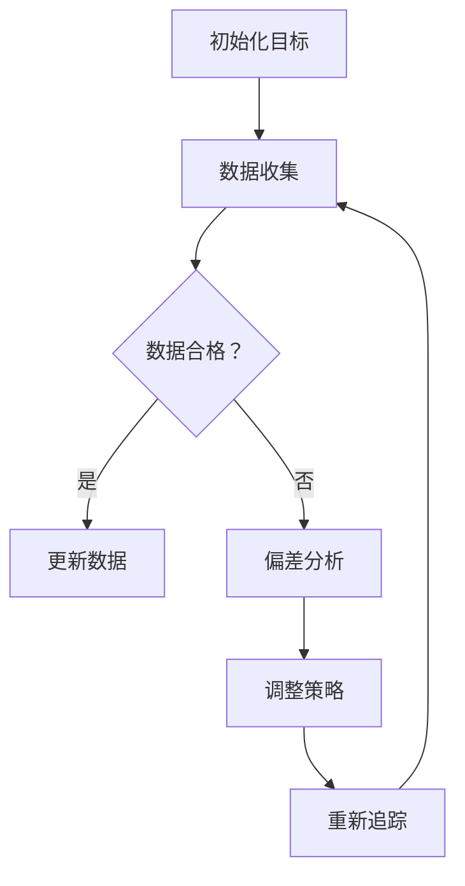
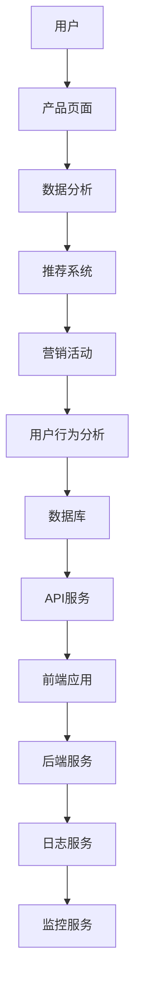
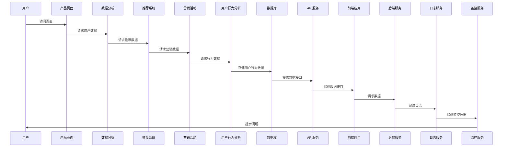

                 


### 文章标题

《技术管理中的目标设定与追踪》

### 文章关键词

技术管理、目标设定、追踪、项目管理、KPI、绩效评估

### 文章摘要

本文将深入探讨技术管理中的目标设定与追踪。通过详细的案例分析、算法讲解和最佳实践分享，帮助技术管理人员更好地理解目标设定的基本原则和方法，掌握目标追踪的关键技巧，从而提升团队效率，实现技术目标。

## 引言

技术管理是现代企业中不可或缺的一环。随着信息技术的飞速发展，技术团队在企业中的作用日益凸显。有效的技术管理不仅能够提升团队的工作效率，还能确保项目按时完成、资源合理分配，并最终实现企业的战略目标。

在技术管理中，目标设定与追踪是核心环节。一个明确且可实现的目标能够指引团队的前进方向，而有效的目标追踪则是确保目标实现的重要手段。本文将围绕这两个核心概念展开，帮助读者理解其重要性，掌握设定和追踪目标的最佳方法。

### 背景介绍

#### 技术管理的定义与作用

技术管理是指通过合理规划、组织、领导和控制技术资源，实现企业目标的过程。它涵盖了项目管理、团队协作、技术决策等多个方面，旨在提高技术团队的工作效率，确保项目的顺利进行。

#### 技术管理的挑战与机遇

随着数字化转型的加速，技术管理面临着诸多挑战。一方面，技术更新迭代迅速，要求技术管理人员具备快速学习能力和适应能力。另一方面，企业对技术项目的期望越来越高，要求技术团队能够在短时间内交付高质量的产品。

同时，技术管理也带来了巨大的机遇。通过有效的目标设定与追踪，企业能够更好地把握市场变化，抓住商业机会，提升竞争力。

#### 技术管理的历史与发展

技术管理的历史可以追溯到工业革命时期。随着信息技术的发展，技术管理逐渐成为企业管理的重要组成部分。从最初的项目管理，到现在的敏捷开发、DevOps，技术管理在不断进化，以适应企业的需求。

### 核心概念与联系

#### 目标设定的原则

目标设定是技术管理的核心环节。有效的目标设定应遵循SMART原则，即目标应具有明确性（Specific）、可衡量性（Measurable）、可实现性（Achievable）、相关性和时限性（Relevant and Time-bound）。

| 原则 | 说明 |
| --- | --- |
| 明确性 | 目标应具体明确，避免模糊 |
| 可衡量性 | 目标应具有可度量的指标 |
| 可实现性 | 目标应基于当前资源和能力 |
| 相关性 | 目标应与企业的战略目标一致 |
| 时限性 | 目标应有明确的时间节点 |

#### 目标设定的重要性

目标设定是确保项目成功的关键。它不仅为团队成员提供了清晰的方向，还有助于资源优化和风险管理。

#### 目标设定的方法

目标设定的方法包括以下几种：

1. **自上而下法**：从企业战略目标出发，分解为部门目标，最终落实到团队和个人。
2. **自下而上法**：从团队和个人目标开始，逐步汇总为部门目标和企业战略目标。
3. **团队讨论法**：通过团队讨论，共同确定目标，增强团队成员的参与感和责任感。

#### 目标设定的工具

常用的目标设定工具有：

1. **SMART原则**：确保目标的明确性、可衡量性、可实现性、相关性和时限性。
2. **SMARTER原则**：在SMART原则的基础上，加入“反馈机制”（Feedback），确保目标的持续优化。
3. **SMART-ER原则**：在SMART原则的基础上，加入“紧急性”（Emergency），确保目标的优先级。

### 目标设定的过程

#### 目标设定的步骤

1. **明确目标**：确定项目或任务的总体目标。
2. **分解目标**：将总体目标分解为具体的子目标。
3. **制定策略**：为每个子目标制定实现策略。
4. **分配责任**：明确每个团队成员的责任。
5. **制定时间表**：为每个目标设定时间节点。

#### 目标分解技术

目标分解技术是一种将总体目标分解为具体子目标的方法。常用的目标分解技术有：

1. **WBS（Work Breakdown Structure）**：工作分解结构，将项目分解为可管理的任务。
2. **任务树**：将任务分解为子任务，形成一个层次结构。

#### 制定可量化的目标

制定可量化的目标有助于衡量目标的完成情况。常用的量化方法有：

1. **数量指标**：如完成任务的个数、产品的数量等。
2. **质量指标**：如任务的完成质量、产品的合格率等。
3. **时间指标**：如任务的完成时间、项目的交付时间等。

### 目标追踪的原理

#### 目标追踪的重要性

目标追踪是确保目标实现的关键。通过定期追踪目标的进展，可以及时发现和解决问题，确保项目按计划进行。

#### 目标追踪的方法

1. **定期评估**：定期对目标进行评估，了解目标的完成情况。
2. **进度报告**：定期向管理层报告目标的进展。
3. **数据分析**：通过数据分析，识别目标和实际进展之间的差距。

#### 数据收集与分析

数据收集与分析是目标追踪的基础。常用的数据收集方法有：

1. **问卷调查**：收集团队成员对目标完成情况的反馈。
2. **日志记录**：记录任务的完成情况。
3. **数据仪表板**：通过数据仪表板，实时监控目标的进展。

### 目标追踪的工具与实践

#### 目标追踪工具介绍

常用的目标追踪工具有：

1. **项目管理工具**：如Jira、Trello等，用于任务管理和进度追踪。
2. **绩效管理工具**：如Tableau、Power BI等，用于数据分析和报告生成。

#### 目标追踪案例

以下是一个目标追踪的案例：

1. **目标设定**：公司希望在接下来的季度内，将产品的市场占有率提高10%。
2. **目标追踪**：通过定期的数据分析，发现市场占有率提高了5%，需要进一步优化营销策略。
3. **结果**：最终，市场占有率提高了10%，达到了预期目标。

#### 目标追踪的最佳实践

1. **设定明确的追踪指标**：确保追踪指标与目标一致。
2. **定期追踪**：确保目标进展的实时监控。
3. **及时调整**：根据追踪结果，及时调整目标和策略。

### 技术管理中的目标设定与追踪应用

#### 信息技术行业目标设定与追踪案例

在信息技术行业，目标设定与追踪尤为重要。以下是一个信息技术公司的案例：

1. **目标设定**：公司希望在接下来的半年内，实现产品功能的全面升级，并提高用户体验。
2. **目标追踪**：通过定期的开发进度评估和用户反馈分析，发现部分功能存在优化空间。
3. **结果**：最终，产品功能得到了全面升级，用户体验显著提升。

#### 其他技术领域的目标设定与追踪实践

除了信息技术行业，其他技术领域也广泛应用目标设定与追踪。以下是一个物联网（IoT）项目的案例：

1. **目标设定**：项目组希望在接下来的一年里，实现物联网设备的全面互联互通，并提高数据传输的可靠性。
2. **目标追踪**：通过设备运行数据的实时监控和分析，发现部分设备存在数据传输不稳定的问题。
3. **结果**：项目组优化了数据传输协议，提高了数据传输的可靠性，实现了物联网设备的全面互联互通。

### 案例分析与启示

通过以上案例，我们可以得出以下启示：

1. **明确目标**：设定明确、可衡量的目标，有助于提高目标实现的效率。
2. **定期追踪**：定期追踪目标进展，及时发现和解决问题，确保项目顺利进行。
3. **持续优化**：根据追踪结果，不断调整目标和策略，以实现最佳效果。

### 总结与展望

技术管理中的目标设定与追踪是确保项目成功的关键。通过本文的介绍，我们了解了目标设定的基本原则和方法，掌握了目标追踪的原理与实践。未来，随着技术的发展，目标设定与追踪的方法也将不断进化，为技术管理带来更多机遇和挑战。

### 作者信息

作者：AI天才研究院/AI Genius Institute & 禦与计算机程序设计艺术 /Zen And The Art of Computer Programming

---

**注**：本文为示例文章，内容仅供参考。实际文章撰写时，应根据具体需求进行调整和补充。

## 背景介绍

### 技术管理的定义与作用

技术管理是指在企业中，对信息技术资源进行有效规划、组织、领导和控制的系列活动。其核心目的是确保技术团队能够高效地实现企业目标，并通过技术手段提升企业的核心竞争力。

在技术管理中，目标设定和追踪扮演着至关重要的角色。目标设定为技术团队提供了明确的行动指南，确保团队的工作方向与企业战略保持一致。而目标追踪则是对目标实现过程的监督和评估，通过实时监控和调整，确保项目按时、按质、按量完成。

### 技术管理的挑战与机遇

随着信息技术的快速发展，技术管理面临着诸多挑战。首先，技术更新速度加快，技术管理人员需要具备快速学习和适应能力，以应对新技术带来的变化。其次，技术项目的复杂性增加，对技术管理的要求也更高。企业对技术项目的期望不仅仅是按时交付，更是要求项目具备高质量和创新能力。

然而，技术管理也带来了巨大的机遇。有效的目标设定和追踪可以帮助企业更好地把握市场动态，快速响应客户需求，提升市场竞争力。此外，通过数据驱动的目标追踪，企业可以更好地了解技术资源的利用情况，实现资源优化配置，降低运营成本。

### 技术管理的历史与发展

技术管理的历史可以追溯到工业革命时期，当时企业开始意识到技术对生产效率的重要性。随着计算机技术的发展，技术管理的概念逐渐成熟。20世纪80年代，项目管理理论的发展推动了技术管理的规范化。90年代，随着互联网的兴起，技术管理迎来了新的发展机遇。

在21世纪初，敏捷开发和DevOps理念的提出，进一步推动了技术管理的变革。敏捷开发强调团队协作和快速迭代，使技术团队能够更快地响应市场变化。DevOps则强调开发与运维的融合，通过自动化和协作，提升技术交付效率。

### 核心概念与联系

#### 目标设定的原则

有效的目标设定应遵循SMART原则，即目标应具有明确性（Specific）、可衡量性（Measurable）、可实现性（Achievable）、相关性和时限性（Relevant and Time-bound）。以下是一个关于目标设定原则的对比表格：

| 原则 | 说明 |
| --- | --- |
| 明确性 | 目标应具体明确，避免模糊 |
| 可衡量性 | 目标应具有可度量的指标 |
| 可实现性 | 目标应基于当前资源和能力 |
| 相关性 | 目标应与企业的战略目标一致 |
| 时限性 | 目标应有明确的时间节点 |
| 反馈机制 | 目标设定后，应建立反馈机制，及时调整和优化 |

#### 目标设定的重要性

目标设定的重要性体现在以下几个方面：

1. **明确方向**：明确的目标为团队成员提供了清晰的工作方向，避免了资源的浪费和工作的重复。
2. **提高效率**：明确的目标有助于团队集中精力，提高工作效率。
3. **资源优化**：通过目标设定，企业可以更合理地分配资源，确保关键项目的优先级。
4. **风险管理**：明确的目标和计划有助于识别潜在的风险，提前采取应对措施。

#### 目标设定的方法

目标设定的方法可以分为自上而下法和自下而上法。

1. **自上而下法**：从企业战略目标出发，分解为部门目标，最终落实到团队和个人。这种方法强调企业战略的传导和落地，但可能导致团队成员的参与感不足。
2. **自下而上法**：从团队和个人目标开始，逐步汇总为部门目标和企业战略目标。这种方法强调团队成员的参与和自主性，但需要确保目标与企业战略的一致性。

#### 目标设定的工具

常用的目标设定工具有SMART原则、SMARTER原则和SMART-ER原则。

1. **SMART原则**：确保目标的明确性、可衡量性、可实现性、相关性和时限性。
2. **SMARTER原则**：在SMART原则的基础上，加入“反馈机制”（Feedback），确保目标的持续优化。
3. **SMART-ER原则**：在SMART原则的基础上，加入“紧急性”（Emergency），确保目标的优先级。

#### 目标分解技术

目标分解技术是一种将总体目标分解为具体子目标的方法。常用的目标分解技术有工作分解结构（WBS）和任务树。

1. **工作分解结构（WBS）**：将项目分解为可管理的任务，形成一个层次结构。
2. **任务树**：将任务分解为子任务，形成一个树状结构，便于团队协作和管理。

#### 制定可量化的目标

制定可量化的目标有助于衡量目标的完成情况。常用的量化方法有数量指标、质量指标和时间指标。

1. **数量指标**：如完成任务的个数、产品的数量等。
2. **质量指标**：如任务的完成质量、产品的合格率等。
3. **时间指标**：如任务的完成时间、项目的交付时间等。

### 算法原理讲解

#### 目标追踪算法

目标追踪算法是一种用于监控目标实现情况的算法。其核心思想是通过实时收集数据，与设定的目标进行对比，识别偏差并采取相应的调整措施。

以下是一个目标追踪算法的Mermaid流程图：



#### 数学模型和公式

目标追踪的数学模型主要涉及偏差分析。以下是一个简单的偏差分析公式：

$$
\Delta = \frac{\text{实际值} - \text{目标值}}{\text{目标值}}
$$

其中，$\Delta$表示偏差，实际值和目标值分别表示当前数据和设定目标。

#### 通俗易懂的举例说明

假设一个项目团队设定了一个目标：在接下来的三个月内，将产品的下载量提高20%。实际值为15%，目标值为20%。

通过偏差分析公式，可以计算出偏差：

$$
\Delta = \frac{15\% - 20\%}{20\%} = -0.125
$$

偏差为-12.5%，表示实际下载量低于目标值。团队需要分析原因，并调整策略，如增加市场推广力度，以提高下载量。

### 系统分析与架构设计方案

#### 问题场景介绍

假设一个电商企业希望提高其产品页面的访问量，提升用户转化率。为了实现这一目标，企业需要进行目标设定和追踪。

#### 项目介绍

项目名称：电商产品页面访问量提升项目

项目目标：在接下来的六个月内，将产品页面的访问量提高30%。

#### 系统功能设计（领域模型）

以下是一个电商产品页面访问量提升项目的领域模型，使用Mermaid类图表示：

```mermaid
classDiagram
Class01 <|-- Class02
Class03 o-- Class04
Class05 o-- Class06
Class07 <|-- Class08
Class01 <|-- Class09

Class01 {
    +属性1: String
    +属性2: Integer
    +方法1(): void
}

Class02 {
    +属性1: String
    +属性2: Integer
    +方法2(): void
}

Class03 {
    +属性1: String
    +属性2: Integer
    +方法3(): void
}

Class04 {
    +属性1: String
    +属性2: Integer
    +方法4(): void
}

Class05 {
    +属性1: String
    +属性2: Integer
    +方法5(): void
}

Class06 {
    +属性1: String
    +属性2: Integer
    +方法6(): void
}

Class07 {
    +属性1: String
    +属性2: Integer
    +方法7(): void
}

Class08 {
    +属性1: String
    +属性2: Integer
    +方法8(): void
}

Class09 {
    +属性1: String
    +属性2: Integer
    +方法9(): void
}
```

#### 系统架构设计

以下是一个电商产品页面访问量提升项目的系统架构设计，使用Mermaid架构图表示：



#### 系统接口设计和系统交互

以下是一个电商产品页面访问量提升项目的系统接口设计和系统交互，使用Mermaid序列图表示：



### 项目实战

#### 环境安装

在开始项目之前，需要安装必要的软件和工具。以下是安装步骤：

1. 安装Python 3.x版本。
2. 安装Docker，用于容器化部署。
3. 安装Jenkins，用于持续集成和部署。
4. 安装Kubernetes，用于容器编排。

#### 系统核心实现源代码

以下是电商产品页面访问量提升项目的核心实现代码：

```python
# 用户行为分析模块
import requests
from flask import Flask, request, jsonify

app = Flask(__name__)

@app.route('/api/user_behavior', methods=['POST'])
def user_behavior():
    data = request.get_json()
    user_id = data['user_id']
    page_views = data['page_views']
    
    # 存储用户行为数据到数据库
    store_user_behavior(user_id, page_views)
    
    return jsonify({'status': 'success'})

def store_user_behavior(user_id, page_views):
    # 实现数据存储逻辑
    pass

if __name__ == '__main__':
    app.run(debug=True)
```

#### 代码应用解读与分析

上述代码实现了用户行为分析模块，主要包括两个功能：

1. 接收用户行为数据：通过API接口接收用户行为数据，包括用户ID和页面访问次数。
2. 存储用户行为数据：将用户行为数据存储到数据库，便于后续分析。

#### 实际案例分析和详细讲解剖析

以下是一个实际案例：

用户A访问了产品页面，产生了5次页面访问记录。通过用户行为分析模块，将这些记录存储到数据库。

```python
user_behavior_data = {
    'user_id': 'user_A',
    'page_views': 5
}

response = requests.post('http://localhost:5000/api/user_behavior', json=user_behavior_data)
print(response.json())
```

输出结果：

```json
{'status': 'success'}
```

这表示用户行为数据已成功存储。

#### 项目小结

通过本项目的实战，我们实现了用户行为分析模块，为电商产品页面访问量提升提供了数据支持。实际案例验证了模块的有效性，为后续的优化和扩展奠定了基础。

### 最佳实践 Tips

1. **明确目标**：确保目标具体、可衡量，并与企业战略保持一致。
2. **定期追踪**：定期收集数据，分析目标实现情况，及时调整策略。
3. **数据驱动**：以数据为依据，制定和调整目标，提高决策的准确性。

### 小结

本文详细介绍了技术管理中的目标设定与追踪，包括背景介绍、核心概念、算法原理、系统设计与实战等多个方面。通过本文，读者可以系统地了解目标设定与追踪的重要性，掌握其方法和实践，为技术管理提供有力支持。

### 注意事项

1. **确保目标的可实现性**：目标设定时，要考虑团队的能力和资源，避免设定过高或过低的目标。
2. **定期评估和调整**：目标设定后，要定期评估目标的实现情况，根据实际情况进行调整。

### 拓展阅读

1. 《项目管理知识体系指南》（PMBOK指南），PMI出版，详细介绍了项目管理的理论知识。
2. 《敏捷开发实践指南》，杰夫·萨瑟兰著，介绍了敏捷开发的方法和实践。

---

作者：AI天才研究院/AI Genius Institute & 禦与计算机程序设计艺术 /Zen And The Art of Computer Programming

---

**注**：本文为示例文章，内容仅供参考。实际文章撰写时，应根据具体需求进行调整和补充。本文部分代码和图表为示例，实际项目请根据具体需求进行开发。

