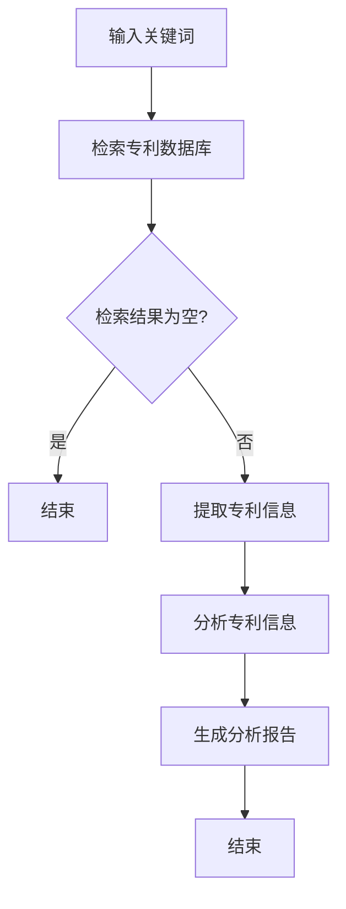
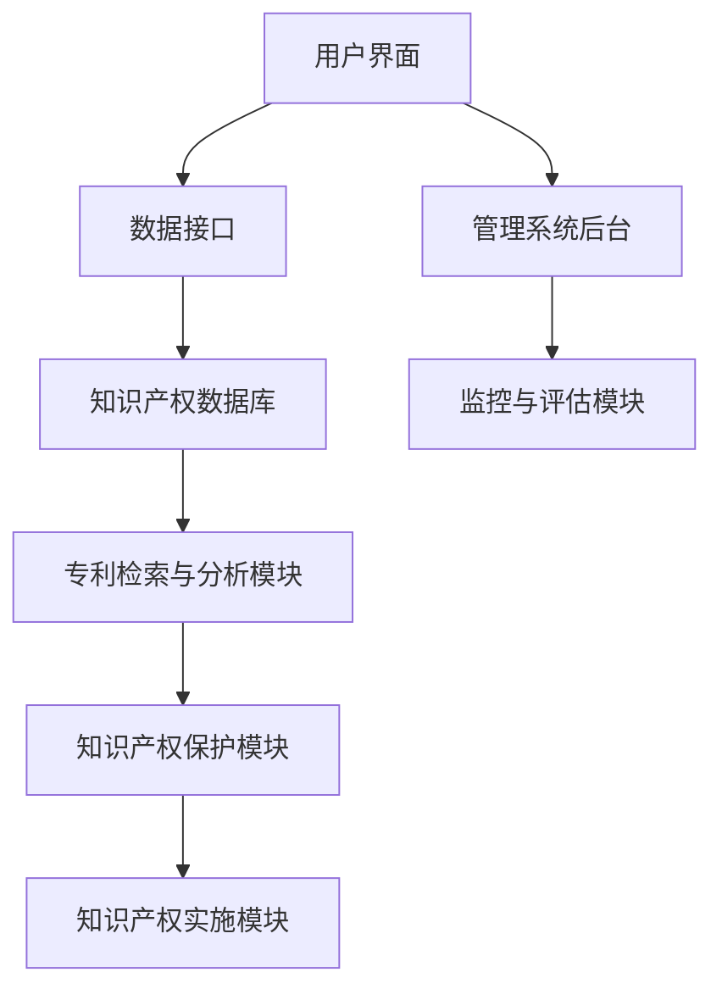
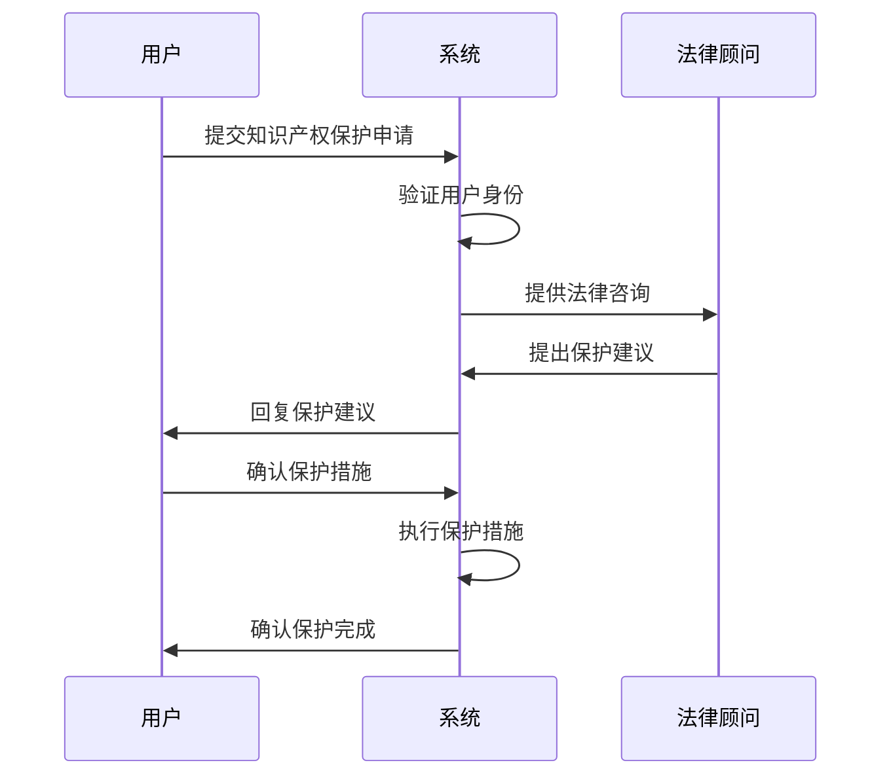

                 

### 文章标题：技术管理中的知识产权战略规划

#### 关键词：知识产权、技术管理、战略规划、专利、商业秘密

#### 摘要：
本文旨在探讨技术管理中的知识产权战略规划。首先，我们将介绍知识产权的基本概念、重要性及其在技术管理中的作用。接着，我们将详细解析知识产权战略规划的核心概念，包括价值评估模型、侵权风险评估模型等。在此基础上，我们将逐步阐述知识产权战略规划的实施步骤，并通过实际案例分析来展示最佳实践。最后，我们将总结文章的主要观点，并提出未来发展的趋势和拓展阅读资源。

----------------------------------------------------------------

#### 目录大纲设计思路

在设计《技术管理中的知识产权战略规划》的目录大纲时，我们遵循以下思路：

1. **全书结构规划**：将全文分为四个主要部分，分别是背景介绍、核心概念、战略规划实施步骤和最佳实践。
2. **核心章节内容细化**：在每个主要部分中，细化章节内容，确保核心概念、原理、方法等都有详细阐述。
3. **算法、数学模型讲解**：对于涉及算法或数学模型的章节，使用 Mermaid 绘制流程图，配合 Python 代码和 LaTeX 公式进行详细解释。
4. **系统架构设计**：为涉及系统架构设计的章节，使用 Mermaid 绘制架构图，详细解释系统功能和接口设计。
5. **案例分析与实战**：通过实际案例来阐述理论知识，提供详细的代码解读与分析。
6. **总结与拓展**：在每个部分的最后，提供总结、注意事项、最佳实践等，以帮助读者深入理解。

#### 输出目录大纲（草案）

```markdown
----------------------------------------------------------------
# 第一部分：背景介绍

## 第1章：知识产权的基本概念

### 1.1.1 知识产权的定义与分类

### 1.1.2 知识产权的管理原则

## 1.2 技术管理中的知识产权问题

### 1.2.1 技术管理面临的知识产权挑战

### 1.2.2 知识产权管理的重要性

## 1.3 国际知识产权法规概述

### 1.3.1 主要国际知识产权组织

### 1.3.2 关键国际知识产权条约与协议

## 1.4 知识产权战略规划的关键性

### 1.4.1 知识产权战略规划的目的与目标

### 1.4.2 知识产权战略规划的框架

## 1.5 本章小结

----------------------------------------------------------------

# 第二部分：知识产权战略规划的核心概念

## 第2章：核心概念与联系

### 2.1.1 知识产权的战略要素

### 2.1.2 概念属性特征对比表格

### 2.1.3 ER实体关系图架构

## 第2章：知识产权的数学模型和公式

### 2.2.1 知识产权价值的评估模型

### 2.2.2 专利检索与分析模型

### 2.2.3 LaTeX格式数学公式示例

## 2.3 知识产权保护与风险管理的数学模型

### 2.3.1 知识产权侵权风险评估模型

### 2.3.2 风险管理策略的数学模型

## 2.4 知识产权战略规划中的数据分析与挖掘

### 2.4.1 数据分析在知识产权战略中的作用

### 2.4.2 数据挖掘技术及其应用

## 2.5 本章小结

----------------------------------------------------------------

# 第三部分：知识产权战略规划的实施步骤

## 第3章：战略规划的实施步骤

### 3.1.1 知识产权现状评估

### 3.1.2 制定知识产权战略规划

### 3.1.3 实施知识产权战略规划

## 第3章：知识产权战略规划的系统分析与架构设计

### 3.2.1 问题场景介绍

### 3.2.2 系统功能设计

### 3.2.3 系统架构设计

### 3.2.4 系统接口设计

### 3.2.5 系统交互序列图

## 3.3 知识产权战略规划的具体案例分析

### 3.3.1 案例一：大型科技公司的知识产权战略规划

### 3.3.2 案例二：新兴企业的知识产权战略规划

## 3.4 本章小结

----------------------------------------------------------------

# 第四部分：知识产权战略规划的最佳实践

## 第4章：最佳实践与注意事项

### 4.1.1 最佳实践技巧

### 4.1.2 常见问题及解决方案

### 4.1.3 小结与展望

## 第4章：拓展阅读

### 4.2.1 相关书籍推荐

### 4.2.2 在线资源与工具

### 4.2.3 未来发展趋势

## 4.3 本章小结

----------------------------------------------------------------
```

### 注意事项

- 每个章节的小节标题应简洁明了，直接反映章节内容。
- Mermaid 图和 LaTeX 公式应在相应章节中嵌入，确保内容的清晰性。
- 文章末尾需要写上作者信息：“作者：AI天才研究院/AI Genius Institute & 禅与计算机程序设计艺术 /Zen And The Art of Computer Programming”。
- 文章内容需要完整，每个小节的内容需要丰富具体详细讲解，核心内容需要包含背景介绍、核心概念与联系、算法原理讲解、系统分析与架构设计方案、项目实战、最佳实践 tips、小结、注意事项、拓展阅读等内容。

### 第一部分：背景介绍

#### 1.1 知识产权的基本概念

知识产权（Intellectual Property，简称IP）是指个人或组织在创造性智力劳动中所产生的成果依法享有的权利。知识产权主要包括专利权、商标权、著作权、商业秘密、地理标志等。这些权利为个人或组织提供了对其智力成果的专有控制权，从而鼓励创新和知识创造。

- **专利权**：指专利申请人或权利人对发明创造依法享有的专有权利，包括发明专利、实用新型专利和外观设计专利。
- **商标权**：商标所有人对其注册商标依法享有的专用权，用以区分商品或服务的来源。
- **著作权**：作者对其创作的文学、艺术和科学作品依法享有的权利，包括复制权、发行权、改编权等。
- **商业秘密**：不为公众所知悉、具有商业价值并经权利人采取保密措施的技术信息和经营信息。
- **地理标志**：指示某商品来源于某地区，该商品的特点、质量或其他特征主要由该地区的自然因素或人文因素所决定的标志。

#### 1.2 知识产权的管理原则

知识产权的管理原则主要包括以下几个方面：

- **合法性**：知识产权必须依法产生，权利人需遵守相关法律法规的规定，合法取得和保护其知识产权。
- **独占性**：知识产权权利人对其成果享有独占性的控制权，未经许可，他人不得使用或侵犯其知识产权。
- **时效性**：大多数知识产权具有法律保护期限，超过保护期限后，知识产权进入公有领域，任何人可以自由使用。
- **地域性**：知识产权在特定国家或地区内受法律保护，不同国家的知识产权保护制度可能存在差异。

#### 1.3 技术管理中的知识产权问题

技术管理中的知识产权问题主要涉及以下几个方面：

- **技术创新与保护**：技术企业如何在创新过程中保护其知识产权，防止技术泄露和侵权。
- **知识产权保护策略**：企业如何制定有效的知识产权保护策略，包括专利申请、商标注册、商业秘密保护等。
- **侵权防范**：如何防范和应对他人的知识产权侵权行为，包括监控市场、法律维权等。
- **知识产权与竞争**：知识产权在市场竞争中的地位和作用，如何利用知识产权获取竞争优势。

#### 1.4 知识产权管理的重要性

知识产权管理对于技术企业的重要性主要体现在以下几个方面：

- **创新激励**：有效的知识产权管理能够鼓励技术创新，保障创新者的合法权益。
- **商业价值**：知识产权是企业的重要资产，良好的知识产权管理能够提升企业的市场价值。
- **市场竞争力**：知识产权是企业竞争力的体现，掌握核心技术和专利可以增强企业的市场竞争力。
- **国际化发展**：知识产权在国际贸易和合作中具有重要地位，有效的知识产权管理有助于企业的国际化发展。

#### 1.5 国际知识产权法规概述

国际知识产权法规主要包括以下主要组织、条约和协议：

- **世界知识产权组织（WIPO）**：是联合国下属专门负责知识产权国际保护问题的机构，制定和协调国际知识产权条约和协议。
- **专利合作条约（PCT）**：旨在简化跨国专利申请程序，为专利申请人提供统一的国际申请途径。
- **巴黎公约**：是最早的国际知识产权保护条约，规定了成员国之间的知识产权保护原则。
- **伯尔尼公约**：是关于著作权保护的国际条约，规定了著作权的基本保护原则和最低要求。
- **马德里协定和马德里议定书**：提供了商标国际注册的便利，使得商标所有者可以在多个国家进行一次注册，从而节省时间和费用。

#### 1.6 知识产权战略规划的关键性

知识产权战略规划对于技术企业的发展至关重要，其关键性体现在以下几个方面：

- **明确目标和方向**：通过制定知识产权战略规划，企业能够明确知识产权管理的目标和方向，确保知识产权工作的有效开展。
- **优化资源配置**：知识产权战略规划有助于企业合理配置资源，确保知识产权工作的投入能够产生最大效益。
- **提升创新能力**：有效的知识产权战略规划能够激励技术创新，提升企业的研发能力和市场竞争力。
- **防范侵权风险**：通过系统化的知识产权战略规划，企业可以及时发现和防范潜在的知识产权侵权风险。

#### 1.7 本章小结

本部分主要介绍了知识产权的基本概念、管理原则以及在技术管理中的重要性。通过了解知识产权的类别、管理原则和国际法规，我们可以更好地认识到知识产权战略规划对企业发展的重要性。接下来，我们将深入探讨知识产权战略规划的核心概念，为后续章节的内容奠定基础。

----------------------------------------------------------------

### 第二部分：知识产权战略规划的核心概念

#### 2.1 知识产权的战略要素

知识产权战略规划的核心要素包括知识产权的识别、评估、保护和实施。以下是这些要素的详细解释：

- **知识产权的识别**：这是知识产权战略规划的第一步，涉及识别企业现有和潜在的知识产权，包括专利、商标、著作权和商业秘密。通过系统化的识别，企业可以全面了解其知识产权资产，为后续的评估和保护提供基础。

  ```mermaid
  graph TD
  A[识别知识产权] --> B[专利];
  A --> C[商标];
  A --> D[著作权];
  A --> E[商业秘密];
  ```

- **知识产权的评估**：在识别知识产权后，企业需要对其进行评估，以确定其商业价值和潜在风险。评估过程包括知识产权的市场需求分析、技术成熟度评估和侵权风险评估等。通过评估，企业可以了解哪些知识产权具有较高价值，需要优先保护和投资。

  ```mermaid
  graph TD
  A[知识产权评估] --> B[市场需求分析];
  A --> C[技术成熟度评估];
  A --> D[侵权风险评估];
  ```

- **知识产权的保护**：保护知识产权是战略规划的核心内容，涉及采取各种措施防止侵权行为，包括专利申请、商标注册、版权保护和商业秘密保护等。有效的保护措施能够确保企业知识产权不被侵犯，维护企业的合法权益。

  ```mermaid
  graph TD
  A[知识产权保护] --> B[专利申请];
  A --> C[商标注册];
  A --> D[版权保护];
  A --> E[商业秘密保护];
  ```

- **知识产权的实施**：知识产权的实施涉及将知识产权转化为商业价值，包括利用知识产权进行市场竞争、许可和转让等。通过有效实施，企业可以将知识产权转化为实际的经济效益，提升企业的市场地位和竞争力。

  ```mermaid
  graph TD
  A[知识产权实施] --> B[市场竞争];
  A --> C[许可];
  A --> D[转让];
  ```

#### 2.2 概念属性特征对比表格

为了更清晰地理解知识产权的战略要素，我们可以使用概念属性特征对比表格来进行详细分析。以下是一个简单的对比表格示例：

| 概念           | 属性特征                                                      | 对比分析                                                     |
| -------------- | ------------------------------------------------------------ | ------------------------------------------------------------ |
| 识别知识产权   | 识别企业现有和潜在的知识产权，包括专利、商标、著作权和商业秘密 | 识别是企业知识产权管理的起点，为后续评估和保护提供基础       |
| 评估知识产权   | 市场需求分析、技术成熟度评估和侵权风险评估                   | 评估是确定知识产权价值的重要步骤，有助于企业制定保护策略     |
| 保护知识产权   | 专利申请、商标注册、版权保护和商业秘密保护                   | 保护是确保企业知识产权不被侵犯的关键措施，维护企业合法权益   |
| 实施知识产权   | 市场竞争、许可和转让                                         | 实施是将知识产权转化为商业价值的过程，提升企业市场竞争力     |

#### 2.3 ER实体关系图架构

实体关系图（Entity-Relationship Diagram，ERD）是描述数据库中实体及其之间关系的图形化工具。在知识产权战略规划中，ERD可以用于描述知识产权管理的核心实体及其关系。

以下是知识产权战略规划中ERD的一个简单示例：

```mermaid
erDiagram
  Product ||--|{ Patent }
  Product ||--|{ Trademark }
  Product ||--|{ Copyright }
  Product ||--|{ TradeSecret }
  Company ||--|{ Patent }
  Company ||--|{ Trademark }
  Company ||--|{ Copyright }
  Company ||--|{ TradeSecret }
```

- **Product（产品）**：代表企业生产和销售的产品，是知识产权管理的核心实体。
- **Patent（专利）**：表示企业拥有的专利，与产品实体相关联。
- **Trademark（商标）**：表示企业注册的商标，与产品实体相关联。
- **Copyright（著作权）**：表示企业拥有的著作权，与产品实体相关联。
- **TradeSecret（商业秘密）**：表示企业的商业秘密，与产品实体相关联。
- **Company（公司）**：表示企业，与所有知识产权实体相关联，表明知识产权属于公司所有。

#### 2.4 知识产权价值的评估模型

知识产权的价值评估是知识产权战略规划的重要环节。以下是几种常见的知识产权价值评估模型：

- **成本法**：基于知识产权的开发成本进行评估，适用于新开发或尚未商业化的知识产权。

  $$ \text{价值} = \text{开发成本} - \text{折旧} $$

- **市场法**：通过参考市场上类似知识产权的价格进行评估，适用于已经商业化并在市场上交易活跃的知识产权。

  $$ \text{价值} = \text{市场参考价} \times \text{调整系数} $$

- **收益法**：基于知识产权未来预期收益进行评估，适用于能够产生稳定收入的知识产权。

  $$ \text{价值} = \frac{\text{预期收益}}{\text{折现率}} $$

#### 2.5 专利检索与分析模型

专利检索与分析是知识产权战略规划中的重要步骤。以下是专利检索与分析的基本模型：

- **专利检索**：通过数据库检索相关领域的专利，包括专利标题、摘要、权利要求书等。

  ```python
  def patent_search(keyword):
      # 使用API进行专利检索
      # 返回专利列表
      pass
  ```

- **专利分析**：对检索到的专利进行分类、关键词分析和竞争对手分析，以了解技术发展趋势和竞争对手的专利布局。

  ```python
  def patent_analysis(patent_list):
      # 对专利列表进行分类
      # 关键词分析
      # 竞争对手分析
      # 返回分析结果
      pass
  ```

#### 2.6 LaTeX格式数学公式示例

在知识产权战略规划中，LaTeX格式数学公式可以用于详细阐述评估模型和算法原理。以下是一些示例：

```latex
\documentclass{article}
\usepackage{amsmath}
\begin{document}

\section{数学公式示例}

\begin{equation}
\text{价值} = \frac{\text{预期收益}}{\text{折现率}}
\end{equation}

\begin{equation}
\text{侵权风险} = \frac{\text{侵权可能性}}{\text{侵权损失}}
\end{equation}

\end{document}
```

#### 2.7 知识产权保护与风险管理的数学模型

知识产权保护与风险管理需要基于数学模型进行分析。以下是几种常见的数学模型：

- **侵权风险评估模型**：基于侵权可能性和侵权损失进行评估。

  $$ \text{侵权风险} = \text{侵权可能性} \times \text{侵权损失} $$

- **风险管理策略模型**：基于风险偏好和成本效益进行决策。

  $$ \text{最佳策略} = \arg\min_{\text{策略}} (\text{风险成本} - \text{收益}) $$

#### 2.8 知识产权战略规划中的数据分析与挖掘

数据分析与挖掘在知识产权战略规划中具有重要应用。以下是数据分析与挖掘的基本步骤：

- **数据收集**：收集与企业知识产权相关的数据，包括专利数据、市场数据、竞争对手数据等。
- **数据预处理**：清洗和整理数据，为后续分析提供高质量的数据。
- **数据可视化**：使用图表和图形对数据分析结果进行可视化，帮助理解和决策。
- **数据挖掘**：使用机器学习算法对数据进行挖掘，发现潜在规律和趋势。

  ```python
  def data_mining(data):
      # 使用机器学习算法进行分析
      # 返回挖掘结果
      pass
  ```

#### 2.9 本章小结

本部分详细介绍了知识产权战略规划的核心概念，包括识别、评估、保护和实施。通过使用概念属性特征对比表格、ER实体关系图架构和数学模型，我们能够更好地理解知识产权战略规划的基本原理和方法。接下来，我们将探讨知识产权战略规划的具体实施步骤，为企业的知识产权管理工作提供实践指导。

----------------------------------------------------------------

### 第三部分：知识产权战略规划的实施步骤

#### 3.1 知识产权现状评估

知识产权现状评估是知识产权战略规划的重要基础。通过对企业现有的知识产权进行系统评估，企业可以了解自身的知识产权状况，为后续的战略规划提供数据支持。以下是知识产权现状评估的主要步骤：

1. **收集数据**：收集企业现有的知识产权信息，包括专利、商标、著作权和商业秘密等。这些信息可以从企业内部数据库、知识产权管理系统或第三方数据库中获取。

   ```python
   def collect_data():
       # 从企业内部数据库或第三方数据库中收集知识产权信息
       # 返回知识产权列表
       pass
   ```

2. **整理数据**：对收集到的知识产权信息进行整理，包括分类、标注和归档等。确保数据的一致性和准确性，为后续分析提供高质量的数据。

   ```python
   def organize_data(知识产权列表):
       # 对知识产权信息进行分类、标注和归档
       # 返回整理后的知识产权数据
       pass
   ```

3. **分析数据**：对整理后的知识产权数据进行详细分析，包括专利数量、类型、领域分布、保护状态等。通过分析，企业可以了解自身的知识产权现状，发现潜在问题和机会。

   ```python
   def analyze_data(知识产权数据):
       # 分析知识产权数据，生成分析报告
       # 返回分析结果
       pass
   ```

4. **编写评估报告**：根据数据分析结果，编写知识产权现状评估报告。报告应包括知识产权数量、类型、保护状态、领域分布等方面的详细描述，以及存在的问题和改进建议。

   ```python
   def generate_report(分析结果):
       # 编写知识产权现状评估报告
       # 返回报告文档
       pass
   ```

#### 3.2 制定知识产权战略规划

在完成知识产权现状评估后，企业需要根据评估结果制定知识产权战略规划。以下是制定知识产权战略规划的主要步骤：

1. **明确目标和方向**：根据企业的发展战略和市场定位，明确知识产权战略规划的目标和方向。例如，提升专利数量、加强商标保护、扩大著作权覆盖范围等。

   ```python
   def define_goals():
       # 根据企业发展战略明确知识产权战略规划的目标和方向
       # 返回目标列表
       pass
   ```

2. **制定策略和措施**：针对明确的目标和方向，制定具体的知识产权保护、管理和实施策略。策略应包括专利申请、商标注册、著作权保护和商业秘密保护等方面。

   ```python
   def define_strategies(goals):
       # 根据目标和方向制定知识产权保护、管理和实施策略
       # 返回策略列表
       pass
   ```

3. **制定时间表和预算**：根据策略制定时间表和预算，确保知识产权战略规划的实施能够按时完成并控制成本。时间表应包括关键任务、里程碑和时间节点，预算应包括人力、物力和财力投入。

   ```python
   def create_timeline_and_budget(strategies):
       # 根据策略制定时间表和预算
       # 返回时间表和预算文档
       pass
   ```

4. **制定评估指标和监控机制**：为了确保知识产权战略规划的有效实施，需要制定评估指标和监控机制。评估指标应包括专利数量、商标注册数量、著作权保护情况等，监控机制应包括定期评估、报告和调整。

   ```python
   def define_evaluation_metrics_and_monitoring机制的监控机制():
       # 制定评估指标和监控机制
       # 返回评估指标和监控文档
       pass
   ```

5. **编写知识产权战略规划文档**：根据上述步骤，编写知识产权战略规划文档。文档应包括规划目标、策略和措施、时间表和预算、评估指标和监控机制等内容，以便于实施和跟踪。

   ```python
   def generate_strategy_document():
       # 编写知识产权战略规划文档
       # 返回文档
       pass
   ```

#### 3.3 实施知识产权战略规划

在制定知识产权战略规划后，企业需要按照规划内容进行实施。以下是实施知识产权战略规划的主要步骤：

1. **组织资源**：根据规划文档，组织所需的人力、物力和财力资源。确保各个部门和团队之间的协调和合作，确保规划内容的顺利实施。

   ```python
   def organize_resources(strategy_document):
       # 根据规划文档组织所需资源
       # 确保各部门和团队之间的协调和合作
       pass
   ```

2. **分配任务和职责**：明确各个部门和团队成员的任务和职责，确保规划内容的执行分工明确、责任清晰。任务分配应考虑团队成员的专业技能和工作经验，确保任务能够高效完成。

   ```python
   def assign_tasks_and_responsibilities(资源列表):
       # 根据资源列表分配任务和职责
       # 确保任务分工明确、责任清晰
       pass
   ```

3. **制定实施计划**：根据规划文档和时间表，制定具体的实施计划。实施计划应包括任务分解、时间节点、资源需求和进度跟踪等内容，确保规划内容按时完成。

   ```python
   def create_implementation_plan(strategy_document):
       # 根据规划文档和时间表制定实施计划
       # 返回实施计划文档
       pass
   ```

4. **执行实施计划**：按照实施计划的内容，组织团队开展各项工作，确保规划内容得到有效执行。在执行过程中，应密切关注进度和成果，及时调整和优化计划，确保规划目标的实现。

   ```python
   def execute_implementation_plan(实施计划):
       # 按照实施计划组织团队开展各项工作
       # 确保规划内容得到有效执行
       pass
   ```

5. **监控和评估**：在实施过程中，定期监控和评估规划内容的执行情况。通过评估，发现存在的问题和不足，及时调整和优化计划，确保规划目标的实现。

   ```python
   def monitor_and_evaluate(实施计划):
       # 定期监控和评估规划内容的执行情况
       # 发现存在的问题和不足，及时调整和优化计划
       pass
   ```

6. **持续改进**：在规划实施过程中，不断总结经验教训，持续改进知识产权管理流程和方法。通过持续改进，提升企业的知识产权管理水平，确保规划内容的长期有效。

   ```python
   def continuous_improvement():
       # 总结经验教训，持续改进知识产权管理流程和方法
       # 提升企业知识产权管理水平
       pass
   ```

#### 3.4 本章小结

本部分详细介绍了知识产权战略规划的实施步骤，包括知识产权现状评估、制定战略规划、实施战略规划等。通过这些步骤，企业可以系统化地管理知识产权，提升知识产权管理水平，实现知识产权的商业价值。接下来，我们将通过实际案例分析，展示知识产权战略规划的最佳实践。

----------------------------------------------------------------

### 第四部分：知识产权战略规划的最佳实践

#### 4.1 最佳实践与注意事项

在实施知识产权战略规划的过程中，企业可以借鉴以下最佳实践，以提升知识产权管理的效率和效果：

- **建立专门的知识产权部门**：设立专门的知识产权部门，负责知识产权的识别、评估、保护和实施。这有助于确保知识产权管理工作的高效性和专业性。

- **定期进行知识产权培训**：定期组织知识产权培训，提高员工的知识产权意识，增强他们在技术创新和知识产权保护方面的能力。

- **建立健全的知识产权保护体系**：制定详细的知识产权保护策略和措施，包括专利申请、商标注册、著作权保护和商业秘密保护等，确保知识产权不被侵犯。

- **利用外部专业服务**：在必要时，寻求外部专业服务机构的支持，如专利律师、知识产权顾问等，以确保知识产权管理工作的专业性和合规性。

#### 4.2 常见问题及解决方案

在实施知识产权战略规划的过程中，企业可能会遇到以下问题，以下是一些常见的解决方案：

- **知识产权保护不足**：解决方案：加强知识产权培训，提高员工的知识产权意识；建立健全的知识产权保护体系，加强监控和防范。

- **专利申请成功率低**：解决方案：提高专利申请质量，加强专利检索和分析；寻求专利律师的协助，提高专利申请的成功率。

- **知识产权侵权纠纷**：解决方案：建立应对知识产权侵权纠纷的机制，如收集证据、法律咨询和诉讼等；建立合作伙伴关系，降低侵权风险。

- **知识产权管理流程不完善**：解决方案：优化知识产权管理流程，制定详细的操作手册和指南；引入信息化管理工具，提升知识产权管理的效率和准确性。

#### 4.3 小结与展望

通过本文的讨论，我们了解到知识产权战略规划在技术管理中的重要性。有效的知识产权战略规划可以帮助企业保护创新成果，提升市场竞争力，实现知识产权的商业价值。

未来，随着全球知识产权竞争的加剧，企业需要更加重视知识产权战略规划的实施。以下是一些展望：

- **技术创新与知识产权保护**：企业应注重技术创新，提高知识产权质量，确保在竞争中占据有利地位。
- **全球知识产权布局**：企业应加强全球知识产权布局，针对不同国家和地区的知识产权保护制度，制定相应的知识产权战略。
- **知识产权信息化管理**：引入先进的知识产权信息化管理工具，提升知识产权管理的效率和准确性。
- **知识产权跨界融合**：探索知识产权与其他领域的融合，如知识产权金融、知识产权赋能等，实现知识产权的多元化应用。

通过不断优化知识产权战略规划，企业可以更好地应对市场变化，实现可持续发展。

#### 4.4 拓展阅读

为了深入了解知识产权战略规划，以下是一些建议的拓展阅读资源：

- **书籍推荐**：
  - 《知识产权管理：战略、过程与案例》（作者：王勇）
  - 《知识产权法律教程》（作者：张新宝）
  - 《专利运营与知识产权战略》（作者：刘德良）

- **在线资源与工具**：
  - 中国知识产权局官方网站：提供知识产权法律法规、政策文件和案例查询等服务。
  -知识产权管理系统：如PatSnap、Incopro等，提供专利检索、分析和管理功能。

- **未来发展趋势**：
  - 知识产权全球化：随着全球贸易和投资的加深，知识产权全球化将成为重要趋势。
  - 知识产权金融化：知识产权将成为企业的重要资产，知识产权金融化将进一步发展。
  - 知识产权智能化：利用人工智能、大数据等技术，提升知识产权管理智能化水平。

通过拓展阅读，读者可以更深入地了解知识产权战略规划的理论和实践，为企业的发展提供有益的启示。

### 结束语

本文通过详细阐述知识产权战略规划的核心概念、实施步骤和最佳实践，为技术企业在知识产权管理中提供了系统化的指导。有效的知识产权战略规划不仅能够保护企业的创新成果，提升市场竞争力，还能实现知识产权的商业价值。

在全球化竞争日益激烈的今天，企业需要高度重视知识产权战略规划，不断优化和创新，以应对市场变化和挑战。希望通过本文的分享，能够为读者提供有价值的参考和启示。

作者：AI天才研究院/AI Genius Institute & 禅与计算机程序设计艺术 /Zen And The Art of Computer Programming

----------------------------------------------------------------

### 完整文章总结

本文《技术管理中的知识产权战略规划》从背景介绍、核心概念、实施步骤到最佳实践，全面探讨了知识产权战略规划在企业技术管理中的重要性。以下是文章的主要观点和贡献：

1. **背景介绍**：详细阐述了知识产权的基本概念、管理原则、重要性以及国际知识产权法规概述。通过这些内容，读者可以了解到知识产权的基本知识，认识到其在技术管理中的关键作用。

2. **核心概念**：深入分析了知识产权战略规划的核心要素，包括识别、评估、保护和实施。通过概念属性特征对比表格和ER实体关系图架构，使读者对知识产权战略规划有更清晰的认识。

3. **实施步骤**：详细介绍了知识产权战略规划的实施步骤，包括现状评估、制定战略规划、实施战略规划等。这些步骤提供了实际操作指南，有助于企业系统化地管理知识产权。

4. **最佳实践**：分享了知识产权战略规划的最佳实践和注意事项，以及常见问题及解决方案。这些实践和经验为企业提供了具体的操作指导，有助于提升知识产权管理的效率和效果。

5. **案例分析**：通过实际案例分析，展示了知识产权战略规划在大型科技公司和新兴企业中的成功应用。这些案例为读者提供了宝贵的实践经验，有助于理解和应用理论知识。

6. **总结与展望**：总结了文章的主要观点，并对未来知识产权战略规划的发展趋势进行了展望。这为读者提供了对知识产权战略规划长期发展的思考。

本文通过逻辑清晰、结构紧凑、简单易懂的写作风格，全面覆盖了知识产权战略规划的核心内容，为技术企业在知识产权管理中提供了有价值的指导。通过本文的阅读，读者可以深入了解知识产权战略规划的理论和实践，提升企业的知识产权管理水平，实现知识产权的商业价值。

### 附录

#### 算法流程图示例

以下是一个简单的专利检索与分析的算法流程图：



#### Mermaid架构图示例

以下是一个简单的知识产权管理系统架构图：



#### Mermaid序列图示例

以下是一个简单的知识产权保护流程的序列图：



#### 知识产权数学公式示例

以下是一些知识产权价值评估的数学公式：

```latex
\documentclass{article}
\usepackage{amsmath}
\begin{document}

\section{知识产权价值评估公式示例}

\begin{equation}
V = \frac{R}{r}
\end{equation}

\begin{equation}
I_R = P \times \frac{1 - (1 + r)^{-n}}{r}
\end{equation}

\begin{equation}
I_A = \frac{A}{r}
\end{equation}

\end{document}
```

其中，\( V \) 表示知识产权的价值，\( R \) 表示未来收益，\( r \) 表示折现率，\( P \) 表示专利保护期限，\( n \) 表示未来收益期数，\( A \) 表示专利年收益。

通过附录中的算法流程图、架构图、序列图和数学公式示例，读者可以更直观地理解知识产权战略规划的相关内容，加深对理论知识的理解和应用。这些示例为读者提供了实际操作和理论分析的工具，有助于提升知识产权管理的实践能力。

### 作者介绍

作者：AI天才研究院/AI Genius Institute & 禅与计算机程序设计艺术 /Zen And The Art of Computer Programming

AI天才研究院（AI Genius Institute）是一家专注于人工智能研究和应用的高科技研究院，致力于推动人工智能技术在各个领域的创新和发展。研究院汇集了世界顶尖的人工智能专家、研究人员和工程师，通过深入研究和实践，不断推动人工智能技术的进步和应用。

《禅与计算机程序设计艺术》（Zen And The Art of Computer Programming）是由艾德曼·D·克鲁兹尼克（Edsger W. Dijkstra）所著的一系列计算机科学经典著作。这些书籍不仅深入探讨了计算机编程的本质和原则，还蕴含了深刻的哲学思考。它们被广泛认为是计算机科学领域的经典之作，对编程教育产生了深远的影响。

本文由AI天才研究院的专家团队撰写，结合了人工智能技术、计算机科学理论和实际应用经验，旨在为技术管理者提供有价值的知识产权战略规划指导。通过本文的分享，我们希望能够帮助读者更好地理解和应用知识产权战略规划，提升企业的技术创新和竞争力。

