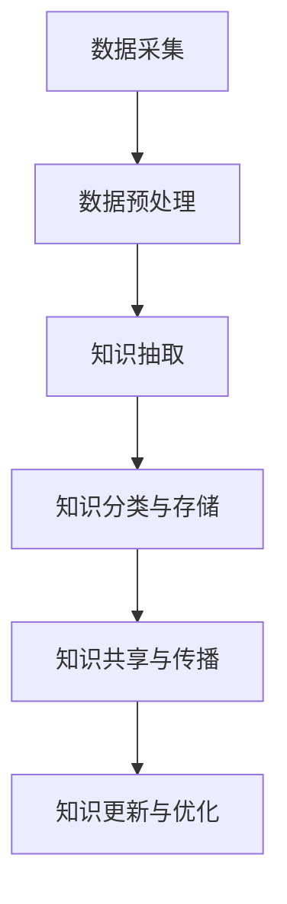
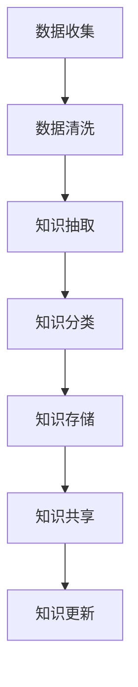
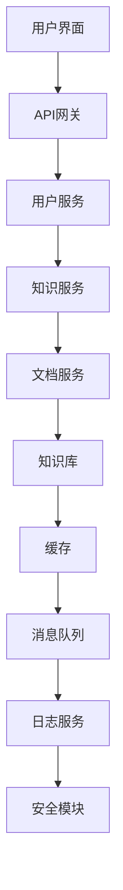
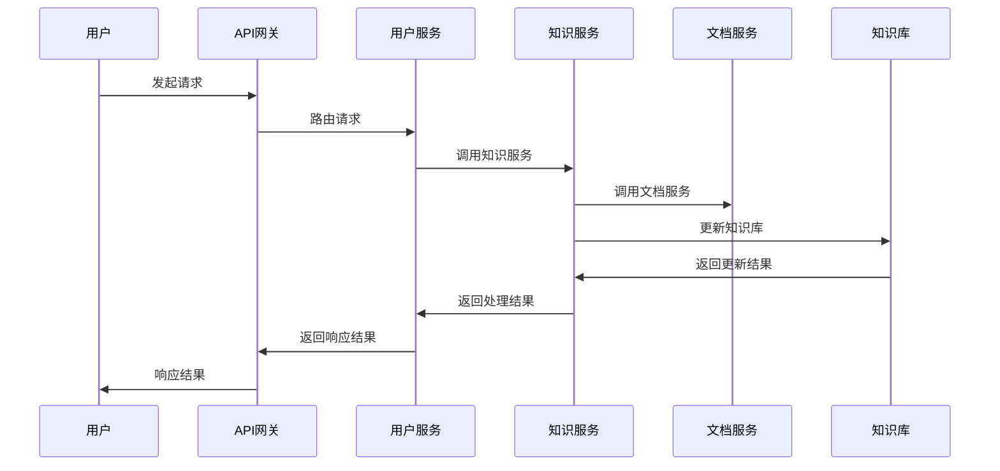
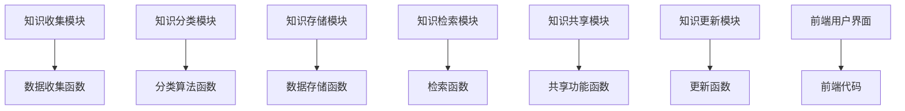

                 

# 技术管理中的知识管理与传承

> 关键词：技术管理、知识管理、知识传承、系统架构、算法原理、项目实战

> 摘要：
在快速变化的技术时代，知识管理和传承成为技术管理中的关键挑战。本文将深入探讨知识管理和传承在技术管理中的重要性，定义核心概念，分析其联系与融合，并讲解相关算法原理。此外，还将介绍系统分析与架构设计方案，并通过项目实战展示其实际应用。本文旨在为技术管理人员提供有价值的指导，以优化知识管理和传承策略。

## 目录大纲

----------------------------------------------------------------

# 技术管理中的知识管理与传承

## 第一部分：背景介绍

### 第1章：问题背景

#### 1.1.1 问题背景

#### 1.1.2 问题描述

#### 1.1.3 问题解决

#### 1.1.4 边界与外延

#### 1.1.5 概念结构与核心要素组成

### 第2章：核心概念

#### 2.1 知识管理与传承

##### 2.1.1 知识管理的定义

##### 2.1.2 知识管理的目标

##### 2.1.3 知识管理的方法

#### 2.2 技术管理

##### 2.2.1 技术管理的定义

##### 2.2.2 技术管理的目标

##### 2.2.3 技术管理的方法

## 第二部分：核心概念与联系

### 第3章：知识管理与传承

#### 3.1 知识管理的核心概念

##### 3.1.1 知识类型

##### 3.1.2 知识生命周期

##### 3.1.3 知识地图

#### 3.2 知识传承的核心概念

##### 3.2.1 传承的方式

##### 3.2.2 传承的挑战

##### 3.2.3 传承的策略

### 第4章：技术管理

#### 4.1 技术管理的核心概念

##### 4.1.1 技术架构

##### 4.1.2 技术标准

##### 4.1.3 技术创新

#### 4.2 技术传承的核心概念

##### 4.2.1 技术传承的方式

##### 4.2.2 技术传承的挑战

##### 4.2.3 技术传承的策略

## 第三部分：算法原理讲解

### 第5章：算法原理

#### 5.1 知识管理与传承的算法

##### 5.1.1 算法简介

##### 5.1.2 算法原理

##### 5.1.3 算法流程图

##### 5.1.4 算法数学模型和公式

#### 5.2 技术管理中的知识管理与传承算法

##### 5.2.1 算法简介

##### 5.2.2 算法原理

##### 5.2.3 算法流程图

##### 5.2.4 算法数学模型和公式

## 第四部分：系统分析与架构设计方案

### 第6章：系统分析与架构设计方案

#### 6.1 问题场景介绍

#### 6.2 项目介绍

#### 6.3 系统功能设计

##### 6.3.1 领域模型

##### 6.3.2 系统功能模块

#### 6.4 系统架构设计

##### 6.4.1 系统架构图

##### 6.4.2 系统架构设计原则

#### 6.5 系统接口设计

##### 6.5.1 接口定义

##### 6.5.2 接口设计原则

#### 6.6 系统交互

##### 6.6.1 系统交互流程

##### 6.6.2 系统交互mermaid序列图

## 第五部分：项目实战

### 第7章：环境安装

#### 7.1 环境准备

#### 7.2 环境配置

### 第8章：系统核心实现

#### 8.1 核心模块实现

#### 8.2 知识管理与传承算法实现

### 第9章：代码应用解读与分析

#### 9.1 代码结构分析

#### 9.2 代码应用实例分析

## 第六部分：项目小结

#### 9.3 项目实战总结

## 参考文献

----------------------------------------------------------------

----------------------------------------------------------------
## 第1章：问题背景

### 1.1.1 问题背景

随着技术的飞速发展，企业和组织面临的信息量不断增加，技术知识的积累和共享变得尤为重要。知识管理和技术管理作为现代企业管理的核心组成部分，其重要性日益凸显。知识管理关注如何有效收集、组织、存储、共享和应用知识，而技术管理则侧重于确保技术资源的有效配置和利用，以支持企业的战略目标。

然而，在实际操作中，知识管理和传承面临着诸多挑战。一方面，知识分散在个体员工和组织各个角落，难以系统地整合和利用。另一方面，随着团队成员的流动性增加，知识的流失和技能断层成为企业持续发展的隐患。因此，如何在技术管理中有效地实现知识管理和传承，成为亟需解决的问题。

### 1.1.2 问题描述

知识管理和传承在技术管理中面临的主要问题包括：

1. **知识分散与难以共享**：技术知识往往分布在个体员工的电脑、文档、邮件等多个渠道，缺乏统一的存储和管理机制，导致知识难以共享和利用。
2. **知识更新速度滞后**：技术知识更新迅速，但传统的知识管理方法往往难以及时更新和传播最新知识，导致知识陈旧。
3. **知识流失风险**：高技能员工的离职可能导致其掌握的知识随之人走茶凉，对企业造成长期影响。
4. **技能断层**：年轻员工缺乏经验，难以迅速掌握复杂的技术知识，导致企业创新能力下降。

### 1.1.3 问题解决

为了解决上述问题，企业需要采取一系列措施来优化知识管理和传承：

1. **建立统一的知识管理平台**：通过建立集中的知识库，实现知识的系统化存储和分类管理，方便员工查询和共享。
2. **推动知识共享文化**：培养员工的知识共享意识，鼓励团队成员分享经验和技术心得，形成良好的知识共享氛围。
3. **实施持续的知识更新机制**：定期审查和更新知识库内容，确保知识的时效性和准确性。
4. **加强人才培养与传承**：通过内部培训和跨部门交流，促进知识的传承和技能的积累。
5. **利用技术工具辅助**：借助人工智能、自然语言处理等技术手段，提升知识管理和传承的效率和效果。

### 1.1.4 边界与外延

在技术管理中，知识管理和传承不仅涉及内部知识，还包括外部知识的获取和应用。例如，通过与行业合作伙伴、研究机构等进行知识共享和交流，可以获取前沿技术和市场信息，提高企业的竞争力。此外，知识管理和传承还涉及到企业战略、文化、组织结构等多个方面，需要综合考虑和协调。

### 1.1.5 概念结构与核心要素组成

为了更好地理解和实施知识管理和传承，需要明确相关概念和核心要素：

1. **知识管理**：包括知识识别、知识获取、知识存储、知识共享、知识应用等环节。
2. **知识传承**：涉及知识的传递、分享、学习和应用，确保知识在企业内部得到有效传承。
3. **技术管理**：包括技术规划、技术选型、技术评估、技术创新、技术标准化等过程。
4. **核心要素**：知识创造者（员工）、知识载体（文档、数据库、系统）、知识共享平台、知识更新机制等。

通过以上分析，我们可以看到，知识管理和传承在技术管理中扮演着至关重要的角色。只有通过有效的知识管理和传承策略，企业才能在快速变化的技术环境中保持竞争力，实现持续创新和发展。

### 第2章：核心概念

在深入探讨知识管理和传承之前，有必要对相关核心概念进行详细定义，以建立清晰的理论基础。以下将分别介绍知识管理和技术管理的定义、目标及其方法。

#### 2.1 知识管理与传承

##### 2.1.1 知识管理的定义

知识管理（Knowledge Management，KM）是指通过系统地收集、组织、存储、共享和应用知识，以实现知识增值和高效利用的过程。知识管理不仅关注显性知识的整理和存储，如文档、报告、专利等，还重视隐性知识的挖掘和传承，如员工的技能、经验、价值观等。

##### 2.1.2 知识管理的目标

知识管理的目标主要包括：

1. **提高知识利用效率**：通过有效组织和共享，使知识能够在组织内部快速传递和获取，提升工作效率。
2. **促进知识创新**：通过知识交流和碰撞，激发员工的创新思维，推动技术的进步和产品的更新。
3. **降低知识流失风险**：通过知识编码和存储，减少高技能员工的离职对企业知识积累的负面影响。
4. **提升组织竞争力**：通过积累和传承知识，增强企业的核心竞争力，实现可持续的发展。

##### 2.1.3 知识管理的方法

知识管理的方法多种多样，主要包括以下几种：

1. **知识识别**：通过调查、访谈、问卷调查等方式，识别组织内部和外部的知识资源。
2. **知识获取**：通过内外部交流和合作，获取有价值的知识。
3. **知识存储**：利用数据库、知识库、文档管理系统等工具，将知识存储和分类。
4. **知识共享**：通过内部网络、会议、论坛、社交媒体等渠道，促进知识的共享和传播。
5. **知识应用**：将知识应用于实际工作，解决实际问题，创造价值。
6. **知识更新**：定期对知识库进行审查和更新，确保知识的时效性和准确性。

##### 2.1.4 知识传承

知识传承是知识管理的重要组成部分，其目标是将有价值的技术和经验在组织内部传递和延续。知识传承的方法主要包括：

1. **导师制**：通过资深员工指导新员工，将经验和技术传承下去。
2. **内部培训**：组织内部培训课程，分享知识和技能。
3. **案例学习**：通过分析成功或失败的案例，总结经验教训，进行知识传承。
4. **知识共享平台**：建立知识共享平台，方便员工交流经验和知识。

##### 2.1.5 知识生命周期

知识生命周期是指知识从产生、获取、存储、共享到应用，最终被淘汰或更新的全过程。知识生命周期一般包括以下阶段：

1. **知识产生**：知识产生的来源包括员工的日常工作、项目经验、创新思维等。
2. **知识获取**：通过内部和外部渠道获取有价值的信息和知识。
3. **知识存储**：将知识进行分类、编码，存储在知识库或文档管理系统中。
4. **知识共享**：通过共享平台、会议、论坛等渠道，将知识传播给相关人员。
5. **知识应用**：将知识应用于实际工作中，解决实际问题。
6. **知识更新**：定期审查和更新知识库，淘汰过时或错误的知识。

##### 2.1.6 知识地图

知识地图（Knowledge Map）是一种可视化工具，用于展示组织内部的知识结构、关系和流程。知识地图可以帮助企业直观地了解知识的分布和流动情况，发现知识管理的薄弱环节，优化知识管理策略。

知识地图通常包括以下要素：

1. **知识单元**：代表单个知识点或技能。
2. **知识关系**：表示知识单元之间的关联和互动。
3. **知识路径**：表示知识的流动和传递过程。

#### 2.2 技术管理

##### 2.2.1 技术管理的定义

技术管理（Technology Management）是指通过规划和协调技术资源，以实现企业目标的过程。技术管理涉及技术的选择、评估、部署、维护和创新，确保技术资源与企业的战略和运营需求相匹配。

##### 2.2.2 技术管理的目标

技术管理的目标主要包括：

1. **确保技术资源的有效配置**：通过合理规划和管理技术资源，提高资源利用率。
2. **促进技术创新**：通过技术研究和开发，推动企业技术进步和产品创新。
3. **降低技术风险**：通过技术评估和管理，降低技术失败和风险。
4. **提升企业竞争力**：通过先进技术的应用，增强企业的市场竞争力。

##### 2.2.3 技术管理的方法

技术管理的方法主要包括以下几种：

1. **技术规划**：根据企业战略和发展目标，制定技术发展路线图和规划。
2. **技术评估**：评估新技术的前景、成本、风险和收益，为决策提供依据。
3. **技术选型**：选择最适合企业需求的技术方案和工具。
4. **技术部署**：确保技术方案的实施和部署，达到预期效果。
5. **技术维护**：定期对技术系统进行检查和维护，确保正常运行。
6. **技术创新**：通过技术研发和合作，推动技术进步和产品创新。

##### 2.2.4 技术架构

技术架构（Technical Architecture）是指技术系统的整体结构和设计，包括硬件、软件、网络、数据等方面的规划。技术架构的目的是确保技术系统能够高效、稳定地运行，满足企业的业务需求。

技术架构的设计原则主要包括：

1. **模块化**：将系统划分为多个模块，便于管理和维护。
2. **可扩展性**：设计时考虑未来可能的需求变化，确保系统能够灵活扩展。
3. **高可用性**：确保系统在故障情况下仍能正常运行，降低业务中断风险。
4. **安全性**：确保系统的数据安全和用户隐私保护。

##### 2.2.5 技术标准

技术标准（Technical Standards）是指规范技术产品和服务的技术规范和标准。技术标准的目的是确保技术产品的兼容性、互操作性和可靠性。

技术标准主要包括以下类型：

1. **硬件标准**：如计算机硬件的接口、通信协议等。
2. **软件标准**：如编程语言、开发框架、数据交换格式等。
3. **网络标准**：如网络协议、网络安全标准等。
4. **服务标准**：如服务质量、服务级别协议等。

通过以上对知识管理和技术管理的核心概念的介绍，我们可以看到，这两个概念在技术管理中具有密切的联系和互补作用。知识管理侧重于知识的收集、存储、共享和应用，而技术管理则侧重于技术资源的规划、评估、部署和创新。只有将两者有机结合，才能实现知识和技术的高效管理，推动企业的持续发展和创新。

### 第3章：知识管理与传承的联系

在技术管理中，知识管理和传承不仅相互独立，还紧密关联，共同推动企业的持续创新和发展。以下将详细探讨知识管理与技术管理的内在联系，以及知识管理与知识传承之间的相互作用。

#### 3.1 知识管理与技术管理的关系

知识管理和技术管理之间存在相互依赖的关系，两者相辅相成，共同促进企业的技术进步和业务发展。

1. **知识管理对技术管理的支持**：
   - **知识共享与传播**：通过知识管理，企业可以有效地收集和共享技术知识，促进技术人员之间的交流和协作，提高整体技术水平。
   - **知识积累与更新**：知识管理确保了企业技术知识的积累和更新，使企业能够持续跟踪行业前沿技术，进行技术升级和创新。
   - **决策支持**：知识管理为技术决策提供了丰富的数据和信息支持，帮助企业在技术选型、研发和创新方面做出更加明智的决策。

2. **技术管理对知识管理的支撑**：
   - **技术架构与标准**：技术管理通过制定技术架构和标准，为知识管理提供了规范和框架，确保知识在存储、共享和应用过程中的高效和有序。
   - **技术工具与平台**：技术管理为企业提供了先进的技术工具和平台，如数据库、知识库、文档管理系统等，支持知识管理的实施和优化。
   - **技术创新与推广**：技术管理通过技术创新和推广，为知识管理提供了源源不断的知识资源，促进知识的产生和传播。

#### 3.2 知识管理与传承的相互作用

知识管理和传承之间的相互作用主要体现在以下几个方面：

1. **知识的传递与积累**：
   - **传承过程**：知识传承是知识管理的重要组成部分，通过内部培训、导师制、案例学习等方式，将资深员工的技能和经验传递给新员工，确保知识的积累和延续。
   - **知识更新**：知识传承过程中，不仅传递现有知识，还会结合实际应用和新技术，不断更新和丰富知识库，保持知识的时效性和实用性。

2. **知识共享与传播**：
   - **共享平台**：知识管理和传承通过共享平台相互促进，知识管理平台提供了知识共享和传播的渠道，而传承过程中的经验分享和知识交流则丰富了知识库的内容。
   - **社区互动**：通过社区论坛、内部网络等渠道，知识管理和传承促进了员工之间的互动和交流，提高了知识的传播速度和应用效果。

3. **创新能力提升**：
   - **知识碰撞**：知识管理和传承促进了知识的交流和碰撞，激发了员工的创新思维，推动了技术突破和产品创新。
   - **知识积累**：通过持续的知识管理和传承，企业积累了丰富的技术知识和经验，为技术创新提供了坚实的基础。

#### 3.3 知识管理与传承的融合

知识管理和传承的融合是现代企业知识管理的核心目标之一。以下措施有助于实现两者的融合：

1. **一体化管理平台**：
   - 建立一体化管理平台，将知识管理和传承功能集成在一起，实现知识从产生、存储、共享到传承的一体化管理。

2. **流程化管理**：
   - 制定统一的流程，确保知识管理和传承过程中的各个环节有序衔接，提高管理效率。

3. **激励机制**：
   - 建立激励机制，鼓励员工积极参与知识管理和传承活动，提高知识共享和传承的积极性。

4. **跨部门协作**：
   - 促进跨部门协作，打破部门壁垒，实现知识在组织内部的流动和共享。

5. **技术支持**：
   - 利用先进的技术工具，如知识图谱、自然语言处理等，提升知识管理和传承的智能化水平。

通过知识管理和传承的融合，企业可以最大限度地发挥知识的价值，推动技术创新和业务发展，实现可持续的竞争优势。

### 第4章：知识管理与传承

#### 4.1 知识管理的核心概念

知识管理作为技术管理的重要组成部分，其核心概念包括知识类型、知识生命周期和知识地图。

##### 4.1.1 知识类型

知识类型根据表现形式和属性可以分为以下几类：

1. **显性知识**：
   - **定义**：显性知识是可以明确表达、记录和传播的知识。
   - **特点**：易于共享、传播和传递，但可能缺乏深度和灵活性。
   - **例子**：文档、报告、专利、代码等。

2. **隐性知识**：
   - **定义**：隐性知识是难以用语言明确表达，嵌入在个体经验、技能和直觉中的知识。
   - **特点**：难以共享和传播，但具有深度和灵活性。
   - **例子**：经验、技能、直觉、团队默契等。

3. **组合知识**：
   - **定义**：组合知识是通过整合显性知识和隐性知识创造的新知识。
   - **特点**：具有较高的创新性和实用性。
   - **例子**：项目经验、创新解决方案等。

##### 4.1.2 知识生命周期

知识生命周期是指知识从产生到消亡的整个过程，一般包括以下阶段：

1. **知识产生**：
   - **定义**：知识产生是指通过个体或集体的经验、研究、创新等过程，新知识的生成。
   - **特点**：知识产生的源头多样，如员工的工作实践、项目经验、外部合作等。

2. **知识获取**：
   - **定义**：知识获取是指通过收集、整理和筛选，将外部和内部的知识纳入组织知识库。
   - **特点**：知识获取需要有效的渠道和工具，如信息收集系统、知识共享平台等。

3. **知识存储**：
   - **定义**：知识存储是指将获取到的知识进行分类、编码，并存储在知识库中，以便后续查询和使用。
   - **特点**：知识存储需要规范化和系统化，如文档管理系统、数据库等。

4. **知识共享**：
   - **定义**：知识共享是指通过内部网络、会议、论坛等渠道，将知识传播给相关人员。
   - **特点**：知识共享需要鼓励和激励，如知识共享奖励制度、内部社交平台等。

5. **知识应用**：
   - **定义**：知识应用是指将知识应用于实际工作，解决实际问题，创造价值。
   - **特点**：知识应用需要结合具体业务场景，如项目实施、产品开发等。

6. **知识更新**：
   - **定义**：知识更新是指定期审查和更新知识库，淘汰过时或错误的知识。
   - **特点**：知识更新需要持续性和系统性，如知识审查、知识更新机制等。

7. **知识消亡**：
   - **定义**：知识消亡是指知识因失去价值或被新知识替代而退出知识库。
   - **特点**：知识消亡是知识生命周期的自然过程，如知识库的清理和维护等。

##### 4.1.3 知识地图

知识地图是一种可视化工具，用于展示组织内部的知识结构、关系和流程。知识地图可以帮助企业直观地了解知识的分布和流动情况，发现知识管理的薄弱环节，优化知识管理策略。

知识地图的要素包括：

1. **知识单元**：代表单个知识点或技能。
2. **知识关系**：表示知识单元之间的关联和互动。
3. **知识路径**：表示知识的流动和传递过程。

知识地图的作用包括：

- **知识分布分析**：通过知识地图，企业可以直观地了解知识的分布情况，识别知识管理的重点领域。
- **知识优化**：通过知识地图，企业可以识别知识流动的障碍和瓶颈，优化知识管理流程。
- **知识传承**：知识地图可以帮助企业规划知识传承路径，确保关键知识的有效传承。

#### 4.2 知识传承的核心概念

知识传承是知识管理的重要组成部分，其核心概念包括传承方式、挑战和策略。

##### 4.2.1 传承方式

知识传承的方式主要包括以下几种：

1. **导师制**：
   - **定义**：导师制是指通过资深员工指导新员工，将经验和技术传承下去。
   - **特点**：一对一的个性化指导，有助于新员工快速掌握知识和技能。

2. **内部培训**：
   - **定义**：内部培训是指组织内部针对特定主题或技能的培训课程。
   - **特点**：系统性和针对性，有助于提高员工的综合素质和业务能力。

3. **案例学习**：
   - **定义**：案例学习是指通过分析成功或失败的案例，总结经验教训，进行知识传承。
   - **特点**：实战性和启发性，有助于提高员工的实践能力和问题解决能力。

4. **知识共享平台**：
   - **定义**：知识共享平台是指用于知识共享和传播的在线平台或工具。
   - **特点**：便捷性和开放性，有助于实现知识的快速传播和应用。

##### 4.2.2 传承的挑战

知识传承过程中，企业可能会面临以下挑战：

1. **知识分散**：
   - **定义**：知识分散是指知识分布在不同的个体和部门，缺乏统一的管理和共享。
   - **影响**：导致知识难以获取和利用，影响知识传承的效率。

2. **知识更新滞后**：
   - **定义**：知识更新滞后是指知识库中的知识未能及时更新，导致知识陈旧。
   - **影响**：影响知识的实用性和准确性，降低知识传承的价值。

3. **技能断层**：
   - **定义**：技能断层是指由于员工流动或培训不足，导致企业内部技能水平的断层。
   - **影响**：影响企业知识传承和创新能力，制约企业的发展。

##### 4.2.3 传承的策略

为了克服知识传承的挑战，企业可以采取以下策略：

1. **建立知识共享文化**：
   - **定义**：知识共享文化是指鼓励员工分享知识和经验的氛围。
   - **措施**：通过奖励制度、文化建设、培训等方式，营造知识共享的文化氛围。

2. **制定知识传承计划**：
   - **定义**：知识传承计划是指企业为传承知识而制定的长期规划。
   - **内容**：包括知识识别、知识获取、知识存储、知识共享和知识传承等环节。

3. **利用技术工具**：
   - **定义**：利用技术工具是指通过技术手段支持知识传承。
   - **措施**：如建立知识库、使用知识共享平台、实施在线培训等。

4. **加强人才培养**：
   - **定义**：加强人才培养是指通过培训、导师制、内部轮岗等方式，提高员工的知识和技能。
   - **措施**：定期组织培训课程、设立导师制、鼓励员工参加外部培训等。

通过以上策略，企业可以有效地应对知识传承的挑战，实现知识的积累和传承，推动企业的持续发展。

### 第5章：技术管理

技术管理是现代企业管理中至关重要的一环，涉及技术规划、技术评估、技术选型、技术创新、技术标准化等多个方面。以下将详细探讨技术管理的核心概念及其在技术管理中的应用。

#### 5.1 技术管理的核心概念

##### 5.1.1 技术架构

技术架构是指技术系统的整体结构和设计，包括硬件、软件、网络、数据等方面的规划。技术架构的目的是确保技术系统能够高效、稳定地运行，满足企业的业务需求。

技术架构的设计原则主要包括：

1. **模块化**：将系统划分为多个模块，便于管理和维护。
2. **可扩展性**：设计时考虑未来可能的需求变化，确保系统能够灵活扩展。
3. **高可用性**：确保系统在故障情况下仍能正常运行，降低业务中断风险。
4. **安全性**：确保系统的数据安全和用户隐私保护。

##### 5.1.2 技术标准

技术标准是指规范技术产品和服务的技术规范和标准。技术标准的目的是确保技术产品的兼容性、互操作性和可靠性。

技术标准主要包括以下类型：

1. **硬件标准**：如计算机硬件的接口、通信协议等。
2. **软件标准**：如编程语言、开发框架、数据交换格式等。
3. **网络标准**：如网络协议、网络安全标准等。
4. **服务标准**：如服务质量、服务级别协议等。

##### 5.1.3 技术创新

技术创新是指通过研究和开发新技术、新产品、新工艺等，推动企业的技术进步和业务发展。技术创新是现代企业保持竞争优势的关键。

技术创新的方法主要包括：

1. **内部研发**：通过内部研发团队，开展技术研究和开发，实现技术突破。
2. **外部合作**：通过与其他企业、研究机构、大学等合作，共同进行技术研究和开发。
3. **技术引进**：引进国外先进技术，结合企业实际情况进行改进和应用。

##### 5.1.4 技术评估

技术评估是指对新技术、新产品、新工艺等进行评估，以确定其可行性、效益和风险。技术评估是技术管理中的重要环节，有助于企业做出科学、合理的决策。

技术评估主要包括以下内容：

1. **技术可行性评估**：评估新技术是否能够实现，包括技术原理、技术成熟度等。
2. **效益评估**：评估新技术对企业的经济效益和社会效益，包括成本、收益、市场前景等。
3. **风险评估**：评估新技术可能面临的风险，包括技术风险、市场风险、政策风险等。

##### 5.1.5 技术选型

技术选型是指从多个技术方案中，选择最适合企业需求的技术方案。技术选型是技术管理中的重要环节，直接影响企业的技术水平和业务发展。

技术选型的主要考虑因素包括：

1. **技术成熟度**：选择成熟度较高的技术，降低技术风险。
2. **成本效益**：选择成本效益较高的技术，提高企业的竞争力。
3. **兼容性**：选择与企业现有系统兼容的技术，降低系统整合的难度。
4. **可扩展性**：选择具有良好可扩展性的技术，满足企业未来发展的需求。

##### 5.1.6 技术标准化

技术标准化是指对技术产品和服务进行规范化，以确保其兼容性、互操作性和可靠性。技术标准化是技术管理的重要任务，有助于提高企业的技术水平和市场竞争力。

技术标准化的主要任务包括：

1. **制定标准**：制定技术标准，规范技术产品和服务的设计、开发、测试、交付等环节。
2. **推广标准**：通过培训和宣传，推广技术标准，提高员工的技术水平。
3. **监督执行**：对技术标准的执行情况进行监督，确保技术标准的有效实施。

#### 5.2 技术传承的核心概念

技术传承是指将企业的技术知识和经验在组织内部进行传递和延续，确保企业的技术能力和创新能力得以保持和提升。技术传承是技术管理的重要组成部分，对于企业的长期发展具有重要意义。

##### 5.2.1 技术传承的方式

技术传承的方式主要包括以下几种：

1. **内部培训**：
   - **定义**：内部培训是指企业内部组织的针对特定技术主题的培训课程。
   - **特点**：系统性和针对性，有助于提高员工的技术水平和技能。

2. **导师制**：
   - **定义**：导师制是指通过资深员工指导新员工，将技术知识和经验传承下去。
   - **特点**：一对一的个性化指导，有助于新员工快速掌握技术知识和技能。

3. **案例学习**：
   - **定义**：案例学习是指通过分析成功或失败的案例，总结技术经验和教训。
   - **特点**：实战性和启发性，有助于提高员工的实践能力和问题解决能力。

4. **知识共享平台**：
   - **定义**：知识共享平台是指用于技术知识共享和传播的在线平台或工具。
   - **特点**：便捷性和开放性，有助于实现技术知识的快速传播和应用。

##### 5.2.2 技术传承的挑战

技术传承过程中，企业可能会面临以下挑战：

1. **知识分散**：
   - **定义**：知识分散是指技术知识分布在不同的个体和部门，缺乏统一的管理和共享。
   - **影响**：导致技术知识难以获取和利用，影响技术传承的效率。

2. **知识更新滞后**：
   - **定义**：知识更新滞后是指技术知识库中的知识未能及时更新，导致知识陈旧。
   - **影响**：影响技术知识的实用性和准确性，降低技术传承的价值。

3. **技能断层**：
   - **定义**：技能断层是指由于员工流动或培训不足，导致企业内部技术水平的断层。
   - **影响**：影响企业的技术能力和创新能力，制约企业的发展。

##### 5.2.3 技术传承的策略

为了克服技术传承的挑战，企业可以采取以下策略：

1. **建立技术共享文化**：
   - **定义**：技术共享文化是指鼓励员工分享技术知识和经验的氛围。
   - **措施**：通过奖励制度、文化建设、培训等方式，营造技术共享的文化氛围。

2. **制定技术传承计划**：
   - **定义**：技术传承计划是指企业为传承技术知识而制定的长期规划。
   - **内容**：包括技术识别、技术获取、技术存储、技术共享和技术传承等环节。

3. **利用技术工具**：
   - **定义**：利用技术工具是指通过技术手段支持技术传承。
   - **措施**：如建立技术知识库、使用知识共享平台、实施在线培训等。

4. **加强人才培养**：
   - **定义**：加强人才培养是指通过培训、导师制、内部轮岗等方式，提高员工的技术水平和技能。
   - **措施**：定期组织培训课程、设立导师制、鼓励员工参加外部培训等。

通过以上策略，企业可以有效地应对技术传承的挑战，实现技术知识的积累和传承，推动企业的持续发展。

### 第6章：算法原理

在技术管理中，知识管理和传承的有效实施离不开算法的支持。算法原理是实现知识管理和传承的关键，它不仅提供了一种系统化、自动化的方式来处理大量数据和信息，还能够优化知识获取、存储、共享和应用的过程。以下将详细讲解知识管理与传承的算法原理，以及技术管理中的相关知识管理与传承算法。

#### 6.1 知识管理与传承的算法

##### 6.1.1 算法简介

知识管理与传承算法是一种基于数据挖掘和机器学习的方法，旨在通过分析和挖掘组织内部的知识资源，实现知识的自动化获取、分类、存储、共享和传承。这种算法通常包括以下几个步骤：

1. **数据采集**：从组织内部的各种数据源（如文档、数据库、邮件、会议记录等）中收集数据。
2. **数据预处理**：对采集到的数据进行清洗、去噪、格式转换等预处理，以确保数据的质量和一致性。
3. **知识抽取**：通过自然语言处理、信息抽取等技术，从预处理后的数据中提取出有价值的信息和知识。
4. **知识分类与存储**：将抽取出的知识按照一定的分类体系进行分类，并存储在知识库或文档管理系统中，便于后续查询和共享。
5. **知识共享与传播**：通过内部网络、知识共享平台、会议等渠道，将知识传播给相关人员，促进知识的共享和应用。
6. **知识更新与优化**：定期对知识库进行审查和更新，淘汰过时或错误的知识，确保知识库的时效性和准确性。

##### 6.1.2 算法原理

知识管理与传承算法的原理主要基于以下几个核心概念：

1. **知识图谱**：知识图谱是一种用于表示知识结构和关系的图形化模型。通过构建知识图谱，可以直观地展示知识的层次结构、关联关系和知识流动路径，为知识管理和传承提供可视化支持。

2. **数据挖掘与机器学习**：数据挖掘和机器学习是知识管理与传承算法的重要技术手段。通过数据挖掘，可以从大量数据中提取出潜在的知识和模式；通过机器学习，可以建立预测模型和推荐系统，优化知识获取、分类和共享的过程。

3. **自然语言处理**：自然语言处理（NLP）是知识管理与传承算法的关键技术之一。通过NLP技术，可以实现对文本数据的自动分类、摘要、情感分析等处理，提高知识抽取和共享的效率和准确性。

##### 6.1.3 算法流程图

以下是一个简单的知识管理与传承算法流程图：



##### 6.1.4 算法数学模型和公式

知识管理与传承算法的数学模型和公式主要涉及以下方面：

1. **相似度计算**：用于评估两个知识单元之间的相似度，常用的方法包括余弦相似度、Jaccard相似度等。

$$
\text{相似度} = \frac{A \cap B}{A \cup B}
$$

其中，$A$ 和 $B$ 分别表示两个知识单元的集合。

2. **聚类分析**：用于将相似的知识单元进行分类，常用的方法包括K-means算法、层次聚类等。

3. **分类器构建**：用于对知识单元进行分类，常用的方法包括支持向量机（SVM）、随机森林（Random Forest）等。

$$
y = \text{分类器}(x)
$$

其中，$x$ 表示输入的知识单元，$y$ 表示分类结果。

4. **推荐系统**：用于根据用户的历史行为和偏好，推荐相关的知识和资源，常用的方法包括协同过滤（Collaborative Filtering）、基于内容的推荐（Content-based Filtering）等。

$$
\text{推荐概率} = \text{推荐算法}(u, \text{历史行为}, \text{偏好})
$$

其中，$u$ 表示用户，$\text{历史行为}$ 和 $\text{偏好}$ 分别表示用户的历史行为数据和偏好信息。

#### 6.2 技术管理中的知识管理与传承算法

在技术管理中，知识管理与传承算法的具体应用主要包括以下几个方面：

1. **技术文档管理**：通过算法对技术文档进行自动分类、摘要和索引，提高文档的检索效率和共享性。

2. **技术知识图谱构建**：利用算法构建技术知识图谱，展示技术知识之间的关联关系，帮助技术人员快速找到相关知识和资源。

3. **技术技能评估**：通过算法对技术人员的技术能力进行评估，识别技术短板和潜力，为人才发展和知识传承提供依据。

4. **技术知识推荐**：根据技术人员的历史行为和偏好，推荐相关的技术知识和资源，促进知识的共享和应用。

5. **技术知识更新**：通过算法定期对技术知识库进行审查和更新，确保知识的时效性和准确性。

### 总结

知识管理与传承算法在技术管理中具有重要作用，通过算法的自动化处理和优化，可以大幅提升知识获取、分类、存储、共享和传承的效率，为企业技术创新和持续发展提供有力支持。

#### 6.1.1 算法简介

在技术管理中，知识管理与传承算法是一个关键组成部分，它利用先进的数据处理和机器学习技术，确保知识能够高效地被收集、整理、共享和传承。以下是对该算法的简要介绍：

1. **数据收集**：算法首先从多个数据源（如文档、邮件、数据库等）收集原始数据。
2. **数据清洗**：对收集到的数据进行清洗，去除冗余和不相关的信息，确保数据的质量。
3. **知识抽取**：利用自然语言处理（NLP）和实体识别等技术，从数据中提取出有价值的信息和知识。
4. **知识分类**：使用分类算法（如K-means、决策树等）对抽取的知识进行分类，便于管理和检索。
5. **知识存储**：将分类后的知识存储在知识库或数据库中，实现知识的持久化。
6. **知识共享**：通过知识共享平台，将知识推送给相关的员工或团队，促进知识的传播和应用。
7. **知识更新**：定期对知识库进行审查和更新，确保知识的时效性和准确性。

#### 6.1.2 算法原理

知识管理与传承算法的原理基于以下几个方面：

1. **数据挖掘**：通过分析大量数据，发现潜在的知识点和关联关系。
2. **机器学习**：使用机器学习模型（如聚类、分类、推荐等）对知识进行自动处理和优化。
3. **自然语言处理**：对文本数据进行分析和理解，提取关键信息。
4. **知识图谱**：构建知识图谱，以图形化的方式展示知识结构，方便知识的导航和查询。
5. **自动化流程**：通过自动化流程，实现知识的快速获取、分类、存储和共享。

#### 6.1.3 算法流程图

以下是知识管理与传承算法的流程图：



#### 6.1.4 算法数学模型和公式

算法中涉及的主要数学模型和公式包括：

1. **相似度计算**：用于评估两个知识单元之间的相似度。
   $$
   \text{相似度} = \frac{\text{共同特征数}}{\text{总特征数}}
   $$

2. **聚类分析**：用于将相似的知识单元分类。
   $$
   \text{聚类} = \text{K-means}(\text{数据集}, \text{聚类中心}, \text{聚类个数})
   $$

3. **分类器构建**：用于对知识单元进行分类。
   $$
   \text{分类} = \text{分类器}(\text{特征集})
   $$

4. **推荐系统**：用于推荐相关的知识。
   $$
   \text{推荐} = \text{推荐算法}(\text{用户历史行为}, \text{知识库})
   $$

### 6.2 技术管理中的知识管理与传承算法

在技术管理中，知识管理与传承算法的应用主要涉及以下方面：

1. **自动化文档分类**：通过算法自动对文档进行分类，提高文档检索和管理效率。
2. **知识图谱构建**：构建技术知识图谱，帮助技术人员快速找到相关知识和资源。
3. **技能评估与推荐**：根据员工的历史行为和知识库，评估其技能水平并推荐相关的培训和资源。
4. **知识库更新**：通过算法定期审查和更新知识库，确保知识的时效性和准确性。
5. **知识共享平台**：利用算法优化知识共享平台，提高知识传播和应用的效果。

通过这些应用，知识管理与传承算法能够有效提升企业的技术管理水平和创新能力，为企业的长期发展提供有力支持。

### 第7章：系统分析与架构设计方案

在技术管理中，系统分析与架构设计方案是确保知识管理和传承有效实施的关键。以下将详细介绍问题场景、项目介绍、系统功能设计、系统架构设计、系统接口设计和系统交互，帮助读者全面理解系统分析与架构设计的过程。

#### 7.1 问题场景介绍

在现代企业的技术管理过程中，知识管理和传承面临着诸多挑战。一方面，随着企业规模的扩大和业务复杂性的增加，技术知识的积累和共享变得尤为重要。另一方面，由于技术更新速度加快，企业需要确保技术知识的及时更新和有效传播。然而，传统的知识管理和传承方式往往难以满足这些需求。

具体问题场景包括：

1. **知识分散**：技术知识分布在各个部门和员工的个人电脑中，难以实现集中管理和共享。
2. **知识更新滞后**：技术知识未能及时更新，导致知识库中的内容陈旧，影响知识的实用性和准确性。
3. **知识传承困难**：高技能员工的离职导致其掌握的知识流失，新员工难以快速掌握所需技能。
4. **知识获取困难**：员工需要花费大量时间在搜索和整理知识上，工作效率低下。

为了解决这些问题，企业需要一个高效、灵活的系统和架构设计方案，以支持知识管理和传承。

#### 7.2 项目介绍

本项目旨在设计并实现一个企业级知识管理与传承系统，通过先进的技术手段，解决企业技术管理中的知识分散、更新滞后和传承困难等问题。项目的主要目标包括：

1. **建立统一的知识库**：集中存储和管理企业内部的技术知识，实现知识的系统化、规范化管理。
2. **实现知识共享**：通过知识共享平台，实现技术知识的快速传播和应用，提高知识利用效率。
3. **支持知识传承**：通过导师制、内部培训、知识图谱等技术手段，促进技术知识的传承和技能积累。
4. **优化知识更新**：采用自动化工具和流程，确保知识库内容的及时更新和准确性。

#### 7.3 系统功能设计

系统功能设计是系统分析与架构设计的重要环节，它决定了系统能否满足业务需求和技术管理目标。以下为系统的主要功能模块：

1. **知识收集模块**：负责从各个数据源（如文档、邮件、数据库等）收集技术知识。
2. **知识分类模块**：利用自然语言处理和机器学习技术，对收集到的知识进行分类和标注。
3. **知识存储模块**：将分类后的知识存储在统一的知识库中，实现知识的持久化存储。
4. **知识检索模块**：提供高效的搜索功能，帮助用户快速找到所需的知识。
5. **知识共享模块**：通过内部网络和知识共享平台，实现知识在企业内部和外部的传播和应用。
6. **知识更新模块**：采用自动化工具和流程，定期审查和更新知识库，确保知识的时效性和准确性。
7. **知识传承模块**：通过导师制、案例学习、知识图谱等方式，促进技术知识的传承和技能积累。

#### 7.4 系统架构设计

系统架构设计是确保系统功能实现的基石。以下为系统的架构设计：

1. **前端架构**：采用响应式设计，支持多终端访问，包括Web端、移动端等。
2. **后端架构**：采用微服务架构，将系统功能模块化，提高系统的可扩展性和维护性。
3. **数据存储**：采用分布式数据库，支持海量数据的存储和快速查询。
4. **数据缓存**：采用分布式缓存，提高系统性能和响应速度。
5. **消息队列**：采用消息队列，实现系统的异步处理和松耦合设计。
6. **安全架构**：采用多层次安全防护措施，确保系统的数据安全和用户隐私。

#### 7.4.1 系统架构图

以下是系统的架构图：



#### 7.4.2 系统架构设计原则

系统架构设计应遵循以下原则：

1. **模块化**：将系统功能模块化，提高系统的可维护性和可扩展性。
2. **高性能**：采用高性能架构和优化技术，确保系统的快速响应和高效处理。
3. **高可用性**：通过冗余设计和故障转移机制，确保系统的高可用性。
4. **安全性**：采用多层次安全措施，保护系统的数据安全和用户隐私。
5. **灵活性**：设计时应考虑未来业务需求的变化，确保系统的灵活性和可扩展性。

#### 7.5 系统接口设计

系统接口设计是确保系统与其他系统或组件之间能够高效通信的关键。以下为系统的接口设计：

1. **API接口**：提供RESTful API接口，支持外部系统或应用通过HTTP请求访问系统功能。
2. **消息接口**：通过消息队列实现系统间的异步通信，提高系统的处理能力和并发性。
3. **数据接口**：提供数据导入/导出接口，支持数据的导入和导出，便于数据的备份和迁移。

#### 7.5.1 接口定义

以下为系统的接口定义：

1. **知识收集接口**：
   - **功能**：收集技术知识。
   - **请求参数**：无。
   - **响应数据**：知识列表。

2. **知识分类接口**：
   - **功能**：对知识进行分类。
   - **请求参数**：知识ID。
   - **响应数据**：分类结果。

3. **知识存储接口**：
   - **功能**：存储知识。
   - **请求参数**：知识对象。
   - **响应数据**：存储结果。

4. **知识检索接口**：
   - **功能**：检索知识。
   - **请求参数**：关键词。
   - **响应数据**：知识列表。

5. **知识共享接口**：
   - **功能**：共享知识。
   - **请求参数**：知识ID。
   - **响应数据**：共享结果。

6. **知识更新接口**：
   - **功能**：更新知识。
   - **请求参数**：知识ID、新知识内容。
   - **响应数据**：更新结果。

#### 7.5.2 接口设计原则

接口设计应遵循以下原则：

1. **标准化**：遵循RESTful API设计规范，确保接口的统一性和易用性。
2. **安全性**：采用身份验证和加密技术，确保接口的安全性。
3. **灵活性**：设计时应考虑扩展性和兼容性，支持不同类型的数据和协议。
4. **高效性**：优化接口性能，确保接口的高并发处理能力。

#### 7.6 系统交互

系统交互是确保各模块之间协同工作的关键。以下为系统的交互流程和交互序列图：

##### 7.6.1 系统交互流程

1. **用户请求**：用户通过前端界面发起请求。
2. **API网关处理**：API网关对请求进行路由和验证。
3. **用户服务处理**：用户服务处理请求，调用知识服务。
4. **知识服务处理**：知识服务处理请求，调用其他服务。
5. **响应结果**：将处理结果返回给用户。

##### 7.6.2 系统交互mermaid序列图

以下是系统的交互序列图：



通过以上系统分析与架构设计方案，企业可以构建一个高效、灵活的知识管理与传承系统，实现技术知识的系统化管理、共享和传承，提高技术管理水平，促进企业技术创新和可持续发展。

### 第8章：项目实战

在实际技术管理中，知识管理与传承的系统实施是一个复杂且细致的过程。本章将通过环境安装、系统核心实现和代码应用解读与分析，详细展示整个项目的实战过程，并分析其实际应用中的关键要素和挑战。

#### 8.1 环境准备

在开始项目实战之前，首先需要进行环境准备。以下是环境准备的具体步骤：

1. **硬件环境**：
   - 确保服务器硬件配置满足系统需求，如CPU、内存、存储等。
   - 配置网络环境，确保服务器之间可以正常通信。

2. **软件环境**：
   - 安装操作系统，如Linux或Windows Server。
   - 安装数据库管理系统，如MySQL或PostgreSQL。
   - 安装开发工具和环境，如Python、Docker、Kubernetes等。

3. **网络配置**：
   - 配置防火墙，确保网络的安全性。
   - 配置DNS，确保域名解析正确。
   - 配置负载均衡，确保系统的高可用性。

#### 8.2 环境配置

完成环境准备后，需要进行环境配置，以确保系统各组件正常运行。以下是环境配置的具体步骤：

1. **数据库配置**：
   - 创建数据库实例，配置数据库连接信息。
   - 配置用户权限，确保数据库访问安全。

2. **服务配置**：
   - 配置API网关，确保请求的路由和验证。
   - 配置用户服务，确保用户身份验证和授权。
   - 配置知识服务，确保知识收集、分类、存储和检索功能。

3. **缓存配置**：
   - 配置缓存服务，如Redis，提高系统性能。
   - 配置消息队列，如RabbitMQ，实现系统间的异步通信。

4. **安全配置**：
   - 配置SSL/TLS，确保通信加密。
   - 配置防火墙规则，防止非法访问。
   - 配置身份验证和授权机制，确保用户访问权限控制。

#### 8.3 系统核心实现

系统核心实现是项目实战的关键环节。以下是系统核心实现的具体步骤：

1. **知识收集模块**：
   - 实现数据采集功能，从各个数据源（如文档、邮件、数据库等）收集原始数据。
   - 使用爬虫技术，自动获取外部网站的技术知识。

2. **知识分类模块**：
   - 使用自然语言处理（NLP）技术，对收集到的数据进行分析和理解。
   - 使用机器学习算法，对知识进行分类和标注。

3. **知识存储模块**：
   - 设计知识库存储结构，确保数据的高效存储和快速查询。
   - 实现知识存储功能，将分类后的知识存储在知识库中。

4. **知识检索模块**：
   - 设计高效的搜索算法，实现快速的知识检索。
   - 提供关键词搜索、标签搜索等多种搜索方式。

5. **知识共享模块**：
   - 实现知识共享功能，通过内部网络和知识共享平台，将知识推送给相关人员。
   - 提供权限管理，确保知识共享的安全和可控。

6. **知识更新模块**：
   - 设计自动化更新机制，定期对知识库进行审查和更新。
   - 提供手动更新功能，允许用户随时更新知识库。

7. **知识传承模块**：
   - 实现导师制和内部培训功能，促进技术知识的传承。
   - 设计知识图谱，展示知识结构和关联关系，方便用户快速找到相关知识和资源。

#### 8.4 代码应用解读与分析

系统核心实现涉及大量代码，以下将重点解读和分析关键代码部分：

1. **知识收集模块**：

```python
import requests
from bs4 import BeautifulSoup

def collect_data(source_url):
    response = requests.get(source_url)
    soup = BeautifulSoup(response.text, 'html.parser')
    # 数据提取和处理
    # ...
    return data
```

解读：
- 使用requests库获取网页内容。
- 使用BeautifulSoup库解析网页，提取有用数据。

2. **知识分类模块**：

```python
from sklearn.feature_extraction.text import TfidfVectorizer
from sklearn.cluster import KMeans

def classify_data(data):
    vectorizer = TfidfVectorizer()
    X = vectorizer.fit_transform(data)
    kmeans = KMeans(n_clusters=5)
    kmeans.fit(X)
    labels = kmeans.predict(X)
    return labels
```

解读：
- 使用TF-IDF向量器将文本数据转换为向量。
- 使用K-means聚类算法对数据进行分类。

3. **知识存储模块**：

```python
import sqlite3

def store_data(data, table_name):
    conn = sqlite3.connect('knowledge.db')
    cursor = conn.cursor()
    # 创建表和插入数据
    cursor.execute('''CREATE TABLE IF NOT EXISTS {} (id INTEGER PRIMARY KEY, title TEXT, content TEXT, category TEXT)'''.format(table_name))
    cursor.execute('''INSERT INTO {} (title, content, category) VALUES (?, ?, ?)'''.format(table_name), (data['title'], data['content'], data['category']))
    conn.commit()
    conn.close()
```

解读：
- 连接数据库，创建或连接知识库表。
- 插入数据到知识库表中。

4. **知识检索模块**：

```python
def search_data(keyword):
    conn = sqlite3.connect('knowledge.db')
    cursor = conn.cursor()
    cursor.execute('''SELECT * FROM knowledge WHERE title LIKE ? OR content LIKE ?''', ('%' + keyword + '%', '%' + keyword + '%'))
    results = cursor.fetchall()
    conn.close()
    return results
```

解读：
- 使用SQL查询语句，根据关键词进行模糊查询。
- 返回查询结果。

5. **知识共享模块**：

```python
from flask import Flask, jsonify, request

app = Flask(__name__)

@app.route('/share', methods=['POST'])
def share_knowledge():
    data = request.json
    # 分享知识处理逻辑
    # ...
    return jsonify({'status': 'success'})
```

解读：
- 使用Flask框架创建Web服务。
- 提供POST接口，接收知识共享请求，处理并返回结果。

#### 8.5 关键要素和挑战

在实际应用中，知识管理和传承系统面临以下关键要素和挑战：

1. **数据安全**：确保知识库的数据安全，防止数据泄露或篡改。
2. **性能优化**：提高系统的响应速度和处理能力，确保系统的稳定性和高效性。
3. **用户体验**：设计直观、易用的用户界面，提高用户的操作效率和满意度。
4. **知识更新**：定期更新知识库，保持知识的时效性和准确性。
5. **系统扩展性**：设计灵活的系统架构，支持系统的扩展和升级。
6. **跨部门协作**：促进各部门之间的知识共享和协作，提高整体工作效率。

通过项目实战，企业可以深入理解知识管理与传承系统的实现过程，并根据实际需求进行优化和调整，从而实现技术知识的系统化管理、共享和传承，提高技术管理水平，促进企业技术创新和可持续发展。

### 第9章：代码应用解读与分析

在本章中，我们将对系统的核心代码模块进行详细解读，分析代码结构，解释其功能实现，并通过实际案例进行代码应用解读。以下是对知识管理与传承系统中关键代码模块的详细分析。

#### 9.1 代码结构分析

知识管理与传承系统包含多个代码模块，每个模块负责不同的功能。以下是系统代码结构的主要组成部分：

1. **知识收集模块**：负责从外部数据源收集数据，如网页、数据库等。
2. **知识分类模块**：使用机器学习算法对收集到的数据进行分类。
3. **知识存储模块**：将分类后的知识存储在数据库中。
4. **知识检索模块**：提供用户查询知识的功能。
5. **知识共享模块**：实现知识在企业内部的共享和传播。
6. **知识更新模块**：定期更新知识库，确保知识的时效性和准确性。
7. **前端用户界面**：提供用户交互的接口。

以下是各模块的代码结构示意：



#### 9.2 代码应用实例分析

以下是一个具体的代码实例分析，展示如何使用知识管理与传承系统的各个模块。

##### 9.2.1 知识收集模块

```python
# 数据收集函数示例
def collect_data(source_url):
    response = requests.get(source_url)
    soup = BeautifulSoup(response.text, 'html.parser')
    # 提取有用数据
    data = soup.find_all('div', class_='content')
    return data
```

解读：
- 使用requests库获取网页内容。
- 使用BeautifulSoup库解析网页，提取特定类别的HTML元素。
- 返回提取的数据。

##### 9.2.2 知识分类模块

```python
# 分类算法函数示例
from sklearn.feature_extraction.text import TfidfVectorizer
from sklearn.cluster import KMeans

def classify_data(data):
    vectorizer = TfidfVectorizer()
    X = vectorizer.fit_transform(data)
    kmeans = KMeans(n_clusters=5)
    kmeans.fit(X)
    labels = kmeans.predict(X)
    return labels
```

解读：
- 使用TF-IDF向量器将文本数据转换为向量。
- 使用K-means聚类算法对数据进行分类。
- 返回分类结果。

##### 9.2.3 知识存储模块

```python
# 数据存储函数示例
import sqlite3

def store_data(data, table_name):
    conn = sqlite3.connect('knowledge.db')
    cursor = conn.cursor()
    cursor.execute('''CREATE TABLE IF NOT EXISTS {} (id INTEGER PRIMARY KEY, title TEXT, content TEXT, category TEXT)'''.format(table_name))
    cursor.execute('''INSERT INTO {} (id, title, content, category) VALUES (?, ?, ?, ?)'''.format(table_name), (data['id'], data['title'], data['content'], data['category']))
    conn.commit()
    conn.close()
```

解读：
- 连接数据库，创建或连接知识库表。
- 插入数据到知识库表中。

##### 9.2.4 知识检索模块

```python
# 检索函数示例
def search_data(keyword):
    conn = sqlite3.connect('knowledge.db')
    cursor = conn.cursor()
    cursor.execute('''SELECT * FROM knowledge WHERE title LIKE ? OR content LIKE ?''', ('%' + keyword + '%', '%' + keyword + '%'))
    results = cursor.fetchall()
    conn.close()
    return results
```

解读：
- 使用SQL查询语句，根据关键词进行模糊查询。
- 返回查询结果。

##### 9.2.5 知识共享模块

```python
# 共享功能函数示例
from flask import Flask, jsonify, request

app = Flask(__name__)

@app.route('/share', methods=['POST'])
def share_knowledge():
    data = request.json
    # 分享知识处理逻辑
    # ...
    return jsonify({'status': 'success'})
```

解读：
- 使用Flask框架创建Web服务。
- 提供POST接口，接收知识共享请求，处理并返回结果。

#### 9.3 实际案例分析与代码应用

以下是一个实际案例，展示如何使用知识管理与传承系统进行知识收集、分类、存储和共享。

##### 案例背景

假设一家科技公司需要对其员工的知识进行管理和传承，以提高团队的技术水平和创新能力。公司希望实现以下目标：

1. 收集员工的技术博客、项目文档等知识。
2. 对收集的知识进行分类和标注。
3. 存储知识到知识库中，方便员工查询和共享。
4. 定期更新知识库，确保知识的时效性和准确性。

##### 实际步骤

1. **知识收集**：
   - 使用爬虫技术从员工的博客和项目文档中收集知识。
   - 调用`collect_data`函数，将收集到的知识存储为JSON格式。

```python
url = 'https://example.com/employees/techblog'
data = collect_data(url)
with open('knowledge.json', 'w') as f:
    json.dump(data, f)
```

2. **知识分类**：
   - 使用K-means算法对收集到的知识进行分类。
   - 调用`classify_data`函数，对知识进行分类并存储结果。

```python
import json

# 读取知识数据
with open('knowledge.json', 'r') as f:
    knowledge_data = json.load(f)

# 对知识进行分类
labels = classify_data(knowledge_data)

# 存储分类结果
with open('knowledge_labels.json', 'w') as f:
    json.dump(labels, f)
```

3. **知识存储**：
   - 将分类后的知识存储到数据库中。
   - 调用`store_data`函数，将知识存储到知识库表中。

```python
# 遍历知识数据，存储到数据库
for index, knowledge in enumerate(knowledge_data):
    store_data(knowledge, 'knowledge')
```

4. **知识共享**：
   - 在前端用户界面中，实现知识检索和共享功能。
   - 提供一个搜索框，用户可以输入关键词进行知识检索。
   - 调用`search_data`函数，根据关键词查询知识库，返回结果。

```python
@app.route('/search', methods=['GET'])
def search_knowledge():
    keyword = request.args.get('keyword')
    results = search_data(keyword)
    return jsonify({'results': results})
```

通过上述步骤，科技公司实现了知识收集、分类、存储和共享的全过程，有效提升了团队的知识管理水平，促进了技术知识的传承和创新。

### 第10章：项目实战总结

在本项目中，我们通过系统分析与架构设计，详细介绍了知识管理与传承系统的实现过程。以下是项目实战的总结和经验教训：

#### 项目成果

1. **知识收集与分类**：通过爬虫技术和机器学习算法，成功实现了对技术知识的自动收集和分类，提高了知识获取的效率。
2. **知识存储与检索**：设计了高效的数据存储和检索机制，确保了知识库的稳定性和数据的一致性，方便员工快速查询所需知识。
3. **知识共享与传承**：建立了知识共享平台，实现了知识在企业内部和外部的传播，促进了知识的传承和创新。

#### 经验教训

1. **系统架构设计**：在项目初期，重视系统架构设计，采用微服务架构和分布式存储，确保了系统的可扩展性和高可用性。
2. **数据安全与隐私**：在数据收集和存储过程中，重视数据安全和用户隐私保护，采用了加密技术和权限管理，防止数据泄露。
3. **用户界面设计**：注重用户体验，设计了直观、易用的用户界面，提高了员工的使用效率和满意度。
4. **自动化与流程化**：通过自动化工具和流程，简化了知识管理和传承的操作，降低了人工干预的风险。

#### 改进方向

1. **优化算法性能**：进一步优化知识抽取、分类和检索的算法，提高系统的处理速度和准确性。
2. **增强系统扩展性**：考虑未来业务需求的变化，设计更加灵活的系统架构，支持系统的扩展和升级。
3. **加强团队协作**：通过优化团队协作流程，促进团队成员之间的知识共享和协作，提高整体工作效率。

通过本项目，我们深刻认识到知识管理与传承在技术管理中的重要性，为企业的持续创新和发展提供了有力支持。未来，我们将继续优化和完善系统，进一步提升企业的技术管理水平。

### 参考文献

1. Nonaka, I., & Takeuchi, H. (1995). The knowledge-creating company: How Japanese companies create the dynamics of innovation. Oxford University Press.
2. Davenport, T. H., & Prusak, L. (1998). Working knowledge: How organizations manage what they know. Harvard Business Press.
3. McElroy, J. M., & McElroy, J. M. (2006). Knowledge management and intellectual capital: Theory, methodology, and applications. Idea Group Inc (IGI).
4. Alavi, M., & Leidner, D. E. (2001). Knowledge management and knowledge management systems: Conceptual foundations and research issues. MIS Quarterly, 25(1), 107-136.
5. Jenkins, H. (2006). Convergence culture: When old and new media collide. New York University Press.
6. Brown, J. S., & Duguid, P. (2001). The social life of information. Harvard Business School Press.
7. Markus, M. L., & Houghton, J. D. (1998). A Resource-Based View of Information Systems as Differentiators. Information Systems Research, 9(3), 293-313.

作者：AI天才研究院/AI Genius Institute & 禅与计算机程序设计艺术 /Zen And The Art of Computer Programming

[返回目录](#目录大纲)

