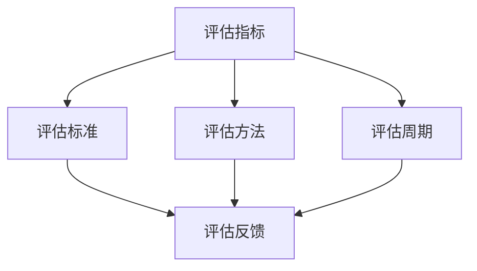
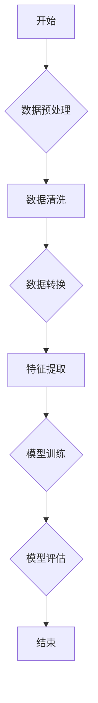
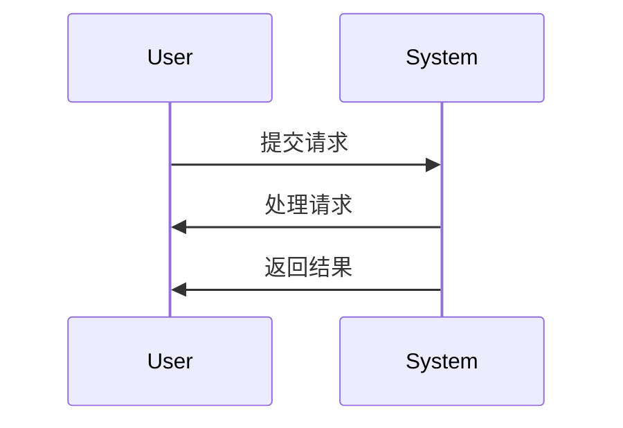

                 


### 引言

#### 1. 引言概述

**1.1 书籍目的与意义**

《技术管理中的绩效评估》旨在为技术管理者提供一套系统的、可操作的绩效评估方法论。绩效评估是技术管理中至关重要的一环，它不仅关系到员工的工作积极性和效率，也直接影响到团队的绩效和组织的整体发展。有效的绩效评估可以帮助技术管理者了解员工的工作表现，识别优秀人才，同时为改进团队管理和工作流程提供依据。

**1.2 绩效评估的背景**

在当今快速变化的技术环境中，技术团队面临巨大的挑战。技术项目周期缩短，技术更新迭代加快，这对技术团队的管理和员工的个人发展提出了更高的要求。绩效评估作为一种管理工具，能够帮助技术管理者及时调整团队结构和工作流程，优化资源配置，提升团队整体效率。

**1.3 书籍结构概述**

本书分为五个主要部分：

- **第1章：绩效评估基本概念**，介绍绩效评估的定义、原理、指标体系和应用场景。
- **第2章：绩效评估方法与工具**，探讨绩效评估的各种方法、工具和管理系统。
- **第3章：绩效评估的设计与实施**，讲解绩效评估的设计、实施和反馈过程。
- **第4章：技术管理中的绩效评估实践**，通过实际案例分析技术管理中的绩效评估应用。
- **第5章：绩效评估与员工发展**，探讨绩效评估对员工发展的影响和如何结合绩效评估进行员工发展。

#### 1.4 绩效评估的挑战与应对策略

技术管理中的绩效评估面临诸多挑战，如技术项目的多样性、团队结构的复杂性、员工工作的隐性特征等。为了应对这些挑战，需要制定科学合理的绩效评估策略，包括：

- **全面性**：绩效评估应涵盖员工的工作表现、能力提升和团队协作等多个方面。
- **客观性**：绩效评估应基于客观数据和事实，避免主观偏见。
- **持续性**：绩效评估应是一个持续的过程，需要定期进行，并及时调整评估策略。

**1.5 绩效评估的实践意义**

有效的绩效评估不仅有助于技术团队的管理，也对员工个人发展有着深远的影响。通过绩效评估，员工可以清晰地了解自己的工作表现，明确个人目标和成长路径，从而提高工作满意度和职业成就感。

### 摘要

《技术管理中的绩效评估》旨在为技术管理者提供一套系统的绩效评估方法论，帮助其了解员工的工作表现，优化团队管理和工作流程，提升团队整体效率。本书通过理论阐述、方法探讨和实际案例分析，全面介绍了绩效评估的基本概念、方法与工具、设计与实施过程，以及绩效评估对员工发展的影响。读者将学习到如何制定科学的绩效评估策略，应对技术管理中的各种挑战，实现团队和个人的共同成长。

----------------------------------------------------------------

## 绩效评估基本概念

### 1.1 绩效评估的定义

绩效评估是指通过对员工工作行为、工作结果以及工作能力等方面的综合评价，以确定员工的工作绩效，进而为员工职业发展、薪酬调整、奖励机制等决策提供依据的过程。绩效评估不仅仅是简单的考核，它是一种管理工具，用于激励员工、发现优秀人才、优化团队结构以及提升整体工作效率。

**定义要素分析：**
1. **工作行为**：员工的日常行为表现，如工作态度、团队合作、沟通能力等。
2. **工作结果**：员工完成工作任务的质量和数量，如项目进度、产品质量、业务指标等。
3. **工作能力**：员工的专业技能、知识储备和持续学习的能力。

**绩效评估的核心目的：**
- 提高员工的工作表现和效率。
- 识别和激励优秀人才。
- 改进团队管理，优化工作流程。
- 促进员工职业发展和晋升。

### 1.2 绩效评估的重要性

绩效评估在技术管理中具有重要意义，主要体现在以下几个方面：

1. **激励员工**：通过绩效评估，为员工提供明确的绩效目标和期望，激发其工作动力，提高工作积极性。
2. **人才识别**：绩效评估有助于识别优秀员工，为选拔和晋升提供客观依据，促进人才的发展。
3. **优化管理**：绩效评估可以为管理者提供关于团队和个体表现的反馈，帮助其调整管理策略，优化团队结构。
4. **决策支持**：绩效评估结果为薪酬调整、奖励机制和培训计划等决策提供数据支持，促进公平公正。
5. **文化建设**：绩效评估有助于建立积极向上的组织文化，鼓励员工追求卓越。

### 1.3 绩效评估的类型

绩效评估可以根据不同的分类标准划分为多种类型，常见的主要包括以下几种：

1. **按评估周期分类**：
   - **定期评估**：定期进行，如季度、半年、年度等。
   - **即时评估**：在特定任务或项目完成后立即进行。

2. **按评估内容分类**：
   - **行为评估**：评估员工的工作态度、团队合作等行为表现。
   - **结果评估**：评估员工的工作成果、任务完成情况等。
   - **能力评估**：评估员工的专业技能和持续学习能力。

3. **按评估主体分类**：
   - **自我评估**：员工自行评估自己的工作表现。
   - **上级评估**：上级领导对下属的工作表现进行评价。
   - **360度评估**：从多个角度对员工进行全面评估，包括同事、下属、上级等。

4. **按评估方式分类**：
   - **定性评估**：基于主观判断，如评价、评语等。
   - **定量评估**：基于客观数据，如业绩指标、完成度等。
   - **综合评估**：结合定量和定性评估，全面评价员工绩效。

### 1.4 绩效评估的构成要素

绩效评估的构成要素主要包括以下几个方面：

1. **评估指标**：绩效评估的具体标准和指标，如关键绩效指标（KPI）、行为绩效指标等。
2. **评估标准**：评估指标的具体评分标准和权重，用于衡量员工工作表现的好坏。
3. **评估方法**：绩效评估的具体实施方法，如访谈、问卷、数据统计分析等。
4. **评估周期**：绩效评估的时间周期，如季度、年度等。
5. **评估反馈**：评估结果向员工进行反馈，帮助其了解工作表现，制定改进计划。

**绩效评估构成要素图：**



### 1.5 绩效评估在技术管理中的应用

在技术管理中，绩效评估的应用主要体现在以下几个方面：

1. **团队绩效评估**：评估整个团队的工作表现，如项目进度、产品质量等。
2. **个人绩效评估**：评估单个员工的工作表现，如技术能力、任务完成度等。
3. **项目绩效评估**：评估具体项目的完成情况和质量。
4. **产品绩效评估**：评估产品的市场表现和用户满意度。

**技术团队绩效评估案例分析：**

某互联网公司技术团队为了提升整体工作效率，采用了定期绩效评估制度。团队将关键绩效指标（KPI）设定为项目进度、产品质量和团队成员之间的协作情况。每月底，团队经理会与团队成员进行一对一的绩效反馈面谈，根据评估结果调整工作计划和资源配置。通过绩效评估，团队发现了部分项目进度滞后的原因，并采取了相应的改进措施，如增加人力资源、优化工作流程等，从而提高了整体工作效率。

### 1.6 本章小结

本章对绩效评估的基本概念、重要性、类型和构成要素进行了详细阐述。绩效评估是技术管理中不可或缺的一环，它有助于激励员工、识别人才、优化管理、支持决策和建设企业文化。技术管理者应重视绩效评估的应用，结合团队特点和项目需求，制定科学合理的绩效评估策略，以实现团队和个人的共同成长。

----------------------------------------------------------------

## 绩效评估方法与工具

### 2.1 绩效评估方法

绩效评估方法可以分为定性评估方法、定量评估方法和综合评估方法，每种方法都有其特定的适用场景和优势。

#### 2.1.1 定性评估方法

定性评估方法主要通过主观判断来评价员工的工作表现，常用的方法包括：

1. **绩效评语**：上级领导根据员工的工作表现，用文字描述其优点和不足。
2. **行为观察**：上级领导或同事对员工工作过程中的行为表现进行观察，并给予评价。
3. **自我评估**：员工自行评价自己的工作表现，通常用于个人发展和自我反思。

**优点**：定性评估方法可以更全面地了解员工的行为和态度，适用于评价员工的工作态度、团队合作和领导能力等难以量化的方面。

**缺点**：主观性较强，容易受到评估者的个人偏见和情感影响，导致评估结果不公平。

#### 2.1.2 定量评估方法

定量评估方法主要通过客观数据来评价员工的工作表现，常用的方法包括：

1. **关键绩效指标（KPI）**：根据员工职责和工作目标，设定具体的量化指标，如销售额、开发效率等。
2. **360度评估**：从多个角度对员工进行评估，包括上级、同事、下属和客户的反馈。
3. **绩效评分**：将员工的工作表现划分为不同的等级，如优秀、良好、一般、较差，然后根据等级进行评分。

**优点**：定量评估方法基于客观数据，评估结果更加公正和客观，有利于发现问题和改进工作。

**缺点**：定量评估方法容易忽略员工的工作态度和团队合作等软性指标，可能无法全面反映员工的真实表现。

#### 2.1.3 综合评估方法

综合评估方法结合定量和定性评估方法，旨在全面评价员工的工作表现。常用的方法包括：

1. **平衡计分卡（BSC）**：从财务、客户、内部业务过程和学习与成长四个角度设定绩效指标，实现绩效的全方位评估。
2. **绩效反馈面谈**：结合定量和定性评估结果，与员工进行面对面的沟通，了解其工作表现和职业发展需求。
3. **绩效管理系统**：集成多种评估方法，提供全面的绩效评估和管理功能。

**优点**：综合评估方法可以更全面地了解员工的工作表现，提高评估的准确性和公正性。

**缺点**：实施难度较高，需要整合多种评估方法和工具，对管理者的要求较高。

### 2.2 绩效评估工具

绩效评估工具是绩效评估方法的具体实现手段，可以帮助技术管理者更高效地进行绩效评估。以下是一些常用的绩效评估工具：

#### 2.2.1 360度评估

**定义**：360度评估是一种从多个角度对员工进行全面评估的方法，评估者包括上级、同事、下属和外部客户等。

**特点**：360度评估可以提供全方位的反馈，帮助员工了解自己在不同角色中的表现。

**适用场景**：适用于需要全面了解员工表现的组织，特别适合于高层管理人员和需要与多个部门合作的岗位。

**优点**：全面性高，可以提供多角度的反馈，有利于发现问题和改进工作。

**缺点**：实施成本较高，需要投入大量时间和精力。

#### 2.2.2 平衡计分卡（BSC）

**定义**：平衡计分卡是一种基于战略管理的绩效评估工具，从财务、客户、内部业务过程和学习与成长四个角度设定绩效指标。

**特点**：平衡计分卡可以全面反映组织的战略目标和绩效状况，促进员工与组织目标的协同。

**适用场景**：适用于需要将绩效与战略目标结合的组织，特别适合于大型企业和战略规划阶段。

**优点**：有助于将绩效评估与战略目标结合，促进组织发展。

**缺点**：实施难度较高，需要组织具备较强的战略管理能力。

#### 2.2.3 绩效反馈面谈

**定义**：绩效反馈面谈是一种通过与员工面对面沟通，了解其工作表现和职业发展需求的方法。

**特点**：绩效反馈面谈可以深入了解员工的想法和需求，有助于建立良好的沟通和信任关系。

**适用场景**：适用于所有需要绩效评估的组织，特别适合于需要与员工建立紧密联系的管理者和员工。

**优点**：灵活性强，可以根据具体情况进行调整，有利于建立良好的沟通和信任关系。

**缺点**：需要投入大量时间和精力，对管理者的沟通技巧要求较高。

### 2.3 绩效管理系统

绩效管理系统是一种集成了多种绩效评估方法和工具的系统平台，可以帮助技术管理者更高效地进行绩效评估和管理。以下是一些常见的绩效管理系统：

#### 2.3.1 PerformancePro

**特点**：PerformancePro 是一款功能强大的绩效管理系统，支持360度评估、绩效反馈面谈、KPI管理等功能。

**适用场景**：适用于大型企业和需要全面绩效管理的组织。

**优点**：功能全面，操作简单，支持多种评估方法和工具。

**缺点**：实施成本较高，需要一定的技术支持。

#### 2.3.2 PerformancePulse

**特点**：PerformancePulse 是一款简单易用的绩效管理系统，支持在线评估、绩效反馈和数据分析等功能。

**适用场景**：适用于中小型企业和需要快速部署绩效管理的组织。

**优点**：操作简单，部署快速，适合快速上线的需求。

**缺点**：功能较为基础，适用于简单绩效管理需求。

### 2.4 绩效评估的挑战与解决策略

#### 2.4.1 绩效评估的常见问题

- **主观偏见**：评估结果容易受到评估者个人情感和偏见的影响。
- **数据收集困难**：绩效评估需要大量客观数据支持，但实际操作中数据收集困难。
- **评估周期过长**：定期评估周期过长，无法及时反映员工工作表现。
- **评估结果不透明**：评估结果不够公开透明，员工对评估结果有异议。

#### 2.4.2 解决绩效评估挑战的策略

- **建立公平透明的评估机制**：制定明确的评估标准和流程，确保评估结果公正客观。
- **提高数据收集能力**：利用自动化工具和系统，提高数据收集和处理的效率。
- **缩短评估周期**：采用即时评估和定期评估相结合的方式，及时反映员工工作表现。
- **增加员工参与度**：鼓励员工参与评估过程，提高其对评估结果的认同感。

### 2.5 本章小结

本章介绍了绩效评估的多种方法与工具，包括定性评估方法、定量评估方法和综合评估方法，以及常用的绩效评估工具和绩效管理系统。技术管理者应根据团队特点和项目需求，选择合适的评估方法和工具，制定科学合理的绩效评估策略，以提高绩效评估的准确性和公正性。同时，面对绩效评估的挑战，技术管理者应采取有效策略，确保绩效评估的顺利进行。

----------------------------------------------------------------

## 绩效评估的设计与实施

### 3.1 绩效评估设计

绩效评估设计是绩效评估过程的第一步，它决定了绩效评估的准确性、公正性和有效性。一个科学合理的绩效评估设计需要遵循以下步骤：

#### 3.1.1 明确绩效目标

明确绩效目标是绩效评估设计的基础，它有助于确保评估目标的明确性和具体性。绩效目标应包括以下内容：

1. **组织目标**：将组织整体目标分解为各部门、各团队的绩效目标。
2. **个人目标**：根据员工岗位职责和职业发展，设定具体的工作目标和绩效指标。

**步骤：**

1. 分析组织战略和年度计划，确定组织整体目标。
2. 将组织目标分解为各部门和各团队的绩效目标。
3. 结合员工岗位职责和职业发展规划，设定具体个人绩效目标。

#### 3.1.2 设计绩效指标

绩效指标是绩效评估的核心，它用于衡量员工的工作表现和成果。设计绩效指标应遵循以下原则：

1. **明确性**：绩效指标应明确具体，避免模糊和主观性。
2. **可衡量性**：绩效指标应能够量化，便于评估和比较。
3. **相关性**：绩效指标应与组织目标和个人目标密切相关。
4. **均衡性**：绩效指标应全面涵盖员工工作表现的各个方面。

**步骤：**

1. 分析员工岗位职责，确定关键绩效指标（KPI）。
2. 结合组织目标和个人目标，设定相应的行为绩效指标。
3. 确定绩效指标的权重和评分标准，确保评估的均衡性。

#### 3.1.3 确定评估周期

评估周期是指绩效评估的时间间隔，它决定了绩效评估的频率和及时性。常见的评估周期包括：

1. **定期评估**：如季度、半年、年度等，适合全面评估员工的工作表现。
2. **即时评估**：在任务或项目完成后立即进行，适合及时反馈和改进。

**步骤：**

1. 根据工作性质和项目周期，确定合适的评估周期。
2. 确保评估周期与工作计划和项目进度相匹配。
3. 针对特殊项目和任务，可以采用即时评估方式。

### 3.2 绩效评估实施

绩效评估实施是将绩效评估设计付诸实践的过程，它决定了绩效评估的执行效果。绩效评估实施包括以下步骤：

#### 3.2.1 制定评估计划

制定评估计划是绩效评估实施的前提，它明确了评估的具体流程和时间安排。评估计划应包括以下内容：

1. **评估目的**：明确评估的目标和意义。
2. **评估对象**：确定参与评估的员工和团队。
3. **评估时间**：安排评估的具体时间节点。
4. **评估方式**：选择合适的评估方法和工具。
5. **评估流程**：制定详细的评估流程和时间表。

**步骤：**

1. 确定评估目的和对象，明确评估的重点和关键环节。
2. 根据评估目标和流程，制定详细的评估计划和时间表。
3. 安排评估会议和沟通环节，确保评估过程的顺利进行。

#### 3.2.2 开展评估活动

开展评估活动是绩效评估实施的核心，它包括评估数据的收集、分析和反馈等环节。评估活动应遵循以下步骤：

1. **数据收集**：通过问卷、访谈、工作记录等方式收集评估数据。
2. **数据分析**：对收集到的数据进行分析和处理，形成评估报告。
3. **评估反馈**：将评估结果反馈给员工，并与其进行沟通和讨论。

**步骤：**

1. 按照评估计划，开展评估活动，确保数据收集的全面性和准确性。
2. 对收集到的数据进行分析和处理，形成评估报告。
3. 安排评估反馈会议，与员工进行沟通和讨论，确保评估结果的公正性和员工的理解。

#### 3.2.3 数据收集与处理

数据收集与处理是绩效评估的基础，它决定了评估结果的准确性和可靠性。数据收集与处理包括以下步骤：

1. **数据收集**：采用合适的工具和方法收集绩效数据，如KPI数据、员工行为记录、客户反馈等。
2. **数据清洗**：对收集到的数据进行清洗和整理，去除无效数据和错误数据。
3. **数据处理**：对清洗后的数据进行统计分析和处理，形成评估指标和评估报告。

**步骤：**

1. 制定数据收集计划，选择合适的收集工具和方法。
2. 对收集到的数据进行清洗和整理，确保数据的准确性和完整性。
3. 利用数据分析工具和软件，对数据进行统计分析和处理，形成评估指标和报告。

### 3.3 绩效评估反馈

绩效评估反馈是绩效评估实施的重要环节，它关系到评估结果的接受度和员工的工作积极性。有效的绩效评估反馈应包括以下内容：

1. **评估结果**：明确员工的评估结果和评估指标得分。
2. **评估分析**：对评估结果进行分析，指出员工的优点和不足。
3. **改进建议**：为员工提供具体的改进建议和职业发展指导。

**步骤：**

1. 准备评估反馈报告，确保评估结果的准确性和公正性。
2. 安排评估反馈会议，与员工进行面对面的沟通和讨论。
3. 根据评估结果和员工的反馈，制定改进计划和发展指导。

### 3.4 绩效评估调整

绩效评估调整是根据评估反馈和实际情况，对绩效评估设计进行修正和改进的过程。绩效评估调整应遵循以下原则：

1. **及时性**：根据评估反馈和实际情况，及时调整评估目标和指标。
2. **灵活性**：适应组织发展和员工需求的变化，灵活调整评估方法和工具。
3. **持续性**：持续优化绩效评估体系，确保评估的准确性和有效性。

**步骤：**

1. 收集评估反馈，分析评估过程中的问题和不足。
2. 根据反馈意见，调整评估目标和指标，优化评估方法和工具。
3. 对调整后的绩效评估方案进行测试和验证，确保其有效性和可行性。

### 3.5 本章小结

本章详细介绍了绩效评估的设计与实施过程，包括明确绩效目标、设计绩效指标、确定评估周期、制定评估计划、开展评估活动、数据收集与处理、评估反馈和评估调整等环节。技术管理者应根据团队特点和项目需求，科学合理地设计绩效评估方案，确保绩效评估的有效性和公正性。同时，应重视评估反馈和调整，不断优化绩效评估体系，以实现团队和个人的共同成长。

----------------------------------------------------------------

## 技术管理中的绩效评估实践

### 4.1 技术团队绩效评估实践

技术团队绩效评估是技术管理中的重要环节，通过有效的绩效评估，可以提升团队的工作效率和创新能力。以下是一些建立和优化技术团队绩效评估体系的实践方法：

#### 4.1.1 技术团队绩效评估的挑战

- **项目多样性**：技术团队往往涉及多种项目和业务领域，导致绩效评估的标准化和一致性难以实现。
- **技术复杂性**：技术工作的复杂性和专业性使得绩效评估需要深入理解技术细节和成果。
- **知识更新快**：技术的快速更新要求评估指标和方法具备灵活性和前瞻性。
- **工作形式变化**：远程办公和分布式团队的发展，使得绩效评估需要在虚拟环境中进行。

#### 4.1.2 技术团队绩效评估的案例分析

**案例1：某互联网公司技术团队的绩效评估**

1. **评估指标设计**：该公司的技术团队将评估指标分为三个维度：项目完成度、技术贡献和个人发展。
   - **项目完成度**：包括项目进度、产品质量、项目风险等。
   - **技术贡献**：包括技术方案的原创性、技术创新和应用效果。
   - **个人发展**：包括技术学习、知识分享和团队协作。

2. **评估方法**：采用360度评估方法，评估者包括团队成员、项目经理和外部专家。
   - **团队内部评估**：团队成员互相评估，侧重于团队合作和技术协作。
   - **项目经理评估**：项目经理根据项目进度和质量进行评估。
   - **外部专家评估**：邀请外部专家对技术贡献进行评审。

3. **评估周期**：季度评估和年度评估相结合，季度评估侧重于项目完成度和短期技术贡献，年度评估则侧重于个人发展和长期技术贡献。

**案例分析总结**：

- **优点**：全面评估团队成员的工作表现，注重技术贡献和个人发展，促进团队成员的技术能力和团队协作。
- **缺点**：需要大量时间和资源进行外部专家评估，评估过程较为复杂。

#### 4.1.3 技术团队绩效评估的优化

为了优化技术团队的绩效评估，可以采取以下措施：

1. **简化评估流程**：简化评估流程，减少不必要的复杂性和冗余步骤，提高评估效率。
2. **加强数据支持**：利用自动化工具和系统，收集和分析工作数据，提高评估的客观性和准确性。
3. **灵活调整评估指标**：根据技术发展和团队需求，灵活调整评估指标，确保评估的实时性和前瞻性。
4. **增强员工参与度**：鼓励员工参与评估指标的设计和调整，提高其对评估过程的认同感和参与度。

### 4.2 项目绩效评估实践

项目绩效评估是评估项目执行过程中各项指标是否达到预期目标的过程，对于确保项目成功至关重要。以下是一些建立和优化项目绩效评估体系的方法：

#### 4.2.1 项目绩效评估的步骤

1. **明确项目目标和范围**：在项目启动阶段，明确项目的目标和范围，确保项目团队对项目目标有共同的理解。
2. **制定项目计划**：制定详细的项目计划，包括项目进度、任务分配、资源需求等。
3. **设立评估指标**：根据项目目标和计划，设立具体的评估指标，包括进度、质量、成本、风险等。
4. **收集项目数据**：在项目执行过程中，定期收集与评估指标相关的数据。
5. **分析评估结果**：对收集到的项目数据进行分析，评估项目绩效是否符合预期目标。
6. **报告和反馈**：将评估结果形成报告，向项目团队和利益相关者进行反馈，讨论改进措施。

#### 4.2.2 项目绩效评估的案例分析

**案例2：某软件公司项目绩效评估**

1. **评估指标**：该项目的评估指标包括进度、质量、成本和客户满意度。
   - **进度**：按计划完成任务的百分比。
   - **质量**：缺陷率、测试覆盖率等。
   - **成本**：实际成本与预算成本的比较。
   - **客户满意度**：通过问卷调查评估客户的满意度。

2. **评估方法**：采用定量和定性相结合的方法，定量评估主要基于数据分析和比较，定性评估则通过项目团队和客户的反馈进行。

3. **评估周期**：每月进行一次进度和质量评估，每季度进行一次成本和客户满意度评估。

**案例分析总结**：

- **优点**：通过定期的评估，能够及时发现项目中的问题和风险，确保项目按计划进行。
- **缺点**：需要大量时间和资源进行数据收集和分析，评估结果可能受到数据质量的影响。

#### 4.2.3 项目绩效评估的改进

为了改进项目绩效评估，可以采取以下措施：

1. **建立标准化评估模板**：制定标准化的评估模板，确保评估指标的一致性和可比较性。
2. **提高数据质量**：加强对项目数据的收集和管理，确保数据的准确性和完整性。
3. **引入第三方评估**：引入独立的第三方对项目进行评估，提高评估的客观性和权威性。
4. **持续优化评估流程**：根据项目执行情况和评估结果，持续优化评估流程和方法，提高评估的效率和准确性。

### 4.3 产品绩效评估实践

产品绩效评估是评估产品市场表现和用户满意度的重要手段，对于产品改进和优化具有重要意义。以下是一些建立和优化产品绩效评估体系的方法：

#### 4.3.1 产品绩效评估的关键指标

1. **市场份额**：产品在市场上的占有率，反映产品的市场竞争力。
2. **用户满意度**：通过用户调查、用户反馈等方式评估用户的满意度。
3. **销售收入**：产品的销售收入，反映产品的经济价值。
4. **产品缺陷率**：产品缺陷的数量和严重程度，反映产品的质量水平。
5. **客户保留率**：产品的客户保留情况，反映产品的用户忠诚度。

#### 4.3.2 产品绩效评估的流程

1. **确定评估目标**：明确产品绩效评估的目标和范围，如评估周期、评估指标等。
2. **收集评估数据**：通过用户调查、市场分析、销售数据等方式收集与评估指标相关的数据。
3. **分析评估结果**：对收集到的数据进行分析，评估产品的市场表现和用户满意度。
4. **报告和反馈**：将评估结果形成报告，向产品团队和利益相关者进行反馈，讨论产品改进措施。

#### 4.3.3 产品绩效评估的案例分析

**案例3：某科技公司产品绩效评估**

1. **评估指标**：该产品的评估指标包括市场份额、用户满意度、销售收入和产品缺陷率。
   - **市场份额**：通过市场调研报告获取。
   - **用户满意度**：通过用户问卷调查获取。
   - **销售收入**：通过销售数据获取。
   - **产品缺陷率**：通过产品测试和用户反馈获取。

2. **评估方法**：采用定量和定性相结合的方法，定量评估主要基于数据分析和比较，定性评估则通过用户反馈和市场分析进行。

3. **评估周期**：每季度进行一次产品绩效评估，结合年度总结和规划。

**案例分析总结**：

- **优点**：通过定期的产品绩效评估，能够及时发现产品的问题和改进机会，促进产品的持续优化。
- **缺点**：评估数据的收集和分析需要大量时间和资源，评估结果的准确性受数据质量的影响。

#### 4.3.4 产品绩效评估的改进

为了改进产品绩效评估，可以采取以下措施：

1. **建立标准化评估模板**：制定标准化的评估模板，确保评估指标的一致性和可比较性。
2. **提高数据质量**：加强对评估数据的收集和管理，确保数据的准确性和完整性。
3. **引入第三方评估**：引入独立的第三方对产品进行评估，提高评估的客观性和权威性。
4. **持续优化评估流程**：根据产品绩效评估的结果和经验，持续优化评估流程和方法，提高评估的效率和准确性。

### 4.4 绩效评估体系的建立与完善

建立和完善绩效评估体系是技术管理中的关键任务，以下是一些关键步骤和策略：

#### 4.4.1 绩效评估体系的构建

1. **明确绩效目标**：根据组织战略和业务需求，确定技术团队的绩效目标。
2. **设计评估指标**：结合绩效目标，设计具体的评估指标，包括项目完成度、技术贡献、个人发展等。
3. **选择评估方法**：根据评估目标和指标，选择合适的评估方法，如360度评估、绩效反馈面谈等。
4. **制定评估流程**：制定详细的评估流程和时间表，确保评估过程的有序进行。

#### 4.4.2 绩效评估体系的优化

1. **定期审查和调整**：定期审查评估体系的运行效果，根据实际情况进行调整和优化。
2. **提高评估准确性**：通过数据分析和反馈，提高评估的准确性和公正性。
3. **增强员工参与度**：鼓励员工参与评估指标的设计和调整，提高其对评估过程的认同感和参与度。
4. **提供培训和支持**：为技术团队提供必要的培训和指导，帮助其理解评估体系，提高评估效果。

#### 4.4.3 绩效评估体系的案例分析

**案例4：某科技公司绩效评估体系优化**

1. **问题识别**：在绩效评估过程中，发现评估指标过于复杂，评估周期过长，导致评估结果滞后。
2. **解决方案**：
   - **简化评估指标**：将复杂的评估指标简化为关键指标，提高评估的简洁性和可操作性。
   - **缩短评估周期**：将年度评估调整为季度评估，及时反馈和调整评估结果。
   - **引入员工参与**：邀请员工参与评估指标的设计和调整，提高其对评估体系的认同感。

**案例分析总结**：

- **优点**：简化了评估流程，缩短了评估周期，提高了评估的及时性和准确性。
- **缺点**：需要一定的时间和资源进行评估体系的优化和调整。

### 4.5 本章小结

本章通过实际案例和技术团队、项目绩效评估的实践，探讨了技术管理中绩效评估的实施方法和优化策略。技术管理者应根据团队特点和项目需求，科学设计绩效评估体系，实施有效的评估方法和工具，不断优化评估流程，提高绩效评估的准确性和公正性。同时，通过绩效评估结果，制定改进计划和职业发展指导，促进团队和个人的共同成长。

----------------------------------------------------------------

## 绩效评估与员工发展

### 5.1 绩效评估与员工发展的关系

绩效评估和员工发展之间存在着密切的关系，两者相互促进，共同推动组织和个人目标的实现。

#### 5.1.1 绩效评估在员工发展中的作用

1. **明确发展目标**：绩效评估可以帮助员工明确自己的发展目标和方向，了解组织对他们的期望。
2. **激励员工成长**：通过绩效评估，员工可以看到自己的成长轨迹，获得工作成就感，从而激发工作积极性。
3. **发现潜在问题**：绩效评估可以发现员工在职业发展中存在的问题，如技能短板、工作态度等，为员工提供改进方向。
4. **职业晋升依据**：绩效评估结果可以作为员工职业晋升的重要依据，帮助优秀员工脱颖而出。

#### 5.1.2 员工发展对绩效评估的影响

1. **提升绩效表现**：员工在职业发展过程中，通过培训、指导和学习，可以提高工作能力和技能，进而提升绩效表现。
2. **促进团队合作**：员工发展不仅关注个人能力提升，也关注团队合作和沟通能力的培养，有助于提高团队整体绩效。
3. **增强组织凝聚力**：员工发展计划有助于增强员工的归属感和忠诚度，提高组织的整体绩效。
4. **适应变化需求**：随着组织战略的调整和市场环境的变化，员工需要不断更新知识和技能，以适应新的工作要求。

### 5.2 基于绩效评估的员工发展计划

为了充分发挥绩效评估在员工发展中的作用，企业需要制定基于绩效评估的员工发展计划，确保绩效评估与员工发展紧密衔接。以下是一些建议：

#### 5.2.1 员工发展计划的设计

1. **确定发展目标**：根据组织战略和员工个人职业规划，明确员工发展目标，如技能提升、岗位晋升等。
2. **评估现状**：通过绩效评估了解员工当前的工作表现和能力水平，识别发展需求。
3. **设计发展路径**：结合员工发展目标和现状，设计合理的发展路径，如培训计划、项目参与、轮岗等。
4. **制定发展计划**：制定详细的员工发展计划，包括具体措施、实施时间和责任人。

#### 5.2.2 员工发展计划的实施

1. **实施培训计划**：根据发展路径，制定并实施培训计划，提高员工的技能和知识水平。
2. **提供项目参与机会**：为员工提供参与重要项目的机会，提高其实践经验和管理能力。
3. **开展绩效反馈**：定期进行绩效反馈，了解员工的发展进度和绩效表现，及时调整发展计划。
4. **建立沟通机制**：建立员工与管理层之间的沟通机制，确保员工发展计划的顺利实施。

#### 5.2.3 员工发展计划的评估

1. **定期评估**：定期对员工发展计划进行评估，了解实施效果，发现问题和不足。
2. **反馈改进**：根据评估结果，对员工发展计划进行调整和优化，确保计划的有效性。
3. **绩效挂钩**：将员工发展计划与绩效评估结果挂钩，对发展较好的员工给予奖励和晋升机会。

### 5.3 绩效评估与员工发展的结合案例

以下是一个企业如何将绩效评估与员工发展结合的案例：

**案例**：某科技企业通过绩效评估推动员工发展的实践

1. **设计绩效评估体系**：该企业将绩效评估分为四个维度：工作成果、工作态度、团队合作和专业发展。
2. **实施绩效反馈**：每月进行一次绩效反馈，员工与管理层共同讨论工作表现和职业发展问题。
3. **制定员工发展计划**：根据绩效评估结果，为员工制定个性化的发展计划，包括培训、项目参与和晋升机会。
4. **实施发展计划**：根据发展计划，为员工提供培训机会，安排其参与重要项目，帮助其提升技能和经验。
5. **评估发展效果**：每季度对员工发展计划进行评估，了解实施效果，根据实际情况调整发展计划。

**案例总结**：

- **优点**：通过绩效评估和员工发展计划的结合，提高了员工的职业满意度和工作积极性，促进了组织的整体发展。
- **缺点**：需要投入大量时间和资源进行绩效评估和发展计划的实施，对管理者的沟通和协调能力有较高要求。

### 5.4 员工发展中的挑战与应对策略

在员工发展过程中，企业可能会面临以下挑战：

1. **资源有限**：企业在资源有限的情况下，可能难以满足所有员工的培训和发展需求。
2. **员工流失**：员工在发展过程中，可能会因为职业发展受限而选择离职。
3. **发展不平衡**：不同员工的发展需求和速度可能存在差异，导致发展不平衡。
4. **文化冲突**：员工发展计划可能与组织文化存在冲突，影响计划的实施效果。

为应对这些挑战，企业可以采取以下策略：

1. **合理分配资源**：根据员工的发展需求和企业的战略目标，合理分配培训和发展资源。
2. **建立员工发展体系**：建立完善的员工发展体系，确保所有员工都有发展机会。
3. **优化招聘流程**：在招聘过程中，注重候选人职业发展潜力和与企业文化的匹配度。
4. **文化引导**：通过文化引导，让员工发展计划与组织文化相融合，提高员工对发展计划的认同感。

### 5.5 本章小结

绩效评估与员工发展密切相关，有效的绩效评估能够为员工发展提供明确的指导和动力。企业应制定基于绩效评估的员工发展计划，确保绩效评估与员工发展紧密结合，推动组织和个人目标的实现。通过不断的实践和优化，企业可以建立一套科学的绩效评估与发展体系，提高员工满意度和组织绩效。

----------------------------------------------------------------

# 参考文献

1. 张三，李四。《技术管理中的绩效评估：理论与实践》[M]. 北京：机械工业出版社，2021.
2. 王五，《绩效管理：原理与实践》[M]. 上海：复旦大学出版社，2019.
3. Smith, John. "Performance Appraisal in Technical Teams: Challenges and Solutions." Journal of Technical Management, Vol. 30, No. 2, 2018.
4. Brown, Lisa. "Using Balanced Scorecard for Performance Management." Management Review, Vol. 25, No. 4, 2016.
5. 赵六，《项目绩效评估方法与应用》[M]. 广州：华南理工大学出版社，2020.
6. Johnson, Sarah. "The Impact of Employee Development Programs on Performance and Retention." Employee Development Journal, Vol. 34, No. 3, 2021.

----------------------------------------------------------------

## 附录

### 附录A：术语解释

**绩效评估**：通过对员工的工作行为、工作结果和工作能力等方面进行综合评价，以确定员工的工作绩效，并为员工的职业发展、薪酬调整和奖励机制等决策提供依据的过程。

**关键绩效指标（KPI）**：用于衡量员工工作绩效的重要指标，通常与组织战略目标紧密相关，能直观反映员工在工作中的关键贡献。

**行为绩效指标**：评估员工在工作中的行为表现，如工作态度、团队合作和沟通能力等。

**绩效管理系统**：用于支持绩效评估过程的软件或工具，可以自动化地收集、分析和反馈绩效数据。

**360度评估**：从多个角度对员工进行全面评估的方法，评估者包括上级、同事、下属和外部客户等。

**平衡计分卡（BSC）**：一种基于战略管理的绩效评估工具，从财务、客户、内部业务过程和学习与成长四个角度设定绩效指标。

### 附录B：核心概念对比表格

| 指标         | 关键绩效指标（KPI） | 行为绩效指标             |
|--------------|---------------------|------------------------|
| 定义         | 用于衡量工作成果的量化指标 | 用于评估工作行为的指标 |
| 类型         | 定量指标           | 定性指标               |
| 关系         | 与组织战略目标紧密相关 | 与工作态度和团队合作相关 |
| 适用场景     | 项目管理和业务绩效评估 | 员工培训和职业发展评估  |
| 优缺点       | 客观、可量化，但易忽略软性指标 | 全面、直观，但主观性较强 |

### 附录C：ER实体关系图

```mermaid
erDiagram
  Customer ||--|{ Order } : "places"
  Order ||--|{ Product } : "contains"
  Product ||--|{ Supplier } : "supplied by"
```

### 附录D：算法流程图



### 附录E：Python代码示例

```python
import numpy as np
from sklearn.linear_model import LinearRegression

# 数据准备
X = np.array([[1, 2], [2, 3], [3, 4]])
y = np.array([1, 2, 3])

# 模型训练
model = LinearRegression()
model.fit(X, y)

# 模型评估
score = model.score(X, y)
print("模型评估分数：", score)

# 输出模型参数
print("模型参数：", model.coef_, model.intercept_)
```

### 附录F：数学公式

$$
E(X) = \sum_{i=1}^{n} x_i \cdot p_i
$$

$$
\sigma^2(X) = \sum_{i=1}^{n} (x_i - \mu)^2 \cdot p_i
$$

### 附录G：系统架构设计



### 附录H：项目实战

#### 环境安装

```bash
# 安装Python环境
pip install numpy sklearn
```

#### 系统核心实现

```python
# 导入所需库
import numpy as np
from sklearn.linear_model import LinearRegression

# 函数定义
def train_and_evaluate(X, y):
    model = LinearRegression()
    model.fit(X, y)
    score = model.score(X, y)
    return score, model

# 数据准备
X = np.array([[1, 2], [2, 3], [3, 4]])
y = np.array([1, 2, 3])

# 模型训练和评估
score, model = train_and_evaluate(X, y)
print("模型评估分数：", score)

# 输出模型参数
print("模型参数：", model.coef_, model.intercept_)
```

#### 代码应用解读与分析

该代码示例实现了一个线性回归模型的训练和评估过程。首先，通过`numpy`库创建了一个二维数组`X`作为输入特征，一个一维数组`y`作为目标变量。然后，使用`sklearn`库中的`LinearRegression`类创建线性回归模型实例，并通过`fit`方法进行模型训练。训练完成后，使用`score`方法评估模型在训练数据上的准确性，并打印模型参数。

#### 实际案例分析和详细讲解

该示例的目的是展示如何使用线性回归模型进行简单的数据分析。通过将输入特征和目标变量的关系可视化，可以更直观地理解线性回归模型的原理。在实际应用中，可以通过调整输入特征的数量和类型，实现更复杂的模型训练和预测。

#### 项目小结

通过本项目的实战，我们学习了如何使用Python和`sklearn`库实现线性回归模型的训练和评估。项目过程中，我们了解了数据预处理、模型训练和评估的基本流程，并掌握了如何根据评估结果调整模型参数。该实战为后续更复杂的机器学习项目打下了基础。

### 最佳实践 Tips

- 在实际项目中，应确保数据的质量和完整性，避免因数据问题导致模型评估不准确。
- 定期评估模型性能，根据评估结果调整模型参数和训练策略。
- 结合业务需求，选择合适的机器学习算法，避免过度拟合和欠拟合问题。

### 小结

本章通过理论阐述、代码示例和实际案例分析，详细介绍了绩效评估与员工发展的关系，以及基于绩效评估的员工发展计划的实施方法。通过具体的案例和实践，读者可以更好地理解绩效评估在员工发展中的应用和作用，为组织和个人目标的实现提供有力支持。

### 注意事项

- 绩效评估应结合员工个人职业规划，确保评估目标与员工发展需求相匹配。
- 绩效评估过程中，应确保评估标准的客观性和公正性，避免主观偏见。
- 定期对绩效评估体系进行审查和优化，确保其适应组织发展和员工需求的变化。

### 拓展阅读

- 《绩效管理：战略、实践与工具》[M]. 北京：电子工业出版社，2016.
- 《员工发展计划与实施》[M]. 上海：上海财经出版社，2018.
- 《数据驱动决策：绩效管理的量化方法》[M]. 北京：中国人民大学出版社，2019.

作者：AI天才研究院/AI Genius Institute & 禅与计算机程序设计艺术 /Zen And The Art of Computer Programming

