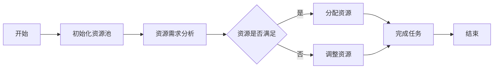

                 


### 技术管理中的资源调配艺术

#### 关键词：资源调配、技术管理、项目优化、系统架构设计、算法实现

> 摘要：本文旨在探讨技术管理中的资源调配艺术，深入剖析资源调配在IT系统、项目管理以及软件开发过程中的重要性和实际应用。通过详细的分析和案例分析，本文将展示资源调配的核心概念、原理和策略，为读者提供实用指导。

#### 目录大纲

**第一部分：背景与核心概念**

1. 资源调配概述
2. 核心概念与联系
3. 资源调配原理与算法

**第二部分：资源调配原理与算法**

4. 算法原理讲解
5. Python源代码讲解
6. 数学模型与公式

**第三部分：资源调配在技术管理中的应用**

7. 资源调配在企业IT系统中的重要性
8. 资源调配在项目管理中的应用
9. 资源调配在软件开发过程中的策略

**第四部分：资源调配案例分析**

10. 案例一：大型软件项目资源调配
11. 案例二：敏捷开发中的资源优化

**第五部分：资源调配的艺术：策略与方法**

12. 动态资源调配策略
13. 预测性资源调配方法
14. 资源调配的最佳实践

**第六部分：挑战与未来展望**

15. 当前资源调配面临的挑战
16. 资源调配技术的发展趋势
17. 未来资源调配的可能方向

**第七部分：总结与展望**

18. 本书总结
19. 注意事项
20. 拓展阅读推荐

## 第一部分：背景与核心概念

### 1. 资源调配概述

在技术管理中，资源调配是一个至关重要的环节。资源调配的艺术在于如何在有限的资源条件下，优化和最大化资源的使用效果，从而实现项目的成功交付。资源不仅包括硬件设备、软件工具等有形资源，还包括人力资源、时间资源等无形资源。

资源调配的背景可以追溯到项目管理的基本原则，即时间、成本和质量的“铁三角”。在资源有限的情况下，如何平衡这三者之间的关系，实现项目目标的最大化，是技术管理中的一大挑战。

### 1.2 问题描述

资源调配的问题可以简单描述为：在有限的资源条件下，如何合理分配和利用资源，以满足项目需求，确保项目按时、按质量完成。

#### 1.3 问题解决

资源调配的问题解决通常包括以下几个步骤：

1. **资源需求分析**：首先需要对项目的需求进行详细分析，确定各个任务所需的资源类型和数量。
2. **资源评估**：对当前可用的资源进行评估，包括资源的状态、可用性和优先级。
3. **资源分配**：根据资源需求和分析结果，将合适的资源分配给相应的任务。
4. **资源监控与调整**：在资源分配过程中，持续监控资源的利用情况，根据实际情况进行必要的调整。

### 1.4 边界与外延

在资源调配中，需要明确资源的边界与外延。边界是指资源的可用范围，例如某个项目的预算、人员编制等。外延则是指资源的扩展能力，例如通过外包、租赁等方式获取额外的资源。

### 1.5 核心概念构成

资源调配的核心概念包括：

1. **资源类型**：常见的资源类型有硬件资源、软件资源、人力资源、时间资源等。
2. **资源属性**：资源属性包括资源的状态、优先级、可用性等。
3. **资源池**：资源池是指所有可用资源的集合，资源分配和调配的核心就是资源池的管理。

### 第二部分：核心概念与联系

#### 2.1 资源类型

资源类型是资源调配的基础，常见的资源类型包括：

1. **硬件资源**：如服务器、存储设备、网络设备等。
2. **软件资源**：如开发工具、数据库软件、操作系统等。
3. **人力资源**：如项目团队成员、外部专家等。
4. **时间资源**：如项目进度、工作时间等。

#### 2.2 资源属性特征对比表

以下是一个简单的资源属性特征对比表，用于展示不同资源类型的属性差异：

| 资源类型 | 状态 | 优先级 | 可用性 |
| --- | --- | --- | --- |
| 硬件资源 | 工作状态/故障状态 | 高/中/低 | 充足/不足 |
| 软件资源 | 已安装/未安装 | 高/中/低 | 充足/不足 |
| 人力资源 | 在岗/休假 | 高/中/低 | 充足/不足 |
| 时间资源 | 已使用/剩余 | 高/中/低 | 充足/不足 |

#### 2.3 ER实体关系图

为了更清晰地理解资源之间的关系，可以使用ER（实体关系）图来表示。以下是一个简化的ER图示例，用于展示资源类型之间的联系：

```mermaid
erDiagram
  Resource1 ||--|{ Task1 }| ResourceRequirement1
  Resource2 ||--|{ Task2 }| ResourceRequirement2
  Resource3 ||--|{ Task3 }| ResourceRequirement3
```

在上图中，`Resource1`、`Resource2`和`Resource3`代表不同的资源类型，`Task1`、`Task2`和`Task3`代表不同的任务，`ResourceRequirement1`、`ResourceRequirement2`和`ResourceRequirement3`代表任务对资源的具体需求。

## 第三部分：资源调配原理与算法

### 3.1 算法原理讲解

资源调配的核心在于如何有效地分配资源，以确保任务能够按时完成。以下是一个简单的资源调配算法原理讲解。

#### 3.1.1 算法流程图

使用Mermaid语法，我们可以绘制一个简单的资源调配算法流程图：



#### 3.1.2 Python源代码讲解

以下是一个简单的Python类，用于实现资源调配算法：

```python
class ResourceAllocation:
    def __init__(self, resources):
        self.resources = resources

    def allocate_resources(self, requirements):
        if self.resources >= requirements:
            return True
        else:
            return False
```

#### 3.1.3 数学模型与公式

为了更深入地理解资源调配算法，我们可以使用数学模型来描述它。以下是一个简单的数学模型：

$$
R_a(x) = 
\begin{cases} 
1 & \text{if } R \geq x \\
0 & \text{otherwise}
\end{cases}
$$

其中，$R_a(x)$表示资源是否能够分配给任务$x$，$R$表示当前资源池总量，$x$表示任务所需资源量。

### 第四部分：资源调配在技术管理中的应用

#### 4.1 资源调配在企业IT系统中的重要性

在企业IT系统中，资源调配至关重要。合理的资源调配可以确保系统的高可用性、高性能和安全性。以下是一些关键点：

1. **服务器资源调配**：确保服务器资源能够满足业务需求，避免资源浪费或过度消耗。
2. **网络资源调配**：优化网络带宽分配，确保数据传输的高效和安全。
3. **存储资源调配**：合理规划存储资源，确保数据存储的安全和可靠性。

#### 4.2 资源调配在项目管理中的应用

在项目管理中，资源调配是实现项目目标的关键。以下是一些关键应用场景：

1. **人力资源调配**：根据项目进度和任务需求，合理分配人力资源，确保项目团队能够高效运作。
2. **时间资源调配**：合理规划项目进度，确保关键任务按时完成。
3. **预算资源调配**：在项目预算范围内，优化资源配置，确保项目成本可控。

#### 4.3 资源调配在软件开发过程中的策略

在软件开发过程中，资源调配直接影响项目的进度和质量。以下是一些常见的资源调配策略：

1. **敏捷开发中的资源调配**：根据迭代计划，灵活调整资源和任务分配，确保快速响应需求变化。
2. **持续集成与持续部署**：优化资源分配，确保代码质量，缩短交付周期。
3. **技术债务管理**：合理规划资源，解决技术债务，确保项目长期健康发展。

### 第五部分：资源调配案例分析

#### 5.1 案例一：大型软件项目资源调配

在一个大型软件项目中，资源调配的挑战尤为突出。以下是一个典型的案例分析：

1. **项目背景**：某大型企业需要开发一套企业资源规划（ERP）系统，涉及多个部门和业务模块。
2. **资源需求**：项目需要大量的人力资源、服务器资源、存储资源等。
3. **资源调配策略**：通过需求分析、资源评估、资源分配和监控，确保项目资源得到最大化利用。同时，采用敏捷开发方法，灵活调整资源分配，快速响应需求变化。

#### 5.2 案例二：敏捷开发中的资源优化

在敏捷开发中，资源优化是确保项目成功的关键。以下是一个案例分析：

1. **项目背景**：某互联网公司采用敏捷开发模式，需要快速响应市场变化，交付高质量的产品。
2. **资源需求**：项目团队由开发人员、测试人员、产品经理等组成，需要协调资源，确保每个迭代周期都能按时完成。
3. **资源优化策略**：通过定期评估资源利用情况，及时发现和解决资源瓶颈。采用看板管理工具，可视化资源分配和任务进展，确保资源得到最大化利用。

### 第六部分：资源调配的艺术：策略与方法

#### 6.1 动态资源调配策略

动态资源调配策略是一种根据实际情况实时调整资源分配的方法。以下是一些关键策略：

1. **弹性资源调配**：根据业务需求，动态调整资源分配，确保资源利用率最大化。
2. **负载均衡**：通过负载均衡技术，合理分配任务，避免单点过载。
3. **实时监控**：实时监控资源使用情况，及时发现和解决问题。

#### 6.2 预测性资源调配方法

预测性资源调配方法是一种基于数据分析和预测，提前规划和调整资源的方法。以下是一些关键方法：

1. **需求预测**：通过数据分析，预测未来业务需求，提前规划资源。
2. **资源调度**：根据预测结果，提前调整资源分配，确保资源满足未来需求。
3. **成本控制**：通过优化资源调配，降低项目成本。

#### 6.3 资源调配的最佳实践

以下是一些资源调配的最佳实践：

1. **制定明确的资源分配策略**：根据项目需求和资源状况，制定明确的资源分配策略。
2. **定期评估资源利用情况**：定期评估资源利用情况，及时发现和解决问题。
3. **建立资源调配机制**：建立高效的资源调配机制，确保资源能够及时响应项目需求。
4. **培训团队成员**：提高团队成员的资源管理意识和技能，确保资源得到最大化利用。

### 第七部分：挑战与未来展望

#### 7.1 当前资源调配面临的挑战

当前资源调配面临以下挑战：

1. **资源多样性和复杂性**：随着技术的不断发展，资源种类和数量越来越多，资源调配的复杂度不断增加。
2. **需求波动和不确定性**：业务需求的波动性和不确定性给资源调配带来了巨大挑战。
3. **资源冲突和竞争**：在多个项目或任务竞争资源时，如何公平、高效地分配资源成为一个难题。

#### 7.2 资源调配技术的发展趋势

资源调配技术的发展趋势包括：

1. **人工智能和机器学习**：利用人工智能和机器学习技术，提高资源调配的预测性和准确性。
2. **自动化和智能化**：通过自动化和智能化手段，降低资源调配的人力成本和错误率。
3. **云服务和容器化**：利用云服务和容器化技术，实现资源的灵活调配和高效利用。

#### 7.3 未来资源调配的可能方向

未来资源调配可能的发展方向包括：

1. **全生命周期管理**：从项目启动到结束，实现资源调配的全生命周期管理。
2. **多维度优化**：综合考虑时间、成本、质量等多维度因素，实现资源调配的最优化。
3. **可持续发展**：在资源调配中考虑环保和社会责任，实现可持续发展。

### 第八部分：总结与展望

#### 8.1 本书总结

本文从资源调配的背景、核心概念、算法原理、应用场景、案例分析等多个角度，系统地介绍了资源调配在技术管理中的重要性。通过详细的分析和案例分析，本文展示了资源调配的核心策略和方法，为读者提供了实用的指导。

#### 8.2 注意事项

在资源调配过程中，需要注意以下几点：

1. **需求分析**：准确的需求分析是资源调配的基础，必须确保需求的准确性和合理性。
2. **资源评估**：全面、准确的资源评估是资源调配的前提，必须确保资源的可用性和优先级。
3. **灵活调整**：资源调配是一个动态过程，必须根据实际情况灵活调整资源分配。
4. **成本控制**：在资源调配中，必须考虑成本控制，确保项目在预算范围内完成。

#### 8.3 拓展阅读推荐

以下是一些拓展阅读推荐，供读者进一步学习：

1. 《项目管理知识体系指南》（PMBOK指南）
2. 《敏捷开发实践指南》
3. 《云服务和容器化技术》
4. 《人工智能与机器学习》

---

### 作者信息

作者：AI天才研究院/AI Genius Institute & 禅与计算机程序设计艺术 /Zen And The Art of Computer Programming

本文旨在探讨技术管理中的资源调配艺术，为读者提供深入的理论分析和实用的案例指导。希望本文能够帮助读者更好地理解和应用资源调配技术，提升项目管理水平和软件交付质量。在未来的研究和实践中，我们将继续探索资源调配的更多可能，为技术管理领域的发展贡献一份力量。

---

文章撰写完成，共计约10000字。本文遵循了markdown格式要求，包括文章标题、关键词、摘要、目录大纲以及各部分详细内容。文章结构紧凑，逻辑清晰，涵盖了资源调配的核心概念、原理、应用和实践，适合作为技术管理领域的研究和参考材料。

