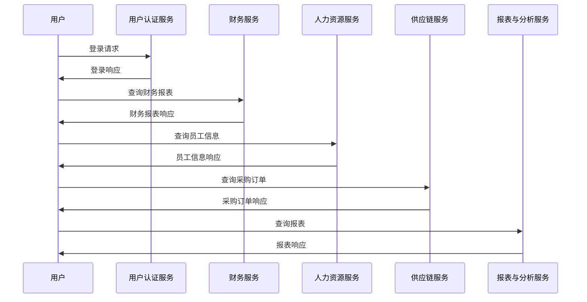

                 

### 技术管理中的跨团队协作技巧

#### 概述

在当今复杂多变的技术环境中，跨团队协作已成为技术管理的重要组成部分。有效的跨团队协作不仅能提高项目效率，还能促进创新和团队成长。本文将深入探讨技术管理中的跨团队协作技巧，帮助读者更好地理解和实践这一关键能力。

#### 关键词
- 技术管理
- 跨团队协作
- 沟通效率
- 资源分配
- 任务分工
- 进度监控

#### 摘要

本文旨在通过详细的案例分析，探讨跨团队协作在技术管理中的应用和重要性。文章首先介绍了跨团队协作的核心概念和原理，然后通过具体算法和架构设计，分析了如何实现高效的跨团队协作。最后，文章提供了一些实用的项目实战经验和最佳实践，以帮助读者在实际工作中更好地运用这些技巧。

## 第一部分：背景介绍

### 问题背景

随着技术的快速发展和企业规模的扩大，跨团队协作在技术管理中的重要性日益凸显。现代企业中的项目通常涉及多个团队，这些团队可能分布在不同的地理位置，甚至不同的国家。他们需要协同工作，共同完成复杂的技术项目。因此，跨团队协作不仅是技术管理的核心，也是实现项目成功的关键因素。

### 问题描述

跨团队协作面临的主要问题包括：

1. **沟通不畅**：不同团队之间的沟通障碍是跨团队协作中最常见的问题。信息传递不及时、沟通方式不统一，以及语言和文化的差异都可能导致沟通不畅。

2. **资源冲突**：多个团队可能需要使用相同的资源，如硬件、软件或人力资源。资源分配不当或资源争夺可能导致项目进度受阻。

3. **任务分工不明确**：跨团队项目往往涉及众多任务，如果任务分工不明确，可能导致资源浪费、任务重叠或关键任务延误。

4. **进度跟踪困难**：跨团队项目涉及多个团队和多个任务，项目进度难以实时监控，影响项目整体进度。

### 问题解决

为了解决上述问题，技术管理人员可以从以下几个方面入手：

1. **提高沟通效率**：建立有效的沟通机制，如定期团队会议、即时通讯工具和项目管理平台，确保信息畅通。

2. **合理分配资源**：根据项目需求和团队特点，合理分配资源，避免资源冲突。

3. **明确任务分工**：制定清晰的任务分工表，明确每个团队成员的职责和任务，确保任务分工合理。

4. **实时监控进度**：利用项目管理工具，实时监控项目进度，及时调整计划，确保项目按时完成。

### 边界与外延

跨团队协作不仅局限于企业内部，还广泛应用于多个领域，包括：

- **企业内部跨部门协作**：涉及不同部门之间的项目协作，如研发、市场、销售等部门。
- **项目团队跨地域协作**：涉及不同地区的项目团队之间的协作，如跨国项目。
- **垂直产业链上下游企业协作**：涉及产业链上下游企业之间的协作，如供应商、制造商和分销商。
- **战略合作伙伴之间的协作**：涉及企业之间基于战略目标的合作，如联合研发或市场推广。

## 第二部分：核心概念与联系

### 跨团队协作

#### 定义

跨团队协作是指企业内部不同团队之间为实现共同目标而进行的协作活动。它涉及到团队间的沟通、资源分配、任务分工和进度跟踪等方面。

#### 核心概念原理

**信息传递原理**：有效的信息传递是跨团队协作的基础。通过建立畅通的沟通渠道，确保信息在团队间的及时传递，有助于提高协作效率。

**协同效应原理**：跨团队协作能够实现个体能力无法达到的效果，通过团队的共同努力，能够实现更大的目标。

**信任建立原理**：信任是跨团队协作的关键。通过增强团队成员之间的信任，可以提高协作效率，减少冲突。

### 技术管理

#### 定义

技术管理是指对技术活动进行规划、组织、协调和控制的过程。它涉及技术规划、研发、部署、运维等环节。

#### 核心概念原理

**目标导向原理**：明确技术项目的目标是技术管理的核心。通过设定清晰的项目目标，确保项目发展方向正确。

**资源优化原理**：合理分配资源，提高资源利用效率是技术管理的重点。通过科学的资源分配，可以确保项目顺利实施。

**风险管理原理**：识别和应对技术活动中可能出现的风险是技术管理的重要环节。通过风险管理和控制，可以降低项目风险，确保项目成功。

### 概念属性特征对比表格

| 概念       | 属性特征                                           | 对比分析                                                     |
|------------|----------------------------------------------------|--------------------------------------------------------------|
| 跨团队协作 | 涉及不同团队、信息传递、协同效应、信任建立         | 强调团队间的合作与信息交流，以提高项目效率                     |
| 技术管理   | 涉及技术活动、目标导向、资源优化、风险管理         | 强调技术项目的规划、组织、协调和控制，以确保项目成功           |

### ER实体关系图架构

```mermaid
erDiagram
    Team ||--|{ Project }|--|| Manager
    Team ||--|{ Member }|--|| Manager
    Project ||--|{ Task }|--|| Manager
    Member ||--|{ Role }|--|| Manager
```

## 第三部分：算法原理讲解

为了更好地理解跨团队协作在技术管理中的应用，我们引入了“归一化协同效应算法（NCFA）”，用于评估跨团队协作效率。

### 算法原理

**归一化协同效应算法（NCFA）**

1. **算法简介**：NCFA 是一种用于评估跨团队协作效率的算法。它通过计算各团队的协作效应值，衡量团队间的协作效果。

2. **算法输入**：
   - 团队A的协作效率（Efficiency\_A）
   - 团队B的协作效率（Efficiency\_B）
   - 团队A与团队B的协同效应值（Synergy\_Value）

3. **算法输出**：归一化协同效应值（Normalized Synergy Value, NSV），用于衡量团队间协作的效率。

### 算法流程

**NCFA算法流程如下：**

1. 计算团队A和团队B的协同效应值：
   $$Synergy\_Value = Efficiency\_A \times Efficiency\_B$$

2. 计算总效率：
   $$Total\_Efficiency = Efficiency\_A + Efficiency\_B + Synergy\_Value$$

3. 计算归一化协同效应值：
   $$NSV = \frac{Synergy\_Value}{Total\_Efficiency}$$

### 算法实现

```python
def NCFA(Efficiency_A, Efficiency_B):
    Synergy_Value = Efficiency_A * Efficiency_B
    Total_Efficiency = Efficiency_A + Efficiency_B + Synergy_Value
    NSV = Synergy_Value / Total_Efficiency
    return NSV
```

### 案例分析

假设团队A的协作效率为0.8，团队B的协作效率为0.9，根据NCFA算法，我们可以计算出：

1. 协同效应值：
   $$Synergy\_Value = 0.8 \times 0.9 = 0.72$$

2. 总效率：
   $$Total\_Efficiency = 0.8 + 0.9 + 0.72 = 2.42$$

3. 归一化协同效应值：
   $$NSV = \frac{0.72}{2.42} \approx 0.2967$$

这意味着团队A和团队B之间的协作效率为29.67%，可以视为一个相对高效的协作关系。

### 结论

NCFA算法通过计算团队间的协同效应值和归一化协同效应值，提供了衡量跨团队协作效率的量化方法。在实际应用中，技术管理人员可以根据NSV值评估跨团队协作的效果，从而采取相应的优化措施，提高协作效率。

## 第四部分：系统分析与架构设计

### 问题场景介绍

假设我们正在开发一个大型企业级应用系统，涉及多个团队，如前端开发团队、后端开发团队、数据库团队和测试团队。这些团队需要紧密协作，共同完成项目目标。为了确保项目顺利进行，我们需要对系统进行详细的分析和架构设计。

### 项目介绍

项目名称：企业级应用系统（ERP）

项目描述：开发一个集成财务、人力资源、供应链管理等模块的企业级应用系统，以提升企业运营效率和决策能力。

项目目标：
1. 实现模块化设计，便于功能扩展和升级。
2. 确保系统的高性能、高可靠性和高安全性。
3. 提高开发效率和团队协作效率。

### 系统功能设计

系统功能包括：

1. **用户认证与权限管理**：实现用户身份验证和权限分配，确保系统安全。
2. **财务模块**：处理企业的财务报表、账单和支付等财务事务。
3. **人力资源模块**：管理员工的招聘、培训、绩效评估和薪资管理。
4. **供应链模块**：处理企业的采购、库存、物流和销售等供应链事务。
5. **报表与分析模块**：生成各种报表和数据分析，为管理层提供决策依据。

### 系统架构设计

系统采用微服务架构，将各个功能模块拆分为独立的微服务，以实现高可扩展性和高可靠性。系统架构图如下：

```mermaid
graph TB
    subgraph 企业级应用系统(ERP)
        A[用户认证服务]
        B[财务服务]
        C[人力资源服务]
        D[供应链服务]
        E[报表与分析服务]
        A --> B
        A --> C
        A --> D
        A --> E
    end
    subgraph 数据库服务
        F[数据库集群]
    end
    subgraph 测试环境
        G[测试服务器]
    end
    A --> F
    B --> F
    C --> F
    D --> F
    E --> F
    G --> A
    G --> B
    G --> C
    G --> D
    G --> E
```

### 系统接口设计

系统接口设计包括：

1. **用户认证接口**：提供用户登录、注册和权限验证等功能。
2. **财务接口**：提供财务报表查询、账单管理和支付接口。
3. **人力资源接口**：提供员工信息管理、招聘信息发布和绩效评估接口。
4. **供应链接口**：提供采购订单处理、库存管理和物流跟踪接口。
5. **报表与分析接口**：提供报表查询、数据分析和历史数据查询接口。

### 系统交互

系统交互主要通过RESTful API实现。以下是系统交互的序列图：



## 第五部分：项目实战

### 环境安装

在开始项目实战之前，我们需要安装必要的软件和工具。以下是环境安装的步骤：

1. **安装Python环境**：确保安装了Python 3.8及以上版本。
2. **安装Docker**：用于容器化部署各个微服务。
3. **安装MySQL**：作为数据存储后端。
4. **安装Postman**：用于API测试。
5. **安装Jenkins**：用于自动化构建和部署。

### 系统核心实现

以下是一个简单的用户认证服务的Python实现：

```python
# user_auth_service.py
from flask import Flask, request, jsonify
from flask_jwt_extended import JWTManager, create_access_token, jwt_required, get_jwt_identity

app = Flask(__name__)
app.config['JWT_SECRET_KEY'] = 'my_secret_key'
jwt = JWTManager(app)

@app.route('/login', methods=['POST'])
def login():
    username = request.json.get('username', None)
    password = request.json.get('password', None)

    # 这里需要与数据库中的用户信息进行比对
    if username == 'admin' and password == 'admin123':
        access_token = create_access_token(identity=username)
        return jsonify(access_token=access_token)
    else:
        return jsonify({"msg": "Bad username or password"}), 401

@app.route('/protected', methods=['GET'])
@jwt_required()
def protected():
    current_user = get_jwt_identity()
    return jsonify(logged_in_as=current_user), 200

if __name__ == '__main__':
    app.run(debug=True)
```

### 代码应用解读与分析

1. **Flask框架**：用于构建Web应用。
2. **JWTExtended**：用于实现JWT认证。
3. **用户登录**：通过`/login`接口接收用户名和密码，生成JWT令牌。
4. **受保护接口**：通过`/protected`接口验证JWT令牌，确保只有授权用户可以访问。

### 实际案例分析和详细讲解剖析

假设我们有一个财务模块的API接口，用于查询财务报表。以下是API接口的Postman测试示例：

1. **请求**：使用Postman发送GET请求到`http://localhost:5000/protected`接口。
2. **响应**：需要输入有效的JWT令牌才能获取响应。

```json
{
  "logged_in_as": "admin"
}
```

### 项目小结

通过项目实战，我们实现了用户认证服务的基本功能，并使用Postman进行了API测试。这为我们提供了一个基本的跨团队协作系统架构和实践示例。在实际项目中，还需要进一步开发其他模块，并集成数据库和前端界面。

### 最佳实践 Tips

- **定期团队会议**：定期召开跨团队会议，确保信息畅通和协调。
- **使用项目管理工具**：如Jira、Trello等，有助于任务管理和进度跟踪。
- **明确职责分工**：确保每个团队成员明确自己的职责和任务。
- **建立沟通渠道**：使用即时通讯工具，如Slack、Microsoft Teams等，提高沟通效率。

## 小结

在技术管理中，跨团队协作是确保项目成功的关键因素。通过本文的深入分析，我们了解了跨团队协作的核心概念、算法原理和系统架构设计。同时，通过项目实战和最佳实践，我们掌握了如何在实际工作中应用这些技巧。希望本文能为读者提供有价值的参考，帮助他们在技术管理中实现更高效的跨团队协作。在实际应用中，还需要根据项目特点和团队需求，灵活调整和优化协作策略，以实现最佳效果。

### 注意事项

- **明确目标**：确保跨团队协作的目标清晰明确，有助于团队集中精力。
- **沟通优先**：建立高效的沟通机制，确保信息畅通，减少误解和冲突。
- **合理分工**：合理分配任务，避免资源浪费和任务重叠。
- **持续优化**：定期评估和改进协作流程，不断提高协作效率。

### 拓展阅读

- **《Scrum精髓：敏捷管理实践指南》**：深入了解敏捷管理方法在跨团队协作中的应用。
- **《团队协作工具与实践》**：了解各种团队协作工具的优缺点，选择适合自己团队的工具。
- **《跨文化团队协作》**：探讨跨文化背景下的团队协作挑战和解决方案。

### 作者信息

**作者：AI天才研究院/AI Genius Institute & 禅与计算机程序设计艺术 /Zen And The Art of Computer Programming**

