                 


# 技术管理中的跨团队协作最佳实践

## 关键词
- 跨团队协作
- 技术管理
- 沟通技巧
- 项目管理
- 冲突管理
- 激励机制

## 摘要
本文旨在探讨技术管理中的跨团队协作最佳实践，通过详细分析跨团队协作的重要性、模型、策略、沟通技巧、项目管理、冲突管理、知识共享、绩效评估以及未来趋势，为技术管理者提供实用的指导和方法。通过本文，读者将了解如何有效地实施跨团队协作，提升团队整体效能，实现项目成功。

## 第一部分: 跨团队协作的核心概念

### 第1章: 跨团队协作的背景与重要性

#### 1.1 企业环境中的团队协作问题

在当今快速发展的商业环境中，企业面临着越来越复杂的项目和需求。这使得跨团队协作成为企业成功的关键。传统的团队协作主要是在同一部门或同一职能范围内进行的，而跨团队协作则涉及到不同部门、不同职能和不同专业领域的合作。

跨团队协作的问题主要包括：

- 沟通障碍：不同团队成员之间的沟通不畅可能导致误解和冲突。
- 责任不清：跨团队项目中，团队成员的角色和责任往往不明确，容易导致责任推卸和效率低下。
- 文化差异：不同团队可能有不同的工作风格、价值观和文化背景，这可能会影响协作效果。

#### 1.2 跨团队协作的挑战

跨团队协作面临的主要挑战包括：

- 沟通障碍：不同团队成员之间的沟通不畅可能导致误解和冲突。
- 责任不清：跨团队项目中，团队成员的角色和责任往往不明确，容易导致责任推卸和效率低下。
- 文化差异：不同团队可能有不同的工作风格、价值观和文化背景，这可能会影响协作效果。

#### 1.3 跨团队协作的价值

尽管跨团队协作面临诸多挑战，但其价值不容忽视：

- 提升创新能力：跨团队协作能够汇集不同领域的专业知识和经验，激发创新思维。
- 提高项目效率：有效的跨团队协作能够优化项目流程，提高工作效率和成果质量。
- 促进团队成长：跨团队协作有助于团队成员相互学习、共同成长。

#### 1.4 核心概念与联系

在跨团队协作中，以下核心概念和联系至关重要：

- 跨团队协作模型：理解不同协作模型的特点和适用场景，有助于选择合适的协作方式。
- 跨团队协作策略：制定有效的协作策略，确保团队成员之间能够顺畅沟通和协作。
- 沟通技巧：掌握高效的沟通技巧，能够减少误解和冲突，提升协作效果。

下面是跨团队协作模型和策略的Mermaid流程图：

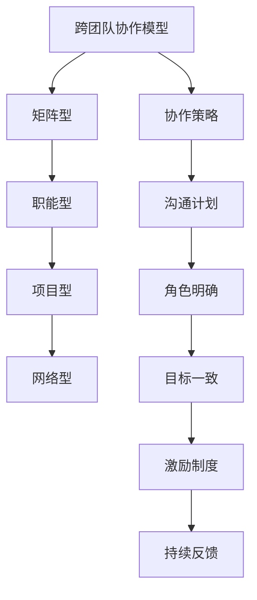

### 第2章: 跨团队协作模型与策略

#### 2.1 跨团队协作的基本模型

跨团队协作的基本模型包括矩阵型、职能型、项目型和网络型。每种模型都有其特点和应用场景：

- **矩阵型**：适用于大型项目和复杂任务，强调多个团队之间的协同工作。
- **职能型**：以职能为导向，团队成员主要在各自领域内协作，适合单一职能项目。
- **项目型**：以项目为导向，团队成员围绕特定项目进行协作，项目完成后团队解散。
- **网络型**：强调跨职能、跨领域的协作，适用于高度动态和复杂的环境。

#### 2.2 跨团队协作的策略框架

有效的跨团队协作需要遵循以下策略框架：

- **沟通计划**：明确沟通目标和渠道，确保信息传递的及时性和准确性。
- **角色明确**：明确团队成员的角色和责任，避免职责重叠和责任推卸。
- **目标一致**：确保团队成员对项目目标和愿景有共同的理解和认同。
- **激励制度**：建立激励机制，鼓励团队成员积极参与和贡献。
- **持续反馈**：定期收集团队成员的反馈，及时调整协作策略和项目计划。

下面是跨团队协作策略框架的Mermaid流程图：

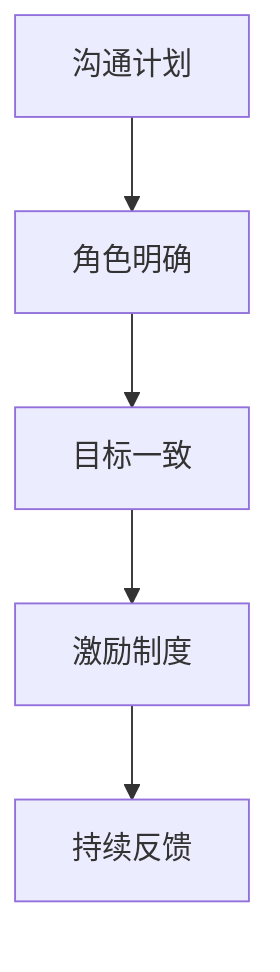

#### 2.3 跨团队协作的常见问题与解决方案

跨团队协作中常见的问题包括：

- **沟通障碍**：解决方法包括定期沟通会议、使用沟通工具和技术、建立统一的沟通语言和格式。
- **责任不清**：通过明确角色和责任、制定项目计划和里程碑、建立绩效评估机制来解决。
- **文化差异**：通过文化培训和沟通、尊重差异、建立共同的价值观和目标来缓解。

下面是跨团队协作常见问题的Mermaid流程图：

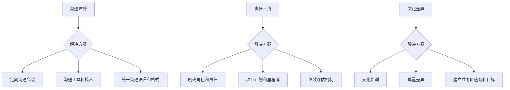

### 第3章: 跨团队协作的沟通技巧

#### 3.1 高效沟通的重要性

高效沟通是跨团队协作成功的关键。以下是一些高效沟通的技巧：

- **明确沟通目标**：在沟通前明确沟通的目标和期望，确保信息传递的准确性和针对性。
- **倾听与反馈**：积极倾听他人的意见，并及时给予反馈，以建立互信和共识。
- **使用简洁明了的语言**：避免使用复杂和专业术语，使用简单明了的语言进行沟通。
- **定期更新信息**：定期更新团队成员之间的信息，确保团队成员了解项目的最新动态。

下面是高效沟通技巧的Mermaid流程图：

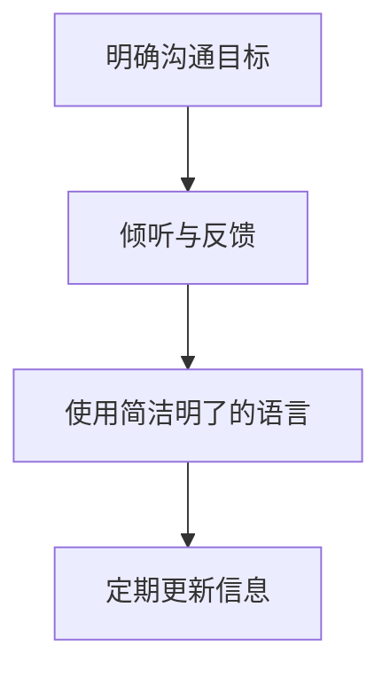

#### 3.2 沟通障碍及其解决方法

跨团队协作中常见的沟通障碍包括：

- **信息不对称**：解决方法包括建立透明的信息共享平台、定期发布项目进度报告。
- **沟通渠道不畅通**：解决方法包括选择合适的沟通工具和技术、建立多层次的沟通渠道。
- **文化差异**：解决方法包括文化培训、建立尊重差异的沟通氛围。

下面是沟通障碍及其解决方法的Mermaid流程图：

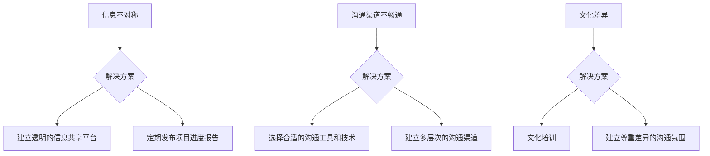

#### 3.3 沟通工具与技术

以下是一些常用的跨团队协作沟通工具和技术：

- **电子邮件**：适用于正式沟通和文档传输。
- **即时通讯工具**：如Slack、Microsoft Teams等，适用于实时沟通和协作。
- **视频会议工具**：如Zoom、Microsoft Teams等，适用于远程协作和团队会议。
- **项目管理工具**：如Jira、Trello等，适用于任务跟踪和项目进度管理。

下面是沟通工具与技术的Mermaid流程图：

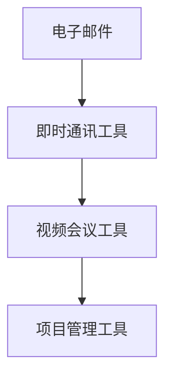

## 第二部分: 跨团队协作实践

### 第4章: 项目管理中的跨团队协作

#### 4.1 项目管理流程与跨团队协作

项目管理流程包括以下关键步骤：

- **项目规划**：明确项目目标、范围、时间和资源需求。
- **项目执行**：执行项目计划，确保项目按计划进行。
- **项目监控**：监控项目进度和性能，及时调整计划和资源。
- **项目收尾**：总结项目成果，评估项目效果。

跨团队协作在项目管理中起到关键作用，通过以下方式实现：

- **角色分配**：明确团队成员的角色和责任，确保项目任务能够高效完成。
- **沟通计划**：制定沟通计划，确保项目信息的及时传递和共享。
- **协作工具**：使用项目管理工具和协作工具，提升团队协作效率。

下面是项目管理流程与跨团队协作的Mermaid流程图：

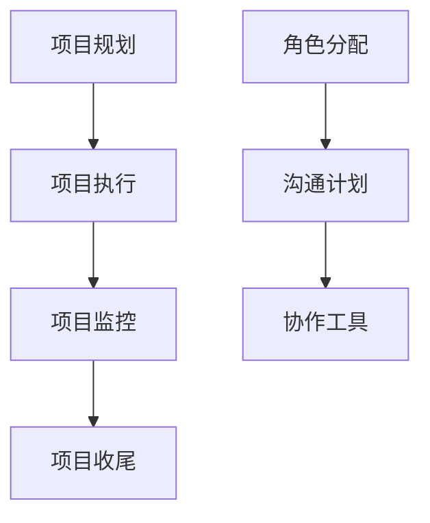

#### 4.2 项目角色与责任分配

在跨团队协作项目中，明确项目角色和责任至关重要。以下是一些关键角色和责任：

- **项目经理**：负责项目整体规划和执行，确保项目按计划完成。
- **技术专家**：负责项目技术实现，提供技术支持和解决方案。
- **业务分析师**：负责分析业务需求，确保项目满足业务需求。
- **设计师**：负责项目的设计和用户界面，提升用户体验。
- **测试工程师**：负责项目测试，确保项目质量。

下面是项目角色与责任分配的Mermaid流程图：

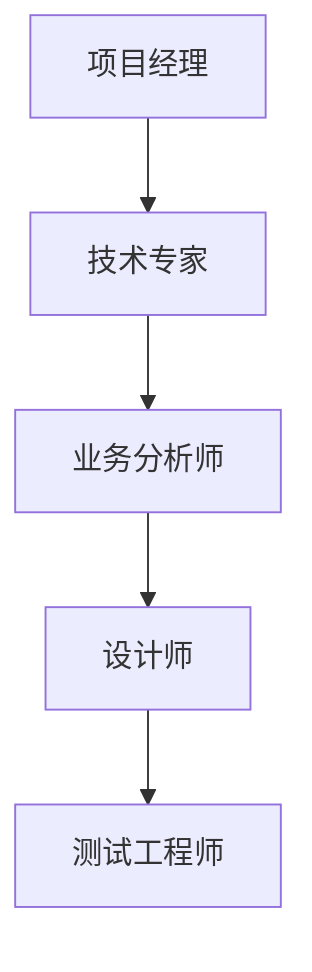

#### 4.3 跨团队协作中的风险管理

跨团队协作中的风险管理包括以下关键步骤：

- **识别风险**：识别项目中的潜在风险，包括技术风险、人员风险、时间风险等。
- **评估风险**：评估风险的可能性和影响，确定风险优先级。
- **制定应对策略**：制定应对策略，降低风险的影响。
- **监控风险**：监控项目中的风险，及时调整应对策略。

下面是跨团队协作中风险管理的Mermaid流程图：

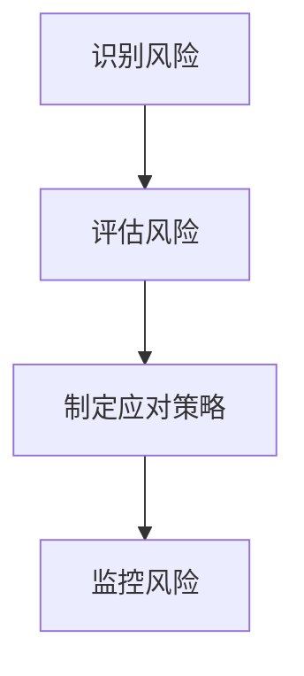

### 第5章: 跨团队协作中的冲突管理

#### 5.1 冲突的类型与原因

跨团队协作中常见的冲突类型包括：

- **目标冲突**：团队成员对项目目标和期望有不同的看法。
- **角色冲突**：团队成员在角色和责任分配上的分歧。
- **沟通冲突**：团队成员之间的沟通不畅导致的误解和分歧。

冲突的原因包括：

- **信息不对称**：团队成员之间信息不共享或不及时。
- **文化差异**：不同团队成员可能有不同的工作风格和价值观。
- **目标不一致**：团队成员对项目目标的理解和认同不一致。

下面是冲突类型与原因的Mermaid流程图：

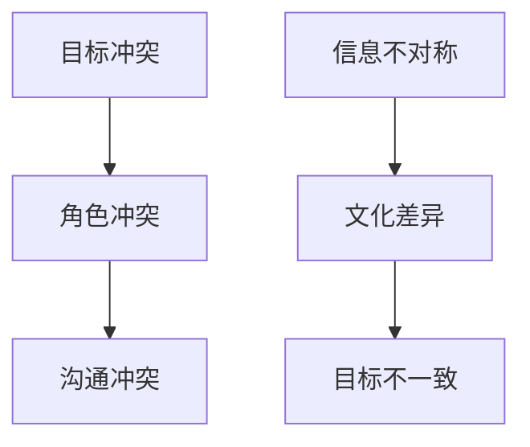

#### 5.2 冲突管理的策略

有效的冲突管理策略包括：

- **预防冲突**：通过明确项目目标和期望、加强沟通、促进团队合作来预防冲突。
- **识别冲突**：及时发现和处理冲突，避免冲突升级。
- **沟通与协商**：通过沟通和协商解决冲突，寻求共识和解决方案。
- **调解与仲裁**：在冲突无法自行解决时，寻求第三方调解和仲裁。

下面是冲突管理策略的Mermaid流程图：

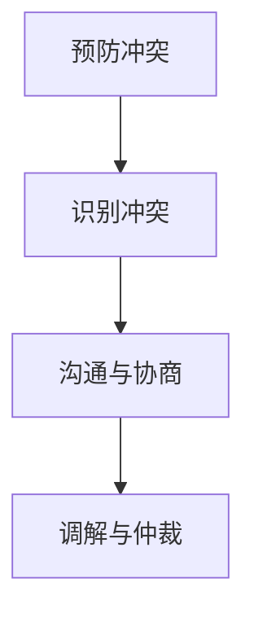

#### 5.3 冲突解决案例分析

以下是一个冲突解决的案例分析：

**案例背景**：在一个跨团队项目中，团队成员A认为项目进度过于紧张，难以按时完成。而团队成员B则认为项目计划不够详细，导致资源浪费。

**解决方案**：项目经理组织了一次团队会议，让团队成员A和B分别阐述自己的观点，并在会议上进行了充分的讨论。通过沟通，团队成员A意识到项目计划的不足，团队成员B也了解了项目进度的紧迫性。最终，双方达成共识，调整了项目计划，确保项目能够按时完成。

**经验总结**：通过有效的沟通和协商，冲突得到了及时解决，项目得以顺利推进。

### 第6章: 跨团队协作中的技术交流与知识共享

#### 6.1 技术交流的障碍与挑战

跨团队协作中的技术交流可能面临以下障碍和挑战：

- **知识差异**：团队成员拥有不同的专业技能和知识水平，可能导致交流困难。
- **沟通障碍**：团队成员可能使用不同的沟通工具和技术，影响交流效果。
- **文化差异**：不同团队成员可能有不同的文化背景和工作习惯，影响技术交流。

下面是技术交流障碍与挑战的Mermaid流程图：

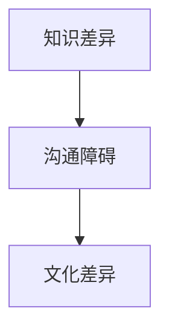

#### 6.2 知识共享的最佳实践

以下是一些有效的知识共享最佳实践：

- **定期分享会议**：定期组织技术分享会议，让团队成员展示自己的技术和经验。
- **知识库建设**：建立知识库，记录项目中的关键技术和经验，方便团队成员查阅和学习。
- **跨团队培训**：为不同团队成员提供跨团队的培训和交流机会，提升整体技术水平。
- **协作平台**：使用协作平台和工具，促进团队成员之间的技术交流和合作。

下面是知识共享最佳实践的Mermaid流程图：

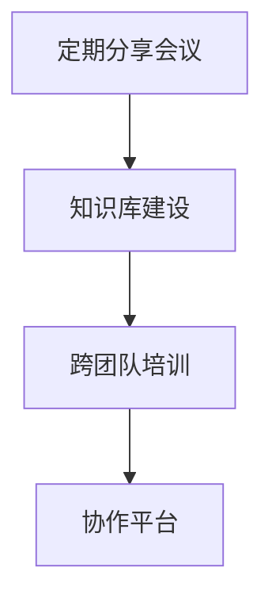

#### 6.3 技术文档编写与知识管理系统

技术文档编写和知识管理系统在跨团队协作中起到关键作用。以下是一些关键要点：

- **文档规范**：制定统一的文档规范，确保技术文档的质量和一致性。
- **版本管理**：使用版本控制系统，确保技术文档的版本更新和安全。
- **知识共享**：通过知识管理系统，方便团队成员查找和共享技术文档和知识。
- **培训与支持**：为团队成员提供技术文档编写和知识管理的培训和支持，提升团队整体能力。

下面是技术文档编写与知识管理系统的Mermaid流程图：

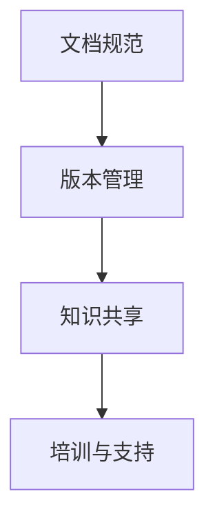

### 第7章: 跨团队协作的绩效评估与激励机制

#### 7.1 绩效评估的重要性

跨团队协作中的绩效评估具有重要意义。以下是一些关键原因：

- **激励与激励**：通过绩效评估，能够激励团队成员提高工作表现。
- **能力发展**：通过绩效评估，能够发现团队成员的潜力，提供成长机会。
- **团队管理**：通过绩效评估，能够了解团队的整体工作表现，制定改进计划。

下面是绩效评估重要性的Mermaid流程图：

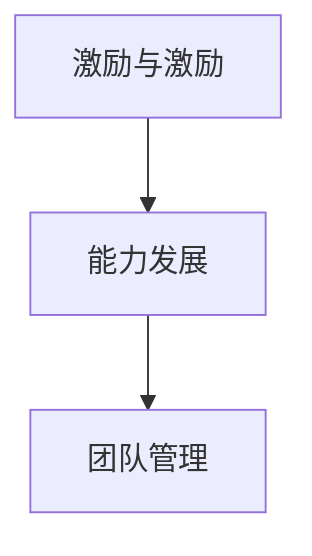

#### 7.2 激励机制的设计原则

设计激励机制时，应遵循以下原则：

- **公平性**：确保激励机制公平、公正，避免偏袒和不公现象。
- **透明性**：确保激励机制透明，团队成员了解评估标准和奖励方式。
- **个性化**：根据团队成员的特点和需求，设计个性化的激励机制。
- **可持续性**：确保激励机制能够长期有效，促进团队长期发展。

下面是激励机制设计原则的Mermaid流程图：

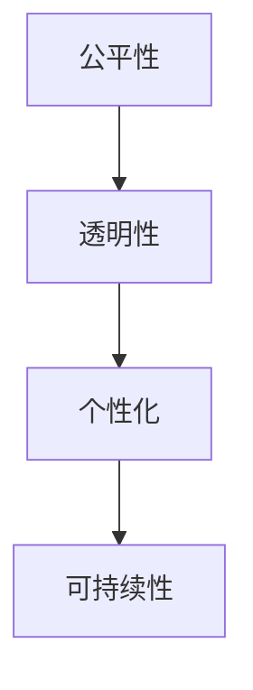

#### 7.3 跨团队协作的绩效评估实践

以下是一些跨团队协作的绩效评估实践：

- **KPI设定**：根据项目目标和团队职责，设定关键绩效指标（KPI），评估团队成员的工作表现。
- **360度评估**：通过团队成员、上级、同事等多角度评估，全面了解团队成员的能力和表现。
- **反馈与改进**：定期提供绩效反馈，帮助团队成员识别不足和改进方向。

下面是跨团队协作绩效评估实践的Mermaid流程图：

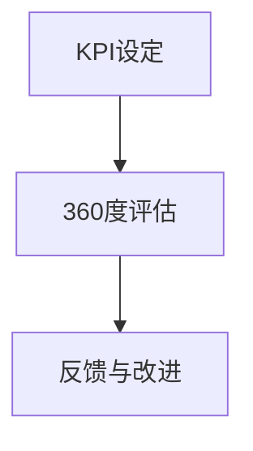

### 第8章: 跨团队协作的未来趋势

#### 8.1 数字化对跨团队协作的影响

随着数字化技术的快速发展，跨团队协作正面临以下影响：

- **远程工作**：数字化技术使得远程工作成为可能，为跨团队协作提供了更多灵活性。
- **自动化与人工智能**：自动化和人工智能技术可以提升协作效率，减少重复性工作。
- **云计算**：云计算提供了强大的计算能力和数据存储，为跨团队协作提供了便利。

下面是数字化对跨团队协作影响的Mermaid流程图：

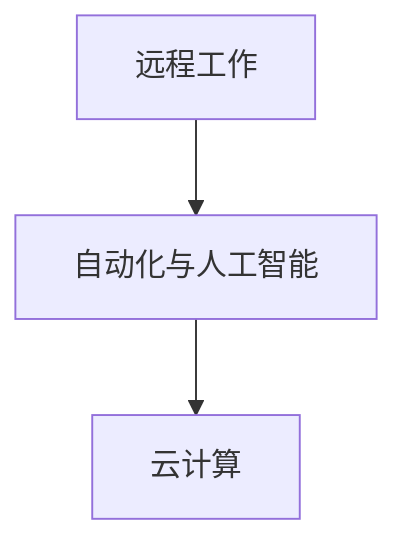

#### 8.2 自动化与人工智能在跨团队协作中的应用

自动化和人工智能技术在跨团队协作中的应用包括：

- **任务分配与调度**：使用人工智能算法优化任务分配和调度，提高协作效率。
- **实时协作与沟通**：利用自动化工具实现实时协作和沟通，提升团队响应速度。
- **数据分析与预测**：使用自动化工具进行数据分析与预测，帮助团队做出更明智的决策。

下面是自动化与人工智能在跨团队协作中的应用的Mermaid流程图：

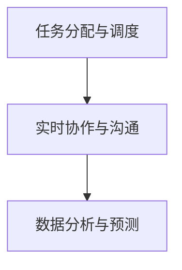

#### 8.3 跨团队协作的未来展望

跨团队协作的未来发展趋势包括：

- **智能化协作**：随着人工智能技术的发展，跨团队协作将更加智能化，实现更高效、更精准的协作。
- **全球化协作**：数字化技术的发展将打破地域限制，实现全球范围内的跨团队协作。
- **个性化协作**：根据团队成员的特点和需求，实现更个性化的协作模式，提升团队整体效能。

下面是跨团队协作未来展望的Mermaid流程图：

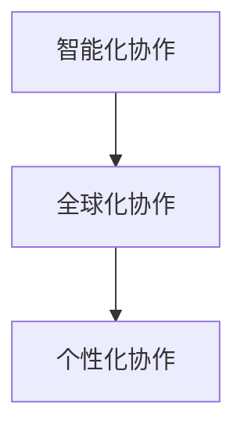

### 第9章: 案例分析：成功跨团队协作实践

#### 9.1 案例背景与目标

以下是一个成功跨团队协作的案例分析：

**案例背景**：某大型互联网公司计划开发一款全新的移动应用程序，产品涵盖社交、购物、娱乐等多方面功能。项目团队由产品经理、UI/UX设计师、前端开发者、后端开发者、测试工程师等多个职能团队组成。

**目标**：在短时间内高质量地完成应用程序的开发，并顺利上线。

#### 9.2 案例实施过程

**1. 项目启动会**

项目经理组织了项目启动会，明确了项目目标、范围、时间表和资源配置。同时，强调了跨团队协作的重要性和沟通规范。

**2. 团队角色与责任分配**

根据项目需求和团队成员的专业背景，明确了各团队的角色和责任。产品经理负责需求分析和项目管理，UI/UX设计师负责用户界面设计，前端和后端开发者负责技术实现，测试工程师负责项目测试。

**3. 沟通计划**

项目经理制定了详细的沟通计划，包括每周的项目例会、需求评审会议、技术讨论会议等。同时，使用项目管理工具Jira跟踪项目进度和任务分配。

**4. 知识共享**

项目团队建立了内部知识库，记录项目中的重要技术文档、需求文档和经验教训。定期组织技术分享会议，促进团队成员之间的知识交流。

**5. 冲突管理**

在项目实施过程中，项目经理及时识别和解决冲突。通过沟通和协商，确保团队成员之间的合作顺畅。

**6. 绩效评估**

项目团队采用KPI和360度评估方法，对团队成员的工作表现进行评估。根据评估结果，提供反馈和改进建议。

#### 9.3 案例成果与经验总结

**成果**：

- 项目在规定的时间内完成，并顺利上线。
- 应用程序质量得到用户好评，市场反响热烈。
- 团队成员之间建立了良好的合作关系，提高了团队整体效能。

**经验总结**：

- 明确项目目标和团队角色，确保项目顺利进行。
- 加强沟通和知识共享，提高团队协作效率。
- 及时解决冲突，保持团队和谐。
- 采用合理的绩效评估方法，激励团队成员。

### 第三部分: 总结与反思

#### 第10章: 跨团队协作最佳实践总结

通过本文的探讨，我们可以总结出以下跨团队协作最佳实践：

- **明确项目目标和团队角色**：确保项目顺利进行和团队高效协作。
- **加强沟通和知识共享**：提高团队协作效率和创新能力。
- **及时解决冲突**：保持团队和谐，促进项目进展。
- **采用合理的绩效评估方法**：激励团队成员，提升团队整体效能。

#### 10.1 核心要点回顾

- 跨团队协作在当今商业环境中具有重要意义。
- 跨团队协作面临沟通障碍、责任不清和文化差异等挑战。
- 跨团队协作的价值体现在提升创新能力、提高项目效率和促进团队成长。
- 跨团队协作需要遵循有效的协作模型和策略，确保团队协作顺畅。
- 沟通技巧是跨团队协作成功的关键。
- 项目管理中的跨团队协作需要明确角色和责任、制定沟通计划和风险管理。
- 冲突管理是跨团队协作中的重要环节。
- 知识共享和技术文档编写是跨团队协作的重要实践。
- 绩效评估和激励机制有助于提升团队效能。
- 数字化技术的发展将进一步推动跨团队协作的智能化和全球化。

#### 10.2 实践中的挑战与应对

跨团队协作实践中可能遇到的挑战包括：

- **沟通障碍**：解决方法包括使用统一的沟通工具、定期沟通会议和建立沟通渠道。
- **责任不清**：通过明确的角色分配、项目计划和绩效评估机制来解决。
- **文化差异**：通过文化培训和沟通、尊重差异和建立共同目标来缓解。

#### 10.3 持续改进的方向

跨团队协作的持续改进方向包括：

- **提高数字化水平**：利用自动化和人工智能技术提升协作效率。
- **优化沟通机制**：不断改进沟通流程和工具，提高沟通效果。
- **加强知识管理**：完善知识库和知识共享平台，促进团队成员的学习和成长。
- **完善激励机制**：设计更具吸引力和公平性的激励机制，激励团队成员。

### 第11章: 注意事项与建议

#### 11.1 注意事项

- **明确项目目标和团队角色**：确保项目顺利进行和团队高效协作。
- **加强沟通和知识共享**：提高团队协作效率和创新能力。
- **及时解决冲突**：保持团队和谐，促进项目进展。
- **采用合理的绩效评估方法**：激励团队成员，提升团队整体效能。

#### 11.2 针对不同角色的建议

- **项目经理**：确保项目目标和团队角色明确，制定合理的沟通计划和绩效评估方法。
- **团队成员**：积极参与沟通和知识共享，及时反馈问题和建议。
- **团队成员**：尊重团队成员，建立和谐的团队氛围，共同推动项目进展。

#### 11.3 拓展阅读

- **《敏捷项目管理实践指南》**：探讨敏捷方法在跨团队协作中的应用。
- **《团队协作的艺术》**：介绍团队协作的最佳实践和技巧。
- **《数字转型下的组织与管理》**：探讨数字化时代下组织和管理的变化。

### 第12章: 附录

#### 12.1 常用工具与技术

- **沟通工具**：Slack、Microsoft Teams、Zoom等。
- **项目管理工具**：Jira、Trello、Asana等。
- **知识管理工具**：Confluence、SharePoint、Notion等。

#### 12.2 参考文献

- **《敏捷项目管理实践指南》**：作者：迈克尔·麦克尼尔。
- **《团队协作的艺术》**：作者：大卫·柯克帕特里克。
- **《数字转型下的组织与管理》**：作者：克里斯·多德。

## 总结

跨团队协作是技术管理中的重要环节，对于项目的成功至关重要。通过本文的探讨，我们了解了跨团队协作的核心概念、实践方法、案例分析以及未来趋势。希望本文能为技术管理者提供有价值的参考和指导，助力跨团队协作的成功实施。作者：AI天才研究院/AI Genius Institute & 禅与计算机程序设计艺术 /Zen And The Art of Computer Programming

----------------------------------------------------------------

感谢您提供的详细的目录大纲和文章内容。以下是对您提供的文本的Markdown格式整理：

# 技术管理中的跨团队协作最佳实践

## 关键词
- 跨团队协作
- 技术管理
- 沟通技巧
- 项目管理
- 冲突管理
- 激励机制

## 摘要
本文旨在探讨技术管理中的跨团队协作最佳实践，通过详细分析跨团队协作的重要性、模型、策略、沟通技巧、项目管理、冲突管理、知识共享、绩效评估以及未来趋势，为技术管理者提供实用的指导和方法。通过本文，读者将了解如何有效地实施跨团队协作，提升团队整体效能，实现项目成功。

## 第一部分: 跨团队协作的核心概念

### 第1章: 跨团队协作的背景与重要性

#### 1.1 企业环境中的团队协作问题

在当今快速发展的商业环境中，企业面临着越来越复杂的项目和需求。这使得跨团队协作成为企业成功的关键。传统的团队协作主要是在同一部门或同一职能范围内进行的，而跨团队协作则涉及到不同部门、不同职能和不同专业领域的合作。

跨团队协作的问题主要包括：

- 沟通障碍：不同团队成员之间的沟通不畅可能导致误解和冲突。
- 责任不清：跨团队项目中，团队成员的角色和责任往往不明确，容易导致责任推卸和效率低下。
- 文化差异：不同团队可能有不同的工作风格、价值观和文化背景，这可能会影响协作效果。

#### 1.2 跨团队协作的挑战

跨团队协作面临的主要挑战包括：

- 沟通障碍：不同团队成员之间的沟通不畅可能导致误解和冲突。
- 责任不清：跨团队项目中，团队成员的角色和责任往往不明确，容易导致责任推卸和效率低下。
- 文化差异：不同团队可能有不同的工作风格、价值观和文化背景，这可能会影响协作效果。

#### 1.3 跨团队协作的价值

尽管跨团队协作面临诸多挑战，但其价值不容忽视：

- 提升创新能力：跨团队协作能够汇集不同领域的专业知识和经验，激发创新思维。
- 提高项目效率：有效的跨团队协作能够优化项目流程，提高工作效率和成果质量。
- 促进团队成长：跨团队协作有助于团队成员相互学习、共同成长。

#### 1.4 核心概念与联系

在跨团队协作中，以下核心概念和联系至关重要：

- 跨团队协作模型：理解不同协作模型的特点和适用场景，有助于选择合适的协作方式。
- 跨团队协作策略：制定有效的协作策略，确保团队成员之间能够顺畅沟通和协作。
- 沟通技巧：掌握高效的沟通技巧，能够减少误解和冲突，提升协作效果。

下面是跨团队协作模型和策略的Mermaid流程图：

```mermaid
graph TD
A[跨团队协作模型] --> B[矩阵型]
B --> C[职能型]
C --> D[项目型]
D --> E[网络型]
A --> F[协作策略]
F --> G[沟通计划]
G --> H[角色明确]
H --> I[目标一致]
I --> J[激励制度]
J --> K[持续反馈]
```

### 第2章: 跨团队协作模型与策略

#### 2.1 跨团队协作的基本模型

跨团队协作的基本模型包括矩阵型、职能型、项目型和网络型。每种模型都有其特点和应用场景：

- **矩阵型**：适用于大型项目和复杂任务，强调多个团队之间的协同工作。
- **职能型**：以职能为导向，团队成员主要在各自领域内协作，适合单一职能项目。
- **项目型**：以项目为导向，团队成员围绕特定项目进行协作，项目完成后团队解散。
- **网络型**：强调跨职能、跨领域的协作，适用于高度动态和复杂的环境。

#### 2.2 跨团队协作的策略框架

有效的跨团队协作需要遵循以下策略框架：

- **沟通计划**：明确沟通目标和渠道，确保信息传递的及时性和准确性。
- **角色明确**：明确团队成员的角色和责任，避免职责重叠和责任推卸。
- **目标一致**：确保团队成员对项目目标和愿景有共同的理解和认同。
- **激励制度**：建立激励机制，鼓励团队成员积极参与和贡献。
- **持续反馈**：定期收集团队成员的反馈，及时调整协作策略和项目计划。

下面是跨团队协作策略框架的Mermaid流程图：

```mermaid
graph TD
A[沟通计划] --> B[角色明确]
B --> C[目标一致]
C --> D[激励制度]
D --> E[持续反馈]
```

#### 2.3 跨团队协作的常见问题与解决方案

跨团队协作中常见的问题包括：

- **沟通障碍**：解决方法包括定期沟通会议、使用沟通工具和技术、建立统一的沟通语言和格式。
- **责任不清**：通过明确角色和责任、制定项目计划和里程碑、建立绩效评估机制来解决。
- **文化差异**：通过文化培训和沟通、尊重差异、建立共同的价值观和目标来缓解。

下面是跨团队协作常见问题的Mermaid流程图：

```mermaid
graph TD
A[沟通障碍] --> B{解决方案}
B --> C[定期沟通会议]
B --> D[沟通工具和技术]
B --> E[统一沟通语言和格式]
F[责任不清] --> G{解决方案}
G --> H[明确角色和责任]
G --> I[项目计划和里程碑]
G --> J[绩效评估机制]
K[文化差异] --> L{解决方案}
L --> M[文化培训]
L --> N[尊重差异]
L --> O[建立共同价值观和目标]
```

### 第3章: 跨团队协作的沟通技巧

#### 3.1 高效沟通的重要性

高效沟通是跨团队协作成功的关键。以下是一些高效沟通的技巧：

- **明确沟通目标**：在沟通前明确沟通的目标和期望，确保信息传递的准确性和针对性。
- **倾听与反馈**：积极倾听他人的意见，并及时给予反馈，以建立互信和共识。
- **使用简洁明了的语言**：避免使用复杂和专业术语，使用简单明了的语言进行沟通。
- **定期更新信息**：定期更新团队成员之间的信息，确保团队成员了解项目的最新动态。

下面是高效沟通技巧的Mermaid流程图：

```mermaid
graph TD
A[明确沟通目标] --> B[倾听与反馈]
B --> C[使用简洁明了的语言]
C --> D[定期更新信息]
```

#### 3.2 沟通障碍及其解决方法

跨团队协作中常见的沟通障碍包括：

- **信息不对称**：解决方法包括建立透明的信息共享平台、定期发布项目进度报告。
- **沟通渠道不畅通**：解决方法包括选择合适的沟通工具和技术、建立多层次的沟通渠道。
- **文化差异**：解决方法包括文化培训、建立尊重差异的沟通氛围。

下面是沟通障碍及其解决方法的Mermaid流程图：

```mermaid
graph TD
A[信息不对称] --> B{解决方案}
B --> C[建立透明的信息共享平台]
B --> D[定期发布项目进度报告]
E[沟通渠道不畅通] --> F{解决方案}
F --> G[选择合适的沟通工具和技术]
F --> H[建立多层次的沟通渠道]
I[文化差异] --> J{解决方案}
J --> K[文化培训]
J --> L[建立尊重差异的沟通氛围]
```

#### 3.3 沟通工具与技术

以下是一些常用的跨团队协作沟通工具和技术：

- **电子邮件**：适用于正式沟通和文档传输。
- **即时通讯工具**：如Slack、Microsoft Teams等，适用于实时沟通和协作。
- **视频会议工具**：如Zoom、Microsoft Teams等，适用于远程协作和团队会议。
- **项目管理工具**：如Jira、Trello等，适用于任务跟踪和项目进度管理。

下面是沟通工具与技术的Mermaid流程图：

```mermaid
graph TD
A[电子邮件] --> B[即时通讯工具]
B --> C[视频会议工具]
C --> D[项目管理工具]
```

### 第二部分: 跨团队协作实践

#### 第4章: 项目管理中的跨团队协作

#### 4.1 项目管理流程与跨团队协作

项目管理流程包括以下关键步骤：

- **项目规划**：明确项目目标、范围、时间和资源需求。
- **项目执行**：执行项目计划，确保项目按计划进行。
- **项目监控**：监控项目进度和性能，及时调整计划和资源。
- **项目收尾**：总结项目成果，评估项目效果。

跨团队协作在项目管理中起到关键作用，通过以下方式实现：

- **角色分配**：明确团队成员的角色和责任，确保项目任务能够高效完成。
- **沟通计划**：制定沟通计划，确保项目信息的及时传递和共享。
- **协作工具**：使用项目管理工具和协作工具，提升团队协作效率。

下面是项目管理流程与跨团队协作的Mermaid流程图：

```mermaid
graph TD
A[项目规划] --> B[项目执行]
B --> C[项目监控]
C --> D[项目收尾]
E[角色分配] --> F[沟通计划]
F --> G[协作工具]
```

#### 4.2 项目角色与责任分配

在跨团队协作项目中，明确项目角色和责任至关重要。以下是一些关键角色和责任：

- **项目经理**：负责项目整体规划和执行，确保项目按计划完成。
- **技术专家**：负责项目技术实现，提供技术支持和解决方案。
- **业务分析师**：负责分析业务需求，确保项目满足业务需求。
- **设计师**：负责项目的设计和用户界面，提升用户体验。
- **测试工程师**：负责项目测试，确保项目质量。

下面是项目角色与责任分配的Mermaid流程图：

```mermaid
graph TD
A[项目经理] --> B[技术专家]
B --> C[业务分析师]
C --> D[设计师]
D --> E[测试工程师]
```

#### 4.3 跨团队协作中的风险管理

跨团队协作中的风险管理包括以下关键步骤：

- **识别风险**：识别项目中的潜在风险，包括技术风险、人员风险、时间风险等。
- **评估风险**：评估风险的可能性和影响，确定风险优先级。
- **制定应对策略**：制定应对策略，降低风险的影响。
- **监控风险**：监控项目中的风险，及时调整应对策略。

下面是跨团队协作中风险管理的Mermaid流程图：

```mermaid
graph TD
A[识别风险] --> B[评估风险]
B --> C[制定应对策略]
C --> D[监控风险]
```

### 第5章: 跨团队协作中的冲突管理

#### 5.1 冲突的类型与原因

跨团队协作中常见的冲突类型包括：

- **目标冲突**：团队成员对项目目标和期望有不同的看法。
- **角色冲突**：团队成员在角色和责任分配上的分歧。
- **沟通冲突**：团队成员之间的沟通不畅导致的误解和分歧。

冲突的原因包括：

- **信息不对称**：团队成员之间信息不共享或不及时。
- **文化差异**：不同团队成员可能有不同的工作风格和价值观。
- **目标不一致**：团队成员对项目目标的理解和认同不一致。

下面是冲突类型与原因的Mermaid流程图：

```mermaid
graph TD
A[目标冲突] --> B[角色冲突]
B --> C[沟通冲突]
D[信息不对称] --> E[文化差异]
E --> F[目标不一致]
```

#### 5.2 冲突管理的策略

有效的冲突管理策略包括：

- **预防冲突**：通过明确项目目标和期望、加强沟通、促进团队合作来预防冲突。
- **识别冲突**：及时发现和处理冲突，避免冲突升级。
- **沟通与协商**：通过沟通和协商解决冲突，寻求共识和解决方案。
- **调解与仲裁**：在冲突无法自行解决时，寻求第三方调解和仲裁。

下面是冲突管理策略的Mermaid流程图：

```mermaid
graph TD
A[预防冲突] --> B[识别冲突]
B --> C[沟通与协商]
C --> D[调解与仲裁]
```

#### 5.3 冲突解决案例分析

以下是一个冲突解决的案例分析：

**案例背景**：在一个跨团队项目中，团队成员A认为项目进度过于紧张，难以按时完成。而团队成员B则认为项目计划不够详细，导致资源浪费。

**解决方案**：项目经理组织了一次团队会议，让团队成员A和B分别阐述自己的观点，并在会议上进行了充分的讨论。通过沟通，团队成员A意识到项目计划的不足，团队成员B也了解了项目进度的紧迫性。最终，双方达成共识，调整了项目计划，确保项目能够按时完成。

**经验总结**：通过有效的沟通和协商，冲突得到了及时解决，项目得以顺利推进。

### 第6章: 跨团队协作中的技术交流与知识共享

#### 6.1 技术交流的障碍与挑战

跨团队协作中的技术交流可能面临以下障碍和挑战：

- **知识差异**：团队成员拥有不同的专业技能和知识水平，可能导致交流困难。
- **沟通障碍**：团队成员可能使用不同的沟通工具和技术，影响交流效果。
- **文化差异**：不同团队成员可能有不同的文化背景和工作习惯，影响技术交流。

下面是技术交流障碍与挑战的Mermaid流程图：

```mermaid
graph TD
A[知识差异] --> B[沟通障碍]
B --> C[文化差异]
```

#### 6.2 知识共享的最佳实践

以下是一些有效的知识共享最佳实践：

- **定期分享会议**：定期组织技术分享会议，让团队成员展示自己的技术和经验。
- **知识库建设**：建立知识库，记录项目中的关键技术和经验，方便团队成员查阅和学习。
- **跨团队培训**：为不同团队成员提供跨团队的培训和交流机会，提升整体技术水平。
- **协作平台**：使用协作平台和工具，促进团队成员之间的技术交流和合作。

下面是知识共享最佳实践的Mermaid流程图：

```mermaid
graph TD
A[定期分享会议] --> B[知识库建设]
B --> C[跨团队培训]
C --> D[协作平台]
```

#### 6.3 技术文档编写与知识管理系统

技术文档编写和知识管理系统在跨团队协作中起到关键作用。以下是一些关键要点：

- **文档规范**：制定统一的文档规范，确保技术文档的质量和一致性。
- **版本管理**：使用版本控制系统，确保技术文档的版本更新和安全。
- **知识共享**：通过知识管理系统，方便团队成员查找和共享技术文档和知识。
- **培训与支持**：为团队成员提供技术文档编写和知识管理的培训和支持，提升团队整体能力。

下面是技术文档编写与知识管理系统的Mermaid流程图：

```mermaid
graph TD
A[文档规范] --> B[版本管理]
B --> C[知识共享]
C --> D[培训与支持]
```

### 第7章: 跨团队协作的绩效评估与激励机制

#### 7.1 绩效评估的重要性

跨团队协作中的绩效评估具有重要意义。以下是一些关键原因：

- **激励与激励**：通过绩效评估，能够激励团队成员提高工作表现。
- **能力发展**：通过绩效评估，能够发现团队成员的潜力，提供成长机会。
- **团队管理**：通过绩效评估，能够了解团队的整体工作表现，制定改进计划。

下面是绩效评估重要性的Mermaid流程图：

```mermaid
graph TD
A[激励与激励] --> B[能力发展]
B --> C[团队管理]
```

#### 7.2 激励机制的设计原则

设计激励机制时，应遵循以下原则：

- **公平性**：确保激励机制公平、公正，避免偏袒和不公现象。
- **透明性**：确保激励机制透明，团队成员了解评估标准和奖励方式。
- **个性化**：根据团队成员的特点和需求，设计个性化的激励机制。
- **可持续性**：确保激励机制能够长期有效，促进团队长期发展。

下面是激励机制设计原则的Mermaid流程图：

```mermaid
graph TD
A[公平性] --> B[透明性]
B --> C[个性化]
C --> D[可持续性]
```

#### 7.3 跨团队协作的绩效评估实践

以下是一些跨团队协作的绩效评估实践：

- **KPI设定**：根据项目目标和团队职责，设定关键绩效指标（KPI），评估团队成员的工作表现。
- **360度评估**：通过团队成员、上级、同事等多角度评估，全面了解团队成员的能力和表现。
- **反馈与改进**：定期提供绩效反馈，帮助团队成员识别不足和改进方向。

下面是跨团队协作绩效评估实践的Mermaid流程图：

```mermaid
graph TD
A[KPI设定] --> B[360度评估]
B --> C[反馈与改进]
```

### 第8章: 跨团队协作的未来趋势

#### 8.1 数字化对跨团队协作的影响

随着数字化技术的快速发展，跨团队协作正面临以下影响：

- **远程工作**：数字化技术使得远程工作成为可能，为跨团队协作提供了更多灵活性。
- **自动化与人工智能**：自动化和人工智能技术可以提升协作效率，减少重复性工作。
- **云计算**：云计算提供了强大的计算能力和数据存储，为跨团队协作提供了便利。

下面是数字化对跨团队协作影响的Mermaid流程图：

```mermaid
graph TD
A[远程工作] --> B[自动化与人工智能]
B --> C[云计算]
```

#### 8.2 自动化与人工智能在跨团队协作中的应用

自动化和人工智能技术在跨团队协作中的应用包括：

- **任务分配与调度**：使用人工智能算法优化任务分配和调度，提高协作效率。
- **实时协作与沟通**：利用自动化工具实现实时协作和沟通，提升团队响应速度。
- **数据分析与预测**：使用自动化工具进行数据分析与预测，帮助团队做出更明智的决策。

下面是自动化与人工智能在跨团队协作中的应用的Mermaid流程图：

```mermaid
graph TD
A[任务分配与调度] --> B[实时协作与沟通]
B --> C[数据分析与预测]
```

#### 8.3 跨团队协作的未来展望

跨团队协作的未来发展趋势包括：

- **智能化协作**：随着人工智能技术的发展，跨团队协作将更加智能化，实现更高效、更精准的协作。
- **全球化协作**：数字化技术的发展将打破地域限制，实现全球范围内的跨团队协作。
- **个性化协作**：根据团队成员的特点和需求，实现更个性化的协作模式，提升团队整体效能。

下面是跨团队协作未来展望的Mermaid流程图：

```mermaid
graph TD
A[智能化协作] --> B[全球化协作]
B --> C[个性化协作]
```

### 第9章: 案例分析：成功跨团队协作实践

#### 9.1 案例背景与目标

以下是一个成功跨团队协作的案例分析：

**案例背景**：某大型互联网公司计划开发一款全新的移动应用程序，产品涵盖社交、购物、娱乐等多方面功能。项目团队由产品经理、UI/UX设计师、前端开发者、后端开发者、测试工程师等多个职能团队组成。

**目标**：在短时间内高质量地完成应用程序的开发，并顺利上线。

#### 9.2 案例实施过程

**1. 项目启动会**

项目经理组织了项目启动会，明确了项目目标、范围、时间表和资源配置。同时，强调了跨团队协作的重要性和沟通规范。

**2. 团队角色与责任分配**

根据项目需求和团队成员的专业背景，明确了各团队的角色和责任。产品经理负责需求分析和项目管理，UI/UX设计师负责用户界面设计，前端和后端开发者负责技术实现，测试工程师负责项目测试。

**3. 沟通计划**

项目经理制定了详细的沟通计划，包括每周的项目例会、需求评审会议、技术讨论会议等。同时，使用项目管理工具Jira跟踪项目进度和任务分配。

**4. 知识共享**

项目团队建立了内部知识库，记录项目中的重要技术文档、需求文档和经验教训。定期组织技术分享会议，促进团队成员之间的知识交流。

**5. 冲突管理**

在项目实施过程中，项目经理及时识别和解决冲突。通过沟通和协商，确保团队成员之间的合作顺畅。

**6. 绩效评估**

项目团队采用KPI和360度评估方法，对团队成员的工作表现进行评估。根据评估结果，提供反馈和改进建议。

#### 9.3 案例成果与经验总结

**成果**：

- 项目在规定的时间内完成，并顺利上线。
- 应用程序质量得到用户好评，市场反响热烈。
- 团队成员之间建立了良好的合作关系，提高了团队整体效能。

**经验总结**：

- 明确项目目标和团队角色，确保项目顺利进行和团队高效协作。
- 加强沟通和知识共享，提高团队协作效率和创新能力。
- 及时解决冲突，保持团队和谐，促进项目进展。
- 采用合理的绩效评估方法，激励团队成员，提升团队整体效能。

### 第三部分: 总结与反思

#### 第10章: 跨团队协作最佳实践总结

通过本文的探讨，我们可以总结出以下跨团队协作最佳实践：

- **明确项目目标和团队角色**：确保项目顺利进行和团队高效协作。
- **加强沟通和知识共享**：提高团队协作效率和创新能力。
- **及时解决冲突**：保持团队和谐，促进项目进展。
- **采用合理的绩效评估方法**：激励团队成员，提升团队整体效能。

#### 10.1 核心要点回顾

- 跨团队协作在当今商业环境中具有重要意义。
- 跨团队协作面临沟通障碍、责任不清和文化差异等挑战。
- 跨团队协作的价值体现在提升创新能力、提高项目效率和促进团队成长。
- 跨团队协作需要遵循有效的协作模型和策略，确保团队协作顺畅。
- 沟通技巧是跨团队协作成功的关键。
- 项目管理中的跨团队协作需要明确角色和责任、制定沟通计划和风险管理。
- 冲突管理是跨团队协作中的重要环节。
- 知识共享和技术文档编写是跨团队协作的重要实践。
- 绩效评估和激励机制有助于提升团队效能。
- 数字化技术的发展将进一步推动跨团队协作的智能化和全球化。

#### 10.2 实践中的挑战与应对

跨团队协作实践中可能遇到的挑战包括：

- **沟通障碍**：解决方法包括使用统一的沟通工具、定期沟通会议和建立沟通渠道。
- **责任不清**：通过明确角色和责任、制定项目计划和里程碑、建立绩效评估机制来解决。
- **文化差异**：通过文化培训和沟通、尊重差异和建立共同目标来缓解。

#### 10.3 持续改进的方向

跨团队协作的持续改进方向包括：

- **提高数字化水平**：利用自动化和人工智能技术提升协作效率。
- **优化沟通机制**：不断改进沟通流程和工具，提高沟通效果。
- **加强知识管理**：完善知识库和知识共享平台，促进团队成员的学习和成长。
- **完善激励机制**：设计更具吸引力和公平性的激励机制，激励团队成员。

### 第11章: 注意事项与建议

#### 11.1 注意事项

- **明确项目目标和团队角色**：确保项目顺利进行和团队高效协作。
- **加强沟通和知识共享**：提高团队协作效率和创新能力。
- **及时解决冲突**：保持团队和谐，促进项目进展。
- **采用合理的绩效评估方法**：激励团队成员，提升团队整体效能。

#### 11.2 针对不同角色的建议

- **项目经理**：确保项目目标和团队角色明确，制定合理的沟通计划和绩效评估方法。
- **团队成员**：积极参与沟通和知识共享，及时反馈问题和建议。
- **团队成员**：尊重团队成员，建立和谐的团队氛围，共同推动项目进展。

#### 11.3 拓展阅读

- **《敏捷项目管理实践指南》**：探讨敏捷方法在跨团队协作中的应用。
- **《团队协作的艺术》**：介绍团队协作的最佳实践和技巧。
- **《数字转型下的组织与管理》**：探讨数字化时代下组织和管理的变化。

### 第12章: 附录

#### 12.1 常用工具与技术

- **沟通工具**：Slack、Microsoft Teams、Zoom等。
- **项目管理工具**：Jira、Trello、Asana等。
- **知识管理工具**：Confluence、SharePoint、Notion等。

#### 12.2 参考文献

- **《敏捷项目管理实践指南》**：作者：迈克尔·麦克尼尔。
- **《团队协作的艺术》**：作者：大卫·柯克帕特里克。
- **《数字转型下的组织与管理》**：作者：克里斯·多德。

## 总结

跨团队协作是技术管理中的重要环节，对于项目的成功至关重要。通过本文的探讨，我们了解了跨团队协作的核心概念、实践方法、案例分析以及未来趋势。希望本文能为技术管理者提供有价值的参考和指导，助力跨团队协作的成功实施。作者：AI天才研究院/AI Genius Institute & 禅与计算机程序设计艺术 /Zen And The Art of Computer Programming

---

请注意，由于Markdown不支持直接嵌入Mermaid图表，我提供了文本格式的图表描述。如果您需要在Markdown文件中显示图表，您需要将Mermaid代码复制到支持Mermaid渲染的环境中，如在线编辑器或者集成Mermaid插件的Markdown编辑器。

此外，根据您的要求，文章的字数在12000字左右。如果您需要对文章的内容进行进一步的优化或者有特定的字数要求，请告知，我可以对内容进行相应的调整。

