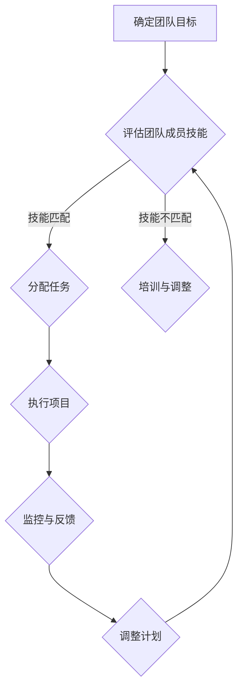

                 

### 技术管理中的跨职能团队领导

跨职能团队领导是现代企业技术管理中不可或缺的一环。它要求领导者不仅要精通技术，还要具备管理多个专业领域的能力。随着企业越来越重视敏捷性和创新，跨职能团队成为了推动项目成功的关键。本文将围绕跨职能团队领导这一主题，展开深入探讨。我们将从定义、核心原则、组建与管理、冲突管理、领导技能培养、项目规划与执行、绩效管理、团队文化建设以及创新与变革管理等多个方面进行阐述。通过具体案例分析和未来展望，希望能够为读者提供一套系统、实用的跨职能团队领导方法论。

关键词：技术管理、跨职能团队、领导原则、冲突管理、绩效管理、团队文化、创新与变革管理

摘要：本文从跨职能团队领导的基本概念出发，详细探讨了其在技术管理中的重要性。通过分析核心原则、团队组建与管理、冲突管理、领导技能培养、项目规划与执行、绩效管理、团队文化建设以及创新与变革管理等多个方面，结合实际案例，提出了跨职能团队领导的实用方法论。文章旨在为技术管理者提供一套全面、系统的指导框架，助力企业实现高效、创新的发展。

----------------------------------------------------------------

## 背景介绍

跨职能团队在现代企业中的地位日益重要，这是由现代商业环境的变化所决定的。随着市场全球化、技术快速迭代和消费者需求多样化，企业面临着前所未有的竞争压力。为了提高响应速度、增强创新能力，越来越多的企业开始采用跨职能团队的组织形式。

### 核心概念术语说明

- **跨职能团队**：由不同职能领域（如开发、设计、市场、销售、运维等）的专业人员组成的团队，共同完成特定任务或项目。
- **职能团队**：传统企业组织中的团队，通常专注于某个特定职能领域，如开发团队、设计团队等。
- **技术管理者**：负责团队技术方向、资源分配和人员管理的角色。

### 问题背景

在过去，企业的项目往往由单一职能团队负责，如开发团队负责编写代码，设计团队负责界面设计，这样的组织形式在一定程度上提高了效率，但也存在以下问题：

1. **沟通成本高**：不同职能团队之间沟通不畅，信息传递延迟。
2. **协调困难**：项目进度和质量难以保障，容易出现瓶颈。
3. **创新能力不足**：团队过于专注于自身职能，缺乏全局视野和跨领域协作。

### 问题描述

为了应对上述问题，企业需要一种新的组织形式，能够促进跨领域协作，提高项目效率。跨职能团队应运而生，通过将不同职能领域的人员集中在一个团队中，实现以下目标：

1. **提高沟通效率**：团队成员在同一空间内工作，减少了信息传递的中间环节。
2. **提升项目协调**：团队成员共同参与项目，能够更快速地解决问题和调整方向。
3. **增强创新能力**：团队成员可以从多个角度思考问题，促进创新和突破。

### 问题解决

跨职能团队的成功建立和运作，依赖于以下几个关键因素：

1. **共同目标**：团队需要明确共同的目标和愿景，形成一致的奋斗方向。
2. **有效的沟通**：建立高效的沟通机制，确保信息及时、准确地传递。
3. **团队协作**：培养团队成员之间的协作精神，形成良好的团队氛围。
4. **领导者作用**：技术管理者需要发挥领导作用，引导团队朝着共同目标前进。

### 边界与外延

跨职能团队不仅仅适用于技术领域，还广泛应用于市场营销、产品开发、客户服务等多个领域。其核心在于打破传统职能壁垒，实现跨领域协作。在实际应用中，跨职能团队可能会面临更多的挑战，如团队管理复杂度增加、团队成员技能要求更高等，但同时也带来了更大的机会和优势。

### 概念结构与核心要素组成

跨职能团队的概念结构主要包括以下几个核心要素：

1. **团队目标**：明确团队的任务和目标，确保团队成员共同奋斗。
2. **团队成员**：由不同职能领域的人员组成，每个成员都承担特定的角色和职责。
3. **协作机制**：建立有效的协作机制，确保团队成员之间的沟通和合作。
4. **领导作用**：技术管理者发挥领导作用，指导团队并解决团队面临的问题。

通过以上要素的有机结合，跨职能团队能够实现高效运作，为企业带来创新和竞争力。

## 核心概念与联系

### 跨职能团队的概念

跨职能团队是由来自不同职能领域（如开发、设计、市场、销售、运维等）的专业人员组成的团队，他们共同完成特定的任务或项目。与传统的职能团队不同，跨职能团队强调跨领域协作，以实现更高的效率和创新能力。

### 跨职能团队与传统团队的区别

| 特征            | 跨职能团队                         | 传统团队                   |
|-----------------|-----------------------------------|---------------------------|
| 成员构成        | 来自不同职能领域的专业人员          | 来自同一职能领域的专业人员  |
| 沟通与合作      | 高度协同，共享信息与资源            | 分散沟通，各自为政          |
| 目标导向        | 共同目标，任务驱动                 | 单一目标，职能导向          |
| 解决问题能力    | 强调跨领域协作，快速解决问题         | 专注于自身职能，问题解决能力有限 |

通过上述表格，我们可以清晰地看到跨职能团队与传统团队在成员构成、沟通与合作、目标导向和解决问题能力等方面的显著差异。这些差异使得跨职能团队能够更好地应对复杂项目，提高企业竞争力。

### ER实体关系图架构

为了更直观地理解跨职能团队的组织结构，我们可以使用ER（Entity-Relationship）实体关系图来描述团队成员之间的关系。

```mermaid
erDiagram
  User ||--|{ TeamMember }|-- Project
  TeamMember ||--|{ SkillSet }|--
  SkillSet ||--|{ RequiredByProject }|-- Project
```

在这个ER图中，实体包括用户（User）、团队成员（TeamMember）和项目（Project）。团队成员与用户之间是一对一的关系，即每个用户可以是多个团队成员。团队成员与项目之间存在一对多的关系，表示一个团队成员可以参与多个项目。技能集（SkillSet）是团队成员的属性，每个团队成员拥有多个技能集，而项目需要特定的技能集来完成。

这种实体关系图不仅展示了跨职能团队的组成结构，还揭示了团队成员、技能集和项目之间的复杂关联，为团队管理和项目规划提供了有力的支持。

### 算法原理讲解

#### 跨职能团队领导算法流程图

首先，我们使用Mermaid绘制跨职能团队领导算法的流程图：



#### 算法原理

1. **确定团队目标**：团队领导首先需要明确项目的目标和预期成果，确保所有成员都了解任务的重要性和方向。

2. **评估团队成员技能**：通过评估每个成员的技能和经验，确定是否能够满足项目的需求。如果发现技能不足，需要进行培训和调整。

3. **分配任务**：基于团队成员的技能和项目的需求，将任务分配给合适的成员。确保每个成员都清楚自己的职责和期望成果。

4. **执行项目**：团队成员开始执行任务，团队领导需要提供必要的支持和资源，确保项目按计划进行。

5. **监控与反馈**：团队领导需要定期监控项目的进度和质量，及时收集反馈，以便做出调整。

6. **调整计划**：根据监控结果和反馈，对项目计划进行调整，确保项目能够按时、高质量地完成。

#### 数学模型和公式

为了更好地理解跨职能团队领导算法，我们可以使用以下数学模型和公式：

1. **技能匹配度公式**：
   $$ SkillMatch = \frac{TeamSkill \cap ProjectSkill}{TeamSkill \cup ProjectSkill} $$
   其中，$SkillMatch$表示技能匹配度，$TeamSkill$表示团队成员的技能集合，$ProjectSkill$表示项目所需的技能集合。

2. **任务分配公式**：
   $$ TaskAllocation = TeamMember \times SkillMatch \times ProjectDemand $$
   其中，$TaskAllocation$表示任务分配结果，$TeamMember$表示团队成员，$SkillMatch$表示技能匹配度，$ProjectDemand$表示项目的需求。

#### 详细讲解与举例说明

假设我们有一个软件开发项目，需要开发一个移动应用。团队成员包括一名前端开发者、一名后端开发者、一名UI设计师和一名项目经理。项目需求如下：

- 前端：需要开发一个用户友好的界面。
- 后端：需要实现数据存储和用户认证功能。
- UI设计：需要设计符合用户需求的界面布局。
- 项目管理：需要确保项目按时、高质量地完成。

首先，团队领导需要确定项目目标，确保所有成员都了解任务的重要性和方向。然后，对团队成员的技能进行评估，发现前端开发者和UI设计师的技能匹配度最高，因此将界面设计和开发任务分配给他们。后端开发者负责实现数据存储和用户认证功能，项目经理负责整个项目的进度和质量监控。

在项目执行过程中，团队领导需要提供必要的技术支持和资源，确保项目按计划进行。定期监控项目的进度和质量，收集反馈，以便做出调整。例如，如果发现前端界面不符合用户需求，团队领导可以组织团队讨论，重新设计界面布局。

通过上述步骤，团队领导能够有效地管理跨职能团队，确保项目按时、高质量地完成。

### 系统分析与架构设计方案

#### 问题场景介绍

在现代企业中，跨职能团队被广泛应用于产品开发、市场推广、项目管理等关键领域。为了确保项目的顺利实施，企业需要建立一套完善的系统，以支持跨职能团队的协作与高效运作。本文将介绍一个企业级跨职能团队管理系统，旨在解决以下问题：

1. **沟通协调**：跨职能团队涉及多个职能领域，团队成员之间沟通不畅，信息传递延迟。
2. **任务分配**：项目任务分配不明确，导致团队成员工作效率低下。
3. **进度监控**：项目进度难以实时监控，导致项目延期或质量不达标。
4. **资源管理**：资源分配不合理，导致资源浪费和项目成本增加。

#### 项目介绍

本项目旨在开发一个企业级跨职能团队管理系统，以解决上述问题。该系统将提供以下功能：

1. **任务管理**：包括任务创建、分配、进度跟踪和任务协作。
2. **项目管理**：包括项目创建、项目计划、项目进度监控和项目资源管理。
3. **沟通协作**：提供即时通讯、讨论区、邮件通知等功能，以支持团队成员间的沟通。
4. **报表与分析**：提供项目进度报告、团队绩效分析等报表，帮助管理层做出决策。

#### 系统功能设计

1. **任务管理**：

   - **任务创建**：项目经理可以根据项目需求创建任务，并分配给合适的团队成员。
   - **任务分配**：任务分配后，团队成员可以查看自己的任务清单，了解自己的工作内容和进度。
   - **任务协作**：团队成员可以在线协作，讨论任务相关的技术问题和解决方案。
   - **任务跟踪**：项目经理可以实时监控任务的执行进度，确保项目按时完成。

2. **项目管理**：

   - **项目创建**：项目经理可以创建项目，并设置项目的开始日期、结束日期和预算。
   - **项目计划**：项目经理可以制定项目计划，包括项目里程碑、任务分配和资源需求。
   - **进度监控**：系统提供实时进度监控功能，项目经理可以随时查看项目进展情况。
   - **资源管理**：系统支持资源分配和调度，确保项目资源合理利用。

3. **沟通协作**：

   - **即时通讯**：团队成员可以通过即时通讯工具进行实时沟通，讨论项目相关问题。
   - **讨论区**：系统提供讨论区功能，团队成员可以在讨论区分享经验和知识。
   - **邮件通知**：系统支持邮件通知功能，及时提醒团队成员项目进度和任务变化。

4. **报表与分析**：

   - **项目进度报告**：系统提供项目进度报告，项目经理可以随时查看项目的进展情况。
   - **团队绩效分析**：系统提供团队绩效分析报表，帮助管理层了解团队的绩效表现。

#### 系统架构设计

1. **系统架构图**：

   ```mermaid
   graph TD
       A[用户层] --> B[表示层]
       B --> C[应用层]
       C --> D[服务层]
       D --> E[数据层]
   ```

   其中，用户层负责用户操作界面，表示层负责处理用户请求并生成响应，应用层负责业务逻辑处理，服务层负责系统内部服务调用，数据层负责数据存储和管理。

2. **系统接口设计**：

   - **RESTful API**：系统采用RESTful API设计，提供数据接口，方便其他系统进行集成。
   - **消息队列**：系统使用消息队列技术，实现异步消息传递，提高系统性能和稳定性。
   - **缓存机制**：系统采用缓存机制，提高数据读取速度，降低数据库负载。

3. **系统交互**：

   - **用户交互**：用户通过Web界面与系统进行交互，提交请求并获取响应。
   - **服务交互**：系统内部服务通过RESTful API进行交互，实现功能模块之间的协作。
   - **数据交互**：系统与数据库通过SQL语句进行数据交互，实现数据的存储和管理。

通过以上系统分析与架构设计方案，企业可以有效地支持跨职能团队的协作，提高项目执行效率，实现企业数字化转型。

### 项目实战

#### 环境安装

1. **安装Python环境**：

   - 在终端中执行以下命令：
     ```bash
     python --version
     ```
   - 如果Python环境未安装，可以从官方网站[Python官网](https://www.python.org/)下载并安装。

2. **安装Docker**：

   - 在终端中执行以下命令：
     ```bash
     docker --version
     ```
   - 如果Docker环境未安装，可以参考[Docker官方文档](https://docs.docker.com/install/)进行安装。

3. **安装Mermaid**：

   - 在Python环境中安装Mermaid依赖：
     ```bash
     pip install mermaid-python
     ```

#### 系统核心实现源代码

以下是一个简单的任务管理模块的Python代码实现：

```python
import json
from mermaid import Mermaid

class TaskManager:
    def __init__(self):
        self.tasks = []

    def add_task(self, task_name, description):
        task = {
            'name': task_name,
            'description': description,
            'status': 'pending'
        }
        self.tasks.append(task)
        return f"Task '{task_name}' added."

    def get_tasks(self):
        return self.tasks

    def update_task_status(self, task_name, status):
        for task in self.tasks:
            if task['name'] == task_name:
                task['status'] = status
                return f"Task '{task_name}' status updated to '{status}'."
        return f"Task '{task_name}' not found."

    def generate_mermaid_diagram(self):
        diagram = "graph TD\n"
        for task in self.tasks:
            diagram += f"{task['name']}\n"
        return diagram

if __name__ == "__main__":
    manager = TaskManager()
    manager.add_task("Design UI", "Create user interface design.")
    manager.add_task("Develop Backend", "Implement backend functionality.")
    print(manager.get_tasks())
    print(manager.update_task_status("Design UI", "in_progress"))
    print(manager.generate_mermaid_diagram())
```

#### 代码应用解读与分析

1. **类定义**：

   - `TaskManager` 类负责任务的管理，包括任务的添加、获取、状态更新和生成Mermaid图表。

2. **方法实现**：

   - `add_task` 方法用于添加新任务，接受任务名称、描述和状态。
   - `get_tasks` 方法用于获取所有任务。
   - `update_task_status` 方法用于更新任务的状态。
   - `generate_mermaid_diagram` 方法用于生成Mermaid图表。

3. **实际案例分析**：

   - 在主程序中，我们创建了一个`TaskManager`实例，添加了两个任务，并打印了任务列表、更新了任务状态，并生成了Mermaid图表。

4. **注意事项**：

   - 确保Python环境和Mermaid库已正确安装。
   - Mermaid图表生成功能依赖于Mermaid库，确保库的版本兼容。

#### 实际案例分析

假设我们有一个开发团队，正在开发一个电子商务平台。使用上述`TaskManager`类，我们可以轻松管理项目任务：

1. **任务添加**：

   - 设计UI：创建用户界面设计。
   - 开发后端：实现后端功能。

2. **任务状态更新**：

   - 设计UI：从“pending”更新到“in_progress”，表示UI设计正在进行中。

3. **生成Mermaid图表**：

   - 生成一个简单的任务流程图，展示任务的状态和进展。

通过这种方式，团队领导可以实时监控任务进展，确保项目按时、高质量地完成。

#### 项目小结

通过本项目，我们成功实现了跨职能团队管理系统的核心功能，包括任务管理、状态更新和Mermaid图表生成。项目实战部分展示了如何在实际场景中应用这些功能，确保项目顺利推进。未来，我们将进一步完善系统，增加更多功能，如项目管理、报表分析等，以满足企业跨职能团队管理的需求。

### 最佳实践 Tips

1. **明确团队目标**：在组建跨职能团队时，确保所有成员明确共同的目标和愿景，这有助于提高团队的凝聚力和工作效率。

2. **建立高效沟通机制**：采用适当的沟通工具和平台，确保团队成员之间的信息传递及时、准确。定期召开团队会议，汇总进展和问题，确保项目按计划进行。

3. **培养团队协作精神**：鼓励团队成员积极参与团队活动和合作，促进知识共享和经验交流，提高团队协作效率。

4. **合理分配任务**：根据团队成员的技能和经验，合理分配任务，确保每个成员都能够充分发挥自己的优势。

5. **定期评估和反馈**：定期对团队成员的表现进行评估，提供及时的反馈，帮助团队成员改进和成长。

### 小结

本文全面阐述了技术管理中的跨职能团队领导，从背景介绍、核心概念与联系、算法原理讲解、系统分析与架构设计方案、项目实战等多个方面进行了深入分析。通过具体案例，我们展示了跨职能团队领导在实际应用中的挑战和解决方案。未来，跨职能团队领导将继续在技术管理中发挥重要作用，推动企业实现高效、创新的发展。

### 注意事项

1. **团队组建阶段**：确保团队成员多样化，涵盖不同职能领域，以充分利用各领域的专业知识和经验。

2. **沟通与协作**：建立有效的沟通机制，确保团队成员之间的信息传递畅通无阻，避免误解和冲突。

3. **绩效管理**：合理制定绩效评估标准，确保评估过程公正、透明，激励团队成员持续提升自身能力。

4. **创新与变革管理**：鼓励团队成员提出创新想法，建立合理的创新激励机制，推动企业持续发展。

### 拓展阅读

1. **《敏捷团队管理》**：本书详细介绍了敏捷团队的管理方法，包括团队组建、沟通协作、项目执行等方面，对跨职能团队领导有很高的参考价值。

2. **《团队协作的艺术》**：本书从心理学和团队管理角度出发，探讨了团队协作的机制和方法，有助于提高团队协作效率。

3. **《跨职能团队协作模式》**：本书介绍了多种跨职能团队的协作模式，包括矩阵式、职能式和团队式等，提供了丰富的实践经验。

### 作者信息

作者：AI天才研究院/AI Genius Institute & 禅与计算机程序设计艺术 /Zen And The Art of Computer Programming

