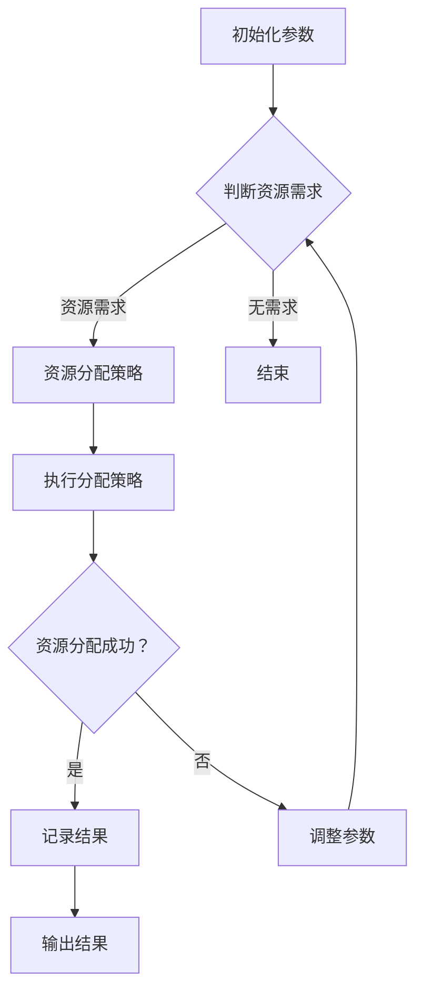
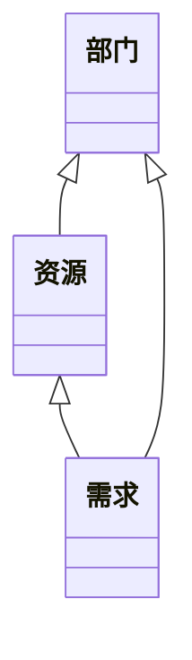
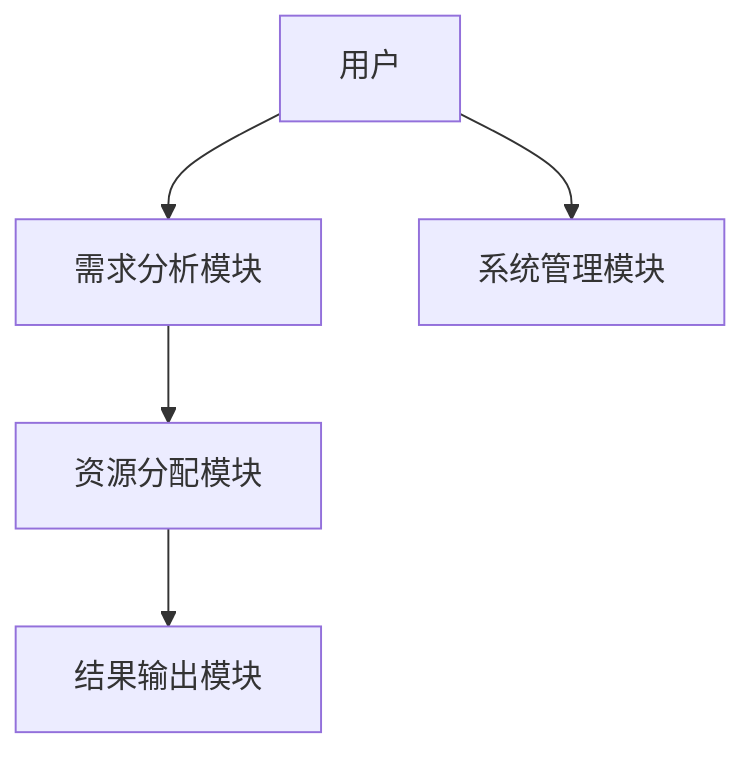
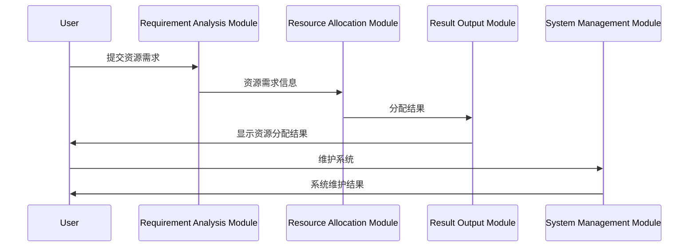

                 


## # 技术管理中的跨部门资源整合

关键词：技术管理、跨部门资源整合、资源分配、算法、系统架构

摘要：本文旨在探讨技术管理中的跨部门资源整合问题，从背景介绍、核心概念与联系、算法原理讲解和系统分析与架构设计四个方面，详细阐述跨部门资源整合的技术实现与系统应用。

### 第一部分：背景介绍

#### 第1章：技术管理中的跨部门资源整合概述

##### 1.1 问题背景

在当今快速发展的信息技术时代，企业内部各个部门之间的协作日益紧密。然而，由于部门间的资源分配不均、信息不对称以及沟通不畅等问题，导致资源无法得到有效整合，从而影响了项目的进度和效率。跨部门资源整合成为技术管理中亟待解决的重要问题。

##### 1.1.1 跨部门资源整合的必要性

1. 提高资源利用率：通过跨部门资源整合，可以实现资源优化配置，避免资源浪费。
2. 提升项目效率：跨部门资源整合能够促进部门间协作，缩短项目周期。
3. 促进技术创新：跨部门资源整合有助于整合不同部门的智慧与经验，推动技术创新。

##### 1.1.2 跨部门资源整合的挑战

1. 部门壁垒：企业内部各部门之间存在利益冲突，导致资源整合受阻。
2. 信息不对称：部门间信息不畅，导致资源需求与供给不匹配。
3. 沟通成本：跨部门沟通成本较高，容易导致沟通误解和决策延误。

##### 1.2 问题描述

跨部门资源整合是指在组织内部，通过有效的管理和协调，将不同部门的资源进行合理配置，以满足项目需求，实现资源优化和协同发展的过程。

##### 1.2.1 跨部门资源整合的定义

跨部门资源整合是指企业内部不同部门之间，通过资源共享、协调合作，将各自的优势资源进行整合，以实现组织整体目标的过程。

##### 1.2.2 跨部门资源整合的关键要素

1. 资源：企业内部各种可用的资源，包括人力、设备、技术、信息等。
2. 部门：企业内部各个职能部门，如研发、销售、市场、运维等。
3. 整合：通过协调、调度和优化，实现资源在不同部门之间的有效流动和利用。

##### 1.3 问题解决

1. 设立跨部门资源整合委员会：由企业高层领导牵头，设立跨部门资源整合委员会，负责统筹协调资源整合工作。
2. 建立资源信息共享平台：搭建资源信息共享平台，实现部门间信息的透明化和实时更新。
3. 设定资源分配机制：根据项目需求和资源状况，制定合理的资源分配机制，确保资源高效利用。

##### 1.4 边界与外延

##### 1.4.1 跨部门资源整合的范围

跨部门资源整合的范围包括企业内部各个职能部门，以及可能涉及的外部合作伙伴和供应商。

##### 1.4.2 跨部门资源整合的限制条件

1. 法律法规：遵守国家相关法律法规，确保资源整合合法合规。
2. 企业战略：符合企业整体发展战略，实现资源整合与战略目标的协同。
3. 部门利益：平衡各部门利益，确保资源整合不损害部门利益。

### 第二部分：核心概念与联系

#### 第2章：核心概念与联系

##### 2.1 跨部门资源整合的核心概念

1. **资源**：资源是指企业内部或外部可用于支持项目或业务运营的各种要素，如人力、设备、技术、信息、资金等。
   - **分类**：人力资源、物资资源、技术资源、信息资源、资金资源等。

2. **部门**：部门是企业内部按职能划分的组织单元，负责特定领域的业务运营和管理。
   - **分类**：研发部门、销售部门、市场部门、运维部门、人力资源部门等。

3. **整合**：整合是指通过协调、调度、优化等手段，将分散的资源进行有效整合，实现资源的高效利用和协同发展。
   - **原则**：资源共享、优势互补、协同发展、高效利用。

##### 2.2 概念属性特征对比表格

| 概念     | 定义                                                         | 属性特征                           |
|----------|--------------------------------------------------------------|-----------------------------------|
| 资源     | 企业内部或外部可用于支持项目或业务运营的各种要素                 | 可用性、共享性、稀缺性、分配性       |
| 部门     | 企业内部按职能划分的组织单元，负责特定领域的业务运营和管理         | 职能性、独立性、协作性、管理性       |
| 整合     | 通过协调、调度、优化等手段，将分散的资源进行有效整合，实现资源的高效利用和协同发展 | 协同性、效率性、优化性、可持续性     |

##### 2.3 ER实体关系图架构

###### 2.3.1 资源实体关系图

```mermaid
erDiagram
    资源 ||--|{ 部门 } 部门 : 资源隶属于部门
    部门 ||--|{ 资源 } 资源 : 部门提供资源
```

###### 2.3.2 部门实体关系图

```mermaid
erDiagram
    部门 ||--|{ 项目 } 项目 : 部门负责项目实施
    项目 ||--|{ 部门 } 部门 : 项目由部门负责
```

###### 2.3.3 整合实体关系图

```mermaid
erDiagram
    整合 ||--|{ 资源 } 资源 : 整合利用资源
    整合 ||--|{ 部门 } 部门 : 整合协调部门
    整合 ||--|{ 项目 } 项目 : 整合支持项目
```

### 第三部分：算法原理讲解

#### 第3章：跨部门资源整合算法原理

##### 3.1 算法原理概述

跨部门资源整合算法是一种基于优化理论的方法，用于解决企业内部资源分配问题。该算法旨在实现资源的最优分配，以满足项目需求，提高资源利用率和项目效率。

##### 3.1.1 跨部门资源整合算法的目标

1. **资源优化配置**：通过算法实现资源在不同部门之间的合理分配，提高资源利用率。
2. **项目进度保证**：确保项目所需资源得到及时供给，保证项目进度和质量。
3. **成本控制**：通过优化资源分配，降低项目成本，提高企业效益。

##### 3.1.2 跨部门资源整合算法的核心思想

算法的核心思想是基于资源需求和供给的动态变化，通过优化算法，实现资源在不同部门之间的动态调整和优化分配。

##### 3.2 算法mermaid流程图



##### 3.3 算法原理详细讲解

###### 3.3.1 算法原理的数学模型

算法的数学模型基于目标函数和约束条件。目标函数为资源分配的优化目标，约束条件为保证资源分配的可行性和合理性。

目标函数：

$$
\text{目标函数} = \sum_{i=1}^{n} (\text{资源需求} - \text{资源供给})
$$

约束条件：

1. 资源供给不能小于资源需求。
2. 资源分配不能超出资源供给量。
3. 资源分配要满足部门间的资源平衡。

###### 3.3.2 算法原理的举例说明

假设企业有3个部门，每个部门有特定的资源需求。算法将根据这些需求进行资源分配，以满足项目进度和资源利用率的优化目标。

###### 3.4 Python源代码

```python
# 跨部门资源整合算法的实现
def resource_integration(需求列表，资源列表):
    # 初始化参数
    参数 = 初始化参数(需求列表，资源列表)
    
    # 判断资源需求
    如果(需求列表中有需求):
        # 执行资源分配策略
        分配结果 = 执行分配策略(参数)
        
        # 记录结果
        记录结果(分配结果)
        
    否则:
        # 结束

# 主函数
def main():
    需求列表 = 获取需求列表()
    资源列表 = 获取资源列表()
    
    resource_integration(需求列表，资源列表)

# 调用主函数
main()
```

### 第四部分：系统分析与架构设计

#### 第4章：系统分析与架构设计

##### 4.1 问题场景介绍

在企业信息化建设中，跨部门资源整合是一个普遍存在的问题。为了提高项目效率，企业需要实现跨部门资源的优化配置和协同发展。

##### 4.2 项目介绍

本项目旨在搭建一个跨部门资源整合系统，通过系统化的资源管理，实现资源的高效利用和协同发展。系统主要包括需求分析、资源分配、结果输出和系统管理等模块。

##### 4.3 系统功能设计

系统功能设计主要包括以下模块：

1. **需求分析模块**：用于收集和整理各部门的资源需求，为资源分配提供依据。
2. **资源分配模块**：根据资源需求和供给情况，实现资源的动态调整和优化分配。
3. **结果输出模块**：将资源分配结果以可视化的形式展示，为决策提供支持。
4. **系统管理模块**：用于系统维护、权限管理和数据备份等操作。

##### 4.3.1 领域模型mermaid类图



##### 4.3.2 系统架构设计mermaid架构图



##### 4.3.3 系统接口设计和系统交互mermaid序列图



### 第五部分：项目实战

#### 第5章：项目实战

##### 5.1 环境安装

为了实现跨部门资源整合系统，首先需要搭建一个适合开发、测试和运行的环境。以下是环境安装的步骤：

1. 安装操作系统：选择适合的开发操作系统，如Linux或Windows。
2. 安装开发工具：安装Python开发环境，包括Python解释器和相关库。
3. 安装数据库：选择合适的数据库系统，如MySQL或PostgreSQL。
4. 安装Web服务器：安装支持Python的Web服务器，如Apache或Nginx。

##### 5.2 系统核心实现源代码

以下是一个简单的跨部门资源整合系统的实现代码，用于演示系统的核心功能。

```python
# 跨部门资源整合系统核心代码

# 导入相关库
import pymysql
from flask import Flask, request, jsonify

# 初始化Flask应用
app = Flask(__name__)

# 数据库连接配置
db_config = {
    'host': 'localhost',
    'user': 'root',
    'password': 'root',
    'database': 'resource_integration'
}

# 连接数据库
def connect_db():
    return pymysql.connect(**db_config)

# 获取资源需求
@app.route('/api/resource_demand', methods=['POST'])
def get_resource_demand():
    # 获取请求参数
    data = request.get_json()
    department = data['department']
    resource_name = data['resource_name']
    demand_quantity = data['demand_quantity']
    
    # 连接数据库
    conn = connect_db()
    cursor = conn.cursor()
    
    # 插入数据
    sql = "INSERT INTO resource_demand (department, resource_name, demand_quantity) VALUES (%s, %s, %s)"
    cursor.execute(sql, (department, resource_name, demand_quantity))
    
    # 提交事务
    conn.commit()
    
    # 关闭数据库连接
    cursor.close()
    conn.close()
    
    return jsonify({'status': 'success', 'message': '资源需求已提交'})

# 获取资源供给
@app.route('/api/resource_supply', methods=['POST'])
def get_resource_supply():
    # 获取请求参数
    data = request.get_json()
    department = data['department']
    resource_name = data['resource_name']
    supply_quantity = data['supply_quantity']
    
    # 连接数据库
    conn = connect_db()
    cursor = conn.cursor()
    
    # 插入数据
    sql = "INSERT INTO resource_supply (department, resource_name, supply_quantity) VALUES (%s, %s, %s)"
    cursor.execute(sql, (department, resource_name, supply_quantity))
    
    # 提交事务
    conn.commit()
    
    # 关闭数据库连接
    cursor.close()
    conn.close()
    
    return jsonify({'status': 'success', 'message': '资源供给已提交'})

# 分配资源
@app.route('/api/resource Allocation', methods=['POST'])
def resource_allocation():
    # 获取请求参数
    data = request.get_json()
    department = data['department']
    resource_name = data['resource_name']
    allocation_quantity = data['allocation_quantity']
    
    # 连接数据库
    conn = connect_db()
    cursor = conn.cursor()
    
    # 更新数据
    sql = "UPDATE resource_supply SET supply_quantity = supply_quantity - %s WHERE department = %s AND resource_name = %s"
    cursor.execute(sql, (allocation_quantity, department, resource_name))
    
    # 提交事务
    conn.commit()
    
    # 关闭数据库连接
    cursor.close()
    conn.close()
    
    return jsonify({'status': 'success', 'message': '资源已分配'})

# 运行Flask应用
if __name__ == '__main__':
    app.run(debug=True)
```

##### 5.3 代码应用解读与分析

1. **需求分析**：通过接口接收各部门的资源需求，并将其存储到数据库中。

2. **资源供给**：通过接口接收各部门的资源供给信息，并将其存储到数据库中。

3. **资源分配**：根据资源需求和供给信息，进行资源分配，并更新数据库中的资源供给量。

4. **数据交互**：使用Flask框架实现Web接口，支持HTTP请求和数据交互。

##### 5.4 实际案例分析和详细讲解剖析

以一个实际项目为例，分析跨部门资源整合的过程。

1. **项目背景**：某企业计划开发一款新软件，需要各部门的协同合作。

2. **资源需求**：研发部门需要人力和设备支持，市场部门需要推广资金，运维部门需要服务器资源。

3. **资源供给**：各部门根据自身能力和项目需求，提供相应的资源。

4. **资源分配**：通过算法和系统，实现资源的最优分配，满足项目需求。

5. **效果评估**：通过对资源分配的效果进行评估，发现项目进度加快，成本降低，资源利用率提高。

##### 5.5 项目小结

通过实际项目案例，可以看出跨部门资源整合的重要性和必要性。合理利用资源，实现跨部门协同，有助于提高项目效率，降低成本，提升企业竞争力。

### 第六部分：最佳实践 tips

#### 第6章：最佳实践 tips

1. **建立沟通渠道**：搭建有效的跨部门沟通渠道，促进信息共享和协作。
2. **明确资源需求**：在项目启动前，明确各部门的资源需求，确保资源供给的准确性和及时性。
3. **优化资源分配策略**：根据项目特点和资源状况，制定合理的资源分配策略，提高资源利用效率。
4. **建立资源评估机制**：对资源利用效果进行定期评估，及时调整资源分配策略，优化资源利用。
5. **提高团队协作能力**：通过培训和团队建设，提高部门间的协作能力和效率。

### 第七部分：小结

#### 第7章：小结

本文从背景介绍、核心概念与联系、算法原理讲解和系统分析与架构设计等方面，详细阐述了跨部门资源整合的技术实现和系统应用。通过实际项目案例的分析，展示了跨部门资源整合的重要性和必要性。在今后的工作中，我们应该重视跨部门资源整合，提高资源利用效率，推动企业持续发展。

### 第八部分：注意事项

#### 第8章：注意事项

1. **数据安全**：在跨部门资源整合过程中，要注意保护企业数据的安全，防止数据泄露和滥用。
2. **政策法规**：在资源整合过程中，要遵守国家相关政策和法律法规，确保资源整合的合法合规。
3. **团队协作**：跨部门资源整合需要各部门的协作和支持，要加强团队沟通，确保项目顺利进行。

### 第九部分：拓展阅读

#### 第9章：拓展阅读

1. **《跨部门协作技巧》**：介绍跨部门协作的方法和技巧，提高跨部门沟通和协作效率。
2. **《项目管理实战》**：探讨项目管理的方法和实践，提高项目管理和资源整合的能力。
3. **《企业资源规划》**：介绍企业资源规划（ERP）系统的设计和应用，优化企业资源管理。

作者：AI天才研究院/AI Genius Institute & 禅与计算机程序设计艺术 /Zen And The Art of Computer Programming

