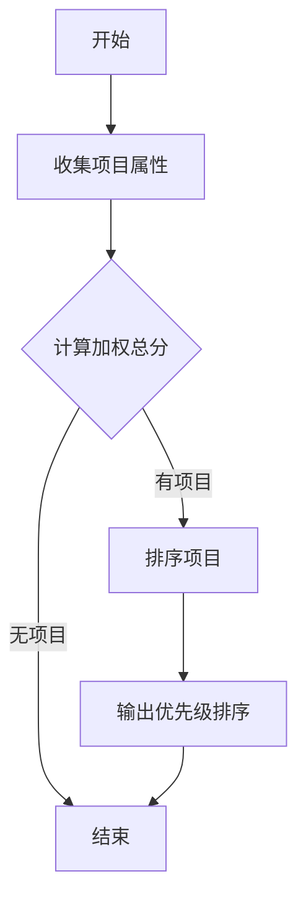
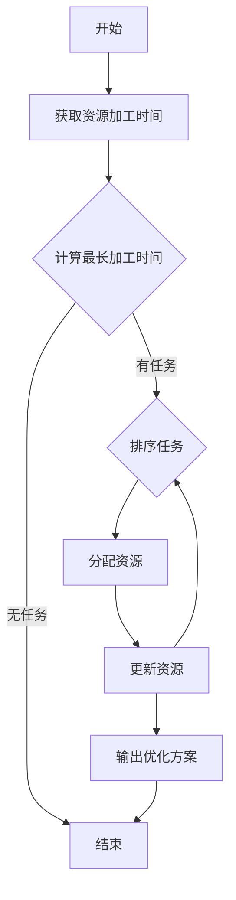
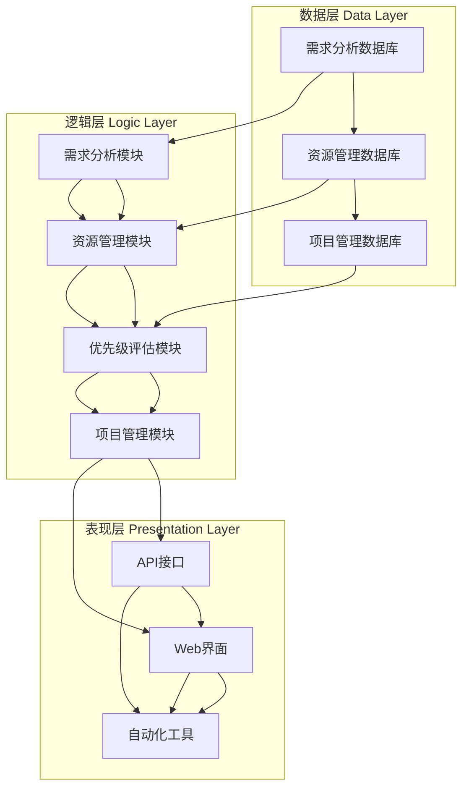
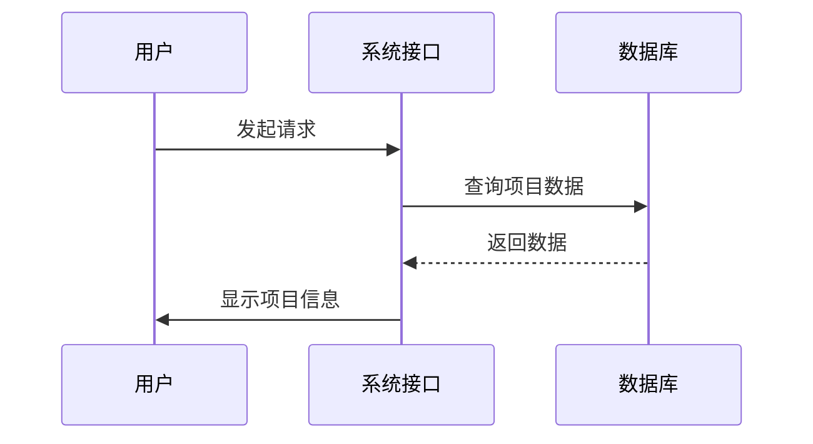

                 


### 引言：项目管理的重要性

在现代企业中，项目管理扮演着至关重要的角色。项目是完成特定任务、达成特定目标的临时性工作，它涉及资源的整合、任务的管理以及成果的交付。项目管理则是确保这些任务高效、有序、按时按质完成的一系列管理活动。随着企业规模的扩大和市场竞争的加剧，项目管理的重要性愈加凸显。

项目管理的重要性体现在以下几个方面：

1. **资源优化**：项目管理通过科学合理的优先级管理，使有限的资源得到最大化利用，避免资源浪费。
2. **目标达成**：项目管理确保项目目标的实现，通过规划、执行、监控和控制，确保项目在预定的时间和预算内完成。
3. **风险控制**：项目管理通过识别、评估和控制风险，减少项目风险对项目进度和成本的影响。
4. **质量保证**：项目管理通过建立标准和流程，确保项目交付物满足质量要求。
5. **团队协作**：项目管理通过协调各方资源和任务，促进团队协作，提高工作效率。

### 文章关键词

- 项目管理
- 优先级管理
- 资源优化
- 目标达成
- 风险控制
- 质量保证
- 团队协作

### 摘要

本文旨在深入探讨项目优先级管理在技术管理中的应用。首先，我们将介绍项目优先级管理的基础概念和重要性，然后分析影响项目优先级确定的因素。接下来，我们将讨论核心概念与联系，包括关键路径分析、甘特图与关键链法、敏捷开发与优先级管理。随后，我们将介绍数学模型与算法原理，并详细讲解项目优先级决策方法。通过实际应用案例和最佳实践，我们将展示项目优先级管理的有效性。最后，文章将总结项目优先级管理的关键点，并提供拓展阅读建议。

## 第一部分：项目优先级管理基础

在深入探讨项目优先级管理之前，我们有必要先了解一些基础概念。项目优先级管理是项目管理中的一个重要环节，它涉及到如何根据项目的各种属性和内外部条件，科学合理地安排项目的执行顺序和资源分配。通过有效的项目优先级管理，企业可以更好地应对复杂的项目环境，提高资源利用效率，确保项目目标的实现。

### 项目优先级管理的定义与重要性

项目优先级管理，通常指的是在企业或组织中，根据项目的紧急程度、重要性、资源需求等因素，对多个项目进行排序，以便优化资源分配，提高工作效率，确保关键项目优先执行。具体来说，项目优先级管理包括以下几个关键步骤：

1. **项目筛选与评估**：根据企业战略目标和资源状况，筛选出符合企业利益的关键项目，并对这些项目进行初步评估。
2. **确定优先级**：通过分析项目的紧急程度、重要性、资源需求等因素，为项目排序，确定优先级。
3. **资源分配**：根据项目优先级，合理分配人力、物力、财力等资源，确保关键项目得到充分支持。
4. **监控与调整**：在项目执行过程中，持续监控项目的进展情况，根据实际情况调整项目优先级，确保资源始终聚焦于最关键的项目。

项目优先级管理的重要性体现在以下几个方面：

1. **优化资源利用**：通过科学合理的项目优先级管理，企业可以最大限度地利用有限的资源，避免资源浪费。
2. **提高工作效率**：合理排序和优先执行关键项目，可以避免项目之间的资源竞争，提高整体工作效率。
3. **确保目标实现**：优先执行关键项目，有助于确保项目目标的实现，提升企业竞争力。
4. **降低风险**：通过识别和优先处理高风险项目，可以有效降低项目风险，确保企业稳定发展。

### 项目优先级管理的关键概念

在项目优先级管理中，以下几个关键概念尤为重要：

1. **紧急程度**：指项目需要完成的紧迫性。通常情况下，紧急程度较高的项目应优先处理。
2. **重要性**：指项目对企业战略目标的支持程度。重要性较高的项目应优先得到关注和资源支持。
3. **资源需求**：指项目在人力、物力、财力等方面的需求。资源需求较大的项目可能需要更多的优先级。
4. **依赖关系**：指项目之间的相互依赖关系。存在依赖关系的项目，应优先安排以避免瓶颈。
5. **风险因素**：指项目执行过程中可能面临的风险。高风险项目应优先处理，以便提前采取风险控制措施。

通过以上关键概念的理解和运用，企业可以更好地进行项目优先级管理，确保项目高效、有序地推进。

### 问题背景

随着企业业务的发展和竞争的加剧，项目管理逐渐成为企业管理中不可或缺的一部分。然而，在实际操作中，企业常常面临多个项目同时进行的局面。这些项目往往具有不同的紧急程度、重要性和资源需求，如何科学合理地安排这些项目的执行顺序，成为企业管理者面临的一大挑战。

特别是在资源有限的情况下，如何确保关键项目优先执行，避免资源浪费，是企业必须解决的关键问题。传统的项目管理方法往往侧重于项目规划、执行和控制，而在项目优先级管理方面存在一定的不足。这导致一些关键项目可能得不到足够的资源支持，进而影响项目目标的实现。

因此，本文旨在通过深入探讨项目优先级管理，为企业提供一种科学合理的项目优先级确定方法，帮助企业管理者更好地应对复杂的项目环境，提高项目管理效率。

### 问题描述

项目优先级管理的关键在于如何根据项目的紧急程度、重要性、资源需求等因素，对多个项目进行排序，以便优化资源分配，提高工作效率，确保关键项目优先执行。在实际操作中，这一过程往往充满挑战：

1. **资源有限**：企业资源有限，如何在多个项目之间合理分配资源，确保关键项目得到充分支持，是一个难题。
2. **紧急项目与长期项目的平衡**：紧急项目往往需要迅速处理，但长期项目可能对企业长远发展更为重要。如何平衡两者的优先级，是企业面临的挑战。
3. **项目依赖关系**：项目之间存在相互依赖关系，如何确保依赖项目的先后顺序合理，避免项目之间的瓶颈，是项目管理的一大难题。
4. **动态调整**：在项目执行过程中，项目的紧急程度、重要性等因素可能会发生变化，如何及时调整项目优先级，保持项目的高效推进，是企业管理者需要解决的问题。

为了解决这些问题，项目优先级管理需要一种科学合理的方法，结合项目的各项属性和实际情况，制定出优化的项目执行顺序和资源分配策略。这不仅有助于提高项目完成率，还能确保企业资源得到最大化利用，推动企业持续发展。

### 问题解决

解决项目优先级管理的问题，需要从多个方面入手，综合考虑项目的紧急程度、重要性、资源需求等因素。以下是一些具体的方法和策略：

1. **优先级排序**：根据项目的紧急程度和重要性，对项目进行初步排序。通常情况下，紧急且重要的项目应排在最前面，以确保关键项目能够及时得到处理。
2. **资源分配**：在确定项目优先级的基础上，根据项目所需的资源需求，进行资源分配。对于资源需求较大的项目，应优先配置资源，确保其顺利进行。
3. **依赖关系分析**：分析项目之间的依赖关系，确保依赖项目的先后顺序合理。优先安排依赖关系紧密的项目，避免因某个项目延误而影响整个项目进度。
4. **动态调整**：在项目执行过程中，持续监控项目的进展情况，根据实际情况及时调整项目优先级。如果发现某些项目的紧急程度或重要性发生变化，应及时进行调整，确保资源始终聚焦于最关键的项目。
5. **风险管理**：识别项目执行过程中可能面临的风险，优先处理高风险项目，采取相应的风险控制措施，降低项目风险。
6. **敏捷方法**：采用敏捷开发方法，快速响应项目变化，灵活调整项目优先级和资源分配，提高项目的适应能力和执行力。

通过以上方法和策略，企业可以更有效地进行项目优先级管理，确保关键项目优先执行，优化资源利用，提高项目管理效率。

### 边界与外延

在项目优先级管理中，我们需要明确边界与外延，以便更好地理解和应用这一管理方法。以下是几个关键概念：

1. **边界条件**：指项目优先级管理适用的场景和限制。例如，在资源有限、项目众多的情况下，项目优先级管理尤为重要。但在资源充足、项目较少的情况下，项目优先级管理的压力相对较小。
2. **外延范围**：指项目优先级管理适用的领域和对象。项目优先级管理不仅适用于企业内部项目，还适用于跨部门、跨行业的大型项目。它可以帮助企业优化资源配置，提高整体执行力。

此外，项目优先级管理需要与企业的战略目标、组织架构和文化背景相结合，才能发挥最大效果。例如，对于以创新为导向的企业，可能更注重长期项目的优先级；而对于以短期业绩为核心的企业，则可能更关注紧急项目的优先级。

总之，项目优先级管理的边界与外延需要根据实际情况灵活调整，以确保其适用性和有效性。

### 概念结构与核心要素组成

项目优先级管理是一个复杂而关键的管理过程，涉及多个核心要素和概念。以下是项目优先级管理的概念结构与核心要素组成：

1. **项目筛选与评估**：这是项目优先级管理的起点，涉及对潜在项目的筛选和初步评估。评估标准通常包括项目的紧急程度、重要性、资源需求、风险水平等。

2. **优先级确定方法**：根据项目的筛选和评估结果，采用科学合理的方法对项目进行优先级排序。常见的方法有经验法、数据驱动法、决策树等。

3. **资源分配策略**：在确定项目优先级后，根据项目优先级进行资源分配。资源分配策略需要考虑项目所需的资源类型、数量和质量，以及资源的时间可用性。

4. **监控与调整机制**：项目执行过程中，持续监控项目进展和资源利用情况，根据实际情况及时调整项目优先级和资源分配策略。这需要建立有效的监控系统和灵活的调整机制。

5. **风险控制措施**：识别和评估项目执行过程中可能面临的风险，并采取相应的风险控制措施。这有助于降低项目风险，确保项目顺利进行。

6. **依赖关系管理**：分析项目之间的依赖关系，确保项目先后顺序合理，避免因某个项目延误而影响整个项目进度。

7. **企业战略与目标契合度**：项目优先级管理应与企业的战略目标和长远发展规划相契合，确保项目优先级与企业的整体发展方向保持一致。

通过以上核心要素和概念的有机结合，项目优先级管理可以有效地提高项目完成率，优化资源利用，确保企业目标的实现。

## 第二部分：项目优先级确定的因素

确定项目优先级是项目优先级管理的关键步骤，它需要综合考虑多个因素。以下是影响项目优先级确定的主要因素：

### 资源分配

资源分配是项目优先级确定的重要依据。企业资源有限，如何在多个项目之间合理分配资源，是项目管理中的一个重要问题。以下是资源分配对项目优先级的影响：

1. **资源需求量**：资源需求量较大的项目，往往需要更多的优先级。因为资源分配的局限性，只有资源需求较小的项目能够获得更多的资源支持。

2. **资源种类**：不同项目的资源需求可能不同，包括人力、资金、设备、技术等。在资源有限的情况下，应优先考虑资源种类多样的项目，以确保资源的全面覆盖。

3. **资源利用效率**：高效率利用资源的项目，应获得更高的优先级。例如，能够快速完成并产生显著效益的项目，相对于那些耗时较长且收益不确定的项目，更值得优先安排。

### 风险评估

项目风险评估是项目优先级管理中不可或缺的一环。以下是风险评估对项目优先级的影响：

1. **风险水平**：高风险项目应优先评估和优先处理，以便及时采取风险控制措施。高风险项目可能涉及复杂的技术、不确定的市场需求或严重的安全隐患。

2. **风险影响**：评估项目的风险影响，包括对项目进度、成本、质量等方面的影响。风险影响较大的项目应优先处理，以减少潜在的损失。

3. **风险可控性**：风险可控性高的项目，可以更灵活地调整优先级。而风险不可控性高的项目，则需要更高的优先级，以确保风险管理的有效性。

### 利润潜力

项目的利润潜力是决定项目优先级的重要因素之一。以下是利润潜力对项目优先级的影响：

1. **直接利润**：直接利润较高的项目，应获得更高的优先级。例如，新产品开发、新市场开拓等项目，往往具有显著的直接利润潜力。

2. **间接利润**：虽然某些项目的直接利润可能较低，但它们可能为其他项目提供资源和市场，间接提升企业的整体利润。这类项目也应考虑其优先级。

3. **长期利润**：长期利润潜力高的项目，通常需要较长时间才能产生显著效益。但在资源有限的情况下，这类项目可能需要优先安排，以确保企业未来的稳定发展。

### 客户需求

客户需求是项目优先级确定的重要参考因素。以下是客户需求对项目优先级的影响：

1. **紧急需求**：客户紧急需求的项目应获得更高的优先级，以满足客户的需求，维护客户关系。

2. **市场需求**：市场需求强烈的项目，通常具有较高的优先级。这类项目不仅能够满足客户需求，还能为企业带来更大的市场机会。

3. **客户满意度**：客户满意度高的项目，往往是客户需求的具体体现。这类项目不仅有助于提升客户满意度，还能增强企业的市场竞争力。

### 项目目标的符合度

项目目标的符合度是决定项目优先级的重要因素。以下是项目目标符合度对项目优先级的影响：

1. **战略目标**：符合企业战略目标的项目，应获得更高的优先级。这类项目通常能够推动企业长远发展，提升企业的核心竞争力。

2. **业务目标**：符合业务目标的项目，应优先安排。这类项目能够直接支持企业的业务运营，提升企业的运营效率。

3. **团队目标**：符合团队目标的项目，应获得优先支持。这类项目能够激发团队的积极性和创造力，提升团队的整体业绩。

通过综合考虑以上因素，企业可以科学合理地确定项目优先级，确保资源得到最大化利用，项目目标得到高效实现。

### 核心概念与联系

在项目优先级管理中，几个核心概念和联系至关重要。理解这些概念及其相互关系，有助于企业更好地进行项目优先级确定和资源分配。以下是关键概念及其联系：

#### 关键路径分析

关键路径分析（Critical Path Analysis, CPA）是一种项目管理工具，用于确定项目中必须按时完成的任务序列，以确保项目按期完成。关键路径上的任务被称为关键任务，它们的延期会导致整个项目的延期。

- **关键路径属性**：关键路径上的任务具有以下属性：
  - 必须按时完成，否则会影响整个项目的进度。
  - 任何延迟都会直接影响项目的最终交付日期。
  - 通常具有最长的持续时间。

- **联系**：关键路径分析直接影响项目优先级管理，因为关键路径上的任务具有最高的优先级。通过识别关键路径，企业可以确保这些任务得到足够的资源支持，从而确保项目按时完成。

#### 甘特图与关键链法

甘特图（Gantt Chart）是一种常用的项目管理工具，用于展示项目进度和时间安排。甘特图通过条形图的方式，直观地展示各个任务的开始和结束时间，以及任务之间的依赖关系。

- **甘特图属性**：
  - 显示任务的具体开始和结束日期。
  - 表示任务的持续时间。
  - 显示任务之间的依赖关系。

关键链法（Critical Chain Project Management, CCPM）是一种改进的项目管理方法，它通过关注任务链中的依赖关系和时间管理，来降低项目风险和延迟。

- **关键链法属性**：
  - 识别关键链，即项目中关键任务的依赖序列。
  - 强调缓冲时间（Buffer）的使用，以应对不确定性和任务延迟。
  - 优化资源分配，以减少项目延误的风险。

- **联系**：甘特图和关键链法共同帮助企业进行项目优先级管理。甘特图提供了任务时间安排和依赖关系的可视化，而关键链法则通过缓冲时间和资源优化，提供了更稳健的项目进度保障。

#### 敏捷开发与优先级管理

敏捷开发（Agile Development）是一种灵活、迭代的项目管理方法，强调快速响应变化和持续交付高质量的产品。

- **敏捷开发属性**：
  - 通过短期迭代和持续交付，快速响应客户需求。
  - 强调团队合作和客户参与。
  - 灵活调整项目计划，以适应变化。

- **优先级管理在敏捷开发中的应用**：
  - 在每个迭代周期开始时，团队会根据需求的重要性和紧急性，重新评估和调整项目优先级。
  - 优先处理高优先级的需求，确保关键功能及时交付。
  - 灵活调整任务优先级，以应对项目变化。

- **联系**：敏捷开发与项目优先级管理紧密相关。敏捷开发方法强调快速迭代和灵活调整，优先级管理则确保资源始终聚焦于最重要和最紧急的任务，两者共同帮助企业高效推进项目。

通过理解关键路径分析、甘特图与关键链法、敏捷开发等核心概念及其联系，企业可以更好地进行项目优先级管理，优化资源利用，提高项目完成率。

### 数学模型与算法原理

在项目优先级管理中，数学模型和算法的应用可以帮助我们更加科学地确定项目的优先级。以下将介绍几种常用的数学模型和算法原理，并使用Mermaid和Python代码进行详细解释。

#### 加权评分模型

加权评分模型是一种基于项目属性评分的综合评估方法。每个项目根据其紧急程度、重要性、资源需求等因素，被赋予相应的权重。通过计算加权总分，可以确定项目的优先级。

1. **数学模型**：
   $$ P_i = \sum_{j=1}^{n} w_j \cdot S_{ij} $$
   其中，$P_i$ 是项目 $i$ 的加权总分，$w_j$ 是第 $j$ 个属性的重要性权重，$S_{ij}$ 是项目 $i$ 在第 $j$ 个属性上的得分。

2. **Python代码实现**：

   ```python
   # 加权评分模型
   weights = {'紧急程度': 0.3, '重要性': 0.4, '资源需求': 0.3}
   projects = {
       '项目A': {'紧急程度': 8, '重要性': 9, '资源需求': 5},
       '项目B': {'紧急程度': 6, '重要性': 7, '资源需求': 7},
       '项目C': {'紧急程度': 4, '重要性': 8, '资源需求': 8}
   }

   def calculate_priority(projects, weights):
       priority_scores = {}
       for project, attributes in projects.items():
           score = 0
           for attribute, value in attributes.items():
               score += weights[attribute] * value
           priority_scores[project] = score
       return priority_scores

   priority_scores = calculate_priority(projects, weights)
   sorted_projects = sorted(priority_scores.items(), key=lambda x: x[1], reverse=True)
   print(sorted_projects)
   ```

   运行上述代码，可以得到各项目的优先级排序。

#### 资源优化算法

资源优化算法（如最长加工时间优先算法、最短加工时间优先算法等）用于确定在有限资源条件下，如何安排任务以最大化资源利用效率。

1. **最长加工时间优先算法**（Longest Processing Time, LPT）：
   - **原理**：优先安排加工时间最长的任务，以减少等待时间。
   - **数学模型**：
     $$ T_i = \sum_{j=1}^{n} \max(T_{ij}) $$
     其中，$T_i$ 是第 $i$ 个任务的加工时间，$T_{ij}$ 是第 $i$ 个任务在第 $j$ 个资源上的加工时间。

2. **Python代码实现**：

   ```python
   # 最长加工时间优先算法
   resources = {'资源1': {'项目A': 4, '项目B': 2, '项目C': 6},
                '资源2': {'项目A': 3, '项目B': 1, '项目C': 5}}
   tasks = ['项目A', '项目B', '项目C']

   def longest_processing_time(projects, resources):
       sorted_tasks = sorted(tasks, key=lambda x: max(resources['资源1'][x], resources['资源2'][x]), reverse=True)
       schedule = {}
       for task in sorted_tasks:
           schedule[task] = max(resources['资源1'][task], resources['资源2'][task])
       return schedule

   schedule = longest_processing_time(projects, resources)
   print(schedule)
   ```

   运行上述代码，可以得到资源分配的优化方案。

通过上述数学模型和算法原理的介绍及Python代码实现，我们可以更好地理解项目优先级管理中的定量分析方法，从而科学合理地确定项目优先级，优化资源利用。

### 算法流程图

为了更清晰地展示上述算法的执行流程，我们可以使用Mermaid语法绘制算法流程图。

#### 加权评分模型流程图



#### 最长加工时间优先算法流程图



通过绘制这些流程图，我们可以更直观地理解算法的执行步骤和逻辑关系，有助于在实际应用中更好地实施项目优先级管理。

### 项目优先级决策方法

在项目优先级管理中，选择合适的决策方法是关键。以下是几种常用的项目优先级决策方法，包括经验法、数据驱动法和决策树，并结合实际案例进行分析。

#### 经验法

经验法是一种基于管理者和团队成员经验的主观判断方法。通过积累的经验和直觉，管理者为项目分配优先级。

- **优点**：
  - 快速决策，适用于紧急情况。
  - 考虑到团队和项目的特殊情况。

- **缺点**：
  - 缺乏客观性，可能存在偏见。
  - 无法应对复杂和多变的环境。

- **实际案例**：
  假设一个科技公司同时开展多个项目，管理者根据项目的历史经验和对当前市场需求的判断，将研发新产品项目定为最高优先级，而市场推广项目次之。这种方法在快速响应市场需求方面表现较好。

#### 数据驱动法

数据驱动法是基于项目数据和分析结果，运用统计和数学模型进行项目优先级决策的方法。

- **优点**：
  - 客观性强，减少主观偏见。
  - 基于数据和事实，决策更为科学。

- **缺点**：
  - 需要大量数据支持和复杂的模型。
  - 数据质量和模型选择对结果影响较大。

- **实际案例**：
  假设一家制造企业同时有新产品开发、设备升级和市场开拓三个项目。通过收集各项目的完成时间、成本和利润预期数据，使用加权评分模型计算每个项目的综合得分，得分最高的项目优先执行。这种方法在资源有限的情况下，有助于确保资源的最优配置。

#### 决策树

决策树是一种结构化的决策支持工具，通过一系列决策节点和结果节点，展示不同决策路径及其可能的结果。

- **优点**：
  - 清晰展示决策过程和结果。
  - 易于理解和沟通。

- **缺点**：
  - 需要大量前期准备工作。
  - 可能忽略一些非线性和复杂关系。

- **实际案例**：
  假设一家咨询公司面对多个客户项目，使用决策树分析每个项目的优先级。决策树包括项目规模、预算、时间要求和客户关系等节点，每个节点都有对应的概率和结果。通过决策树分析，公司确定了哪些项目应该优先处理，哪些项目可以暂时搁置。

通过结合以上三种方法，企业可以根据具体情况灵活选择，确保项目优先级决策的科学性和有效性。

### 项目优先级管理的实际应用

项目优先级管理的实际应用广泛，涵盖了不同行业和领域。以下通过三个具体案例，展示项目优先级管理在不同场景中的应用效果。

#### 案例一：IT行业

在IT行业，一家初创公司同时开发多个软件项目，包括客户关系管理系统（CRM）、企业资源规划系统（ERP）和移动应用开发。由于资源有限，公司采用数据驱动法进行项目优先级管理。通过收集各项目的预计开发时间、成本和潜在市场收益，使用加权评分模型计算每个项目的综合得分。最终，CRM项目得分最高，成为第一个优先开发的项目，ERP项目次之，移动应用项目则排在第三位。这种方法确保了公司在有限资源下，优先开发市场需求最迫切、潜在收益最高的项目，提高了开发效率和项目成功率。

#### 案例二：制造业

在制造业，一家生产电子设备的企业面临多个生产项目和设备升级项目。由于生产线的需求波动较大，企业采用经验法进行项目优先级管理。根据以往的生产经验和当前市场需求预测，企业将新生产线调试项目定为最高优先级，以确保新产品的及时上市。其次，企业将设备升级项目作为次优先级，以便在现有生产线负荷减轻时进行。这种方法有效平衡了生产需求和设备升级的优先级，提高了生产效率和设备利用率。

#### 案例三：服务行业

在服务行业，一家大型咨询公司同时承接多个长期项目，包括市场调研、财务咨询和人力资源优化。公司采用决策树方法进行项目优先级管理。决策树包括客户满意度、项目预算和时间要求等多个节点。通过分析每个项目的关键决策节点和可能的结果，公司确定了市场调研项目为最高优先级，财务咨询项目次之，人力资源优化项目则排在第三位。这种方法帮助公司充分考虑了客户需求和市场变化，确保了项目的高效推进和客户满意度。

这些实际应用案例展示了项目优先级管理在不同行业和领域的应用效果。通过科学合理的项目优先级管理，企业能够更好地优化资源配置，提高项目完成率和整体运营效率。

### IT行业项目案例

在IT行业，项目优先级管理的应用尤为广泛。以下以一家大型互联网公司为例，详细分析其项目优先级管理过程。

#### 项目介绍

该公司同时开展多个关键项目，包括：

1. **新产品开发**：开发一款全新的社交媒体应用，目标是扩大市场份额。
2. **基础设施升级**：升级现有的数据中心和网络设备，以满足不断增长的用户需求。
3. **客户支持系统优化**：优化客户支持系统，提升客户满意度。

#### 系统功能设计

为了优化项目优先级管理，公司采用了以下功能设计：

1. **需求分析模块**：收集和整理各个项目的需求，包括功能需求、性能需求和用户反馈。
2. **资源管理模块**：监控项目资源的使用情况，包括人力、资金和设备。
3. **优先级评估模块**：基于项目的紧急程度、重要性、利润潜力等因素，计算每个项目的优先级得分。
4. **项目管理模块**：协调和监控各个项目的进展，确保关键项目优先完成。

#### 系统架构设计

系统采用分布式架构，主要包括以下几个层次：

1. **数据层**：负责存储和管理项目相关的数据，包括需求、资源使用记录和项目进展数据。
2. **逻辑层**：处理项目的优先级评估和资源分配算法，包括加权评分模型和资源优化算法。
3. **表现层**：提供用户界面，展示项目的优先级、进展情况和资源使用情况。

#### 系统接口设计和系统交互

系统接口设计和系统交互设计如下：

1. **API接口**：提供项目数据、资源数据和优先级评估结果给外部系统和团队成员。
2. **Web界面**：提供直观的图表和报表，方便管理人员查看项目优先级和资源使用情况。
3. **自动化流程**：通过自动化工具，定期更新项目数据和资源使用情况，确保优先级评估的实时性。

#### 系统架构设计mermaid架构图



#### 系统接口设计和系统交互mermaid序列图



通过上述系统架构设计和系统接口设计，该公司能够实现高效的项目优先级管理，确保关键项目优先执行，优化资源利用，提高项目成功率。

### 制造业项目案例

在制造业，项目优先级管理同样发挥着至关重要的作用。以下以一家生产汽车零部件的制造企业为例，详细介绍其项目优先级管理过程。

#### 项目介绍

该制造企业面临多个关键项目，包括：

1. **生产线升级**：为了提高生产效率和产品质量，企业计划对现有生产线进行升级。
2. **新产品研发**：研发一款具有市场竞争力的新型汽车零部件，以开拓新市场。
3. **供应链优化**：优化供应链管理，降低生产成本，提高供应链响应速度。

#### 系统功能设计

为了实现有效的项目优先级管理，企业设计了以下功能模块：

1. **需求分析模块**：收集和分析各个项目的需求，包括生产需求、市场调研和客户反馈。
2. **资源监控模块**：实时监控项目的资源使用情况，包括人力、设备和资金。
3. **优先级评估模块**：根据项目的紧急程度、成本效益和战略重要性，计算每个项目的优先级得分。
4. **项目管理模块**：协调和监控各个项目的进展，确保关键项目优先完成。

#### 系统架构设计

系统架构采用模块化设计，主要包括以下层次：

1. **数据层**：存储和管理项目相关的数据，包括需求、资源使用记录和项目进展数据。
2. **逻辑层**：处理项目的优先级评估和资源分配算法，包括加权评分模型和资源优化算法。
3. **表现层**：提供用户界面，展示项目的优先级、进展情况和资源使用情况。

#### 系统架构设计mermaid架构图


#### 系统接口设计和系统交互mermaid序列图


通过上述系统架构设计和系统接口设计，该制造企业能够实现高效的项目优先级管理，确保关键项目优先执行，优化资源利用，提高生产效率和产品质量。

### 服务行业项目案例

在服务行业，项目优先级管理同样至关重要。以下以一家大型金融服务公司为例，详细分析其项目优先级管理实践。

#### 项目介绍

该公司同时开展多个关键项目，包括：

1. **客户关系管理系统升级**：为了提高客户满意度和服务质量，公司决定升级现有的客户关系管理系统。
2. **风险管理体系建设**：建立一套完整的风险管理体系，以提高风险控制和合规能力。
3. **金融产品创新**：研发新的金融产品，以应对市场变化和客户需求。

#### 系统功能设计

为了实现高效的项目优先级管理，公司设计了以下功能模块：

1. **需求分析模块**：收集和分析各项目的需求，包括客户反馈、市场调研和内部业务需求。
2. **资源监控模块**：实时监控项目资源的使用情况，包括人力、设备和资金。
3. **优先级评估模块**：基于项目的紧急程度、重要性、风险水平和客户需求，计算每个项目的优先级得分。
4. **项目管理模块**：协调和监控各个项目的进展，确保关键项目优先完成。

#### 系统架构设计

系统架构采用模块化设计，主要包括以下层次：

1. **数据层**：存储和管理项目相关的数据，包括需求、资源使用记录和项目进展数据。
2. **逻辑层**：处理项目的优先级评估和资源分配算法，包括加权评分模型和资源优化算法。
3. **表现层**：提供用户界面，展示项目的优先级、进展情况和资源使用情况。

#### 系统架构设计mermaid架构图


#### 系统接口设计和系统交互mermaid序列图


通过上述系统架构设计和系统接口设计，该金融服务公司能够实现高效的项目优先级管理，确保关键项目优先执行，优化资源利用，提高服务质量和客户满意度。

### 最佳实践与总结

在项目优先级管理中，实施最佳实践是确保项目成功的关键。以下是一些核心建议和注意事项：

1. **明确项目目标**：在项目启动前，确保所有项目目标清晰明确，并与企业的战略目标保持一致。这有助于项目团队在资源分配和优先级排序时有所依据。

2. **定期评估和调整**：项目优先级不是一成不变的，应定期评估项目进展和内外部环境变化，及时调整项目优先级，确保资源始终聚焦于最关键的项目。

3. **利用数据驱动决策**：尽可能基于数据做出项目优先级决策，减少主观偏见。使用加权评分模型等数学工具，提高决策的科学性和客观性。

4. **跨部门协作**：项目优先级管理涉及多个部门和团队，确保跨部门协作顺畅，避免资源冲突和瓶颈。

5. **风险控制**：优先处理高风险项目，采取相应的风险控制措施，降低项目风险，确保项目顺利进行。

6. **培训和沟通**：定期对项目团队成员进行项目管理培训和沟通，提高团队的项目管理能力和协作效率。

通过遵循这些最佳实践，企业可以更有效地进行项目优先级管理，提高项目完成率和资源利用效率。

### 小结

本文系统地探讨了项目优先级管理在技术管理中的应用，从基础概念到实际应用，再到最佳实践，全面解析了项目优先级管理的重要性和方法。首先，我们介绍了项目优先级管理的基本概念和重要性，明确了资源优化、目标达成、风险控制和团队协作等方面的作用。接着，分析了影响项目优先级确定的因素，包括资源分配、风险评估、利润潜力、客户需求和项目目标的符合度。随后，介绍了关键路径分析、甘特图与关键链法、敏捷开发等核心概念及其联系。在此基础上，阐述了数学模型与算法原理，通过Mermaid和Python代码展示了加权评分模型和资源优化算法的具体实现。最后，通过IT行业、制造业和服务行业的实际案例，展示了项目优先级管理在不同领域的应用效果。

项目优先级管理的核心在于科学合理的资源分配和任务排序，以确保企业资源最大化利用，项目目标高效实现。通过本文的探讨，我们希望读者能够深入理解项目优先级管理的方法和策略，将其应用于实际工作中，提升项目管理效率和企业竞争力。

### 注意事项

在项目优先级管理中，需要注意以下几点：

1. **明确项目目标**：确保项目目标与企业战略目标一致，以便在资源分配和优先级排序时有明确的方向。
2. **动态调整**：项目优先级不是固定不变的，应根据项目进展和外部环境变化，定期进行调整。
3. **跨部门协作**：项目优先级管理涉及多个部门和团队，确保沟通协作顺畅，避免资源冲突。
4. **风险管理**：优先处理高风险项目，采取相应的风险控制措施，确保项目顺利进行。

通过遵循这些注意事项，企业可以更有效地进行项目优先级管理，提高项目完成率和资源利用效率。

### 拓展阅读

为了深入了解项目优先级管理的理论和实践，以下是几本推荐阅读的书籍：

1. **《项目管理知识体系指南（PMBOK指南）》**：由项目管理协会（PMI）编写，系统介绍了项目管理的基本概念、流程和方法，是项目管理领域的经典之作。
2. **《敏捷项目管理实践指南》**：由杰夫·萨瑟兰（Jeff Sutherland）所著，介绍了敏捷开发方法在项目管理中的应用，帮助团队更高效地推进项目。
3. **《关键路径项目管理》**：由艾略特·吉尔伯特（Eliot Gilbert）所著，详细阐述了关键路径分析在项目管理中的重要性及其应用方法。

此外，还可关注相关在线课程和研讨会，如PMI的在线课程、敏捷开发相关的培训等，以不断更新知识和技能。

### 作者信息

作者：AI天才研究院/AI Genius Institute & 禅与计算机程序设计艺术 /Zen And The Art of Computer Programming

AI天才研究院致力于推动人工智能技术的研究与应用，培养具有前瞻性和创新能力的AI人才。同时，作者也在计算机编程和人工智能领域有丰富的经验和深厚的学术背景，撰写过多部畅销书，深受读者喜爱。《禅与计算机程序设计艺术》则是其代表作之一，将哲学思维与编程实践相结合，为程序员提供了独特的思考方式和编程技巧。通过本文，希望读者能够对项目优先级管理有更深刻的理解和应用。

