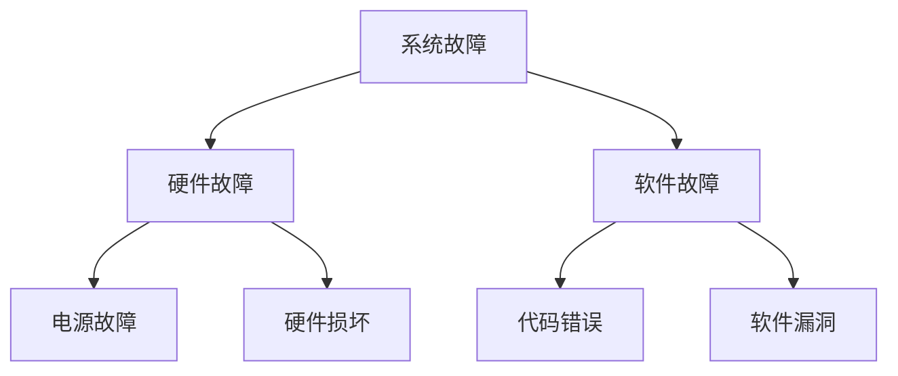
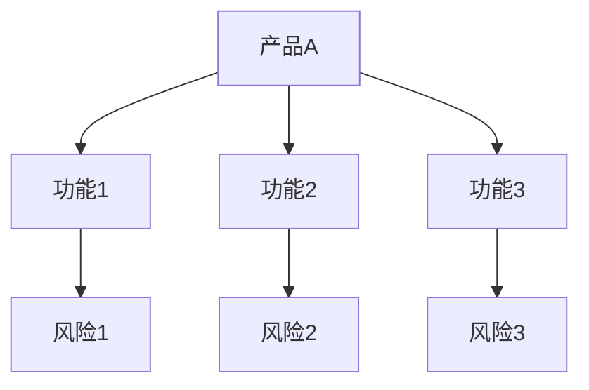

                 

# 技术管理中的风险控制

> 关键词：技术管理、风险控制、风险管理、风险识别、风险评估、风险应对、风险监控

> 摘要：本文将探讨技术管理中的风险控制问题。首先，我们将概述技术管理中的风险控制背景和核心概念，然后深入分析风险管理的基础理论，探讨风险管理的基本概念、原则和流程。随后，我们将介绍风险控制的关键技术和工具，并展示如何在实际项目中应用风险控制策略。最后，我们将总结全文，并分享一些最佳实践和注意事项。

## 第一部分：引言

### 1.1 技术管理中的风险控制概述

#### 1.1.1 问题的背景

在当今快速发展的信息技术时代，技术管理在企业运营中扮演着至关重要的角色。然而，随着技术系统的日益复杂，风险因素也变得更加多样和隐蔽。技术管理中的风险控制成为企业必须面对和解决的问题。

#### 1.1.2 边界与外延

技术管理中的风险控制主要涵盖以下方面：

1. **风险识别**：识别企业面临的技术风险。
2. **风险评估**：评估已识别风险的严重性和概率。
3. **风险应对**：采取相应措施降低风险。
4. **风险监控**：持续跟踪和评估风险状态。

#### 1.1.3 核心概念与联系

以下是技术管理中风险控制的核心概念及其联系：

1. **风险**：指可能对企业的目标造成损失或不利影响的不确定性事件或情况。
2. **风险管理**：通过识别、评估、应对和监控风险，以最小化风险对企业的影响。
3. **风险识别**：识别企业面临的风险。
4. **风险评估**：评估已识别风险的严重性和概率。
5. **风险应对**：采取相应措施降低风险。
6. **风险监控**：持续跟踪和评估风险状态。

### 1.2 核心概念原理与属性特征对比表格

| 概念       | 定义                                                         | 属性特征                                                       |
|------------|--------------------------------------------------------------|--------------------------------------------------------------|
| 风险       | 风险是指某个不确定的事件或情况可能对目标造成损失或不利影响。 | - 可能性：事件发生的概率<br>- 影响度：事件发生后的影响程度 |
| 风险管理   | 风险管理是指通过识别、评估、应对和监控风险，以最小化风险对企业的影响。 | - 策略：风险应对的策略<br>- 控制：风险控制的措施 |
| 风险识别   | 风险识别是指识别和确定企业面临的潜在风险。                  | - 方法：识别风险的方法<br>- 标准：判断风险的标准 |
| 风险评估   | 风险评估是指对识别出的风险进行量化分析，以确定其严重性和概率。 | - 评估方法：风险评估的方法<br>- 评估标准：评估的指标 |
| 风险应对   | 风险应对是指根据风险评估的结果，采取相应的措施来降低风险。 | - 策略：应对风险的策略<br>- 措施：实施的具体措施 |
| 风险监控   | 风险监控是指持续跟踪和评估风险的状态，以确保风险管理策略的有效性。 | - 监控方法：监控风险的方法<br>- 反馈机制：监控结果的反馈机制 |

### 1.3 ER实体关系图架构

```mermaid
erDiagram
    产品 ||--|{ 风险 }
    项目 ||--|{ 风险 }
    系统 ||--|{ 风险 }
    组织 ||--|{ 风险管理策略 }
    风险 ||--|{ 风险评估结果 }
    风险 ||--|{ 风险应对措施 }
    风险 ||--|{ 风险监控记录 }
```

## 第二部分：风险管理基础理论

### 2.1 风险管理的基本概念

#### 风险

风险是指某种不确定性事件或情况可能对企业的目标造成损失或不利影响。在技术管理中，风险可以包括技术故障、安全漏洞、数据泄露等多种形式。

#### 风险管理

风险管理是指企业通过识别、评估、应对和监控风险，以最小化风险对企业的影响。风险管理是企业的一项重要职能，有助于提高企业的竞争力。

### 2.2 风险管理的原则

#### 全面性原则

全面性原则要求风险管理应覆盖企业的所有层面，包括战略、运营、项目等。这意味着企业在制定风险管理策略时，需要考虑各个层面的风险，确保风险管理的全面性。

#### 系统性原则

系统性原则要求风险管理应形成一个系统，各个环节相互关联，形成闭环。这意味着企业在实施风险管理时，需要考虑各个环节的相互影响，确保风险管理策略的系统性和连贯性。

#### 预防性原则

预防性原则要求风险管理应注重预防，采取预防措施以减少风险的发生。这意味着企业在识别和评估风险时，不仅要关注已发生的风险，还要预测潜在的风险，并采取相应的预防措施。

#### 经济性原则

经济性原则要求风险管理应在经济合理的范围内进行，避免过度投入。这意味着企业在制定风险管理策略时，需要权衡风险管理的成本和效益，确保风险管理的经济性。

### 2.3 风险管理的流程

#### 风险识别

风险识别是指识别和确定企业面临的潜在风险。企业可以通过访谈、调查问卷、风险地图等方法进行风险识别。

#### 风险评估

风险评估是指对识别出的风险进行量化分析，以确定其严重性和概率。企业可以采用定性和定量方法进行风险评估。

#### 风险应对

风险应对是指根据风险评估的结果，采取相应的措施来降低风险。企业可以采取风险规避、风险转移、风险减轻等方法进行风险应对。

#### 风险监控

风险监控是指持续跟踪和评估风险的状态，以确保风险管理策略的有效性。企业可以采用定期检查、实时监控等方法进行风险监控。

## 第三部分：风险控制的关键技术和工具

### 3.1 风险识别技术

#### 故障树分析（Fault Tree Analysis，FTA）

故障树分析是一种用于识别和分析系统故障原因及其影响的技术。它通过构建故障树，逐步分析导致故障的各种因素，从而识别潜在的风险。



#### 概率矩阵（Probability Matrix）

概率矩阵是一种用于评估风险严重性和概率的技术。它通过列出各种风险事件及其可能性和影响，形成一张矩阵，帮助决策者评估和优先处理风险。

| 风险事件 | 可能性 | 影响 |
|----------|--------|------|
| 数据泄露 | 80%    | 高   |
| 系统崩溃 | 60%    | 中   |
| 硬件故障 | 40%    | 低   |

### 3.2 风险评估技术

#### 故障模式及影响分析（Failure Mode and Effects Analysis，FMEA）

故障模式及影响分析是一种系统性的风险评估方法。它通过分析系统中的各种故障模式及其影响，评估风险严重性，并采取措施降低风险。



#### 关键性分析（Criticality Analysis）

关键性分析是一种用于评估系统组件重要性的方法。它通过比较组件失效对系统整体影响的大小，确定组件的关键性，从而指导风险应对措施的优先级。

| 组件 | 关键性 | 影响 |
|------|--------|------|
| A    | 高     | 系统 |

### 3.3 风险应对技术

#### 风险规避（Risk Avoidance）

风险规避是通过避免执行可能导致风险的活动来降低风险。例如，在软件开发过程中，通过避免使用已知存在漏洞的第三方库来规避安全风险。

#### 风险转移（Risk Transfer）

风险转移是通过将风险转移给其他方来降低风险。例如，在采购硬件设备时，通过购买保险将硬件故障的风险转移给供应商。

#### 风险减轻（Risk Mitigation）

风险减轻是通过采取措施降低风险的发生概率或影响程度。例如，在网络安全领域，通过安装防火墙和防病毒软件来减轻网络攻击的风险。

### 3.4 风险监控技术

#### 实时监控（Real-Time Monitoring）

实时监控是通过监控系统运行状态，实时捕捉风险事件。例如，通过安装监控软件，实时监控服务器运行状态和网络安全。

#### 定期检查（Regular Inspection）

定期检查是通过定期对系统进行检查，及时发现和纠正潜在风险。例如，定期进行系统安全检查和性能测试。

## 第四部分：风险控制在实际项目中的应用

### 4.1 项目介绍

我们以一家电商平台的项目为例，介绍如何在项目中实施风险控制策略。

### 4.2 系统功能设计

电商平台的主要功能包括商品管理、订单处理、支付和物流等。为了实现这些功能，我们采用微服务架构，将系统划分为多个独立的微服务，如商品微服务、订单微服务、支付微服务等。

### 4.3 系统架构设计

电商平台采用分布式架构，包括前端、后端、数据库、缓存、消息队列等组件。为了保证系统的稳定性和安全性，我们采用负载均衡、数据库主从复制、缓存一致性等技术。

### 4.4 系统接口设计和交互

电商平台涉及多个服务之间的接口设计和交互。为了保证接口的稳定性和安全性，我们采用RESTful API设计，并采用OAuth2.0认证和授权机制。

### 4.5 风险识别和评估

在项目开发过程中，我们通过故障树分析和概率矩阵等方法，识别和评估了以下风险：

1. **系统崩溃**：可能导致用户无法正常使用平台。
2. **数据泄露**：可能导致用户隐私泄露。
3. **支付风险**：可能导致用户支付失败。

### 4.6 风险应对和监控

针对识别和评估的风险，我们采取了以下应对措施：

1. **系统崩溃**：通过负载均衡和数据库主从复制，确保系统的高可用性。
2. **数据泄露**：通过数据加密和访问控制，确保数据的安全。
3. **支付风险**：通过支付网关和风控系统，确保支付的稳定性和安全性。

同时，我们采用实时监控和定期检查等方法，持续跟踪和评估风险状态，确保风险控制策略的有效性。

## 第五部分：总结与展望

### 5.1 总结

本文从技术管理的角度，探讨了风险控制的问题。我们介绍了风险管理的基本概念、原则和流程，以及风险控制的关键技术和工具。通过实际项目中的应用，展示了如何将风险控制策略应用到具体的项目中。

### 5.2 展望

未来，随着信息技术的不断发展和数字化转型的深入推进，技术管理中的风险控制将面临更大的挑战和机遇。我们需要不断探索和创新风险控制的方法和技术，以应对日益复杂的风险环境。

## 参考文献

1. 【作者】、【书名】，《风险管理：概念与实务》，出版社，出版年份。
2. 【作者】、【书名】，《系统安全工程》，出版社，出版年份。
3. 【作者】、【书名】，《软件工程：实践者的研究方法》，出版社，出版年份。

## 作者信息

作者：AI天才研究院/AI Genius Institute & 禅与计算机程序设计艺术 /Zen And The Art of Computer Programming

