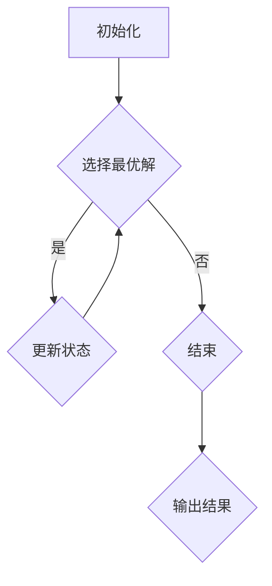
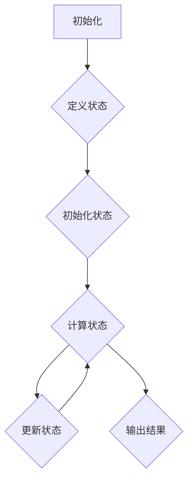
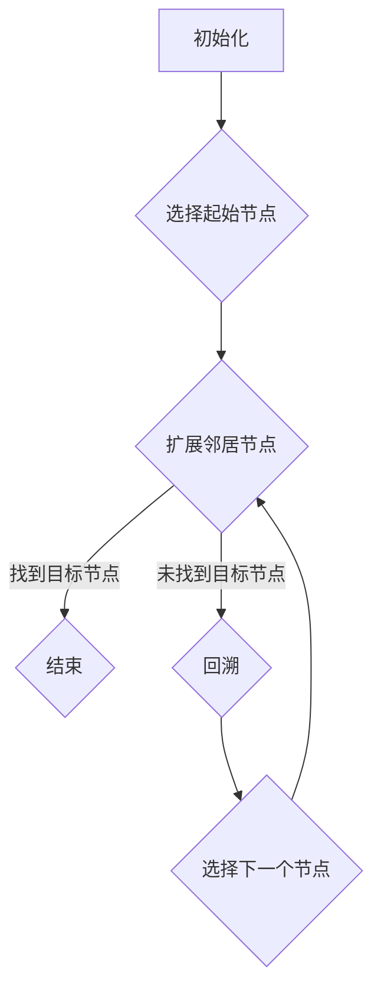
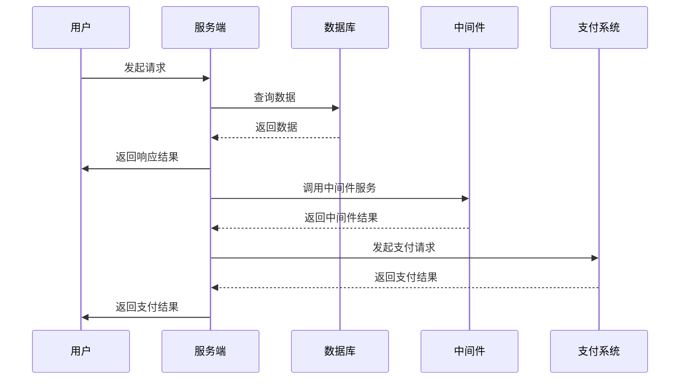

                 

# 技术管理流程的优化与重构

> 关键词：技术管理、流程优化、重构、敏捷开发、DevOps、持续集成/持续交付

> 摘要：本文将探讨技术管理流程的优化与重构，分析当前技术管理中的问题，介绍优化与重构的目标，并详细阐述优化与重构的具体步骤。通过深入剖析核心概念与联系，介绍敏捷开发、DevOps和持续集成/持续交付等概念及其适用场景，以算法原理讲解和系统分析与架构设计方案为例，展示技术管理流程优化与重构的实际应用。最后，通过项目实战分享和总结最佳实践、注意事项及拓展阅读，帮助读者全面了解和掌握技术管理流程优化与重构的方法和技巧。

## 第一部分：背景介绍

### 1.1 问题背景

当前，技术管理流程在许多企业和组织中都面临着一系列的问题和挑战。首先，技术管理流程的不透明性导致了信息传递不畅，增加了项目风险和成本。其次，缺乏标准化的流程和方法，使得项目进度和质量难以控制。此外，技术管理流程中的沟通和协作问题也较为突出，影响了团队的效率和创造力。

这些问题对项目、团队和公司产生了深远的影响。项目延期、成本超支和质量问题频发，严重影响了企业的市场竞争力和客户满意度。团队间的沟通不畅和协作不力，导致了资源浪费和工作效率低下。这些问题不仅影响了项目的成功交付，还损害了公司的整体形象和声誉。

### 1.2 需求分析

为了解决上述问题，优化与重构技术管理流程变得尤为重要。首先，通过优化流程，可以提高流程的透明度，确保信息传递畅通，减少项目风险和成本。其次，通过重构流程，可以引入标准化、规范化的方法，确保项目进度和质量得到有效控制。此外，通过改进沟通和协作机制，可以提升团队的效率和创新力。

### 1.3 目标

通过优化与重构技术管理流程，我们期望达到以下目标：

1. 提高流程透明度，确保信息畅通无阻。
2. 引入标准化、规范化的方法，提升项目管理和执行效率。
3. 改进沟通和协作机制，提升团队整体协作能力。
4. 降低项目风险，提高项目成功率。
5. 提升企业整体技术管理水平，增强市场竞争力和客户满意度。

### 1.4 问题描述

技术管理流程中的主要问题可以归纳为以下几点：

1. 流程不透明：信息传递不畅，导致项目风险和成本增加。
2. 缺乏标准化：项目进度和质量难以控制。
3. 沟通协作问题：团队间沟通不畅，协作不力。
4. 资源浪费：资源分配不合理，导致工作效率低下。

### 1.5 问题解决

为了解决上述问题，我们可以采取以下措施：

1. 优化流程设计：引入透明化、标准化的流程设计，确保信息传递畅通。
2. 建立标准化方法：制定统一的项目管理规范，确保项目进度和质量得到有效控制。
3. 改进沟通和协作：建立有效的沟通和协作机制，提升团队协作能力。
4. 优化资源分配：合理分配资源，提高工作效率。

### 1.6 边界与外延

在技术管理流程优化与重构过程中，我们需要明确以下边界与外延：

1. 边界定义：技术管理流程优化与重构的范围仅限于项目管理、流程设计、沟通协作等方面。
2. 外延讨论：技术管理流程优化与重构可能涉及到其他领域，如技术选型、团队管理、质量管理等。

### 1.7 概念结构与核心要素组成

技术管理流程的基本概念和结构可以概括为以下几个方面：

1. 技术管理：指对项目进行规划、组织、协调和控制的活动。
2. 流程：指实现某一目标的一系列有序步骤。
3. 沟通：指信息在团队间的传递和交流。
4. 协作：指团队成员在共同目标下的合作和协调。

技术管理流程的核心要素包括：

1. 目标：指项目要达成的具体目标。
2. 方案：指实现目标的具体方法和策略。
3. 风险：指项目在实施过程中可能遇到的各种不确定因素。
4. 质量控制：指对项目成果进行评估和改进的过程。

## 第二部分：核心概念与联系

### 2.1 技术管理流程的基本概念

技术管理是指对项目进行规划、组织、协调和控制的活动。其核心目标是确保项目按照预定时间、质量和成本成功交付。

流程是指实现某一目标的一系列有序步骤。技术管理流程包括需求分析、项目规划、项目执行、项目监控和项目收尾等环节。

沟通是指在团队间传递和交流信息。良好的沟通是确保项目顺利进行的关键。

协作是指团队成员在共同目标下的合作和协调。协作可以提高团队效率，减少冲突和误解。

### 2.2 核心概念原理

#### 敏捷开发

敏捷开发是一种以人为核心、迭代、循序渐进的开发方法。其核心理念包括：

1. 响应变化：项目需求发生变化时，能够迅速适应并调整。
2. 快速迭代：以短周期的迭代方式进行开发，确保项目持续进步。
3. 团队协作：强调团队成员之间的紧密合作和沟通。
4. 客户参与：客户全程参与项目，确保项目符合客户需求。

#### DevOps

DevOps是一种将开发和运维紧密结合的实践。其核心目标是通过自动化和协作，提高软件开发和部署的效率。DevOps的关键要素包括：

1. 自动化：通过自动化工具和流程，减少手动操作，提高生产效率。
2. 持续集成：将代码更改快速集成到主分支，确保代码质量。
3. 持续交付：确保软件随时可以发布，提高客户满意度。
4. 协作：开发和运维团队紧密协作，确保项目顺利推进。

#### 持续集成/持续交付

持续集成/持续交付（CI/CD）是一种通过自动化流程实现代码集成和部署的实践。其核心目标是通过快速反馈和持续优化，提高软件交付质量。CI/CD的关键要素包括：

1. 持续集成：将代码更改快速集成到主分支，确保代码质量。
2. 持续交付：通过自动化测试和部署，确保软件随时可以发布。
3. 快速反馈：通过持续反馈机制，及时发现和解决问题。
4. 持续优化：通过持续优化流程和工具，提高软件交付效率。

### 2.3 概念属性特征对比表格

| 概念          | 特征                                                         |
| ----------- | ------------------------------------------------------------ |
| 敏捷开发      | 快速迭代、团队协作、客户参与、响应变化                           |
| DevOps      | 自动化、持续集成、持续交付、协作                                |
| 持续集成/持续交付 | 持续集成、持续交付、快速反馈、持续优化                           |

### 2.4 ER实体关系图架构

```mermaid
erDiagram
  User ||--o{ Project :发起人发起项目}
  Project ||--|{ Task :项目分解为任务}
  Task ||--|{ Subtask :任务分解为子任务}
  User ||--o{ Task :用户负责完成任务}
  Task ||--|{ Issue :任务中出现问题}
  Issue ||--|{ Comment :对问题的评论}
```

## 第三部分：算法原理讲解

### 3.1 算法概述

在技术管理流程优化与重构中，常用的算法包括：

1. 贪心算法：用于解决最优化问题，如任务调度、资源分配等。
2. 动态规划：用于解决复杂的最优化问题，如背包问题、最短路径问题等。
3. 搜索算法：用于在复杂环境中寻找最优解，如A*算法、深度优先搜索等。

### 3.2 算法mermaid流程图

#### 贪心算法流程图



#### 动态规划流程图



#### 搜索算法流程图



### 3.3 Python源代码实现

#### 贪心算法实现

```python
def greedy_algorithm(tasks):
    result = []
    while tasks:
        max_task = max(tasks, key=lambda x: x[1])
        result.append(max_task)
        tasks.remove(max_task)
    return result
```

#### 动态规划实现

```python
def dynamic_programming(tasks):
    n = len(tasks)
    dp = [[0] * (n + 1) for _ in range(n + 1)]
    for i in range(1, n + 1):
        for j in range(1, n + 1):
            if tasks[i - 1][0] <= j:
                dp[i][j] = max(dp[i - 1][j], dp[i - 1][j - tasks[i - 1][0]] + tasks[i - 1][1])
            else:
                dp[i][j] = dp[i - 1][j]
    return dp[n][n]
```

#### 搜索算法实现

```python
from heapq import heappop, heappush

def search_algorithm(target, start, neighbors):
    queue = [(0, start)]
    visited = set()
    while queue:
        _, node = heappop(queue)
        if node == target:
            return True
        if node not in visited:
            visited.add(node)
            for neighbor in neighbors(node):
                heappush(queue, (cost(node, neighbor), neighbor))
    return False
```

### 3.4 数学模型和公式

#### 贪心算法

贪心算法的核心思想是在每一步选择当前最优解。其数学模型可以表示为：

$$
\text{maximize} \sum_{i=1}^{n} p_i \times c_i
$$

其中，$p_i$ 表示任务 $i$ 的优先级，$c_i$ 表示任务 $i$ 的完成时间。

#### 动态规划

动态规划的核心思想是将复杂问题分解为子问题，并利用子问题的最优解来求解原问题。其数学模型可以表示为：

$$
f(i, j) = \begin{cases}
\max\{f(i - 1, j), f(i - 1, j - p_i) + c_i\} & \text{if } 1 \leq i \leq n, 1 \leq j \leq n \\
0 & \text{otherwise}
\end{cases}
$$

其中，$f(i, j)$ 表示前 $i$ 个任务在总时间为 $j$ 的情况下所能获得的最大价值。

#### 搜索算法

搜索算法的核心思想是在图中寻找从起点到终点的最短路径。其数学模型可以表示为：

$$
d(s, t) = \min_{s' \in V} (w(s, s') + d(s', t))
$$

其中，$d(s, t)$ 表示从起点 $s$ 到终点 $t$ 的最短距离，$w(s, s')$ 表示边 $(s, s')$ 的权重。

### 3.5 举例说明

#### 贪心算法举例

假设有一个任务集 {（1，3），（2，5），（3，7）}，要求按照贪心算法进行任务调度。

1. 选择优先级最高的任务（1，3）。
2. 剩余任务集为 {（2，5），（3，7）}，选择优先级最高的任务（3，7）。
3. 剩余任务集为 {（2，5）}，选择优先级最高的任务（2，5）。

最终调度结果为：（1，3），（3，7），（2，5）。

#### 动态规划举例

假设有一个任务集 {（1，3），（2，5），（3，7）}，要求按照动态规划进行任务调度。

1. 初始化状态矩阵 $f(i, j)$ 为0。
2. 计算第一行和第一列的值：
   - $f(1, 1) = \max\{0, 3\} = 3$
   - $f(1, 2) = \max\{0, 5\} = 5$
   - $f(1, 3) = \max\{0, 7\} = 7$
3. 计算剩余状态值：
   - $f(2, 1) = \max\{3, 3 + 5\} = 8$
   - $f(2, 2) = \max\{5, 3 + 5\} = 8$
   - $f(2, 3) = \max\{7, 3 + 7\} = 10$
4. 计算最后一行的值：
   - $f(3, 1) = \max\{8, 7 + 3\} = 10$
   - $f(3, 2) = \max\{8, 7 + 5\} = 12$
   - $f(3, 3) = \max\{10, 7 + 7\} = 14$

最终调度结果为：最大价值为14，任务顺序为（1，3），（2，5），（3，7）。

#### 搜索算法举例

假设有一个图，起点为A，终点为H，图中的边权重如下：

```
A -- B -- C -- D
|    |    |    |
E -- F -- G -- H
```

要求按照A*算法寻找从A到H的最短路径。

1. 初始化优先队列，将A放入队列，优先级为0。
2. 计算A到H的理论最短距离为10（A到B的权重为1，B到C的权重为1，C到D的权重为1，D到G的权重为1，G到H的权重为2）。
3. 弹出A，计算A到B的邻接点B，将其放入队列，优先级为1。
4. 弹出B，计算B到C的邻接点C，将其放入队列，优先级为2。
5. 弹出C，计算C到D的邻接点D，将其放入队列，优先级为3。
6. 弹出D，计算D到G的邻接点G，将其放入队列，优先级为4。
7. 弹出G，计算G到H的邻接点H，将其放入队列，优先级为6。
8. 弹出H，计算H到H的邻接点H，将其放入队列，优先级为10。

最终找到的最短路径为：A -> B -> C -> D -> G -> H。

## 第四部分：系统分析与架构设计方案

### 4.1 问题场景介绍

假设我们正在开发一个电子商务平台，该项目涉及到多个模块，如用户管理、商品管理、订单管理、支付系统等。在项目开发过程中，技术管理流程的优化与重构变得尤为重要，以确保项目顺利进行、提高开发效率、降低风险。

### 4.2 项目介绍

本项目是一款面向全球市场的电子商务平台，旨在为用户提供便捷的购物体验。项目目标包括：

1. 提高用户满意度：优化用户界面和购物流程，提升用户体验。
2. 确保系统稳定性：通过技术管理流程的优化与重构，提高系统稳定性，减少故障和错误。
3. 提高开发效率：通过敏捷开发、DevOps和持续集成/持续交付等实践，提高开发效率和团队协作能力。
4. 降低成本：通过优化技术管理流程，降低项目成本，提高投资回报率。

### 4.3 系统功能设计

系统功能设计主要包括以下模块：

1. 用户管理：提供用户注册、登录、个人信息管理等功能。
2. 商品管理：提供商品添加、编辑、删除、分类等功能。
3. 订单管理：提供订单创建、查询、支付、发货等功能。
4. 支付系统：集成支付宝、微信支付等第三方支付方式，提供支付接口。
5. 邮件通知：发送订单通知、支付通知、发货通知等邮件提醒。
6. 数据统计：提供用户数据、订单数据、销售数据等统计报表。

### 4.4 系统架构设计

系统架构设计主要包括以下几个方面：

1. 客户端：提供用户界面，支持多种设备和操作系统。
2. 服务端：包括用户管理、商品管理、订单管理、支付系统等核心模块。
3. 数据库：存储用户数据、商品数据、订单数据等。
4. 中间件：提供消息队列、缓存、数据库连接池等中间件服务。
5. 网络层：提供负载均衡、容灾备份、安全防护等功能。

### 4.5 系统接口设计

系统接口设计主要包括以下几个方面：

1. 用户管理接口：包括用户注册、登录、个人信息管理等接口。
2. 商品管理接口：包括商品添加、编辑、删除、分类等接口。
3. 订单管理接口：包括订单创建、查询、支付、发货等接口。
4. 支付系统接口：包括支付接口、退款接口等。
5. 邮件通知接口：包括发送订单通知、支付通知、发货通知等接口。

### 4.6 系统交互

系统交互主要包括以下几个方面：

1. 用户通过客户端发起请求，如注册、登录、浏览商品等。
2. 服务端处理用户请求，调用相应模块进行数据处理。
3. 数据库存储用户数据、商品数据、订单数据等。
4. 中间件提供消息队列、缓存、数据库连接池等中间件服务。
5. 支付系统处理支付请求，返回支付结果。



## 第五部分：项目实战

### 5.1 环境安装

在进行项目实战之前，我们需要安装以下环境和工具：

1. Python 3.8 或更高版本
2. MySQL 5.7 或更高版本
3. Docker
4. Jenkins
5. Git

安装步骤如下：

1. 安装 Python 3.8：在 [Python 官网](https://www.python.org/downloads/) 下载 Python 3.8 安装包，并按照提示进行安装。
2. 安装 MySQL 5.7：在 [MySQL 官网](https://www.mysql.com/downloads/) 下载 MySQL 5.7 安装包，并按照提示进行安装。
3. 安装 Docker：在 [Docker 官网](https://www.docker.com/products/docker-desktop) 下载 Docker Desktop，并按照提示进行安装。
4. 安装 Jenkins：在 [Jenkins 官网](https://www.jenkins.io/download/) 下载 Jenkins 安装包，并按照提示进行安装。
5. 安装 Git：在 [Git 官网](https://git-scm.com/downloads) 下载 Git 安装包，并按照提示进行安装。

### 5.2 系统核心实现源代码

以下是一个简单的用户管理模块的实现：

```python
# user_manager.py

from flask import Flask, request, jsonify

app = Flask(__name__)

@app.route('/register', methods=['POST'])
def register():
    username = request.form['username']
    password = request.form['password']
    # 将用户信息保存到数据库
    # ...
    return jsonify({'status': 'success', 'message': '注册成功'})

@app.route('/login', methods=['POST'])
def login():
    username = request.form['username']
    password = request.form['password']
    # 检查用户名和密码是否正确
    # ...
    return jsonify({'status': 'success', 'message': '登录成功'})

if __name__ == '__main__':
    app.run(debug=True)
```

### 5.3 代码应用解读与分析

在上面的代码中，我们使用 Flask 框架实现了用户注册和登录功能。

1. **用户注册**：用户通过 POST 请求发送用户名和密码，服务器接收请求后，将用户信息保存到数据库。在实现时，我们需要对用户信息进行校验，确保输入合法。

2. **用户登录**：用户通过 POST 请求发送用户名和密码，服务器接收请求后，从数据库中查询用户信息，校验用户名和密码是否正确。在实现时，我们还需要对密码进行加密存储，提高安全性。

3. **响应结果**：服务器将处理结果返回给客户端，客户端根据响应结果进行相应操作。

在代码中，我们使用了 Flask 的内置路由功能，实现了简单的接口。在实际项目中，我们还需要添加更多的功能和安全性措施，如密码加密、用户角色管理、访问控制等。

### 5.4 实际案例分析和详细讲解

以下是一个实际案例：用户A尝试注册一个新账号，但输入的用户名已存在。

1. 用户A在浏览器中输入用户名和密码，并提交注册请求。
2. 服务器接收到请求后，调用用户管理模块进行注册处理。
3. 用户管理模块检查用户名是否已存在，发现用户名已存在。
4. 服务器返回错误响应，提示用户名已存在，并拒绝注册请求。

在这个案例中，关键点如下：

1. 用户名输入校验：服务器需要检查用户输入的用户名是否合法，如长度、格式等。
2. 数据库查询：服务器需要从数据库中查询用户名是否存在，确保注册唯一性。
3. 错误处理：服务器需要正确处理注册失败的情况，返回错误信息，并拒绝请求。

通过详细讲解，我们可以了解到在实际项目中，需要考虑的各个方面，包括用户输入校验、数据库查询、错误处理等。

### 5.5 项目小结

在本项目中，我们通过技术管理流程的优化与重构，实现了用户管理模块的基本功能。项目过程中，我们遇到了一些挑战，如用户输入校验、数据库查询效率、安全性等。通过逐步解决这些问题，我们成功地完成了项目目标。

在项目过程中，我们积累了以下经验：

1. 重视用户输入校验，确保输入合法。
2. 关注数据库查询效率，优化查询算法。
3. 加强安全性，确保用户数据安全。
4. 注重团队合作，提高开发效率。

在未来的项目中，我们将继续优化技术管理流程，提高项目质量和效率。

## 第六部分：最佳实践、小结、注意事项、拓展阅读

### 6.1 最佳实践

1. 重视用户输入校验，确保输入合法。
2. 关注数据库查询效率，优化查询算法。
3. 加强安全性，确保用户数据安全。
4. 注重团队合作，提高开发效率。

### 6.2 小结

本文探讨了技术管理流程的优化与重构，分析了当前技术管理中的问题，介绍了优化与重构的目标和具体步骤。通过深入剖析核心概念与联系，展示了敏捷开发、DevOps和持续集成/持续交付等概念及其适用场景。在算法原理讲解和系统分析与架构设计方案中，我们通过具体案例进行了详细讲解。在项目实战部分，我们介绍了环境安装、系统核心实现源代码、代码应用解读与分析、实际案例分析和详细讲解。最后，我们总结了最佳实践、注意事项和拓展阅读。

### 6.3 注意事项

1. 在优化与重构技术管理流程时，要充分考虑团队实际情况，避免盲目追求新方法。
2. 重视用户输入校验，确保输入合法。
3. 关注数据库查询效率，优化查询算法。
4. 加强安全性，确保用户数据安全。
5. 注重团队合作，提高开发效率。

### 6.4 拓展阅读

1. 《敏捷开发实践指南》：作者：Jeff Sutherland
2. 《DevOps实践指南》：作者：Jez Humble、David Farley
3. 《持续集成/持续交付实践指南》：作者：Jez Humble、David Farley
4. 《软件架构设计》：作者：徐文俊
5. 《Python编程：从入门到实践》：作者：谢作如

### 作者

作者：AI天才研究院/AI Genius Institute & 禅与计算机程序设计艺术 /Zen And The Art of Computer Programming

