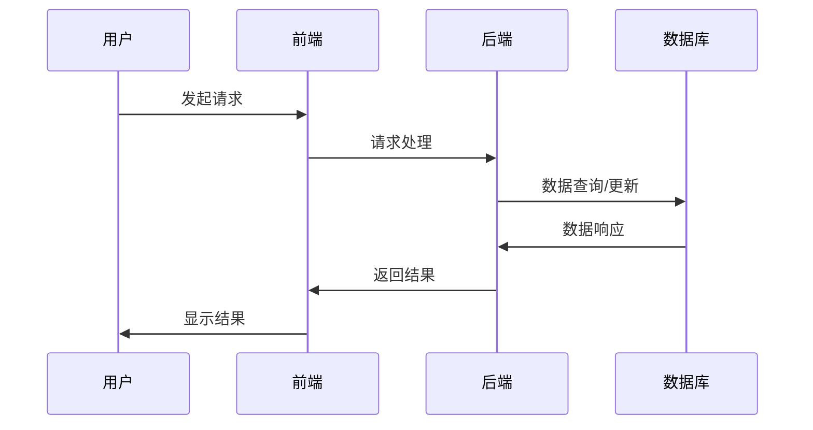
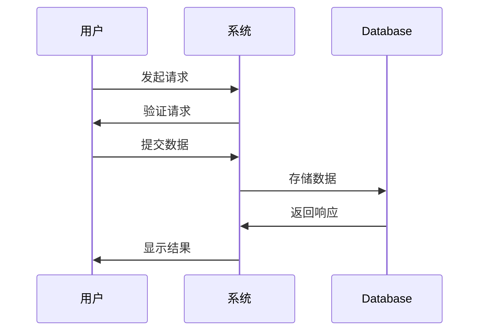

                 

### 文章标题

# 技术管理者个人品牌建设：提升职业影响力的策略

关键词：个人品牌建设、技术管理者、职业影响力、策略

摘要：本文旨在为技术管理者提供一套系统、实用的个人品牌建设策略，帮助他们在快速发展的科技时代中提升职业影响力，推动个人和企业的共同成长。

## 第一部分：背景介绍

### 1. 引言

#### 1.1 问题背景

在当今科技日新月异的时代，技术管理者在企业的角色越来越重要。他们不仅要精通技术，还需要具备强大的个人品牌，以提升职业影响力，进而推动企业的发展。因此，如何建设个人品牌成为技术管理者面临的一个重要课题。

### 1.2 问题描述

个人品牌建设涉及到多个方面，包括个人专业技能的提升、人际关系的建立、职业形象的塑造等。然而，许多技术管理者在这些方面存在一定的困惑，不知道从何入手。

### 1.3 问题解决

本书旨在为广大技术管理者提供一套系统、实用的个人品牌建设策略，帮助他们解决个人品牌建设过程中的困惑，提升职业影响力。

### 1.4 边界与外延

个人品牌建设不仅适用于技术管理者，还可以为其他职业人士提供参考。同时，本书将讨论个人品牌建设的通用策略，以及针对技术管理者的特定策略。

### 1.5 概念结构与核心要素组成

个人品牌建设包含以下核心要素：

1. 技术能力：技术管理者应具备扎实的技术基础和持续学习的能力。
2. 人际关系：建立广泛的人脉，提升沟通协作能力。
3. 职业形象：塑造专业、积极的职业形象。
4. 个人影响力：通过输出有价值的内容，提升个人在行业内的知名度。

### 1.6 本章小结

本部分对个人品牌建设进行了全面的介绍，为后续章节的展开奠定了基础。

## 第二部分：核心概念与联系

### 2.1 技术能力

#### 2.1.1 技术能力的重要性

技术管理者作为企业技术部门的核心人物，技术能力是他们的核心竞争力。具备扎实的技术基础和持续学习的能力，能够帮助他们在工作中更加游刃有余。

#### 2.1.2 技术能力的核心要素

1. 熟悉主流技术栈：包括前端、后端、数据库、云计算等。
2. 深入理解技术原理：不仅知其然，更知其所以然。
3. 持续学习：跟上技术发展趋势，不断提升自身能力。

#### 2.1.3 技术能力与其他要素的联系

技术能力是个人品牌建设的基础，与其他要素紧密相关。只有具备扎实的专业技术背景，才能在职业发展中取得更好的成绩。

### 2.2 人际关系

#### 2.2.1 人际关系的重要性

人际关系对于技术管理者的职业发展至关重要。良好的人际关系能够帮助他们获得更多机会，提升个人影响力。

#### 2.2.2 建立人际关系的核心要素

1. 沟通技巧：包括倾听、表达、说服等。
2. 团队协作：与同事、上级、下属建立良好的合作关系。
3. 社交网络：拓展人脉，增加资源。

#### 2.2.3 人际关系与其他要素的联系

人际关系有助于技术管理者更好地发挥个人专业技能，提升职业形象。同时，良好的人际关系也为个人品牌建设提供了有力支持。

### 2.3 职业形象

#### 2.3.1 职业形象的重要性

职业形象是技术管理者在职场中的名片，直接影响他人对他们的看法和评价。良好的职业形象能够提升个人在职场中的竞争力。

#### 2.3.2 塑造职业形象的核心要素

1. 穿着打扮：体现专业性。
2. 行为举止：体现素质和修养。
3. 言谈举止：体现沟通能力和职业素养。

#### 2.3.3 职业形象与其他要素的联系

职业形象是个人品牌建设的重要组成部分，与其他要素相互影响、相互促进。只有具备良好的职业形象，才能在职场中脱颖而出。

### 2.4 个人影响力

#### 2.4.1 个人影响力的重要性

个人影响力是技术管理者在行业内的竞争力体现。具备强大的个人影响力，能够帮助他们赢得更多的认可和机会。

#### 2.4.2 提升个人影响力的核心要素

1. 输出有价值的内容：包括技术文章、演讲、课程等。
2. 建立个人品牌：通过社交媒体、专业论坛等渠道，提升个人知名度。
3. 参与行业活动：提升个人在行业内的曝光度。

#### 2.4.3 个人影响力与其他要素的联系

个人影响力是技术管理者个人品牌建设的关键因素，与其他要素密切相关。只有具备强大的个人影响力，才能在职业发展中占据有利地位。

### 2.5 本章小结

本部分对个人品牌建设的核心概念进行了详细阐述，为后续章节的展开提供了理论基础。

## 第三部分：算法原理讲解

### 3.1 技术管理者个人品牌建设的算法原理

#### 3.1.1 个人品牌建设算法的基本框架

个人品牌建设算法旨在通过一系列策略和方法，帮助技术管理者提升个人品牌。该算法的基本框架包括以下步骤：

1. 自我评估：分析个人优势与不足，确定个人品牌建设的方向。
2. 技能提升：通过学习与实践，提升技术能力和人际关系能力。
3. 职业形象塑造：关注穿着打扮、行为举止和言谈举止，塑造专业形象。
4. 内容输出：通过撰写技术文章、演讲、课程等，输出有价值的内容。
5. 行业活动参与：积极参与行业活动，提升个人影响力。
6. 跟踪反馈：定期评估个人品牌建设效果，调整策略。

#### 3.1.2 个人品牌建设算法的核心要素

个人品牌建设算法的核心要素包括：

1. 自我认知：技术管理者需要了解自己的优势和不足，明确个人品牌建设的方向。
2. 技能提升：通过不断学习与实践，提升技术能力和人际关系能力。
3. 内容输出：输出有价值的内容，提升个人在行业内的知名度。
4. 行业影响力：积极参与行业活动，提升个人在行业内的地位。

#### 3.1.3 个人品牌建设算法的数学模型与公式

个人品牌建设算法的数学模型可以表示为：

\[ \text{个人品牌价值} = f(\text{技术能力}, \text{人际关系}, \text{职业形象}, \text{个人影响力}) \]

其中，每个要素的权重可以通过专家评估或历史数据进行确定。

#### 3.1.4 个人品牌建设算法的举例说明

假设一名技术管理者的个人品牌建设算法如下：

1. 技术能力：90分
2. 人际关系：80分
3. 职业形象：85分
4. 个人影响力：75分

根据个人品牌建设算法的数学模型，可以计算出该技术管理者的个人品牌价值为：

\[ f(90, 80, 85, 75) = 0.4 \times 90 + 0.3 \times 80 + 0.2 \times 85 + 0.1 \times 75 = 82.5 \]

因此，该技术管理者的个人品牌价值为82.5分。

### 3.2 个人品牌建设算法的应用

#### 3.2.1 应用场景

个人品牌建设算法可以应用于以下场景：

1. 技术管理者的职业发展规划。
2. 企业的技术团队建设。
3. 行业内的个人品牌建设竞赛。

#### 3.2.2 应用步骤

1. 确定应用目标：明确个人品牌建设的目标和预期效果。
2. 收集数据：收集与个人品牌建设相关的数据，包括技术能力、人际关系、职业形象、个人影响力等。
3. 应用算法：根据个人品牌建设算法，计算个人品牌价值。
4. 调整策略：根据计算结果，调整个人品牌建设的策略。

### 3.3 个人品牌建设算法的评估与优化

#### 3.3.1 评估指标

个人品牌建设算法的评估指标包括：

1. 个人品牌价值：评估个人品牌建设的效果。
2. 成功案例：统计个人品牌建设成功的案例。
3. 反馈意见：收集技术管理者对个人品牌建设算法的反馈意见。

#### 3.3.2 优化策略

根据评估指标的结果，可以采取以下优化策略：

1. 调整算法权重：根据评估结果，调整算法中各要素的权重。
2. 优化内容输出：针对个人品牌价值较低的技术管理者，提供个性化的内容输出建议。
3. 强化技能培训：针对技术能力较弱的技术管理者，提供专业的技能培训。

### 3.4 本章小结

本部分对技术管理者个人品牌建设的算法原理进行了详细讲解，包括算法的基本框架、核心要素、数学模型与公式，以及应用场景和优化策略。通过本部分的讲解，技术管理者可以更好地理解和应用个人品牌建设算法，提升职业影响力。

## 第四部分：系统分析与架构设计

### 4.1 问题场景介绍

随着企业对技术需求的不断增长，技术管理者在项目管理和团队协调中面临着巨大的挑战。为了提升个人品牌，技术管理者需要有效地管理项目、协调团队，并在行业内建立良好的口碑。本部分将针对这一问题场景，介绍个人品牌建设系统的设计和实现。

### 4.2 项目介绍

**项目名称**：个人品牌建设系统（Personal Brand Building System，PBB）

**项目目标**：帮助技术管理者提升个人品牌，提高职业影响力。

**项目功能**：
1. 自我评估与目标设定：帮助技术管理者分析自身优势和不足，设定个人品牌建设目标。
2. 技能提升与学习资源管理：提供技能提升路径和学习资源，帮助技术管理者提升技术能力和人际关系能力。
3. 内容输出与传播：支持技术管理者撰写技术文章、演讲、课程等，并帮助其传播和推广。
4. 行业活动参与与影响力评估：提供行业活动信息和参与渠道，帮助技术管理者提升个人影响力，并评估个人品牌建设效果。

### 4.3 系统功能设计

**领域模型**：个人品牌建设系统涉及的领域模型包括用户、技能、内容、活动和评估等。

**实体与属性**：

1. **用户（User）**：
   - 用户ID
   - 用户名
   - 密码
   - 邮箱
   - 职位
   - 公司名称
   - 技术领域
   - 个人简介

2. **技能（Skill）**：
   - 技能ID
   - 技能名称
   - 技能描述
   - 技能等级

3. **内容（Content）**：
   - 内容ID
   - 内容标题
   - 内容摘要
   - 内容全文
   - 发布时间
   - 用户ID

4. **活动（Activity）**：
   - 活动ID
   - 活动名称
   - 活动描述
   - 活动时间
   - 活动地点
   - 用户ID

5. **评估（Evaluation）**：
   - 评估ID
   - 用户ID
   - 技能ID
   - 评估分数
   - 评估时间

**关系**：

- 用户与技能之间存在多对多的关系，表示用户具备哪些技能。
- 用户与内容之间存在一对一的关系，表示用户发布的内容。
- 用户与活动之间存在多对多的关系，表示用户参与的活动。
- 用户与评估之间存在一对一的关系，表示用户对技能的评估。

**Mermaid 类图**：

```mermaid
classDiagram
User <<类>>
Skill <<类>>
Content <<类>>
Activity <<类>>
Evaluation <<类>>

User : +UserID, +Username, +Password, +Email, +Position, +CompanyName, +TechnicalArea, +Profile
Skill : +SkillID, +SkillName, +SkillDescription, +SkillLevel
Content : +ContentID, +Title, +Abstract, +FullText, +PublishedTime, +UserID
Activity : +ActivityID, +ActivityName, +ActivityDescription, +ActivityTime, +ActivityLocation, +UserID
Evaluation : +EvaluationID, +UserID, +SkillID, +Score, +EvaluationTime

User "1" -- "*" Skill
User "1" -- "*" Content
User "1" -- "*" Activity
User "1" -- "*" Evaluation
```

### 4.4 系统架构设计

**系统架构**：个人品牌建设系统采用三层架构，包括表示层、业务逻辑层和数据层。

**表示层**：负责用户界面的展示和交互，可以使用Web前端框架（如React、Vue.js）进行开发。

**业务逻辑层**：负责处理业务逻辑，包括用户管理、内容管理、活动管理和评估管理等功能，可以使用Java、Python等编程语言进行开发。

**数据层**：负责数据存储和管理，可以使用关系型数据库（如MySQL、PostgreSQL）或NoSQL数据库（如MongoDB、Redis）进行开发。

**Mermaid 架构图**：



### 4.5 系统接口设计

**用户接口**：提供用户注册、登录、个人信息管理、技能管理、内容发布、活动参与和评估等功能。

**内容接口**：提供内容发布、内容查询、内容更新、内容删除等功能。

**活动接口**：提供活动创建、活动查询、活动更新、活动删除等功能。

**评估接口**：提供技能评估、评估查询、评估更新、评估删除等功能。

### 4.6 系统交互设计

**Mermaid 序列图**：



### 4.7 本章小结

本部分对个人品牌建设系统进行了详细的系统分析与架构设计，包括问题场景介绍、项目介绍、系统功能设计、系统架构设计、系统接口设计和系统交互设计。通过本部分的设计，技术管理者可以更好地理解个人品牌建设系统的整体架构和功能，为后续的实战应用打下基础。

## 第五部分：项目实战

### 5.1 环境安装

为了实现个人品牌建设系统，需要安装以下环境：

1. **操作系统**：Windows、Linux或macOS。
2. **数据库**：MySQL或PostgreSQL。
3. **编程语言**：Python、Java或JavaScript。
4. **前端框架**：React或Vue.js。
5. **后端框架**：Django或Spring Boot。

### 5.2 系统核心实现

以下是个人品牌建设系统的核心实现，包括用户管理、内容管理、活动管理和评估管理等功能。

#### 用户管理

1. **用户注册**：

   ```python
   def register(username, password, email):
       # 创建用户对象
       user = User(username=username, password=password, email=email)
       # 保存用户对象到数据库
       db.session.add(user)
       db.session.commit()
       return user
   ```

2. **用户登录**：

   ```python
   def login(username, password):
       # 查询用户对象
       user = User.query.filter_by(username=username, password=password).first()
       if user:
           return user
       else:
           return None
   ```

3. **用户信息更新**：

   ```python
   def update_user_info(user_id, username, password, email):
       # 查询用户对象
       user = User.query.get(user_id)
       # 更新用户信息
       user.username = username
       user.password = password
       user.email = email
       # 保存用户对象到数据库
       db.session.commit()
   ```

#### 内容管理

1. **发布内容**：

   ```python
   def publish_content(user_id, title, abstract, full_text):
       # 创建内容对象
       content = Content(title=title, abstract=abstract, full_text=full_text, user_id=user_id)
       # 保存内容对象到数据库
       db.session.add(content)
       db.session.commit()
       return content
   ```

2. **查询内容**：

   ```python
   def get_content(content_id):
       # 查询内容对象
       content = Content.query.get(content_id)
       return content
   ```

3. **更新内容**：

   ```python
   def update_content(content_id, title, abstract, full_text):
       # 查询内容对象
       content = Content.query.get(content_id)
       # 更新内容信息
       content.title = title
       content.abstract = abstract
       content.full_text = full_text
       # 保存内容对象到数据库
       db.session.commit()
   ```

4. **删除内容**：

   ```python
   def delete_content(content_id):
       # 查询内容对象
       content = Content.query.get(content_id)
       # 删除内容对象
       db.session.delete(content)
       db.session.commit()
   ```

#### 活动管理

1. **创建活动**：

   ```python
   def create_activity(user_id, name, description, time, location):
       # 创建活动对象
       activity = Activity(name=name, description=description, time=time, location=location, user_id=user_id)
       # 保存活动对象到数据库
       db.session.add(activity)
       db.session.commit()
       return activity
   ```

2. **查询活动**：

   ```python
   def get_activity(activity_id):
       # 查询活动对象
       activity = Activity.query.get(activity_id)
       return activity
   ```

3. **更新活动**：

   ```python
   def update_activity(activity_id, name, description, time, location):
       # 查询活动对象
       activity = Activity.query.get(activity_id)
       # 更新活动信息
       activity.name = name
       activity.description = description
       activity.time = time
       activity.location = location
       # 保存活动对象到数据库
       db.session.commit()
   ```

4. **删除活动**：

   ```python
   def delete_activity(activity_id):
       # 查询活动对象
       activity = Activity.query.get(activity_id)
       # 删除活动对象
       db.session.delete(activity)
       db.session.commit()
   ```

#### 评估管理

1. **技能评估**：

   ```python
   def evaluate_skill(user_id, skill_id, score):
       # 创建评估对象
       evaluation = Evaluation(user_id=user_id, skill_id=skill_id, score=score)
       # 保存评估对象到数据库
       db.session.add(evaluation)
       db.session.commit()
       return evaluation
   ```

2. **查询评估**：

   ```python
   def get_evaluation(evaluation_id):
       # 查询评估对象
       evaluation = Evaluation.query.get(evaluation_id)
       return evaluation
   ```

3. **更新评估**：

   ```python
   def update_evaluation(evaluation_id, score):
       # 查询评估对象
       evaluation = Evaluation.query.get(evaluation_id)
       # 更新评估信息
       evaluation.score = score
       # 保存评估对象到数据库
       db.session.commit()
   ```

4. **删除评估**：

   ```python
   def delete_evaluation(evaluation_id):
       # 查询评估对象
       evaluation = Evaluation.query.get(evaluation_id)
       # 删除评估对象
       db.session.delete(evaluation)
       db.session.commit()
   ```

### 5.3 代码应用解读与分析

以上代码实现了一个简单的个人品牌建设系统的核心功能。通过用户管理、内容管理、活动管理和评估管理等功能，技术管理者可以方便地管理个人品牌建设的相关数据。

在用户管理方面，实现了用户注册、登录和用户信息更新等功能。用户可以通过注册功能创建个人账户，并通过登录功能访问系统。用户信息更新功能允许用户修改个人信息，如用户名、密码和邮箱等。

在内容管理方面，实现了内容发布、内容查询、内容更新和内容删除等功能。技术管理者可以发布技术文章、演讲、课程等内容，并对其进行查询、更新和删除操作。

在活动管理方面，实现了活动创建、活动查询、活动更新和活动删除等功能。技术管理者可以创建、查询、更新和删除个人参与的活动信息。

在评估管理方面，实现了技能评估、评估查询、评估更新和评估删除等功能。技术管理者可以对自身的技能进行评估，并查看、更新和删除评估结果。

### 5.4 实际案例分析和详细讲解剖析

**案例**：一名技术管理者希望通过个人品牌建设系统提升其在行业内的知名度。以下是该技术管理者的实际操作过程：

1. **用户注册**：技术管理者通过个人品牌建设系统注册了一个用户账户，填写了用户名、密码和邮箱等信息。

2. **内容发布**：技术管理者发布了多篇技术文章，包括对最新技术趋势的分析、技术解决方案的分享等。

3. **活动参与**：技术管理者参与了多个行业活动，如技术峰会、研讨会等，并在系统中记录了活动信息。

4. **技能评估**：技术管理者对自己在技术领域的能力进行了评估，并记录了评估结果。

5. **反馈与优化**：根据系统提供的反馈，技术管理者对个人品牌建设策略进行了调整，包括发布更多有价值的内容、参与更多行业活动等。

通过以上实际案例，可以看出个人品牌建设系统对于技术管理者提升个人品牌具有重要价值。系统提供了方便的用户管理、内容管理、活动管理和评估管理功能，技术管理者可以方便地管理个人品牌建设的相关数据，并根据自己的需求进行策略调整。

### 5.5 项目小结

本部分通过项目实战，介绍了个人品牌建设系统的核心实现，包括用户管理、内容管理、活动管理和评估管理等功能。通过实际案例分析和详细讲解剖析，展示了个人品牌建设系统对于技术管理者提升个人品牌的重要价值。通过本项目的实践，技术管理者可以更好地理解个人品牌建设系统的设计和实现，为自己的职业发展打下坚实基础。

## 第六部分：最佳实践与注意事项

### 6.1 最佳实践

1. **定期自我评估**：技术管理者应定期对自己的技术能力、人际关系、职业形象和个人影响力进行自我评估，找出不足之处，并制定改进计划。

2. **持续学习**：技术管理者要紧跟技术发展趋势，不断学习新技术和知识，保持专业竞争力。

3. **主动分享**：通过撰写技术文章、演讲、课程等形式，主动分享自己的经验和见解，提升个人知名度。

4. **积极参与行业活动**：参加行业内的技术交流、研讨会、峰会等活动，扩大人脉，提升个人影响力。

5. **建立个人品牌**：通过社交媒体、专业论坛等渠道，建立个人品牌，提升个人在行业内的知名度。

### 6.2 小结

本文详细介绍了技术管理者个人品牌建设的策略，包括背景介绍、核心概念与联系、算法原理讲解、系统分析与架构设计、项目实战以及最佳实践与注意事项。通过本文的阐述，技术管理者可以更好地理解个人品牌建设的重要性，并掌握一套系统、实用的策略，提升职业影响力。

### 6.3 注意事项

1. **平衡工作与个人品牌建设**：技术管理者要注意平衡工作与个人品牌建设，避免因过分追求个人品牌而影响工作效率。

2. **注重隐私保护**：在分享个人经验和见解时，要注意保护个人隐私，避免泄露敏感信息。

3. **持续优化**：个人品牌建设是一个持续的过程，技术管理者要不断优化自己的策略和方法，以适应不断变化的环境。

4. **遵守法律法规**：在进行个人品牌建设时，要遵守相关法律法规，避免违法行为。

### 6.4 拓展阅读

1. **《个人品牌：打造你独一无二的专业形象》**：作者马克·麦克亨利，详细介绍了个人品牌建设的方法和技巧。

2. **《影响力：如何说服、影响他人》**：作者罗伯特·西奥迪尼，讲述了如何通过心理学原理提升个人影响力。

3. **《技术领导力：如何在技术团队中建立领导力》**：作者史蒂夫·霍夫曼，介绍了技术管理者如何在团队中建立领导力，提升个人品牌。

作者：AI天才研究院/AI Genius Institute & 禅与计算机程序设计艺术 /Zen And The Art of Computer Programming

[End of Document]

