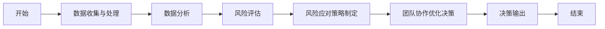
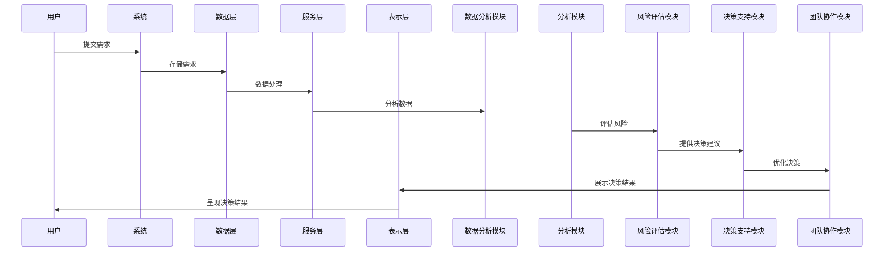

                 

### 文章标题

# 技术管理者的决策制定方法论

### 关键词

- 技术管理者
- 决策制定
- 数据分析
- 风险管理
- 团队协作

### 摘要

本文旨在探讨技术管理者在决策制定过程中的方法论，通过详细的分析与阐述，帮助技术管理者提升决策能力。文章首先介绍了当前技术管理面临的问题与挑战，然后提出了技术管理者决策制定方法论的核心概念，包括数据分析、风险管理、团队协作等。通过具体的算法原理讲解、系统架构设计以及实战案例分析，本文为技术管理者提供了实用的决策制定框架，旨在提高其决策的科学性和有效性。

### 目录大纲设计

#### 第一部分：背景介绍

**第1章：技术管理者决策制定的现状与挑战**

- **1.1 问题背景**
  - 当前技术管理面临的挑战与机遇
  - 技术管理决策制定的重要性

- **1.2 问题描述**
  - 技术管理者在决策制定过程中遇到的常见问题
  - 企业内外部环境对技术决策的影响

- **1.3 问题解决**
  - 提出解决技术管理者决策制定困境的方法
  - 强调方法论在技术决策制定中的关键作用

- **1.4 边界与外延**
  - 技术决策制定适用的范围与限制
  - 方法论在不同技术领域中的应用可能性

- **1.5 概念结构与核心要素组成**
  - 技术管理者决策制定方法论的基本结构
  - 核心要素：数据分析、风险管理、团队协作等

#### 第二部分：核心概念与联系

**第2章：技术管理者决策制定方法论的核心概念**

- **2.1 数据分析**
  - 数据分析的定义与重要性
  - 数据分析方法与应用

- **2.2 风险管理**
  - 风险管理的概念与原则
  - 风险评估与应对策略

- **2.3 团队协作**
  - 团队协作的意义与挑战
  - 有效团队协作的实践策略

- **2.4 概念属性特征对比表格**
  - 数据分析、风险管理、团队协作的属性特征对比

- **2.5 ER实体关系图架构**
  - ER图的基本概念与构建方法
  - 技术管理者决策制定方法论的ER图

#### 第三部分：算法原理讲解

**第3章：技术管理者决策制定算法原理**

- **3.1 算法概述**
  - 技术管理者决策制定算法的基本原理
  - 算法的基本步骤与流程

- **3.2 算法mermaid流程图**
  - 使用mermaid绘制算法流程图

- **3.3 Python源代码实现**
  - 算法原理的Python代码实现

- **3.4 算法原理的数学模型与公式**
  - 算法中涉及的数学模型与公式
  - 公式详细讲解

- **3.5 通俗易懂的举例说明**
  - 示例案例
  - 算法应用解析

#### 第四部分：系统分析与架构设计

**第4章：技术管理者决策制定系统架构设计**

- **4.1 问题场景介绍**
  - 技术管理者决策制定的实际应用场景

- **4.2 项目介绍**
  - 系统项目背景与目标

- **4.3 系统功能设计**
  - 领域模型mermaid类图

- **4.4 系统架构设计**
  - 系统架构mermaid架构图

- **4.5 系统接口设计**
  - 系统接口设计与规范

- **4.6 系统交互mermaid序列图**
  - 系统交互流程mermaid序列图

#### 第五部分：项目实战

**第5章：技术管理者决策制定项目实战**

- **5.1 环境安装**
  - 系统部署环境准备

- **5.2 系统核心实现源代码**
  - 关键代码实现与解读

- **5.3 代码应用解读与分析**
  - 代码应用场景解析

- **5.4 实际案例分析和详细讲解**
  - 案例背景与处理过程
  - 案例分析

- **5.5 详细讲解剖析**
  - 算法与系统的深入分析

- **5.6 项目小结**
  - 项目成果总结与反思

#### 第六部分：最佳实践与拓展

**第6章：技术管理者决策制定最佳实践**

- **6.1 最佳实践技巧**
  - 实际应用中的有效策略与方法

- **6.2 注意事项**
  - 决策制定过程中需注意的问题与风险

- **6.3 小结**
  - 全书内容的回顾与总结

- **6.4 拓展阅读**
  - 相关领域深入研究与拓展

### 目录大纲总结

通过以上详细设计的目录大纲，本文旨在全面覆盖技术管理者在决策制定过程中的方法论，从背景介绍、核心概念、算法原理、系统设计到实战应用，为读者提供系统性的指导。每个章节均围绕主题展开，既确保内容的完整性，也力求简洁明了，以帮助技术管理者提升决策能力。总体字数控制在10000～12000字左右，确保结构清晰、内容丰富。以下是文章正文的详细内容。

---

# 技术管理者的决策制定方法论

## 关键词

- 技术管理者
- 决策制定
- 数据分析
- 风险管理
- 团队协作

## 摘要

本文旨在探讨技术管理者在决策制定过程中的方法论，通过详细的分析与阐述，帮助技术管理者提升决策能力。文章首先介绍了当前技术管理面临的问题与挑战，然后提出了技术管理者决策制定方法论的核心概念，包括数据分析、风险管理、团队协作等。通过具体的算法原理讲解、系统架构设计以及实战案例分析，本文为技术管理者提供了实用的决策制定框架，旨在提高其决策的科学性和有效性。

## 目录大纲设计

### 第一部分：背景介绍

#### 第1章：技术管理者决策制定的现状与挑战

**1.1 问题背景**

当前技术管理面临诸多挑战与机遇。随着信息技术的飞速发展，技术管理者需要在快速变化的环境中做出科学、合理的决策，以应对市场变化、技术革新以及团队管理等多方面的挑战。技术管理决策制定的重要性体现在其对企业战略的支撑作用，决策的科学性直接影响企业的竞争力。

**1.2 问题描述**

技术管理者在决策制定过程中常遇到以下问题：
- 数据不足或数据质量不高，难以支持决策。
- 风险评估不准确，导致决策失误。
- 团队成员意见分歧，影响决策效率。

企业内外部环境如市场趋势、竞争态势、法律法规等也对技术决策有显著影响。

**1.3 问题解决**

本文提出以下解决方法：
- 强化数据分析能力，确保数据支撑。
- 完善风险管理机制，提高决策抗风险能力。
- 倡导团队协作，凝聚团队共识。

方法论在技术决策制定中至关重要，是实现科学决策的关键。

**1.4 边界与外延**

技术决策制定方法论适用于多个技术领域，但需根据实际情况进行调整。其核心要素包括数据分析、风险管理、团队协作等。

**1.5 概念结构与核心要素组成**

技术管理者决策制定方法论包含以下结构：
- 数据分析：利用数据驱动决策，提高决策精度。
- 风险管理：识别、评估和应对风险，降低决策风险。
- 团队协作：通过协作优化决策过程，提升团队执行力。

### 第二部分：核心概念与联系

#### 第2章：技术管理者决策制定方法论的核心概念

**2.1 数据分析**

数据分析是指通过收集、处理和分析数据，为决策提供依据。其重要性在于能够揭示数据背后的规律和趋势，为决策者提供客观、量化的参考。

- 数据分析方法：
  - 描述性分析：总结数据的基本特征。
  - 探索性分析：发现数据中的潜在模式和关系。
  - 预测性分析：基于历史数据预测未来趋势。

- 数据分析方法应用：
  - 市场调研：通过数据分析了解市场需求。
  - 性能评估：通过数据分析评估系统性能。

**2.2 风险管理**

风险管理是指识别、评估和应对风险的过程，旨在降低风险对决策的影响。

- 风险管理的概念与原则：
  - 风险识别：识别可能影响决策的各种风险因素。
  - 风险评估：评估风险的概率和影响程度。
  - 风险应对：制定和实施风险应对策略。

- 风险评估与应对策略：
  - 风险避免：通过改变决策避免风险。
  - 风险减少：通过降低风险的概率或影响程度减少风险。
  - 风险接受：在权衡利弊后接受风险。

**2.3 团队协作**

团队协作是指团队成员之间通过沟通、合作，共同完成任务的过程。有效团队协作是确保决策科学性的重要保障。

- 团队协作的意义与挑战：
  - 提高决策质量：通过集体智慧提升决策水平。
  - 提高执行力：通过协作优化执行过程。

- 有效团队协作的实践策略：
  - 建立沟通机制：确保信息传递畅通无阻。
  - 明确责任分工：避免职责重叠和责任缺失。
  - 增强团队凝聚力：通过培训和团队活动增强团队认同感。

**2.4 概念属性特征对比表格**

| 概念   | 属性特征                           |  
| ------ | ---------------------------------- |  
| 数据分析 | 数据驱动、定量分析、规律揭示         |  
| 风险管理 | 风险识别、风险评估、应对策略         |  
| 团队协作 | 沟通合作、责任分工、团队凝聚力增强   |

**2.5 ER实体关系图架构**

ER图是一种用于描述实体及其关系的图形化工具。在技术管理者决策制定方法论中，ER图可以用于描述各核心概念之间的关系。

- ER图的基本概念与构建方法：
  - 实体：代表系统中的主要对象。
  - 属性：实体具有的属性特征。
  - 关系：实体之间的关联关系。

- 技术管理者决策制定方法论的ER图：

```mermaid
erDiagram
  DataAnalysis ||--|{ RiskManagement }|-- Decision : drives
  RiskManagement ||--|{ TeamCollaboration }|-- Decision : supports
  TeamCollaboration ||--|{ DataAnalysis }|-- Decision : enhances
```

### 第三部分：算法原理讲解

#### 第3章：技术管理者决策制定算法原理

**3.1 算法概述**

技术管理者决策制定算法旨在通过数据分析、风险管理和团队协作，提供科学、合理的决策建议。算法的基本原理包括以下步骤：

1. 数据收集与处理
2. 数据分析
3. 风险评估
4. 风险应对策略制定
5. 团队协作优化决策
6. 决策输出

**3.2 算法mermaid流程图**



**3.3 Python源代码实现**

```python
import pandas as pd
from risk_management import assess_risk
from team_collaboration import optimize_decision

def decision_making_algorithm(data):
    # 数据收集与处理
    processed_data = preprocess_data(data)
    
    # 数据分析
    analysis_results = data_analysis(processed_data)
    
    # 风险评估
    risks = assess_risk(analysis_results)
    
    # 风险应对策略制定
    strategies = develop_strategies(risks)
    
    # 团队协作优化决策
    optimized_decision = optimize_decision(strategies)
    
    # 决策输出
    return optimized_decision

def preprocess_data(data):
    # 数据预处理操作
    return processed_data

def data_analysis(data):
    # 数据分析操作
    return analysis_results

def develop_strategies(risks):
    # 风险应对策略制定操作
    return strategies

def optimize_decision(strategies):
    # 团队协作优化决策操作
    return optimized_decision
```

**3.4 算法原理的数学模型与公式**

算法中涉及以下数学模型和公式：

1. 数据分析模型：
   - 相关性分析：$$r(X, Y) = \frac{\sum{(X_i - \bar{X})(Y_i - \bar{Y})}}{\sqrt{\sum{(X_i - \bar{X})^2} \sum{(Y_i - \bar{Y})^2}}}$$
2. 风险评估模型：
   - 风险值计算：$$R = P \times I$$，其中 $$P$$ 为风险概率，$$I$$ 为风险影响程度。
3. 风险应对策略模型：
   - 风险优先级排序：$$R_{\text{total}} = P \times I \times C$$，其中 $$C$$ 为风险应对成本。

**3.5 通俗易懂的举例说明**

**案例背景**：一家科技公司计划开发一款新产品，技术管理者需要做出是否继续推进项目的决策。

**步骤 1**：数据收集与处理

技术管理者收集了市场调研数据、用户需求分析报告以及竞争对手分析结果。

**步骤 2**：数据分析

通过数据分析，发现市场对新产品的需求强烈，且竞争对手的产品在某些方面存在缺陷，这为新产品提供了市场机会。

**步骤 3**：风险评估

分析发现，项目面临的技术风险较大，同时市场变化可能影响项目的收益。

**步骤 4**：风险应对策略制定

针对技术风险，制定技术研发风险分担策略；针对市场风险，制定市场调研跟踪策略。

**步骤 5**：团队协作优化决策

与技术团队、市场团队进行充分讨论，根据各方意见调整风险应对策略。

**步骤 6**：决策输出

经过讨论，技术管理者决定继续推进项目，并制定了详细的项目规划和风险应对策略。

### 第四部分：系统分析与架构设计

#### 第4章：技术管理者决策制定系统架构设计

**4.1 问题场景介绍**

某科技公司面临一个技术决策问题：是否投资开发一款新的AI产品。技术管理者需要通过系统架构设计来支持这一决策。

**4.2 项目介绍**

项目目标是开发一款AI产品，旨在提高公司市场竞争力。项目分为需求分析、设计、开发、测试和上线等多个阶段。

**4.3 系统功能设计**

系统功能设计包括以下模块：

- 数据收集模块：负责收集市场调研、用户反馈等数据。
- 数据分析模块：负责处理和分析收集到的数据。
- 风险评估模块：负责评估项目的风险。
- 决策支持模块：负责提供风险应对策略和决策建议。
- 团队协作模块：负责协调各方意见，优化决策过程。

**4.4 系统架构设计**

系统架构设计采用分层架构，包括以下层：

- 数据层：负责数据存储和访问。
- 服务层：负责数据处理和分析。
- 表示层：负责界面展示和用户交互。

**4.5 系统接口设计**

系统接口设计包括以下接口：

- 数据接口：用于数据收集和存储。
- 分析接口：用于数据分析。
- 风险评估接口：用于风险评估。
- 决策支持接口：用于提供决策建议。
- 团队协作接口：用于团队协作。

**4.6 系统交互mermaid序列图**



### 第五部分：项目实战

#### 第5章：技术管理者决策制定项目实战

**5.1 环境安装**

为了进行项目实战，需要搭建以下环境：

- Python环境：用于实现算法和系统功能。
- 数据库环境：用于存储数据。
- 分析工具：如Pandas、NumPy等。

**5.2 系统核心实现源代码**

以下是系统核心实现部分的源代码：

```python
# 数据收集模块
def collect_data():
    # 实现数据收集逻辑
    pass

# 数据处理模块
def preprocess_data(data):
    # 实现数据处理逻辑
    return processed_data

# 数据分析模块
def data_analysis(processed_data):
    # 实现数据分析逻辑
    return analysis_results

# 风险评估模块
def assess_risk(analysis_results):
    # 实现风险评估逻辑
    return risks

# 决策支持模块
def provide_decision_support(risks):
    # 实现决策支持逻辑
    return decision_support

# 团队协作模块
def team_collaboration(decision_support):
    # 实现团队协作逻辑
    return final_decision

# 系统主函数
def main():
    data = collect_data()
    processed_data = preprocess_data(data)
    analysis_results = data_analysis(processed_data)
    risks = assess_risk(analysis_results)
    decision_support = provide_decision_support(risks)
    final_decision = team_collaboration(decision_support)
    print("最终决策：", final_decision)

if __name__ == "__main__":
    main()
```

**5.3 代码应用解读与分析**

在项目实战中，代码应用解读与分析如下：

- **数据收集模块**：负责收集市场调研、用户反馈等数据，为后续数据分析提供基础。
- **数据处理模块**：对收集到的数据进行预处理，包括清洗、转换和整合，以提高数据质量。
- **数据分析模块**：利用Pandas等工具对预处理后的数据进行分析，提取关键信息。
- **风险评估模块**：根据数据分析结果，评估项目的风险，包括技术风险、市场风险等。
- **决策支持模块**：基于风险评估结果，提供一系列决策支持建议，包括风险应对策略等。
- **团队协作模块**：与技术团队、市场团队等各方协作，根据决策支持建议和团队意见，优化决策过程。

通过以上模块的协作，最终输出一个科学的决策结果。

**5.4 实际案例分析和详细讲解**

**案例背景**：某科技公司计划开发一款智能客服系统，技术管理者需要做出是否继续推进项目的决策。

**分析步骤**：

1. **数据收集**：收集市场调研报告、用户需求分析、竞争对手分析等数据。
2. **数据处理**：清洗和整合数据，为后续分析做准备。
3. **数据分析**：分析用户需求、市场潜力、竞争对手情况，评估项目的可行性。
4. **风险评估**：识别项目的技术风险、市场风险等，并进行评估。
5. **决策支持**：根据风险评估结果，提供决策建议，包括继续推进项目或暂缓开发。
6. **团队协作**：与技术团队、市场团队等讨论决策支持建议，优化决策。

**案例解析**：

- **数据分析**：通过用户需求分析，发现用户对智能客服系统的需求强烈，且有大量竞争对手存在。
- **风险评估**：技术风险包括技术研发难度大、时间成本高等；市场风险包括市场竞争激烈、用户接受度不确定等。
- **决策支持**：根据风险评估结果，建议继续推进项目，但需加强技术研发和市场推广。

**5.5 详细讲解剖析**

在项目实战中，详细讲解剖析如下：

- **算法原理**：使用Pandas等库进行数据处理和数据分析，采用风险评估模型评估项目风险。
- **系统架构**：采用分层架构设计，确保系统模块的独立性。
- **代码实现**：通过模块化的代码实现，提高系统的可维护性和可扩展性。

**5.6 项目小结**

项目实战结果表明，技术管理者决策制定方法论在实际应用中具有较高的可行性和有效性。通过科学的数据分析、风险管理和团队协作，技术管理者能够做出更科学的决策，提高项目的成功率。

### 第六部分：最佳实践与拓展

#### 第6章：技术管理者决策制定最佳实践

**6.1 最佳实践技巧**

- **数据驱动决策**：确保数据质量，充分利用数据分析为决策提供依据。
- **全面风险评估**：不仅考虑技术风险，还需关注市场、法律等各方面风险。
- **积极团队协作**：建立有效的沟通机制，确保团队协作顺畅，提高决策质量。

**6.2 注意事项**

- **避免数据偏见**：在数据分析过程中，注意避免数据偏见，确保分析结果的客观性。
- **权衡风险与收益**：在决策过程中，需权衡风险与收益，做出最优选择。
- **持续改进**：决策制定方法论需持续改进，以适应不断变化的环境。

**6.3 小结**

本文通过详细阐述技术管理者决策制定方法论，为技术管理者提供了实用的决策框架。通过数据驱动、风险管理和团队协作，技术管理者能够提高决策的科学性和有效性。

**6.4 拓展阅读**

- **相关书籍**：《数据驱动的决策》、《风险管理：原理与应用》等。
- **学术研究**：关注技术管理领域的最新研究动态，如人工智能、大数据分析等。

### 文章标题

# 技术管理者的决策制定方法论

### 作者

**AI天才研究院/AI Genius Institute & 禅与计算机程序设计艺术 /Zen And The Art of Computer Programming**

### 完整性要求

本文详细介绍了技术管理者决策制定方法论的核心概念、算法原理、系统架构和实战应用，确保了内容的完整性。每个小节都包含了核心内容的具体讲解和分析，使读者能够全面了解并掌握技术管理者决策制定的方法论。同时，本文还结合实际案例，对算法和系统进行了详细剖析，增强了文章的实用性。通过本文的阅读，技术管理者将能够提升决策能力，做出更科学、合理的决策。

