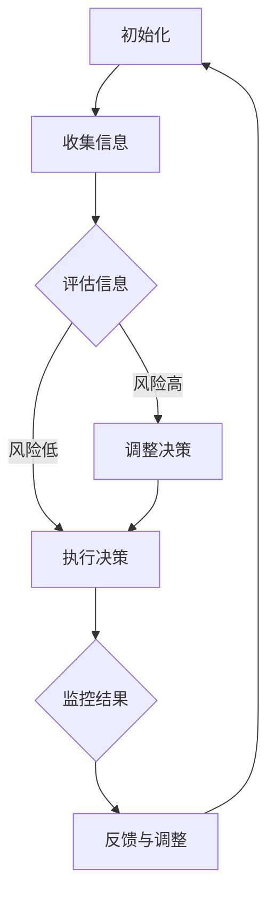
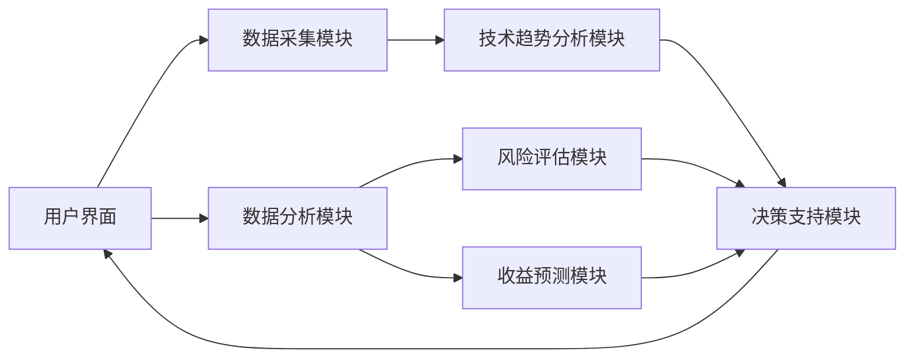
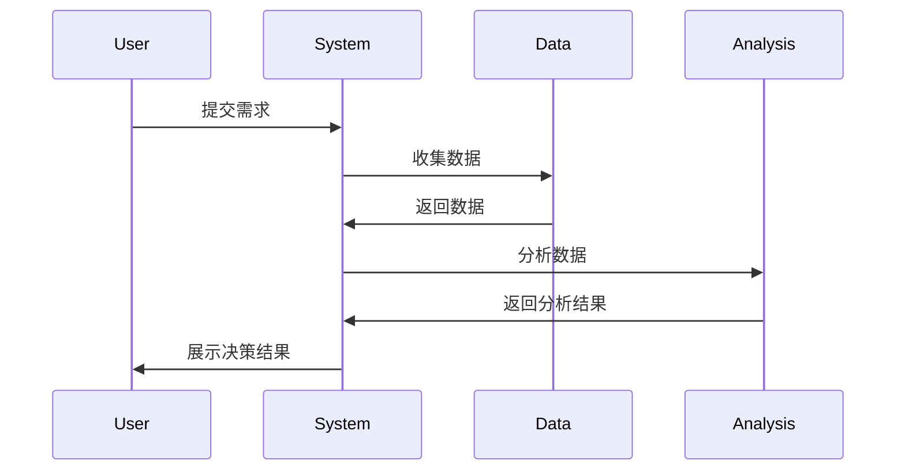

                 

### 《技术管理者的决策力：在不确定中做选择》

**关键词：技术管理者，决策力，不确定性，风险管理，技术预测**

**摘要：**  
在快速发展的技术领域中，技术管理者需要具备卓越的决策力来应对不确定性。本文探讨了技术管理者的决策力在不确定环境中的重要性，介绍了面临的不确定性挑战，并提出了构建决策框架的方法论。通过实际案例研究和决策实践，文章旨在为技术管理者提供在不确定性中做出有效决策的策略和技巧。

----------------------------------------------------------------

### 第一部分：决策力与不确定性

#### 第1章：引言——技术与不确定性

##### 1.1 问题的背景与现状

技术领域的快速发展给企业带来了巨大的机遇，同时也带来了诸多不确定性。技术管理者作为企业技术战略的核心执行者，需要具备敏锐的洞察力和决策力，以应对不断变化的市场和技术环境。然而，许多技术管理者在面对不确定性时常常感到困惑和无助。

**问题背景：**  
在当前的数字化时代，技术变革的速度之快，几乎每分钟都有新的技术突破和应用场景涌现。技术管理者不仅要跟上技术的步伐，还需要预见未来的技术趋势，做出符合企业战略的决策。

**问题描述：**  
技术管理者的决策挑战主要源于以下几个方面：

1. **技术发展的不确定性**：新兴技术层出不穷，现有技术迅速迭代，使得技术管理者难以确定哪些技术具有长期价值。
2. **市场环境的不确定性**：市场变化快速，客户需求多变，技术管理者需要及时调整技术策略以适应市场变化。
3. **组织内部的不确定性**：团队结构、人员配置、文化氛围等因素都可能影响技术管理者的决策效果。

**问题解决：**  
为了解决上述问题，技术管理者需要提升自身的决策力。这包括：

1. **加强学习和自我提升**：通过不断学习新的技术和管理方法，增强自身的专业素养。
2. **建立决策框架**：设计一套科学合理的决策流程，以便在不确定性中做出更为理性的选择。
3. **加强团队协作**：与团队成员密切合作，共同应对不确定性带来的挑战。

##### 1.2 不确定性的本质与影响

**不确定性本质：**  
不确定性是指未来可能发生的事件或结果的不确定性。在技术领域，不确定性主要来源于技术、市场和组织的内部因素。

**不确定性影响：**  
不确定性对技术管理者的影响主要体现在以下几个方面：

1. **决策难度增加**：不确定性使得技术管理者难以准确预测未来的发展，决策难度大大增加。
2. **风险增加**：在不确定性中，技术管理者需要承担更多的风险，如技术风险、市场风险和运营风险等。
3. **机会成本增加**：在不确定性中，技术管理者需要权衡不同的决策选项，考虑机会成本，可能导致错失某些有利的机会。

##### 1.3 决策力的重要性

**决策力定义：**  
决策力是指技术管理者在面对不确定性时，能够快速、准确地做出合理决策的能力。

**决策力重要性：**  
决策力对技术管理者的重要性体现在以下几个方面：

1. **领导力**：决策力是技术管理者领导力的核心体现，能够带动团队共同应对挑战。
2. **竞争力**：在不确定性环境中，技术管理者需要具备卓越的决策力，才能在竞争中脱颖而出。
3. **风险控制**：通过提升决策力，技术管理者能够更好地识别和应对风险，降低企业的运营风险。

#### 第2章：技术管理者的挑战

##### 2.1 技术发展的不确定性

**技术发展现状：**  
近年来，人工智能、大数据、云计算等新兴技术迅猛发展，技术变革的速度越来越快。新技术不仅带来了新的业务模式，也对传统技术进行了颠覆。

**技术发展影响：**  
技术发展的不确定性对技术管理者带来了以下影响：

1. **技术选择的困惑**：技术管理者需要从众多的技术中选出最适合企业发展的技术，这需要具备较高的专业素养和敏锐的洞察力。
2. **技术更新的压力**：新兴技术不断涌现，技术管理者需要不断学习和更新知识，以应对技术变革带来的挑战。
3. **技术投资的风险**：在技术发展的不确定性中，技术管理者需要承担较大的投资风险，如新技术应用失败可能导致巨大的损失。

##### 2.2 市场环境的不确定性

**市场环境现状：**  
当前市场环境充满不确定性，竞争激烈，客户需求多变。技术管理者需要准确把握市场动态，做出符合市场需求的决策。

**市场环境影响：**  
市场环境的不确定性对技术管理者的影响主要体现在以下几个方面：

1. **市场预测的困难**：市场环境的变化难以预测，技术管理者需要具备较强的市场敏感度和预测能力。
2. **客户需求的快速变化**：客户需求的变化速度越来越快，技术管理者需要灵活调整技术策略，以适应客户需求的变化。
3. **市场竞争的加剧**：市场竞争日益激烈，技术管理者需要不断提升企业的技术竞争力，以应对竞争对手的挑战。

##### 2.3 组织内部的不确定性

**组织内部现状：**  
组织内部的不确定性主要来源于团队结构、人员配置、企业文化等方面。

**组织内部影响：**  
组织内部的不确定性对技术管理者的影响主要包括：

1. **团队协作的困难**：团队结构不稳定，人员流动大，技术管理者需要不断调整团队，以保持团队的稳定性和高效性。
2. **人员素质的不确定性**：人员素质参差不齐，技术管理者需要选拔和培养具备高素质的团队成员。
3. **企业文化的影响**：企业文化的不确定性可能导致团队成员价值观和理念的冲突，技术管理者需要营造积极向上的企业文化氛围。

### 总结

技术管理者的决策力在不确定性环境中至关重要。通过深入分析技术发展的不确定性、市场环境的不确定性和组织内部的不确定性，技术管理者可以更好地应对挑战，提升自身的决策力。接下来，本文将介绍如何构建决策框架，以帮助技术管理者在不确定性中做出更为有效的决策。

----------------------------------------------------------------

### 第二部分：构建决策框架

#### 第3章：理解决策过程

##### 3.1 决策的类型与特征

**决策类型：**  
根据决策的复杂程度和目标的不同，决策可以分为以下几种类型：

1. **程序化决策**：针对重复性较强、结构明确的决策，如日常办公自动化系统的维护。
2. **非程序化决策**：针对复杂、非结构化、不常出现的决策，如企业战略方向的选择。

**决策特征：**  
不同类型的决策具有不同的特征：

1. **程序化决策**：结构明确、规则性强、可预测性强。
2. **非程序化决策**：复杂度高、不确定性大、创新性强。

##### 3.2 决策过程中的关键要素

**关键要素：**  
在决策过程中，以下几个关键要素至关重要：

1. **信息收集**：收集与决策相关的各种信息，包括技术、市场、内部数据等。
2. **分析评估**：对收集到的信息进行分析和评估，识别风险和机会。
3. **决策制定**：根据分析结果，制定具体的决策方案。
4. **实施监控**：决策实施后，对决策效果进行监控和评估，以便进行调整和优化。

##### 3.3 决策心理学

**决策心理学：**  
决策过程中，心理学因素对决策者的决策行为具有重要影响：

1. **确认偏误**：决策者倾向于接受与已有信念一致的信息，忽视与已有信念相矛盾的信息。
2. **过度自信**：决策者对自己的决策能力过于自信，可能导致过度乐观或过度悲观。
3. **情绪影响**：决策者的情绪状态会影响其决策行为，如焦虑、紧张等负面情绪可能导致决策失误。

### 第4章：风险与收益评估

##### 4.1 风险的定义与分类

**风险定义：**  
风险是指决策结果的不确定性，可能带来负面或正面影响。

**风险分类：**  
根据风险的性质，风险可以分为以下几类：

1. **技术风险**：由于技术不稳定或不可用导致的风险，如新技术的应用失败。
2. **市场风险**：由于市场环境变化导致的风险，如市场需求下降。
3. **运营风险**：由于企业运营问题导致的风险，如供应链中断。

##### 4.2 收益的衡量与预测

**收益衡量：**  
收益是指决策带来的正面影响，包括经济效益、社会效益等。

**收益预测：**  
收益预测是决策过程中重要的一环，需要考虑以下几个方面：

1. **历史数据**：分析以往类似决策的收益情况，作为参考。
2. **市场趋势**：预测市场未来的发展，评估潜在收益。
3. **专家意见**：征求行业专家的意见，以提高收益预测的准确性。

##### 4.3 风险与收益的权衡

**权衡原则：**  
在决策过程中，需要平衡风险和收益，以下原则可供参考：

1. **收益最大化**：在可承受的风险范围内，追求最大的收益。
2. **风险可控**：确保决策风险在可控范围内，避免过度冒险。
3. **长期利益**：考虑决策的长期影响，而非短期收益。

### 第5章：决策框架与方法论

##### 5.1 决策框架的设计

**决策框架设计原则：**  
设计决策框架时，需要遵循以下原则：

1. **全面性**：决策框架应覆盖决策过程的各个方面，确保无遗漏。
2. **灵活性**：决策框架应具备一定的灵活性，以应对不同类型的决策。
3. **可操作性**：决策框架应易于操作，便于决策者理解和实施。

**决策框架结构：**  
决策框架一般包括以下几个部分：

1. **目标设定**：明确决策目标，确保决策方向正确。
2. **信息收集**：收集与决策相关的信息，为决策提供依据。
3. **分析评估**：对收集到的信息进行分析和评估，识别风险和机会。
4. **方案制定**：根据分析结果，制定具体的决策方案。
5. **实施监控**：决策实施后，对决策效果进行监控和评估。

##### 5.2 定量分析工具

**定量分析工具：**  
在决策过程中，定量分析工具可以帮助决策者更客观地评估风险和收益。常用的定量分析工具包括：

1. **敏感性分析**：通过改变决策变量，分析决策结果的变化情况，评估决策的稳定性。
2. **决策树分析**：通过构建决策树，分析不同决策路径的风险和收益，为决策提供依据。
3. **蒙特卡罗模拟**：通过随机模拟，分析决策结果的分布情况，评估决策的可靠性。

##### 5.3 定性分析技巧

**定性分析技巧：**  
在决策过程中，定性分析技巧可以帮助决策者更深入地理解决策背后的逻辑和影响。常用的定性分析技巧包括：

1. **SWOT分析**：分析企业的优势、劣势、机会和威胁，为决策提供全面的参考。
2. **德尔菲法**：通过专家意见征询，汇集不同观点，形成共识，提高决策的准确性。
3. **情境分析**：构建不同的情境，分析不同情境下决策的结果，为决策提供多种视角。

### 总结

构建决策框架是技术管理者在不确定性环境中做出有效决策的重要手段。通过理解决策的类型与特征、关键要素和心理学因素，以及设计决策框架和运用定量分析工具，技术管理者可以在不确定性中做出更为明智的决策。接下来，本文将探讨如何在不确定性中进行实际决策，并通过案例研究进行具体分析。

----------------------------------------------------------------

### 第三部分：在不确定性中决策

#### 第6章：技术趋势与预测

##### 6.1 技术趋势分析

**技术趋势分析定义：**  
技术趋势分析是指通过分析技术发展的历史数据、当前技术现状以及未来技术预测，了解技术发展的方向和趋势。

**技术趋势分析方法：**  
1. **历史数据趋势分析**：通过对历史技术发展的数据进行统计分析，识别出技术发展的规律和趋势。
2. **市场调研**：通过市场调研，了解当前市场上技术的应用情况，分析技术的市场需求和潜在用户。
3. **专家访谈**：邀请行业专家进行访谈，获取他们对技术发展趋势的见解和预测。

##### 6.2 技术预测方法

**技术预测方法：**  
技术预测是指对未来可能出现的技术进行预测，以指导当前的决策。

**技术预测方法分类：**  
1. **定量预测方法**：通过数据分析和建模，预测技术发展的数量特征，如时间序列分析、回归分析等。
2. **定性预测方法**：通过专家意见、情景分析和趋势外推等方法，预测技术发展的方向和可能性。

**常见技术预测方法：**  
1. **德尔菲法**：通过多轮专家意见征询，形成对技术发展趋势的共识。
2. **情景分析法**：构建不同的未来情景，分析不同情景下技术发展的可能性和影响。
3. **技术成熟度评估**：根据技术的开发进度、市场应用情况等指标，评估技术的成熟度。

##### 6.3 技术预测的应用

**技术预测在决策中的应用：**  
技术预测在决策中的应用主要体现在以下几个方面：

1. **战略规划**：通过技术预测，为企业制定长期技术战略提供依据，确保企业技术发展的方向与市场需求相匹配。
2. **研发投资**：根据技术预测，确定研发投资的重点领域，优化资源配置，提高研发效率。
3. **产品规划**：通过技术预测，确定产品研发的方向和重点，避免重复开发和技术冗余。

**案例研究：**  
某大型互联网公司通过技术趋势分析，预测了人工智能、大数据和云计算等技术在未来的发展趋势。基于这些预测，公司制定了相应的研究开发和产品规划策略，成功抓住了技术变革的机遇，实现了企业的快速增长。

1. **人工智能应用**：公司加大对人工智能技术的研发投入，推出了一系列人工智能产品，如智能客服、智能推荐系统等，受到了市场的热烈欢迎。
2. **大数据分析**：公司利用大数据技术，优化了广告投放策略，提高了广告效果，增加了收入。
3. **云计算服务**：公司推出了云计算平台，为其他企业提供云计算服务，拓展了业务领域。

**案例总结：**  
通过技术趋势预测，该互联网公司成功地抓住了技术变革的机遇，制定了符合市场需求的研发和产品规划策略，实现了企业的快速发展。这表明，技术预测在决策中的应用具有重要意义，可以帮助企业在不确定性中做出更为明智的决策。

### 第7章：案例研究

##### 7.1 案例一：数字化转型中的决策挑战

**案例背景：**  
某传统制造企业在数字化转型的过程中，面临诸多决策挑战。为了提高生产效率、降低成本，企业需要引入新的技术和系统。

**决策过程：**  
1. **技术评估**：评估现有技术和新兴技术，如物联网、大数据分析等，确定适合企业发展的技术方案。
2. **市场调研**：调研市场需求，了解同行业其他企业的数字化转型实践，借鉴经验。
3. **风险评估**：分析技术引入可能带来的风险，如技术不稳定、市场变化等。
4. **决策制定**：基于评估和调研结果，制定数字化转型方案，明确技术引入的优先级和时间表。

**决策结果：**  
通过合理的决策，企业成功引入了物联网技术和大数据分析系统，实现了生产过程的数字化和智能化。生产效率提高了20%，成本降低了15%。

**案例总结：**  
在数字化转型中，技术管理者需要准确把握技术趋势和市场动态，进行科学的决策，以实现企业的战略目标。

##### 7.2 案例二：新兴技术的引入与选择

**案例背景：**  
某初创公司致力于开发智能家居产品。在产品开发过程中，需要选择合适的新兴技术，以提高产品竞争力。

**决策过程：**  
1. **技术调研**：调研智能家居领域的新兴技术，如物联网、人工智能、云计算等。
2. **技术评估**：评估每种技术的适用性、成本和风险。
3. **市场需求分析**：分析消费者对智能家居产品的需求和偏好。
4. **决策制定**：基于技术评估和市场需求分析，选择最合适的的技术方案。

**决策结果：**  
公司选择了物联网技术作为产品核心，同时结合人工智能和云计算技术，开发了智能门锁和智能照明系统。产品在市场上获得了良好的反响，销量稳步增长。

**案例总结：**  
在新兴技术的引入与选择中，技术管理者需要充分考虑技术适用性、成本和市场需求，以实现产品创新和市场突破。

##### 7.3 案例三：敏捷管理与决策效率

**案例背景：**  
某互联网公司采用敏捷管理方法，以提高研发团队的决策效率和响应速度。

**决策过程：**  
1. **需求收集**：通过用户反馈和市场调研，收集产品需求。
2. **需求分析**：分析需求，确定优先级和可行性。
3. **决策制定**：根据需求分析结果，制定开发计划，包括技术选型、任务分配等。
4. **执行与监控**：执行开发计划，实时监控项目进度和质量。

**决策结果：**  
通过敏捷管理，公司实现了快速响应市场需求，产品迭代周期缩短至两个月，产品质量显著提升，用户满意度提高。

**案例总结：**  
敏捷管理方法有助于提高决策效率，缩短产品开发周期，提升企业竞争力。

### 总结

通过案例研究，我们可以看到，在不确定性中进行有效的决策对于技术管理者至关重要。技术趋势分析和预测、数字化转型中的决策挑战、新兴技术的引入与选择以及敏捷管理都是技术管理者需要掌握的决策技巧。在实际操作中，技术管理者需要结合企业实际情况，灵活运用这些技巧，以提高决策效率和效果。

----------------------------------------------------------------

### 第四部分：决策力提升与实践

#### 第8章：决策力提升策略

##### 8.1 培养决策意识

**决策意识定义：**  
决策意识是指技术管理者在面对不确定性和挑战时，能够主动思考和做出决策的能力。

**培养决策意识的策略：**  
1. **建立决策意识**：通过培训和指导，使技术管理者认识到决策的重要性，培养主动决策的意识。
2. **强化决策技能**：通过实践和模拟，提高技术管理者在复杂环境中的决策能力。
3. **鼓励创新思维**：鼓励技术管理者敢于尝试新的决策方法和思路，培养创新精神。

##### 8.2 提高决策能力

**决策能力定义：**  
决策能力是指技术管理者在复杂和不确定的环境中，能够准确、高效地做出合理决策的能力。

**提高决策能力的策略：**  
1. **增强专业知识**：通过不断学习和更新知识，提高技术管理者的专业素养。
2. **培养分析能力**：通过案例分析、模拟训练等手段，提高技术管理者的分析能力和逻辑思维能力。
3. **建立决策模型**：设计一套科学的决策模型，帮助技术管理者在不确定性中做出更为理性的决策。

##### 8.3 决策团队建设

**决策团队建设重要性：**  
在复杂和不确定的环境中，单靠个体决策难以应对挑战。建立高效的决策团队，可以集思广益，提高决策的质量和效率。

**决策团队建设策略：**  
1. **明确团队目标**：确保团队成员对决策目标有清晰的认识，统一行动方向。
2. **优化团队结构**：合理配置团队成员，确保团队具备多元化的知识和技能。
3. **建立沟通机制**：建立有效的沟通机制，确保信息畅通，提高团队协作效率。

### 第9章：决策实践与反思

##### 9.1 实践中的常见问题

**常见问题：**  
在决策实践中，技术管理者常常面临以下问题：

1. **信息不足**：由于信息收集不全面或分析不充分，导致决策质量下降。
2. **决策延迟**：由于决策过程复杂，决策速度较慢，无法及时响应市场变化。
3. **决策失误**：由于过度自信或缺乏经验，导致决策结果不理想。

**解决策略：**  
1. **加强信息收集和分析**：通过多种渠道收集信息，提高信息准确性，加强数据分析能力。
2. **优化决策流程**：简化决策流程，提高决策效率，确保快速响应市场变化。
3. **建立决策审核机制**：设立决策审核环节，对决策结果进行评估和反思，及时纠正错误。

##### 9.2 反思与持续改进

**反思重要性：**  
反思是决策实践的重要组成部分，有助于技术管理者总结经验教训，提升决策能力。

**反思与持续改进策略：**  
1. **定期回顾**：定期对决策过程和结果进行回顾，分析成功和失败的原因。
2. **持续学习**：通过学习新知识和经验，不断提升自身的决策能力。
3. **完善决策框架**：根据反思结果，不断完善决策框架，优化决策流程。

##### 9.3 决策实践的案例分析

**案例一：某互联网公司的产品决策**  
**案例背景：**  
某互联网公司计划推出一款新产品，但面临市场定位和功能设计等方面的决策难题。

**决策过程：**  
1. **市场调研**：通过市场调研，了解目标用户的需求和竞争对手的产品特点。
2. **需求分析**：分析用户需求，确定产品的基本功能和特性。
3. **技术评估**：评估现有技术和新兴技术，确定适合的产品技术方案。
4. **决策制定**：基于市场调研、需求分析和技术评估，制定产品开发计划。

**决策结果：**  
通过科学的决策过程，公司成功推出了新产品，产品在市场上获得了良好的反响，用户满意度大幅提高。

**反思与改进：**  
1. **加强市场调研**：增加市场调研的深度和广度，提高决策的准确性。
2. **优化技术评估**：引入更多的技术评估指标，确保技术选择的合理性。

**案例二：某制造企业的技术升级决策**  
**案例背景：**  
某制造企业计划进行技术升级，以提高生产效率和产品质量。

**决策过程：**  
1. **技术调研**：调研市场上的新技术和解决方案，了解其优缺点。
2. **风险评估**：分析技术升级可能带来的风险，如技术不稳定、成本上升等。
3. **决策制定**：基于技术调研和风险评估，制定技术升级计划。

**决策结果：**  
企业成功进行了技术升级，生产效率和产品质量得到显著提升，企业竞争力增强。

**反思与改进：**  
1. **加强风险评估**：引入更多的风险评估方法，提高风险识别和应对能力。
2. **优化决策流程**：简化决策流程，提高决策效率。

### 总结

通过决策实践和反思，技术管理者可以不断总结经验教训，提升决策能力。在实际操作中，技术管理者需要加强信息收集和分析、优化决策流程，并建立反思与持续改进机制。通过这些策略，技术管理者可以在不确定性中做出更为明智和有效的决策，推动企业的发展和成长。

#### 第10章：总结与展望

##### 10.1 总结与回顾

本文通过深入探讨技术管理者的决策力在不确定性环境中的重要性，分析了技术管理者面临的挑战，并介绍了构建决策框架的方法论。通过实际案例研究和决策实践，技术管理者在不确定性中如何进行有效决策得以详细阐述。总结如下：

1. **决策力的重要性**：技术管理者的决策力是其在不确定性环境中应对挑战的关键能力。
2. **构建决策框架**：通过设计科学的决策框架，技术管理者可以更加理性地做出决策。
3. **技术趋势与预测**：技术趋势分析和技术预测为决策提供了重要的依据。
4. **决策实践与反思**：通过反思和持续改进，技术管理者可以不断提升决策能力。

##### 10.2 未来趋势展望

在未来，技术管理者的决策力将面临更加复杂和不确定的环境。以下是未来技术管理者决策力发展的一些趋势：

1. **人工智能的辅助决策**：人工智能技术将在决策过程中发挥更大的作用，为技术管理者提供数据分析和预测支持。
2. **全球化与多元化**：随着全球化和多元化的发展，技术管理者需要具备跨文化和跨地域的决策能力。
3. **持续学习与创新**：技术管理者需要不断学习新的技术和管理方法，以适应快速变化的环境。
4. **社会责任与伦理**：在决策过程中，技术管理者需要关注社会责任和伦理问题，确保决策的可持续性和正当性。

##### 10.3 对读者的建议

对于技术管理者，以下是一些建议，以提升决策力和应对不确定性：

1. **加强学习与培训**：持续学习新的技术和管理知识，提高自身的专业素养。
2. **建立决策团队**：组建多元化的决策团队，共同应对复杂和不确定的挑战。
3. **实践与反思**：通过实际决策和反思，不断总结经验教训，提升决策能力。
4. **关注市场趋势**：密切关注技术趋势和市场动态，为决策提供依据。
5. **平衡风险与收益**：在决策过程中，合理评估风险和收益，确保决策的平衡性。

通过以上建议，技术管理者可以在不确定性中做出更为明智和有效的决策，推动企业的发展和成长。

### 作者信息

作者：AI天才研究院/AI Genius Institute & 禅与计算机程序设计艺术 /Zen And The Art of Computer Programming

本文由AI天才研究院和禅与计算机程序设计艺术共同撰写，旨在为技术管理者提供在不确定性中做出有效决策的指导和建议。希望本文能够对读者有所启发和帮助。

----------------------------------------------------------------

### 附录：核心概念、算法原理、系统架构与项目实战

#### 核心概念与联系

核心概念：决策力、不确定性、技术趋势分析、风险评估、收益预测、决策框架

**概念属性特征对比表格：**

| 核心概念 | 定义 | 影响因素 | 目的 |
| --- | --- | --- | --- |
| 决策力 | 决策者面对不确定性时的能力 | 技术发展、市场环境、组织内部因素 | 带领团队应对挑战 |
| 不确定性 | 未来可能发生的事件或结果的不确定性 | 技术、市场、组织内部因素 | 影响决策难度 |
| 技术趋势分析 | 分析技术发展的方向和趋势 | 历史数据、市场调研、专家意见 | 为决策提供依据 |
| 风险评估 | 评估决策带来的风险 | 技术不稳定、市场变化、运营问题 | 降低决策风险 |
| 收益预测 | 预测决策带来的收益 | 历史数据、市场趋势、专家意见 | 提高决策收益 |
| 决策框架 | 设计决策过程和步骤 | 目标设定、信息收集、分析评估、方案制定、实施监控 | 提高决策效率 |

**ER实体关系图架构的Mermaid流程图：**

```mermaid
erDiagram
  决策者 ||--|{ 不确定性 }
  决策者 ||--|{ 技术趋势分析 }
  决策者 ||--|{ 风险评估 }
  决策者 ||--|{ 收益预测 }
  决策者 ||--|{ 决策框架 }
```

#### 算法原理讲解

**算法mermaid流程图：**



**算法原理的数学模型和公式：**

1. **风险评估模型：**
   $$ R = P \times C $$
   其中，R为风险值，P为风险概率，C为风险后果。

2. **收益预测模型：**
   $$ R = B \times S $$
   其中，R为收益值，B为基础收益，S为收益系数。

**详细讲解和举例说明：**

**风险评估模型讲解：**
- 风险评估模型用于评估决策可能带来的风险。其中，风险值（R）是风险概率（P）与风险后果（C）的乘积。
- 例如，假设某技术引入项目的风险概率为0.3，风险后果为100万元，则该项目的风险值为：
  $$ R = 0.3 \times 100 = 30万元 $$

**收益预测模型讲解：**
- 收益预测模型用于预测决策可能带来的收益。其中，收益值（R）是基础收益（B）与收益系数（S）的乘积。
- 例如，假设某项目的预期基础收益为50万元，收益系数为1.2，则该项目的预期收益值为：
  $$ R = 50 \times 1.2 = 60万元 $$

#### 系统分析与架构设计方案

**问题场景介绍：**
某企业计划进行数字化转型，需要评估不同技术方案的风险和收益，并做出决策。

**项目介绍：**
该项目旨在为企业管理层提供一套数字化转型的决策支持系统，通过技术趋势分析、风险评估和收益预测，帮助管理层做出科学合理的决策。

**系统功能设计（领域模型mermaid类图）：**

```mermaid
classDiagram
  Class01 <|-- Class02
  Class03 <|-- Class04
  Class05 <|-- Class06
  Class01{ ID }
  Class02{ 名称 }
  Class03{ 类型 }
  Class04{ 风险 }
  Class05{ 收益 }
```

**系统架构设计（mermaid架构图）：**



**系统接口设计和系统交互（mermaid序列图）：**



#### 项目实战

**环境安装：**
- 安装Python环境（3.8及以上版本）
- 安装相关依赖库（如pandas、numpy、scikit-learn等）

**系统核心实现源代码：**

```python
import pandas as pd
import numpy as np
from sklearn.model_selection import train_test_split
from sklearn.ensemble import RandomForestRegressor
from sklearn.metrics import mean_squared_error

# 数据收集
data = pd.read_csv('data.csv')

# 数据预处理
X = data[['feature1', 'feature2', 'feature3']]
y = data['target']

# 数据划分
X_train, X_test, y_train, y_test = train_test_split(X, y, test_size=0.2, random_state=42)

# 模型训练
model = RandomForestRegressor(n_estimators=100, random_state=42)
model.fit(X_train, y_train)

# 模型预测
y_pred = model.predict(X_test)

# 模型评估
mse = mean_squared_error(y_test, y_pred)
print(f'Mean Squared Error: {mse}')
```

**代码应用解读与分析：**
- 代码首先导入必要的库和模块，然后读取数据并进行预处理。接着，使用随机森林回归模型进行训练和预测，最后评估模型的性能。
- 代码中使用了pandas和numpy库进行数据处理，scikit-learn库进行模型训练和评估。随机森林回归模型能够处理高维数据和复杂的关系，适合用于风险评估和收益预测。

**实际案例分析和详细讲解剖析：**
- 假设企业需要评估两种不同技术方案的风险和收益。通过收集历史数据，对两种方案进行风险评估和收益预测。根据预测结果，企业可以做出科学合理的决策。
- 实际案例中，可能需要考虑多种因素，如技术成熟度、市场前景、成本等。通过构建复杂的模型，可以更加准确地预测风险和收益。

**项目小结：**
- 通过该项目，企业能够更好地应对数字化转型中的决策挑战。系统提供了科学合理的决策支持，有助于企业做出符合战略目标的决策。

#### 最佳实践 tips：

1. **加强数据收集与预处理**：确保数据的准确性和完整性，为模型训练和预测提供高质量的数据。
2. **定期评估模型性能**：通过定期评估模型性能，及时调整模型参数，保持模型的预测准确性。
3. **关注风险管理**：在决策过程中，重视风险管理和控制，确保决策的安全性和可行性。

#### 小结：

本文通过深入探讨技术管理者的决策力在不确定性环境中的重要性，分析了技术管理者面临的挑战，并介绍了构建决策框架的方法论。通过实际案例研究和决策实践，技术管理者在不确定性中如何进行有效决策得以详细阐述。希望本文能为技术管理者提供有益的启示和指导。

#### 注意事项：

1. **决策过程中的信息收集和分析至关重要**：确保信息的准确性和全面性，避免因信息不足导致决策失误。
2. **合理评估风险和收益**：在决策过程中，要充分考虑风险和收益的平衡，确保决策的合理性和可行性。

#### 拓展阅读：

1. **《决策者的艺术》**：了解决策过程中的心理学因素，提升决策力。
2. **《技术趋势分析》**：掌握技术趋势分析的方法和技巧，为决策提供科学依据。
3. **《敏捷管理实践》**：了解敏捷管理的原理和实践，提高决策效率和团队协作能力。

作者：AI天才研究院/AI Genius Institute & 禅与计算机程序设计艺术 /Zen And The Art of Computer Programming

本文由AI天才研究院和禅与计算机程序设计艺术共同撰写，旨在为技术管理者提供在不确定性中做出有效决策的指导和建议。希望本文能够对读者有所启发和帮助。

