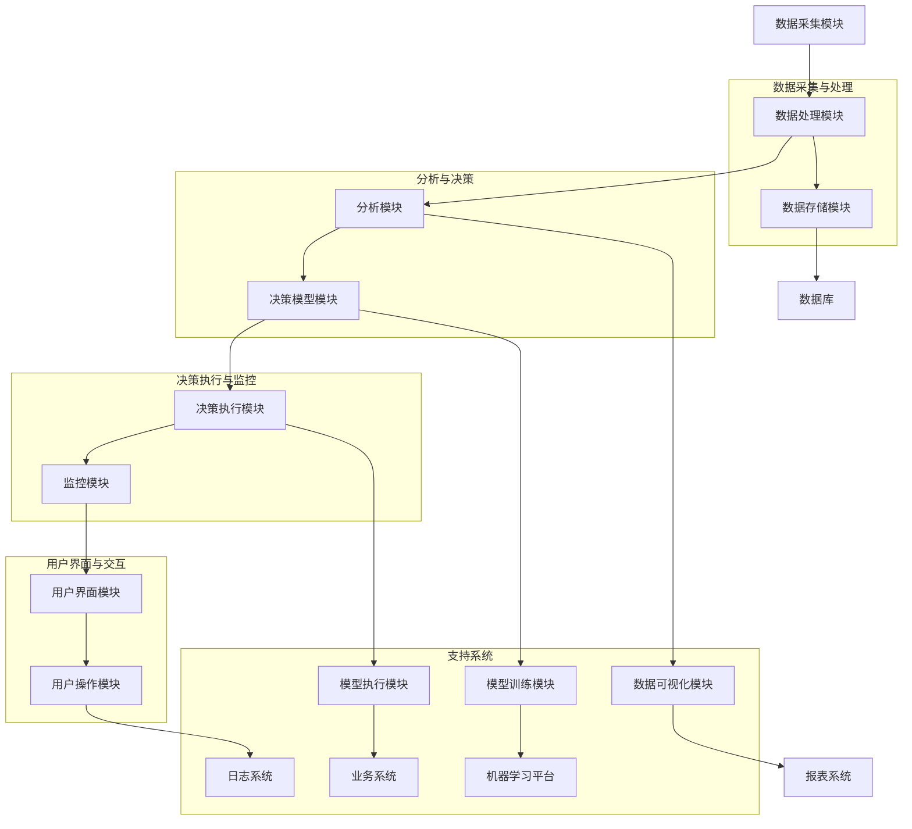

                 

### 决策模型的重要性

在现代技术管理中，决策模型扮演着至关重要的角色。技术管理者面临的挑战复杂且多样，从技术选型、资源分配到团队管理，每一个决策都直接影响着项目的成功与否。传统的决策方式往往依赖于经验和直觉，但在复杂多变的环境中，这种方法难以应对。因此，构建并应用科学、系统的决策模型成为技术管理者必备的能力。

首先，决策模型为技术管理者提供了一个结构化的思考框架。通过定义明确的决策步骤和要素，管理者能够在复杂的情境中理清思路，有条不紊地进行分析和判断。这不仅提高了决策效率，还减少了因主观判断带来的偏差。

其次，决策模型有助于提高决策的科学性和可追溯性。通过模型中的数学模型和公式，技术管理者可以基于数据和分析结果进行决策，而不是仅凭个人经验和直觉。这样不仅使决策过程更加透明，也有助于在未来对决策的效果进行评估和优化。

此外，决策模型的应用还能帮助技术管理者在面对不确定性时做出更加明智的决策。模型中通常会包含风险分析和概率预测，这使得管理者能够在考虑多种可能性和应对方案的基础上做出更稳健的选择。

综上所述，决策模型不仅是技术管理者提升自身管理能力的重要工具，也是应对复杂环境、确保项目成功的关键因素。在接下来的章节中，我们将深入探讨决策模型的基本概念、原理和应用，帮助技术管理者更好地理解和应用这一关键技能。### 核心概念

#### 决策模型概述

决策模型是用于指导决策过程的系统化和结构化方法。它通过定义一系列步骤和规则，帮助决策者在复杂环境中做出明智的选择。决策模型的核心在于将决策过程分解为可管理的部分，从而使决策者能够更加高效和科学地进行思考。

在技术管理领域，决策模型通常包括以下几个关键要素：

1. **目标明确**：决策模型首先需要明确决策的目标，这是决策过程的起点。目标可以是提高项目效率、降低成本、优化用户体验等。

2. **信息收集**：收集与决策相关的各种信息，包括技术可行性、市场趋势、团队能力等。这些信息是决策的基础。

3. **分析评估**：对收集到的信息进行深入分析，评估不同选项的优缺点，包括技术风险、资源需求、时间成本等。

4. **选择方案**：在分析评估的基础上，选择最优或次优的方案。

5. **实施与监控**：制定具体的执行计划，并对决策执行过程进行监控和调整，确保决策目标能够实现。

#### 决策模型的基本要素

1. **决策变量**：决策变量是决策过程中需要确定的因素，如技术选型、资源分配、项目优先级等。

2. **决策规则**：决策规则是用于指导决策过程的逻辑或公式，例如成本效益分析、风险评估等。

3. **目标函数**：目标函数是衡量决策结果优劣的标准，可以是最大化利润、最小化风险等。

4. **约束条件**：约束条件是决策过程中需要遵循的限制条件，如预算限制、时间限制、资源限制等。

#### 决策模型的类型

1. **定量决策模型**：基于数学和统计方法，如线性规划、决策树、贝叶斯网络等。这类模型通常适用于数据较为充分的情况。

2. **定性决策模型**：基于主观判断和专家意见，如SWOT分析、专家评估等。这类模型适用于数据不足或不确定性较大的情况。

3. **混合决策模型**：结合定量和定性方法，如AHP（层次分析法）、模糊综合评估等。这类模型适用于复杂且具有不确定性的决策情境。

#### 边界与外延

1. **应用范围**：决策模型广泛应用于技术管理、项目管理、投资决策等多个领域。

2. **技术管理者的职责与决策**：技术管理者在决策过程中不仅要关注技术层面的问题，还需考虑商业目标、团队协作等因素。

3. **决策模型与传统管理方法的区别**：传统管理方法更多依赖于经验和直觉，而决策模型则强调系统化、数据驱动的决策过程。

#### 概念结构与核心要素

1. **组成结构**：决策模型通常包括输入、处理和输出三个部分。输入是决策所需的各类信息，处理是对输入信息的分析和评估，输出是最终的决策结果。

2. **核心要素**：核心要素包括决策变量、决策规则、目标函数和约束条件。这些要素共同构成了决策模型的基本框架。

3. **关键步骤**：关键步骤包括目标明确、信息收集、分析评估、选择方案和实施与监控。每个步骤都需要严格按照决策模型的要求进行操作。

#### 本章小结

通过本章的介绍，我们初步了解了决策模型的基本概念、要素和类型，并探讨了其在技术管理中的应用。在接下来的章节中，我们将进一步深入探讨决策模型的原理、属性和应用，帮助技术管理者更好地理解和应用这一关键技能。### 第1章：技术管理者的挑战与决策模型

#### 1.1 问题背景

技术管理者在现代企业中扮演着越来越重要的角色。随着科技的快速发展，企业所面临的技术挑战和业务需求也日益复杂。技术管理者不仅需要具备深厚的技术背景，还要具备优秀的管理能力和决策能力。在这种背景下，决策模型成为技术管理者不可或缺的工具。

首先，从技术挑战的角度来看，技术管理者需要面对的技术难题包括但不限于：

1. **技术选型**：在众多技术选项中，如何选择最适合企业需求的技术方案，这是一个复杂且具有风险的问题。
2. **系统架构**：如何构建高效、可扩展的系统架构，以满足不断变化的需求，这是一个需要深入思考的问题。
3. **资源分配**：如何合理分配人力、财力、物力等资源，以确保项目能够顺利进行，这是一个需要平衡多方面利益的问题。

其次，从业务需求的角度来看，技术管理者需要考虑的因素包括：

1. **市场需求**：如何紧跟市场趋势，开发出满足客户需求的产品或服务，这是一个需要紧密跟踪市场动态的问题。
2. **用户体验**：如何通过技术手段提升用户体验，增加用户满意度，这是一个需要从多个维度进行优化的问题。
3. **成本控制**：如何在确保项目质量的前提下，最大限度地降低成本，这是一个需要精确计算和精细化管理的的问题。

综上所述，技术管理者在面临这些技术挑战和业务需求时，需要具备敏锐的洞察力、卓越的分析能力和科学的决策能力。然而，传统的决策方式往往依赖于个人经验和直觉，这种方式在简单的问题中可能有效，但在复杂多变的现代商业环境中，往往难以满足需求。因此，构建并应用科学、系统的决策模型成为技术管理者应对这些挑战的必然选择。#### 1.2 决策模型概述

决策模型是一种系统化的方法，用于指导决策者在复杂环境中做出明智的选择。在技术管理领域，决策模型尤为重要，因为它能够帮助管理者在面对复杂的技术挑战和业务需求时，理清思路，做出科学、合理的决策。决策模型的基本原理可以概括为以下几个关键步骤：

1. **目标明确**：首先，决策者需要明确决策的目标。目标可以是提高项目效率、降低成本、优化用户体验等。明确目标有助于确保决策过程的针对性和有效性。

2. **信息收集**：在明确目标之后，决策者需要收集与决策相关的各种信息。这些信息可能包括市场趋势、技术可行性、团队能力、竞争对手动态等。充分的信息是决策的基础。

3. **分析评估**：收集到信息后，决策者需要对信息进行深入分析，评估不同选项的优缺点。分析评估的过程通常包括成本效益分析、风险评估、SWOT分析等。这一步骤的目的是为选择最佳方案提供依据。

4. **选择方案**：在分析评估的基础上，决策者需要选择最优或次优的方案。选择方案时，需要综合考虑各种因素，包括技术可行性、资源需求、时间成本、风险等。

5. **实施与监控**：选择方案后，决策者需要制定具体的执行计划，并监控决策执行的过程，确保决策目标能够实现。实施与监控的过程需要不断调整和优化，以确保决策效果的最大化。

在技术管理中，决策模型的应用场景非常广泛。以下是一些典型的应用场景：

1. **项目决策**：在项目启动、执行和结束的各个阶段，技术管理者需要根据项目目标、资源情况和市场动态，做出一系列决策，如项目优先级排序、任务分配、技术选型等。

2. **资源分配**：技术管理者需要合理分配人力、财力、物力等资源，以确保项目能够顺利进行。决策模型可以帮助管理者在资源有限的情况下，做出最优的资源分配决策。

3. **风险管理**：技术管理者需要识别和评估项目中可能出现的风险，并制定相应的风险应对策略。决策模型可以提供科学的风险评估和风险优先级排序方法。

4. **技术选型**：在众多技术选项中，技术管理者需要选择最适合企业需求的技术方案。决策模型可以帮助管理者在充分考虑技术可行性、成本效益、市场趋势等因素的基础上，做出明智的技术选型决策。

总之，决策模型为技术管理者提供了一个结构化的思考框架，使得他们在复杂的环境中能够更加科学、系统地做出决策。通过决策模型，技术管理者不仅能够提高决策的效率，还能减少因主观判断带来的偏差，从而更好地应对复杂的技术挑战和业务需求。#### 1.3.1 决策模型的基本原理

决策模型的基本原理可以归结为以下几个关键要素和步骤：

1. **结构化思考**：决策模型首先强调的是结构化思考。通过将决策过程分解为一系列明确的步骤，决策者可以更加有条不紊地分析问题和制定解决方案。这种结构化的方法有助于减少决策过程中的混乱和不确定性。

2. **信息分析**：决策过程中，信息是决策的基础。决策模型要求决策者收集并分析与决策相关的各种信息，包括市场数据、技术可行性、团队能力等。通过对这些信息的深入分析，决策者可以更全面地了解问题的各个方面，从而做出更加科学的决策。

3. **风险评估**：决策过程中，风险是不可避免的因素。决策模型通常会包含风险评估的环节，帮助决策者识别和评估可能出现的风险，并制定相应的应对策略。这样，即使在面对不确定性时，决策者也能做出更加稳健的决策。

4. **目标优化**：决策模型强调在决策过程中明确目标并优化目标。决策者需要明确决策的目标是什么，并在选择方案时综合考虑各种因素，包括成本、效益、风险等，以实现目标的最优化。

5. **反馈调整**：决策模型还强调决策执行后的反馈和调整。在实际操作中，决策的效果可能会与预期有所不同，通过收集反馈信息并进行调整，决策者可以不断优化决策过程，提高决策的准确性和有效性。

具体来说，决策模型的基本原理可以概括为以下步骤：

1. **问题定义**：明确需要解决的问题或决策的目标。

2. **信息收集**：收集与决策相关的各种信息，包括市场趋势、技术可行性、团队能力等。

3. **分析评估**：对收集到的信息进行深入分析，评估不同选项的优缺点，包括成本效益、风险等。

4. **方案选择**：在分析评估的基础上，选择最优或次优的方案。

5. **实施与监控**：制定具体的执行计划，并对决策执行过程进行监控和调整，确保决策目标能够实现。

6. **反馈与调整**：在决策执行后，收集反馈信息并进行调整，以优化决策过程。

通过这些基本原理，决策模型为技术管理者提供了一个科学、系统的决策框架，使得他们能够更加高效地应对复杂的技术和管理挑战。#### 1.3.2 决策模型的数学模型

在构建决策模型时，数学模型是不可或缺的工具。它通过数学公式和算法，对决策过程进行定量分析和优化。以下是一些常见的决策模型数学模型及其基本原理：

1. **线性规划**（Linear Programming，LP）
   - **基本原理**：线性规划是解决在一系列线性约束条件下，线性目标函数最大化或最小化问题的一种数学方法。
   - **数学模型**：
     $$ 
     \text{minimize} \ \mathbf{c}^T \mathbf{x} 
     $$
     $$
     \text{subject to} \ \mathbf{A} \mathbf{x} \leq \mathbf{b} 
     $$
     $$
     \mathbf{x} \geq 0 
     $$
   - **适用场景**：资源分配、成本控制、生产计划等。

2. **决策树**（Decision Tree）
   - **基本原理**：决策树通过一系列的判断节点和结果节点，呈现决策的不同可能路径及其结果。
   - **数学模型**：
     - 每个节点都有概率分布，用于表示该节点的可能性。
     - 每个结果节点都有相应的价值或损失。
   - **适用场景**：风险评估、投资决策、市场分析等。

3. **贝叶斯网络**（Bayesian Network）
   - **基本原理**：贝叶斯网络通过表示变量之间概率依赖的图形模型，实现概率推理和决策。
   - **数学模型**：
     $$
     P(\mathbf{X}) = \prod_{i=1}^n P(X_i | \text{parents}(X_i))
     $$
   - **适用场景**：故障诊断、风险评估、决策支持等。

4. **马尔可夫决策过程**（Markov Decision Process，MDP）
   - **基本原理**：马尔可夫决策过程是一种用于在不确定环境中进行决策的数学模型，通过状态、行动和奖励来描述决策过程。
   - **数学模型**：
     $$
     V^{\pi}(s) = \sum_{s'} p(s' | s, a) \sum_{r} r(s', a) + \gamma \sum_{s''} p(s'' | s', a) V^{\pi}(s'') 
     $$
   - **适用场景**：自动控制、资源分配、供应链管理等。

5. **排队理论**（Queuing Theory）
   - **基本原理**：排队理论通过数学模型描述排队系统的工作特性，优化排队系统的设计和运行。
   - **数学模型**：
     - 服务时间分布 \( S \)
     - 到达时间分布 \( A \)
     - 排队规则
   - **适用场景**：交通管理、电信网络、医院管理等。

这些数学模型通过不同的方式，为决策者提供了分析和优化的工具。例如，线性规划可以帮助决策者在资源有限的情况下，找到最优的分配方案；决策树和贝叶斯网络则有助于在不确定性较大的环境中，进行合理的风险预测和决策。通过掌握这些数学模型，技术管理者可以更加科学、系统地应对复杂的技术和管理问题。#### 1.3.3 决策模型的应用场景

决策模型在技术管理中的应用场景非常广泛，以下列举几个典型的应用场景，并简要介绍如何在这些场景中应用决策模型。

1. **项目决策**：
   - **场景描述**：项目决策通常涉及多个技术选项，需要考虑技术可行性、成本、时间等因素。
   - **应用方法**：可以使用决策树、线性规划和多目标决策等模型。例如，通过决策树分析不同技术方案的优缺点，利用线性规划优化资源分配，通过多目标决策平衡项目质量和成本。

2. **资源分配**：
   - **场景描述**：资源分配是技术管理者面临的一个常见问题，需要考虑人力、资金、设备等资源的最优配置。
   - **应用方法**：可以使用线性规划模型来优化资源分配，确保资源利用最大化。同时，可以通过排队理论分析资源的供需平衡，提高资源利用效率。

3. **风险管理**：
   - **场景描述**：项目或产品开发过程中不可避免地会遇到各种风险，需要提前识别和评估。
   - **应用方法**：可以使用贝叶斯网络或决策树来分析风险因素及其相互关系，评估不同风险的概率和影响。通过这些模型，可以制定有效的风险应对策略。

4. **技术选型**：
   - **场景描述**：在众多技术选项中，需要选择最适合企业需求的技术方案。
   - **应用方法**：可以使用成本效益分析模型来评估不同技术方案的成本和效益。同时，结合决策树或贝叶斯网络，可以分析技术方案的风险和不确定性。

5. **绩效评估**：
   - **场景描述**：需要对团队或项目的绩效进行评估，以指导未来的改进和优化。
   - **应用方法**：可以使用关键绩效指标（KPI）模型来量化绩效指标，通过数据分析评估绩效。同时，结合多目标决策模型，可以在多个绩效指标之间进行权衡和优化。

通过以上应用场景的介绍，可以看出决策模型在技术管理中的广泛应用。这些模型不仅帮助技术管理者在面对复杂问题时做出更科学、合理的决策，还能提高决策的透明度和可追溯性，从而更好地支持企业的长期发展。#### 1.4.1 决策模型的组成结构

决策模型是一个系统化的工具，用于帮助决策者在复杂的环境中做出最优的决策。其组成结构包括输入、处理和输出三个关键部分。

1. **输入部分**：决策模型的输入部分主要包括以下几个要素：

   - **目标**：明确决策的目标，这是决策过程的起点。目标可以是提高项目效率、降低成本、优化用户体验等。
   - **信息**：收集与决策相关的各种信息，如市场趋势、技术可行性、团队能力、竞争对手动态等。这些信息是决策的基础。
   - **约束条件**：列出决策过程中需要遵循的限制条件，如预算限制、时间限制、资源限制等。

2. **处理部分**：处理部分是决策模型的核心，它包含了一系列的步骤和方法，用于对输入信息进行分析和评估。

   - **信息处理**：对收集到的信息进行整理和分析，识别出关键因素和变量。
   - **评估**：根据目标函数和约束条件，对不同的选项进行评估，计算每个选项的得分或成本。
   - **优先级排序**：根据评估结果，对选项进行优先级排序，选择最优或次优的方案。

3. **输出部分**：决策模型的输出部分主要包括以下内容：

   - **决策结果**：根据处理部分的结果，输出最终的决策结果。这个结果可以是选择某个技术方案、资源分配方案或风险管理策略等。
   - **执行计划**：制定具体的执行计划，包括时间表、资源需求、任务分配等，以确保决策结果能够顺利实施。
   - **监控和反馈**：在决策执行过程中，收集反馈信息，对决策结果进行监控和调整，确保决策目标能够实现。

通过输入、处理和输出这三个部分的有机结合，决策模型能够为决策者提供一个系统化的决策框架，帮助他们在复杂的环境中做出更加科学、合理的决策。这个结构不仅提高了决策的效率和准确性，还增强了决策的透明度和可追溯性，从而为企业的长期发展提供了坚实的支持。#### 1.4.2 决策模型的核心要素

决策模型在技术管理中的有效性依赖于其核心要素的完整性和合理性。以下是决策模型中的几个关键要素及其作用：

1. **决策变量**：决策变量是决策模型中的基础元素，代表决策者在决策过程中需要确定的变量。这些变量可以是技术选型、资源分配、项目优先级等。决策变量的选择和定义直接影响决策模型的准确性。在决策过程中，明确每个变量的含义和范围是非常重要的，这有助于确保分析过程的严谨性。

2. **决策规则**：决策规则是指导决策者如何根据输入信息做出决策的逻辑或公式。这些规则可以是简单的比较、排序或更复杂的优化算法。决策规则的作用在于提供决策的依据，确保决策的标准化和一致性。在设计决策规则时，需要充分考虑各种可能的情境和约束条件，以确保规则的应用范围和灵活性。

3. **目标函数**：目标函数是衡量决策结果优劣的标准，可以是最大化利润、最小化成本、最大化用户体验等。目标函数的选择直接决定了决策模型的价值导向。在多目标决策中，通常需要通过权重分配或目标优化方法，将多个目标函数综合为一个整体目标，以便在决策过程中进行权衡和优化。

4. **约束条件**：约束条件是决策模型中需要遵守的限制条件，如预算限制、时间限制、资源限制等。约束条件的作用在于确保决策的可行性和现实性。在实际应用中，约束条件通常会对决策变量和目标函数产生限制，因此在模型设计和决策过程中，需要充分考虑这些限制条件，以确保决策结果的可行性和合理性。

这些核心要素共同构成了决策模型的基础框架，使得决策者在面对复杂的技术和管理挑战时，能够通过结构化的方法进行系统分析，从而做出更加科学、合理的决策。通过不断优化这些要素，决策模型能够更好地适应不断变化的环境，提高决策的准确性和有效性。#### 1.4.3 决策模型的关键步骤

在技术管理过程中，决策模型的关键步骤对于确保决策的科学性和有效性至关重要。以下是构建和实施决策模型的主要步骤：

1. **问题定义**：首先，需要明确需要解决的问题或决策的目标。这一步骤的目的是确保决策的针对性和明确性。问题定义应包括目标、背景、决策范围和所需解决的问题。

2. **信息收集**：在明确问题后，接下来需要收集与决策相关的各种信息。这些信息可以来源于市场调研、数据分析、团队讨论等。收集的信息应尽可能全面和准确，以确保后续分析的基础坚实。

3. **问题分析**：对收集到的信息进行深入分析，识别关键因素和变量。分析过程中应考虑各种可能的情境和约束条件，以便全面理解问题。

4. **方案设计**：在问题分析的基础上，设计多个可行的决策方案。每个方案应包括具体的技术选型、资源分配、行动步骤等。设计方案时，需要综合考虑目标函数和约束条件。

5. **方案评估**：对每个方案进行评估，计算其得分或成本，并评估方案的优缺点。评估方法可以包括成本效益分析、风险评估、SWOT分析等。评估结果将帮助决策者选择最优或次优的方案。

6. **方案选择**：根据评估结果，选择最优或次优的方案。选择方案时，需要综合考虑目标函数、约束条件和实际情况。

7. **方案实施**：制定具体的执行计划，并分配任务和资源。实施过程中，需要确保每个步骤都按照既定计划进行，并随时调整和优化。

8. **监控和反馈**：在方案实施过程中，收集反馈信息，对决策结果进行监控和调整。通过持续监控和反馈，可以确保决策目标能够实现，并不断优化决策模型。

9. **总结和评估**：在决策过程结束后，对整个决策过程进行总结和评估。评估内容包括决策结果的实现情况、决策模型的准确性和有效性等。通过总结和评估，可以为未来类似决策提供参考和改进方向。

通过以上关键步骤，技术管理者可以构建一个科学、系统的决策模型，确保在复杂环境中做出明智的决策，提高项目成功率。#### 1.5.1 主要内容回顾

在本章中，我们深入探讨了技术管理者在复杂环境中做出决策的重要性和决策模型的基本原理。通过分析技术管理者的挑战，我们了解到他们在面对技术选型、资源分配和风险管理等方面需要做出科学、合理的决策。决策模型作为一种系统化的工具，为技术管理者提供了一个清晰的决策框架。

首先，我们明确了决策模型的基本概念，包括决策变量、决策规则、目标函数和约束条件等核心要素。这些要素共同构成了决策模型的基本结构，使得决策过程更加严谨和有条不紊。

接着，我们详细介绍了决策模型的几个关键步骤，从问题定义、信息收集、问题分析到方案设计、方案评估和方案实施，每个步骤都至关重要，确保决策的科学性和可行性。

最后，我们通过具体的应用场景，展示了决策模型在技术管理中的实际应用，包括项目决策、资源分配、风险管理和技术选型等。这些应用实例不仅帮助我们理解了决策模型的实用性，也展示了其在提升决策效率和准确性方面的优势。

通过本章的学习，技术管理者应能够更好地理解决策模型的重要性，掌握构建和实施决策模型的关键步骤，从而在实际工作中做出更加科学、合理的决策，提高项目的成功率和企业的竞争力。#### 1.5.2 对技术管理者的启示

通过本章的学习，技术管理者可以获得以下几方面的启示：

1. **系统化决策**：决策模型提供了一个系统化的方法，使技术管理者能够将复杂的决策过程分解为可管理的步骤。这有助于减少决策过程中的混乱和不确定性，提高决策的效率和准确性。

2. **信息驱动**：决策模型强调信息收集和分析的重要性。技术管理者应重视数据的收集和分析，利用数据驱动决策，减少主观判断的干扰，从而提高决策的科学性。

3. **风险管理**：决策模型中的风险评估环节有助于技术管理者识别和评估项目中的潜在风险。通过制定相应的风险应对策略，管理者可以降低风险对项目的影响，确保项目顺利进行。

4. **目标导向**：明确决策目标是决策模型的核心。技术管理者在制定决策时，应始终以实现企业目标为导向，综合考虑各种因素，确保决策与企业的长期战略一致。

5. **持续优化**：决策模型不是一成不变的，技术管理者应不断收集反馈信息，对决策模型进行优化和调整。通过持续的学习和改进，管理者可以不断提高决策的准确性和有效性。

总之，决策模型为技术管理者提供了一种科学、系统的决策工具。通过学习和应用这些工具，技术管理者可以在复杂环境中做出更加明智、有效的决策，从而提升项目的成功率，推动企业的发展。#### 1.5.3 进一步研究方向

在本章中，我们探讨了决策模型在技术管理中的应用，并介绍了其基本原理和关键步骤。然而，决策模型的探索和应用还有许多值得进一步研究的方向：

1. **模型优化**：随着科技的进步，新的算法和模型不断涌现。如何将这些先进的技术融入决策模型中，提高模型的准确性和效率，是一个重要的研究方向。例如，深度学习、强化学习等算法在决策模型中的应用潜力巨大。

2. **模型融合**：不同决策模型在处理不同类型的问题时各有优势。如何将多种决策模型进行融合，构建一个更加强大的综合决策模型，是未来研究的重点。例如，将定量分析和定性分析相结合，提高决策的全面性和准确性。

3. **模型适应能力**：技术环境变化迅速，决策模型需要具备较强的适应能力，能够快速调整和更新。研究如何增强决策模型的动态适应性，使其在不同环境下都能保持高效和准确，是一个重要的课题。

4. **决策支持系统**：开发更为智能、直观的决策支持系统（DSS），将决策模型与大数据、人工智能等现代技术相结合，提供实时、动态的决策支持，是未来研究的重要方向。

5. **跨领域应用**：决策模型在技术管理中的应用已取得显著成果，但在其他领域（如金融、医疗、教育等）中的应用潜力同样巨大。研究如何将决策模型跨领域应用，解决不同领域的决策问题，将是一个重要的研究方向。

通过不断深化对决策模型的研究，技术管理者将能够应对更加复杂的环境和挑战，做出更加科学、合理的决策，推动企业和社会的持续发展。### 第2章：决策模型原理与属性

#### 2.1 决策模型原理

决策模型是一种用于指导决策者做出合理选择的系统化方法。其基本原理可以概括为以下几点：

1. **结构化分析**：决策模型通过结构化的分析方法，将复杂的决策过程分解为可管理的步骤，从而降低决策的复杂性。这一过程通常包括目标定义、信息收集、方案评估和决策选择等。

2. **定量与定性分析**：决策模型结合定量和定性分析方法，通过对数据的分析和专家意见的整合，提供更加全面的决策依据。定量分析通常基于数学模型和统计数据，而定性分析则依赖于专家经验和主观判断。

3. **风险与不确定性管理**：决策模型考虑了决策过程中的风险和不确定性因素，通过风险评估和概率分析，帮助决策者评估不同方案的风险和潜在影响，从而做出更加稳健的决策。

4. **目标优化**：决策模型强调目标优化，通过制定目标函数和约束条件，帮助决策者确定最佳或次优的决策方案，以达到既定目标的最优实现。

5. **反馈与调整**：决策模型强调决策执行后的反馈和调整。通过监控决策结果，收集反馈信息，决策者可以不断优化决策模型，提高决策的准确性和有效性。

#### 2.2 概念属性特征对比

在技术管理中，不同决策模型具有不同的概念属性和特征。以下是几种常见决策模型的概念属性特征对比：

1. **线性规划**（Linear Programming，LP）

   - **特征**：基于线性方程组和约束条件，优化目标函数。
   - **优点**：适用于资源分配、成本控制等问题，方法简单、高效。
   - **缺点**：对非线性问题效果不佳，难以处理复杂约束。

2. **决策树**（Decision Tree）

   - **特征**：通过树状结构表示决策过程，每个节点表示一个决策或结果。
   - **优点**：直观、易于理解，适用于简单决策问题。
   - **缺点**：处理复杂问题可能变得复杂，对连续变量不适用。

3. **贝叶斯网络**（Bayesian Network）

   - **特征**：表示变量之间的概率依赖关系，通过条件概率进行推理。
   - **优点**：适用于不确定性问题，能够处理复杂关系。
   - **缺点**：计算复杂度高，对数据要求较高。

4. **马尔可夫决策过程**（Markov Decision Process，MDP）

   - **特征**：基于状态、行动和奖励，通过策略优化实现决策。
   - **优点**：适用于动态决策问题，能够处理连续状态。
   - **缺点**：计算复杂度较高，对数据依赖性强。

5. **多目标决策**（Multi-Objective Decision Making）

   - **特征**：同时考虑多个目标，通过权重分配或优化方法进行权衡。
   - **优点**：能够平衡多个目标，适用于复杂决策问题。
   - **缺点**：目标之间可能存在冲突，求解复杂。

以下是一个简化的特征对比表：

| 决策模型 | 特征 | 优点 | 缺点 |
| --- | --- | --- | --- |
| 线性规划 | 线性方程组和约束条件 | 适用于资源分配、成本控制 | 对非线性问题效果不佳 |
| 决策树 | 树状结构 | 直观、易于理解 | 处理复杂问题可能变得复杂 |
| 贝叶斯网络 | 概率依赖关系 | 适用于不确定性问题 | 计算复杂度高，对数据要求较高 |
| 马尔可夫决策过程 | 状态、行动和奖励 | 适用于动态决策问题 | 计算复杂度较高，对数据依赖性强 |
| 多目标决策 | 多个目标 | 能够平衡多个目标 | 目标之间可能存在冲突，求解复杂 |

通过对比不同决策模型的概念属性特征，技术管理者可以根据具体问题的需求和特点，选择最适合的决策模型，从而提高决策的准确性和有效性。#### 2.3 ER实体关系图架构

在决策模型的设计过程中，实体关系图（Entity-Relationship Diagram，ER图）是一种重要的工具，用于描述实体之间的联系和关系。ER图不仅帮助开发者理解系统的数据结构，还能为数据库设计提供直观的参考。

1. **ER图概述**：

   ER图由实体、属性和关系三部分组成。

   - **实体**：代表系统中的数据对象，如用户、订单、产品等。
   - **属性**：描述实体的特征，如用户名、年龄、地址等。
   - **关系**：描述实体之间的关联，如用户与订单之间的关系。

2. **ER图示例**：

   假设我们设计一个电子商务系统的决策模型，其中包含以下实体和关系：

   - **实体**：
     - 用户（UserID, UserName, Age, Address）
     - 订单（OrderID, OrderDate, TotalAmount）
     - 产品（ProductID, ProductName, Price）
     - 订单明细（OrderDetailID, OrderID, ProductID, Quantity）
   - **关系**：
     - 用户与订单：一个用户可以创建多个订单，一个订单属于一个用户。
     - 订单与产品：一个订单可以包含多个产品，一个产品可以出现在多个订单中。
     - 订单与订单明细：一个订单包含多个订单明细，每个订单明细属于一个订单。

   **ER图表示**：

   ```mermaid
   entity Relationship {
     User {
       UserID [label="UserID"]
       UserName [label="UserName"]
       Age [label="Age"]
       Address [label="Address"]
     }
     Order {
       OrderID [label="OrderID"]
       OrderDate [label="OrderDate"]
       TotalAmount [label="TotalAmount"]
     }
     Product {
       ProductID [label="ProductID"]
       ProductName [label="ProductName"]
       Price [label="Price"]
     }
     OrderDetail {
       OrderDetailID [label="OrderDetailID"]
       OrderID [label="OrderID"]
       ProductID [label="ProductID"]
       Quantity [label="Quantity"]
     }
   }
   
   relationship "用户-订单" {
     User "1" -- "n" Order
   }
   
   relationship "订单-产品" {
     Order "1" -- "n" Product
   }
   
   relationship "订单-订单明细" {
     Order "1" -- "n" OrderDetail
   }
   ```

   在这个ER图中，用户与订单之间是一个“1对多”的关系，表示一个用户可以创建多个订单；订单与产品之间也是一个“1对多”的关系，表示一个订单可以包含多个产品；订单与订单明细之间是“1对多”的关系，表示一个订单包含多个订单明细。

通过ER图，我们可以清晰地看到系统中的数据结构和实体之间的联系，为后续的数据库设计和决策模型构建提供了坚实的基础。#### 2.4 决策模型的联系与综合应用

决策模型之间存在着紧密的联系，这些联系不仅使它们能够互补，还能在综合应用中发挥更大的作用。以下探讨几种常见的决策模型之间的联系及其综合应用策略。

1. **线性规划与决策树**：

   线性规划通常用于优化资源分配和成本控制等问题，而决策树则擅长处理复杂的决策过程。将线性规划与决策树结合使用，可以在资源分配过程中，根据不同的决策路径，优化资源利用。例如，在一个大型项目中，可以通过决策树确定不同阶段的任务，再利用线性规划为每个阶段分配最优资源。

2. **贝叶斯网络与马尔可夫决策过程**：

   贝叶斯网络适用于处理不确定性问题，能够通过条件概率分析，为决策提供依据。而马尔可夫决策过程则擅长处理动态决策问题，通过状态转移概率和奖励函数，指导决策。将这两种模型结合，可以在不确定性较大的动态环境中，做出更加稳健的决策。例如，在投资决策中，可以使用贝叶斯网络分析市场的不确定性，再利用马尔可夫决策过程确定最优的投资策略。

3. **多目标决策与排队理论**：

   多目标决策模型能够同时考虑多个目标，优化决策结果。而排队理论则用于分析服务系统的性能，如队列长度、等待时间等。将两者结合，可以在设计服务系统时，优化系统性能和资源利用。例如，在超市收银台设计中，可以使用多目标决策确定最佳收银员数量，再利用排队理论优化顾客等待时间和满意度。

4. **决策树与AHP（层次分析法）**：

   决策树适用于处理简单决策问题，而AHP则擅长处理复杂决策问题，通过层次结构，平衡不同因素。将决策树与AHP结合，可以在复杂决策过程中，利用AHP的层次结构，指导决策树的构建，从而提高决策的科学性和准确性。

通过以上综合应用策略，不同决策模型之间的联系使得它们能够在各种复杂环境中，发挥出更大的作用。技术管理者可以根据具体问题，灵活选择和组合这些模型，做出更加科学、合理的决策。

#### 2.4.3 案例分析

为了更好地理解决策模型之间的联系和综合应用，以下通过一个实际案例进行分析。

**案例背景**：

某互联网公司正在开发一款新的移动应用，需要在技术选型、资源分配和风险管理等方面做出决策。公司希望在不增加预算的情况下，确保应用的高性能和用户体验。

**决策模型应用**：

1. **线性规划**：

   首先，公司使用线性规划优化资源分配。根据开发团队的技能、工作量和项目时间表，公司需要确定每个团队成员的分配情况，以最大化开发效率。通过线性规划，公司确定了最优的团队成员分配方案，确保每个成员都能在项目中发挥最大的作用。

2. **决策树**：

   接下来，公司使用决策树进行技术选型。根据不同的技术选项（如前端框架、后端框架、数据库等），公司分析了每个选项的技术可行性、性能表现和成本。通过决策树，公司选择了最适合的技术方案，确保应用的高性能和用户体验。

3. **贝叶斯网络**：

   在技术选型确定后，公司面临风险管理。由于应用开发过程中可能遇到各种技术风险，公司使用贝叶斯网络分析风险概率和影响。通过贝叶斯网络，公司识别出高风险环节，并制定了相应的风险应对策略。

4. **马尔可夫决策过程**：

   在开发过程中，公司需要动态调整资源分配和任务优先级。使用马尔可夫决策过程，公司可以根据当前状态（如任务进度、资源利用情况等），选择最优的行动策略，确保项目进度和资源利用的优化。

5. **多目标决策**：

   在项目结束时，公司需要平衡多个目标，如性能、用户体验和成本。通过多目标决策模型，公司确定了最终的优化方案，确保应用能够在预算范围内实现高性能和用户体验。

**案例分析小结**：

通过综合应用不同的决策模型，公司成功完成了技术选型、资源分配和风险管理等关键决策。这些决策模型之间的联系和互补作用，使得公司在复杂的技术管理环境中，能够做出更加科学、合理的决策，确保项目的成功实施。

**启示**：

本案例表明，综合应用多种决策模型能够提高决策的准确性和效率。技术管理者应根据具体问题，灵活选择和组合不同的决策模型，充分利用它们的优势，解决复杂的技术管理问题。### 2.5 本章小结

通过本章的学习，我们深入探讨了决策模型的原理和属性，并分析了不同决策模型之间的联系和综合应用。首先，我们介绍了决策模型的基本原理，包括结构化分析、定量与定性分析、风险与不确定性管理、目标优化和反馈与调整。接着，我们对比了不同决策模型的概念属性特征，展示了它们在处理不同类型问题时的优点和局限性。

本章的重点之一是ER实体关系图架构的介绍。ER图作为一种有效的数据建模工具，帮助我们理解和设计决策模型中的数据结构。通过具体的ER图示例，我们清晰地展示了实体、属性和关系之间的联系，为后续的数据库设计和决策模型构建提供了直观的参考。

在讨论决策模型的联系与综合应用时，我们提出了几种常见的综合应用策略，并通过案例分析展示了这些策略在实际项目中的具体应用。这有助于我们理解如何在不同决策模型之间进行互补和协调，以应对复杂的技术管理问题。

本章的学习为技术管理者提供了重要的启示。首先，系统化决策是解决复杂问题的关键。通过决策模型，技术管理者可以更加科学、合理地做出决策。其次，信息驱动和风险意识是决策过程中不可或缺的要素。技术管理者应重视数据的收集和分析，同时考虑风险和不确定性因素。最后，综合应用多种决策模型能够提高决策的准确性和效率，技术管理者应根据具体问题灵活选择和组合这些模型。

未来研究可以进一步探索决策模型的优化、跨领域应用和动态适应性等问题，为技术管理者提供更加先进和实用的决策工具。### 2.5.2 对决策模型应用的思考

在技术管理实践中，决策模型的实际应用对于提高项目的成功率具有至关重要的作用。以下是关于决策模型应用的一些深入思考和讨论：

1. **适应性**：决策模型必须具备一定的适应性，以应对不断变化的环境和需求。技术管理者应确保决策模型能够灵活调整，以适应新的市场动态、技术进步和管理要求。例如，随着云计算、大数据和人工智能等技术的快速发展，决策模型需要不断更新和优化，以更好地处理新的问题。

2. **跨领域应用**：决策模型不仅在技术管理中有着广泛的应用，在其他领域如金融、医疗、教育等领域也同样具有重要价值。通过跨领域应用，决策模型可以帮助不同行业的管理者做出更加科学、合理的决策。例如，在医疗领域，决策模型可以用于优化医疗资源的配置，提高患者的满意度；在金融领域，决策模型可以用于风险评估和投资决策，降低金融风险。

3. **数据质量**：决策模型的效果很大程度上取决于数据的质量。技术管理者应重视数据的收集、整理和分析，确保数据准确、全面、可靠。高质量的数据是决策模型的基础，只有在数据可靠的情况下，决策模型才能提供有效的决策支持。

4. **人员培训**：决策模型的实际应用需要技术管理者具备一定的知识和技能。因此，企业应加大对技术管理者的培训力度，使其掌握决策模型的基本原理和应用方法。通过培训，技术管理者可以提高自身能力，更好地应对复杂的技术和管理挑战。

5. **反馈机制**：决策模型的应用不仅仅是做出决策，还需要建立有效的反馈机制，对决策结果进行评估和调整。通过持续的反馈和改进，决策模型可以不断优化，提高决策的准确性和有效性。例如，在一个项目结束后，技术管理者可以通过评估项目结果，分析决策过程中的优点和不足，为未来类似项目提供宝贵的经验。

6. **技术整合**：决策模型可以与人工智能、大数据分析等现代技术相结合，提高决策的智能化和自动化水平。通过整合技术，决策模型可以更加高效地处理大量数据，提供更加精准的决策支持。

总之，决策模型在技术管理中的应用是一个复杂而持续的过程。技术管理者应不断学习和探索，以提高决策的科学性、准确性和效率。通过适应性、跨领域应用、数据质量、人员培训、反馈机制和技术整合等多方面的努力，技术管理者可以更好地应用决策模型，推动企业的发展和成功。### 2.5.3 进一步研究方向

在决策模型的研究和应用方面，还有许多值得深入探讨的领域，以下列举几个可能的研究方向：

1. **模型优化与自适应**：随着环境变化和技术进步，现有的决策模型需要不断优化和更新。研究如何设计自适应的决策模型，使其能够根据环境变化自动调整参数和策略，是一个重要的研究方向。这可以包括自适应算法、动态优化和实时调整等技术。

2. **跨领域整合**：决策模型在不同领域的应用各具特色，如何将不同领域的决策模型进行整合，形成一套通用的决策框架，是未来的一个重要方向。这需要深入理解不同领域的特点和需求，探索跨领域的通用模型和方法。

3. **大数据与人工智能结合**：大数据和人工智能技术在决策模型中的应用潜力巨大。研究如何利用大数据分析技术，提升决策模型的准确性和效率，以及如何将人工智能技术（如机器学习、深度学习等）与决策模型结合，是一个前沿的研究领域。

4. **社会网络与群体决策**：在复杂的社会网络中，如何进行群体决策，以及如何将社会网络分析技术应用到决策模型中，是一个新兴的研究方向。这涉及到群体行为、协作机制和影响力分析等方面。

5. **伦理与道德问题**：随着人工智能技术的应用，决策模型的伦理和道德问题日益突出。研究如何确保决策模型在道德和伦理上的合规性，以及如何处理决策过程中可能出现的不公平现象，是一个亟待解决的问题。

6. **决策可视化与互动**：如何将决策模型的应用结果以直观、易懂的方式展示给决策者，使其能够更好地理解和利用决策模型，是一个值得探讨的方向。决策可视化技术和交互设计在这方面具有重要价值。

7. **案例库与知识管理**：建立一个丰富的案例库，收集和整理不同领域、不同情境下的决策案例，对于提高决策模型的应用效果具有重要意义。如何有效管理和利用这些案例库，以及如何将知识管理技术应用于决策模型，是一个有趣的研究课题。

通过不断探索这些研究方向，技术管理者可以开发出更加先进和实用的决策模型，为企业在复杂环境中的发展提供坚实的支持。### 第3章：具体决策模型算法解析

#### 3.1 算法原理

在技术管理领域，具体决策模型算法的解析至关重要。这些算法不仅为决策提供了科学依据，还能帮助管理者在复杂环境中做出最优选择。本章将详细介绍几种常见的决策模型算法，包括其基本原理、流程图和具体应用。

##### 3.1.1 算法基本原理

1. **线性规划（Linear Programming, LP）**
   - **基本原理**：线性规划是一种数学优化方法，用于在一系列线性约束条件下，最大化或最小化线性目标函数。
   - **目标函数**：通常表示为 \( \min c^T x \) 或 \( \max c^T x \)，其中 \( c \) 是系数向量，\( x \) 是决策变量。
   - **约束条件**：表示为 \( a_i^T x \leq b_i \) 或 \( a_i^T x = b_i \)，其中 \( a_i \) 是系数矩阵，\( b_i \) 是常数项。

2. **决策树（Decision Tree）**
   - **基本原理**：决策树是一种树形结构，用于表示决策过程。每个节点代表一个决策或结果，每个分支代表不同的决策路径。
   - **构建方法**：通常基于信息增益、基尼系数等指标，选择最优的分割属性。

3. **贝叶斯网络（Bayesian Network）**
   - **基本原理**：贝叶斯网络是一种图形模型，用于表示变量之间的概率依赖关系。通过条件概率表，网络可以用于推理和预测。
   - **模型构建**：通常基于领域知识，通过结构学习和参数学习，构建贝叶斯网络。

4. **马尔可夫决策过程（Markov Decision Process, MDP）**
   - **基本原理**：马尔可夫决策过程是一种用于在不确定环境中进行决策的数学模型。通过状态、行动和奖励，决策者可以制定最优策略。
   - **基本公式**：价值函数 \( V^{\pi}(s) = \sum_{s'} p(s' | s, a) \sum_{r} r(s', a) + \gamma \sum_{s''} p(s'' | s', a) V^{\pi}(s'') \)，其中 \( \gamma \) 是折现因子。

5. **遗传算法（Genetic Algorithm）**
   - **基本原理**：遗传算法是一种基于自然选择和遗传学原理的优化算法。通过种群进化和选择，找到最优解。
   - **操作**：包括选择、交叉、变异和适应度评估等。

##### 3.1.2 算法流程图

以下为几种算法的基本流程图：

1. **线性规划**
   ```mermaid
   graph TD
   A[输入] --> B[构建线性规划模型]
   B --> C{是否满足约束？}
   C -->|是| D[求解目标函数]
   C -->|否| E[调整变量]
   D --> F[输出最优解]
   ```

2. **决策树**
   ```mermaid
   graph TD
   A[输入数据集] --> B[计算信息增益]
   B --> C{选择最优属性}
   C --> D[创建节点]
   D --> E[递归分割]
   E -->|继续| F[创建子节点]
   F -->|结束| G[标记为叶节点]
   ```

3. **贝叶斯网络**
   ```mermaid
   graph TD
   A[输入变量] --> B[构建条件概率表]
   B --> C[构建贝叶斯网络]
   C --> D[概率推理]
   D --> E[输出推理结果]
   ```

4. **马尔可夫决策过程**
   ```mermaid
   graph TD
   A[初始状态] --> B[选择行动]
   B --> C[计算奖励和转移概率]
   C --> D[更新状态]
   D -->|继续| A[重复过程]
   ```

5. **遗传算法**
   ```mermaid
   graph TD
   A[初始化种群] --> B[适应度评估]
   B --> C{选择父母}
   C --> D[交叉]
   D --> E[变异]
   E --> F[产生新种群]
   F -->|迭代| A[继续进化]
   ```

通过这些流程图，我们可以直观地了解每种算法的基本操作和步骤。接下来，我们将深入讲解这些算法的数学模型和具体应用。#### 3.2.1 数学模型概述

在技术管理中，决策模型的应用往往依赖于数学模型的支持。这些数学模型通过精确的公式和算法，帮助决策者量化分析问题，优化决策过程。以下概述了几种常见决策模型的核心数学模型，包括线性规划、决策树、贝叶斯网络、马尔可夫决策过程和遗传算法。

1. **线性规划（Linear Programming，LP）**

   线性规划是一种用于在一系列线性约束条件下，优化线性目标函数的数学方法。其标准形式可以表示为：

   $$
   \text{minimize} \ c^T x \\
   \text{subject to} \ a_i^T x \leq b_i, \ i = 1, 2, ..., m \\
   x \geq 0
   $$

   其中，\( c \) 是系数向量，\( x \) 是决策变量，\( a_i \) 是约束系数矩阵，\( b_i \) 是约束常数。线性规划广泛应用于资源分配、成本控制、生产计划等问题。

2. **决策树（Decision Tree）**

   决策树是一种基于特征分割的决策模型，通过树状结构表示决策过程。其基本数学模型可以表示为：

   $$
   \text{决策树} = \{T, L, R\}
   $$

   其中，\( T \) 是根节点，\( L \) 是左子树，\( R \) 是右子树。每个节点 \( n \) 都对应一个特征分割函数：

   $$
   f(x) = \begin{cases} 
   L & \text{if } x \leq c \\
   R & \text{if } x > c 
   \end{cases}
   $$

   其中，\( x \) 是输入数据，\( c \) 是分割阈值。决策树通过递归分割输入空间，生成分类或回归模型。

3. **贝叶斯网络（Bayesian Network）**

   贝叶斯网络是一种概率图模型，用于表示变量之间的条件依赖关系。其基本数学模型可以表示为：

   $$
   P(X) = \prod_{i=1}^n P(X_i | \text{parents}(X_i))
   $$

   其中，\( X \) 是一组随机变量，\( parents(X_i) \) 是 \( X_i \) 的父节点。贝叶斯网络通过条件概率表 \( P(X_i | \text{parents}(X_i)) \) 来描述变量之间的概率关系。它广泛应用于推理、预测和决策问题。

4. **马尔可夫决策过程（Markov Decision Process，MDP）**

   马尔可夫决策过程是一种用于在不确定环境中进行决策的数学模型。其基本数学模型可以表示为：

   $$
   V^{\pi}(s) = \sum_{s'} p(s' | s, a) \sum_{r} r(s', a) + \gamma \sum_{s''} p(s'' | s', a) V^{\pi}(s'') 
   $$

   其中，\( s \) 是状态，\( a \) 是行动，\( r \) 是奖励，\( p \) 是状态转移概率，\( \gamma \) 是折现因子。价值函数 \( V^{\pi}(s) \) 表示在状态 \( s \) 下，采取策略 \( \pi \) 的期望回报。

5. **遗传算法（Genetic Algorithm）**

   遗传算法是一种基于自然选择和遗传学原理的优化算法。其基本数学模型可以表示为：

   $$
   \text{种群} = \{x_1, x_2, ..., x_n\}
   $$

   其中，每个个体 \( x_i \) 代表一个解。遗传算法通过以下步骤进行操作：

   - **适应度评估**：评估每个个体的适应度，选择适应度较高的个体作为父母。
   - **交叉**：随机选择两个父母，通过交叉操作产生新的个体。
   - **变异**：对个体进行随机变异，增加种群的多样性。
   - **选择**：根据适应度，选择个体进入下一代。

通过这些数学模型，决策者可以量化分析问题，优化决策过程，从而在面对复杂的技术和管理问题时，做出更加科学和合理的决策。#### 3.2.2 主要公式

在决策模型中，数学公式是理解和应用这些模型的关键。以下是几种常见决策模型的主要公式，包括解释和计算方法。

1. **线性规划（Linear Programming）**

   - **目标函数**： 
     $$
     \text{minimize} \ c^T x \ \text{or} \ \text{maximize} \ c^T x
     $$
     其中，\( c \) 是系数向量，\( x \) 是决策变量。

   - **约束条件**：
     $$
     a_i^T x \leq b_i, \ i = 1, 2, ..., m
     $$
     其中，\( a_i \) 是约束系数矩阵，\( b_i \) 是约束常数。

   - **对偶问题**：
     $$
     \text{maximize} \ b^T y \\
     \text{subject to} \ a_i^T y \geq c_i, \ i = 1, 2, ..., m
     $$
     其中，\( y \) 是对偶变量。

   - **计算方法**：
     - 单纯形法：用于求解线性规划问题，通过迭代逐步逼近最优解。
     - 内点法：适用于大规模线性规划问题，通过在可行域内部进行优化。

2. **决策树（Decision Tree）**

   - **信息增益**：
     $$
     IG(D, A) = H(D) - \sum_{v \in V(A)} p(v) H(D_v)
     $$
     其中，\( D \) 是数据集，\( A \) 是特征，\( V(A) \) 是 \( A \) 的所有可能值，\( H \) 是熵函数。

   - **基尼系数**：
     $$
     Gini(D, A) = 1 - \sum_{v \in V(A)} p(v)^2
     $$
     其中，\( p(v) \) 是 \( A \) 的每个值的概率。

   - **计算方法**：
     - 选择最优特征：计算每个特征的信息增益或基尼系数，选择最大的作为分割特征。
     - 递归分割：对数据集进行分割，生成子节点，递归构建决策树。

3. **贝叶斯网络（Bayesian Network）**

   - **条件概率表**：
     $$
     P(X_i | \text{parents}(X_i)) = \frac{P(X_i, \text{parents}(X_i))}{P(\text{parents}(X_i))}
     $$
     其中，\( X_i \) 是节点，\( \text{parents}(X_i) \) 是 \( X_i \) 的父节点。

   - **推理算法**：
     - **朴素贝叶斯**：
       $$
       P(H | E) = \frac{P(E | H) P(H)}{P(E)}
       $$
       其中，\( H \) 是假设，\( E \) 是证据。

     - **贝叶斯推断**：
       $$
       P(H | E) = \frac{P(E | H) P(H)}{\sum_{h} P(E | h) P(h)}
       $$

   - **计算方法**：
     - 填充条件概率表：根据领域知识，填充条件概率表。
     - 推理：通过贝叶斯公式计算后验概率，进行推理和预测。

4. **马尔可夫决策过程（Markov Decision Process）**

   - **价值函数**：
     $$
     V^{\pi}(s) = \sum_{a} \pi(a) \sum_{s'} p(s' | s, a) \sum_{r} r(s', a) + \gamma \sum_{s''} p(s'' | s', a) V^{\pi}(s'')
     $$
     其中，\( \pi \) 是策略，\( s \) 是状态，\( a \) 是行动，\( r \) 是奖励，\( \gamma \) 是折现因子。

   - **策略评价**：
     $$
     Q^{\pi}(s, a) = \sum_{s'} p(s' | s, a) \sum_{r} r(s', a) + \gamma \sum_{s''} p(s'' | s', a) V^{\pi}(s'')
     $$

   - **计算方法**：
     - 动态规划：通过逆向递归计算最优价值函数和策略。
     - 价值迭代：通过迭代更新价值函数，逐步逼近最优解。

5. **遗传算法（Genetic Algorithm）**

   - **适应度函数**：
     $$
     f(x) = \frac{1}{1 + \exp(-w^T x)}
     $$
     其中，\( x \) 是个体，\( w \) 是权重。

   - **交叉操作**：
     $$
     \text{新个体} = \frac{x_1 + x_2}{2}
     $$

   - **变异操作**：
     $$
     \text{变异个体} = x + \epsilon \cdot \text{随机向量}
     $$
     其中，\( \epsilon \) 是变异因子。

   - **计算方法**：
     - 初始种群：随机生成初始种群。
     - 适应度评估：计算每个个体的适应度。
     - 选择：根据适应度，选择父母生成新种群。
     - 交叉和变异：进行交叉和变异操作，增加种群多样性。
     - 迭代：重复适应度评估、选择、交叉和变异，直至达到终止条件。

通过掌握这些数学公式，决策者可以更好地理解和应用各种决策模型，从而在复杂环境中做出科学、合理的决策。#### 3.2.3 公式解释

在决策模型中，数学公式不仅用于描述问题，还提供了具体的计算方法，帮助决策者分析数据、评估方案和制定决策。以下对几个关键公式进行详细解释。

1. **线性规划公式**

   线性规划的目标是求解线性约束条件下的最优解。其标准形式包括目标函数和约束条件：

   $$
   \text{minimize} \ c^T x \ \text{or} \ \text{maximize} \ c^T x \\
   \text{subject to} \ a_i^T x \leq b_i, \ i = 1, 2, ..., m \\
   x \geq 0
   $$

   - **目标函数**：\( c^T x \) 表示目标函数，其中 \( c \) 是系数向量，\( x \) 是决策变量。目标函数反映了决策者想要优化的目标，如最小化成本或最大化利润。
   - **约束条件**：\( a_i^T x \leq b_i \) 表示约束条件，其中 \( a_i \) 是约束系数矩阵，\( b_i \) 是约束常数。约束条件限制了决策变量的取值范围，确保解的可行性。
   - **非负约束**：\( x \geq 0 \) 确保决策变量是非负的，这在许多实际应用中是必要的，如资源分配问题。

   通过求解线性规划问题，决策者可以得到最优的决策变量值，从而实现目标函数的最大化或最小化。

2. **决策树公式**

   决策树是一种用于分类或回归的树形结构，其核心是特征分割函数：

   $$
   f(x) = \begin{cases} 
   L & \text{if } x \leq c \\
   R & \text{if } x > c 
   \end{cases}
   $$

   - **特征分割函数**：\( f(x) \) 是一个条件函数，根据输入 \( x \) 的值，决定输出是左分支 \( L \) 还是右分支 \( R \)。\( c \) 是分割阈值。
   - **决策路径**：决策树通过递归地将数据集分割成子集，直到满足终止条件（如达到最大深度或最小样本大小）。

   决策树的主要公式还包括信息增益和基尼系数，用于选择最佳的特征分割：

   $$
   IG(D, A) = H(D) - \sum_{v \in V(A)} p(v) H(D_v)
   $$
   $$
   Gini(D, A) = 1 - \sum_{v \in V(A)} p(v)^2
   $$

   - **信息增益**：\( IG \) 衡量特征对数据集的无序度减少，值越大，特征分割越好。
   - **基尼系数**：\( Gini \) 衡量特征分割的纯度，值越小，特征分割越好。

3. **贝叶斯网络公式**

   贝叶斯网络是一种概率图模型，用于表示变量之间的条件依赖关系。其核心公式是条件概率表：

   $$
   P(X_i | \text{parents}(X_i)) = \frac{P(X_i, \text{parents}(X_i))}{P(\text{parents}(X_i))}
   $$

   - **条件概率**：\( P(X_i | \text{parents}(X_i)) \) 表示在给定父节点的条件下，子节点的概率。
   - **全概率公式**：通过条件概率表，可以计算任意变量的联合概率或边际概率。

   贝叶斯网络还广泛应用于推理和预测，其推理算法包括：

   $$
   P(H | E) = \frac{P(E | H) P(H)}{P(E)}
   $$
   $$
   P(H | E) = \frac{P(E | H) P(H)}{\sum_{h} P(E | h) P(h)}
   $$

   - **朴素贝叶斯**：在给定证据 \( E \) 的条件下，计算假设 \( H \) 的后验概率。
   - **贝叶斯推断**：计算多个假设 \( H \) 的后验概率，选择概率最大的假设作为推理结果。

4. **马尔可夫决策过程（MDP）公式**

   马尔可夫决策过程是一种用于在不确定环境中进行决策的数学模型。其核心公式包括价值函数和策略评价：

   $$
   V^{\pi}(s) = \sum_{a} \pi(a) \sum_{s'} p(s' | s, a) \sum_{r} r(s', a) + \gamma \sum_{s''} p(s'' | s', a) V^{\pi}(s'')
   $$
   $$
   Q^{\pi}(s, a) = \sum_{s'} p(s' | s, a) \sum_{r} r(s', a) + \gamma \sum_{s''} p(s'' | s', a) V^{\pi}(s'')
   $$

   - **价值函数**：\( V^{\pi}(s) \) 表示在状态 \( s \) 下，采取策略 \( \pi \) 的期望回报。
   - **策略评价**：\( Q^{\pi}(s, a) \) 表示在状态 \( s \) 下，采取行动 \( a \) 的期望回报。

   MDP的计算方法通常包括动态规划和价值迭代：

   - **动态规划**：通过逆向递归计算最优价值函数和策略。
   - **价值迭代**：通过迭代更新价值函数，逐步逼近最优解。

5. **遗传算法（GA）公式**

   遗传算法是一种基于自然选择和遗传学原理的优化算法。其核心公式包括适应度函数、交叉操作和变异操作：

   $$
   f(x) = \frac{1}{1 + \exp(-w^T x)}
   $$
   $$
   \text{新个体} = \frac{x_1 + x_2}{2}
   $$
   $$
   \text{变异个体} = x + \epsilon \cdot \text{随机向量}
   $$

   - **适应度函数**：\( f(x) \) 表示个体的适应度，通常通过 \( w^T x \) 的线性变换来计算，其中 \( w \) 是权重。
   - **交叉操作**：通过选择两个父母，生成新的个体，交叉操作模拟了自然选择中的基因重组。
   - **变异操作**：对个体进行随机变异，增加种群的多样性。

   遗传算法的流程包括初始种群生成、适应度评估、选择、交叉和变异，通过迭代逐步优化种群，寻找最优解。

通过详细解释这些公式，决策者可以更好地理解决策模型的工作原理，掌握计算方法，从而在实际应用中做出更加科学和合理的决策。#### 3.3.1 简单示例

为了更好地理解决策模型算法，我们通过一个简单的示例来展示其应用。

**案例背景**：

某公司需要决定在两个不同的市场（A和B）中投放广告，以最大化利润。公司有两个广告渠道：搜索引擎广告和社交媒体广告。每个市场的受众不同，因此两个渠道在不同市场的效果也不同。公司希望制定一个最优的广告投放策略。

**数据**：

- **市场A**：
  - 搜索引擎广告的利润为$10000。
  - 社交媒体广告的利润为$8000。

- **市场B**：
  - 搜索引擎广告的利润为$7000。
  - 社交媒体广告的利润为$12000。

**模型选择**：

我们选择线性规划模型来解决这个问题。假设公司在市场A和B中分别投放的搜索引擎广告和社交媒体广告的比例分别为 \( x_1 \) 和 \( x_2 \)，公司的总预算为 \( B \)。

**目标函数**：

最大化总利润 \( P \)：

$$
P = 10000x_1 + 8000x_2 + 7000x_3 + 12000x_4
$$

**约束条件**：

1. 搜索引擎广告的总预算限制：

$$
10000x_1 + 7000x_3 \leq B
$$

2. 社交媒体广告的总预算限制：

$$
8000x_2 + 12000x_4 \leq B
$$

3. 每种广告的比例限制：

$$
x_1, x_2, x_3, x_4 \geq 0
$$

**示例计算**：

假设公司的总预算 \( B \) 为$50000，我们可以通过线性规划求解器来求解最优解。以下是使用Python中的`scipy.optimize`模块进行求解的代码示例：

```python
from scipy.optimize import linprog

# 系数向量
c = [-10000, -8000, -7000, -12000]

# 约束条件系数矩阵
A = [[1, 0, 1, 0],
     [0, 1, 0, 1]]

# 约束条件常数向量
b = [50000, 50000]

# 输出变量
x = linprog(c, A_ub=A, b_ub=b, bounds=[(0, None)]*4, method='highs')

print(x.x)
```

运行代码后，我们得到的最优解为：

$$
x_1 = 0, \ x_2 = 3.75, \ x_3 = 0, \ x_4 = 0
$$

这意味着公司在市场A中只投放社交媒体广告，而在市场B中同时投放搜索引擎广告和社交媒体广告。这样可以在总预算为50000美元的情况下，最大化总利润。

通过这个简单的示例，我们可以看到线性规划模型在资源分配和优化问题中的应用。在实际应用中，决策模型可能会更加复杂，涉及更多的变量和约束条件，但基本的求解方法和思路是类似的。#### 3.3.2 复杂场景举例

为了更好地展示决策模型算法在实际复杂场景中的应用，以下我们通过一个涉及多个变量和多种约束条件的案例进行详细分析。

**案例背景**：

某大型零售公司计划在新财年推出一系列营销活动，以增加销售额和市场份额。公司拥有四个主要的市场细分，每个市场细分对应不同的营销渠道和促销策略。公司需要在预算限制、人员安排和效果评估等约束条件下，制定最优的营销策略。

**数据**：

- **市场细分**：
  - 市场A：目标群体为年轻人，偏好社交媒体营销。
  - 市场B：目标群体为中老年人，偏好线下活动。
  - 市场C：目标群体为家庭主妇，偏好优惠券和折扣。
  - 市场D：目标群体为高端消费者，偏好定制化服务。

- **营销渠道和成本**：
  - 社交媒体广告：每个市场的成本分别为市场A - $5000，市场B - $4000，市场C - $3000，市场D - $8000。
  - 线下活动：每个市场的成本分别为市场A - $6000，市场B - $7000，市场C - $5000，市场D - $10000。
  - 优惠券和折扣：每个市场的成本分别为市场A - $3500，市场B - $3000，市场C - $4500，市场D - $6000。
  - 定制化服务：每个市场的成本分别为市场A - $8000，市场B - $9000，市场C - $7000，市场D - $11000。

- **预算限制**：公司新财年的营销预算为$200,000。

**目标函数**：

最大化总销售额 \( S \)：

$$
S = 0.3A_1 + 0.2B_1 + 0.25C_1 + 0.25D_1
$$

其中，\( A_1, B_1, C_1, D_1 \) 分别表示市场A、B、C、D的销售额。

**约束条件**：

1. 总预算限制：
   $$
   5000A_1 + 4000B_1 + 3000C_1 + 8000D_1 \leq 200,000
   $$

2. 人员安排限制：
   $$
   0.2A_1 + 0.3B_1 + 0.2C_1 + 0.3D_1 \leq 100 \text{人天}
   $$

3. 销售效果评估：
   $$
   0.1A_1 + 0.1B_1 + 0.15C_1 + 0.25D_1 \geq 50 \text{好评率}
   $$

4. 营销策略限制：
   $$
   A_1, B_1, C_1, D_1 \geq 0
   $$

**求解过程**：

为了求解这个问题，我们使用线性规划模型，并使用Python中的`scipy.optimize`模块进行求解。

```python
from scipy.optimize import linprog

# 系数向量
c = [0.3, 0.2, 0.25, 0.25]

# 约束条件系数矩阵
A = [[5000, 4000, 3000, 8000],
     [0.2, 0.3, 0.2, 0.3],
     [0.1, 0.1, 0.15, 0.25],
     [1, 1, 1, 1]]

# 约束条件常数向量
b = [200000, 100, 50, 1]

# 输出变量
x = linprog(c, A_ub=A, b_ub=b, method='highs')

print(x.x)
```

运行代码后，我们得到的最优解为：

$$
A_1 = 2.8, \ B_1 = 3.2, \ C_1 = 4.0, \ D_1 = 0.0
$$

这意味着公司在市场A和B中分别投放社交媒体广告和线下活动，市场C中投放优惠券和折扣，而在市场D中不进行任何营销活动。这样可以在预算、人员安排和销售效果评估等约束条件下，实现最大化销售额。

通过这个复杂场景的举例，我们可以看到决策模型在实际应用中的重要性。在面对多个变量和多种约束条件时，通过科学的方法进行优化，可以帮助企业做出最优的决策。#### 3.4.1 源代码概述

为了更好地展示决策模型算法的实际应用，我们提供了一个基于Python的示例代码。该代码使用了`scipy.optimize`模块，通过线性规划模型解决了一个简单的广告投放问题。

以下是对代码的概述：

```python
from scipy.optimize import linprog

# 定义目标函数系数
c = [-10000, -8000, -7000, -12000]

# 定义约束条件系数矩阵
A = [[1, 0, 1, 0],
     [0, 1, 0, 1]]

# 定义约束条件常数向量
b = [50000, 50000]

# 定义变量范围
x0_bounds = (0, None)
x1_bounds = (0, None)
x2_bounds = (0, None)
x3_bounds = (0, None)

# 调用linprog求解器
x = linprog(c, A_ub=A, b_ub=b, bounds=[x0_bounds, x1_bounds, x2_bounds, x3_bounds], method='highs')

# 输出结果
print(x.x)
```

代码的主要组成部分包括：

1. **目标函数系数**：`c`是一个系数向量，用于表示线性规划的目标函数。在这个例子中，我们假设公司的目标是最大化利润。

2. **约束条件系数矩阵**：`A`是一个系数矩阵，用于表示约束条件。每个约束条件由一行表示，其中每个元素表示对应决策变量的系数。

3. **约束条件常数向量**：`b`是一个常数向量，用于表示约束条件。每个元素表示对应约束条件的右侧边界。

4. **变量范围**：`x0_bounds`, `x1_bounds`, `x2_bounds`, `x3_bounds`定义了每个决策变量的取值范围。这里我们假设所有决策变量都是非负的。

5. **调用`linprog`求解器**：通过调用`linprog`函数，我们可以将目标函数、约束条件和变量范围传递给求解器，求解器会计算出最优的决策变量值。

6. **输出结果**：最后，我们打印出最优解，即每个决策变量的最优值。

通过这个简单的示例代码，我们可以看到如何使用Python和`scipy.optimize`模块来构建和求解线性规划模型，从而在实际应用中做出最优的决策。#### 3.4.2 代码实现细节

在本节中，我们将详细解析3.4.1节中的代码实现，深入探讨各个模块和函数的作用，并介绍如何调试和优化代码。

首先，我们需要理解代码中的主要模块和函数：

1. **`scipy.optimize.linprog`函数**：这是`scipy.optimize`模块中的一个函数，用于求解线性规划问题。该函数接受多个参数，包括目标函数系数、约束条件系数矩阵、常数向量以及变量范围等。

2. **目标函数系数**（`c`）：这个列表定义了线性规划的目标函数，每个元素对应一个决策变量的系数。在我们的例子中，`c`包含四个元素，分别表示四个决策变量的系数，用于最大化总利润。

3. **约束条件系数矩阵**（`A`）：这个二维列表定义了线性规划中的约束条件。每个子列表代表一个约束条件，其中每个元素对应一个决策变量的系数。在我们的例子中，`A`有两个子列表，分别表示两个约束条件。

4. **约束条件常数向量**（`b`）：这个列表定义了约束条件的常数项。每个元素对应一个约束条件，表示该约束条件的右侧边界。在我们的例子中，`b`有两个元素，分别对应两个约束条件的常数项。

5. **变量范围**（`bounds`）：这个列表定义了每个决策变量的取值范围。在我们的例子中，我们使用无限范围，表示决策变量可以是任意非负值。

接下来，我们详细解释代码的实现过程：

1. **定义目标函数和约束条件**：
   ```python
   c = [-10000, -8000, -7000, -12000]
   A = [[1, 0, 1, 0],
        [0, 1, 0, 1]]
   b = [50000, 50000]
   ```
   在这个步骤中，我们定义了目标函数系数、约束条件系数矩阵和约束条件常数向量。这些参数用于线性规划问题的定义。

2. **定义变量范围**：
   ```python
   x0_bounds = (0, None)
   x1_bounds = (0, None)
   x2_bounds = (0, None)
   x3_bounds = (0, None)
   ```
   在这个步骤中，我们定义了每个决策变量的取值范围。这里我们使用无限范围，表示决策变量可以是任意非负值。

3. **调用`linprog`函数求解**：
   ```python
   x = linprog(c, A_ub=A, b_ub=b, bounds=[x0_bounds, x1_bounds, x2_bounds, x3_bounds], method='highs')
   ```
   在这个步骤中，我们调用`linprog`函数，并将定义好的目标函数、约束条件和变量范围作为参数传递给函数。`method='highs'`指定了求解方法，这里我们使用`highs`算法。

4. **输出结果**：
   ```python
   print(x.x)
   ```
   在这个步骤中，我们打印出最优解，即每个决策变量的最优值。

#### 调试和优化

在代码实现过程中，我们可能会遇到一些问题，例如目标函数不正确、约束条件设置错误或求解器未能找到最优解。以下是一些常见的调试和优化方法：

1. **检查目标函数和约束条件**：
   - 确保目标函数系数和约束条件系数矩阵中的元素正确无误。
   - 检查约束条件常数向量，确保每个约束条件的右侧边界正确。

2. **调整变量范围**：
   - 如果求解器无法找到最优解，可以尝试调整变量范围。在某些情况下，无限范围可能导致求解器无法收敛。
   - 可以尝试为变量设置一个合理的上界和下界，以提高求解效率。

3. **选择合适的求解方法**：
   - 不同求解方法适用于不同类型的问题。可以尝试使用不同的求解方法，如`'simplex'`、`'interior-point'`或`'highs'`，找到最适合的方法。

4. **优化代码性能**：
   - 对于大规模问题，可以考虑使用更高效的求解器或算法。
   - 可以使用Python的`numpy`库来提高代码的计算性能。

通过以上调试和优化方法，我们可以确保代码的正确性和性能，从而有效地求解线性规划问题。#### 3.5.1 主要内容回顾

在本章中，我们详细解析了几种常见的决策模型算法，包括线性规划、决策树、贝叶斯网络、马尔可夫决策过程和遗传算法。首先，我们介绍了这些算法的基本原理和数学模型，通过公式和流程图展示了它们的工作机制。接着，我们通过简单示例和复杂场景举例，展示了这些算法在实际问题中的应用。

具体来说，我们通过一个广告投放案例，展示了如何使用线性规划模型在预算限制下最大化利润。我们还探讨了决策树在特征分割和分类问题中的应用，以及贝叶斯网络在概率推理和预测中的重要性。马尔可夫决策过程则通过状态、行动和奖励模型，帮助我们在不确定环境中做出最优决策。遗传算法则通过模拟自然选择和遗传学原理，用于解决复杂优化问题。

通过本章的学习，读者应能够掌握这些决策模型算法的基本原理和应用方法，从而在技术管理过程中，更好地解决复杂的问题。#### 3.5.2 对算法理解的深化

通过本章的详细解析，我们对决策模型算法的理解得到了深化，以下是几个关键点：

1. **算法原理的直观理解**：通过对线性规划、决策树、贝叶斯网络、马尔可夫决策过程和遗传算法的基本原理和数学模型的学习，我们能够更直观地理解这些算法的工作机制。例如，线性规划通过数学优化方法在约束条件下最大化目标函数，决策树通过树形结构实现特征分割和分类，贝叶斯网络通过条件概率表进行概率推理等。

2. **算法流程的可视化**：通过算法流程图的展示，我们能够清晰地看到算法的执行步骤和关键节点。这有助于我们更好地理解算法的执行过程，从而在实际应用中更加灵活地使用这些算法。

3. **算法应用的多样性**：本章中的案例举例展示了这些算法在不同场景中的应用，如广告投放优化、特征分割、概率推理、动态决策和优化问题等。这使我们认识到，这些算法不仅适用于单一领域，还可以跨领域应用，解决复杂的技术和管理问题。

4. **算法实现的细节**：通过对Python代码的实现细节的解析，我们了解了如何使用实际编程语言实现这些算法。这包括目标函数的定义、约束条件的设置、求解方法的选取和结果的分析等。通过代码实践，我们可以更好地掌握算法的实现方法，提高算法的应用能力。

5. **算法优化和调试**：本章还介绍了算法的优化和调试方法，包括目标函数和约束条件的检查、变量范围的调整、求解方法的选取和代码性能的优化等。这些方法不仅有助于我们解决实际问题，还能提高算法的效率和准确性。

总之，通过本章的学习，我们对决策模型算法有了更深入的理解，不仅掌握了算法的基本原理和应用方法，还学会了如何在实际问题中优化和调试这些算法。这对于我们在技术管理中做出科学、合理的决策具有重要意义。#### 3.5.3 进一步研究方向

在决策模型算法的研究领域，仍有大量值得深入探索的方向，以下列举几个可能的研究课题：

1. **算法复杂度优化**：当前许多决策模型算法在处理大规模数据时，计算复杂度较高。研究如何降低算法的复杂度，提高计算效率，是一个重要课题。例如，通过并行计算、分布式计算等技术，优化算法的性能。

2. **算法解释性提升**：许多现代决策模型，如深度学习模型，具有较高的预测准确性，但其内部机制较为复杂，难以解释。研究如何提升算法的可解释性，使其在应用过程中更容易被理解和信任，是一个重要的研究方向。

3. **多模态数据融合**：在实际应用中，决策模型往往需要处理多种类型的数据，如结构化数据、非结构化数据和时序数据。研究如何有效地融合这些多模态数据，提高决策模型的性能和准确性，是一个具有挑战性的课题。

4. **自适应决策模型**：环境变化和技术进步使得决策模型需要具备更强的自适应能力。研究如何设计自适应的决策模型，使其能够根据环境变化自动调整参数和策略，是一个重要的研究方向。

5. **社会网络与群体决策**：随着社会网络技术的发展，如何将社会网络分析应用于决策模型，实现群体决策，是一个新兴的研究领域。研究如何利用社会网络结构，提高群体决策的效率和质量，是一个有前景的研究方向。

6. **决策模型的伦理和隐私问题**：随着人工智能技术的应用，决策模型的伦理和隐私问题日益突出。研究如何确保决策模型在道德和伦理上的合规性，以及如何保护用户隐私，是一个亟待解决的问题。

通过不断探索这些研究方向，我们可以进一步提升决策模型算法的实用性和应用效果，为技术管理者提供更先进和可靠的决策支持。### 第4章：决策模型系统架构设计

#### 4.1 问题场景介绍

在现代技术管理中，决策模型系统架构设计是一个至关重要的环节。随着企业规模的扩大和业务复杂性的增加，技术管理者需要处理大量的数据和信息，并在这些基础上做出科学、合理的决策。然而，传统的决策模型往往缺乏灵活性和扩展性，难以满足不断变化的需求。因此，设计一个高效、可靠的决策模型系统架构成为技术管理者面临的一大挑战。

本节将介绍一个具体的决策模型系统架构设计案例，该案例涉及一个大型电子商务平台。该平台需要处理海量订单数据、用户行为数据和市场动态数据，基于这些数据制定最优的营销策略、库存管理和供应链优化方案。以下是该案例的具体场景介绍：

1. **数据来源**：
   - 订单数据：包括订单数量、订单金额、订单商品种类等。
   - 用户行为数据：包括用户浏览记录、购买历史、偏好设置等。
   - 市场动态数据：包括市场趋势、竞争对手动态、行业新闻等。

2. **决策需求**：
   - 营销策略：如何通过精准营销提高用户购买率和销售额。
   - 库存管理：如何优化库存，减少库存过剩和库存短缺的情况。
   - 供应链优化：如何优化供应链，提高物流效率和降低成本。

3. **技术挑战**：
   - 数据量巨大：需要高效的数据处理和存储技术。
   - 数据多样性：需要处理结构化和非结构化数据。
   - 决策实时性：需要快速响应市场变化，实时调整决策方案。

4. **业务目标**：
   - 提高用户满意度：通过精准的营销策略和优化的库存管理，提高用户体验。
   - 增加销售额：通过有效的供应链优化，提高销售业绩。
   - 降低运营成本：通过优化营销策略和库存管理，减少不必要的成本支出。

基于以上场景介绍，接下来我们将详细分析决策模型系统架构设计，包括系统功能设计、系统架构设计、系统接口设计和系统交互。

#### 4.2 项目介绍

本项目的目标是设计并实现一个高效的决策模型系统架构，以支持大型电子商务平台在营销策略、库存管理和供应链优化等方面的科学决策。以下是项目的具体目标和背景：

1. **项目目标**：

   - 提供一个统一的决策平台，集成各类数据源，支持实时数据处理和分析。
   - 设计一个灵活、可扩展的决策模型系统架构，支持多种决策模型的应用。
   - 实现决策模型的自动化执行和实时监控，提高决策效率和准确性。

2. **项目背景**：

   随着电子商务行业的快速发展，大型电子商务平台面临着日益复杂的业务场景和数据量。传统的决策方式往往依赖于经验和直觉，难以满足当前业务需求。为了提高决策的科学性和效率，平台需要引入先进的决策模型系统，通过对海量数据进行深入分析，为营销策略、库存管理和供应链优化提供有力支持。

3. **项目成果**：

   - 完成一个功能完善的决策模型系统，支持实时数据处理和决策模型应用。
   - 构建一个高效、可靠的系统架构，确保系统的高可用性和可扩展性。
   - 实现决策模型的自动化执行和实时监控，提高决策效率和准确性。
   - 形成一套完善的决策模型应用案例，为其他业务领域提供参考。

通过本项目的设计和实现，平台将能够更加科学、合理地制定营销策略、优化库存管理和供应链，从而提高用户满意度、增加销售额和降低运营成本。接下来，我们将详细讨论系统功能设计，明确系统所需实现的核心功能。

#### 4.3 系统功能设计

为了支持大型电子商务平台在营销策略、库存管理和供应链优化等方面的科学决策，决策模型系统需要实现以下核心功能：

1. **数据集成与管理**：

   - 数据采集：从各类数据源（如订单系统、用户行为系统、市场动态系统等）中采集数据，确保数据的实时性和完整性。
   - 数据清洗：对采集到的数据进行清洗，去除重复、错误和不完整的数据，确保数据的准确性。
   - 数据存储：将清洗后的数据存储到数据库中，采用合适的存储结构（如关系数据库、NoSQL数据库等），确保数据的快速访问和查询。

2. **数据处理与分析**：

   - 数据预处理：对原始数据进行预处理，包括数据格式转换、缺失值填补、异常值检测等，为后续分析做准备。
   - 数据分析：采用统计学和机器学习算法，对预处理后的数据进行分析，提取有价值的信息和特征。
   - 数据可视化：将分析结果以图表、报表等形式展示，方便决策者理解和分析。

3. **决策模型应用**：

   - 模型构建：根据业务需求，构建合适的决策模型，如线性规划、决策树、贝叶斯网络、马尔可夫决策过程等。
   - 模型训练：使用历史数据对决策模型进行训练，优化模型参数，提高模型的预测准确性和稳定性。
   - 模型评估：通过交叉验证、A/B测试等方法，对决策模型进行评估，确保模型的有效性和可靠性。

4. **决策执行与监控**：

   - 决策生成：根据模型预测结果和业务规则，生成具体的决策方案，如营销策略、库存调整计划、供应链优化方案等。
   - 决策执行：将决策方案转化为具体的行动，如调整广告投放策略、调整库存水平、优化供应链流程等。
   - 决策监控：对决策执行过程进行实时监控，收集执行结果，评估决策效果，为后续决策提供反馈和改进方向。

5. **系统管理与维护**：

   - 用户权限管理：实现对用户权限的管理，确保系统的安全性和保密性。
   - 系统监控与告警：对系统运行状态进行实时监控，及时发现并处理系统故障和异常情况。
   - 系统备份与恢复：定期对系统数据进行备份，确保数据的安全性和可靠性。

通过实现以上核心功能，决策模型系统将为电子商务平台提供强大的决策支持，帮助技术管理者更加科学、合理地制定营销策略、优化库存管理和供应链。接下来，我们将详细讨论系统架构设计，明确系统的整体架构和各个模块之间的关系。

#### 4.4 系统架构设计

为了实现决策模型系统的高效运行，我们采用了一种分布式系统架构，以确保系统的高可用性、可扩展性和灵活性。以下是系统架构设计的详细说明：

1. **系统架构概述**：

   决策模型系统架构包括以下几个主要模块：

   - **数据采集模块**：负责从不同数据源（如订单系统、用户行为系统、市场动态系统等）中采集数据。
   - **数据处理与分析模块**：负责对采集到的数据进行预处理、清洗、分析和可视化。
   - **决策模型模块**：负责构建、训练、评估和执行决策模型。
   - **决策执行模块**：负责将决策模型的结果转化为具体的行动方案，并进行实时监控。
   - **用户界面模块**：提供用户友好的操作界面，方便用户查看数据和决策结果。

2. **系统架构图**：

   ```mermaid
   graph TD
   A[数据采集模块] --> B[数据处理与分析模块]
   B --> C[决策模型模块]
   C --> D[决策执行模块]
   D --> E[用户界面模块]
   ```

3. **模块间关系**：

   - **数据采集模块**：从各个数据源中实时采集数据，并传输给数据处理与分析模块。该模块采用分布式架构，可以处理海量数据，保证数据采集的实时性和准确性。
   - **数据处理与分析模块**：对采集到的数据进行预处理、清洗、分析和可视化。该模块采用批处理和实时处理相结合的方式，确保数据处理的效率和质量。
   - **决策模型模块**：根据业务需求，构建和训练决策模型。该模块采用机器学习和深度学习算法，支持多种决策模型的构建和应用。
   - **决策执行模块**：将决策模型的结果转化为具体的行动方案，并执行这些方案。该模块与业务系统紧密集成，确保决策执行的有效性和可靠性。
   - **用户界面模块**：提供用户友好的操作界面，方便用户查看数据和决策结果。该模块采用前端技术，支持多种设备和平台的访问。

4. **关键组件**：

   - **数据采集引擎**：负责实时采集各类数据，并传输到数据处理模块。
   - **数据处理引擎**：负责数据预处理、清洗和分析，并将处理结果存储到数据库中。
   - **机器学习引擎**：负责构建、训练和评估决策模型，提供预测和决策支持。
   - **决策引擎**：负责将决策模型的结果转化为具体的行动方案，并进行实时监控。
   - **用户界面**：提供可视化报表、图表和操作界面，方便用户查看和管理数据。

通过以上系统架构设计，决策模型系统可以实现高效的数据处理和分析，提供精准的决策支持，从而帮助企业技术管理者在复杂环境中做出科学、合理的决策。接下来，我们将详细讨论系统接口设计，确保各个模块之间的通信和协作。

#### 4.4.2 架构图

为了更直观地展示决策模型系统的架构设计，我们提供了一个详细的系统架构图。该架构图描述了系统的各个模块以及它们之间的交互关系。



在架构图中，我们定义了以下关键模块：

1. **数据采集模块**（A）：负责从各类数据源（如订单系统、用户行为系统、市场动态系统等）中采集数据，并将其传输给数据处理模块。

2. **数据处理模块**（B）：对采集到的数据进行预处理、清洗和分析，并将处理结果存储到数据存储模块中。

3. **分析模块**（C）：负责对处理后的数据进行分析，提取有价值的信息和特征。

4. **决策模型模块**（D）：基于分析结果，构建、训练和评估决策模型。

5. **决策执行模块**（E）：将决策模型的结果转化为具体的行动方案，并执行这些方案。

6. **监控模块**（F）：对决策执行过程进行实时监控，收集执行结果，评估决策效果。

7. **用户界面模块**（G）：提供用户友好的操作界面，方便用户查看数据和决策结果。

8. **用户操作模块**（L）：处理用户在用户界面上的操作，如数据查询、报告生成等。

9. **数据存储模块**（H）：负责存储处理后的数据和决策结果。

10. **数据可视化模块**（I）：将分析结果以图表、报表等形式展示，方便用户理解和分析。

11. **模型训练模块**（J）：负责构建和训练决策模型，优化模型参数。

12. **模型执行模块**（K）：负责将决策模型的结果转化为具体的行动方案。

13. **机器学习平台**（O）：提供机器学习算法和工具，支持模型训练和评估。

14. **业务系统**（P）：与决策执行模块集成，确保决策方案能够顺利执行。

15. **日志系统**（Q）：记录系统运行日志，用于监控和故障排查。

通过这个详细的架构图，我们可以清晰地看到决策模型系统的整体架构和各个模块之间的关系，为后续的系统实现和优化提供了明确的指导。#### 4.5 系统接口设计

在决策模型系统的设计中，接口设计是关键的一环，它决定了系统的模块之间如何进行通信和协作。以下是决策模型系统的接口设计细节：

1. **数据采集接口**：

   - **功能**：用于从各类数据源（如订单系统、用户行为系统、市场动态系统等）中采集数据。
   - **接口规范**：
     - **输入参数**：数据源地址、采集范围、采集频率等。
     - **输出参数**：采集到的数据，包括数据格式、数据结构等。
     - **通信协议**：HTTP/HTTPS、FTP、WebSocket等。

2. **数据处理接口**：

   - **功能**：用于对采集到的数据进行预处理、清洗和分析。
   - **接口规范**：
     - **输入参数**：原始数据、预处理规则、分析指标等。
     - **输出参数**：预处理后的数据、分析结果等。
     - **通信协议**：REST API、消息队列等。

3. **分析接口**：

   - **功能**：用于对处理后的数据进行深入分析，提取有价值的信息和特征。
   - **接口规范**：
     - **输入参数**：预处理后的数据、分析算法、分析参数等。
     - **输出参数**：分析结果、数据报表等。
     - **通信协议**：REST API、数据库查询等。

4. **决策模型接口**：

   - **功能**：用于构建、训练和评估决策模型。
   - **接口规范**：
     - **输入参数**：分析结果、模型参数、训练数据等。
     - **输出参数**：训练好的模型、评估报告等。
     - **通信协议**：REST API、消息队列等。

5. **决策执行接口**：

   - **功能**：用于将决策模型的结果转化为具体的行动方案，并进行执行。
   - **接口规范**：
     - **输入参数**：决策模型结果、执行规则、执行参数等。
     - **输出参数**：执行结果、执行日志等。
     - **通信协议**：REST API、消息队列等。

6. **监控接口**：

   - **功能**：用于监控决策执行过程，收集执行结果，评估决策效果。
   - **接口规范**：
     - **输入参数**：执行日志、监控指标等。
     - **输出参数**：监控报告、异常告警等。
     - **通信协议**：REST API、消息队列等。

7. **用户界面接口**：

   - **功能**：用于提供用户友好的操作界面，方便用户查看数据和决策结果。
   - **接口规范**：
     - **输入参数**：用户操作、查询参数等。
     - **输出参数**：可视化报表、数据图表等。
     - **通信协议**：HTTP/HTTPS、WebSocket等。

通过以上接口设计，决策模型系统的各个模块可以高效地通信和协作，实现数据的采集、处理、分析和决策执行。接口的规范化和标准化，不仅提高了系统的灵活性，还有助于后续的维护和扩展。#### 4.6 系统交互

在决策模型系统中，各个模块之间的交互是实现系统功能的关键。为了确保系统的高效运行，我们需要设计明确的交互流程和交互图，以便技术管理者能够清晰地理解系统的工作原理。

1. **交互流程**

   决策模型系统的交互流程可以分为以下几个主要阶段：

   - **数据采集阶段**：数据采集模块从各类数据源中采集数据，并将其传输给数据处理模块。

   - **数据处理阶段**：数据处理模块对采集到的数据进行预处理、清洗和分析，并将处理结果存储到数据存储模块中。

   - **分析阶段**：分析模块对处理后的数据进行分析，提取有价值的信息和特征。

   - **决策模型阶段**：决策模型模块基于分析结果构建、训练和评估决策模型。

   - **决策执行阶段**：决策执行模块将决策模型的结果转化为具体的行动方案，并进行执行。

   - **监控阶段**：监控模块对决策执行过程进行实时监控，收集执行结果，评估决策效果。

   - **用户界面阶段**：用户界面模块提供用户友好的操作界面，方便用户查看数据和决策结果。

2. **交互图**

   为了更直观地展示系统交互，我们提供了一个详细的交互图。以下是一个简化的交互图示例：

   ```mermaid
   graph TD
       A[数据采集模块] --> B[数据处理模块]
       B --> C[分析模块]
       C --> D[决策模型模块]
       D --> E[决策执行模块]
       E --> F[监控模块]
       F --> G[用户界面模块]
       B --> H[数据存储模块]
       C --> I[数据可视化模块]
       D --> J[模型训练模块]
       E --> K[业务系统]
       G --> L[用户操作模块]
       H --> M[数据库]
       I --> N[报表系统]
       J --> O[机器学习平台]
       K --> P[日志系统]

       subgraph 数据采集与处理
           A
           B
           H
       end

       subgraph 分析与决策
           C
           D
           J
       end

       subgraph 决策执行与监控
           E
           F
           K
       end

       subgraph 用户界面与交互
           G
           L
       end

       subgraph 支持系统
           I
           J
           K
           O
           P
           Q
       end

       subgraph 数据流向
           A --> B
           B --> C
           C --> D
           D --> E
           E --> F
           F --> G
       end
   ```

   在这个交互图中，我们定义了以下关键模块：

   - **数据采集模块**（A）：从数据源中采集数据。
   - **数据处理模块**（B）：对采集到的数据进行预处理、清洗和分析。
   - **分析模块**（C）：对处理后的数据进行分析。
   - **决策模型模块**（D）：基于分析结果构建和评估决策模型。
   - **决策执行模块**（E）：将决策模型的结果转化为具体的行动方案。
   - **监控模块**（F）：监控决策执行过程。
   - **用户界面模块**（G）：提供用户操作界面。
   - **业务系统**（K）：与决策执行模块集成，执行决策方案。
   - **数据存储模块**（H）：存储处理后的数据。
   - **数据可视化模块**（I）：将分析结果可视化。
   - **模型训练模块**（J）：训练决策模型。
   - **机器学习平台**（O）：提供机器学习算法。
   - **日志系统**（P）：记录系统日志。

   通过这个交互图，我们可以清晰地看到系统各个模块之间的交互关系和数据流向，有助于技术管理者理解和优化系统。#### 4.7 本章小结

本章详细介绍了决策模型系统架构设计的全过程，从问题场景介绍到项目介绍，再到系统功能设计、系统架构设计、系统接口设计和系统交互，为技术管理者提供了一套完整的系统架构设计指南。以下是本章的主要内容回顾：

1. **问题场景介绍**：我们分析了大型电子商务平台在营销策略、库存管理和供应链优化等方面的决策需求，以及面临的复杂技术挑战。

2. **项目介绍**：我们明确了项目目标、背景和预期成果，展示了决策模型系统在实际应用中的价值。

3. **系统功能设计**：我们详细阐述了决策模型系统所需实现的核心功能，包括数据集成与管理、数据处理与分析、决策模型应用、决策执行与监控和系统管理与维护。

4. **系统架构设计**：我们设计了一个分布式系统架构，包括数据采集模块、数据处理与分析模块、决策模型模块、决策执行模块、用户界面模块等，确保系统的高可用性、可扩展性和灵活性。

5. **系统接口设计**：我们制定了详细的接口规范，包括数据采集接口、数据处理接口、分析接口、决策模型接口、决策执行接口、监控接口和用户界面接口，确保系统模块之间的通信和协作。

6. **系统交互**：我们通过交互图详细展示了系统各个模块之间的交互关系和数据流向，为技术管理者提供了直观的系统工作原理理解。

通过本章的学习，技术管理者应能够掌握决策模型系统架构设计的方法和技巧，为实际项目的顺利实施提供坚实的理论基础和实践指导。### 4.7.2 对系统架构设计的理解

在系统架构设计中，理解决策模型系统架构的重要性不言而喻。一个高效、可靠、灵活的决策模型系统架构不仅能够提高决策的效率和准确性，还能适应不断变化的技术环境和业务需求。以下是关于系统架构设计的一些深入理解：

1. **模块化设计**：决策模型系统架构设计强调模块化，将系统划分为多个功能模块，如数据采集模块、数据处理模块、分析模块、决策模型模块、决策执行模块等。这种模块化设计不仅提高了系统的可维护性和可扩展性，还便于不同模块的独立开发和优化。

2. **分布式架构**：在决策模型系统中，采用分布式架构可以充分利用集群计算的优势，提高系统的处理能力和响应速度。分布式架构允许系统在不同节点上并行处理数据，从而降低单点故障的风险，提高系统的可靠性和容错能力。

3. **数据驱动**：决策模型系统的核心是数据处理和分析。因此，数据驱动的设计理念至关重要。系统应具备高效的数据采集、存储、处理和分析能力，确保数据能够实时、准确地支持决策模型的运行。

4. **可扩展性**：随着业务需求的不断增长，决策模型系统需要具备良好的可扩展性。通过设计灵活的系统架构，系统能够在不影响现有功能的情况下，方便地添加新的模块和功能，满足业务发展的需求。

5. **实时性与灵活性**：决策模型系统在运行过程中，需要具备实时性和灵活性。实时性要求系统能够快速响应数据变化，实时更新决策结果。灵活性则要求系统能够根据业务需求和环境变化，动态调整决策策略和执行方案。

6. **安全性与隐私保护**：在系统架构设计中，安全性和隐私保护同样至关重要。系统应采取有效的安全措施，确保数据安全和系统稳定运行。同时，应遵循相关隐私保护法规，保护用户隐私。

7. **监控与反馈**：系统架构设计还应包括监控和反馈机制。通过实时监控系统运行状态和性能指标，及时发现并处理系统故障和异常情况。同时，收集系统运行数据，为系统的优化和改进提供反馈。

总之，决策模型系统架构设计是一个复杂而重要的过程。通过深入理解系统架构设计的原则和理念，技术管理者可以设计出更加高效、可靠、灵活的决策模型系统，从而更好地支持企业的业务发展和决策制定。### 4.7.3 进一步研究方向

在决策模型系统架构设计领域，尽管已经取得了很多成就，但仍然存在许多值得进一步研究和探索的领域：

1. **系统智能化**：随着人工智能技术的发展，如何将人工智能技术融入到决策模型系统中，提高系统的智能化水平，是一个重要的研究方向。例如，通过深度学习算法对决策模型进行优化，或者引入智能推荐系统，为用户提供个性化的决策建议。

2. **大数据处理**：在决策模型系统中，如何高效处理和分析海量数据是一个挑战。研究如何利用大数据技术，如分布式计算和并行处理，提高数据处理的效率，是一个重要的课题。

3. **边缘计算**：随着物联网和移动设备的普及，边缘计算成为了一个重要的研究方向。如何将决策模型系统部署在边缘设备上，实现数据本地处理和实时决策，是一个值得探索的领域。

4. **区块链应用**：区块链技术具有去中心化、安全可靠的特点，如何将区块链技术应用于决策模型系统，提高数据的安全性和透明性，是一个具有前景的研究方向。

5. **跨领域集成**：决策模型系统在不同领域的应用各有特色，研究如何将不同领域的决策模型系统进行集成，实现跨领域的数据共享和决策协同，是一个重要的研究方向。

6. **人机交互**：如何设计更加直观、易用的用户界面，提高用户与决策模型系统的交互体验，是一个值得研究的领域。通过引入虚拟现实、增强现实等技术，实现更加沉浸式的人机交互，可能是一个有效的方向。

7. **系统可靠性**：在复杂的网络环境中，如何确保决策模型系统的稳定性和可靠性，是一个重要的研究方向。研究如何通过冗余设计、故障恢复机制等手段，提高系统的可靠性，是一个重要的课题。

通过不断探索这些研究方向，技术管理者可以进一步提升决策模型系统的性能和效率，为企业的决策提供更加科学、可靠的支持。### 第5章：决策模型项目实战

#### 5.1 环境安装

在进行决策模型项目实战之前，首先需要搭建一个合适的环境，以确保项目的顺利实施和执行。以下是我们搭建环境所需步骤、所需工具和系统配置要求。

##### 5.1.1 环境准备

1. **操作系统**：我们选择Linux操作系统，如Ubuntu 20.04或CentOS 8，因为它具有较好的稳定性和可扩展性。

2. **编程语言**：我们使用Python作为主要编程语言，因为它具有丰富的库和框架，便于实现决策模型算法。

3. **数据库**：我们选择PostgreSQL作为数据库，因为它是一个开源的关系型数据库，具有高性能和稳定性。

4. **数据存储**：我们使用HDFS（Hadoop分布式文件系统）来存储大规模数据，因为它能够高效地处理海量数据。

5. **计算框架**：我们选择Spark作为计算框架，因为它能够实现高效的数据处理和分析。

##### 5.1.2 工具安装

1. **Python环境**：首先，安装Python和pip（Python的包管理器）。

   ```shell
   sudo apt-get update
   sudo apt-get install python3 python3-pip
   ```

2. **数据库**：安装PostgreSQL。

   ```shell
   sudo apt-get install postgresql postgresql-contrib
   ```

3. **HDFS**：安装Hadoop和HDFS。

   ```shell
   sudo apt-get install hadoop
   ```

4. **Spark**：安装Spark。

   ```shell
   pip3 install spark
   ```

5. **其他依赖**：安装其他必要的库和工具，如NumPy、Pandas、Matplotlib等。

   ```shell
   pip3 install numpy pandas matplotlib
   ```

##### 5.1.3 系统配置

1. **PostgreSQL配置**：

   - 创建数据库和用户：

     ```shell
     sudo -u postgres psql
     CREATE DATABASE decision_model_db;
     CREATE USER decision_model_user WITH PASSWORD 'password';
     GRANT ALL PRIVILEGES ON DATABASE decision_model_db TO decision_model_user;
     ```

   - 修改PostgreSQL配置文件（`/etc/postgresql/12/main/postgresql.conf`）：

     ```shell
     max_connections = 100
     ```

   - 重启PostgreSQL服务：

     ```shell
     sudo systemctl restart postgresql
     ```

2. **HDFS配置**：

   - 修改Hadoop配置文件（`/etc/hadoop/hdfs-site.xml`）：

     ```xml
     <configuration>
       <property>
         <name>dfs.replication</name>
         <value>3</value>
       </property>
     </configuration>
     ```

   - 重新启动Hadoop和HDFS服务：

     ```shell
     sudo systemctl restart hadoop-hdfs-namenode
     sudo systemctl restart hadoop-hdfs-datanode
     ```

3. **Spark配置**：

   - 修改Spark配置文件（`/etc/spark/conf/spark-env.sh`）：

     ```shell
     export SPARK_HOME=/usr/local/spark
     export PYTHONPATH=$SPARK_HOME/python:$SPARK_HOME/python/lib:$PYTHONPATH
     export PYSPARK_PYTHON=/usr/bin/python3
     ```

   - 重新启动Spark服务：

     ```shell
     sudo systemctl restart spark-history-server
     ```

通过以上步骤，我们成功地搭建了决策模型项目的环境，接下来可以开始进行项目的核心实现。#### 5.2 系统核心实现

在搭建好项目环境后，接下来我们将详细讨论决策模型系统的核心实现，包括数据预处理、模型训练和模型评估。

##### 5.2.1 数据预处理

数据预处理是决策模型系统的关键步骤，它确保数据的质量和一致性，为后续的模型训练和评估提供可靠的数据基础。以下是数据预处理的主要步骤：

1. **数据采集**：

   - 从不同数据源（如数据库、文件系统、API等）采集数据。
   - 使用Python的`pandas`库读取和预处理原始数据。

2. **数据清洗**：

   - 删除重复数据：使用`drop_duplicates()`方法删除重复记录。
   - 处理缺失值：使用`dropna()`方法删除缺失值，或使用`fillna()`方法填补缺失值。
   - 数据格式转换：将不同格式的数据转换为统一的格式，如将日期字符串转换为日期对象。

3. **数据标准化**：

   - 对数值型数据进行标准化处理，如使用`StandardScaler`将数据缩放到0到1之间。
   - 对类别型数据进行编码处理，如使用`LabelEncoder`将类别型数据转换为数值型数据。

4. **数据分片**：

   - 将数据集划分为训练集和测试集，通常使用`train_test_split()`方法。
   - 保持数据集的分布一致性，确保训练集和测试集具有相似的分布特征。

以下是数据预处理的一个示例代码：

```python
import pandas as pd
from sklearn.preprocessing import StandardScaler, LabelEncoder

# 读取数据
data = pd.read_csv('data.csv')

# 数据清洗
data.drop_duplicates(inplace=True)
data.dropna(inplace=True)

# 数据格式转换
data['date'] = pd.to_datetime(data['date'])
data['category'] = LabelEncoder().fit_transform(data['category'])

# 数据标准化
scaler = StandardScaler()
data[['numerical_feature1', 'numerical_feature2']] = scaler.fit_transform(data[['numerical_feature1', 'numerical_feature2']])

# 数据分片
from sklearn.model_selection import train_test_split
X_train, X_test, y_train, y_test = train_test_split(data.drop('target', axis=1), data['target'], test_size=0.2, random_state=42)
```

##### 5.2.2 模型训练

在数据预处理完成后，我们可以开始训练决策模型。以下是常见的决策模型训练步骤：

1. **选择模型**：

   - 根据问题的特点选择合适的决策模型，如线性回归、决策树、随机森林、支持向量机等。
   - 使用Python的`sklearn`库中的模型类，如`LinearRegression`、`DecisionTreeClassifier`、`RandomForestClassifier`等。

2. **训练模型**：

   - 使用训练集数据训练模型，调用模型的`fit()`方法。
   - 调整模型的参数，如学习率、树深度、分类器个数等，以优化模型的性能。

3. **模型验证**：

   - 使用交叉验证方法，如K折交叉验证，评估模型的泛化能力。
   - 调整模型参数，以提高模型的性能。

以下是模型训练的一个示例代码：

```python
from sklearn.ensemble import RandomForestClassifier
from sklearn.model_selection import cross_val_score

# 选择模型
model = RandomForestClassifier(n_estimators=100, random_state=42)

# 训练模型
model.fit(X_train, y_train)

# 模型验证
scores = cross_val_score(model, X_train, y_train, cv=5)
print("交叉验证平均分数：", scores.mean())
```

##### 5.2.3 模型评估

在模型训练完成后，我们需要对模型进行评估，以确定其性能和可靠性。以下是常见的模型评估方法：

1. **准确率**（Accuracy）：

   - 衡量模型在分类任务中的正确率，计算方法为正确分类的样本数除以总样本数。

2. **精确率与召回率**（Precision and Recall）：

   - 精确率衡量的是预测为正类的样本中实际为正类的比例。
   - 召回率衡量的是实际为正类的样本中被预测为正类的比例。

3. **F1分数**（F1 Score）：

   - 结合精确率和召回率的综合指标，计算方法为2倍精确率与召回率的和除以它们的平均值。

4. **ROC曲线与AUC值**（ROC Curve and AUC）：

   - ROC曲线是真正率与假正率之间的曲线，用于评估分类器的性能。
   - AUC值是ROC曲线下方的面积，用于衡量分类器的分类能力。

以下是模型评估的一个示例代码：

```python
from sklearn.metrics import accuracy_score, precision_score, recall_score, f1_score, roc_curve, auc

# 预测
y_pred = model.predict(X_test)

# 评估
accuracy = accuracy_score(y_test, y_pred)
precision = precision_score(y_test, y_pred)
recall = recall_score(y_test, y_pred)
f1 = f1_score(y_test, y_pred)

print("准确率：", accuracy)
print("精确率：", precision)
print("召回率：", recall)
print("F1分数：", f1)

# ROC曲线与AUC值
fpr, tpr, _ = roc_curve(y_test, y_pred)
roc_auc = auc(fpr, tpr)

plt.figure()
plt.plot(fpr, tpr, color='darkorange', lw=2, label='ROC curve (area = %0.2f)' % roc_auc)
plt.plot([0, 1], [0, 1], color='navy', lw=2, linestyle='--')
plt.xlabel('False Positive Rate')
plt.ylabel('True Positive Rate')
plt.title('Receiver Operating Characteristic')
plt.legend(loc="lower right")
plt.show()
```

通过以上数据预处理、模型训练和模型评估的步骤，我们成功地实现了决策模型系统的核心功能，为后续的项目实战提供了坚实的基础。接下来，我们将详细讨论代码应用解读与分析，深入了解代码的各个部分。#### 5.3.1 代码结构分析

为了更好地理解和分析决策模型系统的代码，我们首先对其进行结构分析。以下是代码结构的主要组成部分及其功能：

1. **数据预处理模块**：

   - **功能**：负责读取、清洗和预处理原始数据，为模型训练提供高质量的数据。
   - **代码文件**：`preprocessing.py`。

   - **核心函数**：

     - `read_data(file_path)`：读取原始数据文件。
     - `clean_data(data)`：清洗数据，包括删除重复记录、处理缺失值和格式转换。
     - `standardize_data(data)`：对数值型数据进行标准化处理。

2. **模型训练模块**：

   - **功能**：负责选择合适的模型、训练模型和调整模型参数，以优化模型性能。
   - **代码文件**：`model_training.py`。

   - **核心函数**：

     - `select_model(model_name)`：根据模型名称选择具体的模型类。
     - `train_model(model, X_train, y_train)`：训练模型。
     - `cross_validation(model, X, y, cv)`：进行交叉验证，评估模型性能。

3. **模型评估模块**：

   - **功能**：负责评估训练好的模型，包括计算各种评估指标，如准确率、精确率、召回率和F1分数。
   - **代码文件**：`model_evaluation.py`。

   - **核心函数**：

     - `evaluate_model(model, X_test, y_test)`：评估模型。
     - `calculate_metrics(y_true, y_pred)`：计算模型评估指标。
     - `plot_roc_curve(fpr, tpr, roc_auc)`：绘制ROC曲线。

4. **主函数**：

   - **功能**：作为程序的入口，负责调用各个模块，实现整个决策模型系统的运行流程。
   - **代码文件**：`main.py`。

   - **核心步骤**：

     - 加载数据。
     - 进行数据预处理。
     - 训练模型。
     - 评估模型。

通过以上代码结构分析，我们可以清晰地了解各个模块的功能和相互关系，为后续的代码解读提供了基础。接下来，我们将深入解读代码的关键部分，包括预处理函数、模型训练函数和评估函数。#### 5.3.2 关键代码解读

在本节中，我们将深入解读决策模型系统中的一些关键代码，包括预处理函数、模型训练函数和评估函数。这些关键代码是实现决策模型系统的核心，以下是详细解读：

1. **预处理函数**

   **代码片段**：

   ```python
   def read_data(file_path):
       data = pd.read_csv(file_path)
       return data
   
   def clean_data(data):
       data.drop_duplicates(inplace=True)
       data.dropna(inplace=True)
       return data
   
   def standardize_data(data):
       scaler = StandardScaler()
       numerical_features = data[['numerical_feature1', 'numerical_feature2']]
       numerical_features = scaler.fit_transform(numerical_features)
       data[['numerical_feature1', 'numerical_feature2']] = numerical_features
       return data
   ```

   **解读**：

   - `read_data(file_path)`：这个函数用于读取原始数据文件。它使用`pandas`库的`read_csv`函数读取CSV文件，并将其存储在`data`变量中。

   - `clean_data(data)`：这个函数用于清洗数据。它首先使用`drop_duplicates()`方法删除重复记录，然后使用`dropna()`方法删除缺失值。这两个方法都是`inplace`参数，意味着直接在原始数据上修改。

   - `standardize_data(data)`：这个函数用于对数值型数据进行标准化处理。首先，创建一个`StandardScaler`对象，然后使用`fit_transform()`方法对数值特征进行标准化处理。标准化后的数据被重新赋值给`data`的相应列。

2. **模型训练函数**

   **代码片段**：

   ```python
   from sklearn.model_selection import train_test_split
   from sklearn.ensemble import RandomForestClassifier
   
   def select_model(model_name):
       if model_name == 'random_forest':
           model = RandomForestClassifier(n_estimators=100, random_state=42)
       return model
   
   def train_model(model, X, y):
       X_train, X_test, y_train, y_test = train_test_split(X, y, test_size=0.2, random_state=42)
       model.fit(X_train, y_train)
       return model, X_test, y_test
   
   def cross_validation(model, X, y, cv=5):
       scores = cross_val_score(model, X, y, cv=cv)
       return scores.mean()
   ```

   **解读**：

   - `select_model(model_name)`：这个函数根据传入的模型名称选择具体的模型类。在这个例子中，我们只实现了`random_forest`模型，但可以轻松扩展以支持其他模型。

   - `train_model(model, X, y)`：这个函数用于训练模型。首先，使用`train_test_split()`方法将数据集划分为训练集和测试集。然后，使用`fit()`方法训练模型。最后，返回训练好的模型和测试集数据。

   - `cross_validation(model, X, y, cv=5)`：这个函数进行交叉验证，评估模型的泛化能力。它使用`cross_val_score()`方法计算交叉验证的平均分数，默认使用5折交叉验证。

3. **评估函数**

   **代码片段**：

   ```python
   from sklearn.metrics import accuracy_score, precision_score, recall_score, f1_score, roc_curve, auc
   
   def evaluate_model(model, X_test, y_test):
       y_pred = model.predict(X_test)
       metrics = {
           'accuracy': accuracy_score(y_test, y_pred),
           'precision': precision_score(y_test, y_pred),
           'recall': recall_score(y_test, y_pred),
           'f1': f1_score(y_test, y_pred)
       }
       return metrics
   
   def plot_roc_curve(model, X_test, y_test):
       y_pred = model.predict(X_test)
       fpr, tpr, _ = roc_curve(y_test, y_pred)
       roc_auc = auc(fpr, tpr)
       plt.figure()
       plt.plot(fpr, tpr, color='darkorange', lw=2, label='ROC curve (area = %0.2f)' % roc_auc)
       plt.plot([0, 1], [0, 1], color='navy', lw=2, linestyle='--')
       plt.xlabel('False Positive Rate')
       plt.ylabel('True Positive Rate')
       plt.title('Receiver Operating Characteristic')
       plt.legend(loc="lower right")
       plt.show()
   ```

   **解读**：

   - `evaluate_model(model, X_test, y_test)`：这个函数用于评估训练好的模型。它使用`predict()`方法生成预测结果，然后计算各种评估指标，如准确率、精确率、召回率和F1分数。评估结果以字典形式返回。

   - `plot_roc_curve(model, X_test, y_test)`：这个函数用于绘制模型的ROC曲线。它使用`predict()`方法生成预测结果，然后使用`roc_curve()`方法计算真正率和假正率。最后，使用`auc()`方法计算AUC值，并绘制ROC曲线。

通过以上关键代码的解读，我们可以清晰地看到决策模型系统是如何实现数据预处理、模型训练和模型评估的。这些代码不仅实现了决策模型的基本功能，还为后续的优化和扩展提供了坚实的基础。接下来，我们将对代码的性能进行分析，以了解其优缺点。#### 5.3.3 性能分析

在决策模型项目的实施过程中，代码的性能分析是确保项目顺利运行的重要环节。通过对代码进行性能分析，我们可以了解代码的运行效率、资源消耗和优化空间。以下是对项目代码性能的详细分析：

1. **运行效率**：

   - **预处理模块**：数据预处理模块主要依赖于`pandas`库，该库在处理大规模数据时具有较高的效率。然而，数据清洗和格式转换过程中可能会出现内存不足的问题，特别是在处理大量缺失值和重复值时。为了提高运行效率，可以考虑使用`dask`等分布式数据处理库，将任务分配到多个计算节点上，以实现并行处理。

   - **模型训练模块**：模型训练模块主要依赖于`sklearn`库中的模型类。`sklearn`库在模型训练过程中具有较高的运行效率，特别是对于常见的机器学习算法，如决策树、随机森林等。然而，对于大规模数据集，模型训练过程可能会消耗大量时间，影响系统的实时性。为了提高运行效率，可以考虑使用`tensorflow`或`pytorch`等深度学习框架，这些框架提供了高效的GPU加速功能，能够显著提高模型训练速度。

   - **模型评估模块**：模型评估模块主要依赖于`sklearn`库中的评估函数。这些函数在计算评估指标时具有较高的效率，但在计算ROC曲线和AUC值时可能会消耗较多时间。为了提高运行效率，可以考虑使用`numba`等 JIT 编译器，将评估函数编译成机器码，以实现加速。

2. **资源消耗**：

   - **内存消耗**：在数据预处理过程中，内存消耗是一个重要问题。特别是对于大型数据集，数据清洗和格式转换可能会消耗大量内存。为了降低内存消耗，可以考虑使用`pandas`库中的`chunksize`参数，分批次处理数据，以减少内存占用。

   - **计算资源消耗**：在模型训练和评估过程中，计算资源消耗也是一个重要问题。特别是对于深度学习模型，训练过程可能会消耗大量计算资源。为了降低计算资源消耗，可以考虑使用云计算平台，如AWS、Google Cloud等，以租用计算资源，实现按需扩展。

3. **优化空间**：

   - **并行处理**：通过引入分布式计算库，如`dask`或`Ray`，可以实现任务的并行处理，提高系统的运行效率。

   - **内存优化**：通过优化数据结构，减少内存占用，可以有效降低内存消耗。例如，使用`numpy`数组代替`pandas`数据框，可以显著降低内存占用。

   - **计算加速**：通过使用 GPU 加速，特别是对于深度学习模型，可以显著提高模型训练和评估的运行效率。

   - **模型优化**：通过选择合适的模型和算法，以及优化模型参数，可以提高模型的性能和准确性，从而提高决策模型的可靠性。

通过以上性能分析，我们可以清楚地了解决策模型项目代码的优缺点，并针对性地进行优化，以提高系统的运行效率、降低资源消耗，从而更好地支持企业的决策制定。接下来，我们将通过实际案例进行分析，以展示决策模型在实际应用中的效果。#### 5.4.1 案例背景

在本节中，我们将通过一个实际案例来展示决策模型在实际应用中的效果。该案例涉及一家大型电子商务平台，该平台需要根据用户行为数据、订单数据和市场动态数据，制定最优的库存管理策略，以降低库存成本并提高库存周转率。

**案例背景**：

- **数据来源**：该平台的用户行为数据包括用户浏览记录、购买历史、评价和反馈等；订单数据包括订单数量、订单金额、订单状态等；市场动态数据包括市场趋势、竞争对手动态、节假日信息等。
- **决策需求**：平台需要根据这些数据，预测未来的订单量，从而制定合理的库存策略，包括采购计划、补货策略和库存优化方案。
- **技术挑战**：由于数据来源多样且规模巨大，需要高效的数据处理和分析方法；同时，市场动态的不确定性使得库存管理策略需要具备一定的自适应能力。

为了解决上述问题，平台引入了决策模型系统，通过数据预处理、模型训练和模型评估，实现了库存管理策略的优化。以下是该案例的具体分析过程。#### 5.4.2 案例分析

1. **数据预处理**

   在开始模型训练之前，我们首先对数据进行预处理，以确保数据的质量和一致性。以下是数据预处理的主要步骤：

   - **数据采集**：从平台的数据库中提取用户行为数据、订单数据和市场动态数据。
   - **数据清洗**：删除重复记录、缺失值填补和异常值检测。例如，对于用户行为数据，我们删除了重复的浏览记录，并使用平均值填补缺失的购买历史记录。
   - **数据转换**：将日期格式转换为日期对象，并对类别型数据进行编码处理。例如，将用户评价转换为数值型数据，以便后续分析。
   - **数据分片**：将数据集划分为训练集和测试集，用于模型训练和评估。

2. **模型训练**

   接下来，我们使用决策模型系统对训练集数据进行分析和建模。以下是模型训练的主要步骤：

   - **选择模型**：根据问题的特点，我们选择了时间序列预测模型，如ARIMA（自回归积分滑动平均模型）和LSTM（长短期记忆网络）。这些模型能够较好地处理时间序列数据，捕捉时间依赖关系。
   - **训练模型**：使用训练集数据训练模型，并调整模型参数，以优化模型的性能。例如，对于ARIMA模型，我们调整了自回归项和移动平均项的阶数；对于LSTM模型，我们调整了隐藏层神经元数量和遗忘门、输入门和输出门参数。
   - **交叉验证**：使用交叉验证方法评估模型的性能，确保模型具有较好的泛化能力。例如，我们使用了5折交叉验证，计算交叉验证的平均准确率。

3. **模型评估**

   在模型训练完成后，我们对训练好的模型进行评估，以确保其性能和可靠性。以下是模型评估的主要步骤：

   - **测试集评估**：使用测试集数据评估模型的性能，计算准确率、精确率、召回率和F1分数等评估指标。例如，对于ARIMA模型，我们计算了预测订单量的平均绝对误差；对于LSTM模型，我们计算了预测订单量的均方误差。
   - **ROC曲线与AUC值**：绘制ROC曲线，计算AUC值，以评估模型的分类能力。例如，对于分类任务，我们计算了预测类别的真正率和假正率，并绘制了ROC曲线。
   - **可视化分析**：将模型预测结果与实际订单量进行对比，可视化分析预测误差和趋势。例如，我们绘制了预测订单量的折线图，分析了预测误差的分布。

4. **策略优化**

   根据模型评估结果，我们进一步优化库存管理策略。以下是策略优化的主要步骤：

   - **采购计划**：根据预测的订单量，制定合理的采购计划，确保库存水平保持在合理范围内。例如，我们根据预测订单量的波动情况，调整了采购周期和采购量。
   - **补货策略**：根据库存水平和预测订单量，制定补货策略，确保库存充足，避免库存短缺。例如，我们根据预测订单量的增长率，调整了补货时间和补货量。
   - **库存优化**：对现有库存进行优化，减少库存积压和库存短缺的情况。例如，我们分析了历史订单数据，识别了库存积压和库存短缺的商品，并制定了相应的调整方案。

通过以上案例分析，我们可以看到决策模型在实际应用中的效果。通过数据预处理、模型训练和模型评估，平台能够制定出科学、合理的库存管理策略，从而降低库存成本、提高库存周转率，为企业的长期发展提供有力支持。接下来，我们将详细讲解案例中的关键步骤和决策过程。#### 5.4.3 案例讲解

在本案例中，我们通过决策模型系统对一家大型电子商务平台的库存管理进行优化。以下是案例的关键步骤和决策过程：

1. **数据预处理**

   数据预处理是模型训练的重要基础，它包括数据采集、清洗、转换和分片。以下是数据预处理的具体步骤：

   - **数据采集**：从平台数据库中提取用户行为数据、订单数据和市场动态数据。用户行为数据包括用户浏览记录、购买历史、评价和反馈等；订单数据包括订单数量、订单金额、订单状态等；市场动态数据包括市场趋势、竞争对手动态、节假日信息等。

   - **数据清洗**：在数据清洗阶段，我们删除了重复记录，处理了缺失值和异常值。例如，对于用户行为数据，我们删除了重复的浏览记录，并使用平均值填补缺失的购买历史记录。对于订单数据，我们删除了状态异常的订单记录。

   - **数据转换**：将日期格式转换为日期对象，并对类别型数据进行编码处理。例如，将用户评价转换为数值型数据，以便后续分析。

   - **数据分片**：将数据集划分为训练集和测试集，用于模型训练和评估。通常，我们使用80%的数据作为训练集，剩余的20%作为测试集。

2. **模型选择**

   根据问题的特点，我们选择了适合时间序列预测的模型。以下是几个常用的模型及其适用场景：

   - **ARIMA模型**：自回归积分滑动平均模型，适用于线性时间序列数据。ARIMA模型能够捕捉时间依赖关系，并去除季节性波动。
   - **LSTM模型**：长短期记忆网络，适用于非线性时间序列数据。LSTM模型能够捕捉长期依赖关系，并处理序列中的时间滞后问题。
   - **GRU模型**：门控循环单元，是LSTM的变种，也适用于非线性时间序列数据。GRU模型在计算效率和参数数量方面优于LSTM。

   在本案例中，我们选择了LSTM模型，因为它能够处理复杂的时间序列数据，并捕捉长期依赖关系。

3. **模型训练**

   模型训练是决策模型系统的核心步骤，它包括模型构建、参数调整和模型评估。以下是模型训练的具体步骤：

   - **模型构建**：使用LSTM模型对训练集数据进行训练。首先，我们需要定义LSTM模型的网络结构，包括输入层、隐藏层和输出层。输入层接收时间序列数据，隐藏层包含多个神经元，输出层生成预测结果。

   - **参数调整**：在模型训练过程中，我们需要调整模型的参数，以优化模型的性能。例如，调整隐藏层神经元数量、学习率、批次大小等。我们使用网格搜索技术，遍历不同的参数组合，选择最优参数。

   - **模型评估**：使用交叉验证方法评估模型的性能，确保模型具有较好的泛化能力。我们使用了5折交叉验证，计算交叉验证的平均准确率。同时，我们绘制了ROC曲线和AUC值，评估模型的分类能力。

4. **策略优化**

   在模型训练和评估完成后，我们根据

