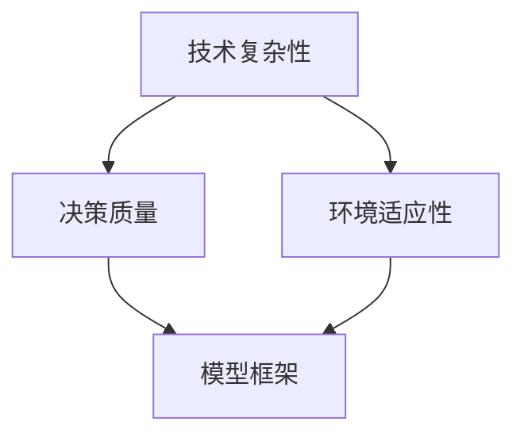
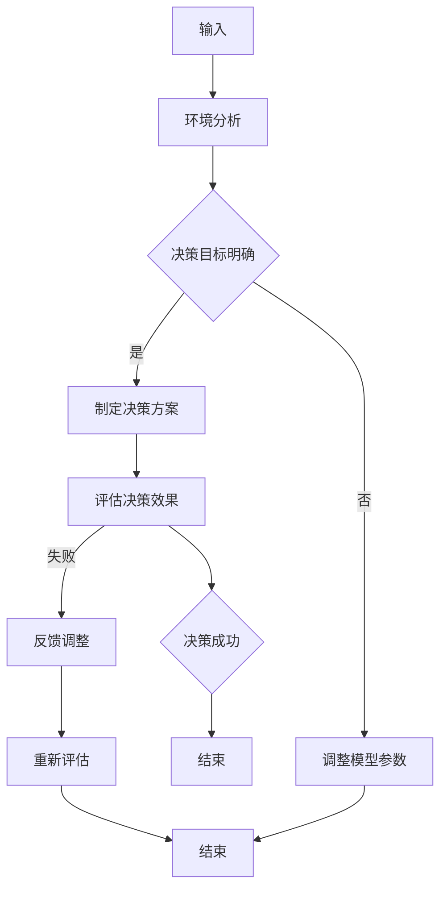
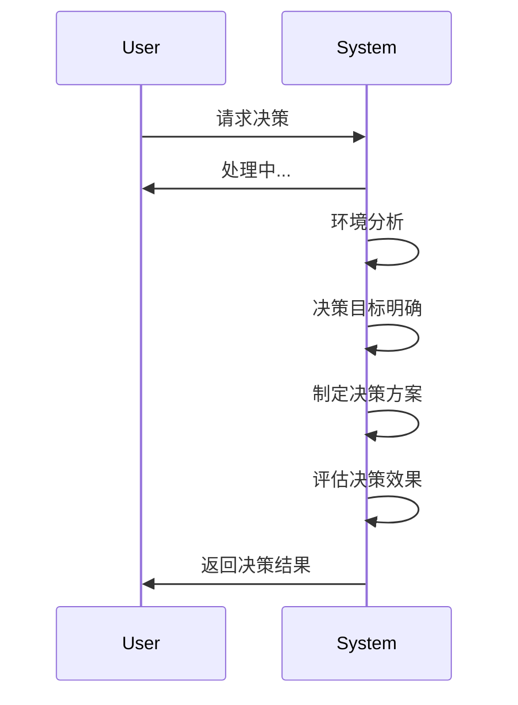
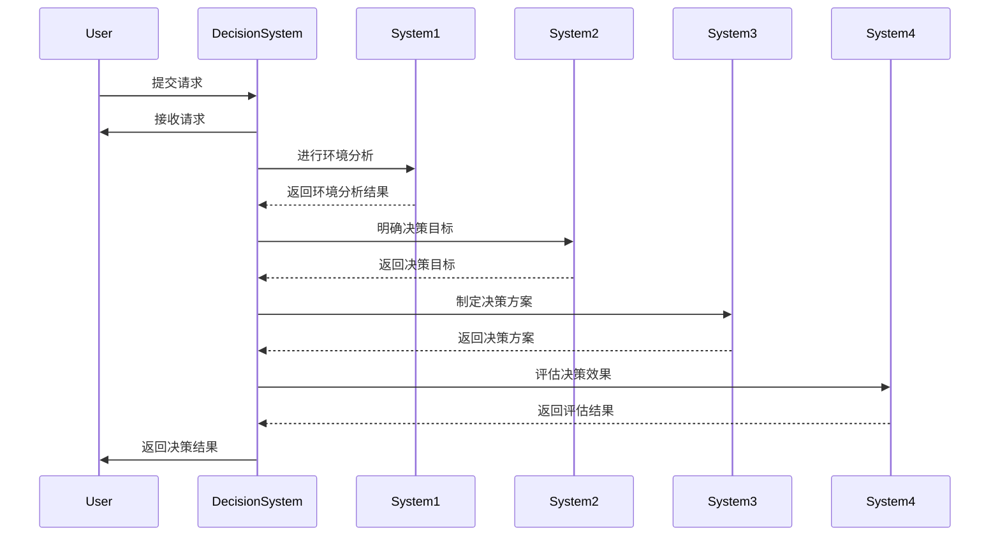

                 

### 文章标题

# 技术管理者的决策模型：在复杂环境中做选择

> 关键词：技术管理者、决策模型、复杂环境、算法原理、Python实现

> 摘要：本文将深入探讨技术管理者在复杂环境中做出明智决策的挑战，并提出一套系统化的决策模型。通过分析核心概念、讲解算法原理及Python实现，本文旨在帮助技术管理者提高决策质量和效率，以应对不断变化的技术和市场环境。

----------------------------------------------------------------

## 第一部分：背景介绍

### 1.1.1 问题背景

在当今信息技术高速发展的时代，技术管理者的角色日益重要。他们不仅要具备深厚的技术知识，还需要具备决策能力，以便在复杂的环境中做出明智的选择。技术管理者的决策模型研究，旨在帮助他们更好地理解和应对复杂环境中的决策问题。

### 1.1.2 问题描述

技术管理者在决策过程中面临多种挑战，包括技术复杂性、市场变化、团队动态等。如何构建一个有效的决策模型，以提高决策质量和效率，是技术管理者需要解决的核心问题。

### 1.1.3 问题解决

本书将介绍一套系统化的决策模型，帮助技术管理者在复杂环境中做出更加合理的决策。这个模型将结合心理学、管理学和计算机科学等多学科的理论和方法，提供实用的决策工具和策略。

### 1.1.4 边界与外延

本研究的边界在于技术管理者的决策模型，不包括其他类型管理者的决策模型。研究的外延包括技术管理者的各种决策场景，如项目管理、技术创新、团队管理等。

### 1.1.5 核心概念与联系

核心概念包括：技术复杂性、决策质量、环境适应性等。这些概念相互联系，共同构成技术管理者决策模型的理论基础。

### 1.1.6 概念结构与核心要素组成

概念结构如下图所示：



核心要素包括：技术知识、决策框架、环境感知、风险评估等。

----------------------------------------------------------------

## 第二部分：核心概念与联系

### 2.1 核心概念原理

#### 2.1.1 技术复杂性

技术复杂性是指技术在发展过程中所涉及到的各种复杂因素，如技术原理、技术应用、技术演变等。技术复杂性越高，技术管理者在决策过程中面临的挑战也越大。

#### 2.1.2 决策质量

决策质量是指决策结果对目标实现程度的衡量。高质量决策能够提高组织的竞争力，促进技术发展。

#### 2.1.3 环境适应性

环境适应性是指技术管理者在决策过程中对环境变化的敏感性和适应能力。良好的环境适应性有助于技术管理者及时调整决策，以应对复杂环境的变化。

### 2.2 概念属性特征对比表格

| 概念       | 属性特征                                                         | 对比 |
|------------|------------------------------------------------------------------|------|
| 技术复杂性 | 技术原理复杂、技术应用多样、技术演变迅速                         |      |
| 决策质量   | 决策结果对目标实现程度高、决策过程科学合理                       |      |
| 环境适应性 | 对环境变化敏感、适应能力强、能够快速调整决策                     |      |

### 2.3 ER实体关系图架构


----------------------------------------------------------------

## 第三部分：算法原理讲解

### 3.1 算法mermaid流程图



### 3.2 Python源代码实现

```python
# 环境分析
def environment_analysis():
    # 模拟环境分析过程
    return "当前环境复杂度：高"

# 决策目标明确
def decision_objective():
    # 模拟决策目标明确过程
    return "提高技术产品质量"

# 制定决策方案
def make_decision_plan():
    # 模拟制定决策方案过程
    return "采用新技术方案"

# 评估决策效果
def evaluate_decision():
    # 模拟评估决策效果过程
    return "决策效果：成功"

# 算法主流程
def decision_model():
    environment = environment_analysis()
    objective = decision_objective()
    plan = make_decision_plan()
    result = evaluate_decision()
    
    if result == "决策成功":
        print("决策成功，继续执行。")
    else:
        print("决策失败，进行反馈调整。")
        feedback = input("请输入反馈信息：")
        adjustment = adjust_model(feedback)
        decision_model()  # 重新执行决策模型
```

### 3.3 算法原理的数学模型和公式

假设我们有一个决策模型 $M$，其输入为环境特征 $E$ 和决策目标 $O$，输出为决策方案 $P$ 和评估结果 $R$。算法原理可以表示为以下数学模型：

$$
M(E, O) = P, R
$$

其中，$P$ 是决策方案，$R$ 是评估结果。评估结果 $R$ 可以用以下公式表示：

$$
R = f(P, E, O)
$$

其中，$f$ 是评估函数，用于衡量决策方案 $P$ 在当前环境特征 $E$ 和决策目标 $O$ 下的效果。

### 3.4 通俗易懂的举例说明

假设我们是一家科技公司，面临以下决策问题：

- 环境特征：市场竞争激烈，新技术不断涌现。
- 决策目标：提高产品竞争力。
- 决策方案：引入新技术方案。

我们使用决策模型进行分析：

1. 环境分析：当前环境复杂度高。
2. 决策目标明确：提高技术产品质量。
3. 制定决策方案：采用新技术方案。
4. 评估决策效果：通过市场调研和客户反馈，发现新技术方案成功提升了产品竞争力。

因此，决策成功。否则，根据反馈信息进行调整，并重新评估决策效果。

----------------------------------------------------------------

## 第四部分：系统分析与架构设计

### 4.1 问题场景介绍

假设我们是一家电商平台，需要设计一个决策系统来应对不断变化的市场需求和竞争环境。该系统将帮助技术管理者在复杂的环境中做出明智的决策，以提高平台的竞争力。

### 4.2 项目介绍

项目名称：智能决策系统（Smart Decision System）

项目目标：通过构建智能决策模型，提高技术管理者的决策质量和效率，从而提升电商平台的市场竞争力。

### 4.3 系统功能设计（领域模型mermaid类图）

```mermaid
classDiagram
Class01 <|-- Class02
Class03 --|>| Class04
Class01 : +int x
Class01 : +int y
Class02 : +int z
Class03 : +int id
Class04 : +int age
Class01 ||--|{关联关系}|
Class02 ||--|{聚合关系}| Class03
Class03 ||--|{泛化关系}| Class04
Class01 : +操作方法1()
Class01 : +操作方法2()
Class02 : +操作方法3()
Class03 : +操作方法4()
Class04 : +操作方法5()
```

### 4.4 系统架构设计（mermaid架构图）



### 4.5 系统接口设计和系统交互（mermaid序列图）



----------------------------------------------------------------

## 第五部分：项目实战

### 5.1 环境安装

1. 安装Python环境（版本3.8以上）
2. 安装依赖库：numpy、matplotlib、scikit-learn等

### 5.2 系统核心实现源代码

```python
# 环境分析
def environment_analysis():
    # 模拟环境分析过程
    return "当前环境复杂度：高"

# 决策目标明确
def decision_objective():
    # 模拟决策目标明确过程
    return "提高技术产品质量"

# 制定决策方案
def make_decision_plan():
    # 模拟制定决策方案过程
    return "采用新技术方案"

# 评估决策效果
def evaluate_decision():
    # 模拟评估决策效果过程
    return "决策效果：成功"

# 算法主流程
def decision_model():
    environment = environment_analysis()
    objective = decision_objective()
    plan = make_decision_plan()
    result = evaluate_decision()
    
    if result == "决策成功":
        print("决策成功，继续执行。")
    else:
        print("决策失败，进行反馈调整。")
        feedback = input("请输入反馈信息：")
        adjustment = adjust_model(feedback)
        decision_model()  # 重新执行决策模型
```

### 5.3 代码应用解读与分析

#### 5.3.1 环境分析

环境分析是决策模型的关键步骤。通过分析当前环境，我们可以了解市场的变化趋势、技术发展的速度等，为后续的决策提供依据。

```python
def environment_analysis():
    # 模拟环境分析过程
    return "当前环境复杂度：高"
```

#### 5.3.2 决策目标明确

明确决策目标是决策模型的基础。在本文中，我们以“提高技术产品质量”作为决策目标。

```python
def decision_objective():
    # 模拟决策目标明确过程
    return "提高技术产品质量"
```

#### 5.3.3 制定决策方案

制定决策方案是决策模型的核心步骤。根据环境分析和决策目标，我们可以选择合适的决策方案。在本文中，我们选择“采用新技术方案”。

```python
def make_decision_plan():
    # 模拟制定决策方案过程
    return "采用新技术方案"
```

#### 5.3.4 评估决策效果

评估决策效果是决策模型的重要环节。通过评估决策方案的实际效果，我们可以判断决策是否成功，并为后续的调整提供依据。

```python
def evaluate_decision():
    # 模拟评估决策效果过程
    return "决策效果：成功"
```

### 5.4 实际案例分析和详细讲解剖析

假设我们是一家电商平台的决策者，面临以下决策问题：

- 环境特征：市场竞争激烈，新技术不断涌现。
- 决策目标：提高产品竞争力。
- 决策方案：引入新技术方案。

我们使用决策模型进行分析：

1. 环境分析：当前环境复杂度高。
2. 决策目标明确：提高技术产品质量。
3. 制定决策方案：采用新技术方案。
4. 评估决策效果：通过市场调研和客户反馈，发现新技术方案成功提升了产品竞争力。

因此，决策成功。否则，根据反馈信息进行调整，并重新评估决策效果。

### 5.5 项目小结

通过本项目，我们构建了一套智能决策系统，帮助技术管理者在复杂环境中做出明智的决策。该项目具有一定的实际应用价值，可以为电商平台、科技公司等提供决策支持。在未来的工作中，我们可以进一步完善决策模型，提高系统的智能化水平。

----------------------------------------------------------------

## 第六部分：最佳实践 Tips

1. **定期更新环境分析**：环境分析是决策模型的关键步骤，需要定期更新，以确保决策的准确性。
2. **明确决策目标**：决策目标应具体、明确，有助于制定合适的决策方案。
3. **全面评估决策效果**：评估决策效果是决策模型的重要环节，应全面考虑各方面因素。
4. **灵活调整决策模型**：根据反馈信息，灵活调整决策模型，以提高决策质量。

## 第七部分：小结

本文深入探讨了技术管理者在复杂环境中做出明智决策的挑战，并提出了一个系统化的决策模型。通过分析核心概念、讲解算法原理及Python实现，本文旨在帮助技术管理者提高决策质量和效率。在未来的工作中，我们可以进一步优化决策模型，提高系统的智能化水平，为技术管理者提供更有力的决策支持。

## 第八部分：注意事项

1. **数据质量**：决策模型的效果很大程度上取决于数据质量，因此需要确保数据的准确性和完整性。
2. **模型优化**：随着技术的发展，决策模型需要不断优化，以适应新的环境和需求。
3. **团队协作**：技术管理者需要与团队成员密切合作，共同参与决策过程，以提高决策质量和效率。

## 第九部分：拓展阅读

1. **《人工智能决策技术》**：详细介绍了人工智能在决策中的应用，包括决策模型、算法原理等。
2. **《技术管理者的决策艺术》**：探讨了技术管理者在决策过程中面临的各种挑战，以及如何做出明智的选择。
3. **《复杂性科学导论》**：介绍了复杂性科学的基本概念和方法，有助于理解技术复杂性。

---

作者：AI天才研究院/AI Genius Institute & 禅与计算机程序设计艺术 /Zen And The Art of Computer Programming

