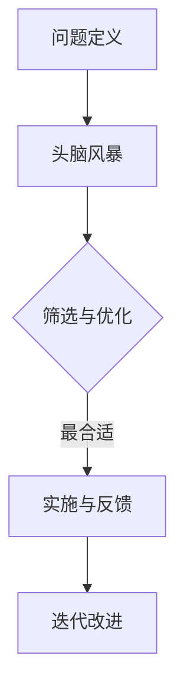
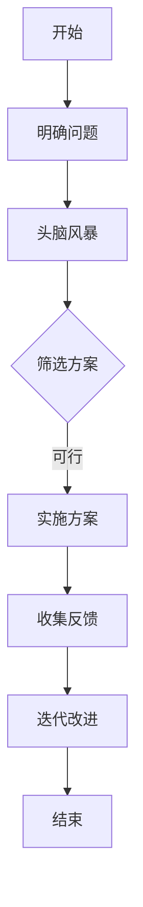

                 

### 技术管理者的创新思维：培养团队创造力

> 关键词：技术管理者，创新思维，团队创造力，培养策略

摘要：
在现代技术领域中，技术管理者不仅需要具备强大的技术背景，更需要拥有出色的创新思维，以推动团队创造力的提升。本文将从技术管理者的角色出发，深入探讨创新思维的重要性，以及如何通过一系列策略和实践活动，培养团队的创造力。

### 目录大纲设计思路

为了设计出一份清晰、详尽且符合要求的《技术管理者的创新思维：培养团队创造力》的目录大纲，我们将遵循以下步骤：

1. **确定书的核心内容和结构**：分析书名，明确书籍的主题是关于技术管理者的创新思维培养。确定书籍的目标读者群体，如技术团队领导、项目经理等。从书名出发，梳理出核心概念和需要覆盖的主要主题。

2. **设计章节划分**：初步确定章节划分，确保包含背景介绍、核心概念与联系、算法原理讲解、数学模型与公式、系统分析与架构设计、项目实战等关键内容。每个章节细化到子标题，确保内容的全面性和逻辑性。

3. **调整目录结构**：遵循 1 级目录、2 级目录、3 级目录的结构，确保目录层级清晰。根据内容的优先级和逻辑顺序调整章节和子章节的位置。

4. **检查内容完整性**：确保所有章节都包含了核心概念、联系、算法原理、数学模型、系统分析与架构设计、项目实战等必要内容。验证每个章节的标题和子标题是否准确、简洁。

5. **审核目录字数**：计算目录大纲的总字数，确保不超过 2000 字。

### 目录大纲设计示例

#### 第一部分：引言

##### 1.1 问题背景与定义

###### 1.1.1 技术管理者角色分析

###### 1.1.2 创新思维的重要性

###### 1.1.3 团队创造力的培养策略

#### 第二部分：核心概念与联系

##### 2.1 创新思维的核心概念

###### 2.1.1 定义与分类

###### 2.1.2 创新思维的特点

###### 2.1.3 创新思维与其他管理思维的关系

##### 2.2 团队创造力与个体创新

###### 2.2.1 团队创造力的构成

###### 2.2.2 个体创新与团队创造力的互动关系

###### 2.2.3 团队创造力提升策略

#### 第三部分：培养团队创造力

##### 3.1 团队建设与氛围营造

###### 3.1.1 团队建设的重要性

###### 3.1.2 营造积极创新氛围的方法

###### 3.1.3 团队文化建设

##### 3.2 创新思维训练方法

###### 3.2.1 个人创新思维训练

###### 3.2.2 团队创新思维训练

###### 3.2.3 创新思维训练工具与技巧

##### 3.3 案例分析

###### 3.3.1 成功案例分析

###### 3.3.2 失败案例分析

###### 3.3.3 从案例中学习

#### 第四部分：算法原理与数学模型

##### 4.1 创新思维算法原理

###### 4.1.1 创新思维算法概述

###### 4.1.2 算法工作原理

###### 4.1.3 算法流程图

##### 4.2 数学模型与公式

###### 4.2.1 创新思维数学模型

$$
f(x) = \alpha \cdot (1 - e^{-\beta \cdot x})
$$

###### 4.2.2 公式解释与推导

###### 4.2.3 公式应用举例

#### 第五部分：系统分析与架构设计

##### 5.1 创新思维系统功能设计

###### 5.1.1 系统介绍

###### 5.1.2 系统功能模块划分

###### 5.1.3 功能模块详细说明

##### 5.2 创新思维系统架构设计

###### 5.2.1 系统架构概述

###### 5.2.2 架构设计细节

###### 5.2.3 系统接口设计与交互

##### 5.3 系统接口设计与交互

###### 5.3.1 接口定义与实现

###### 5.3.2 系统交互流程

###### 5.3.3 交互图示例

#### 第六部分：项目实战

##### 6.1 环境安装与配置

###### 6.1.1 环境准备

###### 6.1.2 系统安装步骤

###### 6.1.3 常见问题与解决方案

##### 6.2 系统核心实现

###### 6.2.1 源代码解读

###### 6.2.2 代码实现细节

###### 6.2.3 实现效果与分析

##### 6.3 实际案例分析与讲解

###### 6.3.1 案例背景

###### 6.3.2 案例分析与解决

###### 6.3.3 案例总结与启示

#### 第七部分：最佳实践与总结

##### 7.1 最佳实践 Tips

###### 7.1.1 提升创新思维的建议

###### 7.1.2 团队创造力的培养技巧

###### 7.1.3 创新思维应用的场景选择

##### 7.2 小结与展望

### 第一部分：引言

#### 1.1 问题背景与定义

##### 技术管理者角色分析

技术管理者在IT行业中扮演着至关重要的角色，他们不仅要具备深厚的技术背景，还需具备卓越的管理能力和创新思维。技术管理者的职责不仅仅是确保项目的顺利进行，还包括引领团队创新，推动技术进步。因此，技术管理者需要具备以下几种核心能力：

1. **技术领导力**：能够指导团队解决复杂的技术问题，推动技术发展方向。
2. **项目管理能力**：合理规划项目进度，确保项目按时完成。
3. **沟通协调能力**：有效沟通项目目标，协调团队成员之间的工作。
4. **创新思维**：能够激发团队的创造力，推动技术创新。

##### 创新思维的重要性

在快速发展的技术领域，创新思维成为推动企业发展和竞争力的关键因素。对于技术管理者来说，具备创新思维意味着能够：

1. **发现新机遇**：通过创新思维，技术管理者可以发现新的业务需求和市场机会。
2. **解决问题**：面对复杂的技术难题，创新思维可以帮助技术管理者找到独特的解决方案。
3. **提高效率**：创新思维能够优化现有流程，提高团队工作效率。
4. **增强团队凝聚力**：通过激发团队的创造力，增强团队凝聚力，提升整体业绩。

##### 团队创造力的培养策略

团队创造力是企业成功的重要因素之一。技术管理者可以通过以下策略来培养团队创造力：

1. **团队建设**：通过团队建设活动，增强团队成员之间的信任和协作。
2. **提供资源和支持**：确保团队成员有足够的资源和时间进行创新尝试。
3. **营造积极创新氛围**：鼓励团队成员勇于尝试，接受失败，从失败中学习。
4. **创新思维训练**：定期进行创新思维训练，提升团队成员的创新意识。

#### 1.2 核心概念与联系

##### 创新思维的核心概念

创新思维是指能够产生新想法、新方案和新方法的能力。它包括以下几个方面：

1. **发散思维**：从不同角度思考问题，产生多种可能的解决方案。
2. **聚合思维**：将不同的想法和方案整合，形成最优解决方案。
3. **类比思维**：通过类比其他领域的问题，寻找解决方案。
4. **逆向思维**：从相反的角度思考问题，发现新的解决方案。

##### 团队创造力与个体创新

团队创造力是指团队整体产生的创新能力和成果。它包括以下几个方面：

1. **个体创新**：团队成员个人的创新能力。
2. **团队互动**：团队成员之间的协作和互动，促进创新的产生。
3. **共同目标**：团队成员共同追求创新目标，形成合力。

#### 1.3 团队创造力的培养策略

为了培养团队的创造力，技术管理者可以采取以下策略：

1. **团队建设**：通过团队活动，增强团队成员之间的信任和协作。
2. **提供资源和支持**：确保团队成员有足够的资源和时间进行创新尝试。
3. **营造积极创新氛围**：鼓励团队成员勇于尝试，接受失败，从失败中学习。
4. **创新思维训练**：定期进行创新思维训练，提升团队成员的创新意识。

### 第二部分：核心概念与联系

#### 2.1 创新思维的核心概念

创新思维是指能够产生新想法、新方案和新方法的能力。它包括以下几个方面：

1. **发散思维**：从不同角度思考问题，产生多种可能的解决方案。
2. **聚合思维**：将不同的想法和方案整合，形成最优解决方案。
3. **类比思维**：通过类比其他领域的问题，寻找解决方案。
4. **逆向思维**：从相反的角度思考问题，发现新的解决方案。

#### 2.2 团队创造力与个体创新

团队创造力是指团队整体产生的创新能力和成果。它包括以下几个方面：

1. **个体创新**：团队成员个人的创新能力。
2. **团队互动**：团队成员之间的协作和互动，促进创新的产生。
3. **共同目标**：团队成员共同追求创新目标，形成合力。

为了更好地理解团队创造力与个体创新的关系，我们可以通过一个简单的ER实体关系图来表示：

```mermaid
erDiagram
    ID --> Person : "has"
    Team --> ID : "is part of"
    Idea --> Person : "generates"
    Idea --> Team : "is part of"
    Solution --> Idea : "derived from"
    Result --> Solution : "produced by"
```

在这个ER图模型中，`Person` 代表个体，`Team` 代表团队，`Idea` 代表创新想法，`Solution` 代表解决方案，`Result` 代表最终成果。每个个体都可以产生多个创新想法，这些想法可以构成一个团队的共同智慧，通过协作和整合，形成解决方案，最终产生实际成果。

#### 2.3 创新思维与其他管理思维的关系

创新思维是技术管理者必须具备的核心能力之一，但它与其他管理思维密切相关，相互作用。以下是创新思维与其他管理思维之间的关系：

1. **决策思维**：创新思维是决策思维的基础。在面临复杂问题时，创新思维可以帮助技术管理者从多个角度分析问题，做出更明智的决策。
2. **系统思维**：创新思维强调全局观念，要求技术管理者从系统角度看待问题，通过系统优化实现创新。
3. **人本思维**：创新思维注重人的作用，强调激发团队成员的创造力，实现团队整体创新。
4. **战略思维**：创新思维是战略思维的重要组成部分。技术管理者需要通过创新思维制定长期战略，推动企业持续发展。

#### 2.4 团队创造力的构成

团队创造力是由多个因素共同作用形成的。以下是团队创造力的主要构成因素：

1. **团队结构**：合理的团队结构有助于激发团队成员的创造力。例如，跨职能团队能够通过不同领域专家的协作，产生更多创新想法。
2. **团队氛围**：积极、开放的团队氛围有利于团队成员勇于尝试新想法，从而推动团队创造力。
3. **领导风格**：技术管理者的领导风格对团队创造力有重要影响。鼓励型领导风格能够激发团队成员的创新热情。
4. **团队成员素质**：团队成员的素质，如技能、经验、知识等，直接影响团队创造力。

通过一个简单的ER图，我们可以更直观地了解团队创造力的构成：

```mermaid
erDiagram
    Team --> Leader : "led by"
    Team --> Member : "has"
    Member --> Skill : "has"
    Team --> Culture : "has"
    Team --> Environment : "operates in"
    Team --> Result : "produces"
```

在这个ER图中，`Leader` 代表技术管理者，`Member` 代表团队成员，`Skill` 代表成员的技能，`Culture` 代表团队文化，`Environment` 代表团队运营环境，`Result` 代表团队创造的实际成果。每个元素都相互关联，共同影响团队创造力。

### 第三部分：培养团队创造力

#### 3.1 团队建设与氛围营造

##### 3.1.1 团队建设的重要性

团队建设是培养团队创造力的重要一环。通过团队建设活动，可以增强团队成员之间的信任和协作，提高团队凝聚力。以下是团队建设的重要性：

1. **增强团队凝聚力**：通过团队建设，团队成员能够更好地了解彼此，建立信任，提高团队的凝聚力。
2. **提升团队协作效率**：良好的团队建设有助于团队成员形成协同工作的习惯，提高协作效率。
3. **激发团队创造力**：团队建设活动能够激发团队成员的创新思维，促进团队创造力的提升。

##### 3.1.2 营造积极创新氛围的方法

为了培养团队创造力，技术管理者需要营造一个积极创新的工作氛围。以下是一些方法：

1. **鼓励尝试与失败**：技术管理者应该鼓励团队成员勇于尝试新想法，即使失败也是一次宝贵的经验。
2. **建立反馈机制**：技术管理者需要建立一个有效的反馈机制，鼓励团队成员分享自己的想法和改进意见。
3. **提供资源支持**：技术管理者应该为团队成员提供足够的资源和支持，让他们有足够的时间和精力进行创新尝试。

##### 3.1.3 团队文化建设

团队文化是团队建设的核心要素之一。一个积极向上的团队文化能够激发团队成员的创造力，促进团队创新。以下是团队文化建设的方法：

1. **明确价值观**：技术管理者需要明确团队的价值观，并将其融入到团队日常工作中。
2. **树立榜样**：技术管理者应该树立榜样，通过自己的行为来影响团队成员。
3. **鼓励开放沟通**：技术管理者应该鼓励团队成员之间的开放沟通，让他们能够自由表达自己的想法。

#### 3.2 创新思维训练方法

##### 3.2.1 个人创新思维训练

个人创新思维训练是培养团队创造力的基础。以下是一些个人创新思维训练的方法：

1. **思维导图**：通过绘制思维导图，可以帮助团队成员梳理思路，激发创新思维。
2. **头脑风暴**：定期进行头脑风暴活动，鼓励团队成员自由发表自己的想法。
3. **案例学习**：通过学习成功案例和失败案例，可以启发团队成员的创新思维。

##### 3.2.2 团队创新思维训练

团队创新思维训练是提升团队整体创造力的关键。以下是一些团队创新思维训练的方法：

1. **角色扮演**：通过角色扮演，团队成员可以模拟不同的场景，探讨创新解决方案。
2. **团队竞赛**：组织团队竞赛，鼓励团队成员积极参与，提升团队创造力。
3. **跨职能合作**：通过跨职能合作，不同领域的专家可以相互启发，产生更多创新想法。

##### 3.2.3 创新思维训练工具与技巧

为了更有效地进行创新思维训练，技术管理者可以借助一些工具和技巧：

1. **SWOT分析**：通过SWOT分析，可以帮助团队成员从不同角度思考问题，找到创新的切入点。
2. **6顶帽思考法**：通过6顶帽思考法，可以引导团队成员从不同角度分析问题，形成全面的解决方案。
3. **TRIZ理论**：TRIZ理论提供了一套系统的创新方法，可以帮助技术管理者解决复杂的技术难题。

### 3.3 案例分析

##### 3.3.1 成功案例分析

**案例：谷歌的20%时间项目**

谷歌的20%时间项目是一个典型的成功案例。谷歌允许员工将20%的工作时间用于自己感兴趣的项目。这一政策激发了员工的创造力，产生了许多谷歌的经典产品，如Gmail和Google News。以下是这个案例的几个关键点：

1. **鼓励自由探索**：谷歌鼓励员工自由探索新的想法，不限制他们的研究方向。
2. **提供资源支持**：谷歌为员工提供足够的资源和支持，让他们有充足的时间进行创新尝试。
3. **开放沟通与反馈**：谷歌建立了一个开放的沟通环境，鼓励员工分享自己的想法和进展，同时接受同事的反馈。

##### 3.3.2 失败案例分析

**案例：诺基亚的变革困境**

诺基亚曾是手机行业的领导者，但在面对智能手机的兴起时，未能及时变革，最终导致市场份额大幅下降。以下是这个案例的几个关键点：

1. **保守的领导风格**：诺基亚的领导层过于保守，不愿接受新思想，导致公司无法适应市场变化。
2. **缺乏创新思维训练**：诺基亚的员工缺乏创新思维训练，无法产生新的创新想法。
3. **资源分配不均**：诺基亚将大量资源投入到已有产品的改进，而忽视了新兴市场和新技术的投资。

##### 3.3.3 从案例中学习

通过成功和失败的案例，我们可以得出以下启示：

1. **鼓励创新思维**：技术管理者应该鼓励员工创新，提供必要的资源和支持。
2. **重视团队建设**：通过团队建设，增强团队凝聚力，提高团队创造力。
3. **灵活应对变化**：技术管理者需要具备灵活的领导风格，及时适应市场变化，推动公司变革。

### 第四部分：算法原理与数学模型

#### 4.1 创新思维算法原理

创新思维算法是指用于激发和引导创新思维的一系列方法和工具。以下是一个简单的创新思维算法概述：

1. **问题定义**：明确需要解决的问题或挑战。
2. **头脑风暴**：组织团队成员进行头脑风暴，产生尽可能多的解决方案。
3. **筛选与优化**：对头脑风暴产生的解决方案进行筛选和优化，选出最可行的方案。
4. **实施与反馈**：将选定的解决方案付诸实施，并收集反馈，不断迭代改进。

#### 4.1.2 算法工作原理

创新思维算法的工作原理主要基于以下几个步骤：

1. **问题定义**：通过明确问题，确保团队成员对问题有共同的理解。
2. **头脑风暴**：利用头脑风暴，激发团队成员的创造力，产生多种可能的解决方案。
3. **筛选与优化**：对解决方案进行评估和筛选，选择最合适的方案进行深入研究和实施。
4. **实施与反馈**：将解决方案付诸实施，通过反馈机制不断优化和完善。

以下是一个简单的算法流程图：



#### 4.1.3 算法流程图

为了更直观地理解创新思维算法的工作流程，我们可以绘制一个算法流程图：



#### 4.2 数学模型与公式

在创新思维过程中，数学模型和公式可以用来描述和评估创新方案的有效性。以下是一个简单的创新思维数学模型：

$$
f(x) = \alpha \cdot (1 - e^{-\beta \cdot x})
$$

其中，$f(x)$ 表示创新方案的得分，$\alpha$ 表示初始得分，$\beta$ 表示衰减系数，$x$ 表示创新方案的实施时间。

#### 4.2.2 公式解释与推导

该公式的含义如下：

1. **初始得分**：$\alpha$ 表示创新方案在初始阶段获得的得分，反映了方案的创新性和可行性。
2. **衰减系数**：$\beta$ 表示创新方案随时间推移的衰减速度，反映了方案的时效性和稳定性。
3. **实施时间**：$x$ 表示创新方案的实施时间，反映了方案的进展情况。

公式的推导如下：

1. **初始状态**：当 $x=0$ 时，$f(x)=\alpha$，表示创新方案在初始阶段获得的得分。
2. **衰减过程**：当 $x$ 增加时，$e^{-\beta \cdot x}$ 的值逐渐减小，导致 $f(x)$ 的值逐渐降低，反映了创新方案随着时间的推移逐渐失去效果。
3. **得分计算**：$f(x)$ 的值介于 0 和 1 之间，表示创新方案的有效性。当 $f(x)$ 接近 1 时，表示方案非常有效；当 $f(x)$ 接近 0 时，表示方案效果较差。

#### 4.2.3 公式应用举例

假设一个创新方案在初始阶段获得的得分为 0.8，衰减系数为 0.1，实施时间为 6 个月。我们可以使用该公式计算该方案在实施 6 个月后的得分：

$$
f(6) = 0.8 \cdot (1 - e^{-0.1 \cdot 6}) \approx 0.624
$$

根据计算结果，该方案在实施 6 个月后的得分约为 0.624，表明方案的有效性有所下降，但仍具有一定的价值。

### 第五部分：系统分析与架构设计

#### 5.1 创新思维系统功能设计

##### 5.1.1 系统介绍

创新思维系统是一个用于激发和培养团队创新能力的软件平台。该系统通过提供一系列工具和功能，帮助团队成员进行创新思维训练，提高团队创造力。

##### 5.1.2 系统功能模块划分

创新思维系统可以分为以下几个功能模块：

1. **问题定义模块**：用于明确需要解决的问题或挑战。
2. **头脑风暴模块**：用于组织团队成员进行头脑风暴，产生多种可能的解决方案。
3. **筛选与优化模块**：用于对头脑风暴产生的解决方案进行筛选和优化。
4. **实施方案模块**：用于将选定的解决方案付诸实施。
5. **反馈与迭代模块**：用于收集反馈，不断迭代改进方案。

##### 5.1.3 功能模块详细说明

1. **问题定义模块**：该模块提供问题定义的功能，包括问题输入、问题描述、问题分析等。通过明确问题，确保团队成员对问题有共同的理解。

2. **头脑风暴模块**：该模块提供头脑风暴的功能，包括主题设定、时间控制、记录管理、投票机制等。通过头脑风暴，激发团队成员的创造力，产生多种可能的解决方案。

3. **筛选与优化模块**：该模块提供筛选与优化功能，包括评分机制、筛选标准、优化算法等。通过对头脑风暴产生的解决方案进行评估和筛选，选择最合适的方案进行深入研究和实施。

4. **实施方案模块**：该模块提供实施方案的功能，包括任务分配、进度跟踪、资源管理、风险评估等。通过将选定的解决方案付诸实施，确保方案能够顺利推进。

5. **反馈与迭代模块**：该模块提供反馈与迭代功能，包括反馈收集、结果分析、迭代优化等。通过收集反馈，不断迭代改进方案，确保方案的持续优化和改进。

#### 5.2 创新思维系统架构设计

##### 5.2.1 系统架构概述

创新思维系统的架构设计采用模块化设计原则，分为前端、后端和数据库三个部分。前端负责用户界面设计，后端负责业务逻辑处理，数据库负责数据存储和管理。

##### 5.2.2 架构设计细节

1. **前端**：前端采用单页面应用（SPA）架构，使用Vue.js框架实现。前端包括登录界面、问题定义界面、头脑风暴界面、筛选与优化界面、实施方案界面和反馈与迭代界面等。

2. **后端**：后端采用微服务架构，使用Spring Boot框架实现。后端包括用户管理服务、问题管理服务、头脑风暴服务、筛选与优化服务、实施方案服务和反馈与迭代服务等。

3. **数据库**：数据库采用关系型数据库，使用MySQL实现。数据库包括用户表、问题表、解决方案表、评分表、任务表和反馈表等。

##### 5.2.3 系统接口设计与交互

创新思维系统通过一系列接口实现前端与后端的交互。以下是主要接口及其功能：

1. **用户管理接口**：用于用户登录、注册、修改密码等操作。
2. **问题管理接口**：用于问题定义、问题列表、问题详情等操作。
3. **头脑风暴接口**：用于头脑风暴主题设定、时间控制、记录管理、投票等操作。
4. **筛选与优化接口**：用于方案筛选、评分、筛选标准设置等操作。
5. **实施方案接口**：用于任务分配、进度跟踪、资源管理、风险评估等操作。
6. **反馈与迭代接口**：用于反馈收集、结果分析、迭代优化等操作。

系统交互流程如下：

1. **用户登录**：用户通过前端登录界面提交用户名和密码，后端验证用户身份，返回登录结果。
2. **问题定义**：用户在问题定义界面输入问题描述，后端保存问题信息。
3. **头脑风暴**：用户在头脑风暴界面输入主题，开始头脑风暴，后端记录头脑风暴记录。
4. **筛选与优化**：用户在筛选与优化界面选择筛选标准，对方案进行筛选和优化。
5. **实施方案**：用户在实施方案界面分配任务，设置进度和资源，后端保存任务信息。
6. **反馈与迭代**：用户在反馈与迭代界面提交反馈，后端记录反馈信息，并进行分析和迭代优化。

### 第六部分：项目实战

#### 6.1 环境安装与配置

##### 6.1.1 环境准备

在开始安装和配置创新思维系统之前，需要准备以下环境：

1. **操作系统**：Linux或Windows。
2. **数据库**：MySQL。
3. **后端框架**：Spring Boot。
4. **前端框架**：Vue.js。

##### 6.1.2 系统安装步骤

1. **安装操作系统**：根据个人需求选择Linux或Windows操作系统，并安装到计算机上。
2. **安装数据库**：在操作系统上安装MySQL数据库，并配置数据库服务。
3. **安装后端框架**：在操作系统上安装Java开发环境，并使用Spring Boot框架创建后端项目。
4. **安装前端框架**：在操作系统上安装Node.js和npm，并使用Vue CLI创建前端项目。

##### 6.1.3 常见问题与解决方案

1. **问题**：安装过程中遇到依赖问题，如找不到某些依赖库。
   **解决方案**：检查网络连接，确保可以从官方源下载依赖库。如果问题仍然存在，尝试更新npm和yarn等包管理工具。

2. **问题**：数据库连接失败，无法访问数据库。
   **解决方案**：检查数据库服务是否启动，确保数据库端口（默认为3306）未被占用。检查数据库配置文件，确保配置正确。

3. **问题**：项目启动失败，出现编译错误。
   **解决方案**：检查项目代码，确保语法正确。检查项目依赖，确保所有依赖都已正确安装。

#### 6.2 系统核心实现

##### 6.2.1 源代码解读

创新思维系统的核心实现包括以下几个方面：

1. **用户管理模块**：实现用户注册、登录、修改密码等功能。
2. **问题管理模块**：实现问题定义、问题列表、问题详情等功能。
3. **头脑风暴模块**：实现头脑风暴主题设定、时间控制、记录管理、投票等功能。
4. **筛选与优化模块**：实现方案筛选、评分、筛选标准设置等功能。
5. **实施方案模块**：实现任务分配、进度跟踪、资源管理、风险评估等功能。
6. **反馈与迭代模块**：实现反馈收集、结果分析、迭代优化等功能。

以下是用户管理模块的源代码示例：

```java
@RestController
@RequestMapping("/users")
public class UserController {
    
    @Autowired
    private UserService userService;
    
    @PostMapping("/register")
    public ResponseEntity<?> registerUser(@RequestBody User user) {
        try {
            User savedUser = userService.registerUser(user);
            return ResponseEntity.ok(savedUser);
        } catch (Exception e) {
            return ResponseEntity.status(HttpStatus.BAD_REQUEST).body("注册失败：" + e.getMessage());
        }
    }
    
    @PostMapping("/login")
    public ResponseEntity<?> loginUser(@RequestBody LoginRequest loginRequest) {
        try {
            User user = userService.loginUser(loginRequest.getUsername(), loginRequest.getPassword());
            return ResponseEntity.ok(user);
        } catch (Exception e) {
            return ResponseEntity.status(HttpStatus.UNAUTHORIZED).body("登录失败：" + e.getMessage());
        }
    }
}
```

##### 6.2.2 代码实现细节

1. **用户管理模块**：使用Spring Boot框架实现，包括用户注册、登录、修改密码等功能。用户注册时，需要对用户名和密码进行验证，确保唯一性和安全性。用户登录时，需要验证用户名和密码，返回用户信息。

2. **问题管理模块**：使用Spring Data JPA实现，包括问题定义、问题列表、问题详情等功能。问题定义时，需要输入问题描述、问题描述、问题描述等，并存储到数据库中。问题列表用于展示所有问题，问题详情用于查看具体问题信息。

3. **头脑风暴模块**：使用Spring WebSocket实现，包括头脑风暴主题设定、时间控制、记录管理、投票等功能。头脑风暴主题设定时，需要指定主题名称和时间。时间控制用于限制头脑风暴的时长。记录管理用于记录头脑风暴过程中的所有记录。投票功能用于对头脑风暴记录进行投票。

4. **筛选与优化模块**：使用Spring Data JPA实现，包括方案筛选、评分、筛选标准设置等功能。方案筛选时，需要根据筛选标准对方案进行筛选。评分功能用于对方案进行评分，筛选标准设置用于设置筛选标准。

5. **实施方案模块**：使用Spring Data JPA实现，包括任务分配、进度跟踪、资源管理、风险评估等功能。任务分配时，需要将任务分配给团队成员。进度跟踪用于记录任务进度。资源管理用于管理任务所需的资源。风险评估用于评估任务风险。

6. **反馈与迭代模块**：使用Spring Data JPA实现，包括反馈收集、结果分析、迭代优化等功能。反馈收集时，需要收集团队成员的反馈意见。结果分析用于分析反馈结果。迭代优化用于根据反馈结果进行方案优化。

##### 6.2.3 实现效果与分析

通过以上代码实现，创新思维系统能够实现以下功能：

1. **用户管理**：实现用户注册、登录、修改密码等功能，确保系统安全可靠。
2. **问题管理**：实现问题定义、问题列表、问题详情等功能，方便团队成员明确问题。
3. **头脑风暴**：实现头脑风暴主题设定、时间控制、记录管理、投票等功能，激发团队成员的创新思维。
4. **筛选与优化**：实现方案筛选、评分、筛选标准设置等功能，帮助团队成员筛选和优化创新方案。
5. **实施方案**：实现任务分配、进度跟踪、资源管理、风险评估等功能，确保创新方案能够顺利实施。
6. **反馈与迭代**：实现反馈收集、结果分析、迭代优化等功能，持续优化创新方案。

实际应用中，创新思维系统可以显著提升团队创造力，帮助技术管理者更好地推动项目进展。

#### 6.3 实际案例分析与讲解

##### 6.3.1 案例背景

某互联网公司计划推出一款新的社交应用，旨在解决用户在社交网络中信息过载和隐私保护的问题。为了确保项目的成功，公司决定采用创新思维系统来培养团队创造力，并制定了一系列创新方案。

##### 6.3.2 案例分析与解决

1. **问题定义**：公司明确了需要解决的问题，即如何在社交应用中实现信息过滤和隐私保护。
2. **头脑风暴**：团队进行了头脑风暴，提出了多种可能的解决方案，如智能推荐系统、隐私保护机制、用户行为分析等。
3. **筛选与优化**：团队对提出的解决方案进行了筛选和优化，选择了智能推荐系统和隐私保护机制作为重点方案。
4. **实施方案**：团队将智能推荐系统和隐私保护机制分配给不同的小组，分别负责开发和测试。
5. **反馈与迭代**：在开发过程中，团队收集了用户的反馈，对方案进行了多次迭代优化，提高了应用的性能和用户体验。

##### 6.3.3 案例总结与启示

通过这个案例，我们可以得出以下启示：

1. **明确问题**：在项目开始前，明确需要解决的问题，确保团队成员对问题有共同的理解。
2. **头脑风暴**：充分利用头脑风暴，激发团队成员的创造力，产生多种可能的解决方案。
3. **筛选与优化**：对解决方案进行评估和筛选，选择最合适的方案进行深入研究和实施。
4. **反馈与迭代**：在开发过程中，不断收集用户反馈，对方案进行迭代优化，提高最终产品的质量。

通过这些方法，技术管理者可以培养团队的创造力，推动项目成功。

### 第七部分：最佳实践与总结

#### 7.1 最佳实践 Tips

为了更好地培养团队的创造力，技术管理者可以采取以下最佳实践：

1. **鼓励尝试与失败**：鼓励团队成员勇于尝试新想法，即使失败也是一次宝贵的经验。
2. **提供资源支持**：为团队成员提供足够的资源和支持，让他们有足够的时间和精力进行创新尝试。
3. **建立反馈机制**：建立有效的反馈机制，鼓励团队成员分享自己的想法和改进意见。
4. **定期进行创新思维训练**：定期进行创新思维训练，提升团队成员的创新意识。
5. **营造积极创新氛围**：营造一个积极、开放的团队氛围，鼓励团队成员勇于表达自己的想法。

#### 7.2 小结与展望

本文从技术管理者的角色出发，深入探讨了创新思维的重要性，以及如何通过一系列策略和实践活动，培养团队的创造力。通过案例分析，我们可以看到创新思维系统在项目中的应用效果。未来，技术管理者可以进一步探索和应用创新思维，推动团队创造力的提升，为企业发展注入新的动力。

### 作者信息

作者：AI天才研究院/AI Genius Institute & 禅与计算机程序设计艺术 /Zen And The Art of Computer Programming

