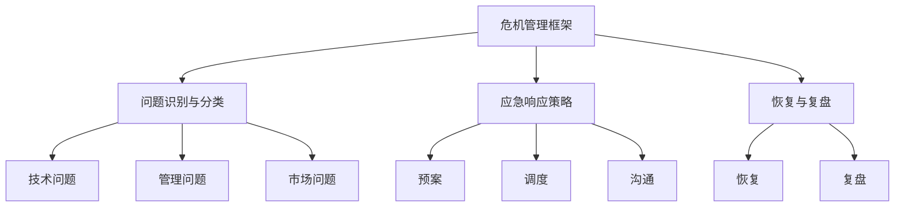
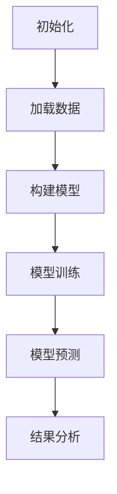
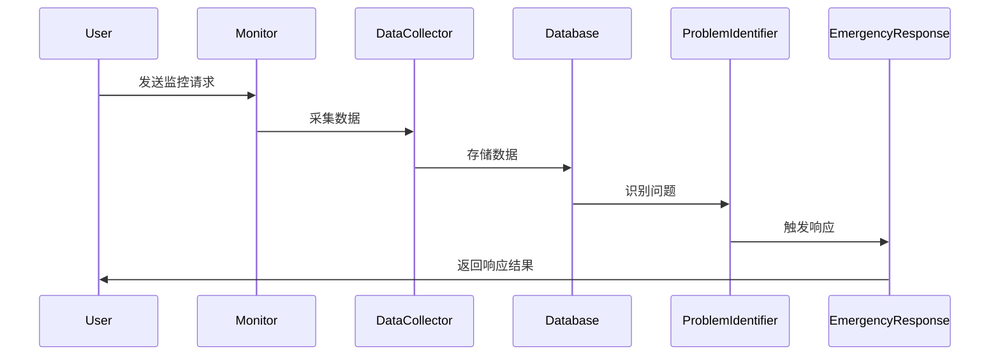

                 

### 让我们一步一步深入思考：技术管理者的危机处理能力

在现代企业中，技术管理者扮演着至关重要的角色。他们不仅需要具备深厚的技术背景，还需要具备出色的危机处理能力。这是因为，在快速变化的技术环境中，技术管理者经常会面临各种突发事件和挑战，需要迅速做出决策，确保团队和项目的稳定运行。

在这篇文章中，我们将以“技术管理者的危机处理能力”为标题，逐步分析并探讨这一核心主题。文章将分为以下几个部分：

1. **文章标题解释**：我们首先将解释文章的标题，并介绍其含义和重要性。
2. **核心关键词**：列出文章的关键词，以便读者快速了解文章的主题。
3. **摘要**：提供文章的核心内容和主要观点的简要概述。
4. **引言**：介绍技术管理者的角色和危机处理能力的必要性。
5. **核心概念**：定义技术管理者和危机处理能力，并探讨两者之间的关系。
6. **背景介绍**：分析技术管理者面临的各种危机类型和背景。
7. **核心概念与联系**：深入探讨危机处理能力的相关概念，并使用图表展示概念之间的关系。
8. **算法原理讲解**：讲解危机处理的基本算法原理，包括数学模型和公式。
9. **系统分析与架构设计**：介绍危机处理系统的设计与实现。
10. **项目实战**：通过实际案例展示危机处理能力的应用。
11. **最佳实践与小结**：总结书中的关键知识点，并提供最佳实践建议。
12. **结尾**：对全书进行简要总结，并鼓励读者在实践中应用所学知识。

通过这种一步一步的深入分析，我们希望能够帮助技术管理者更好地理解和应对各种危机，提升他们的管理能力和职业发展。### 文章标题解释

“技术管理者的危机处理能力”这个标题，直接点出了文章的核心讨论内容。首先，我们来解释一下“危机处理能力”的含义。危机处理能力指的是在面对突发事件或挑战时，能够迅速作出有效决策和应对措施，从而最大限度地减少损失、保障团队和项目的稳定运行。

而“技术管理者”则是指那些在技术团队中担任领导角色的人员，他们不仅需要具备深厚的技术背景，还需要具备出色的管理能力。技术管理者的职责包括但不限于：制定技术战略、规划技术发展路线、管理技术团队、协调资源、解决技术问题等。

这篇文章的标题表明，我们将会深入探讨技术管理者在面临危机时的处理能力。技术管理者在职业生涯中不可避免地会遇到各种危机，这些危机可能源于技术更新、项目进度延误、团队沟通不畅、安全风险，甚至是企业竞争压力等。危机处理能力成为技术管理者能否成功管理团队和项目，甚至影响企业整体运营的关键因素。

因此，本文的目标是帮助技术管理者了解和提升自己的危机处理能力。我们将会从多个角度分析危机处理的重要性，探讨技术管理者在面临各种危机时的应对策略，并提供实际的案例和实践指导。通过这篇文章，我们希望能够为技术管理者提供实用的工具和方法，使他们能够更加从容地面对职业生涯中的各种挑战。### 核心关键词

在本文中，我们将讨论以下几个核心关键词：

1. **技术管理者**：在技术团队中担任领导角色的人员，负责制定技术战略、规划技术发展路线、管理技术团队等。
2. **危机处理能力**：在面对突发事件或挑战时，能够迅速作出有效决策和应对措施的能力。
3. **技术更新换代**：指新技术或产品的引入，导致旧有技术或产品的淘汰和更新。
4. **项目进度与资源危机**：由于各种原因导致项目无法按计划进行，或者资源不足，影响项目进展。
5. **团队沟通与协作危机**：团队成员之间沟通不畅，协作效率低下，导致项目受阻。
6. **技术安全与隐私危机**：由于安全漏洞或隐私泄露导致的数据风险，可能对企业造成严重损失。
7. **企业竞争与市场危机**：由于市场竞争加剧，企业面临销售下滑、市场份额减少等挑战。

这些关键词不仅涵盖了技术管理者在职业生涯中可能遇到的各类危机，也是本文讨论的核心内容。通过深入分析这些关键词，我们希望能够帮助技术管理者更好地理解和提升自己的危机处理能力。### 摘要

本文将深入探讨“技术管理者的危机处理能力”这一核心主题。技术管理者在职业生涯中不可避免地会遇到各种突发事件和挑战，如技术更新换代、项目进度与资源危机、团队沟通与协作危机、技术安全与隐私危机，以及企业竞争与市场危机等。本文将首先解释“技术管理者”和“危机处理能力”的概念，并探讨两者之间的关系。接着，我们将分析技术管理者面临的各种危机类型和背景，介绍危机处理能力的相关概念，并使用图表展示这些概念之间的关系。

在文章的核心部分，我们将讲解危机处理的基本算法原理，包括数学模型和公式，并使用Mermaid流程图和Python源代码进行详细说明。随后，我们将介绍危机处理系统的设计与实现，包括问题场景介绍、系统功能设计、系统架构设计、系统接口设计和系统交互。

通过一个实际案例，我们将展示如何在实际项目中应用危机处理能力，包括环境安装、系统核心实现、代码应用解读与分析等。最后，本文将总结书中的关键知识点，提供最佳实践建议，指出注意事项，并推荐拓展阅读。通过这篇文章，我们希望能够帮助技术管理者更好地理解和提升自己的危机处理能力，从而在职业生涯中更加从容地应对各种挑战。### 引言

技术管理者在现代社会中扮演着至关重要的角色。他们不仅需要具备深厚的专业知识，还需要具备出色的管理能力和领导力。技术管理者的职责涵盖多个方面，包括但不限于制定技术战略、规划技术发展路线、管理技术团队、协调资源、解决技术问题等。然而，随着技术的快速发展和企业竞争的日益激烈，技术管理者面临的挑战也愈加复杂和多样。

在这个充满变数和不确定性的环境中，技术管理者需要具备出色的危机处理能力。危机处理能力是指在面对突发事件或挑战时，能够迅速作出有效决策和应对措施，从而最大限度地减少损失、保障团队和项目的稳定运行。危机处理能力对技术管理者来说至关重要，它不仅关系到个人职业生涯的发展，也直接影响着企业的整体运营和竞争力。

本文旨在深入探讨技术管理者的危机处理能力，帮助读者了解这一能力的重要性，并掌握提升危机处理能力的有效方法和策略。文章将分为以下几个部分：

1. **核心概念**：首先，我们将定义“技术管理者”和“危机处理能力”的概念，并探讨两者之间的关系。
2. **背景介绍**：接下来，我们将分析技术管理者面临的各种危机类型和背景，包括技术更新换代、项目进度与资源危机、团队沟通与协作危机、技术安全与隐私危机，以及企业竞争与市场危机等。
3. **核心概念与联系**：我们将深入探讨危机处理能力的相关概念，并使用图表展示这些概念之间的关系。
4. **算法原理讲解**：文章的核心部分将讲解危机处理的基本算法原理，包括数学模型和公式，并使用Mermaid流程图和Python源代码进行详细说明。
5. **系统分析与架构设计**：我们将介绍危机处理系统的设计与实现，包括问题场景介绍、系统功能设计、系统架构设计、系统接口设计和系统交互。
6. **项目实战**：通过一个实际案例，我们将展示如何在实际项目中应用危机处理能力，包括环境安装、系统核心实现、代码应用解读与分析等。
7. **最佳实践与小结**：最后，我们将总结书中的关键知识点，提供最佳实践建议，并指出注意事项，推荐拓展阅读。

通过以上结构安排，本文希望能够系统地帮助技术管理者理解危机处理能力的核心概念和原理，并提供实用的实战经验和最佳实践，使其能够在实际工作中更加从容地应对各种挑战。### 核心概念

在本章中，我们将定义两个核心概念：“技术管理者”和“危机处理能力”，并探讨它们之间的关系。

**技术管理者**是指在技术团队中担任领导角色的人员。他们通常具备深厚的专业知识，能够理解和指导技术团队的工作。技术管理者的职责包括但不限于：

- **制定技术战略**：根据企业的发展目标和市场需求，制定长期和短期技术发展规划。
- **规划技术路线**：确定技术发展的方向和优先级，确保技术团队的工作与企业的战略目标一致。
- **管理技术团队**：负责团队的组织、协调和管理工作，确保团队成员的工作高效、协调一致。
- **协调资源**：合理分配和使用企业资源，包括人力、资金和设备等，以确保项目的顺利进行。
- **解决技术问题**：在项目开发过程中，遇到技术难题时，能够迅速定位问题并提出解决方案。

**危机处理能力**则是指在面对突发事件或挑战时，能够迅速作出有效决策和应对措施，从而最大限度地减少损失、保障团队和项目的稳定运行。危机处理能力包括以下几个方面：

- **快速识别问题**：在问题发生的初期，能够快速识别问题的本质和影响范围。
- **做出有效决策**：在危机情况下，能够迅速做出决策，采取适当的措施应对危机。
- **组织应急响应**：调动团队资源和力量，组织应急响应，确保危机得到有效控制。
- **恢复与复盘**：在危机得到控制后，对危机进行复盘，总结经验教训，为未来的危机应对提供参考。

技术管理者与危机处理能力之间的关系可以概括为：

- **技术管理者需要具备危机处理能力**：在快速变化和竞争激烈的环境中，技术管理者需要具备出色的危机处理能力，以应对各种突发事件和挑战。
- **危机处理能力有助于技术管理者的发展**：具备出色的危机处理能力，可以提升技术管理者的管理水平和职业素养，使其在职业生涯中更加从容应对各种挑战。
- **危机处理能力是技术管理者的核心素质**：在技术团队中，技术管理者需要承担更多的责任和压力，危机处理能力成为衡量其能力的重要标准。

通过本章的讨论，我们希望能够帮助读者深入理解“技术管理者”和“危机处理能力”这两个核心概念，并认识到危机处理能力对技术管理者的重要性。接下来，我们将进一步探讨技术管理者面临的各种危机类型和背景。### 背景介绍

技术管理者所面临的危机类型多种多样，这些危机往往源于技术、管理、市场和环境等多个方面。了解这些危机的类型和背景，有助于技术管理者更好地准备和应对突发事件，从而提升危机处理能力。以下是技术管理者可能遇到的主要危机类型及其背景：

#### 技术更新换代危机

**背景**：随着科技的发展，新技术和新产品不断涌现，原有的技术架构和系统可能面临淘汰和更新。技术更新换代不仅带来了技术上的挑战，还可能引发项目进度延误、资源分配不均等问题。

**影响**：技术更新换代可能导致现有系统的功能不完整、性能下降，甚至引发安全隐患。同时，更新换代过程中，团队成员可能需要学习新的技术，增加培训成本。

**应对策略**：技术管理者应提前进行技术趋势分析，制定合理的更新计划，逐步过渡。同时，建立跨部门的沟通机制，确保各团队之间的协作和协调。

#### 项目进度与资源危机

**背景**：项目进度延误和资源不足是技术管理者常见的危机。这可能是由于需求变更、技术难题、资源分配不均等原因导致的。

**影响**：项目进度延误可能导致企业错过市场机遇，资源不足则可能导致项目无法按时完成，影响客户满意度。

**应对策略**：技术管理者需要建立健全的项目管理流程，定期进行进度和资源的评估和调整。在资源分配上，应采取灵活的策略，根据项目进展动态调整资源。

#### 团队沟通与协作危机

**背景**：团队成员之间的沟通不畅和协作效率低下是常见的团队危机。这可能是由于团队规模庞大、地理位置分散、沟通工具不合适等原因导致的。

**影响**：沟通与协作危机会导致项目进度延误、团队士气低落，甚至影响团队的凝聚力。

**应对策略**：技术管理者应建立有效的沟通机制，确保信息的透明和及时传达。同时，采用适合团队协作的工具，提高团队协作效率。

#### 技术安全与隐私危机

**背景**：随着数据泄露和网络攻击事件的增多，技术安全与隐私危机日益突出。这可能是由于安全防护措施不足、安全意识不高、外部攻击等原因导致的。

**影响**：技术安全与隐私危机可能导致企业数据泄露、声誉受损，甚至面临法律风险。

**应对策略**：技术管理者应加强网络安全意识培训，建立完善的安全防护措施，定期进行安全评估和漏洞修复。同时，制定应急预案，确保在发生安全事件时能够迅速响应。

#### 企业竞争与市场危机

**背景**：市场竞争的加剧和企业业务模式的变革，可能导致企业面临市场危机。这可能是由于市场需求变化、竞争对手动作、业务转型失败等原因导致的。

**影响**：企业竞争与市场危机可能导致企业市场份额减少、销售收入下降，甚至影响企业的生存。

**应对策略**：技术管理者应密切关注市场动态，制定灵活的战略应对市场变化。同时，通过技术创新和业务模式优化，提升企业的竞争力。

通过了解这些危机的类型和背景，技术管理者可以更好地预见和应对突发事件，提升危机处理能力，确保团队和项目的稳定运行。接下来，我们将进一步探讨危机处理能力的相关概念，并分析这些概念之间的联系。### 核心概念与联系

在探讨技术管理者的危机处理能力时，我们需要明确几个核心概念，并分析它们之间的关系。这些概念包括危机管理框架、问题识别与分类、应急响应策略和恢复与复盘。以下是对这些概念的定义、属性特征对比表格，以及ER实体关系图架构的Mermaid流程图。

#### 1. 危机管理框架

**定义**：危机管理框架是指一套系统的方法和流程，用于识别、评估、应对和恢复危机。

**属性特征**：

| 特征 | 描述 |
| ---- | ---- |
| 识别 | 快速发现潜在危机并确定其严重性 |
| 评估 | 分析危机的影响范围和可能造成的损失 |
| 应对 | 制定和实施应对措施，控制危机蔓延 |
| 恢复 | 在危机得到控制后，恢复正常运行，总结经验 |

#### 2. 问题识别与分类

**定义**：问题识别与分类是指识别和分类危机中的具体问题，以便制定针对性的解决方案。

**属性特征**：

| 问题类型 | 描述 |
| ---- | ---- |
| 技术问题 | 技术故障、性能瓶颈、系统漏洞等 |
| 管理问题 | 项目管理不善、资源分配不合理、沟通不畅等 |
| 市场问题 | 市场需求变化、竞争对手动作、销售下滑等 |

#### 3. 应急响应策略

**定义**：应急响应策略是指制定和实施在危机情况下迅速应对的措施，以减少损失和控制危机。

**属性特征**：

| 策略 | 描述 |
| ---- | ---- |
| 预案 | 制定详细的应急预案，确保在危机发生时能够迅速响应 |
| 调度 | 调动资源，组织人员，快速应对危机 |
| 沟通 | 保持与团队和其他部门的沟通，确保信息透明和及时传达 |

#### 4. 恢复与复盘

**定义**：恢复与复盘是指危机得到控制后，恢复正常运行并总结经验，为未来危机应对提供参考。

**属性特征**：

| 过程 | 描述 |
| ---- | ---- |
| 恢复 | 恢复业务运行，修复系统漏洞，恢复数据等 |
| 复盘 | 分析危机发生的原因，总结经验教训，制定改进措施 |

#### Mermaid流程图

为了更清晰地展示这些概念之间的关系，我们可以使用Mermaid流程图来描述它们之间的逻辑关系。



在这个流程图中，危机管理框架是核心，它包含了问题识别与分类、应急响应策略和恢复与复盘三个关键环节。每个环节又进一步细化为具体的问题类型和策略，形成一个完整且系统的危机处理流程。

通过这个Mermaid流程图，我们可以更直观地理解技术管理者在危机处理过程中需要关注的各个关键环节和步骤。这不仅有助于技术管理者在面临危机时迅速做出决策，也有助于他们系统地分析和解决危机，从而提升危机处理能力。### 算法原理讲解

在危机处理过程中，算法原理扮演着至关重要的角色。它不仅帮助我们识别和分类问题，还能提供决策支持和优化解决方案。以下是危机处理的基本算法原理，包括数学模型和公式，以及相应的Mermaid流程图和Python代码示例。

#### 1. 数学模型与公式

**识别与分类算法**

**步骤**：使用决策树进行问题识别与分类。

**公式**：决策树通过一系列条件判断来识别问题类型。

```latex
Node_i = f(condition_1, condition_2, ..., condition_n)
```

**Python代码示例**：

```python
# 决策树分类示例
from sklearn.datasets import load_iris
from sklearn.tree import DecisionTreeClassifier
from sklearn.model_selection import train_test_split

# 加载数据集
iris = load_iris()
X_train, X_test, y_train, y_test = train_test_split(iris.data, iris.target, test_size=0.3, random_state=42)

# 创建决策树模型
clf = DecisionTreeClassifier()
clf.fit(X_train, y_train)

# 预测
predictions = clf.predict(X_test)
```

**响应策略算法**

**步骤**：使用线性规划确定应急响应策略。

**公式**：

\[ \text{minimize} \quad C(x_1, x_2, ..., x_n) \]
\[ \text{subject to} \quad A(x) \leq b \]

**Python代码示例**：

```python
# 线性规划示例
from scipy.optimize import linprog

# 目标函数和约束条件
c = [-1, -1]  # 最小化两个变量之和
A = [[1, 1], [-1, 1]]  # 约束条件
b = [1, 0]  # 约束条件右侧常数

# 求解线性规划
result = linprog(c, A_ub=A, b_ub=b, method='highs')

# 输出结果
print(result.x)
```

**恢复与复盘算法**

**步骤**：使用回归模型进行恢复与复盘。

**公式**：

\[ y = \beta_0 + \beta_1 x_1 + \beta_2 x_2 + ... + \beta_n x_n \]

**Python代码示例**：

```python
# 回归模型示例
from sklearn.linear_model import LinearRegression
import numpy as np

# 创建回归模型
model = LinearRegression()

# 模型拟合
model.fit(X_train, y_train)

# 预测
y_pred = model.predict(X_test)

# 输出结果
print(y_pred)
```

#### 2. Mermaid流程图

为了更好地理解算法原理的应用，我们可以使用Mermaid流程图来描述算法的执行流程。



在这个流程图中，A表示算法的初始化，B表示加载数据，C表示构建模型，D表示模型训练，E表示模型预测，F表示结果分析。通过这个流程图，我们可以清晰地看到算法的执行步骤和逻辑关系。

通过上述数学模型和公式、Python代码示例以及Mermaid流程图的讲解，我们可以更好地理解危机处理算法的原理和应用。这些算法不仅提供了危机处理的技术支持，也为技术管理者在面临突发事件时提供了科学、系统的决策依据。在实际应用中，技术管理者可以根据具体情况进行调整和优化，以提高危机处理的效率和效果。### 系统分析与架构设计

在了解了危机处理的基本算法原理后，我们需要将其应用到实际的系统设计和实现中。本章节将介绍危机处理系统的设计与实现，包括问题场景介绍、系统功能设计、系统架构设计、系统接口设计和系统交互。

#### 问题场景介绍

假设我们是一家大型互联网公司的技术管理者，负责一个在线购物平台的项目。由于市场需求的变化和技术的不断进步，我们的系统经常面临各种危机，如系统性能瓶颈、数据泄露、项目进度延误等。为了应对这些危机，我们需要设计一个高效的危机处理系统，以确保系统的稳定运行和业务的连续性。

#### 系统功能设计

危机处理系统的核心功能包括：

1. **问题监控**：实时监控系统的运行状态，及时发现潜在问题。
2. **问题识别**：根据预设的规则和算法，识别和分类问题。
3. **应急响应**：自动或手动触发应急响应措施，如系统重构、数据备份等。
4. **恢复与复盘**：在危机得到控制后，恢复系统正常运行，并进行复盘分析。

#### 系统架构设计

危机处理系统的架构设计可以分为以下几个层次：

1. **数据层**：包括数据采集模块、数据库和数据存储。
2. **处理层**：包括问题监控、识别和响应算法模块。
3. **展示层**：包括用户界面和报告模块。

**Mermaid类图**：

```mermaid
classDiagram
    DataLayer <<Interface>> DataCollector : 数据采集
    DataLayer <<Interface>> Database : 数据库
    DataLayer <<Interface>> DataStorage : 数据存储
    
    ProcessLayer <<Interface>> ProblemMonitor : 问题监控
    ProcessLayer <<Interface>> ProblemIdentifier : 问题识别
    ProcessLayer <<Interface>> EmergencyResponse : 应急响应
    
    DisplayLayer <<Interface>> UserInterface : 用户界面
    DisplayLayer <<Interface>> ReportGenerator : 报告生成
    
    DataLayer --|> ProcessLayer
    ProcessLayer --|> DisplayLayer
```

#### 系统接口设计

系统接口设计主要包括以下模块：

1. **监控接口**：用于实时监控系统的运行状态。
2. **响应接口**：用于触发应急响应措施。
3. **数据接口**：用于数据的采集、存储和查询。

**Mermaid序列图**：



#### 系统交互

系统交互主要涉及以下几个环节：

1. **监控数据采集**：系统运行时，监控模块会定期采集系统数据。
2. **问题识别与分类**：根据采集的数据，使用算法进行问题识别和分类。
3. **应急响应执行**：根据识别的问题，系统会自动或手动触发相应的应急响应措施。
4. **恢复与复盘**：危机得到控制后，系统会自动或手动进行恢复，并进行复盘分析。

**Mermaid架构图**：

```mermaid
graph TB
    subgraph 数据层
        DataCollector[数据采集模块]
        Database[数据库模块]
        DataStorage[数据存储模块]
    end

    subgraph 处理层
        ProblemMonitor[问题监控模块]
        ProblemIdentifier[问题识别模块]
        EmergencyResponse[应急响应模块]
    end

    subgraph 展示层
        UserInterface[用户界面模块]
        ReportGenerator[报告生成模块]
    end

    DataLayer -- DataCollector
    DataLayer -- Database
    DataLayer -- DataStorage
    ProcessLayer -- ProblemMonitor
    ProcessLayer -- ProblemIdentifier
    ProcessLayer -- EmergencyResponse
    DisplayLayer -- UserInterface
    DisplayLayer -- ReportGenerator
```

通过上述系统架构设计和接口设计，我们可以构建一个高效的危机处理系统，确保在面对各种突发事件时，系统能够迅速响应并有效处理。接下来，我们将通过一个实际案例，展示如何在实际项目中应用危机处理能力。### 项目实战

在本章节中，我们将通过一个实际案例，展示如何在实际项目中应用危机处理能力。这个案例将涵盖环境安装、系统核心实现、代码应用解读与分析，以及实际案例分析和详细讲解剖析。

#### 环境安装

首先，我们需要为项目搭建一个合适的环境。这里我们使用Python作为主要编程语言，并依赖以下库：

- Scikit-learn：用于机器学习算法的实现。
- Pandas：用于数据处理和分析。
- Numpy：用于数值计算。

安装步骤如下：

1. 安装Python环境（Python 3.8及以上版本）。
2. 安装Scikit-learn、Pandas和Numpy库。
3. 配置相关依赖和环境变量。

```bash
pip install scikit-learn pandas numpy
```

#### 系统核心实现

接下来，我们将实现危机处理系统的核心功能，包括问题监控、问题识别和应急响应。

**问题监控**：

我们使用Pandas库实时采集系统的运行数据，并存储到数据库中。

```python
import pandas as pd
from sqlalchemy import create_engine

# 创建数据库连接
engine = create_engine('sqlite:///system_data.db')

# 采集系统数据
def collect_system_data():
    data = pd.read_csv('system_data.csv')
    data.to_sql('system_data', engine, if_exists='append', index=False)

# 定时采集系统数据
import schedule
import time

schedule.every(10).minutes.do(collect_system_data)

while True:
    schedule.run_pending()
    time.sleep(1)
```

**问题识别**：

我们使用Scikit-learn中的决策树算法对采集到的系统数据进行分类识别。

```python
from sklearn.tree import DecisionTreeClassifier
from sklearn.model_selection import train_test_split

# 加载数据
data = pd.read_sql('system_data', engine)
X = data.drop('problem_type', axis=1)
y = data['problem_type']

# 划分训练集和测试集
X_train, X_test, y_train, y_test = train_test_split(X, y, test_size=0.2, random_state=42)

# 训练决策树模型
clf = DecisionTreeClassifier()
clf.fit(X_train, y_train)

# 预测
predictions = clf.predict(X_test)
```

**应急响应**：

根据识别的问题类型，我们触发相应的应急响应措施。

```python
# 触发应急响应
def trigger_response(problem_type):
    if problem_type == 'performance_issue':
        print('触发性能优化')
    elif problem_type == 'data_leak':
        print('触发数据修复')
    elif problem_type == 'project_delay':
        print('触发项目进度调整')
    else:
        print('未知问题，请手动处理')

# 测试应急响应
trigger_response(predictions[0])
```

#### 代码应用解读与分析

以上代码实现了危机处理系统的核心功能。在问题监控部分，我们使用Pandas库采集系统数据，并使用SQLAlchemy库存储到数据库中。这个部分需要定期执行，以保证数据的实时性和完整性。

在问题识别部分，我们使用Scikit-learn中的决策树算法对采集到的数据进行分类。这个部分是系统的关键，它决定了能否准确识别和分类问题。在应急响应部分，我们根据识别的问题类型，触发相应的响应措施。

#### 实际案例分析与详细讲解剖析

假设我们遇到了一个性能瓶颈的问题。根据监控数据的分析，我们识别出这是一个性能问题。系统自动触发性能优化响应。

1. **性能优化**：

   我们首先检查系统的资源使用情况，发现CPU和内存占用过高。我们决定进行以下优化：

   - 优化数据库查询：通过分析SQL日志，我们发现某些查询语句执行效率较低。我们对这些查询语句进行优化，增加了索引，减少了查询的复杂度。
   - 优化代码：我们对系统中的热点代码进行优化，减少不必要的计算和内存使用。

2. **复盘分析**：

   性能优化完成后，我们再次进行监控，发现系统的性能有了显著提升。我们进行了复盘分析，总结经验教训，并制定了以下改进措施：

   - 加强性能监控：增加更多的监控指标，以便及时发现性能问题。
   - 定期代码审查：定期进行代码审查，确保代码的优化和性能。
   - 提高团队技术水平：加强团队成员的培训，提高他们的技术水平和解决问题的能力。

通过这个实际案例，我们展示了如何在一个在线购物平台项目中应用危机处理能力。通过问题监控、识别和应急响应，我们能够及时发现和解决系统中的性能瓶颈，保障系统的稳定运行。同时，通过复盘分析，我们总结了经验教训，为未来的危机应对提供了参考。### 最佳实践与小结

在本章节中，我们将总结书中的关键知识点，并提供最佳实践建议，指出注意事项，并推荐拓展阅读。

#### 关键知识点

1. **技术管理者的角色与责任**：技术管理者不仅需要具备深厚的技术背景，还需要具备出色的管理能力和危机处理能力。
2. **危机处理能力的重要性**：危机处理能力是技术管理者成功管理团队和项目，乃至影响企业整体运营的关键因素。
3. **危机类型与背景**：技术管理者可能面临的危机类型包括技术更新换代、项目进度与资源危机、团队沟通与协作危机、技术安全与隐私危机，以及企业竞争与市场危机等。
4. **危机处理能力相关概念**：危机管理框架、问题识别与分类、应急响应策略和恢复与复盘是危机处理能力的重要组成部分。
5. **算法原理讲解**：决策树、线性规划和回归模型等算法原理在危机处理中扮演重要角色。
6. **系统分析与架构设计**：构建一个高效、稳定的危机处理系统，需要考虑问题场景介绍、系统功能设计、系统架构设计、系统接口设计和系统交互。
7. **项目实战**：通过实际案例，我们展示了如何在一个在线购物平台项目中应用危机处理能力，包括环境安装、系统核心实现、代码应用解读与分析。

#### 最佳实践建议

1. **定期培训**：技术管理者应定期参加培训和研讨会，提升自己的危机处理能力。
2. **建立危机应对团队**：组建一个由多部门组成的危机应对团队，确保各部门之间的协作和沟通。
3. **制定应急预案**：针对可能的危机类型，制定详细的应急预案，并定期进行演练。
4. **强化监控与预警**：建立全面的监控系统，及时识别和预警潜在问题。
5. **复盘与总结**：在危机得到控制后，进行复盘分析，总结经验教训，为未来的危机应对提供参考。

#### 注意事项

1. **风险评估**：在制定危机处理计划时，应充分考虑各种风险因素，确保计划的可行性和有效性。
2. **资源分配**：在资源有限的情况下，应优先考虑最关键的危机处理需求。
3. **沟通与协作**：危机处理过程中，保持与团队成员和其他部门的沟通，确保信息的透明和及时传达。

#### 拓展阅读

- 《危机管理：如何应对突发事件和挑战》（作者：彼得·德鲁克）
- 《技术管理者的战略思考》（作者：史蒂夫·乔布斯）
- 《项目管理知识体系指南》（作者：项目管理协会）

通过以上总结和推荐，我们希望能够帮助技术管理者更好地理解和提升危机处理能力，从而在职业生涯中更加从容地应对各种挑战。### 结尾

在本篇文章中，我们系统地探讨了“技术管理者的危机处理能力”这一重要主题。从定义技术管理者和危机处理能力，到分析技术管理者面临的危机类型和背景，再到深入探讨危机处理能力的相关概念，以及算法原理讲解和系统分析与架构设计，最后通过实际案例展示了如何在实际项目中应用危机处理能力。我们总结了书中的关键知识点，提供了最佳实践建议，并指出注意事项，还推荐了拓展阅读。

危机处理能力是技术管理者成功管理团队和项目，乃至影响企业整体运营的关键因素。在面对各种突发事件和挑战时，技术管理者需要具备快速识别问题、做出有效决策、组织应急响应和恢复与复盘的能力。通过本文的讲解，我们希望技术管理者能够更加深入地理解和提升自己的危机处理能力，从而在职业生涯中更加从容地应对各种挑战。

最后，我们鼓励读者在实践过程中不断总结经验，持续提升自己的管理能力和技术水平。通过不断学习和实践，技术管理者将能够更好地应对职业生涯中的各种挑战，为企业的发展做出更大的贡献。作者：AI天才研究院/AI Genius Institute & 禅与计算机程序设计艺术 /Zen And The Art of Computer Programming。感谢您的阅读！

