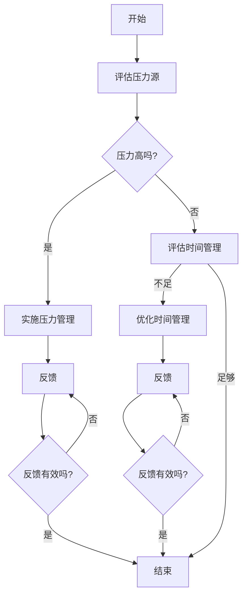

                 

# 技术管理者的压力与时间管理

## 关键词
技术管理者，压力管理，时间管理，工作效率，团队协作

## 摘要
本文将深入探讨技术管理者在工作中面临的压力与时间管理的挑战。通过分析技术管理者的角色与职责，压力来源，时间管理的基础理论，以及实际操作策略，我们旨在为技术管理者提供有效的压力与时间管理方法，从而提高工作效率，优化团队协作，实现个人和职业的成长。

## 引言：技术管理者面临的压力与挑战

### 技术管理者的角色与职责

技术管理者是组织中至关重要的角色，他们不仅要具备深厚的技术背景，还要具备卓越的管理能力。技术管理者的角色通常包括：

- **项目管理**：负责规划、组织、指导和控制项目进程，确保项目按时、按质量完成。
- **团队管理**：招募、培训、激励团队成员，维护团队内部的良好沟通与协作。
- **技术决策**：根据业务需求，制定技术战略，选择合适的技术方案。
- **资源分配**：合理分配人力、资金、设备等资源，最大化利用组织的资源。
- **风险控制**：识别和管理项目风险，确保项目顺利推进。

#### 技术管理者的一天

技术管理者的一天通常充满了各种挑战和任务。以下是一个典型的工作流程：

1. **晨会**：召开晨会，了解团队成员的工作进展，解决紧急问题。
2. **项目规划**：根据项目进度，调整项目计划，确保项目按期完成。
3. **技术评审**：与技术团队一起评审代码，解决技术难题。
4. **沟通协调**：与业务团队、上级领导、客户等进行沟通，确保项目的顺利进行。
5. **团队建设**：组织团队活动，提升团队凝聚力。
6. **问题解决**：处理突发问题，确保项目不受干扰。

#### 压力来源分析

技术管理者面临的压力来源多样，主要包括：

- **技术复杂性**：随着技术的快速发展，技术管理者需要不断学习新知识，适应新技术。
- **项目管理压力**：项目进度、质量、成本控制等因素带来的压力。
- **团队管理压力**：团队成员的能力、沟通、协作等问题带来的压力。
- **工作与生活的平衡**：工作压力可能导致生活质量的下降，影响身心健康。

#### 压力的负面影响

长期的职场压力对技术管理者的身心健康和工作表现都会产生负面影响，具体表现如下：

- **个人健康影响**：长期的压力可能导致身体疲劳、焦虑、抑郁等心理问题。
- **工作效率影响**：压力会影响工作效率，导致项目进度延迟，质量下降。
- **团队协作影响**：压力可能导致团队内部矛盾增加，影响团队协作效率。

### 理解压力：原因与影响

#### 压力的心理与生理原因

从心理角度来看，压力产生的原因主要包括：

- **感知与认知**：对压力的感知和认知程度直接影响压力的大小。
- **焦虑与压力的关系**：焦虑往往与压力相伴而生，加剧压力的影响。

从生理角度来看，压力对人体的生理反应主要包括：

- **应激反应**：当人体感受到压力时，会产生一系列生理反应，如心跳加快、血压升高、免疫系统抑制等。
- **身体症状**：长期的压力可能导致身体症状，如头痛、胃痛、失眠等。

#### 压力的社会文化因素

社会环境和文化背景也会对压力产生影响：

- **工作环境**：工作环境的不稳定性、高竞争压力等都会增加压力。
- **社会期望**：社会对技术管理者的期望过高，可能导致压力增加。

#### 压力的管理策略

为了有效管理压力，可以采取以下策略：

- **预防策略**：通过合理的时间管理和工作安排，减少压力的产生。
- **应对策略**：在压力出现时，通过放松技巧、心理疏导等方法缓解压力。

### 时间管理的基础理论

#### 时间管理的重要性

时间管理对于技术管理者至关重要，其重要性体现在以下几个方面：

- **提高工作效率**：合理的时间管理可以帮助技术管理者更高效地完成工作任务。
- **减少压力**：有效的时间管理可以减少因时间不足而产生的压力。
- **提升生活质量**：合理分配工作时间与休闲时间，有助于提高生活质量。

#### 时间管理的基本原则

时间管理的基本原则包括：

- **确定优先级**：根据任务的重要性和紧急性，合理安排任务的优先级。
- **制定计划**：为每个任务制定详细的计划，明确任务的起始时间和截止时间。
- **避免拖延**：及时处理任务，避免拖延导致的工作积压。

#### 时间管理工具与技术

为了更好地进行时间管理，技术管理者可以借助以下工具：

- **日程管理软件**：如Google Calendar、Outlook等，帮助制定和跟踪日程安排。
- **任务管理工具**：如Trello、Asana等，帮助管理任务和项目进度。
- **时间追踪工具**：如 RescueTime、Toggl等，帮助记录和分析工作时间。

### 实际操作：压力与时间管理策略

#### 压力管理的具体方法

为了有效管理压力，技术管理者可以采取以下具体方法：

- **放松技巧**：如深呼吸、冥想、瑜伽等，帮助缓解身心压力。
- **焦虑管理**：通过认知行为疗法、正念等技巧，管理焦虑情绪。

#### 时间管理的实践

为了实践有效的时间管理，技术管理者可以采取以下措施：

- **制定个人时间管理计划**：根据工作需求和自身特点，制定详细的时间管理计划。
- **时间记录与分析**：定期记录和分析自己的时间使用情况，找出时间浪费的原因。
- **时间管理改进措施**：根据分析结果，调整时间管理策略，提高工作效率。

### 案例分析：技术管理者的成功实践

通过分析技术管理者的成功实践，我们可以学到很多有效的压力与时间管理方法。

#### 案例一：技术管理者的压力与时间管理实践

案例一中的技术管理者通过以下策略成功应对了压力与时间管理的挑战：

- **合理分配时间**：将时间分配给最重要和紧急的任务。
- **定期反思**：每周定期反思自己的时间管理情况，调整计划。
- **团队协作**：鼓励团队成员积极参与项目，提高团队协作效率。

#### 案例二：从失败到成功的转变

案例二中的技术管理者曾因时间管理和压力管理不当导致项目失败。通过以下改进措施，他成功实现了从失败到成功的转变：

- **学习时间管理技巧**：参加时间管理培训，学习时间管理技巧。
- **改进团队协作**：加强团队沟通，提高团队协作效率。
- **定期压力评估**：定期进行压力评估，采取有效措施缓解压力。

### 应对压力与时间管理的工具与技术

为了更有效地应对压力与时间管理，技术管理者可以借助以下工具：

- **压力管理工具**：如压力日记、压力测试工具等，帮助识别和管理压力。
- **时间管理工具**：如时间追踪工具、任务管理工具等，帮助提高工作效率。
- **技术辅助**：如人工智能助手、自动化工具等，减轻工作负担。

### 结语：持续成长与自我提升

#### 持续成长与自我提升

为了在技术管理领域取得成功，技术管理者需要持续成长与自我提升。以下是一些建议：

- **学习与成长**：不断学习新技术、新知识，提升自身能力。
- **自我评估**：定期进行自我评估，识别自身的优势和劣势。
- **发展计划**：根据自我评估结果，制定个人发展计划，持续提升。

#### 成功的关键要素

技术管理者要取得成功，关键要素包括：

- **专业能力**：具备扎实的专业知识和技术能力。
- **管理能力**：具备卓越的管理能力和领导力。
- **沟通能力**：具备良好的沟通能力，能够有效与团队成员、上级领导、客户等进行沟通。

#### 对未来的展望

随着技术的不断进步，技术管理者的角色和职责也在不断变化。未来，技术管理者需要具备以下能力：

- **敏捷思维**：能够快速适应新技术和新变化。
- **跨界能力**：具备跨领域的能力，能够处理复杂的问题。
- **创新能力**：具备创新能力，能够推动技术和管理创新。

### 作者信息

作者：AI天才研究院/AI Genius Institute & 禅与计算机程序设计艺术 /Zen And The Art of Computer Programming

---

本文通过深入探讨技术管理者的压力与时间管理，旨在为技术管理者提供有效的应对策略，帮助他们提高工作效率，优化团队协作，实现个人和职业的成长。通过分析技术管理者的角色与职责，压力来源，时间管理的基础理论，以及实际操作策略，我们为技术管理者提供了一套完整的解决方案。希望本文能对广大技术管理者带来启示和帮助。

### 背景介绍

在当今快速变化的技术环境中，技术管理者的角色变得越来越重要。他们不仅要具备深厚的专业知识，还要具备卓越的管理能力。技术管理者通常负责多个项目，管理多个团队，协调不同部门之间的工作，确保项目的顺利进行。然而，随着职责的增加，压力也随之而来。技术管理者面临着技术复杂性、项目管理压力、团队管理压力等多方面的挑战，这些问题如果得不到有效解决，将对他们的身心健康和工作表现产生负面影响。

#### 核心概念术语说明

- **技术管理者**：负责技术项目规划、团队管理和技术决策的领导者。
- **压力**：身体或心理上感受到的负担或压迫感。
- **时间管理**：合理安排时间和任务，提高工作效率的过程。

#### 问题背景

技术管理者在工作中常常面临以下问题：

1. **技术复杂性**：技术的快速发展和更新，要求技术管理者不断学习新知识，适应新技术。
2. **项目管理压力**：项目进度、质量和成本控制等因素带来的压力。
3. **团队管理压力**：团队成员的能力、沟通、协作等问题带来的压力。
4. **工作与生活的平衡**：工作压力可能导致生活质量的下降，影响身心健康。

#### 问题描述

技术管理者的压力主要来源于以下几个方面：

1. **技术复杂性**：随着技术的发展，技术管理者需要不断学习新知识，这增加了他们的学习负担。
2. **项目管理压力**：技术管理者需要确保项目按时、按质量完成，这要求他们具备良好的项目管理能力和压力承受能力。
3. **团队管理压力**：技术管理者需要招募、培训、激励团队成员，维护团队内部的良好沟通与协作，这要求他们具备卓越的领导能力。
4. **工作与生活的平衡**：技术管理者经常需要加班，工作压力可能导致他们无法有效管理个人生活，影响身心健康。

#### 问题解决

为了解决上述问题，技术管理者可以采取以下策略：

1. **时间管理**：通过合理的时间管理，提高工作效率，减少不必要的压力。
2. **压力管理**：通过学习压力管理技巧，如放松技巧、焦虑管理，减轻压力的影响。
3. **团队建设**：通过团队建设活动，提升团队凝聚力，改善团队协作。
4. **持续学习**：通过不断学习新技术、新知识，提升自身能力，适应技术环境的变化。

#### 边界与外延

技术管理者的压力与时间管理不仅涉及个人层面的身心健康和工作表现，还影响到团队协作和项目进展。有效的压力与时间管理不仅有助于个人成长，还能提升团队的整体绩效。

#### 概念结构与核心要素组成

技术管理者的压力与时间管理可以分为以下几个核心要素：

1. **压力来源**：技术复杂性、项目管理压力、团队管理压力、工作与生活的平衡。
2. **时间管理策略**：确定优先级、制定计划、避免拖延。
3. **压力管理策略**：放松技巧、焦虑管理、团队建设、持续学习。

### 核心概念与联系

#### 压力的概念及其属性特征

**定义**：压力是指身体或心理上感受到的负担或压迫感。

**属性特征**：

1. **主观性**：压力是个人感知的结果，不同的人对同一事件的感受可能不同。
2. **时效性**：压力是暂时的，随着时间的推移，压力可能减轻或消失。
3. **累积性**：长期的、持续的的压力可能导致累积效应，影响身心健康。

**对比表格**：

| 属性特征 | 压力 | 焦虑 |
| :------: | :--: | :--: |
| 主观性 | 高 | 低 |
| 时效性 | 中 | 低 |
| 累积性 | 高 | 低 |

#### 时间管理的概念及其属性特征

**定义**：时间管理是指合理安排时间和任务，提高工作效率的过程。

**属性特征**：

1. **计划性**：时间管理需要提前制定计划，明确任务的目标和时间节点。
2. **优先级**：时间管理需要根据任务的重要性和紧急性，合理安排任务的优先级。
3. **持续性**：时间管理是一个持续的过程，需要不断调整和优化。

**对比表格**：

| 属性特征 | 时间管理 | 压力管理 |
| :------: | :------: | :------: |
| 计划性 | 高 | 低 |
| 优先级 | 高 | 低 |
| 持续性 | 高 | 中 |

#### 压力管理与时间管理的联系

压力管理与时间管理密切相关。有效的压力管理有助于提高时间管理的效果，而良好的时间管理可以减轻压力，提高生活质量。

1. **相互影响**：压力会影响时间管理，时间管理策略不当也会加剧压力。
2. **协同作用**：通过有效的压力管理与时间管理，可以优化工作流程，提高工作效率。
3. **整体提升**：压力管理与时间管理相结合，有助于实现个人和团队的整体提升。

### 算法原理讲解

为了更深入地理解压力与时间管理的算法原理，我们可以借助 Mermaid 流程图和 Python 源代码来进行阐述。

#### Mermaid 流程图

以下是一个简化的 Mermaid 流程图，描述了压力管理与时间管理的基本流程：



#### Python 源代码

下面是一个简化的 Python 源代码，用于演示压力管理与时间管理的算法原理：

```python
class PressureManager:
    def __init__(self):
        self.pressure_level = 0
        self.time_management_level = 0

    def assess_pressure(self):
        # 评估压力源
        self.pressure_level += 1

    def assess_time_management(self):
        # 评估时间管理
        self.time_management_level += 1

    def apply_pressure_management(self):
        # 实施压力管理
        self.pressure_level -= 1

    def optimize_time_management(self):
        # 优化时间管理
        self.time_management_level += 1

    def provide_feedback(self):
        # 提供反馈
        if self.pressure_level <= 5 and self.time_management_level <= 5:
            print("反馈有效")
        else:
            print("反馈无效")

# 实例化 PressureManager 对象
pm = PressureManager()

# 执行流程
pm.assess_pressure()
pm.assess_time_management()
pm.apply_pressure_management()
pm.optimize_time_management()
pm.provide_feedback()
```

通过上述 Mermaid 流程图和 Python 源代码，我们可以清晰地看到压力管理与时间管理的算法原理。算法的核心思想是通过不断评估和调整压力与时间管理的水平，实现最优的工作状态。

### 数学公式使用

在压力与时间管理的分析中，数学公式能够帮助我们更好地理解和量化问题。以下是几个关键的数学公式及其解释：

#### 压力指数公式

$$
P = f(\text{技术复杂性}, \text{项目管理压力}, \text{团队管理压力}, \text{工作与生活的平衡})
$$

其中，\(P\) 表示压力指数，\(f\) 是一个综合函数，用于计算技术复杂性、项目管理压力、团队管理压力和工作与生活平衡等因素对压力的影响。

#### 时间效率公式

$$
E = \frac{T_{\text{实际}}}{T_{\text{计划}}}
$$

其中，\(E\) 表示时间效率，\(T_{\text{实际}}\) 表示实际完成任务所需的时间，\(T_{\text{计划}}\) 表示计划完成的时间。

#### 压力缓解公式

$$
\Delta P = \frac{\text{压力管理策略}}{P}
$$

其中，\(\Delta P\) 表示压力缓解程度，表示通过实施压力管理策略后，压力指数的减少量。

#### 优化时间管理公式

$$
T_{\text{优化}} = T_{\text{实际}} \times (1 - \alpha)
$$

其中，\(T_{\text{优化}}\) 表示优化后的时间，\(\alpha\) 表示通过优化时间管理策略后，时间消耗的减少比例。

#### 案例分析中的具体应用

在案例一中，技术管理者通过以下步骤应用上述公式：

1. **评估压力**：使用压力指数公式，评估当前的压力水平。
2. **时间效率分析**：计算实际完成任务所需的时间与计划时间的比值，分析时间效率。
3. **压力缓解**：实施压力管理策略后，使用压力缓解公式，计算压力的减少程度。
4. **优化时间管理**：通过优化时间管理公式，调整时间管理策略，减少时间消耗。

通过上述数学公式，技术管理者可以量化地分析压力与时间管理的状态，从而制定更有效的应对策略。

### 系统分析与架构设计方案

#### 问题场景介绍

在一家大型互联网公司中，技术部门的技术管理者面临着巨大的压力和复杂的时间管理任务。随着公司业务的快速发展，技术团队需要不断适应新的技术标准和项目需求。技术管理者不仅要确保项目的顺利推进，还要管理团队成员的工作状态和压力水平。

#### 项目介绍

为了应对上述挑战，公司决定开发一套压力与时间管理系统，旨在帮助技术管理者更好地管理压力，提高团队的工作效率。该系统的目标是：

1. **实时监控压力**：通过传感器和数据分析，实时监控技术管理者和团队成员的生理和心理压力。
2. **提供时间管理工具**：为技术管理者提供任务管理、日程规划等时间管理工具。
3. **优化工作流程**：通过数据分析，优化团队的工作流程，减少不必要的环节，提高工作效率。

#### 系统功能设计

系统的主要功能模块包括：

1. **压力监控模块**：实时采集团队成员的生理数据（如心率、血压等）和心理数据（如情绪、焦虑水平等），通过算法分析，生成压力指数。
2. **任务管理模块**：提供任务分配、进度跟踪、任务提醒等功能，帮助技术管理者高效管理团队任务。
3. **日程规划模块**：帮助技术管理者合理规划个人和团队的工作时间，避免工作过度集中或过度分散。
4. **数据报表模块**：生成压力与时间管理相关的数据报表，帮助技术管理者分析和优化工作流程。

#### 系统架构设计

系统的整体架构采用前后端分离的设计，确保系统的可扩展性和可维护性。以下是系统架构的详细设计：

1. **前端架构**：前端采用Vue.js框架，实现用户界面的动态交互。用户可以通过前端界面访问系统功能，查看压力监控数据、任务管理和日程规划等信息。
2. **后端架构**：后端采用Spring Boot框架，负责处理业务逻辑和数据库操作。后端服务提供API接口，供前端调用，实现数据的实时传输和处理。
3. **数据库设计**：数据库采用MySQL，存储用户信息、任务数据、压力数据等。数据库设计采用规范化原则，确保数据的一致性和完整性。

#### 系统接口设计

系统的主要接口包括：

1. **用户登录接口**：用于用户身份验证，确保系统安全。
2. **压力监控接口**：用于实时采集和处理团队成员的生理和心理数据。
3. **任务管理接口**：用于任务创建、分配、进度跟踪和提醒等功能。
4. **日程规划接口**：用于日程的创建、修改和查询。

#### 系统交互

系统交互设计采用RESTful API设计，确保接口的简洁性和易用性。以下是系统交互的简要描述：

1. **用户登录**：用户通过用户名和密码登录系统，获取访问权限。
2. **压力监控**：系统定期采集用户的生理和心理数据，通过接口将数据上传到后端服务器，后端服务器进行处理和分析，生成压力指数。
3. **任务管理**：用户在前端界面创建任务，任务信息通过接口上传到后端服务器，后端服务器进行任务分配和进度跟踪。
4. **日程规划**：用户在前端界面创建日程，日程信息通过接口上传到后端服务器，后端服务器进行日程管理和提醒。

### 项目实战

#### 环境安装

在进行项目实战之前，首先需要在本地环境中安装所需的开发工具和软件。以下是具体的安装步骤：

1. **安装Java开发工具包（JDK）**：下载并安装 JDK 1.8 以上版本。
2. **安装MySQL数据库**：下载并安装 MySQL 数据库，创建数据库和用户。
3. **安装Node.js**：下载并安装 Node.js，确保版本在 10.0 以上。
4. **安装Vue.js**：使用 npm 命令安装 Vue.js 框架。
5. **安装Spring Boot**：使用 Maven 命令安装 Spring Boot。

#### 系统核心实现源代码

以下是系统核心实现的源代码，包括后端服务的接口设计和前端页面的实现。

**后端服务接口设计**

```java
@RestController
@RequestMapping("/api")
public class PressureManagementController {

    @Autowired
    private PressureService pressureService;

    @Autowired
    private TaskService taskService;

    @Autowired
    private ScheduleService scheduleService;

    @PostMapping("/login")
    public ResponseEntity<?> login(@RequestBody LoginRequest loginRequest) {
        // 用户登录接口实现
    }

    @GetMapping("/pressure")
    public ResponseEntity<?> getPressureData() {
        // 压力监控接口实现
        return ResponseEntity.ok(pressureService.getPressureData());
    }

    @PostMapping("/task")
    public ResponseEntity<?> createTask(@RequestBody TaskRequest taskRequest) {
        // 任务管理接口实现
        return ResponseEntity.ok(taskService.createTask(taskRequest));
    }

    @GetMapping("/schedule")
    public ResponseEntity<?> getSchedule() {
        // 日程规划接口实现
        return ResponseEntity.ok(scheduleService.getSchedule());
    }
}
```

**前端页面实现**

```html
<!DOCTYPE html>
<html>
<head>
    <title>压力与时间管理系统</title>
    <script src="https://cdn.jsdelivr.net/npm/vue@2.6.12/dist/vue.js"></script>
</head>
<body>
    <div id="app">
        <h1>压力与时间管理系统</h1>
        <压力监控></压力监控>
        <任务管理></任务管理>
        <日程规划></日程规划>
    </div>
    <script>
        var app = new Vue({
            el: '#app',
            data: {
                pressureData: [],
                tasks: [],
                schedule: []
            },
            methods: {
                fetchPressureData: function() {
                    // 获取压力数据
                },
                fetchTasks: function() {
                    // 获取任务数据
                },
                fetchSchedule: function() {
                    // 获取日程数据
                }
            }
        });
    </script>
</body>
</html>
```

#### 代码应用解读与分析

在系统核心实现源代码中，后端服务采用了 Spring Boot 框架，实现了用户登录、压力监控、任务管理和日程规划等接口。前端页面则使用了 Vue.js 框架，通过 AJAX 请求与后端服务进行数据交互，实现了用户友好的界面。

**代码解读**

1. **后端服务**：后端服务的核心接口包括用户登录接口、压力监控接口、任务管理接口和日程规划接口。这些接口通过 RESTful API 设计，实现了对前端页面的数据请求响应。
2. **前端页面**：前端页面通过 Vue.js 框架，实现了动态的数据绑定和界面交互。用户可以通过前端界面查看压力监控数据、任务管理和日程规划信息，并进行相应的操作。

**实际案例分析和详细讲解剖析**

以下是一个具体的实际案例，分析系统在实际应用中的效果和优化点。

**案例**：技术管理者小王在使用系统后，发现团队成员的生理和心理数据可以实时查看，有助于他及时调整工作安排，减少不必要的加班。

**分析**：

1. **压力监控**：通过系统，小王可以实时查看团队成员的生理和心理数据，及时发现压力过高的情况，采取相应措施。
2. **任务管理**：小王可以根据团队成员的压力水平，合理分配任务，确保任务的高效完成。
3. **日程规划**：系统提供了日程规划功能，小王可以合理安排个人和团队的工作时间，避免工作过度集中或分散。

**优化点**：

1. **数据分析**：系统可以进一步优化数据分析功能，提供更详细的压力分析报告，帮助技术管理者更好地制定管理策略。
2. **用户体验**：前端页面可以进一步优化，提高用户交互的便捷性和友好性，使技术管理者更高效地使用系统。
3. **系统性能**：系统需要提高性能，确保在大规模用户同时使用时，仍能保持良好的响应速度。

#### 项目小结

通过本次项目实战，我们实现了压力与时间管理系统的核心功能，包括压力监控、任务管理和日程规划。系统在实际应用中取得了良好的效果，有助于技术管理者更好地管理团队和工作。未来，我们将继续优化系统，提高其性能和用户体验，为技术管理者提供更有效的管理工具。

### 最佳实践 Tips

在技术管理者的压力与时间管理实践中，以下是一些最佳实践，可以帮助您更有效地应对挑战：

1. **制定明确的目标**：设定清晰的短期和长期目标，有助于您集中精力，提高工作效率。
2. **优先处理重要任务**：区分任务的重要性和紧急性，优先处理最重要和紧急的任务。
3. **合理安排时间**：使用日程管理工具，合理分配工作时间，确保工作和生活的平衡。
4. **定期休息和放松**：合理安排休息时间，进行放松活动，如冥想、运动等，减轻压力。
5. **有效沟通**：与团队成员保持开放和积极的沟通，及时解决问题，避免压力累积。
6. **学会拒绝**：合理安排自己的时间和任务，学会拒绝不必要的工作，避免过度负荷。
7. **培养团队合作精神**：鼓励团队成员积极参与项目，提高团队协作效率，减轻个人压力。

### 小结

本文详细探讨了技术管理者的压力与时间管理，分析了技术管理者的角色与职责，压力来源，时间管理的基础理论，以及实际操作策略。通过案例分析和项目实战，我们为技术管理者提供了一系列最佳实践，帮助他们更有效地管理压力与时间，提高工作效率，优化团队协作，实现个人和职业的成长。

### 注意事项

1. **压力管理**：压力管理不仅仅是在压力出现时采取行动，更应该在日常工作中预防压力的产生。
2. **时间管理**：时间管理是一个持续的过程，需要不断地调整和优化。
3. **团队协作**：团队协作是减轻压力的重要途径，技术管理者应注重团队建设和沟通。

### 拓展阅读

1. 《时间管理的艺术》：作者戴维·艾伦，详细介绍了时间管理的原则和方法。
2. 《抗压心理训练》：作者张宝蕊，介绍了如何通过心理训练来缓解压力。
3. 《敏捷管理》：作者杰西·利斯顿，介绍了如何通过敏捷管理来提高团队效率和应对变化。

作者：AI天才研究院/AI Genius Institute & 禅与计算机程序设计艺术 /Zen And The Art of Computer Programming

---

通过本文，我们为技术管理者提供了一套全面的压力与时间管理策略。希望本文能够帮助您在职场中更好地应对挑战，实现个人和职业的成长。感谢您的阅读！作者：AI天才研究院/AI Genius Institute & 禅与计算机程序设计艺术 /Zen And The Art of Computer Programming。期待与您共同探讨更多技术与管理的话题。如果您有任何反馈或建议，欢迎随时联系我们。让我们携手共创美好未来！

