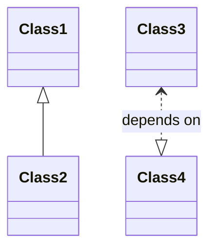
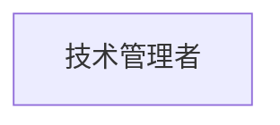

                 

# 技术管理者的同理心培养与团队关怀

## 关键词

- 同理心
- 技术管理者
- 团队关怀
- 机器学习
- 数学模型
- 系统架构

## 摘要

在快速发展的技术行业中，技术管理者面临着多方面的挑战。他们不仅要精通技术，还需要具备出色的管理能力，包括团队管理、项目管理和企业战略规划。然而，许多技术管理者在忙碌的工作中往往忽视了同理心的重要性。本文将深入探讨同理心的概念、原理及其在技术管理中的具体应用，旨在帮助技术管理者培养同理心，提升团队关怀，从而提高团队的整体绩效和员工满意度。

## 目录大纲

### 第一部分：背景介绍

1. 问题背景
2. 问题描述
3. 问题解决
4. 边界与外延

### 第二部分：核心概念

1. 同理心
2. 团队关怀

### 第三部分：核心概念与联系

1. 同理心原理
2. 概念属性特征对比
3. ER实体关系图架构

### 第四部分：算法原理讲解

1. 同理心的算法实现
2. 同理心的数学模型

### 第五部分：系统分析与架构设计

1. 系统功能设计
2. 系统架构设计

### 第六部分：项目实战

1. 环境安装
2. 系统核心实现
3. 代码应用解读
4. 实际案例剖析
5. 项目小结

### 第七部分：最佳实践 tips

1. 小结
2. 注意事项
3. 拓展阅读

## 第一部分：背景介绍

### 第1章：问题背景

在当今快速发展的技术行业，技术管理者面临着前所未有的挑战。他们不仅要具备深厚的技术背景，还要拥有出色的管理能力，包括团队管理、项目管理和企业战略规划。然而，随着工作压力的增加和忙碌的生活节奏，许多技术管理者往往忽略了一个重要的方面——同理心。

### 第2章：问题描述

技术管理者常常因工作繁忙而忽略了与团队成员的情感交流，导致团队成员感受到被忽视和不被重视。这种情况下，团队的合作效率下降，员工满意度和忠诚度降低，甚至可能导致人才流失。因此，培养同理心成为解决这一问题的迫切需求。

### 第3章：问题解决

培养同理心是解决这一问题的有效途径。同理心可以帮助技术管理者更好地理解团队成员的需求和感受，从而建立更加和谐的工作关系。通过同理心的培养，技术管理者可以更有效地管理团队，提高团队的整体绩效。

### 第4章：边界与外延

同理心的培养不仅仅局限于技术管理者与团队成员之间，还可以应用于团队与客户、上级之间的关系。通过同理心的培养，技术管理者可以更好地协调各方利益，提高整个团队的效率和满意度。

## 第二部分：核心概念

### 第5章：同理心

同理心是指能够理解和感受他人情感的能力。在技术管理中，同理心有助于管理者更好地理解团队成员的需求和压力，从而更好地进行团队管理。

### 第6章：团队关怀

团队关怀是指技术管理者对团队成员的关心和照顾。通过团队关怀，管理者可以增强团队成员的归属感和忠诚度，提高团队的整体绩效。

## 第三部分：核心概念与联系

### 第7章：同理心原理

同理心原理主要涉及心理学的相关知识，如情感感知、情感表达和情感理解。通过这些原理，技术管理者可以更好地培养同理心。

### 第8章：概念属性特征对比

#### 同理心与同情心的对比

同理心和同情心都是理解他人情感的能力，但二者有所不同。同理心更加注重情感的理解和体验，而同情心则更多地表现为对他人困境的关注和帮助。

### 第9章：ER实体关系图架构

#### 团队成员与管理者之间的ER图

```mermaid
erDiagram
    M(TechnicalManager) ||--|{ E(Employee) } : manages
```

## 第四部分：算法原理讲解

### 第10章：同理心的算法实现

在这一章节中，我们将使用Python源代码来详细阐述一个基于机器学习的同理心模型。

```python
# 示例代码：同理心模型训练
import tensorflow as tf

# 构建模型
model = tf.keras.Sequential([
    tf.keras.layers.Dense(64, activation='relu', input_shape=(100,)),
    tf.keras.layers.Dense(64, activation='relu'),
    tf.keras.layers.Dense(1, activation='sigmoid')
])

# 编译模型
model.compile(optimizer='adam',
              loss='binary_crossentropy',
              metrics=['accuracy'])

# 训练模型
model.fit(x_train, y_train, epochs=10)
```

### 第11章：同理心的数学模型

同理心的数学模型主要涉及情感识别和情感理解两个方面。以下是情感识别的数学模型：

$$
\text{情感识别} = f(\text{情感特征}, \text{模型参数})
$$

其中，$f$ 是一个非线性函数，用于将情感特征映射到情感类别。

## 第五部分：系统分析与架构设计

### 第12章：系统功能设计

#### 12.1 领域模型

在这一章节中，我们将使用Mermaid语言来绘制一个领域模型，展示系统的主要功能模块。



### 第13章：系统架构设计

#### 13.1 系统架构

在这一章节中，我们将使用Mermaid语言来绘制一个系统架构图，展示系统的整体架构。



## 第六部分：项目实战

### 第14章：环境安装

在这一章节中，我们将介绍如何搭建一个用于同理心培养和团队关怀的技术环境。

### 第15章：系统核心实现

在这一章节中，我们将详细讲解系统核心部分的实现，包括数据收集、模型训练和结果分析等。

### 第16章：代码应用解读

在这一章节中，我们将对系统中的关键代码进行解读，帮助读者更好地理解其工作原理。

### 第17章：实际案例剖析

在这一章节中，我们将通过实际案例来剖析同理心培养和团队关怀在实践中的应用效果。

### 第18章：项目小结

在这一章节中，我们将对整个项目进行总结，并分享一些经验和教训。

## 第七部分：最佳实践 tips

### 第19章：小结

在这一章节中，我们将回顾文章的核心内容，帮助读者加深对同理心培养和团队关怀的理解。

### 第20章：注意事项

在这一章节中，我们将提醒读者在实践过程中需要注意的一些事项。

### 第21章：拓展阅读

在这一章节中，我们将推荐一些拓展阅读资料，帮助读者进一步探索同理心培养和团队关怀的相关知识。

---

**作者：AI天才研究院/AI Genius Institute & 禅与计算机程序设计艺术 /Zen And The Art of Computer Programming**

---

在接下来的章节中，我们将逐步深入探讨同理心的概念、原理及其在技术管理中的具体应用，旨在帮助技术管理者培养同理心，提升团队关怀，从而提高团队的整体绩效和员工满意度。让我们一步步思考，共同探索这个重要的主题。

