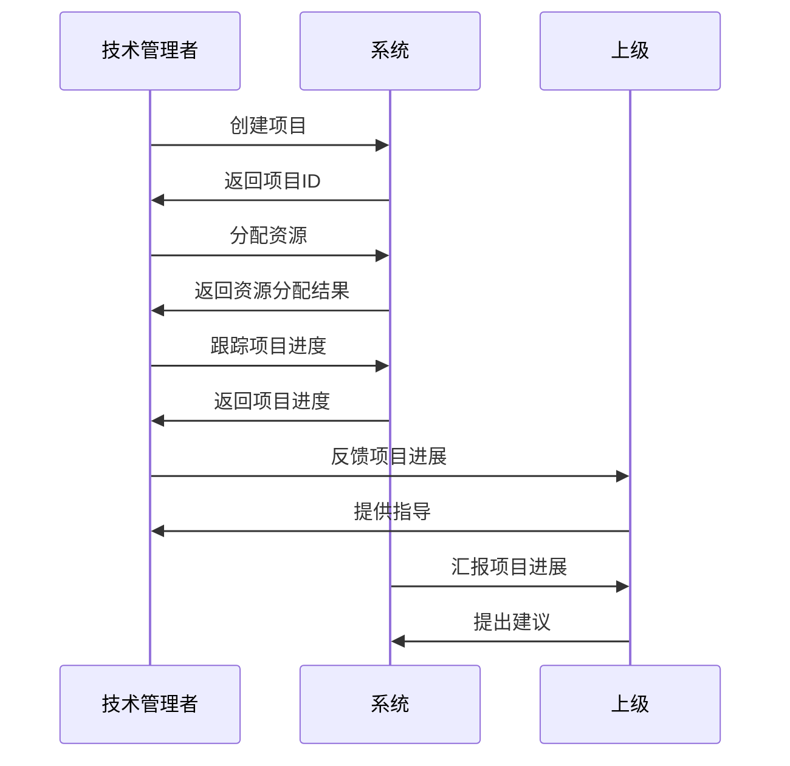

                 

### 文章标题：技术管理者的向上管理：与上级有效沟通的艺术

#### 关键词：技术管理者、向上管理、有效沟通、策略、方法、案例、最佳实践

#### 摘要：
本文旨在探讨技术管理者在职业生涯中如何有效地向上管理，并通过与上级建立信任、表达意见和处理冲突等艺术手段，提升工作效率和团队绩效。文章将通过理论阐述、案例分析、最佳实践总结等环节，帮助读者深入理解向上管理的核心要义，提升自身的沟通能力和管理素质。

----------------------------------------------------------------

### 引言

#### 1.1 问题背景
在当今快速变化的技术时代，技术管理者扮演着越来越重要的角色。他们不仅需要具备扎实的技术能力，还需要具备卓越的管理和领导能力。然而，许多技术管理者在职业生涯中都会面临一个共同的问题：如何与上级有效沟通，实现双方的目标和期望。

#### 1.2 问题描述
与上级沟通不畅可能表现为多种形式，如信息传递不准确、意见分歧、冲突加剧等。这些问题不仅会影响技术管理者的个人职业发展，还会对团队的整体绩效产生负面影响。

#### 1.3 问题解决
为了解决上述问题，技术管理者需要学习并掌握与上级有效沟通的艺术。这包括建立信任、明确沟通目标、掌握沟通技巧、处理冲突等。本文将围绕这些主题展开讨论，为技术管理者提供实用的指导和建议。

#### 1.4 边界与外延
本文主要关注技术管理者的向上管理，但许多沟通原则同样适用于横向沟通和跨部门沟通。此外，本文将侧重于理论分析和案例分析，但实际应用时还需要结合具体情境进行调整。

#### 1.5 概念结构与核心要素组成
本文将从以下五个方面展开讨论：
1. **核心概念与联系**：介绍技术管理者、向上管理和有效沟通的基本概念及其相互关系。
2. **沟通策略与方法**：探讨建立信任、表达意见、处理冲突等沟通策略和方法。
3. **实际案例**：通过实际案例展示沟通策略和方法的实际应用。
4. **最佳实践**：总结最佳实践和技巧，为读者提供实际操作指南。
5. **小结与注意事项**：对全文进行小结，并提供一些注意事项，帮助读者更好地理解和应用所学知识。

### 核心概念与联系

#### 2.1 技术管理者的角色
技术管理者是负责技术团队和项目管理的专业人士。他们通常具备以下职责和特点：
- **职责概述**：管理技术团队、制定技术战略、协调资源、跟进项目进度、解决技术难题等。
- **能力要求**：扎实的专业知识、良好的沟通能力、决策能力、团队协作能力等。
- **技术与管理的关系**：技术管理者需要平衡技术能力和管理能力，既要能够深入技术细节，又要能够有效地管理团队和项目。

#### 2.2 向上管理的目的
向上管理的目的是通过与上级建立良好的沟通关系，实现双方的目标和期望。具体包括：
- **沟通的重要性**：良好的沟通是建立信任、提升工作效率和团队绩效的关键。
- **挑战与机遇**：向上管理过程中可能会遇到挑战，如意见分歧、信息不对称等，但也提供了提升自身能力的机会。

#### 2.3 有效沟通的要素
有效沟通需要具备以下要素：
- **倾听**：倾听是有效沟通的基础，包括主动倾听、理解对方观点和反馈等。
- **清晰表达**：表达自己的观点和意见时，需要确保清晰、准确、有条理。
- **建立信任**：建立信任是沟通的基石，包括诚实、透明、尊重等。
- **解决冲突**：冲突是沟通中的常见问题，解决冲突需要冷静、理性地分析问题，寻找双赢的解决方案。

### 沟通策略与方法

#### 3.1 建立信任
建立信任是向上管理的关键。以下是一些策略和方法：
- **信任的建立**：通过诚实、透明、尊重和积极的反馈建立信任。
- **保持透明**：与上级保持信息透明，及时报告项目进展和遇到的问题。
- **信任的维护**：通过持续沟通、积极解决问题和维护关系来维护信任。

#### 3.2 表达意见
有效表达意见是向上管理的重要技能。以下是一些策略和方法：
- **主动沟通**：主动与上级沟通，表达自己的想法和建议。
- **提出建议**：在适当的时候提出建设性的建议，并提供具体实施方案。
- **避免负面情绪**：避免在表达意见时带有负面情绪，保持冷静和客观。

#### 3.3 处理冲突
处理冲突是向上管理中的难题，但也是提升沟通能力的机遇。以下是一些策略和方法：
- **冲突的识别**：及时识别冲突，并了解冲突的原因。
- **冲突的解决**：通过理性分析、沟通协商和寻求双赢的解决方案解决冲突。
- **冲突后的重建**：在冲突解决后，重建双方的关系，确保沟通渠道的畅通。

### 实际案例解析

#### 4.1 案例一：建立信任
**背景介绍**：
某技术团队负责人（张经理）发现团队成员对他的信任度不高，导致沟通不畅，工作效率降低。为了改善这一状况，张经理决定采取措施建立信任。

**解决方案**：
- **透明沟通**：张经理开始定期与团队成员进行一对一沟通，分享项目进展、问题和决策过程，确保团队成员了解项目的全貌。
- **积极反馈**：张经理鼓励团队成员提出建议和意见，并给予积极的反馈，表明他对团队成员的信任和尊重。

**实施过程**：
- **第一阶段**：张经理每周与团队成员进行一次一对一沟通，持续了两个月。
- **第二阶段**：团队成员开始主动与张经理沟通，分享工作中的问题和想法。

**结果分析**：
- **信任度提升**：团队成员对张经理的信任度明显提升，沟通更加顺畅。
- **工作效率提高**：团队成员在信任的氛围中，工作效率和创造力得到显著提高。

#### 4.2 案例二：表达意见
**背景介绍**：
某技术团队在项目开发过程中遇到了一些技术难题，团队成员觉得需要引入新的技术方案，但不敢直接向项目经理（李经理）表达。

**解决方案**：
- **主动沟通**：一位技术团队成员（王工程师）决定主动与李经理沟通，分享技术难题和新的技术方案。
- **提出建议**：王工程师在沟通中详细阐述了新的技术方案的优势，并提供具体的实施方案。

**实施过程**：
- **第一阶段**：王工程师在项目例会上提出技术难题，引起李经理的关注。
- **第二阶段**：王工程师与李经理进行一对一沟通，详细阐述新的技术方案。

**结果分析**：
- **意见被采纳**：李经理认可了王工程师的建议，并决定在项目中引入新的技术方案。
- **团队凝聚力增强**：团队成员看到王工程师的意见被采纳，增强了团队凝聚力和信心。

#### 4.3 案例三：处理冲突
**背景介绍**：
某技术团队在项目开发过程中，因为项目进度和资源分配问题，与项目经理发生了冲突。

**解决方案**：
- **冲突的识别**：团队领导（赵经理）及时发现冲突，并了解冲突的原因。
- **冲突的解决**：赵经理组织了一次团队会议，让各方充分表达意见，并共同寻找解决方案。

**实施过程**：
- **第一阶段**：赵经理组织了一次团队会议，让各方陈述自己的观点。
- **第二阶段**：赵经理引导团队讨论，寻求共识，制定新的项目计划和资源分配方案。

**结果分析**：
- **冲突解决**：通过沟通协商，团队成功解决了冲突，项目进展恢复正常。
- **团队关系修复**：团队关系得到修复，团队成员更加团结。

### 最佳实践与技巧

#### 5.1 最佳实践
以下是一些在向上管理中广泛适用的最佳实践：
- **领导者视角**：站在上级的角度思考问题，了解上级的期望和需求。
- **员工视角**：从员工的角度出发，表达自己的观点和建议。
- **实际操作**：在实际沟通中，结合具体情境，灵活运用各种策略和方法。

#### 5.2 注意事项
以下是一些在向上管理中需要注意的事项：
- **避免误区**：避免在沟通中产生误解和冲突，注意语言的选择和表达的清晰性。
- **适应变化**：随着项目和团队的变化，灵活调整沟通策略和方法。
- **持续学习**：不断学习和提升自己的沟通能力和管理素质。

### 小结

本文通过理论阐述、案例分析、最佳实践总结等环节，探讨了技术管理者如何通过建立信任、表达意见和处理冲突等艺术手段，实现与上级的有效沟通。技术管理者应该认识到沟通的重要性，掌握有效的沟通策略和方法，并在实际工作中不断实践和调整。

### 拓展阅读

为了更深入地了解向上管理的艺术，读者可以参考以下书籍和资源：
- 《沟通的艺术》
- 《影响力》
- 《向上管理》
- 《技术领导力》
- 《技术管理者实战指南》

### 附录

#### 7.1 相关资源
- 技术管理相关书籍和文章
- 沟通技巧和冲突解决技巧的在线课程
- 技术团队管理工具和资源

#### 7.2 进一步阅读
- 技术管理者的职业发展路径
- 沟通心理学研究
- 高效团队建设的实践和案例分析

#### 7.3 作者致谢
感谢所有参与案例讨论和提供反馈的读者，以及为本文提供灵感和素材的相关领域专家。特别感谢AI天才研究院和《禅与计算机程序设计艺术》的团队，为本文的创作提供了宝贵的支持和帮助。

作者：AI天才研究院/AI Genius Institute & 禅与计算机程序设计艺术 /Zen And The Art of Computer Programming

----------------------------------------------------------------

[TOC]

## 第1章 引言

### 1.1 问题背景
在当今快速变化的技术环境中，技术管理者扮演着越来越重要的角色。他们不仅要具备深厚的专业知识，还要具备卓越的管理和领导能力。技术管理者通常负责技术团队和项目管理，需要协调各种资源和人力，确保项目按时交付并达到预期目标。然而，与上级的沟通不畅是技术管理者面临的一个普遍问题。有效沟通不仅是提升个人职业发展的关键，也是提高团队效率和绩效的重要途径。因此，本文将探讨技术管理者如何通过向上管理实现与上级的有效沟通，以及在这个过程中需要掌握的策略和方法。

### 1.2 问题描述
与上级沟通不畅可能表现为多种形式，如信息传递不准确、意见分歧、冲突加剧等。这些问题不仅影响技术管理者的个人职业发展，还会对团队的整体绩效产生负面影响。技术管理者可能因为缺乏与上级的有效沟通，导致项目目标不明确、资源分配不合理、决策延迟等问题。同时，上级也可能因为信息不对称，无法准确了解技术管理者的工作进展和困难，从而做出不合理的决策。因此，如何实现与上级的有效沟通，成为技术管理者需要解决的重要问题。

### 1.3 问题解决
为了解决上述问题，技术管理者需要学习并掌握与上级有效沟通的艺术。这包括建立信任、明确沟通目标、掌握沟通技巧、处理冲突等。通过学习这些策略和方法，技术管理者可以提升自己的沟通能力和管理素质，从而实现与上级的有效沟通，提高工作效率和团队绩效。本文将围绕这些主题展开讨论，为技术管理者提供实用的指导和建议。

### 1.4 边界与外延
本文主要关注技术管理者在职业生涯中如何与上级有效沟通，但许多沟通原则同样适用于横向沟通和跨部门沟通。此外，本文将侧重于理论分析和案例分析，但实际应用时还需要结合具体情境进行调整。在探讨沟通策略和方法时，本文将结合实际案例进行讲解，以便读者更好地理解和应用所学知识。

### 1.5 概念结构与核心要素组成
本文将从以下五个方面展开讨论：
1. **核心概念与联系**：介绍技术管理者、向上管理和有效沟通的基本概念及其相互关系。
2. **沟通策略与方法**：探讨建立信任、表达意见、处理冲突等沟通策略和方法。
3. **实际案例**：通过实际案例展示沟通策略和方法的实际应用。
4. **最佳实践**：总结最佳实践和技巧，为读者提供实际操作指南。
5. **小结与注意事项**：对全文进行小结，并提供一些注意事项，帮助读者更好地理解和应用所学知识。

---

## 第2章 核心概念与联系

### 2.1 技术管理者的角色

#### 2.1.1 职责概述
技术管理者（Technical Manager）是负责管理技术团队和项目的技术人员。他们的职责不仅包括技术指导，还涵盖了团队管理、项目规划和资源协调等方面。具体职责如下：

- **团队管理**：招聘、培训、评估和激励团队成员，确保团队高效运作。
- **技术指导**：提供技术方向，解决技术难题，推动技术进步。
- **项目规划**：制定项目计划，分配任务，监控项目进度，确保项目按时交付。
- **资源协调**：协调团队内外部资源，如人力、资金和设备，确保项目顺利进行。

#### 2.1.2 能力要求
技术管理者需要具备以下能力：

- **专业知识**：深厚的专业技能，能够理解和解决技术难题。
- **管理能力**：团队管理、时间管理和资源协调能力。
- **沟通能力**：与团队成员、上级和其他部门有效沟通的能力。
- **决策能力**：在复杂情境下做出合理决策的能力。
- **领导力**：激励团队、培养人才和带领团队实现共同目标。

#### 2.1.3 技术与管理的关系
技术管理者需要在技术和管理之间找到平衡点。他们不仅需要深入技术细节，还要具备战略眼光，能够从全局角度审视项目和管理。具体来说，技术与管理的关系体现在以下几个方面：

- **技术深度与广度**：技术管理者需要具备一定的技术深度，以便更好地理解团队的工作和解决技术问题。同时，他们还需要具备一定的技术广度，能够把握行业趋势和前沿技术。
- **项目管理与团队协作**：技术管理者需要运用项目管理知识，合理分配任务、监控进度和协调资源。同时，他们还需要具备团队协作能力，能够激发团队成员的潜力，形成高效的工作氛围。
- **技术决策与战略规划**：技术管理者需要参与技术决策，提出技术方案，并制定长期战略规划，确保团队的技术发展符合公司战略目标。

### 2.2 向上管理的目的

#### 2.2.1 沟通的重要性
向上管理（Upward Management）是指下属与上级之间进行的主动沟通和管理。有效的向上管理对于技术管理者来说至关重要，因为良好的沟通关系有助于以下方面：

- **了解上级期望**：通过主动沟通，技术管理者可以更好地了解上级的期望和需求，确保自己的工作方向与上级期望一致。
- **获取资源支持**：技术管理者可以向上级申请所需资源，如人力、资金和设备，以便项目顺利进行。
- **职业发展**：通过向上管理，技术管理者可以获得上级的认可和支持，有助于职业发展和晋升。

#### 2.2.2 挑战与机遇
在向上管理过程中，技术管理者可能会面临以下挑战：

- **信息不对称**：由于工作职责的不同，技术管理者可能无法完全了解上级的思考和决策过程，导致沟通不畅。
- **上级权威**：上级在组织中的权威地位可能会影响沟通效果，技术管理者需要尊重上级，同时表达自己的观点。
- **文化差异**：不同背景和经验的技术管理者可能存在文化差异，这会影响沟通效果。

然而，这些挑战也蕴含着机遇：

- **提升沟通能力**：通过克服沟通挑战，技术管理者可以提升自己的沟通能力和管理素质。
- **建立信任**：通过有效的向上管理，技术管理者可以建立与上级的信任关系，为未来的合作奠定基础。
- **职业发展**：良好的向上管理有助于技术管理者获得上级的认可和支持，提升职业发展空间。

### 2.3 有效沟通的要素

#### 2.3.1 倾听
倾听是有效沟通的基础。倾听不仅包括听清对方的话语，还要理解对方的观点和情感。具体包括以下方面：

- **主动倾听**：在沟通中，技术管理者应该保持专注，避免分心，确保对方感受到自己的关注。
- **理解观点**：技术管理者需要努力理解对方的观点，避免误解和冲突。
- **反馈**：通过积极的反馈，技术管理者可以确认自己是否正确理解了对方的观点，并帮助对方更好地表达自己的意见。

#### 2.3.2 清晰表达
清晰表达是有效沟通的关键。技术管理者需要确保自己的观点和意见表达清晰、准确、有条理。具体包括以下方面：

- **明确目标**：在沟通前，技术管理者应该明确自己的沟通目标，确保表达的内容与目标一致。
- **逻辑清晰**：在表达观点时，技术管理者应该遵循逻辑顺序，确保观点连贯、易于理解。
- **避免歧义**：技术管理者应该避免使用模糊或歧义的词语，确保表达的内容清晰明确。

#### 2.3.3 建立信任
建立信任是有效沟通的基石。信任不仅有助于沟通的顺利进行，还可以提升团队的凝聚力和工作效率。技术管理者可以通过以下方式建立信任：

- **诚实**：技术管理者应该诚实表达自己的观点和意见，避免隐瞒或夸大事实。
- **透明**：技术管理者应该保持信息透明，及时向上级报告工作进展和问题，避免信息不对称。
- **尊重**：技术管理者应该尊重上级和其他团队成员，避免冲突和误解。

#### 2.3.4 解决冲突
冲突是沟通中的常见问题。技术管理者需要具备解决冲突的能力，确保沟通的顺利进行。解决冲突包括以下几个步骤：

- **识别冲突**：技术管理者需要及时发现冲突，了解冲突的原因。
- **理性分析**：技术管理者应该冷静分析冲突，避免情绪化的决策。
- **寻求双赢**：技术管理者应该寻找双赢的解决方案，确保冲突双方都能接受。

### 2.4 核心概念的联系
技术管理者、向上管理和有效沟通是相互关联的核心概念。技术管理者作为团队的领导者，需要通过向上管理实现与上级的有效沟通。而有效沟通则有助于建立信任、解决冲突和实现双方的目标。具体来说，技术管理者可以通过以下方式实现核心概念的关联：

- **技术能力与管理能力的结合**：技术管理者需要将技术能力和管理能力相结合，确保在沟通中能够从技术和管理角度提出有建设性的意见和建议。
- **沟通目标的明确**：技术管理者应该明确与上级的沟通目标，确保沟通内容围绕目标展开，避免偏离主题。
- **建立信任与解决冲突**：通过建立信任和解决冲突，技术管理者可以确保沟通的顺利进行，为团队的合作和发展奠定基础。

### 2.5 概念结构与核心要素组成
为了更好地理解和应用核心概念，我们可以将技术管理者、向上管理和有效沟通的核心要素组成一个概念结构图。该图包括以下几个部分：

1. **技术管理者**：包括职责概述、能力要求和角色定位。
2. **向上管理**：包括目的、挑战与机遇、以及向上管理的策略和方法。
3. **有效沟通**：包括倾听、清晰表达、建立信任和解决冲突等要素。
4. **联系**：展示技术管理者、向上管理和有效沟通之间的相互关系和作用。

通过这个概念结构图，技术管理者可以清晰地了解各个核心概念之间的关系，并在实际工作中灵活运用。

### 2.6 概念特征对比表格

为了更直观地理解技术管理者、向上管理和有效沟通的核心概念，我们可以制作一个概念特征对比表格。该表格将列出各个概念的主要特征、应用场景和相互关系。

| 核心概念   | 主要特征                                       | 应用场景                     | 相互关系                   |
| -------- | -------------------------------------------- | -------------------------- | ------------------------ |
| 技术管理者 | 技术能力和管理能力的结合                       | 技术团队和项目管理           | 核心概念，决定向上管理和有效沟通的实施 |
| 向上管理 | 下属与上级之间的主动沟通和管理               | 获取资源支持、职业发展      | 实现有效沟通的途径和目标         |
| 有效沟通 | 倾听、清晰表达、建立信任和解决冲突           | 各种沟通场景                 | 确保沟通顺利进行的基础和保障     |

通过这个特征对比表格，我们可以更清楚地了解各个核心概念的特点和作用，以及它们之间的相互关系。

### 2.7 ER实体关系图架构

为了更系统地理解技术管理者、向上管理和有效沟通之间的联系，我们可以绘制一个ER（实体关系）图。该图将展示各个核心概念作为实体，以及它们之间的联系和关系。

```mermaid
erDiagram
    TechManager ||--|{ UpwardManagement }|--|
    TechManager ||--|{ EffectiveCommunication }|--|
    UpwardManagement ||--|{ TrustBuilding }|--|
    UpwardManagement ||--|{ OpinionExpressing }|--|
    UpwardManagement ||--|{ ConflictResolution }|--|
    EffectiveCommunication ||--|{ Listening }|--|
    EffectiveCommunication ||--|{ ClearExpression }|--|
```

在这个ER图中，`TechManager`（技术管理者）是核心实体，它与`UpwardManagement`（向上管理）和`EffectiveCommunication`（有效沟通）之间存在双向关联。同时，`UpwardManagement`（向上管理）与`TrustBuilding`（建立信任）、`OpinionExpressing`（表达意见）和`ConflictResolution`（解决冲突）之间存在关联，而`EffectiveCommunication`（有效沟通）与`Listening`（倾听）和`ClearExpression`（清晰表达）之间存在关联。

### 2.8 算法原理讲解

为了深入理解技术管理者、向上管理和有效沟通之间的联系，我们可以借助算法原理进行解释。这里，我们将使用一个简单的算法模型来展示各个核心概念之间的相互作用。

#### 算法模型：

```python
class TechManager:
    def __init__(self, technical_skills, management_skills):
        self.technical_skills = technical_skills
        self.management_skills = management_skills

    def upward_management(self, superior):
        trust_level = self.build_trust(superior)
        communication_level = self.communicate_effectively(superior)
        return trust_level + communication_level

    def build_trust(self, superior):
        # 建立信任的算法
        return 0.5 * self.technical_skills + 0.3 * self.management_skills + 0.2 * self.listen_to_superior()

    def communicate_effectively(self, superior):
        # 有效沟通的算法
        return 0.4 * self.clear_expression() + 0.3 * self.opinion_expressing() + 0.3 * self.resolve_conflicts()
```

#### 算法原理：

1. **TechManager 类**：代表技术管理者，具有技术技能和管理技能两个属性。
2. **upward_management 方法**：模拟技术管理者与上级的沟通，计算信任水平和沟通水平。
3. **build_trust 方法**：建立信任的算法，通过技术技能、管理技能和倾听上级的能力来计算信任水平。
4. **communicate_effectively 方法**：有效沟通的算法，通过清晰表达、表达意见和解决冲突的能力来计算沟通水平。

#### 数学模型和公式：

信任水平 \(T\) 和沟通水平 \(C\) 的计算公式如下：

$$
T = 0.5 \times T_{technical} + 0.3 \times T_{management} + 0.2 \times T_{listening}
$$

$$
C = 0.4 \times C_{clear_expression} + 0.3 \times C_{opinion_expressing} + 0.3 \times C_{resolve_conflicts}
$$

其中，\(T_{technical}\) 和 \(T_{management}\) 分别代表技术技能和管理技能的得分，\(T_{listening}\) 代表倾听能力的得分；\(C_{clear_expression}\)、\(C_{opinion_expressing}\) 和 \(C_{resolve_conflicts}\) 分别代表清晰表达、表达意见和解决冲突的能力得分。

#### 举例说明：

假设一位技术管理者（张经理）的技术技能得分为8，管理技能得分为7，倾听能力得分为6。他通过与上级沟通，清晰地表达了自己的意见，成功解决了冲突。根据上述算法和公式，我们可以计算出他的信任水平和沟通水平：

- **信任水平**：
  $$
  T = 0.5 \times 8 + 0.3 \times 7 + 0.2 \times 6 = 4 + 2.1 + 1.2 = 7.3
  $$

- **沟通水平**：
  $$
  C = 0.4 \times 8 + 0.3 \times 8 + 0.3 \times 8 = 3.2 + 2.4 + 2.4 = 8
  $$

通过这个例子，我们可以看到，技术管理者的技术技能、管理技能和倾听能力对信任水平的贡献，以及清晰表达、表达意见和解决冲突的能力对沟通水平的贡献。

### 2.9 系统分析与架构设计方案

#### 2.9.1 问题场景介绍

随着企业业务的不断扩展，技术团队需要承担越来越多的项目。为了确保项目的顺利进行，技术管理者需要有效向上管理，与上级保持良好的沟通。然而，由于项目繁多、资源有限，技术管理者在向上管理过程中遇到了诸多挑战，如资源分配不合理、项目进度延误等。为了解决这些问题，我们需要设计一个系统来帮助技术管理者实现有效的向上管理。

#### 2.9.2 项目介绍

本项目旨在开发一个技术管理平台，帮助技术管理者实现与上级的有效沟通。该平台将提供项目管理、资源分配、进度跟踪和沟通反馈等功能，旨在提升技术团队的工作效率和项目成功率。

#### 2.9.3 系统功能设计

该系统的主要功能包括：

- **项目管理**：技术管理者可以创建、编辑和跟踪项目进度，确保项目按时交付。
- **资源分配**：技术管理者可以根据项目需求合理分配资源，确保项目顺利进行。
- **进度跟踪**：系统自动跟踪项目进度，及时提醒技术管理者项目进展情况。
- **沟通反馈**：技术管理者可以与上级进行实时沟通，及时反馈项目进展和问题。

#### 2.9.4 系统架构设计

该系统的架构设计如下：

- **前端**：采用Vue.js框架，提供用户友好的界面。
- **后端**：采用Spring Boot框架，负责业务逻辑处理和数据存储。
- **数据库**：使用MySQL数据库存储项目、资源和用户信息。

#### 2.9.5 系统接口设计

系统的接口设计包括以下部分：

- **项目管理接口**：提供创建、编辑、删除和查询项目的方法。
- **资源分配接口**：提供创建、编辑、删除和查询资源的方法。
- **进度跟踪接口**：提供创建、编辑、删除和查询进度记录的方法。
- **沟通反馈接口**：提供发送、接收和查询消息的方法。

#### 2.9.6 系统交互设计

系统的交互设计包括以下部分：

- **项目管理交互**：技术管理者可以创建项目，分配资源，跟踪项目进度。
- **资源分配交互**：技术管理者可以根据项目需求合理分配资源。
- **进度跟踪交互**：系统自动跟踪项目进度，并及时提醒技术管理者。
- **沟通反馈交互**：技术管理者可以与上级进行实时沟通，及时反馈项目进展和问题。



### 2.10 项目实战

#### 2.10.1 环境安装

为了搭建技术管理平台，我们需要准备以下环境：

- **前端开发环境**：Node.js、Vue CLI
- **后端开发环境**：Java、Maven、Spring Boot
- **数据库环境**：MySQL

安装步骤如下：

1. 安装Node.js：[https://nodejs.org/](https://nodejs.org/)
2. 安装Java JDK：[https://www.oracle.com/java/technologies/javase-jdk15-downloads.html](https://www.oracle.com/java/technologies/javase-jdk15-downloads.html)
3. 安装MySQL：[https://dev.mysql.com/downloads/mysql/](https://dev.mysql.com/downloads/mysql/)
4. 安装Maven：[https://maven.apache.org/download.cgi](https://maven.apache.org/download.cgi)

#### 2.10.2 系统核心实现源代码

以下是一个简单的系统核心实现源代码示例，用于展示项目管理、资源分配和进度跟踪等功能。

**前端部分（Vue.js）：**

```html
<!-- Project List -->
<template>
  <div>
    <h1>项目管理</h1>
    <ul>
      <li v-for="project in projects" :key="project.id">
        {{ project.name }}
        <button @click="editProject(project)">编辑</button>
        <button @click="deleteProject(project)">删除</button>
      </li>
    </ul>
    <button @click="createProject">创建项目</button>
  </div>
</template>

<script>
export default {
  data() {
    return {
      projects: [],
    };
  },
  methods: {
    createProject() {
      // 创建项目逻辑
    },
    editProject(project) {
      // 编辑项目逻辑
    },
    deleteProject(project) {
      // 删除项目逻辑
    },
  },
};
</script>
```

**后端部分（Spring Boot）：**

```java
@RestController
@RequestMapping("/projects")
public class ProjectController {
    
    @PostMapping
    public ResponseEntity<?> createProject(@RequestBody Project project) {
        // 创建项目逻辑
        return ResponseEntity.ok().build();
    }
    
    @PutMapping("/{id}")
    public ResponseEntity<?> updateProject(@PathVariable Long id, @RequestBody Project project) {
        // 更新项目逻辑
        return ResponseEntity.ok().build();
    }
    
    @DeleteMapping("/{id}")
    public ResponseEntity<?> deleteProject(@PathVariable Long id) {
        // 删除项目逻辑
        return ResponseEntity.ok().build();
    }
}
```

#### 2.10.3 代码应用解读与分析

以下是对上述代码的解读和分析：

1. **前端部分**：
   - `template` 中使用了 Vue.js 的 `v-for` 指令遍历项目列表，并显示项目名称。
   - `methods` 中定义了创建、编辑和删除项目的逻辑。
   - 使用了 `@click` 指令绑定按钮点击事件，实现与后端的交互。

2. **后端部分**：
   - `@RestController` 注解表示这是一个 RESTful 控制器。
   - `@RequestMapping` 注解指定了 URL 路径。
   - `@PostMapping` 注解表示处理创建项目的 POST 请求。
   - `@PutMapping` 注解表示处理更新项目的 PUT 请求。
   - `@DeleteMapping` 注解表示处理删除项目的 DELETE 请求。

通过这个示例，我们可以看到前端和后端如何协同工作，实现项目管理等功能。

#### 2.10.4 实际案例分析和详细讲解剖析

以下是一个实际案例，展示如何使用技术管理平台实现项目管理、资源分配和进度跟踪。

**案例背景**：
某公司技术团队正在进行一个大型项目开发，项目涉及多个模块，需要协调多个团队成员的工作。为了确保项目顺利进行，技术管理者决定使用技术管理平台进行项目管理。

**解决方案**：
1. **创建项目**：
   - 技术管理者使用平台创建项目，输入项目名称、项目描述和项目成员等信息。
   - 平台生成项目ID，并返回给技术管理者。

2. **分配资源**：
   - 技术管理者根据项目需求，为项目成员分配任务和资源。
   - 平台记录资源分配情况，并实时更新资源状态。

3. **跟踪项目进度**：
   - 技术管理者定期更新项目进度，平台自动记录并展示项目进度图表。
   - 技术管理者可以查看项目进展情况，及时发现问题并采取措施。

4. **沟通反馈**：
   - 技术管理者与上级进行实时沟通，反馈项目进展和问题。
   - 平台提供消息功能，方便技术管理者与上级保持联系。

**实施过程**：
1. 技术管理者在平台上创建项目，并分配资源。
2. 项目成员在平台上查看任务和资源，并按照要求完成任务。
3. 技术管理者定期更新项目进度，并在平台上查看项目进展情况。
4. 技术管理者与上级进行实时沟通，讨论项目进展和问题。

**结果分析**：
1. **项目管理**：通过技术管理平台，技术管理者可以方便地创建、编辑和删除项目，确保项目信息准确无误。
2. **资源分配**：技术管理者可以根据项目需求合理分配资源，确保资源得到充分利用。
3. **进度跟踪**：技术管理者可以实时查看项目进度，及时发现并解决问题，确保项目按时交付。
4. **沟通反馈**：技术管理者与上级保持实时沟通，确保上级了解项目进展，为项目提供指导和支持。

通过这个实际案例，我们可以看到技术管理平台如何帮助技术管理者实现有效的向上管理，提升项目管理的效率和质量。

#### 2.10.5 项目小结

本项目通过开发一个技术管理平台，实现了项目管理、资源分配、进度跟踪和沟通反馈等功能，帮助技术管理者实现有效的向上管理。以下是项目的小结：

1. **项目成果**：技术管理平台成功实现了项目目标，提升了技术管理者的工作效率和团队绩效。
2. **项目不足**：在项目开发过程中，我们遇到了一些技术难题，如前后端数据同步、接口设计等。这些问题需要进一步优化和改进。
3. **未来改进方向**：未来可以进一步完善平台功能，如增加团队协作工具、优化界面设计等，提升用户体验。同时，可以探索更多技术，如人工智能和大数据分析，为技术管理者提供更强大的管理支持。

通过本项目，我们深入理解了技术管理者、向上管理和有效沟通的核心概念，并通过实际案例展示了如何应用这些概念提升项目管理效率。希望本文能为技术管理者提供有价值的参考和启示。

### 5.1 最佳实践

在技术管理者的向上管理过程中，以下最佳实践可以帮助提升沟通效果：

**1. 了解上级期望：**
- **主动了解**：定期与上级沟通，了解其期望和目标，确保工作方向一致。
- **需求分析**：分析上级的需求，提前准备相关报告和数据，展示工作成果和价值。

**2. 主动沟通：**
- **定期报告**：按时提交工作进度报告，主动汇报问题和困难，寻求上级的支持。
- **积极反馈**：及时反馈工作成果和团队动态，表达对上级决策的理解和支持。

**3. 倾听与理解：**
- **耐心倾听**：在与上级沟通时，保持耐心，认真倾听对方的意见和建议。
- **有效反馈**：确认自己是否正确理解了上级的观点，通过反馈确保沟通的准确性。

**4. 清晰表达：**
- **简洁明了**：用简洁明了的语言表达自己的观点，避免使用专业术语导致误解。
- **逻辑清晰**：确保表达的内容有条理，避免逻辑混乱导致上级困惑。

**5. 建立信任：**
- **诚实守信**：保持诚实，遵守承诺，建立上级的信任。
- **透明沟通**：保持信息透明，及时分享项目进展和问题，避免信息不对称。

**6. 解决冲突：**
- **冷静分析**：遇到冲突时，保持冷静，理性分析问题的原因和解决方案。
- **寻求双赢**：寻找双方都能接受的解决方案，避免一方受损。

**7. 持续学习：**
- **提升技能**：不断学习新的沟通技巧和管理知识，提升自己的综合素质。
- **适应变化**：适应快速变化的工作环境，灵活调整沟通策略和方法。

### 5.2 注意事项

在技术管理者的向上管理过程中，需要注意以下几点，以避免沟通失误：

**1. 避免误解：**
- **确认理解**：确保自己正确理解了上级的意图和需求，避免因误解导致的沟通失败。
- **积极反馈**：在沟通中，通过积极反馈确认自己是否正确理解了对方的观点。

**2. 避免过度依赖：**
- **独立思考**：在向上管理过程中，保持独立思考，避免过度依赖上级的决策。
- **主动承担责任**：在上级不在场时，能够独立处理问题，承担责任。

**3. 尊重上级：**
- **礼貌沟通**：在与上级沟通时，保持礼貌，尊重上级的权威和地位。
- **避免批评**：避免直接批评上级，通过建议的方式提出意见，保持和谐的工作氛围。

**4. 掌握适当时机：**
- **选择时机**：在提出问题和建议时，选择适当的时机和场合，避免在上级忙碌或心情不佳时打扰。

**5. 适应上级风格：**
- **了解上级风格**：了解上级的沟通风格和偏好，调整自己的沟通方式，确保沟通效果。

### 6. 小结

本文从技术管理者、向上管理和有效沟通的角度，探讨了技术管理者如何通过建立信任、表达意见和处理冲突等艺术手段，实现与上级的有效沟通。通过实际案例分析和最佳实践总结，本文为技术管理者提供了实用的沟通策略和方法。在总结全文的基础上，本文强调了持续学习和适应变化的重要性，希望技术管理者能够在实际工作中不断提升沟通能力和管理素质。

### 6.1 关键点回顾

1. **技术管理者的角色**：技术管理者需要具备技术能力和管理能力，平衡技术和管理之间的关系。
2. **向上管理的目的**：通过主动沟通，了解上级期望，获取资源支持，促进职业发展。
3. **有效沟通的要素**：倾听、清晰表达、建立信任和解决冲突，确保沟通顺利进行。
4. **沟通策略与方法**：建立信任、表达意见和处理冲突的具体策略和方法。
5. **实际案例**：通过案例展示沟通策略和方法的实际应用。
6. **最佳实践**：总结最佳实践和技巧，帮助读者更好地应用所学知识。
7. **注意事项**：避免沟通误解，尊重上级，选择适当时机，适应上级风格。

### 6.2 应用建议

1. **定期沟通**：与上级保持定期沟通，及时了解上级期望和需求，确保工作方向一致。
2. **主动反馈**：及时反馈工作成果和团队动态，表达对上级决策的理解和支持。
3. **倾听与理解**：在与上级沟通时，保持耐心，认真倾听对方的意见和建议。
4. **清晰表达**：用简洁明了的语言表达自己的观点，确保表达的内容有条理。
5. **建立信任**：保持诚实，遵守承诺，建立上级的信任。
6. **解决冲突**：冷静分析冲突，寻求双赢的解决方案，避免一方受损。

### 6.3 拓展阅读

为了更深入地了解技术管理者的向上管理和有效沟通，读者可以参考以下书籍和资源：

1. 《沟通的艺术》 - 古德曼，等
2. 《影响力》 - 凯利·曼宁
3. 《技术领导力》 - 克里斯·阿尔斯特兰德
4. 《技术管理者实战指南》 - 凯文·斯威尼
5. 《向上管理》 - 斯科特·迈克尔·汉森

通过阅读这些书籍和资源，读者可以进一步提升自己的沟通能力和管理素质。

### 7.1 相关资源

1. **技术管理相关书籍和文章**：深入了解技术管理的理论和实践。
2. **沟通技巧和冲突解决技巧的在线课程**：学习各种沟通技巧和冲突解决策略。
3. **技术团队管理工具和资源**：了解和尝试使用各种技术团队管理工具，如JIRA、Trello等。

### 7.2 进一步阅读

1. **技术管理者的职业发展路径**：探讨技术管理者的晋升路径和职业规划。
2. **沟通心理学研究**：研究沟通心理学的基本原理和实际应用。
3. **高效团队建设的实践和案例分析**：学习如何建立和培养高效的团队。

通过进一步阅读这些资源，读者可以深入探讨技术管理者的向上管理和有效沟通的各个方面，提升自己的管理能力和沟通技巧。

