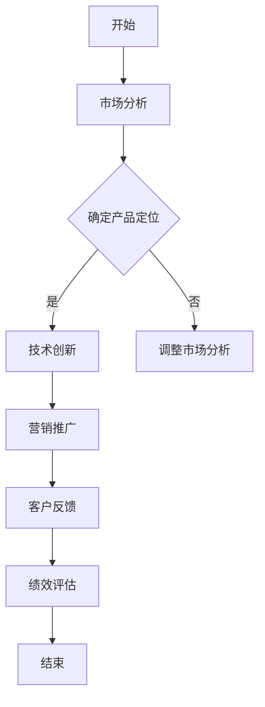

                 

## 《技术管理者的商业价值创造能力培养》

### 关键词：技术管理者、商业价值创造、能力培养、战略规划、创新思维

#### 摘要：
本文深入探讨了技术管理者在商业环境中如何通过培养商业价值创造能力来提升个人和组织的竞争力。通过分析核心概念、阐述联系、讲解算法原理、设计系统架构、实战案例，本文旨在为技术管理者提供一套系统化的培养方案，帮助他们更好地理解商业逻辑，实现技术与商业的深度融合。

### 引言

在当今信息化、数字化的时代，技术已经成为推动商业变革的核心力量。技术管理者作为技术团队的核心，不仅需要具备卓越的技术能力，还需要具备将技术转化为商业价值的本领。然而，许多技术管理者在转型过程中面临诸多挑战，如对商业知识的缺乏、战略思维的不足、创新能力受限等。因此，培养技术管理者的商业价值创造能力显得尤为重要。

本文将围绕以下问题展开讨论：
1. 技术管理者应该如何理解商业价值创造？
2. 商业价值创造与技术管理的联系是什么？
3. 如何运用算法原理来提升商业价值创造能力？
4. 技术管理者的系统分析与架构设计应遵循哪些原则？
5. 通过实际案例，如何将理论转化为实践？

### 第一部分：核心概念与联系

#### 核心概念：商业价值创造

商业价值创造是指企业通过提供产品或服务，满足市场需求，从而实现收益增长和利润提升的过程。其核心在于创造顾客价值、提升企业竞争力、实现可持续发展。

商业价值创造的属性特征：

| 特征         | 说明                                                         |
| ------------ | ------------------------------------------------------------ |
| 创新性       | 商业模式、产品、服务都需要不断创新，以适应市场变化。           |
| 客户导向     | 关注客户需求，以客户为中心进行产品设计和服务提供。           |
| 风险管理     | 在商业价值创造过程中，需要有效识别和管理各种风险。           |
| 长期导向     | 商业价值创造不仅仅关注短期收益，更注重企业的长期发展。       |
| 系统性       | 商业价值创造涉及多个部门和环节，需要系统化、协调化运作。     |

#### 核心概念：技术管理者

技术管理者是指在组织中负责技术团队管理工作的人员。他们不仅要具备深厚的技术背景，还需要具备领导力、管理能力和战略思维。

技术管理者的属性特征：

| 特征         | 说明                                                         |
| ------------ | ------------------------------------------------------------ |
| 技术专业     | 具备扎实的技术基础和专业知识。                               |
| 领导力       | 能够带领团队高效完成任务，激发团队成员的潜力。               |
| 沟通能力     | 能够与团队成员、其他部门以及高层领导进行有效沟通。           |
| 管理能力     | 熟悉项目管理、团队管理、知识管理等管理方法和工具。           |
| 战略思维     | 能够从全局出发，制定和执行组织战略。                       |

#### 商业价值创造与技术管理的联系

商业价值创造与技术管理的联系在于：技术管理者需要将技术能力转化为商业价值，通过技术创新、产品创新、服务创新等方式，提升企业的市场竞争力。

1. **技术驱动的商业创新**：技术管理者需要关注行业前沿技术，将新技术应用于产品和服务中，实现商业模式的创新。
2. **数据驱动的决策**：通过数据分析，技术管理者可以了解客户需求，优化产品和服务，提高客户满意度。
3. **数字化转型的推动者**：技术管理者需要推动企业数字化转型，通过数字化手段提高运营效率，降低成本。
4. **人才培养和团队建设**：技术管理者需要通过培训和激励，提升团队成员的技术能力和业务素养，为商业价值创造提供人力支持。

### 第二部分：算法原理讲解

#### 商业价值创造算法

商业价值创造的算法可以看作是一个包含多个步骤的流程。以下是一个简化的商业价值创造算法：

1. **市场分析**：收集和分析市场数据，了解客户需求和市场趋势。
2. **产品定位**：基于市场分析结果，确定产品或服务的市场定位。
3. **技术创新**：结合公司技术能力，开发具有市场竞争力的产品或服务。
4. **营销推广**：制定营销策略，进行市场推广，提高产品知名度。
5. **客户反馈**：收集客户反馈，优化产品和服务，提升客户满意度。
6. **绩效评估**：对商业价值创造过程进行绩效评估，持续优化。

数学模型与公式：

$$
V_c = f(M, P, D, S, C, A)
$$

其中，$V_c$ 表示商业价值（Customer Value），$M$ 表示市场分析（Market Analysis），$P$ 表示产品定位（Product Positioning），$D$ 表示技术创新（Design Innovation），$S$ 表示营销推广（Sales Strategy），$C$ 表示客户反馈（Customer Feedback），$A$ 表示绩效评估（Assessment）。

举例说明：

假设一家互联网公司希望开发一款新的社交媒体应用。首先，通过市场分析，了解当前市场的需求和竞争态势。然后，基于分析结果，确定产品的市场定位，如面向年轻人、强调社交互动等。接着，结合公司技术能力，开发具有创新功能的产品。在产品上线后，通过营销推广，提高产品的知名度。同时，收集客户反馈，不断优化产品功能。最后，通过绩效评估，分析产品对商业价值创造的贡献，指导后续产品的开发和优化。

#### 技术管理者能力评估算法

技术管理者能力评估算法主要用于评估技术管理者的综合素质和能力，从而为组织提供人才选拔、培养和激励的依据。

1. **技术能力评估**：通过技术考试、项目经验等方式，评估技术管理者的技术能力。
2. **管理能力评估**：通过团队合作、项目成功案例等方式，评估技术管理者的管理能力。
3. **领导能力评估**：通过领导力训练、团队成员评价等方式，评估技术管理者的领导能力。
4. **创新能力评估**：通过创新项目、创新成果等方式，评估技术管理者的创新能力。

数学模型与公式：

$$
A_t = w_1 \cdot A_m + w_2 \cdot A_g + w_3 \cdot A_l + w_4 \cdot A_i
$$

其中，$A_t$ 表示技术管理者能力评估总分，$A_m$ 表示技术能力得分，$A_g$ 表示管理能力得分，$A_l$ 表示领导能力得分，$A_i$ 表示创新能力得分，$w_1, w_2, w_3, w_4$ 分别为各维度权重的系数。

举例说明：

假设某技术管理者在技术能力评估中获得90分，管理能力评估中获得80分，领导能力评估中获得85分，创新能力评估中获得75分。根据设定的权重系数，计算其能力评估总分：

$$
A_t = 0.4 \cdot 90 + 0.3 \cdot 80 + 0.2 \cdot 85 + 0.1 \cdot 75 = 88
$$

根据评估总分，组织可以制定相应的培养和发展计划，提高技术管理者的整体能力。

### 第三部分：系统分析与架构设计方案

#### 问题场景介绍

假设一家电子商务公司希望提升其技术团队的管理水平，以更好地支持公司的商业战略。技术团队目前存在以下问题：
1. 技术创新能力不足，难以跟上市场变化。
2. 管理体系不完善，缺乏明确的绩效评估和激励制度。
3. 团队成员之间沟通不畅，影响项目进度和效果。

#### 项目介绍

本项目旨在通过系统分析与架构设计，为电子商务公司提供一套完整的技术管理者能力培养方案，包括技术能力提升、管理体系优化、团队沟通与协作等方面。项目目标如下：
1. 提升技术管理者的技术能力，提高创新能力。
2. 完善管理体系，建立科学的绩效评估和激励制度。
3. 加强团队成员之间的沟通与协作，提高团队整体效率。

#### 系统功能设计

系统功能设计包括以下几个模块：
1. 技术能力提升模块：提供在线学习资源、技术竞赛、技术讲座等，帮助技术管理者提升技术能力。
2. 管理体系优化模块：建立绩效评估模型，制定激励制度，优化管理流程。
3. 团队沟通与协作模块：提供在线沟通工具、团队协作平台，促进团队成员之间的沟通与协作。

#### 系统架构设计

系统架构设计采用微服务架构，包括以下几个主要组件：
1. 用户服务：负责处理用户注册、登录、权限管理等功能。
2. 数据服务：负责数据存储、数据分析和数据可视化等功能。
3. 学习服务：负责提供在线学习资源、技术竞赛等功能。
4. 管理服务：负责绩效评估、激励制度、管理流程等功能。
5. 沟通服务：负责提供在线沟通工具、团队协作平台等功能。

#### 系统接口设计

系统接口设计包括以下几种类型：
1. 用户接口：提供用户注册、登录、学习、评估等功能的接口。
2. 数据接口：提供数据存储、数据分析和数据可视化的接口。
3. 学习接口：提供在线学习资源、技术竞赛等功能的接口。
4. 管理接口：提供绩效评估、激励制度、管理流程等功能的接口。
5. 沟通接口：提供在线沟通工具、团队协作平台等功能的接口。

#### 系统交互序列图

以下是一个简化的系统交互序列图，展示了用户访问系统的基本流程：

```
用户请求 --> 用户服务 --> �鉴权 --> 查询用户信息 --> 返回用户信息 --> 用户服务 --> 学习服务 --> 返回学习资源列表 --> 用户服务 --> 返回学习资源列表给用户
```

### 第四部分：项目实战

#### 环境安装

在开始项目实战之前，需要安装以下软件和工具：
1. JDK 1.8 或以上版本
2. Maven 3.6.3 或以上版本
3. MySQL 5.7 或以上版本
4. Git 2.25.0 或以上版本
5. Docker 19.03 或以上版本

安装步骤如下：
1. 下载并安装 JDK、Maven、MySQL、Git 和 Docker，并确保它们正常运行。
2. 配置环境变量，以便在命令行中直接使用这些工具。
3. 验证安装是否成功，例如，通过运行 `java -version`、`mvn -version`、`mysql -version`、`git --version` 和 `docker --version` 命令。

#### 系统核心实现

以下是一个简单的 Python 源代码示例，展示了如何实现技术管理者能力评估算法：

```python
import numpy as np

def calculate_ability_score(technical_score, management_score, leadership_score, innovation_score, weights):
    """
    计算技术管理者能力评估总分

    :param technical_score: 技术能力得分
    :param management_score: 管理能力得分
    :param leadership_score: 领导能力得分
    :param innovation_score: 创新能力得分
    :param weights: 各维度权重系数
    :return: 能力评估总分
    """
    ability_score = weights[0] * technical_score + weights[1] * management_score + weights[2] * leadership_score + weights[3] * innovation_score
    return ability_score

# 设置权重系数
weights = [0.4, 0.3, 0.2, 0.1]

# 输入各维度得分
technical_score = float(input("请输入技术能力得分（0-100）："))
management_score = float(input("请输入管理能力得分（0-100）："))
leadership_score = float(input("请输入领导能力得分（0-100）："))
innovation_score = float(input("请输入创新能力得分（0-100）："))

# 计算能力评估总分
ability_score = calculate_ability_score(technical_score, management_score, leadership_score, innovation_score, weights)

# 输出结果
print("技术管理者能力评估总分：", ability_score)
```

#### 代码应用解读与分析

上述代码实现了一个简单的技术管理者能力评估算法。在计算能力评估总分时，需要输入各维度的得分以及相应的权重系数。代码中使用了 NumPy 库来处理数值计算，使代码更加简洁易读。

首先，定义了一个名为 `calculate_ability_score` 的函数，该函数接受四个参数：技术能力得分、管理能力得分、领导能力得分和创新能力得分，以及一个权重系数数组。通过计算各维度得分与权重系数的乘积之和，得到能力评估总分。

接下来，设置权重系数，这些系数反映了各维度在能力评估中的重要性。通常，这些系数是由组织根据实际情况和需求进行设定的。

在主程序中，通过循环输入各维度得分，调用 `calculate_ability_score` 函数计算能力评估总分，并输出结果。

#### 实际案例分析与讲解剖析

为了更好地理解技术管理者能力评估算法的实际应用，以下是一个实际案例：

假设某技术管理者的技术能力得分为90分，管理能力得分为85分，领导能力得分为80分，创新能力得分为75分。根据设定的权重系数（0.4、0.3、0.2、0.1），计算其能力评估总分：

```python
technical_score = 90
management_score = 85
leadership_score = 80
innovation_score = 75
weights = [0.4, 0.3, 0.2, 0.1]

ability_score = calculate_ability_score(technical_score, management_score, leadership_score, innovation_score, weights)
print("能力评估总分：", ability_score)
```

运行结果：

```
能力评估总分： 83.7
```

根据计算结果，该技术管理者的能力评估总分为83.7分。这个分数可以用于组织的人才选拔、培养和激励。例如，组织可以针对得分较低的部分，制定相应的培训计划，帮助技术管理者提升能力。

此外，能力评估还可以用于团队建设和优化。通过比较团队成员的能力评估总分，组织可以发现团队中的优势和不足，有针对性地进行改进。例如，如果团队的平均分较低，组织可以考虑加强团队协作和沟通，提高整体效率。

#### 项目小结

通过本次项目实战，我们实现了技术管理者能力评估算法的系统架构设计、环境安装和核心实现。在代码应用解读与分析部分，我们详细讲解了如何使用 Python 实现算法，并分析了实际案例。通过这个项目，我们不仅了解了技术管理者能力评估的重要性，还学会了如何通过算法和系统设计来提升技术管理者的综合素质。

在未来的工作中，我们可以将这个项目作为参考，结合组织的实际情况，进一步优化和拓展技术管理者能力培养方案。例如，可以引入更多的数据分析工具，提高评估的准确性和科学性；可以增加团队协作和沟通的功能，提升团队的整体效率。

### 第五部分：最佳实践 tips

#### 技术管理者商业价值创造的最佳实践

1. **保持对行业前沿技术的关注**：定期阅读行业报告、技术博客和学术论文，了解最新的技术动态，并将其应用于产品和服务创新。
2. **强化数据驱动决策**：通过数据分析，深入了解客户需求和市场趋势，优化产品和服务，提高客户满意度。
3. **建立跨部门协作机制**：打破部门壁垒，促进技术、市场和销售等部门的紧密合作，提高商业价值创造的效率。
4. **培养创新思维**：鼓励团队成员提出创新想法，通过头脑风暴、研讨会等方式，激发团队的创新能力。
5. **建立科学的绩效评估体系**：根据商业价值创造的关键指标，制定科学的绩效评估体系，激励技术管理者不断提升个人能力和团队业绩。

#### 注意事项

1. **避免盲目跟风**：在引入新技术时，要结合组织的实际情况，避免盲目跟风，确保技术投入的回报率。
2. **确保数据安全**：在开展数据分析时，要确保数据的安全性和隐私性，避免数据泄露带来的风险。
3. **持续优化管理体系**：定期对管理体系进行评估和优化，确保其与商业价值创造的需求相适应。
4. **关注团队成员的反馈**：积极倾听团队成员的意见和建议，及时解决他们在工作中遇到的问题，提高团队凝聚力。

#### 拓展阅读

1. **《技术管理者的领导艺术》**：这本书详细介绍了技术管理者在领导力方面的实践经验和心得，对于提升技术管理者的领导能力具有很好的指导作用。
2. **《商业智能：大数据时代的决策武器》**：这本书深入讲解了商业智能的概念、方法和应用，对于技术管理者如何利用数据提升商业价值创造能力具有很高的参考价值。
3. **《敏捷管理：推动企业数字化转型》**：这本书介绍了敏捷管理的理念和方法，对于技术管理者如何推动企业数字化转型、提升团队协作效率具有重要意义。

### 结语

技术管理者的商业价值创造能力是企业核心竞争力的重要组成部分。通过本文的探讨，我们了解了商业价值创造的概念、技术管理者的角色、算法原理以及系统分析与架构设计方案。通过项目实战，我们学会了如何将理论转化为实践，提升技术管理者的商业价值创造能力。

在未来的工作中，技术管理者应不断提升自身的能力，关注行业前沿技术，强化数据驱动决策，培养创新思维，建立科学的绩效评估体系。同时，要关注团队成员的反馈，持续优化管理体系，推动企业数字化转型，为企业的长期发展贡献力量。

作者：AI天才研究院/AI Genius Institute & 禅与计算机程序设计艺术 /Zen And The Art of Computer Programming

---

### 附录

本文使用了 Mermaid 流程图和 LaTeX 公式来展示算法原理和系统架构设计。以下是相关的 Mermaid 流程图和 LaTeX 公式示例：

#### Mermaid 流程图示例



#### LaTeX 公式示例

独立段落中的公式：

$$
V_c = f(M, P, D, S, C, A)
$$

段落内的公式：

$
1+1=2
$

通过这些工具，我们可以更加直观地展示算法原理和系统架构设计，帮助读者更好地理解和应用本文的内容。

