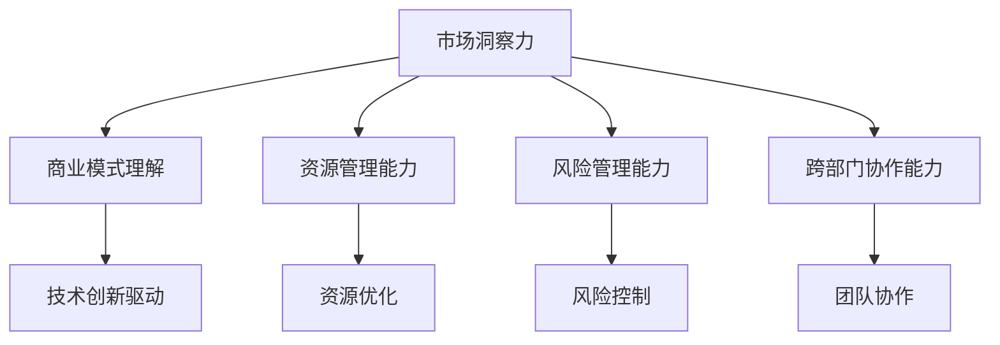
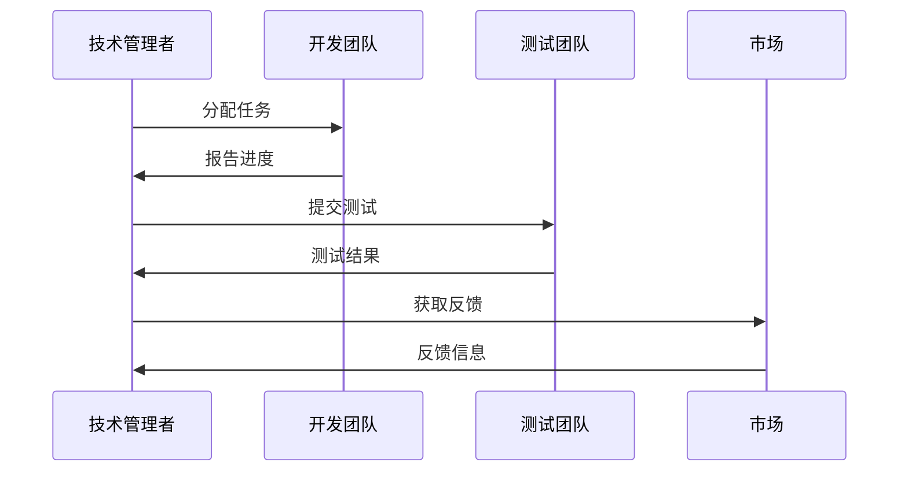
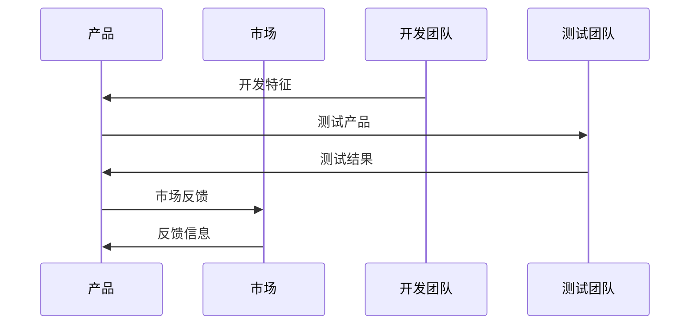

                 

## 《技术管理者的商业敏感度培养》

### 关键词：技术管理者、商业敏感度、技术创新、系统分析与架构设计

> 摘要：本文将深入探讨技术管理者如何培养商业敏感度，以更好地推动技术创新和业务发展。通过系统的分析与架构设计，结合实际项目和最佳实践，提供了一套完整的商业敏感度培养方案。文章结构清晰，逻辑严密，旨在帮助技术管理者在职业发展中提升商业洞察力和管理能力。

## 引言

技术管理者的角色在当今快速变化的商业环境中愈发重要。随着数字化转型的深入推进，技术已成为驱动企业增长的关键力量。然而，技术管理者不仅需要具备卓越的技术能力，还必须具备深厚的商业敏感度。商业敏感度是指技术管理者对市场动态、用户需求、商业模式等商业要素的敏锐感知和理解能力。

商业敏感度的重要性体现在以下几个方面：

1. **决策支持**：技术管理者在制定战略和技术决策时，需要充分考虑商业因素，如市场需求、成本效益等。
2. **资源分配**：技术管理者需要合理分配资源，确保技术投入与商业目标相一致。
3. **风险管理**：技术管理者需要预见技术变化可能带来的风险，并制定相应的风险管理策略。
4. **团队协作**：技术管理者需要与业务团队紧密协作，确保技术解决方案与业务需求相匹配。

因此，培养商业敏感度对于技术管理者来说至关重要。本文将分步骤探讨如何培养这一能力，并提供具体的实践方法和案例。

### 第一部分：背景介绍

#### 1.1 问题背景

在现代企业中，技术管理者往往面临诸多商业挑战。这些挑战包括：

1. **技术发展与市场需求的错位**：技术管理者需要确保技术创新与市场需求相匹配，但市场变化往往迅速，技术发展难以完全预见。
2. **资源分配的困境**：技术管理者需要在有限的资源下，做出最优的技术投资决策，以支持企业战略目标。
3. **跨部门协作的难题**：技术管理者需要与业务团队、市场团队等多个部门协作，协调资源、目标和进度。
4. **风险管理的压力**：技术管理者需要预见技术变革带来的潜在风险，并制定有效的风险管理策略。

这些挑战表明，技术管理者不仅需要深厚的专业知识，还需要具备良好的商业敏感度，以应对复杂多变的商业环境。

#### 1.2 核心概念

**商业敏感度** 是指技术管理者对商业要素的感知和理解能力，包括：

1. **市场需求**：对用户需求和市场趋势的敏锐洞察。
2. **商业模式**：对商业模式的理解和分析能力。
3. **资源分配**：对资源使用效率的评估和优化能力。
4. **风险识别**：对潜在风险的预见和应对能力。

商业敏感度与技术创新能力密切相关。一个具备高商业敏感度的技术管理者能够更好地理解市场需求，推动技术创新，实现技术价值最大化。

#### 1.3 商业敏感度的关键要素

商业敏感度由以下几个关键要素组成：

1. **市场洞察力**：通过市场调研、用户反馈等方式，深入理解市场动态和用户需求。
2. **商业模式理解**：对各种商业模式的深入分析，包括盈利模式、价值链等。
3. **资源管理能力**：在有限资源下，优化资源分配，提高资源利用效率。
4. **风险管理意识**：预见潜在风险，制定有效的风险控制策略。
5. **跨部门协作能力**：与业务团队、市场团队等跨部门协作，确保项目成功。

### 第二部分：核心概念与联系

#### 2.1 商业敏感度模型

**商业敏感度模型** 是一个用于描述商业敏感度构成及其相互关系的理论框架。该模型通常包括以下几个部分：

1. **市场洞察力模块**：包括市场调研、用户反馈分析等工具和方法，用于获取市场信息和用户需求。
2. **商业模式理解模块**：包括对盈利模式、价值链等商业模式要素的深入分析。
3. **资源管理模块**：包括资源分配、成本控制等工具和方法，用于优化资源使用效率。
4. **风险管理模块**：包括风险识别、风险评估、风险应对等工具和方法，用于管理技术变革带来的风险。
5. **跨部门协作模块**：包括沟通技巧、团队协作机制等，用于促进跨部门协作。

#### 2.2 商业敏感度与技术创新的关系

商业敏感度与技术创新之间存在紧密的联系。商业敏感度有助于技术管理者更好地理解市场需求，从而推动技术创新，实现技术价值最大化。

1. **市场需求驱动**：商业敏感度使得技术管理者能够快速响应市场需求，推动技术创新。
2. **商业模式创新**：商业敏感度有助于技术管理者发现新的商业模式，从而实现技术创新。
3. **资源优化**：商业敏感度有助于技术管理者优化资源分配，提高技术创新的效率和效果。
4. **风险管理**：商业敏感度有助于技术管理者预见技术变革带来的风险，并制定有效的风险管理策略。

#### 2.3 商业敏感度的关键要素对比表格

| 要素               | 描述                                                         | 关联性                                                       |
|--------------------|------------------------------------------------------------|------------------------------------------------------------|
| 市场洞察力         | 对市场动态和用户需求的敏锐感知和理解。                         | 市场洞察力是商业敏感度的核心，直接影响技术创新的针对性。           |
| 商业模式理解       | 对各种商业模式的深入分析，包括盈利模式、价值链等。             | 商业模式理解有助于技术管理者选择合适的技术方向，实现商业价值。     |
| 资源管理能力       | 在有限资源下，优化资源分配，提高资源利用效率。                 | 资源管理能力直接影响技术创新的成本和效率。                     |
| 风险管理意识       | 预见潜在风险，制定有效的风险控制策略。                         | 风险管理能力确保技术创新过程的安全性，减少风险带来的负面影响。   |
| 跨部门协作能力     | 与业务团队、市场团队等跨部门协作，确保项目成功。               | 跨部门协作能力促进技术创新的顺利实施，提高团队的整体效率。       |

#### 2.4 商业敏感度模型的Mermaid流程图



### 第三部分：算法原理讲解

#### 3.1 商业敏感度培养的算法原理

商业敏感度培养算法基于以下核心思想：

$$
\text{商业敏感度} = f(\text{技术创新}, \text{市场反馈})
$$

其中，技术创新和市场反馈是商业敏感度培养的关键因素。

1. **技术创新**：技术创新是商业敏感度的核心驱动因素。通过持续的技术创新，技术管理者能够更好地满足市场需求，推动业务增长。
2. **市场反馈**：市场反馈提供了对技术创新效果的实时监测和评估。技术管理者需要充分利用市场反馈，调整技术创新方向和策略。

#### 3.2 算法原理详解

**技术创新的数学模型**：

$$
\text{技术创新} = f(\text{市场需求}, \text{技术储备})
$$

其中，市场需求和技术储备是技术创新的核心要素。

1. **市场需求**：市场需求决定了技术创新的方向和目标。技术管理者需要通过市场调研、用户反馈等手段，深入理解市场需求。
2. **技术储备**：技术储备是技术创新的基础。技术管理者需要不断积累技术知识和经验，提高技术创新的能力。

**市场反馈的数学模型**：

$$
\text{市场反馈} = f(\text{技术创新}, \text{用户满意度})
$$

其中，技术创新和用户满意度是市场反馈的核心要素。

1. **技术创新**：技术创新直接影响市场反馈。技术管理者需要通过技术创新，提高产品或服务的竞争力。
2. **用户满意度**：用户满意度是市场反馈的重要指标。技术管理者需要关注用户满意度，通过持续改进，提升用户满意度。

#### 3.3 算法原理举例说明

假设某技术管理者想要提升公司的商业敏感度，可以采取以下步骤：

1. **市场需求分析**：通过市场调研，了解用户需求和行业趋势。
2. **技术储备评估**：评估公司的技术储备，确定技术创新的方向。
3. **技术创新实施**：根据市场需求和技术储备，实施技术创新，开发新产品或服务。
4. **市场反馈监测**：通过用户反馈，监测技术创新的效果，调整创新方向。
5. **持续改进**：根据市场反馈，不断改进产品或服务，提升用户满意度。

### 第四部分：系统分析与架构设计方案

#### 4.1 问题场景介绍

假设某技术管理者负责一家科技公司的新产品开发项目。该项目旨在开发一款满足市场需求的创新型产品。技术管理者需要确保技术创新与市场需求相匹配，同时优化资源分配，降低风险。

#### 4.2 系统功能设计

**领域模型Mermaid类图**：

```mermaid
classDiagram
    Product <- ProductFeature
    MarketFeedback --> Product
    TechnicalManager --> Product
    Developer --> Product
    Tester --> Product
    
    class Product {
        +String name
        +List<ProductFeature> features
        +double cost
        +double revenue
    }
    
    class ProductFeature {
        +String name
        +double cost
        +double revenue
    }
    
    class MarketFeedback {
        +String feedback
        +double satisfaction
    }
    
    class TechnicalManager {
        +String name
        +manageProduct(Product p)
    }
    
    class Developer {
        +String name
        +developFeature(ProductFeature f)
    }
    
    class Tester {
        +String name
        +testProduct(Product p)
    }
```

#### 4.3 系统架构设计

**系统架构Mermaid架构图**：



#### 4.4 系统接口设计

**系统接口设计**：

- **产品管理接口**：用于管理产品的功能，包括添加、删除和修改产品的特征。
- **市场反馈接口**：用于收集和分析市场反馈，包括用户满意度和市场趋势。
- **资源分配接口**：用于分配和管理开发团队和测试团队的人力资源。

#### 4.5 系统交互Mermaid序列图



### 第五部分：项目实战

#### 5.1 环境安装

在开始项目实战之前，首先需要安装必要的开发环境和工具，包括：

- **Python**：用于编写和运行算法代码。
- **Jupyter Notebook**：用于编写和展示算法原理。
- **Mermaid**：用于绘制流程图和架构图。

#### 5.2 系统核心实现源代码

以下是一个简单的Python源代码示例，用于实现商业敏感度培养算法的核心功能：

```python
class MarketInsight:
    def __init__(self, demand, feedback):
        self.demand = demand
        self.feedback = feedback

    def analyze(self):
        # 分析市场需求和反馈
        print("Analyzing market demand and feedback...")

class TechInnovation:
    def __init__(self, technology, market_insight):
        self.technology = technology
        self.market_insight = market_insight

    def innovate(self):
        # 实施技术创新
        print("Innovating technology based on market insight...")

class RiskManagement:
    def __init__(self, innovation, feedback):
        self.innovation = innovation
        self.feedback = feedback

    def manage_risk(self):
        # 管理技术创新风险
        print("Managing risk associated with technological innovation...")
```

#### 5.3 代码应用解读与分析

以上代码定义了三个类：`MarketInsight`、`TechInnovation`和`RiskManagement`。每个类代表商业敏感度培养过程中的一个关键环节。

1. **MarketInsight**：用于收集和分析市场需求和用户反馈。通过调用`analyze()`方法，可以实现对市场数据的深入分析。
2. **TechInnovation**：用于实施技术创新。通过调用`innovate()`方法，可以根据市场需求和反馈，推动技术创新。
3. **RiskManagement**：用于管理技术创新过程中可能出现的风险。通过调用`manage_risk()`方法，可以制定有效的风险控制策略。

#### 5.4 实际案例分析和详细讲解剖析

以下是一个实际案例，用于说明商业敏感度培养算法的应用。

假设某科技公司希望开发一款智能健身设备。技术管理者首先通过市场调研，收集了以下信息：

- **市场需求**：用户希望设备能够提供个性化的健身计划，支持多种运动模式，并能够实时监控运动数据。
- **用户反馈**：用户希望设备操作简单，界面友好，同时具有高性价比。

技术管理者根据这些信息，采取以下步骤：

1. **市场洞察分析**：通过分析市场需求和用户反馈，技术管理者确定了智能健身设备的重点功能和性能指标。
2. **技术创新实施**：技术管理者根据市场需求，组织开发团队实施技术创新，开发出具备个性化健身计划、多种运动模式和实时数据监控功能的智能健身设备。
3. **风险管理**：在技术创新过程中，技术管理者预见到了可能的风险，如技术实现难度、成本超支等。通过制定风险管理策略，技术管理者成功降低了风险，确保了项目的顺利进行。

最终，智能健身设备成功上市，获得了市场的广泛认可和用户的高度评价。

#### 5.5 项目小结

通过以上实际案例，我们可以看到商业敏感度培养算法在项目实战中的应用。技术管理者通过深入分析市场需求和用户反馈，推动技术创新，成功实现了商业目标。同时，通过有效的风险管理，确保了项目的顺利实施。

### 第六部分：最佳实践 tips

#### 6.1 提高商业敏感度的技巧

1. **持续学习**：不断学习新的商业知识和技能，提高自己的商业素养。
2. **积极沟通**：与业务团队、市场团队等积极沟通，了解业务需求和用户需求。
3. **市场调研**：定期进行市场调研，了解市场动态和用户反馈。
4. **案例分析**：通过研究成功的商业案例，学习商业敏感度的应用和实践。
5. **反思总结**：在项目完成后，反思总结商业敏感度的应用效果，不断改进。

#### 6.2 注意事项

1. **避免盲目跟风**：不要盲目跟随市场趋势，而是要深入分析市场需求，确保技术创新的针对性。
2. **关注用户需求**：始终关注用户需求，确保技术创新能够真正满足用户需求。
3. **合理分配资源**：在资源有限的情况下，合理分配资源，确保技术创新的顺利进行。
4. **预见风险**：在技术创新过程中，预见潜在风险，并制定有效的风险管理策略。

#### 6.3 拓展阅读

1. **《创新与企业家精神》**：彼得·德鲁克
2. **《商业模式创新》**：蒂姆·克拉克
3. **《市场调研与分析》**：菲利普·科特勒

### 第七部分：小结

通过本文的探讨，我们了解到商业敏感度对于技术管理者的重要性。商业敏感度不仅有助于技术管理者推动技术创新，还能提高管理效率和业务成功率。通过系统的分析和架构设计，技术管理者可以更好地理解商业敏感度，并将其应用于实际工作中。未来，随着商业环境的不断变化，技术管理者的商业敏感度将愈发重要，成为其职业发展的关键因素。

### 作者信息

作者：AI天才研究院/AI Genius Institute & 禅与计算机程序设计艺术 /Zen And The Art of Computer Programming

