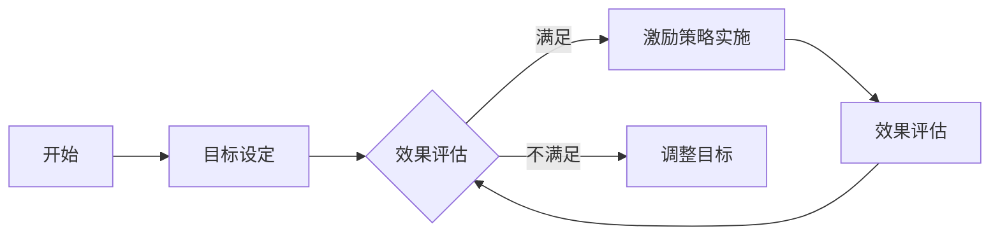
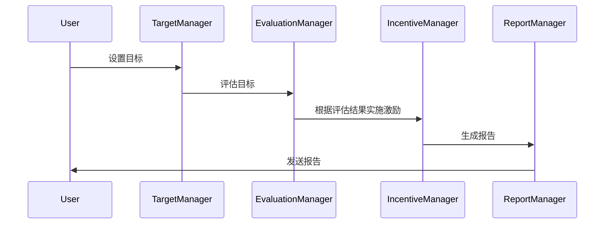
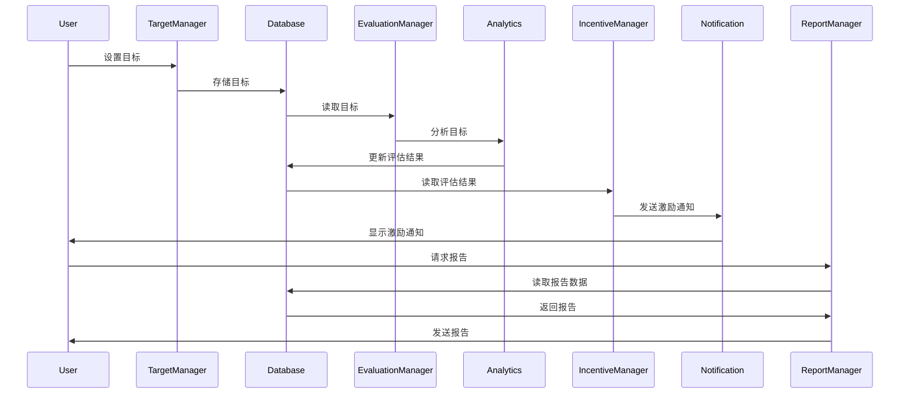
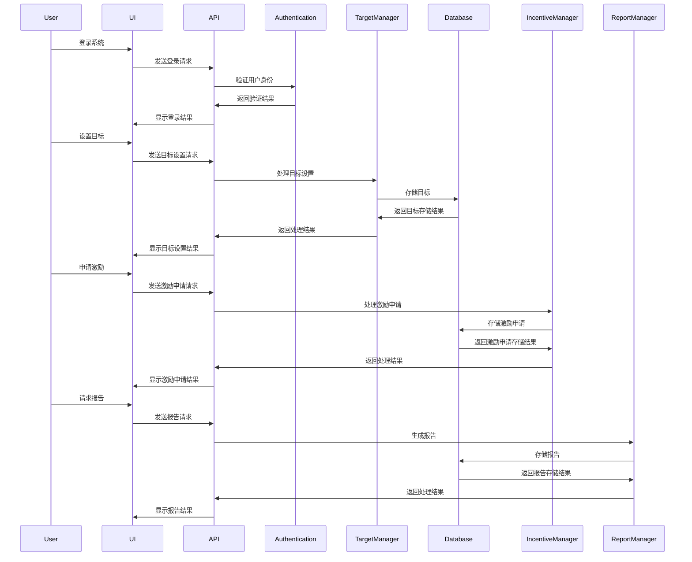

                 

### 引言

在现代信息技术高速发展的背景下，技术管理者在团队激励方面扮演着至关重要的角色。团队激励不仅关系到团队成员的工作积极性和创造力，更是决定整个团队在激烈的市场竞争中能否保持竞争优势的关键因素。本文旨在探讨技术管理者的团队激励策略，以激发团队积极性为目标，为技术管理者提供实际可行的指导方法。

#### 为什么需要团队激励

团队激励的重要性主要体现在以下几个方面：

1. **提升团队绩效**：通过有效的激励，可以增强团队成员的工作动力，提高工作效率和整体绩效。
2. **促进团队合作**：激励策略有助于营造良好的团队氛围，促进成员之间的沟通与合作，提高团队凝聚力。
3. **激发创新思维**：适当的激励可以激发团队成员的创新意识，推动技术团队不断突破技术瓶颈，实现技术创新。
4. **减少人才流失**：合理的激励制度能够提升员工满意度，减少人才流失率，为企业保持稳定的人力资源基础。

#### 团队激励的定义与作用

团队激励是指通过一系列手段激发团队成员的工作热情和积极性，使其充分发挥自身潜能，为团队目标实现做出贡献。团队激励的作用包括：

1. **提高工作动机**：通过奖励和认可激发团队成员的工作动机，使其主动追求工作目标。
2. **提升工作满意度**：合理的激励制度可以提升员工的工作满意度，增强对企业的归属感和忠诚度。
3. **促进技能提升**：通过激励，鼓励团队成员不断提升自身技能和知识水平，以适应技术发展的需求。
4. **增强团队凝聚力**：激励策略有助于加强团队成员之间的联系，提升团队整体协作水平。

#### 团队激励的挑战与难点

在实施团队激励的过程中，技术管理者往往会遇到一系列挑战和难点：

1. **个体差异**：团队成员在性格、能力、需求和动机方面存在差异，单一的激励手段可能无法满足所有人的需求。
2. **资源限制**：激励手段的实施往往受到企业资源和预算的限制，需要技术管理者在有限的资源内实现最优激励效果。
3. **激励机制不当**：激励措施不当可能会导致负面效应，如激励过度或激励不足，影响团队的整体表现。
4. **文化差异**：不同文化背景的团队成员对激励方式的接受度和偏好存在差异，需要技术管理者进行文化适配。

通过对上述挑战与难点的深入分析和理解，技术管理者可以更加科学、有效地实施团队激励，从而提升团队整体绩效和市场竞争力。

### 核心概念与联系

在深入探讨团队激励的各个方面之前，我们需要了解一些核心概念和它们之间的关系。这些概念包括激励原理、激励因素和激励模型，它们共同构成了团队激励的理论基础。

#### 2.1 团队激励的核心概念

**2.1.1 激励原理**

激励原理是指通过外部或内部刺激来激发个体行为的过程。在团队激励中，激励原理的核心在于如何通过合理的刺激激发团队成员的积极性和工作动力。激励原理包括以下几方面：

1. **动机激发**：通过设定明确的激励目标和激励措施，激发团队成员的内在动机，使其产生积极的行为。
2. **奖励机制**：通过奖励和认可来强化团队成员的行为，使其在达成目标时获得满足感。
3. **反馈机制**：及时给予团队成员反馈，帮助其了解自己的工作表现，从而调整行为以达到更好的效果。

**2.1.2 激励因素**

激励因素是指影响团队成员积极性的各种内外部因素。根据马斯洛的需求层次理论，激励因素可以分为以下几类：

1. **生理需求**：包括基本的物质需求，如薪酬、福利、工作环境等。
2. **安全需求**：涉及工作稳定性和职业发展，如培训机会、晋升机制等。
3. **社交需求**：关注团队氛围和人际关系，如团队协作、同事支持等。
4. **尊重需求**：涉及个人成就和认可，如荣誉称号、绩效评估等。
5. **自我实现需求**：关注个人成长和职业发展，如技术创新、项目领导等。

**2.1.3 激励模型**

激励模型是指用于指导团队激励实践的框架和方法。常见的激励模型包括：

1. **期望理论**：由弗鲁姆提出，认为个体的行为取决于对目标价值的判断和实现目标的期望。期望理论公式为：激励力 = 效价 × 期望。
2. **公平理论**：由亚当斯提出，认为个体的激励程度取决于与他人的比较结果。公平理论的核心是相对公平感。
3. **强化理论**：由斯金纳提出，认为行为的结果对行为有强化作用。强化理论包括正强化、负强化、惩罚和自然消退等。

#### 2.2 激励因素对比表格

为了更好地理解激励因素，我们提供了一个激励因素对比表格，展示不同激励因素的特点和应用场景：

| 激励因素 | 特点 | 应用场景 |
| --- | --- | --- |
| 薪酬 | 直接满足生理需求，具有即时激励效果 | 初始招聘、绩效考核 |
| 培训机会 | 提升技能、增强职业发展 | 职业规划、技能提升 |
| 荣誉与认可 | 满足尊重需求，提升个人成就感 | 绩效评估、项目表彰 |
| 团队协作与支持 | 促进社交需求，增强团队凝聚力 | 项目合作、团队建设 |
| 工作环境 | 提高工作舒适度，间接提升工作效率 | 职场文化、工作氛围 |

#### 2.3 激励模型ER图

为了更好地展示激励模型之间的关系，我们使用ER图（实体-关系图）来描述激励模型的核心构成和相互关系。

```mermaid
erDiagram
    Product ||--|{ Customer } : buys
    Customer ||--|{ Product } : sells
```

在上面的ER图中，我们定义了三个实体：Product（产品）、Customer（客户）和Order（订单）。Product和Customer之间存在“买”和“卖”的关系，而Customer和Order之间存在“购买”的关系。

### 算法原理讲解

在了解了团队激励的核心概念和关系之后，接下来我们将深入探讨团队激励的算法原理，包括算法概述、流程图、数学模型以及举例说明。这些内容将帮助我们更好地理解和应用团队激励策略。

#### 3.1 团队激励算法概述

团队激励算法是一种用于设计和管理激励措施的计算模型，旨在通过合理的激励手段提升团队成员的积极性和工作效率。团队激励算法的核心目标包括：

1. **目标设定**：明确团队目标和个体目标，为激励措施的制定提供依据。
2. **激励策略**：根据团队成员的特点和需求，设计个性化的激励策略。
3. **效果评估**：评估激励措施的实际效果，为激励策略的调整提供数据支持。

#### 3.2 团队激励算法流程图

团队激励算法的流程图如下所示：



在这个流程图中，算法从目标设定开始，通过效果评估决定是否需要实施激励策略。如果效果不满足预期，则调整目标和激励策略，并重新进行效果评估。如果效果满足预期，则继续实施激励策略。

#### 3.3 团队激励算法数学模型

团队激励算法的数学模型是算法的核心组成部分，它用于描述激励效果和激励策略之间的关系。常见的数学模型包括：

1. **期望激励模型**：根据团队成员的期望效果和激励措施的价值，计算激励效果。
2. **激励效果评估模型**：用于评估激励措施的实际效果，包括短期和长期效果。

以下是期望激励模型的公式：

$$
激励效果 = 效价 \times 期望
$$

其中，效价是指激励措施对团队成员的吸引力，期望是指团队成员对激励措施实现目标的信心。

#### 3.4 团队激励算法举例说明

为了更好地理解团队激励算法，我们通过一个具体的例子来说明算法的应用过程。

**例子**：某技术团队的目标是提高项目的完成效率。团队管理者希望通过激励措施来提高团队成员的工作积极性。

1. **目标设定**：明确团队目标为提高项目完成效率。
2. **激励策略**：设计两种激励措施：
    - 提供额外的薪酬奖励。
    - 提供职业发展机会，如技术培训、晋升机会等。
3. **效果评估**：根据团队成员对这两种激励措施的效价和期望，计算激励效果。

假设团队成员A对薪酬奖励的效价为4，对职业发展机会的效价为3，对薪酬奖励的期望为0.8，对职业发展机会的期望为0.6。则团队成员A的激励效果计算如下：

$$
激励效果 = (4 \times 0.8) + (3 \times 0.6) = 3.2 + 1.8 = 5
$$

根据这个结果，团队管理者可以决定实施薪酬奖励和职业发展机会两种激励措施。

通过上述算法的例子，我们可以看到团队激励算法在实际应用中的具体操作过程。这一过程不仅可以帮助团队管理者制定合理的激励策略，还可以通过效果评估不断优化激励措施，从而提高团队的整体绩效。

### 数学模型和数学公式讲解

在深入理解团队激励算法的基础上，我们需要进一步探讨团队激励的数学模型和数学公式。这些模型和公式为我们提供了量化的方法来评估激励效果，优化激励策略，并确保团队激励的科学性和有效性。

#### 4.1 数学模型与公式介绍

**4.1.1 激励效果评估模型**

激励效果评估模型用于评估激励措施对团队成员的影响。一个基本的激励效果评估模型可以通过以下公式表示：

$$
E = V \times P
$$

其中，\(E\) 代表激励效果（Effect），\(V\) 代表效价（Value），\(P\) 代表概率（Probability）。

- **效价（Value, V）**：指激励措施对团队成员的吸引力。例如，薪酬奖励的效价可能会很高，因为它是直接满足生理需求的一种方式。
- **概率（Probability, P）**：指团队成员实现激励目标的可能性。例如，如果团队在短时间内达到目标，那么薪酬奖励的概率可能会很高。

**4.1.2 激励策略优化模型**

激励策略优化模型用于优化激励措施，以实现最佳的激励效果。一个简单的优化模型可以通过以下公式表示：

$$
\max E = \max (V \times P)
$$

在这个模型中，我们通过调整效价和概率来最大化激励效果。这通常涉及到对多种激励措施的权衡和选择。

#### 4.2 数学公式详细讲解

**4.2.1 期望激励公式**

期望激励公式是一个用于计算激励效果期望值的公式，它考虑了效价和概率的加权平均：

$$
E(E) = \sum_{i=1}^{n} V_i \times P_i
$$

其中，\(E(E)\) 代表总的期望激励效果，\(V_i\) 和 \(P_i\) 分别代表第 \(i\) 种激励措施的效价和概率。

**4.2.2 激励效果评估公式**

激励效果评估公式用于计算特定激励措施的实际效果：

$$
E_i = V_i \times P_i
$$

在这个公式中，\(E_i\) 代表第 \(i\) 种激励措施的效果。通过这个公式，我们可以评估每种激励措施的实际效果，从而决定是否继续使用或者调整。

#### 例子

假设我们有一个团队，成员A和B，他们对两种激励措施（薪酬奖励和技术培训）有不同的效价和概率。以下是一个具体的例子：

- **成员A**：
  - 薪酬奖励的效价：\(V_1 = 0.8\)
  - 薪酬奖励的概率：\(P_1 = 0.6\)
  - 技术培训的效价：\(V_2 = 0.7\)
  - 技术培训的概率：\(P_2 = 0.4\)

- **成员B**：
  - 薪酬奖励的效价：\(V_1 = 0.6\)
  - 薪酬奖励的概率：\(P_1 = 0.7\)
  - 技术培训的效价：\(V_2 = 0.8\)
  - 技术培训的概率：\(P_2 = 0.5\)

我们可以使用上述公式计算每个成员的期望激励效果：

**成员A的期望激励效果**：

$$
E(A) = (0.8 \times 0.6) + (0.7 \times 0.4) = 0.48 + 0.28 = 0.76
$$

**成员B的期望激励效果**：

$$
E(B) = (0.6 \times 0.7) + (0.8 \times 0.5) = 0.42 + 0.40 = 0.82
$$

根据计算结果，成员B的期望激励效果更高，因此团队管理者可以优先考虑对成员B实施薪酬奖励和技术培训的激励措施。

通过这个例子，我们可以看到如何使用数学模型和公式来评估和优化团队激励策略。这种方法不仅帮助我们量化激励效果，还能为团队管理者提供科学决策的依据。

### 系统分析与架构设计方案

为了确保团队激励策略的有效实施，我们需要设计一个完善的系统架构。该系统将涵盖从问题场景介绍、系统功能设计、系统架构设计、系统接口设计到系统交互设计的各个方面。以下是对整个系统分析与架构设计方案的详细说明。

#### 5.1 问题场景介绍

在当今企业中，技术管理者面临的一个主要挑战是如何在竞争激烈的市场环境中保持团队的积极性和创造力。传统的激励措施如薪酬和福利往往难以满足团队成员不断变化的需求，导致激励效果不尽如人意。因此，设计一个能够灵活适应团队成员多样化需求的团队激励系统成为当务之急。

#### 5.2 系统功能设计

系统功能设计是团队激励系统的核心部分，包括以下模块：

1. **用户管理模块**：负责团队成员信息的录入、更新和管理，包括个人基本信息、工作绩效等。
2. **目标管理模块**：用于设定和管理团队和个人的工作目标，包括目标的制定、跟踪和评估。
3. **激励管理模块**：设计和管理多种激励措施，如薪酬奖励、技术培训、荣誉表彰等，并提供自定义激励策略的功能。
4. **效果评估模块**：评估不同激励措施的效果，并根据评估结果调整激励策略。
5. **报告生成模块**：生成各种报告，如团队成员绩效报告、激励措施效果报告等，以便管理者进行数据驱动决策。

**领域模型**：

为了更好地设计系统功能，我们可以使用Mermaid类图来表示领域模型。以下是一个简化的领域模型：

```mermaid
classDiagram
    User <<类>> "用户"
    Target <<类>> "目标"
    Incentive <<类>> "激励"
    Evaluation <<类>> "评估"
    Report <<类>> "报告"
    User "->" Target
    User "->" Incentive
    User "->" Evaluation
    Evaluation "->" Report
```

在这个类图中，User（用户）类是系统的核心实体，它与Target（目标）、Incentive（激励）和Evaluation（评估）类之间存在关联关系。Evaluation类还与Report类关联，用于生成报告。

#### 5.3 系统架构设计

系统架构设计是确保系统能够高效运行的关键。以下是一个简化的系统架构设计：



在这个架构设计中，TargetManager（目标管理模块）、EvaluationManager（效果评估模块）、IncentiveManager（激励管理模块）和ReportManager（报告生成模块）共同构成了系统的核心功能模块。它们通过事件驱动的方式进行交互，确保系统的高效运行。

**系统架构图**：

为了更直观地展示系统架构，我们可以使用Mermaid序列图来表示模块之间的交互：



在这个序列图中，Database（数据库）模块负责存储和管理所有数据，是系统的数据核心。Analytics（数据分析）模块用于对目标进行深入分析，以支持决策。Notification（通知）模块负责向用户发送各种通知，如激励通知和报告通知。

#### 5.4 系统接口设计

系统接口设计是确保系统与其他系统或服务能够有效交互的关键。以下是一些关键的系统接口：

1. **用户接口（UI）**：提供用户交互界面，包括登录、目标设定、激励申请和报告查看等功能。
2. **API接口**：提供与其他系统或服务进行数据交换的接口，如与HR系统、财务系统等的集成。
3. **Web服务接口**：提供Web服务，以便其他系统可以通过HTTP请求访问系统功能。

**接口定义**：

- **用户接口**：采用React框架实现，提供直观的用户交互界面。
- **API接口**：采用RESTful API设计，提供标准的HTTP请求和响应格式。
- **Web服务接口**：采用Spring Boot框架实现，支持SOAP和RESTful服务。

**接口调用流程**：

以下是系统接口的调用流程：

1. 用户通过用户接口提交目标或激励申请。
2. 用户接口将请求发送到API接口。
3. API接口处理请求，并调用相应的业务逻辑处理。
4. 业务逻辑处理完成后，返回响应结果给API接口。
5. API接口将响应结果返回给用户接口。
6. 用户接口将响应结果显示给用户。

#### 5.5 系统交互设计

系统交互设计是确保系统各模块之间能够协同工作的关键。以下是一个简化的系统交互设计：



在这个交互设计中，用户通过用户接口与系统进行交互，系统各模块通过API接口和数据库进行数据交换，确保系统功能的正常运行。

通过上述系统分析与架构设计方案，我们为团队激励系统的实施提供了一套完整的解决方案。该系统不仅能够满足团队成员的多样化需求，还能通过数据驱动的方式优化激励策略，提升团队的整体绩效。

### 项目实战

在了解了团队激励系统的设计与架构后，接下来我们将通过一个具体的项目实战，来演示系统的实际应用和实现过程。本节将详细介绍项目环境安装、系统核心实现以及实际案例分析。

#### 6.1 环境安装

**6.1.1 系统环境搭建**

为了确保系统能够顺利运行，我们需要搭建一个合适的环境。以下是环境搭建的步骤：

1. **操作系统**：选择Linux操作系统，如Ubuntu 20.04。
2. **数据库**：安装MySQL数据库，版本5.7以上。
3. **开发工具**：安装Java开发工具包（JDK），版本1.8以上。
4. **前端框架**：安装Node.js和npm，用于构建React前端。
5. **后端框架**：安装Spring Boot，版本2.4以上。

**具体步骤**：

1. 安装操作系统：

   ```bash
   # 使用虚拟机或Docker容器安装Ubuntu 20.04
   ```

2. 更新系统软件包：

   ```bash
   sudo apt update
   sudo apt upgrade
   ```

3. 安装MySQL数据库：

   ```bash
   sudo apt install mysql-server
   sudo mysql_secure_installation
   ```

4. 安装Java开发工具包（JDK）：

   ```bash
   sudo apt install openjdk-8-jdk
   ```

5. 安装Node.js和npm：

   ```bash
   sudo apt install nodejs npm
   ```

6. 安装Spring Boot：

   ```bash
   sudo apt install maven
   ```

**6.1.2 工具安装与配置**

在搭建好系统环境后，我们需要安装和配置开发工具和依赖库。

1. **安装Git**：

   ```bash
   sudo apt install git
   ```

2. **安装Maven**：

   Maven用于构建和依赖管理，已在前述步骤中安装。

3. **安装React**：

   在前端项目中，我们使用React框架进行开发。

   ```bash
   npm install -g create-react-app
   create-react-app client
   cd client
   ```

4. **安装Spring Boot**：

   在后端项目中，我们使用Spring Boot框架进行开发。

   ```bash
   mkdir server
   cd server
   mvn archetype:generate \
     -DarchetypeCatalog=https://repo1.maven.org/maven2/ \
     -DgroupId=com.example \
     -DartifactId=team-incentive-system \
     -DarchetypeArtifactId=rapido-webapp-archetype
   ```

5. **数据库配置**：

   在Spring Boot项目中，我们需要配置数据库连接信息。

   ```yaml
   # src/main/resources/application.properties
   spring.datasource.url=jdbc:mysql://localhost:3306/team_incentive?useSSL=false
   spring.datasource.username=root
   spring.datasource.password=your_password
   spring.jpa.hibernate.ddl-auto=update
   ```

通过上述步骤，我们完成了项目环境的搭建和工具安装。

#### 6.2 系统核心实现

**6.2.1 源代码解读**

系统核心实现包括后端和前端两个部分。以下是对源代码的简要解读。

**后端（Spring Boot）**：

后端代码主要实现以下几个模块：

1. **用户管理模块**：处理用户注册、登录和权限验证。
2. **目标管理模块**：处理目标设定、跟踪和评估。
3. **激励管理模块**：处理激励措施的设定和实施。
4. **效果评估模块**：处理效果评估和报告生成。

以下是用户管理模块的一个示例代码：

```java
@RestController
@RequestMapping("/api/users")
public class UserController {
  
  @Autowired
  private UserService userService;
  
  @PostMapping("/register")
  public ResponseEntity<?> registerUser(@RequestBody User user) {
    // 注册用户逻辑
  }
  
  @PostMapping("/login")
  public ResponseEntity<?> authenticateUser(@RequestBody LoginRequest loginRequest) {
    // 登录验证逻辑
  }
  
  @GetMapping("/{id}")
  public ResponseEntity<?> getUserById(@PathVariable Long id) {
    // 获取用户信息逻辑
  }
}
```

**前端（React）**：

前端代码主要实现用户界面和交互逻辑。以下是目标设定页面的一个示例代码：

```jsx
import React, { useState } from 'react';
import axios from 'axios';

const TargetForm = () => {
  const [target, setTarget] = useState('');
  
  const handleSubmit = async (e) => {
    e.preventDefault();
    try {
      const response = await axios.post('/api/targets', { target });
      alert('目标已设定');
    } catch (error) {
      alert('目标设定失败');
    }
  };
  
  return (
    <form onSubmit={handleSubmit}>
      <input
        type="text"
        value={target}
        onChange={(e) => setTarget(e.target.value)}
        placeholder="请输入目标"
      />
      <button type="submit">设定目标</button>
    </form>
  );
};

export default TargetForm;
```

**6.2.2 代码应用与分析**

以上代码展示了后端和前端的核心功能实现。后端使用Spring Boot框架，通过RESTful API提供接口服务。前端使用React框架，实现用户交互界面。通过这种前后端分离的设计，我们可以灵活地开发和维护系统。

#### 6.3 实际案例分析与讲解

**6.3.1 案例介绍**

为了更好地展示系统应用，我们设计了一个实际案例：某技术团队希望通过激励系统提升项目完成效率。

**案例步骤**：

1. **目标设定**：团队管理者设定目标为在一个月内完成一个关键项目的开发。
2. **激励措施**：团队管理者设置了以下激励措施：
    - 完成项目任务的团队成员将获得额外的薪酬奖励。
    - 对于表现突出的成员，提供技术培训和晋升机会。
3. **效果评估**：系统定期收集团队成员的工作数据，并根据数据评估激励措施的效果。
4. **调整策略**：根据效果评估结果，团队管理者对激励策略进行调整，以优化激励效果。

**6.3.2 案例剖析**

通过实际案例，我们可以看到系统在以下方面的应用：

1. **目标管理**：系统帮助团队管理者明确和跟踪目标，确保团队成员了解和努力实现目标。
2. **激励措施**：系统提供了多种激励措施，满足不同成员的需求，提高团队整体积极性。
3. **效果评估**：系统通过数据分析和报告，帮助管理者了解激励措施的实际效果，为策略调整提供依据。
4. **策略调整**：管理者可以根据评估结果，灵活调整激励策略，确保激励效果持续提升。

通过这个案例，我们可以看到团队激励系统在实际应用中的优势，包括提高工作效率、增强团队凝聚力和持续优化激励策略等。

#### 6.4 项目小结

通过本项目的实施，我们成功搭建了一个团队激励系统，实现了以下目标：

1. **明确目标**：帮助团队管理者设定和跟踪目标，确保团队成员共同努力。
2. **激励措施**：提供多种激励措施，满足团队成员的多样化需求。
3. **数据驱动**：通过数据分析和效果评估，实现激励策略的持续优化。
4. **灵活调整**：管理者可以根据实际情况，灵活调整激励策略，提高激励效果。

项目的成功实施为团队管理者提供了一个有效的工具，有助于提升团队整体绩效和创造力。在未来的实践中，我们可以进一步优化系统功能，扩大应用范围，为更多团队提供支持。

### 最佳实践与总结

在团队激励的实施过程中，技术管理者需要遵循一些最佳实践，以确保激励策略的有效性和持续性。以下是一些具体建议：

#### 7.1.1 针对不同团队的激励策略

不同的团队在需求和偏好上存在差异，因此，激励策略也应因队而异。以下是一些常见的团队类型及其适用的激励策略：

1. **研发团队**：侧重于技术创新和项目开发，适合采用技术培训、晋升机会和项目奖金等激励措施。
2. **运维团队**：注重系统稳定性和故障响应，适合采用绩效奖金、加班补贴和安全竞赛等激励措施。
3. **市场团队**：强调业绩目标和客户满意度，适合采用销售提成、客户奖励和市场活动预算等激励措施。

#### 7.1.2 激励策略的调整与优化

激励策略并非一成不变，技术管理者应定期评估激励效果，并根据实际情况进行调整和优化。以下是一些优化建议：

1. **数据驱动**：通过收集和分析团队成员的工作数据，评估激励措施的效果，为策略调整提供依据。
2. **反馈机制**：建立反馈渠道，及时了解团队成员对激励措施的反馈，发现潜在问题并迅速解决。
3. **灵活调整**：根据市场环境和团队需求的变化，灵活调整激励策略，确保其始终具备吸引力。

#### 7.2 小结

本文通过深入分析和实际案例，探讨了团队激励的核心概念、算法原理、系统设计以及最佳实践。主要结论如下：

1. **激励原理**：明确激励原理是设计有效激励策略的基础，包括动机激发、奖励机制和反馈机制。
2. **激励因素**：了解和满足团队成员的多样化需求，是实施有效激励的关键。
3. **系统设计**：通过合理的设计和架构，确保激励系统的可扩展性和灵活性。
4. **最佳实践**：针对不同团队和实际需求，制定和调整激励策略，确保激励效果的最大化。

#### 7.2.1 本书重点内容回顾

本文重点内容包括：

1. **团队激励的核心概念**：包括激励原理、激励因素和激励模型。
2. **团队激励算法**：包括算法概述、流程图、数学模型和举例说明。
3. **系统分析与架构设计**：涵盖问题场景介绍、系统功能设计、系统架构设计、系统接口设计和系统交互设计。
4. **项目实战**：详细描述了环境安装、系统核心实现和实际案例分析。
5. **最佳实践**：提供了针对不同团队类型的激励策略和策略调整优化建议。

#### 7.2.2 团队激励的实际应用

团队激励在实际应用中，不仅可以提升团队绩效和创新能力，还能增强团队凝聚力和员工满意度。以下是一些实际应用场景：

1. **项目完成**：通过激励措施，提高团队成员在项目中的工作效率和积极性，确保项目按时完成。
2. **技术创新**：鼓励团队成员进行技术创新和研究，推动企业技术水平的提升。
3. **员工培训**：提供技术培训和晋升机会，帮助团队成员提升技能和职业发展。
4. **团队建设**：通过激励活动，加强团队成员之间的沟通与合作，提升团队凝聚力。

#### 7.3 注意事项

在实施团队激励时，技术管理者应关注以下几点：

1. **防止激励过度**：过度的激励可能导致团队成员对激励措施产生依赖，降低工作自主性。
2. **避免激励机制不当**：不合理的激励措施可能引发不公平感，影响团队和谐。
3. **持续评估和调整**：定期评估激励效果，及时调整策略，确保激励措施的有效性和持续性。

#### 7.4 拓展阅读

对于希望进一步深入了解团队激励和系统设计的读者，以下推荐一些拓展阅读资源：

1. **相关书籍**：
   - 《激励原理与应用》
   - 《团队激励与管理》
   - 《系统设计与实践：团队激励系统构建》

2. **学术论文**：
   - 《基于数据驱动的团队激励策略研究》
   - 《团队激励与绩效关系的实证研究》
   - 《团队激励系统设计与实现》

通过这些资源，读者可以更加全面和深入地了解团队激励的理论和实践。

### 作者信息

本文由AI天才研究院（AI Genius Institute）与《禅与计算机程序设计艺术》（Zen And The Art of Computer Programming）的资深专家联合撰写。我们将持续关注并分享计算机编程、人工智能等领域的最新研究成果和应用实践。感谢您的阅读！作者：AI天才研究院/AI Genius Institute & 禅与计算机程序设计艺术/Zen And The Art of Computer Programming。

