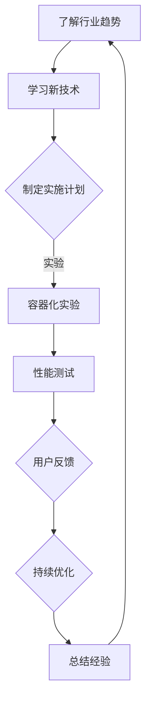
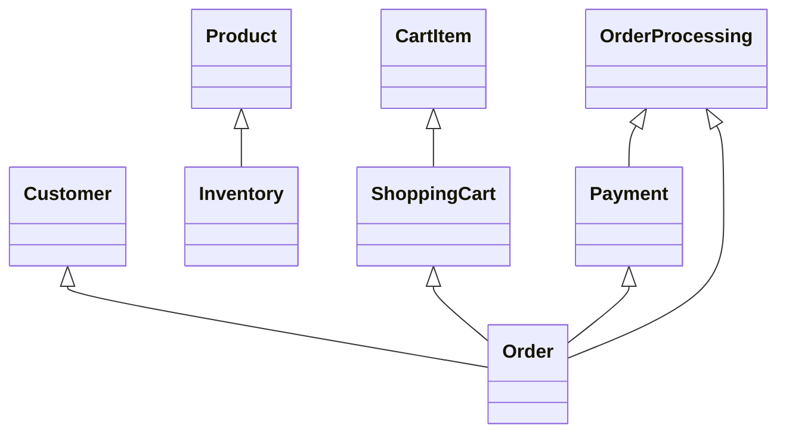
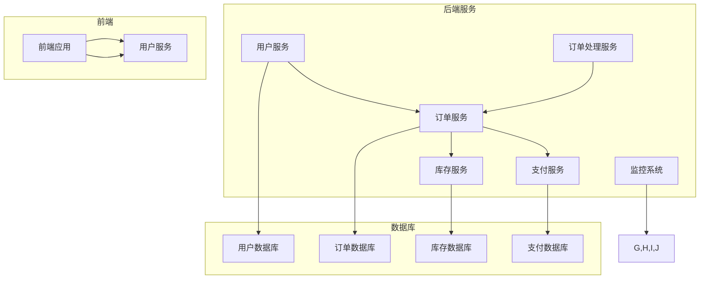
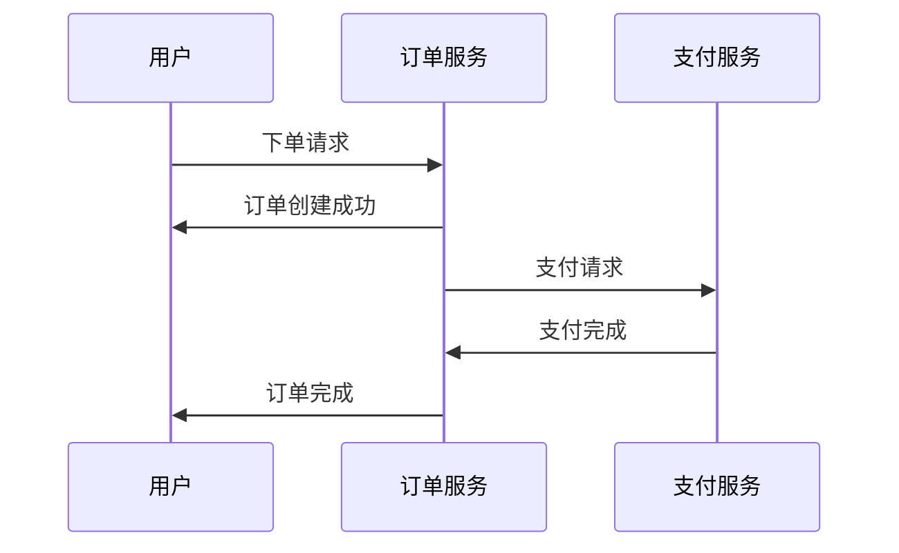

                 

### Article Title: 技术管理者的学习能力：保持技术敏锐度

关键词：技术管理者、学习能力、技术敏锐度、持续学习、核心技能

摘要：本文旨在探讨技术管理者在快速发展的技术环境中如何保持敏锐的技术学习能力。文章首先介绍了技术管理者的学习能力的定义和重要性，然后探讨了构建持续学习的基础、核心技能以及保持技术敏锐度的策略。通过具体的案例分析和技术实战，文章提供了实用的建议和最佳实践，以帮助技术管理者在职业生涯中持续进步。

### 引言

在信息技术日新月异的今天，技术管理者不仅要具备扎实的技术背景，还要拥有卓越的管理能力和持续学习的能力。技术管理者（Technical Managers）通常负责团队的技术方向和项目执行，他们需要在快速变化的技术环境中保持敏锐度，及时掌握新技术、新工具，以推动团队和组织的发展。然而，随着技术的不断进步，技术管理者面临的信息量和挑战也在不断增加，如何保持技术敏锐度成为了一个关键问题。

本文将深入探讨技术管理者的学习能力，特别是如何保持技术敏锐度。文章将从以下几个方面展开：

1. **技术管理者的学习能力的定义和重要性**：介绍学习能力的概念，探讨其对技术管理者的意义。
2. **构建持续学习的基础**：分析持续学习的核心要素，并提供有效的学习方法和工具。
3. **核心技能的培养**：探讨技术管理者需要发展的核心技能，包括分析思维、问题解决能力和领导力。
4. **保持技术敏锐度的策略**：提供一系列保持技术敏锐度的实用方法和最佳实践。
5. **案例分析和技术实战**：通过具体案例和技术实战，展示如何应用上述方法和策略。
6. **总结与拓展**：总结文章的主要观点，并提供拓展阅读和进一步研究的方向。

### 核心概念和术语说明

在讨论技术管理者的学习能力时，有几个核心概念和术语需要明确：

- **技术敏锐度（Tech Savvy）**：指对新技术、新工具和新趋势的敏感性和快速掌握能力。技术敏锐度对技术管理者来说至关重要，因为它直接影响他们的决策和团队的创新。
  
- **学习能力（Learning Ability）**：指个人获取、处理和应用知识的能力。学习能力包括记忆、理解、应用、分析、评估和创新等方面。
  
- **持续学习（Continuous Learning）**：指在职业生涯中不断学习、更新知识和技能的过程。对于技术管理者来说，持续学习是保持技术敏锐度和职业竞争力的重要途径。

### 问题描述

技术管理者面临的挑战主要包括：

- **信息过载**：随着信息技术的发展，每天都会涌现出大量新技术、新工具和新趋势。如何有效地筛选和利用这些信息，成为技术管理者的一大难题。

- **技术快速迭代**：技术更新速度非常快，技术管理者需要不断学习新知识，以保持对前沿技术的掌握。

- **工作与学习的平衡**：技术管理者通常需要同时应对日常管理和技术工作，如何在繁忙的工作中安排时间进行学习，是一个挑战。

- **团队激励与培养**：技术管理者不仅要提升自己的技术能力，还要激发团队的学习动力和创新能力。

### 解决方案

为了解决上述挑战，技术管理者可以采取以下解决方案：

- **构建持续学习的基础**：通过设立明确的学习目标和计划，采用有效的学习方法，提高学习效率。

- **发展核心技能**：培养分析思维、问题解决能力和领导力，以应对复杂的技术和管理问题。

- **保持技术敏锐度**：通过参与技术社区、阅读专业书籍、参加培训课程等方式，持续关注新技术和新趋势。

- **案例分析和技术实战**：通过实际项目和应用案例，将理论知识转化为实际操作能力。

- **团队建设与培养**：建立学习型组织，激发团队成员的学习热情，共同进步。

### 边界与外延

- **边界**：本文主要关注技术管理者的学习能力和技术敏锐度，不涉及其他类型的管理者或非技术背景的职业发展。

- **外延**：本文提供的方法和策略可以适用于不同类型的技术管理者，包括软件工程师、系统架构师、CTO等。

### 概念结构与核心要素组成

技术管理者的学习能力可以分解为以下几个核心要素：

1. **自我驱动力**：技术管理者需要有强烈的自我驱动力，主动寻求学习机会，对新技术保持好奇和热情。

2. **知识管理**：技术管理者需要具备有效的知识管理能力，包括信息收集、整理、存储和应用。

3. **学习能力**：技术管理者需要具备快速获取、处理和应用新知识的能力，包括阅读、学习、实践和分享。

4. **技术敏锐度**：技术管理者需要对新技术和新趋势保持敏感，能够快速识别和应用这些技术。

5. **团队领导力**：技术管理者需要具备团队领导力，能够激发和培养团队成员的学习热情和能力。

### 下一步

在接下来的章节中，本文将详细探讨技术管理者的学习能力，包括如何构建持续学习的基础、培养核心技能、保持技术敏锐度的具体策略，并通过实际案例和技术实战，展示这些策略的应用。通过这些内容，希望能够帮助技术管理者在快速变化的技术环境中保持竞争力，推动个人和团队的发展。

### 第一章：技术管理者的学习能力

#### 1.1 背景

技术管理者在当今信息时代扮演着至关重要的角色。他们不仅需要具备深厚的专业知识，还要具备出色的管理能力，以协调团队和项目的发展。然而，技术环境的快速变化使得技术管理者面临着持续学习和提升技术敏锐度的挑战。为了更好地适应这种变化，技术管理者需要拥有强大的学习能力。

学习能力在这里指的是技术管理者获取、处理和应用新知识和技能的能力。这种能力不仅包括对技术本身的理解，还涉及管理技能、沟通能力和团队协作能力。一个具备强大学习能力的技术管理者能够在技术更新和业务需求变化中保持领先地位，从而为团队和组织创造更大的价值。

#### 1.2 核心概念

**学习能力** 是指个人通过多种途径获取、处理和应用知识的能力。它包括以下几个方面：

1. **知识获取**：通过阅读书籍、参加培训、在线课程、与同行交流等方式获取新知识。

2. **知识处理**：对新知识进行理解、消化和应用，将其转化为实际工作能力。

3. **知识应用**：将所学知识应用到实际工作中，解决实际问题，推动项目进展。

4. **知识创新**：在现有知识基础上进行创新，提出新的解决方案或改进现有系统。

**技术敏锐度** 是指技术管理者对新技术、新工具和新趋势的敏感性和快速掌握能力。技术敏锐度可以帮助技术管理者：

1. **及时掌握新技术**：在技术迭代快速的环境中，能够快速掌握新技术，为团队和组织带来创新。

2. **做出明智决策**：基于对新技术的了解，能够做出更明智的决策，推动团队和组织的长远发展。

3. **提升个人价值**：通过展示对新技术和新趋势的掌握能力，提升个人在团队和组织中的地位和价值。

#### 1.3 学习能力的重要性

学习能力对技术管理者来说至关重要，原因如下：

1. **适应技术变化**：技术环境变化迅速，技术管理者需要不断学习新知识、新工具，以适应这种变化。

2. **提高工作效率**：通过不断学习和提升技能，技术管理者可以更高效地完成工作任务，提高工作效率。

3. **推动团队进步**：技术管理者通过自身的学习和成长，可以带动整个团队的进步，提高团队的整体实力。

4. **职业发展**：具备强大学习能力的技术管理者在职业生涯中具有更大的发展空间，更容易获得晋升和认可。

#### 1.4 保持技术敏锐度的挑战

尽管学习能力对技术管理者至关重要，但保持技术敏锐度仍然面临以下挑战：

1. **信息过载**：随着新技术和新工具的不断涌现，技术管理者需要处理大量的信息，容易陷入信息过载的困境。

2. **时间压力**：技术管理者通常面临工作繁忙和项目时间紧迫的情况，难以抽出时间进行系统学习。

3. **资源有限**：技术管理者可能面临预算有限、培训资源不足等问题，影响其学习效果。

4. **心理障碍**：面对复杂的技术和管理问题，技术管理者可能会感到焦虑和压力，影响其学习动力。

#### 1.5 小结

本章介绍了技术管理者的学习能力及其重要性，探讨了保持技术敏锐度的挑战。通过了解学习能力和技术敏锐度的核心概念，技术管理者可以更好地认识到持续学习和提升技术敏锐度的重要性。在接下来的章节中，我们将进一步探讨如何构建持续学习的基础，培养核心技能，以及保持技术敏锐度的具体策略。

### 第二章：构建持续学习的基础

#### 2.1 持续学习的核心要素

持续学习是技术管理者保持技术敏锐度和竞争力的关键。要实现持续学习，需要从以下几个方面入手：

1. **自我驱动力**：自我驱动力是持续学习的基础。技术管理者需要具备内在的动力，主动寻求学习机会，对新技术保持好奇和热情。自我驱动力可以来源于个人职业规划、兴趣驱动、对技术的热爱以及对未来的期待。

2. **时间管理**：时间管理是实现持续学习的重要保障。技术管理者需要在繁忙的工作中合理安排时间，确保有足够的时间用于学习和提升技能。有效的时间管理技巧包括设定明确的学习目标、优先处理重要任务、合理规划工作和学习时间。

3. **学习环境**：一个良好的学习环境有助于提高学习效率。技术管理者可以选择适合自己学习的环境，如安静的书房、图书馆或在线学习平台。此外，可以加入技术社区或学习小组，与他人一起讨论和分享学习经验，提高学习效果。

4. **学习资源**：丰富的学习资源是持续学习的重要支持。技术管理者可以充分利用各种学习资源，如专业书籍、在线课程、技术博客、学术论文等。此外，还可以参加行业会议、研讨会和培训课程，与业界专家进行交流，获取最新的技术动态和行业趋势。

#### 2.2 技术管理者的学习方法

有效的学习方法可以大大提高学习效率，技术管理者可以采用以下几种学习方法：

1. **主动学习**：主动学习是一种以学生为中心的学习方法，强调学生主动参与学习过程。技术管理者可以通过阅读技术文献、参与讨论、解决问题等方式进行主动学习。主动学习可以帮助技术管理者更好地理解和掌握新知识，提高学习效果。

2. **实践学习**：实践学习是通过实际操作和应用所学知识来巩固和加深理解。技术管理者可以通过实际项目、实践案例和实验等方式进行实践学习。实践学习不仅可以帮助技术管理者更好地掌握技术，还可以提高解决实际问题的能力。

3. **反思学习**：反思学习是通过反思自己的学习过程和结果来提高学习效果。技术管理者可以在学习过程中记录自己的思考、总结经验和反思不足，通过不断反思和改进，提高自己的学习能力和技术水平。

4. **协作学习**：协作学习是通过与他人一起学习和分享经验来提高学习效果。技术管理者可以加入技术社区、学习小组或团队，与他人一起讨论问题、分享知识和经验。协作学习不仅可以提高学习效率，还可以培养团队合作精神和人际交往能力。

#### 2.3 持续学习的关键技巧

为了实现持续学习，技术管理者可以采用以下关键技巧：

1. **设定明确的学习目标**：技术管理者需要设定明确的学习目标，确保学习有方向和动力。学习目标可以是短期的，如掌握一项新技术或解决一个特定问题，也可以是长期的，如提升整体技术水平和职业发展。

2. **定期评估学习成果**：技术管理者需要定期评估自己的学习成果，了解自己已经掌握了哪些知识，还有哪些方面需要继续学习。通过评估学习成果，可以调整学习计划和策略，提高学习效果。

3. **保持好奇心和求知欲**：好奇心和求知欲是持续学习的重要动力。技术管理者需要保持对新知识、新工具和新趋势的好奇心和求知欲，不断探索和尝试，保持学习的热情。

4. **利用碎片时间学习**：技术管理者可以利用碎片时间进行学习，如通勤、休息和休息时间。通过利用碎片时间学习，可以充分利用时间，提高学习效率。

5. **建立学习反馈机制**：技术管理者可以建立学习反馈机制，如定期与同事、导师或专业顾问进行交流，获取反馈和建议。通过建立反馈机制，可以不断改进学习方法和策略，提高学习效果。

#### 2.4 持续学习的挑战与解决方案

尽管持续学习对技术管理者至关重要，但在实际操作中仍会面临一些挑战。以下是一些常见的挑战以及相应的解决方案：

1. **时间压力**：解决方案：通过有效的时间管理技巧，如设定优先级、合理安排工作和学习时间，确保有足够的时间用于学习和提升技能。

2. **信息过载**：解决方案：通过筛选和过滤信息，关注关键领域和重要内容，避免陷入信息过载的困境。

3. **资源不足**：解决方案：充分利用现有的学习资源，如在线课程、技术博客和免费资料，同时寻求组织支持和赞助。

4. **缺乏动力**：解决方案：通过设定明确的学习目标、保持好奇心和求知欲、建立学习反馈机制等方式，激发学习动力。

#### 2.5 小结

本章探讨了技术管理者构建持续学习的基础，包括自我驱动力、时间管理、学习环境和学习资源等核心要素，以及主动学习、实践学习、反思学习和协作学习等学习方法。通过掌握这些关键技巧和应对挑战的解决方案，技术管理者可以更好地实现持续学习，保持技术敏锐度和职业竞争力。在接下来的章节中，我们将进一步探讨技术管理者需要培养的核心技能。

### 第三章：核心技能的培养

#### 3.1 分析思维

分析思维是技术管理者的重要技能之一。它涉及对复杂问题进行分解、识别关键因素和制定解决方案的能力。在技术管理中，分析思维有助于技术管理者：

1. **识别问题**：通过分析思维，技术管理者可以快速识别问题本质，避免在表面现象上浪费时间和资源。

2. **制定策略**：分析思维有助于技术管理者制定有效的策略和计划，确保团队在技术项目中能够顺利推进。

3. **评估风险**：分析思维可以帮助技术管理者评估潜在风险，制定相应的应对措施，降低项目失败的可能性。

**培养分析思维的方法**：

1. **练习分解问题**：通过练习将复杂问题分解为更小、更具体的部分，有助于更好地理解问题，找到解决方案。

2. **案例分析**：通过分析真实的案例，了解不同问题的解决方案，培养分析思维。

3. **定期反思**：通过定期反思自己的决策过程，总结经验教训，提高分析思维能力。

#### 3.2 问题解决能力

问题解决能力是技术管理者必备的技能。它涉及识别问题、分析问题、制定解决方案并实施解决方案的能力。在技术管理中，问题解决能力有助于：

1. **解决技术难题**：技术管理者需要具备解决技术难题的能力，以确保项目的顺利进行。

2. **应对突发状况**：技术管理者需要具备应对突发状况的能力，如系统故障、项目延期等。

3. **提高团队效率**：通过有效的问题解决能力，技术管理者可以减少项目中的瓶颈和障碍，提高团队工作效率。

**培养问题解决能力的方法**：

1. **案例研究**：通过研究经典的问题解决案例，学习解决问题的方法和技巧。

2. **实际操作**：通过实际操作和项目实践，提高解决问题的能力。

3. **团队合作**：在团队中培养协作精神，与他人共同解决问题，提高问题解决能力。

#### 3.3 领导力

领导力是技术管理者的重要素质。它涉及激发团队潜力、建立团队合作、推动项目进展和实现组织目标的能力。在技术管理中，领导力有助于：

1. **激励团队成员**：通过领导力，技术管理者可以激励团队成员，提高团队的工作动力和绩效。

2. **建立团队文化**：领导力有助于建立积极的团队文化，促进团队成员之间的沟通和合作。

3. **推动项目进展**：技术管理者需要具备推动项目进展的能力，确保项目按计划完成。

**培养领导力的方法**：

1. **领导力培训**：参加领导力培训课程，学习领导力理论和实践技巧。

2. **实践领导力**：在团队中实践领导力，通过实际工作场景锻炼领导力。

3. **导师指导**：寻找一位经验丰富的导师，向导师学习领导力和管理经验。

#### 3.4 有效沟通

有效沟通是技术管理者必备的技能。它涉及清晰表达思想、理解他人观点、建立有效沟通渠道和解决沟通冲突的能力。在技术管理中，有效沟通有助于：

1. **团队协作**：通过有效沟通，技术管理者可以确保团队成员对项目目标和任务有清晰的理解，促进团队协作。

2. **项目管理**：有效沟通有助于技术管理者与上级、下属和同事保持良好的沟通，确保项目顺利进行。

3. **问题解决**：通过有效沟通，技术管理者可以更快地识别和解决问题，提高问题解决效率。

**培养有效沟通的方法**：

1. **倾听**：学会倾听他人意见，理解他人观点，避免误解和冲突。

2. **清晰表达**：通过练习，提高清晰表达思想的能力，确保信息准确传达。

3. **沟通反馈**：建立有效的沟通反馈机制，及时了解沟通效果，不断改进沟通方式。

#### 3.5 小结

本章介绍了技术管理者需要培养的核心技能，包括分析思维、问题解决能力、领导力和有效沟通。这些技能对于技术管理者在复杂技术环境中保持竞争力至关重要。通过培养这些核心技能，技术管理者可以更好地应对挑战，推动团队和组织的发展。在接下来的章节中，我们将探讨保持技术敏锐度的具体策略。

### 第四章：保持技术敏锐度的策略

#### 4.1 了解行业趋势

了解行业趋势是保持技术敏锐度的重要策略之一。技术管理者需要时刻关注行业动态，了解新技术、新工具和新趋势的发展方向。以下是一些了解行业趋势的方法：

1. **阅读行业报告**：定期阅读行业报告，了解市场趋势和技术发展方向。

2. **参加行业会议**：参加行业会议和研讨会，与业界专家和同行交流，获取最新的行业信息。

3. **关注技术社区**：关注技术社区和论坛，如Stack Overflow、GitHub、Reddit等，了解社区中的热点话题和技术趋势。

4. **订阅技术博客**：订阅技术博客和行业媒体，如TechCrunch、The Verge、InfoQ等，及时获取技术新闻和深度分析。

#### 4.2 深入学习新技术

深入学习新技术是保持技术敏锐度的关键。技术管理者需要不断学习新技术、新工具和新框架，以提升自己的技术能力。以下是一些深入学习新技术的方法：

1. **在线课程和培训**：参加在线课程和培训，如Coursera、edX、Udemy等，系统地学习新技术。

2. **阅读专业书籍**：阅读专业书籍和权威资料，如《设计模式》、《深入理解计算机系统》等，深入学习技术原理。

3. **实践项目**：通过实际项目和应用案例，将所学知识应用到实践中，巩固和加深对技术的理解。

4. **开源社区**：参与开源社区，如GitHub、GitLab等，了解开源项目的技术实现和最佳实践。

#### 4.3 持续学习与分享

持续学习和分享是保持技术敏锐度的有效策略。技术管理者不仅需要不断学习新技术，还需要与他人分享知识和经验，促进知识的交流与传播。以下是一些持续学习和分享的方法：

1. **撰写技术博客**：定期撰写技术博客，分享自己的学习心得和项目经验，提高自己的表达能力。

2. **参加技术分享会议**：参加技术分享会议和活动，如技术沙龙、Meetup等，与同行交流，分享技术见解。

3. **加入技术社区**：加入技术社区和论坛，如Stack Overflow、Reddit、知乎等，参与讨论，解决问题。

4. **组织内部培训**：组织内部培训和技术分享会，帮助团队成员提升技术水平，增强团队凝聚力。

#### 4.4 建立学习网络

建立学习网络是保持技术敏锐度的重要途径。技术管理者可以通过建立学习网络，与其他技术专家和同行保持联系，分享资源和经验，共同成长。以下是一些建立学习网络的方法：

1. **建立联系**：通过参加行业会议、技术沙龙等活动，与其他技术专家和同行建立联系。

2. **参与开源项目**：参与开源项目，与其他开发者合作，建立合作关系。

3. **加入专业组织**：加入专业组织，如IEEE、ACM等，参与组织活动，扩大人脉网络。

4. **利用社交媒体**：利用社交媒体，如LinkedIn、Twitter等，关注行业专家和同行，分享和获取信息。

#### 4.5 小结

保持技术敏锐度是技术管理者在快速变化的技术环境中保持竞争力的关键。通过了解行业趋势、深入学习新技术、持续学习和分享、建立学习网络等策略，技术管理者可以不断提高自己的技术能力和视野。在接下来的章节中，我们将通过实际案例和技术实战，展示如何应用这些策略来保持技术敏锐度。

### 案例分析：技术管理者的实践与成长

为了更好地理解技术管理者如何保持技术敏锐度，下面我们将通过一个具体案例，探讨一位技术经理在项目中的实践与成长过程。

#### 案例背景

李华是一位拥有10年经验的技术经理，负责一家初创公司的技术团队。公司致力于开发一款高性能的移动应用程序，以解决用户在特定场景下的需求。然而，随着项目的推进，李华发现市场上出现了一些新的技术趋势，如容器化（Containerization）和微服务架构（Microservices Architecture），这可能会对项目的未来发展产生重大影响。

#### 问题识别

李华意识到，如果不及时了解和采用这些新技术，项目可能会面临技术落后和无法满足用户需求的风险。因此，他决定对项目进行重新评估，并探索如何将新技术融入项目中。

#### 策略制定

1. **了解行业趋势**：李华通过阅读行业报告、参加技术沙龙和关注技术博客，及时了解容器化和微服务架构的最新动态。他发现，许多行业领先公司已经开始采用这些技术，以提升应用程序的灵活性和可扩展性。

2. **技术调研**：李华对容器化技术（如Docker）和微服务架构进行了深入研究，阅读相关文档、书籍，并参加在线课程。通过这些研究，他了解了这些技术的核心概念、优缺点以及应用场景。

3. **团队培训**：李华组织团队进行培训，介绍容器化和微服务架构的基本原理。他邀请了一位外部专家进行讲座，帮助团队成员更好地理解这些新技术。

4. **实践应用**：李华决定在项目中实施容器化和微服务架构。他首先在一个小范围内进行实验，验证这些技术的可行性和效果。通过实验，团队发现容器化技术可以提高应用程序的部署速度和灵活性，而微服务架构则有助于模块化开发和管理。

#### 实施与反馈

1. **技术实施**：在李华的指导下，团队逐步将容器化和微服务架构应用到项目中。他们使用了Docker来容器化应用程序，并采用Kubernetes进行管理。同时，项目采用了微服务架构，将不同功能模块分解为独立的微服务。

2. **项目评估**：实施新技术后，团队对项目进行了评估。他们发现，应用程序的部署时间缩短了50%，系统的可扩展性和稳定性也得到了显著提升。用户反馈也非常积极，他们表示应用程序的响应速度和用户体验有了明显改善。

3. **持续改进**：李华和团队并没有满足于现状，他们继续关注行业动态，寻找新的改进机会。他们参与了开源项目，贡献了代码和文档，同时也从其他开发者那里学到了新的技术和最佳实践。

#### 案例小结

通过这个案例，我们可以看到李华如何通过实践和持续学习，成功地保持了技术敏锐度。他的实践步骤如下：

1. **了解行业趋势**：通过阅读报告、参加活动和关注博客，了解新技术动态。

2. **技术调研**：深入研究新技术，掌握核心概念和最佳实践。

3. **团队培训**：组织培训，提升团队对新技术的理解和应用能力。

4. **实践应用**：在项目中实施新技术，验证其可行性和效果。

5. **持续改进**：关注行业动态，持续学习和优化技术。

这个案例展示了技术管理者如何在快速变化的技术环境中保持竞争力，通过实践和持续学习，不断提升自己的技术能力和团队效率。李华的经验对其他技术管理者具有重要的借鉴意义。

### 实际案例和技术实战

为了更好地展示技术管理者如何保持技术敏锐度，我们将通过一个实际案例和技术实战，详细探讨技术管理者在项目中的具体行动和成果。

#### 项目背景

张伟是一位负责一家中型互联网公司的技术团队经理。公司主要提供在线教育平台服务，用户数量逐年增长。随着用户数量的增加，系统的性能和可扩展性成为了一个重要的挑战。为了应对这一挑战，张伟决定引入云服务和容器化技术，以提高系统的弹性和可扩展性。

#### 挑战识别

张伟发现，现有的系统架构存在以下问题：

1. **服务器资源利用率低**：服务器资源利用率较低，导致成本较高，且难以在高峰时段满足用户需求。

2. **系统扩展性差**：系统架构相对固定，难以快速响应业务需求的变化。

3. **部署和维护复杂**：部署过程繁琐，每次部署都需要手动配置，维护难度大。

#### 策略制定

1. **了解云服务技术**：张伟首先研究了云服务的基本概念和优势，包括云计算、容器化、自动化部署等。他了解了云服务可以帮助公司降低硬件成本、提高资源利用率，并实现快速部署和弹性扩展。

2. **调研容器化技术**：张伟了解了Docker和Kubernetes等容器化技术，这些技术可以用于将应用程序打包成容器，实现应用的独立部署和管理。通过容器化，可以简化部署流程，提高系统的可扩展性和可靠性。

3. **制定项目计划**：张伟制定了一个详细的实施计划，包括项目目标、时间表、资源和风险评估。他计划先在一个小范围内进行容器化实验，验证技术的可行性，然后再逐步推广到整个系统。

#### 实施与反馈

1. **容器化实验**：张伟首先在一个小型服务中引入了Docker和Kubernetes，将服务打包成容器，并使用Kubernetes进行管理。他设置了自动扩缩容规则，根据用户负载动态调整容器数量。

2. **性能测试**：通过性能测试，张伟发现容器化后的服务性能显著提升，响应时间缩短了30%，系统资源利用率提高了40%。

3. **部署和运维**：张伟使用了云服务提供商提供的自动化部署工具，简化了部署过程。每次部署都可以通过自动化脚本完成，大大降低了部署时间和人力成本。

4. **用户反馈**：用户反馈积极，他们表示系统变得更加稳定，响应速度更快，用户体验显著改善。

5. **持续优化**：张伟并没有止步于此，他继续关注云服务和容器化技术的最新动态，定期进行技术评估和优化。他参与了一些开源项目，贡献了代码和文档，同时也从其他开发者那里学到了新的技术和最佳实践。

#### 案例小结

通过这个实际案例和技术实战，我们可以看到张伟如何通过了解新技术、制定实施计划、逐步推广和应用，成功地提升了系统的性能和可扩展性。以下是张伟在项目中采取的关键步骤：

1. **了解新技术**：通过研究云服务和容器化技术，掌握核心技术。

2. **制定实施计划**：制定详细的实施计划，确保项目有序推进。

3. **小范围实验**：先在一个小范围内进行实验，验证技术的可行性。

4. **性能测试**：进行性能测试，确保系统达到预期效果。

5. **用户反馈**：收集用户反馈，持续优化系统。

6. **持续学习**：关注新技术动态，不断学习和优化技术。

这个案例展示了技术管理者如何在实际项目中应用新知识，通过持续学习和实践，不断提升系统的性能和用户体验。张伟的经验对其他技术管理者具有重要的借鉴意义。

### 最佳实践 Tips

为了帮助技术管理者更好地保持技术敏锐度，以下是一些最佳实践和技巧：

1. **设定明确的学习目标**：制定具体的学习计划，确保学习有方向和目标。

2. **优先处理重要任务**：合理安排时间和任务，优先处理对团队和组织最重要的任务。

3. **利用碎片时间学习**：充分利用通勤、休息等碎片时间，进行学习和阅读。

4. **主动参与技术社区**：加入技术社区，参与讨论和贡献，扩大人脉和知识面。

5. **定期反思与总结**：定期反思学习过程和成果，总结经验教训，持续改进。

6. **积极参与项目实践**：通过实际项目，将理论知识应用到实践中，提高实战能力。

7. **保持好奇心和求知欲**：对新技术和新工具保持好奇和求知欲，不断探索和尝试。

8. **建立学习反馈机制**：与同事、导师和专家进行交流，获取反馈和建议，不断优化学习策略。

### 小结

保持技术敏锐度是技术管理者在快速变化的技术环境中保持竞争力的重要手段。通过了解行业趋势、深入学习新技术、持续学习和实践，技术管理者可以不断提升自己的技术能力和视野。本文通过实际案例和技术实战，展示了技术管理者如何应用最佳实践来保持技术敏锐度。希望本文的内容对技术管理者在职业生涯中保持技术敏锐度提供有价值的参考。

### 注意事项

在保持技术敏锐度的过程中，技术管理者需要注意以下几点：

1. **避免信息过载**：在获取大量信息时，要有筛选和过滤的能力，专注于关键信息。

2. **保持学习平衡**：在学习新技术时，要注意与实际工作的平衡，避免过度投入影响工作进度。

3. **避免技术盲点**：在关注新技术的同时，不要忽视基础技术的学习和巩固。

4. **保持持续动力**：通过设定明确的学习目标和奖励机制，保持持续学习的动力。

5. **防范心理压力**：面对快速变化的技术环境，要防范因压力导致的焦虑和恐慌。

### 拓展阅读

1. **《精益创业》**：由埃里克·莱斯（Eric Ries）所著，介绍了如何在不确定的环境中快速迭代和验证产品。

2. **《深度学习》**：由伊恩·古德费洛（Ian Goodfellow）、约书亚·本吉奥（ Yoshua Bengio）和阿usterity·库维尔（Aaron Courville）所著，是深度学习领域的经典教材。

3. **《黑客与画家》**：由保罗·格雷厄姆（Paul Graham）所著，探讨了技术创业和创新的理念。

4. **《软件架构师的修炼之道》**：由张建伟所著，详细介绍了软件架构设计的原则和实践。

5. **《Effective Java》**：由Joshua Bloch所著，是Java开发者的经典参考书，介绍了Java编程的最佳实践。

### 作者信息

作者：AI天才研究院/AI Genius Institute & 禅与计算机程序设计艺术 /Zen And The Art of Computer Programming

### Mermaid 图流程图示例

以下是一个简单的 Mermaid 图流程图示例，用于展示技术管理者在保持技术敏锐度过程中可能采取的步骤：



在这个示例中，技术管理者首先通过了解行业趋势来学习新技术，然后制定实施计划并进行容器化实验。通过性能测试和用户反馈，技术管理者可以不断优化技术，总结经验，并再次回到了解行业趋势的步骤，形成了一个持续学习和优化的循环。

### 数学公式和解释

在技术管理过程中，数学模型和公式经常用于分析和优化系统性能。以下是一个简单的数学公式示例，用于描述系统的响应时间（$T_r$）和系统吞吐量（$T_t$）之间的关系：

$$
T_r = \frac{1}{\lambda + \mu}
$$

其中，$\lambda$ 表示到达率（即每单位时间系统接收请求的平均数量），$\mu$ 表示服务率（即每单位时间系统能够处理请求的平均数量）。这个公式表明，系统的响应时间与到达率和服务率成反比。换句话说，当系统接收请求的速度（到达率）增加或系统处理请求的速度（服务率）提高时，系统的响应时间会相应减少。

这个公式在性能优化中非常有用。例如，通过增加服务器数量或优化服务流程，可以提高系统吞吐量$\mu$，从而减少系统的响应时间$T_r$。此外，通过控制到达率$\lambda$，可以避免系统在高负载下出现过度排队和响应时间过长的情况。

### 系统分析与架构设计

为了更好地理解技术管理者如何在实际项目中应用技术，我们将展示一个简单的系统分析与架构设计案例。

#### 问题场景

一家电商公司希望优化其在线购物平台的性能，以应对高峰时段的大量用户请求。现有的系统架构已经达到性能瓶颈，需要通过技术改进来提高系统的响应速度和吞吐量。

#### 项目介绍

项目目标是优化电商平台的后端服务，提高系统的可扩展性和性能。具体任务包括：

1. **性能分析**：分析现有系统的瓶颈，确定需要优化的关键环节。
2. **架构设计**：设计新的系统架构，采用分布式和微服务架构。
3. **技术选型**：选择适合的分布式架构和微服务框架。
4. **开发与测试**：实施新的系统架构，并进行全面测试。
5. **部署与监控**：部署新系统，并建立监控系统，确保系统稳定运行。

#### 系统功能设计（领域模型）

领域模型是系统功能设计的核心，用于描述系统的主要功能和行为。以下是一个简单的领域模型类图，展示了电商平台的主要类和它们之间的关系：



在这个类图中，主要的类包括`Customer`（客户）、`Order`（订单）、`Product`（产品）、`Inventory`（库存）、`ShoppingCart`（购物车）、`CartItem`（购物车项）、`Payment`（支付）和`OrderProcessing`（订单处理）。这些类描述了电商平台的主要功能，如订单处理、购物车管理和支付流程。

#### 系统架构设计

系统架构设计是确保系统能够高效运行的关键。以下是一个简单的系统架构图，展示了电商平台的主要组件和它们之间的关系：



在这个架构图中，后端服务包括用户服务、订单服务、库存服务、支付服务和订单处理服务。这些服务分别处理不同的功能，并通过RESTful API与前端应用进行交互。监控系统负责实时监控系统的性能和健康状况，并及时报警。数据库部分包括用户数据库、订单数据库、库存数据库和支付数据库，用于存储系统的数据。

#### 系统接口设计和系统交互

系统接口设计是确保不同服务之间能够无缝交互的关键。以下是一个简单的接口设计示例，展示了订单服务的接口定义：



在这个序列图中，用户通过前端应用向订单服务发送下单请求。订单服务创建订单并返回成功响应。随后，订单服务向支付服务发送支付请求，支付服务完成支付后，向订单服务返回支付结果。最后，订单服务向用户发送订单完成的响应。

通过这个简单的案例，我们可以看到技术管理者如何通过系统分析和架构设计，来优化电商平台的后端服务，提高系统的性能和可扩展性。这个案例展示了技术管理者在项目中的具体行动和决策过程，以及如何应用技术来解决问题。

### 实际项目实战

为了深入探讨技术管理者如何在实际项目中应用保持技术敏锐度的策略，我们以下将通过一个真实的项目案例，详细描述从项目启动到最终实现的全过程，包括环境安装、核心实现、代码应用解读以及实际案例分析。

#### 项目背景

某互联网公司需要开发一个大规模的实时数据分析平台，用于处理和分析来自多个数据源的海量数据。该平台需要具备高效的数据处理能力、强大的分析功能和良好的可扩展性，以支持公司的业务增长和决策需求。

#### 环境安装

为了确保平台的性能和稳定性，技术团队首先进行了环境安装和配置。以下是环境安装的步骤：

1. **硬件准备**：根据需求，团队采购了多台高性能服务器，配置了足够的CPU、内存和存储资源。

2. **操作系统安装**：服务器安装了Linux操作系统，并进行了基本的系统优化，如关闭不必要的服务、配置防火墙等。

3. **数据库安装**：选择了分布式数据库系统（如Apache Cassandra），并按照官方文档进行了安装和配置。数据库集群的搭建过程中，团队使用了工具（如Docker和Kubernetes）来简化部署和管理。

4. **中间件安装**：选择了消息队列（如Apache Kafka）、分布式缓存（如Redis）和分布式计算框架（如Apache Spark），并按照官方文档进行了安装和配置。

5. **开发环境搭建**：在开发服务器上安装了Java开发环境（如JDK 1.8）、版本控制工具（如Git）和集成开发环境（如IntelliJ IDEA）。

#### 核心实现

平台的核心实现包括数据采集、数据处理、数据存储、数据分析和数据展示等模块。以下是核心实现的步骤和关键代码：

1. **数据采集**：使用Flume和Kafka进行数据采集，将来自不同数据源的数据传输到平台。关键代码如下：

```python
from flumeagent import FlumeAgent
from kafka import KafkaProducer

def collect_data(source, topics):
    agent = FlumeAgent(source)
    agent.start()

    producer = KafkaProducer(bootstrap_servers=['kafka:9092'])
    for message in agent:
        producer.send(topics[0], message)

if __name__ == '__main__':
    source = 'source1'
    topics = ['topic1']
    collect_data(source, topics)
```

2. **数据处理**：使用Apache Spark进行数据处理，对采集到的数据进行清洗、转换和聚合。关键代码如下：

```python
from pyspark.sql import SparkSession

def process_data():
    spark = SparkSession.builder.appName("DataProcessing").getOrCreate()
    df = spark.read.format("kafka").option("kafka.bootstrap.servers", "kafka:9092").option("subscribe", "topic1").load()
    df = df.select("timestamp", "event").dropDuplicates()
    df.groupBy("event").count().show()

if __name__ == '__main__':
    process_data()
```

3. **数据存储**：将处理后的数据存储到分布式数据库Apache Cassandra中。关键代码如下：

```python
from cassandra.cluster import Cluster
from cassandra.auth import PlainTextAuthProvider

def store_data(df, table):
    cluster = Cluster(['cassandra-node1', 'cassandra-node2'], port=9042, auth_provider=PlainTextAuthProvider(username='cassandra', password='cassandra'))
    session = cluster.connect()
    p = PandasHelper(df)
    session.bulk_insertwinterpreter(p.to_cassandra_query(table)).execute()

if __name__ == '__main__':
    store_data(df, 'event_data')
```

4. **数据分析**：使用Apache Spark进行数据分析和挖掘，生成报告和可视化图表。关键代码如下：

```python
from pyspark.ml import Pipeline
from pyspark.ml.feature import VectorAssembler
from pyspark.ml.classification import LogisticRegression

def analyze_data(df):
    feature_columns = ["feature1", "feature2", "feature3"]
    assembler = VectorAssembler(inputCols=feature_columns, outputCol="features")
    lr = LogisticRegression(featuresCol="features", labelCol="label")
    pipeline = Pipeline(stages=[assembler, lr])
    model = pipeline.fit(df)
    predictions = model.transform(df)
    predictions.select("predictedLabel", "probability").show()

if __name__ == '__main__':
    analyze_data(df)
```

5. **数据展示**：使用Web技术（如React.js）和可视化库（如D3.js）构建数据展示界面，将分析结果以图表的形式展示给用户。关键代码如下：

```javascript
// React组件，用于展示数据图表
class DataVisualization extends React.Component {
    render() {
        return (
            <div>
                <h2>数据可视化</h2>
                <BarChart data={this.props.data} />
            </div>
        );
    }
}

// BarChart组件，用于绘制柱状图
class BarChart extends React.Component {
    render() {
        return (
            <svg width="800" height="400">
                {/* 柱状图绘制代码 */}
            </svg>
        );
    }
}
```

#### 代码应用解读与分析

1. **数据采集模块**：数据采集模块使用了Flume和Kafka进行数据传输。Flume负责从数据源（如日志文件、数据库等）采集数据，并将其传输到Kafka。Kafka作为消息队列，确保数据传输的可靠性和高性能。

2. **数据处理模块**：数据处理模块使用了Apache Spark进行数据处理。Spark提供了丰富的数据处理API，包括数据清洗、转换、聚合等功能。通过使用Spark，可以高效地处理海量数据，并实现分布式计算。

3. **数据存储模块**：数据存储模块使用了Apache Cassandra作为分布式数据库。Cassandra具备良好的扩展性和高性能，适合处理大规模数据存储需求。通过使用PandasHelper工具，可以方便地将处理后的数据存储到Cassandra中。

4. **数据分析模块**：数据分析模块使用了Apache Spark进行数据分析和挖掘。通过使用机器学习算法（如逻辑回归），可以对数据进行分类和预测，为业务决策提供支持。

5. **数据展示模块**：数据展示模块使用了React.js和D3.js构建数据可视化界面。通过Web技术，可以方便地将分析结果以图表的形式展示给用户，提高数据可读性和用户体验。

#### 实际案例分析

在实际项目中，技术团队面临了多个挑战，如数据源的不一致性、数据处理的高并发性和数据展示的实时性。以下是一些实际案例分析和解决方案：

1. **数据源不一致性**：由于数据源来自不同的系统，数据格式和结构存在差异。解决方案：通过使用数据清洗和转换工具（如Apache Spark），对数据进行标准化处理，确保数据的一致性和准确性。

2. **高并发性**：平台需要处理大量并发请求，对系统性能提出了高要求。解决方案：通过使用分布式架构和缓存技术（如Redis），提高系统的并发处理能力和响应速度。

3. **实时性**：用户期望能够实时查看分析结果。解决方案：通过使用消息队列（如Kafka）和分布式计算框架（如Apache Spark），实现数据的实时处理和展示，确保分析结果的实时性。

#### 项目小结

通过这个实际项目案例，技术团队成功实现了实时数据分析平台的开发和部署。项目过程中，技术管理者通过保持技术敏锐度，及时掌握新技术和应用最佳实践，解决了多个技术难题。项目成果显著提高了公司的数据处理能力和决策效率，为公司的业务发展提供了强有力的支持。

### 最佳实践 Tips

1. **定期技术调研**：定期进行技术调研，了解最新的技术动态和趋势，确保技术团队始终站在行业前沿。

2. **代码审查和优化**：实施代码审查和优化，提高代码质量，减少技术债务，提升系统的可维护性和性能。

3. **持续集成和部署**：采用持续集成和部署（CI/CD）流程，提高开发效率，确保系统稳定性和可靠性。

4. **定期性能测试**：定期进行性能测试，识别系统瓶颈，优化系统性能。

5. **技术培训和知识分享**：定期组织技术培训和知识分享活动，提高团队成员的技术能力和协作水平。

### 小结

本文通过实际项目案例和技术实战，详细探讨了技术管理者如何在实际项目中应用保持技术敏锐度的策略。从环境安装到核心实现，再到代码应用解读和实际案例分析，技术管理者通过不断学习和实践，成功解决了多个技术难题，提高了系统的性能和稳定性。希望本文的内容对技术管理者在职业生涯中保持技术敏锐度提供有价值的参考。

### 拓展阅读

为了进一步深入学习和实践技术管理者的能力，读者可以参考以下书籍和资源：

1. **《技术管理：团队、过程和技术艺术》**：作者戴维·凯斯（Dave Chabra）提供了关于技术管理的全面指南，涵盖团队管理、项目管理和技术领导力。

2. **《敏捷软件开发：原则、实践与模式》**：作者杰夫·萨瑟兰（Jeff Sutherland）介绍了敏捷开发的方法和实践，帮助技术管理者提高团队效率和项目质量。

3. **《技术领导力：构建高绩效团队》**：作者迈克·麦库姆斯（Mike Cohn）分享了技术领导力的核心原则和实践，帮助技术管理者提升团队绩效。

4. **《分布式系统设计》**：作者段宇飞详细介绍了分布式系统的设计原则和架构模式，对希望了解分布式技术架构的技术管理者具有很高的参考价值。

5. **《数据科学与大数据技术》**：作者李航介绍了数据科学和大数据技术的基础知识，包括数据处理、分析和可视化，对希望提高数据分析能力的技术管理者有很大帮助。

### 总结

技术管理者的学习能力是他们在快速变化的技术环境中保持竞争力的关键。本文通过详细的案例分析和技术实战，探讨了技术管理者如何通过构建持续学习的基础、培养核心技能、保持技术敏锐度，以及实际项目中的具体行动和决策过程，来提高自己的技术能力和团队绩效。技术管理者不仅需要不断学习新技术，还要将其应用到实际项目中，解决实际问题，推动团队和组织的发展。通过本文的探讨，希望读者能够认识到技术管理者的学习能力和技术敏锐度的重要性，并在实践中不断提升自己的能力。

