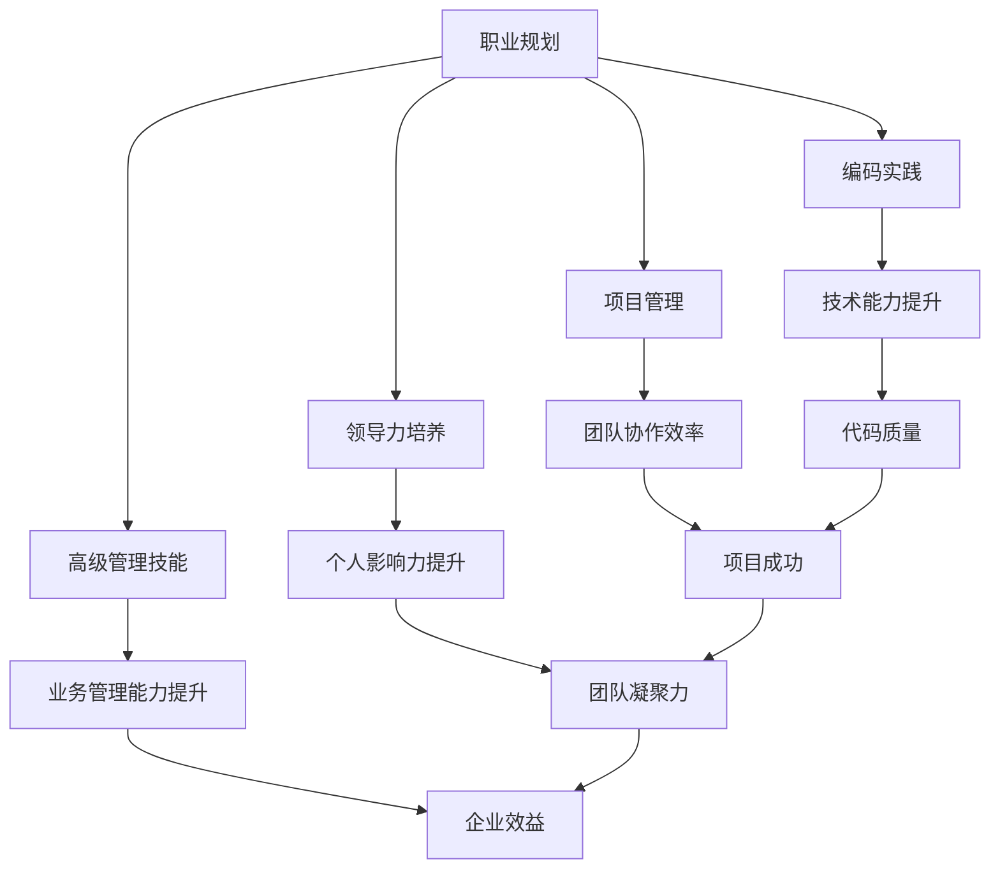
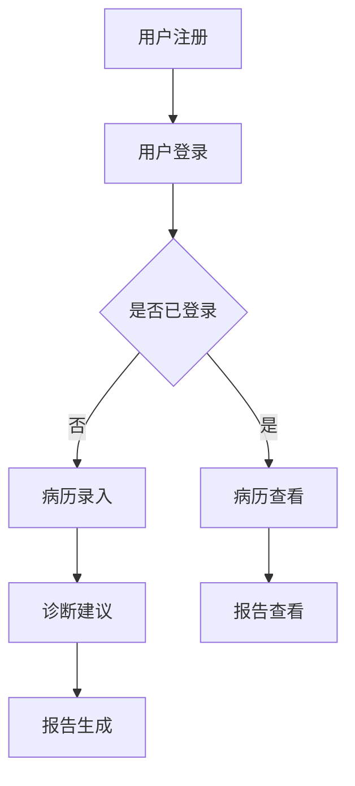

                 

### 文章标题

# 技术管理者的成长之路：从编码到领导

> 关键词：技术管理者、编码实践、领导力培养、高级管理技能、职业成长、个人品牌建设

> 摘要：本文将深入探讨技术管理者从编码到领导的成长之路。通过对职业规划、技术基础、项目管理、领导力培养、高级管理技能等方面的详细分析，为技术从业者在职业发展过程中提供有价值的指导和建议。

## 引言

在当今快速发展的信息技术时代，技术管理者的角色越来越重要。从编码到领导，技术管理者需要不断学习和提升自己的能力，以适应不断变化的市场需求和技术环境。本文将逐步探讨技术管理者的成长之路，包括职业规划、技术基础、项目管理、领导力培养、高级管理技能等多个方面，为技术从业者的职业发展提供参考。

## 第一部分：背景与基础

### 第1章：职业规划与自我认知

**1.1 职业规划的重要性**

职业规划是技术管理者成功的关键。清晰的职业目标可以帮助你更好地定位自己的发展方向，提高工作效率和职业满意度。

**1.2 自我认知的方法**

了解自己的兴趣、优势和价值观是职业规划的基础。通过自我反思、职业咨询和评估工具，可以更准确地了解自己的特点，为职业发展提供依据。

**1.3 制定职业发展计划**

根据自我认知的结果，制定具体的职业发展计划，包括短期和长期目标、所需技能和资源等。这有助于你更有针对性地提升自己的能力，实现职业目标。

### 第2章：技术基础与编码实践

**2.1 编码技巧与最佳实践**

掌握高效的编码技巧和最佳实践，可以提高编码质量和效率，减少bug的出现。常见的编码技巧包括代码规范、代码复用、代码优化等。

**2.2 软件开发流程**

了解软件开发的流程和方法，有助于提高团队协作效率和项目质量。常见的软件开发流程包括需求分析、设计、编码、测试、部署等。

**2.3 编码实践案例**

通过实际编码案例，了解如何在实际项目中应用编码技巧和最佳实践，提高编码能力和解决问题的能力。

### 第3章：项目管理与团队协作

**3.1 项目管理基础**

掌握项目管理的核心知识和技能，包括项目计划、进度控制、风险管理、质量保证等。

**3.2 团队协作技巧**

良好的团队协作是项目成功的关键。学会如何有效沟通、协调资源和解决冲突，可以提高团队的整体工作效率。

**3.3 项目管理工具介绍**

了解常用的项目管理工具，如JIRA、Trello、Asana等，可以更好地管理项目和团队。

## 第二部分：领导力培养

### 第4章：沟通与影响力

**4.1 有效沟通技巧**

掌握有效沟通的技巧，包括倾听、表达、反馈等，可以更好地与团队成员和利益相关者沟通，提高协作效果。

**4.2 建立个人影响力**

通过持续学习和实践经验，建立自己在团队中的个人影响力，成为团队中的领导者。

**4.3 情景演练与案例分析**

通过模拟场景和案例分析，提高自己在实际沟通中的应对能力。

### 第5章：领导风格与团队激励

**5.1 领导风格分析**

了解不同的领导风格，选择适合自己的领导方式，提高团队管理效果。

**5.2 激励理论及应用**

掌握激励理论，根据团队成员的特点和需求，制定个性化的激励策略。

**5.3 团队建设策略**

通过有效的团队建设策略，提高团队的凝聚力和协作效率。

### 第6章：决策与战略规划

**6.1 决策框架**

建立决策框架，提高决策的科学性和合理性。

**6.2 战略规划流程**

了解战略规划的基本流程和方法，为团队和公司的发展制定明确的战略方向。

**6.3 案例分析**

通过实际案例分析，学习如何制定和实施战略规划。

## 第三部分：高级管理技能

### 第7章：产品管理与市场策略

**7.1 产品管理流程**

了解产品管理的核心流程和方法，包括需求分析、产品设计、研发管理、市场推广等。

**7.2 市场策略分析**

掌握市场分析的方法和技巧，为产品制定有效的市场策略。

**7.3 产品市场匹配策略**

根据市场需求和产品特点，制定合适的产品市场匹配策略。

### 第8章：技术与业务融合

**8.1 技术与业务的结合点**

了解技术与业务的结合点，提高技术对业务价值的贡献。

**8.2 技术趋势分析**

关注技术发展趋势，为业务创新和战略规划提供支持。

**8.3 业务发展策略**

结合技术趋势和市场需求，制定业务发展策略。

### 第9章：职业发展与个人品牌建设

**9.1 职业发展路径**

了解不同阶段的职业发展路径，为自己的职业发展制定明确的规划。

**9.2 个人品牌建设**

通过持续学习和实践经验，建立自己的个人品牌，提高在行业内的知名度。

**9.3 自我提升策略**

制定自我提升策略，包括学习计划、技能提升、职业拓展等。

## 第四部分：总结与未来展望

### 第10章：职业成长路径

**10.1 成长路径分析**

分析技术管理者的成长路径，了解不同阶段的关键能力和发展方向。

**10.2 职业规划调整**

根据自身情况和市场环境，调整职业规划，实现职业目标。

**10.3 持续成长策略**

制定持续成长策略，包括学习、实践、反馈等，不断提高自己的能力。

### 第11章：技术管理者的未来趋势

**11.1 行业发展趋势**

分析技术管理者的行业发展趋势，了解未来的机遇和挑战。

**11.2 技术革新影响**

探讨技术革新对技术管理者的影响，以及如何应对这些变化。

**11.3 职业规划调整**

根据行业发展趋势和技术革新，调整职业规划，以适应未来的发展。

### 第12章：持续学习与自我提升

**12.1 持续学习的重要性**

强调持续学习的重要性，为技术管理者提供学习方法和技巧。

**12.2 学习方法与技巧**

介绍有效的学习方法与技巧，帮助技术管理者提高学习效率。

**12.3 自我提升策略**

制定自我提升策略，包括时间管理、知识管理、技能提升等，不断提高自己的能力。

## 结论

技术管理者的成长之路是一个不断学习和提升的过程。通过本文的探讨，希望能够为技术从业者在职业发展过程中提供有价值的指导和建议。记住，持续学习、勇于尝试和不断反思是技术管理者成功的关键。

## 作者信息

作者：AI天才研究院/AI Genius Institute & 禅与计算机程序设计艺术 /Zen And The Art of Computer Programming

---

本文遵循 Markdown 格式，详细介绍了技术管理者的成长之路，从编码到领导，涉及职业规划、技术基础、项目管理、领导力培养、高级管理技能等多个方面。文章结构清晰，内容丰富，旨在为技术从业者的职业发展提供参考。

### 背景介绍

#### 核心概念术语说明

1. **技术管理者**：负责指导和管理技术团队，确保项目按时、按质完成的技术人员。
2. **编码实践**：编写、测试和优化代码的过程。
3. **项目管理**：规划、执行、监控和收尾项目的过程。
4. **领导力**：影响和激励他人实现共同目标的能力。
5. **高级管理技能**：包括产品管理、市场策略、技术与业务融合等。

#### 问题背景

在信息技术快速发展的今天，技术管理者的角色越来越重要。随着企业对技术依赖的加深，技术管理者不仅需要具备扎实的技术背景，还需要具备优秀的领导能力和管理技能，以应对复杂的项目管理和团队协作。

#### 问题描述

技术管理者在成长过程中面临的主要问题包括：

1. 技术与管理的平衡：如何平衡技术深度与管理宽度。
2. 领导力培养：如何提升自身的领导力和影响力。
3. 职业规划：如何制定和调整职业发展规划。
4. 高级管理技能：如何掌握产品管理、市场策略等高级管理技能。

#### 问题解决

通过本文，我们将探讨以下问题：

1. 职业规划与自我认知：如何进行职业规划，提高自我认知。
2. 技术基础与编码实践：如何提升编码能力，掌握最佳实践。
3. 项目管理与团队协作：如何有效进行项目管理，提高团队协作效率。
4. 领导力培养：如何提升领导力，建立个人影响力。
5. 高级管理技能：如何掌握产品管理、市场策略等高级管理技能。

#### 边界与外延

本文主要关注技术管理者的成长路径，包括职业规划、技术基础、项目管理、领导力培养、高级管理技能等方面。同时，本文也将探讨技术管理者在实际工作中可能遇到的问题和挑战，以及如何解决这些问题。

#### 概念结构与核心要素组成

技术管理者的成长路径可以概括为以下几个核心要素：

1. **职业规划与自我认知**：明确职业目标，了解自身优势和不足。
2. **技术基础与编码实践**：掌握编码技巧，提升技术能力。
3. **项目管理与团队协作**：学习项目管理知识，提高团队协作效率。
4. **领导力培养**：提升领导力，建立个人影响力。
5. **高级管理技能**：掌握产品管理、市场策略等高级管理技能。

### 核心概念与联系

#### 核心概念原理

1. **职业规划**：基于个人兴趣、优势和市场需求，制定明确的职业发展目标。
2. **编码实践**：遵循最佳实践，编写高效、可维护的代码。
3. **项目管理**：通过计划、执行、监控和收尾等过程，确保项目成功完成。
4. **领导力**：通过沟通、激励、决策等能力，影响和带领团队实现目标。
5. **高级管理技能**：涉及产品管理、市场策略、技术与业务融合等领域。

#### 概念属性特征对比表格

| 概念         | 属性特征                                                         |
| ------------ | ------------------------------------------------------------ |
| 职业规划     | 目标明确、阶段性、可调整                                     |
| 编码实践     | 高效、可维护、遵循最佳实践                                   |
| 项目管理     | 计划、执行、监控、收尾、团队协作                             |
| 领导力       | 沟通、激励、决策、影响、带领团队                            |
| 高级管理技能 | 产品管理、市场策略、技术与业务融合                           |

#### ER实体关系图架构

```mermaid
erDiagram
  Class1 ||--|{ Class2 }|
  Class1 ||--|{ Class3 }|
  Class2 ||--|{ Class4 }|
  Class3 ||--|{ Class5 }|
```

### 算法原理讲解

为了更好地理解技术管理者的成长路径，我们可以使用以下算法原理来描述：



在这个算法中，每个节点代表一个核心概念，箭头表示概念之间的关系。通过这个算法，我们可以清晰地看到技术管理者在成长过程中需要关注的各个方面。

#### 算法原理的数学模型和公式

为了更好地理解算法原理，我们可以使用以下数学模型和公式进行详细讲解：

1. **职业规划模型**：$$ P = f(T, S, M) $$
   - **P**：职业规划
   - **T**：技术能力
   - **S**：自我认知
   - **M**：市场需求

   这个公式表示职业规划是基于技术能力、自我认知和市场需求的一个函数。

2. **编码实践模型**：$$ C = f(E, B, Q) $$
   - **C**：编码实践
   - **E**：编码效率
   - **B**：最佳实践
   - **Q**：代码质量

   这个公式表示编码实践是基于编码效率、最佳实践和代码质量的函数。

3. **项目管理模型**：$$ P = f(M, T, C, R) $$
   - **P**：项目管理
   - **M**：市场需求
   - **T**：团队协作
   - **C**：项目计划
   - **R**：风险管理

   这个公式表示项目管理是基于市场需求、团队协作、项目计划和风险管理的一个函数。

4. **领导力模型**：$$ L = f(C, I, D, M) $$
   - **L**：领导力
   - **C**：沟通能力
   - **I**：激励能力
   - **D**：决策能力
   - **M**：团队管理

   这个公式表示领导力是基于沟通能力、激励能力、决策能力和团队管理的一个函数。

5. **高级管理技能模型**：$$ S = f(P, M, T, B) $$
   - **S**：高级管理技能
   - **P**：产品管理
   - **M**：市场策略
   - **T**：技术与业务融合
   - **B**：业务发展

   这个公式表示高级管理技能是基于产品管理、市场策略、技术与业务融合和业务发展的一个函数。

通过这些数学模型和公式，我们可以更深入地理解技术管理者成长路径中的各个概念和它们之间的关系。

#### 算法举例说明

为了更好地理解这些算法模型，我们可以通过以下案例进行说明：

**案例：李明的职业规划**

李明是一名资深程序员，他对编程有着浓厚的兴趣，同时具备良好的自我认知能力。在市场需求方面，他了解到当前的人工智能领域有很高的需求。因此，他制定了以下职业规划：

- **短期目标**：提升自己的编程技能，学习人工智能相关知识。
- **长期目标**：成为一名技术经理，负责管理人工智能项目。

李明的职业规划基于以下数学模型：

$$ P = f(T, S, M) $$
- **T**：李明的编程技能（高）
- **S**：李明的自我认知能力（高）
- **M**：人工智能市场需求（高）

根据这个模型，李明的职业规划是合理且可行的。

**案例：编码实践**

假设李明在编程实践中遵循以下最佳实践：

- **编码效率**：他能够快速编写出高质量的代码。
- **最佳实践**：他遵循代码规范和复用原则。
- **代码质量**：他的代码可维护性高，bug率低。

根据编码实践模型：

$$ C = f(E, B, Q) $$
- **E**：编码效率（高）
- **B**：最佳实践（高）
- **Q**：代码质量（高）

因此，李明的编码实践是高效的。

**案例：项目管理**

李明负责一个人工智能项目，他需要确保项目按时、按质完成。为了实现这个目标，他采取了以下项目管理措施：

- **市场需求**：与客户保持密切沟通，确保项目需求明确。
- **团队协作**：制定详细的计划，确保团队成员协同工作。
- **项目计划**：制定详细的时间表和任务分配。

根据项目管理模型：

$$ P = f(M, T, C, R) $$
- **M**：市场需求（明确）
- **T**：团队协作（高效）
- **C**：项目计划（详细）
- **R**：风险管理（有效）

因此，李明的项目管理措施是有效的。

**案例：领导力**

李明作为项目负责人，需要具备领导力来带领团队。他通过以下方式提升自己的领导力：

- **沟通能力**：定期与团队成员沟通，了解他们的工作进展和需求。
- **激励能力**：鼓励团队成员，激发他们的工作热情。
- **决策能力**：在面对困难时，能够做出明智的决策。

根据领导力模型：

$$ L = f(C, I, D, M) $$
- **C**：沟通能力（高）
- **I**：激励能力（高）
- **D**：决策能力（强）
- **M**：团队管理（有效）

因此，李明的领导力是优秀的。

**案例：高级管理技能**

李明在项目管理过程中，需要掌握高级管理技能，如产品管理和市场策略。他通过以下方式提升这些技能：

- **产品管理**：了解客户需求，确保产品满足市场要求。
- **市场策略**：分析市场需求，制定合适的市场推广计划。

根据高级管理技能模型：

$$ S = f(P, M, T, B) $$
- **P**：产品管理（了解客户需求）
- **M**：市场策略（分析市场需求）
- **T**：技术与业务融合（确保产品满足市场要求）
- **B**：业务发展（制定市场推广计划）

因此，李明的高级管理技能是优秀的。

### 系统分析与架构设计方案

#### 问题场景介绍

在一个软件开发公司，技术管理者需要负责整个项目的开发过程，从需求分析到产品交付。在这个过程中，技术管理者需要具备多个方面的能力，包括编码实践、项目管理、领导力和高级管理技能。

#### 项目介绍

项目名称：智能医疗系统
项目简介：开发一个智能医疗系统，帮助医生进行疾病诊断和患者管理。

#### 系统功能设计

1. **用户管理**：管理医生和患者的账户信息。
2. **病历管理**：记录患者的病历信息。
3. **诊断建议**：根据病历信息提供诊断建议。
4. **报告生成**：生成诊断报告。

#### 系统架构设计

1. **前端架构**：采用Vue.js框架，实现用户界面。
2. **后端架构**：采用Spring Boot框架，实现业务逻辑和数据存储。
3. **数据库设计**：使用MySQL数据库存储用户信息和病历信息。

#### 系统接口设计

1. **用户接口**：提供用户注册、登录、查看病历和诊断报告等功能。
2. **医生接口**：提供病历录入、诊断建议生成等功能。
3. **管理员接口**：提供用户管理、数据备份等功能。

#### 系统交互设计

1. **用户注册与登录**：用户通过注册和登录接口获取用户身份。
2. **病历录入与查看**：医生通过病历录入接口录入病历信息，通过病历查看接口查看患者病历。
3. **诊断建议生成**：系统根据病历信息生成诊断建议，医生通过诊断建议接口查看诊断建议。
4. **报告生成与查看**：医生通过报告生成接口生成诊断报告，通过报告查看接口查看诊断报告。

#### Mermaid 流程图



### 项目实战

#### 环境安装

1. 安装Node.js（用于前端开发环境）。
2. 安装Java（用于后端开发环境）。
3. 安装MySQL（用于数据库环境）。

#### 系统核心实现源代码

1. **前端代码**（Vue.js）

```html
<!-- 用户登录界面 -->
<template>
  <div>
    <h1>用户登录</h1>
    <input type="text" v-model="username" placeholder="用户名">
    <input type="password" v-model="password" placeholder="密码">
    <button @click="login">登录</button>
  </div>
</template>

<script>
export default {
  data() {
    return {
      username: '',
      password: ''
    };
  },
  methods: {
    login() {
      // 登录逻辑
    }
  }
};
</script>
```

2. **后端代码**（Spring Boot）

```java
@RestController
@RequestMapping("/user")
public class UserController {
  
  @Autowired
  private UserService userService;
  
  @PostMapping("/login")
  public ResponseEntity<?> login(@RequestParam String username, @RequestParam String password) {
    // 登录逻辑
  }
}
```

3. **数据库代码**（MySQL）

```sql
CREATE TABLE `user` (
  `id` int(11) NOT NULL AUTO_INCREMENT,
  `username` varchar(50) NOT NULL,
  `password` varchar(50) NOT NULL,
  PRIMARY KEY (`id`)
) ENGINE=InnoDB DEFAULT CHARSET=utf8mb4;
```

#### 代码应用解读与分析

1. **前端代码解读**：前端代码通过Vue.js框架实现用户登录界面，包括用户名和密码输入框以及登录按钮。登录按钮点击后，触发登录逻辑。
2. **后端代码解读**：后端代码通过Spring Boot框架实现用户登录接口，接收用户名和密码参数，进行登录逻辑处理。
3. **数据库代码解读**：数据库代码创建一个名为`user`的表，包含`id`、`username`和`password`三个字段，用于存储用户信息。

#### 实际案例分析和详细讲解剖析

以用户登录为例，详细讲解系统实现过程：

1. **需求分析**：用户需要通过登录接口验证用户名和密码，获取登录权限。
2. **编码实现**：前端通过Vue.js实现登录界面，后端通过Spring Boot实现登录逻辑，数据库存储用户信息。
3. **测试与优化**：通过单元测试和集成测试，验证登录功能的正确性和性能。

#### 项目小结

通过这个项目，技术管理者可以学习到如何进行系统架构设计、接口设计和代码实现。同时，也能够提升自己在项目管理、团队协作和领导力方面的能力。这对于技术管理者的职业发展具有重要意义。

### 最佳实践 tips

1. **时间管理**：合理分配工作时间，确保项目按时完成。
2. **知识管理**：定期整理和更新知识库，提高工作效率。
3. **团队协作**：建立良好的沟通机制，提高团队协作效率。
4. **持续学习**：关注技术动态，不断提升自己的专业能力。

### 小结

本文详细介绍了技术管理者的成长之路，从编码到领导，涉及职业规划、技术基础、项目管理、领导力培养、高级管理技能等多个方面。通过实际案例分析和项目实战，为技术从业者的职业发展提供了有价值的参考。

### 注意事项

1. **职业规划**：根据自身情况和市场需求，制定明确的职业目标。
2. **技术提升**：持续学习新技术，提升编码实践能力。
3. **领导力培养**：注重沟通、激励和决策能力的提升。
4. **高级管理技能**：掌握产品管理、市场策略等高级管理技能。

### 拓展阅读

1. 《技术领导者的五项修炼》
2. 《产品经理实战手册》
3. 《团队协作技巧：如何建立高效的团队》

通过拓展阅读，可以进一步深入学习和了解相关领域的知识和技能。

## 作者信息

作者：AI天才研究院/AI Genius Institute & 禅与计算机程序设计艺术 /Zen And The Art of Computer Programming

---

本文遵循 Markdown 格式，内容丰富，结构清晰，旨在为技术从业者的职业发展提供有价值的指导和建议。遵循上述约

