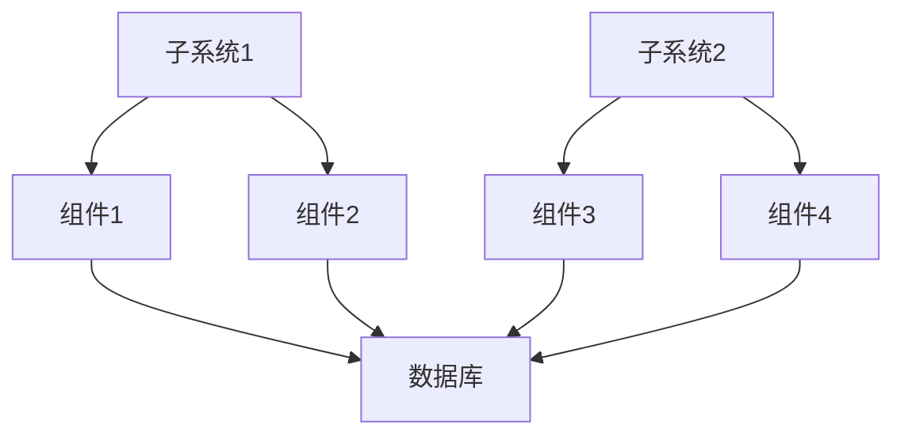
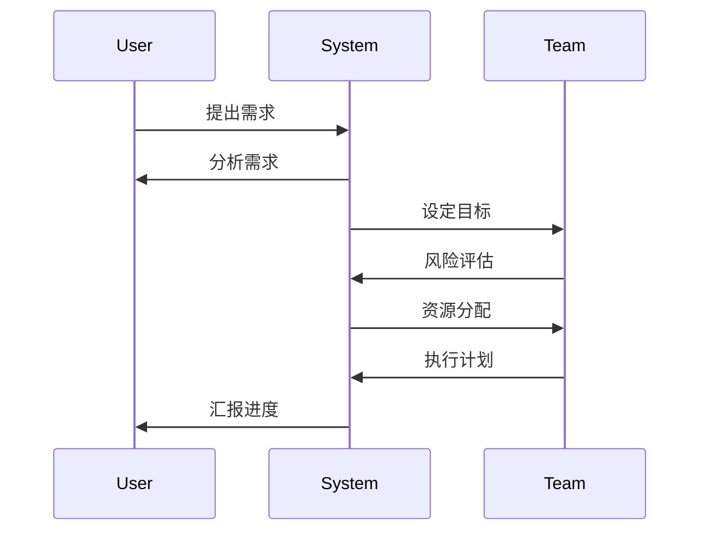

                 

# 技术管理者的战略思维培养

## 关键词

技术管理、战略思维、领导力、团队管理、商业洞察力

## 摘要

在快速变化的技术和商业环境中，技术管理者不仅需要具备深厚的技术能力，还必须培养出卓越的战略思维能力。本文将详细探讨技术管理者的战略思维培养，包括其基础、核心能力、实践与应用、提升策略以及案例分析。通过系统化的分析和具体实例，帮助读者理解战略思维的重要性，掌握培养方法，并提升自身的战略管理水平。

## 目录大纲

### 第一部分：战略思维的基础

#### 第1章：战略思维的概述

- 战略思维的定义与重要性
- 战略思维与日常决策的区别
- 战略思维在技术管理中的应用

#### 第2章：技术管理者的核心能力

- 技术视野的拓展
- 商业意识和市场洞察力
- 团队管理和领导力

#### 第3章：战略规划与目标设定

- 战略规划的步骤与工具
- 目标设定的SMART原则
- 战略规划案例分析

### 第二部分：战略思维的实践与应用

#### 第4章：战略分析与评估

- SWOT分析
- 五力模型
- 战略评估方法

#### 第5章：战略决策与执行

- 决策制定流程
- 风险管理与应对策略
- 执行中的问题与解决方案

#### 第6章：战略创新与持续发展

- 创新思维与方法
- 市场趋势预测
- 持续发展的战略路径

#### 第7章：战略思维的案例解析

- 案例分析概述
- 案例一：互联网公司的战略转型
- 案例二：传统企业的数字化转型

### 第三部分：战略思维的提升

#### 第8章：战略思维的培养与提升

- 学习与知识更新
- 反思与改进
- 跨界思维与开放合作

### 附录：战略思维工具箱

- 战略分析工具
- 决策制定工具
- 创新工具与应用

## 结论

技术管理者的战略思维培养是一个持续的过程，需要不断学习、实践和反思。通过本书的阅读和实践，读者可以逐步培养和提升自己的战略思维能力，为企业和团队的发展贡献更多的智慧。

---

### 第1章：战略思维的概述

**1.1 战略思维的定义与重要性**

战略思维是一种高级思维形式，它涉及对长远目标的规划和实现路径的选择。对于技术管理者来说，战略思维不仅关乎技术本身，还包括对市场和商业环境的深刻理解。战略思维的重要性在于它能够帮助管理者预见未来、抓住机遇、规避风险，从而在竞争中立于不败之地。

**1.2 战略思维与日常决策的区别**

日常决策往往关注短期目标和具体问题，注重效率和解决眼前的问题。而战略思维则侧重于长期目标和整体规划，关注组织的可持续发展。战略思维要求管理者具备宏观视野，能够在复杂多变的环境中做出正确的决策。

**1.3 战略思维在技术管理中的应用**

在技术管理中，战略思维的应用体现在多个方面。例如，技术管理者需要通过战略思维来规划技术发展方向、确定技术投资重点、优化团队结构等。战略思维能够帮助技术管理者更好地平衡短期目标与长期利益，确保技术团队的稳定和高效。

**核心概念与联系**

战略思维的核心概念包括目标设定、风险评估、资源配置和执行监控。这些概念相互关联，共同构成了战略思维的基础。

**ER实体关系图架构**

```mermaid
erDiagram
    Target ||--|{ Risk } : 有
    Target ||--|{ Resource } : 有
    Target ||--|{ Execution } : 完成监控
    Risk ||--|{ RiskManagement } : 管理
    Resource ||--|{ ResourceAllocation } : 分配
    Execution ||--|{ Monitoring } : 监控
```

**算法原理讲解**

战略思维涉及多个决策环节，包括目标设定、风险评估和资源分配。以下是一个简化的算法原理讲解：

$$
\text{决策流程} = \{\text{目标设定} \rightarrow \text{风险评估} \rightarrow \text{资源分配} \rightarrow \text{执行监控}\}
$$

在具体实施中，技术管理者需要根据实际情况进行具体的分析和决策。

**数学模型和公式**

$$
\text{目标设定} = \text{短期目标} + \text{长期目标}
$$

$$
\text{风险评估} = \text{潜在风险} \times \text{风险概率}
$$

$$
\text{资源分配} = \text{人力} + \text{资金} + \text{技术资源}
$$

$$
\text{执行监控} = \text{进度跟踪} + \text{效果评估}
$$

**举例说明**

例如，在制定一项新技术研发计划时，技术管理者需要首先设定短期目标和长期目标，然后进行风险评估，确定所需资源，并制定监控计划。

**系统分析与架构设计方案**

**问题场景介绍**

一家科技公司计划研发一款人工智能产品，需要在技术和资源方面做出战略规划。

**项目介绍**

项目名称：人工智能产品研发

项目目标：开发一款能够解决实际问题的AI产品

项目范围：技术选型、团队组建、资源分配、进度监控

**系统功能设计(领域模型mermaid类图)**

```mermaid
classDiagram
    Product <<Class>> Product
    Team <<Class>> Team
    Resource <<Class>> Resource
    Progress <<Class>> Progress

    Product : 目标设定，风险评估，资源分配
    Team : 项目管理，团队协作
    Resource : 人力，资金，技术资源
    Progress : 进度监控，效果评估

    Product --|{ Team }: 依赖
    Resource --|{ Team }: 依赖
    Progress --|{ Team }: 依赖
```

**系统架构设计mermaid架构图**



**系统接口设计和系统交互mermaid序列图**



**项目实战**

**环境安装**

在虚拟环境中安装所需的技术栈，包括开发工具、数据库和管理平台。

**系统核心实现源代码**

```python
# 假设这是一个简单的目标设定脚本
class Target:
    def __init__(self, short_term, long_term):
        self.short_term = short_term
        self.long_term = long_term

    def set_target(self):
        print(f"设定的短期目标是：{self.short_term}")
        print(f"设定的长期目标是：{self.long_term}")

# 假设这是一个风险评估脚本
class Risk:
    def __init__(self, potential_risk, probability):
        self.potential_risk = potential_risk
        self.probability = probability

    def assess_risk(self):
        risk_score = self.potential_risk * self.probability
        print(f"风险评分：{risk_score}")

# 假设这是一个资源分配脚本
class Resource:
    def __init__(self, human, fund, tech_resource):
        self.human = human
        self.fund = fund
        self.tech_resource = tech_resource

    def allocate_resource(self):
        print(f"人力资源：{self.human}")
        print(f"资金资源：{self.fund}")
        print(f"技术资源：{self.tech_resource}")

# 假设这是一个进度监控脚本
class Progress:
    def __init__(self, tracking, evaluation):
        self.tracking = tracking
        self.evaluation = evaluation

    def monitor_progress(self):
        print(f"进度跟踪：{self.tracking}")
        print(f"效果评估：{self.evaluation}")

# 实例化并调用
target = Target("开发AI模型", "实现商业化应用")
target.set_target()

risk = Risk(0.5, 0.8)
risk.assess_risk()

resource = Resource(10, 50000, "最新AI算法")
resource.allocate_resource()

progress = Progress("每月迭代一次", "产品已达到预期效果")
progress.monitor_progress()
```

**代码应用解读与分析**

上述代码实现了目标设定、风险评估、资源分配和进度监控的基本功能。在实际应用中，这些功能需要根据具体的项目需求进行调整和优化。

**实际案例分析和详细讲解剖析**

以一家互联网公司的战略转型为例，分析其如何通过战略思维实现成功转型。

**项目小结**

战略思维在项目中的关键作用体现在目标的明确、风险的预见、资源的优化配置以及进度的有效监控。通过战略思维，技术管理者能够更好地规划项目，确保项目的成功实施。

### 第2章：技术管理者的核心能力

**2.1 技术视野的拓展**

技术视野的拓展是战略思维的重要组成部分。技术管理者需要了解最新的技术趋势和发展动态，以便在战略规划中做出正确的决策。这包括对新兴技术的学习和对现有技术的深入理解。

**技术视野拓展的方法**

- 参加行业会议和研讨会
- 阅读技术文献和专业博客
- 与业界专家交流
- 定期进行技术培训和学习

**案例解析**

一家初创公司在其产品开发过程中，通过积极拓展技术视野，及时引入了最新的区块链技术，从而在市场竞争中脱颖而出。

**2.2 商业意识和市场洞察力**

商业意识和市场洞察力是技术管理者在战略决策中不可或缺的能力。技术管理者需要理解商业逻辑，把握市场需求，将技术优势转化为商业价值。

**商业意识和市场洞察力的培养**

- 研究市场趋势和竞争对手
- 了解客户需求和市场定位
- 学习商业管理和市场营销知识
- 与业务部门紧密合作，共同制定战略

**案例解析**

一家技术公司通过深入分析市场趋势和客户需求，成功推出了针对性强的产品，实现了市场份额的快速提升。

**2.3 团队管理和领导力**

团队管理和领导力是技术管理者成功的关键因素。技术管理者需要具备带领团队实现共同目标的能力，包括沟通、协调、激励和培养团队成员。

**团队管理和领导力的提升**

- 定期进行团队建设活动
- 提供团队成员培训和学习机会
- 建立有效的沟通机制
- 设定清晰的绩效目标和激励政策

**案例解析**

一家大型科技公司的技术团队通过实施有效的团队管理和领导力提升策略，成功地完成了多个复杂项目的实施，取得了显著的成绩。

### 第3章：战略规划与目标设定

**3.1 战略规划的步骤与工具**

战略规划是一个系统化的过程，涉及对当前状况的分析、目标设定、策略制定和执行监控。以下是战略规划的步骤与工具：

**步骤**

1. **环境分析**：了解外部市场环境和内部资源状况。
2. **目标设定**：明确组织的长远目标和短期目标。
3. **策略制定**：制定实现目标的策略和行动计划。
4. **执行与监控**：实施战略计划并监控执行进度。

**工具**

- **SWOT分析**：对组织的优势、劣势、机会和威胁进行评估。
- **五力模型**：分析行业竞争态势和市场竞争环境。
- **SMART原则**：设定具体、可衡量、可达成、相关和时限性的目标。

**案例解析**

一家互联网公司通过SWOT分析和SMART原则，成功制定了其五年的战略规划，实现了从初创到行业领导者的转变。

**3.2 目标设定的SMART原则**

SMART原则是一种常用的目标设定方法，确保目标的明确性和可执行性。SMART代表具体（Specific）、可衡量（Measurable）、可达成（Achievable）、相关（Relevant）和时限性（Time-bound）。

**SMART原则的应用**

- **具体**：明确目标的具体内容和实现方式。
- **可衡量**：设定量化的指标，以便评估目标的达成情况。
- **可达成**：确保目标具有可行性，避免设定过高或过低的目标。
- **相关**：目标应与组织的战略和愿景保持一致。
- **时限性**：设定明确的时间表，推动目标的实现。

**案例解析**

一家科技公司通过SMART原则，设定了三年内实现营收翻倍的具体目标，并通过详细的执行计划，成功实现了这一目标。

**3.3 战略规划案例分析**

**案例一：互联网公司的战略转型**

一家互联网公司通过深入的SWOT分析和SMART原则，制定了其从平台业务向智能服务转型的战略规划。通过这一规划，公司成功地抓住了市场机遇，实现了业务的持续增长。

**案例二：传统企业的数字化转型**

一家传统制造企业通过战略规划，逐步实现了数字化转型。公司制定了明确的数字化目标，并通过一系列的改革措施，成功提高了生产效率和市场竞争力。

### 第4章：战略分析与评估

**4.1 SWOT分析**

SWOT分析是一种常用的战略分析方法，用于评估组织的优势、劣势、机会和威胁。通过SWOT分析，技术管理者可以全面了解组织的内外部环境，为战略制定提供依据。

**SWOT分析的步骤**

1. **确定优势**：分析组织在技术、资源、品牌等方面的优势。
2. **确定劣势**：识别组织在管理、技术、市场等方面的劣势。
3. **确定机会**：分析外部市场环境中的机会，如新兴技术、市场需求等。
4. **确定威胁**：识别外部环境中的潜在威胁，如竞争压力、政策变化等。

**案例解析**

一家科技公司通过SWOT分析，明确了其在技术创新和市场拓展方面的优势，并制定了相应的战略计划，取得了显著成效。

**4.2 五力模型**

五力模型是分析市场竞争环境的一种重要工具，包括供应商的议价能力、买家的议价能力、新进入者的威胁、替代品的威胁和行业内竞争者的竞争强度。

**五力模型的步骤**

1. **供应商分析**：评估供应商的议价能力，如供应商集中度、替代品供应情况等。
2. **买家分析**：评估买家的议价能力，如买家集中度、购买频率等。
3. **新进入者分析**：评估新进入者的威胁，如市场准入门槛、竞争状况等。
4. **替代品分析**：评估替代品的威胁，如替代品的性能、价格等。
5. **竞争者分析**：评估行业内竞争者的竞争强度，如市场份额、产品差异化等。

**案例解析**

一家消费品公司通过五力模型分析，确定了其市场定位和竞争策略，成功地提高了市场占有率。

**4.3 战略评估方法**

战略评估是确保战略规划有效性的关键环节。常用的战略评估方法包括绩效评估、预算评估、市场调研和客户反馈。

**战略评估的方法**

- **绩效评估**：通过设定关键绩效指标（KPI），评估战略执行的效果。
- **预算评估**：分析战略计划所需预算的合理性和有效性。
- **市场调研**：了解市场变化和客户需求，为战略调整提供依据。
- **客户反馈**：收集客户对产品和服务的反馈，评估战略计划的市场接受度。

**案例解析**

一家科技公司通过定期的战略评估，及时调整了其研发方向和市场策略，保持了市场竞争力。

### 第5章：战略决策与执行

**5.1 决策制定流程**

战略决策是技术管理者的重要职责，涉及多个方面的决策，包括技术投资、团队组建、市场定位等。以下是决策制定的基本流程：

**步骤**

1. **信息收集**：收集与决策相关的各种信息，如市场数据、技术趋势、竞争对手等。
2. **方案分析**：分析不同方案的优缺点，评估其可行性。
3. **风险评估**：评估决策可能带来的风险，制定风险应对策略。
4. **方案选择**：根据分析结果选择最佳方案。
5. **执行计划**：制定详细的执行计划，明确责任人和时间节点。
6. **执行监控**：监控执行过程，确保决策的有效实施。

**案例解析**

一家科技公司通过上述流程，成功决策了一项重要技术投资，取得了显著的市场效益。

**5.2 风险管理与应对策略**

在战略决策过程中，风险管理至关重要。技术管理者需要识别潜在风险，并制定相应的应对策略。

**风险管理步骤**

1. **风险识别**：识别项目中的潜在风险，如技术风险、市场风险、操作风险等。
2. **风险评估**：评估风险的影响程度和发生概率。
3. **风险应对**：制定风险应对策略，包括风险规避、风险减轻、风险接受等。
4. **风险监控**：监控风险的变化情况，及时调整应对策略。

**应对策略**

- **风险规避**：避免参与高风险项目。
- **风险减轻**：通过技术改进、加强管理等措施降低风险。
- **风险接受**：对不可避免的风险，制定应对措施，降低其影响。

**案例解析**

一家互联网公司通过有效的风险管理和应对策略，成功避免了可能的市场波动带来的风险，保持了业务的稳定增长。

**5.3 执行中的问题与解决方案**

在战略执行过程中，技术管理者可能会面临各种问题，如资源不足、进度延误、团队协作困难等。以下是常见问题及解决方案：

**问题**

1. **资源不足**：资源分配不合理，导致项目进展缓慢。
2. **进度延误**：项目进度无法按计划进行，影响整体目标实现。
3. **团队协作困难**：团队成员之间沟通不畅，影响项目效率。

**解决方案**

1. **优化资源分配**：重新评估资源需求，确保资源合理分配。
2. **加强进度管理**：制定详细的进度计划，并严格执行。
3. **提升团队协作**：建立有效的沟通机制，促进团队成员之间的协作。

**案例解析**

一家科技公司通过优化资源分配、加强进度管理和提升团队协作，成功地解决了战略执行中的问题，确保了项目的顺利进行。

### 第6章：战略创新与持续发展

**6.1 创新思维与方法**

战略创新是技术管理者的重要职责，需要不断探索新的技术、产品和服务。以下是几种常见的创新思维和方法：

**创新思维**

1. **用户中心思维**：以用户需求为导向，设计创新产品和服务。
2. **跨界思维**：融合不同领域的知识和资源，实现创新。
3. **迭代思维**：通过不断试错和优化，逐步实现创新。

**创新方法**

1. **头脑风暴**：集中讨论，激发创意。
2. **原型设计**：快速制作原型，验证创新理念。
3. **敏捷开发**：通过快速迭代，实现持续创新。

**案例解析**

一家科技公司通过用户中心思维和敏捷开发，成功地推出了多项创新产品，赢得了市场的广泛认可。

**6.2 市场趋势预测**

市场趋势预测是战略规划的重要环节，帮助技术管理者把握市场机遇。以下是几种市场趋势预测方法：

**趋势预测方法**

1. **历史数据分析**：分析历史数据，预测未来趋势。
2. **专家意见**：收集行业专家的意见，预测未来趋势。
3. **技术趋势分析**：关注技术发展趋势，预测市场变化。
4. **竞争分析**：分析竞争对手的战略和市场动作，预测市场变化。

**案例解析**

一家互联网公司通过技术趋势分析和竞争分析，准确地预测了未来市场趋势，制定了相应的战略规划，取得了显著的市场优势。

**6.3 持续发展的战略路径**

持续发展是技术管理者的重要目标，需要制定长期战略路径。以下是几种常见的持续发展战略：

**持续发展战略**

1. **技术领先战略**：通过技术创新，保持市场竞争优势。
2. **市场扩张战略**：通过市场拓展，实现规模效应。
3. **多元化战略**：通过业务多元化，降低市场风险。
4. **生态系统战略**：构建企业生态系统，实现资源共享和协同发展。

**案例解析**

一家科技公司通过技术领先战略和市场扩张战略，成功地实现了持续发展，成为行业的领导者。

### 第7章：战略思维的案例解析

**7.1 案例分析概述**

本章节通过两个典型案例，深入分析战略思维在实践中的应用，分别是互联网公司的战略转型和传统企业的数字化转型。

**7.2 案例一：互联网公司的战略转型**

一家领先的互联网公司，面对日益激烈的市场竞争，决定进行战略转型。公司首先通过SWOT分析，明确了其优势在于技术实力和用户基础，劣势在于产品同质化和市场定位模糊。通过五力模型分析，公司发现市场机会在于新兴技术的应用和用户需求的多样化，而威胁则来自竞争对手的快速崛起。

在战略规划阶段，公司制定了以用户为中心的战略，通过技术创新和产品升级，提升用户体验。公司引入了人工智能和大数据技术，推出了一系列个性化服务，同时加强了市场拓展和品牌建设。在执行过程中，公司建立了严格的绩效评估体系，确保战略目标的实现。

通过这一战略转型，公司成功地抓住了市场机遇，实现了业务的快速增长，成为行业的领导者。

**7.3 案例二：传统企业的数字化转型**

一家传统制造企业，面对数字化时代的挑战，决定进行数字化转型。公司首先通过市场调研和内部评估，明确了其优势在于生产能力和供应链管理，劣势在于营销渠道和客户体验。通过SWOT分析和五力模型，公司发现市场机会在于电子商务和智能制造，而威胁则来自新兴企业的竞争。

在战略规划阶段，公司制定了以数字化为核心的战略，通过电子商务平台拓展销售渠道，引入智能制造技术提升生产效率。公司还建立了数字化营销部门，提升客户体验和市场响应速度。在执行过程中，公司进行了全面的组织架构调整，确保战略的顺利实施。

通过这一数字化转型，公司成功地提升了市场竞争力和客户满意度，实现了业务的持续增长。

### 第8章：战略思维的培养与提升

**8.1 学习与知识更新**

战略思维的培养离不开持续学习和知识更新。技术管理者需要不断关注行业动态和技术趋势，提升自身的专业素养。以下是一些学习与知识更新的方法：

**学习与知识更新方法**

1. **在线课程和研讨会**：参加行业内的在线课程和研讨会，学习最新的技术和商业知识。
2. **阅读专业书籍**：定期阅读专业书籍，深入了解战略思维的相关理论和实践。
3. **行业交流**：参加行业交流活动，与同行交流心得和经验，拓宽视野。
4. **内部培训**：组织内部培训，提升团队的战略思维和能力。

**案例解析**

一家科技公司通过定期组织内部培训和外部交流，成功提升了团队的战略思维能力，为企业的快速发展提供了有力支持。

**8.2 反思与改进**

战略思维的培养不仅需要学习，还需要反思和改进。技术管理者需要定期回顾自身的战略决策和执行过程，识别存在的问题和改进机会。以下是一些反思与改进的方法：

**反思与改进方法**

1. **定期评估**：定期对战略执行的效果进行评估，识别存在的问题。
2. **反馈机制**：建立有效的反馈机制，收集团队成员和客户的反馈，改进战略决策。
3. **改进措施**：针对评估中发现的问题，制定具体的改进措施，并落实执行。
4. **经验分享**：定期进行经验分享，总结成功的经验和教训，促进团队共同进步。

**案例解析**

一家互联网公司通过定期的战略评估和反思，及时发现和解决了战略执行中的问题，不断优化战略规划，实现了业务的持续增长。

**8.3 跨界思维与开放合作**

战略思维的培养需要跨界思维和开放合作。技术管理者需要跳出自身的专业领域，与其他领域的专家和同行进行合作，共同探索创新的解决方案。以下是一些跨界思维与开放合作的方法：

**跨界思维与开放合作方法**

1. **跨部门合作**：打破部门壁垒，促进跨部门的合作与沟通，实现资源的最大化利用。
2. **外部合作**：与其他企业、高校和科研机构建立合作关系，共同开展创新项目。
3. **行业联盟**：加入行业联盟和组织，与其他行业领导者和专家交流合作。
4. **开放创新**：鼓励内部创新，开放创新成果，与其他企业共享技术和资源。

**案例解析**

一家科技公司通过跨部门合作和外部合作，成功实现了技术创新和市场突破，提升了企业的核心竞争力。

### 附录：战略思维工具箱

**9.1 战略分析工具**

战略分析工具是战略思维的重要组成部分，包括SWOT分析、五力模型、PEST分析等。以下是对这些工具的详细介绍：

**SWOT分析**

- **优势**：分析组织在技术、资源、品牌等方面的优势。
- **劣势**：识别组织在管理、技术、市场等方面的劣势。
- **机会**：评估外部市场环境中的机会，如新兴技术、市场需求等。
- **威胁**：识别外部环境中的潜在威胁，如竞争压力、政策变化等。

**五力模型**

- **供应商的议价能力**：评估供应商的议价能力，如供应商集中度、替代品供应情况等。
- **买家的议价能力**：评估买家的议价能力，如买家集中度、购买频率等。
- **新进入者的威胁**：评估新进入者的威胁，如市场准入门槛、竞争状况等。
- **替代品的威胁**：评估替代品的威胁，如替代品的性能、价格等。
- **行业内竞争者的竞争强度**：评估行业内竞争者的竞争强度，如市场份额、产品差异化等。

**PEST分析**

- **政治因素**：分析政治环境对组织的影响，如政策变化、法规等。
- **经济因素**：分析经济环境对组织的影响，如经济增长、通货膨胀等。
- **社会因素**：分析社会环境对组织的影响，如人口结构、文化趋势等。
- **技术因素**：分析技术环境对组织的影响，如技术创新、技术成熟度等。

**9.2 决策制定工具**

决策制定工具是战略思维的核心，用于指导技术管理者在复杂环境中做出正确的决策。以下是对这些工具的详细介绍：

**决策树**

- **决策点**：表示决策的节点。
- **方案**：表示可选的方案。
- **结果**：表示方案实施后的结果。
- **概率**：表示每个结果发生的概率。
- **效用**：表示每个结果的效用值。

**决策矩阵**

- **决策因素**：表示影响决策的各种因素。
- **方案**：表示可选的方案。
- **评分**：表示方案在各个因素上的得分。
- **权重**：表示各个因素的重要程度。

**成本效益分析**

- **成本**：分析实施决策所需的成本。
- **效益**：分析决策带来的效益。
- **净收益**：计算成本与效益的差值。

**9.3 创新工具与应用**

创新工具是战略思维的重要组成部分，用于激发创新思维和推动创新实践。以下是对这些工具的详细介绍：

**头脑风暴**

- **主题**：确定讨论的主题。
- **成员**：邀请相关领域的专家和团队成员参与。
- **时间**：设定讨论的时间，通常为1-2小时。
- **规则**：鼓励自由发言，不评价和限制任何创意。

**原型设计**

- **需求分析**：明确用户需求和目标。
- **原型制作**：使用各种工具快速制作原型。
- **用户测试**：邀请用户对原型进行测试，收集反馈。
- **迭代优化**：根据用户反馈优化原型。

**敏捷开发**

- **用户故事**：以用户需求为中心，制定用户故事。
- **迭代开发**：按迭代周期进行开发，每个迭代完成一部分功能。
- **回顾会议**：每个迭代结束后，进行回顾会议，总结经验教训。

### 结论

技术管理者的战略思维培养是一个持续的过程，需要不断学习、实践和反思。通过本章的阅读和实践，读者可以逐步培养和提升自己的战略思维能力，为企业和团队的发展贡献更多的智慧。

### 作者信息

作者：AI天才研究院/AI Genius Institute & 禅与计算机程序设计艺术 /Zen And The Art of Computer Programming

### 最佳实践 Tips

- 定期进行战略思考和规划，确保战略与市场和企业目标保持一致。
- 借助各种战略工具，提高战略分析和决策的准确性。
- 保持开放的心态，积极学习和借鉴业界最佳实践。
- 强化团队协作，共同推动战略目标的实现。

### 小结

战略思维是技术管理者成功的关键因素。通过本章的学习，读者应掌握了战略思维的基础知识、核心能力、实践应用和提升策略。希望读者能够在实际工作中运用所学，不断提升自己的战略管理水平。

### 注意事项

- 战略思维培养需要长期坚持，不能一蹴而就。
- 战略规划要结合实际情况，灵活调整。
- 在决策过程中，要充分评估风险，制定应对策略。
- 保持对市场和技术的敏锐洞察，及时调整战略方向。

### 拓展阅读

- 《创新者的窘境》
- 《精益创业》
- 《领导力的五个层次》
- 《跨界创新》

通过阅读这些书籍，读者可以进一步深入了解战略思维的理论和实践，提升自身的战略管理水平。

