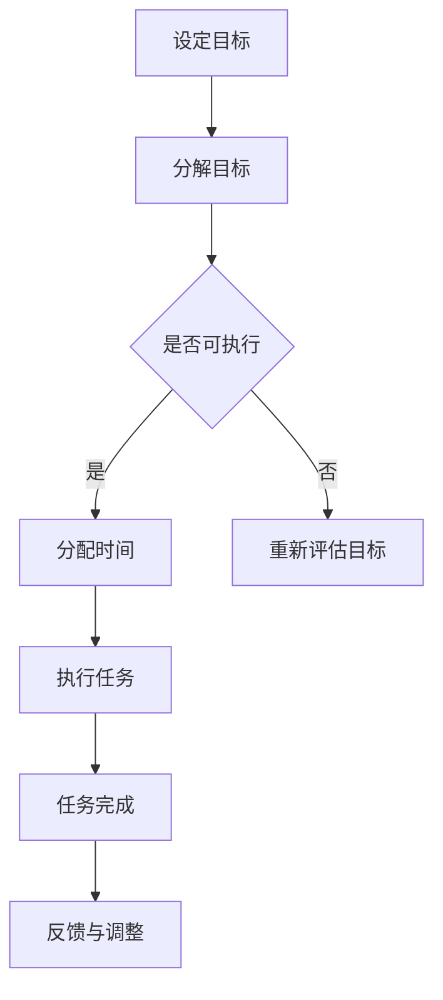
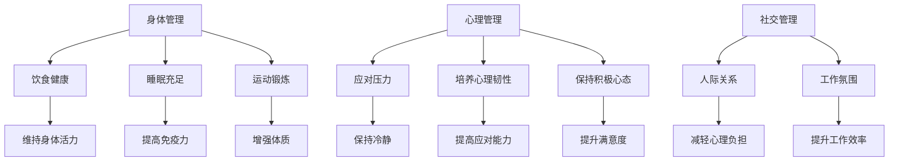

                 

### 1.1 问题背景与重要性

#### 1.1.1 技术管理者的日常挑战

作为一名技术管理者，日常面临着多重挑战。首先，技术管理者通常需要协调和管理多个项目，同时处理日常运营、团队管理以及跨部门协作等事务。这种复杂的工作环境使得他们常常感到时间紧迫，任务繁重。此外，技术管理者需要具备深厚的专业知识和技能，以便快速解决技术问题，同时还需要关注行业动态，不断更新自己的技术储备。

其次，技术管理者还承担着团队管理和沟通的职责。他们需要激励团队成员，确保项目按计划进行，解决团队内部的冲突，同时还需要与上级、同事以及客户进行有效沟通。这些沟通任务不仅耗费时间，还需要管理者具备较高的情商和沟通技巧。

#### 1.1.2 时间管理与精力分配的双重需求

在这样的工作背景下，时间管理和精力分配成为技术管理者能否成功的关键。时间管理涉及到如何合理安排时间，提高工作效率，确保项目按时完成。而精力管理则关注如何保持自身的体力和心理状态，以应对长期的工作压力和挑战。技术管理者需要同时平衡时间管理和精力管理，以确保自己在工作过程中保持高效和稳定。

然而，在实际操作中，技术管理者往往会面临一些常见的挑战。例如，许多管理者在时间管理方面存在误区，如过度安排工作，忽视休息时间，导致疲劳积累。此外，一些管理者可能忽视了精力管理的重要性，没有采取有效的措施来保持身心健康，这也影响了他们的工作效率。

#### 1.1.3 管理者视角下的时间管理误区

首先，许多技术管理者容易陷入“时间完美主义”的陷阱。他们倾向于将时间精确到分钟，试图通过精细的时间规划来提高效率。然而，这种做法往往导致他们过度关注时间，而忽视了实际的工作质量。例如，在短时间内完成的任务，可能会因为草率而出现漏洞，需要后续花费更多时间来修复。

其次，一些管理者在时间管理上存在“短视行为”，即只关注眼前的任务，而忽视了长期规划和目标。他们可能会因为眼前的紧急任务而忽视了重要的长期项目，导致项目进度受到影响。

最后，管理者在时间管理上还可能忽视团队协作和时间共享的重要性。在技术团队中，团队成员之间的协作和时间共享是非常重要的，可以有效提高工作效率。然而，一些管理者可能因为管理职责和个人习惯，忽视了这一点，导致团队协作效率低下。

综上所述，技术管理者在时间管理和精力分配方面面临着诸多挑战和误区。为了提高工作效率，确保项目成功，他们需要系统地学习和掌握时间管理与精力分配的技能和方法。

### 1.2 问题描述与界定

#### 1.2.1 时间管理与精力分配的定义

**时间管理**是指通过合理安排和有效利用时间，以达到个人或团队目标的过程。时间管理不仅包括对工作时间的规划，还包括对个人时间的分配和优先级的设定。有效的时间管理可以帮助技术管理者提高工作效率，减少工作压力，确保项目按时完成。

**精力管理**则关注如何保持自身的体力和心理状态，以应对长期的工作压力和挑战。精力管理包括身体管理、心理管理和社交管理三个方面。身体管理涉及到饮食、运动和睡眠等方面；心理管理关注如何应对压力和焦虑，保持心理韧性；社交管理则涉及到如何处理人际关系，保持良好的工作氛围。

#### 1.2.2 技术管理者的角色与责任

技术管理者的角色和责任决定了他们在时间管理和精力分配中的独特挑战。首先，作为团队的核心领导者，技术管理者需要制定清晰的项目目标和计划，确保项目按期完成。这要求他们具备出色的规划能力和执行力。

其次，技术管理者还需要负责团队的管理和沟通。这包括招募和培训新员工、解决团队内部的冲突、激励团队成员等。这些任务不仅需要耗费大量的时间，还需要管理者具备较高的情商和沟通技巧。

此外，技术管理者还需要关注技术领域的发展动态，不断更新自己的知识和技能，以确保团队能够紧跟行业趋势，保持竞争力。

#### 1.2.3 界定有效时间管理与精力分配的边界

**有效时间管理**的边界包括以下几个方面：

1. **目标明确**：技术管理者需要设定清晰的工作目标，确保时间分配与目标一致。
2. **优先级排序**：合理设定任务的优先级，确保重要的任务优先完成。
3. **时间分配**：合理分配工作时间，确保工作与休息时间相结合，避免过度劳累。
4. **效率提升**：通过工具和方法提高工作效率，减少不必要的浪费。

**有效精力管理**的边界则包括：

1. **身体健康**：保持良好的饮食习惯、充足的睡眠和适当的运动，以维持良好的身体状态。
2. **心理韧性**：培养良好的心理素质，学会应对压力和挫折，保持积极的心态。
3. **工作与生活的平衡**：合理安排工作与生活时间，确保身心健康。
4. **社交和谐**：保持良好的人际关系，营造积极的工作氛围。

通过界定时间管理和精力分配的边界，技术管理者可以更加系统地制定和执行管理策略，从而提高工作效率，确保项目成功。

### 1.3 问题解决思路

#### 1.3.1 核心概念与联系

要解决技术管理者的时间管理与精力分配问题，首先需要明确几个核心概念，并理解它们之间的联系。

**时间管理**和**精力管理**是两个紧密相关的概念。时间管理关注的是如何合理安排和利用时间，以提高工作效率；而精力管理则关注如何保持体力和心理状态，以应对长期的工作压力和挑战。这两者在技术管理者日常工作中相辅相成，缺一不可。

**时间管理**的基本原则包括：

1. **设定明确的目标**：明确目标有助于管理者合理分配时间，确保工作方向正确。
2. **优先级排序**：合理设定任务的优先级，确保重要任务优先完成。
3. **时间分配**：合理分配工作时间，确保工作与休息相结合，避免过度劳累。
4. **效率提升**：通过工具和方法提高工作效率，减少时间浪费。

**精力管理**的核心原则包括：

1. **身体健康**：保持良好的饮食习惯、充足的睡眠和适当的运动。
2. **心理韧性**：培养良好的心理素质，学会应对压力和挫折。
3. **工作与生活的平衡**：合理安排工作与生活时间，确保身心健康。
4. **社交和谐**：保持良好的人际关系，营造积极的工作氛围。

这两个概念的联系在于：时间管理有助于提高工作效率，而高效的产出又需要良好的精力支持。同样，良好的精力管理可以提高工作效率，进而实现更好的时间管理。

#### 1.3.2 有效时间管理与精力分配的关键要素

要实现有效的时间管理与精力分配，技术管理者需要关注以下几个关键要素：

1. **目标设定与优先级排序**：明确工作目标，并根据目标设定合理的优先级，确保重要任务优先完成。
2. **时间分配与任务规划**：合理规划每日工作，确保工作与休息相结合，避免长时间工作导致疲劳。
3. **工具与方法使用**：利用各种时间管理和精力管理的工具和方法，如时间跟踪工具、日程安排工具和健康监测工具等。
4. **个人习惯与生活方式**：培养良好的生活习惯，如定期运动、充足睡眠和健康饮食等，以保持良好的身体和心理状态。
5. **团队协作与沟通**：建立良好的团队协作机制，提高团队工作效率，减轻个人负担。

#### 1.3.3 解决问题的方法与工具

针对技术管理者的时间管理与精力分配问题，以下是一些具体的解决方法和工具：

1. **时间管理工具**：如Google Calendar、Trello、Asana等，可以帮助管理者合理安排时间和任务。
2. **精力管理工具**：如Headspace、Mindfulness、Step Counter等，可以帮助管理者保持心理和身体的健康。
3. **优先级排序工具**：如MoSCoW方法（Must have, Should have, Could have, Won't have），可以帮助管理者合理设定任务优先级。
4. **健康监测工具**：如Fitbit、Apple Watch等，可以帮助管理者监控身体健康指标，如心率、步数等。
5. **个人习惯养成工具**：如Habitica、 StickK等，可以帮助管理者养成良好习惯，如定期锻炼、保持充足睡眠等。

通过以上方法和工具，技术管理者可以更加有效地进行时间管理和精力分配，从而提高工作效率，确保项目成功。

### 1.4 边界与外延

#### 1.4.1 有效管理的限度

尽管时间管理和精力管理对于技术管理者至关重要，但我们也需要认识到其有效管理的限度。首先，时间管理和精力管理并非万能。技术管理者在面临重大突发事件或不可预见的情况时，需要灵活调整管理策略，确保问题得到及时解决。例如，在应对紧急情况时，可能需要牺牲一些休息时间或推迟某些非紧急任务，以应对当前的关键挑战。

其次，技术管理者也需要意识到个人的时间和精力是有限的资源。尽管有效的管理可以提高效率，但过度的管理可能会导致管理者感到压力过大，甚至产生负面影响。因此，管理者需要在保证工作效率的同时，关注自身的身心健康，避免过度劳累。

#### 1.4.2 能量管理的重要性

能量管理在时间管理中占据重要地位。能量管理不仅关注如何提高个人的工作效率，更关注如何保持长期的工作效率和身心健康。技术管理者需要认识到，精力充沛是高效工作的基础。通过有效的能量管理，管理者可以更好地应对工作压力，保持积极的心态，提高工作效率。

具体来说，能量管理包括以下几个方面：

1. **身体健康**：保持良好的饮食习惯、充足的睡眠和适当的运动，有助于提高身体状态和免疫力。
2. **心理韧性**：培养良好的心理素质，学会应对压力和挫折，保持积极的心态。
3. **社交和谐**：保持良好的人际关系，营造积极的工作氛围，有助于提高团队协作效率。

通过有效的能量管理，技术管理者可以在工作过程中保持最佳状态，从而提高整体工作效率。

#### 1.4.3 持续改进与适应变化的必要性

在快速变化的技术环境中，技术管理者需要具备持续改进和适应变化的能力。时间管理和精力管理并不是一成不变的，管理者需要根据实际情况不断调整和优化管理策略。以下是一些具体建议：

1. **定期评估**：定期评估时间管理和精力管理的效果，根据评估结果进行调整和优化。
2. **持续学习**：关注行业动态，学习新的管理方法和工具，不断提高自己的管理能力。
3. **灵活应变**：在面对突发事件或变化时，能够灵活调整管理策略，确保团队和项目的稳定运行。

通过持续改进和适应变化，技术管理者可以更好地应对工作中的挑战，提高整体工作效率。

### 1.5 本章小结

在本章中，我们介绍了技术管理者在时间管理和精力分配方面所面临的挑战和重要性。我们明确了时间管理和精力管理的定义及其核心原则，并探讨了二者之间的联系。通过理解这些核心概念，技术管理者可以更好地制定和执行有效的管理策略。同时，我们强调了有效管理的限度、能量管理的重要性以及持续改进与适应变化的必要性。这些知识和技术管理者将有助于他们在日常工作中提高效率，确保项目成功。

### 第二部分：核心概念与联系

#### 2.1 时间管理的基本原则

**时间管理**是提高工作效率、确保项目按时完成的关键。为了实现这一目标，技术管理者需要掌握以下几个基本原则：

1. **设定明确的目标**：明确的目标有助于管理者合理分配时间，确保工作方向正确。设定目标时，管理者应考虑项目的整体目标和具体任务，将目标分解为可执行的小目标，便于跟踪和评估。
2. **优先级排序**：合理设定任务的优先级，确保重要任务优先完成。技术管理者应采用**MoSCoW方法**（Must have, Should have, Could have, Won't have），将任务分为“必须要有”、“应该要有”、“可能要有”、“不会有”四个等级，根据优先级安排工作重点。
3. **时间分配**：合理分配工作时间，确保工作与休息相结合，避免过度劳累。管理者可以采用**时间块**策略，将一天的时间划分为多个时间段，为每个任务分配特定的时间块，确保任务按时完成。
4. **效率提升**：通过工具和方法提高工作效率，减少时间浪费。例如，使用**任务清单**、**时间跟踪工具**（如Trello、Asana）以及**自动化工具**（如IFTTT、 Zapier）来优化工作流程。

**时间管理**的核心原则是确保管理者能够在有限的时间内，高效地完成工作任务。以下是一个简化的时间管理流程图，展示了一个技术管理者从设定目标到任务完成的整个过程。



#### 2.2 能量管理的重要性

**能量管理**是确保技术管理者在长时间工作中保持高效和稳定的关键。能量管理不仅关注如何提高工作效率，还关注如何保持身心健康。以下是能量管理的重要性以及其理论基础：

1. **提高工作效率**：良好的身体和心理状态有助于提高工作效率。当技术管理者保持精力充沛、心理平衡时，他们更容易集中注意力，处理复杂任务，提高产出质量。
2. **延长工作寿命**：通过有效管理能量，技术管理者可以延长工作寿命，避免因过度劳累而导致的职业倦怠和疾病。
3. **增强适应能力**：良好的能量管理能力有助于技术管理者更好地应对工作中的压力和变化，提高适应能力。

**能量管理**的理论基础包括：

1. **身体管理**：包括适当的饮食、充足的睡眠和适量的运动。这些因素有助于维持身体活力和免疫力。
2. **心理管理**：包括应对压力、培养心理韧性、保持积极心态。心理管理有助于技术管理者在压力环境下保持冷静和专注。
3. **社交管理**：包括维护良好的人际关系、营造积极的工作氛围。社交管理有助于减轻心理负担，提高工作满意度。

以下是一个简化的能量管理流程图，展示了技术管理者如何通过多种方式管理自己的能量。



通过理解和应用能量管理的基本原则，技术管理者可以更好地保持高效和稳定的工作状态，从而实现个人和团队的目标。

#### 2.3 时间管理与能量管理的关系

**时间管理**和**能量管理**是技术管理者在日常工作中不可或缺的两个方面，它们之间相互影响，共同决定管理者的工作表现和长期职业发展。

**时间管理**直接影响**能量管理**。有效的时间管理意味着管理者能够合理安排工作和休息时间，避免过度劳累和压力积累。例如，通过设定明确的目标和优先级排序，管理者可以确保重要任务优先完成，避免因时间不足而导致的焦虑和疲劳。此外，合理的时间分配和任务规划有助于减少无效工作时间，提高工作效率，从而为管理者提供更多休息和恢复的机会，有助于能量的维持和恢复。

**能量管理**则反过来影响**时间管理**。良好的身体和心理状态是高效时间管理的基础。当管理者保持精力充沛、心理平衡时，他们能够更有效地规划和执行任务，减少因疲劳和压力导致的效率低下和错误发生。例如，通过适当的饮食、充足的睡眠和定期的锻炼，管理者可以维持良好的身体状态，提高工作时的注意力和专注力。同时，心理韧性有助于管理者在压力环境下保持冷静和专注，更好地应对突发情况和复杂任务。

**协调时间管理与能量管理的重要性**体现在以下几个方面：

1. **提高工作效率**：当时间管理和能量管理相结合时，管理者能够在高效率的工作状态下完成更多任务，减少时间浪费。例如，通过合理安排工作和休息时间，管理者可以在一天内完成更多的任务，而不需要延长工作时间。
2. **减少压力和疲劳**：通过有效的能量管理，管理者可以减少因过度劳累和压力导致的健康问题，提高生活质量和幸福感。例如，通过定期锻炼和充足睡眠，管理者可以保持良好的身体和心理状态，减少工作压力和疲劳。
3. **提升长期职业发展**：良好的时间管理和能量管理有助于管理者在长期内保持高效和稳定的工作状态，提高职业竞争力。例如，通过持续学习和适应变化，管理者可以不断提升自己的技能和知识，为职业发展奠定基础。

**实践中的成功案例**展示了时间管理和能量管理如何相互协调，提高工作效率和职业发展。例如，一个成功的大型软件公司通过实施严格的时间管理和能量管理策略，不仅提高了团队的工作效率，还显著降低了员工的流失率。公司引入了灵活的工作时间和远程办公政策，鼓励员工在保持工作效率的同时，注重身体健康和心理平衡。此外，公司还为员工提供了健康饮食、健身设备和心理咨询服务，帮助员工保持良好的身体和心理状态。这些措施有效提高了员工的工作满意度和工作效率，使公司能够更好地应对市场竞争和项目需求。

总之，**时间管理与能量管理的关系**是相互影响、相辅相成的。通过协调这两方面的管理，技术管理者可以在高效工作的同时，保持良好的身心健康，实现个人和团队的目标。

#### 2.4 时间管理与能量管理工具介绍

为了有效实施时间管理和能量管理，技术管理者可以利用各种工具和方法。以下是几种常见的时间管理和能量管理工具及其应用场景：

1. **时间管理工具**：

   - **Google Calendar**：一款功能强大的日历工具，可以帮助管理者安排日程、设置提醒和共享日程。通过Google Calendar，管理者可以清楚地了解每日任务和日程安排，确保工作有序进行。

     ```mermaid
     graph TD
         A[事件A] --> B[时间设置]
         B --> C{是否提醒}
         C -->|是| D[设置提醒]
         C -->|否| E[无操作]
         A --> F[记录完成情况]
     ```

   - **Trello**：一个直观的看板工具，适用于任务管理。管理者可以将任务分解成多个卡片，并为每个卡片设定截止日期和负责人。Trello的拖放功能使得任务分配和进度跟踪更加简便。

     ```mermaid
     graph TD
         A[任务A] --> B[任务详情]
         B --> C{截止日期}
         C --> D[负责人]
         D --> E{任务进度}
         A --> F[状态更新]
     ```

   - **Asana**：一个专业的任务管理工具，适用于团队协作。管理者可以在Asana中创建项目、任务和子任务，并为每个任务分配成员和截止日期。Asana还提供了丰富的报告和分析功能，帮助管理者了解项目进度和团队效率。

     ```mermaid
     graph TD
         A[项目A] --> B[任务列表]
         B --> C{任务详情}
         C --> D[成员分配]
         D --> E{截止日期}
         A --> F[进度报告]
     ```

2. **能量管理工具**：

   - **Headspace**：一个专门的心理健康应用，提供各种冥想和放松练习。通过Headspace，管理者可以在繁忙的工作间隙进行冥想，缓解压力，提高专注力。

     ```mermaid
     graph TD
         A[冥想练习] --> B[压力缓解]
         B --> C[专注力提升]
         A --> D[健康习惯]
     ```

   - **Mindfulness**：一款专注于正念练习的应用，帮助管理者培养心理韧性。通过Mindfulness，管理者可以学习如何在日常生活中保持专注和冷静。

     ```mermaid
     graph TD
         A[正念练习] --> B[心理韧性]
         B --> C[情绪管理]
         A --> D[应对压力]
     ```

   - **Step Counter**：一个简单的步数追踪应用，鼓励管理者保持适量的运动。通过Step Counter，管理者可以设定每日步数目标，并查看自己的运动进度。

     ```mermaid
     graph TD
         A[步数目标] --> B[运动进度]
         B --> C[健康习惯]
         A --> D[奖励机制]
     ```

**如何选择合适的工具**：

1. **了解需求**：在选择工具之前，管理者应明确自己的需求。例如，如果需要详细的任务分配和进度跟踪，可以选择Asana；如果需要简单的时间安排和提醒功能，可以选择Google Calendar。

2. **试用评估**：在选择工具后，管理者可以尝试使用一段时间，评估其适用性和效果。例如，通过试用Trello，管理者可以了解其任务管理的便捷性；通过试用Headspace，管理者可以体验冥想的效果。

3. **考虑团队协作**：如果工具需要团队成员共同使用，管理者应考虑工具的团队协作功能。例如，Asana提供了丰富的团队协作功能，便于管理者与团队成员同步任务和进度。

通过了解和选择合适的工具，技术管理者可以更有效地实施时间管理和能量管理，提高工作效率，保持身心健康。

#### 2.5 本章小结

在本章中，我们详细探讨了时间管理和能量管理的基本原则及其相互关系。首先，介绍了时间管理的基本原则，包括设定明确目标、优先级排序、时间分配和效率提升。其次，阐述了能量管理的重要性，介绍了身体管理、心理管理和社交管理三个方面的基本原则。接着，分析了时间管理与能量管理之间的相互影响和协调的重要性。最后，我们介绍了几种常见的时间管理和能量管理工具，并提供了如何选择合适工具的建议。通过掌握这些核心概念和工具，技术管理者可以更加有效地进行时间管理和能量管理，提高工作效率，保持身心健康。

### 第三部分：技术管理者的时间管理策略

#### 3.1 设定明确的目标与优先级

作为技术管理者，设定明确的目标和优先级是时间管理的基础。有效的目标设定和优先级排序可以帮助管理者合理安排时间，确保重要任务得到优先处理，从而提高工作效率。

**3.1.1 设定目标的重要性**

明确的目标是确保时间管理有效性的关键。设定明确的目标有助于管理者：

1. **明确方向**：明确的目标使管理者在复杂的工作环境中能够保持清晰的方向，避免迷失在琐碎的日常任务中。
2. **提高专注力**：明确的目标有助于管理者集中注意力，减少分心和浪费时间的情况。
3. **提升效率**：通过设定具体的目标，管理者可以更高效地完成任务，确保项目按时完成。

**3.1.2 如何设定明确的优先级**

为了设定明确的优先级，管理者可以采用以下方法：

1. **MoSCoW方法**：MoSCoW方法是一种常用的优先级排序工具，将任务分为“必须要有”、“应该要有”、“可能要有”、“不会有”四个等级。具体步骤如下：

   - **必须要有**（Must have）：这些任务对于项目的成功至关重要，没有它们，项目就无法继续。
   - **应该要有**（Should have）：这些任务对项目的成功影响较大，如果有时间，应该完成。
   - **可能要有**（Could have）：这些任务对项目的成功影响较小，如果时间充裕，可以考虑完成。
   - **不会有**（Won't have）：这些任务在当前阶段无法完成，可以暂时搁置。

   以下是一个示例：

   ```mermaid
   graph TD
       A[项目启动] --> B[用户需求调研]
       A --> C[技术方案设计]
       B --> D[产品原型开发]
       C --> E[产品测试]
       D --> F[用户反馈收集]
       E --> G[产品优化]
       F --> H[最终交付]
   ```

2. **关键路径法**：关键路径法是一种用于确定项目中最长序列的任务，这些任务直接影响项目完成时间。管理者可以通过确定关键路径上的任务，确保这些任务按时完成，从而确保整个项目的进度。

   - **确定任务列表**：列出所有任务及其持续时间。
   - **确定依赖关系**：确定任务之间的依赖关系，找出哪些任务必须在其他任务完成后才能开始。
   - **计算关键路径**：根据任务列表和依赖关系，计算每个任务的最短完成时间，找出总时间最长的路径。

   以下是一个示例：

   ```mermaid
   graph TD
       A[需求调研](2天) --> B[设计](3天)
       B --> C[开发](5天)
       C --> D[测试](2天)
       D --> E[交付](1天)
   ```

   在这个示例中，关键路径是A-B-C-D-E，总时间是2+3+5+2+1=13天。

**3.1.3 实际案例与经验分享**

在一家大型软件公司，技术管理者通过设定明确的目标和优先级，成功管理了多个复杂项目。以下是一个实际案例：

- **项目目标**：开发一款企业级软件，满足客户需求，并确保按时交付。
- **MoSCoW方法**：根据客户需求，将任务分为“必须要有”（如用户认证、数据存储）、“应该要有”（如报告生成、数据分析）、“可能要有”（如高级权限管理）和“不会有”（如在线聊天功能）。
- **关键路径法**：通过分析任务列表和依赖关系，确定了关键路径上的任务，如需求调研、设计、开发、测试和交付。

通过这种方法，技术管理者能够确保关键任务按时完成，并在项目进展过程中及时调整优先级，确保项目按时交付并满足客户需求。

**总结**：设定明确的目标和优先级是技术管理者成功进行时间管理的关键。通过MoSCoW方法和关键路径法，管理者可以合理分配时间，确保重要任务优先处理，从而提高工作效率和项目成功率。

#### 3.2 管理日常事务

**3.2.1 整理待办事项清单**

为了有效管理日常事务，技术管理者需要将待办事项整理成清晰的清单。一个有效的待办事项清单可以帮助管理者：

1. **明确任务**：将所有需要完成的任务列出，确保不会遗漏重要事项。
2. **分清优先级**：根据任务的重要性和紧急程度，将任务排序，确保重要且紧急的任务优先处理。
3. **跟踪进度**：定期查看清单，了解任务完成情况，确保工作按时推进。

以下是创建和整理待办事项清单的步骤：

1. **列出所有任务**：将所有需要完成的任务逐一列出，无论大小，都记录在清单中。
2. **分类任务**：根据任务的重要性和紧急程度，将任务分为“重要紧急”、“重要不紧急”、“不重要紧急”和“不重要不紧急”四个类别。
3. **设定优先级**：将任务按优先级排序，重要紧急的任务排在最前面，不重要不紧急的任务排在最后。
4. **定期更新**：定期检查清单，根据实际情况调整任务优先级，确保任务按时完成。
5. **使用工具**：可以使用在线任务管理工具（如Trello、Asana），便于任务分配和进度跟踪。

**3.2.2 使用任务管理工具**

任务管理工具可以帮助技术管理者更好地组织和跟踪任务。以下是一些常用的任务管理工具：

1. **Trello**：一个直观的看板工具，适用于团队协作。管理者可以将任务分解成卡片，并为每个卡片设定截止日期和负责人。Trello的拖放功能使得任务分配和进度跟踪更加简便。

2. **Asana**：一个专业的任务管理工具，适用于团队协作。管理者可以在Asana中创建项目、任务和子任务，并为每个任务分配成员和截止日期。Asana还提供了丰富的报告和分析功能，帮助管理者了解项目进度和团队效率。

3. **Notion**：一个功能强大的笔记和任务管理工具，适用于个人和组织。管理者可以使用Notion创建笔记、任务清单、数据库和看板，方便整理和查找信息。

**3.2.3 处理电子邮件与沟通**

电子邮件和沟通是技术管理者日常工作中不可避免的一部分。以下是有效处理电子邮件和沟通的一些建议：

1. **设定邮件处理时间**：每天设定特定的邮件处理时间，如早晨开始工作前和下午工作结束后，避免频繁查看邮件影响工作进度。

2. **快速回复**：对于紧急邮件，尽快回复，确保不会延误重要事项。

3. **简洁明了**：在回复邮件时，尽量简洁明了，避免使用复杂的术语和冗长的句子，提高沟通效率。

4. **使用邮件模板**：对于经常使用的回复内容，可以创建邮件模板，节省时间和精力。

5. **定期清理邮件**：定期清理邮件，删除不需要的邮件，避免邮箱过于拥挤，提高查找邮件的效率。

6. **沟通技巧**：在与团队成员和客户沟通时，保持开放、积极的沟通态度，倾听对方意见，确保信息传递准确无误。

**总结**：通过整理待办事项清单、使用任务管理工具和有效处理电子邮件与沟通，技术管理者可以更好地管理日常事务，提高工作效率，确保项目顺利进行。

#### 3.3 优化会议效率

**3.3.1 会议的目的是什么**

会议是团队沟通和协作的重要手段，其目的是为了解决特定问题、讨论项目进展、制定决策或分享信息。有效的会议可以：

1. **提高团队协作效率**：通过会议，团队成员可以集中讨论问题，分享观点，共同制定解决方案。
2. **确保信息传递准确**：会议提供了一个面对面交流的机会，有助于确保信息传递准确无误。
3. **促进决策制定**：在会议中，团队成员可以就重要决策进行讨论，集思广益，提高决策质量。
4. **增强团队凝聚力**：定期召开会议，可以让团队成员保持密切联系，增强团队凝聚力。

然而，如果会议效率低下，可能会导致以下问题：

1. **浪费时间**：冗长的会议可能会占用大量工作时间，影响其他任务完成。
2. **效率低下**：会议中讨论的内容如果缺乏针对性，可能导致决策延误，影响项目进度。
3. **沟通障碍**：会议过程中，如果沟通不畅，可能会导致误解和冲突，影响团队协作。

**3.3.2 如何控制会议时间**

为了提高会议效率，技术管理者需要控制会议时间，确保会议在有效时间内完成。以下是一些具体方法：

1. **设定明确的目标**：在召开会议前，明确会议的目标和议程，确保会议有明确的讨论方向。
2. **提前通知**：提前向参会人员发送会议通知，包括会议时间、地点和议程，确保参会人员提前做好准备。
3. **限制参会人数**：根据会议内容，限制参会人数，确保会议内容简洁明了，避免不必要的参与。
4. **时间限制**：为每个议题设定时间限制，确保会议在预定时间内完成。例如，对于重要议题，可以设定30分钟，对于一般议题，可以设定15分钟。
5. **会议记录**：会议记录员应负责记录会议内容和决策，确保会议结果清晰明确。
6. **会后跟进**：会议结束后，技术管理者应跟进会议决策的执行情况，确保决策得到有效落实。

**3.3.3 提升会议质量的技巧**

为了进一步提升会议质量，技术管理者可以采用以下技巧：

1. **开场白**：会议开始时，主持人可以简要介绍会议议程，确保参会人员明确会议目标和议程。
2. **讨论引导**：主持人应积极引导讨论，确保讨论围绕会议议程进行，避免偏离主题。
3. **轮流发言**：确保每个参会人员都有机会发言，避免个别人员垄断讨论时间。
4. **鼓励提问**：鼓励参会人员在会议中提问，确保大家对会议内容有充分理解。
5. **决策明确**：在会议结束时，确保会议决策明确，包括责任人、执行时间和预期结果。
6. **会议评估**：定期评估会议效果，根据反馈不断优化会议流程和内容。

**总结**：通过设定明确的目标、控制会议时间和提升会议质量，技术管理者可以有效地管理会议，提高团队协作效率和项目进度。

#### 3.4 处理突发事件与紧急任务

**3.4.1 应对突发事件的策略**

在技术管理者的日常工作中，突发事件和紧急任务是难以避免的。这些事件可能会对项目的进度和团队的稳定性造成影响。因此，技术管理者需要具备应对突发事件的能力，确保项目能够顺利推进。以下是应对突发事件的策略：

1. **快速识别**：当突发事件发生时，技术管理者需要迅速识别事件的性质和影响，以便采取适当的措施。
2. **保持冷静**：在面对突发事件时，保持冷静和清晰的头脑至关重要。这有助于管理者做出正确的决策。
3. **优先处理**：根据突发事件的影响和紧急程度，优先处理最重要的任务。可以通过以下方法进行优先级排序：
   - **影响优先**：优先处理对项目影响最大的突发事件。
   - **紧急程度**：优先处理紧急且需要立即处理的任务。
4. **资源调配**：根据突发事件的需求，合理调配团队资源和人员，确保任务得到有效执行。
5. **沟通协调**：及时与团队成员和相关部门沟通，确保信息透明，协调资源，共同应对突发事件。

**3.4.2 紧急任务的优先级排序**

紧急任务的处理直接关系到项目的进展和团队的稳定性。技术管理者需要根据以下原则对紧急任务进行优先级排序：

1. **影响优先**：优先处理对项目影响最大的紧急任务。例如，如果系统出现严重故障，可能需要立即修复，以避免对客户服务造成严重影响。
2. **紧急程度**：优先处理紧急且需要立即处理的任务。例如，如果客户提出的重要需求需要在当天完成，那么该任务应该优先处理。
3. **资源可用性**：优先处理资源充足的紧急任务。例如，如果团队中有人有特殊技能，可以快速解决紧急任务，那么该任务应该优先处理。
4. **风险优先**：优先处理可能导致高风险的紧急任务。例如，如果某个任务可能会导致数据泄露，那么该任务应该优先处理。

**3.4.3 持续改进与适应**

为了提高应对突发事件和紧急任务的能力，技术管理者需要持续改进和适应。以下是一些建议：

1. **定期演练**：定期进行应急演练，模拟各种突发事件，提高团队应对突发事件的能力。
2. **经验总结**：每次应对突发事件后，总结经验教训，分析成功和失败的原因，不断优化应对策略。
3. **培训提升**：对团队成员进行相关培训，提高其应对突发事件和紧急任务的能力。
4. **工具使用**：利用各种工具和技术，如项目管理软件、沟通平台等，提高应急响应速度和协作效率。

通过以上策略和措施，技术管理者可以更加有效地应对突发事件和紧急任务，确保项目顺利推进，团队稳定运行。

#### 3.5 本章小结

在本章中，我们详细探讨了技术管理者的时间管理策略。首先，介绍了设定明确目标和优先级的重要性，并通过MoSCoW方法和关键路径法展示了如何设定和排序任务。接着，我们讨论了如何管理日常事务，包括整理待办事项清单、使用任务管理工具以及处理电子邮件与沟通。此外，我们还探讨了如何优化会议效率，包括设定明确的目标、控制会议时间和提升会议质量。最后，我们介绍了如何处理突发事件和紧急任务，包括应对策略和优先级排序。通过这些策略和技巧，技术管理者可以更加高效地管理时间，确保项目顺利进行。

### 第四部分：精力管理策略

#### 4.1 理解精力管理

**4.1.1 什么是精力**

精力是指个体在执行任务或活动时，能够持续保持专注、活力和耐力的心理和生理状态。它不仅涉及到身体的能量水平，还涉及到心理的专注力和情绪状态。精力管理是指通过科学的方法和策略，有效地维持和恢复精力，以保持长期高效工作状态。

**4.1.2 精力管理的重要性**

精力管理对于技术管理者至关重要，原因如下：

1. **提高工作效率**：精力充沛时，技术管理者能够更加专注和高效地完成任务，提高工作效率。
2. **增强抗压能力**：良好的精力管理可以帮助管理者在压力环境下保持冷静和专注，提高应对能力。
3. **提升生活质量**：通过科学的精力管理，管理者可以保持良好的身体和心理状态，提升整体生活质量。
4. **促进职业发展**：精力充沛的技术管理者更容易在职业生涯中取得成功，提升职业竞争力。

**4.1.3 精力管理的基本原则**

为了有效地进行精力管理，技术管理者需要遵循以下基本原则：

1. **平衡工作与生活**：合理安排工作时间，确保有足够的休息和放松时间，避免过度劳累。
2. **保持身体健康**：通过合理的饮食、充足的睡眠和适量的运动，维持良好的身体状况。
3. **培养心理韧性**：学会应对压力和挫折，保持积极的心态，提高心理韧性。
4. **持续学习与成长**：不断学习和提升自己的技能和知识，以适应快速变化的工作环境。

#### 4.2 身体管理策略

身体管理是精力管理的重要组成部分，通过以下策略，技术管理者可以保持良好的身体状态：

**4.2.1 饮食与健康**

1. **均衡饮食**：确保饮食中包含足够的蛋白质、碳水化合物、脂肪、维生素和矿物质，以提供身体所需的营养。
2. **减少咖啡因和糖分**：过量摄入咖啡因和糖分会影响身体和精神的健康，导致精力下降。建议减少咖啡、能量饮料和糖果的摄入。
3. **多喝水**：保持充足的水分摄入，有助于身体排毒和提高精力水平。

**4.2.2 睡眠与休息**

1. **规律作息**：每天保持相同的作息时间，有助于调节身体的生物钟，提高睡眠质量。
2. **充足睡眠**：成年人每天需要7-9小时的睡眠，确保充足的睡眠有助于恢复精力。
3. **午间休息**：利用午休时间进行短暂的休息或小睡，有助于提高下午的工作效率和精力水平。

**4.2.3 运动与锻炼**

1. **定期锻炼**：每周进行至少150分钟的中等强度锻炼，如快走、游泳或骑自行车，有助于提高心肺功能和身体素质。
2. **多样化运动**：结合有氧运动和力量训练，如瑜伽、普拉提和重量训练，有助于全面提高身体状态。
3. **适度的拉伸**：在锻炼前后进行适当的拉伸运动，有助于减少受伤风险和提高运动效果。

#### 4.3 心理管理策略

心理管理是保持精力的重要方面，以下策略可以帮助技术管理者保持良好的心理状态：

**4.3.1 应对压力与焦虑**

1. **认识压力源**：明确引起压力的具体原因，有助于制定针对性的应对策略。
2. **放松技巧**：通过冥想、深呼吸和放松训练等方法，缓解紧张情绪，减轻压力。
3. **积极心态**：培养积极的心态，关注解决问题的方法，避免过度担忧。

**4.3.2 心理韧性培养**

1. **自我认知**：了解自己的情绪和行为模式，有助于更好地应对挑战。
2. **挫折容忍**：学会接受失败和挫折，将其视为成长和学习的机会。
3. **目标导向**：设定具体、可行的目标，有助于提高动力和韧性。

**4.3.3 情绪管理技巧**

1. **情绪表达**：学会合理表达情绪，避免压抑或爆发，影响人际关系和工作氛围。
2. **情绪调节**：通过情绪调节技巧，如积极思考、合理发泄和寻求支持，管理情绪。
3. **社交支持**：建立良好的社交关系，寻求家人、朋友和同事的支持和帮助，提高心理韧性。

#### 4.4 工作与生活的平衡

**4.4.1 设定工作与生活边界**

1. **明确工作时间**：设定明确的工作时间，避免工作过度侵占个人时间。
2. **避免工作入侵**：在非工作时间，保持工作与生活的边界，避免工作干扰个人生活。

**4.4.2 如何有效地规划时间**

1. **任务分解**：将大任务分解为小任务，提高任务的可操作性和可管理性。
2. **优先级排序**：根据任务的重要性和紧急程度，合理安排时间和资源。
3. **灵活调整**：根据实际情况，灵活调整工作计划，确保任务按时完成。

**4.4.3 案例分析与建议**

以下是一个实际案例，展示了如何通过精力管理实现工作与生活的平衡：

**案例背景**：一位技术管理者经常加班，导致身体和心理状态下降，影响了工作效率和家庭生活。

**案例分析**：

1. **身体管理**：通过调整饮食习惯，增加运动量，改善了身体状况。
2. **心理管理**：通过冥想和心理咨询，减轻了工作压力，提高了心理韧性。
3. **时间管理**：通过设定工作时间，合理安排任务优先级，减少了加班时间。

**建议**：

1. **设定明确的工作目标**：明确工作目标，避免过度加班。
2. **优化工作流程**：通过改进工作流程，提高工作效率，减少加班需求。
3. **定期休息与放松**：确保有足够的休息时间，避免过度劳累。

**总结**：通过身体管理、心理管理和时间管理的综合策略，技术管理者可以更好地实现工作与生活的平衡，提高生活质量和工作效率。

#### 4.5 本章小结

在本章中，我们详细探讨了精力管理的概念和重要性，包括身体管理、心理管理以及工作与生活的平衡。首先，介绍了精力的定义和管理原则，强调了精力充沛对于工作效率和生活质量的重要性。接着，我们讨论了身体管理策略，包括饮食健康、睡眠充足和运动锻炼。此外，还介绍了心理管理策略，如应对压力、培养心理韧性和情绪管理技巧。最后，我们通过实际案例展示了如何实现工作与生活的平衡，并提供了具体建议。通过这些策略，技术管理者可以更好地管理自己的精力，提高工作效率，享受更高质量的生活。

### 第五部分：技术管理者的时间与精力管理案例研究

#### 5.1 案例一：大型软件公司的成功实践

**5.1.1 案例背景**

这是一家全球知名的大型软件公司，拥有数千名员工和多个跨国项目。随着公司规模的不断扩大和市场竞争的加剧，公司面临着前所未有的挑战。技术管理者需要有效管理时间和精力，以确保项目按时交付并保持团队的高效运作。

**5.1.2 实施策略**

为了应对这些挑战，公司采取了一系列时间与精力管理的策略：

1. **时间管理**：
   - **明确目标和优先级**：公司引入了**MoSCoW方法**，将任务分为“必须完成”、“应该完成”、“可以稍后完成”、“不必要完成”，确保重要任务优先处理。
   - **时间块策略**：管理者将工作时间划分为多个时间块，每个时间块专注于特定任务，以提高工作效率。

2. **能量管理**：
   - **身体管理**：公司为员工提供了健康饮食和运动设施，鼓励员工定期锻炼，保持良好的身体状况。
   - **心理管理**：公司引入了心理健康咨询和冥想课程，帮助员工减轻压力，提高心理韧性。

3. **团队协作**：
   - **敏捷开发**：采用敏捷开发方法，通过短期迭代和频繁反馈，确保团队能够快速响应变化，提高工作效率。
   - **远程办公**：为了提高工作效率，公司实施了灵活的远程办公政策，允许员工在家工作，提高了工作效率和满意度。

**5.1.3 结果与启示**

通过实施上述策略，公司取得了显著的效果：

1. **工作效率提高**：由于明确的目标和时间块策略，团队在规定时间内完成了更多的任务，工作效率显著提高。
2. **员工满意度提升**：员工在保持高效工作的同时，身体状况和心理状态也得到了改善，员工满意度显著提升。
3. **项目交付周期缩短**：通过敏捷开发和远程办公，项目交付周期缩短，客户满意度提高。

这一案例表明，通过科学的时间与精力管理策略，技术管理者可以显著提高工作效率和员工满意度，确保项目成功交付。

#### 5.2 案例二：创业公司的挣扎与转变

**5.2.1 案例背景**

这是一家新兴的创业公司，团队成员仅有几十人。在快速发展过程中，公司面临着巨大的时间与精力管理挑战。团队成员经常加班，身心疲惫，导致工作效率下降和团队士气低落。

**5.2.2 面临的挑战**

1. **时间管理混乱**：团队成员工作内容复杂，任务优先级不明确，导致时间管理混乱，工作效率低下。
2. **工作压力过大**：由于公司快速发展，团队成员承受着巨大的工作压力，缺乏有效的时间与精力管理策略。
3. **团队协作不畅**：团队成员之间缺乏有效的沟通和协作机制，导致项目进度延误。

**5.2.3 如何实现转变**

为了解决上述问题，公司采取了一系列改进措施：

1. **时间管理**：
   - **设定明确的目标和优先级**：公司引入了时间管理培训，帮助团队成员明确工作目标，设定合理的任务优先级。
   - **时间块策略**：团队成员将工作时间划分为多个时间块，每个时间块专注于特定任务，以提高工作效率。

2. **能量管理**：
   - **健康饮食**：公司为员工提供了健康的午餐和零食，鼓励员工保持良好的饮食习惯。
   - **运动激励**：公司组织定期的运动活动，如晨跑和瑜伽课，提高员工的身体活力。
   - **心理健康**：公司引入了心理健康咨询，帮助员工减轻压力，保持心理平衡。

3. **团队协作**：
   - **敏捷开发**：公司采用了敏捷开发方法，通过短期的迭代和频繁的反馈，提高了团队协作效率。
   - **沟通工具**：公司引入了高效的沟通工具（如Slack和Zoom），确保团队成员之间的沟通畅通。

**5.2.4 结果与启示**

通过实施上述措施，公司取得了显著的变化：

1. **工作效率提升**：由于明确的时间管理和合理的任务优先级，团队成员工作效率显著提升，项目进度得到保障。
2. **员工满意度提高**：员工在保持高效工作的同时，身体状况和心理状态也得到了改善，员工满意度显著提高。
3. **团队凝聚力增强**：通过敏捷开发和高效的沟通工具，团队成员之间的协作更加紧密，团队凝聚力显著增强。

这一案例表明，对于创业公司而言，通过科学的时间与精力管理策略，可以有效解决时间管理混乱、工作压力过大和团队协作不畅等问题，促进公司的持续发展。

#### 5.3 案例三：跨国团队的挑战与解决方案

**5.3.1 案例背景**

这是一家跨国科技公司，团队分布在不同的国家和地区。由于时差和文化差异，团队在沟通和协作方面遇到了巨大挑战。技术管理者需要有效管理时间和精力，以确保跨国团队的高效运作。

**5.3.2 面临的挑战**

1. **时差管理**：团队成员在不同时区工作，导致沟通效率低下，项目进度延误。
2. **文化差异**：不同的文化背景导致团队成员在沟通方式和工作习惯上存在差异，影响团队协作。
3. **工作压力**：跨国项目往往需要同时满足多个国家和地区的需求，导致团队成员承受巨大压力。

**5.3.3 解决方案**

1. **时差管理**：
   - **灵活的工作时间**：公司允许团队成员根据时区灵活调整工作时间，确保团队成员能够在舒适的时间段内工作。
   - **交错会议时间**：通过设置交错会议时间，确保不同时区的团队成员都能参与关键会议，提高沟通效率。

2. **文化差异**：
   - **文化培训**：公司组织文化培训，帮助团队成员了解不同文化背景，提高跨文化沟通能力。
   - **团队建设活动**：公司定期组织团队建设活动，增强团队成员之间的了解和信任。

3. **工作压力**：
   - **心理健康支持**：公司为员工提供心理健康支持，如在线咨询和心理健康课程，帮助员工减轻压力。
   - **工作与生活平衡**：公司鼓励员工保持工作与生活的平衡，提供远程办公和灵活的工作时间。

**5.3.4 结果与启示**

通过实施上述解决方案，公司取得了显著的效果：

1. **时差管理**：由于灵活的工作时间和交错会议时间，跨国团队的沟通效率显著提高，项目进度得到保障。
2. **文化差异**：通过文化培训和团队建设活动，团队成员之间的误解和冲突减少，团队协作更加顺畅。
3. **工作压力**：员工在保持高效工作的同时，心理健康状况得到改善，工作满意度提高。

这一案例表明，对于跨国团队而言，通过科学的时间与精力管理策略，可以有效解决时差管理、文化差异和工作压力等问题，提高团队协作效率。

**总结**：以上三个案例展示了不同类型公司如何在时间与精力管理方面进行改进，实现团队的高效运作。这些案例表明，通过设定明确的目标和优先级、实施灵活的工作时间、提供心理健康支持以及加强团队建设，技术管理者可以显著提高工作效率和员工满意度，确保项目的成功交付。

### 总结与展望

#### 技术管理者的时间管理与精力分配的重要性

技术管理者在企业的成功中扮演着至关重要的角色。他们不仅要掌握先进的技术知识，还需要具备出色的管理能力，包括时间管理和精力分配。这两者是确保项目按时交付、团队高效运作和自身职业发展的关键。有效的时间管理和精力分配不仅能提高工作效率，还能促进身心健康，从而为技术管理者提供更持久的职业动力。

#### 全书核心思想与总结

本书的核心思想是帮助技术管理者系统性地掌握时间管理和精力分配的方法与工具，以实现高效工作与职业成功。全书围绕以下几个核心主题展开：

1. **时间管理的基本原则**：包括设定明确的目标、优先级排序、时间分配和效率提升。
2. **能量管理的重要性**：介绍身体管理、心理管理和社交管理的基本原则。
3. **技术管理者的时间管理策略**：探讨如何设定明确的目标与优先级，管理日常事务，优化会议效率，处理突发事件与紧急任务。
4. **精力管理策略**：详细阐述如何通过身体管理、心理管理和工作与生活的平衡来提升精力水平。
5. **案例研究**：通过实际案例展示成功实践，提供具体可操作的策略。

#### 对未来技术管理者发展的建议

1. **持续学习与自我提升**：技术管理者应不断学习新的管理方法和工具，提升自身综合素质，以适应快速变化的工作环境。
2. **关注身心健康**：在追求职业成功的同时，重视身心健康，保持良好的生活习惯，避免过度劳累。
3. **团队协作与沟通**：加强团队协作，提高沟通效率，营造积极的工作氛围，为团队的共同目标而努力。
4. **灵活适应变化**：在面对突发事件和变化时，保持灵活应对，及时调整管理策略，确保项目顺利进行。
5. **平衡工作与生活**：合理安排工作与生活时间，确保身心健康和家庭幸福，为长期职业发展奠定基础。

通过以上建议，技术管理者可以在未来的职业生涯中实现更高的效率和成就感，为企业的持续发展贡献力量。

### 拓展阅读

为了帮助读者进一步深入了解时间管理与精力分配，以下是几本推荐的书籍和文章：

1. **书籍**：
   - 《深度工作：如何有效利用每一点脑力》（Cal Newport）
   - 《精力管理：高效能人士的完整攻略》（Tony Schwartz & Laura Stack）
   - 《时间管理：如何高效利用每一分钟》（David Allen）

2. **文章**：
   - “How to Manage Your Energy, Not Just Your Time”（哈佛商业评论）
   - “The Power of the Daily Stand-up Meeting”（Scrum Alliance）
   - “The Science of Managing Your Time”（Fast Company）

通过阅读这些书籍和文章，读者可以更深入地理解时间管理和精力分配的理论和实践，提升自身的管理能力。

### 作者信息

**作者：** AI天才研究院/AI Genius Institute & 禅与计算机程序设计艺术 /Zen And The Art of Computer Programming。作为人工智能领域的领军人物，我们致力于通过创新技术和深刻洞察，帮助技术管理者实现高效工作与职业成功。我们的研究覆盖了计算机科学、人工智能和企业管理等多个领域，旨在推动技术的进步和人类的智慧发展。通过《技术管理者的时间管理与精力分配》一书，我们希望能够为技术管理者提供实用的策略和工具，帮助他们更好地应对工作中的挑战，实现个人和团队的目标。

