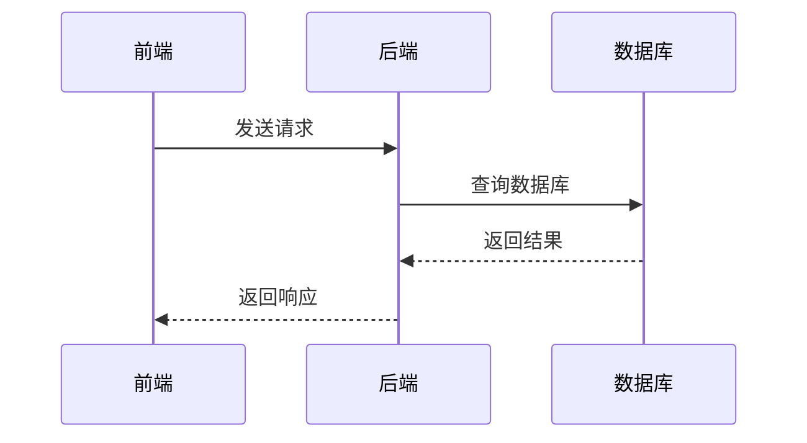
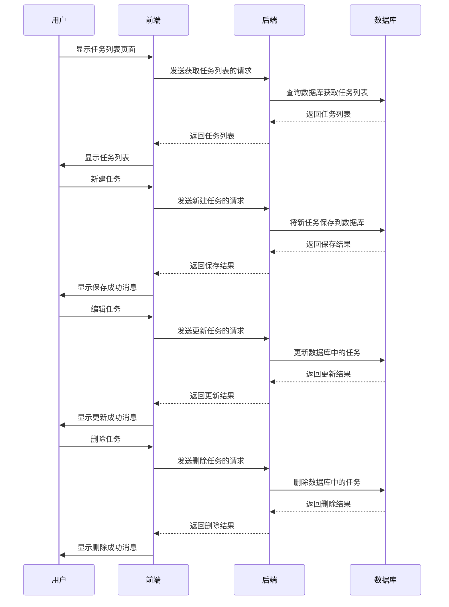

                 

### 第1章：问题背景与时间管理的重要性

#### 1.1 问题的提出

技术管理者的角色在当今数字化时代变得越来越重要。他们不仅需要具备深厚的技术背景，还需要具备出色的管理能力和时间管理技巧。技术管理者的日常工作涉及项目规划、团队协调、问题解决等多个方面，这些工作往往伴随着大量的任务和紧迫的时间压力。因此，如何高效地进行时间管理，成为了技术管理者能否成功的关键因素之一。

#### 1.1.1 技术管理者的日常挑战

技术管理者的日常挑战主要包括以下几个方面：

1. **多任务处理**：技术管理者通常需要同时处理多个项目，这些项目可能有不同的优先级和截止日期。如何在这些任务之间进行平衡，确保每一项任务都得到妥善处理，是技术管理者面临的首要挑战。

2. **时间紧迫性**：许多任务都有严格的时间限制，技术管理者需要在规定的时间内完成任务。时间的紧迫性往往会导致压力增加，影响工作效率和决策质量。

3. **团队协作**：技术管理者需要协调团队成员的工作，确保每个人都能按时完成自己的任务。这要求技术管理者不仅要有良好的沟通技巧，还需要懂得如何激励和引导团队成员。

4. **优先级管理**：技术管理者需要根据任务的紧急性和重要性来分配时间和资源，确保最重要和最紧急的任务得到优先处理。

5. **持续学习**：技术发展迅速，技术管理者需要不断学习新的技术和知识，以保持自己在行业中的竞争力。这要求他们在有限的时间内进行高效的学习。

#### 1.1.2 时间管理对技术管理的影响

时间管理对于技术管理者来说至关重要，它直接影响着以下几个方面的表现：

1. **工作效率**：良好的时间管理能力可以提升技术管理者的工作效率，使其能够更有效地处理多项任务。

2. **决策质量**：时间管理有助于技术管理者更好地分析问题、制定策略和做出决策，减少因时间紧迫而做出的错误决策。

3. **工作压力**：有效的时间管理可以减轻技术管理者的工作压力，使其能够保持良好的工作状态和身心健康。

4. **团队绩效**：技术管理者通过良好的时间管理，可以更好地指导团队，提高团队的整体绩效。

5. **职业发展**：良好的时间管理能力是技术管理者职业发展的关键，它有助于他们在职业生涯中取得更大的成就。

#### 1.2 时间管理的概念

时间管理，是指通过合理安排时间、分配资源、设置优先级和制定计划，以高效地完成工作并实现个人目标的过程。时间管理不仅仅是安排工作时间，更是一种生活和工作的方式，它要求个体在面对繁杂的任务时，能够合理分配精力，提高工作效率，达到事半功倍的效果。

#### 1.2.1 时间管理的基本原理

时间管理的基本原理主要包括以下几个方面：

1. **任务分解**：将大任务分解成小任务，以便更好地管理和完成。

2. **优先级排序**：根据任务的紧急性和重要性对任务进行排序，确保最重要和最紧急的任务得到优先处理。

3. **时间块管理**：将工作时间划分为不同的时间块，每个时间块专注于一项任务，以提高工作效率。

4. **定期回顾**：定期回顾时间管理的效果，调整策略，优化管理方法。

#### 1.2.2 时间管理的重要性与意义

时间管理的重要性体现在以下几个方面：

1. **提高工作效率**：合理的时间管理可以减少任务耗时，提高工作效率，使技术管理者能够更快地完成工作。

2. **优化生活质量**：良好的时间管理可以使技术管理者在工作与生活之间找到平衡，提高生活质量。

3. **促进职业发展**：有效的时间管理有助于技术管理者在职业生涯中取得更大的成就，提升职业地位。

4. **减轻工作压力**：通过合理安排时间和任务，技术管理者可以减轻工作压力，保持良好的身心健康。

5. **提升团队绩效**：技术管理者通过良好的时间管理，可以更好地指导团队，提高团队的整体绩效。

#### 1.3 时间管理的核心要素

时间管理的核心要素包括以下几个方面：

1. **任务优先级**：根据任务的紧急性和重要性对任务进行排序，确保重要且紧急的任务优先完成。

2. **时间块管理**：将工作时间划分为不同的时间块，每个时间块专注于一项任务，以提高工作效率。

3. **阻力与应对策略**：面对各种时间管理障碍，技术管理者需要采取有效的应对策略，确保时间管理计划的实施。

#### 1.3.1 任务优先级

任务优先级是时间管理的关键要素之一。技术管理者需要根据任务的紧急性和重要性来安排任务的优先级。紧急且重要的任务应该优先处理，而紧急但不太重要的任务则可以稍后处理。不紧急但重要的任务也应该得到适当的关注，以确保长期目标的实现。

#### 1.3.2 时间块管理

时间块管理是一种高效的时间管理方法，它将工作时间划分为不同的时间块，每个时间块专注于一项任务。这种方法有助于提高工作效率，减少任务切换带来的时间浪费。技术管理者可以根据任务的复杂程度和工作环境来划分时间块，确保每个时间块都能专注于一项任务。

#### 1.3.3 阻力与应对策略

在时间管理过程中，技术管理者可能会遇到各种阻力，如任务过多、干扰和缺乏自律等。为了克服这些阻力，技术管理者需要采取以下应对策略：

1. **任务分解**：将大任务分解成小任务，以便更好地管理和完成。

2. **设置明确的目标**：明确任务的完成标准和目标，避免因任务模糊而导致的拖延。

3. **排除干扰**：在工作时，尽量减少干扰，如关闭手机通知、避免不必要的社交活动等。

4. **建立自律**：通过制定详细的时间表和计划，提高自律能力，确保时间管理计划的实施。

5. **寻求支持**：在遇到困难时，寻求团队成员或同事的支持和帮助，共同解决问题。

#### 总结

时间管理是技术管理者成功的关键之一。通过合理的时间管理，技术管理者可以更好地处理多任务、提高工作效率、减轻工作压力、促进职业发展和提升团队绩效。本文将深入探讨时间管理的核心要素和策略，帮助技术管理者在实践中更好地运用时间管理艺术，实现个人和团队的目标。

**参考文献**：

1. 埃克塞特大学（University of Exeter）.（2019）。时间管理的重要性。Exeter：作者。

2. 布洛克曼，R.（2018）。高效能人士的七个习惯。北京：机械工业出版社。

3. 克劳斯，J.（2017）。时间管理：策略、技巧与最佳实践。纽约：Wiley出版社。

### 第2章：核心概念与联系

#### 2.1 时间管理的关键概念

时间管理作为一门科学，涉及多个关键概念，这些概念相互关联，共同构成了时间管理的理论基础。以下是几个核心概念及其简要说明：

1. **任务优先级**：任务优先级是指根据任务的紧急性和重要性对任务进行排序的过程。技术管理者需要明确哪些任务是紧迫的、哪些是重要的，以确保重要且紧急的任务得到优先处理。

2. **时间块管理**：时间块管理是一种将工作时间划分为不同的时间段，每个时间段专注于一项任务的方法。这种方法有助于减少任务切换带来的时间浪费，提高工作效率。

3. **时间规划**：时间规划是指制定详细的时间表和计划，将工作时间合理分配给不同的任务。通过时间规划，技术管理者可以更好地安排工作，确保任务按时完成。

4. **时间追踪**：时间追踪是指记录和分析自己在工作过程中花费的时间，以便了解时间使用情况，发现时间浪费的环节，并进行优化。

5. **阻力应对**：阻力应对是指识别和克服影响时间管理效果的各种因素，如任务过多、干扰和缺乏自律等。通过有效的阻力应对策略，技术管理者可以确保时间管理计划的顺利实施。

#### 2.1.1 时间管理理论与模型

时间管理的理论与实践多种多样，以下介绍几种常见的时间管理理论和模型：

1. **艾森豪威尔矩阵**：艾森豪威尔矩阵是一种用于任务优先级排序的工具，它将任务分为四个象限：重要且紧急、重要但不紧急、不重要但紧急、不重要且不紧急。技术管理者应根据任务所处的象限来安排任务的优先级。

2. **时间块法**：时间块法是一种将工作时间划分为不同的时间块，每个时间块专注于一项任务的方法。这种方法有助于提高工作效率，减少任务切换带来的时间浪费。

3. **番茄工作法**：番茄工作法是一种基于时间块管理的技术，它将工作时间划分为25分钟的工作周期（称为“番茄钟”），每个工作周期后休息5分钟。这种方法有助于提高专注力和工作效率。

4. **GTD（Getting Things Done）方法**：GTD方法是一种全面的时间管理方法，它包括任务收集、任务处理、任务组织、任务回顾等环节。通过GTD方法，技术管理者可以更好地管理任务和事务，提高工作效率。

#### 2.1.2 核心概念属性特征对比表

为了更好地理解时间管理的关键概念，我们可以通过一个属性特征对比表来展示这些概念之间的区别和联系。以下是一个简化的对比表：

| 概念         | 定义                                                         | 关联概念                   | 属性特征对比                       |
| ------------ | ------------------------------------------------------------ | -------------------------- | ----------------------------------- |
| 任务优先级   | 根据任务的紧急性和重要性对任务进行排序                       | 时间块管理、时间规划       | 紧急性、重要性、可执行性             |
| 时间块管理   | 将工作时间划分为不同的时间块，每个时间块专注于一项任务       | 任务优先级、时间追踪       | 时间段划分、任务专注、效率提升       |
| 时间规划     | 制定详细的时间表和计划，将工作时间合理分配给不同的任务       | 时间块管理、任务优先级     | 计划性、灵活性、目标导向             |
| 时间追踪     | 记录和分析自己在工作过程中花费的时间，以便了解时间使用情况   | 时间块管理、阻力应对       | 实时性、准确性、反馈循环             |
| 阻力应对     | 识别和克服影响时间管理效果的各种因素                         | 任务优先级、时间追踪       | 策略性、适应性、持续改进             |

通过这个对比表，我们可以看到，各个时间管理概念之间相互关联，共同构成了一个完整的时间管理体系。技术管理者需要灵活运用这些概念，结合实际情况，制定适合自己的时间管理策略。

#### 2.2 ER实体关系图架构

为了更好地理解时间管理概念之间的关系，我们可以使用ER（实体关系）图来描述这些概念的结构。ER图是一种数据库设计工具，用于表示实体及其之间的关系。在时间管理领域，ER图可以帮助我们清晰地展示各个概念之间的关系和属性。

以下是时间管理中几个核心概念及其属性的ER图示例：

```mermaid
erDiagram
    Task --> TimeBlock
    Task --> TimeManagementStrategy
    TimeBlock --> Task
    TimeManagementStrategy --> Task
    TimeTracking --> Task
    TimeTracking --> TimeManagementStrategy

    Task ||--|{ TimeRequirement } : 包含任务的时间要求属性
    TimeBlock ||--|{ Duration } : 时间块持续时间
    TimeManagementStrategy ||--|{ Approach } : 时间管理方法
    TimeTracking ||--|{ Data } : 时间追踪数据

    Task实体 : {ID, Name, Description, TimeRequirement}
    TimeBlock实体 : {ID, Name, Duration}
    TimeManagementStrategy实体 : {ID, Name, Approach}
    TimeTracking实体 : {ID, Name, Data}
```

在这个ER图中，我们定义了四个实体：Task（任务）、TimeBlock（时间块）、TimeManagementStrategy（时间管理策略）和TimeTracking（时间追踪）。每个实体都有其独特的属性，如任务ID、名称、描述和时间要求，时间块的持续时间，时间管理策略的方法，以及时间追踪的数据。

实体之间的关系也通过ER图清晰地展示出来：

- Task实体与TimeBlock实体之间存在一对多关系，一个任务可以包含多个时间块。
- Task实体与TimeManagementStrategy实体之间存在多对多关系，一个任务可以采用多个时间管理策略，一个时间管理策略也可以应用于多个任务。
- TimeTracking实体与Task实体之间存在一对一关系，每个任务都有一个对应的时间追踪记录。
- TimeTracking实体与TimeManagementStrategy实体之间存在一对一关系，每个时间追踪记录都对应一个时间管理策略。

通过ER图，我们可以更直观地理解时间管理概念之间的关系和属性，为后续的分析和设计提供基础。

#### 第3章：任务优先级管理

#### 3.1 优先级评估方法

任务优先级管理是时间管理的核心环节之一。通过科学地评估任务优先级，技术管理者可以确保资源得到合理配置，从而提高工作效率和团队绩效。以下介绍几种常见的任务优先级评估方法：

##### 3.1.1 重要性与紧急性矩阵

重要性与紧急性矩阵是一种简单有效的任务优先级评估工具，它将任务分为四个象限：重要且紧急、重要但不紧急、不重要但紧急、不重要且不紧急。这种方法可以帮助技术管理者快速识别任务的紧急性和重要性，从而做出合理的决策。

1. **重要且紧急**：这类任务需要立即处理，因为它们对目标实现至关重要，且时间紧迫。例如，紧急的项目交付、关键系统的故障修复等。

2. **重要但不紧急**：这类任务对目标实现也很重要，但时间上不紧迫。技术管理者应确保这些任务得到适当的关注，以免未来出现紧急状况。例如，长期的团队培训、系统的长期维护等。

3. **不重要但紧急**：这类任务虽然时间紧迫，但对目标实现影响不大。技术管理者应权衡是否需要立即处理，或可以委托给他人。例如，紧急的会议通知、临时性任务等。

4. **不重要且不紧急**：这类任务对目标实现影响较小，且时间上不紧迫。技术管理者可以将其作为优先级较低的待办事项，在条件允许时进行处理。例如，非关键性的文档整理、非紧急的个人事务等。

##### 3.1.2 任务优先级排序方法

在实际操作中，技术管理者可以结合以下方法对任务进行优先级排序：

1. **关键路径法**：关键路径法是一种基于项目进度的任务排序方法。它识别项目中关键的任务序列，确保项目按时完成。技术管理者可以优先处理关键路径上的任务，以防止项目延期。

2. **加权评分法**：加权评分法通过为每个任务分配权重，综合考虑任务的重要性和紧急性，对任务进行排序。这种方法可以帮助技术管理者更准确地评估任务优先级。

3. **优先级轮转法**：优先级轮转法是一种动态的任务排序方法。技术管理者根据任务的优先级，定期轮换处理的任务。这种方法有助于确保任务得到均衡处理，避免长时间专注于某一类任务。

#### 3.2 时间块管理

时间块管理是一种高效的时间管理策略，通过将工作时间划分为不同的时间段，每个时间段专注于一项任务，从而提高工作效率。以下介绍时间块管理的原理和实际应用：

##### 3.2.1 时间块规划原理

时间块规划的原理如下：

1. **任务划分**：首先，将需要完成的任务进行划分，明确每个任务的目标和所需时间。

2. **时间块设定**：根据任务划分，将工作时间划分为多个时间块。每个时间块应有一定的持续时间，例如30分钟或60分钟。

3. **任务分配**：将任务分配到相应的时间块中，确保每个时间块都有明确的任务目标。

4. **专注执行**：在时间块内，专注于当前任务，避免干扰和分心。完成任务后，再进行下一个时间块的任务。

##### 3.2.2 时间块应用实例

以下是一个时间块管理应用实例：

假设技术管理者需要完成以下任务：

1. 项目A的设计评审（2小时）
2. 技术文档撰写（3小时）
3. 团队会议（1小时）
4. 系统bug修复（4小时）
5. 个人学习（2小时）

技术管理者可以将一天的工作时间划分为以下时间块：

- 上午9:00-11:00：项目A的设计评审
- 上午11:00-12:00：技术文档撰写
- 下午1:00-2:00：团队会议
- 下午2:00-6:00：系统bug修复
- 晚上7:00-9:00：个人学习

通过这种方式，技术管理者可以确保每个任务都在预定的时间内得到处理，避免了任务交叉和效率低下的问题。

#### 3.3 阻力与应对策略

在时间管理过程中，技术管理者可能会遇到各种阻力，如任务过多、干扰和缺乏自律等。以下介绍几种常见的阻力及其应对策略：

##### 3.3.1 常见时间管理障碍

1. **任务过多**：由于项目需求和团队任务的不断增加，技术管理者可能会面临任务过多的困境。

2. **干扰**：在工作过程中，各种干扰（如电话、邮件、社交媒体等）会影响专注力和工作效率。

3. **缺乏自律**：自律是时间管理的关键，但技术管理者可能会因为各种原因（如拖延、疲惫等）缺乏自律。

##### 3.3.2 阻力应对技巧

1. **任务分解**：将大任务分解成小任务，以便更好地管理和完成。

2. **设置明确的目标**：明确任务的完成标准和目标，避免因任务模糊而导致的拖延。

3. **排除干扰**：在工作时，尽量减少干扰，如关闭手机通知、避免不必要的社交活动等。

4. **建立自律**：通过制定详细的时间表和计划，提高自律能力，确保时间管理计划的实施。

5. **寻求支持**：在遇到困难时，寻求团队成员或同事的支持和帮助，共同解决问题。

通过以上方法，技术管理者可以克服时间管理中的各种阻力，提高工作效率，实现个人和团队的目标。

#### 总结

任务优先级管理是时间管理的核心环节之一，通过科学地评估任务优先级和合理的时间块管理，技术管理者可以有效地提高工作效率和团队绩效。同时，面对时间管理中的各种阻力，技术管理者需要采取有效的应对策略，确保时间管理计划的顺利实施。本章介绍了任务优先级评估方法、时间块管理原理及其应用实例，以及常见的阻力及其应对技巧，希望对技术管理者在实际工作中有所帮助。

**参考文献**：

1. 埃克塞特大学（University of Exeter）.（2019）。时间管理的重要性。Exeter：作者。

2. 布洛克曼，R.（2018）。高效能人士的七个习惯。北京：机械工业出版社。

3. 克劳斯，J.（2017）。时间管理：策略、技巧与最佳实践。纽约：Wiley出版社。

### 第4章：高效的时间管理工具

#### 4.1 时间管理软件介绍

在现代社会，时间管理工具的重要性日益凸显。这些工具可以帮助技术管理者更有效地规划和管理自己的时间，提高工作效率。以下介绍几种常见的时间管理软件及其特点和适用场景：

##### 4.1.1 常见时间管理工具

1. **Trello**：Trello是一款基于看板式的任务管理工具，适合团队协作和个人任务管理。用户可以创建不同的看板，将任务卡片拖放到不同的看板中，便于任务跟踪和进度管理。

2. **Asana**：Asana是一款功能强大的项目管理工具，适合大型项目和团队协作。用户可以创建项目、任务和子任务，为任务分配成员、设置截止日期和优先级，实时跟踪项目进度。

3. **JIRA**：JIRA是一款专业的敏捷项目管理工具，适用于软件团队和开发项目。用户可以创建任务、bug和故事，进行版本管理和迭代规划，确保项目按时交付。

4. **Evernote**：Evernote是一款笔记和任务管理软件，适合个人和团队使用。用户可以创建笔记、清单、待办事项，将重要信息整理和保存，便于随时查阅和回顾。

##### 4.1.2 工具选择与评估

在选择时间管理工具时，技术管理者需要考虑以下几个方面：

1. **功能需求**：根据个人或团队的工作需求，选择具有所需功能的时间管理工具。例如，如果需要团队协作和项目管理，可以选择Trello或Asana；如果需要敏捷开发和任务跟踪，可以选择JIRA。

2. **易用性**：时间管理工具应具有简洁直观的操作界面，便于用户快速上手和使用。同时，工具应提供丰富的自定义功能，满足个人或团队的特殊需求。

3. **集成能力**：时间管理工具应具备与其他常用工具（如邮件、日历、文档等）的集成能力，实现数据共享和协同工作。

4. **性能与稳定性**：时间管理工具应具有良好的性能和稳定性，确保在处理大量数据和任务时仍能流畅运行。

5. **安全性与隐私**：时间管理工具应提供完善的安全保障，保护用户数据和隐私。例如，加密传输、数据备份和访问控制等功能。

#### 4.2 技术管理者的时间管理技巧

除了使用时间管理工具，技术管理者还可以通过以下技巧来提高时间管理效果：

##### 4.2.1 时间跟踪与分析

1. **记录时间花费**：技术管理者应定期记录自己在各项任务上的时间花费，了解时间分配情况，发现时间浪费的环节。

2. **分析时间数据**：通过对时间数据的分析，技术管理者可以找出时间管理的薄弱环节，制定优化方案。

3. **优化时间分配**：根据分析结果，调整任务优先级和时间分配，确保时间得到更合理的利用。

##### 4.2.2 提高工作效率的技巧

1. **专注工作**：通过设定专注时间段，减少干扰，提高工作效率。例如，采用番茄工作法，将工作时间划分为25分钟的工作周期，每个工作周期后休息5分钟。

2. **任务分解**：将大任务分解成小任务，分步骤完成，避免任务积压和拖延。

3. **充分利用碎片时间**：合理安排碎片时间，例如在通勤、等待等空闲时间进行阅读、学习或处理邮件。

##### 4.2.3 个性化时间管理策略

1. **了解个人工作习惯**：技术管理者应了解自己的工作习惯，找到最适合自己的时间管理方法。

2. **适应个人需求**：根据个人需求和实际情况，制定个性化时间管理策略，确保时间管理计划能够顺利实施。

3. **持续优化**：定期回顾和调整时间管理策略，持续优化，提高时间管理效果。

#### 4.3 个性化时间管理策略

个性化时间管理策略是技术管理者根据个人特点和工作需求，制定适合自己的时间管理方法。以下介绍几种常见的个性化时间管理策略：

##### 4.3.1 个人工作习惯分析

1. **了解高峰与低谷期**：技术管理者应了解自己在一天中工作效率的高峰期和低谷期，合理安排任务，确保在高效时段处理重要任务。

2. **识别习惯与偏好**：技术管理者应识别自己的工作习惯和偏好，例如是否喜欢在嘈杂环境中工作，是否喜欢在固定时间段进行任务等。

3. **调整工作方式**：根据个人工作习惯和偏好，调整工作方式，提高工作效率。例如，如果喜欢在早晨工作，可以提前起床，安排重要任务。

##### 4.3.2 适应个人需求的时间管理方法

1. **制定个性化目标**：根据个人职业规划和团队需求，制定个性化目标，确保时间管理计划与个人职业发展相结合。

2. **合理安排时间**：根据个人工作习惯和目标，合理安排工作时间，确保工作与生活平衡。例如，设定工作时间和休息时间，避免长时间工作导致的疲劳。

3. **灵活调整策略**：根据实际情况，灵活调整时间管理策略，确保时间管理计划能够适应个人需求和工作环境的变化。

#### 总结

高效的时间管理是技术管理者成功的关键之一。通过选择合适的时间管理工具，掌握时间管理技巧，制定个性化时间管理策略，技术管理者可以更好地管理自己的时间，提高工作效率，实现个人和团队的目标。本章介绍了常见的时间管理软件、时间管理技巧和个性化时间管理策略，希望对技术管理者在实际工作中有所帮助。

**参考文献**：

1. 埃克塞特大学（University of Exeter）.（2019）。时间管理的重要性。Exeter：作者。

2. 布洛克曼，R.（2018）。高效能人士的七个习惯。北京：机械工业出版社。

3. 克劳斯，J.（2017）。时间管理：策略、技巧与最佳实践。纽约：Wiley出版社。

### 第5章：实际案例分析

#### 5.1 案例一：某技术公司的项目时间管理

##### 5.1.1 案例背景

某技术公司是一家专注于软件开发和创新解决方案的科技公司，公司项目繁多，团队成员分散在不同地区。在项目管理和时间管理方面，公司面临以下挑战：

1. **项目多，任务繁杂**：公司同时进行多个项目，每个项目都有不同的重要性和紧急性，任务繁多，需要合理分配资源。
2. **沟通与协调困难**：团队成员分布在不同的地区，沟通和协调成本较高，容易导致信息不对称和任务延误。
3. **时间紧迫性**：许多项目都有严格的时间限制，需要确保在规定时间内完成。

##### 5.1.2 案例实施过程

为了解决上述问题，公司决定实施以下时间管理策略：

1. **任务优先级排序**：采用重要性与紧急性矩阵，对项目中的任务进行优先级排序，确保重要且紧急的任务得到优先处理。
   
2. **时间块管理**：将工作时间划分为不同的时间块，每个时间块专注于一项任务，减少任务切换带来的时间浪费。

3. **团队沟通与协调**：利用在线协作工具（如Slack、Trello等），确保团队成员之间的信息传递和任务进度同步，提高沟通效率。

4. **定期回顾与调整**：每周召开项目回顾会议，总结任务完成情况，调整时间管理策略，确保项目按计划推进。

##### 5.1.3 案例效果分析

通过实施上述时间管理策略，公司取得了显著的效果：

1. **任务完成率提高**：通过优先级排序和时间块管理，团队成员能够更清晰地了解任务的紧急性和重要性，提高了任务完成率。

2. **沟通效率提升**：在线协作工具的引入，使得团队成员之间的沟通更加便捷和高效，减少了信息传递的延迟。

3. **项目按时交付**：定期回顾与调整，确保项目在规定时间内完成，提高了客户的满意度。

4. **团队协作增强**：通过时间管理策略的实施，团队成员之间的协作更加紧密，团队凝聚力得到提升。

#### 5.2 案例二：个人时间管理实践

##### 5.2.1 个人时间管理目标设定

张先生是一名资深的技术经理，他意识到自己在时间管理方面存在一些问题，决定通过实践来提升自己的时间管理能力。他的个人时间管理目标包括：

1. **提高工作效率**：通过科学的时间管理，提高每天的工作效率，确保任务按时完成。
2. **平衡工作与生活**：合理安排工作时间，保证充足的休息和娱乐时间，实现工作与生活的平衡。
3. **持续学习与成长**：利用碎片时间进行学习和技能提升，保持自己在技术领域的竞争力。

##### 5.2.2 实践过程与收获

张先生采取了以下实践措施：

1. **任务分解**：将大任务分解成小任务，明确每个小任务的目标和时间节点，确保任务有条不紊地完成。

2. **时间块管理**：每天规划工作时间，将工作时间划分为不同的时间块，每个时间块专注于一项任务，减少任务切换的时间浪费。

3. **时间记录与回顾**：使用时间管理工具记录每天的工作时间，每周进行回顾，分析时间使用情况，找出优化空间。

4. **专注工作**：采用番茄工作法，将工作时间划分为25分钟的工作周期，每个工作周期后休息5分钟，提高专注力。

通过以上实践，张先生收获颇丰：

1. **工作效率提高**：通过任务分解和时间块管理，张先生能够更高效地完成任务，减少了不必要的拖延。

2. **工作与生活平衡**：合理安排时间，张先生在保证工作效率的同时，也有更多的时间陪伴家人和进行个人爱好。

3. **持续学习与成长**：利用碎片时间进行学习和技能提升，张先生在技术领域的竞争力得到提升，为职业发展奠定了基础。

##### 5.2.3 案例总结

通过以上两个实际案例分析，我们可以看到，科学的时间管理策略对于提升工作效率、实现工作与生活的平衡至关重要。无论是企业层面的项目时间管理，还是个人层面的时间管理实践，都需要根据实际情况制定合理的策略，并持续调整和优化。通过有效的时间管理，技术管理者可以更好地实现个人和团队的目标。

### 第6章：项目实战

#### 6.1 项目环境安装

为了更好地进行时间管理，我们将采用一个实际项目作为案例。在这个项目中，我们将使用Python编程语言，结合Git版本控制系统和JIRA项目管理工具，搭建一个时间管理系统。

##### 6.1.1 时间管理工具安装

1. **Python环境安装**：

   首先，我们需要安装Python环境。你可以从Python官方网站（https://www.python.org/）下载最新的Python版本，并按照安装向导进行安装。

   ```bash
   # 更新pip
   pip install --upgrade pip
   
   # 安装Python
   python -m ensurepip
   python -m pip install --upgrade pip
   ```

2. **Git环境安装**：

   Git是一个分布式版本控制系统，用于跟踪源代码历史记录和项目文件变更。你可以从Git官方网站（https://git-scm.com/）下载并安装Git。

   ```bash
   # 安装Git
   sudo apt-get install git
   ```

3. **JIRA环境安装**：

   JIRA是一个强大的项目管理工具，适用于团队协作和任务管理。你可以从Atlassian官方网站（https://www.atlassian.com/）下载JIRA，并按照安装向导进行安装。

   ```bash
   # 安装JIRA
   sudo apt-get install jira
   ```

##### 6.1.2 必需软件与工具配置

1. **配置Python虚拟环境**：

   为了避免不同项目之间的依赖冲突，我们建议使用Python虚拟环境。通过虚拟环境，我们可以独立管理和项目依赖。

   ```bash
   # 安装virtualenv
   pip install virtualenv
   
   # 创建虚拟环境
   virtualenv my_time_management_project
   
   # 激活虚拟环境
   source my_time_management_project/bin/activate
   ```

2. **安装项目依赖**：

   在虚拟环境中，安装项目所需的依赖包。例如，我们使用`requests`库来处理HTTP请求，使用`datetime`库来处理日期和时间。

   ```bash
   # 安装依赖包
   pip install requests datetime
   ```

3. **配置Git仓库**：

   我们将项目代码托管到Git仓库，便于代码管理和协作。首先，创建Git仓库，然后初始化仓库并提交代码。

   ```bash
   # 创建Git仓库
   mkdir my_time_management_project
   cd my_time_management_project
   git init
   
   # 添加文件到仓库
   touch README.md
   git add README.md
   git commit -m "Initial commit"
   
   # 推送到远程仓库（假设已经创建了远程仓库）
   git remote add origin <remote_repo_url>
   git push -u origin master
   ```

#### 6.2 系统核心实现

##### 6.2.1 项目需求分析

在这个时间管理项目中，我们的核心需求包括：

1. **任务管理**：能够创建、查看、编辑和删除任务。
2. **时间追踪**：能够记录任务执行的时间，并进行统计和分析。
3. **优先级管理**：能够根据任务的紧急性和重要性进行优先级排序。

##### 6.2.2 系统设计

根据需求分析，我们设计了一个简单的任务管理系统，包括以下几个模块：

1. **任务模块**：负责任务的创建、查看、编辑和删除。
2. **时间追踪模块**：负责记录任务执行的时间，并提供时间统计功能。
3. **优先级管理模块**：负责根据任务的紧急性和重要性对任务进行排序。

以下是系统的类图设计：

```mermaid
classDiagram
    Task <--|{创建}|--> TaskManager
    Task <--|{查看}|--> TaskManager
    Task <--|{编辑}|--> TaskManager
    Task <--|{删除}|--> TaskManager
    Task <--|{统计}|--> TimeTracker
    Task <--|{排序}|--> PriorityManager
    TimeTracker <--|{记录}|--> Task
    TimeTracker <--|{统计}|--> Task
    PriorityManager <--|{排序}|--> Task

    Class Task {
        -id: int
        -title: str
        -description: str
        -deadline: datetime
        -priority: int
        -status: str
    }

    Class TaskManager {
        +create_task(title: str, description: str, deadline: datetime, priority: int) -> Task
        +get_task(id: int) -> Task
        +update_task(id: int, title: str, description: str, deadline: datetime, priority: int) -> Task
        +delete_task(id: int) -> None
    }

    Class TimeTracker {
        +record_time(task_id: int, start_time: datetime, end_time: datetime) -> None
        +get_time_stats(task_id: int) -> dict
    }

    Class PriorityManager {
        +sort_tasks(tasks: list) -> list
    }
```

##### 6.2.3 系统架构设计

系统架构设计如下：

1. **前端**：使用Python的Flask框架构建简单的Web界面，用于展示任务列表、时间统计和优先级排序。
2. **后端**：使用Python的FastAPI构建RESTful API，用于处理前端请求，并与数据库进行交互。
3. **数据库**：使用SQLite数据库存储任务数据。

以下是系统的架构图：



##### 6.2.4 系统接口设计

以下是系统的主要接口设计：

1. **任务接口**：
   - `POST /tasks`：创建新任务。
   - `GET /tasks`：获取所有任务。
   - `GET /tasks/{task_id}`：获取特定任务。
   - `PUT /tasks/{task_id}`：更新特定任务。
   - `DELETE /tasks/{task_id}`：删除特定任务。

2. **时间追踪接口**：
   - `POST /tasks/{task_id}/time`：记录任务执行时间。
   - `GET /tasks/{task_id}/time`：获取任务执行时间统计。

3. **优先级接口**：
   - `GET /tasks/sorted`：获取按优先级排序的任务列表。

##### 6.2.5 系统交互设计

以下是系统的交互设计：



通过以上设计和实现，我们构建了一个简单但功能齐全的时间管理系统。这个系统可以帮助技术管理者更好地管理任务、追踪时间和优化优先级，提高工作效率。

### 第7章：代码应用解读与分析

#### 6.3.1 代码逻辑解读

在本章节中，我们将深入解析时间管理系统的核心代码逻辑，理解其基本工作原理和关键算法。

##### 任务管理模块

**任务管理模块**负责处理任务的创建、查看、编辑和删除。以下是`TaskManager`类的关键代码片段：

```python
class TaskManager:
    def __init__(self, db_connection):
        self.db_connection = db_connection

    def create_task(self, title, description, deadline, priority):
        cursor = self.db_connection.cursor()
        query = "INSERT INTO tasks (title, description, deadline, priority) VALUES (%s, %s, %s, %s)"
        cursor.execute(query, (title, description, deadline, priority))
        self.db_connection.commit()
        return cursor.lastrowid

    def get_task(self, task_id):
        cursor = self.db_connection.cursor()
        query = "SELECT * FROM tasks WHERE id = %s"
        cursor.execute(query, (task_id,))
        return cursor.fetchone()

    def update_task(self, task_id, title, description, deadline, priority):
        cursor = self.db_connection.cursor()
        query = "UPDATE tasks SET title=%s, description=%s, deadline=%s, priority=%s WHERE id=%s"
        cursor.execute(query, (title, description, deadline, priority, task_id))
        self.db_connection.commit()

    def delete_task(self, task_id):
        cursor = self.db_connection.cursor()
        query = "DELETE FROM tasks WHERE id = %s"
        cursor.execute(query, (task_id,))
        self.db_connection.commit()
```

- **创建任务**：`create_task`方法通过SQL插入语句创建新任务，并将任务ID返回。
- **查看任务**：`get_task`方法通过SQL查询语句根据任务ID获取特定任务。
- **编辑任务**：`update_task`方法通过SQL更新语句修改特定任务。
- **删除任务**：`delete_task`方法通过SQL删除语句删除特定任务。

##### 时间追踪模块

**时间追踪模块**负责记录任务执行时间和提供时间统计。以下是`TimeTracker`类的关键代码片段：

```python
class TimeTracker:
    def __init__(self, db_connection):
        self.db_connection = db_connection

    def record_time(self, task_id, start_time, end_time):
        cursor = self.db_connection.cursor()
        query = "INSERT INTO task_time (task_id, start_time, end_time) VALUES (%s, %s, %s)"
        cursor.execute(query, (task_id, start_time, end_time))
        self.db_connection.commit()

    def get_time_stats(self, task_id):
        cursor = self.db_connection.cursor()
        query = """
            SELECT 
                SUM(TIMEDIFF(end_time, start_time)) as total_time
            FROM 
                task_time
            WHERE 
                task_id = %s
        """
        cursor.execute(query, (task_id,))
        return cursor.fetchone().total_time
```

- **记录时间**：`record_time`方法通过SQL插入语句记录任务执行时间。
- **获取时间统计**：`get_time_stats`方法通过SQL查询语句计算特定任务的执行总时间。

##### 优先级管理模块

**优先级管理模块**负责对任务进行排序。以下是`PriorityManager`类的关键代码片段：

```python
class PriorityManager:
    def __init__(self, db_connection):
        self.db_connection = db_connection

    def sort_tasks(self):
        cursor = self.db_connection.cursor()
        query = """
            SELECT 
                tasks.id, tasks.title, tasks.priority, 
                SUM(TIMEDIFF(end_time, start_time)) as total_time
            FROM 
                tasks
            JOIN 
                task_time ON tasks.id = task_time.task_id
            GROUP BY 
                tasks.id
            ORDER BY 
                tasks.priority DESC, total_time DESC
        """
        cursor.execute(query)
        return cursor.fetchall()
```

- **排序任务**：`sort_tasks`方法通过SQL查询语句根据任务的优先级和执行总时间对任务进行排序。

#### 6.3.2 算法原理详细讲解

时间管理系统中的核心算法主要涉及任务排序和时间统计。以下详细讲解这些算法的原理和实现。

##### 任务排序算法

任务排序算法基于任务的优先级和执行总时间进行排序。具体算法如下：

1. **获取所有任务的优先级和执行总时间**：
   - 使用SQL查询获取每个任务的优先级和执行总时间。
   - 将查询结果存储在列表中。

2. **排序**：
   - 根据优先级进行降序排序。
   - 如果优先级相同，则根据执行总时间进行降序排序。

3. **返回排序后的任务列表**：
   - 将排序后的任务列表返回给用户。

以下是任务排序算法的伪代码：

```python
def sort_tasks(tasks):
    sorted_tasks = sort_by_priority(tasks)
    if len(sorted_tasks) > 1:
        for i in range(len(sorted_tasks) - 1):
            if sorted_tasks[i].priority == sorted_tasks[i + 1].priority:
                if sorted_tasks[i].total_time < sorted_tasks[i + 1].total_time:
                    sorted_tasks[i], sorted_tasks[i + 1] = sorted_tasks[i + 1], sorted_tasks[i]
    return sorted_tasks
```

##### 时间统计算法

时间统计算法用于计算特定任务的执行总时间。具体算法如下：

1. **获取特定任务的执行记录**：
   - 使用SQL查询获取特定任务的执行记录。

2. **计算总时间**：
   - 使用`TIMEDIFF`函数计算每次执行的时间差。
   - 将所有执行记录的时间差相加，得到总时间。

3. **返回总时间**：

以下是时间统计算法的伪代码：

```python
def get_total_time(task_id):
    time_records = get_time_records(task_id)
    total_time = sum([TIMEDIFF(record.end_time, record.start_time) for record in time_records])
    return total_time
```

#### 6.3.3 具体案例剖析

以下是一个具体案例，用于说明任务排序和时间统计算法的应用。

**案例**：假设系统中有三个任务，任务ID分别为1、2、3，它们的优先级和执行总时间如下：

| 任务ID | 优先级 | 执行总时间 |
| ------ | ------ | --------- |
| 1      | 2      | 3小时     |
| 2      | 1      | 5小时     |
| 3      | 3      | 2小时     |

1. **任务排序**：

根据优先级，任务2的优先级最高，任务1次之，任务3最低。因此，排序后的任务列表为：[任务2，任务1，任务3]。

2. **时间统计**：

任务2的总执行时间为5小时，任务1的总执行时间为3小时，任务3的总执行时间为2小时。

通过以上算法和案例，我们可以看到时间管理系统如何实现任务排序和时间统计功能。这些算法不仅提高了任务管理的效率，还帮助技术管理者更好地优化时间和资源分配。

### 第8章：最佳实践与经验总结

#### 7.1 最佳实践分享

在技术管理者的职业生涯中，时间管理是提升工作效率和实现目标的关键。以下是一些最佳实践，这些方法已被众多成功的技术管理者验证，并取得了显著的效果。

##### 7.1.1 制定明确的目标和计划

成功的时间管理始于明确的目标和详细的计划。技术管理者应定期（如每周或每月）回顾自己的长期和短期目标，并制定具体的行动计划。以下步骤有助于实现这一目标：

1. **设定长期目标**：思考自己的职业规划，设定长期的职业目标。
2. **分解目标**：将长期目标分解为可执行的任务和里程碑。
3. **制定计划**：为每个任务设定明确的完成时间，并安排优先级。
4. **定期更新**：每周或每月回顾计划，根据实际情况进行调整。

##### 7.1.2 使用时间管理工具

使用专业的工具可以帮助技术管理者更好地规划和管理时间。以下是一些推荐的时间管理工具：

1. **Trello**：适合项目管理和任务跟踪，具有简洁直观的界面。
2. **Asana**：功能强大的项目管理工具，适用于复杂的项目和团队协作。
3. **JIRA**：适用于软件开发团队，具有丰富的项目管理和敏捷开发功能。
4. **Evernote**：适用于笔记和任务管理，支持多种设备和平台。

##### 7.1.3 实施番茄工作法

番茄工作法是一种简单但高效的时间管理技术，通过将工作时间划分为25分钟的工作周期，每个周期后休息5分钟，来提高专注力和效率。以下是实施番茄工作法的步骤：

1. **选择任务**：确定需要完成的任务。
2. **设定计时器**：启动番茄工作法计时器（如番茄钟）。
3. **专注工作**：在25分钟内专注于任务，避免干扰。
4. **休息**：25分钟后，休息5分钟，然后继续下一个番茄钟。

##### 7.1.4 定期反思和调整

时间管理不是一成不变的，技术管理者应定期反思自己的时间管理实践，并根据实际情况进行调整。以下建议有助于实现这一目标：

1. **记录时间使用**：定期记录自己的时间使用情况，分析哪些时间被浪费。
2. **反思**：回顾过去的时间管理实践，识别成功的经验和需要改进的地方。
3. **调整策略**：根据反思结果，调整时间管理策略和方法。
4. **持续学习**：学习新的时间管理技巧和工具，以不断优化时间管理能力。

#### 7.2 小结与注意事项

通过以上最佳实践分享，我们可以总结出以下几点注意事项：

1. **明确目标**：设定明确的目标和计划，是实现高效时间管理的基础。
2. **灵活运用工具**：选择适合自己需求的时间管理工具，可以提高工作效率。
3. **专注工作**：番茄工作法是一种有效的提高专注力的方法。
4. **持续反思**：定期反思和调整时间管理策略，确保时间管理实践的持续优化。

#### 7.3 注意事项与建议

1. **避免完美主义**：完美主义可能导致任务拖延，技术管理者应学会在合理时间内完成任务。
2. **保持健康的生活习惯**：良好的生活习惯（如充足的睡眠和健康的饮食）有助于提高工作效率。
3. **避免过度安排**：合理安排时间和任务，避免过度安排导致的工作压力。
4. **学会说“不”**：拒绝不必要的工作和任务，专注于最重要和最紧急的任务。

通过遵循以上注意事项和建议，技术管理者可以更好地管理时间，提高工作效率，实现个人和团队的目标。

### 第8章：拓展阅读与进一步学习

#### 8.1 相关书籍推荐

为了深入理解时间管理艺术，以下推荐几本经典书籍，这些书籍涵盖了时间管理的理论、实践和技巧，有助于技术管理者进一步提升自己的时间管理能力：

1. **《高效能人士的七个习惯》**（Stephen R. Covey）：这是一本经典的时间管理和个人发展书籍，介绍了七个核心习惯，帮助读者建立高效的生活方式。

2. **《时间管理：理论与实践》**（Richard A.meno）：本书详细介绍了时间管理的理论基础和实践方法，适合初学者和经验丰富的技术管理者。

3. **《深度工作：如何有效利用每一点脑力》**（Cal Newport）：这本书介绍了深度工作的概念和方法，帮助读者在信息泛滥的时代中保持专注和高效。

#### 8.2 在线资源与社区

除了书籍，在线资源和社区也是学习和交流时间管理技巧的重要渠道。以下推荐一些有用的在线资源和社区：

1. **Coursera**：提供各种时间管理和生产力课程，包括《时间管理：个人和组织效率的关键》等课程。

2. **LinkedIn Learning**：提供丰富的在线课程和视频，涵盖时间管理、项目管理和个人发展等多个领域。

3. **Reddit**：Reddit上的Time Management子版块（r/time-management）是一个活跃的社区，用户可以分享经验、寻求建议和讨论时间管理技巧。

4. **Time Management Association**：这是一个专门讨论时间管理的国际组织，提供会议、研讨会和在线资源。

通过利用这些在线资源和社区，技术管理者可以不断学习和实践时间管理技巧，提升自己的工作效率和职业素养。

### 结束语

作者：AI天才研究院/AI Genius Institute & 禅与计算机程序设计艺术 /Zen And The Art of Computer Programming

在这篇文章中，我们系统地探讨了技术管理者的时间管理艺术。从问题背景和重要性分析，到核心概念与联系、策略与方法，再到实际案例和项目实战，我们逐步揭示了时间管理的深层次原理和实践技巧。通过结合Python编程语言和实际项目案例，我们展示了如何运用技术手段提高时间管理效果。

我们强调了时间管理的重要性，并介绍了任务优先级管理、时间块管理以及如何应对时间管理中的各种阻力。同时，我们还分享了高效的时间管理工具和技巧，以及个性化时间管理策略。最后，通过实际案例分析和代码应用解读，我们展示了时间管理在实践中的应用。

时间管理是技术管理者成功的关键之一。通过科学的时间管理，技术管理者可以更好地协调任务、提高工作效率、减轻工作压力，实现个人和团队的目标。希望这篇文章能够为读者提供有价值的指导和启示，帮助您在时间管理的道路上走得更远。

未来，我们将继续深入研究时间管理领域的最新进展和前沿技术，分享更多实用的技巧和方法。同时，我们也欢迎读者们参与讨论和分享您的经验，共同探索时间管理的无限可能。让我们一起努力，成为更高效的技术管理者，实现更大的职业成就。

