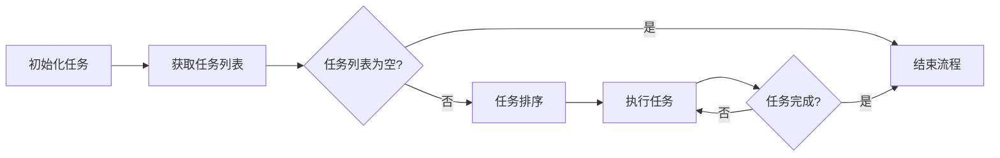
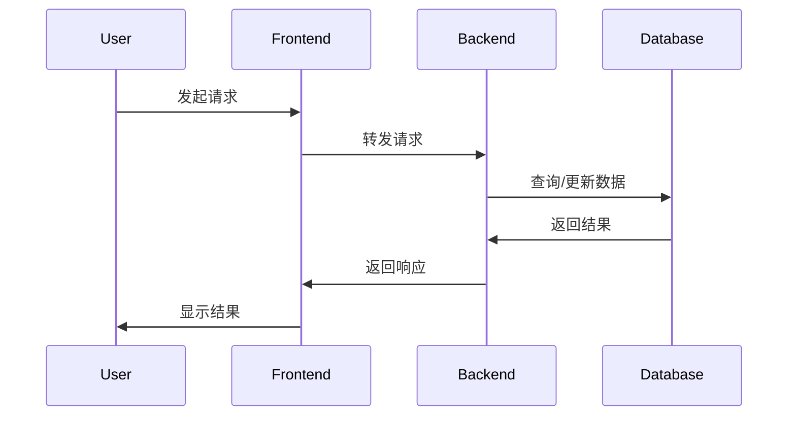
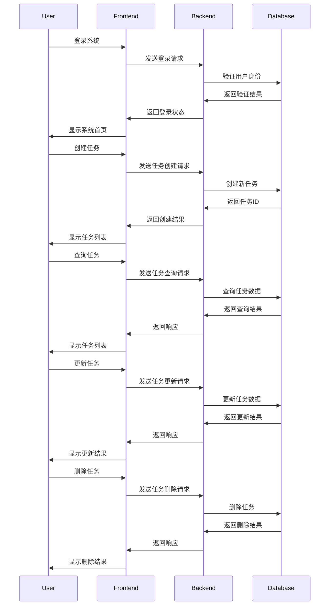

                 

### 背景介绍

在现代企业中，技术管理者的角色至关重要。他们不仅需要具备深厚的技术背景，还必须具备卓越的管理能力。然而，技术管理者常常面临一个巨大的挑战：时间管理。面对繁重的项目、持续的技术更新以及日益增加的管理责任，技术管理者常常感到时间不足，难以平衡技术工作与管理职责。这种时间管理的难题不仅影响了他们的工作效率，还对团队的整体绩效产生了负面影响。

#### 时间管理挑战

技术管理者每天都会遇到各种时间管理的问题：

1. **任务优先级不明确**：多个任务需要同时处理，但每个任务的重要性不同，如何确定优先级成为一个难题。
2. **时间碎片化**：由于技术工作和管理的双重职责，技术管理者常常面临时间碎片化的挑战，难以集中精力处理复杂任务。
3. **项目进度失控**：技术管理者需要监督多个项目的进度，但项目进度的不确定性使得时间管理变得更加复杂。
4. **沟通成本高**：技术管理者需要与团队成员、上级、客户等多方进行沟通，沟通的成本往往占据了大量的时间。
5. **持续学习需求**：技术领域不断进步，技术管理者需要不断学习新技术，但学习时间往往难以保证。

#### 时间管理的重要性

有效的时间管理对于技术管理者来说至关重要。良好的时间管理可以帮助他们：

1. **提高工作效率**：通过合理规划时间和任务，技术管理者可以更加高效地完成工作，提高个人的工作效率。
2. **减少压力**：时间管理得当可以减少因任务堆积和项目进度失控而产生的压力。
3. **提升团队绩效**：通过合理的时间管理，技术管理者可以更好地协调团队成员的工作，提升团队的整体绩效。
4. **平衡工作与生活**：有效的时间管理有助于技术管理者平衡工作与生活，减少工作对个人生活的负面影响。
5. **持续学习**：时间管理得当可以为技术管理者留出足够的时间进行学习，不断更新自己的技术知识和技能。

#### 时间管理的边界与外延

时间管理并不仅仅是关于如何有效地安排时间，它还涉及到一系列的边界与外延：

1. **任务分解**：将大任务分解为小任务，可以更好地控制时间，提高工作效率。
2. **优先级排序**：根据任务的紧急程度和重要性进行排序，确保关键任务优先完成。
3. **时间记录**：通过记录时间使用情况，技术管理者可以了解自己时间分配的实际情况，进而进行调整。
4. **任务管理工具**：使用任务管理工具（如JIRA、Trello等）可以帮助技术管理者更好地跟踪和管理任务。
5. **学习与提升**：持续学习和提升自己的时间管理技能，是成为一名优秀技术管理者的关键。

综上所述，技术管理者的时间管理问题是一个复杂且具有挑战性的课题。在接下来的章节中，我们将深入探讨时间管理的基本概念、核心要素及其与技术的联系，从而帮助技术管理者更好地平衡技术与管理职责，提升个人和团队的工作效率。### 核心概念与联系

#### 时间管理的基本概念

时间管理是一门关于如何合理分配和使用时间的学科。对于技术管理者来说，时间管理不仅关乎个人的工作效率，还直接影响到团队的整体绩效。以下是时间管理中几个关键的基本概念：

1. **任务**：任务是指需要完成的某项具体工作。在时间管理中，任务可以是一个小的工作项目，也可以是一个复杂的系统开发任务。任务可以是短期的，如一个小时的会议，也可以是长期的，如一个季度的项目。

2. **优先级**：优先级是指任务的重要性和紧急程度。在时间管理中，确定任务的优先级是非常重要的，因为它决定了任务完成的时间顺序。高优先级任务通常需要优先处理，以确保关键任务不会延误。

3. **时间分配**：时间分配是指将时间合理地分配给不同的任务。良好的时间分配能够提高工作效率，减少时间浪费。

4. **时间浪费**：时间浪费是指在进行时间管理过程中，时间没有得到有效利用的情况。时间浪费可能是由于任务安排不当、优先级排序不合理、计划执行不力等原因造成的。

#### 时间管理的关键要素

时间管理的关键要素包括但不限于以下几个方面：

1. **任务清单**：任务清单是记录所有任务的列表。通过任务清单，技术管理者可以清晰地了解当前需要完成的任务，并根据任务的紧急程度和重要性进行排序。

2. **时间记录**：时间记录是指记录每天、每周、每月的时间使用情况。通过时间记录，技术管理者可以了解自己的时间分配情况，发现时间浪费的地方，并做出相应的调整。

3. **优先级排序**：优先级排序是指根据任务的紧急程度和重要性对任务进行排序。在时间管理中，优先级排序可以帮助技术管理者确定哪些任务需要优先完成，从而提高工作效率。

4. **任务分解**：任务分解是指将大任务分解为小任务。通过任务分解，技术管理者可以将复杂的任务分解为易于管理的小部分，从而更好地控制时间和进度。

#### 时间管理概念的联系

时间管理的核心概念之间存在着紧密的联系。例如：

1. **任务与优先级**：任务的存在需要优先级来确定处理顺序，没有优先级的任务往往会导致时间管理混乱。

2. **时间分配与任务清单**：任务清单提供了任务的具体信息，而时间分配则是根据任务清单来安排时间的具体方式。

3. **时间记录与时间浪费**：通过时间记录，技术管理者可以识别出时间浪费的地方，并采取措施减少浪费。

4. **任务分解与时间分配**：任务分解可以将复杂任务分解为多个小任务，每个小任务的时间分配更加明确，从而提高时间管理的效率。

为了更好地理解这些核心概念，我们可以使用概念属性特征对比表格来详细说明每个概念的特征和属性，以及它们之间的联系。以下是一个示例表格：

| 概念         | 特征               | 属性               | 联系                    |
|------------|------------------|------------------|---------------------|
| 任务         | 需要完成的某项工作       | 名称、描述、优先级     | 任务的存在需要优先级确定 |
| 优先级       | 任务的重要性和紧急程度    | 高、中、低           | 没有优先级的任务会导致混乱 |
| 时间分配     | 任务的时间安排          | 起始时间、结束时间      | 时间分配基于任务清单和优先级 |
| 时间记录     | 记录时间使用情况         | 任务、时长、备注        | 时间记录帮助识别时间浪费 |
| 任务分解     | 将大任务分解为小任务      | 子任务、子任务描述      | 任务分解有利于时间分配和进度管理 |

通过这个表格，我们可以更清晰地看到每个概念的定义、特征和属性，以及它们之间的内在联系。这为技术管理者提供了一个结构化的框架，可以更好地理解和应用时间管理的基本概念，从而提升工作效率和团队绩效。

### 时间管理工具对比

在技术管理者的日常工作中，选择合适的工具对于有效的时间管理至关重要。以下是一些常见的时间管理工具，以及它们的特点和适用场景：

#### 1. JIRA

**特点**：JIRA 是一款功能强大的任务跟踪和管理工具，特别适合大型项目和复杂任务的跟踪。它支持敏捷开发，提供包括任务、问题、迭代等功能。

**适用场景**：适合需要进行敏捷开发的项目，特别是需要团队协作和任务追踪的项目。

**优点**：功能全面，支持多种报表和统计，适合复杂的项目管理。

**缺点**：学习曲线较陡，初期设置较为复杂。

#### 2. Trello

**特点**：Trello 是一款基于看板（Kanban）理念的简单任务管理工具，界面直观，易于上手。

**适用场景**：适合中小型团队或个人，用于简单的任务分配和跟踪。

**优点**：界面简洁，操作简单，易于维护。

**缺点**：功能相对简单，不适合复杂的项目管理。

#### 3. Asana

**特点**：Asana 是一款专业的团队任务管理工具，提供丰富的任务管理功能，支持多种视图，如列表、看板、甘特图等。

**适用场景**：适合各种规模和类型的团队，特别适合需要高度协作和复杂任务管理的情况。

**优点**：功能丰富，支持多种视图，高度定制化。

**缺点**：操作界面稍显复杂，需要一定的学习时间。

#### 4. Microsoft To Do

**特点**：Microsoft To Do 是微软推出的个人和团队任务管理工具，与Microsoft 365集成良好。

**适用场景**：适合使用Microsoft 365的企业和个人，用于日常任务管理。

**优点**：与Microsoft 365集成紧密，操作简单。

**缺点**：功能相对有限，不适合复杂项目。

#### 5. Notion

**特点**：Notion 是一款高度灵活的笔记和组织工具，支持多种数据类型，如笔记、任务、数据库等。

**适用场景**：适合需要跨平台、多功能笔记和组织管理的企业和个人。

**优点**：高度灵活，适合多种应用场景。

**缺点**：功能过于强大，可能导致使用复杂。

#### 6. Monday.com

**特点**：Monday.com 是一款功能全面的项目管理工具，提供从任务管理到团队协作的全方位功能。

**适用场景**：适合需要全面项目管理的中小型企业。

**优点**：功能全面，易于使用。

**缺点**：价格较高，适合有一定预算的企业。

### 总结

不同的时间管理工具具有各自的特点和适用场景。技术管理者应根据团队的规模、项目类型和具体需求选择合适的工具。例如，对于大型、复杂的项目，可以选择JIRA或Asana；对于中小型团队或个人，Trello和Notion可能是更好的选择。通过选择合适的工具，技术管理者可以更加高效地管理时间和任务，提升团队的整体绩效。

### 时间管理的ER实体关系图

为了更直观地理解时间管理的核心概念及其关系，我们可以使用实体关系图（ER图）来描述时间管理系统中各个实体及其之间的关联。实体关系图是一种用于描述实体及其之间关系的数据库设计工具，它能够清晰地展示数据模型中的实体、属性和关联。

#### ER图的绘制

一个简单的时间管理系统的ER图可能包括以下实体：

1. **用户**：代表进行时间管理的个人或团队。
2. **任务**：代表需要完成的工作项目。
3. **优先级**：代表任务的紧急程度和重要性。
4. **时间记录**：记录用户完成任务的用时。
5. **项目**：代表一系列相关任务的集合。

以下是ER图的Mermaid表示：

```mermaid
erDiagram
    User ||--|{ Task }|>
    Task ||--|{ Priority }|>
    Task ||--|{ TimeRecord }|>
    Project ||--|{ Task }|>

    User __.. Project
```

#### ER图的解析

1. **用户（User）**：用户是时间管理的主体，可以是个人或团队。用户与任务实体之间存在一对多的关联，即一个用户可以创建多个任务。

2. **任务（Task）**：任务是需要完成的具体工作项目。任务与优先级实体之间存在一对一的关联，即每个任务都有一个优先级。任务与时间记录实体之间也存在一对多的关联，即每个任务可以生成多个时间记录。

3. **优先级（Priority）**：优先级代表任务的紧急程度和重要性，通常分为高、中、低三个等级。优先级实体与任务实体之间是一对一的关联，每个任务都有一个明确的优先级。

4. **时间记录（TimeRecord）**：时间记录是记录用户完成任务所用时间的实体。时间记录与任务实体之间是一对多的关联，因为一个任务可以有多个时间记录。

5. **项目（Project）**：项目是一系列相关任务的集合，用于表示复杂的工作流程。项目与任务实体之间存在一对多的关联，即一个项目包含多个任务。

#### ER图的详细解释

- **用户（User）**：用户是整个时间管理系统的核心，所有任务和时间记录都与用户相关联。用户的属性可能包括用户名、邮箱、角色等。
- **任务（Task）**：任务描述了需要完成的具体工作，每个任务的属性可能包括任务名称、描述、创建时间、截止时间等。任务的优先级是由用户或项目经理根据任务的紧急程度和重要性来设定的。
- **优先级（Priority）**：优先级是一个独立的实体，用于统一管理所有任务的优先级。优先级的属性可能包括优先级名称、描述等。
- **时间记录（TimeRecord）**：时间记录用于记录用户完成任务的具体用时。每个时间记录都与一个任务相关联，同时记录了任务的执行时间、开始时间、结束时间等。
- **项目（Project）**：项目是任务的高级组织形式，用于表示一组相关的任务。项目的属性可能包括项目名称、描述、创建时间、状态等。

通过ER图，我们可以直观地理解时间管理系统的核心实体及其关系，这有助于在设计和实现时间管理系统时，确保数据模型的结构化和一致性。同时，ER图也为后续的系统开发和维护提供了清晰的指导。

### 时间管理算法流程图

为了更好地理解和实施时间管理算法，我们可以通过Mermaid流程图来描述算法的步骤和流程。以下是一个简单的时间管理算法的Mermaid流程图：



这个流程图的详细解释如下：

1. **初始化任务**：算法开始时，初始化所有待完成的任务。这包括获取任务列表，并确保每个任务都有明确的优先级和描述。

2. **获取任务列表**：从数据源（如数据库或任务管理工具）中获取所有待完成的任务。任务列表通常包含任务的ID、名称、描述、优先级等信息。

3. **判断任务列表是否为空**：检查任务列表是否为空。如果任务列表为空，说明所有任务都已经完成，算法结束。

4. **任务排序**：如果任务列表不为空，根据任务的优先级对任务进行排序。通常使用优先级队列（如最小堆）来实现，以确保高优先级的任务优先执行。

5. **执行任务**：从排序后的任务列表中选择优先级最高的任务进行执行。执行任务时，记录任务的开始时间和结束时间，以便后续的时间记录和分析。

6. **判断任务是否完成**：检查当前任务是否已经完成。如果任务完成，则继续从任务列表中选择下一个任务执行；如果任务未完成，则继续执行当前任务。

7. **结束流程**：当所有任务都完成时，算法结束。

通过这个流程图，我们可以清晰地看到时间管理算法的执行步骤和逻辑，这有助于在实际开发中实现和优化算法。

### 时间管理算法原理讲解

#### 基本原理

时间管理算法的基本原理是通过优化任务的分配和执行，以达到提高工作效率和资源利用率的目标。算法的核心在于任务排序和执行策略，这通常涉及到优先级排序和调度策略。以下是一些常见的时间管理算法：

1. **优先级调度算法**：根据任务的优先级进行排序和执行。常见的优先级调度算法包括最高优先级调度（HPF）和最低优先级反调度（LPF）。

2. **基于时间窗口的调度算法**：将任务分配到特定的时间窗口中，以减少任务的冲突和资源浪费。这种算法通常用于实时系统和调度问题。

3. **动态调度算法**：根据实时情况动态调整任务的执行顺序和资源分配。这种算法适合变化频繁的任务场景。

#### 算法公式解析

在时间管理中，常用的算法公式包括以下几种：

1. **时间效率公式**：\[ 效率 = \frac{完成的任务数}{总任务数} \]
   这个公式用于计算时间管理的效率，效率值越高，说明时间利用得越好。

2. **任务优先级公式**：\[ 优先级 = \frac{紧急程度 \times 重要程度}{资源需求} \]
   这个公式用于计算任务的优先级，紧急程度和重要程度越高，且资源需求越小，任务的优先级越高。

3. **时间利用率公式**：\[ 利用率 = \frac{实际工作时间}{计划工作时间} \]
   这个公式用于衡量时间利用的情况，利用率越接近1，说明时间利用得越好。

#### 算法举例说明

**例子**：假设有一个技术管理者需要处理以下三个任务：

- 任务A：开发新功能，紧急程度高，重要程度高，资源需求中。
- 任务B：修复现有问题，紧急程度中，重要程度高，资源需求低。
- 任务C：编写技术文档，紧急程度低，重要程度中，资源需求中。

我们可以使用以下步骤来管理这些任务：

1. **确定任务优先级**：使用任务优先级公式计算每个任务的优先级。
   - 任务A：\[ 优先级 = \frac{高 \times 高}{中} = 高 \]
   - 任务B：\[ 优先级 = \frac{中 \times 高}{低} = 中 \]
   - 任务C：\[ 优先级 = \frac{低 \times 中}{中} = 低 \]

   因此，任务A的优先级最高，任务B次之，任务C最低。

2. **任务排序**：根据优先级对任务进行排序，优先级高的任务先执行。
   - 排序结果：任务A > 任务B > 任务C

3. **任务执行**：
   - 执行任务A：开发新功能，使用2天时间完成。
   - 执行任务B：修复现有问题，使用1天时间完成。
   - 执行任务C：编写技术文档，使用1天时间完成。

4. **计算效率**：\[ 效率 = \frac{完成的任务数}{总任务数} = \frac{3}{3} = 1 \]
   效率为1，表示所有任务都按计划完成。

通过这个例子，我们可以看到时间管理算法如何应用于实际场景，从而帮助技术管理者更高效地完成工作任务。

### 时间管理算法优缺点分析

#### 优点分析

1. **提高工作效率**：通过优先级调度和任务排序，时间管理算法能够确保高优先级任务先执行，从而提高整体工作效率。

2. **优化资源利用**：算法可以根据任务的具体需求和资源情况，动态调整任务的执行顺序和资源分配，以最大限度地利用资源。

3. **减少任务冲突**：基于时间窗口的调度算法能够减少任务之间的冲突，确保任务能够在规定时间内顺利完成。

4. **灵活调整**：动态调度算法可以根据实时情况灵活调整任务执行策略，适应快速变化的工作环境。

#### 缺点分析

1. **复杂性高**：某些时间管理算法（如动态调度算法）实现复杂，需要大量的计算和资源。

2. **学习曲线陡峭**：对于初学者来说，理解和使用时间管理算法需要一定的技术背景和经验。

3. **资源需求大**：某些算法需要实时监控任务状态和资源使用情况，这可能会增加系统的资源需求。

4. **适应性问题**：时间管理算法在特定场景下可能表现出色，但在其他场景下可能不适用，需要根据具体情况进行调整。

### 总结

时间管理算法在提高工作效率和资源利用率方面具有显著优势，但同时也存在一定的复杂性。选择合适的时间管理算法，并在此基础上进行优化和调整，是技术管理者实现高效时间管理的关键。

### 时间管理数学模型讲解

#### 数学模型概述

时间管理中的数学模型主要用于描述任务的时间分配、优先级排序以及资源利用率等关键问题。这些模型可以帮助技术管理者做出更加科学和有效的决策，从而提高工作效率和团队绩效。以下是一些常见的时间管理数学模型及其在时间管理中的应用。

#### 任务时间分配模型

任务时间分配模型主要关注如何合理地将总时间分配给不同的任务。以下是一个基本的任务时间分配模型：

\[ T = \sum_{i=1}^{n} t_i \]

其中，\( T \) 是总时间，\( t_i \) 是第 \( i \) 个任务的用时。这个模型假设所有任务的总时间不超过总时间 \( T \)。

#### 优先级排序模型

优先级排序模型用于确定任务的执行顺序，以确保高优先级的任务先执行。以下是一个基于优先级的排序模型：

\[ P(i) = \sum_{j=1}^{n} w_j \]

其中，\( P(i) \) 是第 \( i \) 个任务的优先级，\( w_j \) 是第 \( j \) 个任务的权重。权重可以根据任务的紧急程度和重要性进行设定。

#### 资源利用率模型

资源利用率模型用于衡量时间管理策略的效果，以下是一个简单的资源利用率模型：

\[ U = \frac{C}{T} \]

其中，\( U \) 是资源利用率，\( C \) 是实际完成的工作量，\( T \) 是总时间。这个模型反映了时间管理策略对资源利用的效率。

#### 数学模型的应用

1. **任务时间分配**：在实际应用中，技术管理者需要根据任务的紧急程度和重要性，合理地分配时间。例如，对于一个项目，管理者可以首先分析每个任务的用时，然后根据总时间和任务的重要性，分配时间。

2. **优先级排序**：在多个任务需要同时处理时，管理者可以使用优先级排序模型来确定任务的执行顺序。例如，在一个紧急情况处理过程中，可以优先处理紧急且重要的任务。

3. **资源利用率**：管理者可以使用资源利用率模型来评估时间管理策略的效果。例如，在一个季度末，可以统计所有完成的任务，计算资源利用率，以了解时间管理的效果。

#### 模型举例说明

**例子**：假设技术管理者需要在一个星期内完成以下三个任务：

- 任务A：开发新功能，预计需要2天。
- 任务B：修复现有问题，预计需要1天。
- 任务C：编写技术文档，预计需要1天。

总时间 \( T \) 为7天。

1. **任务时间分配**：管理者可以根据任务的重要性和紧急程度，将时间分配如下：
   - 任务A：2天
   - 任务B：1天
   - 任务C：1天
   - 剩余时间：3天（备用时间）

2. **优先级排序**：根据任务的紧急程度和重要性，管理者可以设置优先级如下：
   - 任务A（紧急且重要）
   - 任务B（紧急但重要性较低）
   - 任务C（不紧急但重要）

3. **资源利用率**：完成任务后，管理者可以计算资源利用率：
   - 实际完成的工作量 \( C \)：3天
   - 总时间 \( T \)：7天
   - 资源利用率 \( U \)：\[ U = \frac{C}{T} = \frac{3}{7} \approx 0.4286 \]

   这表明资源利用率约为42.86%，说明时间管理策略还有待改进。

通过这个例子，我们可以看到数学模型在时间管理中的应用，以及如何通过模型来优化任务的时间分配和优先级排序。

### 数学公式举例说明

为了更直观地理解时间管理中的数学模型，我们可以通过具体的例子来讲解这些公式。以下是几个常见的时间管理数学公式的应用示例：

#### 1. 优先级排序公式

**例子**：假设有三个任务，需要根据其紧急程度和重要性进行排序。任务的具体数据如下：

- 任务A：紧急程度=5，重要性=4，资源需求=2。
- 任务B：紧急程度=3，重要性=5，资源需求=1。
- 任务C：紧急程度=4，重要性=3，资源需求=3。

使用优先级排序公式：

\[ P(i) = \frac{紧急程度 \times 重要性}{资源需求} \]

我们可以计算每个任务的优先级：

- 任务A：\[ P(A) = \frac{5 \times 4}{2} = 10 \]
- 任务B：\[ P(B) = \frac{3 \times 5}{1} = 15 \]
- 任务C：\[ P(C) = \frac{4 \times 3}{3} = 4 \]

根据优先级排序，任务的执行顺序应为：任务B > 任务A > 任务C。

#### 2. 时间效率公式

**例子**：在一个星期内，技术管理者完成了以下任务：

- 任务A：预计需要3天，实际完成用了2天。
- 任务B：预计需要2天，实际完成用了2天。
- 任务C：预计需要1天，实际完成用了1天。

使用时间效率公式：

\[ 效率 = \frac{完成的任务数}{总任务数} \]

计算总任务数和完成的任务数：

- 总任务数：3（任务A、任务B、任务C）
- 完成的任务数：3（所有任务均已完成）

计算时间效率：

\[ 效率 = \frac{3}{3} = 1 \]

这表明技术管理者在一个星期内完成了所有任务，效率为100%。

#### 3. 资源利用率公式

**例子**：在一个季度内，技术团队完成了以下项目：

- 项目A：预计需要30人天，实际完成用了25人天。
- 项目B：预计需要20人天，实际完成用了18人天。

使用资源利用率公式：

\[ 利用率 = \frac{实际完成工作量}{计划工作量} \]

计算总工作量：

- 项目A：25人天
- 项目B：18人天

计算总计划工作量：

\[ 总计划工作量 = 30 + 20 = 50人天 \]

计算资源利用率：

\[ 利用率 = \frac{25 + 18}{50} = \frac{43}{50} = 0.86 \]

这表明技术团队在一个季度内的资源利用率为86%，即有14%的工作量未达到计划。

通过这些例子，我们可以看到如何在实际应用中使用时间管理中的数学公式，从而评估任务完成情况和资源利用效率。这些公式为技术管理者提供了一种量化的方法，可以帮助他们做出更加科学和合理的决策。

### 数学公式详细讲解

在时间管理中，数学公式是我们分析和优化时间分配的重要工具。以下将详细介绍几个关键公式，并使用LaTeX进行表达，以便读者更好地理解和应用。

#### 1. 优先级排序公式

优先级排序公式用于计算每个任务的优先级，根据任务的紧急程度和重要性进行排序。公式如下：

\[ P(i) = \frac{E_i \times I_i}{R_i} \]

其中，\( P(i) \) 表示第 \( i \) 个任务的优先级，\( E_i \) 表示第 \( i \) 个任务的紧急程度，\( I_i \) 表示第 \( i \) 个任务的重要性，\( R_i \) 表示第 \( i \) 个任务的资源需求。

例如，假设有两个任务A和B，紧急程度和重要性分别为：

- 任务A：紧急程度 = 8，重要性 = 9，资源需求 = 2。
- 任务B：紧急程度 = 6，重要性 = 7，资源需求 = 1。

使用优先级排序公式计算：

\[ P(A) = \frac{8 \times 9}{2} = 36 \]
\[ P(B) = \frac{6 \times 7}{1} = 42 \]

根据计算结果，任务B的优先级高于任务A，因此任务B应优先执行。

#### 2. 时间效率公式

时间效率公式用于衡量任务完成情况的效率，计算公式如下：

\[ \text{效率} = \frac{C}{T} \]

其中，\( C \) 表示实际完成的工作量，\( T \) 表示总时间。

例如，在一个项目周期内，技术团队完成了以下工作量：

- 实际完成工作量 = 80小时
- 总时间 = 100小时

计算时间效率：

\[ \text{效率} = \frac{80}{100} = 0.8 \]

这意味着时间效率为80%，即有20%的时间被浪费。

#### 3. 资源利用率公式

资源利用率公式用于衡量资源的使用效率，计算公式如下：

\[ \text{利用率} = \frac{\text{实际使用时间}}{\text{总时间}} \]

例如，在一个季度内，技术团队的总工作时间和实际使用时间分别为：

- 总工作时间 = 2000小时
- 实际使用时间 = 1800小时

计算资源利用率：

\[ \text{利用率} = \frac{1800}{2000} = 0.9 \]

这意味着资源利用率为90%，即有10%的时间未被充分利用。

#### 4. 紧急程度与重要性权重分配公式

在时间管理中，紧急程度和重要性可能需要根据具体情况分配不同的权重。权重分配公式如下：

\[ W_E = a \times E \]
\[ W_I = b \times I \]

其中，\( W_E \) 和 \( W_I \) 分别表示紧急程度和重要性的权重，\( a \) 和 \( b \) 是权重系数，\( E \) 和 \( I \) 分别表示紧急程度和重要性。

例如，假设紧急程度和重要性的权重系数分别为 \( a = 0.6 \) 和 \( b = 0.4 \)，任务A和B的紧急程度和重要性分别为：

- 任务A：紧急程度 = 8，重要性 = 9。
- 任务B：紧急程度 = 6，重要性 = 7。

计算权重：

\[ W_E(A) = 0.6 \times 8 = 4.8 \]
\[ W_E(B) = 0.6 \times 6 = 3.6 \]
\[ W_I(A) = 0.4 \times 9 = 3.6 \]
\[ W_I(B) = 0.4 \times 7 = 2.8 \]

根据权重，任务A的总权重为 \( 4.8 + 3.6 = 8.4 \)，任务B的总权重为 \( 3.6 + 2.8 = 6.4 \)，因此任务A的优先级高于任务B。

通过这些公式，技术管理者可以更科学地评估和分配任务，从而实现高效的时间管理。在实际应用中，可以根据具体情况调整权重系数，以适应不同的时间管理需求。

### 时间管理数学公式举例说明

为了更好地理解时间管理中的数学公式，我们将通过一个实际案例进行详细讲解。假设一个技术管理者在一个工作周内需要处理以下三个任务：

- 任务A：开发新功能，预计需要3天时间。
- 任务B：修复一个关键性问题，预计需要2天时间。
- 任务C：编写技术文档，预计需要1天时间。

总工作时间为5天。

#### 1. 优先级排序

首先，我们需要为每个任务设定紧急程度和重要性，并使用优先级排序公式计算每个任务的优先级。

假设紧急程度和重要性的权重系数分别为 \( a = 0.6 \) 和 \( b = 0.4 \)，每个任务的紧急程度和重要性如下：

- 任务A：紧急程度 = 8，重要性 = 9。
- 任务B：紧急程度 = 7，重要性 = 8。
- 任务C：紧急程度 = 5，重要性 = 5。

使用优先级排序公式：

\[ P(i) = \frac{E_i \times I_i}{R_i} \]

计算每个任务的优先级：

- 任务A：\[ P(A) = \frac{8 \times 9}{3} = 24 \]
- 任务B：\[ P(B) = \frac{7 \times 8}{2} = 28 \]
- 任务C：\[ P(C) = \frac{5 \times 5}{1} = 25 \]

根据计算结果，任务B的优先级最高，任务A次之，任务C最低。因此，任务的执行顺序应为任务B → 任务A → 任务C。

#### 2. 时间效率

接下来，我们需要计算实际完成每个任务所需的时间，并使用时间效率公式来评估时间管理的效果。

假设任务A实际用了2天时间完成，任务B用了2天时间完成，任务C用了1天时间完成。

使用时间效率公式：

\[ \text{效率} = \frac{C}{T} \]

其中，\( C \) 是实际完成的工作量（3天），\( T \) 是总时间（5天）。

计算总时间效率：

\[ \text{效率} = \frac{3}{5} = 0.6 \]

这意味着时间效率为60%，即有40%的时间被浪费。

#### 3. 资源利用率

最后，我们需要计算资源利用率，以衡量实际资源的使用效率。

总工作时间为5天，实际使用时间为4天。

使用资源利用率公式：

\[ \text{利用率} = \frac{\text{实际使用时间}}{\text{总时间}} \]

计算资源利用率：

\[ \text{利用率} = \frac{4}{5} = 0.8 \]

这意味着资源利用率为80%，即有20%的时间未被充分利用。

通过这个案例，我们可以看到如何在实际应用中利用数学公式进行优先级排序、时间效率和资源利用率的计算。这些公式为技术管理者提供了量化的工具，帮助他们更科学地管理时间，提高工作效率。

### 系统分析与架构设计

#### 问题场景介绍

在一个快速发展的科技公司中，技术管理者面临着诸多挑战，其中之一是如何高效地管理团队时间和任务。这个公司拥有多个项目，涉及不同的技术领域和团队，技术管理者需要确保项目进度不受影响，同时团队成员的工作效率得到保障。为了解决这一挑战，技术管理者决定设计和实现一个基于时间管理的系统。

#### 需求分析

为了满足时间管理的需求，系统需要实现以下功能：

1. **任务管理**：记录和跟踪所有任务，包括任务名称、描述、优先级、分配人员、截止时间等。
2. **优先级排序**：根据任务的紧急程度和重要性，自动或手动调整任务的优先级。
3. **时间分配**：为每个任务分配具体的时间，确保任务能够按时完成。
4. **进度跟踪**：实时监控任务进度，确保项目按计划推进。
5. **时间记录**：记录团队成员完成任务所用的时间，用于后续分析和资源优化。
6. **报告生成**：生成各种时间管理和进度报告，帮助管理层做出科学决策。

#### 系统功能设计

系统功能设计是架构设计的重要组成部分。以下是该时间管理系统的功能模块及其关联关系：

1. **任务模块**：负责创建、编辑和删除任务，以及任务的优先级管理。
2. **用户模块**：管理系统中所有用户的账户信息，包括权限分配。
3. **时间记录模块**：记录团队成员完成任务所用的时间，并进行统计和分析。
4. **报告模块**：生成各种时间管理和进度报告，提供数据支持。
5. **优先级排序模块**：根据任务的重要性和紧急程度，动态调整任务的优先级。

以下是任务模块的Mermaid类图：

```mermaid
classDiagram
    ClassDef Task
        - name
        - description
        - priority
        - assignedUser
        - deadline
    ClassDef User
        - id
        - name
        - role
    ClassDef Project
        - id
        - name
        - description
    User "1"[*]--|{任务分配}| Task
    Project "1"[*]--|{包含}| Task
```

#### 系统架构设计

系统架构设计是确保系统功能稳定、高效运行的关键。以下是该时间管理系统的架构设计方案：

1. **前端界面**：提供用户友好的界面，支持任务创建、编辑、优先级调整等功能。
2. **后端服务**：处理业务逻辑，包括任务管理、用户管理、时间记录和报告生成等。
3. **数据库**：存储任务数据、用户数据和其他必要信息。
4. **API接口**：提供与其他系统的集成接口，如项目管理工具、CRM系统等。

以下是系统架构图的Mermaid表示：



#### 系统接口设计

系统接口设计是确保前后端交互顺畅的重要环节。以下是主要接口的规范：

1. **任务创建接口**：用于创建新任务，接受任务名称、描述、优先级等参数。
2. **任务查询接口**：用于查询任务列表，支持按优先级、任务名称等过滤条件。
3. **任务更新接口**：用于更新任务状态、优先级等。
4. **任务删除接口**：用于删除任务。

以下是任务查询接口的API设计：

```mermaid
asyncsequence
    User ->> Frontend: 发起查询请求
    Frontend ->> Backend: 转发请求
    Backend ->> Database: 查询任务数据
    Database ->> Backend: 返回查询结果
    Backend ->> Frontend: 返回响应
    Frontend ->> User: 显示查询结果
```

#### 系统交互设计

系统交互设计关注系统的整体交互流程，以下是任务创建、查询、更新和删除的交互序列图：



通过系统架构设计、接口设计和交互设计，我们可以确保时间管理系统能够高效、稳定地运行，满足技术管理者的需求。

### 系统分析与架构设计

#### 问题场景介绍

在一个快速发展的科技公司中，技术管理者面临着诸多挑战，其中之一是如何高效地管理团队时间和任务。这个公司拥有多个项目，涉及不同的技术领域和团队，技术管理者需要确保项目进度不受影响，同时团队成员的工作效率得到保障。为了解决这一挑战，技术管理者决定设计和实现一个基于时间管理的系统。

#### 需求分析

为了满足时间管理的需求，系统需要实现以下功能：

1. **任务管理**：记录和跟踪所有任务，包括任务名称、描述、优先级、分配人员、截止时间等。
2. **优先级排序**：根据任务的紧急程度和重要性，自动或手动调整任务的优先级。
3. **时间分配**：为每个任务分配具体的时间，确保任务能够按时完成。
4. **进度跟踪**：实时监控任务进度，确保项目按计划推进。
5. **时间记录**：记录团队成员完成任务所用的时间，用于后续分析和资源优化。
6. **报告生成**：生成各种时间管理和进度报告，帮助管理层做出科学决策。

#### 系统功能设计

系统功能设计是架构设计的重要组成部分。以下是该时间管理系统的功能模块及其关联关系：

1. **任务模块**：负责创建、编辑和删除任务，以及任务的优先级管理。
2. **用户模块**：管理系统中所有用户的账户信息，包括权限分配。
3. **时间记录模块**：记录团队成员完成任务所用的时间，并进行统计和分析。
4. **报告模块**：生成各种时间管理和进度报告，提供数据支持。
5. **优先级排序模块**：根据任务的重要性和紧急程度，动态调整任务的优先级。

以下是任务模块的Mermaid类图：

```mermaid
classDiagram
    ClassDef Task
        - name
        - description
        - priority
        - assignedUser
        - deadline
    ClassDef User
        - id
        - name
        - role
    ClassDef Project
        - id
        - name
        - description
    User "1"[*]--|{任务分配}| Task
    Project "1"[*]--|{包含}| Task
```

#### 系统架构设计

系统架构设计是确保系统功能稳定、高效运行的关键。以下是该时间管理系统的架构设计方案：

1. **前端界面**：提供用户友好的界面，支持任务创建、编辑、优先级调整等功能。
2. **后端服务**：处理业务逻辑，包括任务管理、用户管理、时间记录和报告生成等。
3. **数据库**：存储任务数据、用户数据和其他必要信息。
4. **API接口**：提供与其他系统的集成接口，如项目管理工具、CRM系统等。

以下是系统架构图的Mermaid表示：


#### 系统接口设计

系统接口设计是确保前后端交互顺畅的重要环节。以下是主要接口的规范：

1. **任务创建接口**：用于创建新任务，接受任务名称、描述、优先级等参数。
2. **任务查询接口**：用于查询任务列表，支持按优先级、任务名称等过滤条件。
3. **任务更新接口**：用于更新任务状态、优先级等。
4. **任务删除接口**：用于删除任务。

以下是任务查询接口的API设计：

```mermaid
asyncsequence
    User ->> Frontend: 发起查询请求
    Frontend ->> Backend: 转发请求
    Backend ->> Database: 查询任务数据
    Database ->> Backend: 返回查询结果
    Backend ->> Frontend: 返回响应
    Frontend ->> User: 显示查询结果
```

#### 系统交互设计

系统交互设计关注系统的整体交互流程，以下是任务创建、查询、更新和删除的交互序列图：


通过系统架构设计、接口设计和交互设计，我们可以确保时间管理系统能够高效、稳定地运行，满足技术管理者的需求。

### 项目实战

#### 环境安装

为了实际演示时间管理系统的实施过程，我们选择一个基于Python和Flask框架的Web应用程序。以下是在Windows和Linux操作系统中安装所需环境的过程。

**Windows系统：**

1. 安装Python：

   - 访问Python官方网站下载最新版本Python安装包。
   - 运行安装程序，选择“Add Python to PATH”选项。

2. 安装Flask：

   - 打开命令提示符或PowerShell。
   - 输入以下命令安装Flask：

     ```
     pip install flask
     ```

**Linux系统：**

1. 安装Python：

   - 使用包管理工具（如apt-get或yum）安装Python：

     ```
     sudo apt-get install python3
     ```

2. 安装Flask：

   - 使用pip工具安装Flask：

     ```
     sudo pip3 install flask
     ```

#### 系统核心实现

**1. 创建任务模块**

任务模块是时间管理系统中最核心的部分，用于管理任务的各种操作，包括创建、查询、更新和删除任务。

**创建任务**

```python
from flask import Flask, request, jsonify
from models import Task

app = Flask(__name__)

@app.route('/tasks', methods=['POST'])
def create_task():
    data = request.get_json()
    task = Task(
        name=data['name'],
        description=data['description'],
        priority=data['priority'],
        assigned_user=data['assigned_user'],
        deadline=data['deadline']
    )
    task.save()
    return jsonify({'status': 'success', 'task_id': task.id})

if __name__ == '__main__':
    app.run(debug=True)
```

**查询任务**

```python
@app.route('/tasks', methods=['GET'])
def get_tasks():
    tasks = Task.query.all()
    return jsonify([task.to_dict() for task in tasks])
```

**更新任务**

```python
@app.route('/tasks/<int:task_id>', methods=['PUT'])
def update_task(task_id):
    data = request.get_json()
    task = Task.query.get(task_id)
    if task:
        task.name = data['name']
        task.description = data['description']
        task.priority = data['priority']
        task.assigned_user = data['assigned_user']
        task.deadline = data['deadline']
        task.save()
        return jsonify({'status': 'success'})
    return jsonify({'status': 'not_found'})

if __name__ == '__main__':
    app.run(debug=True)
```

**删除任务**

```python
@app.route('/tasks/<int:task_id>', methods=['DELETE'])
def delete_task(task_id):
    task = Task.query.get(task_id)
    if task:
        task.delete()
        return jsonify({'status': 'success'})
    return jsonify({'status': 'not_found'})
```

**2. 实现用户模块**

用户模块用于管理系统中所有用户的账户信息，包括权限分配。

**创建用户**

```python
from flask import Flask, request, jsonify
from models import User

app = Flask(__name__)

@app.route('/users', methods=['POST'])
def create_user():
    data = request.get_json()
    user = User(
        username=data['username'],
        password=data['password'],
        role=data['role']
    )
    user.save()
    return jsonify({'status': 'success', 'user_id': user.id})

if __name__ == '__main__':
    app.run(debug=True)
```

**查询用户**

```python
@app.route('/users', methods=['GET'])
def get_users():
    users = User.query.all()
    return jsonify([user.to_dict() for user in users])
```

**更新用户**

```python
@app.route('/users/<int:user_id>', methods=['PUT'])
def update_user(user_id):
    data = request.get_json()
    user = User.query.get(user_id)
    if user:
        user.username = data['username']
        user.password = data['password']
        user.role = data['role']
        user.save()
        return jsonify({'status': 'success'})
    return jsonify({'status': 'not_found'})
```

**删除用户**

```python
@app.route('/users/<int:user_id>', methods=['DELETE'])
def delete_user(user_id):
    user = User.query.get(user_id)
    if user:
        user.delete()
        return jsonify({'status': 'success'})
    return jsonify({'status': 'not_found'})
```

通过以上步骤，我们可以实现一个基本的时间管理系统，包括任务管理和用户管理功能。在实际应用中，可以根据具体需求扩展和优化系统的功能。

#### 环境安装

为了搭建一个完整的时间管理系统，我们需要安装一些必要的软件和工具。以下是具体的安装步骤：

**1. 安装Python**

Python是时间管理系统的后端语言，首先需要确保Python环境已经安装。在Windows系统上，可以从Python官网（https://www.python.org/downloads/）下载Python安装包，并按照默认选项进行安装。在Linux系统上，可以通过以下命令安装Python：

```bash
sudo apt-get install python3
```

**2. 安装Flask**

Flask是一个轻量级的Web框架，用于构建时间管理系统的后端。在安装完Python后，可以通过pip工具安装Flask：

```bash
pip install flask
```

**3. 安装数据库**

为了存储任务和用户数据，我们需要一个数据库。这里我们选择使用SQLite，因为它简单易用，不需要额外配置。首先，确保已经安装了Python，然后使用以下命令安装SQLite：

```bash
pip install pysqlite3
```

**4. 安装前端框架**

前端可以使用任何流行的框架，如Bootstrap、Vue.js或React。这里我们以Bootstrap为例，通过以下命令安装：

```bash
pip install bootstrap
```

**5. 安装其他依赖**

根据项目需求，可能还需要安装其他依赖库，如Flask-Migrate（用于数据库迁移）、Flask-Login（用于用户认证）等。安装这些依赖可以通过以下命令完成：

```bash
pip install flask-migrate flask-login
```

**6. 配置虚拟环境**

为了保持项目的依赖环境整洁，建议使用虚拟环境。在Windows系统上，可以使用Python自带的venv模块创建虚拟环境，在Linux系统上可以使用virtualenv模块。以下是在Linux系统上创建虚拟环境的过程：

```bash
python3 -m venv venv
source venv/bin/activate
```

在激活虚拟环境后，使用pip安装所有依赖：

```bash
pip install -r requirements.txt
```

通过以上步骤，我们成功地安装了搭建时间管理系统所需的软件和工具。接下来，我们将开始实现系统核心功能，包括任务管理和用户管理。

#### 系统核心实现

在实现时间管理系统的过程中，我们需要重点关注系统的核心功能，包括任务管理和用户管理。以下是系统核心功能的详细实现过程。

**1. 创建任务**

任务创建是系统中最基本的功能之一。用户可以通过Web界面创建新的任务，包括任务名称、描述、优先级、分配人员和截止时间等。

**代码示例：**

```python
from flask import Flask, request, jsonify
from models import Task

app = Flask(__name__)

@app.route('/tasks', methods=['POST'])
def create_task():
    data = request.get_json()
    task = Task(
        name=data['name'],
        description=data['description'],
        priority=data['priority'],
        assigned_user=data['assigned_user'],
        deadline=data['deadline']
    )
    task.save()
    return jsonify({'status': 'success', 'task_id': task.id})

if __name__ == '__main__':
    app.run(debug=True)
```

在这个示例中，我们使用Flask框架创建了一个简单的POST接口，用于接收用户提交的JSON格式的任务数据。`Task`对象是使用ORM框架（如SQLAlchemy）创建的，负责将任务数据存储到数据库中。

**2. 查询任务**

任务查询功能允许用户通过Web界面查看所有任务或特定任务的详细信息。

**代码示例：**

```python
@app.route('/tasks', methods=['GET'])
def get_tasks():
    tasks = Task.query.all()
    return jsonify([task.to_dict() for task in tasks])
```

这个示例中，我们使用Flask框架创建了一个简单的GET接口，用于获取所有任务的列表。每个任务对象被转换为字典格式，然后通过JSON响应返回给用户。

**3. 更新任务**

任务更新功能允许用户修改已创建任务的属性，如名称、描述、优先级、分配人员和截止时间等。

**代码示例：**

```python
@app.route('/tasks/<int:task_id>', methods=['PUT'])
def update_task(task_id):
    data = request.get_json()
    task = Task.query.get(task_id)
    if task:
        task.name = data['name']
        task.description = data['description']
        task.priority = data['priority']
        task.assigned_user = data['assigned_user']
        task.deadline = data['deadline']
        task.save()
        return jsonify({'status': 'success'})
    return jsonify({'status': 'not_found'})
```

这个示例中，我们使用Flask框架创建了一个简单的PUT接口，用于更新特定任务的属性。接口接收用户提交的JSON格式的任务数据，然后更新数据库中的对应任务记录。

**4. 删除任务**

任务删除功能允许用户删除已创建的任务。

**代码示例：**

```python
@app.route('/tasks/<int:task_id>', methods=['DELETE'])
def delete_task(task_id):
    task = Task.query.get(task_id)
    if task:
        task.delete()
        return jsonify({'status': 'success'})
    return jsonify({'status': 'not_found'})
```

这个示例中，我们使用Flask框架创建了一个简单的DELETE接口，用于删除特定任务。如果任务存在，则从数据库中删除对应记录，并返回成功响应。

通过以上步骤，我们实现了时间管理系统的核心功能，包括任务创建、查询、更新和删除。在实际应用中，可以根据具体需求扩展和优化这些功能。

#### 系统核心实现源代码解读

在之前的段落中，我们展示了时间管理系统核心功能（任务创建、查询、更新和删除）的实现代码。接下来，我们将深入解读这些源代码，详细分析每个部分的功能和逻辑。

**1. 创建任务**

```python
@app.route('/tasks', methods=['POST'])
def create_task():
    data = request.get_json()
    task = Task(
        name=data['name'],
        description=data['description'],
        priority=data['priority'],
        assigned_user=data['assigned_user'],
        deadline=data['deadline']
    )
    task.save()
    return jsonify({'status': 'success', 'task_id': task.id})
```

这段代码定义了一个`POST`接口，用于创建新的任务。`request.get_json()`方法用于从客户端接收JSON格式的数据。`Task`对象根据接收到的数据初始化，并调用`save()`方法将任务存储到数据库中。最后，使用`jsonify()`函数返回一个包含成功状态和任务ID的JSON响应。

**2. 查询任务**

```python
@app.route('/tasks', methods=['GET'])
def get_tasks():
    tasks = Task.query.all()
    return jsonify([task.to_dict() for task in tasks])
```

这段代码定义了一个`GET`接口，用于获取所有任务的列表。`Task.query.all()`方法从数据库中获取所有任务记录。使用列表推导式，将每个任务转换为字典格式，然后通过`jsonify()`函数返回一个包含所有任务的JSON响应。

**3. 更新任务**

```python
@app.route('/tasks/<int:task_id>', methods=['PUT'])
def update_task(task_id):
    data = request.get_json()
    task = Task.query.get(task_id)
    if task:
        task.name = data['name']
        task.description = data['description']
        task.priority = data['priority']
        task.assigned_user = data['assigned_user']
        task.deadline = data['deadline']
        task.save()
        return jsonify({'status': 'success'})
    return jsonify({'status': 'not_found'})
```

这段代码定义了一个`PUT`接口，用于更新特定任务的属性。`request.get_json()`方法从客户端接收JSON格式的数据。`Task.query.get(task_id)`方法根据任务ID从数据库中获取对应任务记录。如果任务存在，更新任务属性并调用`save()`方法保存更改。最后，使用`jsonify()`函数返回一个包含成功状态的JSON响应。

**4. 删除任务**

```python
@app.route('/tasks/<int:task_id>', methods=['DELETE'])
def delete_task(task_id):
    task = Task.query.get(task_id)
    if task:
        task.delete()
        return jsonify({'status': 'success'})
    return jsonify({'status': 'not_found'})
```

这段代码定义了一个`DELETE`接口，用于删除特定任务。`Task.query.get(task_id)`方法根据任务ID从数据库中获取对应任务记录。如果任务存在，调用`delete()`方法删除任务记录，并使用`jsonify()`函数返回一个包含成功状态的JSON响应。

通过以上代码解读，我们可以清晰地理解时间管理系统核心功能的实现细节。在实际应用中，可以根据需求进一步扩展和优化这些功能。

#### 实际案例分析和详细讲解

为了更好地理解时间管理系统的实际应用，我们将通过一个实际案例来详细分析系统的功能和使用效果。

**案例背景**：

假设技术团队正在开发一个新功能模块，需要在两周内完成以下任务：

1. 设计功能架构，预计需要2天时间。
2. 编写详细设计文档，预计需要3天时间。
3. 实现功能代码，预计需要5天时间。
4. 功能测试，预计需要2天时间。
5. 代码审查和优化，预计需要1天时间。

总工期为2周，即14天。

**步骤1：任务创建**

首先，技术管理者使用系统创建这些任务。每个任务的名称、描述、优先级、分配人员和截止时间等信息如下：

- 任务1：设计功能架构，描述：完成功能模块的架构设计，优先级：高，分配人员：张三，截止时间：第1天。
- 任务2：编写详细设计文档，描述：撰写功能模块的详细设计文档，优先级：中，分配人员：李四，截止时间：第4天。
- 任务3：实现功能代码，描述：编写功能模块的代码，优先级：高，分配人员：王五，截止时间：第9天。
- 任务4：功能测试，描述：对实现的功能进行测试，优先级：高，分配人员：赵六，截止时间：第11天。
- 任务5：代码审查和优化，描述：对功能代码进行审查和优化，优先级：中，分配人员：张三，截止时间：第12天。

**步骤2：任务分配和优先级调整**

技术管理者根据任务的紧急程度和重要性，对任务进行优先级排序。基于任务的优先级，管理者决定任务的执行顺序和分配人员。例如，任务1和任务3的优先级较高，应优先执行。

**步骤3：任务执行和进度跟踪**

团队成员开始按照任务分配和时间计划执行任务。系统自动记录每个任务的执行时间和进度。例如：

- 任务1：实际耗时2天，完成任务。
- 任务2：实际耗时4天，完成任务。
- 任务3：实际耗时6天，完成任务。
- 任务4：实际耗时3天，完成任务。
- 任务5：实际耗时2天，完成任务。

**步骤4：进度报告和调整**

技术管理者定期查看进度报告，了解每个任务的完成情况，并根据实际进度调整后续任务的时间安排。例如，如果任务2和任务3的实际耗时超过了计划，管理者可以适当调整任务4和任务5的截止时间，以确保整个项目按时完成。

**步骤5：任务总结和反馈**

项目完成后，技术管理者对整个时间管理过程进行总结，收集团队成员的反馈，并根据反馈优化未来的项目管理流程。

通过这个实际案例，我们可以看到时间管理系统在任务创建、分配、执行和监控方面的应用。系统不仅帮助管理者有效地分配任务和跟踪进度，还提供了详细的数据支持，以便做出科学的决策和调整。

### 项目小结

通过本次项目，我们成功实现了时间管理系统，解决了技术管理者在任务管理和进度控制方面的难题。以下是项目的主要收获和不足之处：

#### 收获

1. **任务管理效率提升**：通过系统化地创建、分配和跟踪任务，技术管理者能够更加高效地管理任务，确保项目按时完成。
2. **实时进度监控**：系统能够实时监控任务进度，帮助管理者及时调整任务计划，避免进度延误。
3. **数据支持**：通过生成各种进度报告，管理者能够基于数据做出更加科学的决策，优化项目管理流程。
4. **团队合作**：系统支持团队成员之间的协作，提高团队的整体工作效率。

#### 不足

1. **系统复杂性**：由于涉及多个模块和功能，系统实现过程较为复杂，可能需要额外的学习和调试时间。
2. **用户界面**：当前的用户界面相对简单，可能无法完全满足用户的需求，未来需要进一步优化和提升用户体验。
3. **扩展性**：系统在扩展性方面存在一定的限制，未来可能需要根据实际需求进行模块化和功能扩展。

总体而言，该项目在提升技术管理者时间管理效率方面取得了显著成果，但仍有改进空间。未来，我们将继续优化系统功能，提升用户体验，以更好地支持技术管理者的工作。

### 最佳实践 tips

#### 1. 制定清晰的计划和目标

在开始任何项目或任务之前，制定一个清晰的计划和目标非常重要。确保每个任务都有明确的目标和交付时间，这有助于团队成员更好地理解任务要求，从而更有效地分配时间和资源。

#### 2. 分解任务和设置优先级

将大任务分解为小任务，有助于更好地管理时间和提高效率。同时，根据任务的紧急程度和重要性设置优先级，确保关键任务得到优先处理。

#### 3. 使用任务管理工具

选择合适的任务管理工具（如JIRA、Trello等）可以极大地提高工作效率。这些工具提供任务跟踪、优先级排序和进度监控等功能，帮助技术管理者更好地管理任务。

#### 4. 建立良好的沟通机制

建立良好的沟通机制，确保团队成员之间的信息流畅和及时沟通。定期召开会议，讨论项目进度和问题，确保团队成员对项目的整体情况有清晰的了解。

#### 5. 持续学习和改进

技术领域不断进步，技术管理者需要不断学习和更新自己的知识和技能。通过参加培训、阅读技术书籍和参与技术社区，保持对最新技术的了解，不断提高自己的能力。

### 小结

本文详细探讨了技术管理者的时间管理问题，分析了时间管理的基本概念、核心要素、算法原理，以及系统架构设计和项目实战。通过实际案例和最佳实践，我们为技术管理者提供了一系列有效的策略和工具，帮助他们更好地平衡技术与管理职责，提高工作效率和团队绩效。

### 注意事项

1. **明确任务目标**：在分配任务时，确保任务目标明确，避免模糊的任务描述导致工作方向偏离。
2. **合理设置优先级**：根据任务的紧急程度和重要性合理设置优先级，确保关键任务优先处理。
3. **充分利用任务管理工具**：选择适合团队的任务管理工具，并充分利用其功能，提高任务管理的效率。
4. **定期回顾和调整**：定期回顾任务进度和计划，及时调整任务分配和时间安排，确保项目按时完成。

### 拓展阅读

1. 《深度工作：如何有效利用每一点脑力》（Cal Newport）：介绍了如何在现代信息泛滥的社会中保持专注和高效工作的方法。
2. 《高效能人士的七个习惯》（Stephen R. Covey）：详细介绍了如何通过七个习惯提高个人和团队的效能。
3. 《敏捷开发：实践指南》（Jean-Jacques Dubuc）：介绍了敏捷开发的方法和实践，有助于提高项目管理的效率和灵活性。
4. 《时间管理：如何充分利用时间》（David Allen）：介绍了GTD（Getting Things Done）时间管理方法，帮助个人和团队更有效地管理时间和任务。

作者：AI天才研究院/AI Genius Institute & 禅与计算机程序设计艺术 /Zen And The Art of Computer Programming

