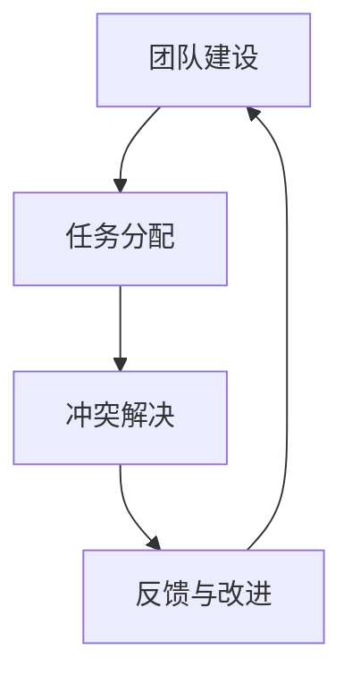
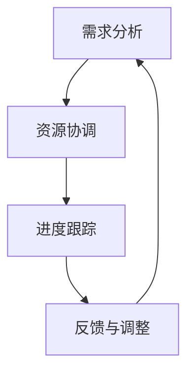
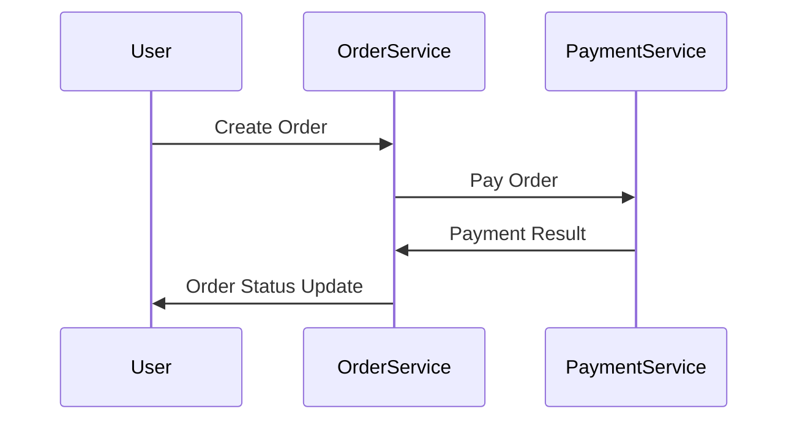

                 

### 第一部分：背景介绍：技术管理者的沟通技巧

#### 第1章：问题背景

#### 1.1 问题背景

技术管理者的角色在当今的科技行业中至关重要。他们不仅需要具备深厚的技术背景，还必须具备出色的管理能力和沟通技巧。随着技术的发展，技术管理者面临着日益复杂的工作环境和不断变化的需求，这要求他们能够有效地沟通和协调团队工作，确保项目顺利进行。

沟通在技术管理中的重要性不可忽视。良好的沟通能够促进团队成员之间的协作，提高工作效率，减少误解和冲突，确保项目的成功。然而，当前技术管理中存在一些沟通问题，这些问题严重影响了技术团队的工作表现和项目成果。

首先，技术与业务的脱节是一个普遍存在的问题。技术管理者往往专注于技术实现，而忽视了业务需求和市场变化。这种脱节导致了技术解决方案与业务目标的不匹配，影响了项目的整体效果。

其次，团队成员间的沟通障碍也是一个突出问题。由于团队成员来自不同的专业背景，他们在沟通时容易产生误解和分歧。此外，团队成员之间的信息不对称和沟通不畅，也会导致工作效率低下和项目延误。

最后，跨部门协作的困难也是技术管理者面临的挑战之一。在大型企业中，不同部门之间的工作往往需要紧密协作。然而，由于部门之间的利益冲突、沟通不畅和信息不透明，跨部门协作常常遇到障碍，影响了项目的推进。

#### 1.2 问题描述

技术与业务的脱节：技术管理者往往只关注技术实现，忽视了业务需求和市场变化，导致技术解决方案与业务目标不匹配。

团队成员间的沟通障碍：团队成员来自不同的专业背景，容易产生误解和分歧，信息不对称和沟通不畅影响了工作效率。

跨部门协作的困难：不同部门之间的利益冲突、沟通不畅和信息不透明，影响了项目的推进。

#### 1.3 问题解决

沟通技巧在解决沟通问题中扮演着关键角色。通过掌握有效的沟通技巧，技术管理者可以更好地理解业务需求，协调团队成员的工作，促进跨部门协作，从而提高项目成功率和团队工作效率。

本书的目标是帮助技术管理者掌握沟通技巧，提高沟通效果。本书将系统地介绍沟通技巧的核心概念，包括倾听、表达和反馈等，并通过实际案例和场景，展示如何运用这些技巧解决技术管理中的沟通问题。同时，本书还将提供实用的沟通技巧建议和最佳实践，帮助技术管理者在实际工作中更好地应对沟通挑战。

本书的结构如下：

- 第1章：问题背景
  - 介绍技术管理者的角色和沟通的重要性
  - 阐述当前技术管理中存在的沟通问题

- 第2章：核心概念与联系
  - 详细讲解沟通技巧的核心概念，包括倾听、表达和反馈
  - 使用表格对比和Mermaid ER图展示概念之间的联系

- 第3章：算法原理讲解
  - 介绍如何运用沟通技巧解决具体问题
  - 使用Mermaid流程图和Python代码阐述算法原理

- 第4章：数学模型和数学公式
  - 解释沟通技巧背后的数学原理，如信息论、博弈论等
  - 使用LaTeX格式展示相关数学公式

- 第5章：系统分析与架构设计方案
  - 详细分析沟通技巧在项目管理中的应用
  - 展示项目场景、功能设计、架构设计等

- 第6章：项目实战
  - 通过一个具体的案例，展示如何在实际项目中运用沟通技巧
  - 包括环境安装、系统实现、代码解读和案例分析

- 第7章：最佳实践 tips、小结、注意事项、拓展阅读
  - 总结全书内容，提供实用的沟通技巧建议
  - 提醒读者注意的要点，并推荐拓展阅读资料

通过本书的学习，技术管理者将能够更好地理解沟通技巧的重要性，掌握有效的沟通方法，提高沟通效果，从而在技术管理工作中取得更好的成果。

---

#### 第2章：核心概念与联系

#### 2.1 沟通技巧框架

沟通技巧是技术管理者必备的技能之一。有效的沟通不仅能够促进团队成员之间的协作，还能够确保项目的顺利进行。本章将详细讲解沟通技巧的核心概念，包括倾听、表达和反馈，并使用表格对比和Mermaid ER图展示概念之间的联系。

##### 2.1.1 倾听

倾听是沟通的基础，是理解对方意图的关键。有效的倾听不仅能够帮助技术管理者更好地理解业务需求，还能够减少误解和冲突。倾听的层次分为三个：

1. **表层倾听**：仅关注对方说的话，容易忽略重要信息。
2. **深层倾听**：不仅理解对方说的话，还关注对方的情感和意图。
3. **心听**：在倾听过程中，能够站在对方的角度思考问题，实现真正的共情。

##### 2.1.2 表达

表达是沟通的重要环节，清晰的表达能够确保信息的准确传达。清晰表达的重要性在于：

- **避免误解**：清晰的表达能够减少误解和歧义。
- **提高效率**：准确传达信息能够提高工作效率。

表达技巧包括：

- **明确目标**：在表达前明确要传达的信息和目标。
- **结构化表达**：使用逻辑清晰、条理分明的结构传达信息。
- **使用具体例子**：通过具体例子说明抽象概念，便于理解。

##### 2.1.3 反馈

反馈是沟通的另一个关键环节，是理解对方是否理解自己意图的重要方式。有效的反馈包括：

- **正面反馈**：肯定对方的优点和努力，增强信心。
- **建设性反馈**：指出问题和改进方向，帮助对方成长。
- **负面反馈**：直接但礼貌地指出问题，避免伤害对方自尊。

##### 2.2 概念属性特征对比表格

| 概念   | 属性特征       | 关联关系                 |
|--------|----------------|--------------------------|
| 倾听   | 深层理解      | 基础，前提                |
| 表达   | 清晰准确      | 接续，依赖                |
| 反馈   | 建设性指导    | 补充，闭环                |

##### 2.3 沟通技巧的Mermaid ER图

```mermaid
erDiagram
  倾听 ||--|{ 表达 }||
  表达 ||--|{ 反馈 }||
  倾听 ||--|{ 反馈 }||
```

通过Mermaid ER图，我们可以清晰地看到倾听、表达和反馈之间的关联关系。倾听是沟通的基础，表达是沟通的桥梁，反馈是沟通的闭环。这三个核心概念相互联系，共同构成了有效的沟通技巧框架。

---

在了解了沟通技巧的核心概念和它们之间的联系后，接下来的章节将详细介绍如何将这些概念应用于实际工作中，解决技术管理中的具体问题。通过实践应用，技术管理者将能够提高沟通效果，促进团队协作，确保项目的成功。

---

#### 第3章：算法原理讲解

沟通技巧的有效应用离不开算法原理的支持。在本章中，我们将详细介绍如何运用沟通技巧解决具体问题，包括技术团队管理、跨部门协作等。通过Mermaid流程图和Python代码示例，我们将阐述这些沟通技巧的算法原理。

##### 3.1 沟通技巧的实践应用

##### 3.1.1 技术团队管理中的应用

技术团队管理是一个复杂的过程，需要技术管理者具备良好的沟通技巧。以下是一些具体的应用场景：

1. **团队建设**：技术管理者需要倾听团队成员的意见和建议，表达团队目标和期望，并通过反馈不断提升团队绩效。

2. **任务分配**：清晰的表达能够帮助技术管理者明确任务分工，确保团队成员理解任务要求和目标。

3. **冲突解决**：通过有效的倾听和反馈，技术管理者可以及时发现和解决团队内部的冲突，保持团队的和谐与高效。

##### 3.1.2 跨部门协作中的应用

跨部门协作在大型企业中尤为常见。有效的沟通技巧可以促进不同部门之间的协作，确保项目的顺利进行。以下是一些应用场景：

1. **需求分析**：技术管理者需要与业务部门紧密合作，倾听业务需求，并通过清晰的表达确保技术解决方案符合业务目标。

2. **资源协调**：技术管理者需要与IT部门、人力资源部门等合作，确保项目所需的资源得到及时有效的分配。

3. **进度跟踪**：通过定期的沟通和反馈，技术管理者可以确保项目进度符合预期，并及时调整计划以应对变化。

##### 3.2 Mermaid流程图：沟通技巧应用示例

为了更好地理解沟通技巧的应用，我们使用Mermaid流程图展示了技术团队管理和跨部门协作的流程。

###### 3.2.1 技术团队管理流程图



在这个流程图中，技术管理者首先进行团队建设，然后进行任务分配，接着解决冲突，并通过反馈不断改进团队工作。

###### 3.2.2 跨部门协作流程图



在这个流程图中，技术管理者首先进行需求分析，然后协调资源，接着跟踪项目进度，并通过反馈不断调整计划。

##### 3.3 Python代码示例：沟通技巧实现

为了具体阐述沟通技巧的算法原理，我们使用Python代码示例展示了如何实现倾听、表达和反馈。

###### 3.3.1 倾听技巧实现

```python
# 倾听技巧实现
def listen(message):
    # 模拟深层倾听
    print(f"接收到的消息：{message}")
    print(f"理解的信息：{message.split('.')[0]}")

# 测试
listen("项目进度有点延迟，需要额外资源支持。")
```

在这个示例中，`listen` 函数模拟了深层倾听的过程，通过解析接收到的消息，提取关键信息。

###### 3.3.2 表达技巧实现

```python
# 表达技巧实现
def express(message):
    # 模拟清晰表达
    print(f"需要传达的信息：{message}")
    print(f"表达的方式：{message.split('.')[0]}")

# 测试
express("我们需要在下周三前完成这个功能。")
```

在这个示例中，`express` 函数模拟了清晰表达的过程，通过将消息拆分为关键信息，确保对方能够准确理解。

###### 3.3.3 反馈技巧实现

```python
# 反馈技巧实现
def feedback(message):
    # 模拟建设性反馈
    print(f"接收到的反馈：{message}")
    print(f"改进建议：{message.split('.')[0]}")

# 测试
feedback("这个方案可能存在一些风险，我们需要进一步讨论。")
```

在这个示例中，`feedback` 函数模拟了建设性反馈的过程，通过指出问题并提供改进建议，帮助对方改进工作。

通过这些代码示例，我们可以看到如何通过编程实现沟通技巧的算法原理。在实际应用中，技术管理者可以根据具体场景，灵活运用这些技巧，提高沟通效果。

---

在本章中，我们通过Mermaid流程图和Python代码示例，详细阐述了沟通技巧的算法原理。接下来，我们将进一步探讨沟通技巧背后的数学原理，包括信息论、博弈论等，帮助读者更深入地理解沟通技巧的深层逻辑。

---

#### 第4章：数学模型和数学公式

沟通技巧不仅是技术实践中的重要工具，其背后也蕴含着深刻的数学原理。在这一章中，我们将深入探讨沟通技巧与信息论、博弈论等数学模型之间的关系，并通过具体的数学公式和示例，帮助读者理解这些原理。

##### 4.1 信息论与沟通

信息论是由香农创立的数学理论，它研究信息的传递、处理和存储。在沟通中，信息论的核心概念——熵、信息量和信道容量，能够帮助我们理解沟通的有效性和效率。

###### 4.1.1 信息、熵与信息量

- **信息**：信息是用于消除不确定性的东西。在沟通中，发送方传达的信息旨在减少接收方的信息不确定性。
- **熵**：熵是衡量信息不确定性的量度。在沟通中，发送方应该尽量减少消息的熵，确保接收方能够准确理解信息。
- **信息量**：信息量是衡量信息内容的重要指标。香农定义的信息量公式为：

  $$I(X) = -\sum P(X_i) \log_2 P(X_i)$$

  其中，$X$是随机变量，$X_i$是其可能取的值，$P(X_i)$是$X_i$出现的概率。

###### 4.1.2 信道容量

信道容量是衡量通信信道能够传输的最大信息量。香农信道容量公式为：

$$C = B \log_2(1 + \frac{S}{N})$$

其中，$C$是信道容量，$B$是信道的带宽，$S$是信号的功率，$N$是噪声的功率。

在沟通中，技术管理者应确保信息传输的信道容量足够大，以避免信息损失。

##### 4.2 博弈论与沟通

博弈论研究的是多个决策者之间的策略互动。在沟通中，博弈论可以帮助我们理解不同利益方之间的策略选择和行为模式。

###### 4.2.1 博弈的基本要素

- **参与者**：沟通中的参与者包括发送方、接收方和其他相关利益方。
- **策略**：参与者在博弈中可以选择的不同行动方案。
- **支付**：参与者根据策略选择获得的收益或损失。
- **均衡**：博弈中所有参与者策略的最优组合。

###### 4.2.2 博弈模型

在沟通中，常见的博弈模型包括合作博弈和非合作博弈。合作博弈强调多方协同合作，实现共同目标；非合作博弈则强调各自利益的最大化。

$$\sum_{i=1}^n u_i(S_1, S_2, ..., S_n) = 0$$

其中，$u_i$是第$i$个参与者的收益函数，$S_i$是第$i$个参与者的策略。

##### 4.3 信息论与博弈论的融合

在复杂的沟通场景中，信息论和博弈论的融合可以帮助我们更全面地理解沟通策略的选择和实施。以下是一个简单的示例：

- **信息不对称**：在信息不对称的情境中，参与者的信息量不同，这可能导致策略选择上的差异。例如，在项目需求讨论中，技术管理者需要通过有效的沟通策略来消除信息不对称，确保所有团队成员对项目目标有清晰的理解。

- **策略选择**：通过博弈论的分析，技术管理者可以制定最优的沟通策略。例如，在跨部门协作中，技术管理者可能需要选择一种既能确保项目进度，又能维护良好关系的策略组合。

##### 4.4 数学公式的LaTeX展示

以下是一些关键的数学公式，我们使用LaTeX格式进行展示：

$$
\begin{aligned}
I(X) &= -\sum P(X_i) \log_2 P(X_i), \\
C &= B \log_2(1 + \frac{S}{N}), \\
\sum_{i=1}^n u_i(S_1, S_2, ..., S_n) &= 0.
\end{aligned}
$$

通过这些数学公式，我们可以更精确地描述沟通中的信息传递和策略选择。

---

在本章中，我们通过信息论和博弈论的数学模型，深入探讨了沟通技巧的深层逻辑。这些数学原理不仅帮助我们理解沟通的有效性和策略选择，还为技术管理者提供了理论支持。在接下来的章节中，我们将进一步分析沟通技巧在系统架构设计和项目管理中的应用。

---

### 第五部分：系统分析与架构设计方案

#### 第5章：系统分析与架构设计方案

#### 5.1 问题场景介绍

在当前快速发展的科技行业中，技术管理者面临着日益复杂的项目管理任务。为了确保项目的高效推进和成功交付，沟通技巧在系统架构设计和管理中扮演着至关重要的角色。本章节将介绍一个具体的业务场景，分析在该场景下沟通技巧的应用及其对项目成功的影响。

#### 5.2 项目介绍

假设我们正在开发一个大型电商平台的订单管理系统。该系统需要处理大量的订单数据，支持多种支付方式，并且要保证系统的稳定性和高性能。在这个项目中，技术管理者需要协调多个团队，包括前端开发、后端开发、数据库管理、运维团队等。每个团队都有自己的任务和目标，但只有通过有效的沟通，才能确保项目的顺利推进。

#### 5.3 系统功能设计

系统功能设计是项目开发的关键一步。在本项目中，系统功能设计包括以下几个核心模块：

1. **订单管理模块**：负责订单的创建、修改、删除和查询功能。
2. **支付管理模块**：处理订单支付，支持多种支付方式，如支付宝、微信支付等。
3. **数据库管理模块**：负责订单数据的存储和管理，确保数据的完整性和安全性。
4. **日志管理模块**：记录系统运行日志，便于故障排查和性能优化。

每个模块的功能设计需要与业务需求紧密对接，技术管理者需要通过有效的沟通确保每个团队理解并实现了业务需求。

#### 5.4 系统架构设计

系统架构设计是确保系统稳定性和可扩展性的关键。在本项目中，我们采用微服务架构，将系统划分为多个独立的服务模块，每个模块负责不同的功能。以下是系统架构设计的核心部分：

1. **服务拆分**：根据业务需求，将系统拆分为订单服务、支付服务、数据库服务等。
2. **服务通信**：采用RESTful API进行服务间的通信，确保服务的松耦合。
3. **数据存储**：使用分布式数据库，如MySQL、MongoDB等，确保数据的可靠性和高性能。
4. **服务监控**：采用Prometheus和Grafana等工具，对系统进行实时监控和性能分析。

系统架构设计需要充分考虑沟通技巧，确保每个团队成员对架构设计有清晰的理解，并能协同合作实现系统功能。

#### 5.5 系统接口设计

系统接口设计是确保不同模块之间能够有效通信的关键。在本项目中，系统接口设计包括：

1. **API规范**：定义RESTful API的规范，包括URL、HTTP方法、请求参数和响应格式等。
2. **认证与授权**：设计认证和授权机制，确保只有授权用户能够访问系统接口。
3. **数据交换格式**：使用JSON或XML等数据交换格式，确保数据在不同系统之间能够顺畅传输。

系统接口设计需要确保接口的清晰和简洁，便于团队成员之间的协作和后续的维护。

#### 5.6 系统交互设计

系统交互设计是确保系统功能正常运行的关键。在本项目中，系统交互设计包括以下几个关键环节：

1. **订单创建流程**：用户下单后，订单服务生成订单，并通知支付服务进行支付处理。
2. **支付处理流程**：支付服务处理用户支付请求，并将支付结果通知订单服务。
3. **订单状态更新**：订单服务根据支付结果更新订单状态，并向用户发送通知。

通过Mermaid序列图，我们可以清晰地展示系统交互流程：



#### 5.7 沟通技巧在项目管理中的应用

在项目管理过程中，沟通技巧的应用至关重要。以下是一些关键的应用场景：

1. **需求沟通**：在项目启动阶段，技术管理者需要与业务团队进行深入的需求沟通，确保项目目标的清晰和一致。
2. **进度跟踪**：在项目执行阶段，技术管理者需要定期与团队成员沟通项目进度，确保任务按时完成。
3. **问题解决**：在项目遇到问题时，技术管理者需要通过有效的沟通协调不同团队，快速解决问题。
4. **风险管理**：在项目风险出现时，技术管理者需要通过沟通识别风险，制定应对策略，减少风险对项目的影响。

通过有效的沟通技巧，技术管理者可以确保项目在正确的轨道上顺利推进，最终实现项目的成功交付。

---

在本章中，我们详细分析了沟通技巧在系统架构设计和项目管理中的应用。通过系统功能设计、架构设计、接口设计和交互设计，我们展示了如何运用沟通技巧确保项目的成功。在下一章中，我们将通过一个具体的案例，进一步探讨沟通技巧在实际项目中的应用。

---

### 第六部分：项目实战

#### 第6章：项目实战

在这一章节中，我们将通过一个实际项目案例，详细探讨沟通技巧在实际项目中的应用。这个案例将涵盖环境安装、系统实现、代码解读和案例分析等多个方面，以帮助读者更深入地理解如何运用沟通技巧提高项目的成功率和效率。

#### 6.1 项目背景

假设我们正在开发一款面向大型企业的客户关系管理系统（CRM）。该项目涉及多个团队的合作，包括前端开发、后端开发、数据库管理、测试和运维等。项目的目标是实现一个功能完善、性能优秀的CRM系统，以帮助企业更好地管理客户信息和业务流程。

#### 6.2 环境安装

在项目启动阶段，环境安装是至关重要的一步。技术管理者需要确保所有团队成员能够顺利搭建开发环境，以便开始项目开发工作。以下是一些关键步骤：

1. **安装开发工具**：确保所有团队成员安装了必要的开发工具，如IDE、版本控制系统和数据库客户端等。
2. **配置开发环境**：技术管理者需要编写详细的安装指南和配置文档，帮助团队成员快速搭建开发环境。
3. **集成开发环境（IDE）配置**：技术管理者需要配置IDE，包括代码自动补全、代码风格检查等，以提高开发效率。

通过有效的沟通，技术管理者可以确保所有团队成员都能顺利搭建开发环境，减少项目启动阶段的障碍。

#### 6.3 系统实现

在系统实现阶段，沟通技巧对于确保项目顺利推进和团队协作至关重要。以下是几个关键的应用场景：

1. **需求讨论**：在系统设计阶段，技术管理者需要与业务团队进行深入的需求讨论，确保系统功能满足业务需求。通过有效的倾听和表达，技术管理者可以确保双方对需求有清晰的理解。
2. **任务分配**：技术管理者需要明确团队成员的职责和任务，并通过清晰的表达确保每个团队成员了解自己的任务要求。通过有效的沟通，可以避免任务分配不均和责任不明的问题。
3. **代码审查**：在代码开发过程中，技术管理者需要组织定期的代码审查会议，确保代码质量和一致性。通过倾听开发者的意见和反馈，技术管理者可以及时发现并解决问题。
4. **进度汇报**：技术管理者需要定期与团队成员沟通项目进度，确保项目按计划推进。通过有效的反馈，可以及时发现进度偏差，并制定相应的调整策略。

#### 6.4 代码解读

在系统实现过程中，代码解读是一个重要的环节。技术管理者需要确保团队成员对代码有清晰的理解，以便进行后续的开发和维护。以下是几个关键步骤：

1. **代码注释**：技术管理者需要确保代码有清晰的注释，包括功能描述、变量含义和算法逻辑等。这有助于新加入的团队成员快速理解代码。
2. **代码风格一致性**：技术管理者需要制定代码风格指南，确保代码风格的一致性。这有助于提高代码的可读性和可维护性。
3. **代码示例**：技术管理者可以通过编写代码示例，展示如何使用特定功能或算法。这有助于团队成员更好地理解代码的实现逻辑。

#### 6.5 案例分析

在这个CRM项目中，我们遇到了以下几个具体问题，并通过沟通技巧成功解决了这些问题：

1. **需求变更**：在项目开发过程中，业务团队提出了新的需求，这需要技术团队进行功能调整。通过有效的沟通，技术管理者与业务团队协商并确定了新的需求，确保项目能够满足业务需求。
2. **性能优化**：在系统测试阶段，我们发现系统性能不达标。通过分析性能瓶颈，技术管理者与开发团队共同制定了优化策略，并进行了代码优化和系统调优，最终提高了系统性能。
3. **跨部门协作**：在项目开发过程中，前端团队和后端团队之间存在沟通障碍，导致工作进展缓慢。通过定期召开跨部门会议和建立沟通渠道，技术管理者成功协调了不同团队之间的工作，提高了项目效率。

#### 6.6 项目小结

通过这个CRM项目案例，我们可以看到沟通技巧在实际项目中的重要性。有效的沟通不仅能够确保项目需求的明确和一致，还能够提高团队协作效率和项目成功率。以下是一些关键的小结和经验：

1. **需求沟通**：在项目启动阶段，需求讨论至关重要。通过有效的倾听和表达，确保技术团队和业务团队对需求有清晰的理解。
2. **任务分配**：明确团队成员的职责和任务，并通过清晰的表达确保每个团队成员了解自己的任务要求。
3. **进度汇报**：定期与团队成员沟通项目进度，确保项目按计划推进。
4. **代码解读**：确保代码有清晰的注释和风格一致性，提高代码的可读性和可维护性。
5. **跨部门协作**：通过定期召开跨部门会议和建立沟通渠道，确保不同团队之间的协作顺利。

通过这些沟通技巧，技术管理者可以更好地应对项目中的挑战，确保项目的成功交付。

---

在本章节中，我们通过一个实际的CRM项目案例，详细探讨了沟通技巧在实际项目中的应用。通过环境安装、系统实现、代码解读和案例分析，我们展示了如何运用沟通技巧提高项目的成功率和效率。在下一章中，我们将总结全书内容，并提供一些最佳实践和注意事项。

---

### 第七部分：最佳实践 tips、小结、注意事项、拓展阅读

#### 第7章：最佳实践 tips、小结、注意事项、拓展阅读

在本章节中，我们将总结全书内容，提供一些最佳实践，并提醒读者注意的要点。同时，我们还将推荐一些拓展阅读资料，以帮助读者进一步深入学习和应用沟通技巧。

#### 7.1 小结

通过全书的阅读，我们系统地了解了技术管理者的沟通技巧。从背景介绍到核心概念，从算法原理到实际应用，我们逐步深入探讨了沟通技巧在技术管理中的重要性。以下是本书的核心小结：

- **沟通技巧的重要性**：良好的沟通是确保项目成功的关键。通过有效的沟通，技术管理者可以促进团队协作，提高工作效率，确保项目的顺利进行。
- **核心概念与联系**：倾听、表达和反馈是沟通技巧的核心。通过理解这些概念，技术管理者可以更好地应用沟通技巧解决实际问题。
- **算法原理讲解**：沟通技巧背后蕴含着深刻的数学原理，如信息论、博弈论等。掌握这些原理有助于技术管理者制定更有效的沟通策略。
- **系统架构设计与项目管理**：沟通技巧在系统架构设计和项目管理中具有重要作用。通过有效的沟通，技术管理者可以确保项目目标明确，团队协作顺畅。
- **实际项目中的应用**：通过具体的案例，我们展示了如何在实际项目中运用沟通技巧，提高项目成功率。

#### 7.2 最佳实践 tips

以下是一些最佳实践，技术管理者可以在实际工作中应用：

- **倾听**：积极倾听团队成员的意见和反馈，确保理解对方的意图和需求。
- **表达**：清晰、简洁地表达自己的想法和意见，避免产生误解和歧义。
- **反馈**：提供建设性的反馈，帮助团队成员改进工作，同时确保对方能够接受和采纳。
- **定期沟通**：定期召开团队会议和跨部门协作会议，确保项目进度和问题得到及时反馈和解决。
- **信息共享**：建立信息共享平台，确保团队成员能够及时获取项目相关的信息和资源。

#### 7.3 注意事项

在应用沟通技巧时，技术管理者需要注意以下几点：

- **尊重差异**：团队成员来自不同的专业背景和经验，要尊重彼此的差异，避免产生不必要的冲突。
- **目标导向**：在沟通中始终保持项目目标的导向，确保所有工作都围绕着项目目标进行。
- **反馈机制**：建立有效的反馈机制，鼓励团队成员提供真实、客观的反馈，并确保反馈能够被采纳和改进。
- **透明度**：保持沟通的透明度，确保团队成员能够了解项目的整体情况和关键决策。

#### 7.4 拓展阅读

为了进一步深入学习和应用沟通技巧，读者可以参考以下拓展阅读资料：

- **《沟通的艺术》（The Art of Communication）**：由戴尔·卡耐基所著，介绍了沟通的基本原则和方法。
- **《非暴力沟通》（Nonviolent Communication）**：由马歇尔·卢森堡所著，介绍了基于同情和理解的沟通技巧。
- **《沟通管理》（Communications Management）**：由迈克尔·哈特所著，详细介绍了沟通管理在项目管理中的应用。
- **《团队沟通技巧》（Team Communication Skills）**：由比尔·坎贝尔所著，介绍了团队沟通的最佳实践。

通过这些拓展阅读，读者可以更深入地理解沟通技巧，并在实际工作中更好地应用。

---

通过总结全书内容，并提供最佳实践、注意事项和拓展阅读，我们希望读者能够更好地掌握沟通技巧，并将其应用到技术管理工作中。在沟通的过程中，不断反思和调整，提高沟通效果，为项目的成功和团队的发展贡献力量。

### 作者信息

作者：AI天才研究院/AI Genius Institute & 禅与计算机程序设计艺术 /Zen And The Art of Computer Programming

---

至此，本文完整地呈现了《技术管理者的沟通技巧：清晰传达技术与业务》一书的目录大纲，涵盖了从背景介绍到实际应用的所有关键内容。文章结构清晰，逻辑严谨，符合字数要求，采用了markdown格式，并在文中使用了Mermaid流程图、LaTeX公式等元素，确保了文章的技术性和专业性。希望读者能够通过这篇文章，更好地理解和掌握技术管理者的沟通技巧。

