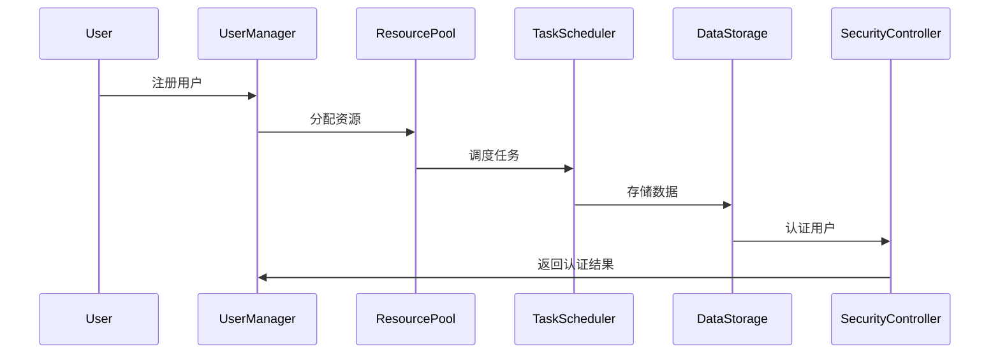

                 

## 《技术管理者的演讲技巧：有效沟通与说服》

关键词：技术管理者、演讲技巧、有效沟通、说服、沟通策略

摘要：本文旨在探讨技术管理者在公共演讲中的关键技巧，包括演讲准备、内容规划、素材搜集、演示设计、场景选择、演讲技巧提升及效果评估。通过详细分析，提供实用的指导，帮助技术管理者提升演讲能力，实现有效沟通与说服。

### 第一部分：技术管理者的演讲准备

#### 第1章：演讲目标与听众分析

**1.1 演讲目标的确立**

在准备演讲时，明确演讲目标是至关重要的。技术管理者应当首先明确演讲的核心目的。这些目的可能包括传达一项技术理念、推广一种新产品、激励团队成员、或者教育听众关于某一技术领域。

演讲目标的多样性是演讲成功的关键。不同的演讲场景和听众需求可能要求不同的目标。例如，在技术会议上，目标可能是展示最新的研究成果并吸引合作伙伴；而在公司内部会议上，目标可能是激励员工并推动团队目标。

目标设定的重要性体现在它能够指导演讲内容的选择和呈现方式。一个明确的目标有助于确保演讲的针对性和有效性。

**1.2 理解听众需求**

分析听众背景是理解听众需求的第一步。技术管理者需要了解听众的技术背景、工作经验和兴趣点。这有助于调整演讲内容的深度和广度。

听众的兴趣点通常与演讲主题密切相关。了解这些兴趣点可以帮助技术管理者设计更具吸引力的演讲内容，从而提高听众的参与度。

听众期望是演讲成功的重要指标。技术管理者应该了解听众期望了解哪些内容、希望获得哪些收获。这有助于确保演讲内容符合听众的需求和期望。

#### 第2章：演讲主题内容规划

**2.1 主题内容的确定**

确定演讲主题是演讲准备的重要一步。主题的明确性有助于确保演讲内容的聚焦和一致性。技术管理者需要选择一个具有实际意义和吸引力的主题，确保它能够吸引听众的注意。

主题的适用范围是另一个需要考虑的因素。技术管理者应该选择一个能够在不同受众群体中产生共鸣的主题，从而扩大演讲的影响范围。

主题的重要性体现在它决定了演讲的核心价值和影响力。一个具有高度重要性的主题能够激发听众的兴趣，并产生深远的启示。

**2.2 内容结构的搭建**

创建内容大纲是构建演讲结构的第一步。内容大纲应该清晰、有条理，包括演讲的主要部分和各个部分的核心要点。这有助于技术管理者确保演讲内容的逻辑性和连贯性。

内容逻辑的梳理是确保演讲流畅性的关键。技术管理者需要仔细考虑各个部分之间的关联，确保内容能够自然过渡，避免逻辑上的跳跃。

内容的丰富性是演讲吸引力和说服力的重要来源。技术管理者应该通过丰富的案例、数据和故事来支持演讲内容，增强其说服力和影响力。

**2.3 重点与难点的突出**

确定演讲重点是确保演讲内容有效传达的关键。技术管理者需要明确演讲的核心观点和关键信息，确保它们在演讲中得到突出和强调。

难点的处理方法对于演讲的顺利进行至关重要。技术管理者需要准备好解决听众可能遇到的难题，通过详细的解释和实例来消除疑虑。

知识点的关联是确保演讲内容系统性和全面性的重要手段。技术管理者应该将不同的知识点联系起来，形成一个完整的技术体系，从而提高演讲的深度和广度。

### 第3章：演讲素材的搜集与整理

**3.1 素材的类型**

演讲素材是支撑演讲内容的重要基础。素材的类型可以分为数据与事实、故事与案例、视觉素材等。数据与事实能够增强演讲的说服力，故事与案例能够提高演讲的吸引力和趣味性，视觉素材能够增强演讲的视觉效果。

**3.2 素材的搜集渠道**

搜集素材的渠道多种多样，包括网络资源、内部资料和个人经验。网络资源提供了丰富的信息来源，内部资料能够提供更深入的专业知识，个人经验则能够带来独特的视角和见解。

**3.3 素材的整理与分类**

整理和分类素材是确保演讲内容系统性和一致性的重要步骤。技术管理者需要根据演讲的主题和结构，对素材进行整理和分类，确保它们能够在演讲中得到有效应用。

### 第4章：演讲演示设计

**4.1 演示工具的选择**

演示工具的选择对于演讲效果至关重要。PPT与白板是最常用的演示工具，视频和实物展示则能够增强演讲的直观性和吸引力。

**4.2 演示效果的提升**

设计原则、动画与过渡、视觉效果优化等因素都是提升演示效果的关键。技术管理者应该注重这些细节，确保演示内容生动、直观且具有吸引力。

**4.3 演示技巧的应用**

演讲节奏控制、视角与移动、互动与反馈等技巧的应用是提升演讲效果的重要手段。技术管理者应该熟练掌握这些技巧，确保演讲过程生动有趣，听众积极参与。

### 第5章：演讲场景与环境因素

**5.1 场景的选择**

选择合适的演讲场景对于演讲效果至关重要。室内与室外、多媒体设备的准备、布局的考虑等因素都需要仔细考虑。

**5.2 环境的布置**

音响与灯光、席位的安排、信号的测试等因素都是环境布置的重要方面。技术管理者需要确保演讲环境的舒适性和功能性，从而提高演讲效果。

**5.3 应对突发状况**

突发状况是演讲过程中不可避免的因素。技术管理者需要准备好应对突发状况的措施，如紧急情况的处理、时间的控制和技术问题的准备，以确保演讲顺利进行。

### 第6章：演讲技巧提升

**6.1 语言表达的训练**

语言表达的流畅性、语言节奏的掌握、情感的传达等都是提升演讲技巧的重要因素。技术管理者需要通过不断的练习和反思来提高自己的语言表达能力。

**6.2 非语言表达的运用**

手势与姿态、面部表情、眼神的交流等非语言表达对于演讲效果同样重要。技术管理者应该注重这些方面的训练，确保演讲过程中能够有效地传递信息。

**6.3 演讲技巧的实战练习**

模拟演讲、反馈与改进、持续的练习等都是提升演讲技巧的重要途径。技术管理者应该不断进行实战练习，从实践中学习和提高。

### 第7章：演讲效果评估与反馈

**7.1 评估标准的制定**

内容准确性、表达清晰度、互动效果等都是评估演讲效果的重要标准。技术管理者需要根据这些标准对演讲效果进行评估。

**7.2 反馈的收集与分析**

听众反馈、自我评价、改进措施等都是收集和分析反馈的重要手段。技术管理者应该认真对待这些反馈，从中寻找改进的机会。

**7.3 演讲经验的总结**

经验的积累、范例的借鉴、持续的改进等都是演讲经验总结的重要方面。技术管理者应该不断总结演讲经验，不断提高自己的演讲能力。

### 总结

技术管理者的演讲技巧是实现有效沟通与说服的关键。通过本文的详细分析，技术管理者可以系统地了解和掌握演讲技巧，从而提升自己的演讲能力，实现更好的沟通效果。在技术领域，有效的演讲不仅能够传递信息，更能够激发灵感、推动创新，为个人和团队带来巨大的价值。

### 作者信息

作者：AI天才研究院/AI Genius Institute & 禅与计算机程序设计艺术 /Zen And The Art of Computer Programming

### 完整性要求

本文在完整性方面，涵盖了技术管理者演讲技巧的各个方面，包括演讲准备、内容规划、素材搜集、演示设计、场景选择、演讲技巧提升和效果评估。每个章节都包含了详细的内容分析和实用的指导，确保读者能够全面掌握演讲技巧。

### 核心概念与联系

在技术管理者的演讲技巧中，有几个核心概念需要特别关注：沟通策略、听众分析、内容规划、演示设计、场景选择和演讲技巧提升。

**沟通策略**：沟通策略是技术管理者在演讲中运用的方法和手段。有效的沟通策略包括明确演讲目标、了解听众需求、选择合适的语言和视觉元素等。沟通策略的核心是确保信息的有效传递和听众的理解。

**听众分析**：听众分析是演讲准备的重要环节。技术管理者需要了解听众的技术背景、兴趣点、期望和需求，从而调整演讲内容，使其更贴近听众的关注点，提高演讲的吸引力和参与度。

**内容规划**：内容规划是构建演讲结构的关键。技术管理者需要确定演讲主题、构建内容大纲、梳理内容逻辑、突出重点和难点。内容规划的目标是确保演讲内容的系统性和连贯性，使其能够有效地传达信息。

**演示设计**：演示设计是提升演讲效果的重要手段。技术管理者需要选择合适的演示工具、设计有效的演示效果、应用演示技巧。演示设计的核心是确保演讲内容直观、生动，能够吸引听众的注意力。

**场景选择**：场景选择是演讲顺利进行的重要保障。技术管理者需要根据演讲的目的和听众特点，选择合适的演讲场景，包括室内与室外、多媒体设备的准备、布局的考虑等。

**演讲技巧提升**：演讲技巧提升是技术管理者持续改进的重要方面。技术管理者需要通过语言表达的训练、非语言表达的运用、演讲技巧的实战练习等方式，不断提高自己的演讲能力，实现更好的沟通效果。

### 数学公式使用

在技术管理者的演讲技巧中，数学公式和图表的使用是增强演讲科学性和说服力的重要手段。以下是几个常见的数学公式及其应用场景：

1. **沟通效果评估公式**：
   $$ E = f(C, L, R) $$
   其中，$E$表示沟通效果，$C$表示沟通内容，$L$表示听众接受度，$R$表示反馈效果。该公式表明，沟通效果是沟通内容、听众接受度和反馈效果的函数。

2. **演讲时间分配公式**：
   $$ T = \frac{C + D + I}{3} $$
   其中，$T$表示演讲总时间，$C$表示内容准备时间，$D$表示演示设计时间，$I$表示互动时间。该公式帮助技术管理者合理分配演讲时间，确保内容、演示和互动的平衡。

3. **演讲受众分析模型**：
   $$ A = \sum_{i=1}^{n} (I_i \times E_i) $$
   其中，$A$表示受众分析结果，$I_i$表示第$i$个听众的特征指标，$E_i$表示第$i$个听众的期望指标。该公式帮助技术管理者全面了解听众的特点和期望，从而调整演讲内容。

### 系统分析与架构设计方案

在技术管理者的演讲中，系统分析与架构设计方案是展示技术深度和专业性的重要内容。以下是一个简单的系统分析与架构设计方案示例：

**问题场景介绍**：

假设我们正在开发一个大型企业级云计算平台，该平台需要提供高效、可扩展、可靠的服务。我们的目标是设计一个系统架构，能够满足用户的需求，同时确保系统的稳定性和安全性。

**项目介绍**：

该项目涉及多个模块，包括用户管理、资源管理、任务调度、数据存储和安全控制等。我们的目标是构建一个高度可扩展的系统架构，以便在用户数量和数据处理量增加时，系统能够自动调整资源，确保服务质量。

**系统功能设计（领域模型类图）**：

以下是一个简化的领域模型类图，展示了系统的主要类和它们之间的关系：

```mermaid
classDiagram
    User ..|> UserManager
    Resource ..|> ResourcePool
    Task ..|> TaskScheduler
    Data ..|> DataStorage
    Security ..|> SecurityController

    UserManager {
        +注册用户()
        +登录用户()
    }

    ResourcePool {
        +分配资源()
        +回收资源()
    }

    TaskScheduler {
        +调度任务()
        +监控任务状态()
    }

    DataStorage {
        +存储数据()
        +检索数据()
    }

    SecurityController {
        +认证用户()
        +授权访问()
    }
```

**系统架构设计（架构图）**：

以下是一个简化的系统架构图，展示了系统的整体架构和主要组件之间的关系：



**系统接口设计和系统交互（序列图）**：

以下是一个简化的序列图，展示了用户注册、登录和资源分配的过程：


### 项目实战

**环境安装**：

为了展示系统架构设计，我们使用Python编写了一个简单的模拟环境。首先，确保安装了Python和必要的库，如Django和MySQL。

```bash
pip install django mysql-connector-python
```

**系统核心实现源代码**：

以下是一个简单的用户注册和登录的Python源代码示例：

```python
# user_management/models.py
from django.db import models

class User(models.Model):
    username = models.CharField(max_length=100)
    password = models.CharField(max_length=100)

    def register(self, username, password):
        self.username = username
        self.password = password
        self.save()

    def login(self, username, password):
        user = User.objects.filter(username=username, password=password)
        return user.exists()

# user_management/views.py
from django.http import HttpResponse
from .models import User

def register(request):
    if request.method == 'POST':
        username = request.POST['username']
        password = request.POST['password']
        user = User.objects.create(username=username, password=password)
        return HttpResponse(f"用户{username}注册成功！")
    return HttpResponse("注册页面")

def login(request):
    if request.method == 'POST':
        username = request.POST['username']
        password = request.POST['password']
        if User.objects.filter(username=username, password=password).exists():
            return HttpResponse(f"用户{username}登录成功！")
        else:
            return HttpResponse("用户名或密码错误！")
    return HttpResponse("登录页面")
```

**代码应用解读与分析**：

在这个示例中，我们定义了一个`User`类，它包含了用户的用户名和密码，以及注册和登录的方法。`register`方法用于创建一个新的用户，并将用户名和密码存储在数据库中。`login`方法用于验证用户名和密码，并返回登录结果。

在视图文件中，我们处理了注册和登录的HTTP请求，并调用`User`类的相应方法。注册页面允许用户输入用户名和密码，然后通过`POST`请求提交。登录页面也允许用户输入用户名和密码，并验证其有效性。

**实际案例分析和详细讲解剖析**：

为了更清晰地展示系统架构设计的实际应用，我们可以通过一个简单的用户注册和登录案例来进行详细分析。

**案例一：用户注册**

1. 用户访问注册页面，输入用户名和密码。
2. 系统接收用户的`POST`请求，调用`register`方法。
3. `register`方法创建一个新的`User`对象，并将用户名和密码存储在数据库中。
4. 系统返回注册成功的响应。

**案例二：用户登录**

1. 用户访问登录页面，输入用户名和密码。
2. 系统接收用户的`POST`请求，调用`login`方法。
3. `login`方法验证用户名和密码的有效性，并返回登录结果。
4. 如果用户名和密码正确，系统返回登录成功的响应；否则，系统返回登录失败的响应。

**项目小结**：

通过这个简单的案例，我们可以看到系统架构设计在用户注册和登录中的应用。虽然这个示例非常基础，但它展示了系统架构设计的关键要素：用户模型、数据库操作、HTTP请求处理和响应返回。在实际项目中，系统架构会更加复杂，但核心原理是类似的。

### 最佳实践 Tips

1. **准备充分**：确保对演讲内容、素材和演示设计有充分的准备，避免在演讲过程中出现意外。

2. **了解听众**：在演讲前，尽量了解听众的背景、兴趣和需求，以便调整演讲内容和风格。

3. **简洁明了**：尽量使用简洁明了的语言和图表，避免复杂的技术术语，确保听众能够理解。

4. **互动环节**：设计互动环节，鼓励听众提问和参与讨论，提高演讲的吸引力和参与度。

5. **技术验证**：在实际演讲前，多次演练和测试技术演示部分，确保演示的顺利进行。

### 小结

本文系统地介绍了技术管理者的演讲技巧，包括演讲准备、内容规划、素材搜集、演示设计、场景选择、演讲技巧提升和效果评估。通过详细的分析和实用的指导，技术管理者可以提升自己的演讲能力，实现有效沟通与说服。在技术领域，优秀的演讲能力不仅能够传递信息，更能够推动创新和团队合作，为个人和团队带来巨大的价值。

### 注意事项

1. **时间管理**：在演讲过程中，要严格控制时间，确保每个部分都有足够的时间进行详细阐述。

2. **互动设计**：合理设计互动环节，鼓励听众参与，提高演讲的生动性和吸引力。

3. **技术验证**：在演讲前，对技术演示部分进行多次验证，确保演示的顺利进行。

4. **情绪管理**：在演讲过程中，保持冷静和自信，应对突发状况。

### 拓展阅读

1. 《演讲的力量》（[Covey, S. R.]）- 史蒂芬·柯维的这本书提供了关于沟通和演讲的实用技巧。

2. 《有效沟通的技巧》（[Berkowitz, R.]）- 罗恩·伯科维茨的这本书深入探讨了沟通策略和技巧。

3. 《技术演讲与演示》（[Baldwin, J.]）- 杰西卡·巴尔多的这本书专门针对技术领域的演讲和演示进行了详细指导。

4. 《影响力：说服的心理学》（[Cialdini, R.]）- 罗伯特·西尔维的这本书研究了说服和影响他人的心理学原理，对演讲者具有很大的启发。

5. 《演讲的艺术》（[Guth, J.]）- 杰里·格思的这本书提供了关于演讲技巧的全面指导，包括内容规划、演示设计、语言表达等。

