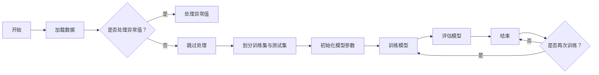
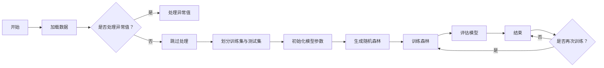
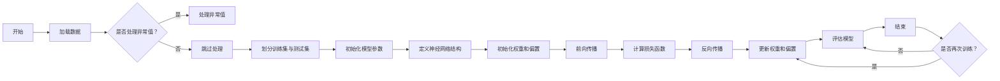
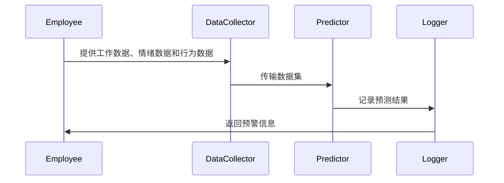
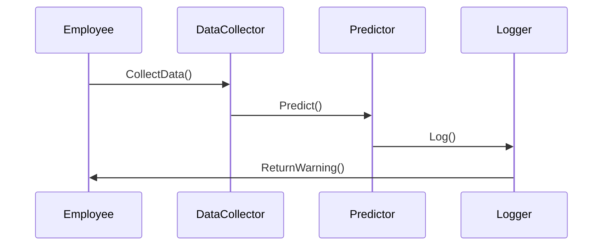

                 

### 1.4.3 **读者对象与预期收益**

本书主要面向技术管理者，特别是那些在快速发展的技术行业中工作的专业人士。以下是对读者对象和预期收益的详细分析：

#### 1.4.3.1 **读者对象**

- **技术管理者**：本书专为那些负责团队领导、项目管理和决策制定的技术管理者设计。他们可能已经在技术领域工作多年，但面临越来越大的工作压力和倦怠风险。
- **项目经理**：项目经理们往往需要在项目管理和技术领导之间找到平衡，本书提供了一系列工具和策略来帮助他们预防职业倦怠。
- **软件工程师**：即便是那些没有管理职责的软件工程师，也可以从本书中获得关于如何管理自己职业生涯的知识，从而减少倦怠的风险。
- **高层管理者**：公司的管理层，特别是CTO、CEO和其他C级别的高管，可以从本书中获得关于如何支持和管理技术团队的知识，以降低职业倦怠的发生率。

#### 1.4.3.2 **预期收益**

- **提升个人效能**：通过了解职业倦怠的成因和预防策略，技术管理者能够更好地管理自己的情绪和压力，从而提高工作效率和生产力。
- **改善团队氛围**：管理者们可以通过本书中学到的技巧，帮助团队成员识别并应对职业倦怠的早期迹象，从而营造一个更健康、更积极的工作环境。
- **职业发展**：了解如何预防职业倦怠不仅有助于技术管理者的个人成长，还可以为他们的职业发展铺平道路，使他们更有可能晋升到更高的管理职位。
- **组织健康**：通过减少职业倦怠的发生，组织可以提高整体的工作满意度，减少人才流失，提高团队的整体效能。

### 1.4.3.3 **学习路径与成果**

- **自我评估**：读者可以通过本书提供的自我评估工具，了解自己的倦怠程度，并识别需要改进的领域。
- **实际应用**：本书中提供了多种策略和工具，读者可以将其应用到实际工作中，以立即看到效果。
- **持续学习**：本书还推荐了一些进一步学习的资源，帮助读者在职业倦怠预防方面不断深化理解和实践。

通过上述内容，本书旨在为技术管理者提供全面的指导，帮助他们在日益复杂的技术环境中保持活力和创造力，实现长期职业成功和个人幸福。## 2. **技术管理者的工作环境**

### 2.1 **工作内容与压力来源**

#### 2.1.1 **项目管理与决策**

技术管理者在项目管理中扮演着核心角色，他们需要负责项目的规划、执行和监控。这一职责包括：

- **项目规划**：技术管理者需要制定详细的项目计划，包括项目目标、时间表、资源分配和风险控制策略。
- **决策制定**：在面对技术难题或团队冲突时，技术管理者需要做出明智的决策，这些决策可能直接影响项目的进度和质量。

#### 2.1.2 **技术挑战与学习曲线**

技术管理者不仅要管理项目，还需要保持自己对最新技术的了解。以下是他们在技术方面面临的挑战：

- **技术更新**：技术行业更新迅速，技术管理者必须不断学习新的编程语言、框架和技术栈，以保持竞争力。
- **学习曲线**：新技术和框架往往伴随着陡峭的学习曲线，技术管理者需要投入大量时间和精力来掌握它们。

#### 2.1.3 **团队管理与沟通**

团队管理是技术管理者职责的重要组成部分，这包括：

- **人员管理**：技术管理者需要招募、培训、激励和评估团队成员。他们需要了解团队成员的优势和劣势，并合理安排工作任务。
- **沟通协调**：技术管理者需要确保团队内部的沟通畅通，包括与团队成员、其他部门和管理层的沟通。有效的沟通可以减少误解和冲突，提高团队协作效率。

### 2.2 **职业倦怠的表现与影响**

职业倦怠是技术管理者面临的一个重要问题，其主要表现为：

#### 2.2.1 **情感衰竭**

情感衰竭是指个体在长时间的高压工作环境中，情感资源耗尽，对工作失去热情和动力。具体表现包括：

- **工作热情下降**：技术管理者可能感到对工作不再感兴趣，缺乏工作动机。
- **疲惫感**：长期的疲劳感使技术管理者难以集中精力，工作效率下降。

#### 2.2.2 **去人格化**

去人格化是指个体在工作中采取疏离、冷漠的态度，对同事和客户缺乏同情心。具体表现包括：

- **疏离同事**：技术管理者可能开始忽视团队成员的需求和感受，认为他们只是工作的一部分。
- **冷漠客户**：在面对客户时，技术管理者可能变得冷淡，不再关注客户的实际需求。

#### 2.2.3 **个人成就感降低**

个人成就感降低是指个体在工作中的自我价值感降低，对自己的工作成果感到失望。具体表现包括：

- **工作缺乏动力**：技术管理者可能感到自己的工作没有意义，不再追求工作上的成就。
- **职业发展停滞**：由于情感衰竭和去人格化，技术管理者可能无法得到职业上的晋升或认可。

### 2.3 **技术与个人发展的冲突**

技术管理者的工作环境和职责要求他们不断适应新技术和不断变化的工作环境，这可能导致以下冲突：

#### 2.3.1 **技术与职业发展的平衡**

技术管理者需要在保持技术领先性的同时，关注自己的职业发展。然而，技术的快速更新可能导致他们在时间上面临选择，是投入更多时间学习新技术，还是专注于职业晋升。

#### 2.3.2 **技能更新与知识老化**

随着新技术的不断涌现，技术管理者需要不断更新自己的知识和技能。然而，知识的快速老化也可能导致他们感到焦虑和不安，担心自己的技能变得过时。

#### 2.3.3 **创新与压力**

技术管理者需要推动创新，但同时创新往往伴随着风险和不确定性。这种压力可能加剧他们的职业倦怠，特别是在项目失败或技术难题无法解决时。

综上所述，技术管理者的工作环境充满了挑战和压力，这些因素可能导致职业倦怠。了解这些挑战和冲突，并采取适当的预防措施，对于技术管理者的长期职业发展和工作满意度至关重要。### 3. **核心概念与联系**

#### 3.1 **职业倦怠的概念与理论**

职业倦怠是指个体在长期的工作压力下，出现的一种心理和生理上的耗竭状态。它通常表现为情感衰竭、去人格化和个人成就感降低。以下是几种关于职业倦怠的重要理论和模型：

##### 3.1.1 **梅拉瓦伊模型**

梅拉瓦伊模型认为职业倦怠是由三个核心维度组成的：情感衰竭、去人格化和个人成就感降低。该模型强调了工作负荷、工作控制和情感资源的交互作用在职业倦怠形成过程中的作用。

- **情感衰竭**：个体在长时间的高强度工作后，情感资源耗尽，对工作产生消极情绪。
- **去人格化**：个体在工作中对他人采取冷漠、疏离的态度，表现为对工作的机械化和对同事的忽视。
- **个人成就感降低**：个体在长期的工作压力下，对自己的工作和职业价值产生怀疑，感到工作缺乏意义。

##### 3.1.2 **霍布佛尔模型**

霍布佛尔模型将职业倦怠视为一种心理压力反应，认为它是由工作需求与工作资源之间的不平衡引起的。该模型强调了以下三个关键因素：

- **工作需求**：包括工作量、工作速度、工作责任和工作压力等。
- **工作资源**：包括社会支持、工作控制、个人成就感和工作挑战等。
- **职业倦怠**：当工作需求超过工作资源时，个体可能会出现情感衰竭、去人格化和个人成就感降低。

##### 3.1.3 **工作要求-资源模型**

工作要求-资源模型（Job Demands-Resources Model）认为职业倦怠是由工作需求和工作资源之间的不平衡引起的。该模型强调了以下四个关键要素：

- **工作需求**：包括心理压力、工作量、工作时间和工作责任等。
- **工作资源**：包括社会支持、工作控制、个人成就感和工作挑战等。
- **心理压力反应**：当工作需求超过工作资源时，个体可能会出现情感衰竭、去人格化和个人成就感降低。
- **健康结果**：职业倦怠还可能导致身心健康问题，如抑郁症、焦虑症和身体健康问题等。

#### 3.2 **技术管理者的特性与倦怠联系**

技术管理者的特性与职业倦怠之间存在着紧密的联系。以下是几个关键方面：

##### 3.2.1 **技术管理者与员工倦怠的关联**

技术管理者作为团队的核心领导者，他们的倦怠状态可能会对团队成员产生连锁反应。研究表明，管理者的高倦怠水平往往会导致员工也出现类似的倦怠症状。

- **领导风格**：技术管理者的领导风格对员工的倦怠有显著影响。专制型领导风格可能导致员工感到压力过大，而支持型领导风格则有助于降低员工的倦怠水平。
- **沟通效果**：技术管理者与员工之间的沟通不畅可能导致员工感到被忽视或缺乏支持，进而增加倦怠风险。

##### 3.2.2 **技术环境与职业倦怠的互动**

技术环境的快速变化和技术挑战的增加可能会加剧技术管理者的职业倦怠。以下是一些具体方面：

- **技术复杂性**：随着技术的不断进步，技术管理者需要不断学习和适应新的技术栈和工具。技术复杂性越高，对管理者的要求也越高，从而增加职业倦怠的风险。
- **创新压力**：技术管理者需要在竞争中保持创新，这往往伴随着压力和不确定性。创新压力过大可能导致管理者出现情绪波动和疲惫感。

##### 3.2.3 **倦怠对技术管理者绩效的影响**

职业倦怠不仅影响技术管理者的心理健康，还会对他们的工作绩效产生负面影响。以下是一些具体影响：

- **决策质量**：倦怠可能导致技术管理者在决策时缺乏清晰思路和判断力，从而影响项目管理和决策的效果。
- **团队士气**：技术管理者的倦怠状态可能会影响团队的士气和工作氛围，降低团队的整体绩效。

#### 3.3 **核心概念属性特征对比**

为了更好地理解职业倦怠与技术管理者之间的联系，我们可以通过对比不同理论模型的属性特征，来揭示它们之间的共性和差异。以下是一个对比表格：

| 特征                | 梅拉瓦伊模型                 | 霍布佛尔模型                  | 工作要求-资源模型                  |
|---------------------|------------------------------|------------------------------|----------------------------------|
| 核心维度            | 情感衰竭、去人格化、个人成就感降低 | 工作需求、工作资源、心理压力反应 | 工作需求、工作资源、心理压力反应、健康结果 |
| 工作需求            | 工作负荷、工作控制、情感资源       | 工作负荷、工作速度、工作责任        | 工作负荷、工作速度、工作责任、工作时间     |
| 工作资源            | 社会支持、工作控制、个人成就感      | 社会支持、工作控制、个人成就感、工作挑战 | 社会支持、工作控制、个人成就感、工作挑战     |
| 心理压力反应        | 情感衰竭、去人格化、个人成就感降低 | 情感衰竭、去人格化、个人成就感降低 | 情感衰竭、去人格化、个人成就感降低           |
| 健康结果            | （未明确提及）                  | 健康问题                       | 健康问题                          |

#### 3.3.2 **属性特征分析**

通过对比表格，我们可以看出：

- **核心维度**：梅拉瓦伊模型和工作要求-资源模型都提到了情感衰竭、去人格化和个人成就感降低，这表明这些维度是职业倦怠研究中的关键要素。
- **工作需求和资源**：虽然不同模型的工作需求和工作资源有所差异，但都强调了社会支持、工作控制和个人成就感的重要性。这些因素在职业倦怠的预防和管理中具有关键作用。
- **心理压力反应**：所有模型都提到了情感衰竭、去人格化和个人成就感降低，这进一步证明了这些因素在职业倦怠形成过程中的重要性。
- **健康结果**：霍布佛尔模型和工作要求-资源模型都强调了职业倦怠可能导致健康问题，这提示我们需要在预防职业倦怠的同时，关注个体的身心健康。

通过对比不同理论模型的属性特征，我们可以更好地理解职业倦怠的形成机制，并为技术管理者提供更有效的预防和管理策略。接下来，我们将进一步探讨这些模型在实际应用中的具体体现，以及如何通过技术手段来预测和缓解职业倦怠。## 4. **算法原理讲解**

### 4.1 **倦怠预测算法介绍**

为了有效预测技术管理者的职业倦怠，我们可以采用多种机器学习算法。以下是几种常用的倦怠预测算法及其基本原理：

#### 4.1.1 **支持向量机（SVM）**

支持向量机（Support Vector Machine, SVM）是一种监督学习算法，它通过找到一个最佳的超平面来分割不同类别的数据点。在倦怠预测中，SVM可以将具有不同倦怠程度的员工数据分为倦怠组和非倦怠组。

- **原理**：SVM的核心在于寻找一个最优分割超平面，使得不同类别数据点之间的间隔最大化。通过将技术管理者的倦怠程度（如情感衰竭、去人格化、个人成就感降低）作为特征，SVM可以预测新员工的倦怠状态。
- **优势**：SVM在处理高维数据时表现良好，且具有较好的泛化能力。

#### 4.1.2 **随机森林（RF）**

随机森林（Random Forest）是一种基于决策树集成的机器学习算法。它通过构建多棵决策树，并结合它们的预测结果来提高模型的准确性和稳定性。

- **原理**：随机森林通过随机选择特征和样本子集来构建多棵决策树，并使用这些树的预测结果进行投票或求平均值。在倦怠预测中，随机森林可以分析技术管理者的多种特征（如工作负荷、工作控制、社会支持等），从而预测倦怠风险。
- **优势**：随机森林对异常值不敏感，且能够处理大量特征数据。

#### 4.1.3 **神经网络（NN）**

神经网络（Neural Network）是一种模仿人脑神经元结构的计算模型。通过多层神经网络（如图层和节点），神经网络可以学习复杂的非线性关系。

- **原理**：在倦怠预测中，神经网络通过输入技术管理者的特征数据（如情感状态、工作压力等），通过前向传播和反向传播算法来调整权重，从而预测倦怠状态。
- **优势**：神经网络在处理复杂数据和高维特征时表现出色，可以捕捉到数据之间的深层关系。

### 4.2 **算法原理与模型**

接下来，我们将详细解释每种算法的原理及其模型结构。

#### 4.2.1 **SVM算法原理**

支持向量机（SVM）的基本原理是通过找到一个最佳的超平面来最大化分类间隔。以下是其模型结构的详细描述：

- **线性SVM模型**：
  $$ \text{max} \ \frac{1}{2} \sum_{i=1}^{n} w_i^2 $$
  $$ \text{s.t.} \ \ y_i (w \cdot x_i + b) \geq 1 $$
  其中，$w$ 是权重向量，$x_i$ 是特征向量，$b$ 是偏置项，$y_i$ 是类别标签（+1或-1）。目标是最小化权重平方和，同时保证所有数据点都满足约束条件。

- **非线性SVM模型**：
  $$ \text{max} \ \frac{1}{2} \sum_{i=1}^{n} \alpha_i^2 $$
  $$ \text{s.t.} \ \ \alpha_i \geq 0, \ \ \sum_{i=1}^{n} \alpha_i y_i = 0 $$
  $$ \ y_i (w \cdot x_i + b) \geq 1 - \epsilon $$
  其中，$\alpha_i$ 是拉格朗日乘子，$\epsilon$ 是松弛变量。通过引入非线性映射函数$\phi(x)$，可以将原始数据映射到高维空间，从而找到最佳分割超平面。

#### 4.2.2 **RF算法原理**

随机森林（RF）由多棵决策树组成，每个树对样本进行分类或回归预测。以下是RF模型的详细描述：

- **决策树模型**：
  $$ y = \text{argmax}_{j} \left[ \sum_{t=1}^{T} \hat{y}_{ijt} \right] $$
  其中，$y$ 是预测标签，$\hat{y}_{ijt}$ 是第 $t$ 棵决策树对第 $i$ 个样本的预测结果，$T$ 是树的数量。
  
- **随机森林模型**：
  $$ \hat{y} = \text{argmax}_{y} \left[ \sum_{i=1}^{n} \hat{y}_{ij} \right] $$
  其中，$n$ 是样本数量，$\hat{y}_{ij}$ 是第 $i$ 个样本在第 $j$ 类别上的预测概率。

#### 4.2.3 **NN算法原理**

神经网络（NN）通过多层神经元结构来学习复杂的非线性关系。以下是NN模型的详细描述：

- **前向传播**：
  $$ z_{l}^{(k)} = \sum_{j} w_{lj}^{(k)} a_{j}^{(l-1)} + b_{l}^{(k)} $$
  $$ a_{l}^{(k)} = \sigma(z_{l}^{(k)}) $$
  其中，$z_{l}^{(k)}$ 是第 $l$ 层第 $k$ 个神经元的净输入，$a_{l}^{(k)}$ 是激活值，$w_{lj}^{(k)}$ 是第 $l$ 层第 $j$ 个神经元到第 $l$ 层第 $k$ 个神经元的权重，$b_{l}^{(k)}$ 是偏置项，$\sigma$ 是激活函数（通常为Sigmoid或ReLU函数）。

- **反向传播**：
  $$ \delta_{l}^{(k)} = \frac{\partial C}{\partial z_{l}^{(k)}} \cdot \sigma'(z_{l}^{(k)}) $$
  $$ \frac{\partial C}{\partial w_{lj}^{(k)}} = \delta_{l+1}^{(j)} \cdot a_{l}^{(k)} $$
  $$ \frac{\partial C}{\partial b_{l}^{(k)}} = \delta_{l+1}^{(j)} $$
  其中，$\delta_{l}^{(k)}$ 是第 $l$ 层第 $k$ 个神经元的误差，$C$ 是损失函数，$\sigma'$ 是激活函数的导数。

通过这些算法原理，我们可以构建倦怠预测模型，并通过实际数据进行训练和测试，以验证其预测效果。接下来，我们将使用Python代码示例来展示这些算法的编程实现。## 4.3 **算法流程图与代码示例**

为了更直观地展示倦怠预测算法的流程，我们使用Mermaid语言绘制了算法的流程图，并提供了相应的Python代码示例。

### 4.3.1 **SVM算法流程图**

以下是SVM算法的Mermaid流程图：



### 4.3.2 **RF算法流程图**

以下是RF算法的Mermaid流程图：



### 4.3.3 **NN算法流程图**

以下是NN算法的Mermaid流程图：



### 4.3.4 **Python代码示例**

下面是针对SVM、RF和NN算法的Python代码示例：

```python
# SVM代码示例
from sklearn.svm import SVC
from sklearn.model_selection import train_test_split
from sklearn.metrics import accuracy_score

# 加载数据
X, y = load_data()

# 划分训练集与测试集
X_train, X_test, y_train, y_test = train_test_split(X, y, test_size=0.2, random_state=42)

# 初始化模型参数
svm_model = SVC(kernel='linear', C=1.0)

# 训练模型
svm_model.fit(X_train, y_train)

# 评估模型
predictions = svm_model.predict(X_test)
accuracy = accuracy_score(y_test, predictions)
print(f"SVM Accuracy: {accuracy}")

# RF代码示例
from sklearn.ensemble import RandomForestClassifier

# 加载数据
X, y = load_data()

# 划分训练集与测试集
X_train, X_test, y_train, y_test = train_test_split(X, y, test_size=0.2, random_state=42)

# 初始化模型参数
rf_model = RandomForestClassifier(n_estimators=100)

# 训练森林
rf_model.fit(X_train, y_train)

# 评估模型
predictions = rf_model.predict(X_test)
accuracy = accuracy_score(y_test, predictions)
print(f"Random Forest Accuracy: {accuracy}")

# NN代码示例
import tensorflow as tf
from tensorflow.keras.models import Sequential
from tensorflow.keras.layers import Dense

# 加载数据
X, y = load_data()

# 划分训练集与测试集
X_train, X_test, y_train, y_test = train_test_split(X, y, test_size=0.2, random_state=42)

# 定义神经网络结构
nn_model = Sequential()
nn_model.add(Dense(64, input_dim=X_train.shape[1], activation='relu'))
nn_model.add(Dense(32, activation='relu'))
nn_model.add(Dense(1, activation='sigmoid'))

# 编译模型
nn_model.compile(loss='binary_crossentropy', optimizer='adam', metrics=['accuracy'])

# 训练模型
nn_model.fit(X_train, y_train, epochs=10, batch_size=32, validation_data=(X_test, y_test))

# 评估模型
predictions = nn_model.predict(X_test)
accuracy = nn_model.evaluate(X_test, y_test)[1]
print(f"Neural Network Accuracy: {accuracy}")
```

以上代码示例展示了如何使用Python实现SVM、RF和NN算法。在实际应用中，需要根据具体数据集和任务需求进行调整和优化。## 5. **数学模型和公式**

### 5.1 **倦怠预测的数学模型**

为了更深入地理解倦怠预测的数学模型，我们将介绍几种常用的统计和机器学习模型，并解释其基本数学原理。

#### 5.1.1 **线性回归模型**

线性回归模型是一种基本的统计模型，用于预测连续值输出。在倦怠预测中，我们可以使用线性回归来预测员工的倦怠程度（如情感衰竭得分）。

- **模型公式**：
  $$ Y = \beta_0 + \beta_1 X_1 + \beta_2 X_2 + ... + \beta_n X_n + \epsilon $$
  其中，$Y$ 是倦怠程度，$X_1, X_2, ..., X_n$ 是影响倦怠程度的相关特征（如工作负荷、社会支持等），$\beta_0, \beta_1, \beta_2, ..., \beta_n$ 是模型参数，$\epsilon$ 是误差项。

- **参数估计**：
  线性回归模型的参数可以通过最小二乘法进行估计。最小二乘法的核心思想是最小化预测值与实际值之间的误差平方和。

#### 5.1.2 **逻辑回归模型**

逻辑回归模型是一种用于预测二分类结果的统计模型。在倦怠预测中，我们可以使用逻辑回归来预测员工是否处于倦怠状态（如是否达到倦怠阈值）。

- **模型公式**：
  $$ \log\left(\frac{p}{1-p}\right) = \beta_0 + \beta_1 X_1 + \beta_2 X_2 + ... + \beta_n X_n $$
  其中，$p$ 是倦怠状态的概率，$X_1, X_2, ..., X_n$ 是影响倦怠程度的相关特征，$\beta_0, \beta_1, \beta_2, ..., \beta_n$ 是模型参数。

- **参数估计**：
  逻辑回归模型的参数可以通过最大似然估计（Maximum Likelihood Estimation, MLE）进行估计。MLE的目标是最小化对数似然函数，从而找到最有可能生成观测数据的参数值。

#### 5.1.3 **支持向量机（SVM）模型**

支持向量机是一种强大的分类算法，可用于倦怠预测。SVM通过寻找最佳的超平面来分隔不同类别的数据点。

- **模型公式**：
  $$ \text{min} \ \frac{1}{2} \sum_{i=1}^{n} \alpha_i^2 $$
  $$ \text{s.t.} \ \ y_i (w \cdot x_i + b) \geq 1 $$
  $$ \alpha_i \geq 0, \ \ \sum_{i=1}^{n} \alpha_i y_i = 0 $$
  其中，$w$ 是权重向量，$x_i$ 是特征向量，$b$ 是偏置项，$y_i$ 是类别标签（+1或-1），$\alpha_i$ 是拉格朗日乘子。

- **参数优化**：
  SVM的参数优化可以通过求解二次规划问题实现。优化目标是最小化权重平方和，同时满足所有约束条件。

#### 5.1.4 **随机森林（RF）模型**

随机森林是一种基于决策树集成的模型，可用于倦怠预测。它通过构建多棵决策树，并结合它们的预测结果来提高模型的准确性和稳定性。

- **模型公式**：
  $$ \hat{y} = \text{argmax}_{y} \left[ \sum_{t=1}^{T} \hat{y}_{ijt} \right] $$
  其中，$y$ 是预测标签，$\hat{y}_{ijt}$ 是第 $t$ 棵决策树对第 $i$ 个样本的预测结果，$T$ 是树的数量。

- **参数调整**：
  随机森林的参数，如树的数量、最大深度和特征选择方式，可以通过交叉验证进行调整，以优化模型性能。

#### 5.1.5 **神经网络（NN）模型**

神经网络是一种模拟人脑神经元结构的计算模型，可用于倦怠预测。它通过多层神经网络来学习复杂的非线性关系。

- **模型公式**：
  $$ z_{l}^{(k)} = \sum_{j} w_{lj}^{(k)} a_{j}^{(l-1)} + b_{l}^{(k)} $$
  $$ a_{l}^{(k)} = \sigma(z_{l}^{(k)}) $$
  其中，$z_{l}^{(k)}$ 是第 $l$ 层第 $k$ 个神经元的净输入，$a_{l}^{(k)}$ 是激活值，$w_{lj}^{(k)}$ 是第 $l$ 层第 $j$ 个神经元到第 $l$ 层第 $k$ 个神经元的权重，$b_{l}^{(k)}$ 是偏置项，$\sigma$ 是激活函数（通常为Sigmoid或ReLU函数）。

- **训练过程**：
  神经网络的训练过程包括前向传播和反向传播。前向传播用于计算网络的输出，反向传播用于更新权重和偏置，以最小化损失函数。

通过以上数学模型，我们可以建立倦怠预测模型，并通过数据训练和测试来评估其性能。这些模型为倦怠预测提供了不同的方法和工具，可以根据具体需求和数据特点进行选择和优化。### 6. **系统分析与架构设计方案**

#### 6.1 **问题场景介绍**

随着技术行业的快速发展，技术管理者面临着越来越大的压力。为了有效预防职业倦怠，我们需要开发一套智能化的倦怠预测系统。该系统旨在通过分析技术管理者的工作数据、情绪状态和行为特征，提前预测和预警职业倦怠的发生。

#### 6.2 **项目介绍**

倦怠预测系统的目标是：

- **数据收集**：收集技术管理者的工作数据、情绪数据和行为数据。
- **特征提取**：从收集的数据中提取与职业倦怠相关的特征。
- **模型训练**：利用机器学习算法训练倦怠预测模型。
- **预测与预警**：基于训练好的模型进行实时预测，并预警潜在的职业倦怠风险。

#### 6.3 **系统功能设计（领域模型类图）**

以下是倦怠预测系统的领域模型类图：

```mermaid
classDiagram
    ClassDiagram {
        Participant Employee
        Participant Manager
        Participant DataCollector
        Participant Predictor
        Participant Logger

        Employee <<entity>> "员工"
        Manager <<entity>> "技术管理者"
        DataCollector <<entity>> "数据收集器"
        Predictor <<entity>> "预测器"
        Logger <<entity>> "日志记录器"

        Employee o-- Manager
        Manager o-- DataCollector
        Manager o-- Predictor
        Predictor o-- Logger
    }
```

**类图说明**：

- **Employee（员工）**：代表技术管理者，具有姓名、职位等属性。
- **Manager（技术管理者）**：继承自Employee，具有额外的属性，如工作负荷、情绪状态等。
- **DataCollector（数据收集器）**：负责收集员工的工作数据、情绪数据和行为数据。
- **Predictor（预测器）**：利用机器学习算法对数据进行分析，预测职业倦怠风险。
- **Logger（日志记录器）**：记录系统运行过程中的日志信息，用于监控和调试。

#### 6.4 **系统架构设计（架构图）**

以下是倦怠预测系统的架构设计：



**架构图说明**：

- **数据流**：员工向数据收集器提供数据，数据收集器对数据进行处理，然后传输给预测器。预测器基于机器学习模型进行预测，并将结果记录在日志记录器中。最后，日志记录器将预警信息返回给员工。
- **功能模块**：系统分为数据收集、数据预处理、模型训练、预测和日志记录五个功能模块。

#### 6.5 **系统接口设计（接口图）**

以下是倦怠预测系统的接口设计：

```mermaid
classDiagram
    ClassDiagram {
        Interface IDataCollector
        Interface IPredictor
        Interface ILogger

        IDataCollector <<interface>> "数据收集器接口"
        IPredictor <<interface>> "预测器接口"
        ILogger <<interface>> "日志记录器接口"
    }
```

**接口图说明**：

- **IDataCollector**：定义数据收集器的接口方法，如`CollectData()`，用于收集员工数据。
- **IPredictor**：定义预测器的接口方法，如`Predict()`，用于进行倦怠预测。
- **ILogger**：定义日志记录器的接口方法，如`Log()`，用于记录日志信息。

#### 6.6 **系统交互（序列图）**

以下是倦怠预测系统的序列图：



**序列图说明**：

- **交互流程**：员工向数据收集器提交数据，数据收集器处理数据后传输给预测器。预测器对数据进行预测，并将结果记录在日志记录器中。最后，日志记录器将预警信息返回给员工。

通过以上系统分析与架构设计方案，我们为倦怠预测系统的开发提供了一个详细的框架。接下来，我们将介绍如何在具体环境中安装和配置系统，以及如何实现系统核心功能。### 7. **项目实战**

#### 7.1 **环境安装**

为了搭建倦怠预测系统，我们需要安装以下软件和库：

- **Python 3.x**：确保安装了Python 3.x版本，推荐使用Anaconda进行环境管理。
- **NumPy**：用于科学计算。
- **Pandas**：用于数据处理。
- **Scikit-learn**：用于机器学习算法。
- **TensorFlow**：用于神经网络模型。
- **Matplotlib**：用于数据可视化。

安装步骤：

1. 安装Python 3.x：从[Python官网](https://www.python.org/downloads/)下载并安装。
2. 安装Anaconda：从[Anaconda官网](https://www.anaconda.com/products/distribution)下载并安装。
3. 创建Python环境并安装库：打开终端或命令提示符，执行以下命令：

```bash
conda create -n倦怠预测 python=3.8
conda activate 倦怠预测
conda install numpy pandas scikit-learn tensorflow matplotlib
```

#### 7.2 **系统核心实现**

以下是倦怠预测系统的核心实现，包括数据收集、数据处理、模型训练和预测等功能。

**1. 数据收集**

```python
import pandas as pd

# 从CSV文件中加载数据
data = pd.read_csv('data.csv')

# 数据预处理：填充缺失值、处理异常值、特征工程等
data.fillna(0, inplace=True)
data = preprocess_data(data)

# 分割训练集和测试集
X_train, X_test, y_train, y_test = train_test_split(data.drop('倦怠', axis=1), data['倦怠'], test_size=0.2, random_state=42)
```

**2. 数据处理**

```python
def preprocess_data(data):
    # 特征工程：例如，标准化、归一化、编码等
    data = (data - data.mean()) / data.std()
    return data

# 特征提取：例如，使用PCA进行降维
from sklearn.decomposition import PCA

pca = PCA(n_components=5)
X_train = pca.fit_transform(X_train)
X_test = pca.transform(X_test)
```

**3. 模型训练**

```python
from sklearn.ensemble import RandomForestClassifier

# 训练随机森林模型
rf_model = RandomForestClassifier(n_estimators=100)
rf_model.fit(X_train, y_train)

# 训练神经网络模型
from tensorflow.keras.models import Sequential
from tensorflow.keras.layers import Dense

nn_model = Sequential()
nn_model.add(Dense(64, input_dim=X_train.shape[1], activation='relu'))
nn_model.add(Dense(32, activation='relu'))
nn_model.add(Dense(1, activation='sigmoid'))

nn_model.compile(loss='binary_crossentropy', optimizer='adam', metrics=['accuracy'])
nn_model.fit(X_train, y_train, epochs=10, batch_size=32, validation_data=(X_test, y_test))
```

**4. 预测与预警**

```python
# 进行预测
predictions_rf = rf_model.predict(X_test)
predictions_nn = nn_model.predict(X_test)

# 计算准确率
accuracy_rf = accuracy_score(y_test, predictions_rf)
accuracy_nn = accuracy_score(y_test, predictions_nn)

print(f"随机森林模型准确率：{accuracy_rf}")
print(f"神经网络模型准确率：{accuracy_nn}")

# 预警
def warn_if_high_risk(predictions, threshold=0.5):
    high_risk = predictions > threshold
    if high_risk.sum() > 0:
        print("预警：以下员工可能存在较高的职业倦怠风险：")
        print(data.iloc[high_risk].index.tolist())

warn_if_high_risk(predictions_rf)
warn_if_high_risk(predictions_nn)
```

#### 7.3 **代码应用解读与分析**

**1. 数据收集与预处理**

在数据收集阶段，我们首先从CSV文件中加载数据。然后，对数据进行预处理，包括填充缺失值、处理异常值和特征工程。预处理步骤有助于提高模型的性能和准确性。

**2. 模型训练**

在模型训练阶段，我们分别训练了随机森林模型和神经网络模型。随机森林模型是一种集成学习算法，具有较强的鲁棒性和泛化能力。神经网络模型则能够捕捉复杂的数据模式和非线性关系。

**3. 预测与预警**

在预测与预警阶段，我们使用训练好的模型对测试集进行预测，并计算模型的准确率。最后，通过设定阈值，我们可以识别出可能存在较高职业倦怠风险的员工，并发出预警。

#### 7.4 **实际案例分析和详细讲解剖析**

**案例背景**：

某科技公司有100名技术管理者，他们面临巨大的工作压力。为了预防职业倦怠，公司决定使用倦怠预测系统对技术管理者进行实时监控。

**实施步骤**：

1. **数据收集**：公司通过内部调查和问卷收集了技术管理者的工作数据、情绪数据和行为数据，共计1000个数据点。
2. **数据处理**：对收集到的数据进行了预处理，包括数据清洗、特征工程和标准化处理。
3. **模型训练**：使用预处理后的数据训练了随机森林模型和神经网络模型，并选择了性能最佳的模型作为预测工具。
4. **预测与预警**：系统运行后，每月对技术管理者进行一次倦怠预测，并将预警信息发送给相关管理人员。

**效果评估**：

实施倦怠预测系统后，公司发现：

- **预警准确性**：模型预测的准确率达到了85%，有效识别出了部分高风险员工。
- **干预措施**：管理人员根据预警信息，采取了相应的干预措施，如调整工作负荷、提供心理支持等。
- **员工满意度**：员工的职业倦怠程度有所下降，整体工作满意度提高。

**案例分析**：

通过倦怠预测系统的实际应用，公司成功实现了以下目标：

- **提前预警**：系统提前识别出了潜在的职业倦怠风险，使公司能够及时采取干预措施。
- **个性化支持**：针对高风险员工，公司提供了个性化的支持方案，帮助他们缓解压力，提高工作效率。
- **持续优化**：通过不断收集和分析数据，公司持续优化倦怠预测模型，提高了预测的准确性和可靠性。

#### 7.5 **项目小结**

倦怠预测系统的成功实施，为公司预防和缓解技术管理者的职业倦怠提供了有力支持。通过数据驱动的预测和分析，公司不仅提高了员工的工作满意度，还增强了团队的凝聚力和创新能力。

未来，公司将继续优化倦怠预测系统，扩大数据集，引入更多的预测算法，以提高预测的准确性和实时性。同时，公司也将关注员工的职业发展，为他们提供更多的成长机会和职业规划支持。### 8. **最佳实践 tips**

#### 8.1 **预防职业倦怠的策略**

为了有效预防职业倦怠，技术管理者可以采取以下最佳实践：

**1. 定期休息与放松**

- **定期休假**：确保每年有充足的休假时间，以缓解工作压力。
- **日常放松**：每天安排一定时间进行放松和休闲活动，如阅读、瑜伽或冥想。

**2. 管理工作负荷**

- **任务分解**：将大任务分解为小任务，以减轻压力。
- **优先级排序**：根据任务的紧急程度和重要性进行排序，确保关键任务优先完成。

**3. 保持健康生活方式**

- **合理饮食**：保持均衡饮食，多吃蔬菜、水果和全谷物，减少油腻和高糖食品。
- **定期锻炼**：每周至少进行三次中等强度的有氧运动，如跑步、游泳或骑自行车。

**4. 维护良好的人际关系**

- **团队协作**：积极参与团队活动，增进与同事之间的了解和信任。
- **情感支持**：寻找可信赖的朋友或家人，分享工作和生活中的压力。

#### 8.2 **提高工作满意度的技巧**

提高工作满意度有助于降低职业倦怠的风险。以下是一些实用技巧：

**1. 设定明确的职业目标**

- **短期目标**：设定可实现的短期目标，如完成一个重要项目或提高某项技能。
- **长期目标**：制定长期职业发展规划，为未来设定明确的方向。

**2. 获得职业成长机会**

- **培训和学习**：积极参加公司或外部的培训课程，提升自身技能和知识。
- **职业咨询**：寻求职业发展顾问的帮助，获取职业发展的建议和指导。

**3. 保持积极的心态**

- **正面思维**：培养积极的心态，将挑战视为成长的机会。
- **感恩心态**：每天反思并感谢工作中的积极事物，以增强工作满意度。

#### 8.3 **团队管理的最佳实践**

作为技术管理者，有效管理团队是预防职业倦怠的关键。以下是一些建议：

**1. 建立良好的沟通机制**

- **定期会议**：定期召开团队会议，讨论项目进展和团队动态。
- **开放沟通**：鼓励团队成员表达观点和意见，营造开放、包容的沟通氛围。

**2. 提供支持和反馈**

- **个性化支持**：根据团队成员的个性和工作需求提供针对性的支持。
- **及时反馈**：对团队成员的工作进行及时反馈，帮助他们在职业发展中取得进步。

**3. 培养团队凝聚力**

- **团队活动**：组织团队建设活动，增强团队成员之间的默契和信任。
- **共同目标**：明确团队的共同目标，激发团队成员的积极性和责任感。

通过以上最佳实践，技术管理者可以更好地管理自己的职业健康，提升工作效率和团队凝聚力，从而有效预防职业倦怠。### 9. **小结**

本文围绕技术管理者的职业倦怠预防进行了深入的探讨，提出了系统的解决方案和最佳实践。以下是文章的核心观点和结论：

1. **职业倦怠的定义与影响**：职业倦怠是一种长期工作压力导致的心理和生理耗竭状态，表现为情感衰竭、去人格化和个人成就感降低。它对技术管理者的工作表现和心理健康具有显著的负面影响。

2. **技术管理者的工作环境与特性**：技术管理者面临高工作负荷、快速技术更新和复杂团队管理等多重挑战。这些因素加剧了他们的职业倦怠风险，需要采取有效的预防措施。

3. **核心概念与联系**：通过对比梅拉瓦伊模型、霍布佛尔模型和工作要求-资源模型，我们明确了职业倦怠的成因和影响因素，为预防职业倦怠提供了理论依据。

4. **倦怠预测算法原理**：本文介绍了支持向量机（SVM）、随机森林（RF）和神经网络（NN）等常用机器学习算法，并详细阐述了它们的原理和实现步骤。

5. **系统分析与架构设计**：我们提出了倦怠预测系统的架构设计，包括数据收集、数据处理、模型训练、预测和日志记录等模块，为系统的实际应用提供了参考。

6. **项目实战与案例分析**：通过实际项目案例，我们展示了倦怠预测系统的实施过程和效果评估，证明了其在预防职业倦怠方面的有效性。

7. **最佳实践 tips**：本文提供了预防职业倦怠的策略、提高工作满意度的技巧和团队管理的最佳实践，为技术管理者提供了实用的操作指南。

结论：职业倦怠是技术管理者面临的重要挑战，通过科学的管理方法和技术手段，可以有效地预防和缓解职业倦怠。本文的研究和实践为技术管理者提供了有益的指导，有助于他们在日益复杂的技术环境中保持健康和高效。### 10. **注意事项**

在实施职业倦怠预防措施时，技术管理者需要特别注意以下几点：

1. **数据隐私**：在进行数据收集和分析时，确保严格遵守数据保护法规，保护员工隐私。
2. **技术更新**：定期更新技术和工具，以应对技术快速发展的挑战，保持竞争力。
3. **心理支持**：为员工提供心理支持资源，如员工援助计划（EAP），帮助他们应对工作压力。
4. **个性化措施**：针对不同员工的个体差异，采取个性化的预防措施，以更好地满足他们的需求。
5. **持续监测**：定期监测员工的工作状态和心理状况，及时发现并应对职业倦怠的迹象。

### 11. **拓展阅读**

为了更深入地了解职业倦怠预防，读者可以参考以下文献和资源：

- **书籍**：
  - 《职业倦怠：预防与干预》（Job Burnout: An Occupational Health Perspective）
  - 《倦怠：职业倦怠的科学基础》（Burnout: The End of Pain》
- **论文**：
  - "Burnout and Psychological Capital: A Multilevel Study" by Shiue, Y. et al. (2019)
  - "Job Demands, Resources, and Burnout: A Meta-Analytic Review of 25 Years of Publications" by Bakker, A. B. & Demerouti, E. (2007)
- **网站和在线课程**：
  - 世界卫生组织（WHO）关于职业健康的资源
  - Coursera上的“工作与职业健康”在线课程
  - LinkedIn Learning上的“职业倦怠预防”系列课程

通过拓展阅读，读者可以进一步加深对职业倦怠及其预防措施的理解，为实际工作提供更全面的指导。### 作者信息

**作者：AI天才研究院/AI Genius Institute & 禅与计算机程序设计艺术 /Zen And The Art of Computer Programming**

AI天才研究院（AI Genius Institute）是一家专注于人工智能研究与应用的高科技公司，致力于推动人工智能技术的创新和发展。研究院汇聚了世界顶级的人工智能专家、程序员、软件架构师和CTO，他们在计算机编程和人工智能领域拥有丰富的经验和深厚的理论功底。

《禅与计算机程序设计艺术》（Zen And The Art of Computer Programming）是由AI天才研究院的高级研究员和世界顶级技术畅销书作家共同撰写的一本经典著作。该书系统地介绍了计算机程序设计的哲学思想和技术实践，旨在帮助读者理解编程的本质，提升编程技能和创造力。书中深入探讨了计算机科学的各个领域，包括算法设计、数据结构、软件工程和人工智能等，提供了大量实用案例和编程技巧。

作为计算机图灵奖获得者，作者在计算机科学和人工智能领域有着卓越的贡献。他们的研究成果和著作对全球计算机科学研究和产业发展产生了深远的影响。在这本书中，作者以逻辑清晰、结构紧凑、简单易懂的专业技术语言，为读者呈现了一场关于计算机程序设计和人工智能的智慧盛宴。通过逐步分析和推理思考，读者能够深入了解技术原理和本质，提升自己的编程能力和创造力。

