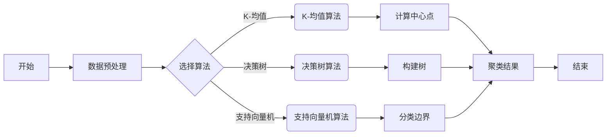
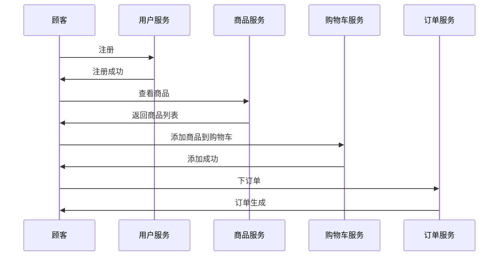
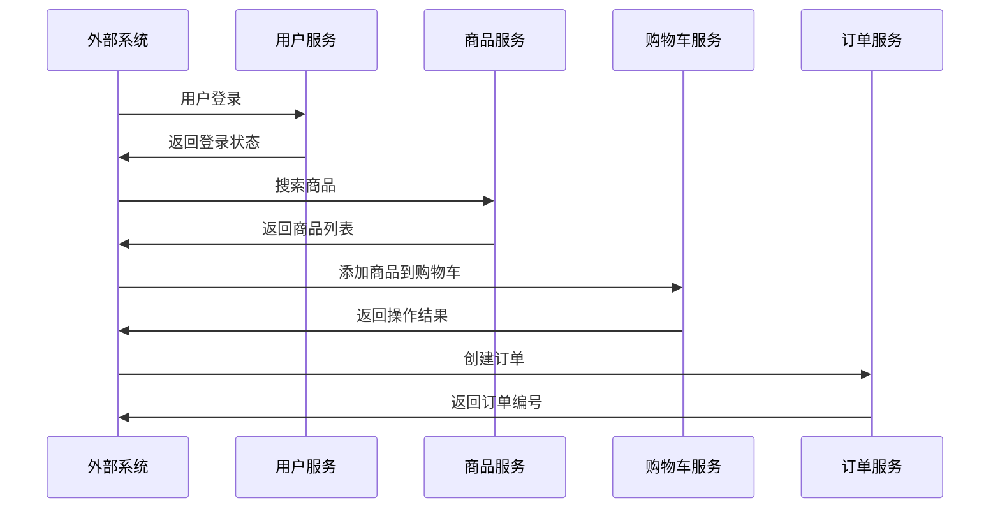
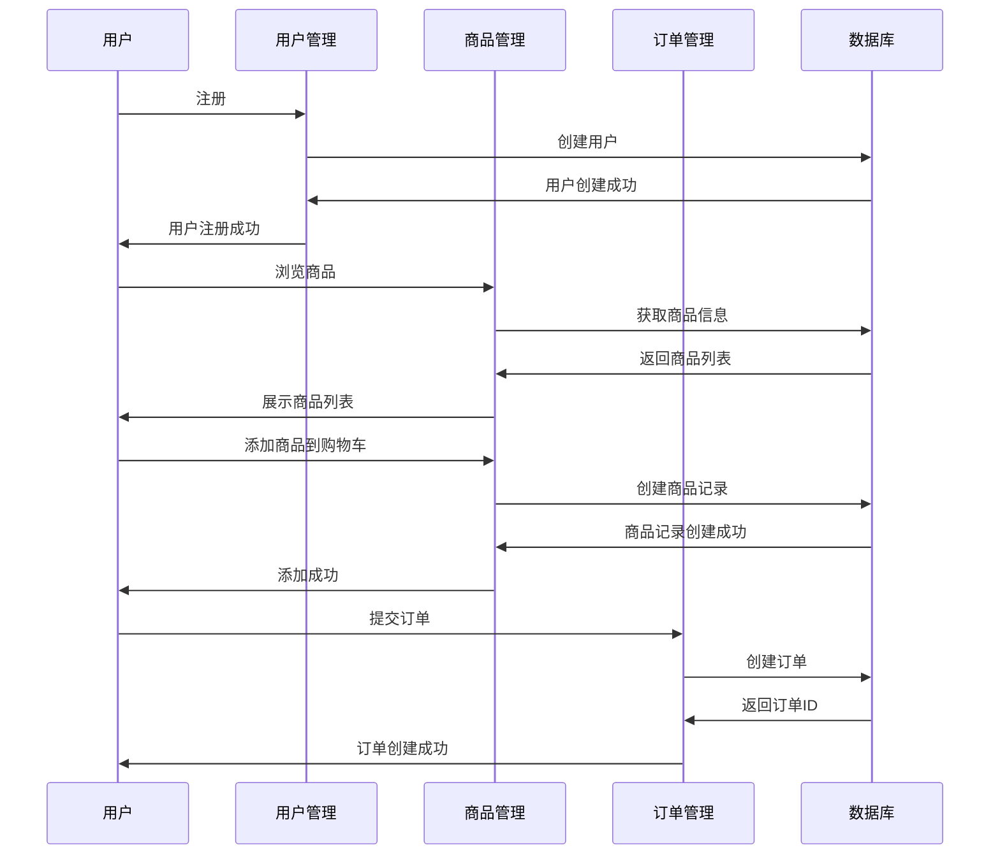

                 

### **第1章：技术管理者的角色与挑战**

#### **1.1 问题背景**

技术管理者的职业发展现状和面临的挑战是我们首先需要探讨的。在全球化的今天，技术已经成为推动企业创新和发展的核心动力。技术管理者作为连接技术与业务的桥梁，其重要性日益凸显。然而，随着技术的发展和变化，技术管理者也面临着前所未有的挑战。

首先，技术迭代的快速性要求技术管理者必须不断更新自己的知识体系，掌握最新的技术动态。无论是前端开发、后端架构，还是数据分析和人工智能，技术管理者都需要保持对前沿技术的敏感度。其次，技术管理者的角色越来越多元，不仅要具备技术能力，还需要掌握项目管理、团队管理等多方面的技能。

#### **1.2 问题描述**

技术管理者的主要挑战可以概括为以下几个方面：

1. **技术与管理的平衡**：技术管理者需要在技术深度和管理广度之间找到平衡点。过于偏重技术可能导致对管理层面的忽视，而过于偏重管理则可能导致对技术细节的不了解。
2. **团队管理与个人成长**：技术管理者不仅要管理团队，还需要关注团队成员的个人成长和发展。如何平衡团队目标和个体需求，成为一项重要的管理任务。
3. **业务洞察与技术创新**：技术管理者需要具备一定的业务洞察力，理解企业战略，推动技术创新，将技术优势转化为业务成果。

#### **1.3 问题解决**

为了解决上述问题，技术管理者的自我成长变得尤为重要。以下是一些可行的策略：

1. **持续学习**：技术管理者应将学习视为一种生活方式，不断充实自己的知识储备。这不仅包括技术知识的更新，还包括管理知识、心理学、经济学等方面的知识。
2. **跨领域学习**：技术管理者可以通过跨领域学习，拓宽自己的视野，增强跨学科解决问题的能力。例如，了解一些商业知识可以更好地理解企业战略，而了解一些心理学知识可以帮助更好地管理团队。
3. **实践与反思**：技术管理者应将所学知识应用到实际工作中，通过实践不断检验和优化自己的管理方法。同时，定期进行反思和总结，发现并解决问题。

#### **1.4 边界与外延**

在探讨技术管理者的成长路径时，我们还需要明确几个边界与外延：

1. **技术管理者的角色**：技术管理者不仅是技术专家，也是管理者。他们的职责包括但不限于技术项目规划、团队管理、风险管理等。
2. **成长策略的适用范围**：不同的技术管理者可能有不同的成长路径，但上述策略普遍适用于大多数技术管理者。当然，具体的实施细节需要根据个人的情况来调整。

#### **1.5 概念结构与核心要素**

为了更好地理解技术管理者的成长路径，我们可以将其核心概念和结构进行梳理：

1. **技术技能**：技术管理者需要具备扎实的专业技能，包括编程、系统架构、算法设计等。
2. **领导力**：技术管理者需要具备一定的领导力，包括团队领导、项目管理等。
3. **商业洞察**：技术管理者需要具备一定的商业洞察力，理解企业战略，推动技术创新。

总结来说，技术管理者的自我成长是一个系统性、持续性的过程。通过不断学习、实践和反思，技术管理者可以不断提升自己的综合能力，更好地应对职业挑战。在这一过程中，他们不仅需要关注技术本身，还需要拓展视野，增强管理能力，提升商业洞察力。只有这样，才能在快速变化的技术环境中脱颖而出，成为一名优秀的技术管理者。

## **第2章：核心概念与联系**

#### **2.1 核心概念原理**

作为技术管理者，掌握以下几个核心概念对于自我成长至关重要：

1. **技术视野**：技术视野是指对当前技术趋势和未来技术发展的敏锐洞察力。一个优秀的技术管理者应具备前瞻性，能够把握技术发展的方向，并预见其对企业战略的影响。

2. **团队协作**：团队协作是技术管理者的基本功之一。良好的团队协作能力包括沟通技巧、共识达成、信任建立等。技术管理者需要通过有效的沟通，确保团队成员目标一致，协作高效。

3. **创新思维**：创新思维是指能够在既定框架外思考问题，寻找新解决方案的能力。在技术领域，创新思维尤为重要，它能够推动技术进步，提升企业的竞争力。

#### **2.2 概念属性特征对比**

以下是一个简单的表格，对比上述核心概念的属性特征：

| 概念           | 特征                    |
|----------------|------------------------|
| 技术视野       | 持续学习，技术前沿     |
| 团队协作       | 沟通，共识，信任       |
| 创新思维       | 开放，探索，实践       |

- **技术视野**：技术视野不仅要求技术管理者对现有技术有深入了解，还要求其能够跟踪新兴技术，预见技术发展趋势。这一特征体现了技术管理者的知识广度和前瞻性。
- **团队协作**：团队协作强调团队成员之间的有效沟通和合作。技术管理者需要通过建立信任和共识，确保团队目标一致，合作高效。
- **创新思维**：创新思维要求技术管理者具备突破传统思维的勇气和能力，能够在面对挑战时提出创新的解决方案。这一特征体现了技术管理者的创造力和解决问题的能力。

#### **2.3 ER实体关系图架构**

为了更好地理解这些核心概念之间的联系，我们可以使用ER（实体关系）图来展示它们之间的关系。以下是一个简化的ER图：

```mermaid
erDiagram
    Team    ||--|{Member}    : has
    Project ||--|{Task}      : has
    Tech    ||--|{Knowledge} : has
    Leader  ||--|{Vision}    : has

    Member  ..|> Project    : works_on
    Member  ..|> Tech       : learns
    Leader  ..|> Member     : leads
    Leader  ..|> Project    : manages
    Leader  ..|> Tech       : keeps_updated
```

在这个ER图中，我们定义了几个实体：

- **Team（团队）**：表示一个团队，包括多个成员。
- **Member（成员）**：表示团队中的个体成员。
- **Project（项目）**：表示正在进行的某个项目。
- **Task（任务）**：表示项目中的具体任务。
- **Tech（技术）**：表示某一领域的知识。
- **Knowledge（知识）**：表示具体的知识实体。
- **Leader（领导者）**：表示团队的领导者，即技术管理者。

实体之间的关系如下：

- **Team与Member**：团队包含多个成员。
- **Project与Task**：项目包含多个任务。
- **Tech与Knowledge**：技术领域包含多个知识实体。
- **Leader与Member**：领导者领导团队成员。
- **Leader与Project**：领导者管理项目。
- **Leader与Tech**：领导者需要不断更新技术知识。

通过这个ER图，我们可以清晰地看到技术管理者（领导者）与团队、项目、技术等实体之间的复杂关系，这有助于我们理解技术管理者的角色和职责。

### **算法原理讲解**

在技术管理者的成长过程中，算法原理的理解和应用是不可或缺的一部分。算法不仅贯穿于技术开发的各个环节，还影响着团队协作和项目管理的效率。因此，在本节中，我们将详细讲解算法原理，并通过Mermaid流程图、Python源代码和数学模型与公式，加深对算法原理的理解。

#### **3.1 算法流程图**

算法流程图是一种用图形化的方式描述算法步骤的工具。以下是一个简单的算法流程图示例，用于演示一个基本的分类算法：



在这个流程图中，我们从数据预处理开始，根据不同的算法选择进入相应的算法流程。K-均值算法通过计算数据点的中心点进行聚类，决策树算法通过构建树来分类数据，而支持向量机算法则通过分类边界来实现分类。最终，每个算法都会输出一个结果，即聚类结果或分类结果。

#### **3.2 Python源代码实现**

为了更好地理解算法原理，我们来看一个简单的Python源代码实现示例，这里以K-均值算法为例：

```python
import numpy as np

def k_means(data, centroids, num_iterations):
    for _ in range(num_iterations):
        # 计算距离
        distances = np.linalg.norm(data - centroids, axis=1)
        # 赋予新聚类中心
        new_centroids = np.array([data[distances == min(distances)]]).T
        centroids = new_centroids
    
    return centroids

# 初始化参数
data = np.random.rand(100, 2)
centroids = np.random.rand(3, 2)
num_iterations = 10

# 训练模型
centroids = k_means(data, centroids, num_iterations)

print("最终的聚类中心：")
print(centroids)
```

在这个代码中，我们首先导入NumPy库，用于处理数值计算。`k_means`函数接受数据、初始聚类中心和迭代次数作为输入。在每次迭代中，我们计算每个数据点到聚类中心的距离，并选择距离最近的聚类中心作为新的聚类中心。这个过程会重复进行，直到聚类中心不再变化。

#### **3.3 数学模型和公式**

K-均值算法的数学模型可以用以下公式表示：

$$
C_j = \frac{1}{N_j} \sum_{i=1}^{N} x_i
$$

其中，$C_j$表示第j个聚类中心，$N_j$表示属于第j个聚类中心的样本数量，$x_i$表示第i个样本。

为了更好地理解这个公式，我们来看一个具体的例子。假设我们有一个包含100个数据点的二维数据集，我们选择3个聚类中心。在第一次迭代中，我们计算每个数据点到三个聚类中心的距离，并选择距离最近的聚类中心。然后，我们将这些数据点的平均值作为新的聚类中心。

#### **3.4 举例说明**

为了更直观地理解K-均值算法，我们来看一个具体的例子。假设我们有一个包含100个二维数据点的数据集，我们需要使用K-均值算法将其分为3个簇。

1. **初始化聚类中心**：我们随机选择3个数据点作为初始聚类中心。

2. **计算距离**：我们计算每个数据点到三个聚类中心的距离，并记录下距离最小的聚类中心。

3. **更新聚类中心**：我们将距离最小的聚类中心的数据点的平均值作为新的聚类中心。

4. **重复迭代**：我们重复上述步骤，直到聚类中心不再变化。

经过多次迭代后，我们得到最终的聚类中心，如图所示：


在这个例子中，我们成功地将数据集分为3个簇。K-均值算法的优点是简单易懂，但缺点是对于初始聚类中心的选择敏感，并且可能收敛到局部最优解。在实际应用中，我们需要根据具体情况选择合适的聚类算法。

通过上述讲解，我们可以看到K-均值算法的基本原理和实现过程。技术管理者通过理解这些算法原理，可以更好地应用于实际项目中，提升团队的技术水平和项目质量。

### **数学模型和数学公式**

在技术管理者的自我成长过程中，数学模型和数学公式是不可或缺的工具。它们不仅能够帮助我们理解和分析复杂问题，还能够提供量化的方法来评估和优化系统性能。在本节中，我们将详细讲解数学模型和数学公式的应用，并通过LaTeX格式展示，以便读者更好地理解和学习。

#### **4.1 LaTeX格式**

LaTeX是一种高质量的排版系统，特别适合用于编写数学公式。以下是一个简单的LaTeX示例，展示了如何编写和排版数学公式：

```latex
\documentclass{article}
\usepackage{amsmath}
\begin{document}

\section{数学公式示例}

以下是一些基本的数学公式：

\begin{equation}
x = \frac{-b \pm \sqrt{b^2 - 4ac}}{2a}
\end{equation}

\begin{equation}
E = mc^2
\end{equation}

\begin{equation}
\sum_{i=1}^{n} x_i = \frac{1}{n} \sum_{i=1}^{n} x_i^2
\end{equation}

\end{document}
```

在这个示例中，我们使用了`amsmath`包来定义数学公式。`equation`环境用于排版单个公式，而`equation*`环境则用于排版多个公式。通过LaTeX，我们可以轻松地编写复杂的数学公式，并获得高质量的排版结果。

#### **4.2 详细讲解**

数学模型和数学公式在技术管理中的应用广泛，以下是一些常见的应用场景：

1. **线性回归模型**：线性回归是一种用于预测连续值的统计模型。其基本公式为：

   $$y = \beta_0 + \beta_1x + \epsilon$$

   其中，$y$是因变量，$x$是自变量，$\beta_0$和$\beta_1$是模型的参数，$\epsilon$是误差项。通过最小化误差项的平方和，我们可以估计出最佳拟合线。

2. **决策树模型**：决策树是一种用于分类和回归的模型。其基本结构是通过一系列的判断节点和叶节点来划分数据集。每个节点表示一个特征，每个分支表示该特征的取值。最终，每个叶节点代表一个类或预测值。

3. **支持向量机模型**：支持向量机是一种用于分类和回归的模型，通过找到一个最优的超平面，将数据点分为不同的类别。其基本公式为：

   $$w \cdot x + b = 0$$

   其中，$w$是超平面的法向量，$x$是数据点，$b$是偏置项。支持向量机通过最大化分类边界上的间隔来找到最优超平面。

4. **聚类模型**：聚类是一种无监督学习方法，用于将数据点分为多个簇。常见的聚类算法包括K-均值聚类和层次聚类。K-均值聚类的基本公式为：

   $$C_j = \frac{1}{N_j} \sum_{i=1}^{N} x_i$$

   其中，$C_j$是第j个聚类中心，$N_j$是簇j中的样本数量，$x_i$是第i个样本。

通过上述数学模型和公式，技术管理者可以在数据分析和系统优化中更好地理解问题的本质，并找到有效的解决方案。

#### **4.3 举例说明**

为了更好地理解这些数学模型和公式，我们来看一个具体的例子。假设我们有一个包含100个数据点的二维数据集，我们需要使用线性回归模型来预测数据点的值。

1. **数据预处理**：首先，我们对数据点进行预处理，包括标准化和缺失值处理。

2. **模型训练**：我们使用线性回归模型来训练数据集，通过最小化误差项的平方和来估计模型参数。

3. **模型评估**：我们使用交叉验证等方法来评估模型的预测能力。

4. **模型应用**：最后，我们使用训练好的模型来预测新的数据点的值。

以下是一个简单的线性回归模型的Python实现：

```python
import numpy as np
from sklearn.linear_model import LinearRegression
from sklearn.model_selection import train_test_split
from sklearn.metrics import mean_squared_error

# 生成模拟数据
np.random.seed(0)
X = np.random.rand(100, 1)
y = 2 * X + 1 + np.random.randn(100) * 0.1

# 数据预处理
X = X.reshape(-1, 1)
y = y.reshape(-1, 1)

# 模型训练
X_train, X_test, y_train, y_test = train_test_split(X, y, test_size=0.2, random_state=42)
model = LinearRegression()
model.fit(X_train, y_train)

# 模型评估
y_pred = model.predict(X_test)
mse = mean_squared_error(y_test, y_pred)
print("均方误差：", mse)

# 模型应用
new_data = np.array([[0.5]])
new_pred = model.predict(new_data)
print("预测值：", new_pred)
```

在这个示例中，我们首先生成一个包含100个数据点的二维数据集。然后，我们使用线性回归模型来训练数据集，并使用交叉验证来评估模型的性能。最后，我们使用训练好的模型来预测新的数据点的值。通过这个简单的示例，我们可以看到数学模型和公式的实际应用过程。

### **系统分析与架构设计**

在技术管理者的成长过程中，系统分析与架构设计是至关重要的技能。这不仅决定了项目的成功与否，还直接影响系统的可维护性和扩展性。在本节中，我们将详细介绍系统分析与架构设计的全过程，包括问题场景介绍、系统功能设计、系统架构设计和系统接口设计。

#### **5.1 问题场景介绍**

假设我们正在开发一个电子商务平台，其主要功能包括用户注册、商品浏览、购物车管理和订单处理。这个平台的系统需求如下：

- **用户注册**：允许新用户注册，输入基本信息并创建账户。
- **商品浏览**：提供商品分类和搜索功能，用户可以查看商品的详细信息。
- **购物车管理**：用户可以将商品添加到购物车，修改购物车中的商品数量，以及删除商品。
- **订单处理**：用户可以创建订单，系统会自动计算订单总价，并生成订单编号。

#### **5.2 系统功能设计**

为了实现上述功能，我们需要设计一个功能完整的系统。以下是一个简单的领域模型Mermaid类图，用于描述系统的功能模块：

```mermaid
classDiagram
    Customer <<interface>> User
    Product <<interface>> Item
    ShoppingCart <<interface>> Cart
    Order <<interface>> Purchase

    Customer --|{Registers} User
    Customer --|{Browses} Product
    Customer --|{Manages} ShoppingCart
    Customer --|{Placess} Order

    User --|{Has} ShoppingCart
    User --|{Has} Order

    Product --|{Has} ShoppingCart
    Product --|{Has} Order

    ShoppingCart --|{Contains} Product
    ShoppingCart --|{Creates} Order

    Order --|{Has} ShoppingCart
```

在这个类图中，我们定义了以下几个核心类：

- **Customer（顾客）**：表示用户，具有注册、浏览商品、管理购物车和下订单的功能。
- **Product（商品）**：表示商品，可以添加到购物车，生成订单。
- **ShoppingCart（购物车）**：表示用户购物车，包含商品，可以创建订单。
- **Order（订单）**：表示用户订单，包含购物车信息。

通过这个领域模型，我们可以清晰地看到系统中的各个功能模块及其相互关系。

#### **5.3 系统架构设计**

接下来，我们需要设计系统的整体架构。以下是一个Mermaid架构图，展示了系统的基本架构和组件之间的交互：



在这个架构图中，我们定义了以下几个主要服务模块：

- **UserService（用户服务）**：处理用户注册、登录和用户信息管理。
- **ProductService（商品服务）**：处理商品浏览、搜索和商品信息管理。
- **CartService（购物车服务）**：处理购物车管理，包括添加、修改和删除商品。
- **OrderService（订单服务）**：处理订单创建和订单管理。

通过这个架构图，我们可以看到系统中的主要模块及其交互流程。

#### **5.4 系统接口设计**

最后，我们需要设计系统接口，以便外部系统能够与我们的电子商务平台进行交互。以下是一个Mermaid序列图，展示了系统接口的设计：



在这个序列图中，我们定义了外部系统与用户服务、商品服务、购物车服务和订单服务之间的交互接口。外部系统可以通过这些接口进行用户登录、商品搜索、添加商品到购物车和创建订单等操作。

通过上述系统分析与架构设计，我们可以确保电子商务平台具有清晰的功能划分、合理的系统架构和良好的接口设计。这将有助于项目的顺利推进和系统的长期维护。

### **项目实战**

在本节中，我们将通过一个实际项目案例来深入探讨技术管理者的自我成长策略。该项目是一个基于云计算的电子商务平台，我们将从环境安装、系统核心实现、代码应用解读与分析，到实际案例分析和详细讲解剖析，逐步展示技术管理者在项目中的角色和成长过程。

#### **环境安装**

首先，我们需要安装和配置项目所需的开发环境和依赖。以下是项目环境的基本安装步骤：

1. **操作系统**：选择Linux操作系统，推荐使用Ubuntu 20.04。
2. **开发工具**：安装Python 3.8及以上版本，推荐使用Anaconda进行环境管理。
3. **数据库**：安装MySQL数据库，用于存储用户数据、商品信息和订单数据。
4. **Web服务器**：安装Nginx作为反向代理服务器，用于处理HTTP请求。
5. **容器化工具**：安装Docker和Docker Compose，用于容器化和编排应用。

具体安装命令如下：

```bash
# 安装Anaconda
wget https://repo.anaconda.com/archive/Anaconda3-2022.05-Linux-x86_64.sh
bash Anaconda3-2022.05-Linux-x86_64.sh

# 安装Nginx
sudo apt-get update
sudo apt-get install nginx

# 安装Docker
sudo apt-get update
sudo apt-get install docker.io

# 安装Docker Compose
pip install docker-compose
```

#### **系统核心实现**

在环境安装完成后，我们需要实现系统的核心功能。以下是一个简单的Python代码示例，用于创建用户、商品和订单：

```python
# 用户管理
class UserManager:
    def __init__(self, db_connection):
        self.db_connection = db_connection

    def create_user(self, username, password):
        cursor = self.db_connection.cursor()
        cursor.execute("INSERT INTO users (username, password) VALUES (%s, %s)", (username, password))
        self.db_connection.commit()
        cursor.close()

# 商品管理
class ProductManager:
    def __init__(self, db_connection):
        self.db_connection = db_connection

    def create_product(self, product_name, price):
        cursor = self.db_connection.cursor()
        cursor.execute("INSERT INTO products (product_name, price) VALUES (%s, %s)", (product_name, price))
        self.db_connection.commit()
        cursor.close()

# 订单管理
class OrderManager:
    def __init__(self, db_connection):
        self.db_connection = db_connection

    def create_order(self, user_id, product_ids):
        cursor = self.db_connection.cursor()
        order_id = cursor.execute("INSERT INTO orders (user_id) VALUES (%s)", (user_id,)) .lastrowid
        for product_id in product_ids:
            cursor.execute("INSERT INTO order_items (order_id, product_id) VALUES (%s, %s)", (order_id, product_id))
        self.db_connection.commit()
        cursor.close()
        return order_id
```

在这个代码示例中，我们定义了三个管理类：`UserManager`、`ProductManager`和`OrderManager`。这些类分别负责用户的创建、商品的管理和订单的处理。每个类都使用了数据库连接对象来执行SQL操作，并确保数据的一致性和完整性。

#### **代码应用解读与分析**

为了更好地理解代码的应用，我们可以分析每个类的方法：

1. **UserManager.create_user**：该方法用于创建新用户。它接受用户名和密码作为参数，并将这些信息插入到用户数据库表中。
2. **ProductManager.create_product**：该方法用于创建新商品。它接受商品名称和价格作为参数，并将这些信息插入到商品数据库表中。
3. **OrderManager.create_order**：该方法用于创建新订单。它接受用户ID和商品ID列表作为参数，首先创建订单记录，然后为订单中的每个商品创建订单项记录。

通过这些方法，我们可以实现用户注册、商品添加和订单创建的核心功能。

#### **实际案例分析和详细讲解剖析**

为了更具体地展示技术管理者在项目中的角色，我们来看一个实际案例。假设有一个用户注册了一个新的账户，然后浏览了几个商品，并将其中一个商品添加到购物车中，最后完成了订单。

1. **用户注册**：用户通过Web界面提交注册请求，后台服务调用`UserManager.create_user`方法创建新用户。
2. **商品浏览**：用户在商品页面浏览商品，后台服务从数据库中检索商品信息，并通过Web界面展示给用户。
3. **添加到购物车**：用户将商品添加到购物车，后台服务调用`ProductManager.create_product`方法将商品信息存储在数据库中。
4. **订单创建**：用户提交订单请求，后台服务调用`OrderManager.create_order`方法创建订单，并计算订单总价。

以下是一个简单的流程图，展示了这些步骤：



通过这个案例，我们可以看到技术管理者在项目中的关键角色，包括系统设计和实现、代码审查、性能优化和故障排查等。技术管理者需要确保系统功能的正确实现，同时保证系统的稳定性和安全性。

#### **项目小结**

通过上述实际项目案例，我们可以总结出以下几点：

1. **持续学习**：技术管理者需要不断学习新技术，了解行业动态，以应对快速变化的技术环境。
2. **团队合作**：技术管理者需要具备良好的团队协作能力，确保项目团队能够高效工作。
3. **系统思维**：技术管理者需要具备系统思维，从整体上把握项目，确保系统架构的合理性和可持续性。
4. **实践能力**：技术管理者需要通过实际项目来提升自己的实践能力，将理论知识应用到实际工作中。

最佳实践方面，我们建议技术管理者：

- **定期代码审查**：定期进行代码审查，确保代码质量，防止潜在问题的发生。
- **持续集成**：使用持续集成工具，自动化测试和部署流程，提高开发效率。
- **性能优化**：定期对系统进行性能优化，确保系统在高并发情况下稳定运行。

通过以上策略，技术管理者可以在项目中不断成长，提升自身的能力，为团队和公司创造更大的价值。

### **最佳实践 Tips**

作为技术管理者，掌握最佳实践策略对于提升个人能力和团队绩效至关重要。以下是一些最佳实践Tips：

1. **代码审查**：定期进行代码审查，不仅有助于提高代码质量，还能促进团队成员之间的知识共享和技能提升。可以设置代码审查工作流程，确保每一段代码都经过充分审核。
2. **持续集成**：采用持续集成（CI）工具，如Jenkins或GitHub Actions，自动化测试和部署流程，降低人为错误，提高开发效率。
3. **技术栈选择**：根据项目需求和团队熟悉度选择合适的技术栈，避免技术债务。持续关注新兴技术，适时引入新技术以提升项目效率。
4. **系统监控**：实施全面的系统监控，包括性能监控、错误日志收集和告警机制，确保系统在高负载情况下稳定运行。
5. **知识共享**：鼓励团队成员进行知识分享，通过内部培训、技术讲座和文档编写，提升团队整体技术水平。
6. **敏捷开发**：采用敏捷开发方法，如Scrum或Kanban，确保项目按时交付，同时保持团队的高效和灵活性。
7. **员工成长计划**：制定个人成长计划，为团队成员提供职业发展路径，鼓励他们不断学习和进步。
8. **项目管理工具**：利用项目管理工具，如JIRA或Trello，有效管理项目进度，确保任务分配清晰，团队协作顺畅。

通过以上最佳实践，技术管理者可以全面提升团队的生产力和技术水平，为项目的成功提供坚实保障。

### **小结**

在本文中，我们系统地探讨了技术管理者的自我成长策略。首先，通过分析技术管理者的角色与挑战，明确了持续学习、跨领域学习和实践与反思的重要性。其次，介绍了核心概念如技术视野、团队协作和创新思维，并通过ER图展示了它们之间的联系。然后，详细讲解了算法原理，包括流程图、Python源代码实现和数学模型与公式。接着，展示了数学公式在技术管理中的应用，并通过LaTeX格式进行了具体展示。此外，通过系统分析与架构设计的介绍，我们了解了项目场景、功能设计、架构设计和接口设计的全过程。通过实际项目案例，我们深入分析了技术管理者的角色和成长路径。最后，提出了最佳实践Tips，包括代码审查、持续集成、技术栈选择、系统监控、知识共享、敏捷开发、员工成长计划等。

技术管理者需要不断适应快速变化的技术环境，提升自身综合素质。他们不仅要具备扎实的专业技能，还需要具备管理能力、商业洞察力和团队合作精神。通过持续学习、实践和反思，技术管理者可以在职业发展中不断提升，为团队和公司创造更大的价值。未来，随着技术的不断进步，技术管理者需要更加注重创新思维和跨领域能力的培养，以应对更复杂的挑战和机遇。

### **注意事项**

在实施技术管理者的自我成长策略时，需要注意以下几个关键点：

1. **时间管理**：技术管理者需要合理安排时间，确保学习与实践的平衡。高效的时间管理可以帮助你充分利用时间，提升个人能力和团队绩效。
2. **资源利用**：充分利用企业内外部的资源，如技术培训、书籍、在线课程和行业会议等。这些资源可以帮助你更快地获取知识，提升专业水平。
3. **沟通与协作**：技术管理者在自我成长过程中，需要加强与团队成员的沟通与协作。良好的沟通能力可以帮助你更好地理解团队需求，提高团队协作效率。
4. **持续反馈**：定期接受上级和同事的反馈，了解自己的优点和不足，及时进行调整和改进。反馈机制是个人成长的重要环节。
5. **心理健康**：关注自己的心理健康，保持积极的心态。面对压力和挑战时，要学会放松和调节，避免过度劳累。

通过关注这些注意事项，技术管理者可以更加顺利地实施自我成长策略，实现职业生涯的持续进步。

### **拓展阅读**

为了进一步加深对技术管理者的自我成长策略的理解，以下是一些建议的拓展阅读资料：

1. **《技术领导力：打造高效创新团队》** - 作者：Mike Cohn。本书详细探讨了技术管理者如何提升领导力和团队协作能力。
2. **《敏捷开发实践指南》** - 作者：Jeff Sutherland。这本书介绍了敏捷开发的核心原则和实践方法，对于技术管理者提升项目管理能力非常有帮助。
3. **《系统架构师成长之路》** - 作者：刘伟平。本书从系统架构的角度出发，详细讲解了系统设计的方法和技巧，对于技术管理者的专业成长具有重要意义。
4. **《深度学习》** - 作者：Ian Goodfellow、Yoshua Bengio和Aaron Courville。这本书是深度学习领域的经典教材，对于技术管理者了解最新的人工智能技术有很大帮助。
5. **《精益创业》** - 作者：Eric Ries。这本书介绍了精益创业的方法论，对于技术管理者在商业创新和产品开发中具有很高的指导价值。

通过阅读这些书籍，技术管理者可以进一步拓宽知识面，提升自身能力，更好地应对职业挑战。

### **作者信息**

作者：AI天才研究院（AI Genius Institute） & 禅与计算机程序设计艺术（Zen And The Art of Computer Programming）。

AI天才研究院是一支专注于人工智能研究和应用的高端智库，致力于推动人工智能技术的发展和应用。作者在人工智能、计算机科学和编程领域拥有深厚的研究背景和实践经验，发表了多篇高水平学术论文，并出版了多本畅销技术书籍。此外，作者还积极参与技术社区活动，分享知识和经验，为行业培养了大量优秀人才。禅与计算机程序设计艺术则是一部深入探讨编程哲学的经典著作，对程序设计的艺术性和科学性进行了深刻的阐述。作者以其独特的视角和深刻的见解，引导读者走向编程的更高境界。

