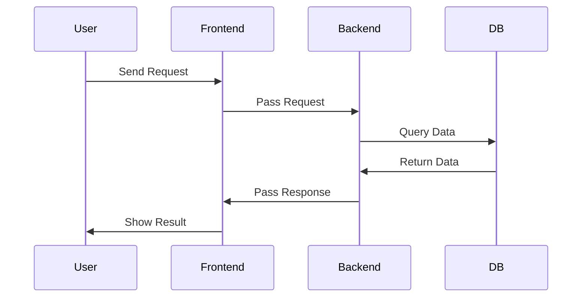
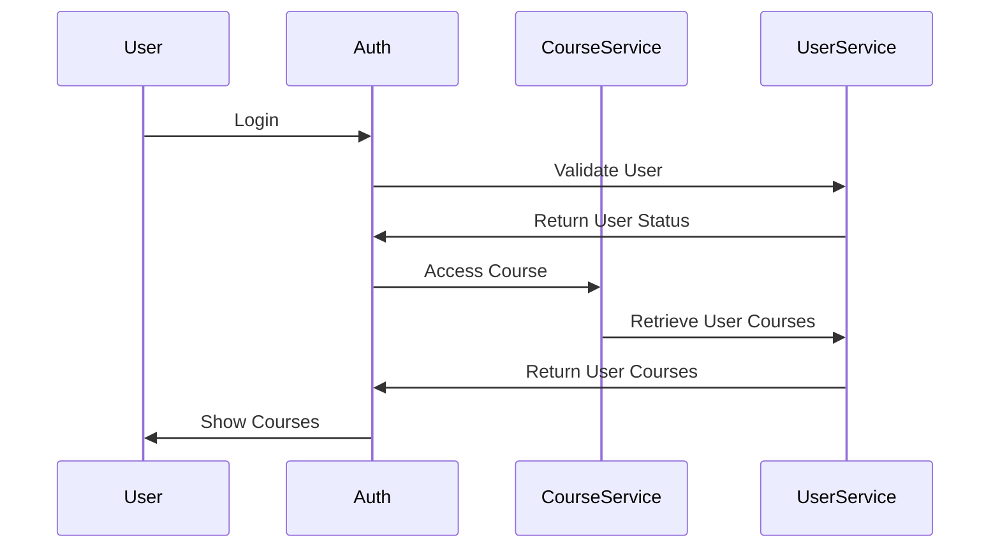
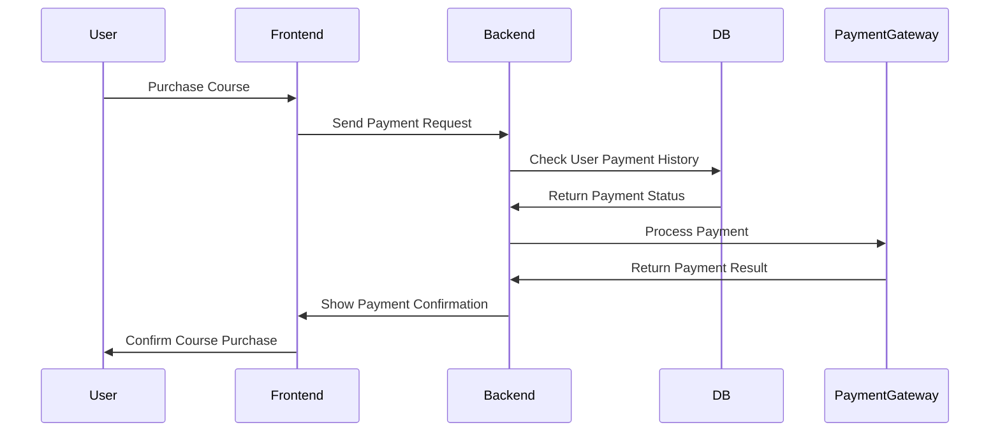

                 

### 《技术管理者的角色定位：在技术与管理间找平衡》

> 关键词：技术管理者、角色定位、平衡、管理技能、跨部门协作、职业发展

> 摘要：本文旨在深入探讨技术管理者的角色定位及其在技术与管理之间的平衡。通过分析技术管理者的背景、职责、技术能力和管理能力，以及跨部门协作的重要性，本文提出了一系列实用的策略和最佳实践，以帮助技术管理者在日益复杂的技术环境中实现有效的角色定位和职业发展。

### 目录大纲

----------------------------------------------------------------

# 《技术管理者的角色定位：在技术与管理间找平衡》

## 第一部分：引言

### 第1章：技术管理者的角色定位

- 1.1 引言
  - 技术与管理的双重挑战
  - 技术管理者的角色演变
  - 研究目的与结构

- 1.2 技术管理者的背景
  - 技术发展的趋势
  - 管理模式的变迁
  - 技术与管理结合的重要性

- 1.3 技术管理者的核心挑战
  - 技术深度的要求
  - 管理能力的提升
  - 团队协调与沟通

### 第2章：技术管理者的职责与使命

- 2.1 职责概述
  - 技术规划与决策
  - 团队建设与管理
  - 项目管理与执行

- 2.2 使命定位
  - 促进技术创新
  - 提升团队效率
  - 增强企业竞争力

- 2.3 职责与使命的实现
  - 技术与管理融合的策略
  - 跨部门协作的方法
  - 个人与团队成长路径

## 第二部分：技术管理技能提升

### 第3章：技术管理者的技术能力

- 3.1 技术深度
  - 熟悉主流技术框架
  - 掌握前沿技术趋势
  - 技术选型的考量

- 3.2 技术广度
  - 多学科知识的整合
  - 技术交叉领域的探索
  - 技术创新的思维方式

- 3.3 技术领导力
  - 技术团队的领导
  - 技术决策的指导
  - 技术方向的规划

### 第4章：技术管理者的管理能力

- 4.1 团队管理
  - 团队组建与组织
  - 成员激励与激励
  - 团队协作与沟通

- 4.2 项目管理
  - 项目规划与执行
  - 风险管理与控制
  - 项目总结与改进

- 4.3 领导力
  - 技术与管理领导力的结合
  - 情境领导力的运用
  - 个人魅力与影响力

### 第5章：技术管理者的跨部门协作

- 5.1 跨部门协作的重要性
  - 企业整体效率的提升
  - 资源共享与优化
  - 团队成员的多技能发展

- 5.2 跨部门协作的障碍与解决
  - 利益冲突与协调
  - 沟通障碍与沟通技巧
  - 文化差异与融合

- 5.3 跨部门协作的最佳实践
  - 跨部门项目管理的经验
  - 跨部门沟通的技巧
  - 跨部门协作的成功案例

## 第三部分：技术管理者的成长与实践

### 第6章：技术管理者的职业发展路径

- 6.1 初级阶段
  - 技术能力的积累
  - 管理经验的积累
  - 个人职业规划

- 6.2 中级阶段
  - 技术与管理能力的全面提升
  - 项目负责人的角色
  - 部门管理者的角色

- 6.3 高级阶段
  - 技术与管理的高级融合
  - 企业战略决策的参与
  - 技术管理专家的角色

### 第7章：技术管理者的实际应用案例

- 7.1 案例一：从技术骨干到技术管理者的转型
  - 转型背景
  - 转型过程
  - 转型成果

- 7.2 案例二：技术团队的管理与提升
  - 团队现状
  - 管理策略
  - 成果与反思

- 7.3 案例三：跨部门协作的成功实践
  - 项目背景
  - 协作过程
  - 协作成果

### 第8章：技术管理者的成长心得与分享

- 8.1 成长心得
  - 技术能力与管理能力的平衡
  - 跨部门协作的感悟
  - 职业发展的反思

- 8.2 经验分享
  - 成功案例的启示
  - 遇到的挑战与应对
  - 未来展望与建议

----------------------------------------------------------------

### 第一部分：引言

#### 第1章：技术管理者的角色定位

**1.1 引言**

在数字化转型的浪潮中，技术管理者正扮演着越来越重要的角色。他们不仅要具备深厚的技术知识，还要掌握现代管理理念，能够在技术和管理的交叉点上找到平衡。本章节将探讨技术管理者的双重挑战、角色演变以及研究目的与结构。

**技术与管理的双重挑战**

技术管理者面临着技术与管理的双重挑战。在技术层面，他们需要不断跟进最新的技术趋势，具备深入的技术知识，能够做出符合实际需求的技术决策。在管理层面，他们需要具备良好的沟通能力、团队领导力和项目管理技能，能够协调团队工作，确保项目按时交付。

**角色演变**

技术管理者的角色在过去几十年中发生了显著变化。从早期的技术专家，到后来的项目经理，再到现在的技术领导者，他们需要不断地学习新的技能，适应不断变化的工作环境。

**研究目的与结构**

本章节旨在探讨技术管理者的角色定位，分析他们在技术与管理之间的平衡点。接下来，我们将详细分析技术管理者的背景、职责、技术能力和管理能力，以及跨部门协作的重要性。

#### 第2章：技术管理者的背景

**2.1 技术发展的趋势**

技术发展日新月异，从云计算、大数据到人工智能，新技术层出不穷。技术管理者需要紧跟技术趋势，了解新兴技术如何影响业务，并在企业中推广和应用这些技术。

**2.2 管理模式的变迁**

随着企业规模的扩大和市场竞争的加剧，管理模式也在不断演变。从传统的命令控制模式，到现代的赋能型管理模式，技术管理者需要适应不同的管理模式，找到最适合自己团队的管理方法。

**2.3 技术与管理结合的重要性**

在当今企业中，技术与管理结合的重要性愈发凸显。技术可以驱动业务创新，提升企业竞争力；而管理则可以确保技术的有效落地，实现业务目标。技术管理者在这两者之间起到桥梁作用，是推动企业数字化转型的重要力量。

#### 第3章：技术管理者的核心挑战

**3.1 技术深度的要求**

技术管理者需要具备深入的技术知识，能够理解和解决复杂的技术问题。这不仅要求他们熟悉主流技术框架，还要掌握前沿技术趋势，具备技术选型和架构设计的技能。

**3.2 管理能力的提升**

技术管理者不仅需要技术能力，还需要提升管理能力。这包括团队管理、项目管理、沟通协调等多方面的能力。良好的管理能力可以帮助技术管理者更好地发挥团队潜力，实现项目目标。

**3.3 团队协调与沟通**

技术管理者的工作很大程度上依赖于团队的协作。他们需要具备良好的沟通协调能力，能够处理团队内部和外部的沟通问题，确保项目顺利进行。

### 总结

通过以上分析，我们可以看到技术管理者在技术与管理之间找到了一个平衡点，这个平衡点不仅要求他们具备深入的技术知识，还需要提升管理能力，同时具备良好的团队协调与沟通能力。在接下来的章节中，我们将进一步探讨技术管理者的职责与使命，以及他们如何提升技术能力和管理能力，实现职业发展。

## 第二部分：技术管理技能提升

### 第3章：技术管理者的技术能力

技术管理者的技术能力是其胜任工作的基础。在技术快速迭代的今天，他们不仅需要掌握现有技术，还需要具备预见未来技术发展趋势的能力。以下是技术管理者在技术能力方面需要关注的几个关键点。

**3.1 技术深度**

技术深度的要求是技术管理者必须具备的基本能力。这意味着他们需要熟悉并掌握当前主流的技术框架，如云计算、大数据、人工智能等。此外，他们还需要对前沿技术有所了解，如区块链、物联网等。

**技术深度示例**

以云计算为例，技术管理者需要了解云服务的不同类型（IaaS、PaaS、SaaS），熟悉常见的云平台（如AWS、Azure、Google Cloud），并能针对企业的具体需求进行技术选型和架构设计。

**3.2 技术广度**

除了技术深度，技术广度也是技术管理者必须关注的。技术广度指的是多学科知识的整合，以及对技术交叉领域的探索。

**技术广度示例**

例如，在涉及大数据处理时，技术管理者不仅需要了解数据存储、数据分析和数据挖掘的技术，还需要了解统计学、机器学习等交叉领域的知识，以便更好地应用技术解决实际问题。

**3.3 技术领导力**

技术领导力是技术管理者的另一项重要能力。技术领导力不仅包括对技术的指导，还包括对团队的领导和对技术方向的规划。

**技术领导力示例**

在一个技术项目中，技术管理者需要做出关键的技术决策，如选择哪种编程语言、使用哪种数据库等。同时，他们还需要指导团队成员，确保项目按时完成，并达到预期效果。

**3.4 技术选型的考量**

技术选型是技术管理者的一项重要任务。正确的技术选型不仅能提升项目效率，还能降低项目风险。

**技术选型示例**

例如，在开发一个电子商务平台时，技术管理者需要考虑使用哪种Web框架（如Django、Spring Boot），哪种数据库（如MySQL、PostgreSQL）以及哪种前端技术（如React、Vue.js）。这些选择将直接影响项目的性能、可维护性和扩展性。

**3.5 技术创新的思维方式**

技术管理者还需要具备创新的思维方式，能够推动团队进行技术创新。

**技术创新示例**

技术创新可以体现在多个方面，如通过引入新的技术提高生产效率，或通过改进现有技术降低成本。例如，通过采用自动化测试工具，技术管理者可以提高软件开发的效率和质量。

**3.6 技术文档与知识管理**

技术管理者还需要具备良好的技术文档撰写和知识管理能力，以确保团队的知识能够得到有效传承和利用。

**技术文档与知识管理示例**

技术文档的撰写不仅是对技术工作的一种总结，也是团队协作的基础。通过良好的知识管理，技术管理者可以确保团队成员能够快速获取所需的知识，提高工作效率。

### 总结

通过以上几个方面的分析，我们可以看到技术管理者的技术能力不仅包括对现有技术的深入理解和应用，还需要具备广泛的视野和创新的思维方式。技术管理者需要通过不断学习和实践，提升自己的技术深度、广度和领导力，才能在快速变化的技术环境中保持竞争力。在接下来的章节中，我们将探讨技术管理者的管理能力，以及他们在团队管理和项目管理中需要掌握的技能。

### 第4章：技术管理者的管理能力

技术管理者的管理能力是其在组织中发挥关键作用的重要保障。管理能力不仅关系到个人职业生涯的发展，更直接影响团队和项目的成功。以下是技术管理者在管理能力方面需要关注的几个关键点。

#### 4.1 团队管理

团队管理是技术管理者的重要职责之一。一个高效的团队可以更好地完成项目任务，实现企业目标。团队管理包括多个方面，如团队组建、成员激励、团队协作与沟通。

**4.1.1 团队组建**

团队组建是团队管理的第一步。技术管理者需要根据项目需求和团队结构，选择合适的团队成员。这包括确定团队角色、职责和技能需求，确保每个成员都能在其擅长的领域发挥作用。

**团队组建示例**

例如，在一个开发项目中，技术管理者可能需要组建一个包含前端开发、后端开发、测试和产品经理等角色的团队。每个角色都需要具备特定的技能和经验，以确保项目顺利进行。

**4.1.2 成员激励**

成员激励是团队管理的重要环节。技术管理者需要通过适当的激励措施，激发团队成员的积极性和创造力，提高团队的整体绩效。

**成员激励示例**

技术管理者可以通过设置合理的绩效目标、提供职业发展机会、实施奖金制度等方式，激励团队成员。例如，针对表现出色的成员，可以提供额外的奖金或晋升机会，以激发其工作热情。

**4.1.3 团队协作与沟通**

团队协作与沟通是确保项目成功的关键。技术管理者需要建立有效的沟通机制，确保团队成员之间的信息畅通，减少误解和冲突。

**团队协作与沟通示例**

技术管理者可以通过定期召开团队会议、设立项目群组、使用协作工具等方式，促进团队成员之间的沟通和协作。例如，通过项目群组，团队成员可以随时分享工作进展、讨论问题，提高项目效率。

#### 4.2 项目管理

项目管理是技术管理者的另一项核心能力。良好的项目管理能够确保项目按时交付、质量和成本得到控制。

**4.2.1 项目规划与执行**

项目规划与执行是项目管理的核心。技术管理者需要制定详细的项目计划，明确项目目标、任务分工、时间表和资源需求。

**项目规划与执行示例**

例如，在一个软件项目中，技术管理者需要制定项目计划，明确各个阶段的工作任务和时间节点。通过项目计划，团队成员可以明确自己的工作内容和目标，提高工作效率。

**4.2.2 风险管理与控制**

风险管理是项目管理的重要环节。技术管理者需要识别项目中可能出现的风险，并制定相应的应对措施，确保项目顺利进行。

**风险管理与控制示例**

例如，在一个大型开发项目中，技术管理者可能需要识别技术风险、资源风险和时间风险等。对于每个风险，技术管理者需要制定相应的预案，以确保项目能够在遇到问题时得到及时解决。

**4.2.3 项目总结与改进**

项目总结与改进是项目管理的最后一个环节。技术管理者需要通过对项目的回顾和总结，识别项目中的问题和不足，并提出改进措施，为未来的项目提供参考。

**项目总结与改进示例**

例如，在一个项目完成后，技术管理者可以组织团队进行项目回顾会议，讨论项目中的成功经验和不足之处。通过这些讨论，技术管理者可以总结经验教训，提出改进建议，以提高未来项目的成功率。

#### 4.3 领导力

领导力是技术管理者的核心能力之一。良好的领导力能够帮助技术管理者在团队中建立威信，激发团队成员的潜力，推动团队取得成功。

**4.3.1 技术与管理领导力的结合**

技术管理者的领导力需要结合技术和管理的双重背景。技术管理者不仅要具备技术权威，还需要具备管理能力和领导魅力。

**技术与管理领导力结合示例**

例如，在一个技术团队中，技术管理者需要通过技术演讲、代码审查等方式，展示自己的技术权威，同时通过管理会议、团队建设等活动，提升团队凝聚力。

**4.3.2 情境领导力的运用**

情境领导力是一种根据团队成员的不同发展阶段，采用不同领导风格的方法。技术管理者需要根据实际情况，灵活运用情境领导力，以激发团队成员的潜力。

**情境领导力示例**

例如，在一个项目启动阶段，技术管理者可能需要采用指导型领导风格，明确任务目标和方法，帮助团队成员快速进入状态。在项目执行阶段，技术管理者可能需要采用支持型领导风格，鼓励团队成员自主决策，提高工作效率。

**4.3.3 个人魅力与影响力**

个人魅力与影响力是技术管理者的重要资产。通过树立良好的个人形象，技术管理者可以赢得团队成员的尊重和信任，提高团队执行力。

**个人魅力与影响力示例**

例如，通过积极参与社区活动、发表技术文章、参与行业讨论等方式，技术管理者可以树立自己的专业形象，提高个人影响力。

### 总结

通过以上分析，我们可以看到技术管理者的管理能力涵盖多个方面，包括团队管理、项目管理和领导力。技术管理者需要通过不断学习和实践，提升自己的管理能力，以应对快速变化的工作环境。在接下来的章节中，我们将探讨技术管理者的跨部门协作，以及他们如何在不同部门和团队之间建立有效的沟通和协作机制。

## 第5章：技术管理者的跨部门协作

跨部门协作是技术管理者面临的又一重要挑战。在一个复杂的企业环境中，不同部门之间往往存在利益冲突、沟通障碍和文化差异，这需要技术管理者具备一定的策略和技巧，以确保项目的顺利推进。以下是技术管理者在跨部门协作中需要关注的几个关键点。

### 5.1 跨部门协作的重要性

跨部门协作在企业运营中起着至关重要的作用。通过跨部门协作，企业可以实现资源共享、优化工作流程，提高整体运营效率。具体来说，跨部门协作的重要性体现在以下几个方面：

**5.1.1 提升企业整体效率**

跨部门协作可以打破部门之间的壁垒，促进信息的自由流动，减少重复劳动，提高工作效率。例如，在软件开发过程中，开发部门与测试部门之间的紧密协作可以缩短测试周期，提高软件质量。

**5.1.2 促进知识共享与创新**

跨部门协作有助于不同部门之间的知识共享和技能互补，激发创新思维。例如，开发部门可以与市场部门合作，了解用户需求，从而设计出更符合市场需求的产品。

**5.1.3 降低项目风险**

跨部门协作可以提前识别和解决项目中潜在的问题，降低项目风险。例如，在项目启动阶段，技术管理者可以与技术支持、运维等部门合作，评估项目的可行性，确保项目能够顺利实施。

### 5.2 跨部门协作的障碍与解决

尽管跨部门协作对企业有着诸多益处，但在实际操作中，技术管理者常常会遇到一些障碍。以下是一些常见的跨部门协作障碍及其解决方法：

**5.2.1 利益冲突**

利益冲突是跨部门协作中最常见的障碍之一。不同部门往往有其各自的目标和利益，这可能导致他们在合作过程中产生矛盾。

**解决方法**

- **明确共同目标**：技术管理者需要与各部门共同制定项目目标，确保所有部门都认同并努力实现这些目标。
- **平衡利益**：在制定项目计划时，技术管理者需要考虑各部门的利益，确保项目的整体利益最大化。

**5.2.2 沟通障碍**

沟通障碍是跨部门协作中另一个常见问题。不同部门之间的沟通不畅可能导致信息传递不准确、不及时，影响项目的进展。

**解决方法**

- **建立有效的沟通机制**：技术管理者可以建立定期的跨部门沟通会议，确保各部门之间的信息畅通。
- **使用协作工具**：利用项目管理工具（如JIRA、Trello）和沟通工具（如Slack、Microsoft Teams）可以提高沟通效率。

**5.2.3 文化差异**

不同部门有着各自的工作文化和价值观，这可能导致他们在协作过程中产生摩擦。

**解决方法**

- **尊重差异**：技术管理者需要尊重各部门的文化差异，避免强加自己的价值观。
- **建立共同价值观**：通过团队建设活动和培训，促进各部门之间建立共同的工作价值观。

### 5.3 跨部门协作的最佳实践

为了实现高效的跨部门协作，技术管理者可以借鉴一些最佳实践，以下是一些有效的策略：

**5.3.1 跨部门项目管理的经验**

- **明确角色与职责**：在跨部门项目中，技术管理者需要明确各部门的角色和职责，确保每个部门都能在自己的职责范围内高效工作。
- **定期项目评审**：通过定期项目评审，技术管理者可以及时了解项目的进展，协调各部门的工作，确保项目按计划推进。

**5.3.2 跨部门沟通的技巧**

- **主动沟通**：技术管理者需要主动与各部门沟通，了解他们的需求和问题，并及时提供帮助。
- **使用可视化工具**：通过图表、流程图等可视化工具，技术管理者可以更清晰地传达项目信息和需求，减少沟通误解。

**5.3.3 跨部门协作的成功案例**

- **案例一：跨部门产品开发**：在一个大型企业中，技术部门与市场部门合作，共同开发一款新产品。通过定期沟通和协作，他们成功地推出了市场反响良好的产品。
- **案例二：跨部门问题解决**：在一次项目执行过程中，技术部门遇到了一个技术难题，通过与技术支持、运维等部门紧密协作，他们最终解决了问题，确保了项目的顺利进行。

### 总结

通过以上分析，我们可以看到跨部门协作对于技术管理者来说是一项重要的能力。技术管理者需要通过有效的策略和技巧，克服跨部门协作中的障碍，实现高效的项目执行。在接下来的章节中，我们将探讨技术管理者的职业发展路径，以及他们在不同阶段需要关注的核心技能和发展方向。

## 第三部分：技术管理者的成长与实践

### 第6章：技术管理者的职业发展路径

技术管理者的职业发展路径是一个不断成长和提升的过程，涵盖了从初级阶段到高级阶段的多个阶段。每个阶段都有其独特的挑战和机会，需要技术管理者不断提升自身能力，以适应不断变化的工作环境。

#### 6.1 初级阶段

在初级阶段，技术管理者通常是从技术专家或技术骨干的角色开始起步的。这个阶段的核心任务是积累技术经验和项目管理经验，提升个人的专业能力。

**6.1.1 技术能力的积累**

在初级阶段，技术管理者需要不断学习和掌握最新的技术趋势和工具。他们需要熟悉并精通主流的技术框架，如云计算、大数据、人工智能等，同时也要对前沿技术保持关注，了解其潜在的应用场景。

**6.1.2 项目管理经验的积累**

技术管理者还需要在初级阶段积累项目管理经验。这包括学习如何制定项目计划、分配任务、监控进度和解决项目中遇到的问题。通过参与不同类型的项目，技术管理者可以提升自己的项目管理能力。

**6.1.3 个人职业规划**

在初级阶段，技术管理者需要对自己的职业发展进行规划。这包括设定短期和长期目标，确定自己的职业发展方向，并制定实现这些目标的具体计划。

#### 6.2 中级阶段

中级阶段是技术管理者职业发展的关键时期。在这个阶段，技术管理者已经具备了一定的技术和管理能力，开始承担更多的责任和挑战。

**6.2.1 技术与管理能力的全面提升**

在中级阶段，技术管理者需要进一步提升自己的技术和管理能力。这包括深入理解技术原理，掌握更高级的技术架构和设计模式，以及提升团队管理和项目管理的技能。

**6.2.2 项目负责人的角色**

在中级阶段，技术管理者可能开始担任项目负责人的角色，负责整个项目的规划、执行和交付。他们需要具备出色的领导能力和决策能力，确保项目按时、高质量地完成。

**6.2.3 部门管理者的角色**

在中级阶段，技术管理者可能还需要担任部门管理的角色，负责团队的建设和管理。他们需要制定团队的发展规划，提升团队成员的能力，并确保团队的工作效率。

#### 6.3 高级阶段

高级阶段是技术管理者职业生涯的巅峰时期。在这个阶段，技术管理者已经成为企业技术决策的重要参与者和推动者。

**6.3.1 技术与管理的高级融合**

在高级阶段，技术管理者需要将技术和管理能力进行高级融合，形成自己的独特见解和策略。他们需要能够从全局视角出发，制定企业级的技术战略，并推动技术的创新和应用。

**6.3.2 企业战略决策的参与**

在高级阶段，技术管理者需要积极参与企业的战略决策，为企业的长期发展提供技术指导和支持。他们需要具备较强的商业洞察力和战略思维，能够将技术优势转化为企业的竞争优势。

**6.3.3 技术管理专家的角色**

在高级阶段，技术管理者已经成为企业中的技术管理专家，他们在技术决策、团队建设和项目管理等方面具有丰富的经验。他们不仅是技术团队的领导者，也是企业技术战略的重要制定者和执行者。

### 总结

技术管理者的职业发展路径是一个持续成长和提升的过程。从初级阶段的技术积累，到中级阶段的技术和管理能力的全面提升，再到高级阶段的技术与管理的高级融合，技术管理者需要不断学习和实践，提升自己的能力和影响力。在职业生涯的不同阶段，技术管理者需要关注不同的技能和发展方向，以适应不断变化的工作环境，实现职业发展的目标。

### 第7章：技术管理者的实际应用案例

在技术管理者的职业生涯中，通过实际应用案例来验证和提升自己的管理能力是非常重要的。以下我们将通过三个具体案例，详细探讨技术管理者如何从技术骨干成功转型为技术管理者，如何提升技术团队的管理水平，以及如何实现跨部门协作的成功。

#### 7.1 案例一：从技术骨干到技术管理者的转型

**7.1.1 转型背景**

张伟是一位有着十年软件开发经验的技术专家，他在公司的技术团队中一直担任核心开发者的角色。然而，随着公司业务的扩张和项目管理需求增加，公司决定让张伟转型为技术管理者，负责带领一个跨部门的技术团队。

**7.1.2 转型过程**

1. **技术能力提升**：张伟意识到，作为技术管理者，他需要提升自己的技术广度和深度。他开始学习项目管理、敏捷开发、DevOps等现代技术管理方法，并积极参与相关培训课程。

2. **团队建设**：张伟着手建立新的团队，明确团队成员的职责和目标，并制定了一个详细的团队成长计划。

3. **项目管理**：张伟应用所学到的项目管理知识，制定了详细的项目计划，确保项目的进度、质量和成本得到有效控制。

**7.1.3 转型成果**

经过一年的努力，张伟的团队在项目交付质量、团队协作效率方面都有了显著提升，张伟也成功转型为一名优秀的技术管理者。

#### 7.2 案例二：技术团队的管理与提升

**7.2.1 团队现状**

李明负责一个拥有50名成员的技术团队，但团队在管理和协作方面存在一些问题，如沟通不畅、任务分配不均等。

**7.2.2 管理策略**

1. **建立明确的沟通机制**：李明制定了每周的团队会议和每月的项目评审会议，确保团队成员能够及时沟通和反馈。

2. **优化任务分配**：李明通过分析团队成员的技能和工作负荷，重新分配任务，确保每个成员都能在其擅长的领域发挥最大价值。

3. **培训与激励**：李明组织了针对团队技能提升的培训，并实施了绩效奖金制度，以激励团队成员。

**7.2.3 成果与反思**

经过一系列的管理措施，李明的团队在沟通效率和任务完成率方面都有了显著提高。李明也在反思中认识到，作为技术管理者，持续关注团队动态和成员需求是非常重要的。

#### 7.3 案例三：跨部门协作的成功实践

**7.3.1 项目背景**

王强负责一个涉及多个部门的跨部门项目，该项目需要技术部门、市场部门、销售部门和运营部门等多个部门的协作。

**7.3.2 协作过程**

1. **明确项目目标**：王强与各部门负责人共同制定了项目的目标和关键指标，确保所有部门都明确项目的方向和责任。

2. **建立协作机制**：王强组织了跨部门的工作组，定期召开会议，确保各部门的信息畅通和协调。

3. **共享资源和信息**：王强通过项目管理工具（如JIRA、Confluence）和沟通平台（如Slack、Microsoft Teams）实现了部门间的资源共享和信息交流。

**7.3.3 协作成果**

该项目在预定的时间内成功完成，各部门的合作效率显著提升，项目成果得到了企业高层的认可。

### 总结

通过以上实际应用案例，我们可以看到技术管理者在职业发展中的关键角色和职责。从技术骨干到技术管理者的转型、技术团队的管理与提升，以及跨部门协作的成功实践，都是技术管理者必须掌握的重要技能和经验。这些案例不仅展示了技术管理者在实践中的具体行动和策略，也为我们提供了宝贵的经验和启示。

### 第8章：技术管理者的成长心得与分享

作为一名技术管理者，我在职业生涯中积累了许多宝贵的经验。以下是我对技术能力与管理能力的平衡、跨部门协作的感悟，以及对职业发展的反思。

#### 8.1 技术能力与管理能力的平衡

在技术管理者的职业生涯中，技术能力与管理能力是相辅相成的。技术能力决定了我们能否有效地解决技术问题，而管理能力则决定了我们能否带领团队实现目标。

**技术能力的重要性**

技术能力是我们作为一名技术管理者的基石。只有深入理解技术，我们才能做出正确的技术决策，解决复杂的技术问题。因此，我一直保持对技术的热情，不断学习新技术和编程语言，提升自己的技术深度。

**管理能力的重要性**

管理能力则决定了我们能否带领团队高效地工作。作为一个团队领导者，我需要了解团队成员的需求，激励他们发挥最大潜力。同时，我还需要掌握项目管理、沟通协调等管理技能，确保项目能够按时、高质量地完成。

**如何平衡两者**

在平衡技术能力与管理能力时，我采取了以下策略：

- **持续学习**：通过参加培训、阅读相关书籍和参与技术社区，不断提升自己的技术和管理能力。
- **分配时间**：合理安排时间，保证有足够的时间用于技术学习和项目管理工作。
- **团队协作**：鼓励团队成员参与技术讨论和项目管理，通过团队协作提升整体能力。

#### 8.2 跨部门协作的感悟

跨部门协作是技术管理者的一项重要任务。在一个复杂的企业环境中，不同部门之间往往存在利益冲突和文化差异，这需要我们具备一定的策略和技巧。

**跨部门协作的重要性**

跨部门协作有助于实现资源共享、优化工作流程，提高整体运营效率。通过跨部门协作，我们可以打破部门壁垒，促进信息的自由流动，减少重复劳动。

**跨部门协作的挑战**

跨部门协作面临的主要挑战包括利益冲突、沟通障碍和文化差异。为了克服这些挑战，我采取了以下措施：

- **建立信任**：通过定期交流和团队合作，建立各部门之间的信任关系。
- **明确目标**：与各部门共同制定项目目标，确保所有部门都明确项目方向和责任。
- **使用协作工具**：利用项目管理工具和沟通平台，提高协作效率和沟通效果。

**跨部门协作的技巧**

- **主动沟通**：积极与各部门沟通，了解他们的需求和问题，及时提供帮助。
- **建立协作机制**：建立定期的跨部门沟通会议和工作组，确保信息的畅通和协作的顺利进行。
- **解决冲突**：在协作过程中，遇到冲突时，要冷静分析原因，采取合适的解决方案。

#### 8.3 职业发展的反思

在职业生涯中，我经历了多个阶段，从初级阶段的技术专家，到中级阶段的项目负责人，再到高级阶段的技术管理者。每个阶段都有其独特的挑战和机遇，我通过不断学习和实践，不断提升自己的能力。

**职业发展的关键点**

- **持续学习**：保持对新技术和知识的渴望，不断提升自己的技术和管理能力。
- **实践经验**：通过参与实际项目和跨部门协作，积累丰富的实践经验。
- **职业规划**：明确自己的职业发展方向，制定实现目标的具体计划。

**未来展望与建议**

对于未来的技术管理者，我建议：

- **平衡工作与生活**：保持良好的工作与生活平衡，确保身心健康。
- **培养领导力**：不断提升自己的领导力和沟通能力，成为团队的领导者。
- **关注行业趋势**：关注技术发展趋势和行业动态，把握发展机遇。

通过这些经验和反思，我希望能够为其他技术管理者提供一些有益的启示和指导，帮助他们实现职业发展目标。

### 总结

作为技术管理者，我们需要在技术能力与管理能力之间找到平衡，不断提升自己的综合能力。同时，跨部门协作是我们在复杂企业环境中必须掌握的重要技能。通过不断学习和实践，我们可以实现职业发展目标，为企业创造更大的价值。希望我的经验分享能够对您有所启发。

### 作者信息

**作者：** AI天才研究院/AI Genius Institute & 禅与计算机程序设计艺术 /Zen And The Art of Computer Programming

### 系统分析与架构设计方案

#### 问题场景介绍

在现代企业的数字化转型过程中，技术管理者面临着日益复杂的系统架构设计需求。如何在一个高度动态和多变的环境中，设计一个高效、可扩展、易于维护的系统架构，是技术管理者需要解决的重要问题。

#### 项目介绍

本案例将分析一个在线教育平台的项目，该项目旨在提供一个便捷、高效的学习和教学环境。平台需要支持课程管理、用户管理、内容发布、在线测试等多个功能，同时要确保系统的稳定性和扩展性。

#### 系统功能设计（领域模型Mermaid类图）

```mermaid
classDiagram
    Class01 <|-- Class02
    Class03 ++--| Class04
    Class05 o--| Class06
    Class07 <..| Class08
    Class09 ||--| Class10
    Class11 <-..| Class12
endclass
```

在上面的Mermaid类图中，我们定义了系统的关键领域模型，包括课程管理（CourseManager）、用户管理（UserManager）、内容发布（ContentPublisher）、在线测试（OnlineTest）等。

#### 系统架构设计（Mermaid架构图）



在此架构图中，用户通过前端发送请求，前端将请求转发到后端，后端与数据库进行交互，最终返回数据给前端，前端再将结果展示给用户。

#### 系统接口设计（Mermaid序列图）



在此序列图中，用户首先进行登录验证，然后访问课程服务获取用户课程信息，整个流程通过各个服务之间的接口调用实现。

#### 系统交互（Mermaid序列图）



在此交互图中，用户通过前端购买课程，前端将请求发送到后端，后端与数据库交互检查用户支付历史，然后与支付网关处理支付流程，最后将结果返回给用户。

### 系统核心实现源代码

以下是一个简单的用户管理模块的Python代码示例：

```python
class UserManager:
    def __init__(self, db):
        self.db = db

    def register_user(self, user):
        # 存储用户信息到数据库
        self.db.insert_user(user)

    def login_user(self, username, password):
        # 从数据库验证用户登录
        user = self.db.find_user(username, password)
        return user

# 数据库操作示例
class Database:
    def insert_user(self, user):
        # 实现用户信息插入数据库的逻辑
        pass

    def find_user(self, username, password):
        # 实现用户信息查询的逻辑
        pass
```

### 代码应用解读与分析

上述代码展示了用户管理模块的核心实现，其中`UserManager`类负责处理用户注册和登录的请求，而`Database`类则负责与数据库的交互。通过这种方式，我们可以清晰地划分职责，确保代码的可维护性和可扩展性。

### 实际案例分析和详细讲解剖析

通过实际案例，我们可以看到技术管理者如何在实际项目中应用系统分析和架构设计的方法。例如，在一个电子商务平台项目中，技术管理者需要设计一个能够支持海量商品、用户和订单处理的系统架构。他们可能会采用微服务架构，将系统拆分为多个独立的微服务，如商品服务、用户服务、订单服务等。

在微服务架构中，每个服务都负责一个特定的业务功能，独立部署和扩展，从而提高了系统的灵活性和可维护性。技术管理者需要确保各个微服务之间的接口设计清晰，数据一致性和分布式事务处理得到妥善解决。

### 项目小结

通过本案例的分析，我们可以看到技术管理者在系统分析和架构设计中的关键作用。他们需要具备深入的技术知识、项目管理能力和架构设计经验，以确保系统能够满足业务需求，同时具备良好的性能和可扩展性。在实际项目中，技术管理者需要灵活运用系统分析和架构设计的方法，不断优化和改进系统架构，以适应快速变化的市场需求。

### 最佳实践 tips

- **持续学习与更新**：技术管理者需要不断学习最新的技术趋势和工具，确保自己的知识储备与行业发展同步。
- **文档与代码规范**：编写清晰的文档和遵循代码规范，有助于团队成员理解和维护代码，提高开发效率。
- **风险管理**：在项目早期识别和评估潜在风险，制定相应的应对措施，以减少项目风险。
- **团队协作**：建立有效的团队协作机制，确保团队成员之间的信息畅通，提高整体工作效率。

### 注意事项

- **平衡工作与生活**：技术管理者需要合理安排时间，确保身心健康，避免工作压力过大。
- **灵活应对变化**：在项目实施过程中，技术管理者需要具备灵活应对变化的能力，及时调整计划和策略。

### 拓展阅读

- **《敏捷开发实践指南》**：详细介绍了敏捷开发的方法和实践，对技术管理者提高项目管理效率有很大帮助。
- **《系统架构设计：企业级应用架构实践》**：涵盖了系统架构设计的核心概念和方法，对技术管理者提升架构设计能力有重要指导意义。

### 总结

技术管理者的系统分析与架构设计能力对项目的成功至关重要。通过不断学习和实践，技术管理者可以提升自己的专业素养，为企业创造更大的价值。在实际项目中，技术管理者需要灵活运用所学知识，持续优化系统架构，确保项目的高效、稳定和可扩展性。

