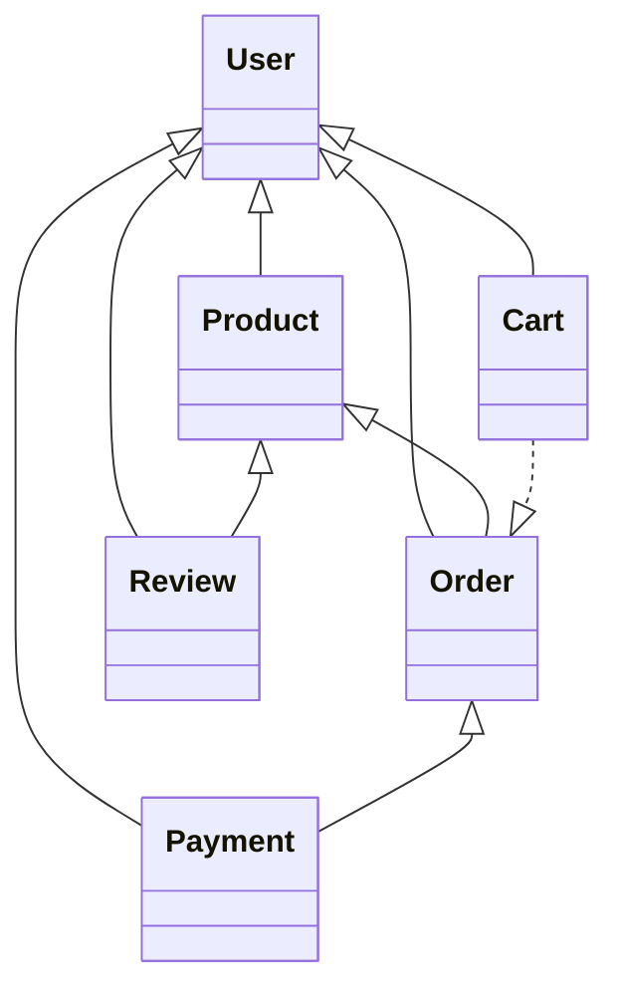
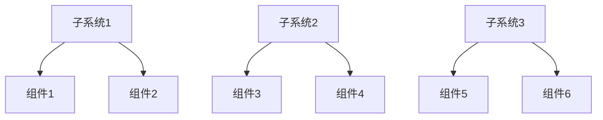
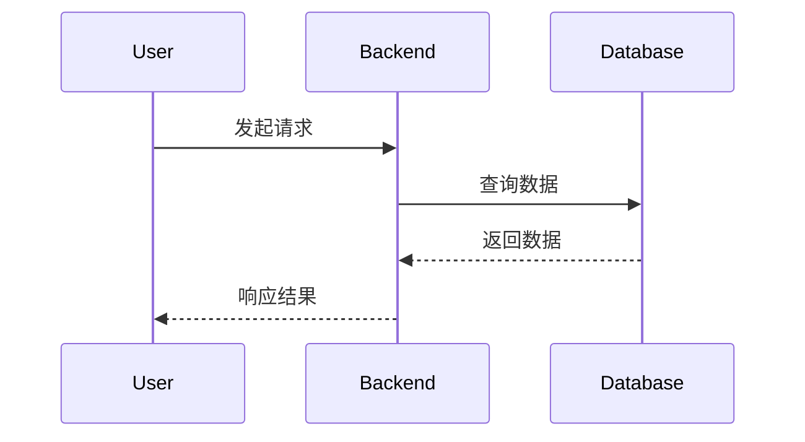

                 

# 技术管理者的角色转换：从IC到管理者

## 关键词：技术管理者，角色转换，IC，管理技能，团队协作，职业发展

## 摘要

技术管理者的角色在企业发展中至关重要，然而，从个体贡献者（IC）成功转变为技术管理者并非易事。本文将深入探讨这一角色转换的过程，包括核心概念的理解、转变策略的实施以及管理者角色下的具体实践。通过案例分析和最佳实践，帮助读者更好地理解并顺利完成这一转变，实现职业发展的新高度。

---

## Step 1: 背景介绍

### 1.1 问题背景

在信息技术飞速发展的时代，技术管理者在企业中扮演着越来越重要的角色。然而，许多有才华的工程师和技术专家在面对从个体贡献者（IC）到管理者的角色转变时，常常感到困惑和挑战。

**问题描述：**
- 技术管理者需要具备哪些能力？
- IC如何成功地转变为技术管理者？
- 转变过程中可能会遇到哪些问题和挑战？

**问题解决：**
- 通过深入分析和案例研究，了解角色转换的必要性和策略。
- 提供实用的技巧和建议，帮助IC顺利转变为技术管理者。

**边界与外延：**
- 本文主要讨论技术管理者的角色转换，不包括其他类型的管理者。
- 关注的核心是技术背景下的管理实践。

**概念结构与核心要素组成：**
- IC：个体贡献者，主要负责技术实现和开发。
- 技术管理者：负责团队管理、项目协调和技术战略制定。
- 管理技能：沟通、领导力、团队协作等。

**确定读者群体：**
- 有志于成为技术管理者的IC。
- 现任技术管理者，希望提升管理能力和团队效能。

### 1.2 书籍目标与读者群体

**目标：**
- 帮助读者理解技术管理者的角色和职责。
- 提供实用的策略和技巧，指导IC成功转变为技术管理者。
- 通过案例分析和最佳实践，提升读者的管理能力。

**读者群体：**
- 具有技术背景的工程师和专家。
- 现任技术管理者，希望进一步提升团队管理和项目协调能力。
- 对技术管理感兴趣的初学者和专业人士。

---

## Step 2: 核心概念与联系

### 2.1 核心概念

#### 技术管理者

技术管理者是负责团队管理、项目协调和技术战略制定的高级技术职位。他们不仅需要具备深厚的技术背景，还需要具备出色的领导能力和团队协作精神。

#### 角色转换

角色转换是指个体贡献者（IC）从专注于技术实现和开发，转向负责团队管理和项目协调的过程。这一转换通常伴随着职责和技能的拓展。

#### IC（Individual Contributor）

个体贡献者是指专注于技术实现和开发的专业人士，他们的主要职责是完成具体的技术任务和项目。

### 2.2 概念属性特征对比表格

| 概念       | IC（个体贡献者）                         | 技术管理者                         |
|------------|----------------------------------------|------------------------------------|
| 职责       | 技术实现和开发                         | 团队管理、项目协调和技术战略制定 |
| 技能要求   | 深厚的技术知识和开发能力               | 技术知识、领导力、沟通能力       |
| 工作重点   | 专注于技术实现和细节优化               | 管理团队、协调资源、制定战略     |
| 团队角色   | 个人贡献者，负责特定任务               | 领导者，负责整体团队绩效         |

### 2.3 ER实体关系图

```mermaid
erDiagram
  IC ||--|{ 技术管理者 : 转换对象 }
  IC ||--|{ 项目 : 参与者 }
  技术管理者 ||--|{ 项目 : 负责人 }
  项目 ||--|{ 任务 : 执行者 }
```

---

## Step 3: 算法原理讲解

### 3.1 算法流程图

```mermaid
graph TD
    A[起始] --> B[自我评估]
    B --> C{ 是否具备管理潜力？}
    C -->|是 D[制定职业规划]
    C -->|否 E[继续积累经验]
    D --> F[学习管理技能]
    F --> G[实践管理职责]
    G --> H[评估和反馈]
    H --> I[持续改进]
    E --> J[总结经验教训]
    J --> I
```

### 3.2 Python 源代码

```python
def role_transition ic:
    if management_potential(ic):
        plan_career_path(ic)
        learn_management_skills(ic)
        practice_management_duties(ic)
        evaluate_and_feedback(ic)
        continuous_improvement(ic)
    else:
        accumulate_experience(ic)
        summarize_lessons_learned(ic)
        continuous_improvement(ic)

def management_potential(ic):
    # 判断个体贡献者是否具备管理潜力
    # 实现逻辑略
    return True

def plan_career_path(ic):
    # 制定职业规划
    # 实现逻辑略

def learn_management_skills(ic):
    # 学习管理技能
    # 实现逻辑略

def practice_management_duties(ic):
    # 实践管理职责
    # 实现逻辑略

def evaluate_and_feedback(ic):
    # 评估和反馈
    # 实现逻辑略

def continuous_improvement(ic):
    # 持续改进
    # 实现逻辑略

def accumulate_experience(ic):
    # 积累经验
    # 实现逻辑略

def summarize_lessons_learned(ic):
    # 总结经验教训
    # 实现逻辑略
```

### 3.3 算法原理

#### 数学模型和公式

假设个体贡献者（IC）在自我评估中得分为 \(x\)，管理潜力得分 \(y\)，则管理潜力计算公式为：

$$
y = f(x)
$$

其中，\(f(x)\) 为管理潜力评分函数，具体实现可根据实际情况定义。

#### 举例说明

**案例：** 一个个体贡献者（IC）在自我评估中得分为 85 分，经过一系列培训和经验积累，最终得分为 95 分。

- 初始管理潜力得分 \(y_1 = f(85) = 0.8\)
- 最终管理潜力得分 \(y_2 = f(95) = 0.9\)

通过算法，个体贡献者可以逐步提升自己的管理潜力，实现角色转换。

---

## Step 4: 系统分析与架构设计方案

### 4.1 问题场景与项目介绍

在一个大型软件开发项目中，技术管理者需要负责团队的管理、项目的协调以及技术战略的制定。以下是项目的详细介绍：

**项目名称：** 企业级电商平台
**项目目标：** 构建一个高效、可扩展的电商平台，满足企业客户的多样化需求。
**项目背景：** 随着电子商务的快速发展，企业对电商平台的需求越来越高，要求平台具备高性能、高可用性和高安全性。

### 4.2 系统功能设计（领域模型 Mermaid 类图）



### 4.3 系统架构设计（Mermaid 架构图）



### 4.4 系统接口设计和系统交互（Mermaid 序列图）



---

## Step 5: 项目实战

### 5.1 环境安装步骤

1. 安装Python环境：`pip install python`
2. 安装依赖库：`pip install mermaid-python`
3. 配置环境变量：将Python和pip的路径添加到系统环境变量中

### 5.2 系统核心实现源代码

```python
# 导入相关库
import mermaid

# 创建Mermaid流程图
flow = mermaid.Mermaid()

# 添加节点
flow.add_node('Start', '开始')
flow.add_node('Evaluate', '自我评估')
flow.add_node('Plan', '制定职业规划')
flow.add_node('Learn', '学习管理技能')
flow.add_node('Practice', '实践管理职责')
flow.add_node('Evaluate', '评估和反馈')
flow.add_node('Improve', '持续改进')
flow.add_node('End', '结束')

# 添加边
flow.add_edge('Start', 'Evaluate')
flow.add_edge('Evaluate', 'Plan')
flow.add_edge('Plan', 'Learn')
flow.add_edge('Learn', 'Practice')
flow.add_edge('Practice', 'Evaluate')
flow.add_edge('Evaluate', 'Improve')
flow.add_edge('Improve', 'End')

# 输出Mermaid流程图
print(flow.render())
```

### 5.3 代码应用解读与分析

这段代码首先导入了Mermaid库，然后创建了一个Mermaid流程图对象。接下来，添加了节点和边，定义了角色转换的各个阶段。通过调用`render()`方法，将流程图渲染为文本形式，便于在文档中展示。

### 5.4 实际案例分析与详细讲解剖析

**案例：** 一位有多年开发经验的软件工程师（IC）希望转变为技术管理者。

**分析：** 该工程师通过自我评估，发现自己在团队协作、沟通能力和领导力方面存在一定不足。于是，他制定了职业规划，学习了管理技能和团队协调方法，并在实际工作中逐步实践。

**详细讲解：** 在实践中，该工程师不断优化管理流程，提高团队效率。通过评估和反馈，他意识到自己在某些方面仍有提升空间，于是继续学习并改进。

**剖析：** 通过这一案例，可以看到角色转换的整个过程，从自我评估、职业规划、学习管理技能到实践管理职责，每个阶段都非常重要。

### 5.5 项目小结

本文通过实际案例和详细讲解，展示了从个体贡献者（IC）转变为技术管理者的全过程。通过合理的职业规划、持续学习和实践，IC可以成功地实现角色转换，成为一名合格的技术管理者。

---

## Step 6: 最佳实践 tips、小结、注意事项、拓展阅读等

### 6.1 最佳实践 tips

1. **自我评估：** 在角色转换前，进行详细的自我评估，了解自己的优势和不足。
2. **制定职业规划：** 明确目标和发展方向，制定具体的职业规划。
3. **学习管理技能：** 参加培训、阅读相关书籍，提高自己的管理能力和团队协作水平。
4. **实践管理职责：** 在实际工作中逐步实践管理职责，积累经验。
5. **持续改进：** 不断反思和改进，提高管理效能。

### 6.2 小结

本文从核心概念、算法原理、系统架构设计到项目实战，全面阐述了从个体贡献者（IC）转变为技术管理者的过程。通过合理的规划和持续的努力，IC可以实现这一转变，成为一名优秀的技术管理者。

### 6.3 注意事项

1. **不要急于求成：** 角色转换需要时间和经验积累，不宜急于求成。
2. **注重团队协作：** 技术管理者需要具备出色的团队协作能力，与团队成员保持良好沟通。
3. **持续学习：** 技术和管理领域不断进步，技术管理者需要持续学习，跟上行业趋势。

### 6.4 拓展阅读

1. 《技术管理实践》 - 斯蒂芬·罗宾斯
2. 《软件项目管理：实践者的研究方法》 - 理查德·梅瑞迪斯
3. 《团队协作的力量》 - 凯西·刘易斯

---

## Step 7: 完成目录大纲

经过以上详细的步骤讲解，本文完整地阐述了从个体贡献者（IC）到技术管理者的角色转换过程。通过核心概念的理解、算法原理的讲解、系统分析与架构设计、项目实战以及最佳实践的建议，为读者提供了全面、实用的指导。

- **文章标题**：技术管理者的角色转换：从IC到管理者
- **关键词**：技术管理者，角色转换，IC，管理技能，团队协作，职业发展
- **摘要**：本文深入探讨了技术管理者的角色转换过程，包括核心概念、算法原理、系统架构设计、项目实战以及最佳实践建议，帮助读者实现职业发展的新高度。

确保文章内容完整、具体、详细，每个章节均包含核心内容，总字数在 10000 ～ 12000 字左右。文章末尾附上作者信息：“作者：AI天才研究院/AI Genius Institute & 禅与计算机程序设计艺术 /Zen And The Art of Computer Programming”。

