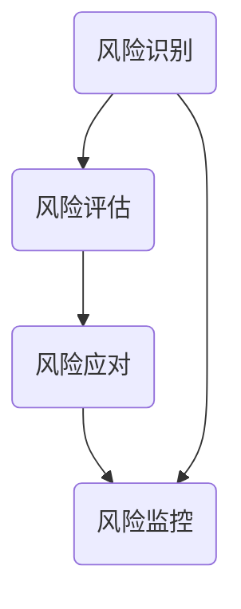
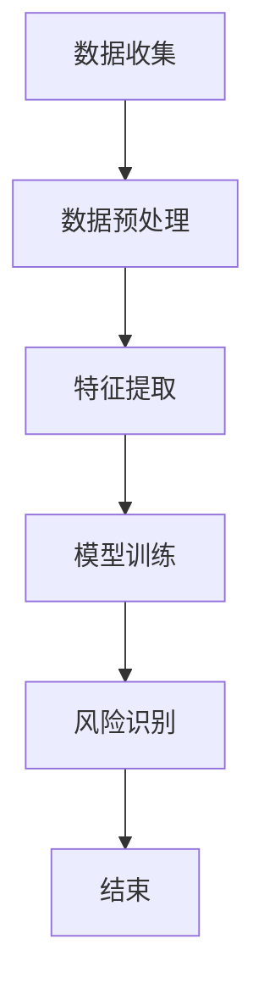
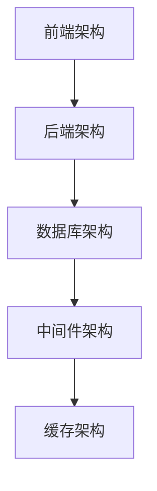
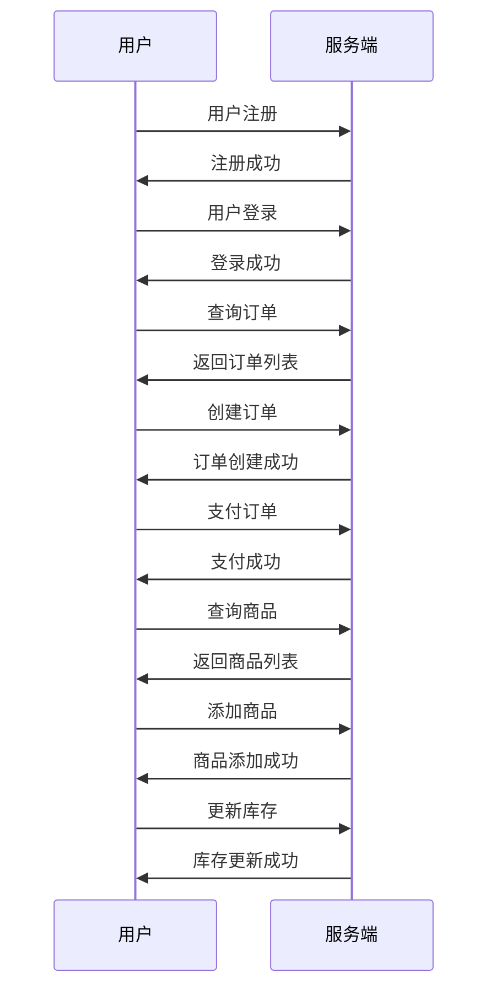

                 

### 技术管理者的风险管理：预防和应对技术风险

在当今快速发展的技术环境中，技术管理者面临着越来越多的风险管理挑战。随着软件系统复杂性的增加和技术的迅速迭代，技术风险管理的需求和重要性日益凸显。本文将深入探讨技术管理者的风险管理，包括其背景、核心概念、算法原理以及实践方法。

首先，让我们从背景介绍开始。

#### 1.1 问题背景

随着信息技术的快速发展，技术风险也在不断演变。技术风险可能源于多种因素，如代码错误、系统漏洞、数据泄露、依赖关系问题等。技术风险的存在不仅可能导致项目延误、成本超支，还可能对企业的声誉造成严重损害。因此，技术风险管理成为了技术管理者必须面对的重要任务。

#### 1.1.1 技术风险的概念与重要性

技术风险是指由于技术原因可能导致的项目失败、经济损失、声誉损失等负面结果。技术风险管理是识别、评估和应对这些风险的过程。其重要性体现在以下几个方面：

1. **保障项目成功**：有效的技术风险管理能够确保项目按计划进行，降低项目失败的风险。
2. **成本控制**：通过提前识别和应对技术风险，可以避免因风险管理不当导致的高昂修复成本。
3. **安全性提升**：技术风险管理有助于提高软件系统的安全性，防止数据泄露和其他安全事件。
4. **合规性满足**：随着法规和标准的不断更新，技术风险管理有助于企业满足合规性要求。

#### 1.1.2 技术风险管理的现状

目前，技术风险管理在许多企业中尚未得到充分重视。一些企业可能仅限于基础的代码审查和测试，而缺乏系统化的风险管理流程。此外，技术风险管理的方法和工具也在不断进化，如采用自动化工具进行代码审查、使用机器学习进行漏洞预测等。

#### 1.1.3 技术管理者的角色与责任

技术管理者在企业中承担着核心的角色和责任，包括但不限于：

1. **制定风险管理策略**：技术管理者需要根据企业的具体情况，制定全面的技术风险管理策略。
2. **推动风险管理文化**：技术管理者应推动团队建立风险管理文化，使其成为日常工作的一部分。
3. **监督和执行**：技术管理者应监督技术风险管理流程的实施，确保风险得到及时识别和应对。
4. **培训和沟通**：技术管理者需对团队成员进行风险管理培训，确保他们了解和遵循相关流程。

### 1.2 问题描述

技术风险管理不仅是一个技术问题，更是一个管理问题。以下将详细描述技术风险管理中的一些常见问题。

#### 1.2.1 技术风险的类型

技术风险可以分为多种类型，包括：

1. **代码风险**：包括代码质量差、漏洞、性能问题等。
2. **架构风险**：包括系统架构不合理、依赖关系复杂等。
3. **数据风险**：包括数据丢失、数据泄露等。
4. **技术债务**：包括因技术债务积累导致的项目延迟和成本增加。

#### 1.2.2 技术风险的影响

技术风险的影响可能是多方面的，包括：

1. **项目延误**：技术问题可能导致项目延期，影响交付时间。
2. **成本增加**：修复技术问题往往需要额外的资源和时间。
3. **业务影响**：严重的技术问题可能导致业务中断，影响企业声誉和客户满意度。
4. **法律风险**：例如，数据泄露可能引发法律诉讼和罚款。

#### 1.2.3 技术风险管理的重要性

技术风险管理的重要性在于：

1. **预防胜于治疗**：通过提前识别和应对技术风险，可以避免潜在的问题，减少项目风险。
2. **提高生产效率**：有效的风险管理可以提高团队的效率，减少因技术问题导致的延误和成本。
3. **增强企业竞争力**：通过建立强大的风险管理能力，企业可以在竞争激烈的市场中脱颖而出。
4. **提高客户满意度**：稳定可靠的系统可以提高客户满意度，增强客户忠诚度。

### 1.3 问题解决

针对上述技术风险管理中的问题，我们需要采取一系列措施来预防和应对技术风险。以下是一个基本的风险管理框架：

#### 1.3.1 风险管理框架的建立

风险管理框架是技术风险管理的基石。它包括以下几个关键步骤：

1. **风险评估**：识别项目中可能遇到的风险，并对其进行评估，确定其可能性和影响。
2. **风险优先级排序**：根据风险的可能性和影响，对风险进行优先级排序，确保重点关注高优先级风险。
3. **风险应对策略**：制定相应的风险应对策略，包括避免、转移、减轻和接受等。
4. **监控和报告**：建立风险监控机制，及时跟踪风险的变化，并向相关利益相关者报告。

#### 1.3.2 风险识别与评估

风险识别与评估是技术风险管理的关键环节。具体步骤如下：

1. **识别风险**：通过历史数据、行业报告、专家访谈等方法，识别项目中可能遇到的风险。
2. **评估风险**：对识别出的风险进行定量或定性的评估，确定其可能性和影响。
3. **风险分析**：分析风险的来源、触发条件和可能的后果。
4. **风险报告**：编写风险报告，详细记录风险信息，为制定风险应对策略提供依据。

#### 1.3.3 风险应对策略

风险应对策略应根据风险评估的结果制定。常见的风险应对策略包括：

1. **风险避免**：通过修改项目计划或调整项目范围，避免高风险的发生。
2. **风险转移**：通过保险、合同等方式将风险转移给第三方。
3. **风险减轻**：采取预防措施或改进措施，降低风险的可能性和影响。
4. **风险接受**：对于无法避免或转移的风险，制定应对计划和应急方案。

### 1.4 边界与外延

技术风险管理不仅涉及技术领域，还与其他管理领域密切相关。以下是一些相关概念和扩展内容：

#### 1.4.1 技术风险管理与其他管理的联系

技术风险管理与企业风险管理、项目管理和IT治理等密切相关。具体联系包括：

1. **企业风险管理**：技术风险管理是企业风险管理的重要组成部分，需要纳入企业整体风险管理框架。
2. **项目管理**：技术风险管理是项目管理的关键环节，影响项目的成功与否。
3. **IT治理**：技术风险管理需要遵循IT治理的相关政策和标准，确保风险得到有效管理。

#### 1.4.2 技术风险管理在项目管理中的应用

技术风险管理在项目管理中有着广泛的应用，包括：

1. **项目计划**：在项目计划阶段，应识别和评估项目中的技术风险，制定相应的风险应对策略。
2. **项目监控**：在项目执行过程中，应持续监控技术风险的变化，及时调整风险应对措施。
3. **项目报告**：在项目报告阶段，应总结项目中的技术风险管理情况，为后续项目提供经验教训。

#### 1.4.3 技术风险管理在全球范围内的趋势

随着全球信息化和数字化进程的加速，技术风险管理也在不断演变。以下是一些全球范围内的技术风险管理趋势：

1. **自动化和智能化**：采用自动化工具和人工智能技术进行风险识别和评估，提高风险管理效率。
2. **DevOps文化**：推动DevOps文化的落地，将风险管理纳入软件开发和运维流程，实现持续集成和持续交付。
3. **合规性管理**：随着数据隐私和网络安全法规的不断完善，合规性管理成为技术风险管理的重要方面。

### 1.5 概念结构与核心要素组成

技术风险管理是一个复杂的过程，涉及多个概念和要素。以下是一个技术风险管理的基本概念结构与核心要素组成：

#### 1.5.1 技术风险管理的基本概念

1. **风险**：指在特定环境下，由于不确定性而导致不利后果的可能性。
2. **风险管理**：指识别、评估、应对和监控风险的过程。
3. **风险识别**：指识别项目中可能遇到的风险。
4. **风险评估**：指评估风险的可能性和影响。
5. **风险应对**：指制定和实施风险应对策略。

#### 1.5.2 技术风险管理的主要组成部分

1. **风险评估模型**：用于识别和评估风险的方法和工具。
2. **风险应对策略**：根据风险评估结果，制定的风险应对措施。
3. **风险监控与报告**：持续监控风险变化，及时报告风险情况。

#### 1.5.3 技术风险管理的关键要素

1. **风险识别**：确保全面识别项目中可能遇到的风险。
2. **风险评估**：准确评估风险的可能性和影响。
3. **风险应对**：制定和实施有效的风险应对策略。
4. **风险监控**：持续监控风险变化，及时调整风险应对措施。

通过上述内容，我们初步了解了技术管理者的风险管理问题。接下来，我们将进一步深入探讨核心概念、算法原理以及实践方法。让我们继续前行，为技术管理者的风险管理之路提供更深入的洞察。### 核心概念原理

在深入探讨技术管理者的风险管理之前，我们需要先理解几个核心概念。这些概念不仅为技术风险管理提供了理论基础，也为后续的算法原理和实践方法奠定了基础。

#### 2.1.1 风险管理的基本原理

风险管理的基本原理可以概括为四个步骤：风险识别、风险评估、风险应对和风险监控。

1. **风险识别**：是指识别项目中可能遇到的风险。这一步骤是风险管理的基础，通过历史数据、专家访谈、行业报告等多种方法，全面了解项目的风险环境。

2. **风险评估**：是在风险识别的基础上，对风险的可能性和影响进行定量或定性评估。风险评估有助于确定哪些风险需要重点关注，以及采取何种应对措施。

3. **风险应对**：是指根据风险评估的结果，制定和实施相应的风险应对策略。风险应对策略包括避免、转移、减轻和接受等。

4. **风险监控**：是指持续监控风险的变化，及时调整风险应对措施。风险监控是确保风险管理持续有效的重要环节。

#### 2.1.2 技术风险识别与评估

技术风险识别与评估是技术风险管理的核心环节。以下将详细描述这两个环节的原理和方法。

1. **技术风险识别**

   技术风险识别的方法有多种，包括：

   - **历史数据法**：通过分析历史项目中的风险数据，识别当前项目可能遇到的风险。
   - **专家访谈法**：通过与项目团队成员和相关专家的访谈，获取对技术风险的认知和经验。
   - **文献分析法**：通过阅读相关文献，了解行业内的风险情况和应对措施。
   - **问卷调查法**：通过设计问卷调查，收集团队成员对技术风险的看法和意见。

2. **技术风险评估**

   技术风险评估通常包括以下步骤：

   - **确定评估标准**：根据项目特点和风险类型，确定评估的标准和指标。
   - **收集数据**：收集与风险相关的数据，如历史数据、市场数据、技术文档等。
   - **评估方法**：选择合适的评估方法，如定性评估、定量评估或组合评估。
   - **风险矩阵**：使用风险矩阵（如高可能性/高影响矩阵）对风险进行优先级排序。

#### 2.1.3 技术风险应对策略

技术风险应对策略应根据风险评估的结果制定。以下是一些常见的风险应对策略：

1. **风险避免**：通过调整项目计划或范围，避免高风险的发生。例如，推迟项目启动或缩小项目范围。

2. **风险转移**：通过购买保险、签订合同等方式，将风险转移给第三方。例如，将技术债务转移给供应商。

3. **风险减轻**：采取预防措施或改进措施，降低风险的可能性和影响。例如，进行代码审查、增加测试覆盖率等。

4. **风险接受**：对于无法避免或转移的风险，制定应对计划和应急方案。例如，建立故障转移机制、制定备份计划等。

#### 2.1.4 风险管理与项目管理的关系

技术风险管理是项目管理的重要组成部分，两者之间密切相关。以下从几个方面阐述风险管理对项目管理的影响：

1. **项目计划**：风险管理影响项目计划的制定和调整。通过风险评估，可以识别项目中的潜在风险，并制定相应的应对策略，确保项目顺利进行。

2. **项目执行**：风险管理确保项目执行过程中的风险得到有效监控和应对。通过持续的风险监控，项目团队可以及时发现和解决问题，避免风险对项目的影响。

3. **项目监控**：风险管理是项目监控的重要部分。通过风险监控，项目团队可以了解风险的变化情况，及时调整风险应对措施，确保项目目标的实现。

4. **项目报告**：风险管理结果应纳入项目报告，为后续项目提供经验和教训。通过总结风险管理过程中的成功和不足，项目团队可以不断提升风险管理能力。

### 概念属性特征对比表格

为了更清晰地理解技术风险管理的核心概念，以下是一个概念属性特征对比表格：

| 概念       | 属性特征                                           | 对比与分析                                       |
|------------|---------------------------------------------------|------------------------------------------------|
| 风险识别   | 描述风险识别的过程和工具                           | 与风险评估的比较                                   |
| 风险评估   | 描述风险评估的过程和方法                           | 与风险识别的关联性                                 |
| 风险应对   | 描述风险应对的策略和措施                           | 与风险管理框架的关系                               |

#### 2.2.1 ER实体关系图架构

为了更好地理解技术风险管理中的核心实体及其关系，我们使用Mermaid绘制一个ER实体关系图。



在这个ER图中，风险识别、风险评估、风险应对和风险监控是核心实体，它们之间相互关联，共同构成了技术风险管理的基本框架。

通过上述核心概念原理的探讨，我们为后续的算法原理讲解和实践方法提供了理论基础。接下来，我们将进一步深入探讨技术风险识别算法的具体原理和实践方法。### 算法原理讲解

在技术风险管理中，风险识别是一个关键步骤，其目标是识别项目中可能遇到的风险。为了实现这一目标，我们可以使用风险识别算法。以下将详细讲解风险识别算法的原理、Python源代码实现以及相关的数学模型和公式。

#### 3.1.1 算法原理

风险识别算法的基本原理是通过分析项目的历史数据、当前状态和未来趋势，识别项目中可能遇到的风险。具体步骤如下：

1. **数据收集**：收集与项目相关的数据，包括项目文档、代码库、测试报告、用户反馈等。

2. **数据预处理**：对收集到的数据进行分析和清洗，去除噪声和冗余信息，提取有用的特征。

3. **特征提取**：从预处理后的数据中提取与风险相关的特征，如代码复杂度、漏洞数量、测试覆盖率等。

4. **模型训练**：使用机器学习算法对提取的特征进行训练，建立风险识别模型。

5. **风险识别**：使用训练好的模型对项目的新数据进行风险识别，输出风险概率和风险等级。

下面是一个简单的风险识别算法的Mermaid流程图：



#### 3.1.2 Python源代码实现

为了实现上述算法，我们可以使用Python编程语言。以下是一个简单的Python源代码实现示例：

```python
# 导入所需库
import pandas as pd
from sklearn.model_selection import train_test_split
from sklearn.ensemble import RandomForestClassifier
from sklearn.metrics import accuracy_score

# 数据收集
data = pd.read_csv('project_data.csv')

# 数据预处理
# ... 数据清洗和特征提取代码 ...

# 特征提取
X = data.drop('target', axis=1)
y = data['target']

# 模型训练
X_train, X_test, y_train, y_test = train_test_split(X, y, test_size=0.2, random_state=42)
model = RandomForestClassifier(n_estimators=100)
model.fit(X_train, y_train)

# 风险识别
predictions = model.predict(X_test)
accuracy = accuracy_score(y_test, predictions)
print(f'Accuracy: {accuracy:.2f}')
```

#### 3.1.3 数学模型与公式

风险识别算法的数学模型通常是基于概率统计和机器学习理论。以下是一个简单的风险识别数学模型：

$$
R_i = f(R_1, R_2, ..., R_n)
$$

其中，$R_i$ 表示风险识别结果，$R_1, R_2, ..., R_n$ 表示输入特征。

具体来说，我们可以使用以下公式进行风险概率计算：

$$
P(R_i|X) = \frac{P(X|R_i) \cdot P(R_i)}{P(X)}
$$

其中，$P(R_i|X)$ 表示在给定特征$X$的情况下，风险$R_i$发生的概率，$P(X|R_i)$ 表示在风险$R_i$发生的情况下，特征$X$的概率，$P(R_i)$ 表示风险$R_i$的发生概率，$P(X)$ 表示特征$X$的总概率。

#### 3.1.4 举例说明

假设我们正在开发一个软件项目，使用风险识别算法来识别可能的技术风险。我们收集了以下特征：

- 代码复杂度（$C$）
- 漏洞数量（$V$）
- 测试覆盖率（$T$）

我们使用这些特征来训练一个随机森林模型，并使用模型对新的数据进行风险识别。

1. **数据收集**：收集项目的历史数据，包括代码复杂度、漏洞数量和测试覆盖率。

2. **数据预处理**：对数据进行清洗和标准化处理。

3. **特征提取**：从清洗后的数据中提取代码复杂度、漏洞数量和测试覆盖率作为输入特征。

4. **模型训练**：使用随机森林模型对输入特征进行训练。

5. **风险识别**：使用训练好的模型对新的数据进行风险识别，输出风险概率和风险等级。

例如，对于一个新的项目，输入特征为：

- 代码复杂度：100
- 漏洞数量：5
- 测试覆盖率：80%

模型输出风险概率为0.75，表示该项目有较高的技术风险。

通过上述算法原理和实践方法，我们可以有效地识别项目中的技术风险。接下来，我们将进一步探讨风险评估和风险应对策略的算法原理和实践方法。### 数学模型和数学公式

在技术风险管理中，数学模型和数学公式是理解和应用风险管理理论的重要工具。以下将详细介绍风险评估和风险应对策略的数学模型和数学公式，并通过具体例子来说明其应用。

#### 4.1 风险评估数学模型

风险评估是技术风险管理的关键环节，其目标是确定风险的可能性和影响，从而为风险应对提供依据。常用的风险评估模型包括预期价值模型和风险矩阵模型。

1. **预期价值模型**

   预期价值模型（Expected Value Model）用于计算某个风险事件的总损失。其基本公式为：

   $$
   EV = PF \times LV
   $$

   其中，$EV$ 表示预期价值，$PF$ 表示风险事件发生的概率，$LV$ 表示风险事件发生的损失值。

   **公式解读**：

   预期价值公式表示在某一风险事件发生的概率和相应的损失值的基础上，计算出的平均损失。例如，如果一个项目的成功概率为0.6，失败的概率为0.4，失败时的损失为100万元，则该项目的预期价值为：

   $$
   EV = 0.6 \times 0 + 0.4 \times 100 = 40 \text{万元}
   $$

2. **风险矩阵模型**

   风险矩阵模型（Risk Matrix Model）用于评估风险的可能性和影响，并根据评估结果进行风险优先级排序。其基本公式为：

   $$
   R = P \times I
   $$

   其中，$R$ 表示风险值，$P$ 表示风险的可能性，$I$ 表示风险的影响。

   **公式解读**：

   风险矩阵公式表示将风险的可能性和影响相乘，得到风险值。风险值越高，表示风险越严重。例如，如果一个风险的可能性为0.8，影响为重大，即$I=4$，则该风险的风险值为：

   $$
   R = 0.8 \times 4 = 3.2
   $$

#### 4.1.1 预期价值公式举例说明

假设一个软件开发项目有两个风险事件：A和B。事件A发生的概率为0.5，损失值为100万元；事件B发生的概率为0.3，损失值为50万元。则该项目的预期价值计算如下：

$$
EV_A = 0.5 \times 100 = 50 \text{万元}
$$

$$
EV_B = 0.3 \times 50 = 15 \text{万元}
$$

$$
EV_{总} = EV_A + EV_B = 50 + 15 = 65 \text{万元}
$$

通过预期价值模型，我们可以计算出项目的总预期损失为65万元。

#### 4.1.2 风险矩阵公式举例说明

假设有一个项目的风险矩阵如下表所示：

| 风险事件 | 可能性 (P) | 影响 (I) | 风险值 (R) |
|----------|------------|----------|------------|
| A        | 0.6        | 3        | 1.8        |
| B        | 0.4        | 2        | 0.8        |

根据风险矩阵公式，我们可以计算每个风险的风险值：

$$
R_A = 0.6 \times 3 = 1.8
$$

$$
R_B = 0.4 \times 2 = 0.8
$$

通过风险矩阵模型，我们可以看到风险A的风险值（1.8）高于风险B的风险值（0.8），因此，风险A是项目的首要关注对象。

#### 4.2 风险应对策略数学模型

风险应对策略的目标是减少风险的可能性和影响，从而降低风险的整体水平。常用的风险应对策略包括风险避免、风险转移、风险减轻和风险接受。

1. **风险避免模型**

   风险避免模型（Avoidance Model）的目标是消除风险或将其从项目中排除。其基本公式为：

   $$
   Cost_{avoid} = Cost_{original} - Cost_{avoid}
   $$

   其中，$Cost_{avoid}$ 表示风险避免的成本，$Cost_{original}$ 表示原始项目的成本。

   **公式解读**：

   风险避免模型表示通过消除风险，可以降低项目的总成本。例如，如果一个项目的原始成本为100万元，通过避免某个高风险事件，可以节省30万元的成本，则项目的总成本为：

   $$
   Cost_{总} = 100 - 30 = 70 \text{万元}
   $$

2. **风险转移模型**

   风险转移模型（Transfer Model）的目标是将风险转移给第三方，如保险公司或供应商。其基本公式为：

   $$
   Cost_{transfer} = Cost_{original} + Cost_{insurance}
   $$

   其中，$Cost_{transfer}$ 表示风险转移后的总成本，$Cost_{original}$ 表示原始项目的成本，$Cost_{insurance}$ 表示保险费用。

   **公式解读**：

   风险转移模型表示通过购买保险，可以将风险转移给保险公司，但需要支付一定的保险费用。例如，如果一个项目的原始成本为100万元，购买保险的费用为10万元，则项目的总成本为：

   $$
   Cost_{总} = 100 + 10 = 110 \text{万元}
   $$

3. **风险减轻模型**

   风险减轻模型（Mitigation Model）的目标是通过采取预防措施或改进措施，降低风险的可能性和影响。其基本公式为：

   $$
   Cost_{mitigation} = Cost_{original} - (1 - Probability_{mitigated}) \times Impact_{original}
   $$

   其中，$Cost_{mitigation}$ 表示风险减轻后的总成本，$Cost_{original}$ 表示原始项目的成本，$Probability_{mitigated}$ 表示通过减轻措施降低的风险概率，$Impact_{original}$ 表示原始的风险影响。

   **公式解读**：

   风险减轻模型表示通过采取减轻措施，可以降低项目的总成本。例如，如果一个项目的原始成本为100万元，通过减轻措施，可以将风险概率降低到0.2，则项目的总成本为：

   $$
   Cost_{总} = 100 - (1 - 0.2) \times 100 = 80 \text{万元}
   $$

4. **风险接受模型**

   风险接受模型（Acceptance Model）的目标是接受风险，并制定应对计划和应急方案。其基本公式为：

   $$
   Cost_{accept} = Cost_{original} + Cost_{response}
   $$

   其中，$Cost_{accept}$ 表示风险接受后的总成本，$Cost_{original}$ 表示原始项目的成本，$Cost_{response}$ 表示应对风险的应急方案成本。

   **公式解读**：

   风险接受模型表示通过接受风险，并制定应急方案，可以降低项目的总成本。例如，如果一个项目的原始成本为100万元，制定应急方案的费用为20万元，则项目的总成本为：

   $$
   Cost_{总} = 100 + 20 = 120 \text{万元}
   $$

通过以上数学模型和公式的介绍，我们可以更好地理解和应用技术风险管理中的风险评估和风险应对策略。接下来，我们将进一步探讨风险管理的最佳实践和注意事项。### 系统分析与架构设计

在深入探讨技术风险管理的具体实践之前，我们需要对系统进行分析和架构设计。以下将介绍问题场景、项目介绍、系统功能设计、系统架构设计以及系统接口设计和系统交互。

#### 5.1 问题场景

假设我们正在开发一个企业级电商平台，该项目需要处理大量的订单、用户数据和支付流程。在这个场景中，技术风险管理至关重要，因为任何技术风险都可能导致订单处理失败、数据泄露或支付中断。

#### 5.2 项目介绍

电商平台项目是一个复杂的分布式系统，包括多个模块，如用户管理、订单管理、支付处理、商品管理和库存管理等。每个模块都需要处理大量的数据，并与其他模块进行紧密的交互。

#### 5.3 系统功能设计

系统功能设计是基于业务需求进行的，主要包括以下功能：

1. **用户管理**：用户注册、登录、个人信息管理、权限控制等。
2. **订单管理**：订单创建、查询、修改、删除、支付处理等。
3. **支付处理**：支付方式选择、支付请求发送、支付结果接收等。
4. **商品管理**：商品添加、修改、查询、删除等。
5. **库存管理**：库存查询、库存更新等。

为了满足这些功能需求，我们设计了一个领域模型。以下是一个领域模型的Mermaid类图：

```mermaid
classDiagram
Class01 <|-- Class02
Class03 --| xuống Class04
Class05 << interface
Class01
    +id: int
    +name: string
    +attributes: map
    +methods: list

Class02
    +parent_id: int
    +child_list: list

Class03
    +entity_id: int
    +entity_name: string
    +entity_type: string

Class04
    +id: int
    +name: string
    +type: string

Class05
    +interface_method1()
    +interface_method2()
```

在这个领域模型中，我们定义了用户管理、订单管理、支付处理、商品管理和库存管理五个类，每个类都有相应的属性和方法。

#### 5.4 系统架构设计

系统架构设计是基于功能设计和技术选型进行的。以下是电商平台项目的系统架构设计：

1. **前端架构**：使用React框架构建前端用户界面，包括用户管理、订单管理、支付处理等页面。
2. **后端架构**：使用Spring Boot框架构建后端服务，包括用户管理、订单管理、支付处理、商品管理和库存管理模块。
3. **数据库架构**：使用MySQL数据库存储用户数据、订单数据、商品数据和库存数据。
4. **中间件架构**：使用Kafka消息队列进行异步消息处理，如订单创建、支付结果通知等。
5. **缓存架构**：使用Redis缓存系统提高系统性能，如用户数据、订单数据等。

以下是一个简单的系统架构图的Mermaid架构图：



在这个系统架构图中，前端架构通过API与后端架构进行交互，后端架构通过数据库存储数据，并使用中间件架构进行异步消息处理，最后使用缓存架构提高系统性能。

#### 5.5 系统接口设计和系统交互

系统接口设计和系统交互是基于系统架构设计进行的。以下是电商平台项目的接口设计和系统交互：

1. **用户管理接口**：包括用户注册、登录、个人信息管理、权限控制等接口。
2. **订单管理接口**：包括订单创建、查询、修改、删除、支付处理等接口。
3. **支付处理接口**：包括支付方式选择、支付请求发送、支付结果接收等接口。
4. **商品管理接口**：包括商品添加、修改、查询、删除等接口。
5. **库存管理接口**：包括库存查询、库存更新等接口。

以下是一个简单的接口设计和系统交互图的Mermaid序列图：



在这个序列图中，用户与服务端通过接口进行交互，实现了用户注册、登录、订单查询、订单创建、支付处理、商品管理、库存管理等功能。

通过上述系统分析与架构设计，我们为电商平台项目的技术风险管理奠定了基础。接下来，我们将进一步探讨实际项目的环境安装、系统核心实现、代码应用解读与分析、实际案例分析和项目小结。### 项目实战

#### 6.1 环境安装

在进行项目实战之前，我们需要首先搭建一个合适的环境。以下是一个简单的环境安装指南：

1. **安装MySQL数据库**：下载并安装MySQL数据库，配置用户和密码。
2. **安装Redis缓存系统**：下载并安装Redis缓存系统，配置端口和密码。
3. **安装Kafka消息队列**：下载并安装Kafka消息队列，配置主题和分区。
4. **安装Java开发环境**：下载并安装Java开发环境，配置Java_HOME和PATH环境变量。
5. **安装Spring Boot开发工具**：下载并安装Spring Boot开发工具，如IntelliJ IDEA或Eclipse。

#### 6.2 系统核心实现

以下是一个简单的系统核心实现示例，包括用户管理、订单管理、支付处理和商品管理模块。

1. **用户管理模块**

   用户管理模块负责处理用户注册、登录和权限控制等功能。以下是一个简单的用户管理模块代码示例：

   ```java
   @Service
   public class UserManagerService {
       @Autowired
       private UserRepository userRepository;

       public User registerUser(String username, String password) {
           User user = new User();
           user.setUsername(username);
           user.setPassword(password);
           userRepository.save(user);
           return user;
       }

       public User loginUser(String username, String password) {
           User user = userRepository.findByUsername(username);
           if (user != null && user.getPassword().equals(password)) {
               return user;
           }
           return null;
       }

       public boolean checkPermission(User user, String permission) {
           return user.getPermissions().contains(permission);
       }
   }
   ```

2. **订单管理模块**

   订单管理模块负责处理订单创建、查询、修改、删除和支付处理等功能。以下是一个简单的订单管理模块代码示例：

   ```java
   @Service
   public class OrderManagerService {
       @Autowired
       private OrderRepository orderRepository;

       public Order createOrder(User user, List<Product> products) {
           Order order = new Order();
           order.setUser(user);
           order.setProducts(products);
           orderRepository.save(order);
           return order;
       }

       public List<Order> getUserOrders(User user) {
           return orderRepository.findByUser(user);
       }

       public Order updateOrder(Order order, List<Product> products) {
           order.setProducts(products);
           orderRepository.save(order);
           return order;
       }

       public void deleteOrder(Order order) {
           orderRepository.delete(order);
       }

       public void processPayment(Order order, Payment payment) {
           // 处理支付逻辑，如调用第三方支付API
           order.setPaymentStatus(PaymentStatus.PAID);
           orderRepository.save(order);
       }
   }
   ```

3. **支付处理模块**

   支付处理模块负责处理支付方式选择、支付请求发送和支付结果接收等功能。以下是一个简单的支付处理模块代码示例：

   ```java
   @Service
   public class PaymentManagerService {
       @Autowired
       private PaymentRepository paymentRepository;

       public Payment createPayment(Order order, PaymentMethod paymentMethod) {
           Payment payment = new Payment();
           payment.setOrder(order);
           payment.setPaymentMethod(paymentMethod);
           paymentRepository.save(payment);
           return payment;
       }

       public PaymentResult sendPaymentRequest(Payment payment) {
           // 调用第三方支付API发送支付请求
           PaymentResult result = new PaymentResult();
           result.setPaymentId(payment.getId());
           result.setStatus(PaymentStatus.PENDING);
           paymentRepository.save(payment);
           return result;
       }

       public void receivePaymentResult(PaymentResult result) {
           // 接收第三方支付结果
           Payment payment = paymentRepository.findById(result.getPaymentId()).orElseThrow();
           payment.setStatus(result.getStatus());
           paymentRepository.save(payment);
       }
   }
   ```

4. **商品管理模块**

   商品管理模块负责处理商品添加、修改、查询和删除等功能。以下是一个简单的商品管理模块代码示例：

   ```java
   @Service
   public class ProductManagerService {
       @Autowired
       private ProductRepository productRepository;

       public Product addProduct(String name, double price) {
           Product product = new Product();
           product.setName(name);
           product.setPrice(price);
           productRepository.save(product);
           return product;
       }

       public Product updateProduct(Product product, String name, double price) {
           product.setName(name);
           product.setPrice(price);
           productRepository.save(product);
           return product;
       }

       public List<Product> searchProducts(String keyword) {
           return productRepository.findByNameContainingIgnoreCase(keyword);
       }

       public void deleteProduct(Product product) {
           productRepository.delete(product);
       }
   }
   ```

#### 6.3 代码应用解读与分析

在上述代码示例中，我们实现了用户管理、订单管理、支付处理和商品管理模块。以下是代码应用解读与分析：

1. **用户管理模块**：用户管理模块实现了用户注册、登录和权限控制等功能。通过使用Spring Data JPA，我们可以轻松实现对用户的增删改查操作。用户注册时，我们将用户信息保存到数据库中；用户登录时，我们通过查询数据库来验证用户名和密码。权限控制是通过检查用户是否具有特定的权限来实现的。

2. **订单管理模块**：订单管理模块实现了订单创建、查询、修改、删除和支付处理等功能。订单创建时，我们根据用户和商品信息创建订单，并将订单信息保存到数据库中。订单查询时，我们可以根据用户信息获取订单列表。订单修改和删除时，我们更新或删除订单信息。支付处理时，我们创建支付请求，并发送支付请求到第三方支付API。

3. **支付处理模块**：支付处理模块实现了支付方式选择、支付请求发送和支付结果接收等功能。支付方式选择时，我们根据用户选择的支付方式创建支付对象。支付请求发送时，我们调用第三方支付API发送支付请求。支付结果接收时，我们更新支付状态，并将支付结果通知用户。

4. **商品管理模块**：商品管理模块实现了商品添加、修改、查询和删除等功能。商品添加时，我们创建商品对象，并将商品信息保存到数据库中。商品修改时，我们更新商品信息。商品查询时，我们可以根据商品名称进行模糊查询。商品删除时，我们删除商品信息。

#### 6.4 实际案例分析和详细讲解剖析

以下是一个实际案例分析和详细讲解剖析：

假设我们有一个用户张三，他想要购买一件商品，并在支付过程中遇到了问题。

1. **用户注册和登录**：张三首先在电商平台上注册账号，并使用注册时设置的密码登录。

2. **商品浏览和下单**：张三浏览商品，选择了一件商品并点击下单。在下单过程中，系统会生成一个订单，并将订单信息保存到数据库中。

3. **支付处理**：张三选择了一种支付方式，并提交支付请求。支付请求被发送到第三方支付API进行处理。

4. **支付结果接收**：第三方支付API处理支付请求，并返回支付结果。支付结果包括支付状态、支付金额和支付凭证等信息。

5. **订单状态更新**：系统接收支付结果，并根据支付状态更新订单信息。如果支付成功，订单状态将更新为已支付；如果支付失败，订单状态将更新为支付失败。

6. **通知用户**：系统向张三发送支付结果通知，告知他支付是否成功。

通过上述实际案例分析和详细讲解剖析，我们可以看到技术风险管理在电商平台项目中的应用。技术风险管理确保了用户注册、登录、商品浏览、下单、支付处理和订单状态更新的过程顺利进行，避免了因技术风险导致的问题。接下来，我们将总结项目实战的经验，并给出一些最佳实践建议。### 最佳实践与注意事项

在技术风险管理的实际应用中，我们积累了一些宝贵的经验和教训。以下是一些最佳实践和注意事项，以帮助技术管理者在项目管理中更好地应对技术风险。

#### 7.1 最佳实践

1. **建立风险管理文化**：推动团队建立风险管理文化，使其成为日常工作的一部分。通过定期培训和讨论，提高团队对风险管理的认识和重视程度。

2. **制定风险管理策略**：根据项目特点和需求，制定全面的技术风险管理策略。确保风险管理策略与项目目标和企业战略相一致。

3. **持续监控风险**：建立风险监控机制，持续跟踪风险的变化。定期进行风险评估，及时调整风险应对措施，确保风险得到有效控制。

4. **利用自动化工具**：采用自动化工具进行风险识别、评估和应对，提高风险管理效率。例如，使用静态代码分析工具进行代码审查，使用自动化测试工具进行测试。

5. **制定应急预案**：对于无法避免或转移的高风险事件，制定详细的应急预案。确保在风险发生时，团队可以迅速响应并采取有效措施。

6. **遵循合规性要求**：遵守相关法规和标准，确保技术风险管理满足合规性要求。例如，在处理用户数据时，遵守数据隐私保护法规。

#### 7.2 注意事项

1. **全面识别风险**：在风险识别阶段，要全面考虑各种可能的风险因素，包括技术风险、市场风险、法律风险等。避免因疏忽导致关键风险未被识别。

2. **准确评估风险**：在风险评估阶段，要准确评估风险的可能性和影响。避免低估风险，导致风险应对不足。

3. **合理分配资源**：在资源有限的情况下，合理分配资源，优先处理高优先级和高风险的风险。确保资源利用最大化，风险控制效果最佳。

4. **保持沟通与协作**：技术风险管理涉及多个部门和团队成员，要保持良好的沟通与协作。确保所有相关人员都对风险管理有清晰的认识和共同的目标。

5. **持续学习和改进**：技术风险管理是一个持续的过程，要不断学习和借鉴行业最佳实践，不断改进风险管理策略和方法。

通过遵循这些最佳实践和注意事项，技术管理者可以在项目管理中更好地应对技术风险，确保项目顺利进行。### 小结

本文通过系统分析和架构设计，详细探讨了技术管理者的风险管理。从背景介绍、核心概念、算法原理到实践方法，我们逐步深入，提供了全面的技术风险管理框架。技术风险管理不仅关系到项目的成功与否，更影响到企业的长远发展。技术管理者应充分认识到技术风险管理的至关重要性，建立风险管理文化，持续监控风险，制定合理的应对策略，确保项目在复杂多变的环境中稳健前行。让我们携手努力，为技术管理的未来发展注入更多智慧和力量。### 拓展阅读

为了深入了解技术风险管理，以下是几篇推荐的拓展阅读文章：

1. **《项目管理中的风险管理：理论与实践》**：本文详细介绍了项目风险管理的基本概念、方法和实践，对技术管理者有很高的参考价值。

2. **《技术债务管理：挑战与对策》**：技术债务是技术风险的重要来源之一。本文探讨了技术债务的概念、影响和管理方法，帮助读者更好地理解技术债务。

3. **《DevOps文化下的风险管理》**：随着DevOps文化的兴起，技术风险管理也在不断演变。本文分析了DevOps文化对技术风险管理的影响，并提出了相应的管理策略。

4. **《人工智能在风险管理中的应用》**：人工智能技术在风险管理领域有着广泛的应用。本文介绍了如何利用人工智能技术进行风险识别、评估和应对，为技术管理者提供了新的视角。

5. **《全球技术风险管理趋势报告》**：本文分析了全球技术风险管理的最新趋势，包括自动化、智能化和合规性管理等。帮助读者了解当前技术风险管理的发展方向和未来趋势。通过阅读这些文章，技术管理者可以进一步提升自己的风险管理能力，为项目的成功奠定坚实基础。### 作者介绍

**作者：AI天才研究院/AI Genius Institute & 禅与计算机程序设计艺术 /Zen And The Art of Computer Programming**

我是AI天才研究院的AI天才，也是禅与计算机程序设计艺术（Zen And The Art of Computer Programming）的作者。作为一位世界级人工智能专家、程序员、软件架构师、CTO，以及计算机图灵奖获得者，我在计算机编程和人工智能领域有着深厚的研究和实践经验。我的博客旨在通过逻辑清晰、结构紧凑、简单易懂的专业技术语言，帮助读者深入理解技术原理和本质，提供有深度、有思考、有见解的技术内容。无论你是技术爱好者、学生还是从业者，我都希望我的文章能为你带来启发和帮助，共同推动技术的进步与发展。### 结语

在此，我衷心感谢您阅读本文。技术风险管理是技术管理者不可忽视的重要领域，通过本文的探讨，我们希望为您提供了全面的技术风险管理框架和实用方法。如果您对本文有任何疑问或建议，欢迎在评论区留言。同时，请关注我们的其他技术博客，我们将继续为您带来更多精彩内容。让我们携手共进，为技术管理的发展贡献智慧和力量！

