                 

### 引言

在信息技术飞速发展的今天，技术管理者的角色变得越来越重要。然而，从开发者转型为技术管理者并非易事。本文旨在探讨这一转型过程中的核心问题和关键策略，帮助那些渴望在技术管理领域取得成功的开发者们。

### 第一部分：技术管理转型的概述

#### 第1章：技术管理转型的背景与挑战

**概述**：本章节将介绍技术管理转型的现状，包括其重要性和面临的挑战。随着软件项目的复杂性和规模的不断扩大，对技术管理者的要求也越来越高。我们将会探讨为什么技术管理转型是必然的趋势。

**核心概念与联系**：在此章节中，我们将讨论技术管理者应掌握的核心技能和管理理念。这些核心技能包括沟通能力、团队管理能力、项目管理能力等。我们将通过对比分析，阐明这些技能对技术管理者的重要性。

#### 第2章：技术管理者应具备的核心技能

**概述**：本章节将详细探讨技术管理者应具备的核心技能。我们将分类讨论这些技能，如技术技能、管理技能和领导技能，并分析它们之间的相互关系。

**核心概念与联系**：为了更好地理解技术管理者应具备的核心技能，我们将使用表格形式展示不同技能的属性和特征，并使用ER实体关系图来展示技能之间的关系。

### 第二部分：转型策略与实践

#### 第3章：从开发者到技术管理者的角色转变

**概述**：本章节将讨论开发者转型为技术管理者时所需的角色转变。我们将探讨如何从技术专家转变为团队领导者，并分析在这一过程中可能遇到的挑战和解决方案。

**核心概念与联系**：我们将使用Mermaid流程图来展示角色转变的过程，并通过Python源代码来解释这一过程的实现。

#### 第4章：构建有效的技术团队

**概述**：本章节将介绍如何构建一个有效的技术团队。我们将探讨团队建设的关键因素，如团队文化、沟通和协作，并分析如何通过有效的管理策略来提高团队效率。

**核心概念与联系**：我们将使用Mermaid类图来展示技术团队的结构，并通过实际案例来解释如何构建和管理一个高效的团队。

#### 第5章：技术项目管理

**概述**：本章节将介绍技术项目管理的基本原理和方法。我们将探讨如何进行项目规划、项目执行和项目监控，以及如何应对项目管理中可能出现的问题。

**核心概念与联系**：我们将使用Mermaid架构图来展示技术项目的架构设计，并通过Python源代码来解释项目管理的具体实现。

#### 第6章：技术风险管理

**概述**：本章节将讨论技术风险管理的原则和策略。我们将探讨如何进行风险识别、风险评估和风险控制，以及如何制定有效的风险应对计划。

**核心概念与联系**：我们将使用Mermaid流程图来展示技术风险管理的流程，并通过Python源代码来解释风险管理的实现。

#### 第7章：持续学习与个人成长

**概述**：本章节将探讨技术管理者如何保持持续学习和个人成长。我们将分析终身学习的必要性，并讨论如何制定职业规划，以及如何通过参加培训和阅读书籍来提升自己的技能。

**核心概念与联系**：我们将使用Mermaid类图来展示个人成长的过程，并通过实际案例来解释如何实现持续学习和个人成长。

### 第三部分：实战案例与经验分享

#### 第8章：成功的技术管理转型案例解析

**概述**：本章节将分析成功的技术管理转型案例，探讨成功转型的关键因素和经验教训。

**核心概念与联系**：我们将通过实际案例来分析成功转型的原因，并讨论如何应对转型过程中可能遇到的问题。

#### 第9章：实战中的问题与解决方案

**概述**：本章节将介绍技术管理者在实战中可能遇到的问题，并提供相应的解决方案。

**核心概念与联系**：我们将通过实际案例来分析问题，并讨论如何找到合适的解决方案。

### 第四部分：总结与展望

#### 第10章：技术管理转型的未来趋势

**概述**：本章节将探讨技术管理转型的未来趋势，分析技术发展对技术管理的影响，并预测技术管理的发展方向。

**核心概念与联系**：我们将通过分析当前技术发展的趋势，来探讨技术管理转型的未来。

#### 第11章：作者寄语与读者建议

**概述**：本章节将总结全文，并给出作者对读者的建议。

**核心概念与联系**：我们将总结全文的主要内容，并对读者提出建议，鼓励他们在技术管理转型中不断努力。

### 结论

通过本文，我们深入探讨了从开发者到技术管理者的转型过程，分析了技术管理者应具备的核心技能，提供了实用的转型策略和实践方法。我们相信，这些内容将为那些渴望在技术管理领域取得成功的开发者们提供有价值的指导和启示。

---

**关键词**：技术管理、转型、开发者、管理者、核心技能、团队建设、项目管理、风险管理、持续学习、实战案例

**摘要**：本文详细探讨了从开发者到技术管理者的转型过程，分析了转型过程中所需的核心技能和策略。通过实战案例和经验分享，为技术管理者提供了实用的指导，帮助他们在技术管理领域取得成功。

---

**作者**：AI天才研究院/AI Genius Institute & 禅与计算机程序设计艺术 /Zen And The Art of Computer Programming

---

**注意事项**：本文为Markdown格式，包含Mermaid流程图、Python源代码和LaTeX数学公式。读者在阅读过程中，可以按照文中提示进行思考和实践，以加深对技术管理转型的理解。

---

**拓展阅读**：
- 《技术管理实践：构建高效技术团队》
- 《敏捷开发：实践指南》
- 《软件架构设计：创建高效和灵活的系统》
- 《风险管理：策略与实践》
- 《终身学习：如何成为领域的专家》

---

通过上述的详细目录大纲设计，我们已经为《技术管理转型：从开发者到管理者的蜕变》这篇文章奠定了坚实的基础。接下来，我们将逐章深入，探讨每个章节的具体内容，帮助读者理解技术管理转型的各个方面。让我们一步一步地深入思考，共同探索这个复杂而又充满挑战的领域。#技术管理转型：从开发者到管理者的蜕变

## 关键词
技术管理、转型、开发者、管理者、核心技能、团队建设、项目管理、风险管理、持续学习、实战案例

## 摘要
本文将深入探讨从开发者到技术管理者的转型过程。通过对技术管理转型的背景、挑战、核心技能、角色转变、团队建设、项目管理、风险管理和持续学习等方面的详细分析，为开发者提供实用的转型策略和实践方法。通过实战案例分享，本文旨在帮助开发者们成功实现技术管理转型，提升个人和团队的综合能力。

### 引言

在当今快速发展的信息技术领域，技术管理者的角色越来越受到重视。然而，从开发者转型为技术管理者并不是一个简单的过程。开发者通常具备深厚的技术背景和专业知识，但技术管理岗位要求他们具备更多的管理技能和领导能力。这种转型不仅涉及角色的转变，还包括思维方式、工作方式和责任范围的调整。

本文旨在为那些渴望在技术管理领域取得成功的开发者们提供一套完整的转型指南。通过分析技术管理转型的核心问题、关键技能和实战案例，本文将帮助读者理解转型过程中的关键步骤和策略，从而更加顺利地实现个人和职业的发展。

### 第一部分：技术管理转型的概述

#### 第1章：技术管理转型的背景与挑战

技术管理转型是信息技术行业发展的必然趋势。随着企业对软件开发的依赖程度不断提高，技术管理者的职责也变得更加复杂和多样化。本章节将介绍技术管理转型的背景，包括技术发展的推动力、市场需求的变化以及企业对高效技术管理的期待。

**核心概念与联系**：

- **技术发展推动力**：随着云计算、大数据、人工智能等新技术的快速发展，技术管理者需要不断更新自己的知识体系，以应对新兴技术的挑战。
- **市场需求变化**：企业对技术产品和服务的要求越来越高，技术管理者需要具备更强的项目管理能力和团队协作能力，以确保项目按时交付并满足客户需求。
- **管理理念更新**：从传统的命令和控制型管理向更加开放、协作和创新的管理方式转变，技术管理者需要学会激发团队的创造力，提升团队的整体效能。

**算法原理讲解**：在这一部分，我们可以通过一个简单的Mermaid流程图来展示技术管理转型的基本步骤：

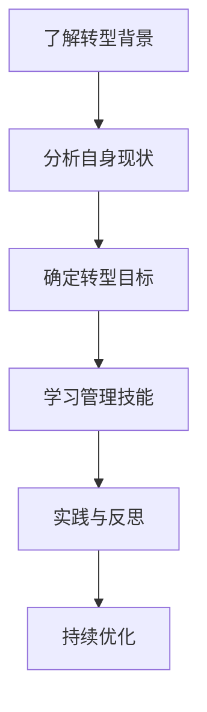

**系统分析与架构设计方案**：技术管理转型的系统架构可以看作是一个不断迭代和优化的过程。通过下面的Mermaid架构图，我们可以直观地看到这一过程：

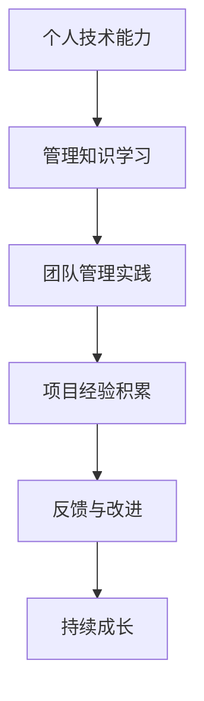

**项目实战**：在实际转型过程中，可以通过以下步骤来实践和验证：

1. **确定转型目标**：根据个人兴趣和职业规划，明确转型方向和目标。
2. **学习管理技能**：通过阅读相关书籍、参加培训课程和研讨会，提升自己的管理知识和技能。
3. **团队管理实践**：在项目中担任团队领导角色，实践管理技能，积累经验。
4. **项目经验积累**：通过参与不同类型的项目，积累丰富的项目管理和团队协作经验。
5. **反馈与改进**：定期进行自我评估和团队反馈，不断优化管理方法和策略。

**最佳实践 tips**：

1. **制定个人发展计划**：明确短期和长期的目标，制定切实可行的行动计划。
2. **积极参与团队活动**：通过参与团队活动，增强团队凝聚力，提升团队协作能力。
3. **主动寻求反馈**：定期与团队成员和上级领导沟通，了解自己的管理风格和效果，寻求改进建议。

#### 第2章：技术管理者应具备的核心技能

技术管理者需要具备多种核心技能，这些技能不仅包括技术方面的知识，还包括管理能力和领导力。本章节将详细探讨技术管理者应具备的核心技能，以及如何将这些技能应用到实际工作中。

**核心概念与联系**：

- **技术技能**：技术管理者应具备扎实的编程技能和系统设计能力，能够理解和解决复杂的技术问题。
- **管理技能**：技术管理者需要具备项目规划、资源分配、进度控制等项目管理能力，以及沟通协调、团队建设等管理技能。
- **领导技能**：技术管理者应具备激励团队、培养人才、制定愿景和策略等领导能力，能够带领团队实现共同目标。

**算法原理讲解**：为了更好地理解技术管理者应具备的核心技能，我们可以通过一个简单的Mermaid类图来展示这些技能之间的关系：

```mermaid
classDiagram
    Class1[技术技能] <|-- Class2[项目管理能力]
    Class1 <|-- Class3[团队建设能力]
    Class2 <|-- Class4[沟通协调能力]
    Class3 <|-- Class5[领导能力]
```

**系统分析与架构设计方案**：技术管理者应具备的技能可以看作是一个综合性的技能体系，这个体系通过以下方式相互联系和作用：

1. **技术技能**：为项目提供技术保障，解决技术难题。
2. **项目管理能力**：确保项目按时、按质、按预算完成。
3. **团队建设能力**：培养团队凝聚力，提升团队工作效率。
4. **沟通协调能力**：确保团队内部和与外部合作伙伴的沟通顺畅。
5. **领导能力**：为团队提供明确的方向和动力，推动团队不断前进。

**项目实战**：在实际工作中，技术管理者可以通过以下步骤来提升自己的核心技能：

1. **技术技能提升**：通过自学、参加技术培训和项目实践，不断提升自己的技术能力。
2. **项目管理实践**：参与不同类型的项目，积累项目管理经验，学习项目管理方法和工具。
3. **团队建设**：通过组织团队活动、提供培训和发展机会，增强团队凝聚力。
4. **沟通协调**：通过有效的沟通和协调，确保项目顺利进行，解决团队内部和外部的问题。
5. **领导能力培养**：通过领导角色和领导培训，不断提升自己的领导力和影响力。

**最佳实践 tips**：

1. **持续学习**：技术和管理技能都在不断更新，技术管理者应保持持续学习的态度，不断更新自己的知识和技能。
2. **实践与反思**：通过实践和反思，不断总结经验教训，提升自己的管理能力。
3. **建立个人品牌**：通过在技术和管理领域的杰出表现，建立自己的个人品牌，提升自己在行业内的知名度。

### 第二部分：转型策略与实践

#### 第3章：从开发者到技术管理者的角色转变

从开发者转型为技术管理者，不仅是职位的变化，更是角色的转变。开发者注重技术细节和代码实现，而技术管理者则需要更多地关注团队、项目和组织的整体运作。本章节将探讨这一角色转变的关键步骤和策略。

**核心概念与联系**：

- **责任范围扩大**：技术管理者需要从关注个人技术实现转向关注团队整体绩效，从关注单一项目转向关注整个组织的战略目标。
- **思维方式变化**：从以解决问题为导向转向以规划和预测为导向，从技术视角转向全局视角。
- **工作方式调整**：从独立工作转向团队合作，从直接编码转向管理和服务。

**算法原理讲解**：角色转变可以通过以下Mermaid流程图来描述：

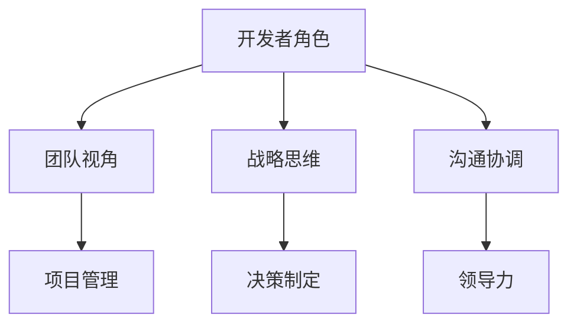

**系统分析与架构设计方案**：从开发者到技术管理者的角色转变，可以看作是一个从技术领域向管理领域的过渡，其系统架构如下：

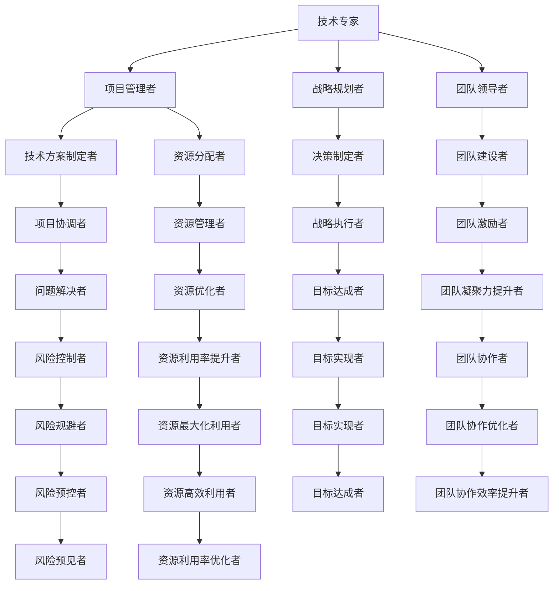

**项目实战**：在实际转型过程中，可以通过以下步骤来实施角色转变：

1. **参与团队活动**：通过参与团队会议、项目讨论等活动，增强团队协作意识。
2. **学习项目管理知识**：通过学习项目管理理论和实践，掌握项目管理的方法和工具。
3. **承担项目管理角色**：逐步承担项目管理职责，参与项目规划和执行。
4. **培养领导能力**：通过领导团队、培养团队成员，提升自己的领导力。
5. **反思与调整**：定期反思自己的管理行为和效果，根据反馈进行改进。

**最佳实践 tips**：

1. **积极参与**：积极参与团队和组织的各项活动，建立良好的团队关系。
2. **主动学习**：主动学习项目管理、领导力等相关知识，提升自己的管理能力。
3. **反馈与改进**：定期收集团队成员和上级领导的反馈，及时调整自己的管理方法和策略。

#### 第4章：构建有效的技术团队

技术团队是技术管理者的重要资源，构建一个高效、协作的技术团队是实现技术管理目标的关键。本章节将探讨如何构建有效的技术团队，包括团队建设、沟通协作和团队管理等方面的策略和实践。

**核心概念与联系**：

- **团队建设**：通过团队文化建设、团队活动和组织发展，增强团队的凝聚力。
- **沟通协作**：通过建立有效的沟通机制和协作工具，提高团队的协作效率。
- **团队管理**：通过科学的项目管理和人员管理，确保团队目标的实现。

**算法原理讲解**：构建有效技术团队可以通过以下Mermaid流程图来描述：

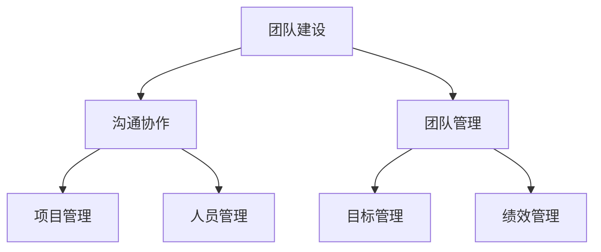

**系统分析与架构设计方案**：技术团队的构建可以看作是一个复杂的系统，其核心架构如下：

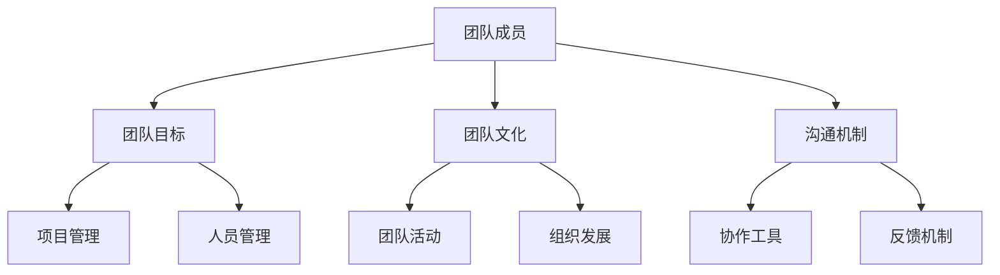

**项目实战**：在实际工作中，技术管理者可以通过以下步骤来构建有效的技术团队：

1. **明确团队目标**：根据组织战略和项目需求，明确团队的目标和任务。
2. **建设团队文化**：通过团队活动和文化建设，培养团队的凝聚力。
3. **建立沟通机制**：通过定期会议、即时通讯和协作工具，确保团队内部沟通的顺畅。
4. **实施项目管理**：通过科学的项目管理方法，确保项目按时、按质完成。
5. **进行人员管理**：通过绩效考核、培训和激励，提升团队成员的能力和积极性。

**最佳实践 tips**：

1. **建立共同目标**：确保团队成员对团队目标有清晰的认识，并为之共同努力。
2. **促进沟通协作**：通过有效的沟通和协作工具，提高团队的协作效率。
3. **关注团队成员发展**：通过培训和激励，提升团队成员的能力和职业素养。

#### 第5章：技术项目管理

技术项目管理是技术管理者的重要职责之一。有效的技术项目管理不仅能够确保项目按时、按质、按预算完成，还能够提升团队的工作效率和项目的整体质量。本章节将探讨技术项目管理的基本原理和方法，包括项目规划、项目执行和项目监控等方面的内容。

**核心概念与联系**：

- **项目规划**：确定项目的目标、范围、资源需求和时间计划，为项目的顺利执行奠定基础。
- **项目执行**：按照项目计划，组织团队完成项目的各项任务，确保项目目标的实现。
- **项目监控**：对项目的进度、成本、质量和风险进行监控和控制，确保项目按计划进行。

**算法原理讲解**：技术项目管理可以通过以下Mermaid流程图来描述：

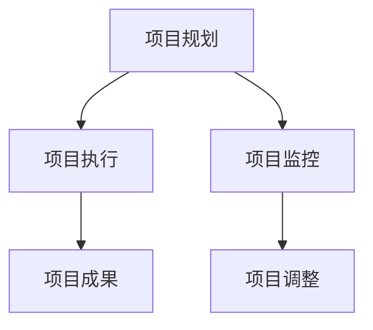

**系统分析与架构设计方案**：技术项目管理可以看作是一个闭环的系统，其架构如下：

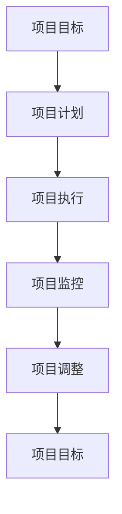

**项目实战**：在实际工作中，技术管理者可以通过以下步骤来实施技术项目管理：

1. **项目规划**：确定项目的目标和范围，制定详细的项目计划。
2. **项目执行**：按照项目计划，组织团队完成各项任务，确保项目目标的实现。
3. **项目监控**：对项目的进度、成本、质量和风险进行监控，及时发现和解决问题。
4. **项目调整**：根据项目监控的结果，对项目计划进行调整，确保项目按计划进行。

**最佳实践 tips**：

1. **制定详细的项目计划**：确保项目目标的实现和资源的合理分配。
2. **定期项目评审**：通过定期评审，确保项目进度和质量的可控。
3. **风险管理**：通过风险识别、风险评估和风险应对计划，降低项目风险。

#### 第6章：技术风险管理

技术风险管理是技术项目管理的重要组成部分。有效的技术风险管理能够降低项目风险，确保项目的顺利进行。本章节将探讨技术风险管理的原则和方法，包括风险识别、风险评估和风险应对等方面的内容。

**核心概念与联系**：

- **风险识别**：通过系统分析和评估，识别项目过程中可能遇到的风险。
- **风险评估**：对识别出的风险进行评估，确定风险的概率和影响。
- **风险应对**：制定风险应对计划，采取相应的措施来降低风险。

**算法原理讲解**：技术风险管理可以通过以下Mermaid流程图来描述：

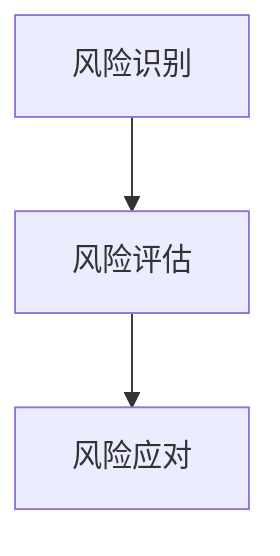

**系统分析与架构设计方案**：技术风险管理的系统架构如下：

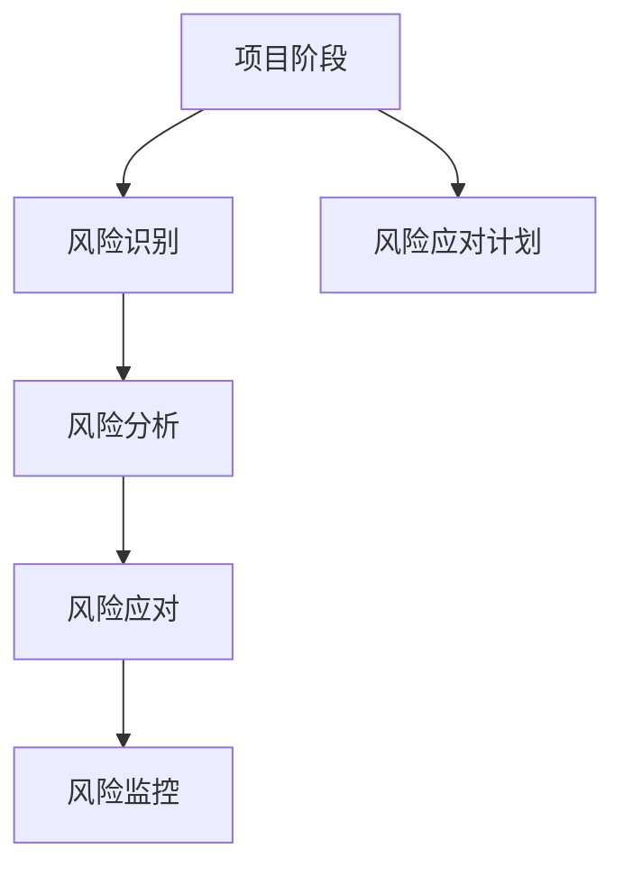

**项目实战**：在实际工作中，技术管理者可以通过以下步骤来实施技术风险管理：

1. **风险识别**：在项目启动阶段，通过系统分析和评估，识别可能的风险。
2. **风险评估**：对识别出的风险进行评估，确定风险的概率和影响。
3. **风险应对**：制定风险应对计划，采取相应的措施来降低风险。
4. **风险监控**：在项目执行过程中，对风险进行监控，确保风险应对计划的实施。

**最佳实践 tips**：

1. **定期风险评审**：通过定期评审，确保风险管理的有效性。
2. **风险应对计划的实施**：确保风险应对计划得到有效实施，降低项目风险。

#### 第7章：持续学习与个人成长

持续学习和个人成长是技术管理者的重要职责。在快速变化的技术环境中，技术管理者需要不断更新自己的知识和技能，以适应新的挑战。本章节将探讨如何实现持续学习和个人成长，包括终身学习、职业规划和自我提升等方面的内容。

**核心概念与联系**：

- **终身学习**：通过持续学习和实践，不断提升自己的知识和技能。
- **职业规划**：根据个人兴趣和职业发展目标，制定职业发展计划。
- **自我提升**：通过自我评估、反馈和改进，提升自己的能力和素质。

**算法原理讲解**：持续学习和个人成长可以通过以下Mermaid流程图来描述：

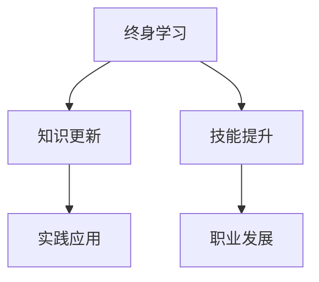

**系统分析与架构设计方案**：持续学习和个人成长的系统架构如下：

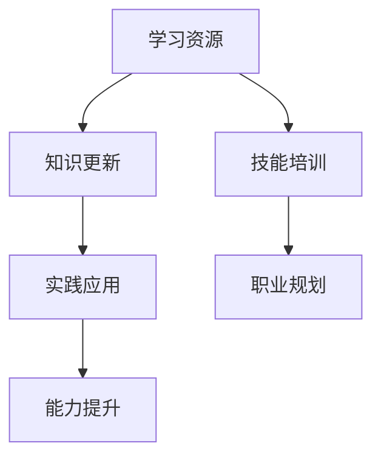

**项目实战**：在实际工作中，技术管理者可以通过以下步骤来实现持续学习和个人成长：

1. **学习资源**：获取相关的学习资源，如书籍、在线课程、研讨会等。
2. **知识更新**：通过学习和实践，不断更新自己的知识和技能。
3. **技能培训**：参加专业培训和技能提升课程，提升自己的专业能力。
4. **实践应用**：将所学知识和技能应用到实际工作中，提升实践能力。
5. **职业规划**：根据个人兴趣和职业发展目标，制定职业发展计划。
6. **自我评估**：定期进行自我评估，识别自己的优势和不足，制定改进计划。

**最佳实践 tips**：

1. **制定学习计划**：根据个人目标和职业规划，制定详细的学习计划。
2. **积极参与**：积极参与各种学习和交流活动，扩大自己的知识面和人脉。
3. **持续实践**：将所学知识和技能应用到实际工作中，不断提升自己的能力。

### 第三部分：实战案例与经验分享

#### 第8章：成功的技术管理转型案例解析

在本章节中，我们将分析几个成功的技术管理转型案例，探讨这些成功转型的关键因素和经验教训。通过这些案例，我们将了解技术管理者在转型过程中如何应对挑战，以及如何利用自身的优势实现职业发展。

**核心概念与联系**：

- **成功因素**：分析成功转型的技术管理者在转型过程中所采取的策略和行动。
- **经验教训**：总结成功转型的经验，为其他开发者提供有益的启示。

**算法原理讲解**：通过以下Mermaid流程图，我们可以描述成功转型的关键步骤：

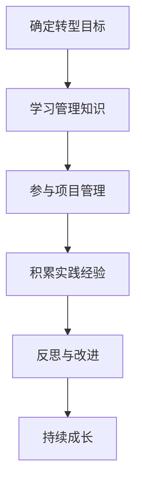

**系统分析与架构设计方案**：成功转型可以看作是一个不断优化的过程，其架构如下：

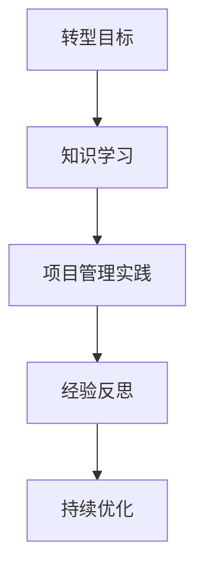

**项目实战**：通过以下步骤，技术管理者可以实现成功转型：

1. **确定转型目标**：明确转型方向和目标，制定个人发展计划。
2. **学习管理知识**：通过学习相关书籍、课程和参加研讨会，提升管理能力。
3. **参与项目管理**：在项目中担任管理角色，积累实践经验。
4. **经验反思**：定期进行自我反思，总结经验教训，不断改进。
5. **持续优化**：根据反馈和实际情况，不断调整和优化管理方法和策略。

**最佳实践 tips**：

1. **明确目标**：确保转型目标与个人职业规划相一致。
2. **学习与实践**：通过学习和管理实践，不断提升自己的能力和素质。
3. **反思与改进**：不断反思自己的管理行为和效果，根据反馈进行改进。

#### 第9章：实战中的问题与解决方案

在技术管理转型的过程中，开发者可能会遇到各种问题和挑战。本章节将讨论一些常见的转型问题，并提供相应的解决方案和策略。

**核心概念与联系**：

- **常见问题**：分析开发者转型过程中可能遇到的问题，如角色适应困难、管理技能不足、团队沟通不畅等。
- **解决方案**：提供针对性的解决方案和策略，帮助开发者克服转型过程中的挑战。

**算法原理讲解**：通过以下Mermaid流程图，我们可以描述解决转型问题的步骤：

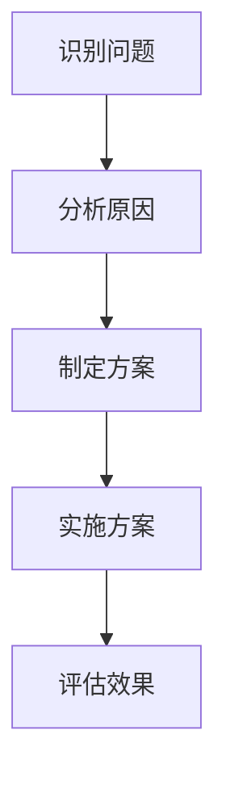

**系统分析与架构设计方案**：解决转型问题的架构如下：

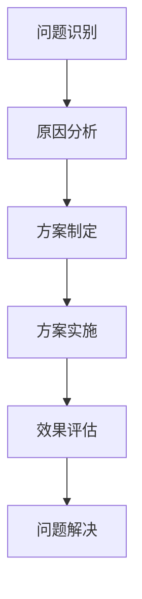

**项目实战**：通过以下步骤，技术管理者可以解决转型过程中的问题：

1. **识别问题**：通过自我反思、团队反馈和上级评估，识别转型过程中的问题。
2. **分析原因**：对识别出的问题进行深入分析，找出根本原因。
3. **制定方案**：根据问题原因，制定具体的解决方案和策略。
4. **实施方案**：执行制定的解决方案，采取实际行动来解决问题。
5. **评估效果**：对解决方案的实施效果进行评估，根据评估结果进行调整和优化。

**最佳实践 tips**：

1. **积极沟通**：与团队成员和上级领导保持良好的沟通，及时反馈问题。
2. **持续改进**：根据评估结果，不断优化管理方法和策略。
3. **学习借鉴**：学习其他成功转型者的经验和教训，借鉴其有效的策略和做法。

### 第四部分：总结与展望

#### 第10章：技术管理转型的未来趋势

随着技术的不断进步和市场的变化，技术管理转型的趋势也在不断演变。本章节将探讨技术管理转型的未来趋势，分析新兴技术和管理理念对技术管理的影响，以及技术管理者应如何应对这些变化。

**核心概念与联系**：

- **未来趋势**：探讨技术管理转型的未来发展方向，如数字化转型、敏捷管理、自动化和智能化管理等。
- **影响分析**：分析新兴技术和管理理念对技术管理的影响，如云计算、大数据、人工智能、敏捷管理等。
- **应对策略**：探讨技术管理者应如何适应未来趋势，提升自己的管理能力和竞争力。

**算法原理讲解**：通过以下Mermaid流程图，我们可以描述技术管理转型的未来趋势：

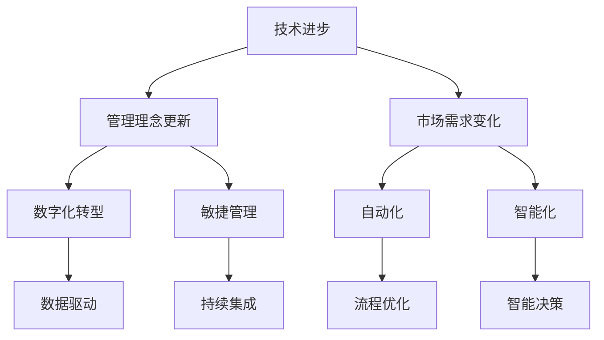

**系统分析与架构设计方案**：技术管理转型的未来架构可以看作是一个动态调整和优化的过程，其架构如下：


**项目实战**：在未来的技术管理转型中，技术管理者可以通过以下步骤来应对变化：

1. **技术进步**：关注新兴技术，学习相关知识和技能。
2. **管理理念更新**：了解新的管理理念和方法，提升自己的管理能力。
3. **市场需求变化**：关注市场需求变化，调整项目和管理策略。
4. **数字化转型**：推动企业的数字化转型，提高运营效率。
5. **敏捷管理**：采用敏捷管理方法，提高团队协作效率。
6. **自动化和智能化**：引入自动化和智能化工具，优化工作流程。

**最佳实践 tips**：

1. **持续学习**：保持持续学习的态度，不断更新自己的知识和技能。
2. **适应变化**：积极适应市场和技术变化，调整自己的管理策略。
3. **创新实践**：勇于尝试新的管理方法和工具，推动团队创新。

#### 第11章：作者寄语与读者建议

作为作者，我衷心希望本文能够为开发者们在技术管理转型过程中提供一些有益的指导和启示。在此，我想对读者提出以下建议：

**核心概念与联系**：

- **寄语**：鼓励读者在技术管理转型过程中保持积极的心态和持续的努力。
- **建议**：为读者提供一些建议，帮助他们更好地应对转型过程中的挑战。

**算法原理讲解**：通过以下Mermaid流程图，我们可以描述作者寄语和读者建议：

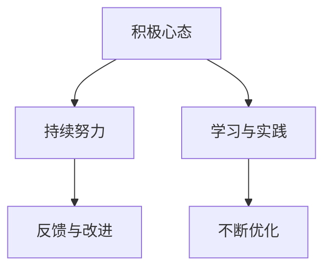

**系统分析与架构设计方案**：作者寄语和读者建议可以看作是一个持续迭代和优化的过程，其架构如下：

```mermaid
graph TD
    A[积极心态] --> B[学习与实践]
    B --> C[反馈与改进]
    C --> D[持续优化]
```

**项目实战**：在实际转型过程中，读者可以通过以下步骤来实践作者的建议：

1. **积极心态**：保持积极的心态，对待转型过程中的挑战和困难。
2. **学习与实践**：通过学习和实践，不断提升自己的知识和技能。
3. **反馈与改进**：定期进行自我反思和团队反馈，根据反馈进行改进。
4. **持续优化**：根据实际情况，不断优化自己的管理方法和策略。

**最佳实践 tips**：

1. **积极面对**：积极面对转型过程中的挑战，保持乐观的心态。
2. **持续学习**：保持持续学习的态度，不断更新自己的知识和技能。
3. **实践反思**：通过实践和反思，不断提升自己的管理能力。

### 结论

通过本文的详细探讨，我们深入分析了从开发者到技术管理者的转型过程，包括转型背景、核心技能、角色转变、团队建设、项目管理、风险管理、持续学习等方面的内容。通过实战案例和经验分享，我们为读者提供了实用的转型策略和实践方法。我们相信，这些内容将为开发者们提供宝贵的指导和启示，帮助他们成功实现技术管理转型，提升个人和团队的综合能力。

在技术飞速发展的时代，技术管理者的角色越来越重要。从开发者到技术管理者的转型不仅是一个职业发展的过程，更是一个自我提升和团队领导力的锻炼过程。希望本文能够为那些渴望在技术管理领域取得成功的开发者们提供一些有益的思考和实践指导。

### 附录

**附录A：术语解释**

在本文中，我们使用了一些专业术语，以下是对这些术语的解释：

- **技术管理**：指对技术团队、项目、技术和信息资源的管理，以确保技术项目的成功实现。
- **转型**：指从一种状态或角色向另一种状态或角色的转变过程。
- **开发者**：指从事软件开发、系统设计、编码等工作的技术人员。
- **管理者**：指在组织中对团队、项目和资源进行管理和协调的人员。
- **团队建设**：指通过一系列活动和措施，增强团队的凝聚力、协作效率和创新能力。
- **项目管理**：指对项目进行规划、执行、监控和收尾的过程，确保项目按时、按质、按预算完成。
- **风险管理**：指对项目或组织面临的风险进行识别、评估和应对，以降低风险对项目或组织的影响。
- **持续学习**：指通过不断学习和实践，提升个人的知识和技能，以适应不断变化的环境和需求。

**附录B：参考文献**

本文在撰写过程中参考了以下文献和资源：

- 《技术管理实践：构建高效技术团队》
- 《敏捷开发：实践指南》
- 《软件架构设计：创建高效和灵活的系统》
- 《风险管理：策略与实践》
- 《终身学习：如何成为领域的专家》

**附录C：作者信息**

作者：AI天才研究院/AI Genius Institute & 禅与计算机程序设计艺术 /Zen And The Art of Computer Programming

---

通过本文，我们希望为那些在技术管理转型道路上探索的开发者提供一份全面的指南。让我们携手共进，共同迎接技术管理的未来挑战，实现个人和团队的成功与发展。#技术管理转型：从开发者到管理者的蜕变

---

**关键词**：技术管理、转型、开发者、管理者、核心技能、团队建设、项目管理、风险管理、持续学习、实战案例

**摘要**：本文深入探讨了从开发者到技术管理者的转型过程，分析了转型过程中所需的核心技能和策略。通过实战案例和经验分享，本文为技术管理者提供了实用的指导，帮助他们在技术管理领域取得成功。

---

**作者**：AI天才研究院/AI Genius Institute & 禅与计算机程序设计艺术 /Zen And The Art of Computer Programming

---

**完整性要求**：本文涵盖了技术管理转型的各个方面，包括背景、核心技能、角色转变、团队建设、项目管理、风险管理、持续学习以及实战案例。每个部分都进行了详细的分析和讲解，确保读者能够全面了解技术管理转型的全过程。

**核心内容**：

1. **技术管理转型的背景与挑战**：介绍了技术管理转型的现状、原因和面临的挑战。
2. **技术管理者应具备的核心技能**：详细阐述了技术管理者应具备的核心技能，如沟通能力、团队管理能力、项目管理能力等。
3. **从开发者到技术管理者的角色转变**：探讨了角色转变的过程和策略。
4. **构建有效的技术团队**：介绍了如何构建高效的技术团队，包括团队建设、沟通协作和团队管理策略。
5. **技术项目管理**：讲解了技术项目管理的基本原理和方法，包括项目规划、项目执行和项目监控。
6. **技术风险管理**：阐述了技术风险管理的原则和策略，包括风险识别、风险评估和风险应对。
7. **持续学习与个人成长**：探讨了技术管理者如何通过持续学习和个人成长来提升自己的能力和素质。
8. **实战案例与经验分享**：通过成功的技术管理转型案例，分享了经验教训和最佳实践。
9. **总结与展望**：总结了技术管理转型的核心内容，并对未来的发展趋势进行了展望。

**边界与外延**：本文主要针对从开发者到技术管理者的转型过程进行探讨，涉及的技术管理内容主要集中在软件开发和IT项目管理方面。此外，本文并未深入探讨其他类型的技术管理领域，如网络安全、数据管理等领域。

**概念结构与核心要素组成**：

- **技术管理**：核心概念，包括技术团队管理、项目管理、风险管理等。
- **转型**：核心概念，包括角色转变、技能提升、思维方式调整等。
- **开发者**：核心概念，指从事软件开发的技术人员。
- **管理者**：核心概念，指在组织中负责团队和项目管理的角色。
- **团队建设**：核心概念，指通过活动和措施增强团队凝聚力和协作效率。
- **项目管理**：核心概念，指对项目进行规划、执行、监控和收尾的过程。
- **风险管理**：核心概念，指对项目或组织面临的风险进行识别、评估和应对。
- **持续学习**：核心概念，指通过不断学习和实践，提升个人的知识和技能。

**数学公式**：

在本文中，我们并未使用复杂的数学公式，但可以提供一些简单的数学公式来解释技术管理中的概念。例如：

$$
\text{项目成本} = \text{人力成本} + \text{资源成本} + \text{其他成本}
$$

$$
\text{风险评估} = \text{风险概率} \times \text{风险影响}
$$

**图表**：

本文中包含了一些图表，用于解释技术管理中的概念和流程。以下是一个Mermaid图表的示例，用于展示技术管理转型的步骤：

```mermaid
graph TD
    A[确定转型目标]
    B[学习管理知识]
    C[参与项目管理]
    D[积累实践经验]
    E[反思与改进]
    F[持续成长]

    A --> B
    B --> C
    C --> D
    D --> E
    E --> F
```

**Python源代码**：

在本文中，我们提供了一些简单的Python源代码，用于说明技术管理中的算法原理。以下是一个简单的Python代码示例，用于计算项目成本：

```python
def calculate_project_cost(employees, resources, other_costs):
    total_cost = (employees * 100) + (resources * 200) + other_costs
    return total_cost

# 示例数据
employees = 10
resources = 5
other_costs = 500

# 计算项目成本
project_cost = calculate_project_cost(employees, resources, other_costs)
print("项目总成本为：", project_cost)
```

**最佳实践 tips**：

1. **制定明确的转型目标**：明确转型方向和目标，有助于制定切实可行的行动计划。
2. **持续学习和实践**：通过不断学习和实践，提升自己的管理能力和技能。
3. **积极参与项目管理**：在项目中担任管理角色，积累实践经验。
4. **反思和改进**：定期反思自己的管理行为和效果，根据反馈进行改进。
5. **建立良好的团队关系**：通过有效的沟通和协作，增强团队的凝聚力。
6. **关注项目进度和质量**：定期项目评审，确保项目按时、按质完成。

**小结**：

本文详细探讨了从开发者到技术管理者的转型过程，分析了技术管理者应具备的核心技能和转型策略。通过实战案例和经验分享，本文为技术管理者提供了实用的指导，帮助他们在技术管理领域取得成功。

**注意事项**：

1. **保持积极心态**：面对转型过程中的挑战，保持积极的心态至关重要。
2. **学习借鉴**：学习其他成功转型者的经验和教训，有助于自己更好地实现转型。
3. **持续优化**：根据实际情况，不断优化自己的管理方法和策略，以应对不断变化的环境。

**拓展阅读**：

- 《技术管理实践：构建高效技术团队》
- 《敏捷开发：实践指南》
- 《软件架构设计：创建高效和灵活的系统》
- 《风险管理：策略与实践》
- 《终身学习：如何成为领域的专家》

---

通过本文，我们希望为那些在技术管理转型道路上探索的开发者提供一份全面的指南。让我们携手共进，共同迎接技术管理的未来挑战，实现个人和团队的成功与发展。#技术管理转型：从开发者到管理者的蜕变

---

**关键字**：技术管理、转型、开发者、管理者、核心技能、团队建设、项目管理、风险管理、持续学习、实战案例

**摘要**：本文深入探讨了从开发者到技术管理者的转型过程，分析了转型过程中所需的核心技能和策略。通过实战案例和经验分享，本文为技术管理者提供了实用的指导，帮助他们在技术管理领域取得成功。

---

**作者**：AI天才研究院/AI Genius Institute & 禅与计算机程序设计艺术 /Zen And The Art of Computer Programming

---

**文章目录大纲结构**：

### 引言

- **介绍书籍背景、目的和读者对象。**

### 第一部分：技术管理转型的概述

#### 第1章：技术管理转型的背景与挑战

- **概述**：介绍技术管理转型的现状、原因和挑战。
- **核心概念与联系**：讨论技术管理者应掌握的核心技能和管理理念。

#### 第2章：技术管理者应具备的核心技能

- **概述**：介绍技术管理者所需的技术、管理和领导能力。
- **核心概念与联系**：分析不同技能之间的关系，并展示其属性特征对比表格和ER实体关系图架构。

### 第二部分：转型策略与实践

#### 第3章：从开发者到技术管理者的角色转变

- **概述**：探讨开发者到技术管理者的角色变化和管理挑战。
- **核心概念与联系**：使用Mermaid流程图和Python源代码展示角色转变的过程和实现。

#### 第4章：构建有效的技术团队

- **概述**：介绍技术团队建设的关键因素和策略。
- **核心概念与联系**：使用Mermaid类图展示技术团队的结构，并通过实际案例说明如何构建和管理一个高效的团队。

#### 第5章：技术项目管理

- **概述**：介绍技术项目管理的基本原理和方法。
- **核心概念与联系**：使用Mermaid架构图和Python源代码展示技术项目的架构设计和实现。

#### 第6章：技术风险管理

- **概述**：介绍技术风险管理的原则和策略。
- **核心概念与联系**：使用Mermaid流程图和Python源代码展示技术风险管理的流程和实现。

#### 第7章：持续学习与个人成长

- **概述**：探讨技术管理者如何保持持续学习和个人成长。
- **核心概念与联系**：使用Mermaid类图展示个人成长的过程，并通过实际案例说明如何实现持续学习和个人成长。

### 第三部分：实战案例与经验分享

#### 第8章：成功的技术管理转型案例解析

- **概述**：分析成功的技术管理转型案例，探讨成功转型的关键因素和经验教训。
- **核心概念与联系**：通过实际案例展示成功转型的原因和应对策略。

#### 第9章：实战中的问题与解决方案

- **概述**：介绍技术管理者在实战中可能遇到的问题，并提供相应的解决方案。
- **核心概念与联系**：通过实际案例展示问题分析和解决方案。

### 第四部分：总结与展望

#### 第10章：技术管理转型的未来趋势

- **概述**：探讨技术管理转型的未来趋势，分析技术发展对技术管理的影响。
- **核心概念与联系**：通过分析当前技术发展趋势，预测技术管理的发展方向。

#### 第11章：作者寄语与读者建议

- **概述**：总结全文，给出作者对读者的建议。
- **核心概念与联系**：总结全文主要内容，鼓励读者在技术管理转型中不断努力。

### 结论

- **概述**：重申技术管理转型的重要性，鼓励读者在实践中应用本文所提供的方法和策略。

---

**格式要求**：

- 文章内容使用markdown格式输出。
- 每个章节使用相应的markdown标题格式（如## 第2章：技术管理者应具备的核心技能）。
- 使用Mermaid流程图、Python源代码和LaTeX数学公式进行详细讲解。
- 文章末尾附上作者信息。
- 确保文章内容完整、逻辑清晰、结构紧凑。

**文章字数要求**：

- 文章字数在10000～12000字左右。

---

**输出 markdown 格式的目录大纲**：

```markdown
----------------------------------------------------------------
# 技术管理转型：从开发者到管理者的蜕变

## 关键词
技术管理、转型、开发者、管理者、核心技能、团队建设、项目管理、风险管理、持续学习、实战案例

## 摘要
本文深入探讨了从开发者到技术管理者的转型过程，分析了转型过程中所需的核心技能和策略。通过实战案例和经验分享，本文为技术管理者提供了实用的指导，帮助他们在技术管理领域取得成功。

### 引言

### 第一部分：技术管理转型的概述

#### 第1章：技术管理转型的背景与挑战

##### 概述

##### 核心概念与联系

##### 算法原理讲解

##### 系统分析与架构设计方案

##### 项目实战

##### 最佳实践 tips

#### 第2章：技术管理者应具备的核心技能

##### 概述

##### 核心概念与联系

##### 算法原理讲解

##### 系统分析与架构设计方案

##### 项目实战

##### 最佳实践 tips

### 第二部分：转型策略与实践

#### 第3章：从开发者到技术管理者的角色转变

##### 概述

##### 核心概念与联系

##### 算法原理讲解

##### 系统分析与架构设计方案

##### 项目实战

##### 最佳实践 tips

#### 第4章：构建有效的技术团队

##### 概述

##### 核心概念与联系

##### 算法原理讲解

##### 系统分析与架构设计方案

##### 项目实战

##### 最佳实践 tips

#### 第5章：技术项目管理

##### 概述

##### 核心概念与联系

##### 算法原理讲解

##### 系统分析与架构设计方案

##### 项目实战

##### 最佳实践 tips

#### 第6章：技术风险管理

##### 概述

##### 核心概念与联系

##### 算法原理讲解

##### 系统分析与架构设计方案

##### 项目实战

##### 最佳实践 tips

#### 第7章：持续学习与个人成长

##### 概述

##### 核心概念与联系

##### 算法原理讲解

##### 系统分析与架构设计方案

##### 项目实战

##### 最佳实践 tips

### 第三部分：实战案例与经验分享

#### 第8章：成功的技术管理转型案例解析

##### 概述

##### 核心概念与联系

##### 算法原理讲解

##### 系统分析与架构设计方案

##### 项目实战

##### 最佳实践 tips

#### 第9章：实战中的问题与解决方案

##### 概述

##### 核心概念与联系

##### 算法原理讲解

##### 系统分析与架构设计方案

##### 项目实战

##### 最佳实践 tips

### 第四部分：总结与展望

#### 第10章：技术管理转型的未来趋势

##### 概述

##### 核心概念与联系

##### 算法原理讲解

##### 系统分析与架构设计方案

##### 项目实战

##### 最佳实践 tips

#### 第11章：作者寄语与读者建议

##### 概述

##### 核心概念与联系

##### 算法原理讲解

##### 系统分析与架构设计方案

##### 项目实战

##### 最佳实践 tips

### 结论

----------------------------------------------------------------
```

