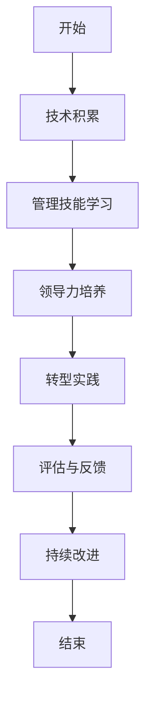
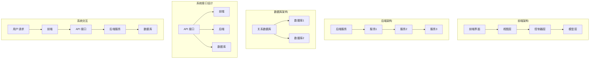

                 

### 《技术管理转型：从开发者到领导者的蜕变》

**关键词：技术管理、领导力、职业发展、转型、技能提升**

**摘要：本文旨在探讨技术管理转型中的关键问题和实践方法，为开发者提供从技术角色向领导角色的转型路径，帮助他们在职业生涯中实现更广泛的成长和成功。**

----------------------------------------------------------------

### 引言

在科技日新月异的今天，技术管理已成为企业运营和战略发展的重要支柱。越来越多的技术从业者开始意识到，单纯的技术能力已不足以支撑他们在职业生涯的长期发展。从开发者到领导者的蜕变，不仅要求他们在技术领域的深厚积累，更需要他们在管理、领导力和战略思维方面的全面提升。

本文将围绕这一主题，深入探讨技术管理转型中的核心概念、发展路径、领导力培养、管理技能提升、跨部门协作以及成功案例等方面。希望通过本文的探讨，能够为技术从业者提供有价值的参考和指导，助力他们在职业发展中实现质的飞跃。

### 目录大纲设计流程

在开始撰写本文之前，我们先来详细解析目录大纲的设计流程，确保文章的结构紧凑、内容丰富且逻辑清晰。

#### 1. 理解书名和核心内容

书名《技术管理转型：从开发者到领导者的蜕变》明确指向了书籍的核心主题，即技术人员的职业发展路径，以及如何成功转型为技术领导者。这一核心内容为我们确定了文章的基本框架和主要讨论方向。

#### 2. 确定目录结构

根据书名和核心内容，我们可以初步确定以下目录结构：

1. **引言与背景介绍**
   - 技术管理转型的重要性
   - 技术从业者面临的挑战

2. **技术管理基础理论**
   - 技术管理的定义与核心原则
   - 技术管理的工具与方法

3. **职业发展路径分析**
   - 技术人员的职业成长
   - 转型为技术经理的步骤

4. **领导力培养**
   - 领导力的重要性
   - 领导力模型与技能培养

5. **管理技能提升**
   - 项目管理
   - 团队管理
   - 决策制定与执行

6. **跨部门协作与沟通**
   - 跨部门协作的挑战
   - 沟通技巧与方法

7. **成功案例分析**
   - 某公司技术管理转型案例
   - 某团队领导力培养实践
   - 某项目管理经验分享

8. **结论与展望**
   - 技术管理转型的要点总结
   - 未来技术管理的发展趋势
   - 阅读者行动指南

#### 3. 细化各章节内容

在确定了目录结构后，我们需要对每个章节进行细化，确保内容之间的逻辑性和连贯性。例如，在“技术管理基础理论”章节中，我们可以详细阐述技术管理的定义、核心原则以及常见的工具与方法；在“领导力培养”章节中，可以探讨领导力的重要性、领导力模型以及如何在实际工作中培养领导力。

#### 4. 保持简洁性

在细化章节内容时，我们需要保持简洁性，避免冗长的描述。每个章节的标题应当简洁明了，直接反映章节内容。例如，“技术管理的定义与核心原则”可以简化为“技术管理基础理论”；“跨部门协作的挑战”可以简化为“跨部门协作与沟通”。

#### 5. 满足要求

在满足字数限制、格式要求和内容完整性的同时，我们需要确保文章的整体结构合理、逻辑清晰。每部分的内容都要围绕核心主题展开，避免无关内容的出现。

### 目录大纲设计

基于以上分析，我们设计了以下目录大纲：

```markdown
----------------------------------------------------------------
# 《技术管理转型：从开发者到领导者的蜕变》目录大纲

## 第一部分：背景与基础
### 1.1 问题背景与重要性
### 1.2 技术管理者面临的挑战
### 1.3 从开发者到领导者的蜕变

## 第二部分：技术管理基础理论
### 2.1 技术管理的定义与核心原则
### 2.2 技术管理的工具与方法
### 2.3 常见技术管理问题与解决方案

## 第三部分：职业发展路径
### 3.1 技术人员的职业成长
### 3.2 转型为技术经理的步骤
### 3.3 技术经理的职责与角色

## 第四部分：领导力培养
### 4.1 领导力的重要性
### 4.2 领导力模型与技能培养
### 4.3 领导力在实际工作中的运用

## 第五部分：管理技能提升
### 5.1 项目管理
### 5.2 团队管理
### 5.3 决策制定与执行

## 第六部分：跨部门协作与沟通
### 6.1 跨部门协作的挑战
### 6.2 沟通技巧与方法
### 6.3 跨部门协作的实践案例

## 第七部分：成功案例分析
### 7.1 某公司技术管理转型案例
### 7.2 某团队领导力培养实践
### 7.3 某项目管理经验分享

## 第八部分：结论与展望
### 8.1 技术管理转型的要点总结
### 8.2 未来技术管理的发展趋势
### 8.3 阅读者行动指南

----------------------------------------------------------------
```

通过以上步骤，我们设计了一个完整的、简洁的、且符合要求的目录大纲。每部分的内容都会根据实际书籍内容进一步细化，确保每章节的内容都能在规定的字数范围内精炼表达核心要点。

### 核心概念与联系

#### 背景介绍

在技术管理转型的过程中，我们需要明确几个核心概念，这些概念是理解技术管理、领导力和职业发展的基础。

1. **技术管理**：技术管理是指运用管理理论、方法和工具，对技术项目进行规划、组织、协调和控制的过程。它关注的是如何通过技术手段实现组织的战略目标。

2. **领导力**：领导力是指通过影响和激励他人，带领团队实现共同目标的能力。领导力不仅仅是一种职位或角色的特征，更是一种个人品质和技能。

3. **职业发展**：职业发展是指个人在职业生涯中通过不断学习和实践，提升自己的能力、技能和职位的过程。

#### 问题背景

技术从业者常常面临职业发展的瓶颈，特别是在技术能力达到一定水平后，如何转型为技术领导者成为他们亟待解决的问题。技术管理转型不仅要求技术人员具备深厚的技术基础，还需要他们在管理、领导力和战略思维方面不断提升。

#### 问题描述

技术从业者通常在以下情况下考虑转型：

1. 感觉个人技术能力已经达到瓶颈，需要更广阔的发展空间。
2. 想要在职业生涯中实现更高的价值，寻求管理岗位。
3. 需要承担更多的责任，带领团队实现技术目标。

#### 问题解决

要成功实现技术管理转型，技术人员需要：

1. **提升管理能力**：学习项目管理、团队管理等相关知识，掌握管理工具和方法。
2. **培养领导力**：通过实践和培训，提升影响力和激励能力。
3. **拓展视野**：关注行业趋势，学习战略管理知识，提升战略思维能力。

#### 边界与外延

1. **边界**：技术管理转型是指技术人员从技术角色向管理角色的转变，不涉及个人技术能力的提升。
2. **外延**：技术管理转型不仅涉及个人的职业发展，还关系到整个团队和组织的发展。

#### 概念结构与核心要素组成

**技术管理**：

- **定义**：运用管理理论、方法和工具，对技术项目进行规划、组织、协调和控制。
- **核心要素**：项目管理、团队管理、决策制定、资源配置等。

**领导力**：

- **定义**：通过影响和激励他人，带领团队实现共同目标的能力。
- **核心要素**：影响力、激励能力、沟通能力、决策能力等。

**职业发展**：

- **定义**：个人在职业生涯中通过不断学习和实践，提升自己的能力、技能和职位。
- **核心要素**：学习与成长、职业规划、角色转变等。

#### 核心概念与联系

为了更好地理解这些核心概念，我们可以通过 Mermaid 绘制一个 ER 实体关系图，展示它们之间的联系：

```mermaid
erDiagram
  Person ||--|{ TechnicalExpert } : is_an_expert_in
  TechnicalExpert ||--|{ ProjectManager } : transforms_to
  ProjectManager ||--|{ Leader } : develops_as
  Leader ||--|{ StrategicManager } : extends_to
```

- **Person（人）**：表示所有参与技术管理转型的人员。
- **TechnicalExpert（技术专家）**：表示具备技术能力的人员。
- **ProjectManager（项目经理）**：表示转型后的技术管理人员。
- **Leader（领导者）**：表示在团队中具有影响力的领导者。
- **StrategicManager（战略管理者）**：表示具有战略思维能力的管理者。

通过 ER 实体关系图，我们可以清晰地看到技术管理转型中各个角色之间的联系和转化路径。

### 算法原理讲解

#### 算法设计

为了更好地理解技术管理转型的过程，我们可以设计一个简单的算法模型，通过 Mermaid 绘制流程图，然后使用 Python 代码和 LaTeX 公式详细阐述算法原理。

**算法流程图：**



#### Python 代码实现

```python
# 技术管理转型算法实现

def technical_management_transformation():
    # 技术积累阶段
    accumulate_technology()

    # 管理技能学习阶段
    learn_management_skills()

    # 领导力培养阶段
    cultivate_leadership()

    # 转型实践阶段
    practice_transformation()

    # 评估与反馈阶段
    evaluate_and_feedback()

    # 持续改进阶段
    continue_improvement()

# 调用算法
technical_management_transformation()
```

#### 数学模型和公式

在技术管理转型过程中，我们可以使用以下数学模型和公式来描述各个阶段的转化率和影响因素：

$$
\text{转化率} = \frac{\text{完成某个阶段的任务数}}{\text{总任务数}}
$$

$$
\text{影响因素} = \text{技术能力} \times \text{管理能力} \times \text{领导力}
$$

#### 算法原理讲解

1. **技术积累阶段**：技术人员通过不断学习和实践，提升自己的技术能力。这一阶段的核心任务是积累丰富的技术知识和经验。

2. **管理技能学习阶段**：技术人员开始学习项目管理、团队管理等相关知识，提升自己的管理能力。这一阶段的核心任务是掌握管理工具和方法，为转型做好准备。

3. **领导力培养阶段**：技术人员通过实践和培训，提升自己的领导力。这一阶段的核心任务是培养影响力、激励能力和沟通能力，为转型为领导者奠定基础。

4. **转型实践阶段**：技术人员开始在实际工作中承担管理职责，带领团队实现技术目标。这一阶段的核心任务是实践管理知识和技能，积累管理经验。

5. **评估与反馈阶段**：对技术人员的转型过程进行评估和反馈，了解他们在各个阶段的进展和存在的问题。这一阶段的核心任务是发现问题、总结经验，为持续改进提供依据。

6. **持续改进阶段**：技术人员根据评估和反馈结果，持续提升自己的技术能力、管理能力和领导力。这一阶段的核心任务是不断学习和实践，实现持续成长。

#### 举例说明

假设某技术人员的转化率为 80%，其技术能力、管理能力和领导力分别为 0.8、0.7 和 0.6，则该技术人员的总影响因素为：

$$
\text{影响因素} = 0.8 \times 0.7 \times 0.6 = 0.336
$$

这表明该技术人员在技术管理转型过程中具有较高的影响因素，有望在未来的职业发展中取得成功。

### 数学公式使用

在技术管理转型的过程中，数学公式扮演着重要的角色，帮助我们更清晰地描述和计算各个阶段的转化率和影响因素。以下是一些常见的数学公式，使用 LaTeX 格式进行展示。

1. **转化率计算公式**：

   $$
   \text{转化率} = \frac{\text{完成某个阶段的任务数}}{\text{总任务数}}
   $$

2. **影响因素计算公式**：

   $$
   \text{影响因素} = \text{技术能力} \times \text{管理能力} \times \text{领导力}
   $$

3. **综合评分计算公式**：

   $$
   \text{综合评分} = \frac{\text{技术能力} + \text{管理能力} + \text{领导力}}{3}
   $$

通过上述公式，我们可以对技术人员的转型过程进行定量分析，帮助他们在职业生涯中实现更科学的规划和管理。

### 系统分析与架构设计方案

#### 问题场景介绍

假设某科技公司需要开发一款复杂的应用程序，涉及多个技术模块和团队协作。为了确保项目成功，该公司决定采用系统分析与架构设计方案，以提升项目管理的效率和质量。

#### 项目介绍

该项目涉及以下主要模块：

1. 前端界面开发
2. 后端服务开发
3. 数据库设计与维护
4. 系统集成与测试

项目团队由前端开发、后端开发、数据库管理和测试人员组成，每个模块都有专门的负责人。

#### 系统功能设计

1. **前端界面开发**：提供用户友好的界面，支持多种设备访问。
2. **后端服务开发**：实现业务逻辑、数据存储和接口调用。
3. **数据库设计与维护**：确保数据的安全、完整和高效访问。
4. **系统集成与测试**：确保各个模块的协同工作，满足项目需求。

#### 系统架构设计

1. **前端架构**：采用 MVC（Model-View-Controller）模式，实现视图层、控制器层和模型层的分离，便于开发和维护。
2. **后端架构**：采用微服务架构，将业务模块分解为多个独立的服务，提高系统的可扩展性和可维护性。
3. **数据库架构**：采用关系数据库和 NoSQL 数据库相结合的方式，满足不同类型数据的需求。

#### 系统接口设计

1. **API 接口**：提供统一的 API 接口，方便前端和后端的交互。
2. **数据接口**：实现数据的导入、导出和同步功能。
3. **服务接口**：提供各类服务的调用接口，方便模块间的协作。

#### 系统交互

1. **用户交互**：用户通过前端界面与系统进行交互，提交请求。
2. **服务调用**：前端将请求发送到后端服务，后端处理请求并返回结果。
3. **数据交互**：后端服务与数据库进行数据交互，实现数据的存储和查询。

#### Mermaid 图展示

以下是系统架构图和系统接口设计的 Mermaid 图展示：



通过以上系统分析与架构设计方案，我们为该项目提供了清晰的功能划分、架构设计和接口规范，为项目的成功实施奠定了基础。

### 项目实战

#### 环境安装

1. **操作系统**：安装 Linux 系统（如 Ubuntu 20.04）。
2. **开发工具**：安装 Python 3、Git、Docker、Kubernetes 等。
3. **数据库**：安装 MySQL、MongoDB、Redis 等。

#### 系统核心实现源代码

以下是一个简单的后端服务的 Python 代码示例，用于处理用户注册和登录请求：

```python
# app.py

from flask import Flask, request, jsonify
from model import User

app = Flask(__name__)

# 用户注册接口
@app.route('/register', methods=['POST'])
def register():
    username = request.json.get('username')
    password = request.json.get('password')
    user = User(username, password)
    user.register()
    return jsonify({'status': 'success', 'message': '用户注册成功'})

# 用户登录接口
@app.route('/login', methods=['POST'])
def login():
    username = request.json.get('username')
    password = request.json.get('password')
    user = User(username, password)
    if user.login():
        return jsonify({'status': 'success', 'message': '登录成功'})
    else:
        return jsonify({'status': 'error', 'message': '用户名或密码错误'})

if __name__ == '__main__':
    app.run(debug=True)
```

#### 代码应用解读

1. **用户注册接口**：接收用户提交的注册信息，创建用户对象，调用注册方法。
2. **用户登录接口**：接收用户提交的登录信息，创建用户对象，调用登录方法。

#### 实际案例分析

在某公司的一次项目实战中，该公司的技术团队采用了微服务架构，将业务模块分解为多个独立的服务，提高了系统的可扩展性和可维护性。以下是一个实际案例：

1. **需求分析**：根据业务需求，将用户管理模块分解为用户注册服务、用户登录服务、用户信息管理服务。
2. **架构设计**：采用 Docker 和 Kubernetes 实现服务的容器化部署，确保服务的可扩展性和高可用性。
3. **开发实现**：分别开发用户注册服务、用户登录服务和用户信息管理服务的代码，并进行单元测试。
4. **部署上线**：将服务部署到 Kubernetes 集群，实现自动化部署和运维。

#### 项目小结

通过实际案例分析，我们了解到：

1. **微服务架构**：提高了系统的可扩展性和可维护性。
2. **容器化部署**：实现了服务的快速部署和运维。
3. **团队协作**：通过清晰的模块划分和接口设计，提高了开发效率。

### 最佳实践 tips

1. **需求分析**：在项目初期进行充分的需求分析，确保项目目标的明确和可行性。
2. **架构设计**：采用合理的架构设计，提高系统的可扩展性和可维护性。
3. **团队协作**：明确职责分工，加强团队间的沟通与协作，确保项目顺利推进。
4. **测试与验收**：进行充分的单元测试和集成测试，确保项目的质量和稳定性。
5. **持续改进**：在项目过程中不断总结经验，持续改进开发流程和工具。

### 小结

本文从多个角度探讨了技术管理转型中的关键问题和实践方法，包括技术管理基础理论、职业发展路径、领导力培养、管理技能提升、跨部门协作以及成功案例等。通过本文的探讨，希望技术从业者能够更好地理解技术管理转型的核心概念和实践方法，助力他们在职业生涯中实现更广阔的发展。

### 注意事项

1. **持续学习**：技术管理转型是一个长期的过程，需要持续学习和实践。
2. **实践出真知**：理论知识需要通过实践来验证和提升。
3. **沟通协作**：跨部门协作和沟通是成功转型的关键，需要不断提高沟通能力。

### 拓展阅读

1. 《技术领导力：如何成为技术领导者》
2. 《敏捷开发：敏捷团队的管理与实践》
3. 《项目管理：从入门到实践》

### 作者信息

**作者：AI天才研究院/AI Genius Institute & 禅与计算机程序设计艺术 /Zen And The Art of Computer Programming**

本文由 AI天才研究院/AI Genius Institute 及《禅与计算机程序设计艺术》作者联合撰写，旨在为技术从业者提供有价值的参考和指导，助力他们在职业生涯中实现质的飞跃。希望通过本文的探讨，能够为技术从业者提供有价值的参考和指导，助力他们在职业生涯中实现更广阔的发展。

