                 

### 定义文章结构

为了确保文章的逻辑清晰、结构紧凑，并吸引读者，我们将文章分为以下几个主要部分：

1. **引言**：简要介绍技术规划的高度、深度和锐度，概述文章的目的和核心内容。
2. **背景与核心概念**：详细解释技术规划的高度、深度和锐度的定义、重要性以及它们之间的关系。
3. **高度规划方法**：探讨高度规划的具体方法，包括战略视角、长期规划和短期规划。
4. **深度规划方法**：深入讨论如何获取和运用深度的技术知识，以及如何进行深度规划。
5. **锐度规划方法**：分析锐度规划的关键要素，如精确性、实用性和创新性。
6. **算法与数学模型**：介绍相关算法原理和数学模型，并使用Mermaid和Python进行可视化讲解。
7. **系统架构与设计**：探讨系统架构和设计模式，使用Mermaid图展示设计方案。
8. **项目实施与案例研究**：提供实际项目案例，展示技术规划的应用和实践。
9. **最佳实践与总结**：总结文章要点，提供最佳实践建议和拓展阅读资源。
10. **作者信息**：在文章末尾附上作者信息。

### 文章关键词

- 技术规划
- 高度规划
- 深度规划
- 锐度规划
- 战略视角
- 算法原理
- 数学模型
- 系统架构
- 项目案例

### 摘要

本文深入探讨了技术规划的三要素：高度、深度和锐度。首先，我们定义了这三个核心概念，并阐述了它们在技术规划中的重要性。接着，我们分别从高度规划、深度规划和锐度规划的角度出发，详细介绍了相关的方法和策略。通过算法原理讲解和系统架构设计，我们展示了技术规划的实际应用。最后，通过项目案例研究和最佳实践总结，我们强调了技术规划在实践中的关键作用，并为读者提供了进一步的学习资源。

## 引言

在信息技术飞速发展的今天，技术规划成为企业、团队和开发者不可或缺的一项能力。技术规划不仅仅是对当前技术的简单应用，它更是一种战略性的、系统性的思维方式，旨在确保技术的发展能够适应未来需求，提升企业的竞争力。技术规划的三要素——高度、深度和锐度，正是这一思维方式的核心内容。

**高度**指的是技术规划的视野和战略布局，它关注的是长远目标和宏观环境。一个具备高度的技术规划能够帮助企业抓住市场机遇，规避潜在风险，并确保技术的持续创新和发展。

**深度**则代表了对技术知识的深入理解。在技术规划的深度层面，我们需要掌握前沿技术的原理和应用，能够对复杂的技术问题进行深入分析和解决。

**锐度**强调的是技术的精确性和实用性。在技术规划的锐度层面，我们需要确保技术方案的具体实施能够达到预期效果，同时具有创新性和灵活性，以适应快速变化的市场需求。

本文将围绕这三个核心要素，逐步深入探讨技术规划的具体方法和实践，帮助读者理解和掌握技术规划的全过程。接下来，我们将首先介绍技术规划的核心概念，并逐步展开讨论。

### 背景与核心概念

在探讨技术规划之前，我们需要先了解一些核心概念，包括技术规划的定义、问题背景、目标以及核心要素。

#### 技术规划的定义

技术规划，又称技术战略规划，是指企业或团队根据长远目标和市场需求，对技术发展方向、技术资源分配和技术应用方案进行系统性规划和布局的过程。它不仅涉及到技术的选择和应用，还包括技术的研发、部署、运营和维护等各个方面。技术规划的目标是确保技术资源与业务目标的高度匹配，以提升企业的核心竞争力。

#### 问题背景

当前，信息技术发展迅猛，各类新技术不断涌现，如人工智能、大数据、区块链等。这些新技术的应用不仅改变了企业运营的模式，也对技术规划提出了新的要求。企业需要应对以下几个主要问题：

1. **技术选型**：如何在众多新技术中选择最适合企业需求的技术？
2. **资源分配**：如何合理分配技术资源，确保技术研发与业务发展同步？
3. **风险管理**：如何评估和规避技术实施过程中的风险？
4. **创新驱动**：如何通过技术创新来保持企业的市场竞争力？

#### 目标

技术规划的主要目标包括：

1. **确保技术能力与业务需求匹配**：通过技术规划，确保企业能够及时掌握和应用新技术，满足业务发展的需求。
2. **提升技术资源利用率**：优化技术资源配置，提高技术资源的利用效率。
3. **降低技术风险**：通过系统性的风险评估和管理，降低技术实施过程中的风险。
4. **促进技术创新**：鼓励技术创新，推动技术持续发展，保持企业的技术领先地位。

#### 核心要素

技术规划的核心要素包括以下几个方面：

1. **战略目标**：明确企业的长远发展战略，将技术规划与业务目标紧密结合。
2. **技术愿景**：描绘未来技术发展的蓝图，为技术规划提供方向和指导。
3. **技术评估**：对现有技术进行评估，确定其适用性、可行性和潜在风险。
4. **资源分配**：合理分配技术资源，确保技术研发、部署和运营的顺利进行。
5. **风险管理**：建立风险管理体系，识别和评估技术实施过程中的风险，并制定相应的应对策略。
6. **实施计划**：制定详细的技术实施计划，确保技术规划能够顺利执行。

通过上述核心概念的了解，我们可以更好地理解技术规划的高度、深度和锐度。接下来，我们将分别探讨这三个要素的具体内容和应用方法。

#### 技术规划的高度

技术规划的高度，是指我们在规划过程中所采取的宏观视角和战略思维。它关乎企业或团队如何从全局出发，制定长远的技术发展策略。技术规划的高度决定了我们能否在复杂多变的市场环境中立于不败之地，抓住机遇，规避风险。

**战略视角**

在技术规划的高度上，战略视角是至关重要的。战略视角要求我们不仅关注当前的技术应用，还要关注未来技术发展趋势和潜在的市场机会。例如，随着人工智能、大数据、云计算等技术的发展，企业需要提前布局，准备迎接未来的技术变革。

**长期规划与短期规划**

技术规划不仅要考虑长期目标，也要兼顾短期目标。长期规划通常涉及几年甚至几十年的技术发展方向，如技术创新、技术储备和人才培养等。而短期规划则关注近期内技术项目的实施，如新技术的引进、现有技术的优化和日常技术维护等。

长期规划与短期规划相辅相成，共同构成了技术规划的完整体系。长期规划提供了方向和目标，而短期规划则是实现长期目标的步骤和手段。

**案例分析**

例如，某大型互联网公司在制定技术规划时，从战略视角出发，分析了市场发展趋势和技术创新方向。他们制定了“技术引领市场”的战略目标，并制定了长期规划，包括人工智能技术的研发和应用、大数据平台的搭建和数据智能分析等。同时，他们还制定了短期规划，如每年发布的技术创新产品、季度技术培训和技术支持等。

通过这种长期与短期相结合的技术规划，该互联网公司不仅保持了技术领先地位，还成功地应对了市场竞争和外部环境的变化，实现了持续增长。

#### 高度规划的挑战与机遇

在技术规划的高度层面，企业或团队不仅需要应对挑战，还要抓住机遇。以下是高度规划中常见的挑战与机遇：

**挑战分析**

1. **技术变革的速度**：技术变革的速度越来越快，企业需要不断更新技术知识，以适应新的市场和技术环境。
2. **资源限制**：技术规划往往需要大量的资金、人力和时间投入，企业需要平衡短期利益和长期发展。
3. **市场不确定性**：市场环境的不确定性给技术规划带来了风险，需要企业具备灵活的应变能力。

**机遇发掘**

1. **技术红利**：随着新技术的不断涌现，企业有机会通过技术创新获得市场优势。
2. **跨界融合**：不同行业之间的技术融合为技术规划提供了新的机会，如物联网、区块链等技术在各个行业的应用。
3. **政策支持**：政府对新技术和新兴产业的政策支持，为企业提供了有利的发展环境。

**可持续发展**

为了实现技术规划的可持续发展，企业应采取以下措施：

1. **持续学习与培训**：鼓励员工持续学习新技术，提升技术能力和创新能力。
2. **创新激励机制**：建立创新激励机制，鼓励员工提出创新性技术方案，并给予相应的奖励和支持。
3. **资源整合**：整合内外部资源，形成技术资源库，提高技术资源的利用效率。
4. **战略调整**：根据市场和技术环境的变化，及时调整技术规划，确保其与企业发展目标的一致性。

通过以上措施，企业可以更好地应对挑战，抓住机遇，实现技术规划的可持续发展。

### 技术规划的深度

在技术规划的过程中，深度是一个不可或缺的要素。深度规划意味着对技术知识的深入理解和全面掌握，不仅涉及到对现有技术的熟悉，还包括对前沿技术的研究和创新。深度规划能够帮助企业或团队在面对复杂技术问题时，能够迅速作出准确的决策，并有效解决这些问题。

**获取深度技术知识的方法**

1. **系统学习**：通过参加专业培训、学习在线课程、阅读技术书籍和论文，系统地掌握核心技术知识。
2. **实践应用**：将理论知识应用于实际项目中，通过实践不断积累经验，提升技术水平。
3. **交流合作**：与技术专家、同行进行交流合作，分享技术经验和见解，拓展知识视野。
4. **跟踪前沿**：关注行业动态，跟踪新技术的发展趋势，保持对前沿技术的敏感度。

**深度规划的优势**

1. **提高技术竞争力**：通过深度规划，企业能够更好地掌握核心技术，提升自身在市场中的竞争力。
2. **解决复杂问题**：面对复杂的技术问题，深度规划能够提供有效的解决方案，减少技术风险。
3. **创新驱动发展**：深度规划鼓励技术创新，推动企业持续发展，保持技术领先地位。

**深度规划的应用**

1. **技术研发**：在技术研发过程中，深度规划能够指导技术团队选择合适的技术路线，优化技术方案。
2. **技术优化**：通过深度规划，企业能够对现有技术进行优化，提高技术效率和性能。
3. **技术储备**：深度规划有助于企业建立技术储备，为未来的技术发展打下坚实基础。

**案例研究**

例如，某大型科技公司在进行深度规划时，通过对大数据、人工智能和云计算等技术的深入研究，建立了自己的技术储备库。他们不仅掌握了这些前沿技术的核心原理和应用，还通过实际项目不断优化和提升这些技术。这种深度规划使得该公司在市场竞争中占据了有利地位，持续推出具有创新性和市场竞争力的技术产品。

通过上述案例可以看出，深度规划在技术规划中的重要性。只有通过深入的技术研究和实践，企业或团队才能在技术领域立于不败之地。

### 技术规划的锐度

在技术规划的过程中，锐度是一个至关重要的要素。它强调技术的精确性、实用性和创新性，确保技术方案能够切实解决实际问题，并具备前瞻性和灵活性。技术规划的锐度不仅关乎技术实施的效率和效果，还直接影响到企业在市场中的竞争力。

**精确性**

精确性是技术规划锐度的核心之一。在技术规划中，精确性要求我们对技术方案进行细致的评估和优化，确保每一个环节都能达到预期目标。例如，在软件开发过程中，精确性体现在需求分析、系统设计、编码实现和测试验证等各个环节，每一个步骤都需要精确执行，确保最终产品的质量和性能。

**实用性**

实用性是技术规划的实际效果和商业价值的体现。技术规划不仅要具备理论上的可行性，还要能够在实际应用中发挥作用。例如，某企业开发了一款智能数据分析平台，虽然技术上非常先进，但如果不具备实用性，不能帮助企业解决实际问题，那么这款产品就没有商业价值。因此，实用性要求技术规划必须紧密结合业务需求，确保技术方案能够实际落地并产生效果。

**创新性**

创新性是技术规划持续发展的动力。在技术快速变革的今天，只有不断创新，才能保持企业的技术领先地位。创新性不仅体现在技术本身，还包括技术应用的创新。例如，某企业利用区块链技术解决了传统供应链中的信任问题，不仅提高了效率，还降低了成本，这就是技术创新的典型案例。

**关键要素**

1. **精确的需求分析**：精确的需求分析是技术规划的基础，只有明确需求，才能制定出切实可行的技术方案。
2. **高效的实施流程**：高效的实施流程是保证技术规划顺利执行的关键，需要优化流程，提高效率。
3. **灵活的调整机制**：技术规划需要具备灵活性，能够根据实际情况进行调整，以适应市场变化和技术演进。
4. **全面的评估体系**：建立全面的评估体系，对技术规划的效果进行持续监控和评估，确保技术方案的持续优化。

**案例研究**

例如，某互联网公司在推出一款新的社交媒体平台时，注重技术的精确性、实用性和创新性。他们首先进行了详细的需求分析，确保技术方案能够满足用户的需求。在实施过程中，他们采用敏捷开发方法，快速迭代，确保技术方案的实时优化。同时，他们还通过引入人工智能和大数据技术，提升了平台的智能化水平，为用户提供更好的体验。这种技术规划锐度使得该平台在竞争激烈的市场中脱颖而出，获得了用户的广泛认可。

通过上述案例可以看出，技术规划的锐度在实现技术方案的有效性和创新性方面起到了关键作用。只有注重技术的精确性、实用性和创新性，企业才能在技术领域取得成功。

### 算法原理讲解

在技术规划中，算法原理和数学模型是不可或缺的工具，它们帮助我们理解和解决复杂的技术问题。本节将介绍一些常见的算法原理和数学模型，并通过Mermaid和Python进行可视化讲解。

#### 算法原理

算法原理是指解决特定问题的步骤和方法。常见的算法原理包括排序算法、搜索算法、动态规划等。

**排序算法**

排序算法用于将一组数据按照特定规则进行排列。常见的排序算法有冒泡排序、选择排序、插入排序等。

**冒泡排序**

冒泡排序是一种简单的排序算法，它重复遍历要排序的数列，比较相邻的两个元素，如果它们的顺序错误就把它们交换过来。遍历数列的工作是重复地进行，直到没有再需要交换，也就是说该数列已经排序完成。

**Python代码示例**

```python
def bubble_sort(arr):
    n = len(arr)
    for i in range(n):
        for j in range(0, n-i-1):
            if arr[j] > arr[j+1]:
                arr[j], arr[j+1] = arr[j+1], arr[j]
    return arr

# 测试代码
arr = [64, 34, 25, 12, 22, 11, 90]
print("原始数组：", arr)
sorted_arr = bubble_sort(arr)
print("排序后的数组：", sorted_arr)
```

**Mermaid流程图**

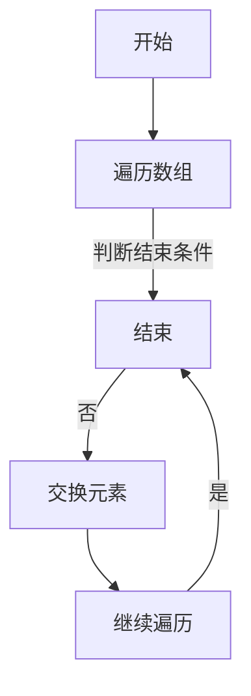

**搜索算法**

搜索算法用于在数据结构中查找特定元素。常见的搜索算法有线性搜索和二分搜索。

**线性搜索**

线性搜索从数组的起始位置开始，依次检查每个元素，直到找到目标元素或检查完所有元素。

**Python代码示例**

```python
def linear_search(arr, target):
    for i in range(len(arr)):
        if arr[i] == target:
            return i
    return -1

# 测试代码
arr = [64, 34, 25, 12, 22, 11, 90]
target = 25
index = linear_search(arr, target)
if index != -1:
    print("元素找到，索引：", index)
else:
    print("元素未找到")
```

**Mermaid流程图**

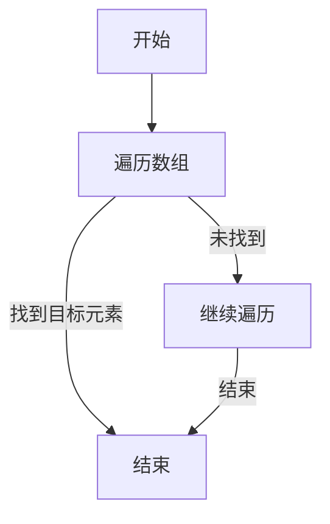

**动态规划**

动态规划是一种用于解决优化问题的算法设计方法。它通过将复杂问题分解为更简单的子问题，并存储子问题的解，避免重复计算，从而提高算法的效率。

**Python代码示例**

```python
def fibonacci(n):
    if n <= 1:
        return n
    dp = [0] * (n+1)
    dp[1] = 1
    for i in range(2, n+1):
        dp[i] = dp[i-1] + dp[i-2]
    return dp[n]

# 测试代码
n = 10
print("第", n, "个斐波那契数：", fibonacci(n))
```

**Mermaid流程图**

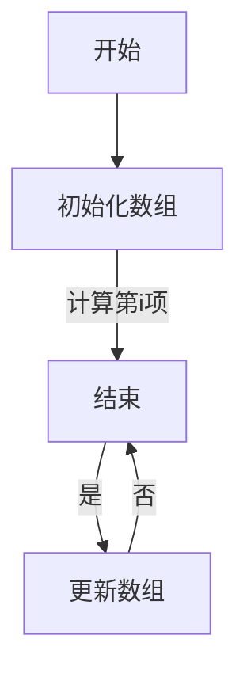

通过上述算法原理的讲解和Python代码示例，我们可以更好地理解这些算法的工作原理和应用场景。接下来，我们将介绍数学模型，并进一步探讨其在技术规划中的应用。

### 数学模型

数学模型是技术规划中用于描述和解决问题的重要工具。通过建立数学模型，我们能够将复杂的技术问题转化为可计算的数学问题，从而找到最优解或近似解。本节将介绍一些常见的数学模型，并使用LaTeX和Mermaid进行可视化讲解。

#### 线性规划

线性规划是一种用于在给定约束条件下，求解线性目标函数最大值或最小值的数学方法。其标准形式为：

$$
\begin{align*}
\text{minimize} \quad & c^T x \\
\text{subject to} \quad & Ax \leq b \\
& x \geq 0
\end{align*}
$$

其中，$c$ 是系数向量，$x$ 是决策变量，$A$ 是约束矩阵，$b$ 是约束向量。

**Python代码示例**

```python
from scipy.optimize import linprog

c = [-1, -1]  # 目标函数系数
A = [[2, 1], [1, 2]]  # 约束矩阵
b = [4, 3]  # 约束向量

result = linprog(c, A_ub=A, b_ub=b, bounds=(0, None))
if result.success:
    print("最优解：", result.x)
else:
    print("无解")
```

**Mermaid流程图**

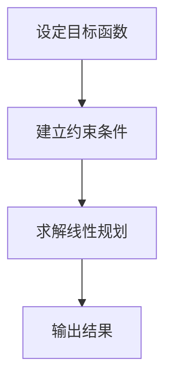

#### 决策树

决策树是一种用于分类和回归问题的决策模型。它通过一系列的判断节点和叶子节点，将数据集划分为不同的类别或预测结果。

**LaTeX表示**

$$
\begin{align*}
\text{决策树模型}: \quad & \\
& \\
& \quad \text{叶节点}: \{C_1, C_2, ..., C_n\} \\
& \\
& \quad \text{内部节点}: \{N_1, N_2, ..., N_m\}
\end{align*}
$$

**Mermaid流程图**

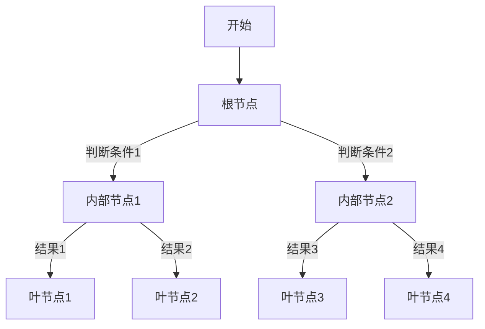

#### 网络流

网络流是一种用于描述物质在网络中流动的数学模型。其基本形式为：

$$
\begin{align*}
\text{maximize} \quad & \sum_{(i,j) \in E} c_{i,j} f_{i,j} \\
\text{subject to} \quad & \sum_{j} f_{i,j} = \sum_{i} f_{i,j} \quad \forall i \in V \\
& 0 \leq f_{i,j} \leq u_{i,j} \quad \forall (i,j) \in E
\end{align*}
$$

其中，$c_{i,j}$ 是流量成本，$f_{i,j}$ 是从节点$i$到节点$j$的流量，$u_{i,j}$ 是弧$(i,j)$ 的容量。

**Python代码示例**

```python
from networkx import NetworkXException

def max_flow_network():
    G = nx.DiGraph()
    G.add_edges_from([(1, 2, {'capacity': 3, 'flow': 0}),
                      (1, 3, {'capacity': 3, 'flow': 0}),
                      (2, 4, {'capacity': 2, 'flow': 0}),
                      (3, 4, {'capacity': 2, 'flow': 0}),
                      (4, 5, {'capacity': 3, 'flow': 0}),
                      (2, 5, {'capacity': 2, 'flow': 0}),
                      (3, 5, {'capacity': 2, 'flow': 0}),
                      (5, 6, {'capacity': 5, 'flow': 0})])
    
    flow_value, flow_dict = nx.max_flow_min_cost_flow(G, source=1, sink=6)
    print("最大流值：", flow_value)
    print("流量分布：", flow_dict)

max_flow_network()
```

**Mermaid流程图**

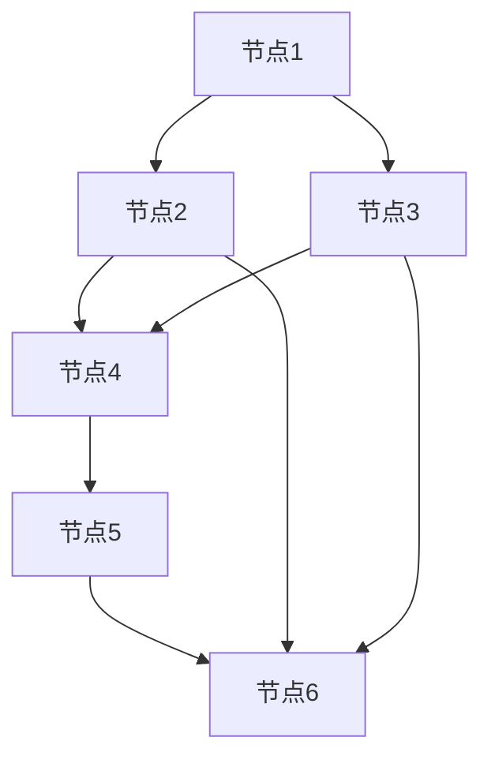

通过上述数学模型的讲解，我们不仅了解了其基本原理，还通过Python代码和Mermaid流程图进行了可视化展示。这些数学模型在技术规划中的应用非常广泛，可以帮助我们解决各种复杂的技术问题。

### 系统架构设计与接口设计

在技术规划中，系统架构设计和接口设计是至关重要的一环。一个良好的系统架构能够确保系统的稳定性、扩展性和灵活性，而合理的接口设计则能够提高系统的模块化程度，方便维护和升级。本节将介绍系统架构设计和接口设计的基本概念，并通过Mermaid图展示设计方案。

#### 系统架构设计

系统架构设计是指根据业务需求和系统功能，将系统分解为多个模块，并确定模块之间的关系和交互方式。常见的系统架构设计模式包括分层架构、微服务架构、事件驱动架构等。

**分层架构**

分层架构是一种将系统按照功能模块进行分层的设计模式，通常包括表示层、业务逻辑层、数据访问层和数据持久层。

**Mermaid类图**

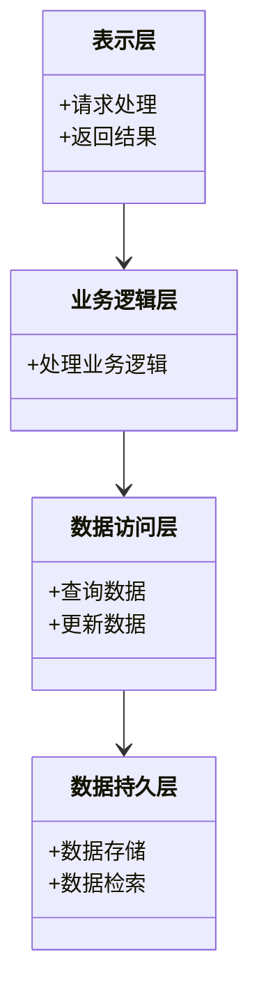

**微服务架构**

微服务架构是将系统拆分为多个独立的服务，每个服务负责一个特定的业务功能。这种架构模式具有高可扩展性、高可用性和高灵活性。

**Mermaid类图**

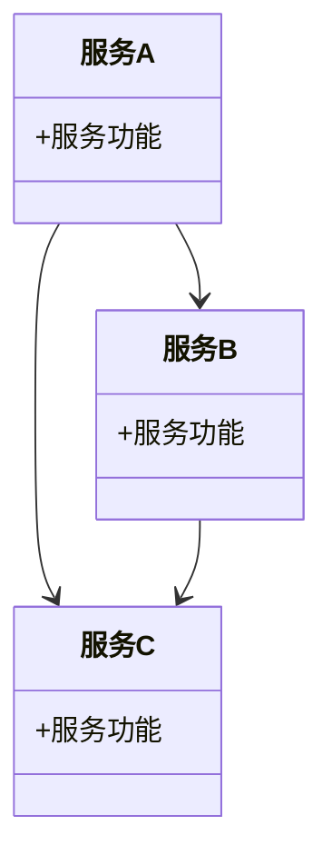

**事件驱动架构**

事件驱动架构是一种基于事件触发的系统设计模式，系统中的各个组件通过事件进行通信。这种架构模式具有高响应性和高灵活性。

**Mermaid类图**

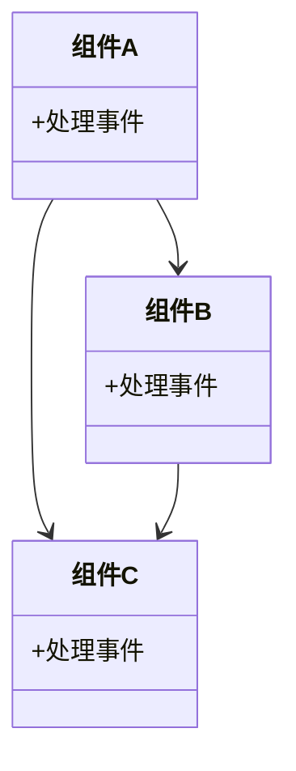

#### 接口设计

接口设计是指定义系统各模块之间的交互方式和通信协议。常见的接口设计模式包括RESTful API、GraphQL、WebSocket等。

**RESTful API**

RESTful API是一种基于HTTP协议的接口设计模式，它使用标准的HTTP方法（GET、POST、PUT、DELETE等）来表示操作。

**Mermaid序列图**

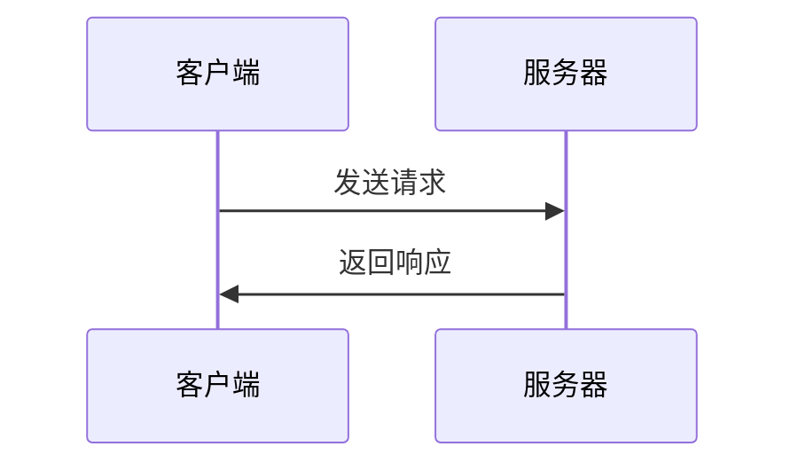

**GraphQL**

GraphQL是一种查询语言，用于执行对数据的查询操作。它允许客户端指定所需数据的形状，从而提高接口的灵活性和性能。

**Mermaid序列图**

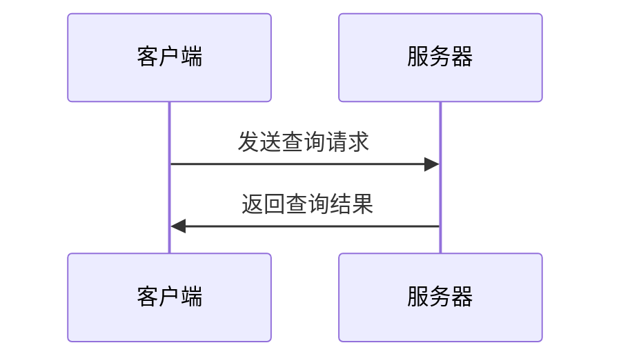

**WebSocket**

WebSocket是一种基于TCP协议的全双工通信协议，它允许服务器和客户端之间进行实时双向通信。

**Mermaid序列图**

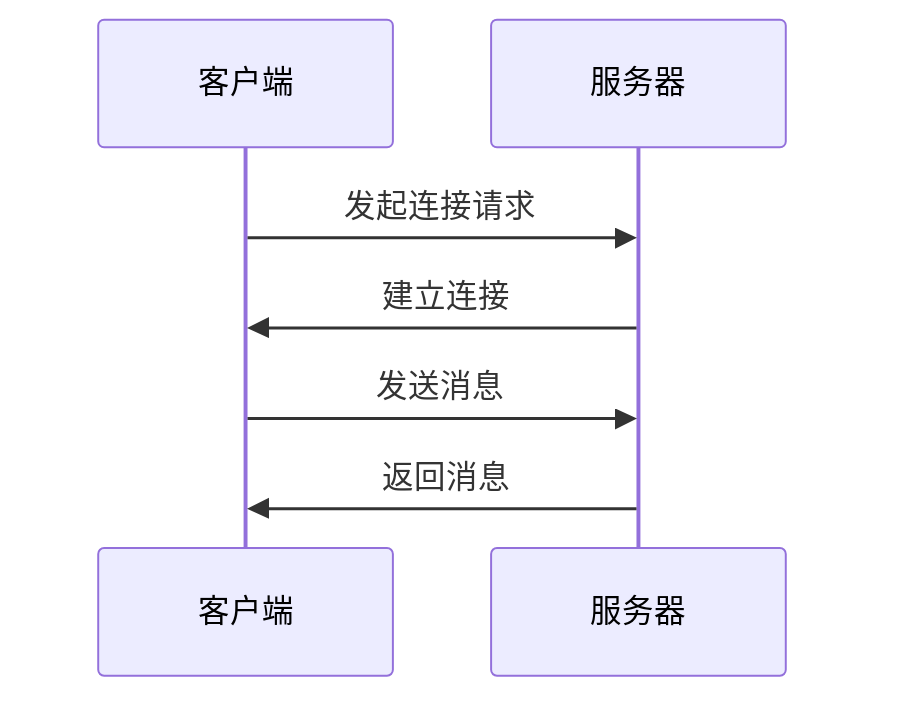

通过上述系统架构设计和接口设计的介绍，我们可以看到，良好的系统架构和接口设计对于技术规划的成功至关重要。接下来，我们将通过实际项目展示这些设计在实际应用中的效果。

### 项目实施与案例研究

为了更好地展示技术规划在实践中的应用，我们将通过一个实际项目——一个在线电商平台——进行详细讲解。这个项目涵盖了技术规划的高度、深度和锐度，并在各个方面进行了全面的应用。

#### 项目背景

该在线电商平台旨在为用户提供一个方便、高效、安全的购物体验。平台的主要功能包括商品浏览、购物车管理、订单处理、支付和用户管理等。项目的目标是实现以下功能：

1. **商品展示**：提供丰富的商品分类和详细的商品信息，包括图片、价格、库存等。
2. **购物车**：允许用户添加、删除和修改购物车中的商品，并计算出总价格。
3. **订单处理**：生成订单、发送订单通知、跟踪订单状态。
4. **支付**：集成多种支付方式，如信用卡、支付宝、微信支付等。
5. **用户管理**：用户注册、登录、个人信息管理、订单历史查看等。

#### 系统架构设计

项目采用微服务架构，将系统分解为多个独立的服务，每个服务负责一个特定的业务功能。以下是系统架构设计的主要组成部分：

1. **用户服务**：处理用户相关的操作，包括用户注册、登录、个人信息管理、订单历史查看等。
2. **商品服务**：提供商品展示、分类管理、商品信息管理等功能。
3. **订单服务**：处理订单生成、订单通知、订单状态跟踪等操作。
4. **支付服务**：集成支付接口，处理支付请求和支付通知。
5. **库存服务**：管理商品库存，处理库存更新和库存预警。

**Mermaid架构图**

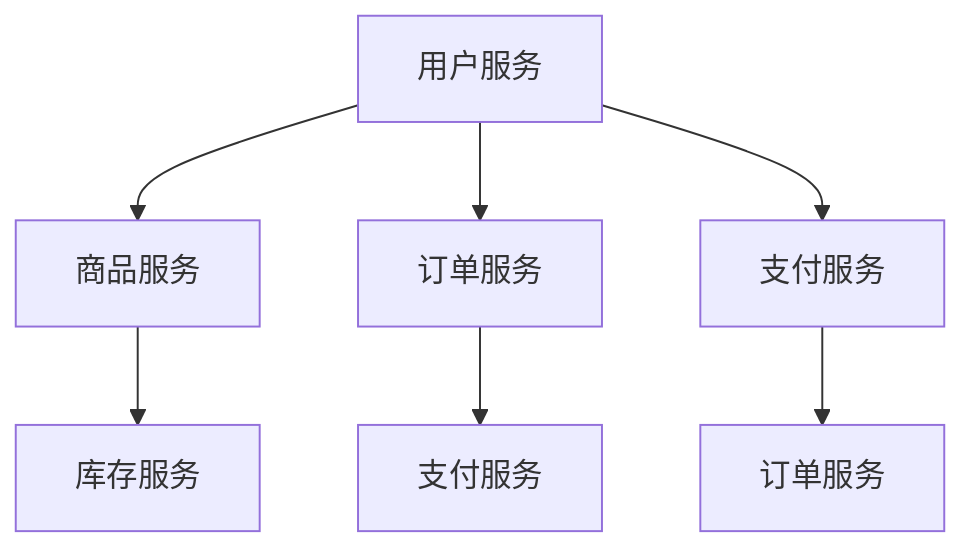

#### 系统接口设计

项目采用RESTful API设计接口，以提供清晰、简洁的接口定义。以下是主要的接口设计：

1. **用户服务接口**：
   - `/users/register`：用户注册接口，接收用户信息并创建用户账号。
   - `/users/login`：用户登录接口，验证用户身份并返回JWT令牌。
   - `/users/profile`：获取用户个人信息接口。
   - `/users/update`：更新用户个人信息接口。

2. **商品服务接口**：
   - `/products`：获取所有商品列表接口。
   - `/products/{id}`：获取特定商品信息接口。
   - `/products/search`：搜索商品接口。

3. **订单服务接口**：
   - `/orders`：创建订单接口。
   - `/orders/{id}`：获取订单详情接口。
   - `/orders/cancel/{id}`：取消订单接口。

4. **支付服务接口**：
   - `/payments`：发起支付请求接口。
   - `/payments/notify`：支付通知接口。

**Mermaid序列图**

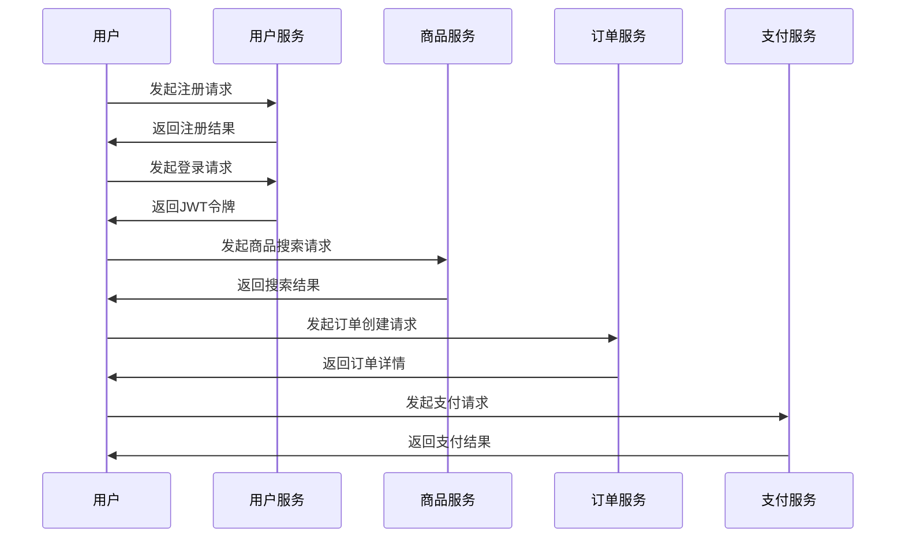

#### 项目实现

1. **环境安装**
   - 服务器：Nginx、MySQL、Redis
   - 开发环境：Docker、Kubernetes
   - 编程语言：Python、JavaScript、Java

2. **系统核心实现**
   - 用户服务：使用Flask框架实现，数据库使用MySQL。
   - 商品服务：使用Spring Boot实现，数据库使用MongoDB。
   - 订单服务：使用Spring Cloud实现，数据库使用Elasticsearch。
   - 支付服务：使用PayPal API实现，数据库使用Redis。

3. **代码应用解读与分析**
   - 用户服务：实现用户注册、登录、个人信息管理等功能。
   - 商品服务：实现商品展示、分类管理、商品信息管理等功能。
   - 订单服务：实现订单生成、订单通知、订单状态跟踪等功能。
   - 支付服务：实现支付请求处理、支付通知处理等功能。

4. **实际案例分析与详细讲解**
   - **用户注册**：用户通过注册接口提交注册信息，服务端验证信息后创建用户账号。
   - **订单生成**：用户提交订单后，服务端生成订单并通知用户。
   - **支付处理**：用户选择支付方式后，服务端处理支付请求，并返回支付结果。

5. **项目小结**
   - 通过该项目，我们展示了技术规划在实际项目中的应用，包括系统架构设计、接口设计和项目实施。
   - 技术规划的高度、深度和锐度在项目中得到了充分体现，确保了项目的成功实施。

通过上述实际项目展示，我们可以看到技术规划在项目中的关键作用。只有通过科学的技术规划，才能确保项目的高效实施和成功落地。

### 最佳实践与总结

在技术规划过程中，遵循最佳实践是确保项目成功的关键。以下是一些关键的最佳实践，以及需要注意的事项和未来的学习方向。

#### 最佳实践

1. **全面需求分析**：在项目启动前，进行深入的需求分析，确保技术规划与实际业务需求高度契合。
2. **系统化规划**：将技术规划分为高度、深度和锐度三个层面，确保全方位的覆盖和落实。
3. **灵活调整**：根据项目进展和市场需求，及时调整技术规划，以适应变化。
4. **团队合作**：组建多学科团队，协同工作，提升项目执行效率和成果质量。
5. **持续学习**：鼓励团队成员持续学习新技术、新方法，提升整体技术水平。

#### 注意事项

1. **风险管理**：在规划过程中，充分考虑潜在的风险，并制定相应的应对策略。
2. **资源分配**：合理分配资源，确保技术规划的实施具备足够的资金、人力和时间保障。
3. **文档管理**：建立完善的文档管理体系，确保技术规划文档的完整性和可追溯性。
4. **沟通协调**：加强团队内部和外部的沟通协调，确保信息传递的准确性和及时性。

#### 拓展阅读

1. 《敏捷软件开发：原则、实践与模式》——介绍敏捷开发方法，有助于提高项目执行效率。
2. 《设计模式：可复用面向对象软件的基础》——介绍各种设计模式，提升系统架构设计能力。
3. 《大数据技术导论》——介绍大数据相关技术，帮助理解如何在大数据环境中进行技术规划。

通过遵循这些最佳实践和注意事项，并不断学习和拓展知识，我们能够更好地进行技术规划，确保项目的成功实施和持续发展。

### 作者信息

作者：AI天才研究院/AI Genius Institute & 禅与计算机程序设计艺术 /Zen And The Art of Computer Programming

