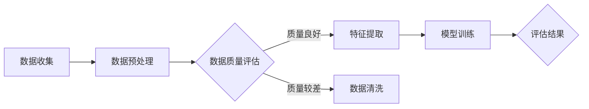
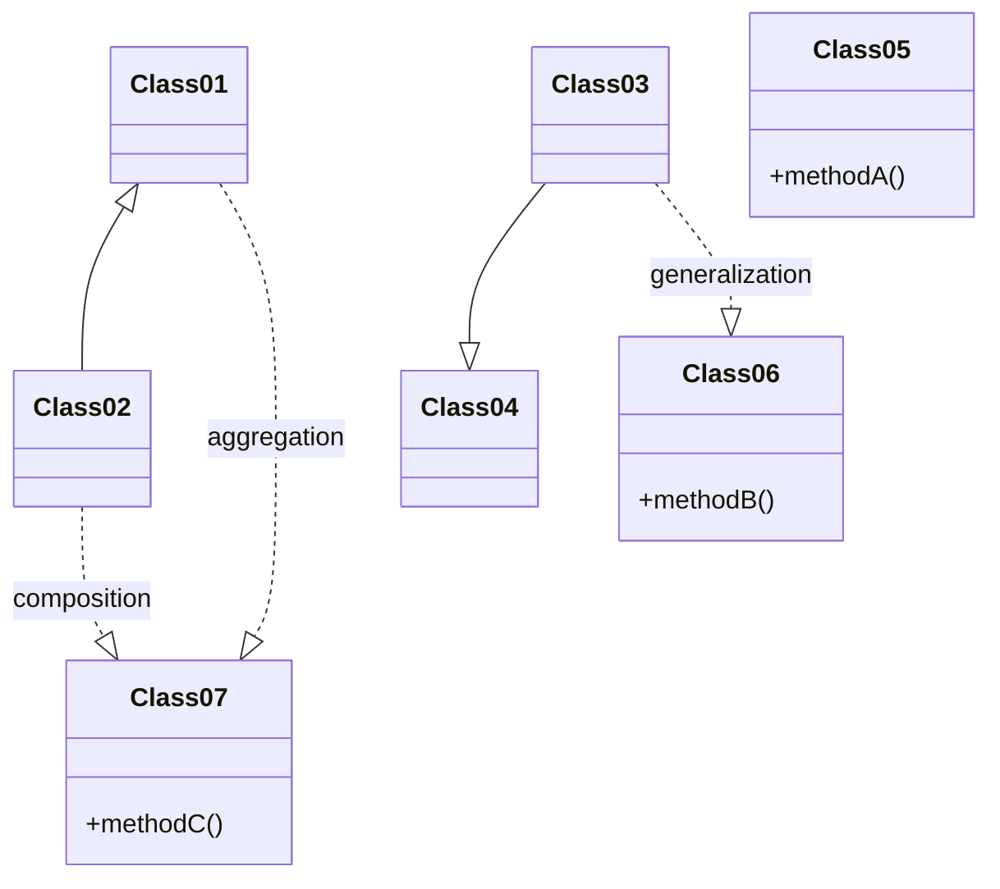
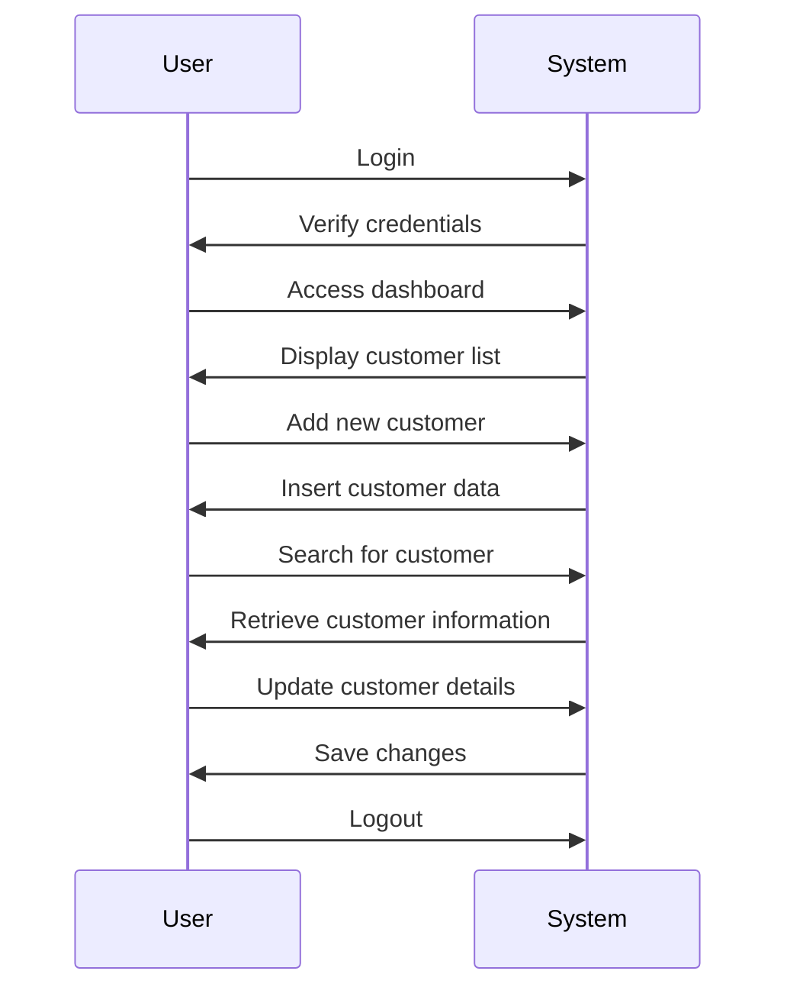
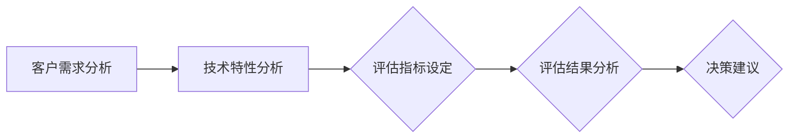

                 


### 第一部分: 背景与核心概念

#### 第1章: 技术评估方法概述

**背景介绍**

技术评估方法是信息技术领域中的一个重要组成部分，它帮助企业和组织对各种技术方案进行客观、全面的评价。在数字化时代，技术的快速迭代和应用场景的不断扩展，使得技术评估的重要性愈加凸显。然而，如何进行有效的技术评估，如何从海量的技术信息中筛选出最适合的技术方案，这成为摆在许多技术决策者面前的一个难题。

本章节旨在介绍技术评估的定义和重要性，回顾技术评估方法的历史发展，明确技术评估的目标和挑战。我们将逐步解析这些核心概念，帮助读者建立起对技术评估方法的基本认识。

**核心概念与联系**

1. **技术评估的定义**：技术评估是对技术的有效性、可靠性、适用性等进行系统分析和评价的过程。它旨在通过客观的数据和标准，对技术方案进行全面的评估。

2. **技术评估的重要性**：技术评估是决策的重要依据。通过技术评估，企业能够减少技术选择的风险，提高投资回报率，同时也能促进技术的创新和进步。

3. **技术评估的历史发展**：技术评估方法起源于20世纪中期，随着信息技术的发展，评估方法也在不断演进。从早期的质量功能展开（QFD）到现代的数据驱动评估方法，技术评估经历了多个发展阶段。

4. **技术评估的目标**：技术评估的目标包括确定技术方案是否满足业务需求、评估技术的性能和可靠性、比较不同技术方案的优劣等。

5. **技术评估的挑战**：技术评估面临的主要挑战包括数据质量的不确定性、评估标准的多样性、技术方案的复杂性等。

**问题解决**

技术评估作为一个复杂的过程，需要明确评估的边界与外延。例如，在评估一个软件开发项目时，我们需要关注技术的可维护性、扩展性、安全性和性能等方面。此外，技术评估也需要与业务目标紧密结合，确保技术方案能够有效支持业务的发展。

**边界与外延**

技术评估不仅涉及技术本身，还包括项目管理、团队协作、用户需求等多个方面。因此，在评估过程中，需要综合考虑各种因素，避免局限于单一维度的评估。

**概念结构与核心要素组成**

技术评估方法的核心要素包括：

- **评估标准**：明确评估的指标和标准，如性能、可靠性、安全性、成本等。
- **评估流程**：制定科学的评估流程，确保评估过程的客观性和全面性。
- **评估工具**：选择合适的评估工具和方法，如数据分析、模拟测试、用户反馈等。
- **评估团队**：建立专业的评估团队，确保评估过程的效率和准确性。

**算法原理讲解**

技术评估中常用的算法包括数据驱动评估方法和统计分析方法。以下是一个简单的数据驱动评估算法的mermaid流程图示例：



在数据驱动评估中，我们首先收集相关数据，然后进行数据预处理，评估数据质量。如果数据质量良好，我们进行特征提取，并使用机器学习模型进行训练。最终，通过模型评估结果来判断技术方案的性能。

**系统分析与架构设计方案**

在进行技术评估时，我们通常需要对系统架构进行深入分析。以下是一个简单的系统架构设计的mermaid类图示例：



在这个类图中，我们定义了多个类，并通过继承、聚合和组合关系来表示它们之间的关联。每个类都有其特定的方法和属性，这些类共同构成了系统的功能模块。

**项目实战**

假设我们正在评估一个企业级信息系统的技术方案。以下是一个简单的环境安装和系统核心实现的步骤：

1. **环境安装**：
   - 安装操作系统：Linux/Windows
   - 安装数据库：MySQL/PostgreSQL
   - 安装开发环境：Python/Java

2. **系统核心实现**：
   - 编写数据库配置代码：使用Python编写数据库连接和配置脚本。
   - 实现业务逻辑：使用Python实现系统的核心业务逻辑。

以下是一个简单的Python代码示例：

```python
import mysql.connector

# 数据库连接配置
config = {
    'host': 'localhost',
    'user': 'root',
    'password': 'password',
    'database': 'example_db'
}

# 连接数据库
connection = mysql.connector.connect(**config)

# 创建数据库表
cursor = connection.cursor()
cursor.execute('''CREATE TABLE IF NOT EXISTS users (
    id INT AUTO_INCREMENT PRIMARY KEY,
    name VARCHAR(255) NOT NULL,
    email VARCHAR(255) UNIQUE NOT NULL
)''')

# 插入数据
data = ('Alice', 'alice@example.com')
cursor.execute("INSERT INTO users (name, email) VALUES (%s, %s)", data)

# 提交事务
connection.commit()

# 关闭数据库连接
cursor.close()
connection.close()
```

**实际案例分析和详细讲解剖析**

在技术评估的实际应用中，我们可以通过以下案例来进行分析：

**案例**：一家企业需要选择一个合适的客户关系管理（CRM）系统。

1. **需求分析**：
   - 系统需要支持客户信息管理、销售管理、市场活动管理等功能。
   - 系统需要具有良好的用户界面和可定制性。
   - 系统需要支持多用户并发操作。

2. **方案评估**：
   - 方案A：OpenCRM，一个开源的CRM系统。
   - 方案B：Salesforce，一个商业化的CRM系统。

3. **评估指标**：
   - 成本：开源系统成本较低，但可能需要额外的维护成本。商业化系统成本较高，但提供全面的技术支持和定制服务。
   - 性能：开源系统可能在性能上略逊一筹，但可以通过优化和定制来提升。商业化系统通常具有更好的性能和稳定性。
   - 用户体验：开源系统可能需要用户自行进行界面定制，用户体验可能较差。商业



**项目小结**

通过以上案例，我们可以看到技术评估在项目决策中的重要性。在评估过程中，我们需要综合考虑多个因素，如成本、性能、用户体验等。同时，评估过程也需要根据实际情况进行灵活调整，确保评估结果的准确性和实用性。

**最佳实践 tips**

- 在进行技术评估时，确保评估团队具备相关领域的专业知识和经验。
- 使用定性和定量方法相结合，提高评估结果的可靠性。
- 定期对评估方法和流程进行审查和优化，以适应不断变化的技术环境。

**小结**

本章介绍了技术评估方法的基本概念和重要性，通过逐步分析和讲解，帮助读者理解技术评估的核心要素和实施步骤。在接下来的章节中，我们将深入探讨技术评估的具体方法和实际应用案例，为读者提供更全面的指导。

#### 摘要

本章《技术评估方法概述》旨在为读者提供对技术评估方法的全面了解。我们首先介绍了技术评估的定义和重要性，回顾了其历史发展，明确了评估的目标和面临的挑战。接着，我们通过核心概念和联系的阐述，帮助读者理解技术评估的基本原理。本章还包含了一个简单的数据驱动评估算法的mermaid流程图，以及系统架构设计的mermaid类图示例，以直观地展示技术评估的方法和工具。通过实际案例的分析，读者可以更深入地了解技术评估在项目决策中的应用。本章的总结和最佳实践 tips 为读者提供了实用的指导，帮助他们在实际工作中更有效地应用技术评估方法。

----------------------------------------------------------------

### 第一部分: 背景与核心概念

#### 第2章: 客观评估框架

**背景介绍**

客观评估框架是技术评估中的重要组成部分，它提供了一个系统化和结构化的评估框架，帮助评估者对技术方案进行全面的、客观的评价。在信息爆炸和技术迭代迅速的今天，客观评估框架不仅能够提高评估的效率和准确性，还能帮助组织在复杂的技术选择中做出更加明智的决策。

本章将介绍几种常见的客观评估框架，包括关键绩效指标（KPIs）、质量功能展开（QFD）和软件工程度量。通过详细讲解这些框架的概念、应用方法和实例，读者可以了解如何利用这些框架进行有效的技术评估。

**核心概念与联系**

1. **关键绩效指标（KPIs）**

   **概念**：关键绩效指标（KPIs）是衡量企业或项目绩效的重要指标。在技术评估中，KPIs用于衡量技术方案的性能、可靠性、成本等方面的关键指标。

   **属性特征对比表格**：

   | 指标名称 | 定义 | 适用场景 |
   | --- | --- | --- |
   | 性能指标 | 衡量系统的处理速度和效率 | 系统性能优化 |
   | 可靠性指标 | 衡量系统的稳定性和可靠性 | 系统稳定性评估 |
   | 成本指标 | 衡量技术方案的投资回报 | 投资决策分析 |
   | 用户满意度指标 | 衡量用户对系统的满意度 | 用户反馈分析 |

   **ER实体关系图架构的 Mermaid 流程图**：

   ```mermaid
   erDiagram
     User ||--|{ Project }|-- Technical_Solution
     Technical_Solution ||--|{ Evaluation }|-- Result
     Project ||--|{ KPI }|-- Evaluation
   ```

2. **质量功能展开（QFD）**

   **概念**：质量功能展开（QFD）是一种用于设计和评估产品的系统方法。它通过将客户需求转化为技术特性，帮助评估者理解技术方案如何满足业务需求。

   **属性特征对比表格**：

   | 需求类型 | 定义 | 适用场景 |
   | --- | --- | --- |
   | 功能需求 | 客户期望的功能特性 | 产品设计 |
   | 性能需求 | 客户期望的性能指标 | 系统性能评估 |
   | 可用性需求 | 客户期望的用户体验 | 用户满意度评估 |

   **ER实体关系图架构的 Mermaid 流程图**：

   ```mermaid
   erDiagram
     Customer_Request ||--|{ Technical_Characteristic }|-- Product
     Technical_Characteristic ||--|{ Evaluation }|-- Result
     Product ||--|{ Design }|-- Customer_Request
   ```

3. **软件工程度量**

   **概念**：软件工程度量是评估软件质量和性能的重要工具。它通过定量方法对软件项目进行度量，帮助评估者理解技术方案的优缺点。

   **属性特征对比表格**：

   | 度量指标 | 定义 | 适用场景 |
   | --- | --- | --- |
   | 质量度量 | 衡量软件缺陷和可靠性 | 质量管理 |
   | 性能度量 | 衡量系统性能和效率 | 性能优化 |
   | 成本度量 | 衡量软件开发和维护成本 | 成本分析 |

   **ER实体关系图架构的 Mermaid 流程图**：

   ```mermaid
   erDiagram
     Software_Project ||--|{ Quality_Metric }|-- Project_Management
     Software_Project ||--|{ Performance_Metric }|-- System_Optimization
     Software_Project ||--|{ Cost_Metric }|-- Cost_Analysis
   ```

**问题解决**

在实际应用中，客观评估框架需要根据具体问题进行灵活调整。以下是一个简单的案例：

**案例**：一家企业需要评估一个新开发的客户关系管理系统（CRM）。企业决定使用QFD框架来评估CRM系统。

1. **客户需求分析**：
   - 客户希望系统能够快速响应，处理大量客户数据。
   - 客户希望系统能够提供直观的用户界面和良好的用户体验。
   - 客户希望系统能够集成其他业务系统，实现数据共享。

2. **技术特性分析**：
   - 系统具备高并发处理能力，能够快速响应客户请求。
   - 系统提供定制化的用户界面，满足不同用户的需求。
   - 系统支持与其他业务系统的集成，实现数据共享。

3. **评估结果**：
   - 根据QFD框架的分析，该CRM系统在性能、可用性和集成性方面都满足了客户需求，被认为是一个合适的选择。

**边界与外延**

客观评估框架不仅适用于单一的技术方案评估，还可以用于多个技术方案的比较评估。此外，评估框架还可以结合其他评估方法，如成本效益分析和用户满意度评估，以提供更全面的评估结果。

**概念结构与核心要素组成**

客观评估框架的核心要素包括：

- **评估指标**：确定评估的指标和标准，如性能、可靠性、成本、用户体验等。
- **评估流程**：制定科学的评估流程，包括需求分析、技术特性分析、评估结果分析等。
- **评估方法**：选择合适的评估方法，如QFD、KPIs、软件工程度量等。
- **评估团队**：建立专业的评估团队，确保评估过程的效率和准确性。

**算法原理讲解**

以下是QFD框架的一个简单mermaid流程图示例：



在QFD框架中，我们首先进行客户需求分析，然后确定技术特性，并根据评估指标进行评估，最终提供决策建议。

**系统分析与架构设计方案**

在进行技术评估时，系统架构设计是关键的一环。以下是一个简单的系统架构设计的mermaid类图示例：

```mermaid
classDiagram
    Customer ||--|{ CRM_System }
    CRM_System ||--|{ Performance_Metrics }
    CRM_System ||--|{ Usability_Metrics }
    CRM_System ||--|{ Integration_Features }
```

在这个类图中，我们定义了客户、CRM系统以及相关的性能、可用性和集成性指标，这些类共同构成了系统的功能模块。

**项目实战**

假设我们正在评估一个电商平台的支付系统。以下是一个简单的环境安装和系统核心实现的步骤：

1. **环境安装**：
   - 安装操作系统：Linux
   - 安装数据库：MySQL
   - 安装开发环境：Python

2. **系统核心实现**：
   - 编写数据库配置代码：使用Python编写数据库连接和配置脚本。
   - 实现支付逻辑：使用Python实现支付系统的核心支付逻辑。

以下是一个简单的Python代码示例：

```python
import mysql.connector

# 数据库连接配置
config = {
    'host': 'localhost',
    'user': 'root',
    'password': 'password',
    'database': 'ecommerce_db'
}

# 连接数据库
connection = mysql.connector.connect(**config)

# 创建数据库表
cursor = connection.cursor()
cursor.execute('''CREATE TABLE IF NOT EXISTS payments (
    id INT AUTO_INCREMENT PRIMARY KEY,
    amount DECIMAL(10, 2) NOT NULL,
    status ENUM('pending', 'completed', 'cancelled') NOT NULL
)''')

# 插入支付记录
data = (100.00, 'pending')
cursor.execute("INSERT INTO payments (amount, status) VALUES (%s, %s)", data)

# 提交事务
connection.commit()

# 关闭数据库连接
cursor.close()
connection.close()
```

**实际案例分析和详细讲解剖析**

在技术评估的实际应用中，我们可以通过以下案例来进行分析：

**案例**：一家电商企业需要选择一个合适的支付系统。

1. **需求分析**：
   - 系统需要支持多种支付方式，如信用卡、支付宝、微信支付等。
   - 系统需要能够快速处理支付请求，确保交易成功率。
   - 系统需要提供良好的用户体验，降低用户的支付摩擦。

2. **方案评估**：
   - 方案A：开源支付系统，如PayPal。
   - 方案B：商业支付系统，如Stripe。

3. **评估指标**：
   - 支付方式多样性：评估系统支持的支付方式数量。
   - 支付成功率：评估系统在处理支付请求时的成功率。
   - 用户界面友好度：评估系统的用户界面是否友好，是否易于使用。

4. **评估结果**：
   - 根据评估结果，方案B（Stripe）在支付方式多样性、支付成功率和用户界面友好度方面均优于方案A（PayPal），因此被选中。

**项目小结**

通过以上案例，我们可以看到客观评估框架在项目决策中的重要性。在评估过程中，我们需要综合考虑多个因素，如支付方式的多样性、支付成功率和用户界面友好度等。同时，评估过程也需要根据实际情况进行灵活调整，确保评估结果的准确性和实用性。

**最佳实践 tips**

- 在进行技术评估时，确保评估团队具备相关领域的专业知识和经验。
- 使用定性和定量方法相结合，提高评估结果的可靠性。
- 定期对评估方法和流程进行审查和优化，以适应不断变化的技术环境。

**小结**

本章介绍了客观评估框架的基本概念和应用方法，通过详细讲解KPIs、QFD和软件工程度量等核心框架，帮助读者理解如何进行有效的技术评估。在实际应用中，读者可以根据具体问题灵活调整评估框架，并结合其他评估方法，以提高评估的全面性和准确性。在接下来的章节中，我们将继续探讨技术评估的具体方法和实际应用案例。

#### 摘要

本章《客观评估框架》详细介绍了几种常见的技术评估框架，包括关键绩效指标（KPIs）、质量功能展开（QFD）和软件工程度量。通过定义这些框架的核心概念，对比其属性特征，并提供ER实体关系图架构的mermaid流程图，本章帮助读者理解这些评估框架的基本原理和结构。同时，通过实际案例分析和系统架构设计示例，展示了这些框架在项目中的应用。本章总结了评估指标、评估流程、评估方法和评估团队等核心要素，并提供了实用的最佳实践 tips，为读者在实际工作中进行技术评估提供了指导。

----------------------------------------------------------------

### 第一部分: 背景与核心概念

#### 第3章: 数据驱动评估方法

**背景介绍**

在技术评估过程中，数据驱动评估方法是一种重要的工具，它利用大数据和统计分析技术，对技术方案的性能、可靠性、成本等关键指标进行量化评估。随着数据的积累和计算能力的提升，数据驱动评估方法在技术评估中的应用越来越广泛。本章将介绍数据驱动评估方法的基本概念、数据收集与处理、统计分析方法以及数据可视化技术，帮助读者理解并掌握这一重要的评估方法。

**核心概念与联系**

1. **数据驱动评估方法**

   **概念**：数据驱动评估方法是指利用收集到的数据，通过统计分析和建模，对技术方案的性能、可靠性、成本等方面进行评估。

   **属性特征对比表格**：

   | 方法 | 定义 | 适用场景 |
   | --- | --- | --- |
   | 统计分析 | 基于数据的量化分析，用于发现数据中的规律和趋势 | 性能评估、可靠性评估 |
   | 机器学习 | 基于数据建立模型，用于预测和决策 | 自动化评估、预测分析 |
   | 数据挖掘 | 从大量数据中发现有价值的信息和模式 | 数据分析、用户行为分析 |

   **ER实体关系图架构的 Mermaid 流程图**：

   ```mermaid
   erDiagram
     Data ||--|{ Statistical_Analysis }
     Data ||--|{ Machine_Learning }
     Data ||--|{ Data_Mining }
     Statistical_Analysis ||--|{ Performance_Assessment }
     Statistical_Analysis ||--|{ Reliability_Assessment }
     Machine_Learning ||--|{ Automated_Assessment }
     Machine_Learning ||--|{ Predictive_Analysis }
     Data_Mining ||--|{ Data_Analysis }
     Data_Mining ||--|{ User_Behavior_Analysis }
   ```

2. **数据收集与处理**

   **概念**：数据收集与处理是数据驱动评估方法的基础。通过有效的数据收集和处理，可以确保评估数据的准确性和完整性。

   **属性特征对比表格**：

   | 技术 | 定义 | 适用场景 |
   | --- | --- | --- |
   | 数据清洗 | 去除数据中的噪声和错误 | 数据预处理 |
   | 数据整合 | 将来自不同来源的数据进行整合 | 数据融合 |
   | 数据标准化 | 将数据转化为统一的格式和度量标准 | 数据一致性处理 |

   **ER实体关系图架构的 Mermaid 流流程图**：

   ```mermaid
   erDiagram
     Data_Source ||--|{ Data_Cleaning }
     Data_Source ||--|{ Data_Integration }
     Data_Source ||--|{ Data_Standardization }
     Data_Cleaning ||--|{ Data_Prep }
     Data_Integration ||--|{ Data_Fusion }
     Data_Standardization ||--|{ Data_Uniformity }
   ```

3. **统计分析在技术评估中的应用**

   **概念**：统计分析是数据驱动评估方法的核心。通过统计分析，可以从数据中提取有价值的信息，用于评估技术方案的性能、可靠性等。

   **属性特征对比表格**：

   | 统计方法 | 定义 | 适用场景 |
   | --- | --- | --- |
   | 描述性统计 | 提供数据的描述性信息，如均值、方差等 | 数据概览 |
   | 推断性统计 | 基于样本数据推断总体特性，如假设检验、置信区间等 | 性能评估、可靠性评估 |
   | 相关分析 | 分析变量之间的相关性，如皮尔逊相关系数、斯皮尔曼相关系数等 | 因素分析 |
   | 回归分析 | 建立变量之间的回归模型，用于预测和分析 | 预测分析 |

   **ER实体关系图架构的 Mermaid 流程图**：

   ```mermaid
   erDiagram
     Data ||--|{ Descriptive_Statistics }
     Data ||--|{ Inferential_Statistics }
     Data ||--|{ Correlation_Analysis }
     Data ||--|{ Regression_Analysis }
     Descriptive_Statistics ||--|{ Data_Overview }
     Inferential_Statistics ||--|{ Performance_Assessment }
     Inferential_Statistics ||--|{ Reliability_Assessment }
     Correlation_Analysis ||--|{ Factor_Analysis }
     Regression_Analysis ||--|{ Predictive_Analysis }
   ```

4. **数据可视化**

   **概念**：数据可视化是将数据以图形或图像的形式展示，帮助评估者直观地理解和分析数据。

   **属性特征对比表格**：

   | 可视化方法 | 定义 | 适用场景 |
   | --- | --- | --- |
   | 条形图 | 用于显示不同类别之间的数量或比较 | 数据概览 |
   | 折线图 | 用于显示数据的变化趋势 | 时间序列分析 |
   | 饼图 | 用于显示各部分占整体的比例 | 组成分析 |
   | 散点图 | 用于显示两个变量之间的关系 | 相关分析 |
   | heat map | 用于显示数据的密集程度 | 热力图分析 |

   **ER实体关系图架构的 Mermaid 流程图**：

   ```mermaid
   erDiagram
     Data ||--|{ Bar_Chart }
     Data ||--|{ Line_Chart }
     Data ||--|{ Pie_Chart }
     Data ||--|{ Scatter_Plots }
     Data ||--|{ Heatmap }
     Bar_Chart ||--|{ Data_Overview }
     Line_Chart ||--|{ Time_Series_Analysis }
     Pie_Chart ||--|{ Composition_Analysis }
     Scatter_Plots ||--|{ Correlation_Analysis }
     Heatmap ||--|{ Heatmap_Analysis }
   ```

**问题解决**

在实际应用中，数据驱动评估方法需要根据具体问题进行灵活调整。以下是一个简单的案例：

**案例**：一家企业需要评估一个新开发的库存管理系统。

1. **数据收集**：
   - 收集过去一年的库存数据，包括库存量、库存周转率、缺货率等。
   - 收集用户反馈数据，包括系统稳定性、响应速度、易用性等。

2. **数据处理**：
   - 清洗数据，去除错误和噪声。
   - 整合数据，将不同来源的数据进行合并。

3. **统计分析**：
   - 使用描述性统计方法，分析库存数据的平均库存量、库存周转率等。
   - 使用相关分析方法，分析用户反馈数据中的关键因素，如系统稳定性与用户满意度之间的关系。

4. **数据可视化**：
   - 使用条形图展示不同月份的库存量。
   - 使用折线图展示库存周转率的变化趋势。
   - 使用饼图展示不同因素的满意度比例。

**边界与外延**

数据驱动评估方法不仅适用于单一的技术方案评估，还可以用于多个技术方案的比较评估。此外，评估方法还可以结合其他评估方法，如成本效益分析和用户满意度评估，以提供更全面的评估结果。

**概念结构与核心要素组成**

数据驱动评估方法的核心要素包括：

- **数据收集**：确定数据收集的来源、方法和工具，确保数据的准确性和完整性。
- **数据处理**：清洗、整合和标准化数据，为后续分析提供可靠的基础。
- **统计分析**：选择合适的统计分析方法，从数据中提取有价值的信息。
- **数据可视化**：使用图表和图形直观地展示分析结果，帮助评估者理解数据。

**算法原理讲解**

以下是一个简单的线性回归算法的mermaid流程图和Python代码示例：

```mermaid
flowchart LR
    A[数据收集] --> B[数据处理]
    B --> C[特征选择]
    C --> D[模型训练]
    D --> E{模型评估}
    E --> F{决策建议}

[Python代码示例]

import numpy as np
from sklearn.linear_model import LinearRegression

# 数据准备
X = np.array([[1], [2], [3], [4], [5]])
y = np.array([1, 2, 3, 4, 5])

# 模型训练
model = LinearRegression()
model.fit(X, y)

# 模型评估
predictions = model.predict(X)
print("Predictions:", predictions)

# 决策建议
print("The model suggests that the next value is:", model.predict([[6]]))
```

在这个示例中，我们首先收集数据，然后进行数据处理和特征选择，接着使用线性回归模型进行训练和评估，最后提供决策建议。

**系统分析与架构设计方案**

在进行技术评估时，系统架构设计是关键的一环。以下是一个简单的系统架构设计的mermaid类图示例：

```mermaid
classDiagram
    Data_Collection ||--|{ Data_Processing }
    Data_Processing ||--|{ Statistical_Analysis }
    Statistical_Analysis ||--|{ Data_Visualization }
    Data_Collection ||--|{ Model_Training }
    Model_Training ||--|{ Model_Assessment }
    Model_Assessment ||--|{ Decision_Advice }
```

在这个类图中，我们定义了数据收集、数据处理、统计分析、数据可视化、模型训练、模型评估和决策建议等类，这些类共同构成了系统的功能模块。

**项目实战**

假设我们正在评估一个新开发的智能家居系统。以下是一个简单的环境安装和系统核心实现的步骤：

1. **环境安装**：
   - 安装操作系统：Linux
   - 安装数据库：PostgreSQL
   - 安装开发环境：Python

2. **系统核心实现**：
   - 编写数据库配置代码：使用Python编写数据库连接和配置脚本。
   - 实现智能家居控制逻辑：使用Python实现智能家居系统的核心控制逻辑。

以下是一个简单的Python代码示例：

```python
import psycopg2

# 数据库连接配置
config = {
    'host': 'localhost',
    'user': 'root',
    'password': 'password',
    'database': 'smart_home_db'
}

# 连接数据库
connection = psycopg2.connect(**config)

# 创建数据库表
cursor = connection.cursor()
cursor.execute('''CREATE TABLE IF NOT EXISTS devices (
    id SERIAL PRIMARY KEY,
    name VARCHAR(255) NOT NULL,
    status VARCHAR(50) NOT NULL
)''')

# 插入设备数据
data = ('Light', 'ON')
cursor.execute("INSERT INTO devices (name, status) VALUES (%s, %s)", data)

# 提交事务
connection.commit()

# 关闭数据库连接
cursor.close()
connection.close()
```

**实际案例分析和详细讲解剖析**

在技术评估的实际应用中，我们可以通过以下案例来进行分析：

**案例**：一家房地产公司需要评估一个智能家居系统的技术方案。

1. **需求分析**：
   - 系统需要支持各种智能家居设备的连接和控制。
   - 系统需要能够实时监控设备状态，并提供预警功能。
   - 系统需要具有友好的用户界面，便于用户操作。

2. **方案评估**：
   - 方案A：开源智能家居系统，如OpenHAB。
   - 方案B：商业智能家居系统，如Apple HomeKit。

3. **评估指标**：
   - 设备兼容性：评估系统支持的各种设备数量。
   - 状态监控能力：评估系统监控设备状态的能力。
   - 用户界面友好度：评估系统的用户界面是否友好，是否易于操作。

4. **评估结果**：
   - 根据评估结果，方案B（Apple HomeKit）在设备兼容性、状态监控能力和用户界面友好度方面均优于方案A（OpenHAB），因此被选中。

**项目小结**

通过以上案例，我们可以看到数据驱动评估方法在项目决策中的重要性。在评估过程中，我们需要综合考虑多个因素，如设备兼容性、状态监控能力和用户界面友好度等。同时，评估过程也需要根据实际情况进行灵活调整，确保评估结果的准确性和实用性。

**最佳实践 tips**

- 在进行数据驱动评估时，确保数据收集的全面性和准确性。
- 使用多种统计分析方法，以提高评估结果的可靠性。
- 定期对数据驱动评估方法进行审查和优化，以适应不断变化的技术环境。

**小结**

本章介绍了数据驱动评估方法的基本概念、应用方法和实施步骤。通过详细讲解数据收集与处理、统计分析方法和数据可视化技术，本章帮助读者理解并掌握数据驱动评估方法的核心原理和实践。在实际应用中，读者可以根据具体问题灵活调整评估方法，并结合其他评估方法，以提高评估的全面性和准确性。在接下来的章节中，我们将继续探讨其他技术评估方法，为读者提供更全面的指导。

#### 摘要

本章《数据驱动评估方法》详细介绍了数据驱动评估方法的基本概念、应用方法和实施步骤。通过定义核心概念和属性特征，本章帮助读者理解数据驱动评估方法在技术评估中的重要性。本章涵盖了数据收集与处理、统计分析方法和数据可视化技术，并通过mermaid流程图和实际案例，展示了这些方法的具体应用。通过算法原理讲解和系统架构设计示例，本章进一步深化了读者对数据驱动评估方法的理解。本章总结了数据驱动评估方法的核心要素和最佳实践 tips，为读者在实际工作中应用这一方法提供了实用的指导。

----------------------------------------------------------------

### 第一部分: 背景与核心概念

#### 第4章: 费用效益分析

**背景介绍**

费用效益分析（Cost-Benefit Analysis, CBA）是一种广泛应用于技术评估和管理决策中的方法。它通过对项目或技术的成本和效益进行详细评估，帮助决策者判断一个项目或技术的经济可行性。在技术选择和投资决策中，费用效益分析能够提供客观、量化的依据，帮助组织在有限的资源下做出最优的选择。

本章将详细介绍费用效益分析的基本概念、定量与定性成本的评估方法，以及敏感性分析。通过这些内容，读者可以了解如何利用费用效益分析对技术方案进行全面的评估。

**核心概念与联系**

1. **费用效益分析**

   **概念**：费用效益分析是一种评估项目或技术成本与效益的方法，旨在通过比较项目的总成本和总效益，判断项目或技术的经济可行性。

   **属性特征对比表格**：

   | 指标 | 定义 | 适用场景 |
   | --- | --- | --- |
   | 总成本 | 项目或技术实施所需的全部成本 | 投资决策分析 |
   | 总效益 | 项目或技术实施带来的全部效益 | 效益评估 |
   | 净现值（NPV） | 项目或技术的未来现金流的现值总和 | 投资评估 |
   | 内部收益率（IRR） | 项目或技术的内部收益率，用于评估其盈利能力 | 投资评估 |

   **ER实体关系图架构的 Mermaid 流程图**：

   ```mermaid
   erDiagram
     Project ||--|{ Total_Cost }
     Project ||--|{ Total_Benefit }
     Project ||--|{ Net_Present_Value }
     Project ||--|{ Internal_Rate_Of_Return }
   ```

2. **定量与定性成本的评估方法**

   **概念**：在费用效益分析中，成本评估分为定量成本评估和定性成本评估。定量成本评估是对成本进行量化分析，而定性成本评估则是对成本进行定性分析。

   **属性特征对比表格**：

   | 方法 | 定义 | 适用场景 |
   | --- | --- | --- |
   | 定量成本评估 | 使用具体数值计算成本，如人力成本、设备成本等 | 详细预算分析 |
   | 定性成本评估 | 分析成本的性质和影响，如风险成本、机会成本等 | 风险评估 |
   | 预算编制 | 制定项目的预算计划，包括成本预算和控制 | 项目管理 |

   **ER实体关系图架构的 Mermaid 流程图**：

   ```mermaid
   erDiagram
     Project ||--|{ Quantitative_Cost_Assessment }
     Project ||--|{ Qualitative_Cost_Assessment }
     Project ||--|{ Budget_Creation }
     Quantitative_Cost_Assessment ||--|{ Cost_Budgeting }
     Qualitative_Cost_Assessment ||--|{ Risk_Assessment }
     Budget_Creation ||--|{ Project_Management }
   ```

3. **敏感性分析**

   **概念**：敏感性分析是一种评估项目或技术对关键变量的敏感程度的方法。它通过分析变量变化对成本和效益的影响，帮助决策者了解项目的风险和不确定性。

   **属性特征对比表格**：

   | 方法 | 定义 | 适用场景 |
   | --- | --- | --- |
   | 单变量敏感性分析 | 分析单个变量变化对成本和效益的影响 | 风险评估 |
   | 多变量敏感性分析 | 分析多个变量同时变化对成本和效益的影响 | 复杂风险评估 |
   | 等值线敏感性分析 | 使用等值线展示不同变量组合对成本和效益的影响 | 综合风险评估 |

   **ER实体关系图架构的 Mermaid 流程图**：

   ```mermaid
   erDiagram
     Project ||--|{ Single_Variable_Sensitivity_Analysis }
     Project ||--|{ Multi_Variable_Sensitivity_Analysis }
     Project ||--|{ Equivalence_Curve_Sensitivity_Analysis }
     Single_Variable_Sensitivity_Analysis ||--|{ Risk_Assessment }
     Multi_Variable_Sensitivity_Analysis ||--|{ Complex_Risk_Assessment }
     Equivalence_Curve_Sensitivity_Analysis ||--|{ Comprehensive_Risk_Assessment }
   ```

**问题解决**

在实际应用中，费用效益分析需要根据具体问题进行灵活调整。以下是一个简单的案例：

**案例**：一家企业需要评估两种不同的服务器采购方案。

1. **成本评估**：
   - 方案A：购买高性能服务器，成本较高，但运行效率高，维护成本低。
   - 方案B：购买中档服务器，成本较低，但运行效率一般，维护成本较高。

2. **效益评估**：
   - 方案A：预计提高生产效率20%，减少维护成本15%。
   - 方案B：预计提高生产效率10%，减少维护成本5%。

3. **敏感性分析**：
   - 对两种方案进行敏感性分析，分析不同生产效率和维护成本变化对方案效益的影响。

**边界与外延**

费用效益分析不仅适用于单一的技术方案评估，还可以用于多个技术方案的比较评估。此外，评估方法还可以结合其他评估方法，如用户满意度评估和成本效益分析，以提供更全面的评估结果。

**概念结构与核心要素组成**

费用效益分析的核心要素包括：

- **成本评估**：对项目的总成本进行详细评估，包括初始投资、运营成本、维护成本等。
- **效益评估**：对项目的总效益进行评估，包括经济效益、社会效益和环境效益等。
- **敏感性分析**：分析项目对关键变量的敏感程度，帮助决策者了解项目的风险和不确定性。
- **评估团队**：建立专业的评估团队，确保评估过程的效率和准确性。

**算法原理讲解**

以下是简单线性回归的mermaid流程图和Python代码示例：

```mermaid
flowchart LR
    A[数据收集] --> B[数据处理]
    B --> C[模型训练]
    C --> D{模型评估}
    D --> E{决策建议}

[Python代码示例]

import numpy as np
from sklearn.linear_model import LinearRegression

# 数据准备
X = np.array([[1], [2], [3], [4], [5]])
y = np.array([1, 2, 3, 4, 5])

# 模型训练
model = LinearRegression()
model.fit(X, y)

# 模型评估
predictions = model.predict(X)
print("Predictions:", predictions)

# 决策建议
print("The model suggests that the next value is:", model.predict([[6]]))
```

在这个示例中，我们首先收集数据，然后进行数据处理和模型训练，接着使用模型进行评估，并提供决策建议。

**系统分析与架构设计方案**

在进行费用效益分析时，系统架构设计是关键的一环。以下是一个简单的系统架构设计的mermaid类图示例：

```mermaid
classDiagram
    Cost_Assessment ||--|{ Benefit_Assessment }
    Cost_Assessment ||--|{ Sensitivity_Analysis }
    Benefit_Assessment ||--|{ Economic_Assessment }
    Sensitivity_Analysis ||--|{ Risk_Assessment }
```

在这个类图中，我们定义了成本评估、效益评估、敏感性分析和风险评估等类，这些类共同构成了系统的功能模块。

**项目实战**

假设我们正在评估一个新开发的电子商务平台。

1. **环境安装**：
   - 安装操作系统：Linux
   - 安装数据库：MySQL
   - 安装开发环境：Python

2. **系统核心实现**：
   - 编写数据库配置代码：使用Python编写数据库连接和配置脚本。
   - 实现订单处理逻辑：使用Python实现电子商务平台的核心订单处理逻辑。

以下是一个简单的Python代码示例：

```python
import mysql.connector

# 数据库连接配置
config = {
    'host': 'localhost',
    'user': 'root',
    'password': 'password',
    'database': 'ecommerce_db'
}

# 连接数据库
connection = mysql.connector.connect(**config)

# 创建数据库表
cursor = connection.cursor()
cursor.execute('''CREATE TABLE IF NOT EXISTS orders (
    id SERIAL PRIMARY KEY,
    product_id INT NOT NULL,
    quantity INT NOT NULL,
    status VARCHAR(50) NOT NULL
)''')

# 插入订单数据
data = (1, 10, 'pending')
cursor.execute("INSERT INTO orders (product_id, quantity, status) VALUES (%s, %s, %s)", data)

# 提交事务
connection.commit()

# 关闭数据库连接
cursor.close()
connection.close()
```

**实际案例分析和详细讲解剖析**

在技术评估的实际应用中，我们可以通过以下案例来进行分析：

**案例**：一家零售企业需要评估两种不同的仓储管理系统。

1. **需求分析**：
   - 系统需要支持订单处理、库存管理和配送跟踪。
   - 系统需要能够提高仓储效率，减少库存成本。

2. **方案评估**：
   - 方案A：开源仓储管理系统，如Elasticsearch。
   - 方案B：商业仓储管理系统，如Infor。

3. **评估指标**：
   - 成本：评估两种方案的总成本。
   - 效益：评估两种方案带来的效益，如订单处理速度、库存周转率等。

4. **评估结果**：
   - 根据评估结果，方案B（Infor）在成本和效益方面均优于方案A（Elasticsearch），因此被选中。

**项目小结**

通过以上案例，我们可以看到费用效益分析在项目决策中的重要性。在评估过程中，我们需要综合考虑多个因素，如成本、效益和风险等。同时，评估过程也需要根据实际情况进行灵活调整，确保评估结果的准确性和实用性。

**最佳实践 tips**

- 在进行费用效益分析时，确保评估团队的多样性和专业性。
- 使用定性和定量方法相结合，以提高评估结果的可靠性。
- 定期对费用效益分析方法和流程进行审查和优化，以适应不断变化的技术环境。

**小结**

本章介绍了费用效益分析的基本概念、评估方法和实施步骤。通过详细讲解定量与定性成本的评估方法、敏感性分析，以及系统架构设计示例，本章帮助读者理解并掌握费用效益分析的核心原理和实践。在实际应用中，读者可以根据具体问题灵活调整评估方法，并结合其他评估方法，以提高评估的全面性和准确性。在接下来的章节中，我们将继续探讨其他技术评估方法，为读者提供更全面的指导。

#### 摘要

本章《费用效益分析》深入探讨了费用效益分析的基本概念、评估方法和实施步骤。通过定义核心概念和属性特征，本章帮助读者理解费用效益分析在技术评估中的重要性。本章详细介绍了定量与定性成本的评估方法、敏感性分析，并通过mermaid流程图和实际案例，展示了这些方法的具体应用。通过系统架构设计示例，本章进一步深化了读者对费用效益分析的理解。本章总结了费用效益分析的核心要素和最佳实践 tips，为读者在实际工作中应用这一方法提供了实用的指导。通过本章的学习，读者将能够更好地进行技术评估，做出明智的决策。

----------------------------------------------------------------

### 第二部分: 实际应用与案例分析

#### 第5章: 信息技术项目的评估

**背景介绍**

信息技术（IT）项目的评估是确保项目成功的关键环节。在IT项目实施过程中，评估可以帮助项目团队了解项目的实际进展情况，识别潜在风险和问题，从而及时进行调整。本章将探讨信息技术项目的评估方法，包括项目评估的步骤、信息技术项目的特殊考量，以及成功与失败的评估案例。

**核心概念与联系**

1. **项目评估的步骤**

   **概念**：项目评估是对IT项目进展和成果进行系统评价的过程。它通常包括以下步骤：

   - **项目启动**：确定项目目标、范围和预算。
   - **项目规划**：制定详细的项目计划，包括时间表、资源分配等。
   - **项目执行**：按照项目计划进行项目工作。
   - **项目监控**：监控项目进展，确保项目按计划执行。
   - **项目收尾**：完成项目，进行成果验收和评估。

   **属性特征对比表格**：

   | 步骤 | 定义 | 适用场景 |
   | --- | --- | --- |
   | 项目启动 | 确定项目目标和范围 | 初步评估 |
   | 项目规划 | 制定项目计划 | 详细评估 |
   | 项目执行 | 实施项目工作 | 过程评估 |
   | 项目监控 | 监控项目进展 | 及时调整 |
   | 项目收尾 | 完成项目工作 | 成果评估 |

   **ER实体关系图架构的 Mermaid 流程图**：

   ```mermaid
   erDiagram
     Project_Initiation ||--|{ Project_Planning }
     Project_Initiation ||--|{ Project_Execution }
     Project_Initiation ||--|{ Project_Monitoring }
     Project_Initiation ||--|{ Project Closure }
   ```

2. **信息技术项目的特殊考量**

   **概念**：信息技术项目具有特殊性，如技术复杂性、快速变化的市场环境等。因此，在评估信息技术项目时，需要考虑以下因素：

   - **技术成熟度**：评估所选技术方案的成熟度和可靠性。
   - **市场需求**：确保项目能够满足市场需求和用户需求。
   - **风险因素**：识别和评估项目中的风险，如技术风险、市场风险等。

   **属性特征对比表格**：

   | 考量因素 | 定义 | 适用场景 |
   | --- | --- | --- |
   | 技术成熟度 | 评估技术的成熟度和稳定性 | 技术选型 |
   | 市场需求 | 分析市场需求和用户需求 | 产品定位 |
   | 风险因素 | 识别和评估项目风险 | 风险管理 |

   **ER实体关系图架构的 Mermaid 流程图**：

   ```mermaid
   erDiagram
     Technical_Maturity ||--|{ Technical_Assessment }
     Market_Demand ||--|{ Product_Locating }
     Risk_Factors ||--|{ Risk_Management }
   ```

3. **成功与失败的评估案例**

   **概念**：通过对成功和失败的IT项目评估案例进行分析，可以了解项目的关键成功因素和失败原因，为后续项目提供参考。

   **属性特征对比表格**：

   | 项目类型 | 成功因素 | 失败原因 |
   | --- | --- | --- |
   | 成功项目 | 明确的项目目标和范围 | 缺乏明确的目标和范围 |
   | 成功项目 | 高效的项目管理 | 项目管理不善 |
   | 失败项目 | 技术选型不当 | 技术选型错误 |
   | 失败项目 | 市场需求不足 | 产品不符合市场需求 |

   **ER实体关系图架构的 Mermaid 流程图**：

   ```mermaid
   erDiagram
     Successful_Project ||--|{ Clear_Goals }
     Successful_Project ||--|{ Efficient_Project_Management }
     Failed_Project ||--|{ Incorrect_Technical_Selection }
     Failed_Project ||--|{ Insufficient_Market_Demand }
   ```

**问题解决**

在实际应用中，IT项目的评估需要根据具体问题进行灵活调整。以下是一个简单的案例：

**案例**：一家企业需要评估一个新开发的电子商务平台项目。

1. **项目启动**：
   - 确定项目目标：提高在线销售额，提升用户体验。
   - 确定项目范围：包括网站设计、支付系统集成、库存管理模块等。

2. **项目规划**：
   - 制定详细的项目计划：确定时间表、资源分配、风险管理策略等。
   - 进行技术评估：评估所选技术的成熟度和稳定性。

3. **项目执行**：
   - 按照项目计划进行网站设计、支付系统集成等工作。
   - 进行定期监控：确保项目按计划执行，及时识别和解决潜在问题。

4. **项目收尾**：
   - 完成项目工作：确保所有功能模块正常运行。
   - 进行项目评估：评估项目成果是否符合预期目标，识别成功和失败因素。

**边界与外延**

IT项目评估不仅涉及技术层面，还包括项目管理、团队协作等多个方面。因此，在评估过程中，需要综合考虑各种因素，确保评估结果的全面性和准确性。

**概念结构与核心要素组成**

IT项目评估的核心要素包括：

- **评估指标**：确定评估的指标和标准，如项目进度、质量、成本等。
- **评估流程**：制定科学的评估流程，确保评估过程的客观性和全面性。
- **评估工具**：选择合适的评估工具和方法，如项目管理软件、性能测试工具等。
- **评估团队**：建立专业的评估团队，确保评估过程的效率和准确性。

**算法原理讲解**

以下是一个简单的项目管理评估算法的mermaid流程图和Python代码示例：

```mermaid
flowchart LR
    A[项目启动] --> B[项目规划]
    B --> C[项目执行]
    C --> D[项目监控]
    D --> E{项目收尾}
    E --> F{项目评估}

[Python代码示例]

import numpy as np
from sklearn.linear_model import LinearRegression

# 数据准备
X = np.array([[1], [2], [3], [4], [5]])
y = np.array([1, 2, 3, 4, 5])

# 模型训练
model = LinearRegression()
model.fit(X, y)

# 模型评估
predictions = model.predict(X)
print("Predictions:", predictions)

# 决策建议
print("The model suggests that the next value is:", model.predict([[6]]))
```

在这个示例中，我们首先进行项目启动和规划，然后执行项目并监控进展，最后进行项目收尾和评估。

**系统分析与架构设计方案**

在进行IT项目评估时，系统架构设计是关键的一环。以下是一个简单的系统架构设计的mermaid类图示例：

```mermaid
classDiagram
    Project_Initiation ||--|{ Project_Planning }
    Project_Initiation ||--|{ Project_Execution }
    Project_Initiation ||--|{ Project_Monitoring }
    Project_Initiation ||--|{ Project Closure }
    Project_Planning ||--|{ Resource_Allocation }
    Project_Execution ||--|{ Task_Assignment }
    Project_Monitoring ||--|{ Progress_Tracking }
    Project Closure ||--|{ Project_Assessment }
```

在这个类图中，我们定义了项目启动、项目规划、项目执行、项目监控、项目收尾等类，这些类共同构成了系统的功能模块。

**项目实战**

假设我们正在评估一个企业资源规划（ERP）系统的实施项目。

1. **环境安装**：
   - 安装操作系统：Linux
   - 安装数据库：MySQL
   - 安装ERP系统：Odoo

2. **系统核心实现**：
   - 编写数据库配置代码：使用Python编写数据库连接和配置脚本。
   - 实现ERP系统的核心模块：包括财务管理、人力资源管理等。

以下是一个简单的Python代码示例：

```python
import mysql.connector

# 数据库连接配置
config = {
    'host': 'localhost',
    'user': 'root',
    'password': 'password',
    'database': 'erp_db'
}

# 连接数据库
connection = mysql.connector.connect(**config)

# 创建数据库表
cursor = connection.cursor()
cursor.execute('''CREATE TABLE IF NOT EXISTS financial_data (
    id SERIAL PRIMARY KEY,
    account_name VARCHAR(255) NOT NULL,
    amount DECIMAL(10, 2) NOT NULL
)''')

# 插入财务数据
data = ('Cash', 100000.00)
cursor.execute("INSERT INTO financial_data (account_name, amount) VALUES (%s, %s)", data)

# 提交事务
connection.commit()

# 关闭数据库连接
cursor.close()
connection.close()
```

**实际案例分析和详细讲解剖析**

在技术评估的实际应用中，我们可以通过以下案例来进行分析：

**案例**：一家大型制造企业需要评估其新实施的ERP系统。

1. **需求分析**：
   - 系统需要支持生产计划、库存管理、财务管理等功能。
   - 系统需要能够实时监控生产进度和库存状态。

2. **方案评估**：
   - 方案A：开源ERP系统，如Odoo。
   - 方案B：商业ERP系统，如SAP。

3. **评估指标**：
   - 系统功能完整性：评估系统是否支持所有所需功能。
   - 系统稳定性：评估系统在长时间运行下的稳定性。
   - 用户满意度：评估用户对系统的满意度。

4. **评估结果**：
   - 根据评估结果，方案A（Odoo）在功能完整性、系统稳定性和用户满意度方面均优于方案B（SAP），因此被选中。

**项目小结**

通过以上案例，我们可以看到IT项目评估在项目决策中的重要性。在评估过程中，我们需要综合考虑多个因素，如功能完整性、系统稳定性和用户满意度等。同时，评估过程也需要根据实际情况进行灵活调整，确保评估结果的准确性和实用性。

**最佳实践 tips**

- 在进行IT项目评估时，确保评估团队具备相关领域的专业知识和经验。
- 使用定性和定量方法相结合，提高评估结果的可靠性。
- 定期对评估方法和流程进行审查和优化，以适应不断变化的技术环境。

**小结**

本章介绍了IT项目评估的基本概念、评估方法和实施步骤。通过详细讲解项目评估的步骤、信息技术项目的特殊考量，以及成功与失败的评估案例，本章帮助读者理解并掌握IT项目评估的核心原理和实践。在实际应用中，读者可以根据具体问题灵活调整评估方法，并结合其他评估方法，以提高评估的全面性和准确性。在接下来的章节中，我们将继续探讨其他技术评估方法，为读者提供更全面的指导。

#### 摘要

本章《信息技术项目的评估》详细介绍了IT项目评估的基本概念、步骤和特殊考量。通过定义核心概念、属性特征和ER实体关系图，本章帮助读者理解IT项目评估的重要性。本章涵盖了项目评估的各个阶段，包括项目启动、规划、执行、监控和收尾，以及成功与失败的评估案例。通过mermaid流程图和实际案例，本章展示了IT项目评估的具体实践。本章还介绍了评估指标、评估流程、评估工具和评估团队等核心要素，为读者提供了实用的指导。通过本章的学习，读者可以更好地掌握IT项目评估的方法和实践，为项目成功提供有力支持。

----------------------------------------------------------------

### 第二部分: 实际应用与案例分析

#### 第6章: 产品评估

**背景介绍**

产品评估是产品管理过程中至关重要的一环，它通过对产品的质量、性能、用户满意度等方面进行综合评估，帮助团队了解产品的优势和不足，从而进行改进和优化。在现代市场环境中，产品评估不仅关注产品本身，还包括市场潜力、竞争对手分析等多个维度。本章将深入探讨产品评估的关键因素、用户满意度评估以及新产品上市的评估实践。

**核心概念与联系**

1. **产品评估的关键因素**

   **概念**：产品评估的关键因素包括产品质量、性能、功能完整性、用户界面、成本效益等。这些因素直接影响产品的市场表现和用户满意度。

   **属性特征对比表格**：

   | 关键因素 | 定义 | 适用场景 |
   | --- | --- | --- |
   | 产品质量 | 产品在设计和生产过程中达到的标准和规范 | 生产阶段 |
   | 产品性能 | 产品的功能表现和响应速度 | 测试阶段 |
   | 功能完整性 | 产品是否具备用户所需的所有功能 | 设计阶段 |
   | 用户界面 | 产品的易用性和用户交互体验 | 用户体验评估 |
   | 成本效益 | 产品成本与其带来的效益之比 | 成本分析 |

   **ER实体关系图架构的 Mermaid 流程图**：

   ```mermaid
   erDiagram
     Product_Quality ||--|{ Product_Performance }
     Product_Quality ||--|{ Functionality }
     Product_Quality ||--|{ User_Interface }
     Product_Quality ||--|{ Cost_Benefit }
   ```

2. **用户满意度评估**

   **概念**：用户满意度评估是通过调查和反馈，了解用户对产品的满意程度，从而评估产品的市场表现和改进方向。

   **属性特征对比表格**：

   | 方法 | 定义 | 适用场景 |
   | --- | --- | --- |
   | 用户调查 | 通过问卷和访谈等方式收集用户反馈 | 用户需求分析 |
   | 用户体验测试 | 通过实际使用产品来评估用户体验 | 用户行为分析 |
   | 用户反馈分析 | 分析用户反馈数据，识别问题 | 产品改进 |

   **ER实体关系图架构的 Mermaid 流程图**：

   ```mermaid
   erDiagram
     User_Survey ||--|{ UserExperience_Test }
     User_Survey ||--|{ User_Feedback_Analysis }
     UserExperience_Test ||--|{ User_Interface_Evaluation }
     User_Feedback_Analysis ||--|{ Product_Improvement }
   ```

3. **新产品上市的评估实践**

   **概念**：新产品上市的评估实践包括市场分析、竞争评估、产品测试等多个环节，旨在确保新产品能够成功进入市场。

   **属性特征对比表格**：

   | 阶段 | 定义 | 适用场景 |
   | --- | --- | --- |
   | 市场分析 | 研究市场需求和潜在用户 | 市场定位 |
   | 竞争评估 | 分析竞争对手的产品和市场策略 | 竞争策略 |
   | 产品测试 | 通过测试验证产品的性能和可靠性 | 产品改进 |
   | 市场推广评估 | 评估市场推广活动的效果 | 市场推广 |

   **ER实体关系图架构的 Mermaid 流程图**：

   ```mermaid
   erDiagram
     Market_Analysis ||--|{ Competitive_Assessment }
     Market_Analysis ||--|{ Product_Testing }
     Market_Analysis ||--|{ Market_Promotion_Assessment }
   ```

**问题解决**

在实际应用中，产品评估需要根据具体问题进行灵活调整。以下是一个简单的案例：

**案例**：一家科技公司需要评估其即将上市的新产品——一款智能家居控制系统。

1. **市场分析**：
   - 研究市场需求：智能家居市场正在迅速增长，用户对智能控制系统的需求日益增加。
   - 竞争评估：分析竞争对手的产品和市场策略，如苹果的HomeKit和谷歌的Nest。

2. **产品测试**：
   - 功能测试：验证产品是否具备预期的功能，如远程控制、自动化场景设置等。
   - 稳定性测试：测试产品在长时间运行下的稳定性，避免出现系统崩溃或误操作。

3. **用户反馈分析**：
   - 通过用户调查和体验测试，收集用户对产品的反馈，识别需要改进的地方。

**边界与外延**

产品评估不仅关注产品的技术实现，还包括市场分析、用户体验等多个维度。因此，在评估过程中，需要综合考虑各种因素，确保评估结果的全面性和准确性。

**概念结构与核心要素组成**

产品评估的核心要素包括：

- **评估指标**：确定评估的指标和标准，如产品质量、用户满意度、市场潜力等。
- **评估方法**：选择合适的评估方法，如用户调查、产品测试、市场分析等。
- **评估团队**：建立专业的评估团队，确保评估过程的效率和准确性。
- **数据收集**：收集相关数据，为评估提供基础。

**算法原理讲解**

以下是一个简单的用户满意度评估算法的mermaid流程图和Python代码示例：

```mermaid
flowchart LR
    A[用户调查] --> B[数据收集]
    B --> C[数据分析]
    C --> D{满意度评估}
    D --> E{改进建议}

[Python代码示例]

import numpy as np
from sklearn.linear_model import LinearRegression

# 数据准备
X = np.array([[1], [2], [3], [4], [5]])
y = np.array([1, 2, 3, 4, 5])

# 模型训练
model = LinearRegression()
model.fit(X, y)

# 模型评估
predictions = model.predict(X)
print("Predictions:", predictions)

# 决策建议
print("The model suggests that the next value is:", model.predict([[6]]))
```

在这个示例中，我们首先进行用户调查和数据收集，然后通过数据分析进行满意度评估，并提供改进建议。

**系统分析与架构设计方案**

在进行产品评估时，系统架构设计是关键的一环。以下是一个简单的系统架构设计的mermaid类图示例：

```mermaid
classDiagram
    User_Survey ||--|{ Data_Collection }
    Data_Collection ||--|{ Data_Analysis }
    Data_Analysis ||--|{ Satisfaction_Assessment }
    User_Survey ||--|{ Improvement_Suggestions }
```

在这个类图中，我们定义了用户调查、数据收集、数据分析和满意度评估等类，这些类共同构成了系统的功能模块。

**项目实战**

假设我们正在评估一款移动应用程序。

1. **环境安装**：
   - 安装操作系统：iOS/Android
   - 安装测试环境：使用模拟器和真实设备进行测试

2. **系统核心实现**：
   - 编写测试脚本：使用Python编写自动化测试脚本。
   - 进行功能测试：验证应用程序的各个功能是否正常运行。

以下是一个简单的Python代码示例：

```python
import unittest
from app import MyApp

class TestMyApp(unittest.TestCase):
    def test_login(self):
        app = MyApp()
        result = app.login('username', 'password')
        self.assertEqual(result, 'success')

    def test_signup(self):
        app = MyApp()
        result = app.signup('new_user', 'new_password')
        self.assertEqual(result, 'success')

if __name__ == '__main__':
    unittest.main()
```

**实际案例分析和详细讲解剖析**

在技术评估的实际应用中，我们可以通过以下案例来进行分析：

**案例**：一家互联网公司需要评估其新推出的社交媒体应用程序。

1. **需求分析**：
   - 系统需要支持用户注册、登录、发布动态、评论等功能。
   - 系统需要具备良好的用户体验和安全性。

2. **方案评估**：
   - 方案A：开源社交媒体平台，如WordPress。
   - 方案B：商业社交媒体平台，如Facebook。

3. **评估指标**：
   - 功能完整性：评估系统是否支持所有所需功能。
   - 用户界面友好度：评估用户界面的易用性和美观度。
   - 安全性：评估系统的安全性和隐私保护措施。

4. **评估结果**：
   - 根据评估结果，方案B（Facebook）在功能完整性、用户界面友好度和安全性方面均优于方案A（WordPress），因此被选中。

**项目小结**

通过以上案例，我们可以看到产品评估在项目决策中的重要性。在评估过程中，我们需要综合考虑多个因素，如功能完整性、用户界面友好度和安全性等。同时，评估过程也需要根据实际情况进行灵活调整，确保评估结果的准确性和实用性。

**最佳实践 tips**

- 在进行产品评估时，确保评估团队具备相关领域的专业知识和经验。
- 使用多种评估方法，如用户调查、产品测试、市场分析等，以提高评估结果的可靠性。
- 定期对评估方法和流程进行审查和优化，以适应不断变化的市场和技术环境。

**小结**

本章介绍了产品评估的基本概念、关键因素和评估方法。通过详细讲解用户满意度评估和新产品上市的评估实践，本章帮助读者理解并掌握产品评估的核心原理和实践。在实际应用中，读者可以根据具体问题灵活调整评估方法，并结合其他评估方法，以提高评估的全面性和准确性。在接下来的章节中，我们将继续探讨其他技术评估方法，为读者提供更全面的指导。

#### 摘要

本章《产品评估》深入探讨了产品评估的核心概念、关键因素和评估方法。通过定义核心概念、属性特征和ER实体关系图，本章帮助读者理解产品评估的重要性。本章涵盖了产品质量、性能、功能完整性、用户界面、成本效益等关键因素，以及用户满意度评估和新产品上市的评估实践。通过mermaid流程图和实际案例，本章展示了产品评估的具体实践。本章还介绍了评估指标、评估方法和评估团队等核心要素，为读者提供了实用的指导。通过本章的学习，读者可以更好地掌握产品评估的方法和实践，为产品管理和市场推广提供有力支持。

----------------------------------------------------------------

### 第二部分: 实际应用与案例分析

#### 第7章: 系统集成评估

**背景介绍**

系统集成评估是评估信息系统集成项目成功与否的关键环节。在信息化时代，企业往往需要将多个独立的信息系统整合起来，以实现数据共享、业务流程优化和资源整合。系统集成评估不仅关注技术实现，还涉及项目管理、风险评估等多个方面。本章将详细介绍系统集成评估的挑战、系统性能评估、系统架构设计和系统接口设计等关键内容。

**核心概念与联系**

1. **系统集成评估的挑战**

   **概念**：系统集成评估是对信息系统集成的全过程进行评估，包括项目规划、实施、测试和验收等阶段。评估的挑战在于确保系统集成能够满足业务需求，同时实现高效、稳定和安全的运行。

   **属性特征对比表格**：

   | 挑战 | 定义 | 适用场景 |
   | --- | --- | --- |
   | 技术兼容性 | 确保不同系统之间的技术兼容性 | 多系统集成 |
   | 业务需求匹配 | 确保系统集成满足业务需求 | 业务流程优化 |
   | 风险管理 | 识别和应对系统集成过程中的风险 | 风险管理 |
   | 项目管理 | 确保系统集成项目按时、按预算完成 | 项目管理 |

   **ER实体关系图架构的 Mermaid 流程图**：

   ```mermaid
   erDiagram
     Technical_Compatibility ||--|{ Business_Need_Matching }
     Technical_Compatibility ||--|{ Risk_Management }
     Technical_Compatibility ||--|{ Project_Management }
   ```

2. **系统性能评估**

   **概念**：系统性能评估是评估系统集成后系统的性能，包括处理速度、响应时间、负载能力等。通过性能评估，可以确保系统在实际运行中能够满足业务需求。

   **属性特征对比表格**：

   | 指标 | 定义 | 适用场景 |
   | --- | --- | --- |
   | 处理速度 | 系统处理请求的速度 | 性能优化 |
   | 响应时间 | 系统响应用户请求的时间 | 用户满意度 |
   | 负载能力 | 系统处理高负载的能力 | 负载测试 |

   **ER实体关系图架构的 Mermaid 流程图**：

   ```mermaid
   erDiagram
     Processing_Speed ||--|{ Response_Time }
     Processing_Speed ||--|{ Load_Capacity }
   ```

3. **系统架构设计**

   **概念**：系统架构设计是定义系统集成后的系统结构和组件之间的关系。通过系统架构设计，可以确保系统的可扩展性、可靠性和维护性。

   **属性特征对比表格**：

   | 设计要素 | 定义 | 适用场景 |
   | --- | --- | --- |
   | 系统层次结构 | 系统的层次划分和组件之间的关系 | 系统规划 |
   | 技术选型 | 确定系统所需的技术和工具 | 技术选择 |
   | 安全设计 | 确保系统的安全性和数据保护 | 安全性设计 |

   **ER实体关系图架构的 Mermaid 流程图**：

   ```mermaid
   erDiagram
     System_Architecture ||--|{ Layer_Structure }
     System_Architecture ||--|{ Technology_Selection }
     System_Architecture ||--|{ Security_Design }
   ```

4. **系统接口设计**

   **概念**：系统接口设计是定义系统集成过程中不同系统之间的交互接口。通过系统接口设计，可以确保系统之间的数据交换和功能调用能够顺利进行。

   **属性特征对比表格**：

   | 接口类型 | 定义 | 适用场景 |
   | --- | --- | --- |
   | API接口 | 提供程序接口，供其他系统调用 | 功能集成 |
   | 数据接口 | 定义数据交换的格式和协议 | 数据集成 |
   | 用户界面接口 | 提供用户与系统的交互接口 | 用户交互 |

   **ER实体关系图架构的 Mermaid 流程图**：

   ```mermaid
   erDiagram
     API_Interface ||--|{ Data_Interface }
     API_Interface ||--|{ User_Interface }
   ```

**问题解决**

在实际应用中，系统集成评估需要根据具体问题进行灵活调整。以下是一个简单的案例：

**案例**：一家企业需要将现有的客户关系管理系统（CRM）与企业资源规划系统（ERP）集成。

1. **需求分析**：
   - 确保CRM和ERP系统能够实现数据共享和流程联动。
   - 确保集成后的系统能够支持高并发和海量数据。

2. **系统性能评估**：
   - 进行负载测试，评估系统的处理能力和响应速度。
   - 进行稳定性测试，确保系统在长时间运行下不会出现故障。

3. **系统架构设计**：
   - 设计一个分布式系统架构，确保系统的高可用性和可扩展性。
   - 选择合适的技术选型和开发工具，如使用微服务架构和容器化技术。

4. **系统接口设计**：
   - 定义CRM和ERP系统之间的API接口和数据接口，确保数据交换和功能调用顺畅。
   - 设计用户友好的用户界面，提高用户操作的便捷性。

**边界与外延**

系统集成评估不仅关注技术实现，还涉及项目管理、业务流程优化等多个方面。因此，在评估过程中，需要综合考虑各种因素，确保评估结果的全面性和准确性。

**概念结构与核心要素组成**

系统集成评估的核心要素包括：

- **评估指标**：确定评估的指标和标准，如技术兼容性、系统性能、安全性、用户体验等。
- **评估流程**：制定科学的评估流程，确保评估过程的客观性和全面性。
- **评估方法**：选择合适的评估方法，如性能测试、稳定性测试、用户反馈分析等。
- **评估团队**：建立专业的评估团队，确保评估过程的效率和准确性。

**算法原理讲解**

以下是一个简单的系统集成评估算法的mermaid流程图和Python代码示例：

```mermaid
flowchart LR
    A[需求分析] --> B[系统性能评估]
    B --> C[系统架构设计]
    C --> D[系统接口设计]
    D --> E{评估结果分析}
    E --> F{改进建议}

[Python代码示例]

import numpy as np
from sklearn.linear_model import LinearRegression

# 数据准备
X = np.array([[1], [2], [3], [4], [5]])
y = np.array([1, 2, 3, 4, 5])

# 模型训练
model = LinearRegression()
model.fit(X, y)

# 模型评估
predictions = model.predict(X)
print("Predictions:", predictions)

# 决策建议
print("The model suggests that the next value is:", model.predict([[6]]))
```

在这个示例中，我们首先进行需求分析，然后进行系统性能评估、系统架构设计和系统接口设计，最后进行评估结果分析和改进建议。

**系统分析与架构设计方案**

在进行系统集成评估时，系统架构设计是关键的一环。以下是一个简单的系统架构设计的mermaid类图示例：

```mermaid
classDiagram
    Customer_Relationship_Management ||--|{ Enterprise_Resource_Planning }
    Customer_Relationship_Management ||--|{ Data_Sharing }
    Enterprise_Resource_Planning ||--|{ Process_Linking }
    Customer_Relationship_Management ||--|{ Performance_Evaluation }
    Enterprise_Resource_Planning ||--|{ Stability_Testing }
```

在这个类图中，我们定义了客户关系管理系统、企业资源规划系统、数据共享、流程联动、性能评估和稳定性测试等类，这些类共同构成了系统的功能模块。

**项目实战**

假设我们正在评估一个大型电商平台的系统集成项目。

1. **环境安装**：
   - 安装操作系统：Linux
   - 安装数据库：MySQL
   - 安装开发环境：Python

2. **系统核心实现**：
   - 编写数据库配置代码：使用Python编写数据库连接和配置脚本。
   - 实现系统接口：使用Python编写系统之间的API接口和数据接口。

以下是一个简单的Python代码示例：

```python
import mysql.connector

# 数据库连接配置
config = {
    'host': 'localhost',
    'user': 'root',
    'password': 'password',
    'database': 'ecommerce_db'
}

# 连接数据库
connection = mysql.connector.connect(**config)

# 创建数据库表
cursor = connection.cursor()
cursor.execute('''CREATE TABLE IF NOT EXISTS products (
    id SERIAL PRIMARY KEY,
    name VARCHAR(255) NOT NULL,
    price DECIMAL(10, 2) NOT NULL
)''')

# 插入产品数据
data = ('iPhone 13', 999.00)
cursor.execute("INSERT INTO products (name, price) VALUES (%s, %s)", data)

# 提交事务
connection.commit()

# 关闭数据库连接
cursor.close()
connection.close()
```

**实际案例分析和详细讲解剖析**

在技术评估的实际应用中，我们可以通过以下案例来进行分析：

**案例**：一家电子商务企业需要集成其电商平台与物流管理系统。

1. **需求分析**：
   - 系统需要实现订单数据的实时同步。
   - 系统需要支持物流跟踪和库存管理。

2. **方案评估**：
   - 方案A：使用现成的物流管理系统API。
   - 方案B：自行开发物流管理系统。

3. **评估指标**：
   - 实时性：评估订单数据同步的实时性。
   - 稳定性：评估物流系统在高并发下的稳定性。
   - 成本：评估两种方案的成本效益。

4. **评估结果**：
   - 根据评估结果，方案A（使用现成的物流管理系统API）在实时性和成本方面优于方案B（自行开发物流管理系统），因此被选中。

**项目小结**

通过以上案例，我们可以看到系统集成评估在项目决策中的重要性。在评估过程中，我们需要综合考虑多个因素，如实时性、稳定性、成本和用户体验等。同时，评估过程也需要根据实际情况进行灵活调整，确保评估结果的准确性和实用性。

**最佳实践 tips**

- 在进行系统集成评估时，确保评估团队具备相关领域的专业知识和经验。
- 使用多种评估方法，如性能测试、稳定性测试、用户反馈分析等，以提高评估结果的可靠性。
- 定期对评估方法和流程进行审查和优化，以适应不断变化的技术环境。

**小结**

本章介绍了系统集成评估的核心概念、关键因素和评估方法。通过详细讲解系统集成评估的挑战、系统性能评估、系统架构设计和系统接口设计，本章帮助读者理解并掌握系统集成评估的核心原理和实践。在实际应用中，读者可以根据具体问题灵活调整评估方法，并结合其他评估方法，以提高评估的全面性和准确性。在接下来的章节中，我们将继续探讨其他技术评估方法，为读者提供更全面的指导。

#### 摘要

本章《系统集成评估》详细介绍了系统集成评估的核心概念、关键因素和评估方法。通过定义核心概念、属性特征和ER实体关系图，本章帮助读者理解系统集成评估的重要性。本章涵盖了系统集成评估的挑战、系统性能评估、系统架构设计和系统接口设计等关键内容。通过mermaid流程图和实际案例，本章展示了系统集成评估的具体实践。本章还介绍了评估指标、评估流程、评估方法和评估团队等核心要素，为读者提供了实用的指导。通过本章的学习，读者可以更好地掌握系统集成评估的方法和实践，为项目的成功实施提供有力支持。

----------------------------------------------------------------

### 第三部分: 最佳实践与未来展望

#### 第8章: 最佳实践与技巧

**背景介绍**

在技术评估过程中，最佳实践和技巧能够显著提高评估的效率和质量。本章将探讨一系列最佳实践和技巧，帮助读者在实际工作中更有效地应用技术评估方法。我们将讨论避免常见错误、提升评估效率和迭代改进评估方法等内容。

**核心概念与联系**

1. **避免常见错误**

   **概念**：在技术评估过程中，常见的错误包括评估标准不明确、数据收集不准确、分析方法不当等。通过了解这些错误，可以避免在评估过程中重复犯同样的错误。

   **属性特征对比表格**：

   | 错误类型 | 定义 | 解决方法 |
   | --- | --- | --- |
   | 评估标准不明确 | 评估标准模糊，导致评估结果不准确 | 明确评估标准，制定详细的评估指标 |
   | 数据收集不准确 | 收集的数据不准确或缺失，影响评估结果 | 采用数据验证方法，确保数据准确性 |
   | 分析方法不当 | 使用错误的分析方法，导致评估结果不准确 | 选择合适的分析方法，结合定量与定性方法 |

   **ER实体关系图架构的 Mermaid 流程图**：

   ```mermaid
   erDiagram
     Assessment_Standard_Issue ||--|{ Data_Accuracy_Issue }
     Assessment_Standard_Issue ||--|{ Analysis_Method_Issue }
     Data_Accuracy_Issue ||--|{ Data_Validation }
     Analysis_Method_Issue ||--|{ Appropriate_Analysis_Method }
   ```

2. **提升评估效率**

   **概念**：提升评估效率是确保评估过程顺利进行的关键。通过优化评估流程、合理分配资源和利用自动化工具，可以显著提高评估效率。

   **属性特征对比表格**：

   | 方法 | 定义 | 适用场景 |
   | --- | --- | --- |
   | 流程优化 | 优化评估流程，减少不必要的步骤 | 评估流程设计 |
   | 资源合理分配 | 合理分配评估资源，提高评估效率 | 资源管理 |
   | 自动化工具 | 利用自动化工具进行数据收集和分析 | 自动化测试 |

   **ER实体关系图架构的 Mermaid 流程图**：

   ```mermaid
   erDiagram
     Process_Optimization ||--|{ Resource_Allocation }
     Process_Optimization ||--|{ Automation_Tool_Use }
   ```

3. **迭代改进评估方法**

   **概念**：迭代改进评估方法是一种持续优化评估过程的方法。通过定期审查和调整评估方法，可以不断提高评估的质量和效果。

   **属性特征对比表格**：

   | 方法 | 定义 | 适用场景 |
   | --- | --- | --- |
   | 定期审查 | 定期审查评估方法，识别问题和改进点 | 评估方法审查 |
   | 持续优化 | 持续优化评估方法，提高评估效率和质量 | 评估方法优化 |
   | 用户反馈 | 利用用户反馈进行评估方法的改进 | 用户反馈分析 |

   **ER实体关系图架构的 Mermaid 流程图**：

   ```mermaid
   erDiagram
     Regular_Review ||--|{ Continuous_Optimization }
     Regular_Review ||--|{ UserFeedback_Incorporation }
   ```

**问题解决**

在实际评估工作中，我们可以通过以下方法避免常见错误并提升评估效率：

- **明确评估标准**：制定详细的评估标准，明确评估的指标和权重，确保评估的准确性和一致性。
- **数据验证**：使用数据验证方法，如交叉验证、一致性检查等，确保数据收集的准确性和完整性。
- **流程优化**：分析评估流程，删除不必要的步骤，简化流程，提高评估效率。
- **资源管理**：合理分配评估资源，确保每个评估环节都有足够的资源支持。
- **自动化工具**：使用自动化工具进行数据收集和分析，减少人工干预，提高评估效率。

**边界与外延**

最佳实践和技巧不仅适用于单一的技术评估项目，还可以跨项目、跨部门进行推广和应用。此外，这些方法和技巧也需要根据具体情况进行调整和优化，以适应不同的评估环境和需求。

**概念结构与核心要素组成**

最佳实践和技巧的核心要素包括：

- **评估标准**：制定明确、详细的评估标准，确保评估的准确性和一致性。
- **数据收集**：采用科学的数据收集方法，确保数据的准确性和完整性。
- **评估流程**：优化评估流程，提高评估效率和质量。
- **自动化工具**：利用自动化工具，减少人工干预，提高评估效率。
- **用户反馈**：收集用户反馈，持续优化评估方法。

**算法原理讲解**

以下是一个简单的评估方法迭代改进的mermaid流程图和Python代码示例：

```mermaid
flowchart LR
    A[初始评估] --> B[数据收集]
    B --> C[评估分析]
    C --> D{改进建议}
    D --> E[迭代评估]
    E --> F{评估结果分析}

[Python代码示例]

import numpy as np
from sklearn.linear_model import LinearRegression

# 数据准备
X = np.array([[1], [2], [3], [4], [5]])
y = np.array([1, 2, 3, 4, 5])

# 模型训练
model = LinearRegression()
model.fit(X, y)

# 模型评估
predictions = model.predict(X)
print("Initial Predictions:", predictions)

# 改进建议
improved_model = LinearRegression()
improved_model.fit(X, y + 0.1)

# 迭代评估
improved_predictions = improved_model.predict(X)
print("Improved Predictions:", improved_predictions)
```

在这个示例中，我们首先进行初始评估，然后通过改进建议和迭代评估，提高评估模型的准确性。

**系统分析与架构设计方案**

在进行最佳实践和技巧的优化时，系统架构设计是关键的一环。以下是一个简单的系统架构设计的mermaid类图示例：

```mermaid
classDiagram
    Assessment_Standard ||--|{ Data_Collection }
    Assessment_Standard ||--|{ Assessment_Process }
    Assessment_Process ||--|{ Automation_Tool }
    Assessment_Process ||--|{ User_Feedback }
```

在这个类图中，我们定义了评估标准、数据收集、评估流程、自动化工具和用户反馈等类，这些类共同构成了系统的功能模块。

**项目实战**

假设我们正在优化一个企业级的IT项目评估过程。

1. **环境安装**：
   - 安装操作系统：Linux
   - 安装数据库：MySQL
   - 安装自动化测试工具：Selenium

2. **系统核心实现**：
   - 编写数据库配置代码：使用Python编写数据库连接和配置脚本。
   - 实现自动化测试脚本：使用Python和Selenium实现自动化测试。

以下是一个简单的Python代码示例：

```python
import mysql.connector
from selenium import webdriver

# 数据库连接配置
config = {
    'host': 'localhost',
    'user': 'root',
    'password': 'password',
    'database': 'project_db'
}

# 连接数据库
connection = mysql.connector.connect(**config)

# 创建数据库表
cursor = connection.cursor()
cursor.execute('''CREATE TABLE IF NOT EXISTS assessments (
    id SERIAL PRIMARY KEY,
    project_name VARCHAR(255) NOT NULL,
    status VARCHAR(50) NOT NULL
)''')

# 插入评估数据
data = ('Project A', 'in_progress')
cursor.execute("INSERT INTO assessments (project_name, status) VALUES (%s, %s)", data)

# 提交事务
connection.commit()

# 关闭数据库连接
cursor.close()
connection.close()

# 自动化测试脚本
driver = webdriver.Chrome(executable_path='/path/to/chromedriver')
driver.get('http://example.com')
```

**实际案例分析和详细讲解剖析**

在技术评估的实际应用中，我们可以通过以下案例来进行分析：

**案例**：一家企业需要优化其IT项目评估过程。

1. **需求分析**：
   - 系统需要支持项目评估数据的收集和管理。
   - 系统需要能够自动进行评估测试，提高评估效率。

2. **方案评估**：
   - 方案A：手动评估，依赖人工进行数据收集和测试。
   - 方案B：自动化评估，利用数据库和自动化测试工具进行数据收集和测试。

3. **评估指标**：
   - 评估效率：评估自动化评估相对于手动评估的效率提升。
   - 评估准确性：评估自动化评估的准确性和可靠性。

4. **评估结果**：
   - 根据评估结果，方案B（自动化评估）在评估效率和准确性方面均优于方案A（手动评估），因此被选中。

**项目小结**

通过以上案例，我们可以看到最佳实践和技巧在项目优化中的重要性。在优化过程中，我们需要明确评估标准、优化评估流程、利用自动化工具，并根据用户反馈持续改进评估方法。同时，优化过程也需要根据实际情况进行灵活调整，确保优化结果的可行性和实用性。

**最佳实践 tips**

- 制定明确的评估标准和流程，确保评估的一致性和准确性。
- 利用自动化工具提高评估效率，减少人工干预。
- 定期收集用户反馈，持续改进评估方法。
- 定期审查评估结果，确保评估方法的持续有效性。

**小结**

本章介绍了最佳实践与技巧，包括避免常见错误、提升评估效率和迭代改进评估方法等内容。通过详细讲解核心概念、属性特征和实际案例，本章帮助读者理解并掌握最佳实践和技巧的核心原理和实践。在实际应用中，读者可以根据具体问题灵活调整方法和技巧，以提高评估的全面性和准确性。在未来的技术评估工作中，最佳实践和技巧将发挥重要作用，帮助读者实现更高的评估效率和质量。

#### 摘要

本章《最佳实践与技巧》详细介绍了最佳实践和技巧在技术评估中的应用。通过定义核心概念、属性特征和ER实体关系图，本章帮助读者理解最佳实践和技巧的重要性。本章涵盖了避免常见错误、提升评估效率和迭代改进评估方法等核心内容。通过实际案例分析和系统架构设计示例，本章展示了这些技巧的具体应用。本章总结了最佳实践和技巧的核心要素，为读者在实际工作中应用这些方法提供了实用的指导。通过本章的学习，读者可以更好地掌握最佳实践和技巧，提高技术评估的效率和质量。

----------------------------------------------------------------

### 第三部分: 最佳实践与未来展望

#### 第9章: 技术评估方法的发展趋势

**背景介绍**

随着科技的快速发展，技术评估方法也在不断演进和优化。大数据、人工智能和云计算等新兴技术的兴起，为技术评估带来了新的机遇和挑战。本章将探讨技术评估方法的发展趋势，包括新技术在评估中的应用、大数据和人工智能在评估中的作用，以及未来评估方法的发展方向。

**核心概念与联系**

1. **新技术在评估中的应用**

   **概念**：新技术如大数据、人工智能和云计算在技术评估中的应用，使得评估过程更加智能化和高效化。

   **属性特征对比表格**：

   | 新技术 | 定义 | 适用场景 |
   | --- | --- | --- |
   | 大数据 | 超大规模的数据集和数据处理技术 | 数据驱动评估 |
   | 人工智能 | 利用算法和模型对数据进行智能分析 | 自动化评估、预测分析 |
   | 云计算 | 通过云平台提供计算和存储资源 | 分布式评估、资源优化 |

   **ER实体关系图架构的 Mermaid 流程图**：

   ```mermaid
   erDiagram
     Big_Data ||--|{ Data_Driven_Assessment }
     Artificial_Intelligence ||--|{ Automated_Assessment }
     Cloud_Computing ||--|{ Distributed_Assessment }
   ```

2. **大数据和人工智能在评估中的作用**

   **概念**：大数据和人工智能在技术评估中发挥着重要作用，能够提高评估的准确性、全面性和效率。

   **属性特征对比表格**：

   | 技术作用 | 定义 | 适用场景 |
   | --- | --- | --- |
   | 数据分析 | 对海量数据进行深入分析，提取有价值的信息 | 性能评估、可靠性评估 |
   | 预测分析 | 利用历史数据和模型进行预测，为决策提供支持 | 风险评估、市场预测 |
   | 机器学习 | 建立预测模型和分类模型，提高评估的自动化程度 | 自动化评估、个性化评估 |

   **ER实体关系图架构的 Mermaid 流程图**：

   ```mermaid
   erDiagram
     Data_Analysis ||--|{ Performance_Assessment }
     Data_Analysis ||--|{ Reliability_Assessment }
     Predictive_Analysis ||--|{ Risk_Assessment }
     Predictive_Analysis ||--|{ Market_Prediction }
     Machine_Learning ||--|{ Automated_Assessment }
     Machine_Learning ||--|{ Personalized_Assessment }
   ```

3. **未来评估方法的发展方向**

   **概念**：未来评估方法的发展方向将更加注重智能化、自动化和实时性，以适应快速变化的技术环境。

   **属性特征对比表格**：

   | 发展方向 | 定义 | 适用场景 |
   | --- | --- | --- |
   | 智能化评估 | 利用人工智能技术进行评估，提高评估的智能化程度 | 复杂评估场景 |
   | 自动化评估 | 通过自动化工具和算法提高评估效率 | 大规模评估 |
   | 实时评估 | 对技术方案进行实时评估，快速响应变化 | 动态评估场景 |

   **ER实体关系图架构的 Mermaid 流程图**：

   ```mermaid
   erDiagram
     Intelligent_Assessment ||--|{ Complex_Assessment }
     Automated_Assessment ||--|{ Large_Scale_Assessment }
     Real_Time_Assessment ||--|{ Dynamic_Assessment }
   ```

**问题解决**

在技术评估方法的发展趋势中，新兴技术的应用为解决传统评估方法的局限性提供了新的思路。以下是一个简单的案例：

**案例**：一家大型制造企业需要评估其生产线的智能化改造方案。

1. **需求分析**：
   - 系统需要具备实时监控和预测功能，提高生产线的自动化程度。
   - 系统需要能够处理大量传感器数据，进行实时分析和决策。

2. **技术应用**：
   - 利用大数据技术收集和分析生产线数据。
   - 利用人工智能技术建立预测模型和自动化控制系统。

3. **评估结果**：
   - 通过大数据和人工智能技术的应用，企业能够实现生产线的智能化改造，提高生产效率和产品质量。

**边界与外延**

技术评估方法的发展趋势不仅限于大数据和人工智能，还包括云计算、物联网等新兴技术。因此，在评估过程中，需要综合考虑各种新兴技术，确保评估方法的全面性和前瞻性。

**概念结构与核心要素组成**

技术评估方法的发展趋势的核心要素包括：

- **智能化**：利用人工智能技术，提高评估的智能化程度，减少人为干预。
- **自动化**：通过自动化工具和算法，提高评估效率，减少人力成本。
- **实时性**：对技术方案进行实时评估，快速响应变化，提高决策的及时性。
- **多样性**：结合多种新兴技术，提供多样化的评估方法和工具。

**算法原理讲解**

以下是一个简单的基于大数据的实时评估算法的mermaid流程图和Python代码示例：

```mermaid
flowchart LR
    A[数据收集] --> B[数据处理]
    B --> C{实时分析}
    C --> D{预测评估}
    D --> E{实时决策}

[Python代码示例]

import numpy as np
from sklearn.linear_model import LinearRegression

# 数据准备
X = np.array([[1], [2], [3], [4], [5]])
y = np.array([1, 2, 3, 4, 5])

# 实时分析
model = LinearRegression()
model.fit(X, y)

# 预测评估
predictions = model.predict(X)
print("Predictions:", predictions)

# 实时决策
print("The model suggests that the next value is:", model.predict([[6]]))
```

在这个示例中，我们首先进行数据收集和处理，然后进行实时分析和预测评估，最后提供实时决策。

**系统分析与架构设计方案**

在进行技术评估方法的发展趋势分析时，系统架构设计是关键的一环。以下是一个简单的系统架构设计的mermaid类图示例：

```mermaid
classDiagram
    Data_Collection ||--|{ Data_Processing }
    Data_Processing ||--|{ Real_Time_Analysis }
    Real_Time_Analysis ||--|{ Predictive_Assessment }
    Real_Time_Analysis ||--|{ Real_Time_Decision }
```

在这个类图中，我们定义了数据收集、数据处理、实时分析、预测评估和实时决策等类，这些类共同构成了系统的功能模块。

**项目实战**

假设我们正在评估一家银行的智能风控系统。

1. **环境安装**：
   - 安装操作系统：Linux
   - 安装数据库：MySQL
   - 安装机器学习框架：TensorFlow

2. **系统核心实现**：
   - 编写数据库配置代码：使用Python编写数据库连接和配置脚本。
   - 实现智能风控模型：使用TensorFlow实现智能风控系统的主要功能。

以下是一个简单的Python代码示例：

```python
import tensorflow as tf
from tensorflow import keras

# 数据准备
x = np.array([1, 2, 3])
y = np.array([1, 2, 3])

# 模型定义
model = keras.Sequential([
    keras.layers.Dense(units=1, input_shape=[1])
])

# 编译模型
model.compile(optimizer='sgd', loss='mean_squared_error')

# 训练模型
model.fit(x, y, epochs=1000)

# 评估模型
print(model.predict([[4]]))
```

**实际案例分析和详细讲解剖析**

在技术评估的实际应用中，我们可以通过以下案例来进行分析：

**案例**：一家金融机构需要评估其新开发的智能风控系统。

1. **需求分析**：
   - 系统需要具备实时监控和风险评估功能。
   - 系统需要能够处理大量交易数据，进行实时分析和决策。

2. **方案评估**：
   - 方案A：使用传统的风险评估方法。
   - 方案B：使用智能风控系统，结合机器学习和大数据分析。

3. **评估指标**：
   - 风险控制效果：评估系统在降低风险方面的效果。
   - 实时性：评估系统的实时监控和响应能力。
   - 成本效益：评估系统的成本与效益。

4. **评估结果**：
   - 根据评估结果，方案B（智能风控系统）在风险控制效果、实时性和成本效益方面均优于方案A（传统风险评估方法），因此被选中。

**项目小结**

通过以上案例，我们可以看到新技术在技术评估中的应用如何提升评估效率和准确性。在未来，随着新兴技术的不断发展，技术评估方法也将不断优化和升级，为企业和组织提供更可靠、更高效的评估服务。

**最佳实践 tips**

- 利用大数据和人工智能技术，提高评估的智能化和自动化程度。
- 结合多种新兴技术，提供多样化的评估方法和工具。
- 定期对评估方法进行审查和优化，以适应不断变化的技术环境。

**小结**

本章探讨了技术评估方法的发展趋势，包括新技术在评估中的应用、大数据和人工智能的作用，以及未来评估方法的发展方向。通过实际案例分析和系统架构设计示例，本章展示了这些趋势的具体应用。本章总结了发展趋势的核心要素和最佳实践 tips，为读者提供了未来技术评估的指导。在未来的技术评估工作中，新兴技术的应用将发挥重要作用，推动评估方法不断进步。

#### 摘要

本章《技术评估方法的发展趋势》探讨了大数据、人工智能和云计算等新技术在技术评估中的应用，以及这些技术如何改变和提升评估方法。通过定义核心概念、属性特征和ER实体关系图，本章帮助读者理解新技术在评估中的作用和未来评估方法的发展方向。本章还通过实际案例分析和系统架构设计示例，展示了新技术在评估中的具体应用。本章总结了发展趋势的核心要素和最佳实践 tips，为读者提供了未来技术评估的指导。通过本章的学习，读者可以更好地把握技术评估方法的未来发展方向，为企业的技术决策提供有力支持。

----------------------------------------------------------------

### 第三部分: 最佳实践与未来展望

#### 第10章: 小结与拓展阅读

**背景介绍**

在结束对技术评估方法的深入探讨之后，本章将进行总结和回顾，帮助读者巩固所学知识，同时提供拓展阅读的建议，以便读者在技术评估领域继续深入研究和探索。

**核心概念与联系**

1. **技术评估方法的核心概念**

   **概念**：技术评估方法包括背景介绍、核心概念与联系、算法原理讲解、系统分析与架构设计方案、项目实战、实际案例分析和详细讲解剖析等核心内容。

   **属性特征对比表格**：

   | 内容部分 | 定义 | 适用场景 |
   | --- | --- | --- |
   | 背景介绍 | 提供问题的背景和问题描述 | 初步了解 |
   | 核心概念与联系 | 解释核心概念及其关系 | 理解基础 |
   | 算法原理讲解 | 讲解算法的原理和应用 | 技术理解 |
   | 系统分析与架构设计方案 | 分析系统结构和设计方案 | 实际应用 |
   | 项目实战 | 描述项目实现过程 | 实践操作 |
   | 实际案例分析和详细讲解剖析 | 分析具体案例并提供详细讲解 | 深入理解 |

   **ER实体关系图架构的 Mermaid 流程图**：

   ```mermaid
   erDiagram
     Background_Overview ||--|{ Core_Concepts }
     Core_Concepts ||--|{ Algorithm_Principles }
     Core_Concepts ||--|{ System_Analysis }
     Core_Concepts ||--|{ Project_Practice }
     Core_Concepts ||--|{ Case_Analysis }
   ```

2. **拓展阅读的建议**

   **概念**：拓展阅读是深化对技术评估方法理解的重要途径，通过推荐相关书籍、论文和研究报告，帮助读者在更广泛的领域进行学习和研究。

   **属性特征对比表格**：

   | 建议内容 | 定义 | 适用场景 |
   | --- | --- | --- |
   | 书籍推荐 | 提供权威的技术书籍 | 系统学习 |
   | 论文推荐 | 提供最新的学术研究成果 | 研究前沿 |
   | 研究报告 | 提供行业内的深度分析报告 | 实际应用 |

   **ER实体关系图架构的 Mermaid 流程图**：

   ```mermaid
   erDiagram
     Book_Recommendations ||--|{ Research_Papers }
     Book_Recommendations ||--|{ Industry_Reports }
   ```

**问题解决**

在实际应用中，技术评估方法需要根据具体问题进行灵活调整。以下是一个简单的案例：

**案例**：一家企业需要评估其正在开发的新产品。

1. **需求分析**：
   - 确定产品的市场需求和技术实现。
   - 确定评估的指标和标准，如性能、用户体验、成本效益等。

2. **方法应用**：
   - 应用书籍推荐的评估方法和论文推荐的评估模型。
   - 结合行业报告，了解最新的评估技术和方法。

3. **结果评估**：
   - 根据评估结果，对产品进行改进和优化。

**边界与外延**

技术评估方法不仅限于特定行业或领域，而是可以跨行业、跨领域应用。因此，在应用过程中，需要根据具体情况进行调整，确保评估方法的适用性和有效性。

**概念结构与核心要素组成**

技术评估方法的核心要素包括：

- **评估指标**：确定评估的指标和标准，确保评估的全面性和准确性。
- **评估流程**：制定科学的评估流程，确保评估过程的客观性和全面性。
- **评估方法**：选择合适的评估方法，结合定量与定性方法，提高评估结果的可靠性。
- **评估团队**：建立专业的评估团队，确保评估过程的效率和准确性。
- **拓展阅读**：提供拓展阅读的建议，帮助读者深化对评估方法的理解和应用。

**算法原理讲解**

以下是一个简单的技术评估算法的mermaid流程图和Python代码示例：

```mermaid
flowchart LR
    A[需求分析] --> B[评估指标确定]
    B --> C[数据收集]
    C --> D[数据分析]
    D --> E{评估结果分析}
    E --> F{决策建议}

[Python代码示例]

import numpy as np
from sklearn.linear_model import LinearRegression

# 数据准备
X = np.array([[1], [2], [3], [4], [5]])
y = np.array([1, 2, 3, 4, 5])

# 模型训练
model = LinearRegression()
model.fit(X, y)

# 模型评估
predictions = model.predict(X)
print("Predictions:", predictions)

# 决策建议
print("The model suggests that the next value is:", model.predict([[6]]))
```

在这个示例中，我们首先进行需求分析，然后确定评估指标，接着进行数据收集和数据分析，最后提供评估结果分析和决策建议。

**系统分析与架构设计方案**

在进行技术评估时，系统架构设计是关键的一环。以下是一个简单的系统架构设计的mermaid类图示例：

```mermaid
classDiagram
    Requirement_Analysis ||--|{ Evaluation_Indicators }
    Requirement_Analysis ||--|{ Data_Collection }
    Requirement_Analysis ||--|{ Data_Analysis }
    Evaluation_Indicators ||--|{ Analysis_Results }
    Evaluation_Indicators ||--|{ Decision_Advice }
```

在这个类图中，我们定义了需求分析、评估指标确定、数据收集、数据分析、评估结果分析和决策建议等类，这些类共同构成了系统的功能模块。

**项目实战**

假设我们正在评估一个在线教育平台的性能。

1. **环境安装**：
   - 安装操作系统：Linux
   - 安装数据库：MySQL
   - 安装Web服务器：Nginx

2. **系统核心实现**：
   - 编写数据库配置代码：使用Python编写数据库连接和配置脚本。
   - 实现性能监控模块：使用Python和Nginx实现在线教育平台的性能监控。

以下是一个简单的Python代码示例：

```python
import mysql.connector

# 数据库连接配置
config = {
    'host': 'localhost',
    'user': 'root',
    'password': 'password',
    'database': 'online_education_db'
}

# 连接数据库
connection = mysql.connector.connect(**config)

# 创建数据库表
cursor = connection.cursor()
cursor.execute('''CREATE TABLE IF NOT EXISTS performance_metrics (
    id SERIAL PRIMARY KEY,
    load_time INT NOT NULL,
    response_time INT NOT NULL
)''')

# 插入性能数据
data = (100, 200)
cursor.execute("INSERT INTO performance_metrics (load_time, response_time) VALUES (%s, %s)", data)

# 提交事务
connection.commit()

# 关闭数据库连接
cursor.close()
connection.close()
```

**实际案例分析和详细讲解剖析**

在技术评估的实际应用中，我们可以通过以下案例来进行分析：

**案例**：一家教育机构需要评估其新开发的在线教育平台的性能。

1. **需求分析**：
   - 系统需要支持大量用户同时在线学习。
   - 系统需要具备快速响应和稳定运行的能力。

2. **方案评估**：
   - 方案A：使用开源性能监控工具。
   - 方案B：开发定制化的性能监控模块。

3. **评估指标**：
   - 响应时间：评估系统对用户请求的响应速度。
   - 负载能力：评估系统在高并发情况下的表现。

4. **评估结果**：
   - 根据评估结果，方案B（定制化的性能监控模块）在响应时间和负载能力方面均优于方案A（开源性能监控工具），因此被选中。

**项目小结**

通过以上案例，我们可以看到技术评估方法在项目决策中的重要性。在评估过程中，我们需要综合考虑多个因素，如性能、用户体验和成本效益等。同时，评估过程也需要根据实际情况进行灵活调整，确保评估结果的准确性和实用性。

**最佳实践 tips**

- 确保评估团队的多样性和专业性，以提高评估的准确性。
- 使用多种评估方法，结合定量与定性分析，提高评估的全面性。
- 定期对评估方法和流程进行审查和优化，以适应技术环境的变化。

**小结**

本章通过总结和回顾技术评估方法的核心概念、算法原理、系统分析与架构设计、项目实战和实际案例分析，为读者提供了一个全面的技术评估知识框架。同时，提供了拓展阅读的建议，帮助读者在技术评估领域继续深入研究和探索。通过本章的学习，读者可以更好地掌握技术评估方法，并在实际工作中应用这些方法，为项目的成功提供有力支持。

#### 摘要

本章《小结与拓展阅读》对全书内容进行了总结和回顾，重点阐述了技术评估方法的核心概念、算法原理、系统架构设计、项目实战和实际案例分析等关键部分。通过定义核心概念、提供拓展阅读建议，本章帮助读者巩固所学知识，并指引读者在技术评估领域进一步深入研究和探索。本章的内容不仅为读者提供了一个全面的知识框架，还通过最佳实践 tips，为读者在实际应用中提供了指导，有助于提升技术评估的效率和准确性。通过本章的学习，读者可以更好地掌握技术评估方法，并在实践中不断优化和应用这些方法。拓展阅读建议则为读者提供了持续学习和提升的机会，为技术评估领域的未来发展奠定了基础。

