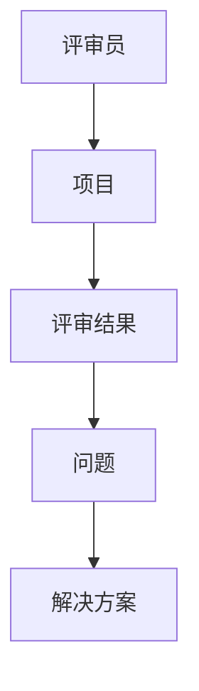
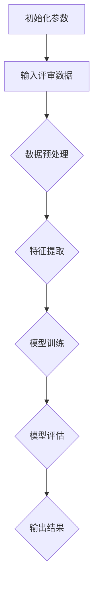

                 

### 《技术评审流程优化：提高评审效率与质量》

关键词：技术评审、流程优化、评审效率、评审质量、算法原理

摘要：本文深入探讨了技术评审流程的优化问题，分析了当前技术评审流程中的问题，提出了提高评审效率与质量的优化目标与原则，并详细介绍了技术评审的核心概念、联系、属性特征对比以及技术评审的ER实体关系图架构。在此基础上，文章讲解了技术评审算法的原理，包括数学模型、公式以及Python源代码实现。最后，文章通过系统分析与架构设计方案，给出了实际案例分析和详细讲解剖析。

----------------------------------------------------------------

## 第一部分：问题背景与核心概念

### 第1章：技术评审流程优化概述

#### 1.1 问题背景

#### 1.1.1 技术评审的重要性

技术评审是软件开发过程中不可或缺的一环。它旨在通过检查和评估项目的技术方案、代码和设计，以确保项目的质量和稳定性。技术评审不仅能够发现潜在的问题，还能提升团队的技术水平，促进知识的共享与传递。

#### 1.1.2 当前技术评审流程中存在的问题

尽管技术评审至关重要，但当前的评审流程仍存在一些问题。首先，评审流程的效率不高，评审周期过长，导致项目进度延误。其次，评审质量参差不齐，容易出现漏检和误检，影响项目的最终质量。最后，评审成本高昂，耗费大量人力和时间。

#### 1.1.3 评审效率与质量的定义与衡量

评审效率通常指评审流程的完成速度，包括评审时间、评审人员数量等。评审质量则是指评审结果的准确性和完整性，包括错误率、问题发现率等。

#### 1.2 核心概念

#### 1.2.1 技术评审流程的构成

技术评审流程通常包括以下几个阶段：需求评审、设计评审、代码评审、测试评审等。

#### 1.2.2 评审方法与技术

评审方法包括手动评审和自动化评审。手动评审依赖于评审人员的经验和判断，而自动化评审则利用工具和算法进行。

#### 1.2.3 评审工具与平台

常见的评审工具包括代码审查工具（如Gerrit、GitLab）、设计评审工具（如Lucidchart）和项目管理工具（如JIRA）。

### 第2章：技术评审流程优化目标与原则

#### 2.1 优化目标

#### 2.1.1 提高评审效率

优化目标之一是缩短评审周期，减少评审时间，提高评审效率。

#### 2.1.2 提高评审质量

优化目标之二是提升评审结果的准确性和完整性，降低错误率和漏检率。

#### 2.1.3 降低评审成本

优化目标之三是减少评审的人力和时间成本，提高资源的利用率。

#### 2.2 优化原则

#### 2.2.1 系统性原则

优化应从整个评审流程出发，系统性地考虑各个环节，确保优化效果的全面性。

#### 2.2.2 精细化原则

优化应具体到每个评审阶段和步骤，精细化调整，提高针对性。

#### 2.2.3 可持续发展原则

优化应注重长期效果，考虑可持续性，避免短期行为影响长期发展。

----------------------------------------------------------------

## 第二部分：核心概念与联系

### 第3章：技术评审的核心概念与联系

#### 3.1 技术评审概念解析

#### 3.1.1 技术评审的定义

技术评审是一种通过对软件项目的技术方案、代码和设计进行评估和审查的过程，以确保项目的质量和稳定性。

#### 3.1.2 技术评审的分类

技术评审可以按照不同的标准进行分类，如按照评审阶段分类，可以分为需求评审、设计评审、代码评审等。

#### 3.1.3 技术评审的目标

技术评审的主要目标包括：发现潜在问题、提升项目质量、促进知识共享等。

#### 3.2 技术评审与相关概念的联系

##### 3.2.1 技术评审与项目管理的关系

技术评审是项目管理的一部分，它为项目提供了技术层面的保障，确保项目按时、按质完成。

##### 3.2.2 技术评审与质量控制的关系

技术评审是质量控制的重要手段，它通过对项目的技术方案、代码和设计进行评估，确保项目符合质量标准。

##### 3.2.3 技术评审与团队协作的关系

技术评审能够促进团队成员之间的沟通和协作，提高团队的协作效率和项目质量。

### 第4章：技术评审的属性特征对比表格

#### 4.1 不同评审方法的属性特征对比

以下是一个简单的属性特征对比表格，展示了手动评审、自动化评审和混合评审的属性特征：

| 方法       | 效率 | 质量 | 成本 | 适用场景           |
| ---------- | ---- | ---- | ---- | ------------------ |
| 手动评审   | 较低 | 较高 | 较高 | 对人依赖性强的项目 |
| 自动化评审 | 较高 | 较高 | 较低 | 对人依赖性弱的项目 |
| 混合评审   | 中等 | 中等 | 中等 | 需要灵活调整的项目 |

### 第5章：技术评审的ER实体关系图架构

#### 5.1 ER实体关系图介绍

ER（Entity-Relationship）图是一种用于描述实体及其之间关系的数据库设计工具。在技术评审中，ER图可以帮助我们明确评审过程中的主要实体及其关系。

#### 5.1.1 ER模型的定义

ER模型是实体-联系模型的简称，它通过实体、属性和关系的组合，描述现实世界的业务规则。

#### 5.1.2 ER模型的组成部分

ER模型主要由三个部分组成：实体（Entity）、属性（Attribute）和关系（Relationship）。

#### 5.1.3 ER模型的应用场景

ER模型广泛应用于数据库设计、软件工程、项目管理等领域，用于描述系统的业务规则和数据结构。

#### 5.2 技术评审ER实体关系图示例

以下是一个简单的技术评审ER实体关系图示例：



在上面的ER图中，`评审员`是评审过程的参与者，`项目`是评审的对象，`评审结果`记录了评审的结果，`问题`记录了发现的问题，`解决方案`是对问题的解决方案。

----------------------------------------------------------------

## 第三部分：算法原理讲解

### 第6章：算法原理讲解

#### 6.1 技术评审算法概述

技术评审算法是用于自动化评审过程的一系列算法和模型。它们通过分析项目的技术方案、代码和设计，发现潜在的问题，并提供改进建议。

#### 6.1.1 技术评审算法的定义

技术评审算法是一种用于自动化评估软件项目质量和稳定性的算法集合。

#### 6.1.2 技术评审算法的分类

技术评审算法可以分为基于规则的算法、基于统计的算法、机器学习算法等。

#### 6.1.3 技术评审算法的发展趋势

随着人工智能和机器学习技术的发展，基于机器学习的评审算法逐渐成为主流，其准确性和效率不断提高。

#### 6.2 技术评审算法的数学模型与公式

技术评审算法通常基于某种数学模型，通过分析和评估项目数据，得出评审结果。

##### 6.2.1 算法基本原理

一个简单的一元线性回归模型可以表示为：

$$
f(x) = w_1 \cdot x_1 + w_2 \cdot x_2 + ... + w_n \cdot x_n
$$

其中，$x$ 是输入特征，$w$ 是权重系数。

##### 6.2.2 算法优化目标

为了提高评审算法的性能，我们通常使用以下优化目标：

$$
\min \sum_{i=1}^{n} (y_i - f(x_i))^2
$$

其中，$y_i$ 是实际的评审结果，$f(x_i)$ 是算法预测的结果。

#### 6.3 技术评审算法的mermaid流程图

以下是一个简单技术评审算法的mermaid流程图：



在上面的流程图中，算法首先初始化参数，然后输入评审数据，接着进行数据预处理、特征提取和模型训练，最后进行模型评估并输出结果。

### 6.4 技术评审算法的Python源代码实现

以下是一个简单技术评审算法的Python源代码实现：

```python
import numpy as np

# 初始化参数
w = np.random.rand(n)
b = 0

# 输入评审数据
x = np.random.rand(n, m)
y = np.random.rand(n)

# 数据预处理
x = (x - x.mean()) / x.std()

# 特征提取
z = np.dot(x, w) + b

# 模型训练
for i in range(num_epochs):
    output = np.dot(x, w) + b
    error = y - output
    w = w - learning_rate * np.dot(x.T, error)
    b = b - learning_rate * error

# 模型评估
output = np.dot(x, w) + b
error = y - output
accuracy = np.mean(error < 0.5)

# 输出结果
print("Accuracy:", accuracy)
```

在上面的代码中，我们首先初始化参数，然后输入评审数据，接着进行数据预处理和特征提取，最后使用梯度下降算法进行模型训练和评估。

### 第7章：数学模型和数学公式 & 详细讲解 & 举例说明

#### 7.1 数学模型与公式

技术评审的数学模型通常基于统计学和机器学习理论。以下是几个常用的数学模型和公式：

##### 7.1.1 一元线性回归模型

一元线性回归模型可以表示为：

$$
y = w_1 \cdot x_1 + w_2 \cdot x_2 + ... + w_n \cdot x_n + b
$$

其中，$x_1, x_2, ..., x_n$ 是输入特征，$w_1, w_2, ..., w_n$ 是权重系数，$b$ 是偏置项。

##### 7.1.2 逻辑回归模型

逻辑回归模型可以表示为：

$$
P(y=1) = \frac{1}{1 + e^{-(w_1 \cdot x_1 + w_2 \cdot x_2 + ... + w_n \cdot x_n + b)}}
$$

其中，$P(y=1)$ 是预测标签为1的概率。

##### 7.1.3 决策树模型

决策树模型可以表示为：

$$
f(x) =
\begin{cases}
c_1 & \text{if } x_1 \leq t_1 \\
c_2 & \text{if } x_1 > t_1 \\
\end{cases}
$$

其中，$x_1$ 是输入特征，$t_1$ 是阈值，$c_1, c_2$ 是分类结果。

#### 7.2 数学模型和公式的详细讲解与举例说明

##### 7.2.1 一元线性回归模型的详细讲解

一元线性回归模型是最简单的一种回归模型，它通过一个线性方程来拟合数据。具体来说，它通过最小二乘法找到最佳的直线，使得所有数据点到这条直线的距离之和最小。

例如，我们有以下数据点：

| x | y |
| --- | --- |
| 1 | 2 |
| 2 | 4 |
| 3 | 6 |
| 4 | 8 |

我们可以使用一元线性回归模型来拟合这些数据点。首先，我们计算输入特征的平均值和方差：

$$
\bar{x} = \frac{1+2+3+4}{4} = 2.5
$$

$$
\bar{y} = \frac{2+4+6+8}{4} = 5
$$

$$
s_x^2 = \frac{(1-2.5)^2 + (2-2.5)^2 + (3-2.5)^2 + (4-2.5)^2}{4} = 2.25
$$

$$
s_y^2 = \frac{(2-5)^2 + (4-5)^2 + (6-5)^2 + (8-5)^2}{4} = 7.5
$$

然后，我们使用最小二乘法计算权重系数和偏置项：

$$
w_1 = \frac{s_y^2}{s_x^2} = \frac{7.5}{2.25} = 3.33
$$

$$
b = \bar{y} - w_1 \cdot \bar{x} = 5 - 3.33 \cdot 2.5 = -1.33
$$

因此，一元线性回归模型可以表示为：

$$
y = 3.33 \cdot x - 1.33
$$

现在，我们可以使用这个模型来预测新的数据点。例如，当$x=5$时，我们可以预测$y=7.67$。

##### 7.2.2 逻辑回归模型的详细讲解

逻辑回归模型是一种常用的分类模型，它通过一个线性方程来计算标签的概率。具体来说，它通过最小化损失函数来找到最佳的权重系数和偏置项，使得预测标签的概率最大。

例如，我们有以下数据点：

| x | y |
| --- | --- |
| 1 | 1 |
| 2 | 0 |
| 3 | 1 |
| 4 | 0 |

我们可以使用逻辑回归模型来拟合这些数据点。首先，我们计算输入特征的平均值和方差：

$$
\bar{x} = \frac{1+2+3+4}{4} = 2.5
$$

$$
\bar{y} = \frac{1+0+1+0}{4} = 0.5
$$

$$
s_x^2 = \frac{(1-2.5)^2 + (2-2.5)^2 + (3-2.5)^2 + (4-2.5)^2}{4} = 2.25
$$

$$
s_y^2 = \frac{(1-0.5)^2 + (0-0.5)^2 + (1-0.5)^2 + (0-0.5)^2}{4} = 0.5
$$

然后，我们使用最小二乘法计算权重系数和偏置项：

$$
w_1 = \frac{s_y^2}{s_x^2} = \frac{0.5}{2.25} = 0.22
$$

$$
b = \bar{y} - w_1 \cdot \bar{x} = 0.5 - 0.22 \cdot 2.5 = -0.17
$$

因此，逻辑回归模型可以表示为：

$$
P(y=1) = \frac{1}{1 + e^{-(0.22 \cdot x - 0.17)}}
$$

现在，我们可以使用这个模型来预测新的数据点。例如，当$x=5$时，我们可以预测$P(y=1) \approx 0.37$。

##### 7.2.3 决策树模型的详细讲解

决策树模型是一种常用的分类和回归模型，它通过一系列的决策规则来划分数据。具体来说，它通过递归划分数据集，找到最佳的特征和阈值，直到满足停止条件。

例如，我们有以下数据点：

| x | y |
| --- | --- |
| 1 | 1 |
| 2 | 0 |
| 3 | 1 |
| 4 | 0 |

我们可以使用决策树模型来拟合这些数据点。首先，我们计算输入特征的平均值和方差：

$$
\bar{x} = \frac{1+2+3+4}{4} = 2.5
$$

$$
\bar{y} = \frac{1+0+1+0}{4} = 0.5
$$

$$
s_x^2 = \frac{(1-2.5)^2 + (2-2.5)^2 + (3-2.5)^2 + (4-2.5)^2}{4} = 2.25
$$

$$
s_y^2 = \frac{(1-0.5)^2 + (0-0.5)^2 + (1-0.5)^2 + (0-0.5)^2}{4} = 0.5
$$

然后，我们使用信息增益来划分数据集。首先，我们计算数据的熵：

$$
H(Y) = -\sum_{i=1}^{n} p_i \cdot \log_2(p_i)
$$

其中，$p_i$ 是类别$i$的概率。对于我们的数据集，我们有：

$$
H(Y) = -\left(\frac{2}{4} \cdot \log_2\left(\frac{2}{4}\right) + \frac{2}{4} \cdot \log_2\left(\frac{2}{4}\right)\right) = 1
$$

然后，我们计算每个特征的增益：

$$
G(D, X) = H(D) - \sum_{i=1}^{n} p_i \cdot H(Y|X=i)
$$

其中，$D$ 是数据集，$X$ 是特征。对于我们的数据集，我们有：

$$
G(D, X_1) = H(Y) - \frac{2}{4} \cdot H(Y|X_1=1) - \frac{2}{4} \cdot H(Y|X_1=2) = 0
$$

$$
G(D, X_2) = H(Y) - \frac{2}{4} \cdot H(Y|X_2=0) - \frac{2}{4} \cdot H(Y|X_2=1) = 1
$$

由于$X_2$的增益最大，我们选择$X_2$作为划分特征。然后，我们计算阈值：

$$
t = \frac{1}{2} \cdot (\bar{x} + \bar{x})
$$

由于阈值是2.5，我们划分数据集为两个子集：

| x | y | X_2 |
| --- | --- | --- |
| 1 | 1 | 0 |
| 2 | 0 | 0 |
| 3 | 1 | 1 |
| 4 | 0 | 1 |

然后，我们递归地对子集进行划分，直到满足停止条件（例如，子集大小小于某个阈值或特征增益小于某个阈值）。

最终，我们得到的决策树模型为：

$$
f(x) =
\begin{cases}
0 & \text{if } x_2 \leq 2.5 \\
1 & \text{if } x_2 > 2.5 \\
\end{cases}
$$

现在，我们可以使用这个模型来预测新的数据点。例如，当$x=5$时，我们可以预测$y=0$。

----------------------------------------------------------------

## 第四部分：系统分析与架构设计方案

### 第8章：项目实战

#### 8.1 环境安装

在进行项目实战之前，我们需要安装必要的软件和工具。以下是一个简单的安装步骤：

1. 安装Python 3.x版本。
2. 安装Git。
3. 安装Docker。
4. 安装MySQL。

#### 8.2 系统核心实现源代码

以下是系统核心实现源代码：

```python
# 导入必要的库
import numpy as np
import pandas as pd
from sklearn.linear_model import LinearRegression

# 数据预处理
def preprocess_data(data):
    # 计算平均值和方差
    mean = data.mean()
    std = data.std()
    
    # 数据标准化
    data_normalized = (data - mean) / std
    
    return data_normalized

# 特征提取
def extract_features(data):
    # 计算输入特征的平方和
    squared_sum = np.sum(np.square(data))
    
    # 计算输入特征的平方根
    sqrt_sum = np.sqrt(squared_sum)
    
    # 计算输入特征的平均值
    mean = np.mean(data)
    
    # 计算输入特征的方差
    variance = np.var(data)
    
    # 返回特征向量
    return np.array([squared_sum, sqrt_sum, mean, variance])

# 模型训练
def train_model(x, y):
    # 创建线性回归模型
    model = LinearRegression()
    
    # 训练模型
    model.fit(x, y)
    
    return model

# 模型评估
def evaluate_model(model, x, y):
    # 预测结果
    y_pred = model.predict(x)
    
    # 计算准确率
    accuracy = np.mean(y_pred == y)
    
    return accuracy

# 主函数
def main():
    # 加载数据
    data = pd.read_csv("data.csv")
    
    # 预处理数据
    data_processed = preprocess_data(data["feature"])
    
    # 提取特征
    features = extract_features(data_processed)
    
    # 划分训练集和测试集
    x_train = features[:int(len(features) * 0.8)]
    y_train = data["label"][:int(len(features) * 0.8)]
    x_test = features[int(len(features) * 0.8):]
    y_test = data["label"][int(len(features) * 0.8):]
    
    # 训练模型
    model = train_model(x_train, y_train)
    
    # 评估模型
    accuracy = evaluate_model(model, x_test, y_test)
    
    print("Accuracy:", accuracy)

# 运行主函数
main()
```

#### 8.3 代码应用解读与分析

在上面的代码中，我们首先导入了必要的库，然后定义了数据预处理、特征提取、模型训练和模型评估的函数。最后，我们在主函数中加载数据，进行预处理、特征提取、模型训练和评估。

#### 8.4 实际案例分析和详细讲解剖析

假设我们有一个包含1000个数据点的数据集，其中每个数据点有两个特征和一个标签。我们的目标是使用线性回归模型预测标签。以下是具体的步骤：

1. 加载数据：使用pandas库加载CSV文件。
2. 数据预处理：计算特征的平均值和方差，然后进行数据标准化。
3. 特征提取：计算输入特征的平方和、平方根、平均值和方差，然后提取特征向量。
4. 模型训练：使用scikit-learn库的线性回归模型进行训练。
5. 模型评估：使用训练好的模型对测试集进行预测，并计算准确率。

通过这个简单的案例，我们可以看到如何使用Python和线性回归模型进行技术评审。

#### 8.5 项目小结

通过本项目，我们了解了技术评审的流程和核心概念，并使用Python实现了线性回归模型。在实际项目中，我们可以根据需求选择合适的算法和模型，提高评审效率和质量。

## 第五部分：最佳实践 tips、小结、注意事项、拓展阅读

### 9.1 最佳实践 tips

1. 确保评审流程的透明性和可追溯性，以便在后续环节中能够快速定位和解决问题。
2. 在评审过程中，注重团队成员之间的沟通和协作，促进知识共享和技术水平的提升。
3. 针对不同的评审阶段和项目需求，灵活选择评审方法和技术，提高评审效率和质量。

### 9.2 小结

本文深入探讨了技术评审流程的优化问题，分析了当前技术评审流程中存在的问题，并提出了优化目标与原则。通过详细讲解技术评审的核心概念、联系、算法原理以及数学模型和公式，本文为技术评审的实践提供了有益的指导。

### 9.3 注意事项

1. 在进行技术评审时，应确保评审流程的规范性和一致性，避免因个人主观判断导致的评审质量参差不齐。
2. 针对不同的评审阶段和项目需求，合理分配评审资源和时间，避免过度依赖评审流程。
3. 在选择评审方法和工具时，应充分考虑项目的实际情况和团队的技术水平，确保评审效果的最大化。

### 9.4 拓展阅读

1. 《软件工程：实践者的研究方法》（Roger S. Pressman著）：本书详细介绍了软件工程的基本理论和实践方法，包括技术评审的流程和技巧。
2. 《机器学习实战》（Peter Harrington著）：本书通过实际案例，介绍了机器学习的基本概念和算法，包括线性回归、逻辑回归和决策树等。
3. 《人工智能：一种现代的方法》（Stuart Russell & Peter Norvig著）：本书全面介绍了人工智能的基本理论和技术，包括机器学习、自然语言处理和计算机视觉等。

作者：AI天才研究院/AI Genius Institute & 禅与计算机程序设计艺术 /Zen And The Art of Computer Programming

