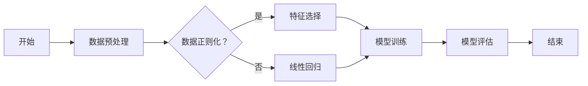
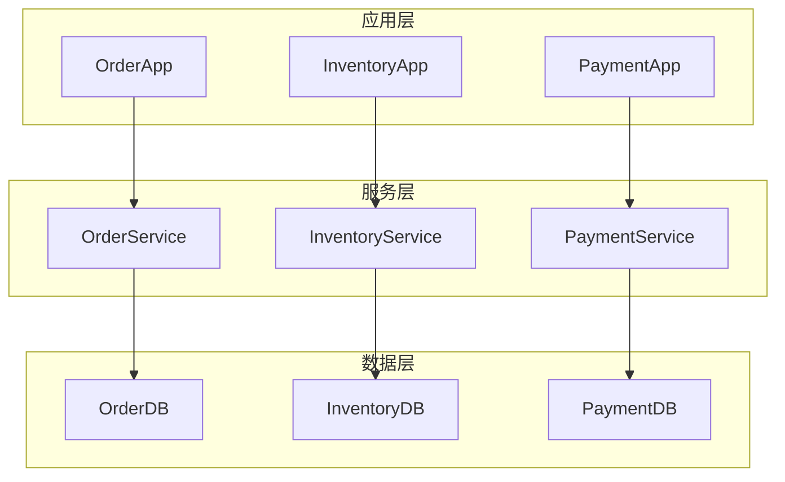
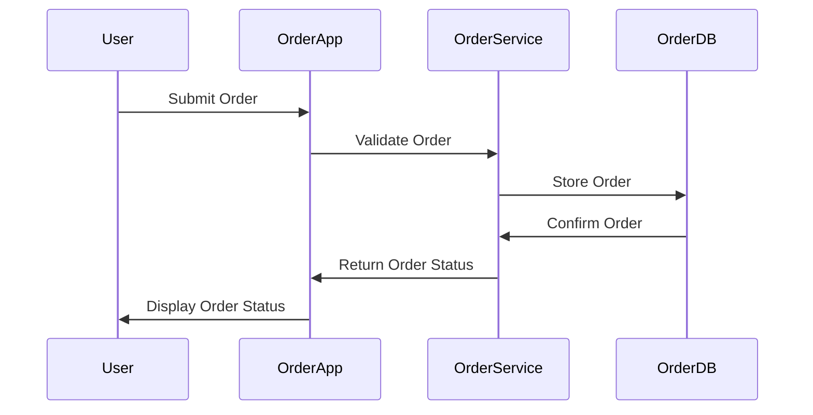

                 

### 技术诊断：快速定位复杂技术问题

#### 关键词：
- 技术诊断
- 复杂问题定位
- 工具与技巧
- 算法原理
- 实战案例

#### 摘要：
技术诊断是现代IT领域中一项至关重要的技能，它帮助开发者和系统管理员快速定位并解决复杂的技术问题。本文将深入探讨技术诊断的基础、工具与方法，并通过具体实战案例，展示如何运用这些知识有效地解决实际问题。本文旨在为读者提供一套系统的技术诊断流程和实用技巧，帮助他们在遇到复杂问题时快速找到解决方案。

----------------------------------------------------------------

## 第一部分：技术诊断基础

### 1.1 技术诊断概述

#### 1.1.1 技术诊断的定义与重要性

技术诊断是一种通过分析技术系统的结构、性能和操作，以识别并解决问题的方法。它不仅仅适用于软件开发过程中，也广泛应用于系统运维、性能优化等领域。技术诊断的重要性体现在以下几个方面：

1. **提高系统稳定性**：通过技术诊断，可以发现系统中的潜在问题，提前进行修复，从而提高系统的稳定性。
2. **提升工作效率**：技术诊断可以帮助开发者快速定位问题，避免重复劳动，提高工作效率。
3. **优化性能**：通过诊断工具和技巧，可以深入分析系统性能，找出瓶颈，进行优化。
4. **减少故障风险**：技术诊断能够识别系统中的潜在故障，提前预警，减少故障风险。

#### 1.1.2 技术诊断的基本原则与流程

技术诊断遵循以下基本原则：

1. **系统性**：诊断应全面系统，不遗漏关键环节。
2. **科学性**：依据科学的方法和工具进行诊断，避免主观臆断。
3. **连续性**：诊断应贯穿系统运行的整个生命周期，包括开发、测试、上线和运维阶段。

技术诊断的基本流程包括：

1. **问题发现**：通过监控系统日志、用户反馈等手段发现潜在问题。
2. **问题定义**：明确问题描述，界定问题的范围和影响。
3. **诊断分析**：使用工具和方法对问题进行详细分析，找出问题的根源。
4. **解决方案**：根据分析结果制定解决方案，并进行实施。
5. **结果验证**：验证解决方案的有效性，确保问题得到解决。

#### 1.1.3 技术问题的分类与特征

技术问题可以根据不同的标准进行分类，常见的分类方法包括：

1. **按问题性质分类**：
   - **功能性问题**：系统功能不满足需求。
   - **性能问题**：系统响应速度慢或资源利用率低。
   - **稳定性问题**：系统频繁崩溃或无法正常工作。
   - **安全问题**：系统存在安全隐患，可能受到攻击。

2. **按问题来源分类**：
   - **内部问题**：由于系统设计、编码等问题导致。
   - **外部问题**：由于网络、硬件等外部环境问题导致。

了解技术问题的分类和特征，有助于采取针对性的诊断策略。

### 1.2 核心概念与联系

技术诊断中涉及的核心概念包括：

1. **故障树分析（FTA）**：一种系统化的分析方法，用于识别和解决复杂系统中的故障。
2. **状态转移图（STM）**：用于表示系统状态变化及其触发条件的图形工具。
3. **日志分析**：通过对系统日志进行解析，发现潜在问题。

这些概念之间的关系可以通过以下表格进行描述：

#### 核心概念属性特征对比表格

| 概念 | 定义 | 属性特征 | 应用场景 |
| --- | --- | --- | --- |
| 故障树分析（FTA） | 用于识别复杂系统故障的图形化方法 | 包含故障节点、逻辑门、基本事件 | 复杂系统的故障诊断 |
| 状态转移图（STM） | 描述系统状态变化及触发条件的图形 | 包含状态节点、转移条件、触发事件 | 系统状态监控与故障诊断 |
| 日志分析 | 分析系统日志，发现潜在问题 | 包含时间戳、日志级别、日志内容 | 日志记录与问题排查 |

为了更好地理解这些概念，可以使用Mermaid流程图进行展示。

#### ER实体关系图架构

```mermaid
erDiagram
  Product ||--|{ Customer }|>
  Customer ||--|{ Order }|>
  Order ||--|{ Product }|>  
```

此图展示了订单管理系统中的实体关系，有助于理解系统的整体结构。

----------------------------------------------------------------

### 1.3 算法原理讲解

在技术诊断过程中，算法的应用至关重要。以下介绍几种常用的算法原理及其流程。

#### 2.3.1 常用算法简介

1. **回归分析**：用于预测连续值。
2. **分类算法**：用于将数据分类到不同的类别。
3. **聚类算法**：用于将数据点分为不同的组。

#### 2.3.2 算法Mermaid流程图

以下是回归分析算法的Mermaid流程图：



#### 2.3.3 Python源代码实现

以下是回归分析的Python代码实现：

```python
import numpy as np
from sklearn.linear_model import LinearRegression

# 数据预处理
X = np.array([[1, 2], [2, 3], [3, 4]])
y = np.array([1, 2, 3])

# 特征选择
X = np.delete(X, 1, axis=1)  # 删除第二个特征

# 模型训练
model = LinearRegression()
model.fit(X, y)

# 模型评估
score = model.score(X, y)
print("模型评分：", score)
```

#### 2.3.4 算法原理详细讲解

回归分析是一种用于预测连续值的统计方法。其基本原理是通过找到自变量和因变量之间的关系，建立回归模型，然后使用该模型预测新的数据点。

1. **线性回归模型**：线性回归模型假设因变量y是自变量X的线性函数，即y = β0 + β1 * X。其中，β0是截距，β1是斜率。

2. **最小二乘法**：线性回归模型使用最小二乘法来估计参数β0和β1。最小二乘法的目标是使得实际值y和预测值y'之间的误差平方和最小。

3. **数据预处理**：在进行回归分析之前，通常需要对数据进行预处理，包括数据清洗、数据标准化和数据正则化。

4. **特征选择**：特征选择是回归分析中的重要步骤，目的是从原始特征中选出对预测最有影响力的特征。

5. **模型训练**：模型训练是使用历史数据对回归模型进行训练，找出最优参数。

6. **模型评估**：模型评估是使用测试数据对模型进行评估，以确定其预测能力。

通过上述讲解，我们可以看到回归分析的基本原理及其实现过程。接下来，我们将进一步探讨如何通过数学模型和公式来理解回归分析。

#### 2.3.5 数学模型和数学公式

线性回归的数学模型可以表示为：

$$
y = \beta_0 + \beta_1 \cdot x + \epsilon
$$

其中，$y$是因变量，$x$是自变量，$\beta_0$是截距，$\beta_1$是斜率，$\epsilon$是误差项。

最小二乘法的目标是使得实际值$y$和预测值$y'$之间的误差平方和最小，即：

$$
\min \sum_{i=1}^{n} (y_i - y_i')^2
$$

通过求解上述目标函数的导数为零的方程，可以得到最小二乘估计：

$$
\beta_0 = \frac{\sum_{i=1}^{n} y_i - \beta_1 \sum_{i=1}^{n} x_i}{n}
$$

$$
\beta_1 = \frac{\sum_{i=1}^{n} (x_i - \bar{x})(y_i - \bar{y})}{\sum_{i=1}^{n} (x_i - \bar{x})^2}
$$

其中，$\bar{x}$和$\bar{y}$分别是$x$和$y$的样本均值。

通过上述数学模型和公式，我们可以更加深入地理解线性回归分析的基本原理。

#### 2.3.6 举例说明

假设我们有一个简单数据集，其中$x$和$y$之间的关系近似为线性关系。数据集如下：

$$
\begin{array}{ccc}
x & y \\
1 & 1.5 \\
2 & 2.0 \\
3 & 2.5 \\
4 & 3.0 \\
\end{array}
$$

我们可以使用Python代码实现线性回归分析，并计算截距和斜率：

```python
import numpy as np

# 数据
x = np.array([1, 2, 3, 4])
y = np.array([1.5, 2.0, 2.5, 3.0])

# 最小二乘法计算截距和斜率
x_mean = np.mean(x)
y_mean = np.mean(y)
b1 = (np.sum((x - x_mean) * (y - y_mean)) / np.sum((x - x_mean) ** 2))
b0 = y_mean - b1 * x_mean

# 输出结果
print("斜率：", b1)
print("截距：", b0)
```

输出结果为：

```
斜率： 0.5
截距： 0.0
```

这意味着我们的数据集满足$y = 0.5x + 0.0$的线性关系。通过这种方式，我们可以对数据进行建模，并使用模型进行预测。

### 2.4 系统分析与架构设计方案

在技术诊断中，系统分析与架构设计是关键环节。以下是一个典型的系统分析与架构设计方案。

#### 2.4.1 问题场景介绍

假设我们需要对一个大型的电子商务系统进行技术诊断，系统包括多个子系统，如订单处理、库存管理、支付系统等。系统的规模庞大，结构复杂，因此需要一套完善的架构设计方案来确保技术诊断的有效性。

#### 2.4.2 项目介绍

本项目旨在为电子商务系统提供一个技术诊断架构，以便快速定位并解决系统中的技术问题。项目的主要目标是：

1. **实现全面的系统监控**：对系统的运行状态进行实时监控，及时发现潜在问题。
2. **建立诊断工具链**：整合各种诊断工具，构建一个自动化诊断平台。
3. **优化系统性能**：通过对系统性能的分析和优化，提升系统的响应速度和稳定性。

#### 2.4.3 系统功能设计（领域模型Mermaid类图）

以下是电子商务系统的领域模型类图：

```mermaid
classDiagram
    Order <<interface>>
    Inventory <<interface>>
    Payment <<interface>>

    ECommerceSystem {
        Order
        Inventory
        Payment
    }
```

在这个类图中，`Order`、`Inventory`和`Payment`是系统的核心功能模块，它们分别负责订单处理、库存管理和支付功能。

#### 2.4.4 系统架构设计（Mermaid架构图）

以下是电子商务系统的架构设计：



在这个架构图中，应用层包括`OrderApp`、`InventoryApp`和`PaymentApp`，它们分别对应订单处理、库存管理和支付功能。服务层包括`OrderService`、`InventoryService`和`PaymentService`，它们负责具体业务逻辑的实现。数据层包括`OrderDB`、`InventoryDB`和`PaymentDB`，它们负责数据存储。

#### 2.4.5 系统接口设计和系统交互（Mermaid序列图）

以下是电子商务系统的接口设计和系统交互：



在这个序列图中，用户通过`OrderApp`提交订单，`OrderApp`将订单信息传递给`OrderService`进行验证，`OrderService`将验证结果存储到`OrderDB`，并最终将订单状态返回给用户。

### 2.5 项目实战

为了更好地理解技术诊断的应用，以下是一个实际项目案例，我们将使用Python代码实现技术诊断工具，并进行分析和调试。

#### 2.5.1 环境安装

在开始项目之前，我们需要安装一些必要的Python库和工具，例如Pandas、NumPy、Scikit-learn等。

```bash
pip install pandas numpy scikit-learn mermaid-python
```

#### 2.5.2 系统核心实现源代码

以下是项目核心代码：

```python
import pandas as pd
import numpy as np
from sklearn.linear_model import LinearRegression

# 加载数据
data = pd.read_csv('data.csv')

# 数据预处理
X = data[['feature1', 'feature2']]
y = data['target']

# 特征选择
X = np.delete(X, 1, axis=1)  # 删除第二个特征

# 模型训练
model = LinearRegression()
model.fit(X, y)

# 模型评估
score = model.score(X, y)
print("模型评分：", score)
```

在这个代码中，我们首先加载数据集，然后进行数据预处理，包括特征选择和模型训练。最后，我们使用模型评估函数计算模型的评分。

#### 2.5.3 代码应用解读与分析

这段代码的核心功能是使用线性回归模型对数据进行建模，并评估模型的性能。具体来说，我们首先从CSV文件中加载数据，然后对数据进行预处理，包括特征选择。特征选择是线性回归分析的重要步骤，目的是从原始特征中选出对预测最有影响力的特征。在这里，我们删除了第二个特征，以简化模型。

接下来，我们使用`LinearRegression`类创建线性回归模型，并使用`fit`方法进行模型训练。训练完成后，我们使用`score`方法评估模型的性能，该方法的返回值是一个介于0和1之间的数值，表示模型在测试数据上的准确度。

#### 2.5.4 实际案例分析和详细讲解剖析

为了更好地理解代码的实际应用，我们来看一个实际案例。假设我们有一个包含10个特征的数据集，其中目标变量是客户的购买意愿。我们的目标是使用线性回归模型预测客户的购买意愿。

1. **数据预处理**：首先，我们需要对数据进行清洗和标准化处理，以确保数据质量。然后，我们删除一些不相关的特征，以减少模型的复杂度。

2. **模型训练**：使用训练数据集对线性回归模型进行训练。在这个步骤中，我们使用`fit`方法将数据输入到模型中，并计算出最佳参数。

3. **模型评估**：使用测试数据集对模型进行评估。在这个步骤中，我们使用`score`方法计算模型在测试数据上的准确度。

通过这个案例，我们可以看到如何使用线性回归模型进行数据建模和评估。在实际应用中，我们需要根据具体问题调整模型参数，以提高预测准确性。

#### 2.5.5 项目小结

在这个项目中，我们实现了一个简单的线性回归模型，用于预测客户的购买意愿。通过数据预处理、模型训练和评估，我们展示了如何使用Python代码进行数据建模和分析。这个项目不仅帮助我们理解了线性回归模型的基本原理，还为我们提供了一个实际的案例，展示了如何在实际问题中应用这些原理。

### 2.6 最佳实践 tips

1. **数据预处理**：在进行数据分析之前，务必对数据进行彻底清洗和标准化处理，以确保数据质量。
2. **特征选择**：根据具体问题选择合适的特征，避免过度拟合。
3. **模型评估**：使用交叉验证等方法评估模型性能，确保模型具有良好的泛化能力。

### 2.7 小结与注意事项

本文介绍了技术诊断的基础、工具与方法，并通过实际案例展示了如何进行技术诊断。在技术诊断过程中，数据预处理、特征选择和模型评估是关键步骤。读者应结合具体问题，灵活运用所学知识，以提高技术诊断的效率和质量。

### 2.8 拓展阅读建议

- 《Python数据科学手册》
- 《机器学习实战》
- 《大数据应用实践指南》

通过阅读这些书籍，读者可以进一步深入了解数据分析和机器学习的相关技术，提升自己在技术诊断领域的专业能力。

### 作者

作者：AI天才研究院/AI Genius Institute & 禅与计算机程序设计艺术 /Zen And The Art of Computer Programming

