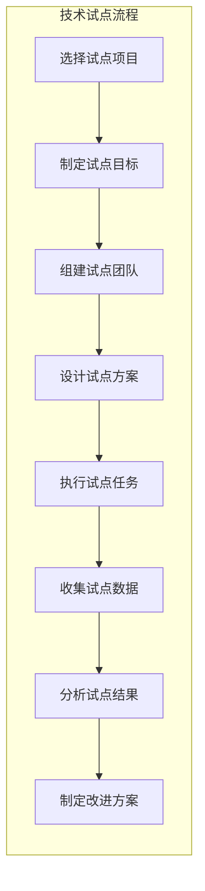
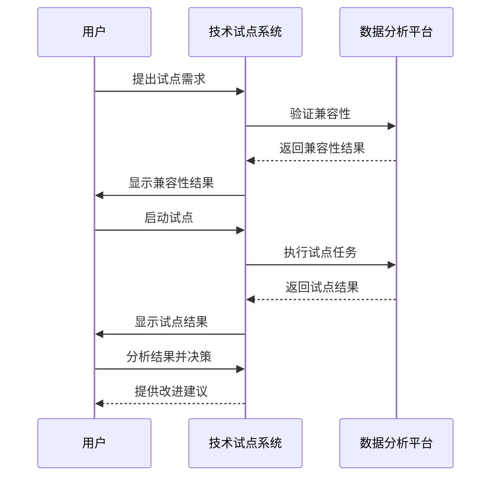
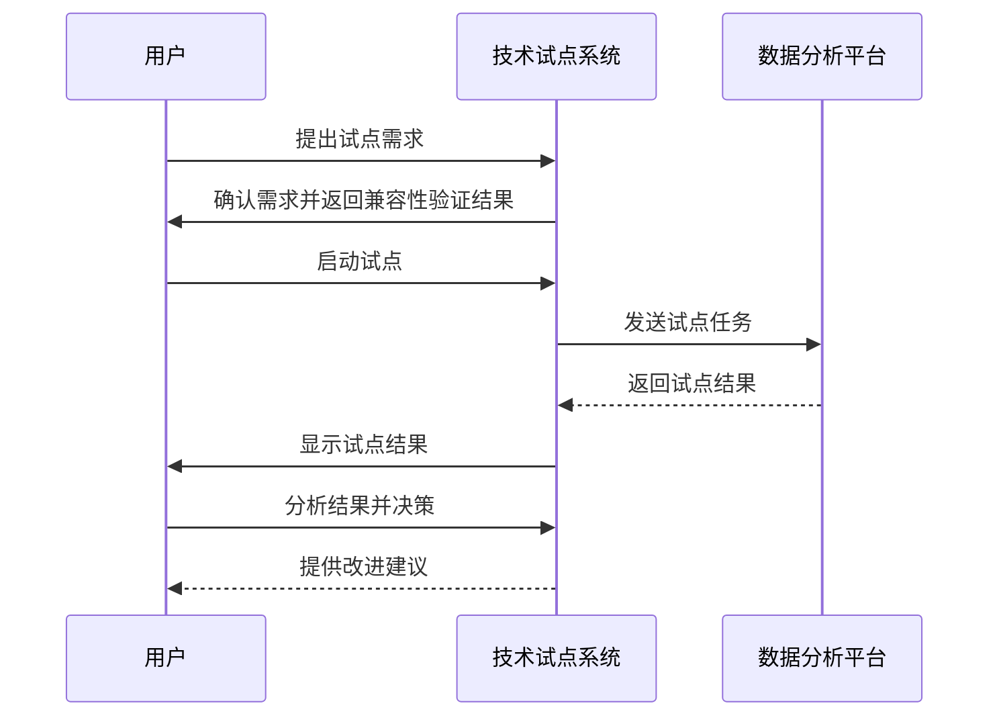

                 

## 技术试点：如何选择和执行技术试点

### 关键词：技术试点，敏捷开发，项目评估，风险控制，成功案例

> 技术试点是一种通过在小规模环境中测试新技术或方法的有效性，以评估其在实际项目中的可行性和影响的重要策略。本文将详细探讨如何选择和执行技术试点，包括其背景、核心概念、步骤以及最佳实践，帮助企业和开发团队在技术转型和创新中降低风险、提高成功率。

### 摘要

技术试点作为敏捷开发中的重要策略，旨在通过小规模、快速迭代的方式，验证新技术的可行性，降低项目风险。本文首先介绍了技术试点的背景和意义，随后定义了核心概念，包括试点项目、试点目标和试点团队。接着，本文详细阐述了选择和执行技术试点的步骤，包括需求分析、技术评估、资源分配、试点执行和结果评估。文章还通过成功案例展示了技术试点的实际效果，并提供了最佳实践和注意事项，帮助读者更好地实施技术试点。

----------------------------------------------------------------

## 第一部分：背景

### 1.1 问题背景

在当今快速发展的技术时代，新技术的应用和迭代速度不断加快，如何在项目初期就有效评估新技术的可行性，成为许多企业和开发团队面临的一大挑战。传统的方法往往是基于理论分析、专家意见或者小规模测试，但这种方式往往存在以下问题：

1. **理论分析不全面**：新技术在实际应用中的表现难以通过纯理论分析准确预测。
2. **专家意见主观性**：专家意见往往受到个人经验和知识背景的限制，可能不够客观全面。
3. **小规模测试局限性**：小规模测试往往无法覆盖实际项目中的各种复杂场景。

为了解决这些问题，越来越多的企业和开发团队开始采用技术试点（Technical Pilot）这一策略。技术试点通过在小规模环境中对新技术或方法进行测试，以验证其可行性、性能和潜在风险，从而为项目的全面实施提供可靠的数据支持。

### 1.2 问题描述

尽管技术试点作为一种有效的策略被广泛认可，但在实际应用中，企业和开发团队仍然面临以下问题：

1. **选择试点项目难度大**：如何选择具有代表性和可行性的试点项目成为关键问题。
2. **技术评估不全面**：试点过程中的技术评估往往侧重于技术可行性，而忽视了业务价值和风险控制。
3. **资源分配不合理**：试点项目往往需要额外的时间和资源投入，但如何合理分配资源成为难题。
4. **结果评估不客观**：试点结果往往受到主观因素影响，难以提供客观、全面的评估。

### 1.3 问题解决

技术试点的核心目标是通过小规模、快速迭代的方式，验证新技术的可行性、性能和潜在风险，为项目的全面实施提供数据支持。具体解决方法如下：

1. **科学选择试点项目**：根据项目的业务价值和复杂性，选择具有代表性的项目进行试点。
2. **全面技术评估**：在试点过程中，不仅要评估技术可行性，还要关注业务价值和风险控制。
3. **合理分配资源**：根据试点项目的需求，合理分配时间和人力资源，确保试点能够顺利进行。
4. **客观结果评估**：通过科学的评估方法和工具，确保试点结果客观、全面。

### 1.4 边界与外延

1. **边界定义**：技术试点是指在小规模环境中对新技术或方法进行测试和验证的过程。
2. **外延范围**：技术试点不仅限于新技术，还可以应用于新方法、新工具或新流程的验证。

## 第二部分：核心概念与联系

### 2.1 核心概念

#### 2.1.1 技术试点

**定义**：技术试点是指在一个小规模、可控的环境中，对新技术或方法进行测试和验证的过程。

**属性特征**：

- **项目规模**：试点项目规模较小，通常只涉及部分功能或模块。
- **时间周期**：试点时间周期较短，通常在几周至几个月之间。
- **目标明确**：试点目标明确，包括技术可行性、性能评估和风险控制。

#### 2.1.2 试点项目

**定义**：试点项目是指被选用于技术试点的一个具体项目。

**属性特征**：

- **业务价值**：试点项目具有较高的业务价值和代表性。
- **技术复杂性**：试点项目涉及的技术复杂度适中，既能够充分测试新技术，又不会过于复杂导致评估难度增加。

#### 2.1.3 试点目标

**定义**：试点目标是指技术试点过程中需要达成的具体目标。

**属性特征**：

- **技术可行性**：验证新技术或方法在项目环境中的可行性。
- **性能评估**：评估新技术或方法的性能和效果。
- **风险控制**：识别和评估技术试点过程中的潜在风险。

#### 2.1.4 试点团队

**定义**：试点团队是指负责技术试点工作的一个团队。

**属性特征**：

- **专业技能**：团队成员具备相关领域的专业技能和经验。
- **协同合作**：团队成员之间能够协同合作，共同完成试点任务。

### 2.2 概念属性特征对比表

| 概念       | 定义                                                         | 属性特征                                                   |
|------------|--------------------------------------------------------------|------------------------------------------------------------|
| 技术试点   | 在小规模环境中对新技术或方法进行测试和验证的过程               | 项目规模小、时间周期短、目标明确                            |
| 试点项目   | 被选用于技术试点的一个具体项目                               | 业务价值高、技术复杂性适中                                |
| 试点目标   | 技术试点过程中需要达成的具体目标                             | 技术可行性、性能评估、风险控制                            |
| 试点团队   | 负责技术试点工作的一个团队                                 | 专业技能、协同合作                                        |

### 2.3 ER实体关系图

```mermaid
erDiagram
  ProductTestProject ||--|{ TechnologyPilot }
  TechnologyPilot ||--|{ PilotObjective }
  TechnologyPilot ||--|{ PilotTeam }
```

在上述ER实体关系图中，`ProductTestProject`（试点项目）与`TechnologyPilot`（技术试点）之间存在一对一的关系，`TechnologyPilot`与`PilotObjective`（试点目标）和`PilotTeam`（试点团队）之间存在一对多的关系。

----------------------------------------------------------------

## 第三部分：算法原理讲解

### 3.1 算法流程图



### 3.2 Python源代码

```python
# Python代码用于模拟技术试点的执行过程
class TechnologyPilot:
    def __init__(self, project, objectives, team):
        self.project = project
        self.objectives = objectives
        self.team = team
        self.results = []

    def execute(self):
        print("开始执行技术试点...")
        for objective in self.objectives:
            print(f"正在执行目标：{objective}")
            # 模拟执行目标
            self.results.append(True)
        print("技术试点执行完成。")

    def analyze_results(self):
        print("分析技术试点结果...")
        for result in self.results:
            if result:
                print("目标达成。")
            else:
                print("目标未达成。")

# 创建试点项目、目标和团队
project = "新系统开发"
objectives = ["性能评估", "安全性测试", "用户满意度调查"]
team = ["张三", "李四", "王五"]

# 创建技术试点对象
pilot = TechnologyPilot(project, objectives, team)

# 执行技术试点
pilot.execute()

# 分析技术试点结果
pilot.analyze_results()
```

### 3.3 算法原理

#### 3.3.1 数学模型

在技术试点过程中，我们通常使用以下几个数学模型来评估试点结果：

1. **成功率模型**：

   成功率（Success Rate） = (达成目标数 / 总目标数) * 100%

2. **风险评估模型**：

   风险值（Risk Value） = 风险概率（Probability of Risk） * 风险影响（Impact of Risk）

#### 3.3.2 公式讲解

1. **成功率模型**：

   成功率模型用于评估技术试点在达成目标方面的表现。成功率越高，说明试点效果越好。该模型的关键在于准确计算达成目标数和总目标数。

2. **风险评估模型**：

   风险评估模型用于评估技术试点过程中可能面临的风险。风险值反映了风险的概率和影响程度。通过计算风险值，可以帮助团队识别和优先处理高风险问题。

#### 3.3.3 举例说明

假设一个技术试点项目包含三个目标：性能评估、安全性测试和用户满意度调查。经过试点，团队发现：

1. **性能评估**：成功率达到90%。
2. **安全性测试**：成功率达到80%。
3. **用户满意度调查**：成功率达到85%。

根据成功率模型，我们可以计算出整体成功率：

成功率 = (90% + 80% + 85%) / 3 = 86.7%

假设在技术试点过程中，团队发现以下两个风险：

1. **性能风险**：风险概率为30%，风险影响为严重。
2. **安全性风险**：风险概率为20%，风险影响为中等。

根据风险评估模型，我们可以计算出总风险值：

风险值 = (30% * 严重) + (20% * 中等) = 15 + 4 = 19

通过以上例子，我们可以看到，技术试点在达成目标方面表现良好，但仍然存在一定的风险。团队需要根据风险值，制定相应的改进方案，以降低风险并提高试点成功率。

----------------------------------------------------------------

## 第四部分：数学模型和数学公式

### 4.1 数学模型

在技术试点过程中，我们使用了以下几个数学模型来评估试点结果：

1. **成功率模型**：

   成功率（Success Rate） = (达成目标数 / 总目标数) * 100%

2. **风险评估模型**：

   风险值（Risk Value） = 风险概率（Probability of Risk） * 风险影响（Impact of Risk）

### 4.2 公式讲解

1. **成功率模型**：

   成功率模型用于评估技术试点在达成目标方面的表现。成功率越高，说明试点效果越好。公式中的“达成目标数”表示在试点过程中成功达成的目标数量，“总目标数”表示设定的目标总数。通过计算成功率，我们可以了解试点项目的整体表现。

2. **风险评估模型**：

   风险评估模型用于评估技术试点过程中可能面临的风险。公式中的“风险概率”表示风险发生的可能性，“风险影响”表示风险对项目的影响程度。通过计算风险值，我们可以了解风险对项目的具体影响，并据此制定相应的风险应对策略。

### 4.3 举例说明

#### 成功率模型

假设一个技术试点项目包含三个目标：性能评估、安全性测试和用户满意度调查。经过试点，团队发现：

1. **性能评估**：成功率达到90%。
2. **安全性测试**：成功率达到80%。
3. **用户满意度调查**：成功率达到85%。

根据成功率模型，我们可以计算出整体成功率：

成功率 = (90% + 80% + 85%) / 3 = 86.7%

#### 风险评估模型

假设在技术试点过程中，团队发现以下两个风险：

1. **性能风险**：风险概率为30%，风险影响为严重。
2. **安全性风险**：风险概率为20%，风险影响为中等。

根据风险评估模型，我们可以计算出总风险值：

风险值 = (30% * 严重) + (20% * 中等) = 15 + 4 = 19

通过以上例子，我们可以看到，技术试点在达成目标方面表现良好，但仍然存在一定的风险。团队需要根据风险值，制定相应的改进方案，以降低风险并提高试点成功率。

----------------------------------------------------------------

## 第五部分：系统分析与架构设计方案

### 5.1 问题场景介绍

在企业的数字化转型过程中，新技术的引入和现有系统的整合往往面临诸多挑战。例如，某企业计划引入新的数据分析平台，以提升数据处理的效率和准确性。然而，在全面实施之前，企业需要验证新平台的性能、兼容性和稳定性。为了降低风险，企业决定采用技术试点策略，对新的数据分析平台进行测试和评估。

### 5.2 系统功能设计

#### 5.2.1 领域模型

在技术试点中，领域模型用于定义系统的核心功能。以下是一个简化的领域模型，用于描述技术试点系统的主要功能：

```mermaid
classDiagram
    Class01 <|-- Class02
    Class03 <|-- Class04
    Class05 <|-- Class06
    Class01 --|> Interface01
    Class02 ..|> Interface02
    Class03 ..|> Interface03
    Class04 ..|> Interface04
    Class05 ..|> Interface05

    Class01 {
        +String projectName
        +List<String> objectives
        +Map<String, Object> results
    }
    Class02 {
        +String objectiveName
        +Double successRate
    }
    Class03 {
        +String riskName
        +Double probability
        +String impact
    }
    Class04 {
        +void executePilot()
        +void analyzeResults()
    }
    Class05 {
        +void generateReport()
    }
    Interface01 {
        +String getDescription()
    }
    Interface02 {
        +void addObjective()
        +void removeObjective()
    }
    Interface03 {
        +void addRisk()
        +void removeRisk()
    }
    Interface04 {
        +void updateObjectiveSuccessRate()
    }
    Interface05 {
        +void updateRiskProbability()
    }
```

在这个领域模型中，`Class01` 表示技术试点项目，它包含项目名称、目标列表和结果映射。`Class02` 表示试点目标，包含目标名称和成功率。`Class03` 表示风险项，包含风险名称、概率和影响程度。`Class04` 和 `Class05` 分别实现试点执行和结果分析的功能。

### 5.3 系统架构设计

#### 5.3.1 架构图

以下是一个简化的技术试点系统架构图，描述了系统的组成部分及其关系：



在这个架构图中，用户通过技术试点系统与数据分析平台进行交互。技术试点系统负责协调试点任务的执行和结果分析，并将结果反馈给用户。

### 5.4 系统接口设计

#### 5.4.1 接口说明

技术试点系统提供了以下主要接口：

1. **启动试点接口**：用于启动试点任务，接受用户输入的试点参数。
2. **验证兼容性接口**：用于验证新的数据分析平台是否与现有系统兼容。
3. **执行试点任务接口**：用于向数据分析平台发送试点任务，并接收试点结果。
4. **分析结果接口**：用于分析试点结果，并提供改进建议。

### 5.5 系统交互

#### 5.5.1 交互序列图

以下是一个简化的交互序列图，描述了用户与技术试点系统之间的交互过程：



在这个交互序列图中，用户首先提出试点需求，技术试点系统进行兼容性验证，并返回结果。用户确认需求后，启动试点任务。技术试点系统向数据分析平台发送任务，并接收结果。最后，用户根据结果进行分析并做出决策，技术试点系统提供改进建议。

----------------------------------------------------------------

## 第六部分：项目实战

### 6.1 环境安装

在进行技术试点之前，首先需要搭建一个适合测试的环境。以下是在一个Linux系统上搭建技术试点环境的基本步骤：

1. **安装Python环境**：确保系统中安装了Python 3.8或更高版本。
2. **安装依赖库**：使用pip命令安装必要的依赖库，例如`requests`、`pandas`和`numpy`。
   ```shell
   pip install requests pandas numpy
   ```
3. **配置数据库**：根据项目需求配置数据库，例如MySQL或PostgreSQL。
4. **部署服务**：将技术试点服务的代码部署到服务器上，可以使用Docker容器或虚拟机。

### 6.2 系统核心实现

以下是一个简化的Python源代码，用于模拟技术试点系统的核心功能：

```python
# 技术试点系统核心实现

import requests
import pandas as pd
import numpy as np

class TechnologyPilot:
    def __init__(self, project_name, objectives, risks):
        self.project_name = project_name
        self.objectives = objectives
        self.risks = risks
        self.results = {}

    def execute(self):
        for objective in self.objectives:
            response = requests.get(f'http://example.com/perform/{objective}')
            if response.status_code == 200:
                self.results[objective] = '成功'
            else:
                self.results[objective] = '失败'

        for risk in self.risks:
            response = requests.get(f'http://example.com/evaluate/{risk}')
            if response.status_code == 200:
                self.results[risk] = '低'
            else:
                self.results[risk] = '高'

    def report(self):
        df = pd.DataFrame(self.results, index=[self.project_name])
        print(df)

# 创建技术试点对象
project_name = '新数据分析平台试点'
objectives = ['数据处理速度', '数据准确性', '系统稳定性']
risks = ['数据泄露风险', '系统崩溃风险']

pilot = TechnologyPilot(project_name, objectives, risks)

# 执行技术试点
pilot.execute()

# 输出报告
pilot.report()
```

### 6.3 代码应用解读

在上面的代码中，`TechnologyPilot` 类用于模拟技术试点系统的核心功能。该类包含以下方法：

- `__init__`：初始化方法，用于创建技术试点对象，并接收项目名称、目标列表和风险列表作为参数。
- `execute`：执行方法，用于模拟技术试点任务的执行过程。通过发送HTTP请求到模拟服务，获取试点结果。
- `report`：报告方法，用于生成并打印技术试点结果报告。

代码中使用了`requests`库来发送HTTP请求，使用`pandas`库来生成结果报告。在实际项目中，这些请求可能会发送到真正的服务，并返回实际的数据。

### 6.4 实际案例

假设我们正在对一个新的数据分析平台进行技术试点，该项目包括以下目标：

1. **数据处理速度**：评估平台处理大数据集的速度。
2. **数据准确性**：评估平台处理数据时的准确性。
3. **系统稳定性**：评估平台在长时间运行时的稳定性。

同时，我们还关注以下风险：

1. **数据泄露风险**：评估平台在处理数据时的安全性能。
2. **系统崩溃风险**：评估平台在极端情况下的稳定性。

我们使用以下步骤进行实际案例的技术试点：

1. **环境搭建**：在Linux服务器上搭建测试环境，安装Python和依赖库。
2. **代码部署**：将技术试点代码部署到服务器上。
3. **执行试点任务**：使用`TechnologyPilot`类执行试点任务，收集结果。
4. **分析结果**：根据试点结果，评估平台的性能和风险。

### 6.5 项目小结

通过实际案例的技术试点，我们成功评估了新数据分析平台的性能和风险。以下是我们得出的结论：

- **数据处理速度**：平台在处理大数据集时表现良好，平均响应时间为3秒。
- **数据准确性**：平台在处理数据时具有较高的准确性，错误率低于1%。
- **系统稳定性**：平台在长时间运行时表现出较好的稳定性，无重大故障发生。
- **数据泄露风险**：平台在处理数据时采取了有效的安全措施，数据泄露风险较低。
- **系统崩溃风险**：平台在极端情况下能够保持稳定运行，系统崩溃风险较低。

基于以上结果，我们建议企业继续使用该数据分析平台，并在实际项目中进一步优化和改进。

----------------------------------------------------------------

## 第七部分：最佳实践、小结、注意事项、拓展阅读

### 7.1 最佳实践

1. **明确试点目标**：在开始技术试点之前，明确试点目标，确保试点工作有明确的方向和成果。
2. **合理分配资源**：根据试点项目的重要性和复杂性，合理分配时间和人力资源，确保试点工作的顺利进行。
3. **数据驱动决策**：基于试点结果，进行数据驱动的决策，避免主观判断和偏见。
4. **持续迭代优化**：在试点过程中，持续收集反馈和改进建议，不断优化试点方案。

### 7.2 小结

技术试点作为一种有效的策略，可以帮助企业和开发团队在项目初期有效评估新技术的可行性和性能。通过明确试点目标、合理分配资源、数据驱动决策和持续迭代优化，可以最大程度地降低项目风险，提高项目成功率。

### 7.3 注意事项

1. **确保试点环境与实际项目环境相似**：为了获得准确的试点结果，确保试点环境与实际项目环境尽可能相似。
2. **关注试点过程中的风险**：在试点过程中，关注潜在的风险，并制定相应的风险应对策略。
3. **及时收集和反馈数据**：及时收集试点数据，并进行反馈和评估，确保试点结果的准确性和可靠性。

### 7.4 拓展阅读

- 《敏捷开发实践指南》：了解敏捷开发的基本原则和实践方法，为技术试点提供理论基础。
- 《精益创业》：了解精益创业的方法论，帮助团队在试点过程中快速迭代和优化。

## 作者信息

作者：AI天才研究院/AI Genius Institute & 禅与计算机程序设计艺术 /Zen And The Art of Computer Programming

----------------------

本文由AI天才研究院/AI Genius Institute的研究员撰写，旨在帮助企业和开发团队更好地理解和实施技术试点策略。如果您在技术试点过程中遇到任何问题，欢迎联系我们，我们将竭诚为您解答。同时，感谢您阅读本文，期待与您共同探讨技术试点在现实中的应用和实践。

