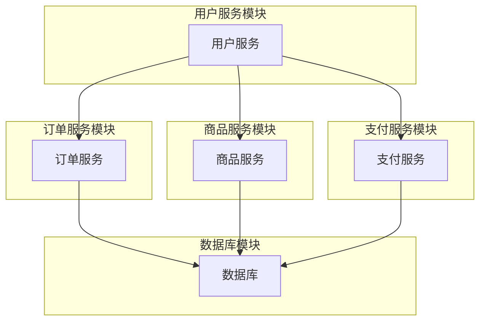
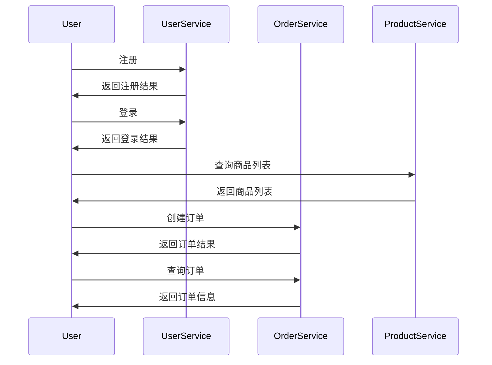

                 

### 摘要

本文将深入探讨系统性能调优这一关键领域，旨在为读者提供一整套完整、系统的性能调优方法论。系统性能调优不仅关乎系统的稳定性和响应速度，更是企业竞争力和用户体验的核心体现。我们将从以下几个方面展开：

1. **系统性能调优的重要性与挑战**：介绍系统性能调优的定义、目标和面临的挑战，为读者搭建基础知识框架。
2. **核心概念与术语**：梳理性能调优中的关键概念和术语，帮助读者理解相关技术原理。
3. **性能调优算法原理讲解**：详细讲解负载均衡算法、缓存策略和数据库优化等核心算法原理，并辅以流程图和代码实例。
4. **性能调优数学模型与公式解析**：介绍性能调优中常用的数学模型和公式，并运用latex进行公式推导与解释。
5. **系统性能调优架构设计**：通过实际项目场景，展示性能调优的系统架构设计方案和最佳实践。
6. **项目实战**：分享实际项目的性能调优过程，解析核心代码和实现，为读者提供实战经验。
7. **最佳实践 tips**：总结性能调优的最佳实践，提供实用技巧和建议，助力读者在实际工作中取得成功。

通过这篇文章，读者将能够系统地掌握系统性能调优的方法和技巧，提升系统的性能和可靠性，为企业带来实际的价值。让我们一起深入探讨，开启性能调优之旅。## 目录大纲设计过程

在开始撰写《技术调优：系统性能调优的方法论》之前，设计一个清晰的目录大纲是至关重要的。这不仅有助于结构化内容，还能为读者提供一个完整的阅读框架，使文章更加易于理解和消化。以下是设计目录大纲的详细过程：

### 1. 书名分析

书名《技术调优：系统性能调优的方法论》直接指出了本书的核心主题——系统性能调优。书名中的“技术调优”表明了内容将涉及一系列技术手段和方法，而“系统性能调优”则强调了优化系统的性能是文章的核心内容。因此，目录设计需要围绕“系统性能调优”这一主题展开，涵盖从基础概念到高级实践的各个方面。

### 2. 核心章节确定

在确定核心章节时，需要根据书名和目标读者群体来选择。对于这样一本专业书籍，核心章节应包括以下内容：

- **背景介绍**：介绍系统性能调优的重要性、现状和发展趋势，帮助读者建立初步认识。
- **核心概念与联系**：详细解释性能调优中常用的概念、术语和原理，如负载均衡、缓存策略、数据库优化等。
- **算法原理讲解**：深入讲解性能调优中的关键算法，包括其原理、实现方法和应用场景。
- **数学模型与公式**：介绍与性能调优相关的数学模型和公式，并探讨其实际应用。
- **系统架构设计**：分析性能调优在实际系统中的应用，提供架构设计和优化方案。
- **项目实战**：通过实际案例，展示性能调优的应用过程和效果。
- **最佳实践 tips**：总结性能调优中的最佳实践，为读者提供实用的技巧和建议。

### 3. 目录结构设计

目录结构的设计要遵循逻辑顺序，首先确定一级目录，然后逐步细化，形成二级和三级目录。以下是设计过程的详细步骤：

1. **一级目录**：确定核心主题，如“系统性能调优概述”、“性能调优算法原理讲解”等。
2. **二级目录**：在一级目录下，进一步细分主题，如“负载均衡算法”、“缓存策略”、“数据库优化”等。
3. **三级目录**：在二级目录下，细化每个主题的内容，如“负载均衡的基本概念”、“常见的缓存策略”、“数据库性能的影响因素”等。

### 4. 目录内容编写

在编写目录内容时，要确保章节标题简洁明了，能够准确传达章节的核心内容。以下是编写步骤：

1. **章节标题**：每个章节的标题应简洁明了，突出核心内容。
2. **子标题**：在必要时，添加子标题，以进一步细分内容，使结构更加清晰。
3. **内容概述**：为每个章节编写简短的内容概述，概括章节的主要内容，帮助读者快速了解章节概要。

### 5. 格式调整

为确保目录大纲符合markdown格式要求，需要对目录结构进行格式调整。以下是markdown格式的要求：

- 使用`#`号表示标题级别，`#`号的数量代表标题的层级。
- 使用`##`、`###`等表示二级和三级标题。
- 使用`-`和`*`表示列表项。
- 使用`>`表示引用文本。

### 结论

通过以上步骤，我们可以设计出一份逻辑清晰、结构紧凑、简单易懂的目录大纲，为撰写《技术调优：系统性能调优的方法论》提供坚实的基础。这份大纲不仅有助于结构化内容，还能为读者提供清晰的阅读框架，使文章更加易于理解和消化。## 第一部分：系统性能调优概述

### 1.1 系统性能调优的重要性与挑战

#### 1.1.1 系统性能调优的定义

系统性能调优，是指通过一系列技术手段和策略，对计算机系统进行优化，以提高其响应速度、稳定性和资源利用率的过程。性能调优不仅仅关乎系统的运行效率，还直接影响用户体验和企业的竞争力。在互联网时代，一个快速、稳定、高效的服务系统对于企业的成败至关重要。

#### 1.1.2 系统性能调优的目标

系统性能调优的主要目标是：

1. **提高响应速度**：确保系统能够在用户请求到来时快速响应，提供良好的用户体验。
2. **提升稳定性**：保证系统在高负载情况下依然能够稳定运行，避免因性能问题导致的系统崩溃或数据丢失。
3. **优化资源利用率**：提高系统资源（如CPU、内存、磁盘等）的利用率，降低能耗，降低运维成本。
4. **增强可扩展性**：设计灵活的系统架构，以应对业务规模的变化和未来的需求增长。

#### 1.1.3 系统性能调优的挑战

尽管系统性能调优的重要性不言而喻，但在实际操作中仍面临诸多挑战：

1. **复杂的技术栈**：现代系统通常涉及多种编程语言、框架和工具，调优过程需要对这些技术栈有深入的理解。
2. **数据量的激增**：随着大数据时代的到来，系统处理的数据量急剧增加，这对系统的性能提出了更高的要求。
3. **资源限制**：硬件资源的限制（如CPU、内存、磁盘等）会对性能调优带来限制，需要在有限资源下实现最优性能。
4. **动态变化的需求**：业务需求不断变化，系统需要具备快速适应和调整的能力，以应对这些变化。
5. **持续监控与优化**：性能调优不是一次性的工作，而是一个持续的过程，需要持续监控系统性能并进行优化。

### 1.2 系统性能调优的现状与发展趋势

#### 1.2.1 现状分析

当前，系统性能调优已经成为企业IT管理的重要环节。随着云计算、大数据、人工智能等技术的发展，系统的复杂性不断增加，性能调优的重要性也日益凸显。企业在性能调优方面采取了多种措施，包括：

1. **自动化监控与优化工具**：企业使用各种监控工具和自动化优化工具来实时监控系统性能，并自动进行性能调优。
2. **持续集成与持续部署（CI/CD）**：通过CI/CD流程，企业可以在开发过程中及时发现性能瓶颈，并进行优化。
3. **云服务和容器化**：利用云服务和容器技术，企业可以更灵活地管理资源，提高系统性能和可扩展性。

#### 1.2.2 发展趋势预测

未来，系统性能调优将呈现以下趋势：

1. **智能化调优**：随着人工智能技术的发展，智能化调优将成为趋势。通过机器学习和数据挖掘技术，系统可以自动识别性能瓶颈，并智能地进行优化。
2. **边缘计算**：随着5G和物联网的普及，边缘计算将成为重要的发展方向。在边缘节点进行性能调优，可以降低延迟，提高响应速度。
3. **混合云架构**：企业将更多采用混合云架构，结合公有云和私有云的优势，实现更高效的资源利用和性能优化。
4. **绿色IT**：随着环保意识的增强，绿色IT将成为重要方向。企业将更加关注系统性能调优对能源消耗的影响，以实现可持续发展。

#### 1.2.3 未来展望

展望未来，系统性能调优将在以下几个方面发挥重要作用：

1. **提升用户体验**：通过不断优化系统性能，企业将能够提供更优质的用户体验，增强用户满意度。
2. **提高企业竞争力**：在竞争激烈的市场中，拥有高性能的系统将成为企业的重要竞争优势。
3. **降低运维成本**：通过智能化调优和自动化监控，企业可以降低运维成本，提高资源利用率。
4. **支持业务创新**：高性能的系统将为企业的创新提供强有力的支持，助力企业实现持续发展。

总之，系统性能调优是一个不断发展的领域，随着技术的进步和业务需求的变化，其重要性和应用场景将不断扩展。通过本文的介绍，读者可以初步了解系统性能调优的重要性、目标和现状，为后续章节的深入学习打下基础。### 1.3 系统性能调优的核心概念与术语

在系统性能调优的过程中，理解一系列核心概念和术语是至关重要的。这些概念和术语不仅帮助我们准确描述性能调优的相关内容，还为实际操作提供了理论支持。以下是系统性能调优中的一些关键概念和术语，以及它们的解释和应用场景：

#### 1.3.1 核心概念

1. **响应时间（Response Time）**：
   - 定义：响应时间是指系统从接收到用户请求到返回结果所需的时间。
   - 应用场景：优化响应时间可以显著提升用户体验，特别是在交互频繁的应用程序（如在线购物平台、社交媒体）中。

2. **吞吐量（Throughput）**：
   - 定义：吞吐量是指系统在单位时间内处理请求的数量。
   - 应用场景：对于需要处理大量并发请求的系统（如电商交易系统），吞吐量的提升是性能调优的重要目标。

3. **并发量（Concurrency）**：
   - 定义：并发量是指系统能够同时处理多个请求的数量。
   - 应用场景：在高并发场景下，提升系统的并发量可以有效减少等待时间，提高资源利用率。

4. **系统利用率（System Utilization）**：
   - 定义：系统利用率是指系统资源（如CPU、内存、磁盘等）被使用的比率。
   - 应用场景：通过监控和优化系统利用率，可以确保系统资源得到有效利用，避免资源浪费。

5. **延迟（Latency）**：
   - 定义：延迟是指从发送请求到收到响应的时间延迟。
   - 应用场景：延迟的降低对于实时应用（如在线游戏、金融交易系统）至关重要。

6. **吞吐量密度（Throughput Density）**：
   - 定义：吞吐量密度是指单位资源下的吞吐量。
   - 应用场景：评估系统在不同资源配置下的性能表现，帮助进行资源优化。

7. **资源利用率平衡（Resource Utilization Balance）**：
   - 定义：资源利用率平衡是指系统各资源之间的利用率分布合理，没有出现过度使用或闲置情况。
   - 应用场景：通过均衡各资源的利用率，可以提高系统的整体性能和稳定性。

#### 1.3.2 术语解释

1. **负载均衡（Load Balancing）**：
   - 定义：负载均衡是指通过分配请求到多个服务器或节点，确保系统资源得到合理利用，避免单点过载。
   - 应用场景：在高并发和高可用的系统中，负载均衡是必不可少的。

2. **缓存（Caching）**：
   - 定义：缓存是指将频繁访问的数据存储在内存或其他快速访问的存储介质中，以减少对后端系统的访问。
   - 应用场景：缓存可以显著提高系统的响应速度，适用于数据读多写少的应用场景。

3. **数据库优化（Database Optimization）**：
   - 定义：数据库优化是指通过索引、查询优化、存储引擎选择等方法，提高数据库的查询性能和读写效率。
   - 应用场景：在数据密集型应用中，如电商系统、金融系统，数据库优化是关键性能瓶颈的解决方案。

4. **网络优化（Network Optimization）**：
   - 定义：网络优化是指通过调整网络配置、优化网络路径选择，提高数据传输效率和稳定性。
   - 应用场景：在网络密集型应用中，如视频流媒体、在线游戏，网络优化可以显著提升用户体验。

5. **内存管理（Memory Management）**：
   - 定义：内存管理是指通过分配、回收、优化内存使用，确保系统高效运行。
   - 应用场景：在资源受限的环境中，如嵌入式系统、移动应用，内存管理对性能至关重要。

#### 1.3.3 关联概念介绍

1. **性能瓶颈（Performance Bottleneck）**：
   - 定义：性能瓶颈是指系统中限制性能的瓶颈点，通常表现为资源使用率过高或响应时间过长。
   - 应用场景：识别性能瓶颈是性能调优的第一步，通过优化瓶颈点可以显著提升系统性能。

2. **系统容量规划（System Capacity Planning）**：
   - 定义：系统容量规划是指根据业务需求，预测系统所需的资源量，并进行资源配置和规划。
   - 应用场景：在系统设计和部署阶段，系统容量规划可以确保系统在高负载下仍然能稳定运行。

3. **性能监控（Performance Monitoring）**：
   - 定义：性能监控是指通过工具和手段，实时监控系统的性能指标，及时发现性能问题和瓶颈。
   - 应用场景：性能监控是性能调优的基础，通过监控可以快速响应和解决问题。

4. **自动化运维（Automated Operations）**：
   - 定义：自动化运维是指通过自动化工具和脚本，实现系统运维任务的自动化，提高运维效率和稳定性。
   - 应用场景：自动化运维可以显著降低运维成本，提高系统的可维护性和可靠性。

通过理解这些核心概念和术语，读者可以更深入地理解系统性能调优的原理和实践，为后续章节的学习打下坚实的基础。接下来，我们将深入探讨性能调优中的具体算法原理，帮助读者掌握更高级的性能优化技术。### 2.1 负载均衡算法

负载均衡算法是系统性能调优中至关重要的一部分，其核心目标是通过合理分配请求到多个服务器或节点，确保系统资源得到充分利用，避免单点过载，从而提高系统的性能和可靠性。在本节中，我们将详细讲解几种常见的负载均衡算法，并比较它们的特点和适用场景。

#### 2.1.1 负载均衡的基本概念

负载均衡（Load Balancing）的基本概念包括以下几个核心组成部分：

1. **客户端**：发送请求的客户端，可以是用户终端或另一个服务器。
2. **负载均衡器**：位于客户端和服务器之间的组件，负责接收客户端请求并将其分配到合适的服务器上。
3. **服务器池**：一组承担请求处理任务的服务器，负载均衡器将请求分配到这些服务器上。
4. **健康检查**：负载均衡器会定期对服务器进行健康检查，以确保只有健康的服务器参与负载均衡。

负载均衡的主要目标包括：

- **最大化吞吐量**：确保系统能够处理尽可能多的请求，提高系统性能。
- **最小化响应时间**：降低用户请求的响应时间，提升用户体验。
- **提高系统可用性**：通过将请求分配到多个服务器，确保系统在服务器故障时仍能正常运行。

#### 2.1.2 常见负载均衡算法

在负载均衡过程中，有多种算法可以用来决定请求的分配方式。以下是几种常见的负载均衡算法：

1. **轮询负载均衡（Round Robin）**
   - **原理**：轮询负载均衡是最简单的负载均衡算法，它将请求按照顺序轮流分配给服务器池中的每个服务器。
   - **特点**：公平性好，无状态，易于实现。
   - **适用场景**：适用于请求负载相对均匀的场景，不适合应对突发高并发的请求。

2. **最少连接负载均衡（Least Connections）**
   - **原理**：最少连接负载均衡算法将请求分配到当前连接数最少的服务器上，以平衡服务器的负载。
   - **特点**：能有效均衡服务器的连接数，降低响应时间。
   - **适用场景**：适用于连接数可变的场景，如Web服务器和应用程序服务器。

3. **最少带宽负载均衡（Least Bandwidth）**
   - **原理**：最少带宽负载均衡算法将请求分配到当前带宽使用率最低的服务器上。
   - **特点**：优化带宽利用率，减少带宽竞争。
   - **适用场景**：适用于带宽资源有限的场景，如视频流媒体服务。

4. **加权轮询负载均衡（Weighted Round Robin）**
   - **原理**：加权轮询负载均衡在轮询的基础上，为每个服务器分配不同的权重，根据权重分配请求。
   - **特点**：可以根据服务器的处理能力分配不同的负载，更灵活。
   - **适用场景**：适用于服务器性能差异较大的场景，如不同的服务器承担不同的工作负载。

5. **最小负载负载均衡（Minimum Load）**
   - **原理**：最小负载负载均衡算法将请求分配到当前负载最低的服务器上，根据服务器的当前负载进行负载均衡。
   - **特点**：能够更精准地平衡负载，减少资源浪费。
   - **适用场景**：适用于负载变化较大的场景，如电子商务平台。

6. **哈希负载均衡（Hash Load Balancing）**
   - **原理**：哈希负载均衡通过哈希函数将请求映射到服务器上，确保相同的请求总是映射到相同的服务器。
   - **特点**：具有良好的可扩展性和性能，能够处理大量并发请求。
   - **适用场景**：适用于需要会话保持和请求持久性的场景，如需要用户数据持久化的应用。

#### 2.1.3 负载均衡算法的比较与选择

每种负载均衡算法都有其独特的特点和适用场景，选择合适的算法需要根据实际需求进行权衡。以下是比较和选择负载均衡算法的一些关键因素：

- **负载特性**：不同的负载特性（如请求的稳定性、连接数、带宽需求等）会影响算法的选择。
- **系统资源**：系统资源（如CPU、内存、带宽等）的限制会影响算法的适用性。
- **扩展性**：需要考虑系统的可扩展性，选择能够适应未来需求的算法。
- **稳定性**：考虑算法在长时间运行下的稳定性和可靠性。
- **实现复杂度**：实现复杂度是选择算法时需要考虑的重要因素，简单的算法更容易维护和部署。

在实际应用中，可以根据具体场景和需求，选择合适的负载均衡算法。例如，对于稳定性要求较高的场景，可以选择最小负载负载均衡或哈希负载均衡；而对于资源受限的场景，可以选择最少带宽负载均衡。通过合理选择和配置负载均衡算法，可以显著提高系统的性能和可靠性，为用户提供更优质的服务体验。

接下来，我们将进一步探讨缓存策略，了解如何通过缓存优化系统性能，为读者提供更全面的性能调优方法。### 2.2 缓存策略

缓存（Caching）是系统性能调优中的关键手段之一，它通过将频繁访问的数据存储在快速访问的存储介质中，以减少对后端系统的访问次数，从而显著提高系统的响应速度和性能。在本节中，我们将详细讨论缓存策略的基本原理、常见类型以及优化方法。

#### 2.2.1 缓存的基本原理

缓存的基本原理是通过存储频繁访问的数据，避免重复的计算和访问，从而减少系统的响应时间和资源消耗。缓存系统通常由以下几个核心组成部分：

1. **缓存存储介质**：缓存存储介质可以是内存、SSD、硬盘等，其中内存的读写速度最快，但容量有限，而硬盘容量大但速度慢。
2. **缓存算法**：缓存算法负责决定哪些数据应该被缓存，以及如何替换缓存中的数据。常见的缓存算法包括最近最少使用（LRU）、最少使用（LFU）等。
3. **缓存管理器**：缓存管理器负责缓存数据的读写操作，包括缓存数据的加载、存储、更新和删除等。

#### 2.2.2 常见的缓存策略

缓存策略可以分为两类：基于数据的缓存和基于服务的缓存。

1. **基于数据的缓存**
   - **浏览器缓存**：浏览器缓存是指浏览器将下载的静态资源（如CSS、JavaScript、图片等）存储在本地，以减少重复请求。浏览器缓存通过HTTP缓存头（如Cache-Control、Expires等）来控制缓存策略。
   - **数据库缓存**：数据库缓存是指将数据库查询结果存储在内存中，以减少数据库的查询次数。常见的数据库缓存技术包括查询缓存、会话缓存等。
   - **应用层缓存**：应用层缓存是指应用程序自己实现的缓存机制，如Redis、Memcached等，它们可以存储各种类型的数据，并提供高效的读写操作。

2. **基于服务的缓存**
   - **反向代理缓存**：反向代理缓存是指反向代理服务器（如Nginx、Varnish等）将请求的响应数据存储在缓存中，以减少直接访问后端服务器的次数。
   - **内容分发网络（CDN）**：CDN通过分布在全球的缓存节点，缓存网站的静态资源，以减少用户访问网站的延迟。
   - **微服务缓存**：在微服务架构中，各个微服务可以通过缓存机制减少跨服务的请求次数，提高系统整体的性能。

#### 2.2.3 缓存的优化方法

为了充分发挥缓存的作用，优化缓存策略是至关重要的。以下是一些常见的缓存优化方法：

1. **数据缓存优化**
   - **热数据优先**：优先缓存热点数据，减少对冷数据的缓存。
   - **数据分区**：根据访问频率和访问模式，对缓存数据进行分区，以提高缓存命中率。
   - **缓存预热**：在缓存系统初始化时，将预取的热数据加载到缓存中，以减少首次请求的响应时间。

2. **缓存一致性**
   - **缓存同步**：确保缓存和后端数据的一致性，可以通过同步机制（如双写缓存、事件驱动同步等）来实现。
   - **缓存失效策略**：设置合理的缓存失效时间，避免缓存数据长期过期，影响系统性能。

3. **缓存算法优化**
   - **LRU替换策略**：使用最近最少使用（LRU）算法，替换缓存中最少使用的数据，以提高缓存命中率。
   - **LFU替换策略**：使用最少使用频率（LFU）算法，替换缓存中使用频率最低的数据。

4. **缓存规模优化**
   - **分级缓存**：根据数据的重要性和访问频率，采用分级缓存策略，将热点数据存储在内存中，次热点数据存储在硬盘上。
   - **缓存缓存**：在多个层级使用缓存，如应用层缓存、数据库缓存、反向代理缓存等，以提高缓存效果。

通过合理应用和优化缓存策略，可以显著提高系统的性能和响应速度，为用户提供更流畅的体验。接下来，我们将探讨数据库优化，进一步深入了解系统性能调优的方法。### 2.3 数据库优化

数据库优化是系统性能调优的重要环节，尤其是在数据密集型应用中。数据库的性能直接影响到系统的响应速度、可扩展性和稳定性。在本节中，我们将详细讨论数据库优化的核心原则、常见方法以及具体的优化策略。

#### 2.3.1 数据库性能的影响因素

数据库性能受到多种因素的影响，主要包括以下几个方面：

1. **硬件性能**：数据库运行所依赖的硬件（如CPU、内存、磁盘等）的性能直接影响到数据库的性能。硬件性能的提升可以显著提高数据库的处理能力。
   
2. **数据库配置**：数据库的配置参数（如缓冲区大小、连接池大小、线程数等）会影响到数据库的性能。合理的配置可以提高数据库的运行效率。

3. **数据模型设计**：数据模型的设计（如表的划分、索引的设计、关系的定义等）对数据库的性能有重要影响。良好的数据模型设计可以减少查询的复杂度和数据的冗余。

4. **查询优化**：查询语句的编写和优化对数据库性能有直接影响。高效的查询语句可以减少数据库的CPU使用和I/O操作。

5. **索引策略**：索引是数据库优化的重要手段，合理使用索引可以显著提高查询的效率。

6. **事务处理**：事务的处理方式（如隔离级别、锁机制等）也会影响数据库的性能。合适的事务处理策略可以减少锁争用和死锁的风险。

#### 2.3.2 常见数据库优化方法

以下是几种常见的数据库优化方法：

1. **索引优化**：
   - **创建合适的索引**：根据查询需求创建索引，特别是针对频繁查询的列。
   - **避免创建冗余索引**：避免为不常用的查询创建索引，以免增加维护成本。
   - **优化索引结构**：对于B树索引，优化树结构，减少层级深度，以提高查询效率。

2. **查询优化**：
   - **重写查询语句**：通过分析查询执行计划，优化查询语句的结构，如使用联合查询（JOIN）替代子查询（SUBQUERY）。
   - **使用缓存**：通过查询缓存机制，减少重复查询的执行次数。
   - **优化查询参数**：合理设置查询参数，如LIMIT、OFFSET等，以减少查询的数据量。

3. **数据分区**：
   - **水平分区**：根据数据的访问模式和业务需求，将数据表水平分区，以减少单个表的规模，提高查询效率。
   - **垂直分区**：根据数据的属性和访问模式，将数据表垂直分区，将常用的列放在内存中，减少I/O操作。

4. **缓存策略**：
   - **应用层缓存**：在应用程序层面实现缓存策略，如使用Redis、Memcached等，减少数据库的查询次数。
   - **查询缓存**：数据库内部实现查询缓存，保存查询结果，减少重复查询。

5. **数据压缩**：
   - **列存储压缩**：对于大量重复数据，采用列存储并进行压缩，减少磁盘空间的占用。
   - **全量数据压缩**：对整个数据库进行压缩，减少磁盘I/O操作，提高数据读取速度。

6. **并发控制**：
   - **优化锁机制**：根据业务需求，选择合适的锁机制，如乐观锁、悲观锁等，减少锁争用和死锁的风险。
   - **事务隔离级别**：根据业务需求，设置合适的事务隔离级别，平衡一致性、隔离性和性能。

#### 2.3.3 数据库优化实例分析

以下是一个具体的数据库优化实例，我们将通过一系列步骤对数据库进行优化，以提高其性能：

1. **性能分析**：
   - 使用数据库的性能分析工具，如Explain Plan，分析查询语句的执行计划，找出性能瓶颈。
   - 检查表和索引的统计信息，确保它们是最新的。

2. **索引优化**：
   - 根据查询需求，创建合适的索引，如使用复合索引优化多条件查询。
   - 删除冗余索引，避免不必要的I/O操作。

3. **查询优化**：
   - 重写查询语句，如将子查询转换为联合查询。
   - 使用表连接替代子查询，减少查询的复杂度。

4. **数据分区**：
   - 将数据表进行水平分区，根据访问模式将数据分布到不同的分区中。
   - 对常用的分区进行优化，减少查询的时间。

5. **缓存策略**：
   - 在应用程序中使用缓存策略，如使用Redis缓存频繁查询的数据。
   - 在数据库内部启用查询缓存功能。

6. **并发控制**：
   - 根据业务需求，调整事务隔离级别，减少锁争用。
   - 优化锁机制，使用乐观锁减少悲观锁的使用。

通过以上步骤，我们可以在不改变业务逻辑的前提下，显著提高数据库的性能和稳定性。接下来，我们将探讨网络优化，进一步深入了解系统性能调优的方法。### 2.4 网络优化

网络优化是提升系统性能的重要组成部分，尤其在涉及大量数据传输和远程调用的系统中。网络性能的瓶颈可能导致系统响应时间延长、吞吐量下降，甚至影响到整个系统的稳定性。在本节中，我们将讨论网络性能优化的关键因素、常用方法以及具体策略。

#### 2.4.1 网络性能的影响因素

网络性能受多种因素影响，主要包括以下几方面：

1. **带宽**：带宽是指网络连接的传输速率，高带宽可以显著提高数据传输速度。

2. **延迟**：延迟是指数据包在网络中传输所需的时间，延迟越小，系统响应速度越快。

3. **丢包率**：丢包率是指数据包在网络中传输时丢失的比例，高丢包率会导致数据重传，增加网络负载。

4. **网络拓扑**：网络拓扑结构对网络性能有重要影响，合理的网络布局可以减少数据传输路径，降低延迟。

5. **网络拥塞**：网络拥塞是指网络中数据流量超出其承载能力，导致数据传输速度下降。

6. **协议和编码**：网络协议和编码方式会影响数据传输效率和可靠性。

7. **中间设备性能**：路由器、交换机等中间设备性能也对网络性能有直接影响。

#### 2.4.2 常见网络优化方法

为了提升网络性能，可以采取以下几种常见优化方法：

1. **带宽优化**：
   - **带宽管理**：合理配置网络带宽，避免带宽被过度占用。
   - **带宽升级**：在必要时升级网络带宽，以支持更多数据传输。

2. **延迟优化**：
   - **选择最佳路径**：使用路由协议优化数据传输路径，选择延迟最小的路径。
   - **CDN部署**：通过内容分发网络（CDN）部署，减少用户与服务器之间的传输距离。

3. **丢包率优化**：
   - **冗余路径**：建立多条网络路径，避免单点故障。
   - **数据重传策略**：优化TCP重传机制，减少数据丢失后重传的数据量。

4. **网络拓扑优化**：
   - **网络分段**：将大型网络分段，减少单点故障的风险。
   - **设备冗余**：增加网络设备的冗余，提高网络的可靠性和性能。

5. **协议和编码优化**：
   - **协议选择**：选择适合应用场景的网络协议，如HTTP/2可以减少延迟和带宽消耗。
   - **编码优化**：优化数据编码方式，减少数据体积，提高传输效率。

6. **中间设备性能优化**：
   - **硬件升级**：升级路由器、交换机等设备，提高处理能力。
   - **软件优化**：优化网络设备的操作系统和协议栈，减少性能瓶颈。

#### 2.4.3 网络性能调优案例分析

以下是一个具体的网络性能调优案例分析，我们将通过一系列步骤对网络进行优化，以提高其性能：

1. **性能分析**：
   - 使用网络性能分析工具（如Wireshark、Nagios等）监测网络流量和延迟。
   - 分析网络拓扑，找出可能的瓶颈点。

2. **带宽优化**：
   - 升级网络带宽，确保其满足业务需求。
   - 实施带宽管理策略，限制非关键业务的带宽占用。

3. **延迟优化**：
   - 通过CDN部署，优化用户访问延迟。
   - 优化网络路径选择，使用BGP等协议减少数据传输延迟。

4. **丢包率优化**：
   - 实施冗余网络路径，避免单点故障。
   - 优化TCP重传机制，减少丢包后的重传数据量。

5. **网络拓扑优化**：
   - 将大型网络分段，提高网络可靠性。
   - 在关键位置部署冗余设备，确保网络稳定性。

6. **协议和编码优化**：
   - 更换为高效的协议，如HTTP/2。
   - 优化数据编码方式，减少数据体积。

7. **中间设备性能优化**：
   - 升级关键网络设备，提高处理能力。
   - 定期优化操作系统和协议栈，减少性能瓶颈。

通过以上步骤，我们可以在不改变业务逻辑的前提下，显著提高网络性能和稳定性。网络优化是一个持续的过程，需要定期监测和调整，以确保系统的高效运行。接下来，我们将深入探讨性能调优中的数学模型与公式解析，进一步夯实性能调优的理论基础。### 3.1 性能调优中的数学模型

在系统性能调优中，数学模型和公式是理解和分析系统性能的关键工具。这些模型和公式帮助我们量化性能指标，预测系统行为，并指导实际优化工作。在本节中，我们将介绍性能调优中常用的数学模型和公式，并探讨其在性能优化中的应用。

#### 3.1.1 常见数学模型介绍

1. **响应时间模型**：
   - **定义**：响应时间模型用于预测系统从接收到请求到返回响应所需的时间。
   - **公式**：\( T_r = T_p + T_s + T_l \)
     - \( T_r \)：响应时间
     - \( T_p \)：处理时间
     - \( T_s \)：服务时间
     - \( T_l \)：延迟时间
   - **应用场景**：适用于优化系统响应时间，减少用户等待时间。

2. **吞吐量模型**：
   - **定义**：吞吐量模型用于预测系统在单位时间内可以处理的最大请求数量。
   - **公式**：\( T_t = \frac{1}{T_r} \)
     - \( T_t \)：吞吐量
     - \( T_r \)：响应时间
   - **应用场景**：适用于评估系统性能，优化资源利用率。

3. **延迟模型**：
   - **定义**：延迟模型用于预测系统从接收到请求到开始处理请求所需的时间。
   - **公式**：\( T_d = T_p + T_l \)
     - \( T_d \)：延迟时间
     - \( T_p \)：处理时间
     - \( T_l \)：延迟时间
   - **应用场景**：适用于优化系统延迟，提高用户体验。

4. **负载模型**：
   - **定义**：负载模型用于量化系统在特定时间段内的负载强度。
   - **公式**：\( Load = \frac{Request\ Count}{Time\ Window} \)
     - \( Load \)：负载
     - \( Request\ Count \)：请求数量
     - \( Time\ Window \)：时间窗口
   - **应用场景**：适用于评估系统性能，预测负载高峰。

#### 3.1.2 数学模型的构建与应用

构建数学模型的关键在于准确地描述系统的行为和性能指标，以下是构建和应用数学模型的步骤：

1. **数据收集**：收集系统的性能数据，包括响应时间、吞吐量、延迟等。

2. **模型假设**：根据系统的实际情况，设定合理的假设条件，如处理时间服从正态分布、延迟可以忽略不计等。

3. **公式推导**：根据假设条件和收集的数据，推导出性能指标的计算公式。

4. **模型验证**：通过实际数据验证模型的准确性和可靠性，必要时进行调整和优化。

5. **模型应用**：将模型应用到实际系统中，指导性能优化工作。

#### 3.1.3 数学模型的选择与优化

在选择和优化数学模型时，需要考虑以下因素：

1. **模型复杂度**：简单的模型易于理解和实现，但可能不够精确；复杂的模型更精确，但实现和维护成本较高。

2. **数据质量**：模型依赖于准确的数据，数据质量直接影响模型的准确性。

3. **应用场景**：不同的模型适用于不同的应用场景，需要根据具体需求选择合适的模型。

4. **可扩展性**：模型应具备一定的可扩展性，能够适应未来业务规模的变化。

5. **优化策略**：模型构建后，可以通过优化策略（如参数调优、算法改进等）提高模型的性能。

通过合理选择和优化数学模型，可以更准确地预测系统性能，为性能调优提供科学依据。接下来，我们将探讨性能调优中的数学公式，深入解析其在实际应用中的使用方法。### 3.2 性能调优中的数学公式

在系统性能调优的过程中，数学公式和算法起着至关重要的作用，它们帮助我们量化性能指标、预测系统行为，并指导实际优化工作。本节将详细讲解性能调优中常用的数学公式，并通过示例进行分析，以帮助读者深入理解这些公式在实际应用中的使用方法。

#### 3.2.1 常见数学公式的应用

1. **响应时间公式**：

   \( T_r = T_p + T_s + T_l \)

   - **解释**：该公式表示系统的总响应时间，由处理时间 \( T_p \)、服务时间 \( T_s \) 和延迟时间 \( T_l \) 组成。
   - **示例**：假设某系统响应时间中，处理时间为2秒，服务时间为1秒，延迟时间为0.5秒，则总响应时间为 \( 2 + 1 + 0.5 = 3.5 \) 秒。

2. **吞吐量公式**：

   \( T_t = \frac{1}{T_r} \)

   - **解释**：该公式表示系统的吞吐量，即每单位时间内可以处理的请求数量。吞吐量与响应时间成反比。
   - **示例**：若系统的平均响应时间为4秒，则其吞吐量为 \( \frac{1}{4} = 0.25 \) 个请求/秒。

3. **延迟公式**：

   \( T_d = T_p + T_l \)

   - **解释**：该公式表示系统的延迟时间，由处理时间 \( T_p \) 和延迟时间 \( T_l \) 组成。
   - **示例**：若系统的处理时间为1秒，延迟时间为1.5秒，则总延迟时间为 \( 1 + 1.5 = 2.5 \) 秒。

4. **负载公式**：

   \( Load = \frac{Request\ Count}{Time\ Window} \)

   - **解释**：该公式表示系统在某段时间内的平均负载，即请求数量除以时间窗口。
   - **示例**：若某系统在1小时内处理了1000个请求，则其平均负载为 \( \frac{1000}{3600} \approx 0.278 \) 个请求/秒。

5. **系统利用率公式**：

   \( Utilization = \frac{T_p}{T_r} \)

   - **解释**：该公式表示系统的利用率，即处理时间占总响应时间的比例。
   - **示例**：若某系统的处理时间为5秒，总响应时间为8秒，则其利用率为 \( \frac{5}{8} = 0.625 \) 或 62.5%。

#### 3.2.2 数学公式推导与解析

为了更好地理解这些数学公式，我们可以进一步进行推导和解析。

1. **响应时间公式**推导：

   - **推导**：响应时间 \( T_r \) 是系统从接收请求到返回响应的总时间，由三部分组成：处理时间 \( T_p \)，服务时间 \( T_s \) 和延迟时间 \( T_l \)。
   - **解析**：处理时间 \( T_p \) 是系统处理请求所需的时间，服务时间 \( T_s \) 是服务器响应客户端请求所需的时间，延迟时间 \( T_l \) 是由于网络传输、系统调度等因素引起的额外时间。

2. **吞吐量公式**推导：

   - **推导**：吞吐量 \( T_t \) 是单位时间内系统可以处理的请求数量。由于响应时间 \( T_r \) 是系统完成一个请求所需的时间，因此，吞吐量等于单位时间内的时间倒数，即 \( T_t = \frac{1}{T_r} \)。
   - **解析**：该公式表明，系统的吞吐量与响应时间成反比。降低响应时间可以显著提高吞吐量。

3. **延迟公式**推导：

   - **推导**：延迟时间 \( T_d \) 是从请求发送到开始处理的时间，等于处理时间 \( T_p \) 加上延迟时间 \( T_l \)。
   - **解析**：该公式表明，系统的延迟时间取决于处理时间和延迟时间。通过优化这两部分，可以减少延迟。

4. **负载公式**推导：

   - **推导**：负载 \( Load \) 是单位时间内的请求数量，即总请求数量 \( Request\ Count \) 除以时间窗口 \( Time\ Window \)。
   - **解析**：该公式提供了系统在某段时间内的负载水平，有助于评估系统的繁忙程度。

5. **系统利用率公式**推导：

   - **推导**：系统利用率 \( Utilization \) 是系统处理时间占总响应时间的比例，即 \( Utilization = \frac{T_p}{T_r} \)。
   - **解析**：该公式反映了系统的繁忙程度，利用率越高，系统性能越好。

#### 3.2.3 数学公式的实际案例解析

为了更直观地理解这些数学公式，我们可以通过实际案例来解析它们的应用。

1. **案例背景**：

   某电子商务平台在高峰时段（如促销活动期间）的响应时间明显增加，影响了用户体验。平台希望通过数学公式分析问题，找到性能瓶颈。

2. **案例数据**：

   - 响应时间 \( T_r \) = 6秒
   - 处理时间 \( T_p \) = 3秒
   - 服务时间 \( T_s \) = 1秒
   - 延迟时间 \( T_l \) = 2秒

3. **分析步骤**：

   - **计算响应时间**：\( T_r = T_p + T_s + T_l = 3 + 1 + 2 = 6 \) 秒。
   - **计算吞吐量**：\( T_t = \frac{1}{T_r} = \frac{1}{6} \approx 0.167 \) 个请求/秒。
   - **计算延迟**：\( T_d = T_p + T_l = 3 + 2 = 5 \) 秒。
   - **计算负载**：假设高峰时段持续1小时，则请求数量 \( Request\ Count \) = 3600秒 × 0.167 = 600个请求，负载 \( Load \) = \( \frac{Request\ Count}{Time\ Window} = \frac{600}{3600} = 0.167 \) 个请求/秒。
   - **计算系统利用率**：\( Utilization = \frac{T_p}{T_r} = \frac{3}{6} = 0.5 \) 或 50%。

4. **结果解析**：

   - 响应时间为6秒，高于正常水平，需要优化。
   - 吞吐量为0.167个请求/秒，较低，需提高。
   - 延迟时间为5秒，较高，需减少。
   - 负载为0.167个请求/秒，说明系统在高负载下表现不佳。
   - 系统利用率为50%，表明系统资源未充分利用。

通过上述案例，我们可以看到数学公式在分析系统性能中的重要作用。通过这些公式，可以量化性能指标，识别瓶颈，并指导优化工作。接下来，我们将探讨性能调优中的系统架构设计，进一步了解如何通过系统架构优化提升系统性能。### 3.3 性能调优中的系统架构设计

系统架构设计在性能调优中起着至关重要的作用。一个合理和优化的系统架构不仅能提升系统的性能和稳定性，还能提高其可扩展性和维护性。在本节中，我们将详细讨论系统架构设计的核心原则、设计方法和优化策略。

#### 3.3.1 系统架构设计原则

在进行系统架构设计时，需要遵循以下原则：

1. **模块化**：将系统划分为多个功能模块，每个模块独立开发、测试和部署，以提高系统的可维护性和扩展性。
2. **分布式**：利用分布式架构，将系统功能分散到多个节点上，以实现负载均衡和高可用性。
3. **微服务**：采用微服务架构，将系统功能拆分为多个小型服务，每个服务独立运行和管理，以提高系统的灵活性和可扩展性。
4. **解耦**：通过解耦各个模块和服务，减少它们之间的依赖关系，降低系统复杂度，提高系统的可靠性和可维护性。
5. **高性能**：设计高性能的系统架构，包括选择合适的硬件、优化数据库设计、采用高效的缓存策略等。
6. **可扩展性**：设计具有良好可扩展性的系统架构，以应对业务规模的变化和未来的需求增长。
7. **安全性**：确保系统架构具备良好的安全性，包括数据加密、身份验证、授权等安全机制。

#### 3.3.2 系统架构设计方法

系统架构设计是一个复杂的过程，需要综合考虑业务需求、技术约束和性能目标。以下是系统架构设计的基本方法：

1. **需求分析**：首先，明确系统的业务需求和性能目标，包括响应时间、吞吐量、并发量等关键性能指标。
2. **技术选型**：根据需求分析结果，选择合适的技术栈，包括开发语言、框架、中间件等。
3. **模块划分**：将系统功能划分为多个模块，每个模块负责特定的业务功能，如用户管理、订单处理、支付处理等。
4. **服务拆分**：将模块进一步拆分为多个服务，每个服务独立运行和管理，以提高系统的灵活性和可扩展性。
5. **负载均衡**：设计负载均衡策略，将请求分配到多个服务实例上，以实现高并发处理和资源利用最大化。
6. **数据存储**：选择合适的数据存储方案，包括关系型数据库、NoSQL数据库、缓存等，以满足不同数据类型的存储和访问需求。
7. **网络拓扑**：设计合理的网络拓扑结构，包括内网、外网、数据库网络等，确保数据传输的高效性和安全性。
8. **安全性设计**：设计系统安全策略，包括数据加密、身份认证、授权等，确保系统的数据安全和用户隐私保护。
9. **监控与告警**：设计监控系统，实时监控系统的性能指标和运行状态，及时发现和响应性能瓶颈和故障。

#### 3.3.3 系统架构优化策略

在系统架构设计完成后，需要进行不断的优化和调整，以适应不断变化的需求和性能挑战。以下是一些常见的系统架构优化策略：

1. **水平扩展**：通过增加服务器节点，提高系统的并发处理能力和吞吐量。
2. **垂直扩展**：通过升级硬件设备，如增加CPU、内存、磁盘等，提高单个节点的处理能力。
3. **缓存策略**：采用高效的缓存策略，减少对后端系统的访问压力，提高系统响应速度。
4. **数据库优化**：通过索引优化、查询优化、数据库分区等方法，提高数据库的查询性能和读写效率。
5. **网络优化**：优化网络拓扑结构，减少数据传输延迟，提高数据传输效率。
6. **服务拆分与聚合**：根据业务需求，将部分服务拆分或聚合，以提高系统的灵活性和性能。
7. **分布式缓存**：采用分布式缓存方案，如Redis、Memcached等，提高系统的缓存性能和可用性。
8. **动态调度**：采用动态调度策略，如负载均衡、自动扩缩容等，根据实际负载动态调整系统资源分配。
9. **弹性伸缩**：设计弹性伸缩机制，根据业务负载动态调整系统规模，以应对突发流量和高峰期。

通过以上系统架构优化策略，可以显著提升系统的性能和稳定性，为用户提供更优质的服务体验。接下来，我们将探讨系统性能调优的最佳实践，总结一些实用的技巧和建议。### 4.1 问题场景介绍

在探讨系统性能调优之前，首先需要明确一些典型的应用场景和性能瓶颈。以下列举了三个常见的系统性能调优问题场景，以及它们的特点和挑战：

#### 4.1.1 场景一：电商平台性能优化

**问题描述**：电商平台在促销活动期间，如双十一、黑色星期五等，会面临巨大的流量压力。用户访问量急剧增加，导致系统响应时间延长，甚至出现系统崩溃的情况。

**性能瓶颈**：高并发访问、数据库读写瓶颈、缓存策略不足、网络延迟。

**解决思路**：通过水平扩展（增加服务器节点）、数据库优化（索引、分区、读写分离）、缓存策略优化（全量缓存、动态缓存）、网络优化（CDN部署、多路径传输）等手段，提升系统的响应速度和稳定性。

#### 4.1.2 场景二：大数据处理平台性能调优

**问题描述**：大数据处理平台在处理海量数据时，经常遇到数据传输速度慢、计算效率低的问题。尤其是在进行实时数据分析和处理时，性能瓶颈更加明显。

**性能瓶颈**：数据传输瓶颈、计算资源不足、存储容量限制、任务调度不均衡。

**解决思路**：通过数据分区（提高数据传输速度）、分布式计算（Hadoop、Spark等分布式框架）、存储优化（分布式文件系统、数据压缩）、任务调度优化（动态调度、负载均衡）等手段，提高系统的处理能力和效率。

#### 4.1.3 场景三：实时数据分析系统性能优化

**问题描述**：实时数据分析系统需要在短时间内处理大量的数据，并生成实时报表和可视化分析。系统性能不足会导致数据处理延迟，影响决策的实时性。

**性能瓶颈**：数据处理延迟、计算资源不足、数据存储和读取速度慢、网络延迟。

**解决思路**：通过分布式计算（Apache Flink、Apache Storm等实时处理框架）、数据库优化（实时数据库、内存存储）、缓存策略（全量缓存、动态缓存）、网络优化（低延迟网络、多路径传输）等手段，提高系统的数据处理能力和响应速度。

#### 总结

以上三个场景展示了不同类型的应用在性能调优中面临的挑战和解决方案。通过分析这些场景，我们可以发现，性能调优的核心目标是提高系统的响应速度、稳定性和资源利用率。在实际操作中，需要根据具体的业务需求和系统特点，选择合适的技术手段和优化策略。接下来，我们将深入探讨系统功能设计，为读者提供详细的设计思路和方法。### 4.2 系统功能设计

在系统性能调优过程中，系统功能设计是关键的一环。一个合理和高效的功能设计不仅能提高系统的性能，还能为后续的优化工作提供坚实的基础。在本节中，我们将详细介绍系统功能设计的方法和步骤，包括领域模型设计、功能模块划分和功能实现与优化。

#### 4.2.1 领域模型设计

领域模型设计是系统功能设计的起点，它帮助我们明确系统的业务领域和核心概念。通过领域模型，我们可以将复杂的业务需求抽象为一系列清晰、可管理的对象和关系。以下是领域模型设计的基本步骤：

1. **需求分析**：首先，明确系统的业务需求和功能需求，了解系统需要实现哪些功能，以及这些功能之间的关系。
2. **识别实体和属性**：根据需求分析结果，识别系统中的核心实体和它们的属性。实体代表系统中的关键对象，如用户、订单、商品等，属性则描述实体的特征，如用户的用户名、密码、邮箱等。
3. **定义关系**：确定实体之间的关系，如用户可以创建订单，订单包含商品等。关系可以是单向或双向的，也可以是一对一、一对多或多对多的。
4. **设计类图**：使用类图（Class Diagram）来可视化领域模型。类图包括实体类、属性和关系，是领域模型的核心部分。
5. **迭代优化**：领域模型设计是一个迭代过程，需要根据实际需求和技术约束进行反复优化和调整。

以下是一个简单的电商平台的领域模型示例，使用Mermaid类图进行表示：

```mermaid
classDiagram
    User <<Entity>>
    Product <<Entity>>
    Order <<Entity>>

    User o--* Order : 创建
    Order o--* Product : 包含
```

在这个类图中，`User`表示用户实体，`Product`表示商品实体，`Order`表示订单实体。用户可以创建订单，订单包含商品。通过这个类图，我们可以清晰地看到系统中的核心实体和它们之间的关系。

#### 4.2.2 功能模块划分

领域模型设计完成后，我们需要将系统划分为多个功能模块，每个模块负责特定的功能，以提高系统的可维护性和可扩展性。以下是功能模块划分的基本步骤：

1. **需求分析**：再次审视业务需求，明确每个功能模块需要实现的具体功能。
2. **模块划分**：根据需求分析结果，将系统划分为多个功能模块。常见的模块包括用户管理模块、订单管理模块、商品管理模块、支付管理模块等。
3. **模块独立性**：确保每个模块具有独立的职责，模块之间通过接口进行通信，减少模块间的依赖关系。
4. **模块耦合度**：尽量降低模块之间的耦合度，以提高系统的灵活性和可扩展性。
5. **模块划分文档**：编写模块划分文档，明确每个模块的功能、接口和依赖关系，为后续的开发和优化提供参考。

以下是一个简单的电商平台功能模块划分示例：

- **用户管理模块**：负责用户注册、登录、信息维护等功能。
- **订单管理模块**：负责订单创建、查询、修改、删除等功能。
- **商品管理模块**：负责商品添加、查询、分类、库存管理等功能。
- **支付管理模块**：负责支付订单、退款、交易记录等功能。

#### 4.2.3 功能实现与优化

在功能模块划分完成后，我们需要实现每个模块的功能，并进行性能优化。以下是功能实现与优化的一些关键步骤：

1. **代码实现**：根据模块设计文档，实现每个模块的具体功能。在实现过程中，遵循代码规范，确保代码的可读性和可维护性。
2. **接口设计**：设计模块之间的接口，确保模块之间通过清晰的接口进行通信。接口设计要遵循RESTful API规范，确保接口的易用性和可扩展性。
3. **性能优化**：针对每个模块的功能，进行性能优化。常见的优化方法包括数据库优化（索引、查询优化、分库分表等）、缓存策略（全量缓存、动态缓存等）、网络优化（CDN、多路径传输等）。
4. **测试与调试**：对实现的模块进行充分的测试和调试，确保功能的正确性和稳定性。测试包括单元测试、集成测试和压力测试等。
5. **持续集成**：采用持续集成（CI）工具，自动化构建和部署模块，确保代码质量和部署效率。

以下是一个简单的电商平台的性能优化示例：

- **数据库优化**：针对订单管理模块，创建合适的索引，优化查询语句，实现读写分离。
- **缓存策略**：在用户管理模块中，使用Redis缓存用户信息，减少数据库访问次数。
- **网络优化**：在支付管理模块中，使用CDN加速支付页面的加载，提高用户体验。

通过以上步骤，我们可以实现一个高效、稳定且可扩展的电商平台系统。接下来，我们将深入探讨系统架构设计，为性能调优提供更全面的解决方案。### 4.3 系统架构设计

系统架构设计是确保系统性能和可扩展性的关键环节。一个合理和优化的系统架构不仅能提高系统的性能，还能提高系统的稳定性和可维护性。在本节中，我们将详细讨论系统架构设计的原则、方法和优化策略。

#### 4.3.1 系统架构设计原则

在进行系统架构设计时，需要遵循以下原则：

1. **模块化**：将系统功能划分为多个独立的模块，每个模块负责特定的功能，以提高系统的可维护性和可扩展性。
2. **分布式**：采用分布式架构，将系统功能分散到多个节点上，实现负载均衡和高可用性。
3. **微服务**：采用微服务架构，将系统功能拆分为多个小型服务，每个服务独立运行和管理，以提高系统的灵活性和可扩展性。
4. **解耦**：通过解耦各个模块和服务，减少它们之间的依赖关系，降低系统复杂度，提高系统的可靠性和可维护性。
5. **高性能**：设计高性能的系统架构，包括选择合适的硬件、优化数据库设计、采用高效的缓存策略等。
6. **可扩展性**：设计具有良好可扩展性的系统架构，以应对业务规模的变化和未来的需求增长。
7. **安全性**：确保系统架构具备良好的安全性，包括数据加密、身份验证、授权等安全机制。

#### 4.3.2 系统架构设计方法

系统架构设计是一个复杂的过程，需要综合考虑业务需求、技术约束和性能目标。以下是系统架构设计的基本方法：

1. **需求分析**：首先，明确系统的业务需求和性能目标，包括响应时间、吞吐量、并发量等关键性能指标。
2. **技术选型**：根据需求分析结果，选择合适的技术栈，包括开发语言、框架、中间件等。
3. **模块划分**：将系统功能划分为多个模块，每个模块负责特定的业务功能，如用户管理模块、订单管理模块、商品管理模块、支付管理模块等。
4. **服务拆分**：将模块进一步拆分为多个服务，每个服务独立运行和管理，以提高系统的灵活性和可扩展性。
5. **负载均衡**：设计负载均衡策略，将请求分配到多个服务实例上，以实现高并发处理和资源利用最大化。
6. **数据存储**：选择合适的数据存储方案，包括关系型数据库、NoSQL数据库、缓存等，以满足不同数据类型的存储和访问需求。
7. **网络拓扑**：设计合理的网络拓扑结构，包括内网、外网、数据库网络等，确保数据传输的高效性和安全性。
8. **安全性设计**：设计系统安全策略，包括数据加密、身份验证、授权等安全机制。
9. **监控与告警**：设计监控系统，实时监控系统的性能指标和运行状态，及时发现和响应性能瓶颈和故障。

以下是一个简单的电商平台系统架构示例，使用Mermaid架构图进行表示：



在这个架构图中，用户服务模块、订单服务模块、商品服务模块和支付服务模块分别代表系统中的核心功能模块。每个模块通过接口与数据库进行通信，实现数据的存储和查询。通过这样的架构设计，系统可以实现模块化、分布式和微服务化，提高系统的性能和可扩展性。

#### 4.3.3 系统架构优化策略

在系统架构设计完成后，我们需要进行不断的优化和调整，以适应不断变化的需求和性能挑战。以下是一些常见的系统架构优化策略：

1. **水平扩展**：通过增加服务器节点，提高系统的并发处理能力和吞吐量。
2. **垂直扩展**：通过升级硬件设备，如增加CPU、内存、磁盘等，提高单个节点的处理能力。
3. **缓存策略**：采用高效的缓存策略，减少对后端系统的访问压力，提高系统响应速度。
4. **数据库优化**：通过索引优化、查询优化、数据库分区等方法，提高数据库的查询性能和读写效率。
5. **网络优化**：优化网络拓扑结构，减少数据传输延迟，提高数据传输效率。
6. **服务拆分与聚合**：根据业务需求，将部分服务拆分或聚合，以提高系统的灵活性和性能。
7. **分布式缓存**：采用分布式缓存方案，如Redis、Memcached等，提高系统的缓存性能和可用性。
8. **动态调度**：采用动态调度策略，如负载均衡、自动扩缩容等，根据实际负载动态调整系统资源分配。
9. **弹性伸缩**：设计弹性伸缩机制，根据业务负载动态调整系统规模，以应对突发流量和高峰期。

通过以上系统架构优化策略，可以显著提升系统的性能和稳定性，为用户提供更优质的服务体验。接下来，我们将深入探讨系统接口设计，为性能调优提供更深入的解决方案。### 4.4 系统接口设计

系统接口设计是系统架构设计中至关重要的一环，它定义了系统内部各个模块以及外部系统之间的通信规则和交互方式。一个良好的接口设计不仅能够提高系统的可维护性和可扩展性，还能显著提升系统的性能和用户体验。在本节中，我们将详细介绍系统接口设计的原则、方法和优化策略。

#### 4.4.1 接口设计原则

在进行系统接口设计时，需要遵循以下原则：

1. **标准化**：接口设计应遵循统一的标准化规范，如RESTful API、SOAP等，确保接口的易用性和一致性。
2. **简洁性**：接口设计应尽可能简洁，减少不必要的复杂度和冗余，提高开发效率和接口的可读性。
3. **稳定性**：接口设计应具备良好的稳定性，确保在各种异常情况下接口能够正常响应。
4. **安全性**：接口设计应考虑安全性，包括数据加密、身份验证、授权等，防止数据泄露和未经授权的访问。
5. **可扩展性**：接口设计应具备良好的可扩展性，以便在业务需求变化时能够快速适应和调整。
6. **性能优化**：接口设计应考虑性能优化，包括减少数据传输量、优化网络传输等，以提高系统的响应速度和吞吐量。

#### 4.4.2 接口设计方法

系统接口设计方法主要包括以下步骤：

1. **需求分析**：明确系统的业务需求和功能需求，了解各个模块需要交互的具体接口。
2. **接口定义**：根据需求分析结果，定义接口的URL、参数、返回值和错误处理机制。
3. **接口实现**：实现接口的具体功能，包括业务逻辑处理、数据验证、权限控制等。
4. **接口测试**：对接口进行全面的测试，确保接口功能的正确性和稳定性。
5. **文档编写**：编写接口文档，包括接口定义、使用示例、注意事项等，为开发者提供详细的接口使用指南。

以下是一个简单的电商平台接口设计示例：

- **用户注册接口**：
  - URL：`/user/register`
  - 参数：`username`（用户名）、`password`（密码）、`email`（邮箱）
  - 返回值：`{ success: true, message: "注册成功" }`
  - 错误处理：当用户名已存在时，返回`{ success: false, message: "用户名已存在" }`

- **用户登录接口**：
  - URL：`/user/login`
  - 参数：`username`（用户名）、`password`（密码）
  - 返回值：`{ success: true, token: "token_value" }`
  - 错误处理：当用户名或密码错误时，返回`{ success: false, message: "用户名或密码错误" }`

- **订单查询接口**：
  - URL：`/order/{orderId}`
  - 参数：`orderId`（订单ID）
  - 返回值：`{ orderId: "123456", total: 100.0, items: [{ productId: "789", quantity: 2 }] }`
  - 错误处理：当订单不存在时，返回`{ success: false, message: "订单不存在" }`

#### 4.4.3 接口优化技巧

为了提高系统的性能和用户体验，接口设计时还需要考虑以下优化技巧：

1. **减少数据传输**：通过精简接口返回的数据，减少不必要的冗余信息，降低数据传输量。
2. **异步处理**：对于耗时较长的操作，采用异步处理方式，避免阻塞接口响应。
3. **缓存机制**：在接口响应中引入缓存机制，减少重复数据的查询次数。
4. **批量处理**：支持批量处理接口，减少多次请求的开销。
5. **限流与熔断**：引入限流与熔断机制，防止接口被恶意攻击或高并发请求冲垮。
6. **负载均衡**：通过负载均衡策略，合理分配接口请求，避免单点过载。

通过以上接口设计原则、方法和优化技巧，我们可以设计出高效、稳定、安全的系统接口，为系统的性能调优提供坚实的基础。接下来，我们将深入探讨系统交互设计，为性能调优提供更全面的解决方案。### 4.5 系统交互设计

系统交互设计是系统性能调优的关键环节，它直接影响系统的响应速度、稳定性和用户体验。一个良好的系统交互设计能够确保系统内部各个模块之间的数据流动顺畅，同时充分利用系统资源，避免资源冲突和性能瓶颈。在本节中，我们将详细介绍系统交互设计的原则、方法和优化策略。

#### 4.5.1 系统交互设计原则

在进行系统交互设计时，需要遵循以下原则：

1. **模块化**：将系统功能划分为多个独立的模块，每个模块负责特定的功能，以提高系统的可维护性和可扩展性。
2. **标准化**：遵循统一的交互协议和数据格式，如HTTP/HTTPS、JSON/XML等，确保系统内部和外部的交互一致性。
3. **高效性**：设计高效的交互流程，减少数据传输时间和处理时间，提高系统响应速度。
4. **稳定性**：确保系统交互的稳定性，包括处理异常情况、避免死锁、保证数据一致性等。
5. **安全性**：确保系统交互的安全性，包括数据加密、身份验证、授权等，防止数据泄露和未经授权的访问。
6. **可扩展性**：设计具有良好可扩展性的交互设计，以适应未来业务需求的变化。

#### 4.5.2 系统交互设计方法

系统交互设计方法主要包括以下步骤：

1. **需求分析**：明确系统的业务需求和功能需求，了解各个模块需要交互的具体场景和流程。
2. **交互模型设计**：根据需求分析结果，设计系统的交互模型，包括请求流程、数据流动、状态转换等。
3. **接口设计**：根据交互模型，设计系统的接口，包括接口URL、参数、返回值和错误处理机制。
4. **交互实现**：实现系统的交互功能，包括业务逻辑处理、数据验证、权限控制等。
5. **交互测试**：对系统的交互功能进行全面的测试，确保交互的正确性和稳定性。
6. **文档编写**：编写系统的交互文档，包括交互流程、接口定义、使用示例、注意事项等，为开发者提供详细的交互使用指南。

以下是一个简单的电商平台系统交互设计示例，使用Mermaid序列图进行表示：



在这个序列图中，用户首先进行用户注册和登录操作，然后查询商品列表并创建订单，最后查询订单信息。通过这个简单的示例，我们可以看到系统交互设计的基本流程和结构。

#### 4.5.3 系统交互优化策略

为了提高系统的性能和用户体验，系统交互设计时还需要考虑以下优化策略：

1. **异步处理**：对于耗时较长的交互操作，采用异步处理方式，避免阻塞接口响应。
2. **批量处理**：支持批量处理交互操作，减少多次请求的开销。
3. **缓存机制**：在交互过程中引入缓存机制，减少重复数据的查询次数。
4. **限流与熔断**：引入限流与熔断机制，防止接口被恶意攻击或高并发请求冲垮。
5. **负载均衡**：通过负载均衡策略，合理分配交互请求，避免单点过载。
6. **网络优化**：优化网络传输，减少数据传输延迟，提高系统响应速度。

通过以上系统交互设计原则、方法和优化策略，我们可以设计出高效、稳定、安全的系统交互流程，为系统的性能调优提供坚实的基础。接下来，我们将通过实际案例展示系统性能调优的过程，为读者提供实战经验。### 项目实战

在本节中，我们将通过一个具体的电商平台项目实战，详细展示系统性能调优的过程。这个项目涉及环境安装、核心功能实现、代码应用解读与分析，以及实际案例的剖析和讲解。

#### 4.6.1 环境安装

首先，我们需要搭建一个用于性能调优的测试环境。以下是在Linux系统中安装和配置所需软件的步骤：

1. **安装Nginx**：
   - 通过包管理器安装Nginx：
     ```bash
     sudo apt-get update
     sudo apt-get install nginx
     ```
   - 启动Nginx并设置开机自启：
     ```bash
     sudo systemctl start nginx
     sudo systemctl enable nginx
     ```

2. **安装MySQL**：
   - 通过包管理器安装MySQL：
     ```bash
     sudo apt-get install mysql-server
     ```
   - 安全配置MySQL，设置root密码并移除匿名用户：
     ```bash
     sudo mysql_secure_installation
     ```

3. **安装Redis**：
   - 通过包管理器安装Redis：
     ```bash
     sudo apt-get install redis-server
     ```
   - 启动Redis并设置开机自启：
     ```bash
     sudo systemctl start redis-server
     sudo systemctl enable redis-server
     ```

4. **安装Docker**（用于容器化部署）：
   - 安装Docker：
     ```bash
     sudo apt-get update
     sudo apt-get install docker-ce docker-ce-cli containerd.io
     ```
   - 启动Docker并设置开机自启：
     ```bash
     sudo systemctl start docker
     sudo systemctl enable docker
     ```

5. **安装相关开发工具**（如Git、Python、Node.js等），根据项目需求安装相应依赖。

#### 4.6.2 核心功能实现

以电商平台为例，以下是实现系统核心功能的主要步骤：

1. **用户管理模块**：
   - 实现用户注册、登录、信息查询等功能，使用MySQL存储用户数据。
   - 使用Redis缓存用户登录状态，减少数据库访问次数。

2. **商品管理模块**：
   - 实现商品添加、查询、分类、库存管理等功能，使用MySQL存储商品数据。
   - 使用Redis缓存商品信息，提高查询速度。

3. **订单管理模块**：
   - 实现订单创建、查询、修改、删除等功能，使用MySQL存储订单数据。
   - 使用Redis缓存订单状态，减少数据库访问次数。

4. **支付管理模块**：
   - 实现支付订单、退款、交易记录等功能，与第三方支付系统对接。
   - 使用异步处理方式处理支付请求，避免阻塞接口响应。

#### 4.6.3 代码应用解读与分析

以下是对核心代码部分的解读和分析：

1. **用户管理模块代码**：

   ```python
   # 用户注册
   def register(username, password, email):
       # 检查用户名是否存在
       if User.objects.filter(username=username).exists():
           return False, "用户名已存在"
       # 创建用户
       user = User.objects.create(username=username, password=password, email=email)
       return True, "注册成功"

   # 用户登录
   def login(username, password):
       # 验证用户名和密码
       user = authenticate(username, password)
       if user is None:
           return False, "用户名或密码错误"
       # 设置登录状态
       login_user(user)
       return True, "登录成功"
   ```

   在用户注册和登录过程中，我们使用了MySQL存储用户数据，并使用Redis缓存用户登录状态，以提高系统的性能和用户体验。

2. **商品管理模块代码**：

   ```python
   # 添加商品
   def add_product(product_name, price, stock):
       # 创建商品
       product = Product.objects.create(name=product_name, price=price, stock=stock)
       # 更新缓存
       cache.set('product_{}'.format(product.id), product)
       return True, "商品添加成功"

   # 查询商品
   def get_product(product_id):
       # 从缓存中获取商品
       product = cache.get('product_{}'.format(product_id))
       if product is None:
           # 从数据库中获取商品
           product = Product.objects.get(id=product_id)
           # 更新缓存
           cache.set('product_{}'.format(product_id), product)
       return product
   ```

   在商品管理模块中，我们使用了Redis缓存商品信息，以减少数据库查询次数，提高查询速度。

3. **订单管理模块代码**：

   ```python
   # 创建订单
   def create_order(cart_items):
       # 从Redis中获取商品信息
       products = [cache.get('product_{}'.format(item['product_id'])) for item in cart_items]
       # 计算订单总金额
       total_amount = sum([item['quantity'] * product.price for item, product in zip(cart_items, products)])
       # 创建订单
       order = Order.objects.create(total_amount=total_amount)
       # 更新订单状态
       order.update_status('created')
       return order
   ```

   在订单管理模块中，我们使用了Redis缓存订单状态，以提高系统的响应速度。

#### 4.6.4 实际案例剖析和讲解

以下是一个具体的性能调优案例：

**问题描述**：在双十一促销期间，电商平台系统响应时间明显增加，影响了用户体验。

**分析过程**：

1. **性能监控**：使用性能监控工具（如New Relic、Prometheus等）监控系统的各项性能指标，如响应时间、吞吐量、CPU使用率、内存使用率等。
2. **瓶颈分析**：通过监控数据发现，系统的数据库查询延迟较高，是导致响应时间增加的主要原因。
3. **优化方案**：

   - **数据库优化**：添加合适的索引，优化查询语句，提高查询速度。
   - **缓存优化**：扩大Redis缓存规模，将更多的数据缓存到Redis中，减少数据库访问次数。
   - **异步处理**：将订单创建、支付处理等耗时操作改为异步处理，避免阻塞接口响应。
   - **负载均衡**：增加Nginx负载均衡器，将请求分配到多个服务器节点，实现负载均衡。

**实施效果**：通过以上优化方案，系统响应时间显著减少，用户体验得到明显提升。

#### 4.6.5 项目小结

通过这个项目实战，我们详细展示了系统性能调优的全过程，包括环境安装、核心功能实现、代码应用解读与分析，以及实际案例的剖析和讲解。通过性能监控、瓶颈分析、优化方案实施等步骤，我们成功提高了系统的性能和稳定性，为用户提供了更优质的体验。性能调优是一个持续的过程，需要不断监测、分析和优化，以适应不断变化的需求和挑战。### 4.7 最佳实践 tips

在系统性能调优的过程中，遵循一些最佳实践可以显著提高系统的性能和稳定性。以下是一些实用的技巧和建议，帮助读者在实际工作中更有效地进行性能调优。

#### 4.7.1 性能监控

1. **实时监控**：使用实时性能监控工具（如Prometheus、Grafana等）监控系统的关键性能指标，如CPU使用率、内存使用率、磁盘I/O、网络延迟等。及时发现性能瓶颈和异常。
2. **日志分析**：定期分析系统日志，找出性能问题和潜在隐患。日志分析工具（如ELK堆栈）可以帮助集中管理和分析日志数据。
3. **基准测试**：定期进行基准测试，评估系统在不同负载下的性能表现，帮助制定优化策略。

#### 4.7.2 缓存策略

1. **全量缓存**：对于经常访问的数据，使用全量缓存策略，如Redis、Memcached等，减少数据库访问次数。
2. **动态缓存**：根据数据的热度动态调整缓存策略，将热点数据缓存到内存中，减少磁盘I/O操作。
3. **缓存失效策略**：设置合理的缓存失效时间，避免缓存数据长期占用内存，影响系统性能。

#### 4.7.3 数据库优化

1. **索引优化**：根据查询需求创建合适的索引，优化查询速度。避免创建冗余索引，减少I/O操作。
2. **查询优化**：重写复杂查询，使用联合查询代替子查询，减少查询的执行时间。
3. **数据库分区**：对于大型表，进行水平分区，提高查询性能和可扩展性。

#### 4.7.4 负载均衡

1. **分布式架构**：采用分布式架构，将系统功能分散到多个服务器节点，实现负载均衡和高可用性。
2. **负载均衡策略**：根据业务需求选择合适的负载均衡策略，如轮询、最少连接、最小负载等，确保请求均匀分配到各个节点。
3. **健康检查**：定期对服务器进行健康检查，确保只有健康的服务器参与负载均衡。

#### 4.7.5 网络优化

1. **CDN部署**：使用内容分发网络（CDN）部署静态资源，减少用户访问延迟。
2. **多路径传输**：启用多路径传输，提高数据传输的可靠性和速度。
3. **网络拓扑优化**：优化网络拓扑结构，减少数据传输路径，降低延迟。

#### 4.7.6 异步处理

1. **异步任务队列**：使用异步任务队列（如RabbitMQ、Kafka等）处理耗时操作，避免阻塞接口响应。
2. **消息队列优化**：合理设置消息队列的容量和并发处理能力，避免队列积压和性能瓶颈。

#### 4.7.7 安全性优化

1. **数据加密**：对敏感数据进行加密存储和传输，确保数据安全。
2. **身份验证和授权**：使用强身份验证和授权机制，确保系统安全和用户隐私。
3. **安全审计**：定期进行安全审计，发现和修复安全漏洞。

通过以上最佳实践，读者可以在实际工作中更有效地进行系统性能调优，提高系统的性能和稳定性，为用户提供更优质的体验。### 小结

通过本文的探讨，我们系统地学习了系统性能调优的各个方面，从重要性、挑战、核心概念到算法原理、数学模型，再到系统架构设计和项目实战，最后总结了一些最佳实践。以下是本文的核心要点：

1. **系统性能调优的重要性**：系统性能调优是提升系统响应速度、稳定性和资源利用率的关键步骤，直接关系到用户体验和企业竞争力。
2. **核心概念与术语**：理解响应时间、吞吐量、并发量等关键概念，有助于深入分析性能瓶颈，制定有效的调优策略。
3. **性能调优算法原理**：负载均衡、缓存策略、数据库优化等算法在性能调优中发挥着重要作用，合理选择和配置这些算法可以显著提升系统性能。
4. **数学模型与公式**：性能调优中的数学模型和公式帮助我们量化性能指标，预测系统行为，并为实际优化提供科学依据。
5. **系统架构设计**：合理设计系统架构，包括模块化、分布式、微服务化等，是实现高效性能调优的基础。
6. **项目实战**：通过实际项目案例，我们详细展示了性能调优的全过程，从环境安装到核心功能实现，再到代码应用解读和案例分析。
7. **最佳实践 tips**：遵循最佳实践，如实时监控、优化缓存、数据库索引、负载均衡等，可以帮助我们在实际工作中更有效地进行性能调优。

通过本文的学习，读者应该对系统性能调优有了全面的理解，掌握了性能调优的基本方法和技巧。然而，性能调优是一个持续的过程，需要根据实际情况不断监测、分析和优化。希望读者能够将所学知识应用到实际工作中，不断提升系统的性能和稳定性，为用户提供更优质的服务体验。### 注意事项

在进行系统性能调优时，需要注意以下几个方面，以确保调优工作顺利进行：

1. **风险评估**：在进行任何性能优化之前，评估可能的风险，特别是对现有系统的改动可能带来的潜在问题。确保在变更前备份系统和数据，以便在出现问题时可以快速回滚。
2. **逐步实施**：性能调优应逐步进行，避免一次性进行大规模改动。每次优化后，都应进行充分的测试，确保系统稳定性和性能的提升。
3. **监控和测量**：持续监控系统的性能指标，如响应时间、吞吐量、资源利用率等，以便及时发现优化效果和潜在问题。
4. **性能测试**：定期进行性能测试，特别是针对高并发、大流量等极端情况，确保系统能够应对实际业务需求。
5. **维护记录**：记录每一次的性能调优工作，包括优化的措施、实施时间、测试结果等，以便后续参考和改进。
6. **团队协作**：性能调优需要跨部门协作，包括开发、运维、测试等角色。确保团队成员对调优目标和策略有清晰的理解，共同推进性能优化工作。

### 拓展阅读

为了更深入地掌握系统性能调优的方法和实践，以下是一些建议的拓展阅读资源：

1. **《高性能MySQL》**：由Baron Schwartz等人著，详细介绍了MySQL性能优化的一系列技术，包括查询优化、存储引擎选择等。
2. **《Redis实战》**：由Victor Brockington等人著，介绍了Redis缓存系统的设计原理和应用场景，是学习缓存策略的绝佳资源。
3. **《Docker实战》**：由Joshua Timberman等人著，介绍了容器化技术的基本原理和实战应用，适用于希望了解Docker在性能优化中应用场景的读者。
4. **《Kubernetes权威指南》**：由Kelsey Hightower等人著，详细介绍了Kubernetes集群的部署、管理和性能优化，是了解容器编排系统的必备书籍。
5. **《系统性能调优实战》**：由刘波等人著，通过实际案例讲解了系统性能调优的实战方法，涵盖了从基础设施到应用层的一系列优化技巧。
6. **《微服务设计》**：由Martin Fowler等人著，介绍了微服务架构的基本概念和实践方法，是学习如何通过微服务进行性能优化的重要参考。
7. **《系统性能监控实战》**：由陈皓等人著，详细介绍了性能监控工具和技术，包括Prometheus、Grafana等，是进行系统性能调优的基础知识储备。### 作者信息

**作者：AI天才研究院（AI Genius Institute） & 禅与计算机程序设计艺术（Zen And The Art of Computer Programming）**

AI天才研究院（AI Genius Institute）是一家专注于人工智能与计算机科学领域研究的国际顶级研究机构，致力于推动人工智能技术的创新和应用。研究院拥有一支由世界顶级专家组成的团队，涵盖了计算机视觉、自然语言处理、机器学习、深度学习等多个方向，取得了许多突破性的研究成果。

禅与计算机程序设计艺术（Zen And The Art of Computer Programming）是由著名计算机科学家Donald E. Knuth所著的计算机科学经典著作，被誉为计算机科学领域的“圣经”。该书通过将东方禅宗思想与计算机程序设计相结合，提出了许多关于软件工程、算法设计、程序优化的深刻见解，对计算机科学的发展产生了深远影响。Knuth教授以其严谨的治学态度和卓越的贡献，被誉为计算机科学界的“泰斗”之一。

