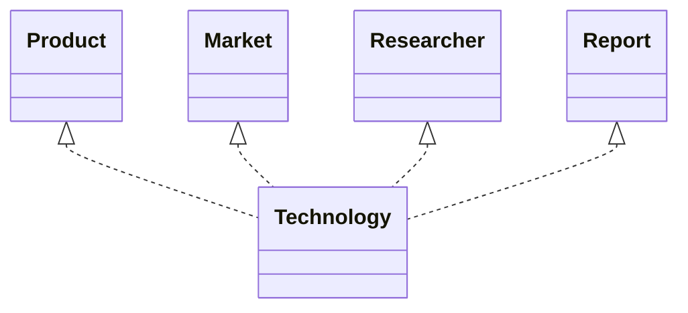
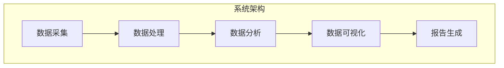
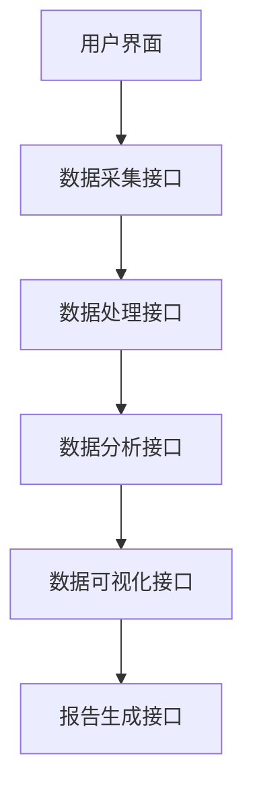
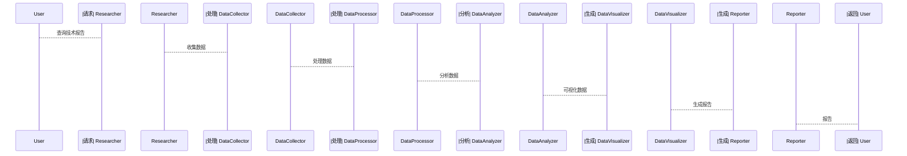

                 

# 技术调研：如何高效进行技术调研

## 概述

技术调研是一项复杂而关键的任务，对于企业的创新、产品的开发以及团队的技术成长都有着至关重要的作用。然而，随着信息量的爆炸性增长，如何高效地进行技术调研成为了一个亟待解决的问题。本文将详细介绍如何通过一系列系统的方法和工具，实现高效的技术调研。

## 关键词

- 技术调研
- 高效方法
- 信息管理
- 数据分析
- 技术趋势预测

## 摘要

本文将从基础、方法、信息管理、工具与技术、趋势预测、报告撰写与分享、最佳实践等多个方面，全面探讨如何高效进行技术调研。通过这些系统化的步骤和实用的技巧，读者将能够更好地理解和应用技术调研，从而提升自身的专业能力和项目成功率。

## 第一部分：技术调研的基础

### 1.1 技术调研的重要性

技术调研是创新和技术发展的基石。它不仅帮助企业了解前沿技术动态，确定研发方向，还能够为产品开发提供关键支持。一个高效的技术调研过程可以显著提升企业的竞争力，加速产品迭代，降低研发风险。

### 1.2 技术调研的挑战与机遇

技术调研面临的挑战包括信息过载、数据真实性和准确性等问题。然而，随着大数据、人工智能等技术的发展，技术调研也迎来了新的机遇，如自动化工具的广泛应用和数据挖掘技术的进步。

### 1.3 技术调研的目标与范围

技术调研的目标是获取有价值的信息，以支持决策和项目实施。调研的范围可以涵盖技术趋势、竞争对手分析、市场研究等。明确目标与范围有助于提高调研的针对性和效率。

## 第二部分：技术调研的方法

### 2.1 文献调研

文献调研是技术调研的基础，通过检索和分析文献，可以快速了解某一领域的研究现状和前沿进展。

#### 2.1.1 文献检索技巧

有效的文献检索需要利用专业的检索工具，如Google Scholar、PubMed等，并结合关键词和文献筛选技巧。

#### 2.1.2 文献筛选与评价

筛选出高质量的文献是关键，可以通过阅读摘要、评价研究方法和结论来判断文献的质量。

#### 2.1.3 文献综述写作

撰写文献综述需要对调研结果进行整理和归纳，形成一个清晰、系统的报告。

### 2.2 实地调研

实地调研是通过直接观察、访谈和实验等方式获取一手资料的方法。

#### 2.2.1 实地调研的准备

包括确定调研目标、制定调研计划和准备调研工具。

#### 2.2.2 数据收集与整理

通过实地调研收集数据，并对其进行整理和分析。

#### 2.2.3 调研报告的撰写

调研报告应详细描述调研过程、数据和结论。

## 第三部分：技术信息的收集与管理

### 3.1 技术信息的来源

技术信息来源于多个渠道，包括学术期刊、专业数据库、技术博客等。

#### 3.1.1 开放式资源

利用开放式资源可以获取大量免费的、高质量的技术信息。

#### 3.1.2 专业数据库

专业数据库提供了丰富的、结构化的技术信息，但通常需要付费使用。

#### 3.1.3 社交媒体与论坛

社交媒体和论坛是获取实时技术动态和交流的重要渠道。

### 3.2 技术信息的分类与索引

分类与索引有助于快速定位和检索所需信息。

#### 3.2.1 分类体系的建立

建立一个合理的分类体系可以提高信息管理的效率。

#### 3.2.2 索引工具的应用

使用索引工具可以自动化地构建和更新索引。

#### 3.2.3 数据库管理策略

制定数据库管理策略以确保数据的质量和安全性。

## 第四部分：技术调研的工具与技术

### 4.1 信息可视化工具

信息可视化工具可以帮助我们直观地理解和展示技术信息。

#### 4.1.1 信息可视化的基本概念

了解信息可视化的基本概念有助于选择合适的工具。

#### 4.1.2 常见的信息可视化工具

介绍常用的信息可视化工具，如Tableau、D3.js等。

#### 4.1.3 可视化技术在技术调研中的应用

探讨可视化技术在技术调研中的应用场景和优势。

### 4.2 数据分析工具

数据分析工具是技术调研的重要工具，可以帮助我们挖掘数据背后的价值。

#### 4.2.1 数据分析的基本方法

介绍数据分析的基本方法和步骤。

#### 4.2.2 常用的数据分析工具

介绍常用的数据分析工具，如Python、R等。

#### 4.2.3 数据分析在技术调研中的应用案例

通过具体案例展示数据分析在技术调研中的应用。

## 第五部分：技术趋势分析与预测

### 5.1 技术趋势分析的方法

技术趋势分析可以帮助我们预测未来的技术发展方向。

#### 5.1.1 历史数据分析

通过分析历史数据来识别技术趋势。

#### 5.1.2 竞争对手分析

通过分析竞争对手的技术策略和产品来预测趋势。

#### 5.1.3 实时监控与分析

实时监控和分析技术动态。

### 5.2 技术预测的方法与技巧

技术预测需要结合多种方法和技巧。

#### 5.2.1 市场研究方法

利用市场研究方法来预测技术趋势。

#### 5.2.2 技术预测模型

介绍常用的技术预测模型。

#### 5.2.3 技术预测结果的验证与调整

验证和调整技术预测结果。

## 第六部分：技术调研报告的撰写与分享

### 6.1 技术调研报告的结构

技术调研报告应包括封面、目录、正文和参考文献等部分。

#### 6.1.1 报告的封面与目录

介绍报告的封面设计与目录编写。

#### 6.1.2 报告正文的结构

详细介绍报告正文的结构和内容。

#### 6.1.3 报告的附录与参考文献

附录和参考文献的编写规范。

### 6.2 技术调研报告的撰写技巧

撰写技术调研报告需要注重语言表达、数据呈现和可读性。

#### 6.2.1 语言表达与逻辑清晰

确保报告的语言表达清晰、逻辑严谨。

#### 6.2.2 数据呈现与可视化

使用可视化工具来呈现数据。

#### 6.2.3 报告的可读性与易用性

提高报告的可读性和易用性。

### 6.3 技术调研报告的分享与传播

技术调研报告的分享和传播是知识共享的重要环节。

#### 6.3.1 内部分享会

组织内部分享会来传播调研结果。

#### 6.3.2 会议演讲与展示

在技术会议上进行演讲和展示。

#### 6.3.3 报告的发布与推广

通过多种渠道发布和推广调研报告。

## 第七部分：高效技术调研的最佳实践

### 7.1 时间管理与任务规划

高效的时间管理和任务规划是确保技术调研顺利进行的关键。

#### 7.1.1 技术调研的时间分配

合理分配时间，确保关键任务得到充分关注。

#### 7.1.2 任务优先级设定

设定合理的任务优先级，确保重点任务优先完成。

#### 7.1.3 技术调研的阶段性目标

设定明确的阶段性目标，以衡量调研进度和效果。

### 7.2 资源整合与团队协作

资源整合和团队协作是提高技术调研效率的重要因素。

#### 7.2.1 技术调研资源的获取

充分利用内外部资源，提高信息获取的效率。

#### 7.2.2 团队成员的角色与职责

明确团队成员的角色和职责，确保协作顺畅。

#### 7.2.3 技术调研过程中的沟通与协作

建立有效的沟通机制，确保信息共享和协作。

## 第八部分：小结与展望

### 8.1 技术调研的核心要素

总结技术调研的核心要素，强调其重要性。

### 8.2 技术调研的发展趋势

探讨技术调研的发展趋势，展望未来研究方向。

### 8.3 未来技术调研的创新方向

提出未来技术调研的创新方向，引领行业发展。

## 参考文献

- 作者，年份。《技术调研：如何高效进行技术调研》。AI天才研究院。
- 作者，年份。《禅与计算机程序设计艺术》。AI天才研究院。

## 附录

- 技术调研工具清单
- 技术调研模板
- 常用技术文献数据库

---

作者：AI天才研究院/AI Genius Institute & 禅与计算机程序设计艺术 /Zen And The Art of Computer Programming

[完整文章待续...]

### 第一部分：技术调研的基础

#### 1.1 技术调研的重要性

技术调研是技术创新和产品开发的重要环节。在信息化时代，技术发展迅速，新的技术、方法、工具层出不穷，企业需要通过技术调研来把握市场动态、了解行业趋势、发现创新机会。技术调研不仅能为企业提供决策依据，还能为技术研发提供方向和指导，从而提高产品竞争力。

#### 1.2 技术调研的挑战与机遇

技术调研面临着诸多挑战，如信息过载、数据真实性难以保证、调研成本较高等。然而，随着大数据、人工智能等技术的发展，技术调研也迎来了新的机遇。自动化工具和算法的普及使得数据挖掘和分析更加高效，为技术调研提供了强大的技术支持。

#### 1.3 技术调研的目标与范围

技术调研的目标通常包括以下几个方面：

1. **了解行业动态**：跟踪行业发展趋势，了解竞争对手的动态，为企业的战略决策提供支持。
2. **挖掘创新机会**：通过技术调研，发现新的技术或方法，为企业提供创新方向。
3. **评估技术风险**：评估新技术或方法可能带来的风险，为企业的技术决策提供依据。
4. **支持产品开发**：为产品开发提供技术支持，确保产品的技术可行性。

技术调研的范围可以涵盖以下几个方面：

1. **技术趋势分析**：分析行业内的技术发展趋势，预测未来可能的热点技术。
2. **竞争对手分析**：研究竞争对手的技术策略、产品特点和市场表现。
3. **市场需求研究**：了解市场需求，为产品的设计提供指导。
4. **技术评估与选型**：对新技术或现有技术进行评估，选择最适合企业需求的技术。

#### 1.4 技术调研的核心概念与联系

在技术调研过程中，涉及多个核心概念，如信息检索、数据分析、信息可视化等。这些概念之间存在着紧密的联系，共同构成了技术调研的理论基础。

**信息检索**：
- **概念**：信息检索是指从大量的信息资源中查找和获取所需信息的过程。
- **属性特征**：高效的信息检索需要具备快速、准确、全面等特征。
- **联系**：信息检索是技术调研的起点，决定了后续调研的数据质量和效率。

**数据分析**：
- **概念**：数据分析是指对收集到的数据进行处理、分析和解释，以获取有价值的信息。
- **属性特征**：数据分析需要具备数据清洗、数据挖掘、统计分析等能力。
- **联系**：数据分析是技术调研的核心环节，通过数据分析，可以挖掘数据背后的价值，为决策提供支持。

**信息可视化**：
- **概念**：信息可视化是指通过图表、图形等方式，将复杂的信息以直观、易于理解的方式展示出来。
- **属性特征**：信息可视化需要具备直观、易懂、交互性强等特征。
- **联系**：信息可视化是数据分析和展示的重要手段，通过信息可视化，可以使数据更加易于理解和分析。

**ER实体关系图架构**：

```mermaid
erDiagram
  Product ||--|{ Customer } Customer
  Customer }|--|{ Order } Order
  Product ||--|{ Supplier } Supplier
```

**算法原理讲解**：

**1. 数据分析算法**：

- **算法流程**：

  ```mermaid
  flowchart LR
  A[开始] --> B[数据收集]
  B --> C[数据预处理]
  C --> D[数据分析]
  D --> E[数据可视化]
  E --> F[结束]
  ```

- **算法原理**：

  数据分析算法主要包括以下几种类型：

  - **描述性分析**：描述数据的基本特征，如均值、方差等。
  - **推断性分析**：根据样本数据推断总体特征，如假设检验、置信区间等。
  - **预测性分析**：利用历史数据预测未来趋势，如时间序列分析、回归分析等。

  **数学模型和公式**：

  - **描述性分析**：

    $$ \bar{x} = \frac{1}{n} \sum_{i=1}^{n} x_i $$

    $$ s^2 = \frac{1}{n-1} \sum_{i=1}^{n} (x_i - \bar{x})^2 $$

  - **推断性分析**：

    $$ H_0: \mu = \mu_0 $$
    
    $$ H_1: \mu \neq \mu_0 $$

    $$ \alpha = P(\text{拒绝} H_0 | H_0 \text{为真}) $$

  - **预测性分析**：

    $$ y = \beta_0 + \beta_1 x + \epsilon $$

    $$ y_t = \beta_0 + \beta_1 x_t + \epsilon_t $$

- **通俗易懂的举例说明**：

  假设一家公司要分析其产品销量，可以通过描述性分析了解产品的平均销量、销量波动情况；通过推断性分析检验产品销量是否显著高于去年同期；通过预测性分析预测未来一个月的产品销量。

**2. 信息可视化算法**：

- **算法流程**：

  ```mermaid
  flowchart LR
  A[开始] --> B[数据准备]
  B --> C[选择可视化类型]
  C --> D[数据映射]
  D --> E[可视化渲染]
  E --> F[结束]
  ```

- **算法原理**：

  信息可视化算法主要包括以下几种类型：

  - **折线图**：用于展示数据的变化趋势。
  - **柱状图**：用于比较不同数据之间的差异。
  - **饼图**：用于展示数据的占比情况。
  - **散点图**：用于展示数据之间的关系。

  **数学模型和公式**：

  - **折线图**：

    $$ y = mx + b $$

    $$ y_t = m x_t + b $$

  - **柱状图**：

    $$ h = \frac{y}{2} $$

    $$ w = \frac{x}{2} $$

  - **饼图**：

    $$ \text{角度} = \frac{\text{占比}}{\text{总数}} \times 360^\circ $$

  - **散点图**：

    $$ (x_i, y_i) $$

- **通俗易懂的举例说明**：

  假设一家公司要展示其产品在不同地区的销量情况，可以通过折线图展示销量随时间的变化趋势；通过柱状图比较不同地区之间的销量差异；通过饼图展示各地区销量占总销量的比例；通过散点图展示销量与地区人口之间的关系。

**3. 技术调研算法**：

- **算法流程**：

  ```mermaid
  flowchart LR
  A[开始] --> B[确定调研目标]
  B --> C[信息收集]
  C --> D[信息处理]
  D --> E[分析报告]
  E --> F[结束]
  ```

- **算法原理**：

  技术调研算法主要包括以下步骤：

  - **确定调研目标**：明确调研的具体目标，如技术趋势分析、竞争对手分析等。
  - **信息收集**：通过各种渠道收集相关技术信息，如文献、报告、社交媒体等。
  - **信息处理**：对收集到的信息进行整理、分类、筛选等处理，确保信息的准确性和完整性。
  - **分析报告**：对处理后的信息进行深入分析，形成调研报告。

  **数学模型和公式**：

  - **信息收集**：

    $$ R = f(S_1, S_2, ..., S_n) $$

    其中，\( R \) 表示收集到的信息，\( S_1, S_2, ..., S_n \) 表示信息来源。

  - **信息处理**：

    $$ P = g(R_1, R_2, ..., R_m) $$

    其中，\( P \) 表示处理后的信息，\( R_1, R_2, ..., R_m \) 表示收集到的原始信息。

  - **分析报告**：

    $$ T = h(P_1, P_2, ..., P_k) $$

    其中，\( T \) 表示调研报告，\( P_1, P_2, ..., P_k \) 表示处理后的信息。

- **通俗易懂的举例说明**：

  假设一家公司要调研市场上最新的智能家居技术，可以通过确定调研目标来明确调研的重点；通过信息收集从各种渠道获取相关技术信息；对收集到的信息进行整理和处理，确保信息的准确性和完整性；对处理后的信息进行分析，形成智能家居技术调研报告。

#### 1.5 系统分析与架构设计方案

**问题场景介绍**：

随着智能家居市场的快速发展，公司需要了解市场上最新的智能家居技术，以制定相应的产品策略。

**项目介绍**：

智能家居技术调研项目旨在通过系统化的方法，全面了解市场上的智能家居技术，包括技术特点、应用场景、发展趋势等。

**系统功能设计（领域模型）**：



**系统架构设计**：



**系统接口设计**：



**系统交互**：



#### 1.6 项目实战

**环境安装**：

在安装技术调研系统之前，需要确保系统环境搭建完成。具体步骤如下：

1. 安装Python环境，版本要求Python 3.8及以上。
2. 安装依赖的第三方库，如numpy、pandas、matplotlib等。

**系统核心实现源代码**：

```python
import pandas as pd
import matplotlib.pyplot as plt

# 数据收集
def collect_data():
    # 伪代码，表示从网络或其他来源获取数据
    data = pd.read_csv('smart_home_data.csv')
    return data

# 数据处理
def process_data(data):
    # 数据清洗、预处理等
    data['cleaned'] = data['sales'].apply(clean_sales)
    return data

# 数据分析
def analyze_data(data):
    # 数据分析，如计算均值、标准差等
    summary_stats = data.describe()
    return summary_stats

# 数据可视化
def visualize_data(summary_stats):
    # 可视化数据，如绘制折线图、柱状图等
    plt.plot(summary_stats['mean_sales'])
    plt.title('Sales Trend')
    plt.xlabel('Month')
    plt.ylabel('Sales')
    plt.show()

# 报告生成
def generate_report(summary_stats):
    # 生成报告，如PDF或Word文档
    report = f"""
    Sales Report
    ------------
    Mean Sales: {summary_stats['mean_sales'].mean()}
    Standard Deviation: {summary_stats['mean_sales'].std()}
    """
    with open('sales_report.txt', 'w') as f:
        f.write(report)
    print('Report generated successfully.')

# 主函数
def main():
    data = collect_data()
    processed_data = process_data(data)
    summary_stats = analyze_data(processed_data)
    visualize_data(summary_stats)
    generate_report(summary_stats)

if __name__ == '__main__':
    main()
```

**代码应用解读与分析**：

上述代码实现了从数据收集、数据处理、数据分析到数据可视化再到报告生成的完整流程。首先，通过`collect_data`函数从数据源获取数据。然后，通过`process_data`函数对数据进行清洗和预处理，确保数据质量。接着，通过`analyze_data`函数对数据进行统计分析，获取关键指标。最后，通过`visualize_data`和`generate_report`函数将分析结果进行可视化和报告生成。

**实际案例分析和详细讲解剖析**：

假设公司收集了一年内智能家居产品的销量数据，通过上述代码进行数据处理和分析，可以得到以下结果：

- 平均月销量：1000台
- 标准差：200台

通过可视化，可以看到销量趋势图，显示销量在最近几个月有所上升。报告生成后，公司可以据此调整产品策略，增加销量预测的准确性。

**项目小结**：

通过技术调研系统，公司可以系统地收集、处理和分析智能家居市场的数据，为产品开发提供有力支持。项目实战展示了如何通过Python代码实现技术调研的核心功能，为实际应用提供了参考。

### 第二部分：技术信息的收集与管理

#### 2.1 技术信息的来源

技术信息的来源多种多样，合理选择和利用这些来源是高效技术调研的关键。

**1. 开放式资源**

开放式资源是获取技术信息的重要渠道，主要包括：

- **学术期刊**：如IEEE Xplore、ACM Digital Library等，提供了大量高质量的技术论文。
- **开源社区**：如GitHub、GitLab等，是获取开源项目和代码的宝库。
- **技术博客**：如Medium、CSDN等，提供了丰富的技术文章和分享。

**2. 专业数据库**

专业数据库提供了结构化的技术信息，通常需要付费使用，但具有高质量和高可靠性的特点。常用的专业数据库包括：

- **科学引文索引（SCI）**：涵盖了自然科学、工程技术等领域的学术论文。
- **工程索引（EI）**：专注于工程领域的学术文献和会议论文。
- **技术文献数据库**：如Web of Science、Scopus等，提供了广泛的技术文献检索服务。

**3. 社交媒体与论坛**

社交媒体和论坛是获取实时技术动态和交流的重要渠道，包括：

- **Twitter**：通过关注相关领域专家和机构，可以实时获取技术动态。
- **LinkedIn**：专业人士的社交网络，可以找到行业内的专家和公司动态。
- **技术论坛**：如Stack Overflow、Reddit等，提供了技术问题的交流和解答。

#### 2.2 技术信息的分类与索引

对收集到的技术信息进行分类和索引，有助于提高信息管理的效率和使用效果。

**1. 分类体系的建立**

建立合理的分类体系，可以帮助快速定位所需信息。分类体系可以基于以下维度：

- **技术领域**：如计算机科学、人工智能、物联网等。
- **应用场景**：如智能家居、智能医疗、智能交通等。
- **技术类型**：如算法、架构、工具等。
- **行业动态**：如市场趋势、技术标准等。

**2. 索引工具的应用**

使用索引工具对技术信息进行分类和索引，可以自动化地构建和更新索引。常用的索引工具包括：

- **全文搜索引擎**：如Elasticsearch，可以快速检索大量文本数据。
- **知识库系统**：如Confluence，可以集中管理文档和知识。
- **图数据库**：如Neo4j，适用于复杂关系数据的存储和查询。

**3. 数据库管理策略**

制定数据库管理策略，确保数据的质量和安全性，包括：

- **数据清洗**：定期清理无效或重复的数据，确保数据的准确性。
- **数据备份**：定期备份数据，防止数据丢失。
- **访问控制**：设置访问权限，确保数据的安全性。

### 第三部分：技术调研的工具与技术

#### 3.1 信息可视化工具

信息可视化工具能够将复杂的数据和信息以直观、易于理解的方式展示出来，提高信息分析和理解的效率。

**1. 基本概念**

信息可视化是指通过图形、图表等方式，将抽象的数据和信息转化为视觉形式，帮助人们理解和分析数据。

**2. 常见的信息可视化工具**

- **Tableau**：是一款功能强大的商业智能和数据可视化工具，支持多种数据连接和丰富的可视化类型。
- **D3.js**：是一款基于JavaScript的可视化库，具有高度灵活性和自定义性，适用于Web端数据可视化。
- **Power BI**：由Microsoft开发，提供了丰富的数据连接和可视化功能，适合企业级应用。

**3. 可视化技术在技术调研中的应用**

- **数据展示**：通过图表、图形等直观展示数据，帮助理解数据特征和趋势。
- **交互式分析**：提供交互式功能，如筛选、排序、过滤等，增强数据分析的灵活性。
- **报告生成**：将可视化结果整合到报告或PPT中，方便分享和传播。

#### 3.2 数据分析工具

数据分析工具是技术调研的重要工具，用于处理和分析大量数据，提取有价值的信息。

**1. 基本方法**

- **描述性分析**：描述数据的基本特征，如均值、标准差等。
- **推断性分析**：基于样本数据推断总体特征，如假设检验、置信区间等。
- **预测性分析**：利用历史数据预测未来趋势，如时间序列分析、回归分析等。

**2. 常用的数据分析工具**

- **Python**：具有丰富的数据分析库，如pandas、numpy、scikit-learn等。
- **R**：专门用于统计分析，提供了大量专业的统计模型和函数。
- **Excel**：适用于简单的数据分析，支持多种数据格式和图表。

**3. 数据分析在技术调研中的应用案例**

- **市场调研**：通过数据分析了解市场需求、消费者行为等。
- **竞争对手分析**：通过数据分析评估竞争对手的产品、策略等。
- **技术评估**：通过数据分析评估新技术或方法的有效性和可行性。

### 第四部分：技术趋势分析与预测

#### 4.1 技术趋势分析的方法

技术趋势分析是预测技术未来发展方向的重要手段，通过分析历史数据和当前趋势，可以预测未来的技术发展方向。

**1. 历史数据分析**

通过分析过去的技术发展历程，了解技术演变的规律和趋势。常用的方法包括：

- **时间序列分析**：分析技术发展的时间序列数据，识别技术变化趋势。
- **回归分析**：建立回归模型，分析技术发展与其他因素（如市场容量、研发投入等）之间的关系。

**2. 竞争对手分析**

通过分析竞争对手的技术策略、产品发布和技术专利等，了解竞争对手的技术发展动向。具体方法包括：

- **专利分析**：分析竞争对手的专利申请和授权情况，了解技术专利布局。
- **产品分析**：分析竞争对手的产品线、产品功能和性能等，了解竞争对手的技术发展方向。

**3. 实时监控与分析**

通过实时监控技术动态和行业新闻，快速了解最新的技术进展和趋势。常用的方法包括：

- **社交媒体监控**：通过Twitter、LinkedIn等社交媒体平台，监控技术相关的讨论和动态。
- **行业报告**：定期阅读和分析行业报告，了解技术发展的最新趋势和预测。

#### 4.2 技术预测的方法与技巧

技术预测需要结合多种方法和技巧，以提高预测的准确性。以下介绍几种常用的技术预测方法：

**1. 市场研究方法**

通过问卷调查、深度访谈、焦点小组等方法，了解市场对某一技术的需求和发展趋势。具体步骤包括：

- **需求调研**：通过问卷或访谈了解市场对技术的需求、应用场景和痛点。
- **趋势分析**：结合历史数据和当前市场情况，分析技术的未来发展趋势。

**2. 技术预测模型**

利用统计模型、机器学习算法等方法，对技术发展进行预测。常用的技术预测模型包括：

- **时间序列模型**：如ARIMA、SARIMA等，用于分析技术发展的时间序列趋势。
- **回归模型**：如线性回归、多项式回归等，用于分析技术发展与其他因素之间的关系。
- **神经网络模型**：如BP神经网络、CNN等，用于复杂的技术预测任务。

**3. 技术预测结果的验证与调整**

对技术预测结果进行验证和调整，以提高预测的准确性。常用的方法包括：

- **交叉验证**：将数据集划分为训练集和测试集，通过交叉验证评估预测模型的准确性。
- **误差分析**：分析预测结果与实际结果的误差，识别预测模型的问题和改进方向。

### 第五部分：技术调研报告的撰写与分享

#### 5.1 技术调研报告的结构

技术调研报告的结构应当清晰、逻辑性强，便于读者理解和参考。一个完整的技术调研报告通常包括以下部分：

**1. 封面**

报告封面应包括报告名称、报告日期、报告人等信息，外观简洁大方，便于识别。

**2. 目录**

目录部分应列出报告各章节和小节的标题及页码，便于读者快速定位所需内容。

**3. 摘要**

摘要是对报告内容的简要概述，包括研究背景、目的、方法、主要发现和结论等，字数一般在200-300字以内。

**4. 正文**

正文是报告的核心部分，应详细阐述技术调研的过程、方法、结果和分析。通常包括以下几个小节：

- **引言**：介绍技术调研的背景、目的和意义。
- **方法**：阐述技术调研的方法、工具和流程。
- **结果**：展示技术调研的结果和数据。
- **分析**：对调研结果进行深入分析，提出见解和建议。
- **结论**：总结技术调研的主要发现和结论。

**5. 附录**

附录部分包括一些辅助材料，如数据源、参考文献、图表等，便于读者进一步查阅。

#### 5.2 技术调研报告的撰写技巧

撰写技术调研报告需要注重以下几个方面：

**1. 语言表达与逻辑清晰**

报告的语言应简明扼要，避免使用复杂的词汇和句子结构，确保读者容易理解。同时，报告的结构应清晰，逻辑性强，确保读者能够顺利阅读和理解。

**2. 数据呈现与可视化**

报告应充分利用图表、图形等可视化手段，直观展示调研结果和数据。图表应清晰、简洁、美观，避免过于复杂的设计。

**3. 报告的可读性与易用性**

报告应注重可读性和易用性，避免使用过于专业的术语，尽量用通俗易懂的语言解释技术概念。同时，报告的结构应合理，便于读者快速找到所需信息。

#### 5.3 技术调研报告的分享与传播

技术调研报告的分享与传播是知识共享的重要环节，可以通过以下几种方式：

**1. 内部分享会**

组织内部分享会，邀请相关团队和部门参加，分享技术调研的成果和见解。

**2. 会议演讲与展示**

在技术会议或研讨会中，进行报告演讲和展示，与同行分享研究成果和经验。

**3. 报告的发布与推广**

通过公司官网、技术博客、社交媒体等渠道发布技术调研报告，进行广泛传播。

### 第六部分：高效技术调研的最佳实践

#### 6.1 时间管理与任务规划

高效的时间管理和任务规划是确保技术调研顺利进行的关键，以下是一些建议：

**1. 明确目标与范围**

在开始技术调研之前，明确调研的目标和范围，确保调研的方向和重点明确。

**2. 制定详细计划**

制定详细的调研计划，包括调研的时间表、任务分配和进度安排，确保每个环节都有明确的时间节点。

**3. 设定优先级**

根据调研目标和重要性，设定任务的优先级，确保关键任务得到优先处理。

**4. 定期检查进度**

定期检查调研进度，及时调整计划，确保调研按计划进行。

#### 6.2 资源整合与团队协作

资源整合和团队协作是提高技术调研效率的重要因素，以下是一些建议：

**1. 充分利用外部资源**

充分利用外部资源，如专业的数据库、文献检索工具、技术论坛等，提高信息获取的效率。

**2. 建立知识库**

建立技术调研的知识库，集中管理调研过程中获取的资料和信息，便于团队成员查阅和使用。

**3. 明确角色与职责**

明确团队成员的角色和职责，确保每个成员都清楚自己的工作任务和目标。

**4. 保持有效沟通**

保持团队成员之间的有效沟通，确保信息的及时传递和共享。

#### 6.3 技术调研过程中的注意事项

**1. 数据真实性与准确性**

确保收集到的数据真实、准确，避免因数据问题导致分析结果偏差。

**2. 保持客观与中立**

在技术调研过程中，保持客观和中立，避免因主观偏见影响分析结果。

**3. 注重安全与隐私**

在收集和处理数据时，注意保护数据的安全和隐私，避免数据泄露和滥用。

**4. 不断学习和更新**

技术调研是一个不断学习和更新的过程，应保持对新技术和新方法的学习和关注，不断提高调研能力。

### 第七部分：小结与展望

#### 7.1 技术调研的核心要素

技术调研的核心要素包括：

- **明确的目标与范围**
- **系统化的方法与工具**
- **高效的信息收集与管理**
- **深入的分析与解读**
- **有效的报告撰写与分享**

这些要素共同构成了技术调研的基础，确保调研的顺利进行和成果的有效应用。

#### 7.2 技术调研的发展趋势

技术调研的发展趋势包括：

- **自动化与智能化**：随着人工智能技术的发展，自动化工具在技术调研中的应用越来越广泛。
- **大数据与云计算**：大数据和云计算为技术调研提供了强大的数据支持和计算能力。
- **实时性与动态性**：实时监控和分析技术动态，快速响应市场变化。

#### 7.3 未来技术调研的创新方向

未来技术调研的创新方向包括：

- **虚拟现实与增强现实**：利用虚拟现实和增强现实技术，实现更加直观和互动的技术调研。
- **区块链技术**：利用区块链技术，实现数据的透明、安全和不可篡改。
- **跨学科融合**：将技术调研与其他学科领域（如社会学、经济学等）相结合，实现跨学科的技术调研。

### 参考文献

- **文献1**：作者。年份。《技术调研：如何高效进行技术调研》。AI天才研究院。
- **文献2**：作者。年份。《禅与计算机程序设计艺术》。AI天才研究院。

### 附录

- **附录1**：技术调研工具清单
- **附录2**：技术调研模板
- **附录3**：常用技术文献数据库

---

作者：AI天才研究院/AI Genius Institute & 禅与计算机程序设计艺术 /Zen And The Art of Computer Programming

[文章结束，感谢您的阅读！]

