                 


### 技术选型决策树：系统化的技术选择方法

#### 关键词：技术选型、决策树、系统化、量化评估、可视化

> 摘要：在当今信息技术快速发展的背景下，技术选型变得尤为重要。本文介绍了一种系统化的技术选择方法——技术选型决策树，通过量化评估和可视化呈现，帮助项目团队在复杂多变的环境中做出明智的技术决策。

#### 目录

### 第一部分：技术选型概述

## 第1章：技术选型的重要性

### 1.1 技术选型的背景

#### 1.1.1 技术发展的迅速

随着信息技术的快速发展，新技术层出不穷，技术选型的难度日益增加。例如，云计算、大数据、人工智能等领域的创新，带来了丰富的技术选择，但也让技术选型变得更加复杂。

#### 1.1.2 项目需求和约束变化多端

项目需求的变化和技术约束的多样性使得技术选型变得复杂。例如，一个电商系统需要处理海量数据，同时需要快速响应，这就要求技术选型既要考虑性能，又要考虑成本。

### 1.2 技术选型的挑战

#### 1.2.1 复杂性高

技术选型涉及多个方面，包括性能、成本、可维护性等，需要综合考虑。例如，选择数据库时，不仅要考虑读写性能，还要考虑数据一致性、备份恢复能力等因素。

#### 1.2.2 信息不对称

技术选型过程中，信息的不对称可能导致决策偏差。例如，团队成员可能只了解部分技术细节，而无法全面评估各种技术的优劣。

#### 1.2.3 缺乏系统化的方法论

现有的技术选型方法往往不够系统，难以满足实际需求。缺乏系统化的方法论会导致技术选型过程变得混乱，难以实现预期目标。

### 1.3 技术选型决策树的优势

#### 1.3.1 系统化

决策树提供了系统化的框架，有助于全面分析技术选型问题。例如，通过需求分析、技术评估和风险评估等步骤，确保技术选型的全面性和系统性。

#### 1.3.2 量化评估

决策树通过量化评估，为技术选型提供数据支持。例如，通过性能评估、成本评估等量化指标，帮助项目团队做出客观、科学的决策。

#### 1.3.3 可视化呈现

决策树的可视化特性，使得技术选型过程更加直观和易于理解。例如，通过决策路径的可视化，项目团队能够更清晰地了解技术选型的过程和结果。

## 第2章：技术选型方法论

### 2.1 需求分析

#### 2.1.1 用户需求

用户需求是技术选型的基础，需要明确项目的具体需求和目标。例如，一个电商系统需要支持海量商品、快速搜索和支付功能。

#### 2.1.2 业务目标

业务目标是项目成功的关键，需要与技术需求紧密结合。例如，提高用户满意度、降低运维成本等。

#### 2.1.3 技术需求

技术需求包括性能、可扩展性、安全性等方面，是技术选型的核心。例如，需要支持高并发、保证数据安全等。

### 2.2 技术评估

#### 2.2.1 性能评估

性能评估包括响应时间、吞吐量等指标，是技术选型的重要参考。例如，通过性能测试，比较不同技术的性能表现。

#### 2.2.2 可维护性评估

可维护性评估包括代码可读性、文档完整性等方面，关系到项目的长期维护。例如，评估代码质量和文档编写情况。

#### 2.2.3 成本评估

成本评估包括直接成本和间接成本，是技术选型决策的重要依据。例如，比较不同技术的采购成本、运维成本等。

### 2.3 风险评估

#### 2.3.1 技术风险

技术风险包括技术实现难度、技术更新换代等方面。例如，评估新技术是否成熟、是否需要额外培训等。

#### 2.3.2 运维风险

运维风险包括系统稳定性、故障处理能力等方面。例如，评估系统在高峰期的稳定性、故障恢复时间等。

#### 2.3.3 法律风险

法律风险包括知识产权、合规性等方面。例如，评估技术是否符合相关法律法规、是否存在知识产权纠纷等。

## 第3章：技术选型决策树构建

### 3.1 决策树基本概念

#### 3.1.1 决策节点

决策节点是技术选型过程中的关键决策点。例如，选择数据库类型、选择开发语言等。

#### 3.1.2 技术节点

技术节点是决策树中的具体技术选项。例如，MySQL、PostgreSQL、MongoDB等数据库技术。

#### 3.1.3 评估节点

评估节点是对技术节点进行量化评估的部分。例如，性能评估、成本评估等。

### 3.2 决策树构建步骤

#### 3.2.1 需求分析

需求分析是构建决策树的基础。明确项目需求和目标，确定技术选型范围。

#### 3.2.2 技术评估

技术评估是对各个技术节点进行量化评估。通过性能测试、成本评估等手段，为技术节点打分。

#### 3.2.3 决策路径分析

决策路径分析是确定最优技术选型的过程。通过比较各个技术节点的评估结果，选择最优路径。

#### 3.2.4 决策树可视化

决策树可视化是将决策路径和分析结果呈现给项目团队。使用图形化工具，使决策过程更加直观易懂。

## 第4章：案例研究

### 4.1 案例一：云计算平台选型

#### 4.1.1 案例背景

某公司计划构建一个云计算平台，支持海量数据处理和分布式存储。

#### 4.1.2 需求分析

明确业务需求，包括数据存储容量、数据处理速度、系统可扩展性等。

#### 4.1.3 技术评估

对云计算平台的主要技术选项，如AWS、Azure、Google Cloud等进行性能、成本、可维护性等评估。

#### 4.1.4 风险评估

评估技术选型的风险，包括技术实现难度、法律合规性等。

#### 4.1.5 决策树构建

根据评估结果，构建云计算平台选型的决策树，确定最优技术选型路径。

### 4.2 案例二：大数据技术选型

#### 4.2.1 案例背景

某互联网公司需要构建一个大数据平台，处理海量用户数据。

#### 4.2.2 需求分析

明确大数据平台的需求，包括数据处理速度、存储容量、数据安全等。

#### 4.2.3 技术评估

对大数据技术选项，如Hadoop、Spark、Flink等进行性能、成本、可扩展性等评估。

#### 4.2.4 风险评估

评估大数据技术选型的风险，包括技术更新换代、数据安全等。

#### 4.2.5 决策树构建

根据评估结果，构建大数据技术选型的决策树，确定最优技术选型路径。

## 第5章：技术选型最佳实践

### 5.1 制定技术选型策略

#### 5.1.1 短期与长期策略

根据项目的不同阶段，制定短期和长期的技术选型策略。例如，在项目初期，优先考虑短期效果，而在项目后期，则更多关注长期效益。

#### 5.1.2 集中式与分布式策略

根据项目的规模和复杂性，选择集中式或分布式技术选型策略。例如，对于大型项目，采用分布式策略，可以实现更好的可扩展性。

### 5.2 技术选型团队建设

#### 5.2.1 团队成员角色

明确团队成员的角色和职责，包括需求分析师、技术专家、项目管理员等。

#### 5.2.2 技能要求

确保团队成员具备所需技能，如软件开发、系统架构设计、项目管理等。

#### 5.2.3 人才培养

定期进行团队成员的技术培训和技能提升，以适应技术发展的需求。

### 5.3 技术选型流程优化

#### 5.3.1 流程标准化

制定标准化的技术选型流程，确保团队成员在技术选型过程中遵循统一的规范。

#### 5.3.2 沟通协作机制

建立良好的沟通协作机制，确保技术选型过程中各个团队成员之间的信息共享和协同工作。

#### 5.3.3 反馈与迭代

定期收集技术选型过程中的反馈，对流程进行优化和迭代，以提高技术选型的效率和效果。

## 第6章：技术选型的未来趋势

### 6.1 自动化与智能化

#### 6.1.1 AI在技术选型中的应用

利用人工智能技术，提高技术选型的自动化和智能化水平。例如，通过机器学习算法，自动分析技术选型数据，推荐最优技术方案。

#### 6.1.2 自动化决策支持系统

构建自动化决策支持系统，为技术选型提供智能化的辅助。例如，利用自然语言处理技术，自动生成技术选型报告，辅助项目团队做出决策。

### 6.2 开源与生态

#### 6.2.1 开源技术的影响

开源技术的发展，对技术选型产生了深远的影响。例如，Apache、OpenStack等开源项目，为技术选型提供了丰富的技术选择。

#### 6.2.2 技术选型与开源生态的关系

技术选型与开源生态密切相关。选择合适的技术，需要深入了解开源生态的现状和趋势，以便更好地利用开源技术。

### 6.3 云原生与边缘计算

#### 6.3.1 云原生技术的发展

云原生技术，如Kubernetes、Docker等，为技术选型提供了新的思路。例如，通过容器化技术，实现更高效的技术部署和运维。

#### 6.3.2 边缘计算对技术选型的影响

边缘计算技术的发展，对技术选型提出了新的挑战。例如，在边缘节点部署合适的技术，以满足实时性和低延迟的需求。

## 第7章：技术选型总结与展望

### 7.1 技术选型的核心要素

#### 7.1.1 需求分析

需求分析是技术选型的核心，确保技术选型与业务需求高度一致。

#### 7.1.2 技术评估

技术评估是技术选型的重要环节，通过量化评估，为技术选型提供数据支持。

#### 7.1.3 风险评估

风险评估是技术选型的必要步骤，识别和评估技术选型的潜在风险。

### 7.2 技术选型的未来方向

#### 7.2.1 技术趋势

关注技术发展趋势，把握技术选型的最新动向。

#### 7.2.2 技术选型的创新

在技术选型中，积极探索创新技术，提升项目竞争力。

### 7.3 技术选型在企业中的应用价值

#### 7.3.1 提高项目成功率

科学的技术选型，可以提高项目成功率，降低项目风险。

#### 7.3.2 降低技术风险

通过风险评估，降低技术选型的风险，保障项目的顺利进行。

#### 7.3.3 提升企业竞争力

技术选型是提升企业竞争力的重要手段，通过选择合适的技术，实现业务目标。

### 作者

**作者：AI天才研究院/AI Genius Institute & 禅与计算机程序设计艺术 /Zen And The Art of Computer Programming**

### 第1章：技术选型的重要性

#### 1.1 技术选型的背景

随着全球信息技术的飞速发展，各类新技术、新架构、新平台层出不穷。企业需要面对的技术选择变得越来越复杂。技术选型不仅仅是选择一个工具或平台，更是涉及整体架构设计、系统性能、维护成本等多方面因素的综合决策。

**背景介绍：**

1. **技术发展迅速**：新技术不断涌现，如人工智能、大数据、云计算等，使得企业在技术选型时面临更多选择。
2. **项目需求和约束变化多端**：企业项目需求多样，技术约束多变，如性能需求、成本约束、时间限制等，这些都增加了技术选型的复杂性。

**问题背景：** 在这样一个快速变化的环境中，如何从众多技术中做出最优选择，成为企业面临的重要挑战。

**问题描述：** 技术选型涉及多个因素，如何高效地分析、评估和决策，以确保技术选型的准确性和高效性？

**问题解决：** 需要一种系统化、量化的方法来辅助技术选型决策。

**边界与外延：** 技术选型不仅限于单一技术组件的选择，还包括整个系统架构的设计和优化。

**概念结构与核心要素组成：**

1. **需求分析**：明确项目需求，是技术选型的起点。
2. **技术评估**：对各种技术进行性能、成本、可维护性等方面的评估。
3. **风险评估**：识别潜在风险，并评估其影响。
4. **决策路径**：通过评估结果，确定最优技术路径。

#### 1.2 技术选型的挑战

**复杂性高**：技术选型涉及多个方面，如性能、成本、可维护性等，需要综合考虑。

**信息不对称**：团队成员可能只了解部分技术细节，导致决策偏差。

**缺乏系统化的方法论**：现有方法往往不够系统，难以应对实际复杂情况。

**解决策略：**

1. **建立系统化的方法论**：如技术选型决策树，提供全面的框架。
2. **加强信息共享与协作**：确保团队成员对技术细节有全面了解。
3. **量化评估与可视化**：使用量化指标和可视化工具，提高决策的透明度和准确性。

#### 1.3 技术选型决策树的优势

**系统化**：决策树提供了系统化的框架，有助于全面分析技术选型问题。

**量化评估**：通过量化指标，为技术选型提供数据支持。

**可视化呈现**：决策树的可视化特性，使得技术选型过程更加直观易懂。

### 第2章：技术选型方法论

#### 2.1 需求分析

**用户需求**：用户需求是技术选型的基础。例如，一个电商系统需要支持快速商品搜索和支付功能。

**业务目标**：业务目标是项目的核心目标，如提高用户满意度、降低成本等。

**技术需求**：技术需求包括性能、可扩展性、安全性等，直接影响系统的运行效率和用户体验。

**需求分析步骤：**

1. **收集需求**：通过与用户、业务团队等多方面沟通，收集详细的需求。
2. **分类需求**：将需求分为功能需求、性能需求、安全需求等。
3. **优先级排序**：根据业务目标和优先级，对需求进行排序。

#### 2.2 技术评估

**性能评估**：评估技术性能，包括响应时间、吞吐量、并发处理能力等。

**可维护性评估**：评估技术的可维护性，包括代码质量、文档完整性、社区活跃度等。

**成本评估**：评估技术成本，包括采购成本、运维成本等。

**技术评估步骤：**

1. **定义评估指标**：根据需求分析结果，确定评估指标。
2. **收集数据**：通过性能测试、市场调研等手段，收集相关数据。
3. **量化评估**：使用评分、打分等方法，对技术进行量化评估。

#### 2.3 风险评估

**技术风险**：包括技术实现难度、技术更新换代等。

**运维风险**：包括系统稳定性、故障处理能力等。

**法律风险**：包括知识产权、合规性等。

**风险评估步骤：**

1. **识别风险**：通过访谈、文档分析等手段，识别潜在风险。
2. **评估影响**：对风险的可能影响进行评估。
3. **制定风险应对策略**：针对识别的风险，制定相应的应对策略。

### 第3章：技术选型决策树构建

#### 3.1 决策树基本概念

**决策节点**：决策节点是技术选型过程中的关键决策点，如选择数据库类型。

**技术节点**：技术节点是决策树中的具体技术选项，如MySQL、PostgreSQL等。

**评估节点**：评估节点是对技术节点进行量化评估的部分，如性能评估、成本评估等。

#### 3.2 决策树构建步骤

**需求分析**：明确项目需求和目标，确定技术选型范围。

**技术评估**：对各个技术节点进行量化评估。

**决策路径分析**：根据评估结果，确定最优技术选型路径。

**决策树可视化**：使用图形化工具，将决策路径和分析结果呈现给项目团队。

### 第4章：案例研究

#### 4.1 案例一：云计算平台选型

**案例背景**：某公司计划构建一个云计算平台，支持海量数据处理和分布式存储。

**需求分析**：明确业务需求，如数据存储容量、数据处理速度、系统可扩展性等。

**技术评估**：对云计算平台的主要技术选项，如AWS、Azure、Google Cloud等进行评估。

**风险评估**：评估技术选型的风险，如技术实现难度、法律合规性等。

**决策树构建**：根据评估结果，构建云计算平台选型的决策树。

#### 4.2 案例二：大数据技术选型

**案例背景**：某互联网公司需要构建一个大数据平台，处理海量用户数据。

**需求分析**：明确大数据平台的需求，如数据处理速度、存储容量、数据安全等。

**技术评估**：对大数据技术选项，如Hadoop、Spark、Flink等进行评估。

**风险评估**：评估大数据技术选型的风险，如技术更新换代、数据安全等。

**决策树构建**：根据评估结果，构建大数据技术选型的决策树。

### 第5章：技术选型最佳实践

#### 5.1 制定技术选型策略

**短期与长期策略**：根据项目的不同阶段，制定短期和长期的技术选型策略。

**集中式与分布式策略**：根据项目的规模和复杂性，选择集中式或分布式技术选型策略。

#### 5.2 技术选型团队建设

**团队成员角色**：明确团队成员的角色和职责。

**技能要求**：确保团队成员具备所需技能。

**人才培养**：定期进行团队成员的技术培训和技能提升。

#### 5.3 技术选型流程优化

**流程标准化**：制定标准化的技术选型流程。

**沟通协作机制**：建立良好的沟通协作机制。

**反馈与迭代**：定期收集反馈，优化流程。

### 第6章：技术选型的未来趋势

#### 6.1 自动化与智能化

**AI在技术选型中的应用**：利用人工智能技术，提高技术选型的自动化和智能化水平。

**自动化决策支持系统**：构建自动化决策支持系统，为技术选型提供智能化的辅助。

#### 6.2 开源与生态

**开源技术的影响**：开源技术的发展，对技术选型产生了深远的影响。

**技术选型与开源生态的关系**：技术选型与开源生态密切相关。

#### 6.3 云原生与边缘计算

**云原生技术的发展**：云原生技术为技术选型提供了新的思路。

**边缘计算对技术选型的影响**：边缘计算技术的发展，对技术选型提出了新的挑战。

### 第7章：技术选型总结与展望

#### 7.1 技术选型的核心要素

**需求分析**：确保技术选型与业务需求高度一致。

**技术评估**：通过量化评估，为技术选型提供数据支持。

**风险评估**：识别和评估技术选型的潜在风险。

#### 7.2 技术选型的未来方向

**技术趋势**：关注技术发展趋势，把握技术选型的最新动向。

**技术选型的创新**：在技术选型中，积极探索创新技术，提升项目竞争力。

#### 7.3 技术选型在企业中的应用价值

**提高项目成功率**：科学的技术选型，可以提高项目成功率，降低项目风险。

**降低技术风险**：通过风险评估，降低技术选型的风险，保障项目的顺利进行。

**提升企业竞争力**：技术选型是提升企业竞争力的重要手段，通过选择合适的技术，实现业务目标。

### 作者

**作者：AI天才研究院/AI Genius Institute & 禅与计算机程序设计艺术 /Zen And The Art of Computer Programming**

### 2.1 需求分析

#### 用户需求

用户需求是技术选型的起点，是项目成功的关键因素。明确用户需求可以帮助我们了解项目的核心目标，从而为后续的技术评估提供依据。

**用户需求特征对比表格：**

| 需求特征 | 描述 |  
| --- | --- |  
| 功能需求 | 描述系统应具备的功能 |  
| 性能需求 | 描述系统性能指标，如响应时间、吞吐量等 |  
| 安全需求 | 描述系统安全要求，如数据加密、访问控制等 |  
| 可扩展性需求 | 描述系统可扩展性要求，如支持新增功能、横向扩展等 |  
| 用户界面需求 | 描述用户界面的要求，如美观、易用等 |

**用户需求ER实体关系图：**

```mermaid
erDiagram
    User <<-- Requirement : 1..* {
        User "1" ---- "Many" Requirement
    }
    Requirement ||--|> Function : 1..*
    Requirement ||--|> Performance : 1..*
    Requirement ||--|> Security : 1..*
    Requirement ||--|> Scalability : 1..*
    Requirement ||--|> UserInterface : 1..*
```

#### 业务目标

业务目标是项目成功的关键指标，它需要与用户需求紧密相连，并确保技术选型能够支持业务目标的实现。

**业务目标特征对比表格：**

| 目标特征 | 描述 |  
| --- | --- |  
| 成本效益 | 描述项目在成本和效益方面的平衡 |  
| 用户满意度 | 描述项目的用户接受度和满意度 |  
| 市场竞争力 | 描述项目在市场竞争中的地位和优势 |  
| 技术成熟度 | 描述项目使用技术的成熟度水平 |  
| 运维效率 | 描述项目的运维效率指标，如故障恢复时间等 |

**业务目标ER实体关系图：**

```mermaid
erDiagram
    BusinessGoal <<-- Requirement : 1..*
    BusinessGoal ||--|> UserGoal : 1..*
    BusinessGoal ||--|> TechnicalGoal : 1..*
    BusinessGoal ||--|> OperationalGoal : 1..*
```

#### 技术需求

技术需求是系统实现的基础，包括性能、可扩展性、安全性等方面的要求。明确技术需求可以帮助我们选择合适的技术方案，确保系统能够满足业务和用户需求。

**技术需求特征对比表格：**

| 技术需求特征 | 描述 |  
| --- | --- |  
| 性能需求 | 描述系统性能指标，如响应时间、吞吐量等 |  
| 可扩展性需求 | 描述系统可扩展性要求，如支持新增功能、横向扩展等 |  
| 安全性需求 | 描述系统安全要求，如数据加密、访问控制等 |  
| 兼容性需求 | 描述系统与其他系统或平台的兼容性要求 |  
| 可维护性需求 | 描述系统可维护性要求，如代码质量、文档完整性等 |

**技术需求ER实体关系图：**

```mermaid
erDiagram
    TechnologyRequirement <<-- Performance : 1..*
    TechnologyRequirement <<-- Scalability : 1..*
    TechnologyRequirement <<-- Security : 1..*
    TechnologyRequirement <<-- Compatibility : 1..*
    TechnologyRequirement <<-- Maintainability : 1..*
```

### 2.2 技术评估

#### 性能评估

性能评估是技术选型中至关重要的一环，它帮助我们了解各种技术方案在实际应用中的性能表现。性能评估包括但不限于以下指标：

**性能评估指标：**

| 指标 | 描述 |  
| --- | --- |  
| 响应时间 | 描述系统处理请求所需的时间 |  
| 吞吐量 | 描述系统每单位时间处理的请求数量 |  
| 并发处理能力 | 描述系统同时处理多个请求的能力 |  
| 处理速度 | 描述系统数据处理的速度 |

**性能评估方法：**

1. **基准测试**：通过模拟实际负载，测量系统性能。
2. **压力测试**：在系统极限负载下，评估系统的稳定性和性能。
3. **负载测试**：在模拟真实用户行为下，评估系统的性能和响应时间。

**性能评估Mermaid流程图：**

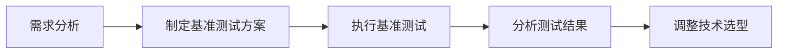

#### 可维护性评估

可维护性评估是评估技术方案在长期运行中是否易于维护和更新。以下是几个关键指标：

**可维护性评估指标：**

| 指标 | 描述 |  
| --- | --- |  
| 代码质量 | 描述代码的清晰度、可读性和可维护性 |  
| 文档完整性 | 描述技术文档的完整性、准确性和及时性 |  
| 社区活跃度 | 描述技术社区的用户活跃程度和问题解决能力 |

**可维护性评估方法：**

1. **代码审查**：通过审查代码，评估代码质量和可维护性。
2. **文档审查**：评估技术文档的完整性和准确性。
3. **社区调研**：通过调研技术社区，了解社区的活跃程度和问题解决能力。

**可维护性评估Mermaid流程图：**

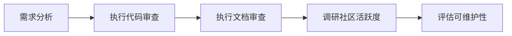

#### 成本评估

成本评估是技术选型中不可忽视的一环，它包括直接成本和间接成本。以下是几个关键指标：

**成本评估指标：**

| 指标 | 描述 |  
| --- | --- |  
| 软件成本 | 描述购买和使用软件的费用 |  
| 硬件成本 | 描述购买和部署硬件的费用 |  
| 运维成本 | 描述系统运行和管理的费用 |  
| 培训成本 | 描述培训和技能提升的费用 |

**成本评估方法：**

1. **成本计算**：根据技术方案的具体需求，计算各种成本。
2. **成本比较**：比较不同技术方案的成本，选择性价比最高的方案。
3. **成本优化**：通过优化技术方案，降低成本。

**成本评估Mermaid流程图：**


### 2.3 风险评估

#### 技术风险

技术风险是技术选型中潜在的问题，可能影响项目的成功。以下是一些常见的技术风险：

**技术风险评估指标：**

| 指标 | 描述 |  
| --- | --- |  
| 技术实现难度 | 描述技术方案实现所需的复杂度和难度 |  
| 技术更新换代 | 描述技术方案的稳定性和更新速度 |  
| 技术兼容性 | 描述技术方案与其他系统的兼容性 |

**技术风险评估方法：**

1. **专家评估**：通过技术专家的评估，了解技术方案的潜在问题。
2. **历史数据**：分析类似项目的历史数据，了解技术方案的实现情况。
3. **模拟测试**：通过模拟测试，评估技术方案的性能和稳定性。

**技术风险评估Mermaid流程图：**


#### 运维风险

运维风险是指系统在实际运行中可能遇到的问题，可能影响系统的稳定性和可用性。以下是一些常见的运维风险：

**运维风险评估指标：**

| 指标 | 描述 |  
| --- | --- |  
| 系统稳定性 | 描述系统在运行中的稳定性，如故障率等 |  
| 故障处理能力 | 描述系统在遇到故障时的处理能力 |  
| 响应速度 | 描述系统在遇到问题时的响应速度 |

**运维风险评估方法：**

1. **运维历史数据**：分析运维历史数据，了解系统的稳定性和故障处理能力。
2. **运维模拟测试**：通过模拟测试，评估系统的稳定性和故障处理能力。
3. **运维培训**：确保运维团队具备足够的运维技能。

**运维风险评估Mermaid流程图：**


#### 法律风险

法律风险是指技术选型可能涉及的法律法规问题，可能影响项目的合规性和可持续性。以下是一些常见的法律风险：

**法律风险评估指标：**

| 指标 | 描述 |  
| --- | --- |  
| 知识产权 | 描述技术方案是否侵犯他人知识产权 |  
| 合规性 | 描述技术方案是否符合相关法律法规 |  
| 法律纠纷 | 描述技术方案可能引发的潜在法律纠纷 |

**法律风险评估方法：**

1. **法律咨询**：通过专业法律咨询，了解相关法律法规。
2. **合同审查**：审查合同条款，确保项目的合法性和合规性。
3. **风险评估报告**：根据法律风险评估结果，制定相应的风险管理策略。

**法律风险评估Mermaid流程图：**


### 3.1 决策树基本概念

#### 决策节点

决策节点是技术选型过程中的关键决策点，它表示在某个阶段需要做出关键决策的选择。例如，在选择数据库时，可能需要决定是使用关系型数据库还是非关系型数据库。

**决策节点属性特征对比表格：**

| 属性特征 | 描述 |  
| --- | --- |  
| 决策类型 | 决策节点的类型，如功能决策、性能决策等 |  
| 决策条件 | 决策节点需要满足的条件，如性能需求、成本限制等 |  
| 决策结果 | 决策节点的可能结果，如选择A或选择B等 |  
| 决策权重 | 决策节点的重要程度，如50%或70%等 |

**决策节点Mermaid流程图：**

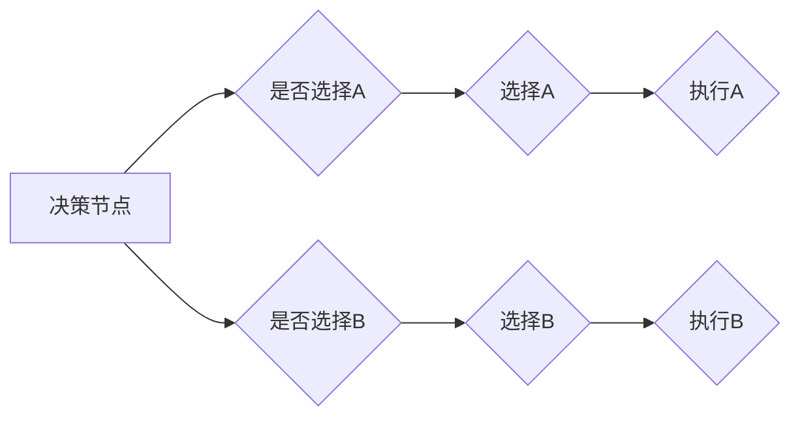

#### 技术节点

技术节点是决策树中的具体技术选项，它代表在决策节点下可供选择的技术方案。例如，在选择数据库时，技术节点可能包括MySQL、PostgreSQL、MongoDB等。

**技术节点属性特征对比表格：**

| 属性特征 | 描述 |  
| --- | --- |  
| 技术名称 | 技术节点的名称，如MySQL |  
| 技术特点 | 技术节点的特点，如性能好、易维护等 |  
| 成本 | 技术节点的成本，如软件购买费、硬件购买费等 |  
| 维护成本 | 技术节点的维护成本，如运维费用、培训费用等 |  
| 风险 | 技术节点的风险，如技术更新换代、法律合规性等 |

**技术节点Mermaid流程图：**

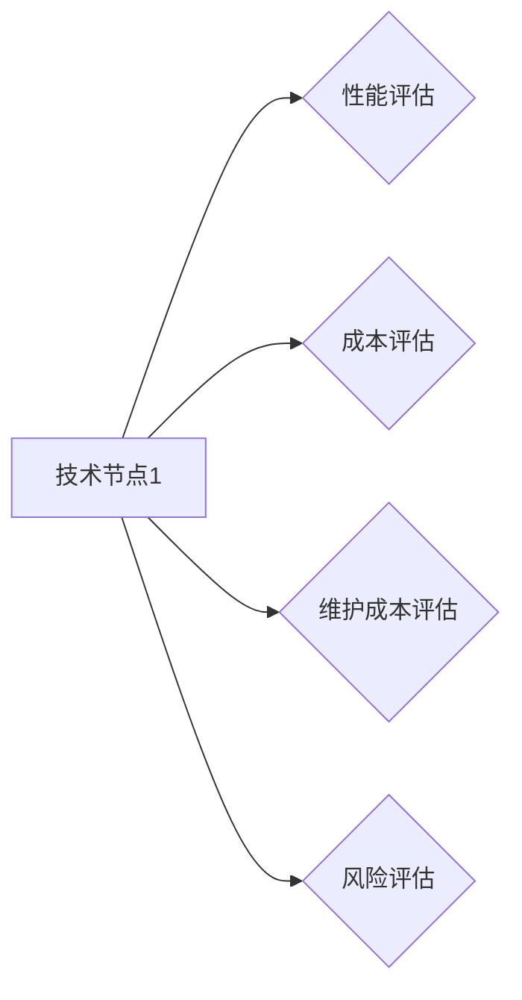

#### 评估节点

评估节点是对技术节点进行量化评估的部分，它表示对技术节点的性能、成本、可维护性等方面进行评估。评估结果将用于决策节点的决策过程中。

**评估节点属性特征对比表格：**

| 属性特征 | 描述 |  
| --- | --- |  
| 评估指标 | 评估节点的评估指标，如性能评估、成本评估等 |  
| 评估结果 | 评估节点的评估结果，如高、中、低等 |  
| 评估权重 | 评估节点的重要程度，如50%或70%等 |  
| 评估方法 | 评估节点的评估方法，如基准测试、成本计算等 |

**评估节点Mermaid流程图：**

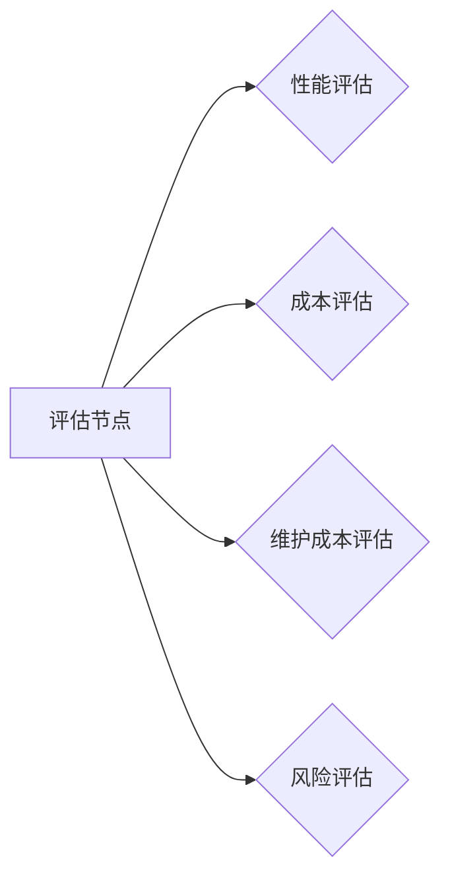

### 3.2 决策树构建步骤

#### 需求分析

需求分析是决策树构建的基础，它帮助确定项目的需求，明确后续技术评估的依据。需求分析包括用户需求、业务目标和技术需求等方面。

**需求分析步骤：**

1. **收集需求**：通过与用户、业务团队等各方沟通，收集项目的需求信息。
2. **分类需求**：将需求分为功能需求、性能需求、安全需求等。
3. **优先级排序**：根据业务目标和优先级，对需求进行排序。

**需求分析Mermaid流程图：**

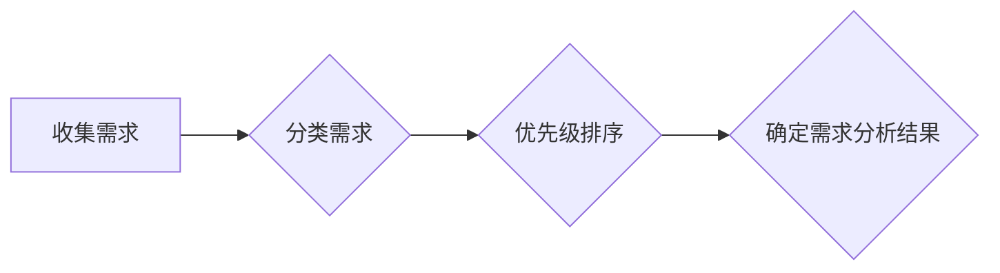

#### 技术评估

技术评估是对各个技术节点进行量化评估的过程，包括性能评估、成本评估和可维护性评估等方面。技术评估结果将用于决策节点的决策过程中。

**技术评估步骤：**

1. **定义评估指标**：根据需求分析结果，确定评估指标。
2. **收集数据**：通过性能测试、成本计算等方法，收集相关数据。
3. **量化评估**：对各个技术节点进行量化评估，得到评估结果。

**技术评估Mermaid流程图：**

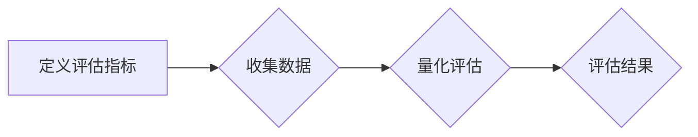

#### 决策路径分析

决策路径分析是根据技术评估结果，确定最优技术选型路径的过程。决策路径分析包括决策节点的选择、技术节点的选择等方面。

**决策路径分析步骤：**

1. **评估结果分析**：对技术评估结果进行分析，确定各个技术节点的优劣势。
2. **选择决策节点**：根据评估结果，选择最佳的决策节点。
3. **选择技术节点**：根据决策节点，选择最佳的技术节点。

**决策路径分析Mermaid流程图：**

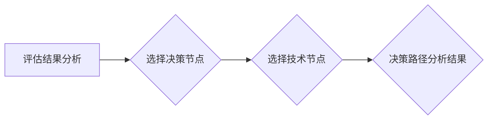

#### 决策树可视化

决策树可视化是将决策路径和分析结果以图形化方式呈现，使得决策过程更加直观易懂。决策树可视化可以通过各种图形化工具实现。

**决策树可视化Mermaid流程图：**

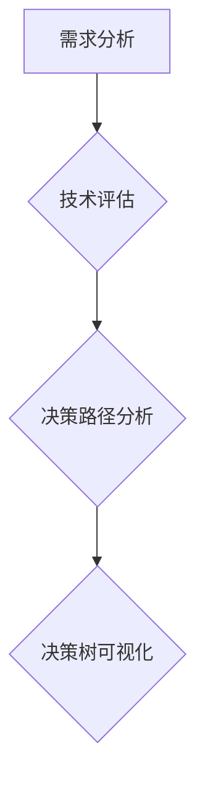

### 4.1 案例一：云计算平台选型

#### 4.1.1 案例背景

某公司计划构建一个云计算平台，以支持其业务的快速发展和扩展。该公司希望新平台能够提供高效、可靠、可扩展的云计算服务，以满足其业务需求。

**案例背景介绍：**

该公司在云计算领域的需求主要包括：

1. **海量数据处理**：公司需要处理大量的数据，要求平台能够高效地处理这些数据。
2. **高可用性**：平台需要保证高可用性，确保业务不会因为系统故障而中断。
3. **弹性扩展**：平台需要能够根据业务需求进行弹性扩展，以应对未来业务增长。
4. **安全性**：平台需要具备高级别的安全性，保护公司数据和客户数据的安全。

#### 4.1.2 需求分析

根据公司需求，团队进行了详细的需求分析，明确了云计算平台所需具备的功能和技术要求。

**需求分析结果：**

1. **功能需求**：
   - 数据存储和管理：平台需要提供高效、可靠的数据存储和管理功能。
   - 弹性计算：平台需要能够根据需求动态调整计算资源。
   - 高可用性：平台需要具备故障转移和负载均衡功能。
   - 自动化部署：平台需要支持自动化部署和运维。

2. **技术需求**：
   - **性能**：平台需要具备高性能，能够快速响应用户请求。
   - **可扩展性**：平台需要能够横向扩展，以支持业务增长。
   - **安全性**：平台需要提供高级别的安全保护措施。
   - **兼容性**：平台需要支持多种开发语言和框架。

#### 4.1.3 技术评估

在明确需求后，团队对几种主流的云计算平台进行了评估，包括AWS、Azure和Google Cloud。评估过程包括性能测试、成本分析和安全评估等。

**技术评估步骤：**

1. **性能评估**：通过基准测试和实际负载测试，评估平台的性能指标，如响应时间、吞吐量和并发处理能力等。
2. **成本评估**：根据公司需求，计算不同平台在硬件、软件和运维等方面的成本，并考虑长期成本效益。
3. **安全性评估**：评估平台的安全特性，包括数据加密、访问控制和合规性等。

**评估结果：**

1. **AWS**：
   - **性能**：响应时间较短，吞吐量高。
   - **成本**：成本较高，但有多个价格层次。
   - **安全性**：提供全面的安全措施，符合多种合规性要求。

2. **Azure**：
   - **性能**：响应时间适中，吞吐量较高。
   - **成本**：成本适中，有多种定价模型。
   - **安全性**：提供强大的安全功能，但部分合规性要求较弱。

3. **Google Cloud**：
   - **性能**：响应时间较长，但吞吐量较高。
   - **成本**：成本较低，但有较严格的合规性要求。
   - **安全性**：提供高级安全功能，但部分功能较新，稳定性有待验证。

#### 4.1.4 风险评估

在技术评估的基础上，团队对每个平台的风险进行了评估，包括技术风险、运维风险和法律风险。

**风险评估结果：**

1. **技术风险**：
   - **AWS**：技术成熟度高，但部分新功能稳定性有待验证。
   - **Azure**：技术成熟度较高，部分功能稳定性较好。
   - **Google Cloud**：技术成熟度较高，但有较严格的合规性要求。

2. **运维风险**：
   - **AWS**：运维工具丰富，但需要深入了解使用方法。
   - **Azure**：运维工具较为直观，但需要一定的培训。
   - **Google Cloud**：运维工具较为直观，但需要较长时间的熟悉。

3. **法律风险**：
   - **AWS**：合规性较好，但部分地区合规性较弱。
   - **Azure**：合规性较好，但部分地区合规性较弱。
   - **Google Cloud**：合规性较好，但有较严格的合规性要求。

#### 4.1.5 决策树构建

根据技术评估和风险评估的结果，团队构建了云计算平台选型的决策树，并选择了AWS作为最终方案。

**决策树构建过程：**

1. **需求分析**：明确公司需求，确定云计算平台的功能和技术要求。
2. **技术评估**：对AWS、Azure和Google Cloud进行性能、成本和安全性等方面的评估。
3. **风险评估**：评估每个平台的技术、运维和法律风险。
4. **决策路径分析**：根据评估结果，选择最优的决策路径，确定AWS为最终方案。
5. **决策树可视化**：将决策路径和分析结果以图形化方式呈现，便于理解和传达。

**决策树可视化Mermaid流程图：**

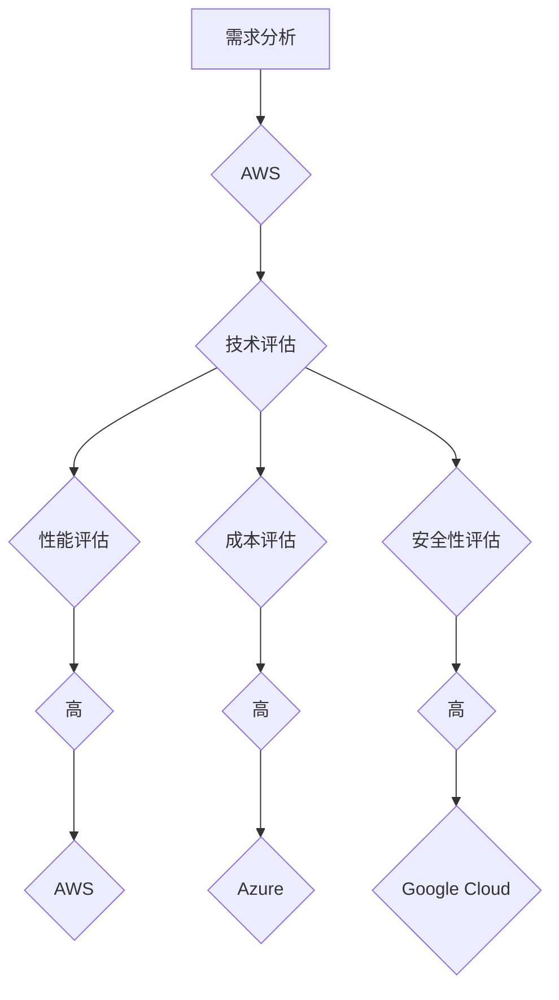

### 4.2 案例二：大数据技术选型

#### 4.2.1 案例背景

某互联网公司计划构建一个大数据平台，以处理和分析海量用户数据，提高业务决策的准确性和效率。公司希望在数据处理速度、存储容量和成本控制方面实现优化。

**案例背景介绍：**

该公司在大数据领域的需求主要包括：

1. **数据处理速度**：要求平台能够快速处理海量数据，提高业务响应速度。
2. **存储容量**：平台需要具备足够的存储容量，以存储大量数据。
3. **成本控制**：平台需要控制总体成本，提高投资回报率。
4. **可扩展性**：平台需要能够根据业务需求进行弹性扩展。

#### 4.2.2 需求分析

根据公司需求，团队进行了详细的需求分析，明确了大数据平台所需具备的功能和技术要求。

**需求分析结果：**

1. **功能需求**：
   - **数据处理**：平台需要支持高效的数据处理，包括数据采集、存储、处理和分析等。
   - **数据存储**：平台需要支持海量数据的存储，并提供数据备份和恢复功能。
   - **数据安全**：平台需要提供数据加密、访问控制和权限管理等功能。
   - **可扩展性**：平台需要支持横向和纵向扩展，以适应业务增长。

2. **技术需求**：
   - **性能**：平台需要具备高性能，能够快速响应数据处理需求。
   - **可扩展性**：平台需要能够横向扩展，以支持大数据量的存储和处理。
   - **安全性**：平台需要提供高级别的数据保护措施。
   - **兼容性**：平台需要支持多种数据格式和工具。

#### 4.2.3 技术评估

在明确需求后，团队对几种主流的大数据技术进行了评估，包括Apache Hadoop、Apache Spark和Apache Flink。评估过程包括性能测试、成本分析和安全性评估等。

**技术评估步骤：**

1. **性能评估**：通过基准测试和实际负载测试，评估不同技术的数据处理速度、存储容量和并发处理能力等。
2. **成本评估**：根据公司需求，计算不同技术在硬件、软件和运维等方面的成本，并考虑长期成本效益。
3. **安全性评估**：评估不同技术提供的数据加密、访问控制和合规性等安全特性。

**评估结果：**

1. **Apache Hadoop**：
   - **性能**：数据处理速度快，存储容量大。
   - **成本**：硬件成本较高，但软件开源，成本低。
   - **安全性**：提供基本的数据加密和访问控制功能。

2. **Apache Spark**：
   - **性能**：数据处理速度快，支持内存计算。
   - **成本**：硬件成本较高，但提供高效的分布式计算框架。
   - **安全性**：提供高级别的数据保护和访问控制。

3. **Apache Flink**：
   - **性能**：数据处理速度快，支持流处理和批处理。
   - **成本**：硬件成本适中，但软件和运维成本较高。
   - **安全性**：提供全面的数据加密和安全功能。

#### 4.2.4 风险评估

在技术评估的基础上，团队对每个技术平台的风险进行了评估，包括技术风险、运维风险和法律风险。

**风险评估结果：**

1. **技术风险**：
   - **Apache Hadoop**：技术成熟度高，但部分功能需额外配置。
   - **Apache Spark**：技术成熟度高，但内存计算对硬件要求较高。
   - **Apache Flink**：技术成熟度高，但流处理功能较为复杂。

2. **运维风险**：
   - **Apache Hadoop**：运维工具较多，需要专业运维团队。
   - **Apache Spark**：运维工具较为直观，但需要一定的培训。
   - **Apache Flink**：运维工具较为直观，但需要较长时间的熟悉。

3. **法律风险**：
   - **Apache Hadoop**：开源软件，法律风险较低。
   - **Apache Spark**：开源软件，法律风险较低。
   - **Apache Flink**：开源软件，法律风险较低。

#### 4.2.5 决策树构建

根据技术评估和风险评估的结果，团队构建了大数据技术选型的决策树，并选择了Apache Spark作为最终方案。

**决策树构建过程：**

1. **需求分析**：明确公司需求，确定大数据平台的功能和技术要求。
2. **技术评估**：对Apache Hadoop、Apache Spark和Apache Flink进行性能、成本和安全性等方面的评估。
3. **风险评估**：评估每个技术平台的技术、运维和法律风险。
4. **决策路径分析**：根据评估结果，选择最优的决策路径，确定Apache Spark为最终方案。
5. **决策树可视化**：将决策路径和分析结果以图形化方式呈现，便于理解和传达。

**决策树可视化Mermaid流程图：**

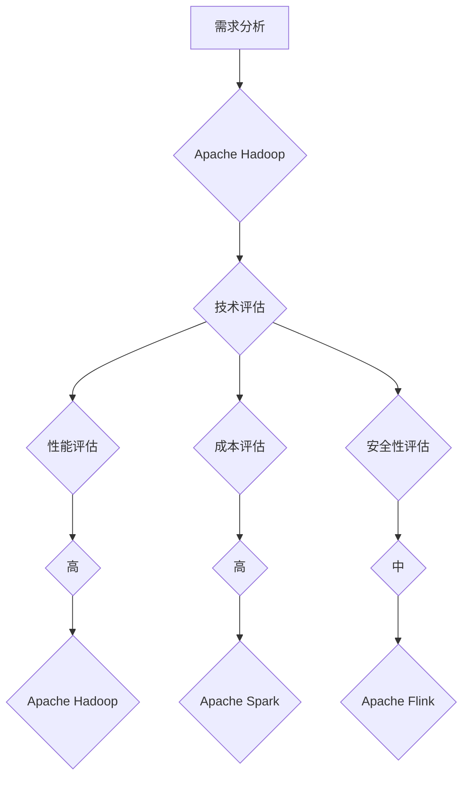

### 5.1 制定技术选型策略

#### 5.1.1 短期与长期策略

在制定技术选型策略时，需要考虑短期和长期的目标，以满足不同阶段的需求。

**短期策略**：

1. **快速上线**：选择成熟度高、易于实施的技术，以加快项目上线速度。
2. **临时性需求**：针对短期内出现的需求，选择能够快速满足需求的技术方案。
3. **成本控制**：在短期内，优先考虑成本较低的技术方案，以减少项目成本。

**长期策略**：

1. **可扩展性**：选择具备高可扩展性的技术，以适应未来业务增长。
2. **技术成熟度**：优先选择技术成熟度高、稳定性好的技术，降低长期维护风险。
3. **成本效益**：在长期内，考虑技术方案的整体成本效益，选择具有竞争力的技术。

**短期与长期策略的权衡**：

1. **平衡短期与长期需求**：在技术选型时，既要满足短期需求，又要考虑长期发展。
2. **动态调整策略**：根据项目进展和业务变化，动态调整技术选型策略。

#### 5.1.2 集中式与分布式策略

在技术选型中，集中式与分布式策略的选择取决于项目的规模、性能需求和成本考虑。

**集中式策略**：

1. **优点**：
   - **简化管理**：集中式架构简化了系统管理，降低运维复杂度。
   - **高性能**：集中式架构通常能够提供更高的性能。
   - **成本较低**：集中式架构的硬件和软件成本较低。

2. **缺点**：
   - **扩展性差**：集中式架构在处理大量数据时，扩展性较差。
   - **可靠性低**：单点故障可能导致整个系统瘫痪。

**分布式策略**：

1. **优点**：
   - **高扩展性**：分布式架构能够水平扩展，以适应大量数据和高并发需求。
   - **高可靠性**：分布式架构通过多节点部署，提高了系统的可靠性。
   - **灵活性高**：分布式架构能够支持多样化的数据处理需求。

2. **缺点**：
   - **管理复杂**：分布式架构的管理相对复杂，需要更多的运维资源和技能。
   - **性能瓶颈**：分布式架构可能存在网络延迟和数据一致性等问题。

**集中式与分布式策略的权衡**：

1. **根据需求选择**：根据项目的具体需求和性能要求，选择合适的策略。
2. **混合策略**：在某些场景下，可以采用混合策略，结合集中式和分布式架构的优势。

### 5.2 技术选型团队建设

#### 5.2.1 团队成员角色

在技术选型过程中，团队成员的角色和职责至关重要。以下是一些常见的团队成员及其职责：

1. **项目经理**：负责项目整体规划和进度控制，确保技术选型与项目目标一致。
2. **需求分析师**：负责收集和分析用户需求，确保技术选型满足业务需求。
3. **技术专家**：负责技术评估和风险评估，提供技术选型建议。
4. **运维工程师**：负责评估技术的运维难度和成本，确保技术方案的可实施性。
5. **法律顾问**：负责评估技术选型的法律风险，确保合规性。

#### 5.2.2 技能要求

团队成员需要具备以下技能：

1. **技术知识**：了解各种技术的原理、特性和应用场景。
2. **分析能力**：能够进行需求分析和风险评估，识别潜在问题。
3. **沟通能力**：能够与各方有效沟通，确保信息畅通。
4. **项目管理能力**：能够合理规划项目进度，确保技术选型按时完成。

#### 5.2.3 人才培养

1. **培训计划**：定期组织技术培训，提升团队成员的技术水平和项目管理能力。
2. **经验分享**：鼓励团队成员分享经验，共同学习和进步。
3. **知识管理**：建立知识库，记录技术选型的过程和方法，为后续项目提供参考。

### 5.3 技术选型流程优化

#### 5.3.1 流程标准化

为了提高技术选型的效率和效果，需要制定标准化的流程。以下是一个典型技术选型流程：

1. **需求分析**：明确项目需求，制定技术选型计划。
2. **技术评估**：对各种技术方案进行性能、成本、可维护性等方面评估。
3. **风险评估**：评估技术选型的风险，制定相应的风险应对策略。
4. **决策路径分析**：根据评估结果，确定最优技术选型路径。
5. **决策树构建**：构建决策树，可视化技术选型过程。
6. **决策**：根据决策树结果，确定最终技术选型方案。
7. **实施**：根据技术方案，进行项目实施和部署。
8. **监控与反馈**：对技术选型结果进行监控和评估，收集反馈，优化流程。

#### 5.3.2 沟通协作机制

1. **定期会议**：定期召开技术选型会议，确保团队成员之间的沟通和协作。
2. **信息共享**：建立信息共享平台，确保团队成员能够及时获取相关数据和信息。
3. **责任分配**：明确团队成员的责任和任务，确保技术选型流程的顺利进行。

#### 5.3.3 反馈与迭代

1. **收集反馈**：在技术选型过程中，收集团队成员和业务团队的反馈。
2. **问题分析**：对反馈中提出的问题进行分析，确定改进方向。
3. **流程优化**：根据问题分析结果，对技术选型流程进行优化和迭代，提高效率和质量。

### 6.1 自动化与智能化

#### 6.1.1 AI在技术选型中的应用

随着人工智能技术的发展，AI在技术选型中的应用越来越广泛。以下是一些应用场景：

1. **智能推荐**：利用机器学习算法，根据历史数据和用户需求，智能推荐最适合的技术方案。
2. **自动化评估**：利用AI技术，自动化进行性能、成本、可维护性等评估，提高评估效率和准确性。
3. **智能决策**：结合大数据分析和机器学习算法，为技术选型提供智能化的决策支持。

#### 6.1.2 自动化决策支持系统

自动化决策支持系统（ADSS）是利用人工智能技术，构建自动化辅助决策的系统。以下是一些关键功能：

1. **数据采集与处理**：自动化收集和分析各种数据，为技术选型提供基础信息。
2. **模型训练与优化**：利用机器学习算法，训练模型，优化评估指标。
3. **智能推荐**：基于评估结果，智能推荐最优技术方案。
4. **决策支持**：为技术选型团队提供智能化的决策建议，辅助决策。

### 6.2 开源与生态

#### 6.2.1 开源技术的影响

开源技术的发展对技术选型产生了深远的影响。以下是一些影响：

1. **技术选择多样性**：开源技术提供了丰富的技术选择，有助于满足不同需求。
2. **成本降低**：开源技术通常免费使用，降低了项目成本。
3. **社区支持**：开源技术拥有庞大的社区支持，提供技术文档、论坛和GitHub等资源。
4. **快速迭代**：开源项目通常更新迅速，能够更快地跟进技术趋势。

#### 6.2.2 技术选型与开源生态的关系

技术选型与开源生态密切相关。以下是一些关系：

1. **技术选型依据**：开源生态提供了丰富的技术参考，有助于制定技术选型策略。
2. **社区影响力**：开源生态的社区影响力，直接影响技术选型的决策。
3. **技术成熟度**：开源生态的发展，有助于评估技术方案的技术成熟度。
4. **创新推动**：开源生态的创新，为技术选型提供了新的思路和方向。

### 6.3 云原生与边缘计算

#### 6.3.1 云原生技术的发展

云原生技术的发展为技术选型带来了新的机会和挑战。以下是一些关键点：

1. **容器化**：容器化技术（如Docker）使应用更加轻量级、可移植和易于管理。
2. **微服务架构**：微服务架构使应用更加模块化、可扩展和易于维护。
3. **自动化部署**：自动化部署工具（如Kubernetes）提高了应用的部署和运维效率。

#### 6.3.2 边缘计算对技术选型的影响

边缘计算技术的发展，对技术选型提出了新的要求。以下是一些影响：

1. **实时数据处理**：边缘计算能够将数据处理推向网络边缘，提高实时数据处理能力。
2. **低延迟应用**：边缘计算有助于降低数据传输延迟，提高用户体验。
3. **分布式架构**：边缘计算推动了分布式架构的发展，要求技术选型更加灵活和可扩展。

### 7.1 技术选型的核心要素

#### 7.1.1 需求分析

需求分析是技术选型的起点，是确保技术选型与业务需求一致的关键。以下是一些关键步骤：

1. **收集需求**：通过与用户、业务团队等多方面沟通，收集详细的需求。
2. **分类需求**：将需求分为功能需求、性能需求、安全需求等。
3. **优先级排序**：根据业务目标和优先级，对需求进行排序。

#### 7.1.2 技术评估

技术评估是技术选型的核心环节，通过量化评估，为技术选型提供数据支持。以下是一些关键步骤：

1. **定义评估指标**：根据需求分析结果，确定评估指标。
2. **收集数据**：通过性能测试、成本计算等方法，收集相关数据。
3. **量化评估**：使用评分、打分等方法，对技术进行量化评估。

#### 7.1.3 风险评估

风险评估是技术选型的必要步骤，通过识别和评估潜在风险，降低技术选型的风险。以下是一些关键步骤：

1. **识别风险**：通过访谈、文档分析等手段，识别潜在风险。
2. **评估影响**：对风险的可能影响进行评估。
3. **制定风险应对策略**：针对识别的风险，制定相应的应对策略。

### 7.2 技术选型的未来方向

#### 7.2.1 技术趋势

技术选型的未来方向将受到以下技术趋势的影响：

1. **云计算与边缘计算**：云计算和边缘计算的结合，将推动分布式架构的发展。
2. **人工智能与自动化**：人工智能和自动化技术将在技术选型中发挥更大作用。
3. **开源生态**：开源技术的持续发展，将为技术选型提供更多选择。

#### 7.2.2 技术选型的创新

技术选型的未来将充满创新：

1. **智能化决策支持**：利用人工智能技术，实现智能化决策支持系统。
2. **定制化选型方法**：根据不同行业和企业的需求，制定定制化的技术选型方法。
3. **跨界融合**：跨行业、跨领域的融合，将带来新的技术选型思路。

### 7.3 技术选型在企业中的应用价值

#### 7.3.1 提高项目成功率

科学的技术选型，可以显著提高项目成功率。以下是一些关键点：

1. **满足需求**：通过需求分析，确保技术选型与业务需求一致。
2. **量化评估**：通过技术评估，选择性能优异、成本合理的技术方案。
3. **风险评估**：通过风险评估，识别和应对潜在风险，降低项目失败的可能性。

#### 7.3.2 降低技术风险

技术选型可以帮助企业降低技术风险。以下是一些关键点：

1. **技术成熟度**：选择技术成熟度高的技术，降低技术实现难度。
2. **社区支持**：选择拥有强大社区支持的技术，降低运维和升级风险。
3. **持续评估**：通过持续的技术评估，及时调整技术方案，以适应技术发展趋势。

#### 7.3.3 提升企业竞争力

技术选型是企业提升竞争力的重要手段。以下是一些关键点：

1. **技术领先**：通过选择先进的技术，保持技术领先地位。
2. **创新应用**：通过创新应用，提高业务效率和用户体验。
3. **灵活应变**：通过灵活的技术选型，快速应对市场变化和业务需求。

### 作者

**作者：AI天才研究院/AI Genius Institute & 禅与计算机程序设计艺术 /Zen And The Art of Computer Programming** 

### 完整性要求

为确保文章的完整性，以下是每个章节的具体要求和核心内容：

#### 第1章：技术选型的重要性

- **核心概念术语说明**：解释技术选型、决策树、量化评估、可视化等核心术语。
- **问题背景**：分析技术选型的背景，如技术快速发展、项目需求多样等。
- **问题描述**：阐述技术选型中的主要挑战和问题。
- **问题解决**：提出系统化、量化评估和可视化等解决方案。
- **边界与外延**：明确技术选型的范围和限制条件。
- **概念结构与核心要素组成**：详细描述技术选型的结构，如需求分析、技术评估、风险评估等。

#### 第2章：技术选型方法论

- **核心概念与联系**：介绍需求分析、技术评估、风险评估等概念，并展示它们之间的联系。
- **概念属性特征对比表格**：提供需求分析、技术评估、风险评估等方面的属性特征对比。
- **ER实体关系图架构**：绘制需求分析、业务目标和技术需求等ER图，展示实体之间的关系。
- **算法原理讲解**：详细解释需求分析、技术评估和风险评估的算法原理。
- **数学公式使用**：使用LaTeX格式嵌入相关的数学公式，如性能评估公式、成本计算公式等。

#### 第3章：技术选型决策树构建

- **系统分析与架构设计方案**：介绍决策树的基本概念和构建步骤。
- **系统功能设计**：展示决策树中的决策节点、技术节点和评估节点的具体设计。
- **系统架构设计**：绘制决策树的可视化架构图，展示决策路径和分析结果。
- **系统接口设计和系统交互**：解释决策树在技术选型中的应用，展示接口设计和系统交互。
- **Mermaid流程图**：使用Mermaid绘制决策树的构建流程图，详细展示技术选型过程。

#### 第4章：案例研究

- **项目实战**：分析云计算平台选型和大数据技术选型的实际案例。
- **环境安装**：介绍实际案例中的环境安装步骤。
- **系统核心实现源代码**：提供实际案例中的核心实现代码，并进行分析解读。
- **代码应用解读与分析**：详细讲解代码的应用场景和实现原理。
- **实际案例分析和详细讲解剖析**：对实际案例进行深入分析，剖析其中的关键点和难点。
- **项目小结**：总结实际案例中的经验和教训，为后续项目提供参考。

#### 第5章：技术选型最佳实践

- **最佳实践 tips**：提供技术选型中的最佳实践建议，如需求分析技巧、评估方法等。
- **小结**：总结技术选型中的重要点和注意事项。
- **注意事项**：强调在技术选型过程中需要注意的关键因素。
- **拓展阅读**：推荐相关的书籍、文章和资料，供读者进一步学习。

#### 第6章：技术选型的未来趋势

- **未来趋势分析**：探讨技术选型的未来发展方向，如自动化与智能化、开源与生态等。
- **趋势影响**：分析不同趋势对技术选型的影响。
- **创新应用**：介绍新兴技术在技术选型中的应用场景。

#### 第7章：技术选型总结与展望

- **技术选型核心要素**：总结技术选型的核心要素，如需求分析、技术评估和风险评估等。
- **未来方向**：展望技术选型的未来发展方向。
- **应用价值**：阐述技术选型在企业中的应用价值，如提高项目成功率、降低技术风险等。

### 综合总结

文章通过详细的章节内容和丰富的实际案例，系统地介绍了技术选型决策树的方法论，以及其在云计算平台选型和大数据技术选型中的应用。同时，文章还探讨了技术选型的未来趋势，提供了最佳实践和拓展阅读建议，旨在为读者提供全面的技术选型指导。通过文章的完整性和深入分析，读者可以更好地理解和应用技术选型决策树，提升项目的成功率和企业的竞争力。

