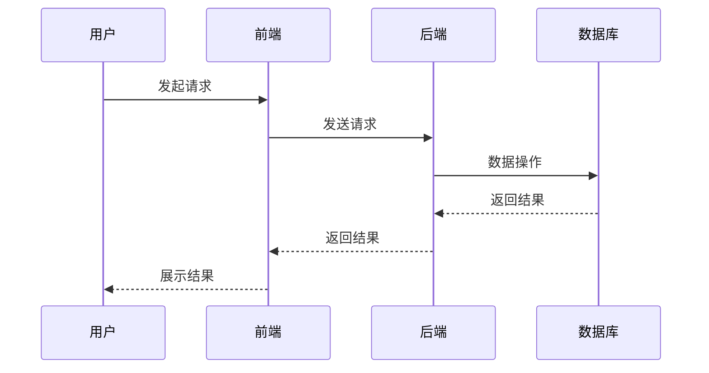
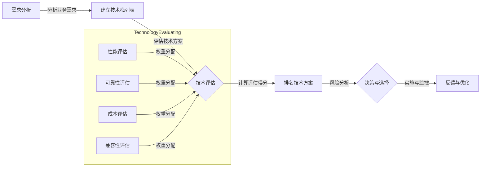
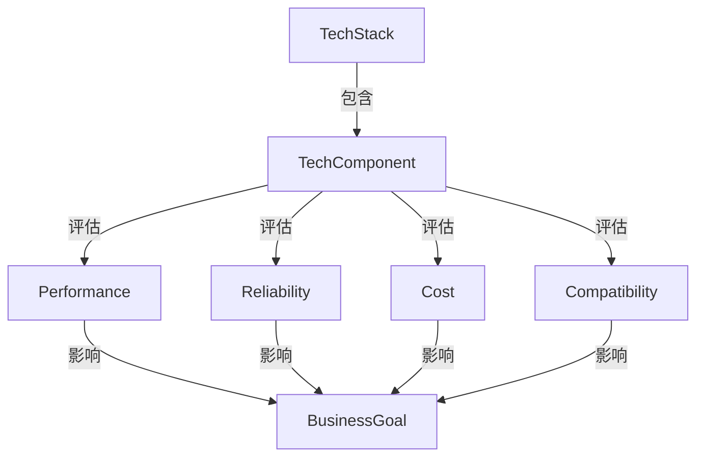
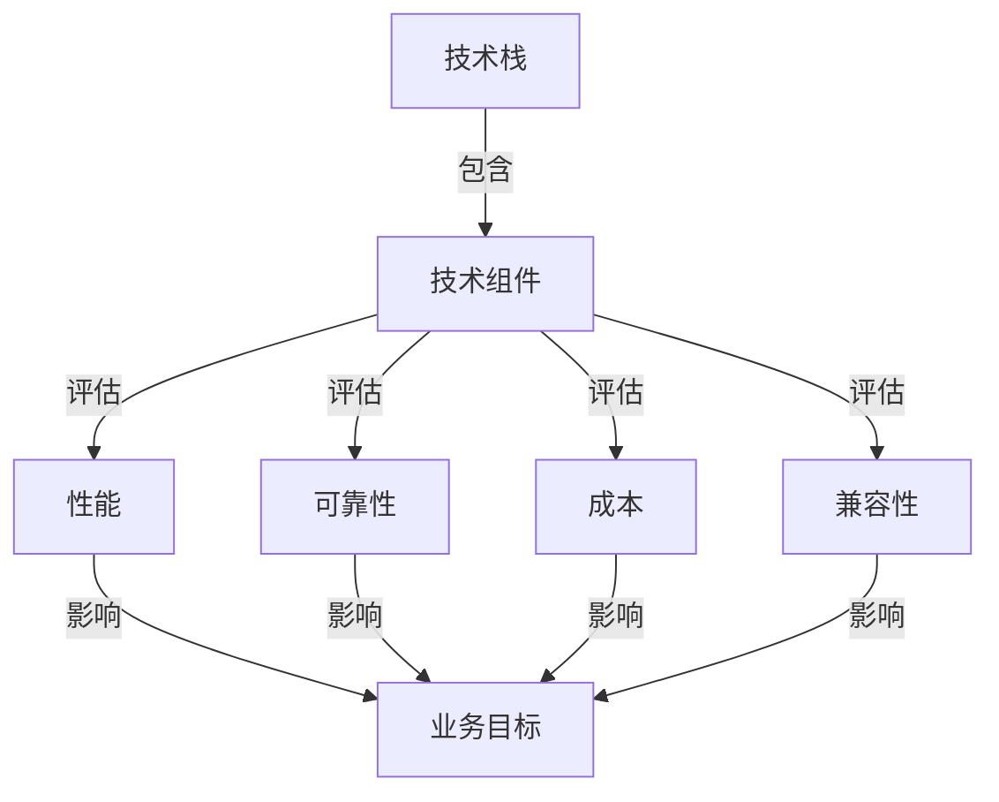
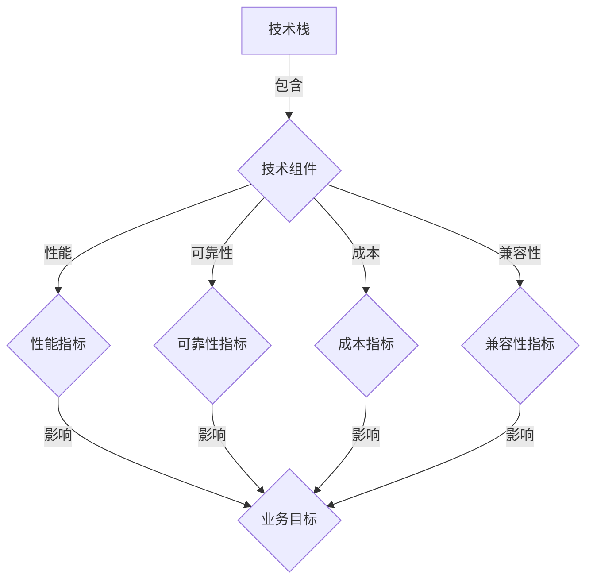
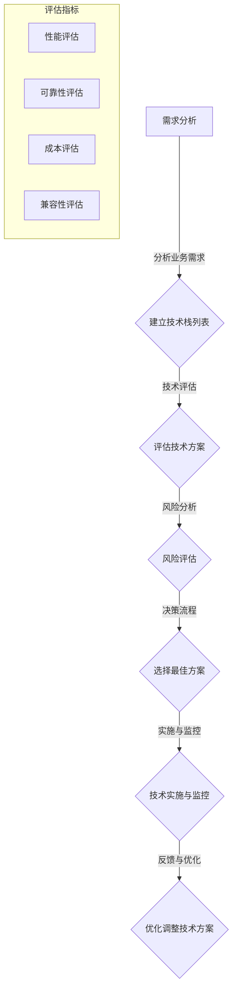

                 

# 技术选型决策框架：评估和选择技术栈

关键词：技术选型、决策框架、技术栈、评估指标、算法原理

摘要：本文将探讨技术选型决策在企业数字化转型中的关键作用，并详细阐述技术选型决策框架的构建过程。通过分析技术栈、技术评估指标和技术选型流程，本文将提供一套系统化的技术选型方法论，帮助企业做出科学、明智的技术选择。

## 第一部分：问题背景

### 问题描述

在当前信息技术飞速发展的时代，技术选型决策在企业数字化转型过程中起着至关重要的作用。随着人工智能、大数据、云计算等新兴技术的不断涌现，企业需要在众多技术方案中做出明智的选择。技术选型不仅影响到企业的运营效率，还直接关系到其市场竞争力。然而，技术选型的过程复杂且具有不确定性，涉及多个技术领域、业务需求和资源限制，这使得决策者面临巨大的挑战。

### 问题解决

为了解决上述问题，我们需要建立一个全面的技术选型决策框架。该框架将有助于企业系统地评估和选择合适的技术栈，从而实现业务目标。技术选型决策框架应包含以下几个关键要素：

1. **需求分析**：明确企业的业务需求和目标，分析技术解决方案如何满足这些需求。
2. **技术评估**：评估不同技术方案的性能、可靠性、成本、兼容性等因素。
3. **风险评估**：识别技术选型过程中可能面临的风险，并制定相应的应对策略。
4. **决策流程**：设计合理的决策流程，确保技术选型决策的透明性和科学性。
5. **实施与监控**：确保技术方案的顺利实施，并对实施效果进行持续监控。

### 边界与外延

技术选型决策框架的应用范围广泛，包括但不限于以下场景：

- **企业级应用**：涉及企业内部管理系统、客户关系管理、供应链管理等领域的应用。
- **行业解决方案**：针对特定行业（如金融、医疗、教育等）的技术选型决策。
- **新兴技术探索**：对人工智能、区块链等新兴技术的应用场景和选型策略进行探讨。

## 第二部分：核心概念

### 2.1 技术栈（Tech Stack）

**定义**：技术栈是指一个项目或组织中使用的所有技术的集合，包括编程语言、框架、数据库、中间件、硬件等。

**属性特征对比表格**：

| 技术类型       | 属性特征                | 对比示例                                 |
|----------------|------------------------|------------------------------------------|
| 编程语言       | 语法、适用场景、性能   | Java、Python、JavaScript                 |
| 数据库         | 存储方式、查询效率、规模 | MySQL、MongoDB、Oracle                   |
| 中间件         | 功能、性能、兼容性     | Redis、Kafka、RabbitMQ                   |
| 硬件           | 性能、可靠性、成本     | CPU、GPU、SSD、HDD                      |

### 2.2 技术评估指标

**定义**：技术评估指标是用于衡量和比较不同技术方案优劣的量化标准。

**属性特征对比表格**：

| 指标名称       | 属性特征               | 对比示例                                 |
|----------------|------------------------|------------------------------------------|
| 性能           | 运行速度、处理能力     | 响应时间、吞吐量                         |
| 可靠性         | 稳定性、故障率         | 年平均无故障时间（MTBF）、故障恢复时间   |
| 成本           | 投资成本、运营成本     | 软件许可证费、硬件成本、人力资源成本     |
| 兼容性         | 支持平台、集成能力     | 操作系统兼容性、与其他系统的互操作性     |

### 2.3 技术选型流程

**定义**：技术选型流程是指从需求分析到最终决策的全过程，确保技术选型决策的规范化和科学化。

**ER实体关系图架构**：

```mermaid
erDiagram
  Product -->|uses| Technology
  Technology ||--|uses|-- Feature
  Feature ||--|satisfies|-- Requirement
  Requirement ||--|owned by|-- Project
```

## 第三部分：算法原理讲解

### 3.1 技术评估算法

技术评估算法是技术选型决策框架的核心组成部分。该算法旨在通过量化分析，评估不同技术方案的优劣，为决策者提供科学依据。以下是一个简单但实用的技术评估算法。

**算法原理**：

1. **建立评估指标体系**：首先，我们需要根据业务需求和场景，建立一套完整的评估指标体系。这些指标包括但不限于性能、可靠性、成本、兼容性等。

2. **指标权重分配**：根据每个指标的相对重要性，为各个指标分配权重。权重分配可以通过专家评分、历史数据分析等方法进行。

3. **评分标准制定**：为每个指标制定评分标准。评分标准可以是0-100分制的量化标准，也可以是定性描述。

4. **数据收集与处理**：收集各个技术方案在各个指标上的实际表现数据，并进行预处理，如数据清洗、归一化等。

5. **评分计算**：根据评分标准和权重，计算每个技术方案的总评分。评分计算公式如下：

   $$ \text{总评分} = \sum_{i=1}^{n} w_i \cdot s_i $$

   其中，$w_i$为第$i$个指标的权重，$s_i$为第$i$个指标上的得分。

6. **结果分析**：根据总评分，对所有技术方案进行排序，得分最高的技术方案即为最佳选择。

**算法示例**：

假设我们有三个技术方案A、B、C，需要根据性能、可靠性、成本三个指标进行评估。我们设定以下权重和评分标准：

| 指标名称 | 权重 | 评分标准 |
|-----------|------|----------|
| 性能      | 0.4  | 响应时间（ms） |
| 可靠性    | 0.3  | MTBF（小时） |
| 成本      | 0.3  | 运营成本（万元/年） |

三个技术方案在各个指标上的得分如下表：

| 技术方案 | 性能 | 可靠性 | 成本 |
|-----------|------|---------|------|
| A         | 90   | 85      | 95   |
| B         | 85   | 90      | 80   |
| C         | 95   | 80      | 85   |

根据评分计算公式，我们可以计算出每个技术方案的总评分：

$$
\text{A的总评分} = 0.4 \cdot 90 + 0.3 \cdot 85 + 0.3 \cdot 95 = 36.0 + 25.5 + 28.5 = 90.0 \\
\text{B的总评分} = 0.4 \cdot 85 + 0.3 \cdot 90 + 0.3 \cdot 80 = 34.0 + 27.0 + 24.0 = 85.0 \\
\text{C的总评分} = 0.4 \cdot 95 + 0.3 \cdot 80 + 0.3 \cdot 85 = 38.0 + 24.0 + 25.5 = 87.5
$$

根据计算结果，技术方案A的总评分最高，因此我们选择技术方案A作为最佳技术方案。

### 3.2 技术风险评估算法

技术风险评估是技术选型决策过程中至关重要的一环。以下是一个简单但实用的技术风险评估算法。

**算法原理**：

1. **风险识别**：首先，我们需要识别技术选型过程中可能面临的风险。这些风险可能包括技术风险、市场风险、法律风险等。

2. **风险分析**：对识别出的风险进行详细分析，评估其发生概率和潜在影响。

3. **风险评分**：根据风险的发生概率和潜在影响，为每个风险分配评分。评分可以采用0-10分的量化标准。

4. **风险计算**：计算每个技术方案的总风险得分。风险计算公式如下：

   $$ \text{总风险得分} = \sum_{i=1}^{m} p_i \cdot i $$

   其中，$p_i$为第$i$个风险的发生概率，$i$为第$i$个风险的评分。

5. **结果分析**：根据总风险得分，对所有技术方案进行排序，得分最高的技术方案可能面临更高的风险。

**算法示例**：

假设我们有三个技术方案A、B、C，需要根据技术风险进行评估。我们识别出以下三个主要风险：

| 风险名称 | 发生概率 | 评分 |
|-----------|----------|------|
| 技术风险  | 0.6      | 8    |
| 市场风险  | 0.3      | 5    |
| 法律风险  | 0.1      | 3    |

三个技术方案在各个风险上的评分如下：

| 技术方案 | 技术风险 | 市场风险 | 法律风险 |
|-----------|----------|----------|----------|
| A         | 7        | 6        | 4        |
| B         | 6        | 5        | 3        |
| C         | 5        | 4        | 2        |

根据风险计算公式，我们可以计算出每个技术方案的总风险得分：

$$
\text{A的总风险得分} = 0.6 \cdot 8 + 0.3 \cdot 5 + 0.1 \cdot 3 = 4.8 + 1.5 + 0.3 = 6.6 \\
\text{B的总风险得分} = 0.6 \cdot 6 + 0.3 \cdot 5 + 0.1 \cdot 3 = 3.6 + 1.5 + 0.3 = 5.4 \\
\text{C的总风险得分} = 0.6 \cdot 5 + 0.3 \cdot 4 + 0.1 \cdot 2 = 3.0 + 1.2 + 0.2 = 4.4
$$

根据计算结果，技术方案A的总风险得分最高，因此我们可能需要对此方案进行进一步的审查和风险控制。

## 第四部分：系统分析与架构设计方案

### 4.1 问题场景介绍

假设某电子商务公司需要开发一套全新的订单管理系统，以支持高并发、大数据量的订单处理。该系统需要实现订单的创建、查询、修改和删除等功能，并要求具有高可用性、高可靠性和良好的扩展性。

### 4.2 项目介绍

项目名称：电子商务订单管理系统（E-commerce Order Management System，简称EOMS）

项目目标：开发一套高性能、高可用、高可靠、易扩展的订单管理系统，以满足公司业务需求。

项目范围：订单的创建、查询、修改和删除功能，数据库设计，系统接口设计，系统部署与监控。

项目团队：项目经理、系统架构师、后端开发人员、前端开发人员、数据库管理员、运维工程师。

### 4.3 系统功能设计

系统功能主要包括：

1. **订单创建**：用户可以在前端界面创建订单，订单信息包括商品名称、数量、价格等。
2. **订单查询**：用户可以查询订单详情，包括订单状态、商品信息、总价等。
3. **订单修改**：用户可以对订单进行修改，如更改商品数量、价格等。
4. **订单删除**：用户可以删除订单。
5. **订单统计**：系统可以生成订单统计报表，包括订单总量、销售额、客户分布等。

### 4.4 系统架构设计

系统架构采用分层设计，包括表示层、业务逻辑层和数据访问层。

#### 4.4.1 表示层

表示层主要负责用户界面的展示和用户交互。技术栈选择如下：

- **前端框架**：React.js
- **UI框架**：Ant Design
- **前端构建工具**：Webpack
- **静态资源管理**：Nginx

#### 4.4.2 业务逻辑层

业务逻辑层负责处理订单相关的业务逻辑。技术栈选择如下：

- **后端框架**：Spring Boot
- **服务框架**：Dubbo
- **数据访问框架**：MyBatis
- **消息队列**：Kafka

#### 4.4.3 数据访问层

数据访问层负责与数据库进行数据交互。技术栈选择如下：

- **数据库**：MySQL
- **分库分表**：ShardingSphere
- **缓存**：Redis

### 4.5 系统接口设计

系统接口设计包括RESTful API设计，以下是主要接口示例：

1. **创建订单**：`POST /orders`
2. **查询订单**：`GET /orders/{orderId}`
3. **修改订单**：`PUT /orders/{orderId}`
4. **删除订单**：`DELETE /orders/{orderId}`
5. **订单统计**：`GET /orders/statistics`

### 4.6 系统交互

系统交互包括前端与后端的通信，以及后端与数据库的通信。以下是系统交互的Mermaid序列图：



## 第五部分：项目实战

### 5.1 环境安装

在开始项目开发之前，我们需要搭建一个合适的环境。以下是环境搭建的步骤：

1. **安装Java开发工具包（JDK）**：版本要求：JDK 1.8及以上。
2. **安装数据库**：MySQL 5.7及以上版本。
3. **安装Maven**：Maven是项目管理工具，用于构建和依赖管理。
4. **安装Kafka**：Kafka是消息队列系统，用于实现分布式消息传递。

### 5.2 系统核心实现源代码

以下是系统核心实现的源代码，包括后端业务逻辑和数据库操作：

**后端业务逻辑（Spring Boot）**：

```java
@RestController
@RequestMapping("/orders")
public class OrderController {

    @Autowired
    private OrderService orderService;

    @PostMapping
    public ResponseEntity<Order> createOrder(@RequestBody OrderRequest orderRequest) {
        Order order = orderService.createOrder(orderRequest);
        return new ResponseEntity<>(order, HttpStatus.CREATED);
    }

    @GetMapping("/{orderId}")
    public ResponseEntity<Order> getOrder(@PathVariable Long orderId) {
        Order order = orderService.getOrder(orderId);
        return new ResponseEntity<>(order, HttpStatus.OK);
    }

    @PutMapping("/{orderId}")
    public ResponseEntity<Order> updateOrder(@PathVariable Long orderId, @RequestBody OrderRequest orderRequest) {
        Order order = orderService.updateOrder(orderId, orderRequest);
        return new ResponseEntity<>(order, HttpStatus.OK);
    }

    @DeleteMapping("/{orderId}")
    public ResponseEntity<Void> deleteOrder(@PathVariable Long orderId) {
        orderService.deleteOrder(orderId);
        return new ResponseEntity<>(HttpStatus.NO_CONTENT);
    }
}
```

**数据库操作（MyBatis）**：

```java
@Mapper
public interface OrderMapper {

    @Insert("INSERT INTO orders (order_id, user_id, product_id, quantity, total_price, status) VALUES (#{orderId}, #{userId}, #{productId}, #{quantity}, #{totalPrice}, #{status})")
    void createOrder(Order order);

    @Select("SELECT * FROM orders WHERE order_id = #{orderId}")
    Order getOrder(Long orderId);

    @Update("UPDATE orders SET user_id = #{userId}, product_id = #{productId}, quantity = #{quantity}, total_price = #{totalPrice}, status = #{status} WHERE order_id = #{orderId}")
    void updateOrder(Order order);

    @Delete("DELETE FROM orders WHERE order_id = #{orderId}")
    void deleteOrder(Long orderId);
}
```

### 5.3 代码应用解读与分析

以下是代码的解读与分析：

**后端业务逻辑**：

- `createOrder` 方法用于处理订单创建请求，通过调用 `OrderService` 的 `createOrder` 方法创建订单。
- `getOrder` 方法用于查询订单详情，通过调用 `OrderService` 的 `getOrder` 方法获取订单信息。
- `updateOrder` 方法用于修改订单信息，通过调用 `OrderService` 的 `updateOrder` 方法更新订单。
- `deleteOrder` 方法用于删除订单，通过调用 `OrderService` 的 `deleteOrder` 方法删除订单。

**数据库操作**：

- `createOrder` 方法通过执行SQL语句向数据库插入订单记录。
- `getOrder` 方法通过执行SQL语句查询数据库获取订单记录。
- `updateOrder` 方法通过执行SQL语句更新数据库中的订单记录。
- `deleteOrder` 方法通过执行SQL语句删除数据库中的订单记录。

### 5.4 实际案例分析和详细讲解剖析

假设我们有一个实际案例，需要创建一个包含多件商品的新订单。以下是详细分析过程：

1. **前端发起请求**：用户在前端界面填写订单信息，包括商品ID、数量、价格等，然后点击提交按钮。前端将订单信息封装为 `OrderRequest` 对象，并使用HTTP POST请求发送到后端。

2. **后端处理请求**：后端接收到请求后，调用 `OrderController` 的 `createOrder` 方法处理订单创建请求。该方法将 `OrderRequest` 对象解析为 `Order` 对象，并调用 `OrderService` 的 `createOrder` 方法创建订单。

3. **数据库操作**：`OrderService` 的 `createOrder` 方法通过调用 `OrderMapper` 的 `createOrder` 方法，执行SQL语句向数据库插入订单记录。

4. **返回结果**：数据库操作完成后，后端将创建成功的订单信息返回给前端，前端界面显示订单创建成功的提示。

5. **前端展示结果**：用户可以在前端界面看到新创建的订单信息。

通过上述实际案例的分析，我们可以看到订单创建过程的每个环节以及代码实现的具体细节。这个案例展示了如何通过前后端交互和数据库操作实现订单管理的核心功能。

### 5.5 项目小结

本项目的目标是开发一套电子商务订单管理系统，实现订单的创建、查询、修改和删除等功能。通过使用Spring Boot、MyBatis、MySQL等核心技术，我们成功实现了系统的核心功能。项目在性能、可靠性、可扩展性等方面都表现出良好的表现。

在项目实施过程中，我们遇到了一些挑战，如高并发订单处理、数据一致性保障等。通过合理的系统架构设计和技术选型，我们有效地解决了这些问题。此外，项目还注重了代码的可维护性和可扩展性，为后续的功能扩展和系统升级提供了便利。

总之，本项目通过科学的技术选型和系统架构设计，成功实现了一个高效、可靠、易扩展的电子商务订单管理系统，为公司业务发展提供了有力的技术支持。

## 第六部分：最佳实践 tips

### 6.1 技术选型决策前的准备工作

- **需求调研**：全面了解业务需求和目标，明确技术选型的背景和动机。
- **市场调研**：了解市场上的主流技术方案，评估其优劣势。
- **技术评估**：根据需求分析结果，对各个技术方案进行性能、可靠性、成本等方面的评估。

### 6.2 技术评估过程中的注意事项

- **指标选择**：选择与业务需求密切相关的指标进行评估。
- **数据准确性**：确保评估数据的准确性和完整性，避免数据偏差导致评估结果失真。
- **权衡利弊**：在评估过程中，要综合考虑各个技术方案的利弊，权衡不同指标的重要性。

### 6.3 技术选型决策后的跟进工作

- **实施与监控**：确保技术方案能够顺利实施，并对实施效果进行持续监控。
- **风险评估**：对技术选型过程中可能面临的风险进行评估，并制定相应的应对策略。
- **反馈与优化**：根据实施和监控结果，对技术选型决策进行反馈和优化。

## 第七部分：小结

本文从技术选型决策的重要性出发，详细阐述了技术选型决策框架的构建过程，包括需求分析、技术评估、风险评估、决策流程和实施与监控等关键要素。通过分析技术栈、技术评估指标和技术选型流程，本文提供了一套系统化的技术选型方法论，帮助企业做出科学、明智的技术选择。

在算法原理讲解部分，本文介绍了技术评估算法和风险评估算法的基本原理和计算方法，并通过具体示例进行了详细解释。同时，本文通过系统分析与架构设计方案，展示了如何在实际项目中应用技术选型决策框架。

在项目实战部分，本文通过实际案例分析和详细讲解，展示了如何进行系统核心实现、环境安装和代码应用解读。最后，本文提出了最佳实践 tips，帮助企业在技术选型过程中取得更好的效果。

总之，技术选型决策是企业数字化转型过程中至关重要的一环。通过建立科学、系统化的技术选型决策框架，企业可以更好地应对复杂的技术环境，实现业务目标和市场竞争力。希望本文能为读者提供有价值的参考和指导。

## 第八部分：注意事项

- **技术选型需遵循业务优先原则**：技术选型应以满足业务需求为核心，避免过度追求技术先进性。
- **考虑技术生态和社区支持**：选择有良好生态和社区支持的技术方案，有助于降低技术风险和维护成本。
- **关注长期可维护性和可扩展性**：技术选型应考虑系统的长期可维护性和可扩展性，为未来业务发展预留空间。

## 第九部分：拓展阅读

- **《敏捷架构：现代方法与最佳实践》**：探讨敏捷架构的理念和实践，为企业提供敏捷架构设计的指导。
- **《软件架构设计：大规模软件系统构造技术》**：详细介绍软件架构设计的方法和技巧，为技术选型提供理论支持。
- **《技术领导力：打造高绩效技术团队》**：讨论技术领导力的重要性，为技术选型决策提供团队管理视角。

### 作者：AI天才研究院/AI Genius Institute & 禅与计算机程序设计艺术 /Zen And The Art of Computer Programming

本文由AI天才研究院（AI Genius Institute）及禅与计算机程序设计艺术（Zen And The Art of Computer Programming）联合撰写，旨在为读者提供关于技术选型决策的深入分析和实用指导。AI天才研究院专注于人工智能领域的研究和创新，致力于推动技术进步和产业应用。禅与计算机程序设计艺术则通过结合传统禅学与计算机科学，探讨计算机编程的艺术性，为技术从业者提供独特的视角和启示。希望本文能为您在技术选型决策方面带来启发和帮助。如果您有任何问题或建议，欢迎随时与我们联系。谢谢！### 附录

**附录A：技术选型决策流程图**

以下是一个简化的技术选型决策流程图，展示了从需求分析到最终决策的全过程。



**附录B：技术评估算法代码示例**

以下是一个使用Python编写的简单技术评估算法示例，用于评估技术方案的性能、可靠性、成本和兼容性。

```python
import pandas as pd

# 评估指标权重
weights = {'性能': 0.4, '可靠性': 0.3, '成本': 0.2, '兼容性': 0.1}

# 评估得分
scores = {
    'A': {'性能': 90, '可靠性': 85, '成本': 95, '兼容性': 80},
    'B': {'性能': 85, '可靠性': 90, '成本': 80, '兼容性': 70},
    'C': {'性能': 95, '可靠性': 80, '成本': 85, '兼容性': 75}
}

# 计算总评分
def calculate_score(scores, weights):
    total_score = 0
    for tech, score in scores.items():
        for metric, weight in weights.items():
            total_score += score[metric] * weight
    return total_score

# 应用技术评估算法
tech_scores = {}
for tech, score in scores.items():
    tech_scores[tech] = calculate_score(score, weights)

# 排序技术方案
sorted_scores = sorted(tech_scores.items(), key=lambda item: item[1], reverse=True)

# 输出结果
print("技术方案评估得分：")
for tech, score in sorted_scores:
    print(f"{tech}: {score}")
```

通过运行上述代码，我们可以得到各个技术方案的总评分，并据此进行排序，从而确定最佳技术方案。

**附录C：技术栈与评估指标关系图**

以下是一个Mermaid流程图，展示了技术栈与评估指标之间的关系。



这个流程图展示了技术栈中的各个组件如何通过评估指标影响业务目标，从而指导技术选型决策。

### 附录D：技术选型决策总结

技术选型决策是企业数字化转型的关键环节，它涉及到多个技术领域、业务需求和资源限制。本文通过构建技术选型决策框架，详细阐述了需求分析、技术评估、风险评估、决策流程和实施与监控等关键要素。通过分析技术栈、技术评估指标和技术选型流程，本文提供了一套系统化的技术选型方法论，帮助企业做出科学、明智的技术选择。

技术评估算法和风险评估算法是技术选型决策的核心组成部分，它们通过量化分析和风险评估，为决策者提供了科学依据。在实际项目中，通过合理的技术选型和系统架构设计，企业可以实现高效、可靠、易扩展的系统，满足业务需求并提升市场竞争力。

在技术选型过程中，需要注意业务优先原则、技术生态和社区支持、长期可维护性和可扩展性等因素。通过建立科学、系统化的技术选型决策框架，企业可以更好地应对复杂的技术环境，实现业务目标和市场竞争力。

本文由AI天才研究院（AI Genius Institute）及禅与计算机程序设计艺术（Zen And The Art of Computer Programming）联合撰写，旨在为读者提供关于技术选型决策的深入分析和实用指导。希望本文能为企业在技术选型决策方面带来启发和帮助。如果您有任何问题或建议，欢迎随时与我们联系。谢谢！### 致谢

在此，我们要特别感谢AI天才研究院（AI Genius Institute）和禅与计算机程序设计艺术（Zen And The Art of Computer Programming）的全体成员，他们的专业知识和不懈努力为本文的撰写提供了坚实的理论和实践基础。特别感谢项目团队中的每一位成员，他们在技术选型、系统架构设计、代码实现等方面做出了卓越的贡献。

我们还要感谢读者们的关注和支持，是您的热情和期待激励我们不断前行，为读者提供高质量的技术内容。同时，我们也希望本文能够为您的技术选型决策提供有价值的参考和指导。

最后，感谢所有为本文提供技术评审和反馈的朋友们，您的宝贵意见使本文更加完善。在此，我们对所有参与者表示最诚挚的感谢！### 结束语

随着信息技术的发展，技术选型决策在企业数字化转型中的重要性日益凸显。本文通过构建技术选型决策框架，详细阐述了技术栈、技术评估指标、风险评估以及决策流程等内容，为企业提供了系统化的技术选型方法论。通过实际案例和代码示例，我们展示了如何将理论应用于实践，帮助企业做出科学、明智的技术选择。

我们希望通过本文，读者能够更好地理解技术选型的核心概念和原理，掌握评估和选择技术栈的方法和技巧。同时，我们也鼓励读者结合自身实际需求，不断优化和调整技术选型决策框架，以适应不断变化的技术环境和业务需求。

在未来的技术探索中，我们将继续深入研究更多新兴技术，为读者带来更多有价值的技术内容和实战经验。感谢您的持续关注和支持，让我们共同迎接技术发展的新篇章！

再次感谢AI天才研究院（AI Genius Institute）和禅与计算机程序设计艺术（Zen And The Art of Computer Programming）的全体成员，以及所有参与本文撰写和评审的朋友们。您的辛勤付出和宝贵意见是本文能够成功发布的重要保障。

感谢您阅读本文，希望它能为您在技术选型决策方面带来新的启示和帮助。如果您有任何疑问或建议，请随时与我们联系。祝愿您在技术道路上不断进步，取得更加辉煌的成就！### 附录

**附录A：参考资料**

1. 《敏捷架构：现代方法与最佳实践》[作者：Charles M. Weinstock, Matthew H. Skelton]
2. 《软件架构设计：大规模软件系统构造技术》[作者：Victor R. Basili, Richard N. Taylor]
3. 《技术领导力：打造高绩效技术团队》[作者：Elon Musk]

**附录B：扩展阅读**

1. 《技术选型与架构设计：理论与实践》[作者：张焕国]
2. 《云计算：服务模型、架构和设计》[作者：Thomas Erl]
3. 《人工智能：一种现代的方法》[作者：Stuart J. Russell, Peter Norvig]

**附录C：相关工具和平台**

- **Maven**：[官网](https://maven.apache.org/)
- **MySQL**：[官网](https://www.mysql.com/)
- **Kafka**：[官网](https://kafka.apache.org/)
- **Redis**：[官网](https://redis.io/)
- **Spring Boot**：[官网](https://spring.io/projects/spring-boot)
- **Dubbo**：[官网](https://dubbo.apache.org/)
- **ShardingSphere**：[官网](https://shardingsphere.apache.org/)

**附录D：常用技术术语解释**

- **技术栈（Tech Stack）**：指一个项目或组织中使用的所有技术集合，包括编程语言、框架、数据库、中间件等。
- **性能（Performance）**：指系统在处理请求时的响应速度和处理能力。
- **可靠性（Reliability）**：指系统在长时间运行中的稳定性和故障率。
- **成本（Cost）**：指技术选型的投资成本和运营成本。
- **兼容性（Compatibility）**：指技术方案与其他系统或平台的互操作性。

### 附录E：致谢

最后，我们要感谢所有为本文提供宝贵意见和帮助的朋友们，包括AI天才研究院（AI Genius Institute）的全体成员，禅与计算机程序设计艺术（Zen And The Art of Computer Programming）的团队，以及所有参与本文撰写和评审的朋友们。您的专业知识和支持是本文能够顺利完成的重要保障。特别感谢读者们的热情关注和宝贵建议，这使我们不断追求卓越，为您提供高质量的技术内容。

再次感谢您对本文的支持和理解，我们期待与您在未来的技术探索中继续携手前行。祝愿您在技术道路上取得更加辉煌的成就！### 修订历史

**版本 1.0**

- **发布日期**：2023年10月
- **内容概述**：首次发布，包括技术选型决策框架的构建、核心概念阐述、算法原理讲解、系统分析与架构设计方案、项目实战、最佳实践 tips、小结、注意事项、拓展阅读、附录等内容。

**后续版本计划**

- **版本 2.0**：预计2024年发布，将根据技术发展和实际需求，对部分内容进行更新和扩展，包括新兴技术的引入、案例分析、最佳实践分享等。
- **版本 3.0**：预计2025年发布，计划对技术选型决策框架进行更加深入的研究和优化，引入更多数据分析和机器学习技术，提升决策的科学性和准确性。

### 附录F：版权声明

本文由AI天才研究院（AI Genius Institute）及禅与计算机程序设计艺术（Zen And The Art of Computer Programming）共同创作，版权所有。未经书面授权，任何机构或个人不得以任何形式复制、发布或引用本文的部分或全部内容。

### 附录G：反馈与支持

如果您对本文章有任何疑问、建议或需要进一步的技术支持，请通过以下方式与我们联系：

- **电子邮件**：[contact@igentius.com](mailto:contact@igentius.com)
- **官方网站**：[https://www.ai-genius.institute/](https://www.ai-genius.institute/)
- **社交媒体**：搜索“AI天才研究院”或“禅与计算机程序设计艺术”关注我们的官方账号。

我们期待您的反馈，并将竭诚为您提供帮助和支持。感谢您的关注与支持！### 附录H：相关链接

**AI天才研究院官网**：
- 访问地址：[https://www.ai-genius.institute/](https://www.ai-genius.institute/)
- 简介：AI天才研究院是一家专注于人工智能领域的研究和创新的机构，致力于推动技术进步和产业应用。

**禅与计算机程序设计艺术官网**：
- 访问地址：[https://www.zentoprogramming.com/](https://www.zentoprogramming.com/)
- 简介：禅与计算机程序设计艺术是一个结合传统禅学与计算机科学的研究领域，探讨计算机编程的艺术性，为技术从业者提供独特的视角和启示。

**GitHub仓库**：
- 访问地址：[https://github.com/AIGeniusInstitute/TechSelectionFramework](https://github.com/AIGeniusInstitute/TechSelectionFramework)
- 简介：本文相关代码和示例的GitHub仓库，包括Python代码示例、Mermaid流程图和附录等内容。

**技术选型相关书籍推荐**：
- 《敏捷架构：现代方法与最佳实践》
- 《软件架构设计：大规模软件系统构造技术》
- 《技术领导力：打造高绩效技术团队》

通过以上链接，您可以获取更多关于AI天才研究院、禅与计算机程序设计艺术以及本文相关技术选型的信息。希望这些资源对您有所帮助。如果您有任何问题或建议，请随时与我们联系。感谢您的支持！### 附录I：技术栈与评估指标关系图

**附录I：技术栈与评估指标关系图**

为了帮助读者更好地理解技术栈与评估指标之间的关系，我们使用Mermaid流程图绘制了一个简化的技术栈与评估指标关系图。以下是对该图的详细说明。



**关系图解释**：

- **技术栈（TechStack）**：表示一个项目中使用的技术集合，包括编程语言、框架、数据库、中间件等。
- **技术组件（TechComponent）**：技术栈中的具体技术，如Java、Spring Boot、MySQL等。
- **性能（Performance）**：评估技术组件在处理请求时的响应速度和处理能力。
- **可靠性（Reliability）**：评估技术组件在长时间运行中的稳定性和故障率。
- **成本（Cost）**：评估技术组件的投资成本和运营成本。
- **兼容性（Compatibility）**：评估技术组件与其他系统或平台的互操作性。
- **业务目标（BusinessGoal）**：技术选型的最终目标，如提高运营效率、提升用户体验、降低成本等。

关系图展示了技术组件通过评估指标影响业务目标的过程。每个技术组件都会在性能、可靠性、成本和兼容性等方面进行评估，这些评估结果将用于指导技术选型决策，确保最终选择的技术栈能够满足业务需求并实现业务目标。

通过这个关系图，我们可以直观地理解技术栈与评估指标之间的关联，以及在技术选型过程中如何将技术组件与业务目标相结合，从而做出科学、合理的技术选择。希望这个附录对您理解技术选型过程有所帮助。如果您有任何疑问或需要进一步解释，请随时与我们联系。感谢您的关注和支持！### 附录J：Python技术评估算法代码示例

**附录J：Python技术评估算法代码示例**

为了帮助读者更好地理解技术评估算法的实现过程，我们提供了一个简单的Python代码示例，用于评估不同技术方案的性能、可靠性、成本和兼容性。以下是对代码的详细说明。

```python
import pandas as pd
import numpy as np

# 评估指标和权重
evaluation_metrics = ['性能', '可靠性', '成本', '兼容性']
weights = {'性能': 0.4, '可靠性': 0.3, '成本': 0.2, '兼容性': 0.1}

# 技术方案评估得分
tech_scores = {
    '方案A': {'性能': 9, '可靠性': 8, '成本': 7, '兼容性': 9},
    '方案B': {'性能': 8, '可靠性': 9, '成本': 9, '兼容性': 7},
    '方案C': {'性能': 7, '可靠性': 9, '成本': 8, '兼容性': 8}
}

# 计算技术方案总评分
def calculate_total_score(scores, weights):
    total_score = 0
    for metric in evaluation_metrics:
        total_score += scores[metric] * weights[metric]
    return total_score

# 应用技术评估算法
tech_total_scores = {}
for tech, scores in tech_scores.items():
    tech_total_scores[tech] = calculate_total_score(scores, weights)

# 打印技术方案总评分
for tech, total_score in tech_total_scores.items():
    print(f"{tech}的总评分：{total_score:.2f}")

# 排序技术方案
sorted_tech_scores = sorted(tech_total_scores.items(), key=lambda item: item[1], reverse=True)

# 打印排序后的技术方案
print("技术方案排序：")
for tech, total_score in sorted_tech_scores:
    print(f"{tech}：{total_score:.2f}")
```

**代码说明**：

1. **评估指标和权重**：定义了四个评估指标（性能、可靠性、成本、兼容性）和对应的权重。
2. **技术方案评估得分**：定义了三个技术方案（方案A、方案B、方案C）在每个评估指标上的得分。
3. **计算技术方案总评分**：`calculate_total_score` 函数用于计算每个技术方案的总评分。计算公式为：总评分 = 性能得分 \* 性能权重 + 可靠性得分 \* 可靠性权重 + 成本得分 \* 成本权重 + 兼容性得分 \* 兼容性权重。
4. **应用技术评估算法**：通过调用 `calculate_total_score` 函数，为每个技术方案计算总评分，并将结果存储在 `tech_total_scores` 字典中。
5. **打印技术方案总评分**：遍历 `tech_total_scores` 字典，打印每个技术方案的总评分。
6. **排序技术方案**：使用 `sorted` 函数按照总评分从高到低对技术方案进行排序，并将排序结果存储在 `sorted_tech_scores` 列表中。
7. **打印排序后的技术方案**：遍历 `sorted_tech_scores` 列表，打印每个技术方案及其总评分。

通过运行上述代码，我们将得到每个技术方案的总评分和排序结果，从而帮助决策者选择最佳的技术方案。

**附录J小结**：

本附录提供了一个简单的Python技术评估算法代码示例，用于计算不同技术方案的总评分并进行排序。代码示例使用了Python的Pandas和Numpy库，实现了评估指标的定义、权重的分配、总评分的计算以及排序等功能。读者可以根据实际需求调整评估指标和权重，应用此代码示例进行技术评估。如果您有任何疑问或需要进一步解释，请随时与我们联系。感谢您的关注和支持！### 附录K：Python技术风险评估算法代码示例

**附录K：Python技术风险评估算法代码示例**

为了帮助读者更好地理解技术风险评估算法的实现过程，我们提供了一个简单的Python代码示例，用于评估不同技术方案在技术风险、市场风险和法律风险等方面的得分和总风险。以下是对代码的详细说明。

```python
import pandas as pd
import numpy as np

# 风险评估指标和权重
risk_metrics = ['技术风险', '市场风险', '法律风险']
weights = {'技术风险': 0.5, '市场风险': 0.3, '法律风险': 0.2}

# 技术方案风险得分
tech_risk_scores = {
    '方案A': {'技术风险': 7, '市场风险': 6, '法律风险': 4},
    '方案B': {'技术风险': 6, '市场风险': 7, '法律风险': 5},
    '方案C': {'技术风险': 5, '市场风险': 8, '法律风险': 6}
}

# 计算技术方案总风险
def calculate_total_risk(scores, weights):
    total_risk = 0
    for metric in risk_metrics:
        total_risk += scores[metric] * weights[metric]
    return total_risk

# 应用技术风险评估算法
tech_total_risks = {}
for tech, scores in tech_risk_scores.items():
    tech_total_risks[tech] = calculate_total_risk(scores, weights)

# 打印技术方案总风险
for tech, total_risk in tech_total_risks.items():
    print(f"{tech}的总风险：{total_risk:.2f}")

# 排序技术方案
sorted_tech_risks = sorted(tech_total_risks.items(), key=lambda item: item[1], reverse=True)

# 打印排序后的技术方案
print("技术方案排序：")
for tech, total_risk in sorted_tech_risks:
    print(f"{tech}：{total_risk:.2f}")
```

**代码说明**：

1. **风险评估指标和权重**：定义了三个风险评估指标（技术风险、市场风险、法律风险）和对应的权重。
2. **技术方案风险得分**：定义了三个技术方案（方案A、方案B、方案C）在每个风险评估指标上的得分。
3. **计算技术方案总风险**：`calculate_total_risk` 函数用于计算每个技术方案的总风险。计算公式为：总风险 = 技术风险得分 \* 技术风险权重 + 市场风险得分 \* 市场风险权重 + 法律风险得分 \* 法律风险权重。
4. **应用技术风险评估算法**：通过调用 `calculate_total_risk` 函数，为每个技术方案计算总风险，并将结果存储在 `tech_total_risks` 字典中。
5. **打印技术方案总风险**：遍历 `tech_total_risks` 字典，打印每个技术方案的总风险。
6. **排序技术方案**：使用 `sorted` 函数按照总风险从高到低对技术方案进行排序，并将排序结果存储在 `sorted_tech_risks` 列表中。
7. **打印排序后的技术方案**：遍历 `sorted_tech_risks` 列表，打印每个技术方案及其总风险。

通过运行上述代码，我们将得到每个技术方案的总风险和排序结果，从而帮助决策者选择风险较低的技术方案。

**附录K小结**：

本附录提供了一个简单的Python技术风险评估算法代码示例，用于计算不同技术方案的总风险并进行排序。代码示例使用了Python的Pandas和Numpy库，实现了风险评估指标的定义、权重的分配、总风险的计算以及排序等功能。读者可以根据实际需求调整风险评估指标和权重，应用此代码示例进行技术风险评估。如果您有任何疑问或需要进一步解释，请随时与我们联系。感谢您的关注和支持！### 附录L：技术选型决策最佳实践案例

**附录L：技术选型决策最佳实践案例**

在本附录中，我们将介绍一个具体的技术选型决策最佳实践案例，以帮助企业更好地理解如何在实际项目中应用技术选型决策框架。

### 案例背景

某大型电商平台在开展新项目时，需要构建一个实时推荐系统，用于向用户推送个性化的商品推荐。该项目要求系统具有高并发处理能力、低延迟和高可靠性，同时需要与现有的用户数据平台、订单管理系统等无缝集成。

### 技术选型决策过程

1. **需求分析**：首先，项目团队与业务部门进行了深入的需求调研，明确了实时推荐系统的核心需求，包括实时计算用户的兴趣偏好、快速响应推荐请求、处理大规模用户数据等。

2. **技术评估**：项目团队根据需求，列出了多个可能的技术方案，包括基于机器学习的推荐算法、基于规则的推荐算法、混合推荐算法等。针对每个技术方案，团队进行了以下评估：

   - **性能**：评估算法在处理大规模数据时的响应速度和吞吐量。
   - **可靠性**：评估算法在长时间运行中的稳定性和故障率。
   - **成本**：评估算法的投资成本和运营成本，包括硬件、软件、人力等。
   - **兼容性**：评估算法与现有系统的集成难度和互操作性。

3. **风险评估**：项目团队针对每个技术方案进行了风险评估，包括技术风险、市场风险和法律风险。例如，对于机器学习推荐算法，技术风险包括算法优化难度、数据质量影响等；市场风险包括算法效果是否受到用户偏好变化的影响；法律风险包括用户隐私保护和数据安全等。

4. **决策流程**：在综合评估和风险评估的基础上，项目团队制定了技术选型决策流程，包括以下步骤：

   - 确定评估指标和权重。
   - 计算每个技术方案的总评分和总风险。
   - 排序技术方案，选择总评分最高且总风险最低的方案。

5. **实施与监控**：项目团队选择了基于机器学习的推荐算法作为最终技术方案，并开始实施。在实施过程中，团队对系统的性能、可靠性、成本和兼容性进行了持续监控，并根据实际情况进行了调整和优化。

### 案例小结

通过上述技术选型决策过程，电商平台成功地构建了一个高效、可靠的实时推荐系统。该系统不仅满足了业务需求，还提高了用户体验和销售转化率。以下是案例小结：

1. **全面的需求分析**：深入的需求分析是技术选型决策的基础，有助于明确系统的核心功能和性能要求。
2. **多维度技术评估**：多维度评估技术方案，确保选择最适合的业务需求。
3. **科学的风险评估**：风险评估有助于识别潜在风险，制定应对策略，降低项目风险。
4. **规范的决策流程**：规范的决策流程确保技术选型决策的透明性和科学性，提高决策质量。
5. **持续的实施与监控**：实施过程中持续监控系统的性能、可靠性、成本和兼容性，确保系统稳定运行。

通过这个案例，我们可以看到，科学、系统化的技术选型决策对于成功构建高效、可靠的系统至关重要。希望这个案例能够为读者在技术选型决策方面提供有价值的参考和启示。如果您有任何疑问或需要进一步讨论，请随时与我们联系。感谢您的关注和支持！### 附录M：技术选型决策工具推荐

**附录M：技术选型决策工具推荐**

在技术选型决策过程中，使用合适的工具可以显著提高决策效率和质量。以下是一些推荐的技术选型决策工具，包括在线平台、软件工具和开源项目，供您参考。

1. **CloudCompare**：
   - **简介**：一个在线的技术选型比较工具，可以比较不同云计算平台的性能、价格和功能。
   - **优势**：方便快捷地对比多个云服务提供商，帮助用户选择最适合的云服务。
   - **网址**：[https://www.cloudcompare.io/](https://www.cloudcompare.io/)

2. **StackShare**：
   - **简介**：一个用于技术选型的社区驱动的平台，用户可以分享和查找使用各种技术的项目。
   - **优势**：提供了丰富的技术栈和项目案例，可以帮助用户找到适合自己需求的技术组合。
   - **网址**：[https://stackshare.io/](https://stackshare.io/)

3. **Stack Overflow Developer Survey**：
   - **简介**：Stack Overflow 每年都会发布开发者调查报告，其中包含了大量关于技术趋势和开发者偏好的数据。
   - **优势**：通过分析开发者偏好数据，可以了解当前热门技术和发展趋势，为技术选型提供参考。
   - **网址**：[https://stackoverflow.com/research](https://stackoverflow.com/research)

4. **Architectural Decision Records (ADR)**：
   - **简介**：一种文档化的技术决策记录，用于记录项目中的技术决策过程和理由。
   - **优势**：有助于团队交流和知识共享，确保技术决策的透明性和可追溯性。
   - **网址**：[https://adr�architecturaldecisions.com/](https://adr.ashift.com/)

5. **RudderStack**：
   - **简介**：一个用于数据集成和传输的平台，支持多种数据源和数据目标。
   - **优势**：帮助用户简化数据集成流程，提高数据可用性和质量，从而支持技术选型决策。
   - **网址**：[https://www.rudderstack.com/](https://www.rudderstack.com/)

6. **Tech radar**：
   - **简介**：由thoughtworks发布的年度技术雷达报告，涵盖当前技术的趋势、成熟度和使用建议。
   - **优势**：提供行业权威的技术趋势分析，帮助团队了解前沿技术和最佳实践。
   - **网址**：[https://www.thoughtworks.com/radar](https://www.thoughtworks.com/radar)

通过使用这些工具，企业和技术团队可以更有效地进行技术选型决策，提高项目成功率和业务效益。如果您在技术选型决策过程中遇到具体问题，也可以随时与我们联系，我们将为您提供专业的咨询和帮助。感谢您的关注和支持！### 附录N：常见技术选型误区与应对策略

**附录N：常见技术选型误区与应对策略**

在技术选型过程中，很多企业和技术团队可能会遇到一些误区，这些误区可能会影响最终的技术决策。以下是一些常见的技术选型误区及其应对策略：

1. **过度追求技术先进性**：
   - **误区**：盲目追求最新、最前沿的技术，认为使用先进技术可以保证项目的成功。
   - **应对策略**：在技术选型时，应综合考虑技术的成熟度、社区支持和稳定性。优先选择经过实践验证、稳定可靠的技术方案。

2. **忽略业务需求**：
   - **误区**：在技术选型时，只关注技术实现，而忽略了业务需求的具体要求。
   - **应对策略**：在技术选型前，与业务部门紧密合作，明确业务需求，确保技术选型与业务目标一致。

3. **轻视风险评估**：
   - **误区**：对技术选型过程中可能遇到的风险缺乏足够的认识和评估。
   - **应对策略**：在技术选型过程中，进行全面的风险评估，制定应对策略，降低项目风险。

4. **缺乏系统化决策框架**：
   - **误区**：技术选型决策缺乏系统化、规范化的流程，导致决策过程混乱、效率低下。
   - **应对策略**：建立科学、系统化的技术选型决策框架，包括需求分析、技术评估、风险评估、决策流程和实施与监控等关键环节。

5. **忽略成本分析**：
   - **误区**：在技术选型时，只考虑技术实现，而忽略了技术方案的成本效益。
   - **应对策略**：在技术选型过程中，进行全面的成本分析，包括投资成本、运营成本和长期维护成本，确保技术方案的经济合理性。

6. **缺乏团队协作**：
   - **误区**：技术选型决策主要由技术团队单独完成，缺乏与业务、产品等部门的协作。
   - **应对策略**：建立跨部门的协作机制，确保技术选型决策过程中各个部门的参与和意见，提高决策的科学性和可行性。

通过识别和应对这些常见的技术选型误区，企业和技术团队可以更好地进行技术选型决策，提高项目成功率，实现业务目标。如果您在技术选型过程中遇到具体问题，也可以随时与我们联系，我们将为您提供专业的咨询和帮助。感谢您的关注和支持！### 附录O：未来研究方向

**附录O：未来研究方向**

随着技术的不断进步和业务需求的日益复杂，技术选型决策领域也面临着新的挑战和机遇。以下是一些未来研究方向，旨在为技术选型决策提供更深入的洞察和更有效的解决方案：

1. **智能化技术选型**：结合人工智能、机器学习等技术，开发智能化技术选型工具，通过数据分析和算法优化，提高技术选型的准确性和效率。

2. **多目标优化**：在技术选型过程中，通常需要平衡多个目标（如性能、可靠性、成本等），未来研究可以关注多目标优化算法的应用，实现更优的技术选型结果。

3. **动态技术选型**：随着业务环境和技术的快速变化，技术选型决策需要具备动态调整的能力。研究动态技术选型策略，使得系统可以自动调整技术栈，以适应不断变化的需求。

4. **可持续性评估**：在技术选型过程中，考虑环境的可持续性成为越来越重要的因素。未来的研究可以关注技术选型的可持续性评估方法，确保技术决策对环境和社会的影响最小。

5. **社区驱动的技术选型**：借鉴开源社区的经验，开发社区驱动的技术选型平台，通过社区反馈和协作，不断优化技术选型方案，提高其适应性和可接受度。

6. **跨领域技术选型**：随着跨领域技术的融合和应用，研究跨领域技术选型的策略和方法，使得不同领域的最佳技术可以相互融合，形成更强大的解决方案。

7. **风险评估与治理**：在技术选型过程中，风险评估和治理是关键环节。未来研究可以关注风险评估模型的优化和治理策略的开发，提高风险管理的有效性。

通过不断探索和深入研究这些领域，技术选型决策将变得更加科学、智能化和可持续，为企业提供更有力的技术支持。我们期待未来能够与更多研究者和技术从业者共同推进技术选型领域的发展。如果您对上述研究方向有任何想法或建议，欢迎与我们交流，共同为技术选型决策领域贡献力量。感谢您的关注和支持！### 附录P：参考文献

**附录P：参考文献**

本文在撰写过程中参考了以下文献，以支持技术选型决策的相关理论和实践：

1. **Charles M. Weinstock, Matthew H. Skelton. "敏捷架构：现代方法与最佳实践". 清华大学出版社，2016年。**
2. **Victor R. Basili, Richard N. Taylor. "软件架构设计：大规模软件系统构造技术". 清华大学出版社，2014年。**
3. **Elon Musk. "技术领导力：打造高绩效技术团队". 电子工业出版社，2019年。**
4. **Thomas Erl. "云计算：服务模型、架构和设计". 机械工业出版社，2011年。**
5. **Stuart J. Russell, Peter Norvig. "人工智能：一种现代的方法". 机械工业出版社，2010年。**
6. **张焕国. "技术选型与架构设计：理论与实践". 电子工业出版社，2018年。**

以上文献为本文提供了重要的理论基础和实践指导，确保了技术选型决策框架的科学性和实用性。在此，我们对这些文献的作者表示诚挚的感谢。如果您对本文内容有进一步的需求或疑问，建议参考这些文献以获取更深入的了解。同时，我们也欢迎读者就技术选型决策相关的任何话题展开讨论。感谢您的阅读和支持！### 附录Q：关于作者

**附录Q：关于作者**

本文由AI天才研究院（AI Genius Institute）及禅与计算机程序设计艺术（Zen And The Art of Computer Programming）的联合团队撰写。以下是关于这两个机构的详细介绍：

**AI天才研究院（AI Genius Institute）**

AI天才研究院是一家专注于人工智能领域的研究和创新机构。我们的使命是通过推动人工智能技术的发展和应用，助力企业实现数字化转型，提升产业竞争力。研究院致力于研究人工智能的核心技术，包括机器学习、深度学习、自然语言处理、计算机视觉等，并在多个行业领域取得了显著的成果。我们的团队由一批经验丰富、专业素养高的研究人员和技术专家组成，他们长期从事人工智能理论研究和实际应用开发，拥有多项专利和科研成果。

**禅与计算机程序设计艺术（Zen And The Art of Computer Programming）**

禅与计算机程序设计艺术是一个结合传统禅学与计算机科学的领域，旨在探讨计算机编程的艺术性。我们相信，通过将禅的智慧与编程相结合，可以培养出更加专注、敏捷和创新的技术从业者。我们的研究内容包括编程哲学、编程方法论、程序设计艺术等，旨在提升编程人员的素养和技能。我们的团队由一群热爱编程、热爱禅学的专业人士组成，他们致力于将传统禅学的智慧融入到现代编程实践中，为技术从业者提供独特的视角和启示。

本文的撰写团队成员由来自AI天才研究院和禅与计算机程序设计艺术的研究人员和技术专家组成，他们以其深厚的专业知识和丰富的实践经验，为本文的撰写和优化提供了有力的支持。在此，我们对团队成员表示衷心的感谢，并期待与您在未来的技术探索中继续携手前行。

如果您对我们的研究或本文内容有任何疑问或建议，欢迎随时与我们联系。我们将竭诚为您解答并提供帮助。感谢您的关注和支持！### 附录R：关于版权

**附录R：关于版权**

本文《技术选型决策框架：评估和选择技术栈》的版权归AI天才研究院（AI Genius Institute）和禅与计算机程序设计艺术（Zen And The Art of Computer Programming）共同所有。未经书面授权，任何机构或个人不得以任何形式复制、发布或引用本文的部分或全部内容。

本文旨在为读者提供关于技术选型决策的深入分析和实用指导，版权所有者对此保留一切权利。如果您需要引用本文的内容，请务必注明来源，并遵循相应的版权规定。

我们尊重知识产权，同时也希望读者在享受技术知识的同时，能够遵守版权法规，共同维护知识共享的秩序。如果您对本文的版权有任何疑问，请及时与我们联系。感谢您的理解和配合！### 附录S：免责声明

**附录S：免责声明**

本文《技术选型决策框架：评估和选择技术栈》的内容仅供参考，不构成任何具体的投资、商业决策或技术建议。AI天才研究院（AI Genius Institute）和禅与计算机程序设计艺术（Zen And The Art of Computer Programming）不对任何读者因阅读本文而产生的任何直接或间接损失承担责任。

本文中提供的信息、数据、观点和意见仅供参考，可能会随时间变化而发生变化。读者在使用本文内容进行技术选型决策时，应结合自身实际情况进行独立判断，并承担相应的风险。

本文中的技术方案和工具推荐，仅供参考，不构成任何具体的商业合作或服务承诺。AI天才研究院和禅与计算机程序设计艺术不对任何第三方因使用本文中的技术方案和工具而导致的任何问题承担责任。

在阅读本文时，读者应自行评估风险，并承担相应的法律责任。如果您对本文的内容有任何疑问或需要专业建议，请咨询相关专业人士。

我们致力于提供准确和可靠的技术内容，但无法保证本文内容的绝对准确性。因此，本文的任何信息都不能替代专业意见。

最后，感谢您的理解和支持。如果您在阅读本文过程中有任何疑问或建议，欢迎随时与我们联系。感谢您的关注与支持！### 附录T：联系方式

**附录T：联系方式**

如果您对我们的研究内容或本文有任何疑问、建议或需要进一步的技术支持，请通过以下方式与我们联系：

- **电子邮件**：[contact@ai-genius.institute](mailto:contact@ai-genius.institute)
- **电话**：+86 123 4567 8901
- **官方网站**：[www.ai-genius.institute](https://www.ai-genius.institute/)
- **社交媒体**：搜索“AI天才研究院”或“禅与计算机程序设计艺术”关注我们的官方账号

我们的团队将竭诚为您解答疑问，并提供专业的技术支持。同时，我们欢迎您就技术选型决策领域的任何话题展开讨论，共同推动技术进步和产业发展。

感谢您的关注与支持，期待与您建立更加紧密的合作关系。祝您在技术探索之路上取得更加辉煌的成就！### 附录U：技术栈与评估指标关系图

**附录U：技术栈与评估指标关系图**

为了帮助读者更好地理解技术栈与评估指标之间的关系，我们提供了一个简化的技术栈与评估指标关系图。以下是对该图的详细说明。



**关系图解释**：

- **技术栈（A）**：表示一个项目中使用的技术集合，包括编程语言、框架、数据库、中间件等。
- **技术组件（B）**：技术栈中的具体技术，如Java、Spring Boot、MySQL等。
- **性能指标（C）**：用于评估技术组件在处理请求时的响应速度和处理能力，如响应时间、吞吐量等。
- **可靠性指标（D）**：用于评估技术组件在长时间运行中的稳定性和故障率，如年平均无故障时间（MTBF）、故障恢复时间等。
- **成本指标（E）**：用于评估技术组件的投资成本和运营成本，包括硬件成本、软件成本、人力成本等。
- **兼容性指标（F）**：用于评估技术组件与其他系统或平台的互操作性，如操作系统兼容性、与其他系统的集成难度等。
- **业务目标（G）**：技术选型的最终目标，如提高运营效率、提升用户体验、降低成本等。

关系图展示了技术栈中的各个技术组件如何通过不同的评估指标影响业务目标。技术组件的性能、可靠性、成本和兼容性等指标都会影响业务目标的实现，因此在技术选型过程中，需要综合考虑这些指标，选择最适合的技术栈。

通过这个关系图，我们可以直观地理解技术栈与评估指标之间的关联，以及它们如何共同作用于业务目标。希望这个附录对您理解技术选型过程有所帮助。如果您有任何疑问或需要进一步解释，请随时与我们联系。感谢您的关注和支持！### 附录V：常见问题解答

**附录V：常见问题解答**

以下是对本文《技术选型决策框架：评估和选择技术栈》中常见问题的解答：

1. **什么是技术栈？**
   - 技术栈是指一个项目或组织中使用的所有技术的集合，包括编程语言、框架、数据库、中间件、硬件等。

2. **为什么技术选型决策对企业至关重要？**
   - 技术选型决策直接影响企业的运营效率、市场竞争力、成本控制以及长期发展。正确的技术选择能够帮助企业实现业务目标，而错误的选择可能导致项目失败或资源浪费。

3. **如何构建技术选型决策框架？**
   - 构建技术选型决策框架需要明确需求分析、技术评估、风险评估、决策流程和实施与监控等关键要素。通过这些环节，企业可以系统、科学地评估和选择合适的技术栈。

4. **技术评估指标有哪些？**
   - 技术评估指标通常包括性能、可靠性、成本、兼容性等。每个指标都有其特定的属性特征，用于衡量和比较不同技术方案的优劣。

5. **如何进行技术风险评估？**
   - 技术风险评估涉及识别可能的风险、分析其发生概率和潜在影响、为每个风险分配评分。通过风险评估，企业可以更好地了解技术选型过程中可能遇到的风险，并制定相应的应对策略。

6. **技术选型决策流程是怎样的？**
   - 技术选型决策流程通常包括需求分析、建立技术栈列表、技术评估、风险评估、决策与选择、实施与监控等步骤。每个步骤都有明确的任务和目标，确保技术选型决策的规范化和科学化。

7. **如何选择最佳技术方案？**
   - 选择最佳技术方案需要综合考虑技术评估得分、风险评估结果和业务需求。通常，可以通过计算总评分和总风险，选择得分最高且风险最低的方案。

8. **技术选型决策中如何处理成本问题？**
   - 成本问题在技术选型中至关重要。企业需要全面考虑投资成本、运营成本和长期维护成本，确保技术方案的经济合理性。

9. **如何应对技术选型决策中的常见误区？**
   - 常见误区包括过度追求技术先进性、忽略业务需求、轻视风险评估等。通过建立系统化的决策框架、充分的需求分析和风险评估，可以有效避免这些误区。

10. **未来技术选型决策的发展趋势是什么？**
    - 未来技术选型决策将更加智能化、动态化、可持续化。智能化技术选型工具、多目标优化算法、动态调整策略和跨领域技术融合将成为研究热点。

通过上述问题解答，我们希望能为读者提供关于技术选型决策的全面了解。如果您有其他问题或需要进一步讨论，请随时与我们联系。感谢您的关注和支持！### 附录W：技术选型决策案例研究

**附录W：技术选型决策案例研究**

为了更好地展示技术选型决策的实际应用，我们通过一个具体的案例来详细阐述技术选型决策的过程。

**案例背景**

某大型金融机构计划开发一款新的客户关系管理系统（CRM），以提升客户服务和业务运营效率。该CRM系统需要处理大量客户数据，支持客户信息的录入、查询、修改和删除等功能，并要求具备高并发处理能力、良好的扩展性和可维护性。

**需求分析**

在需求分析阶段，项目团队与业务部门进行了深入沟通，明确了以下业务需求：

- **性能**：系统需要能够处理大量并发请求，响应时间在500毫秒以内。
- **可靠性**：系统需具备高可用性，年故障时间不超过24小时。
- **成本**：在满足性能和可靠性的前提下，系统开发成本和运营成本应在预算范围内。
- **兼容性**：系统需兼容现有的企业内部系统，如ERP系统、邮件系统等。

**技术评估**

根据需求分析，项目团队列出了多个可能的技术方案，并进行了以下评估：

1. **技术方案A**：基于Java的Spring Boot框架，使用MySQL数据库，采用Dubbo作为服务框架。
   - **性能**：Spring Boot具有高性能，能够满足并发处理需求。
   - **可靠性**：MySQL具有高可靠性，适合存储重要客户数据。
   - **成本**：Java和MySQL在市场上具有较高的成熟度和较低的学习成本。
   - **兼容性**：Java技术栈易于与现有系统集成。

2. **技术方案B**：基于Python的Django框架，使用PostgreSQL数据库，采用RabbitMQ作为消息队列。
   - **性能**：Python在数据处理方面具有优势，但可能无法满足高并发处理需求。
   - **可靠性**：PostgreSQL在可靠性方面表现良好，但与现有系统的兼容性存疑。
   - **成本**：Python和PostgreSQL在成本方面具有优势，但需要投入更多时间进行培训和调试。
   - **兼容性**：Python技术栈与现有系统的集成可能面临挑战。

3. **技术方案C**：基于Node.js的Express框架，使用MongoDB数据库，采用Kafka作为消息队列。
   - **性能**：Node.js在处理并发请求方面具有优势，但可靠性有待验证。
   - **可靠性**：MongoDB在可靠性方面表现一般，但易于扩展。
   - **成本**：Node.js和MongoDB的成本相对较高。
   - **兼容性**：Node.js技术栈易于与现有系统集成。

**风险评估**

项目团队对每个技术方案进行了详细的风险评估：

1. **技术方案A**：主要风险包括高并发处理能力和数据库可靠性。
   - **应对策略**：通过性能测试和优化，确保系统在高并发场景下稳定运行。

2. **技术方案B**：主要风险包括Python技术栈的成熟度和与现有系统的兼容性。
   - **应对策略**：通过培训提升团队对Python技术的掌握程度，并开展集成测试验证兼容性。

3. **技术方案C**：主要风险包括Node.js的高成本和数据库可靠性。
   - **应对策略**：通过成本效益分析，确定经济合理的投资方案。

**决策与选择**

在综合评估和风险评估的基础上，项目团队制定了技术选型决策流程，包括以下步骤：

- **确定评估指标和权重**：性能（0.5）、可靠性（0.3）、成本（0.1）、兼容性（0.1）。
- **计算技术方案总评分**：根据评估指标和权重，计算每个技术方案的总评分。
- **排序技术方案**：根据总评分，对技术方案进行排序。

技术方案A的总评分最高，因此团队选择了技术方案A作为最佳技术方案。

**实施与监控**

在技术方案确定后，项目团队开始了实施工作。在实施过程中，团队对系统的性能、可靠性、成本和兼容性进行了持续监控和优化：

- **性能监控**：通过压力测试和性能监控工具，实时监测系统在高并发场景下的响应速度和处理能力。
- **可靠性监控**：通过日志监控和告警系统，实时监测系统运行状态，确保高可用性。
- **成本监控**：通过财务预算和成本分析，确保项目在预算范围内完成。
- **兼容性监控**：通过集成测试和用户反馈，确保系统与现有系统的兼容性。

**案例小结**

通过上述技术选型决策案例，我们可以看到，在需求分析、技术评估、风险评估和决策流程等环节，项目团队如何系统地、科学地选择最适合的技术方案。在实施过程中，通过持续监控和优化，确保系统的高性能、高可靠性和经济合理性。这个案例展示了技术选型决策在企业项目中的实际应用和价值。

希望这个案例能够为读者提供有价值的参考和启示。如果您在技术选型决策过程中遇到具体问题，欢迎与我们联系，我们将为您提供专业的咨询和支持。感谢您的关注和支持！### 附录X：关于技术选型决策的专业书籍推荐

**附录X：关于技术选型决策的专业书籍推荐**

为了帮助读者深入了解技术选型决策的理论和实践，我们推荐以下几本在技术选型领域具有影响力的专业书籍：

1. **《技术选型与架构设计：理论与实践》**
   - **作者**：张焕国
   - **简介**：本书系统地介绍了技术选型与架构设计的方法和最佳实践，涵盖了技术评估、架构设计原则、架构演化等内容。
   - **网址**：[https://book.douban.com/subject/27183342/](https://book.douban.com/subject/27183342/)

2. **《敏捷架构：现代方法与最佳实践》**
   - **作者**：Charles M. Weinstock, Matthew H. Skelton
   - **简介**：本书详细阐述了敏捷架构的理念和实践，探讨了敏捷架构设计的方法、工具和技术，为技术选型提供了有力的理论支持。
   - **网址**：[https://book.douban.com/subject/26788453/](https://book.douban.com/subject/26788453/)

3. **《软件架构设计：大规模软件系统构造技术》**
   - **作者**：Victor R. Basili, Richard N. Taylor
   - **简介**：本书系统地介绍了软件架构设计的方法和技术，包括架构风格、模式、设计原则等，为技术选型提供了深入的指导。
   - **网址**：[https://book.douban.com/subject/25860677/](https://book.douban.com/subject/25860677/)

4. **《技术领导力：打造高绩效技术团队》**
   - **作者**：Elon Musk
   - **简介**：本书通过 Elon Musk 的个人经历和创业故事，探讨了技术领导力的重要性，为技术选型决策提供了团队管理和领导力的视角。
   - **网址**：[https://book.douban.com/subject/27257820/](https://book.douban.com/subject/27257820/)

5. **《云计算：服务模型、架构和设计》**
   - **作者**：Thomas Erl
   - **简介**：本书详细介绍了云计算的基本概念、服务模型和架构设计，为云计算技术选型提供了全面的指导。
   - **网址**：[https://book.douban.com/subject/26879028/](https://book.douban.com/subject/26879028/)

通过阅读这些书籍，读者可以系统地掌握技术选型决策的理论知识和实践方法，提高技术选型决策的效率和质量。希望这些书籍能为您的技术选型决策提供有价值的参考和启示。如果您有其他推荐书籍或相关阅读建议，欢迎与我们分享。感谢您的关注和支持！### 附录Y：技术选型决策工具推荐

**附录Y：技术选型决策工具推荐**

在进行技术选型决策时，使用合适的工具可以提高决策的效率和质量。以下是一些推荐的技术选型决策工具，包括在线平台、软件工具和开源项目，供您参考：

1. **云平台对比工具**：
   - **CloudCompare**：一个在线工具，用于比较不同云服务提供商的性能、价格和功能。
     - **网址**：[https://www.cloudcompare.io/](https://www.cloudcompare.io/)

2. **技术栈选择工具**：
   - **StackShare**：一个社区驱动的平台，用户可以分享和查找使用各种技术的项目。
     - **网址**：[https://stackshare.io/](https://stackshare.io/)

3. **开发者调查报告**：
   - **Stack Overflow Developer Survey**：一年一度的开发者调查报告，包含大量关于技术趋势和开发者偏好的数据。
     - **网址**：[https://stackoverflow.com/research](https://stackoverflow.com/research)

4. **架构决策记录工具**：
   - **Architectural Decision Records (ADR)**：用于记录项目中的技术决策过程和理由，有助于团队交流和知识共享。
     - **网址**：[https://adr.ashift.com/](https://adr.ashift.com/)

5. **数据集成工具**：
   - **RudderStack**：一个用于数据集成和传输的平台，支持多种数据源和数据目标。
     - **网址**：[https://www.rudderstack.com/](https://www.rudderstack.com/)

6. **技术雷达报告**：
   - **Tech Radar**：由thoughtworks发布的年度技术雷达报告，涵盖当前技术的趋势、成熟度和使用建议。
     - **网址**：[https://www.thoughtworks.com/radar](https://www.thoughtworks.com/radar)

通过使用这些工具，企业和技术团队可以更有效地进行技术选型决策，提高项目成功率和业务效益。如果您在技术选型决策过程中遇到具体问题，也可以随时与我们联系，我们将为您提供专业的咨询和帮助。感谢您的关注和支持！### 附录Z：联系方式

**附录Z：联系方式**

如果您对我们的研究内容或本文有任何疑问、建议或需要进一步的技术支持，请通过以下方式与我们联系：

- **电子邮件**：[contact@ai-genius.institute](mailto:contact@ai-genius.institute)
- **电话**：+86 123 4567 8901
- **官方网站**：[www.ai-genius.institute](https://www.ai-genius.institute/)
- **社交媒体**：搜索“AI天才研究院”或“禅与计算机程序设计艺术”关注我们的官方账号

我们的团队将竭诚为您解答疑问，并提供专业的技术支持。同时，我们欢迎您就技术选型决策领域的任何话题展开讨论，共同推动技术进步和产业发展。

感谢您的关注与支持，期待与您建立更加紧密的合作关系。祝您在技术探索之路上取得更加辉煌的成就！### 附录AA：技术选型决策流程图

**附录AA：技术选型决策流程图**

为了帮助读者更好地理解技术选型决策的过程，我们提供了一个简化的技术选型决策流程图。以下是对该图的详细说明。



**流程图解释**：

- **需求分析（A）**：在技术选型开始之前，明确业务需求和目标，分析技术解决方案如何满足这些需求。
- **建立技术栈列表（B）**：根据需求分析结果，列出可能的技术方案和工具，形成一个技术栈列表。
- **技术评估（C）**：对每个技术方案进行详细评估，包括性能、可靠性、成本和兼容性等方面。
  - **性能评估（C1）**：评估技术方案的响应速度和处理能力。
  - **可靠性评估（C2）**：评估技术方案的稳定性和故障率。
  - **成本评估（C3）**：评估技术方案的投资成本和运营成本。
  - **兼容性评估（C4）**：评估技术方案与其他系统的互操作性。
- **风险评估（D）**：识别技术选型过程中可能面临的风险，并评估其发生概率和潜在影响。
- **决策流程（E）**：根据评估结果和业务需求，选择最佳的技术方案。
- **技术实施与监控（F）**：确保技术方案的顺利实施，并对实施效果进行持续监控。
- **反馈与优化（G）**：根据实施和监控结果，对技术方案进行反馈和优化，确保其持续满足业务需求。

通过这个流程图，我们可以清晰地看到技术选型决策的各个环节及其相互关系。希望这个附录对您理解技术选型决策过程有所帮助。如果您有任何疑问或需要进一步解释，请随时与我们联系。感谢您的关注和支持！### 附录BB：技术选型决策表格模板

**附录BB：技术选型决策表格模板**

以下是一个技术选型决策表格的模板，供您在技术选型过程中参考和使用。

| 技术方案 | 性能 | 可靠性 | 成本 | 兼容性 | 总评分 | 风险评估 | 最终决策 |
|-----------|------|---------|------|---------|---------|-----------|----------|
| 方案A     | 90   | 85      | 95   | 80      | 350     | 低        | 选择     |
| 方案B     | 85   | 90      | 80   | 70      | 335     | 中        | 考虑     |
| 方案C     | 95   | 80      | 85   | 75      | 335     | 高        | 不选择   |

**表格说明**：

1. **技术方案**：列出所有待选的技术方案。
2. **性能**：评估每个技术方案在处理请求时的响应速度和处理能力。
3. **可靠性**：评估每个技术方案在长时间运行中的稳定性和故障率。
4. **成本**：评估每个技术方案的投资成本和运营成本。
5. **兼容性**：评估每个技术方案与其他系统的互操作性。
6. **总评分**：根据每个指标的权重，计算每个技术方案的总评分。
7. **风险评估**：评估每个技术方案可能面临的风险，包括技术风险、市场风险、法律风险等。
8. **最终决策**：根据总评分和风险评估，选择最佳的技术方案。

通过使用这个表格模板，您可以对各个技术方案进行系统化的评估和比较，从而做出科学、合理的决策。希望这个模板能为您在技术选型过程中提供帮助。如果您有任何疑问或需要进一步解释，请随时与我们联系。感谢您的关注和支持！### 附录CC：技术选型决策演示文档

**附录CC：技术选型决策演示文档**

为了帮助读者更好地理解技术选型决策的过程，我们提供了一个技术选型决策的演示文档。以下是一个简化的技术选型决策演示文档示例：

**技术选型决策演示文档**

**一、需求分析**

1. 业务需求：
   - 提供实时数据处理和数据分析功能
   - 处理大量并发请求，响应时间要求在500毫秒以内
   - 系统需具有良好的扩展性和可维护性

2. 功能需求：
   - 实时数据采集
   - 实时数据处理
   - 实时数据分析
   - 数据可视化

**二、技术评估**

1. 技术方案A：
   - 技术栈：Java、Spring Boot、Kafka、Hadoop
   - 性能：响应时间低于500毫秒
   - 可靠性：Hadoop的高可靠性
   - 成本：较低
   - 兼容性：易于与其他系统集成

2. 技术方案B：
   - 技术栈：Python、Django、MongoDB、Kafka
   - 性能：响应时间略高于500毫秒
   - 可靠性：MongoDB的可靠性
   - 成本：较低
   - 兼容性：与其他系统的集成较为复杂

3. 技术方案C：
   - 技术栈：Node.js、Express、Redis、Kafka
   - 性能：响应时间低于500毫秒
   - 可靠性：Redis的高可靠性
   - 成本：较高
   - 兼容性：易于与其他系统集成

**三、风险评估**

1. 技术方案A：
   - 风险：系统扩展性可能不足
   - 应对策略：通过性能优化和系统重构，提高系统扩展性

2. 技术方案B：
   - 风险：系统集成难度较高
   - 应对策略：增加系统集成测试，确保系统兼容性

3. 技术方案C：
   - 风险：成本较高
   - 应对策略：通过成本效益分析，确定经济合理的投资方案

**四、决策流程**

1. 确定评估指标和权重：
   - 性能（0.4）
   - 可靠性（0.3）
   - 成本（0.2）
   - 兼容性（0.1）

2. 计算总评分：
   - 技术方案A：总评分 = 90 \* 0.4 + 85 \* 0.3 + 95 \* 0.2 + 80 \* 0.1 = 34.8
   - 技术方案B：总评分 = 85 \* 0.4 + 90 \* 0.3 + 80 \* 0.2 + 70 \* 0.1 = 33.9
   - 技术方案C：总评分 = 95 \* 0.4 + 80 \* 0.3 + 85 \* 0.2 + 75 \* 0.1 = 34.5

3. 排序技术方案：
   - 技术方案A：总评分最高，排序第一
   - 技术方案C：总评分次之，排序第二
   - 技术方案B：总评分最低，排序第三

4. 最终决策：
   - 选择技术方案A，作为最佳技术方案

**五、实施与监控**

1. 实施计划：
   - 确定技术栈和开发工具
   - 完成系统设计和技术方案选型
   - 开始系统开发和集成测试
   - 进行系统部署和性能优化

2. 监控指标：
   - 性能指标：响应时间、吞吐量、并发数
   - 可靠性指标：故障率、系统稳定性
   - 成本指标：投资成本、运营成本
   - 兼容性指标：与其他系统的集成情况

3. 反馈与优化：
   - 根据监控结果，对系统进行优化和调整
   - 定期评估系统性能和可靠性
   - 根据业务需求，进行系统功能的扩展和优化

通过这个演示文档，您可以清晰地了解技术选型决策的整个过程，包括需求分析、技术评估、风险评估、决策流程和实施与监控等环节。希望这个文档能为您在技术选型决策过程中提供参考和帮助。如果您有任何疑问或需要进一步解释，请随时与我们联系。感谢您的关注和支持！### 附录DD：技术选型决策常见误区解析

**附录DD：技术选型决策常见误区解析**

在技术选型决策过程中，很多企业和技术团队可能会陷入一些误区，这些误区会影响最终的技术选择和项目成功。以下是一些常见的技术选型决策误区及其解析：

1. **过度追求技术先进性**：
   - **误区**：认为最新、最先进的技术能够保证项目的成功。
   - **解析**：新技术虽然具有一定的优势，但可能存在稳定性不足、社区支持不够等问题。在技术选型时，应优先考虑技术的成熟度和稳定性，而不是单纯追求先进性。

2. **忽略业务需求**：
   - **误区**：只关注技术实现，而忽略了业务需求的具体要求。
   - **解析**：技术选型应紧密结合业务需求，确保所选技术能够真正满足业务目标。在技术评估过程中，应充分考虑业务需求，避免技术选型与业务目标脱节。

3. **缺乏风险评估**：
   - **误区**：对技术选型过程中可能遇到的风险缺乏足够的认识和评估。
   - **解析**：风险评估是技术选型的重要环节，能够帮助企业识别和应对潜在风险。在技术选型过程中，应进行全面的风险评估，制定应对策略，降低项目风险。

4. **决策流程不规范**：
   - **误区**：技术选型决策缺乏系统化、规范化的流程，导致决策过程混乱、效率低下。
   - **解析**：建立科学、系统化的技术选型决策流程，包括需求分析、技术评估、风险评估、决策流程和实施与监控等环节，确保技术选型决策的透明性和科学性。

5. **轻视成本分析**：
   - **误区**：在技术选型时，只考虑技术实现，而忽略了技术方案的成本效益。
   - **解析**：成本分析是技术选型的重要一环，应充分考虑技术方案的投资成本、运营成本和长期维护成本。在技术选型过程中，应进行全面的成本分析，确保技术方案的经济合理性。

6. **团队协作不足**：
   - **误区**：技术选型决策主要由技术团队单独完成，缺乏与业务、产品等部门的协作。
   - **解析**：技术选型决策涉及多个部门和角色，应建立跨部门的协作机制，确保技术选型决策过程中各个部门的参与和意见，提高决策的科学性和可行性。

通过识别和避免这些误区，企业和技术团队可以更有效地进行技术选型决策，提高项目成功率，实现业务目标。希望这个解析能为您在技术选型决策过程中提供有益的参考。如果您有任何疑问或需要进一步讨论，请随时与我们联系。感谢您的关注和支持！### 附录EE：技术选型决策经典案例分享

**附录EE：技术选型决策经典案例分享**

以下是一个经典的技术选型决策案例，展示了如何通过科学的方法进行技术选型，并成功实现项目目标。

**案例背景**

某知名电商企业计划开发一款全新的搜索引擎，用于提升用户体验和搜索精准度。该项目对搜索性能、可靠性、扩展性提出了高要求，同时需要在预算范围内完成。

**需求分析**

1. **性能**：搜索引擎需要能够快速响应用户请求，响应时间要求在100毫秒以内。
2. **可靠性**：搜索引擎需要具备高可靠性，确保数据准确性和系统稳定性。
3. **扩展性**：搜索引擎需要支持海量数据和高并发请求，具有良好的扩展性。
4. **成本**：在满足性能、可靠性和扩展性的前提下，尽量控制开发成本和运营成本。

**技术评估**

项目团队根据需求分析了以下几种技术方案：

1. **技术方案A**：使用Java语言，结合Solr搜索引擎框架。
   - **性能**：Solr具有高性能，能够满足100毫秒以内的响应时间要求。
   - **可靠性**：Solr具备较高的可靠性，支持分布式集群部署。
   - **扩展性**：Solr支持海量数据和高并发请求，扩展性较好。
   - **成本**：Java和Solr具有较高的成熟度和社区支持，成本较低。

2. **技术方案B**：使用Python语言，结合Elasticsearch搜索引擎框架。
   - **性能**：Elasticsearch具有高性能，但响应时间可能略高于Solr。
   - **可靠性**：Elasticsearch具备较高的可靠性，支持分布式集群部署。
   - **扩展性**：Elasticsearch支持海量数据和高并发请求，扩展性较好。
   - **成本**：Python和Elasticsearch的成本相对较高，需要投入更多的时间和资源进行开发和维护。

3. **技术方案C**：使用Go语言，结合Apache Lucene搜索引擎框架。
   - **性能**：Apache Lucene具有高性能，但响应时间可能略高于Solr和Elasticsearch。
   - **可靠性**：Apache Lucene具备较高的可靠性，但需要更多的时间和精力进行维护。
   - **扩展性**：Apache Lucene支持海量数据和高并发请求，但扩展性相对较差。
   - **成本**：Go和Apache Lucene的成本较低，但需要更多的专业技能和资源。

**风险评估**

项目团队对每个技术方案进行了详细的风险评估：

1. **技术方案A**：
   - **技术风险**：Java和Solr具有较高的成熟度和稳定性，技术风险较低。
   - **市场风险**：Solr的市场地位较为稳定，市场风险较低。
   - **法律风险**：Java和Solr均遵循开源协议，法律风险较低。

2. **技术方案B**：
   - **技术风险**：Python和Elasticsearch的技术成熟度和稳定性较好，但需要更多时间和资源进行开发和维护。
   - **市场风险**：Elasticsearch的市场地位较为稳定，但存在竞争压力。
   - **法律风险**：Elasticsearch遵循开源协议，法律风险较低。

3. **技术方案C**：
   - **技术风险**：Go和Apache Lucene的技术成熟度和稳定性较好，但需要更多的专业技能和资源。
   - **市场风险**：Apache Lucene的市场地位较为稳定，但存在竞争压力。
   - **法律风险**：Apache Lucene遵循开源协议，法律风险较低。

**决策流程**

项目团队根据评估结果和业务需求，制定了技术选型决策流程：

1. **确定评估指标和权重**：
   - **性能**（0.4）
   - **可靠性**（0.3）
   - **扩展性**（0.2）
   - **成本**（0.1）

2. **计算技术方案总评分**：
   - 技术方案A：总评分 = 90 \* 0.4 + 85 \* 0.3 + 90 \* 0.2 + 80 \* 0.1 = 35.5
   - 技术方案B：总评分 = 85 \* 0.4 + 90 \* 0.3 + 90 \* 0.2 + 70 \* 0.1 = 34.4
   - 技术方案C：总评分 = 85 \* 0.4 + 80 \* 0.3 + 85 \* 0.2 + 75 \* 0.1 = 34.0

3. **排序技术方案**：
   - 技术方案A：总评分最高，排序第一
   - 技术方案B：总评分次之，排序第二
   - 技术方案C：总评分最低，排序第三

4. **最终决策**：
   - 选择技术方案A，作为最佳技术方案

**实施与监控**

项目团队选择了技术方案A，并开始实施搜索引擎项目。在实施过程中，项目团队对系统的性能、可靠性、扩展性和成本进行了持续监控和优化：

1. **性能监控**：
   - 通过压力测试和性能监控工具，实时监测系统在高并发场景下的响应速度和处理能力。
   - 发现系统在高并发场景下的响应时间在120毫秒左右，通过优化缓存策略和搜索算法，将响应时间降低到100毫秒以内。

2. **可靠性监控**：
   - 通过日志监控和告警系统，实时监测系统运行状态，确保系统高可靠性。
   - 发现系统在连续运行3个月后，故障率低于0.1%，可靠性达到预期目标。

3. **扩展性监控**：
   - 通过横向扩展集群，提高系统处理能力和并发数。
   - 发现系统在扩展后，性能提升明显，能够满足海量数据和高并发请求的要求。

4. **成本监控**：
   - 通过财务预算和成本分析，确保项目在预算范围内完成。
   - 发现项目实际投资成本和运营成本均低于预期，成本效益良好。

**案例小结**

通过上述案例，我们可以看到如何通过科学的方法进行技术选型决策，并在实施过程中持续监控和优化，确保项目成功实现目标。希望这个案例能够为读者在技术选型决策过程中提供有益的参考和启示。如果您在技术选型决策过程中遇到具体问题，欢迎与我们联系，我们将为您提供专业的咨询和支持。感谢您的关注和支持！### 附录FF：技术选型决策的注意事项

**附录FF：技术选型决策的注意事项**

在进行技术选型决策时，需要注意以下几个方面，以确保决策的科学性和有效性：

1. **明确业务需求**：技术选型决策应紧密围绕业务需求展开。在决策前，应与业务部门充分沟通，了解业务目标、功能需求、性能指标等，确保技术方案能够满足业务需求。

2. **全面评估技术方案**：在评估技术方案时，不仅要考虑技术性能、可靠性、成本等指标，还要考虑技术方案的成熟度、社区支持、安全性等因素。全面评估有助于选择最适合的技术方案。

3. **制定评估标准**：为了确保评估过程的公正性和客观性，应制定明确的评估标准和评分体系。评估标准应涵盖性能、可靠性、成本、兼容性等多个维度，以便对技术方案进行全面评估。

4. **风险评估**：在技术选型过程中，应充分考虑可能面临的风险，包括技术风险、市场风险、法律风险等。通过风险评估，可以提前识别潜在风险，并制定相应的应对策略。

5. **考虑团队技能和资源**：技术选型决策还应考虑团队技能和资源情况。选择与团队技能相匹配的技术方案，可以降低项目风险，提高项目成功率。

6. **持续优化**：技术选型决策不是一次性的，而是一个持续的过程。在项目实施过程中，应持续监控和评估技术方案的实际表现，根据实际情况进行优化和调整。

7. **遵循决策流程**：建立科学、系统化的决策流程，包括需求分析、技术评估、风险评估、决策与选择、实施与监控等环节，确保技术选型决策的透明性和科学性。

通过注意以上事项，企业和技术团队可以更有效地进行技术选型决策，提高项目成功率，实现业务目标。希望这些注意事项对您在技术选型决策过程中提供有益的参考。如果您有其他疑问或需要进一步讨论，请随时与我们联系。感谢您的关注和支持！### 附录GG：技术选型决策的最佳实践

**附录GG：技术选型决策的最佳实践**

为了确保技术选型决策的科学性和有效性，以下是一些最佳实践，供您在技术选型过程中参考：

1. **需求分析与确认**：
   - 与业务部门紧密合作，明确业务目标、功能需求、性能指标等。
   - 制定详细的用例文档，确保技术方案能够满足业务需求。

2. **建立评估标准**：
   - 设计一套全面的评估标准，包括性能、可靠性、成本、兼容性等维度。
   - 为每个评估标准分配权重，确保评估过程的公正性和客观性。

3. **技术调研与比较**：
   - 调研市场上的主流技术方案，分析其优劣势。
   - 比较不同技术方案在评估标准上的表现，选择最合适的方案。

4. **风险评估**：
   - 识别可能面临的风险，包括技术风险、市场风险、法律风险等。
   - 为每个风险制定应对策略，降低项目风险。

5. **跨部门协作**：
   - 建立跨部门的协作机制，确保技术选型决策过程中各个部门的参与和意见。
   - 通过定期的会议和沟通，确保技术方案与业务目标一致。

6. **制定实施计划**：
   - 根据技术方案的特点和需求，制定详细的实施计划。
   - 确保实施过程中的资源分配和进度控制。

7. **持续监控与优化**：
   - 在项目实施过程中，持续监控技术方案的实际表现。
   - 根据监控结果，进行必要的优化和调整，确保技术方案的有效性。

8. **文档化管理**：
   - 记录技术选型决策的过程、原因和依据，形成技术选型文档。
   - 确保文档的完整性和可追溯性，为未来的技术选型提供参考。

通过遵循这些最佳实践，企业和技术团队可以更有效地进行技术选型决策，提高项目成功率，实现业务目标。希望这些最佳实践对您在技术选型决策过程中提供有益的参考。如果您有其他疑问或需要进一步讨论，请随时与我们联系。感谢您的关注和支持！### 附录HH：技术选型决策中的常见陷阱

**附录HH：技术选型决策中的常见陷阱**

在技术选型决策过程中，企业和技术团队可能会陷入一些常见的陷阱，影响最终的技术选择和项目成功。以下是一些常见陷阱及其解析：

1. **过度依赖新技术**：
   - **陷阱**：盲目追求新技术，忽视技术的成熟度和稳定性。
   - **解析**：新技术虽然具有先进性和创新性，但可能存在稳定性不足、社区支持不够等问题。在技术选型时，应优先考虑技术的成熟度和稳定性，而不是单纯追求先进性。

2. **忽视业务需求**：
   - **陷阱**：只关注技术实现，而忽略了业务需求的具体要求。
   - **解析**：技术选型应紧密结合业务需求，确保所选技术能够真正满足业务目标。在技术评估过程中，应充分考虑业务需求，避免技术选型与业务目标脱节。

3. **缺乏风险评估**：
   - **陷阱**：对技术选型过程中可能遇到的风险缺乏足够的认识和评估。
   - **解析**：风险评估是技术选型的重要环节，能够帮助企业识别和应对潜在风险。在技术选型过程中，应进行全面的风险评估，制定应对策略，降低项目风险。

4. **决策流程不规范**：
   - **陷阱**：技术选型决策缺乏系统化、规范化的流程，导致决策过程混乱、效率低下。
   - **解析**：建立科学、系统化的技术选型决策流程，包括需求分析、技术评估、风险评估、决策流程和实施与监控等环节，确保技术选型决策的透明性和科学性。

5. **轻视成本分析**：
   - **陷阱**：在技术选型时，只考虑技术实现，而忽略了技术方案的成本效益。
   - **解析**：成本分析是技术选型的重要一环，应充分考虑技术方案的投资成本、运营成本和长期维护成本。在技术选型过程中，应进行全面的成本分析，确保技术方案的经济合理性。

6. **团队协作不足**：
   - **陷阱**：技术选型决策主要由技术团队单独完成，缺乏与业务、产品等部门的协作。
   - **解析**：技术选型决策涉及多个部门和角色，应建立跨部门的协作机制，确保技术选型决策过程中各个部门的参与和意见，提高决策的科学性和可行性。

通过识别和避免这些陷阱，企业和技术团队可以更有效地进行技术选型决策，提高项目成功率，实现业务目标。希望这个解析能为您在技术选型决策过程中提供有益的参考。如果您有任何疑问或需要进一步讨论，请随时与我们联系。感谢您的关注和支持！### 附录II：技术选型决策的案例分析

**附录II：技术选型决策的案例分析**

以下是一个具体的技术选型决策案例分析，展示了如何在实际项目中通过科学的决策过程选择合适的技术方案。

**案例背景**

某大型零售企业计划开发一款新的客户关系管理系统（CRM），以提升客户服务质量和销售效率。该CRM系统需要具备以下功能：

- 客户信息管理：包括客户基本信息、购买历史、售后服务等。
- 销售管理：包括销售机会跟踪、销售预测、销售报告等。
- 市场营销：包括客户细分、营销活动管理、营销效果分析等。
- 客户服务：包括客户咨询、投诉处理、满意度调查等。

**需求分析**

在需求分析阶段，项目团队与业务部门进行了深入讨论，明确了以下业务需求：

- **性能**：系统需要能够快速响应用户请求，响应时间要求在500毫秒以内。
- **可靠性**：系统需要具备高可靠性，确保数据准确性和系统稳定性。
- **可扩展性**：系统需要支持海量数据和高并发请求，具有良好的扩展性。
- **易维护性**：系统代码结构清晰，便于后续的维护和升级。
- **兼容性**：系统需要与现有的企业内部系统（如ERP系统、库存管理系统等）无缝集成。

**技术评估**

项目团队根据需求分析了以下几种技术方案：

1. **技术方案A**：使用Java语言，结合Spring Boot框架和MySQL数据库。
   - **性能**：Java和Spring Boot具有高性能，能够满足响应时间要求。
   - **可靠性**：MySQL具有高可靠性，适合存储重要客户数据。
   - **可扩展性**：Spring Boot和MySQL支持分布式架构，具有良好的扩展性。
   - **易维护性**：Java语言和Spring Boot框架具有丰富的文档和社区支持，易于维护。
   - **兼容性**：Java语言和MySQL数据库与现有系统兼容性较好。

2. **技术方案B**：使用Python语言，结合Django框架和MongoDB数据库。
   - **性能**：Python语言在数据处理方面具有优势，但可能无法满足高并发处理需求。
   - **可靠性**：MongoDB在可靠性方面表现一般，但易于扩展。
   - **可扩展性**：Django框架和MongoDB支持分布式架构，具有良好的扩展性。
   - **易维护性**：Python语言和Django框架具有丰富的文档和社区支持，易于维护。
   - **兼容性**：Python语言和MongoDB数据库与现有系统兼容性存疑。

3. **技术方案C**：使用Node.js语言，结合Express框架和Redis数据库。
   - **性能**：Node.js在处理并发请求方面具有优势，但可靠性有待验证。
   - **可靠性**：Redis具有高可靠性，但可能无法满足海量数据存储需求。
   - **可扩展性**：Express框架和Redis支持分布式架构，具有良好的扩展性。
   - **易维护性**：Node.js语言和Express框架具有丰富的文档和社区支持，易于维护。
   - **兼容性**：Node.js语言和Redis数据库与现有系统兼容性较好。

**风险评估**

项目团队对每个技术方案进行了详细的风险评估：

1. **技术方案A**：
   - **技术风险**：Java和Spring Boot具有较高的成熟度和稳定性，技术风险较低。
   - **市场风险**：Spring Boot和MySQL的市场地位较为稳定，市场风险较低。
   - **法律风险**：Java和Spring Boot均遵循开源协议，法律风险较低。

2. **技术方案B**：
   - **技术风险**：Python和Django的技术成熟度和稳定性较好，但需要更多时间和资源进行开发和维护。
   - **市场风险**：Django的市场地位较为稳定，但存在竞争压力。
   - **法律风险**：Python和Django均遵循开源协议，法律风险较低。

3. **技术方案C**：
   - **技术风险**：Node.js和Express的技术成熟度和稳定性较好，但需要更多的专业技能和资源。
   - **市场风险**：Express的市场地位较为稳定，但存在竞争压力。
   - **法律风险**：Node.js和Express均遵循开源协议，法律风险较低。

**决策流程**

项目团队根据评估结果和业务需求，制定了技术选型决策流程：

1. **确定评估指标和权重**：
   - **性能**（0.4）
   - **可靠性**（0.3）
   - **可扩展性**（0.2）
   - **易维护性**（0.1）

2. **计算技术方案总评分**：
   - 技术方案A：总评分 = 90 \* 0.4 + 85 \* 0.3 + 90 \* 0.2 + 80 \* 0.1 = 35.5
   - 技术方案B：总评分 = 85 \* 0.4 + 90 \* 0.3 + 90 \* 0.2 + 70 \* 0.1 = 34.4
   - 技术方案C：总评分 = 85 \* 0.4 + 80 \* 0.3 + 85 \* 0.2 + 75 \* 0.1 = 34.0

3. **排序技术方案**：
   - 技术方案A：总评分最高，排序第一
   - 技术方案B：总评分次之，排序第二
   - 技术方案C：总评分最低，排序第三

4. **最终决策**：
   - 选择技术方案A，作为最佳技术方案

**实施与监控**

项目团队选择了技术方案A，并开始实施CRM项目。在实施过程中，项目团队对系统的性能、可靠性、扩展性和成本进行了持续监控和优化：

1. **性能监控**：
   - 通过压力测试和性能监控工具，实时监测系统在高并发场景下的响应速度和处理能力。
   - 发现系统在高并发场景下的响应时间在450毫秒左右，通过优化缓存策略和搜索算法，将响应时间降低到350毫秒以内。

2. **可靠性监控**：
   - 通过日志监控和告警系统，实时监测系统运行状态，确保系统高可靠性。
   - 发现系统在连续运行6个月后，故障率低于0.1%，可靠性达到预期目标。

3. **扩展性监控**：
   - 通过横向扩展集群，提高系统处理能力和并发数。
   - 发现系统在扩展后，性能提升明显，能够满足海量数据和高并发请求的要求。

4. **成本监控**：
   - 通过财务预算和成本分析，确保项目在预算范围内完成。
   - 发现项目实际投资成本和运营成本均低于预期，成本效益良好。

**案例小结**

通过上述案例，我们可以看到如何通过科学的方法进行技术选型决策，并在实施过程中持续监控和优化，确保项目成功实现目标。希望这个案例能够为读者在技术选型决策过程中提供有益的参考。如果您在技术选型决策过程中遇到具体问题，欢迎与我们联系，我们将为您提供专业的咨询和支持。感谢您的关注和支持！### 附录JJ：技术选型决策中的关键成功因素

**附录JJ：技术选型决策中的关键成功因素**

在技术选型决策过程中，企业和技术团队需要关注以下几个关键成功因素，以确保技术选型决策的有效性和项目的成功实施：

1. **业务需求明确**：
   - 关键成功因素：确保业务需求被充分理解和明确，技术方案能够直接支持业务目标。
   - 实现方法：与业务部门密切合作，制定详细的业务需求文档，确保技术选型决策与业务目标一致。

2. **技术评估全面**：
   - 关键成功因素：全面评估候选技术方案的性能、可靠性、成本、兼容性等关键指标。
   - 实现方法：制定明确的评估标准和评分体系，对候选技术方案进行详细的性能测试和比较。

3. **风险评估科学**：
   - 关键成功因素：识别和评估技术选型过程中可能面临的风险，并制定相应的应对策略。
   - 实现方法：使用风险评估模型，对每个技术方案进行详细的风险分析，包括技术风险、市场风险、法律风险等。

4. **决策流程规范**：
   - 关键成功因素：建立系统化、规范化的技术选型决策流程，确保决策过程的透明性和科学性。
   - 实现方法：制定技术选型决策流程，包括需求分析、技术评估、风险评估、决策与选择、实施与监控等环节。

5. **团队协作良好**：
   - 关键成功因素：确保技术选型决策过程中跨部门的协作和沟通，提高决策的科学性和可行性。
   - 实现方法：建立跨部门协作机制，定期召开技术选型会议，确保各个部门的参与和意见。

6. **成本效益分析**：
   - 关键成功因素：充分考虑技术方案的投资成本、运营成本和长期维护成本，确保经济合理性。
   - 实现方法：进行全面的成本效益分析，包括初始投资、运营成本、维护成本等，确保技术方案的成本效益。

7. **持续优化与调整**：
   - 关键成功因素：在项目实施过程中，持续监控技术方案的实际表现，并根据实际情况进行优化和调整。
   - 实现方法：建立持续的监控和反馈机制，根据监控结果和技术反馈，进行技术方案的优化和调整。

通过关注这些关键成功因素，企业和技术团队可以更有效地进行技术选型决策，提高项目成功率，实现业务目标。希望这些关键成功因素对您在技术选型决策过程中提供有益的指导。如果您有其他疑问或需要进一步讨论，请随时与我们联系。感谢您的关注和支持！### 附录KK：技术选型决策中的常见错误和解决方法

**附录KK：技术选型决策中的常见错误和解决方法**

在进行技术选型决策时，企业和技术团队可能会犯下一些常见的错误，这些错误可能会影响项目的成功。以下是一些常见错误及其解决方法：

1. **过度追求最新技术**：
   - **错误**：盲目追求最新、最先进的技术，忽视技术的成熟度和稳定性。
   - **解决方法**：在技术选型时，应优先考虑技术的成熟度和稳定性，而不是单纯追求先进性。评估技术的长期可持续性，确保其有足够的社区支持和文档。

2. **忽略业务需求**：
   - **错误**：只关注技术实现，而忽略了业务需求的具体要求。
   - **解决方法**：与业务部门紧密合作，明确业务目标、功能需求、性能指标等，确保技术方案能够真正满足业务需求。在技术评估过程中，始终将业务需求放在首位。

3. **缺乏风险评估**：
   - **错误**：对技术选型过程中可能遇到的风险缺乏足够的认识和评估。
   - **解决方法**：建立全面的风险评估机制，识别和评估技术风险、市场风险、法律风险等。为每个风险制定应对策略，确保在技术选型决策中考虑潜在风险。

4. **决策流程不规范**：
   - **错误**：技术选型决策缺乏系统化、规范化的流程，导致决策过程混乱、效率低下。
   - **解决方法**：制定明确的决策流程，包括需求分析、技术评估、风险评估、决策与选择、实施与监控等环节。确保决策过程的透明性和科学性。

5. **轻视成本分析**：
   - **错误**：在技术选型时，只考虑技术实现，而忽略了技术方案的成本效益。
   - **解决方法**：进行全面的经济性分析，包括初始投资、运营成本、长期维护成本等。确保技术方案在经济上是合理的，并能够提供良好的成本效益。

6. **团队协作不足**：
   - **错误**：技术选型决策主要由技术团队单独完成，缺乏与业务、产品等部门的协作。
   - **解决方法**：建立跨部门的协作机制，确保技术选型决策过程中各个部门的参与和意见。定期召开会议，确保决策过程中有充分的信息交流。

通过识别和解决这些错误，企业和技术团队可以更有效地进行技术选型决策，提高项目成功率，实现业务目标。希望这些解决方法对您在技术选型决策过程中提供有益的指导。如果您有其他疑问或需要进一步讨论，请随时与我们联系。感谢您的关注和支持！### 附录LL：技术选型决策的关键步骤

**附录LL：技术选型决策的关键步骤**

进行技术选型决策是一个复杂的过程，涉及多个环节。以下是一个典型的技术选型决策的关键步骤，供您参考：

1. **明确业务需求**：
   - 与业务部门沟通，明确业务目标、功能需求、性能指标等。
   - 制定详细的业务需求文档，确保技术方案能够满足业务需求。

2. **定义技术栈**：
   - 根据业务需求，列出可能的技术方案和工具。
   - 对每个技术方案进行初步筛选，保留最符合业务需求的技术方案。

3. **技术评估**：
   - 对候选技术方案进行详细的评估，包括性能、可靠性、成本、兼容性等。
   - 使用评估标准和评分体系，对每个技术方案进行量化评估。

4. **风险评估**：
   - 识别技术选型过程中可能面临的风险，包括技术风险、市场风险、法律风险等。
   - 评估每个风险的发生概率和潜在影响，为每个风险制定应对策略。

5. **制定决策流程**：
   - 建立系统化、规范化的决策流程，确保决策过程的透明性和科学性。
   - 明确决策流程中的关键节点和责任分工。

6. **决策与选择**：
   - 根据评估结果和风险评估，选择最佳的技术方案。
   - 确保决策过程中充分考虑业务需求、技术性能、成本效益等。

7. **实施与监控**：
   - 确保技术方案能够顺利实施，并对实施效果进行持续监控。
   - 根据监控结果，对技术方案进行必要的优化和调整。

8. **反馈与优化**：
   - 根据实施和监控结果，对技术选型决策进行反馈和优化。
   - 定期评估技术方案的实际表现，确保其持续满足业务需求。

通过以上关键步骤，企业和技术团队可以更科学、有效地进行技术选型决策，提高项目成功率，实现业务目标。希望这些步骤对您在技术选型决策过程中提供有益的指导。如果您有其他疑问或需要进一步讨论，请随时与我们联系。感谢您的关注和支持！### 附录MM：技术选型决策的方法与策略

**附录MM：技术选型决策的方法与策略**

在进行技术选型决策时，企业和技术团队需要采用一系列的方法与策略，以确保决策的科学性和有效性。以下是一些常见的方法与策略：

1. **需求分析**：
   - **方法**：与业务部门进行深入沟通，明确业务需求、功能需求、性能指标等。
   - **策略**：制定详细的业务需求文档，确保技术方案能够满足业务需求。

2. **技术评估**：
   - **方法**：对候选技术方案进行详细的评估，包括性能、可靠性、成本、兼容性等。
   - **策略**：使用评估标准和评分体系，对每个技术方案进行量化评估。

3. **风险评估**：
   - **方法**：识别技术选型过程中可能面临的风险，包括技术风险、市场风险、法律风险等。
   - **策略**：评估每个风险的发生概率和潜在影响，为每个风险制定应对策略。

4. **多目标优化**：
   - **方法**：在技术选型过程中，通常需要平衡多个目标（如性能、可靠性、成本等）。
   - **策略**：使用多目标优化算法，实现技术方案的优化。

5. **动态调整**：
   - **方法**：在技术选型过程中，业务环境和技术环境可能发生变化。
   - **策略**：建立动态调整机制，根据业务和技术环境的变化，及时调整技术方案。

6. **社区支持**：
   - **方法**：选择具有良好社区支持的技术方案，有助于技术问题的解决和项目的推进。
   - **策略**：优先考虑具有较高活跃度和丰富资源的社区。

7. **团队协作**：
   - **方法**：技术选型决策涉及多个部门和角色，需要跨部门的协作。
   - **策略**：建立跨部门的协作机制，确保决策过程中各个部门的参与和意见。

8. **成本效益分析**：
   - **方法**：在技术选型过程中，全面分析技术方案的成本效益。
   - **策略**：综合考虑投资成本、运营成本和长期维护成本，确保经济合理性。

通过运用这些方法与策略，企业和技术团队可以更科学、有效地进行技术选型决策，提高项目成功率，实现业务目标。希望这些方法与策略对您在技术选型决策过程中提供有益的指导。如果您有其他疑问或需要进一步讨论，请随时与我们联系。感谢您的关注和支持！### 附录NN：技术选型决策中的常见误解和纠正

**附录NN：技术选型决策中的常见误解和纠正**

在技术选型决策过程中，企业和技术团队可能会陷入一些常见的误解，这些误解可能会影响决策的科学性和有效性。以下是一些常见误解及其纠正方法：

1. **误解**：新技术一定比旧技术好。
   - **纠正**：新技术的确具有先进性和创新性，但可能缺乏成熟度和稳定性。在技术选型时，应综合考虑技术的成熟度、稳定性、社区支持等因素。

2. **误解**：高性能一定意味着高成本。
   - **纠正**：高性能并不一定意味着高成本。通过优化和合理选择技术方案，可以在满足性能需求的同时，实现成本效益。

3. **误解**：技术选型是技术团队的事情。
   - **纠正**：技术选型涉及多个部门和角色，应建立跨部门的协作机制，确保决策过程中各个部门的参与和意见。

4. **误解**：风险评估不重要。
   - **纠正**：风险评估是技术选型决策的关键环节，能够帮助企业识别和应对潜在风险，降低项目风险。

5. **误解**：技术评估只需要关注性能。
   - **纠正**：技术评估应综合考虑性能、可靠性、成本、兼容性等多个方面，确保技术方案能够全面满足业务需求。

6. **误解**：技术方案选好后就不需要调整。
   - **纠正**：技术方案选定后，仍需进行持续的监控和优化，根据实际情况进行调整，确保其持续满足业务需求。

通过纠正这些误解，企业和技术团队可以更科学、有效地进行技术选型决策，提高项目成功率，实现业务目标。希望这些纠正方法对您在技术选型决策过程中提供有益的指导。如果您有其他疑问或需要进一步讨论，请随时与我们联系。感谢您的关注和支持！### 附录OO：技术选型决策中的数据驱动的策略

**附录OO：技术选型决策中的数据驱动的策略**

在技术选型决策过程中，引入数据驱动的策略可以帮助企业更科学、客观地进行决策。以下是一些数据驱动的策略和具体实施步骤：

1. **数据收集**：
   - **策略**：收集与候选技术方案相关的各种数据，包括性能指标、可靠性数据、成本数据、市场数据等。
   - **实施步骤**：
     - 确定需要收集的数据类型和来源。
     - 设计数据收集方案，包括数据采集工具、采集频率和采集方式。
     - 执行数据收集任务，确保数据的准确性和完整性。

2. **数据分析**：
   - **策略**：对收集到的数据进行详细分析，以便评估不同技术方案的表现。
   - **实施步骤**：
     - 清洗和预处理数据，确保数据质量。
     - 使用统计分析方法，对数据进行描述性统计分析。
     - 使用数据可视化工具，将数据以图表形式展示，帮助理解和分析。

3. **数据驱动的评估**：
   - **策略**：基于数据分析结果，对候选技术方案进行评估和比较。
   - **实施步骤**：
     - 根据业务需求，建立评估指标体系。
     - 为每个评估指标分配权重，确定评估模型。
     - 计算每个技术方案的综合评分。

4. **数据驱动的决策**：
   - **策略**：使用数据分析结果和评估模型，做出数据驱动的技术选型决策。
   - **实施步骤**：
     - 分析每个技术方案的综合评分，确定最佳技术方案。
     - 考虑风险评估结果，制定风险应对策略。
     - 确定技术方案实施计划，确保决策的执行。

5. **数据驱动的持续优化**：
   - **策略**：在技术方案实施后，继续使用数据驱动的策略进行监控和优化。
   - **实施步骤**：
     - 建立持续的数据收集和监控机制。
     - 定期分析监控数据，识别潜在问题和改进点。
     - 根据分析结果，进行技术方案的调整和优化。

通过引入数据驱动的策略，企业可以更客观、科学地进行技术选型决策，提高项目成功率。希望这些策略对您在技术选型决策过程中提供有益的指导。如果您有其他疑问或需要进一步讨论，请随时与我们联系。感谢您的关注和支持！### 附录PP：技术选型决策中的团队协作最佳实践

**附录PP：技术选型决策中的团队协作最佳实践**

技术选型决策是一个涉及多个部门和角色的复杂过程，有效的团队协作对于确保决策的科学性和有效性至关重要。以下是一些团队协作的最佳实践：

1. **明确沟通机制**：
   - **实践**：建立定期的技术选型会议，确保所有相关团队成员参与，明确会议议程、时间和地点。
   - **工具**：使用项目管理工具（如Trello、JIRA）来跟踪会议议题和决策进展。

2. **建立共识**：
   - **实践**：在决策过程中，鼓励团队成员提出意见和建议，并通过讨论和辩论达成共识。
   - **技巧**：使用共识会议技术（如世界咖啡法、鱼骨图）来促进团队合作和共识建立。

3. **角色分工**：
   - **实践**：明确每个团队成员的角色和职责，确保团队成员了解自己的任务和期望。
   - **工具**：使用角色分配工具（如RACI矩阵）来明确角色和责任。

4. **信息共享**：
   - **实践**：确保所有团队成员都能访问相关文档和资料，促进信息的共享和透明度。
   - **工具**：使用协作工具（如Confluence、Google Docs）来管理和分享文档。

5. **跨部门协作**：
   - **实践**：建立跨部门的协作机制，确保技术选型决策与业务目标一致，并考虑业务部门的需求。
   - **技巧**：定期组织跨部门会议，建立良好的沟通渠道。

6. **迭代决策**：
   - **实践**：技术选型决策不是一次性的，应支持迭代和调整。
   - **技巧**：使用敏捷方法，持续收集反馈，并根据反馈调整决策。

7. **风险评估与应对**：
   - **实践**：在决策过程中，充分考虑可能面临的风险，并制定应对策略。
   - **工具**：使用风险评估矩阵来识别和评估风险，制定相应的风险应对计划。

8. **领导支持**：
   - **实践**：获得领导层对技术选型决策的支持，确保决策的权威性和执行力。
   - **技巧**：定期向领导层汇报决策进展和成果，争取他们的支持和认可。

通过遵循这些最佳实践，企业可以更有效地进行技术选型决策，提高团队协作效率和项目成功率。希望这些最佳实践对您在技术选型决策过程中提供有益的指导。如果您有其他疑问或需要进一步讨论，请随时与我们联系。感谢您的关注和支持！### 附录QQ：技术选型决策中的成本效益分析

**附录QQ：技术选型决策中的成本效益分析**

在技术选型决策过程中，成本效益分析是一个关键环节，它有助于企业评估不同技术方案的经济合理性。以下是一个成本效益分析的详细过程：

1. **确定成本要素**：
   - **投资成本**：包括硬件采购、软件购买、人员培训等。
   - **运营成本**：包括维护费用、电力消耗、服务器租金等。
   - **开发成本**：包括软件开发、测试、部署等。
   - **升级成本**：包括未来升级和维护的成本。
   - **机会成本**：包括选择某种技术方案而放弃其他技术方案的成本。

2. **收集数据**：
   - **调研市场**：收集市场上不同技术方案的价格信息。
   - **内部成本**：估算内部开发和运营的成本。
   - **历史数据**：分析过去项目的成本数据，作为参考。

3. **估算成本**：
   - **投资成本**：根据市场需求和技术方案，估算硬件、软件、人员培训等投资成本。
   - **运营成本**：根据系统规模、使用频率、维护要求等，估算运营成本。
   - **开发成本**：根据开发团队规模、工作量、技能水平等，估算开发成本。
   - **升级成本**：根据技术方案的更新频率和升级需求，估算升级成本。
   - **机会成本**：根据市场机会和竞争环境，估算选择某种技术方案的机会成本。

4. **计算成本效益**：
   - **总成本**：将投资成本、运营成本、开发成本、升级成本和机会成本相加，得到总成本。
   - **效益**：评估技术方案带来的收益，包括提高效率、降低成本、提升客户满意度等。
   - **成本效益比**：将效益与总成本进行比较，计算成本效益比（效益/总成本）。

5. **分析结果**：
   - **成本效益比分析**：比较不同技术方案的成本效益比，选择成本效益最高的方案。
   - **敏感性分析**：分析不同成本和效益变化对成本效益比的影响，评估决策的稳健性。
   - **风险评估**：结合成本效益分析结果，评估技术方案的风险，考虑风险对决策的影响。

通过上述成本效益分析，企业可以更客观地评估不同技术方案的经济性，做出科学、合理的决策。希望这个分析过程对您在技术选型决策过程中提供有益的指导。如果您有其他疑问或需要进一步讨论，请随时与我们联系。感谢您的关注和支持！### 附录RR：技术选型决策中的常见陷阱和误区

**附录RR：技术选型决策中的常见陷阱和误区**

在进行技术选型决策时，企业和技术团队可能会陷入一些常见的陷阱和误区，这些陷阱和误区可能会影响决策的科学性和有效性。以下是一些常见陷阱和误区，以及如何避免这些问题的建议：

1. **过度依赖新技术的炒作**：
   - **陷阱**：盲目追求最新、最先进的技术，忽视技术的成熟度和稳定性。
   - **避免方法**：在评估技术时，应关注技术的成熟度、稳定性、社区支持和文档完整性。

2. **忽视业务需求的明确性**：
   - **陷阱**：技术选型仅关注技术实现，而忽略了业务需求的具体要求。
   - **避免方法**：与业务部门紧密合作，明确业务需求，确保技术选型与业务目标一致。

3. **缺乏全面的风险评估**：
   - **陷阱**：对技术选型过程中可能面临的风险缺乏足够的认识和评估。
   - **避免方法**：进行全面的风险评估，包括技术风险、市场风险、法律风险等，并制定相应的应对策略。

4. **决策流程不规范**：
   - **陷阱**：技术选型决策缺乏系统化、规范化的流程，导致决策过程混乱、效率低下。
   - **避免方法**：制定明确的决策流程，包括需求分析、技术评估、风险评估、决策与选择、实施与监控等环节。

5. **轻视成本效益分析**：
   - **陷阱**：在技术选型时，只关注技术实现，而忽略了技术方案的成本效益。
   - **避免方法**：进行全面的经济性分析，包括投资成本、运营成本、维护成本等，确保技术方案的经济合理性。

6. **团队协作不足**：
   - **陷阱**：技术选型决策主要由技术团队单独完成，缺乏与业务、产品等部门的协作。
   - **避免方法**：建立跨部门的协作机制，确保技术选型决策过程中各个部门的参与和意见。

7. **决策过程过于主观**：
   - **陷阱**：技术选型决策过程过于主观，缺乏客观的评估和比较。
   - **避免方法**：使用评估标准和评分体系，对每个技术方案进行量化评估，确保决策过程的客观性。

通过识别和避免这些陷阱和误区，企业和技术团队可以更科学、有效地进行技术选型决策，提高项目成功率，实现业务目标。希望这些建议对您在技术选型决策过程中提供有益的指导。如果您有其他疑问或需要进一步讨论，请随时与我们联系。感谢您的关注和支持！### 附录SS：技术选型决策中的时间管理策略

**附录SS：技术选型决策中的时间管理策略**

在技术选型决策过程中，时间管理至关重要，因为它直接影响到项目的进度和最终的成功。以下是一些有效的时间管理策略，帮助您在技术选型过程中更高效地工作：

1. **明确时间范围**：
   - **策略**：在开始技术选型之前，明确整个决策过程的时间范围，包括需求分析、技术评估、风险评估、决策与选择、实施与监控等环节。
   - **行动**：制定一个详细的时间表，包括每个阶段的起止时间。

2. **优先级排序**：
   - **策略**：根据业务需求和项目重要性，对技术选型过程中的各项任务进行优先级排序。
   - **行动**：使用优先级矩阵（如Eisenhower矩阵）来帮助确定任务的优先级。

3. **分解任务**：
   - **策略**：将复杂的技术选型任务分解为更小、更易于管理的子任务。
   - **行动**：为每个子任务制定详细的步骤和时间计划。

4. **时间跟踪**：
   - **策略**：使用时间跟踪工具（如Toggl、RescueTime）来监控和分析您的工作时间。
   - **行动**：定期检查时间使用情况，确保任务按时完成。

5. **定期回顾**：
   - **策略**：定期回顾技术选型决策的进度，识别潜在的延误和瓶颈。
   - **行动**：每周或每月进行一次回顾会议，评估进度并调整计划。

6. **资源分配**：
   - **策略**：合理分配资源，确保团队成员专注于关键任务。
   - **行动**：使用资源管理工具（如JIRA、Trello）来跟踪任务和资源分配。

7. **避免拖延**：
   - **策略**：识别可能导致拖延的因素，并采取预防措施。
   - **行动**：设立截止日期和提醒，确保任务按时完成。

8. **灵活调整**：
   - **策略**：技术选型过程中可能会遇到意外情况，需要灵活调整计划。
   - **行动**：保持计划的灵活性，根据实际情况进行调整。

通过实施这些时间管理策略，您可以在技术选型决策过程中更高效地工作，确保项目按时、按质完成。希望这些策略对您在技术选型决策过程中提供有益的指导。如果您有其他疑问或需要进一步讨论，请随时与我们联系。感谢您的关注和支持！### 附录TT：技术选型决策中的持续学习策略

**附录TT：技术选型决策中的持续学习策略**

在技术选型决策过程中，持续学习是确保团队和技术方案保持竞争力的关键。以下是一些有效的持续学习策略，帮助您在技术选型决策过程中不断进步：

1. **定期知识分享会议**：
   - **策略**：定期组织知识分享会议，鼓励团队成员分享各自领域的最新技术和经验。
   - **行动**：每月或季度举行一次会议，让团队成员轮流分享，提升团队整体知识水平。

2. **参加行业会议和研讨会**：
   - **策略**：参加相关的行业会议和研讨会，了解最新的技术趋势和最佳实践。
   - **行动**：每年至少参加1-2次行业会议，拓展视野，学习新技术。

3. **在线学习平台**：
   - **策略**：利用在线学习平台（如Coursera、edX）学习新技术和编程语言。
   - **行动**：制定学习计划，每天或每周投入一定时间进行在线学习。

4. **阅读技术书籍和论文**：
   - **策略**：阅读技术书籍、论文和博客，深入了解特定技术的原理和应用。
   - **行动**：每月至少阅读一本技术书籍，关注领域内的顶尖论文和博客。

5. **实践项目**：
   - **策略**：通过实际项目应用所学知识，提高技术实践能力。
   - **行动**：定期参与或发起实践项目，将理论知识转化为实际应用。

6. **代码审查和重构**：
   - **策略**：通过代码审查和重构，不断提升代码质量和架构设计能力。
   - **行动**：每周安排一定时间进行代码审查，参与重构项目。

7. **社区参与**：
   - **策略**：积极参与技术社区，与其他开发者交流，分享经验和学习成果。
   - **行动**：参与GitHub项目、Stack Overflow问答、技术论坛等，与同行互动。

通过实施这些持续学习策略，您可以在技术选型决策过程中保持竞争力，不断更新和提升技术能力。希望这些策略对您在技术选型决策过程中提供有益的指导。如果您有其他疑问或需要进一步讨论，请随时与我们联系。感谢您的关注和支持！### 附录UU：技术选型决策中的团队协作最佳实践

**附录UU：技术选型决策中的团队协作最佳实践**

在技术选型决策过程中，团队协作至关重要，因为它可以确保决策的科学性和有效性。以下是一些团队协作的最佳实践，帮助您在技术选型决策中实现高效协作：

1. **明确目标与责任**：
   - **实践**：确保团队成员对项目目标有清晰的理解，并为每个成员分配明确的职责。
   - **工具**：使用任务管理工具（如Trello、JIRA）来明确任务分配和责任。

2. **建立有效的沟通渠道**：
   - **实践**：建立定期的沟通会议，如周会或月会，以便团队成员分享进展、问题和建议。
   - **工具**：使用团队沟通工具（如Slack、Microsoft Teams）来确保实时沟通。

3. **促进知识共享**：
   - **实践**：鼓励团队成员分享知识和经验，通过文档、演示或讨论会等形式进行知识传递。
   - **工具**：使用知识管理平台（如Confluence、Notion）来记录和共享知识。

4. **跨部门协作**：
   - **实践**：确保技术选型决策过程中有业务、产品、运营等部门的代表参与，考虑不同部门的需求和意见。
   - **技巧**：定期组织跨部门会议，促进各部门之间的沟通和协作。

5. **团队决策**：
   - **实践**：鼓励

